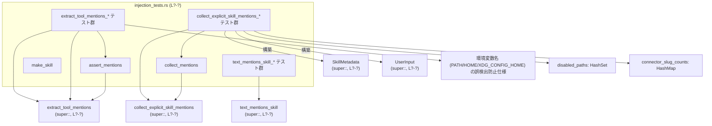
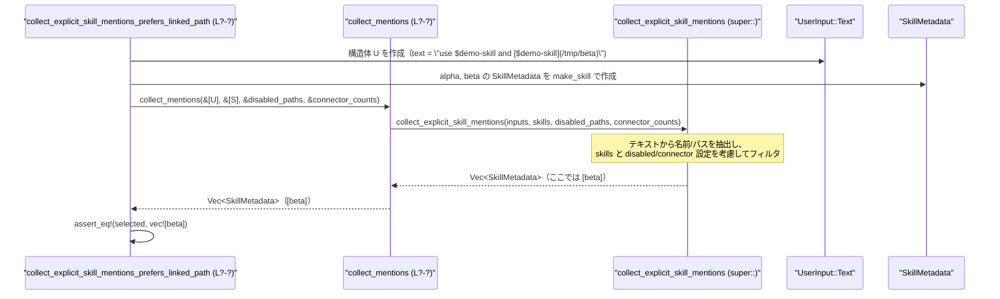

# core-skills/src/injection_tests.rs コード解説

## 0. ざっくり一言

このファイルは、ユーザー入力から「スキル」を特定するためのコア関数  
`text_mentions_skill`, `extract_tool_mentions`, `collect_explicit_skill_mentions` の**期待仕様をテストで定義しているモジュール**です。

---

## 1. このモジュールの役割

### 1.1 概要

- このテストモジュールは、ユーザーのテキスト／構造化入力からスキルを検出する処理が
  - どの文字パターンを「スキルの明示的な呼び出し」とみなすか  
  - 環境変数や曖昧な名前などを**誤検出しない**こと  
  - 構造化入力・無効パス・無効コネクタなどをどう扱うか  
を検証します。
- 対象となる関数は、親モジュール（`use super::*;`）で定義されている以下の3つです（実装はこのチャンクには含まれません）。
  - `text_mentions_skill`
  - `extract_tool_mentions`
  - `collect_explicit_skill_mentions`

### 1.2 アーキテクチャ内での位置づけ

このファイルは**テスト専用**であり、実際のロジックは親モジュール側にあります。  
テストから読み取れる依存関係は次の通りです。



※ `L?-?` は、このチャンクには行番号情報が無いため「不明」を意味します。

### 1.3 設計上のポイント

コードとテスト名から読み取れる設計上の特徴は次の通りです。

- **責務の分割**
  - 実際の解析ロジックは親モジュールの3関数に集中し、このファイルはその仕様をテストで定義します。
  - テスト内のヘルパ（`make_skill`, `assert_mentions`, `collect_mentions`）は、テスト記述を簡潔にするためだけに存在します。

- **スキル検出の仕様**
  - テキスト中の `$skill-name` を検出する際に、「前後の境界文字」を厳密に扱います（`text_mentions_skill_*` テスト群）。
  - Markdown 風のリンク `[$skill](/path/to/skill)` を解釈し、**名前とパスの両方**を取り出します（`extract_tool_mentions_*` テスト群）。
  - PATH, HOME などの**一般的な環境変数名はスキルとして扱わない**ことが明示されています。

- **優先順位と安全側の仕様**
  - 構造化入力 `UserInput::Skill` がある場合は、それを**テキストより優先**し、無効であればテキストへのフォールバックも行わず結果を空にします。
  - 同名スキルが複数ある場合の曖昧性は「何も選ばない」という安全側の挙動になっています。
  - コネクタ（`connector_slug_counts`）と同じ名前のスキルは、**プレーンな `$name` 参照では選ばれない**ようにされています。

- **エラーハンドリング方針**
  - `collect_explicit_skill_mentions` は `Vec<SkillMetadata>` を直接返し、  
    エラーや曖昧なケースは「空のベクタを返す」ことで表現されます（panic ではなく安全側）。

- **性能・安全性**
  - `$` が多数連続するケース（256 個）のテストがあり、`text_mentions_skill` がこのケースでもループせず終了することが保証されています。

---

## 2. 主要な機能一覧

このファイルが検証している主要な機能（= 親モジュールのAPIの仕様）は次の通りです。

- `$name` 形式のスキル参照検出
  - `text_mentions_skill` による、テキスト内の明示的なスキル名検出と境界判定。
- `$name` / `[$name](/path)` の両方に対応したツール・スキル参照抽出
  - `extract_tool_mentions` による、スキル名セットとパスセットの抽出。
- 環境変数名のスキップ
  - `$PATH`, `$HOME`, `$XDG_CONFIG_HOME` などをスキルとしてカウントしない。
- スキル名の字句解析ルール
  - `.` で名前を打ち切り、`_` や `:` を名前の一部として扱う。
- 構造化 vs テキスト入力の優先順位
  - `UserInput::Skill` を `UserInput::Text` より優先し、無効な構造化入力があればテキストへのフォールバックは行わない。
- disabled_paths / connector_slug_counts によるフィルタリング
  - 無効化されたパス、コネクタと競合するスキル名を安全に除外する。
- 曖昧名・重複パスの扱い
  - 同名スキルが複数ある場合や、複数回同じパスが参照される場合の挙動を明示（曖昧なら除外、パス重複はデデュープ）。

---

## 2.x コンポーネントインベントリー

### このファイルで定義される関数

| 名前 | 種別 | 公開範囲 | 役割 / 用途 | 根拠 |
|------|------|----------|-------------|------|
| `make_skill` | 通常関数 | モジュール内（テスト用） | 名前とパスから最小限の `SkillMetadata` を組み立てるテストヘルパー。`description`, `path_to_skills_md`, `scope` などもセットする。 | `core-skills/src/injection_tests.rs:L?-?` |
| `set` | 通常関数 | モジュール内（テスト用） | `&[&str]` から `HashSet<&str>` を生成するユーティリティ。期待値を集合として比較するために使用。 | 同上 |
| `assert_mentions` | 通常関数 | モジュール内（テスト用） | `extract_tool_mentions` の結果の `names` / `paths` が期待集合と一致するかをまとめて検査するヘルパー。 | 同上 |
| `collect_mentions` | 通常関数 | モジュール内（テスト用） | `collect_explicit_skill_mentions` への薄いラッパー。引数をそのまま渡し、返り値をそのまま返す。 | 同上 |
| `text_mentions_skill_requires_exact_boundary` | テスト関数 | `#[test]` | `$name` の直後の文字による境界条件（空白, `)`, `.` はOK、`s`, `_` はNG）を検証する。 | 同上 |
| `text_mentions_skill_handles_end_boundary_and_near_misses` | テスト関数 | `#[test]` | テキスト末尾の `$name` を検出しつつ、`$alpha-skillx` など似た名前を誤検出しないことを検証。 | 同上 |
| `text_mentions_skill_handles_many_dollars_without_looping` | テスト関数 | `#[test]` | `$` が256個連続するような入力でもループせず false を返すことを確認。 | 同上 |
| `extract_tool_mentions_handles_plain_and_linked_mentions` | テスト関数 | `#[test]` | `$alpha` と `[$beta](/tmp/beta)` が、それぞれ name / (name+path) として検出されることを検証。 | 同上 |
| `extract_tool_mentions_skips_common_env_vars` | テスト関数 | `#[test]` | `$PATH`, `[$HOME](/tmp/skill)`, `$XDG_CONFIG_HOME` をスキップし、スキルとして数えないことを検証。 | 同上 |
| `extract_tool_mentions_requires_link_syntax` | テスト関数 | `#[test]` | `[$beta]` のみでは path を検出せず、`[beta](/tmp/beta)` など `$` がない場合は完全に無視する仕様を検証。 | 同上 |
| `extract_tool_mentions_trims_linked_paths_and_allows_spacing` | テスト関数 | `#[test]` | `[$beta]   ( /tmp/beta )` のような空白に寛容で、path をトリムして `/tmp/beta` と認識することを検証。 | 同上 |
| `extract_tool_mentions_stops_at_non_name_chars` | テスト関数 | `#[test]` | `$alpha.skill` から `alpha` までを名前とし、`$beta_extra` は `_` を含めて `beta_extra` と認識することを検証。 | 同上 |
| `extract_tool_mentions_keeps_plugin_skill_namespaces` | テスト関数 | `#[test]` | `$slack:search` のような名前空間付きスキル名をそのまま `slack:search` として扱うことを検証。 | 同上 |
| `collect_explicit_skill_mentions_text_respects_skill_order` | テスト関数 | `#[test]` | テキスト中の出現順ではなく、`skills` 配列の順序（ここでは `[beta, alpha]`）が結果順序になることを検証。 | 同上 |
| `collect_explicit_skill_mentions_prioritizes_structured_inputs` | テスト関数 | `#[test]` | `UserInput::Skill` による構造化入力を、テキスト入力より優先すること（結果 `[beta, alpha]`）を検証。 | 同上 |
| `collect_explicit_skill_mentions_skips_invalid_structured_and_blocks_plain_fallback` | テスト関数 | `#[test]` | 構造化入力の `path` がどのスキルとも一致しない場合、テキストに有効な `$alpha-skill` があっても**何も選ばない**ことを検証。 | 同上 |
| `collect_explicit_skill_mentions_skips_disabled_structured_and_blocks_plain_fallback` | テスト関数 | `#[test]` | 構造化入力で指されたパスが `disabled_paths` に含まれている場合、同様にテキストへのフォールバックを行わず空結果にすることを検証。 | 同上 |
| `collect_explicit_skill_mentions_dedupes_by_path` | テスト関数 | `#[test]` | 同じ `[$alpha-skill](/tmp/alpha)` が複数回出てきても、パス単位で1つにデデュープされることを検証。 | 同上 |
| `collect_explicit_skill_mentions_skips_ambiguous_name` | テスト関数 | `#[test]` | 同名 `demo-skill` のスキルが複数ある場合、プレーンな `$demo-skill` 参照では曖昧のため何も選ばないことを検証。 | 同上 |
| `collect_explicit_skill_mentions_prefers_linked_path_over_name` | テスト関数 | `#[test]` | 同名スキルが複数ある場合でも、`[$demo-skill](/tmp/beta)` のような**パス指定**があれば `/tmp/beta` を持つスキルのみ選ぶことを検証。 | 同上 |
| `collect_explicit_skill_mentions_skips_plain_name_when_connector_matches` | テスト関数 | `#[test]` | `connector_slug_counts` に同名のコネクタ（ここでは `"alpha-skill"`）がある場合、プレーン `$alpha-skill` は無視されることを検証。 | 同上 |
| `collect_explicit_skill_mentions_allows_explicit_path_with_connector_conflict` | テスト関数 | `#[test]` | コネクタ衝突があっても、`[$alpha-skill](/tmp/alpha)` のようなパス指定は許可されることを検証。 | 同上 |
| `collect_explicit_skill_mentions_skips_when_linked_path_disabled` | テスト関数 | `#[test]` | `[$demo-skill](/tmp/alpha)` のパスが `disabled_paths` に含まれる場合、同名の別スキル `/tmp/beta` へのフォールバックも行わず空結果にすることを検証。 | 同上 |
| `collect_explicit_skill_mentions_prefers_resource_path` | テスト関数 | `#[test]` | `[$demo-skill](/tmp/beta)` で、同名スキルのうちパス `/tmp/beta` のものだけを選ぶことを検証（パス主導）。 | 同上 |
| `collect_explicit_skill_mentions_skips_missing_path_with_no_fallback` | テスト関数 | `#[test]` | `[$demo-skill](/tmp/missing)` のようにパスがどのスキルとも一致しない場合、同名スキルが複数あってもフォールバックしないことを検証。 | 同上 |
| `collect_explicit_skill_mentions_skips_missing_path_without_fallback` | テスト関数 | `#[test]` | 同様に、同名スキルが1つだけでも `/tmp/missing` にはフォールバックせず、空結果にすることを検証。 | 同上 |

### このファイルから利用される外部コンポーネント（型・関数）

| 名前 | 種別 | 定義場所 | 用途 / 振る舞い（このチャンクから分かる範囲） |
|------|------|----------|----------------------------------------------|
| `text_mentions_skill` | 関数 | 親モジュール（`super`） | テキスト中で `$<skill_name>` 形式のスキル参照があるかを `bool` で返す。境界判定や `$` の大量連続などのエッジケースがテストされている。 |
| `extract_tool_mentions` | 関数 | 親モジュール（`super`） | 文字列からスキル名とパスの集合を抽出する。戻り値の構造体には `names: HashSet<&str>`, `paths: HashSet<&str>` フィールドがある（`set` と `assert_eq!` の型から判明）。 |
| `collect_explicit_skill_mentions` | 関数 | 親モジュール（`super`） | `UserInput` 列と `SkillMetadata` 列、および `disabled_paths`, `connector_slug_counts` を元に、実際に有効なスキル一覧（`Vec<SkillMetadata>`）を返す。曖昧・無効なケースは空ベクタで表現される。 |
| `SkillMetadata` | 構造体 | 親モジュール | スキルのメタデータ。フィールドには少なくとも `name`, `description`, `short_description`, `interface`, `dependencies`, `policy`, `path_to_skills_md: PathBuf`, `scope: SkillScope` がある（`make_skill` より）。`Clone` を実装している（テストで `.clone()` 使用）。 |
| `UserInput` | 列挙体 | 親モジュール | ユーザー入力を表す。テストでは `Text { text: String, text_elements: Vec<_> }` と `Skill { name: String, path: PathBuf }` の2バリアントが登場。 |
| `codex_protocol::protocol::SkillScope` | 列挙体 | 外部クレート | スキルのスコープ。少なくとも `User` バリアントが存在する。 |
| `PathBuf` | 構造体 | 標準ライブラリ | ファイルパスを表す所有型。スキルの `path_to_skills_md` や、`UserInput::Skill` の `path` に使用。 |
| `HashSet`, `HashMap` | コレクション | 標準ライブラリ | スキル名／パス、無効パス集合、コネクタスラグのカウントマップとして利用。 |
| `pretty_assertions::assert_eq` | マクロ | 外部クレート | 通常の `assert_eq!` を差し替え、失敗時に見やすい差分表示を行う。 |

---

## 3. 公開 API と詳細解説

ここでは、このテストファイルから見える**コアAPIの仕様**をまとめます。  
実装は親モジュール側にありますが、テストから読み取れる挙動を中心に記述します。

### 3.1 型一覧（このファイルが前提とする主要な型）

| 名前 | 種別 | 役割 / 用途 | 根拠 |
|------|------|-------------|------|
| `SkillMetadata` | 構造体 | 単一スキルのメタデータ（名前、説明、スコープ、skills.md へのパスなど）を保持する。テストではスキル選択結果として `Vec<SkillMetadata>` が返る。 | `make_skill` 定義より |
| `UserInput` | 列挙体 | ユーザー入力をラップする。`Text` バリアントは自然文と補助情報、`Skill` バリアントはスキル名とパスを持つ。 | 各 `collect_explicit_skill_mentions_*` テストより |
| `Mentions<'a>`（仮称） | 構造体 | `extract_tool_mentions` の戻り値。`names: HashSet<&'a str>`, `paths: HashSet<&'a str>` フィールドを持つ。 | `assert_mentions` と `set` の型から |
| `SkillScope` | 列挙体 | スキルの利用スコープ。ここでは `SkillScope::User` を使用。 | `make_skill` より |
| `HashSet<T>` | 構造体 | 集合。名前・パス・無効パスの集合表現に使用。 | 全体 |
| `HashMap<K,V>` | 構造体 | 連想配列。`connector_slug_counts`（スキル名→コネクタ数）に利用。 | 各 collect 系テスト |

> ※ `Mentions` の型名はこのチャンクには登場しませんが、`mentions.names`/`mentions.paths` へのアクセスと型整合性から「そういう構造体が存在する」と言えます。

---

### 3.2 重要な関数の詳細

テストで直接重要視されている3つのコア関数について、テストから読み取れる仕様を整理します。

#### `text_mentions_skill(text: &str, skill_name: &str) -> bool` （親モジュール側）

**概要**

- テキスト `text` の中に、`$<skill_name>` という**明示的なスキル参照**が含まれるかどうかを判定する関数です。
- スキル名の前後の「境界文字」を考慮し、類似文字列を誤検出しないようにしています。

（実際のシグネチャは `AsRef<str>` などを使っている可能性がありますが、テストでは `&str` 2引数で呼び出されています。）

**引数**

| 引数名 | 型 | 説明 | 根拠 |
|--------|----|------|------|
| `text` | `&str` | ユーザー入力テキスト全体。 `$alpha-skill` のようなスキル参照が含まれるかを調べる対象。 | テスト全般より |
| `skill_name` | `&str` | 検索対象のスキル名（`"alpha-skill"`, `"notion-research-doc"` など）。 | 同上 |

**戻り値**

- `bool`  
  - `true`: `text` に `$<skill_name>` の有効な出現が1箇所以上ある。  
  - `false`: 有効な出現がない、または近いが条件を満たさない。

**内部処理の流れ（テストから読み取れる仕様）**

実装本体はこのチャンクにはありませんが、以下の挙動がテストから読み取れます。

1. `text` 内で `$` を起点にスキャンし、`$<skill_name>` に一致する箇所を探す。（`text_mentions_skill_handles_many_dollars_without_looping`）
2. `$<skill_name>` の直後の文字が**境界文字**であるかをチェックする。
   - 境界として許容される例: 空白, `)`, `.`, 行末。  
     - テスト: `"use $notion-research-doc please"`, `"($notion-research-doc)"`, `"$notion-research-doc."` で `true`。
   - 境界として**許容されない**例: アルファベットの続き、`_` など。  
     - テスト: `"$notion-research-docs"`, `"$notion-research-doc_extra"` で `false`。
3. テキスト中に少なくとも一つ有効な出現があれば `true` を返す。
   - `"$alpha-skillx and later $alpha-skill "` → 最初の `"$alpha-skillx"` は無視され、2つ目の `"$alpha-skill "` で `true` になる。
4. `$` が256個連続するなど、パターンとしてマッチしないケースでも、ループし続けず `false` を返す。（性能上の安全性）

**Examples（使用例）**

テストの簡略版です。

```rust
// 有効な境界例
assert!(text_mentions_skill("use $alpha-skill please", "alpha-skill"));  // スペース区切り
assert!(text_mentions_skill("($alpha-skill)", "alpha-skill"));          // 括弧
assert!(text_mentions_skill("$alpha-skill.", "alpha-skill"));           // ピリオド

// 無効な例（近いが別名）
assert!(!text_mentions_skill("$alpha-skillx", "alpha-skill"));          // 末尾のxで別名
assert!(!text_mentions_skill("$alpha-skill_extra", "alpha-skill"));     // `_` 以降も名前とみなされる
```

**Errors / Panics**

- テストからは、正常・異常問わず `bool` を返しており、panic を起こさない前提で書かれています。
- 明示的なエラー型（`Result`）は使用されていません。

**Edge cases（エッジケース）**

- `$` が大量に連続する文字列（256個）でも、無限ループにならず `false` を返す。
- 末尾がちょうどスキル名で終わるケース（`"$alpha-skill"`）も `true` になる。
- 似た名前（`$alpha-skillx`）が一部に含まれていても、どこかに正確な `$alpha-skill` があれば `true`。

**使用上の注意点**

- この関数は「スキル名が文字列として現れるか」を判定するだけであり、どのスキルメタデータに対応するかまでは判断しません（それは `collect_explicit_skill_mentions` の役割です）。
- 境界判定のルールはテストで固定されているため、`skill_name` に許可したい文字集合を変更したい場合はテストの見直しが必要になります。

---

#### `extract_tool_mentions(text: &str) -> Mentions<'_>` （親モジュール側）

**概要**

- 一つのテキスト文字列から
  - `$alpha` のような**プレーンなスキル名参照**
  - `[$beta](/tmp/beta)` のような**リンク付き参照**
- を解析し、名前とリンクパスの集合として返す関数です。

**引数**

| 引数名 | 型 | 説明 |
|--------|----|------|
| `text` | `&str` | ユーザーの自然文テキスト。`$name` や `[$name](/path)` が含まれうる。 |

**戻り値**

- 構造体 `Mentions<'a>`（型名はこのチャンクには出てこないが、そのような構造体が存在すると推定）で、少なくとも次のフィールドを持ちます。

| フィールド | 型 | 説明 | 根拠 |
|-----------|----|------|------|
| `names` | `HashSet<&str>` | テキスト中で検出されたスキル名（`$` やブラケットを除去した形）。 | `assert_mentions` と `set`、`assert_eq!` の型一致より |
| `paths` | `HashSet<&str>` | `[$name](/path)` 形式から抽出されたパス文字列。空であれば何も追加されない。 | 同上 |

**内部処理の流れ（テストから読み取れる仕様）**

1. テキストを走査し、`$name` パターンを検出して `names` セットに追加する。
   - 環境変数名 `$PATH`, `$XDG_CONFIG_HOME` など、特定の「よくある環境変数」は**スキップ**する。（`extract_tool_mentions_skips_common_env_vars`）
2. ブラケット+リンク構文を解析する。
   - `[$beta](/tmp/beta)` → `names` に `"beta"`, `paths` に `"/tmp/beta"` を追加。（`extract_tool_mentions_handles_plain_and_linked_mentions`）
   - `[$beta]()` のようにパスが空の場合 → `names` のみ追加し、`paths` は追加しない。（`extract_tool_mentions_requires_link_syntax`）
   - `[$beta] /tmp/beta` のように `()` がない場合 → `$beta` 部分をプレーンな `$beta` として扱い、`names` のみ追加。（同テスト）
   - `use [$beta]   ( /tmp/beta )` のように `]` と `(` の間、`(` と `)` の内側に空白があっても許容し、パスはトリムして `/tmp/beta` だけを格納。（`extract_tool_mentions_trims_linked_paths_and_allows_spacing`）
3. 環境変数名として知られているものがブラケット付きリンクで登場する場合もスキップ。
   - 例: `"use [$HOME](/tmp/skill)"` → `names` も `paths` も空。（`extract_tool_mentions_skips_common_env_vars`）
4. 名前の終端・構成文字のルール
   - `$alpha.skill` のような場合、`.` で名前を打ち切り `"alpha"` を格納。（`extract_tool_mentions_stops_at_non_name_chars`）
   - `$beta_extra` では `_` は名前の一部として扱われ `"beta_extra"` を格納。（同テスト）
   - `$slack:search` のように `:` を含む場合も、そのまま `"slack:search"` を1つの名前とする。（`extract_tool_mentions_keeps_plugin_skill_namespaces`）
5. `names` / `paths` は集合なので、重複する名前やパスがあっても1回だけ格納される。

**Examples（使用例）**

```rust
// テキストからスキル名とパスを抽出する例
let text = "use $alpha and [$beta](/tmp/beta)";
let mentions = extract_tool_mentions(text);

assert_eq!(mentions.names, set(&["alpha", "beta"]));   // $alpha, [$beta] の両方が検出される
assert_eq!(mentions.paths, set(&["/tmp/beta"]));       // パスはリンクからのみ抽出
```

**Errors / Panics**

- 戻り値は単純な構造体（`Result` ではない）であり、テストからはエラー時も panic せず、「見つからなかった要素は集合に含まれない」形で扱う方針であると読み取れます。
- 想定外の文字列（連続する `$` など）についても、テストは結果の妥当性のみ確認しており、panic は前提としていません。

**Edge cases（エッジケース）**

- 環境変数名（`PATH`, `HOME`, `XDG_CONFIG_HOME`）はプレーン／リンクどちらでもスキップ。
- `[$beta]()` → 名前だけ追加、パスは追加されない。
- `[$beta] /tmp/beta` → リンクではなく、名前だけ。
- `$alpha.skill` → `"alpha"` として扱う。
- `$slack:search` → `"slack:search"` として扱う（名前空間付きのプラグインスキル）。

**使用上の注意点**

- 返される `names` / `paths` は `&str` の集合であり、入力 `text` への参照と同じライフタイムを持つと考えられます（テスト内では `HashSet<&str>` 同士を比較しているため）。
  - そのため、`text` より長く生存させることはできません。
- 環境変数名のリストはコード側に固定で埋め込まれていると推定されるため、追加したい場合はテストと実装の両方に追記が必要です。

---

#### `collect_explicit_skill_mentions(

    inputs: &[UserInput],
    skills: &[SkillMetadata],
    disabled_paths: &HashSet<PathBuf>,
    connector_slug_counts: &HashMap<String, usize>,
) -> Vec<SkillMetadata>` （親モジュール側）

**概要**

- ユーザー入力（テキストおよび構造化入力）とスキル一覧を元に、
  - どのスキルが**明示的に呼び出されたか**
  - どのスキルはコネクタや無効化フラグと競合しているか
- を判断し、**実際に実行候補とすべき `SkillMetadata` のリスト**を返す関数です。

**引数**

| 引数名 | 型 | 説明 | 根拠 |
|--------|----|------|------|
| `inputs` | `&[UserInput]` | ユーザーの入力列。`UserInput::Text` と `UserInput::Skill` の両方を含みうる。 | 各 collect 系テスト |
| `skills` | `&[SkillMetadata]` | 全ての利用可能なスキル一覧。ここから「選ばれたスキル」だけが返り値に含まれる。 | 同上 |
| `disabled_paths` | `&HashSet<PathBuf>` | 無効化されたスキルの `path_to_skills_md` セット。ここに含まれるパスのスキルは候補から外される。 | `collect_explicit_skill_mentions_skips_disabled_*` テスト |
| `connector_slug_counts` | `&HashMap<String, usize>` | スキル名と同じ「スラグ」を持つコネクタの数。スキル名とコネクタ名が衝突する場合の扱いに使用される。 | `collect_explicit_skill_mentions_skips_plain_name_when_connector_matches` など |

**戻り値**

- `Vec<SkillMetadata>`  
  - 条件を満たすスキルのメタデータ一覧。
  - 順序や内容について、テストから以下の仕様が読み取れます。

**内部処理の流れ（テストから読み取れる仕様）**

実際のアルゴリズムはこのチャンクにはありませんが、挙動として次が成立しています。

1. **構造化入力 (`UserInput::Skill`) の優先処理**
   - `inputs` に `UserInput::Skill` が含まれている場合、まずそれらを解決しようとする。（`collect_explicit_skill_mentions_prioritizes_structured_inputs`）
   - それらの `name` と `path` を `skills` 内の `SkillMetadata` と照合する。
   - この照合が **1件でも無効**（存在しないパス、または `disabled_paths` に含まれるパス）であれば、  
     → テキスト入力によるフォールバックは行わず、結果は空の `Vec` となる。  
     （`*_blocks_plain_fallback` 系2テスト）

2. **構造化入力がない場合 / 無効にならなかった場合のテキスト解析**
   - `UserInput::Text` の内容について、`extract_tool_mentions` や `text_mentions_skill` 相当のロジックで名前／パスを抽出する（テストからは内部詳細は不明）。
   - `skills` 配列に含まれるスキルのみを候補とする。
   - テキスト中の出現順ではなく、**`skills` 配列の順序を維持**してフィルタリングする。  
     - 例：`skills = [beta, alpha]` かつテキスト `"first $alpha-skill then $beta-skill"` → 結果 `[beta, alpha]`（`collect_explicit_skill_mentions_text_respects_skill_order`）。

3. **重複・曖昧性の処理**
   - 同じスキルのパスが複数回参照されても、パス単位でデデュープされる。  
     - 例：`"[$alpha-skill](/tmp/alpha) and [$alpha-skill](/tmp/alpha)"` → 結果は `alpha` 1件のみ。（`collect_explicit_skill_mentions_dedupes_by_path`）
   - 同じ `name` を持ち、異なるパスを持つスキルが複数ある場合：
     - プレーンな `$demo-skill` のみの場合 → 曖昧なので**何も選ばない**。（`collect_explicit_skill_mentions_skips_ambiguous_name`）
     - `[$demo-skill](/tmp/beta)` のように **パス指定**がある場合 → そのパスに一致するスキルだけを選ぶ。（`collect_explicit_skill_mentions_prefers_linked_path_over_name`, `collect_explicit_skill_mentions_prefers_resource_path`）
     - `[$demo-skill](/tmp/missing)` のようにパスが一致しない場合 → 名前でのフォールバックは行わず、結果は空。（`*_skips_missing_path_*` の2テスト）

4. **コネクタとの競合処理**
   - `connector_slug_counts` に `skill.name` と同じキーが存在する場合：
     - プレーンな `$alpha-skill` の参照は、**コネクタと衝突するため無視**される。（`collect_explicit_skill_mentions_skips_plain_name_when_connector_matches`）
     - ただし `[$alpha-skill](/tmp/alpha)` のような **パス指定**があれば、それは有効として扱われる。（`collect_explicit_skill_mentions_allows_explicit_path_with_connector_conflict`）

5. **disabled_paths の優先処理**
   - 抽出されたパスが `disabled_paths` に含まれている場合、そのスキルは除外される。
   - 同名の別パスのスキルがあっても、**フォールバックは行わない**。  
     - 例：`[$demo-skill](/tmp/alpha)` が disabled で、`/tmp/beta` のスキルがあっても選ばない。（`collect_explicit_skill_mentions_skips_when_linked_path_disabled`）

**Examples（使用例）**

テストに近い簡略例です。

```rust
// スキル定義
let alpha = make_skill("alpha-skill", "/tmp/alpha");
let beta  = make_skill("beta-skill",  "/tmp/beta");
let skills = vec![alpha.clone(), beta.clone()];

// ユーザー入力: テキストと構造化入力の混在
let inputs = vec![
    UserInput::Text {
        text: "please run $alpha-skill".to_string(),
        text_elements: Vec::new(),
    },
    UserInput::Skill {
        name: "beta-skill".to_string(),
        path: PathBuf::from("/tmp/beta"),
    },
];

let disabled_paths = HashSet::new();
let connector_counts = HashMap::new();

let selected = collect_explicit_skill_mentions(
    &inputs,
    &skills,
    &disabled_paths,
    &connector_counts,
);

// 構造化入力 beta が優先され、次にテキストから alpha が選ばれる
assert_eq!(selected, vec![beta, alpha]);
```

**Errors / Panics**

- この関数は `Result` を返さず、エラーに相当する状況（曖昧な名前、無効な `path`、disabled なスキルなど）は**「空の `Vec` を返す」**ことで表現されています。
  - 例：無効な構造化入力があるとき、テキストに有効な `$alpha-skill` があっても `Vec::new()` が返る。
- テストからは、これらの状況で panic を起こしていないことが確認できます。

**Edge cases（エッジケース）**

- `inputs` に `UserInput::Skill` が含まれ、かつそれが無効な場合 → 結果は空、かつテキストへのフォールバックなし。
- 同名スキルが複数あり、プレーン `$name` だけがある場合 → 曖昧なため何も返さない。
- コネクタと同名のスキル名の場合 → プレーン `$name` では選ばないが、パス付き参照なら選ぶ。
- `disabled_paths` に含まれるパスのスキルは、パス指定であっても必ず除外される。

**使用上の注意点**

- 「何も返ってこない」理由が曖昧になりやすいため、呼び出し側で
  - 構造化入力が無効ではないか
  - `connector_slug_counts` に衝突するエントリがないか
  - `disabled_paths` に該当パスが含まれていないか
  を確認する必要がある場合があります。
- 結果の順序は `skills` の順序を基準にしており、テキスト中の登場順ではないことに注意が必要です。

---

### 3.3 その他の関数

テスト内ヘルパー関数は、主にテスト記述を簡略化するためのラッパーです。

| 関数名 | 役割（1 行） | 根拠 |
|--------|--------------|------|
| `make_skill` | 渡された名前とパスから、テストに必要な最小限の `SkillMetadata` を構築する。`scope` に `SkillScope::User` をセットし、他フィールドは `None` で埋める。 | `make_skill` 実装 |
| `set` | `&[&str]` から `HashSet<&str>` を生成し、期待される名前／パス集合の構築に使用。 | `set` 実装 |
| `assert_mentions` | `extract_tool_mentions` の戻り値 `mentions.names` / `mentions.paths` が期待集合と一致するかをまとめてチェックする。 | `assert_mentions` 実装 |
| `collect_mentions` | `collect_explicit_skill_mentions` の単純なラッパー。テスト側で呼びやすくするためのエイリアス。 | `collect_mentions` 実装 |

---

## 4. データフロー

ここでは、代表的なシナリオとして「構造化入力とテキストからスキルを決定する」流れを示します。

### シナリオ概要

- ユーザーはテキスト `"use $demo-skill and [$demo-skill](/tmp/beta)"` を送信。
- クライアントはこれを `UserInput::Text` として渡し、利用可能なスキル一覧（`SkillMetadata`）とともに `collect_explicit_skill_mentions` を呼び出します。
- 関数はテキストを解析し、パス `/tmp/beta` にマッチするスキルだけを選択して返します。

### シーケンス図



> 実際にどのような内部関数を呼んでいるか（`extract_tool_mentions` など）は、このチャンクのコードからは直接はわかりませんが、テスト内容から「テキスト解析 → スキルフィルタリング → Vec で返す」という流れになっていることが分かります。

---

## 5. 使い方（How to Use）

ここでは、このテストが前提としている API の典型的な使い方を、簡略なサンプルとしてまとめます。  
（実際のモジュールパスは `use super::*;` からは特定できないため、`crate::injection` は仮のものです。）

### 5.1 基本的な使用方法：テキスト中のスキル参照検出

```rust
// 実際のモジュールパスはこのチャンクからは不明
use crate::injection::{text_mentions_skill};

fn should_suggest_skill(user_text: &str) -> bool {
    // ユーザーが明示的に "$alpha-skill" と書いたかどうか
    text_mentions_skill(user_text, "alpha-skill")
}

fn example() {
    let text = "please run $alpha-skill for me";
    if should_suggest_skill(text) {
        // `$alpha-skill` が含まれているので、対応するスキルを候補に挙げる
    }
}
```

### 5.2 テキストから名前とパスを抽出する

```rust
// 型・モジュールパスは実際の定義に合わせて調整が必要
use crate::injection::extract_tool_mentions;

// $name や [$name](/path) を一度に解析したいとき
fn list_mentions(text: &str) {
    let mentions = extract_tool_mentions(text);

    // 検出されたスキル名
    for name in &mentions.names {
        println!("skill mention: {name}");
    }

    // 検出されたパス
    for path in &mentions.paths {
        println!("skill path mention: {path}");
    }
}
```

### 5.3 スキル一覧とユーザー入力から実際に実行するスキルを決める

```rust
use std::collections::{HashMap, HashSet};
use std::path::PathBuf;

// 仮想的なインポート。実際のモジュールパスはこのチャンクには出てきません。
use crate::injection::{collect_explicit_skill_mentions, SkillMetadata, UserInput};

fn choose_skills(
    inputs: Vec<UserInput>,
    skills: Vec<SkillMetadata>,
    disabled_paths: HashSet<PathBuf>,
    connector_slug_counts: HashMap<String, usize>,
) -> Vec<SkillMetadata> {
    collect_explicit_skill_mentions(
        &inputs,
        &skills,
        &disabled_paths,
        &connector_slug_counts,
    )
}
```

このように、`collect_explicit_skill_mentions` を呼び出す側は

- スキル一覧 `skills`
- 入力列 `inputs`
- 無効パス集合 `disabled_paths`
- コネクタ名のカウント `connector_slug_counts`

を用意するだけで、曖昧性・無効な指定・コネクタとの衝突などを含めた「安全側の選択結果」を一括して取得できます。

### 5.4 よくある間違い（テストから見える例）

```rust
// 間違い例: 構造化入力が無効なのに、テキストでの `$alpha-skill` 参照に期待している
let inputs = vec![
    UserInput::Text {
        text: "please run $alpha-skill".to_string(),
        text_elements: Vec::new(),
    },
    UserInput::Skill {
        name: "alpha-skill".to_string(),
        path: PathBuf::from("/tmp/missing"),  // skills に存在しない
    },
];

let selected = collect_explicit_skill_mentions(&inputs, &skills, &HashSet::new(), &HashMap::new());
// selected は空になる（テキストへのフォールバックは行われない）

// 正しい例: 構造化入力がない、または有効な構造化入力だけを渡す
let inputs = vec![
    UserInput::Text {
        text: "please run $alpha-skill".to_string(),
        text_elements: Vec::new(),
    },
];

let selected = collect_explicit_skill_mentions(&inputs, &skills, &HashSet::new(), &HashMap::new());
// alpha-skill を含む SkillMetadata が返ることが期待される
```

### 5.5 使用上の注意点（まとめ）

- `collect_explicit_skill_mentions`
  - 構造化入力 (`UserInput::Skill`) が含まれている場合、**それが無効なら全体が空になる**点に注意。
  - `connector_slug_counts` に同名のコネクタがある場合、プレーン `$name` ではスキルが選ばれない。
- `extract_tool_mentions`
  - 環境変数名をスキルとしてカウントしない仕様になっているため、追加の環境変数名をスキップしたい場合には、実装側のリストに加える必要がある。
- `text_mentions_skill`
  - スキル名の境界（後続文字）が仕様に影響するため、スキル名の命名規則を変更する際はテキストの「区切り方」も合わせて検討する必要があります。

---

## 6. 変更の仕方（How to Modify）

### 6.1 新しい機能を追加する場合（例：スキル名のパターン追加）

1. 親モジュール側で `text_mentions_skill` / `extract_tool_mentions` のロジックを拡張し、新しい文字種（例: 数字や別の記号）をスキル名として許可する。
2. このファイルに対応するテストケースを追加する。
   - 例: `extract_tool_mentions_handles_numeric_names` のような新テスト関数を追加し、期待される `names` / `paths` を `assert_mentions` で検証。
3. 既存テストが期待通りに通ることを確認し、仕様の後方互換性を維持するかどうかを判断する。

### 6.2 既存の機能を変更する場合（例：曖昧名の扱いを変えたい）

- 影響範囲の確認
  - `collect_explicit_skill_mentions_*` 系テストをすべて確認し、どのテストが現状の仕様を固定しているかを把握する。
  - 特に曖昧名 (`*_skips_ambiguous_name`)、無効パス (`*_skips_missing_path_*`)、コネクタ衝突 (`*_connector_*`) のテストは仕様の境界を表しています。
- 変更時の注意点
  - 「曖昧なら何も選ばない」という安全側仕様を「最初の一致にフォールバックする」などに変える場合、他の部分の安全性に影響しないかを検討する必要があります。
  - テキストと構造化入力の優先順位を変える場合は、`*_blocks_plain_fallback` の2つのテストの挙動をどうするかを明示的に決めてから変更するのが安全です。

---

## 7. 関連ファイル

このテストファイルと密接に関係するモジュール・外部依存は次の通りです（ファイルパスそのものはこのチャンクには現れません）。

| パス / モジュール | 役割 / 関係 |
|-------------------|------------|
| 親モジュール（`super`） | `text_mentions_skill`, `extract_tool_mentions`, `collect_explicit_skill_mentions`, `SkillMetadata`, `UserInput` など、本テストが対象としているコアロジックと型を提供する。ファイル名はこのチャンクには現れない。 |
| `codex_protocol::protocol` | `SkillScope` 型を提供し、`SkillMetadata` の `scope` フィールドで使用される。 |
| `pretty_assertions` クレート | `assert_eq` マクロを提供し、テスト失敗時の差分表示を改善するために利用。 |
| 標準ライブラリ `std::collections` | `HashMap`, `HashSet` を提供し、スキル名・パスのセットやコネクタカウント、無効パス集合の表現に利用。 |
| 標準ライブラリ `std::path::PathBuf` | スキルリソースのパス（`path_to_skills_md` や `UserInput::Skill.path`）の表現に使用。 |

このファイルはあくまで**テスト**ですが、ここで定義されている振る舞いが、親モジュールの API 契約（特にエッジケースや安全側の仕様）を実質的に規定しています。
