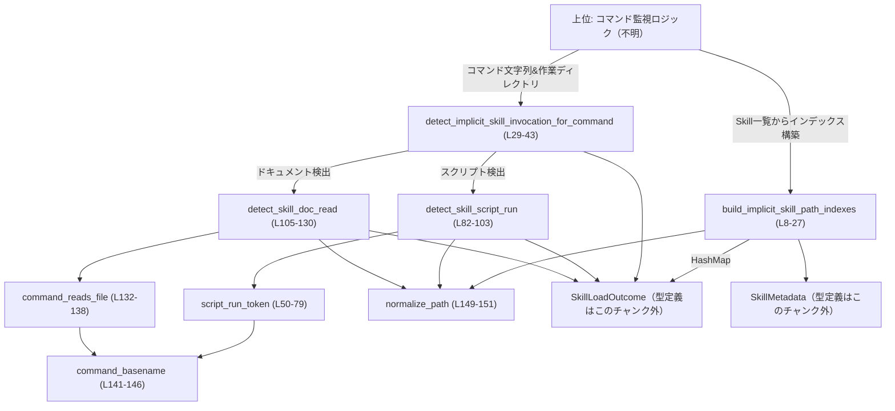
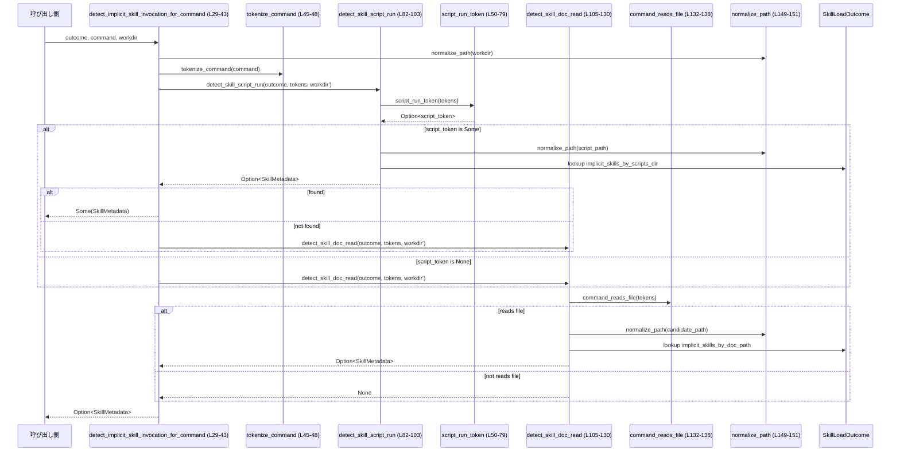

# core-skills/src/invocation_utils.rs コード解説

## 0. ざっくり一言

シェルコマンド文字列を解析し、「どの Skill（SkillMetadata）が暗黙的に呼び出されたか」を、スクリプト実行や Markdown ドキュメント閲覧から推定するユーティリティ群です（core-skills/src/invocation_utils.rs:L8-151）。

---

## 1. このモジュールの役割

### 1.1 概要

- このモジュールは、ユーザーが入力したシェルコマンドから **「どの Skill が使われたか」** を推定する問題を扱います。
- 具体的には、Skill のメタデータ `SkillMetadata` からパスベースのインデックスを構築し（スクリプトディレクトリ・ドキュメントパス）、それを用いて
  - `python scripts/foo.py` のような **スクリプト実行**
  - `cat skills/foo/skills.md` のような **ドキュメント閲覧**
  を Skill に紐付けます（core-skills/src/invocation_utils.rs:L8-27, L29-43, L82-103, L105-130）。

### 1.2 アーキテクチャ内での位置づけ

このモジュールは、Skill ロード結果 `SkillLoadOutcome` に含まれるインデックス（スクリプトディレクトリ / ドキュメントパス）を前提として、コマンド解析を行う位置づけです（core-skills/src/invocation_utils.rs:L5, L30, L82, L105）。



※ `SkillLoadOutcome` / `SkillMetadata` の実体定義はこのチャンクには現れませんが、フィールドアクセスから以下が分かります（core-skills/src/invocation_utils.rs:L17, L20, L97, L124）。

- `SkillMetadata` は少なくとも `path_to_skills_md` というパス型フィールドを持ちます。
- `SkillLoadOutcome` は少なくとも
  - `implicit_skills_by_scripts_dir: HashMap<PathBuf, SkillMetadata>`
  - `implicit_skills_by_doc_path: HashMap<PathBuf, SkillMetadata>`
  に相当するフィールドを持ちます。

### 1.3 設計上のポイント

- **責務の分離**
  - インデックス構築：`build_implicit_skill_path_indexes` が担います（core-skills/src/invocation_utils.rs:L8-27）。
  - コマンド解析の入口：`detect_implicit_skill_invocation_for_command`（core-skills/src/invocation_utils.rs:L29-43）。
  - スクリプト実行検出：`detect_skill_script_run` + `script_run_token`（core-skills/src/invocation_utils.rs:L50-79, L82-103）。
  - ファイル閲覧検出：`detect_skill_doc_read` + `command_reads_file`（core-skills/src/invocation_utils.rs:L105-130, L132-138）。
- **状態を持たない設計**
  - すべての関数は引数から結果を計算する純粋な関数であり、グローバルな可変状態は持ちません（core-skills/src/invocation_utils.rs:L8-151）。
- **パスの正規化方針**
  - `normalize_path` で `std::fs::canonicalize` を使い、できる限り実パスに正規化しますが、失敗した場合は元のパスをそのまま使います（core-skills/src/invocation_utils.rs:L149-151）。
- **エラーハンドリング**
  - 解析に失敗した場合は `Option<SkillMetadata>` で `None` を返す方針で、パニックを避けています（core-skills/src/invocation_utils.rs:L29-43, L50-80, L82-103, L105-130）。
- **並行性**
  - `unsafe` やスレッド共有状態は存在せず、同期処理のみです（core-skills/src/invocation_utils.rs:L1-151）。

---

## 2. 主要な機能一覧（コンポーネントインベントリー）

### 2.1 関数・モジュール一覧

| 名称 | 種別 | 可視性 | 役割 / 用途 | 行範囲 |
|------|------|--------|-------------|--------|
| `build_implicit_skill_path_indexes` | 関数 | `pub(crate)` | Skill 一覧からスクリプトディレクトリ / ドキュメントパスに基づくインデックスを構築する | core-skills/src/invocation_utils.rs:L8-27 |
| `detect_implicit_skill_invocation_for_command` | 関数 | `pub` | コマンド文字列と作業ディレクトリから、どの Skill が暗黙的に呼び出されたかを判定する入口 | core-skills/src/invocation_utils.rs:L29-43 |
| `tokenize_command` | 関数 | `fn` | シェルコマンド文字列をトークン（引数列）に分割する | core-skills/src/invocation_utils.rs:L45-48 |
| `script_run_token` | 関数 | `fn` | トークン列から「スクリプトパス」らしき引数を抽出する | core-skills/src/invocation_utils.rs:L50-79 |
| `detect_skill_script_run` | 関数 | `fn` | スクリプト実行コマンドから Skill を特定する | core-skills/src/invocation_utils.rs:L82-103 |
| `detect_skill_doc_read` | 関数 | `fn` | ファイル閲覧コマンド（cat など）から Skill を特定する | core-skills/src/invocation_utils.rs:L105-130 |
| `command_reads_file` | 関数 | `fn` | コマンドがファイル閲覧系ユーティリティ（cat, less など）か判定する | core-skills/src/invocation_utils.rs:L132-138 |
| `command_basename` | 関数 | `fn` | コマンドパスからベース名（ファイル名部分）を取り出す | core-skills/src/invocation_utils.rs:L141-146 |
| `normalize_path` | 関数 | `fn` | パスを canonicalize して正規化する（失敗時はそのまま返す） | core-skills/src/invocation_utils.rs:L149-151 |
| `tests` | モジュール | `mod`（cfg=test） | このモジュール用のテストコードを `invocation_utils_tests.rs` に配置 | core-skills/src/invocation_utils.rs:L153-155 |

### 2.2 提供機能（箇条書き）

- Skill メタデータからのパスインデックス構築
- コマンド文字列の shlex 風トークナイズ
- スクリプト実行（python, node, bash 等）からの Skill 推定
- ファイル閲覧（cat, less, sed 等）からの Skill 推定
- パス正規化（canonicalize ベース）

---

## 3. 公開 API と詳細解説

### 3.1 型一覧（構造体・列挙体など）

このファイル内に新しい型定義はありませんが、次の外部型を参照しています（定義はこのチャンクには現れません）。

| 名前 | 種別 | 役割 / 用途 | 根拠 |
|------|------|-------------|------|
| `SkillMetadata` | 型（詳細不明） | Skill のメタデータ。少なくとも `path_to_skills_md` というパス型フィールドを持つ | `path_to_skills_md.as_path()` / `.parent()` を呼んでいる（core-skills/src/invocation_utils.rs:L17, L20） |
| `SkillLoadOutcome` | 型（詳細不明） | Skill ロード結果。少なくとも `implicit_skills_by_scripts_dir` / `implicit_skills_by_doc_path` という `HashMap<PathBuf, SkillMetadata>` 互換のフィールドを持つ | `outcome.implicit_skills_by_scripts_dir.get` / `.implicit_skills_by_doc_path.get` を呼んでいる（core-skills/src/invocation_utils.rs:L97, L124） |

### 3.2 関数詳細（7 件）

#### `build_implicit_skill_path_indexes(skills: Vec<SkillMetadata>) -> (HashMap<PathBuf, SkillMetadata>, HashMap<PathBuf, SkillMetadata>)`

**概要**

- 引数の Skill 一覧から、
  - スクリプトディレクトリ（`<skills.md のディレクトリ>/scripts`）
  - skills.md 自体のパス
  をキーにした 2 つの `HashMap` を構築します（core-skills/src/invocation_utils.rs:L8-27）。

**引数**

| 引数名 | 型 | 説明 |
|--------|----|------|
| `skills` | `Vec<SkillMetadata>` | Skill メタデータの一覧。`path_to_skills_md` フィールドが利用されます（core-skills/src/invocation_utils.rs:L17, L20）。 |

**戻り値**

- `(by_scripts_dir, by_skill_doc_path)` のタプルです（core-skills/src/invocation_utils.rs:L26）。
  - `by_scripts_dir: HashMap<PathBuf, SkillMetadata>`  
    キーは Skill の `skills.md` があるディレクトリの `scripts` サブディレクトリ（正規化済み）です（core-skills/src/invocation_utils.rs:L20-22）。
  - `by_skill_doc_path: HashMap<PathBuf, SkillMetadata>`  
    キーは `skills.md` 自身のパス（正規化済み）です（core-skills/src/invocation_utils.rs:L17-18）。

**内部処理の流れ**

1. 2 つの空の `HashMap` を作成します（core-skills/src/invocation_utils.rs:L14-15）。
2. `skills` をループし、各 `SkillMetadata` について以下を行います（core-skills/src/invocation_utils.rs:L16-23）。
3. `skill.path_to_skills_md` を `normalize_path` で正規化し、ドキュメントパスをキーとして `by_skill_doc_path` に `skill.clone()` を登録します（core-skills/src/invocation_utils.rs:L17-18）。
4. `path_to_skills_md.parent()` が存在する場合、そのディレクトリに対する `scripts` サブディレクトリを構築し（`skill_dir.join("scripts")`）、`normalize_path` で正規化して `by_scripts_dir` に登録します（core-skills/src/invocation_utils.rs:L20-22）。
5. ループ終了後、2 つの `HashMap` をタプルで返します（core-skills/src/invocation_utils.rs:L26）。

**Examples（使用例）**

`SkillMetadata` / `SkillLoadOutcome` の実体定義はこのチャンクにないため、ここでは簡略化したダミー構造体で使用イメージを示します。

```rust
use std::collections::HashMap;
use std::path::PathBuf;

// 簡略化したダミー定義（実際の定義とは異なる可能性があります）
#[derive(Clone)]
struct SkillMetadata {
    path_to_skills_md: PathBuf,              // skills.md へのパス
}

struct SkillLoadOutcome {
    implicit_skills_by_scripts_dir: HashMap<PathBuf, SkillMetadata>, // scripts ディレクトリ -> Skill
    implicit_skills_by_doc_path: HashMap<PathBuf, SkillMetadata>,    // skills.md パス -> Skill
}

fn build_outcome(skills: Vec<SkillMetadata>) -> SkillLoadOutcome {
    // invocation_utils.rs の関数を呼び出してインデックスを構築する
    let (by_scripts_dir, by_skill_doc_path) =
        build_implicit_skill_path_indexes(skills); // Skill 一覧から 2 種類のインデックスを作る

    SkillLoadOutcome {
        implicit_skills_by_scripts_dir: by_scripts_dir, // 戻り値をそのまま格納
        implicit_skills_by_doc_path: by_skill_doc_path, // 同上
    }
}
```

**Errors / Panics**

- 本関数自体は `Result` を返さず、内部でも `unwrap` を使用していません。
- `normalize_path` は `std::fs::canonicalize` 失敗時にパニックせず、元の `PathBuf` を返します（core-skills/src/invocation_utils.rs:L149-151）。
- したがって、この関数がパニックする条件はコード上はありません。

**Edge cases（エッジケース）**

- `skills` が空のベクタの場合：  
  空の 2 つの `HashMap` が返されます（ループに一度も入らないため）（core-skills/src/invocation_utils.rs:L16-24）。
- `path_to_skills_md.parent()` が `None` の場合：  
  その Skill は `by_scripts_dir` には登録されず、`by_skill_doc_path` のみ登録されます（core-skills/src/invocation_utils.rs:L20-23）。
- 複数の Skill が同じ `skills.md` パスや `scripts` ディレクトリを共有する場合：  
  `HashMap::insert` の仕様により、**最後に挿入された Skill が残り、それ以前の値は上書きされます**（core-skills/src/invocation_utils.rs:L18, L22）。

**使用上の注意点**

- ファイルシステムに存在しないパスに対しては `canonicalize` が失敗し、非正規化のパスがキーとなる場合があります。  
  ただし、検出側でも `normalize_path` を使うため、一貫性は保たれます（core-skills/src/invocation_utils.rs:L17, L21, L94, L120-122）。
- 「1 つのディレクトリ / ドキュメントに複数の Skill を対応させる」ユースケースでは、上書き挙動に注意が必要です。

---

#### `detect_implicit_skill_invocation_for_command(outcome: &SkillLoadOutcome, command: &str, workdir: &Path) -> Option<SkillMetadata>`

**概要**

- コマンド文字列と作業ディレクトリを基に、`SkillLoadOutcome` のインデックスを参照して **どの Skill が暗黙的に呼び出されたかを検出** します（core-skills/src/invocation_utils.rs:L29-43）。
- スクリプト実行検出を優先し、見つからなければドキュメント閲覧検出を試みます。

**引数**

| 引数名 | 型 | 説明 |
|--------|----|------|
| `outcome` | `&SkillLoadOutcome` | Skill インデックス。`implicit_skills_by_scripts_dir` / `implicit_skills_by_doc_path` フィールドが利用されます（core-skills/src/invocation_utils.rs:L82-103, L105-130）。 |
| `command` | `&str` | ユーザーが実行したシェルコマンド文字列（例: `"python scripts/foo.py arg1"`）（core-skills/src/invocation_utils.rs:L31, L35）。 |
| `workdir` | `&Path` | コマンド実行時の作業ディレクトリ。相対パス解決に使われ、`normalize_path` で正規化されます（core-skills/src/invocation_utils.rs:L32, L34）。 |

**戻り値**

- `Some(SkillMetadata)`：コマンドから特定できる Skill が存在する場合、そのクローンを返します（内部で `.clone()` している箇所を参照）（core-skills/src/invocation_utils.rs:L98-99, L125-126）。
- `None`：どの Skill にも紐付けできなかった場合。

**内部処理の流れ**

1. `workdir` を `normalize_path` で正規化します（core-skills/src/invocation_utils.rs:L34）。
2. `tokenize_command` で `command` をトークン列に変換します（core-skills/src/invocation_utils.rs:L35）。
3. まず `detect_skill_script_run` を呼び出し、スクリプト実行による Skill 呼び出しを検出します（core-skills/src/invocation_utils.rs:L37-40）。
4. スクリプト実行検出に成功した場合、その `SkillMetadata` を `Some` で返します（core-skills/src/invocation_utils.rs:L37-40）。
5. 見つからなかった場合は `detect_skill_doc_read` を呼び出し、ファイル閲覧による Skill 呼び出しを検出し、その結果（`Option<SkillMetadata>`）をそのまま返します（core-skills/src/invocation_utils.rs:L42）。

**Examples（使用例）**

```rust
use std::path::Path;

// outcome はどこかで build_implicit_skill_path_indexes の結果から構築されている前提
fn detect_from_user_command(outcome: &SkillLoadOutcome) {
    let workdir = Path::new("/home/user/project"); // コマンド実行時の作業ディレクトリ

    // ユーザーが実行したコマンドの例: Python スクリプトを実行
    let command = "python scripts/my_skill.py --option value";

    // 暗黙的な Skill 呼び出しを検出する
    if let Some(skill) =
        detect_implicit_skill_invocation_for_command(outcome, command, workdir) // 入口関数を呼び出す
    {
        // Skill が検出された場合の処理（例: UI に表示するなど）
        // skill: SkillMetadata
        println!("Skill detected for command: {}", command); // 実例では Skill 名などを使う
    } else {
        // 対応する Skill が見つからなかった場合
        println!("No skill detected for command: {}", command);
    }
}
```

**Errors / Panics**

- 戻り値が `Option` であり、エラー時（検出できない場合）は `None` を返す実装です（core-skills/src/invocation_utils.rs:L37-43）。
- 内部で `unwrap` などのパニックを起こす呼び出しは使用されていません。

**Edge cases（エッジケース）**

- `command` が空文字、または空白のみの場合：  
  `tokenize_command` の結果が空ベクタとなり、スクリプト検出・ドキュメント検出ともに `None` となります（core-skills/src/invocation_utils.rs:L45-48, L50-57, L132-136）。
- `workdir` が存在しないディレクトリを指す場合：  
  `normalize_path` の `canonicalize` が失敗し、元のパスが使用されます（core-skills/src/invocation_utils.rs:L34, L149-151）。  
  その場合でも、インデックス構築時と同じ正規化ルールを使えば整合性は保たれます。

**使用上の注意点**

- この関数は **検出処理のみ** を行い、副作用は持ちません。検出結果に応じた処理（ログ記録・UI 更新など）は呼び出し側で行う必要があります。
- スクリプト実行検出を優先しているため、同一コマンドがスクリプト実行とファイル閲覧の両方に該当するようなケースでは、スクリプト側の検出結果が採用されます（core-skills/src/invocation_utils.rs:L37-42）。

---

#### `tokenize_command(command: &str) -> Vec<String>`

**概要**

- シェルコマンド文字列をトークン（引数列）に分割します。可能であれば `shlex::split` を使い、失敗した場合は単純な空白区切りにフォールバックします（core-skills/src/invocation_utils.rs:L45-48）。

**引数**

| 引数名 | 型 | 説明 |
|--------|----|------|
| `command` | `&str` | シェルコマンド文字列。シングルクォート / ダブルクォートを含む可能性があります（core-skills/src/invocation_utils.rs:L45-47）。 |

**戻り値**

- `Vec<String>`：分割されたトークン列。
  - `shlex::split` 成功時はシェルのクォート・エスケープ規則をある程度反映した分割になります。
  - 失敗時（構文エラーなど）は、空白文字で単純に分割した結果になります（core-skills/src/invocation_utils.rs:L47）。

**内部処理の流れ**

1. `shlex::split(command)` を呼び出します。戻り値は `Option<Vec<String>>` です（core-skills/src/invocation_utils.rs:L46）。
2. `Some(tokens)` ならそのまま返し、`None` の場合は `command.split_whitespace()` による分割結果を `String` に変換して返します（core-skills/src/invocation_utils.rs:L47）。

**Examples（使用例）**

```rust
fn demo_tokenize() {
    let cmd = r#"python "scripts/my skill.py" --option "with space""#; // 引数にスペースを含むコマンド

    let tokens = tokenize_command(cmd); // shlex::split によるトークナイズを試みる

    // 期待される形の一例（shlex が成功した場合）:
    // ["python", "scripts/my skill.py", "--option", "with space"]
    println!("{:?}", tokens);
}
```

**Errors / Panics**

- `shlex::split` が `None` を返してもパニックせず、フォールバック処理を行います（core-skills/src/invocation_utils.rs:L47）。
- 本関数内でパニックを引き起こすコードはありません。

**Edge cases（エッジケース）**

- クォートが閉じていないなどで `shlex::split` が失敗した場合：  
  `"python "scripts/foo.py"` のようなコマンドは単純な空白区切りになり、意図したトークナイズと異なる可能性があります（core-skills/src/inocation_utils.rs:L47）。
- 空文字・空白のみの入力：  
  `split_whitespace` は空ベクタを返します（core-skills/src/invocation_utils.rs:L47）。

**使用上の注意点**

- この関数はシェルごとの厳密な構文互換性を保証するものではなく、「shlex で解釈可能な範囲 + フォールバック」という性質を持ちます。
- コマンド解析に強く依存するロジックを追加する場合は、この挙動（フォールバック時はクォートが無視される）を前提に設計する必要があります。

---

#### `script_run_token(tokens: &[String]) -> Option<&str>`

**概要**

- トークン列から「スクリプト実行コマンド」であるかを判定し、該当する場合はスクリプトパスと思われるトークン（例: `"scripts/foo.py"`）を返します（core-skills/src/invocation_utils.rs:L50-79）。

**引数**

| 引数名 | 型 | 説明 |
|--------|----|------|
| `tokens` | `&[String]` | `tokenize_command` の結果など。`tokens[0]` にコマンド名、以降に引数が入っている前提です（core-skills/src/invocation_utils.rs:L56-65）。 |

**戻り値**

- `Some(&str)`：スクリプトパスと見なされたトークン。
- `None`：スクリプト実行と認識できなかった場合。

**内部処理の流れ**

1. `RUNNERS`（python, bash, node など）に含まれる実行環境かどうかを先頭トークンから判定します（core-skills/src/invocation_utils.rs:L51-52, L56-60）。
   - `command_basename` でベース名を取り出し、`to_ascii_lowercase`、さらに Windows 向けに `.exe` サフィックスを取り除いて比較します（core-skills/src/invocation_utils.rs:L56-59）。
2. 対象外のランタイムであれば `None` を返します（core-skills/src/invocation_utils.rs:L59-61）。
3. 先頭トークン以降の引数から、`"--"` または `-` で始まるオプションをスキップし、最初の非オプショントークンを `script_token` とみなします（core-skills/src/invocation_utils.rs:L63-69）。
4. `script_token` が `SCRIPT_EXTENSIONS`（`.py`, `.sh`, `.js`, `.ts`, `.rb`, `.pl`, `.ps1`）のいずれかで終わっていれば、`Some(script_token)` を返します（core-skills/src/invocation_utils.rs:L72-77）。
5. 条件を満たさなければ `None` を返します（core-skills/src/invocation_utils.rs:L79）。

**Examples（使用例）**

```rust
fn demo_script_run_token() {
    let cmd = "python -u scripts/my_skill.py arg1"; // -u オプション付きの Python スクリプト実行

    let tokens = tokenize_command(cmd); // ["python", "-u", "scripts/my_skill.py", "arg1"]

    let script = script_run_token(&tokens); // スクリプトトークンを抽出する

    assert_eq!(script, Some("scripts/my_skill.py")); // 最初の非オプション引数が返される想定
}
```

**Errors / Panics**

- `tokens.first()?` などにより、トークン列が空の場合は `None` を返すだけでパニックしません（core-skills/src/invocation_utils.rs:L56, L71, L79）。
- `unwrap` は使用しておらず、安全な `Option` の連鎖で実装されています。

**Edge cases（エッジケース）**

- `python -c "print(1)"` のような、「スクリプトファイルではなくコード文字列を受け取るコマンド」：
  - `-c` はオプションとしてスキップされ、その後にスクリプトファイルが続かなければ `None` になります（core-skills/src/invocation_utils.rs:L63-71）。
- `python ./scripts/my_skill` のように拡張子がないスクリプト：
  - `SCRIPT_EXTENSIONS` に一致しないため検出されません（core-skills/src/invocation_utils.rs:L72-75）。
- `node scripts/app.mjs` のような `.mjs` など未登録の拡張子：
  - 対応していない拡張子も検出されません。

**使用上の注意点**

- 対応するランタイム・拡張子は `RUNNERS` / `SCRIPT_EXTENSIONS` にハードコードされているため、新しいランタイムをサポートしたい場合はこれらの配列を変更する必要があります（core-skills/src/invocation_utils.rs:L51-54）。
- スクリプトファイル名をオプションより前に書くスタイル（`python script.py -u`）はサポートされていますが、オプションの後にスクリプトが来るパターンに依存しています（core-skills/src/invocation_utils.rs:L63-69）。

---

#### `detect_skill_script_run(outcome: &SkillLoadOutcome, tokens: &[String], workdir: &Path) -> Option<SkillMetadata>`

**概要**

- `script_run_token` でスクリプトパスを抽出し、そのパスの親ディレクトリ（および祖先ディレクトリ）を `implicit_skills_by_scripts_dir` インデックスと照合して Skill を特定します（core-skills/src/invocation_utils.rs:L82-103）。

**引数**

| 引数名 | 型 | 説明 |
|--------|----|------|
| `outcome` | `&SkillLoadOutcome` | スクリプトディレクトリ -> Skill のマップを含むインデックス（core-skills/src/invocation_utils.rs:L97）。 |
| `tokens` | `&[String]` | コマンドのトークン列。`script_run_token` にわたされます（core-skills/src/invocation_utils.rs:L87）。 |
| `workdir` | `&Path` | 作業ディレクトリ。相対スクリプトパスを絶対パスに解決するために使われます（core-skills/src/invocation_utils.rs:L85, L92）。 |

**戻り値**

- `Some(SkillMetadata)`：スクリプトパスがインデックスに紐付く Skill を持つ場合、そのクローンを返します（core-skills/src/invocation_utils.rs:L97-99）。
- `None`：該当なし、またはスクリプト実行と認識できない場合。

**内部処理の流れ**

1. `script_run_token(tokens)` を呼び出し、`script_token` を取得します。取得できなければ `None` を返します（core-skills/src/invocation_utils.rs:L87）。
2. `script_token` から `Path` オブジェクトを作成します（core-skills/src/invocation_utils.rs:L88）。
3. パスが絶対パスならそのまま、相対パスなら `workdir.join(script_path)` で作業ディレクトリ起点のパスに変換します（core-skills/src/invocation_utils.rs:L89-93）。
4. `normalize_path` でスクリプトパスを正規化します（core-skills/src/invocation_utils.rs:L94）。
5. `script_path.ancestors()`（パスの祖先をファイル自身からルートまで順に返すイテレータ）で各ディレクトリを辿りながら、`outcome.implicit_skills_by_scripts_dir.get(ancestor)` を探し、最初に見つかった Skill をクローンして返します（core-skills/src/invocation_utils.rs:L96-99）。
6. 見つからなければ `None` を返します（core-skills/src/invocation_utils.rs:L101-102）。

**Examples（使用例）**

```rust
use std::path::Path;

fn demo_detect_script_run(outcome: &SkillLoadOutcome) {
    let workdir = Path::new("/home/user/project");          // 作業ディレクトリ
    let cmd = "python scripts/my_skill.py arg1";            // スクリプト実行コマンド

    let tokens = tokenize_command(cmd);                     // トークン列に分解
    if let Some(skill) = detect_skill_script_run(outcome, &tokens, workdir) {
        // scripts ディレクトリ、またはその祖先が implicit_skills_by_scripts_dir に
        // 登録されていればここに到達する
        println!("Skill detected by script run: {:?}", skill.path_to_skills_md);
    }
}
```

**Errors / Panics**

- `script_run_token` が `None` を返す場合は即座に `None` を返すため、パニックはしません（core-skills/src/invocation_utils.rs:L87）。
- `normalize_path` の `canonicalize` 失敗時もパニックせず、元のパスを使用します（core-skills/src/invocation_utils.rs:L94, L149-151）。

**Edge cases（エッジケース）**

- スクリプトパスが存在しない場合でも
  - `canonicalize` が失敗し、未正規化のパスで `ancestors()` をたどることになります（core-skills/src/invocation_utils.rs:L94, L96）。
- インデックス登録時のパスと、実行時のパスにシンボリックリンクなどの差異がある場合：
  - 正規化の結果が一致すれば検出できますが、一致しない場合は検出できません。

**使用上の注意点**

- 祖先ディレクトリをすべて辿る実装のため、`scripts` より上位のディレクトリにもインデックスを張っている場合、より上位の Skill がマッチする可能性があります（core-skills/src/invocation_utils.rs:L96-99）。
- この関数は内部利用を想定した `fn` であり、外部からは通常 `detect_implicit_skill_invocation_for_command` を経由して使われます。

---

#### `detect_skill_doc_read(outcome: &SkillLoadOutcome, tokens: &[String], workdir: &Path) -> Option<SkillMetadata>`

**概要**

- `cat`, `less` などのファイル閲覧コマンドと、その第 1 引数以降のファイルパスを解析し、Skill の `skills.md` ドキュメントを読んでいるかどうかで Skill を特定します（core-skills/src/invocation_utils.rs:L105-130）。

**引数**

| 引数名 | 型 | 説明 |
|--------|----|------|
| `outcome` | `&SkillLoadOutcome` | ドキュメントパス -> Skill のマップを含むインデックス（core-skills/src/invocation_utils.rs:L124）。 |
| `tokens` | `&[String]` | コマンドトークン列。先頭トークンがファイル閲覧コマンドかどうかを `command_reads_file` で確認します（core-skills/src/invocation_utils.rs:L110）。 |
| `workdir` | `&Path` | 作業ディレクトリ。相対ドキュメントパスを解決するために使用します（core-skills/src/invocation_utils.rs:L108, L122）。 |

**戻り値**

- `Some(SkillMetadata)`：閲覧しているファイルパスが `implicit_skills_by_doc_path` に登録されている場合、その Skill のクローンを返します（core-skills/src/invocation_utils.rs:L124-126）。
- `None`：ファイル閲覧コマンドでない、または対象ファイルがインデックスに存在しない場合。

**内部処理の流れ**

1. 先頭トークンがファイル閲覧系コマンドかどうかを `command_reads_file(tokens)` で判定します。`false` の場合は `None` を返します（core-skills/src/invocation_utils.rs:L110-112）。
2. 先頭トークンを除いた引数列をループし、`-` で始まるオプションをスキップし、それ以外をファイルパス候補とします（core-skills/src/invocation_utils.rs:L114-117）。
3. `Path::new(token)` からパスを作り、絶対パスであればそのまま `normalize_path`、相対パスであれば `workdir.join(path)` を経て `normalize_path` します（core-skills/src/invocation_utils.rs:L118-123）。
4. 正規化した `candidate_path` をキーに、`outcome.implicit_skills_by_doc_path.get(&candidate_path)` を検索し、見つかればクローンして返します（core-skills/src/invocation_utils.rs:L124-126）。
5. いずれのファイルパスからも Skill が見つからなければ `None` を返します（core-skills/src/invocation_utils.rs:L129）。

**Examples（使用例）**

```rust
use std::path::Path;

fn demo_detect_doc_read(outcome: &SkillLoadOutcome) {
    let workdir = Path::new("/home/user/project");     // 作業ディレクトリ
    let cmd = "cat skills/my_skill/skills.md";         // Skill のドキュメントを cat しているコマンド

    let tokens = tokenize_command(cmd);                // ["cat", "skills/my_skill/skills.md"]

    if let Some(skill) = detect_skill_doc_read(outcome, &tokens, workdir) {
        println!("Skill doc read detected: {:?}", skill.path_to_skills_md);
    }
}
```

**Errors / Panics**

- `command_reads_file` が `false` を返せば即 `None` で終了するため、安全です（core-skills/src/invocation_utils.rs:L110-112）。
- `normalize_path` はパニックしない実装であり、`canonicalize` 失敗時は元のパスが使われます（core-skills/src/invocation_utils.rs:L120-123, L149-151）。

**Edge cases（エッジケース）**

- コマンドが `cat -n skills/my_skill/skills.md` のような場合：
  - `-n` はオプションとしてスキップされ、その後のファイルパスが候補になります（core-skills/src/invocation_utils.rs:L114-117）。
- 複数ファイルを読むコマンド（`cat file1.md file2.md`）：
  - 最初に `implicit_skills_by_doc_path` にマッチするファイルが見つかった時点で終了します（core-skills/src/invocation_utils.rs:L124-126）。
- 先頭トークンが `cat` などでない場合：
  - `command_reads_file` が `false` を返し、検出を行いません（core-skills/src/invocation_utils.rs:L110-112, L132-138）。

**使用上の注意点**

- 対応コマンドは `READERS` 配列で固定されており（cat, sed, head, tail, less, more, bat, awk）、これ以外のツール（例: `rg`, `grep` 等）は検出対象外です（core-skills/src/invocation_utils.rs:L132-133）。
- インデックス構築時と同じ `normalize_path` を用いることで、シンボリックリンクなどによるパスの揺れをある程度吸収しています。

---

#### `command_reads_file(tokens: &[String]) -> bool`

**概要**

- 先頭トークンのコマンド名が、ファイルを読むユーティリティ（cat, sed, head, tail, less, more, bat, awk）かどうかを判定します（core-skills/src/invocation_utils.rs:L132-138）。

**引数**

| 引数名 | 型 | 説明 |
|--------|----|------|
| `tokens` | `&[String]` | コマンドのトークン列。`tokens[0]` に実行ファイル名が入っている前提です（core-skills/src/invocation_utils.rs:L134-137）。 |

**戻り値**

- `true`：ファイル閲覧系コマンドであると判定された場合。
- `false`：トークン列が空、あるいは未対応のコマンド名である場合。

**内部処理の流れ**

1. トークン列が空の場合は `false` を返します（`let Some(program) = tokens.first() else { return false; };`）（core-skills/src/invocation_utils.rs:L134-136）。
2. 最初のトークンを `command_basename` でベース名に変換し、小文字化します（core-skills/src/invocation_utils.rs:L137）。
3. `READERS` 配列（`["cat", "sed", "head", "tail", "less", "more", "bat", "awk"]`）に含まれているかどうかを `contains` で判定します（core-skills/src/invocation_utils.rs:L132-133, L137-138）。

**Examples（使用例）**

```rust
fn demo_command_reads_file() {
    let tokens = tokenize_command("cat README.md"); // ["cat", "README.md"]
    assert!(command_reads_file(&tokens));           // cat は対応コマンド

    let tokens = tokenize_command("echo README.md");
    assert!(!command_reads_file(&tokens));          // echo は READERS に含まれない
}
```

**Errors / Panics**

- 空トークン列も安全に `false` を返すため、パニックはしません（core-skills/src/invocation_utils.rs:L134-136）。

**Edge cases（エッジケース）**

- フルパス指定（`/usr/bin/cat`）などにも対応します。  
  `command_basename` がファイル名部分のみを取り出すためです（core-skills/src/invocation_utils.rs:L137, L141-146）。
- 大文字・小文字の違い（`Cat`, `CAT` など）は `to_ascii_lowercase` により吸収されます（core-skills/src/invocation_utils.rs:L137）。

**使用上の注意点**

- 対応コマンド追加時は `READERS` 配列を更新する必要があります（core-skills/src/invocation_utils.rs:L132-133）。
- ファイルを暗黙的に読む他のツール（エディタ、grep系など）はここでは判定されません。

---

#### `command_basename(command: &str) -> String`

**概要**

- パスを含むかもしれないコマンド文字列から、ファイル名部分だけを取り出して返します（core-skills/src/invocation_utils.rs:L141-146）。

**引数**

| 引数名 | 型 | 説明 |
|--------|----|------|
| `command` | `&str` | 実行ファイルのパスまたは名前（例: `"python"`, `"/usr/bin/cat"`）（core-skills/src/invocation_utils.rs:L141-142）。 |

**戻り値**

- `String`：ベース名（`file_name`）。`to_str` が失敗した場合は入力文字列をそのまま返します（core-skills/src/invocation_utils.rs:L143-146）。

**内部処理の流れ**

1. `Path::new(command)` から `Path` を構築し、`file_name()` でファイル名部分を取得します（core-skills/src/invocation_utils.rs:L141-143）。
2. 得られた `OsStr` を `to_str()` で `&str` に変換し、`unwrap_or(command)` で失敗時には元の引数を使います（core-skills/src/invocation_utils.rs:L143-145）。
3. `.to_string()` で `String` を返します（core-skills/src/invocation_utils.rs:L146）。

**Examples（使用例）**

```rust
fn demo_command_basename() {
    assert_eq!(command_basename("python"), "python");               // ベース名のみ
    assert_eq!(command_basename("/usr/bin/cat"), "cat");            // フルパスからファイル名部分を抽出
}
```

**Errors / Panics**

- `unwrap_or` を使用しているため、`to_str` が失敗してもパニックせず、元の文字列を返します（core-skills/src/invocation_utils.rs:L143-145）。

**Edge cases（エッジケース）**

- 非 UTF-8 なパス：`to_str` が失敗し、`command` の文字列そのものが返されます。

**使用上の注意点**

- この関数はコマンド名の比較用に使われており（`script_run_token`, `command_reads_file`）、ベース名のみによる判定となる点に注意が必要です（core-skills/src/invocation_utils.rs:L57, L137）。

---

#### `normalize_path(path: &Path) -> PathBuf`

**概要**

- `std::fs::canonicalize` を用いてパスを正規化し、絶対パスに変換します。`canonicalize` が失敗した場合は元のパスをそのまま `PathBuf` にして返します（core-skills/src/invocation_utils.rs:L149-151）。

**引数**

| 引数名 | 型 | 説明 |
|--------|----|------|
| `path` | `&Path` | 正規化したいパス。存在しないパスを渡すことも可能です（core-skills/src/invocation_utils.rs:L149）。 |

**戻り値**

- `PathBuf`：正規化されたパス。`canonicalize` 失敗時は元のパスをコピーした `PathBuf`。

**内部処理の流れ**

1. `std::fs::canonicalize(path)` を呼び出します（core-skills/src/invocation_utils.rs:L150）。
2. 成功時はその結果を返し、エラー時は `unwrap_or_else(|_| path.to_path_buf())` で元のパスを `PathBuf` にして返します（core-skills/src/invocation_utils.rs:L150-151）。

**Examples（使用例）**

```rust
use std::path::Path;

fn demo_normalize_path() {
    let p = Path::new("./skills/../skills/my_skill/skills.md"); // 相対パスを含む
    let normalized = normalize_path(p);                         // canonicalize で正規化

    println!("normalized path: {}", normalized.display());      // 実行環境によって絶対パス表示
}
```

**Errors / Panics**

- `canonicalize` でエラーが起きても `unwrap_or_else` でハンドリングし、パニックしません（core-skills/src/invocation_utils.rs:L150-151）。

**Edge cases（エッジケース）**

- 存在しないパス：  
  `canonicalize` が失敗し、入力パスをそのまま返します。  
  したがって、「正規化済みとみなす」かどうかは呼び出し側の設計次第です。
- シンボリックリンク：  
  `canonicalize` が成功すればリンク先に解決されます。

**使用上の注意点**

- ファイルシステムに対して I/O を行うため、頻繁に大量のパスに対して呼び出すとパフォーマンスに影響する可能性があります。
- 本モジュールではインデックス構築・コマンド解析時ともに `normalize_path` を使うことで、パス解決の一貫性を保っています（core-skills/src/invocation_utils.rs:L17, L21, L34, L94, L120-122）。

---

### 3.3 その他の関数

| 関数名 | 役割（1 行） | 行範囲 |
|--------|--------------|--------|
| `tokenize_command` | シェルコマンド文字列を shlex ベースでトークナイズし、失敗時に空白区切りにフォールバックする | core-skills/src/invocation_utils.rs:L45-48 |

（詳細は上記 3.2 で解説済みのため、ここでは一覧のみです。）

---

## 4. データフロー

### 4.1 代表的な処理シナリオ：コマンドから Skill を検出する

`detect_implicit_skill_invocation_for_command` が呼ばれたときの大まかな処理の流れを示します（core-skills/src/invocation_utils.rs:L29-43, L45-48, L50-80, L82-103, L105-130）。



この図から分かる要点：

- **パス正規化** は呼び出し直後の作業ディレクトリ、およびスクリプト / ドキュメントパスで一貫して `normalize_path` を経由しています（core-skills/src/invocation_utils.rs:L34, L94, L120-122, L149-151）。
- コマンド解析フェーズは
  1. スクリプト実行検出 (`detect_skill_script_run`)
  2. ドキュメント閲覧検出 (`detect_skill_doc_read`)
  の二段階で行われ、最初に見つかった Skill が採用されます（core-skills/src/invocation_utils.rs:L37-42）。

---

## 5. 使い方（How to Use）

### 5.1 基本的な使用方法

以下は、Skill メタデータからインデックスを構築し、ユーザーのコマンドから Skill を検出する一連の流れの例です。

```rust
use std::collections::HashMap;
use std::path::{Path, PathBuf};

// 簡略化したダミー定義（実際の型とは異なる可能性があります）
#[derive(Clone)]
struct SkillMetadata {
    path_to_skills_md: PathBuf, // skills.md へのパス
}

struct SkillLoadOutcome {
    implicit_skills_by_scripts_dir: HashMap<PathBuf, SkillMetadata>, // scripts ディレクトリ -> Skill
    implicit_skills_by_doc_path: HashMap<PathBuf, SkillMetadata>,    // skills.md パス -> Skill
}

fn main() {
    // 1. Skill メタデータ一覧を用意する
    let skills = vec![
        SkillMetadata {
            path_to_skills_md: PathBuf::from("skills/my_skill/skills.md"), // 1つ目の Skill
        },
        // ほかの Skill も続く…
    ];

    // 2. invocation_utils の関数でインデックスを構築する
    let (by_scripts_dir, by_skill_doc_path) =
        build_implicit_skill_path_indexes(skills); // skills.md と scripts ディレクトリのマップを作る

    // 3. SkillLoadOutcome を組み立てる（実際のコードでは別の場所で構築している可能性があります）
    let outcome = SkillLoadOutcome {
        implicit_skills_by_scripts_dir: by_scripts_dir,   // scripts ディレクトリ用インデックス
        implicit_skills_by_doc_path: by_skill_doc_path,   // skills.md 用インデックス
    };

    // 4. ユーザーのコマンドと作業ディレクトリを用意する
    let workdir = Path::new("/home/user/project");        // コマンド実行時の作業ディレクトリ
    let command = "python skills/my_skill/scripts/run.py"; // 実行されたコマンド

    // 5. コマンドから暗黙的な Skill 呼び出しを検出する
    if let Some(skill) =
        detect_implicit_skill_invocation_for_command(&outcome, command, workdir) // 代表的なエントリポイント
    {
        println!("Detected skill doc: {:?}", skill.path_to_skills_md); // 検出された Skill の情報を利用する
    } else {
        println!("No skill detected for command: {}", command);         // 見つからなかった場合の処理
    }
}
```

このフローでは、モジュールが **インデックス構築** と **コマンド解析** の 2 段階で利用されていることが分かります。

### 5.2 よくある使用パターン

1. **スクリプト実行からの Skill 検出**

```rust
let command = "python scripts/my_skill.py --opt 1"; // Python スクリプトを実行
let skill = detect_implicit_skill_invocation_for_command(&outcome, command, workdir);
// scripts ディレクトリが implicit_skills_by_scripts_dir に登録されていれば Some(SkillMetadata)
```

1. **Skill ドキュメント閲覧からの Skill 検出**

```rust
let command = "cat skills/my_skill/skills.md";      // skills.md を閲覧
let skill = detect_implicit_skill_invocation_for_command(&outcome, command, workdir);
// skills.md のパスが implicit_skills_by_doc_path に登録されていれば Some(SkillMetadata)
```

1. **検出に失敗するパターン（仕様上の非対応例）**

```rust
let command = "./scripts/my_skill.py";              // 直接実行（python などのランタイム指定なし）
let skill = detect_implicit_skill_invocation_for_command(&outcome, command, workdir);
// RUNNERS 配列にマッチしないため、スクリプト実行としては検出されない
```

### 5.3 よくある間違い

```rust
// 間違い例: Skill インデックスを構築せずに detect_implicit_skill_invocation_for_command を使う
let outcome = SkillLoadOutcome {
    implicit_skills_by_scripts_dir: HashMap::new(), // 空のまま
    implicit_skills_by_doc_path: HashMap::new(),    // 空のまま
};
let command = "python skills/my_skill/scripts/run.py";
let result = detect_implicit_skill_invocation_for_command(&outcome, command, workdir);
// -> 常に None が返る

// 正しい例: build_implicit_skill_path_indexes を通じてインデックスを構築してから使う
let (scripts_idx, doc_idx) = build_implicit_skill_path_indexes(skills); // skills 一覧から構築
let outcome = SkillLoadOutcome {
    implicit_skills_by_scripts_dir: scripts_idx,
    implicit_skills_by_doc_path: doc_idx,
};
let result = detect_implicit_skill_invocation_for_command(&outcome, command, workdir);
// -> パスが一致すれば Some(SkillMetadata)
```

### 5.4 使用上の注意点（まとめ）

- **事前条件**
  - `SkillLoadOutcome` の `implicit_skills_by_scripts_dir` / `implicit_skills_by_doc_path` が、`build_implicit_skill_path_indexes` と同じ正規化方針で構築されていること（core-skills/src/invocation_utils.rs:L8-27, L82-103, L105-130）。
- **コマンド解析の制約**
  - スクリプト検出は `RUNNERS` / `SCRIPT_EXTENSIONS` によって限定されます（core-skills/src/invocation_utils.rs:L51-54）。
  - ドキュメント検出は `READERS` に列挙されたコマンドに限定されます（core-skills/src/invocation_utils.rs:L132-133）。
- **パフォーマンス**
  - `normalize_path` が `canonicalize` を呼ぶため、ファイルシステムアクセスが発生します（core-skills/src/invocation_utils.rs:L149-151）。大量のコマンドを高頻度で解析する場合は、キャッシュなどの検討が必要になる可能性があります。
- **並行性**
  - 本モジュールはスレッド安全な純粋関数のみで構成されており、外部から同じ `SkillLoadOutcome` を読み取り専用で共有する分には競合は発生しません。

---

## 6. 変更の仕方（How to Modify）

### 6.1 新しい機能を追加する場合

1. **新しいスクリプトランタイムを対応させる**
   - 例: `php` スクリプトなどを検出したい場合：
     1. `script_run_token` 内の `RUNNERS` 配列に `"php"` を追加します（core-skills/src/invocation_utils.rs:L51-53）。
     2. 必要であれば `SCRIPT_EXTENSIONS` に `".php"` を追加します（core-skills/src/invocation_utils.rs:L54）。
2. **新しいファイル閲覧コマンドを対応させる**
   - 例: `rg` などに対応したい場合：
     1. `command_reads_file` の `READERS` 配列にコマンド名を追加します（core-skills/src/invocation_utils.rs:L132-133）。
3. **別種の「暗黙的 Skill 呼び出し」検出ロジックを追加する**
   - 新しい検出関数（例: `detect_skill_something_else`）を定義し、`detect_implicit_skill_invocation_for_command` の中で既存のスクリプト検出・ドキュメント検出の前後に呼び出す構造にできます（core-skills/src/invocation_utils.rs:L37-42）。

### 6.2 既存の機能を変更する場合

- **インデックス構築を変更する**
  - `build_implicit_skill_path_indexes` の戻り値は `detect_skill_script_run` / `detect_skill_doc_read` から利用される前提があるため、キーの意味（scripts ディレクトリ / skills.md パス）を変更する場合は、両検出関数のロジックも連動して変更する必要があります（core-skills/src/invocation_utils.rs:L17-22, L96-99, L124-126）。
- **パス正規化の挙動を変える**
  - `normalize_path` を変更すると、インデックス構築と検出の両方に影響します（core-skills/src/invocation_utils.rs:L17, L21, L34, L94, L120-122, L149-151）。  
    変更前に、既存のインデックスとの互換性（例: すでに保存済みのパスとの一致性）に注意が必要です。
- **Skill 間の競合解消ロジックを追加する**
  - 現在は「最後に登録された Skill が勝つ」単純な上書き方式です（core-skills/src/invocation_utils.rs:L18, L22）。  
    これを変える場合（例: 複数 Skill を保持したい）は、`HashMap<PathBuf, Vec<SkillMetadata>>` のようなデータ構造に変更し、検出側も複数候補を扱えるようにする必要があります。

---

## 7. 関連ファイル

| パス / シンボル | 役割 / 関係 |
|----------------|------------|
| `core-skills/src/invocation_utils_tests.rs` | このモジュールのテストコード。`#[path = "invocation_utils_tests.rs"] mod tests;` で参照されています（core-skills/src/invocation_utils.rs:L153-155）。内容はこのチャンクには現れません。 |
| `crate::SkillMetadata` | Skill メタデータ型。本モジュールでパス情報を利用していますが、定義はこのチャンクには現れません（core-skills/src/invocation_utils.rs:L5, L17, L20）。 |
| `crate::SkillLoadOutcome` | Skill ロード結果型。`implicit_skills_by_scripts_dir` / `implicit_skills_by_doc_path` フィールドが利用されていますが、定義はこのチャンクには現れません（core-skills/src/invocation_utils.rs:L5, L82, L97, L105, L124）。 |
| 外部クレート `shlex` | `tokenize_command` でコマンド文字列を解析するために使用されています（core-skills/src/invocation_utils.rs:L45-47）。Cargo.toml での依存定義はこのチャンクには現れません。 |

---

### Bugs / Security（簡潔なコメント）

- 現状のコードから明確なクラッシュバグや `panic!` 条件は読み取れません（`unwrap` が `canonicalize` のエラーに対しては使用されていないため）（core-skills/src/invocation_utils.rs:L149-151）。
- セキュリティ面では、**コマンドのトークナイズに `shlex::split` + フォールバック** を用いているため、「パース不能なコマンド」は単純な空白区切りで扱われ、意図しないトークン分割になる可能性がありますが、これは detection 失敗（`None`）につながる程度であり、ここから直接的な安全性の問題は読み取れません（core-skills/src/invocation_utils.rs:L45-48）。

### Tests について

- テストモジュールが別ファイルとして存在することのみ分かります（core-skills/src/invocation_utils.rs:L153-155）。
- テスト内容（どのケースを網羅しているか）はこのチャンクには現れないため、「ドキュメント閲覧コマンドの全種類をテストしているか」「シンボリックリンクを含むパスの扱い」などの詳細は不明です。
