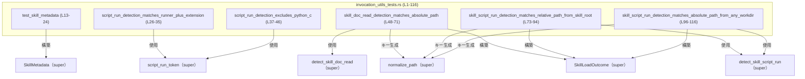
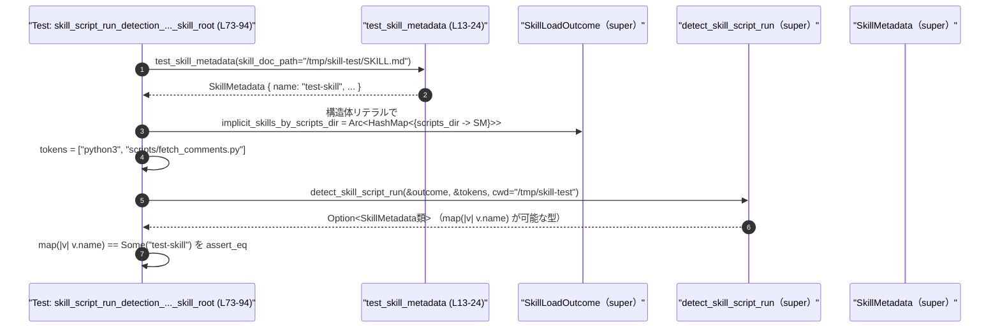

# core-skills/src/invocation_utils_tests.rs コード解説

## 0. ざっくり一言

`script_run_token`, `detect_skill_doc_read`, `detect_skill_script_run` など、コマンドライン呼び出し解析系の関数が期待どおりにスキルを検出できるかどうかをテストするモジュールです（invocation_utils_tests.rs:L26-116）。  
`SkillMetadata` と `SkillLoadOutcome` を組み立て、Python スクリプト実行や `SKILL.md` 読み取りの検出条件を確認します（L13-24, L48-56, L73-81, L96-104）。

---

## 1. このモジュールの役割

### 1.1 概要

- このモジュールは **コマンドラインのトークン列からスキルを検出するユーティリティ関数** の振る舞いを検証するためのテスト群です。
- `python3` 実行時のトークン列や `cat SKILL.md | head` のようなトークン列を与え、スキル検出ロジックが `SkillMetadata` を正しく返すかどうかを確認します（invocation_utils_tests.rs:L26-35, L37-46, L48-71, L73-94, L96-116）。
- スキル定義のドキュメントパス・スクリプトディレクトリを `SkillLoadOutcome` に設定し、検出ロジックとの整合性をテストします（L48-56, L73-81, L96-104）。

### 1.2 アーキテクチャ内での位置づけ

このファイルは **テストモジュール** であり、実装本体はすべて `super` モジュールにあります（`SkillLoadOutcome`, `SkillMetadata`, `detect_skill_doc_read`, `detect_skill_script_run`, `normalize_path`, `script_run_token`）（invocation_utils_tests.rs:L1-6, L13-24, L48-56, L73-81, L96-104）。



- 上記は本チャンク（invocation_utils_tests.rs:L1-116）内の依存関係を示しています。
- テストはすべて `super` モジュールの関数・構造体に依存し、その挙動を検証しています。

### 1.3 設計上のポイント

- **テスト専用ヘルパーの定義**  
  `test_skill_metadata` でテスト用の `SkillMetadata` を一貫した内容で生成し、複数テストで再利用しています（invocation_utils_tests.rs:L13-24）。

- **マップキーの正規化**  
  `SkillLoadOutcome` の `implicit_skills_by_doc_path` と `implicit_skills_by_scripts_dir` のキーを `normalize_path` で正規化した `PathBuf` にしており（L50-52, L76, L99）、検出関数側も同じ規則でパスを扱う前提になっています（この点はテストからの推測です）。

- **共有所有権（Arc）の利用**  
  `SkillLoadOutcome` のマップフィールドは `Arc<HashMap<...>>` でラップされており（L53-55, L78-80, L101-103）、複数箇所から共有される設計であることが示唆されます。Rust の `Arc` はスレッド安全な参照カウント型であり、並行環境での共有に対応できます。

- **エラー処理はテストフレームワークに委譲**  
  テスト内では `Result` 型や `panic!` を直接扱わず、`assert_eq!` による検証のみで失敗を表現しています（L34, L45, L67-70, L90-93, L113-116）。テスト失敗は `assert_eq!` のパニックとして現れます。

---

## 2. 主要な機能一覧

このファイルが提供する（＝検証している）主な機能・シナリオは次のとおりです。

- **Python スクリプト実行の検出（ポジティブケース）**  
  `python3 -u scripts/fetch_comments.py` のようなトークン列から、`script_run_token` がスクリプト実行を検出できることを確認します（invocation_utils_tests.rs:L26-35）。

- **Python インラインコード実行の除外（ネガティブケース）**  
  `python3 -c "print(1)"` のように `-c` オプションでインラインコードを実行するケースでは、`script_run_token` が「スクリプト実行」とみなさないことを確認します（L37-46）。

- **SKILL.md の読み取り検出**  
  `SkillLoadOutcome.implicit_skills_by_doc_path` に登録された絶対パス `/tmp/skill-test/SKILL.md` に対して、`cat /tmp/skill-test/SKILL.md | head` のようなコマンドから `detect_skill_doc_read` が該当スキルを検出できることを確認します（L48-71）。

- **スキルルートからの相対スクリプトパス検出**  
  カレントディレクトリがスキルルート `/tmp/skill-test` のときに、`python3 scripts/fetch_comments.py` という相対パス呼び出しを `detect_skill_script_run` が検出できることを確認します（L73-94）。

- **任意の作業ディレクトリからの絶対スクリプトパス検出**  
  カレントディレクトリが `/tmp/other` のようにスキルルート外の場合でも、`python3 /tmp/skill-test/scripts/fetch_comments.py` のような絶対パス呼び出しから `detect_skill_script_run` がスキルを検出できることを確認します（L96-116）。

### 2.1 コンポーネント一覧（関数・テスト・外部依存）

#### 本ファイル内で定義される関数

| 名前 | 種別 | 役割 / 用途 | 定義位置 |
|------|------|------------|----------|
| `test_skill_metadata` | ヘルパー関数 | テスト用の `SkillMetadata` インスタンスを生成する | invocation_utils_tests.rs:L13-24 |
| `script_run_detection_matches_runner_plus_extension` | テスト関数 | `script_run_token` がスクリプトファイル実行を検出するポジティブケース | L26-35 |
| `script_run_detection_excludes_python_c` | テスト関数 | `script_run_token` が `python -c` 形式のインライン実行を除外するネガティブケース | L37-46 |
| `skill_doc_read_detection_matches_absolute_path` | テスト関数 | `detect_skill_doc_read` が SKILL.md の絶対パス読み取りを検出できるかを確認 | L48-71 |
| `skill_script_run_detection_matches_relative_path_from_skill_root` | テスト関数 | スキルルートからの相対スクリプトパスを `detect_skill_script_run` が検出できるかを確認 | L73-94 |
| `skill_script_run_detection_matches_absolute_path_from_any_workdir` | テスト関数 | 任意の作業ディレクトリからの絶対スクリプトパスを `detect_skill_script_run` が検出できるかを確認 | L96-116 |

#### 本ファイルが利用する主な外部コンポーネント

| 名前 | 種別 | 役割 / 用途 | 出現位置 | 定義位置 |
|------|------|------------|----------|----------|
| `SkillMetadata` | 構造体 | スキル名・説明・SKILL.md パスなどのメタデータ | L13-24, L52, L77, L100 | `super` モジュール（このチャンクには定義なし） |
| `SkillLoadOutcome` | 構造体 | 暗黙的に検出されたスキルを、スクリプトディレクトリやドキュメントパスに紐づけて保持 | L1, L53-56, L78-81, L101-104 | `super` モジュール |
| `detect_skill_doc_read` | 関数 | トークン列から SKILL.md 読み取りを検出し、関連スキルを返す | L3, L65 | `super` モジュール |
| `detect_skill_script_run` | 関数 | トークン列からスクリプト実行を検出し、関連スキルを返す | L4, L88, L111 | `super` モジュール |
| `normalize_path` | 関数 | パスを正規化して `PathBuf` として扱う | L5, L51, L76, L99 | `super` モジュール |
| `script_run_token` | 関数 | トークン列からスクリプト実行を表すトークンを抽出する | L6, L34, L45 | `super` モジュール |
| `SkillScope::User` | 列挙体のバリアント | スキルのスコープを「ユーザー」として指定 | L22 | `codex_protocol::protocol` クレート |

`super` モジュールや `codex_protocol` クレートの実ファイルパスは、このチャンクからは分かりません。

---

## 3. 公開 API と詳細解説

このファイル自体はライブラリの公開 API を定義していませんが、テストとして重要な関数と、テストから分かる範囲の外部関数の契約を整理します。

### 3.1 型一覧（構造体・列挙体など：使用側視点）

| 名前 | 種別 | 役割 / 用途 | フィールド / 特徴（このファイルから分かる範囲） | 出現位置 |
|------|------|------------|----------------------------------------------|----------|
| `SkillMetadata` | 構造体 | スキル定義のメタデータを保持 | フィールド: `name`, `description`, `short_description`, `interface`, `dependencies`, `policy`, `path_to_skills_md`, `scope`（invocation_utils_tests.rs:L14-22） | L13-24, L52, L77, L100 |
| `SkillLoadOutcome` | 構造体 | 暗黙的に検出されたスキルを複数のマップで保持する | フィールド: `implicit_skills_by_scripts_dir`, `implicit_skills_by_doc_path` を明示的に設定し、それ以外は `Default` に任せている（L53-56, L78-81, L101-104） | L1, L53-56, L78-81, L101-104 |
| `SkillScope` | 列挙体 | スキルのスコープ種別を表す | `User` バリアントが存在する（L22） | L22 |

> `SkillMetadata` や `SkillLoadOutcome` の完全な定義（他フィールドやメソッド）は、このチャンクには現れません。

### 3.2 関数詳細（このファイルで定義される 6 件）

#### `test_skill_metadata(skill_doc_path: PathBuf) -> SkillMetadata`

**概要**

テスト用に一定の内容を持った `SkillMetadata` インスタンスを生成するヘルパー関数です（invocation_utils_tests.rs:L13-24）。

**引数**

| 引数名 | 型 | 説明 |
|--------|----|------|
| `skill_doc_path` | `PathBuf` | SKILL.md ファイルへのパス。`SkillMetadata.path_to_skills_md` にそのまま格納されます（L21）。 |

**戻り値**

- `SkillMetadata`  
  - `name` は `"test-skill"`、`description` は `"test"` に固定され（L15-16）、その他のメタ情報は `None` または引数で埋められます（L17-22）。

**内部処理の流れ**

1. 渡された `skill_doc_path` を `path_to_skills_md` にセットします（L21）。
2. 他のフィールドは固定値（`"test-skill"`, `"test"`）や `None`、`SkillScope::User` で初期化します（L15-22）。
3. 初期化された `SkillMetadata` を返します（L14-23）。

**Examples（使用例）**

このヘルパーはテスト内で次のように利用されています。

```rust
let skill_doc_path = PathBuf::from("/tmp/skill-test/SKILL.md"); // テスト用の SKILL.md パス
let skill = test_skill_metadata(skill_doc_path);                // 固定内容の SkillMetadata を生成
// skill.name == "test-skill", skill.path_to_skills_md == "/tmp/skill-test/SKILL.md"
```

（根拠: invocation_utils_tests.rs:L50, L52, L75-77, L98-100）

**Errors / Panics**

- この関数は単なる構造体リテラルによる初期化であり、明示的なエラー処理や `panic!` はありません（L14-23）。
- Rust の標準的なヒープ確保失敗などは一般論としてありえますが、コードからは特別なエラー条件は読み取れません。

**Edge cases（エッジケース）**

- `skill_doc_path` が相対パスか絶対パスかに関わらず、そのまま `path_to_skills_md` に格納されます（L21）。パスの正規化は行っていません。
- 無効なパス文字列が渡されても、`PathBuf` レベルでは特別な検証を行いません。

**使用上の注意点**

- 実運用コードではなく、テスト専用の固定値ヘルパーである点に注意が必要です。
- 実際のスキル名・説明文をテストしたい場合は、この関数を使わずに別途 `SkillMetadata` を構築する必要があります。

---

#### `script_run_detection_matches_runner_plus_extension()`

**概要**

`script_run_token` が「Python ランタイム + スクリプトファイル拡張子」のパターンを正しくスクリプト実行として検出しているかを確認するテストです（invocation_utils_tests.rs:L26-35）。

**引数**

- なし（テスト関数として `#[test]` から呼び出されます）（L26）。

**戻り値**

- `()`（テスト成功時は何も返さずに終了し、失敗時は `assert_eq!` によりパニックします）（L34）。

**内部処理の流れ**

1. 次のようなトークン列を生成します（L28-32）。  
   `["python3", "-u", "scripts/fetch_comments.py"]`
2. `script_run_token(&tokens)` を呼び出し、その戻り値に対して `.is_some()` を評価します（L34）。
3. `is_some()` の結果が `true` であることを `assert_eq!` で検証します（L34）。

このことから、少なくともこのパターンについて `script_run_token` は **「スクリプト実行あり」** を示す値（`Option` 互換型）を返す契約になっています（`.is_some()` 呼び出しからの推測、L34）。

**Examples（使用例）**

テストそのものが使用例です。

```rust
let tokens = vec![
    "python3".to_string(),              // 実行ランタイム
    "-u".to_string(),                   // オプション
    "scripts/fetch_comments.py".to_string(), // スクリプトファイル（.py 拡張子）
];

assert_eq!(script_run_token(&tokens).is_some(), true);
```

（根拠: invocation_utils_tests.rs:L28-35）

**Errors / Panics**

- `script_run_token` 自体のエラーやパニックについては、このチャンクからは分かりません。
- テストとしては、`script_run_token(&tokens).is_some()` が `false` の場合に `assert_eq!` がパニックします（L34）。

**Edge cases（エッジケース）**

- このテストは `python3` + `-u` + `.py` ファイル拡張子という 1 パターンのみを検証しています（L28-32）。
- 他のインタプリタ名（`python` / `bash` など）や拡張子（`.sh` など）、オプションの有無についてはこのテストからは分かりません。

**使用上の注意点**

- テストの契約として、「`python3` のスクリプトファイル実行は検出されるべき」という前提が組み込まれています。
- 実装を変更して、たとえば `python3` 以外も対象とする場合は、追加のテストを本ファイルに加える必要があります。

---

#### `script_run_detection_excludes_python_c()`

**概要**

`script_run_token` が `python3 -c "code"` のような **インラインコード実行** をスクリプト実行として扱わないことを検証するテストです（invocation_utils_tests.rs:L37-46）。

**引数**

- なし（テスト関数）（L37）。

**戻り値**

- `()`（`assert_eq!` が成立すれば成功）（L45）。

**内部処理の流れ**

1. トークン列 `["python3", "-c", "print(1)"]` を生成します（L39-43）。
2. `script_run_token(&tokens).is_some()` の結果を求めます（L45）。
3. その結果が `false` であることを `assert_eq!` で検証します（L45）。

これにより、「`-c` を用いた Python インラインコード実行はスクリプトファイル実行とは区別され、検出対象外である」という契約がテストされています。

**Examples（使用例）**

```rust
let tokens = vec![
    "python3".to_string(), // ランタイム
    "-c".to_string(),      // インラインコード指定
    "print(1)".to_string() // 実際のコード
];

assert_eq!(script_run_token(&tokens).is_some(), false);
```

（根拠: invocation_utils_tests.rs:L39-45）

**Errors / Panics**

- `script_run_token` 内部の挙動は不明ですが、テストとしては `is_some()` が `true` を返した場合にパニックします（L45）。

**Edge cases（エッジケース）**

- `-c` のようなフラグ付き実行は除外されるべきである、ということだけが検証されています（L39-45）。
- インラインコードとスクリプトファイル名が混在するような複雑なケースはカバーされていません。

**使用上の注意点**

- `script_run_token` を拡張して、`python -m module` や他の形式を扱う場合、このテストが期待と合わなくなる可能性があります。その場合はテストの調整が必要です。

---

#### `skill_doc_read_detection_matches_absolute_path()`

**概要**

`detect_skill_doc_read` が `SkillLoadOutcome.implicit_skills_by_doc_path` に登録された SKILL.md への **絶対パス** に対する読み取りコマンドを検出できるかどうかを検証するテストです（invocation_utils_tests.rs:L48-71）。

**引数**

- なし（テスト関数）（L48）。

**戻り値**

- `()`（検出できれば成功、できなければ `assert_eq!` によりパニック）（L67-70）。

**内部処理の流れ**

1. SKILL.md のパス `/tmp/skill-test/SKILL.md` を `PathBuf` として定義します（L50）。
2. `normalize_path` により正規化し、マップのキーとして使用するパスを得ます（L51）。
3. `test_skill_metadata` でスキルメタデータを生成します（L52）。
4. `SkillLoadOutcome` を構築し、`implicit_skills_by_doc_path` に「正規化パス → SkillMetadata」を 1 件登録します（L53-56）。
5. トークン列 `["cat", "/tmp/skill-test/SKILL.md", "|", "head"]` を生成します（L59-64）。
6. カレントディレクトリ `/tmp` を表す `Path` とともに `detect_skill_doc_read(&outcome, &tokens, Path::new("/tmp"))` を呼び出します（L65）。
7. 戻り値（Option 互換型と推測されます）に対し `.map(|value| value.name)` を適用し（L67-69）、結果が `Some("test-skill".to_string())` であることを検証します（L67-70）。

**Examples（使用例）**

テスト全体が使用例になっています。

```rust
let skill_doc_path = PathBuf::from("/tmp/skill-test/SKILL.md");   // SKILL.md の絶対パス
let normalized_skill_doc_path = normalize_path(skill_doc_path.as_path()); // 正規化（L50-51）
let skill = test_skill_metadata(skill_doc_path);                  // メタデータ生成（L52）
let outcome = SkillLoadOutcome {
    implicit_skills_by_scripts_dir: Arc::new(HashMap::new()),     // 空マップ（L54）
    implicit_skills_by_doc_path: Arc::new(HashMap::from([
        (normalized_skill_doc_path, skill),                       // パス → スキルの対応（L55）
    ])),
    ..Default::default()
};

let tokens = vec![
    "cat".to_string(),
    "/tmp/skill-test/SKILL.md".to_string(),
    "|".to_string(),
    "head".to_string(),
];
let found = detect_skill_doc_read(&outcome, &tokens, Path::new("/tmp"));

assert_eq!(
    found.map(|value| value.name),
    Some("test-skill".to_string())
);
```

（根拠: invocation_utils_tests.rs:L48-70）

**Errors / Panics**

- `detect_skill_doc_read` 自体のエラー条件はこのチャンクからは分かりません。
- テストとしては `found` が `None` であったり、別のスキル名を返した場合に `assert_eq!` がパニックします（L67-70）。

**Edge cases（エッジケース）**

- このテストは **絶対パス** 指定のケースのみを扱います（L60-61）。
- パスの大文字小文字違いやシンボリックリンクなどはテストされていません。
- トークン列にパイプ `|` や別コマンド `head` が含まれていても検出できることが暗に確認されています（L59-64）。

**使用上の注意点**

- `SkillLoadOutcome.implicit_skills_by_doc_path` に登録するキーは `normalize_path` を通した値でなければ、検出関数と一致しない可能性があります（L51, L55）。
- 実装を変更しパス正規化のルールを変える場合、テストの期待値も合わせて見直す必要があります。

---

#### `skill_script_run_detection_matches_relative_path_from_skill_root()`

**概要**

`detect_skill_script_run` が、スキルルートディレクトリからの **相対パス** で指定されたスクリプト実行を検出できるかどうかを検証するテストです（invocation_utils_tests.rs:L73-94）。

**引数**

- なし（テスト関数）（L73）。

**戻り値**

- `()`（期待どおりのスキル名が返れば成功）（L90-93）。

**内部処理の流れ**

1. SKILL.md のパス `/tmp/skill-test/SKILL.md` を定義し（L75）、`test_skill_metadata` でスキルメタデータを生成します（L77）。
2. スクリプトディレクトリ `/tmp/skill-test/scripts` を `normalize_path` で正規化し（L76）、これをキーに `SkillLoadOutcome.implicit_skills_by_scripts_dir` にスキルを登録します（L78-80）。
3. `implicit_skills_by_doc_path` は空のマップで初期化します（L80）。
4. トークン列 `["python3", "scripts/fetch_comments.py"]` を生成します（L83-86）。
5. カレントディレクトリとしてスキルルート `/tmp/skill-test` を渡し（L88）、`detect_skill_script_run(&outcome, &tokens, Path::new("/tmp/skill-test"))` を呼び出します（L88）。
6. 戻り値に `.map(|value| value.name)` を適用し、`Some("test-skill".to_string())` であることを検証します（L90-93）。

**Examples（使用例）**

```rust
let skill_doc_path = PathBuf::from("/tmp/skill-test/SKILL.md"); // スキルルート配下
let scripts_dir = normalize_path(Path::new("/tmp/skill-test/scripts")); // scripts ディレクトリ（L76）
let skill = test_skill_metadata(skill_doc_path);                // メタデータ生成（L77）
let outcome = SkillLoadOutcome {
    implicit_skills_by_scripts_dir: Arc::new(HashMap::from([
        (scripts_dir, skill),                                   // ディレクトリ → スキル（L79）
    ])),
    implicit_skills_by_doc_path: Arc::new(HashMap::new()),
    ..Default::default()
};
let tokens = vec![
    "python3".to_string(),
    "scripts/fetch_comments.py".to_string(),                    // 相対パス（L84-85）
];

let found = detect_skill_script_run(&outcome, &tokens, Path::new("/tmp/skill-test"));

assert_eq!(
    found.map(|value| value.name),
    Some("test-skill".to_string())
);
```

（根拠: invocation_utils_tests.rs:L73-93）

**Errors / Panics**

- `detect_skill_script_run` の内部エラー処理は不明です。
- テストとしては、該当スクリプトが正しくスキルに紐づかない場合に `assert_eq!` がパニックします（L90-93）。

**Edge cases（エッジケース）**

- カレントディレクトリがスキルルート `/tmp/skill-test` であることが重要であり（L88）、`scripts/fetch_comments.py` をそこからの相対パスとして扱う前提になっています。
- 他の相対パス（`./scripts/...` や `../` 含みなど）はこのテストではカバーされていません。

**使用上の注意点**

- `implicit_skills_by_scripts_dir` のキーには **ディレクトリパス**（スクリプトファイルではなく、そのディレクトリ）が使われている点に注意が必要です（L76, L79）。
- カレントディレクトリを誤って渡すと検出できなくなるため、テストや実装で `cwd` の扱いに注意が必要です。

---

#### `skill_script_run_detection_matches_absolute_path_from_any_workdir()`

**概要**

`detect_skill_script_run` が、カレントディレクトリに関係なく **絶対パス** で指定されたスクリプト実行を検出できるかどうかを検証するテストです（invocation_utils_tests.rs:L96-116）。

**引数**

- なし（テスト関数）（L96）。

**戻り値**

- `()`（期待どおりのスキル名が返れば成功）（L113-116）。

**内部処理の流れ**

1. SKILL.md パス・スクリプトディレクトリの準備と `SkillLoadOutcome` の構築は、前のテストと同様です（L98-104）。
2. トークン列 `["python3", "/tmp/skill-test/scripts/fetch_comments.py"]` を生成します（L106-108）。
3. カレントディレクトリとして `/tmp/other` を渡して `detect_skill_script_run` を呼び出します（L111）。
4. 戻り値に `.map(|value| value.name)` を適用し、`Some("test-skill".to_string())` であることを確認します（L113-116）。

**Examples（使用例）**

```rust
let skill_doc_path = PathBuf::from("/tmp/skill-test/SKILL.md");
let scripts_dir = normalize_path(Path::new("/tmp/skill-test/scripts"));
let skill = test_skill_metadata(skill_doc_path);
let outcome = SkillLoadOutcome {
    implicit_skills_by_scripts_dir: Arc::new(HashMap::from([
        (scripts_dir, skill),
    ])),
    implicit_skills_by_doc_path: Arc::new(HashMap::new()),
    ..Default::default()
};
let tokens = vec![
    "python3".to_string(),
    "/tmp/skill-test/scripts/fetch_comments.py".to_string(), // 絶対パス（L107-108）
];

let found = detect_skill_script_run(&outcome, &tokens, Path::new("/tmp/other"));

assert_eq!(
    found.map(|value| value.name),
    Some("test-skill".to_string())
);
```

（根拠: invocation_utils_tests.rs:L96-116）

**Errors / Panics**

- 前のテストと同様に、期待する `Some("test-skill")` が返らない場合に `assert_eq!` がパニックします（L113-116）。

**Edge cases（エッジケース）**

- カレントディレクトリをスキルルート外（`/tmp/other`）にしても検出できることを確認しており（L111）、実装は絶対パスからスクリプトディレクトリを導出する必要があることが示唆されます。
- `~` 展開など、他のパス表現はテストされていません。

**使用上の注意点**

- 「絶対パスであれば `cwd` に依存せずに検出される」という契約をこのテストは前提にしています。
- 実装で `cwd` 依存のロジックを追加する場合は、このテストとの整合性に注意が必要です。

---

### 3.3 その他の関数

- 本ファイルには上記 6 関数以外に独自の関数は定義されていません。
- コアロジックはすべて `super` モジュール側にあり、本ファイルはその振る舞いをテストする役割に専念しています。

---

## 4. データフロー

ここでは、代表的な処理シナリオとして **スクリプト実行検出（相対パス版）** のデータフローを示します。

### 4.1 スクリプト実行検出のフロー（相対パス・skill_root）

このフローは `skill_script_run_detection_matches_relative_path_from_skill_root` テスト（invocation_utils_tests.rs:L73-94）に基づきます。



**要点（このチャンクから分かる範囲）**

- テスト側で `SkillLoadOutcome` とトークン列および `cwd` を用意し、`detect_skill_script_run` はそれらからスクリプトのパスを解釈してスクリプトディレクトリを特定すると考えられます（L73-88）。
- 戻り値は `.map(|value| value.name)` が呼べることから、少なくとも `Option<T>` 互換の型です（L90-93）。
- 似たフローが絶対パス版（L96-116）や SKILL.md 読み取り版（L48-71）でも用いられ、トークン列と `SkillLoadOutcome` のマップを組み合わせてスキル検出を行うという一貫したデータフローになっています。

**安全性・エラー・並行性の観点**

- すべての処理は安全な Rust（`unsafe` なし）で行われています。
- エラー伝播は `Result` ではなくテストの `assert_eq!` によるパニックで表現されており、「契約に違反した場合はテスト失敗」という形です（L34, L45, L67-70, L90-93, L113-116）。
- `SkillLoadOutcome` のマップは `Arc` でラップされており、実装側では並行アクセスを考慮している可能性がありますが、このテストでは単一スレッドで利用しているのみです（L53-55, L78-80, L101-103）。

---

## 5. 使い方（How to Use）

### 5.1 基本的な使用方法（テスト拡張の例）

このファイルはテスト用ですが、同様のパターンで新しい検出ロジックに対するテストを追加できます。  
以下は、新しいスクリプト検出ルールをテストする場合の基本パターン例です。

```rust
#[test]                                                   // テストとして登録する
fn new_script_run_detection_case() {
    use std::path::PathBuf;
    use std::path::Path;
    use std::collections::HashMap;
    use std::sync::Arc;

    // 1. スキルのメタデータを用意する                         // SKILL.md のパスを決める
    let skill_doc_path = PathBuf::from("/tmp/skill-test/SKILL.md");
    let skill = test_skill_metadata(skill_doc_path);      // 既存ヘルパーを再利用（L13-24）

    // 2. SkillLoadOutcome を構築する                         // 新しい検出ルールに合わせてマップを準備
    let scripts_dir = normalize_path(Path::new("/tmp/skill-test/scripts"));
    let outcome = SkillLoadOutcome {
        implicit_skills_by_scripts_dir: Arc::new(HashMap::from([
            (scripts_dir, skill),                         // ディレクトリ → スキルの登録（L78-80 相当）
        ])),
        implicit_skills_by_doc_path: Arc::new(HashMap::new()),
        ..Default::default()
    };

    // 3. 検出対象となるトークン列を用意する                   // 新ルールに合わせてトークンを構成
    let tokens = vec![
        "python3".to_string(),
        "scripts/other_script.py".to_string(),           // 新しく検出したいスクリプト
    ];

    // 4. 検出関数を呼び出して結果を検証する                   // 期待するスキル名かどうかを確認
    let found = detect_skill_script_run(&outcome, &tokens, Path::new("/tmp/skill-test"));
    assert_eq!(
        found.map(|value| value.name),
        Some("test-skill".to_string()),
    );
}
```

この例は既存テスト `skill_script_run_detection_matches_relative_path_from_skill_root`（L73-94）と同じ流れを用いています。

### 5.2 よくある使用パターン

- **パスに基づくスキル検出のテスト**

  1. `test_skill_metadata` で `SkillMetadata` を生成する（L13-24）。
  2. `normalize_path` でキーとなるパスを正規化し、`SkillLoadOutcome` のマップに登録する（L51, L76, L99）。
  3. 期待するコマンドラインをトークン列として `Vec<String>` に組み立てる（L28-32, L39-43, L59-64, L83-86, L106-108）。
  4. 対応する検出関数を呼び出して `Option` 互換の結果を `assert_eq!` で検証する（L34, L45, L65-70, L88-93, L111-116）。

- **ポジティブ・ネガティブ両方のテスト**

  - `script_run_detection_matches_runner_plus_extension`（ポジティブ、L26-35）と  
    `script_run_detection_excludes_python_c`（ネガティブ、L37-46）のように、検出すべきケース / すべきでないケースの両方をテストするパターンが用いられています。

### 5.3 よくある間違い（推測されるもの）

実装とテストの書き方から、起こりうる誤用例とその回避方法を示します。

```rust
// 間違い例: 正規化しないパスをマップキーに使う
let scripts_dir = Path::new("/tmp/skill-test/scripts").to_path_buf(); // normalize_path を使っていない
let outcome = SkillLoadOutcome {
    implicit_skills_by_scripts_dir: Arc::new(HashMap::from([
        (scripts_dir, skill),
    ])),
    // ...
};
// detect_skill_script_run(...) で期待通りに検出されない可能性がある

// 正しい例: normalize_path を使ってキーを生成する（L76, L99）
let scripts_dir = normalize_path(Path::new("/tmp/skill-test/scripts"));
let outcome = SkillLoadOutcome {
    implicit_skills_by_scripts_dir: Arc::new(HashMap::from([
        (scripts_dir, skill),
    ])),
    // ...
};
```

```rust
// 間違い例: cwd をスキルルート以外にしつつ、相対パスしか渡さない
let tokens = vec!["python3".to_string(), "scripts/fetch_comments.py".to_string()];
let found = detect_skill_script_run(&outcome, &tokens, Path::new("/tmp/other"));
// 相対パス + 誤った cwd のため、期待通り検出されない可能性が高い

// 正しい例: 
// 1) 相対パスなら cwd をスキルルートにする（L88）
// 2) あるいは絶対パスを用いる（L107-108）
```

### 5.4 使用上の注意点（まとめ）

- `SkillLoadOutcome` のマップキーには `normalize_path` で正規化したパスを利用することが一貫しており（L51, L76, L99）、実装側でも同じルールを守る必要があると考えられます。
- `detect_*` 系関数の戻り値は `Option` 互換であることを前提に `.map(...)` や `.is_some()` を使用しており（L34, L45, L67-69, L90-92, L113-115）、API 契約を変更する際はテストの修正が必要です。
- テスト失敗は `assert_eq!` によるパニックとして現れるため、`cargo test` 実行時の出力を通して契約違反を検出します。

---

## 6. 変更の仕方（How to Modify）

### 6.1 新しい機能を追加する場合（テスト側）

1. **検出ロジックの追加先を特定する**  
   - たとえば `script_run_token` に新しいインタプリタ（`node`, `bash` など）の検出を追加した場合、その振る舞いをテストする新しい `#[test]` 関数を本ファイルに追加します。

2. **最小限の再利用でテストを書く**  
   - `SkillMetadata` が必要な場合は `test_skill_metadata` を再利用します（L13-24）。
   - `SkillLoadOutcome` が必要な場合は既存テスト（L48-56, L73-81, L96-104）を参考に、正規化されたキーと `Arc<HashMap<...>>` を用意します。

3. **ポジティブ／ネガティブの両方を書く**  
   - 既存の Python テストと同様に、検出すべきパターンと検出すべきでないパターンの両方を用意することで、契約を明確にできます（L26-35 と L37-46）。

### 6.2 既存の機能を変更する場合（契約の更新）

- **影響範囲の確認**

  - `script_run_token` の契約を変更する場合、少なくとも `script_run_detection_matches_runner_plus_extension` と `script_run_detection_excludes_python_c`（L26-46）に影響します。
  - `detect_skill_doc_read`、`detect_skill_script_run` のパス解釈ロジックを変更する場合、パス正規化や `cwd` の扱いに依存するテスト（L48-71, L73-94, L96-116）に影響します。

- **契約を維持するか、テストを更新するかを判断**

  - 既存のテストは現状の仕様を表現しているため、仕様変更に伴い期待値（`assert_eq!` の右辺）や入力トークン列を更新する必要があります。

- **関連するテスト・使用箇所の再確認**

  - 本ファイルは検出ロジックの振る舞いをカバーしているため、変更後にはすべてのテストが通ることを確認します。
  - 他ファイルにも同名のテストが存在する可能性がありますが、このチャンクからは分かりません。

---

## 7. 関連ファイル

このチャンクから名前だけ分かる関連モジュール・クレートを整理します。

| パス / モジュール | 役割 / 関係 |
|-------------------|------------|
| `super` モジュール（具体的なファイルパス不明） | `SkillLoadOutcome`, `SkillMetadata`, `detect_skill_doc_read`, `detect_skill_script_run`, `normalize_path`, `script_run_token` を定義しているモジュールです（invocation_utils_tests.rs:L1-6）。本ファイルのテスト対象となるコアロジックを提供します。 |
| `codex_protocol::protocol` | `SkillScope` 列挙体を提供し、`SkillMetadata.scope` に `SkillScope::User` を設定するために利用されています（L22）。スキルのスコープ定義に関係します。 |
| `pretty_assertions` クレート | `assert_eq` マクロを提供しており、テスト失敗時に差分の見やすい出力を行うために使われています（L7, L34, L45, L67-70, L90-93, L113-116）。 |
| 標準ライブラリ (`std::collections::HashMap`, `std::path::{Path, PathBuf}`, `std::sync::Arc`) | `SkillLoadOutcome` 内部のマップ構造やパス表現、共有所有権に利用されており、スキル検出機構のデータモデルを支える基本コンポーネントです（L8-11, L50-51, L53-55, L59-65, L75-76, L78-81, L83-89, L98-104, L106-112）。 |

> `super` モジュールや `codex_protocol` の具体的なファイル構成・実装内容は、このチャンクには含まれていないため不明です。
