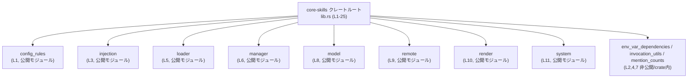

# core-skills/src/lib.rs コード解説

## 0. ざっくり一言

`core-skills/src/lib.rs` は、**スキル関連機能をまとめたクレートのルートモジュール**です。各サブモジュールを宣言し、主要な型・関数を再エクスポートすることで、「スキル管理」領域の公開 API を一か所に集約しています。

> 根拠: モジュール宣言 `pub mod ...` / `mod ...` と再エクスポート `pub use ...` が並んでいる構成（`core-skills/src/lib.rs:L1-11, L13-25`）。

---

## 1. このモジュールの役割

### 1.1 概要

この `lib.rs` は、次のような役割を持つルートモジュールです。

- スキル関連の機能ごとに **サブモジュールを宣言** する  
  （`config_rules`, `loader`, `manager`, `model`, `remote`, `render`, `system` など）  
  `core-skills/src/lib.rs:L1-11`
- サブモジュール内で定義された型・関数のうち、外部から使わせたいものを **`pub use` で再エクスポート** する  
  `core-skills/src/lib.rs:L13-25`
- 内部的な補助モジュール（`env_var_dependencies`, `invocation_utils`, `mention_counts`）を **非公開もしくは crate 内限定** で保持しつつ、その一部の API のみを公開する

このファイル自体にはロジック（関数本体）や状態はなく、**API 入口の定義のみ** が含まれています。

### 1.2 アーキテクチャ内での位置づけ

この `lib.rs` は、`core-skills` クレートの入口として、外部から利用される公的インターフェースをまとめています。サブモジュールとの関係は概ね次のようになります。



- 外部クレートは通常、**`core-skills` のルートから型・関数名を直接インポート** します（例: `SkillsManager`, `render_skills_section`）。
- 実際の実装は、それぞれのサブモジュール（`manager`, `render` など）側にあります。
- `env_var_dependencies`, `invocation_utils`, `mention_counts` はモジュール自体は公開されておらず、必要な一部 API のみがルートから再エクスポートされています。  
  （`core-skills/src/lib.rs:L2, L4, L7, L13-16, L19`）

### 1.3 設計上のポイント

コードから読み取れる設計上の特徴は次の通りです。

- **責務分割**
  - スキル設定ルール（`config_rules`）、ロードと管理（`loader`, `manager`）、モデル定義（`model`）、レンダリング（`render`）、リモート連携（`remote`）、システム統合（`system`）など、**関心ごとごとにモジュールが分かれて** います。  
    `core-skills/src/lib.rs:L1, L5-6, L8-11`
- **API 形状の統一のための再エクスポート**
  - ユーザーが `core_skills::SkillError` のようにクレートルートからまとめて利用できるよう、`pub use` を広く利用しています。  
    例: `pub use model::SkillError;`（`core-skills/src/lib.rs:L20`）
- **公開範囲の明示的な制御**
  - `mod env_var_dependencies;` や `mod mention_counts;` はモジュール自体は非公開（`pub` なし）で、型や関数だけを `pub use` で外に出しています。  
    `core-skills/src/lib.rs:L2, L7, L13-14, L19`
  - `pub(crate) mod invocation_utils;` と `pub(crate) use ...` により、**クレート内では再利用しつつ外部クレートには隠す** という設計になっています。  
    `core-skills/src/lib.rs:L4, L15`
- **安全性・エラー・並行性の観点**
  - このファイル内には **関数本体や `unsafe` ブロックは存在せず**、また `async` 関数やスレッド関連 API なども出てきません。
  - エラー型らしき `SkillError` が再エクスポートされていることから（`core-skills/src/lib.rs:L20`）、エラーハンドリングは主として `model` モジュール側で定義されていると推測できますが、具体的な契約はこのファイルからは分かりません。

---

## 2. 主要な機能一覧（コンポーネントインベントリー）

### 2.1 モジュール一覧（コンポーネントインベントリー）

`lib.rs` に現れるサブモジュールとその可視性です。

| モジュール名 | 可視性 | 役割（名称からの推測） | 宣言位置 |
|--------------|--------|------------------------|----------|
| `config_rules` | `pub` | スキルに関する設定ルールの定義・評価 | `core-skills/src/lib.rs:L1` |
| `env_var_dependencies` | （非公開） | 環境変数依存関係の解析・管理 | `core-skills/src/lib.rs:L2` |
| `injection` | `pub` | 何らかの「インジェクション」（依存性注入やプレースホルダ展開など）機能 | `core-skills/src/lib.rs:L3` |
| `invocation_utils` | `pub(crate)` | スキル呼び出しに関するユーティリティ | `core-skills/src/lib.rs:L4` |
| `loader` | `pub` | スキルのロード処理 | `core-skills/src/lib.rs:L5` |
| `manager` | `pub` | スキル管理の中心（マネージャ） | `core-skills/src/lib.rs:L6` |
| `mention_counts` | （非公開） | スキル名などの出現回数を数える機能 | `core-skills/src/lib.rs:L7` |
| `model` | `pub` | スキルに関連するドメインモデル（メタデータ・ポリシー・エラーなど） | `core-skills/src/lib.rs:L8` |
| `remote` | `pub` | リモートソースからのスキル連携 | `core-skills/src/lib.rs:L9` |
| `render` | `pub` | スキル情報を表示用にレンダリング | `core-skills/src/lib.rs:L10` |
| `system` | `pub` | システムレベルのスキル統合／接続部 | `core-skills/src/lib.rs:L11` |

> 役割列はモジュール名からの推測であり、実際の責務は各モジュールの中身を確認する必要があります。

### 2.2 再エクスポート一覧（コンポーネントインベントリー）

`lib.rs` から公開される（または crate 内に公開される）型・関数の一覧です。

| 名前 | 想定される種別 | 元モジュール | 公開範囲 | lib.rs 宣言位置 |
|------|----------------|-------------|----------|------------------|
| `SkillDependencyInfo` | 型（構造体/列挙体かは不明） | `env_var_dependencies` | `pub` | `core-skills/src/lib.rs:L13` |
| `collect_env_var_dependencies` | 関数と推測 | `env_var_dependencies` | `pub` | `core-skills/src/lib.rs:L14` |
| `build_implicit_skill_path_indexes` | 関数と推測 | `invocation_utils` | `pub(crate)` | `core-skills/src/lib.rs:L15` |
| `detect_implicit_skill_invocation_for_command` | 関数と推測 | `invocation_utils` | `pub` | `core-skills/src/lib.rs:L16` |
| `SkillsLoadInput` | 型（種別は不明） | `manager` | `pub` | `core-skills/src/lib.rs:L17` |
| `SkillsManager` | 型（種別は不明） | `manager` | `pub` | `core-skills/src/lib.rs:L18` |
| `build_skill_name_counts` | 関数と推測 | `mention_counts` | `pub` | `core-skills/src/lib.rs:L19` |
| `SkillError` | 型（種別は不明、エラー用であると推測） | `model` | `pub` | `core-skills/src/lib.rs:L20` |
| `SkillLoadOutcome` | 型（種別は不明） | `model` | `pub` | `core-skills/src/lib.rs:L21` |
| `SkillMetadata` | 型（種別は不明） | `model` | `pub` | `core-skills/src/lib.rs:L22` |
| `SkillPolicy` | 型（種別は不明） | `model` | `pub` | `core-skills/src/lib.rs:L23` |
| `filter_skill_load_outcome_for_product` | 関数と推測 | `model` | `pub` | `core-skills/src/lib.rs:L24` |
| `render_skills_section` | 関数と推測 | `render` | `pub` | `core-skills/src/lib.rs:L25` |

> 「関数と推測」「型（種別は不明）」という表現は、**`pub use` からはシグネチャや `struct` / `enum` の情報が得られない** ため、名前からの推測であることを明示しています。

### 2.3 機能のまとまり（高レベル）

モジュールと再エクスポートを合わせると、次のような機能グループが存在すると考えられます（名称からの推測です）。

- 設定ルール: `config_rules` モジュール
- 環境変数の依存関係解析: `SkillDependencyInfo`, `collect_env_var_dependencies`
- スキル呼び出し解析: `build_implicit_skill_path_indexes`, `detect_implicit_skill_invocation_for_command`
- スキルのロード／管理: `loader` モジュール, `SkillsLoadInput`, `SkillsManager`
- スキル名の出現回数カウント: `build_skill_name_counts`
- スキルのドメインモデル・エラー・ポリシー: `SkillError`, `SkillLoadOutcome`, `SkillMetadata`, `SkillPolicy`, `filter_skill_load_outcome_for_product`
- レンダリング: `render` モジュール, `render_skills_section`
- リモート連携: `remote` モジュール
- システム統合: `system` モジュール

---

## 3. 公開 API と詳細解説

### 3.1 型一覧（公開される主な型）

このファイルから直接分かる「型名」を一覧にします。実際に `struct` か `enum` かなどは、元モジュールを確認する必要があります。

| 名前 | 想定される種別 | 役割 / 用途（名称からの推測） | 定義モジュール | lib.rs での宣言 |
|------|----------------|------------------------------|----------------|------------------|
| `SkillDependencyInfo` | 型（`struct`/`enum` かは不明） | スキルが依存する環境変数に関する情報をまとめた型 | `env_var_dependencies` | `core-skills/src/lib.rs:L13` |
| `SkillsLoadInput` | 型（種別は不明） | スキルロードに必要な入力データを表現 | `manager` | `core-skills/src/lib.rs:L17` |
| `SkillsManager` | 型（種別は不明） | スキルのロードやライフサイクルを管理する中心的なコンポーネント | `manager` | `core-skills/src/lib.rs:L18` |
| `SkillError` | 型（種別は不明） | スキル関連処理で発生するエラーを表現するエラー型 | `model` | `core-skills/src/lib.rs:L20` |
| `SkillLoadOutcome` | 型（種別は不明） | スキルロード処理の結果（成功／失敗、詳細情報）を表現 | `model` | `core-skills/src/lib.rs:L21` |
| `SkillMetadata` | 型（種別は不明） | スキルのメタデータ（名前、説明、タグなど）を保持 | `model` | `core-skills/src/lib.rs:L22` |
| `SkillPolicy` | 型（種別は不明） | スキルの利用ポリシーや制約を表現 | `model` | `core-skills/src/lib.rs:L23` |

> 上記の役割は型名とモジュール名からの推測です。正確なフィールド構成・所有権・ライフタイムなどは `model` / `manager` / `env_var_dependencies` モジュール側を確認する必要があります。

### 3.2 重要な関数（詳細テンプレート適用）

以下の 6 個は、名前と公開範囲から **重要な API である可能性が高い関数** と考えられるものです。  
ただし、`lib.rs` にはシグネチャや実装がないため、型や詳細な挙動は不明です。

#### `collect_env_var_dependencies(...) -> ...`（`env_var_dependencies` より再エクスポート）

**概要**

- 関数名・モジュール名から、**スキルが利用する環境変数の依存関係を収集する処理** であると推測できます。  
  `core-skills/src/lib.rs:L14`

**引数**

| 引数名 | 型 | 説明 |
|--------|----|------|
| （不明） | （不明） | この関数のシグネチャは `env_var_dependencies` モジュール内に定義されており、`lib.rs` には現れないため不明です。 |

**戻り値**

- 型・内容ともに `lib.rs` からは不明です。  
  おそらく `SkillDependencyInfo` やその集合を返す可能性がありますが、これは名称からの推測です。

**内部処理の流れ**

- 実装は `env_var_dependencies` モジュール内にあるため、このチャンクからは一切確認できません。

**Examples（使用例・概念的）**

```rust
// 実際のシグネチャは env_var_dependencies モジュールの定義に従います。
use core_skills::{SkillDependencyInfo, collect_env_var_dependencies}; // lib.rs から再エクスポート（L13-14）

fn analyze_deps(/* 実際の引数は不明 */) {
    // 実際の引数名・型はこのファイルからは分かりません。
    // let deps: Vec<SkillDependencyInfo> = collect_env_var_dependencies(...);
    // 取得した依存関係情報を使って処理を行う、という使い方になると考えられます。
}
```

**Errors / Panics**

- `Result` を返すかどうか、panic する可能性などは `lib.rs` からは読み取れません。

**Edge cases（エッジケース）**

- 空のスキルセット、環境変数が存在しない場合などの扱いも、このチャンクだけでは不明です。

**使用上の注意点**

- エラー型や返り値のコレクション型などの契約を理解するには、`env_var_dependencies` モジュールの実装とドキュメントを確認する必要があります。

---

#### `build_implicit_skill_path_indexes(...) -> ...`（crate 内向け再エクスポート）

**概要**

- 名前から、**暗黙的なスキルパスのインデックス構造を組み立てる** ユーティリティ関数であると推測できます。  
  `core-skills/src/lib.rs:L15`

**可視性**

- `pub(crate)` のため、**クレート内の他モジュールからのみ利用可能で、クレート外には公開されません**。

**引数 / 戻り値 / 内部処理**

- すべて `invocation_utils` モジュール内で定義されており、このファイルからは不明です。

**使用上の注意点**

- クレート内の他モジュールがスキル呼び出しの解決ロジックを共有するための内部 API となっていると考えられます。

---

#### `detect_implicit_skill_invocation_for_command(...) -> ...`

**概要**

- 名前・モジュール名から、**コマンド文字列などから「暗黙的なスキル呼び出し」を検出する関数** と推測されます。  
  `core-skills/src/lib.rs:L16`

**引数**

| 引数名 | 型 | 説明 |
|--------|----|------|
| （不明） | （不明） | シグネチャは `invocation_utils` モジュール内にのみ存在し、`lib.rs` には現れません。 |

**戻り値**

- 戻り値（検出結果の型）は不明です。  
  スキル名やパス、マッチ結果を持つ構造体である可能性はありますが、推測の域を出ません。

**内部処理の流れ**

- 内部でパターンマッチングや正規表現等を用いてコマンドからスキル呼び出しを抽出している可能性がありますが、実装がないため断定できません。

**Errors / Panics**

- エラー型や panic 条件は不明です。

**使用上の注意点**

- ユーザーは `core_skills::detect_implicit_skill_invocation_for_command` のシグネチャおよび戻り値を確認した上で利用する必要があります。

---

#### `build_skill_name_counts(...) -> ...`

**概要**

- 名前から、**スキル名の出現回数を数える関数** と推測できます。  
  `core-skills/src/lib.rs:L19`

**可視性 / 位置づけ**

- `pub use mention_counts::build_skill_name_counts;` によって外部にも公開されているため、**スキル名の頻度分析を行うユーティリティ関数** として利用できると考えられます。

**引数・戻り値・内部処理**

- いずれも `mention_counts` モジュール側にのみ定義されており、このチャンクには情報がありません。

---

#### `filter_skill_load_outcome_for_product(...) -> ...`

**概要**

- `SkillLoadOutcome` と「product」という語から、**あるプロダクト（環境やエディション）に対して、スキルロード結果をフィルタリングする関数** と推測されます。  
  `core-skills/src/lib.rs:L21, L24`

**引数 / 戻り値**

- `model` モジュールに定義された型 `SkillLoadOutcome` を引数または戻り値として扱っている可能性がありますが、実際のシグネチャは不明です。

---

#### `render_skills_section(...) -> ...`

**概要**

- 名前とモジュール名から、**スキルに関する情報（メタデータなど）を「セクション」としてレンダリングする関数** と考えられます。  
  `core-skills/src/lib.rs:L25`

**引数・戻り値**

- 具体的な引数（例: スキルのリスト、出力先など）や戻り値（文字列、HTML、レンダリング結果オブジェクトなど）は `render` モジュール側にのみ記述があり、このファイルからは不明です。

**安全性・並行性**

- `async` 関数かどうか、スレッドセーフな型を返すかどうかもこのファイルからは分かりません。  
  並行環境での使用可否は `render` モジュールの実装次第です。

---

### 3.3 その他の関数

- `lib.rs` に名前が現れる関数様のシンボルは、上記 6 個のみです（`core-skills/src/lib.rs:L14-16, L19, L24-25`）。
- それ以外の関数は、各モジュール内部で定義されていても **このチャンクには現れません**。

---

## 4. データフロー（呼び出し解決の流れ）

このファイルには処理ロジックはありませんが、**外部コードから見た「呼び出し → 再エクスポート → 実装」までの流れ**は把握できます。

ここでは例として `render_skills_section` の呼び出し経路を図示します。

```mermaid
sequenceDiagram
    participant App as "他クレートのコード"
    participant Root as "core-skills::render_skills_section\n(lib.rs L25)"
    participant Render as "render::render_skills_section\n(render モジュール, 実装は別ファイル)"

    App->>Root: render_skills_section(...を呼び出し)
    Note over Root: 実際には<br/>`pub use render::render_skills_section;`<br/>という再エクスポート（L25）
    Root->>Render: コンパイル時に<br/>`render::render_skills_section` に解決
    Render-->>App: レンダリング結果を返す
```

- 実行時には、**`lib.rs` が何かをするわけではなく**、関数名の解決がコンパイル時に行われ、直接 `render` モジュールの実装が呼ばれます。
- 同様に、`collect_env_var_dependencies`, `build_skill_name_counts` なども、ルート経由でインポートされつつ、実際の処理は各モジュールに委ねられます。

### セキュリティ / バグ観点

- この `lib.rs` には **状態・ロジック・`unsafe` ブロックが存在しない** ため、このファイル単体では実行時バグやセキュリティ上の脆弱性を直接引き起こす処理は確認できません。
- ただし、**どの関数・型を外に公開するか** を制御しているため、誤って内部用 API を `pub use` してしまうと外部からの誤用を招く可能性があります。

---

## 5. 使い方（How to Use）

### 5.1 基本的な使用方法（クレートルートからのインポート）

`lib.rs` は、**主要な型・関数をクレートルートから直接インポートできるようにするためのハブ**です。

以下は、クレート名を `core_skills` と仮定したときの概念的な利用例です  
（実際のクレート名は `Cargo.toml` に依存します）。

```rust
// クレートルートから型・関数をインポートする例
use core_skills::{
    SkillError,                    // model モジュールからのエラー型（L20）
    SkillMetadata,                 // スキルのメタデータ（L22）
    SkillPolicy,                   // スキルのポリシー（L23）
    SkillLoadOutcome,              // ロード結果（L21）
    SkillsManager,                 // スキル管理の中心コンポーネント（L18）
    SkillsLoadInput,               // ロード入力（L17）
    SkillDependencyInfo,           // 環境変数依存情報（L13）
    collect_env_var_dependencies,  // 依存関係収集関数（L14）
    build_skill_name_counts,       // スキル名カウント関数（L19）
    detect_implicit_skill_invocation_for_command, // コマンドからのスキル検出（L16）
    filter_skill_load_outcome_for_product,         // ロード結果のフィルタリング（L24）
    render_skills_section,                          // スキルのレンダリング（L25）
};

fn main() -> Result<(), SkillError> {
    // ここでは「クレートルートからまとめてインポートできる」ことのみを示しています。
    // 各型・関数の具体的な使い方（コンストラクタ、メソッド、引数など）は、
    // 対応するモジュールの実装（model / manager / render 等）を確認する必要があります。

    Ok(())
}
```

> このコードは、**実際のシグネチャやメソッドを省略した概念的な例**です。  
> コンパイル可能かどうかは、各モジュール内の定義に依存します。

### 5.2 よくある使用パターン（想定）

`lib.rs` の構造から、次のような利用パターンが想定されます（あくまで構造と命名からの推測です）。

1. **スキルのロードと管理**
   - `SkillsLoadInput` を用意し、それを使って `SkillsManager` を構築または初期化。
   - ロード結果は `SkillLoadOutcome` として扱い、必要に応じて `filter_skill_load_outcome_for_product` を通して絞り込む。
2. **環境変数依存の解析**
   - `collect_env_var_dependencies` でスキルの環境変数依存関係を収集し、`SkillDependencyInfo` のリストを得る。
3. **UI などへのレンダリング**
   - スキル群やロード結果を `render_skills_section` に渡して、人間向けの出力（テキストやマークアップ）を生成する。

これらのパターンの具体的な呼び出し方法は、各モジュールの実装に依存するため、このチャンクからは示せません。

### 5.3 よくある間違い（推測される例）

この `lib.rs` の可視性設定から、次のような誤用が起こり得ます。

```rust
// 誤り例: 非公開モジュールへ直接アクセスしようとする
// use core_skills::env_var_dependencies::SkillDependencyInfo; // コンパイルエラーになる可能性が高い（L2は非公開）

// 正しい例: lib.rs が再エクスポートした型を使う
use core_skills::SkillDependencyInfo; // L13 で再エクスポートされている
```

```rust
// 誤り例: crate 外から pub(crate) の関数を参照しようとする
// use core_skills::build_implicit_skill_path_indexes; // L15 は pub(crate) なのでクレート外からは見えない

// 正しい例: クレート内の他モジュールから相対パスで利用する（例）
// crate 内部コード（同じクレートの別モジュール）からなら利用可能
use crate::build_implicit_skill_path_indexes; // L15 の pub(crate) use を通して利用（クレート内限定）
```

### 5.4 使用上の注意点（まとめ）

- **公開 API の入口**  
  - 実際のロジックは各モジュールにあり、この `lib.rs` は「どのアイテムを外に見せるか」を管理するだけです。
- **エラー・並行性の契約はこのファイルからは読めない**  
  - `SkillError` 型の存在からエラー処理は型ベースで行っていることが分かりますが（`core-skills/src/lib.rs:L20`）、`Result<T, SkillError>` のような具体的な契約はモジュール側のシグネチャを確認する必要があります。
  - `async` / スレッドセーフ性 (`Send`, `Sync`) などの情報も、型の定義側を参照しなければ分かりません。
- **API 変更の影響範囲**  
  - このファイルで `pub use` されている名前を変更・削除すると、外部クレートのビルドが壊れるため、**公開 API として慎重に扱う必要があります**。

---

## 6. 変更の仕方（How to Modify）

### 6.1 新しい機能を追加する場合

この `lib.rs` の観点から見た、機能追加の手順は次のようになります。

1. **適切なモジュールに実装を追加**
   - 既存の責務分割に従い、たとえばスキルの新しいポリシーなら `model`、レンダリングに関するものなら `render` に追加する、など。
   - 新しいモジュールを作る場合は、`core-skills/src/lib.rs` に `pub mod new_module;` あるいは `mod new_module;` を追記する。  
     例: `pub mod analytics;`（行番号としては L11 付近に追加される形）

2. **外部に公開したい場合は `pub use` を追加**
   - 型や関数をクレートルートから利用可能にしたい場合、`lib.rs` に

     ```rust
     pub use new_module::NewTypeOrFunc;
     ```

     のような行を追加します。

3. **公開範囲（`pub` / `pub(crate)` / 非公開）を検討**
   - 内部専用のユーティリティであれば `mod` + `pub(crate) use` のパターンを使うと、現在の設計と整合します。  
     例: `invocation_utils`（`core-skills/src/lib.rs:L4, L15`）

### 6.2 既存の機能を変更する場合

- **名前変更（リネーム）**
  - 例えば `render::render_skills_section` の名前を変える場合、  
    1. `render` モジュール内の定義を変更  
    2. `lib.rs` の `pub use render::render_skills_section;`（`core-skills/src/lib.rs:L25`）も更新  
    の両方が必要です。
- **可視性の変更**
  - 内部モジュールを `pub` に変更したり、`pub(crate)` を `pub` に変えると、外部からのアクセス可能範囲が変わります。
  - 逆に、現在 `pub use` されているシンボルを非公開にすると、外部クレートのビルドが失敗する可能性があります。
- **契約（前提条件・戻り値）の変更**
  - `SkillError` や `SkillLoadOutcome` の定義を変えると、これらを返す関数全体の契約が変わります。
  - ただし、**契約そのものは各モジュール側のシグネチャ／ドキュメントに記述されるべき** であり、`lib.rs` からは読み取れません。

---

## 7. 関連ファイル

`lib.rs` から参照されるモジュールの実体ファイルは、Rust のモジュール規則に従えば、以下のいずれかのパスに存在すると考えられます（正確なパスはこのチャンクだけでは確定できません）。

| パス（推定） | 役割 / 関係 |
|--------------|------------|
| `core-skills/src/config_rules.rs` または `core-skills/src/config_rules/mod.rs` | `pub mod config_rules;` に対応。スキル設定ルール関連のロジックを保持すると考えられます（L1）。 |
| `core-skills/src/env_var_dependencies.rs` または `core-skills/src/env_var_dependencies/mod.rs` | `mod env_var_dependencies;` に対応。`SkillDependencyInfo`, `collect_env_var_dependencies` の定義元（L2, L13-14）。 |
| `core-skills/src/injection.rs` または `core-skills/src/injection/mod.rs` | `pub mod injection;`（L3）。インジェクション関連機能を提供。 |
| `core-skills/src/invocation_utils.rs` または `core-skills/src/invocation_utils/mod.rs` | `pub(crate) mod invocation_utils;`（L4）。スキル呼び出しユーティリティと、`build_implicit_skill_path_indexes`, `detect_implicit_skill_invocation_for_command` の定義元。 |
| `core-skills/src/loader.rs` または `core-skills/src/loader/mod.rs` | `pub mod loader;`（L5）。スキルのロード処理。 |
| `core-skills/src/manager.rs` または `core-skills/src/manager/mod.rs` | `pub mod manager;`（L6）。`SkillsManager`, `SkillsLoadInput` を定義する管理モジュール。 |
| `core-skills/src/mention_counts.rs` または `core-skills/src/mention_counts/mod.rs` | `mod mention_counts;`（L7）。`build_skill_name_counts` の定義元。 |
| `core-skills/src/model.rs` または `core-skills/src/model/mod.rs` | `pub mod model;`（L8）。`SkillError`, `SkillLoadOutcome`, `SkillMetadata`, `SkillPolicy`, `filter_skill_load_outcome_for_product` の定義元。 |
| `core-skills/src/remote.rs` または `core-skills/src/remote/mod.rs` | `pub mod remote;`（L9）。リモートスキル連携関連。 |
| `core-skills/src/render.rs` または `core-skills/src/render/mod.rs` | `pub mod render;`（L10）。`render_skills_section` の実装を含むレンダリングモジュール。 |
| `core-skills/src/system.rs` または `core-skills/src/system/mod.rs` | `pub mod system;`（L11）。システムレベルの統合を行うモジュール。 |

テストコード（`tests/` ディレクトリや `*_test.rs` ファイルなど）の存在や内容は、この `lib.rs` からは分かりません。

---

### まとめ

- `core-skills/src/lib.rs` は、**スキル管理関連の各モジュールを束ね、外部に見せる API 面を構成するファイル**です。
- このファイル自体にはロジック・`unsafe`・並行処理はなく、**安全性やエラー／並行性の詳細は各モジュールの実装側に委ねられています**。
- 公開 API を変更したり新しい機能を追加する際には、この `lib.rs` の `mod` と `pub use` の設定が重要な調整ポイントとなります。
