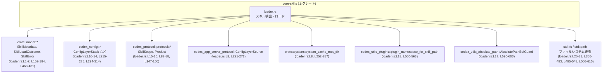
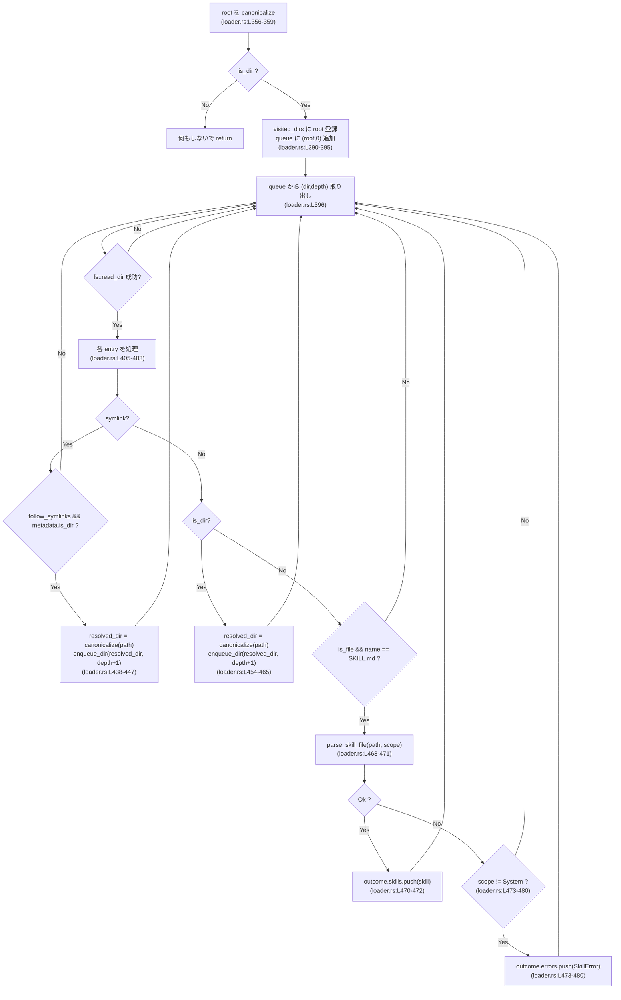
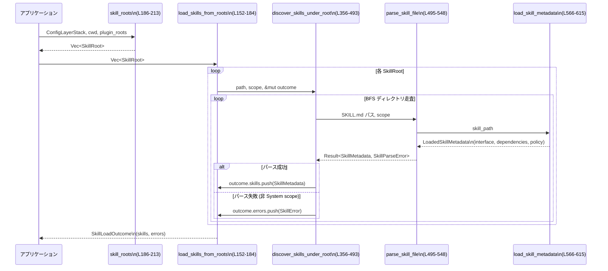

# core-skills/src/loader.rs コード解説

## 0. ざっくり一言

`loader.rs` は、複数の「スキルルート」配下をファイルシステム上で走査し、`SKILL.md` とオプションの `agents/openai.yaml` から `SkillMetadata` を構築して収集するモジュールです（`loader.rs:L101-118`, `L152-184`, `L356-493`, `L495-548`, `L566-615`）。

---

## 1. このモジュールの役割

### 1.1 概要

- このモジュールは、**Codex の「スキル」定義ファイル群を検出・パースする問題**を解決するために存在し、以下の機能を提供します。
  - コンフィグレイヤと作業ディレクトリから、**スキルルート（探索開始ディレクトリ群）を決定**する（`skill_roots` 系; `loader.rs:L186-213`, `L215-275`, `L277-291`, `L294-348`）。
  - 各ルート配下を BFS で走査し、`SKILL.md` を見つけて **スキルのメタデータを読み込む**（`discover_skills_under_root`; `L356-493`）。
  - `SKILL.md` の YAML フロントマターと、`agents/openai.yaml` をパースして **`SkillMetadata` に正規化**する（`parse_skill_file`, `load_skill_metadata`, `resolve_*`; `L495-548`, `L566-705`）。
  - 取得したスキル一覧を **スコープ優先度＋名前順にソートし、重複パスを除去**する（`load_skills_from_roots`; `L152-184`）。

### 1.2 アーキテクチャ内での位置づけ

このモジュールは、設定スタック (`codex_config`)、プロトコル定義 (`codex_protocol`)、モデル層 (`crate::model`) と連携して動作します。



この図は、本ファイル全体（`loader.rs:L1-850`）の依存関係の概要を示します。

### 1.3 設計上のポイント

- **スキルスコープとルートの分離**
  - `SkillRoot { path, scope }` で「どこを」「どのスコープとして」スキャンするかを表現し（`loader.rs:L147-150`）、`load_skills_from_roots` はルートの集合のみを受け取ります（`L152-159`）。
- **BFS による安全なディレクトリ走査**
  - `discover_skills_under_root` はキュー＋訪問済み集合 (`VecDeque`, `HashSet`) による BFS を行い（`L365-382`, `L390-395`, `L396-484`）、深さとディレクトリ数に上限を設けて無限再帰や巨大ツリー走査を抑制します（`MAX_SCAN_DEPTH`, `MAX_SKILLS_DIRS_PER_ROOT`; `L116-118`）。
- **シンボリックリンクの扱い**
  - ユーザー／リポジトリ／管理者スコープではディレクトリのシンボリックリンクを辿りますが（`L384-388`, `L420-449`）、System スコープでは辿らないようにしています（コメントと `matches!` により; `L384-388`）。
- **スキル定義の厳格なバリデーション**
  - YAML フロントマターの `name` / `description` / `metadata.short-description` に対して、空文字禁止＋文字数制限を課し（`validate_len`; `L759-774`、呼び出し `L527-535`）、不正な場合は `SkillParseError` としてエラーにします（`L120-127`, `L495-548`）。
- **オプションメタデータの「fail open」ポリシー**
  - `agents/openai.yaml` の読み込み／パース失敗や個々のフィールドの不正値は **警告ログを出しつつ無視** し、`SKILL.md` のロード自体は成功させます（`L566-587`, `L590-603`, `L617-646`, `L648-705`, `L776-787`）。
- **安全なパス正規化**
  - アイコンなどのアセットパスは、相対パスかつ `assets/` 配下であり、`..` を含まないことを強制し、不正なパスは無視します（`resolve_asset_path`; `L707-752`）。
- **エラー集約**
  - スキルロードエラーは `SkillLoadOutcome.errors` に蓄積され（`L468-481`）、System スコープのエラーだけは抑制されます（`L472-480`）。

---

## 2. 主要な機能一覧

- スキルルートの決定: コンフィグレイヤ／ホームディレクトリ／カレントディレクトリからスキル探索ルートを決める（`skill_roots`, `skill_roots_with_home_dir`, `skill_roots_from_layer_stack_inner`, `repo_agents_skill_roots`; `loader.rs:L186-213`, `L215-275`, `L277-291`）。
- プロジェクトルート判定: `project_root_markers` 設定をマージし、カレントディレクトリからプロジェクトルートを探索する（`project_root_markers_from_stack`, `find_project_root`, `dirs_between_project_root_and_cwd`; `L294-348`）。
- ディレクトリ走査と SKILL.md 検出: BFS でルート配下を探索し、`SKILL.md` ファイルを検出してパースする（`discover_skills_under_root`; `L356-493`）。
- SKILL.md パースとメタデータ構築: YAML フロントマターと補助メタデータ (`openai.yaml`) から `SkillMetadata` を組み立てる（`parse_skill_file`, `load_skill_metadata`, `resolve_*`; `L495-548`, `L566-705`）。
- 文字列／パスの正規化とバリデーション: 1 行化・長さ制限・カラーコード検証・アセットパス検証など（`sanitize_single_line`, `validate_len`, `resolve_str`, `resolve_required_str`, `resolve_color_str`, `resolve_asset_path`; `L755-787`, `L790-815`, `L707-752`）。
- スキル一覧の重複排除とソート: 同一 `SKILL.md` の重複除去とスコープ優先度に基づく整列（`load_skills_from_roots`; `L161-181`）。

---

## 3. 公開 API と詳細解説

### 3.1 型一覧（構造体・列挙体など）

| 名前 | 種別 | 公開範囲 | 役割 / 用途 | 定義位置 |
|------|------|----------|-------------|-----------|
| `SkillRoot` | 構造体 | `pub` | スキル探索の起点ディレクトリ (`path`) と、そのスキルが属するスコープ (`scope: SkillScope`) をまとめる | `loader.rs:L147-150` |
| `SkillFrontmatter` | 構造体 | モジュール内 | `SKILL.md` の YAML フロントマターのトップレベルを受ける中間型（`name`,`description`,`metadata`） | `loader.rs:L33-41` |
| `SkillFrontmatterMetadata` | 構造体 | モジュール内 | フロントマター `metadata` 部分のうち `short-description` を保持 | `loader.rs:L43-47` |
| `SkillMetadataFile` | 構造体 | モジュール内 | `agents/openai.yaml` 全体を受ける中間型（`interface`,`dependencies`,`policy`） | `loader.rs:L49-57` |
| `LoadedSkillMetadata` | 構造体 | モジュール内 | `openai.yaml` から解決した `SkillInterface` / `SkillDependencies` / `SkillPolicy` を一時的に保持 | `loader.rs:L59-64` |
| `Interface` | 構造体 | モジュール内 | YAML 側の UI メタ情報（表示名・説明・アイコンパス・ブランドカラー・デフォルトプロンプト） | `loader.rs:L66-74` |
| `Dependencies` | 構造体 | モジュール内 | YAML 側の依存関係定義 (`tools` 配列) | `loader.rs:L76-80` |
| `Policy` | 構造体 | モジュール内 | YAML 側のポリシー設定（暗黙的呼び出し可否、`products`） | `loader.rs:L82-88` |
| `DependencyTool` | 構造体 | モジュール内 | 1 つのツール依存定義の YAML 表現（`type`,`value` など） | `loader.rs:L90-99` |
| `SkillParseError` | 列挙体 | モジュール内 | `SKILL.md` のパースエラー種別（I/O, frontmatter 不在, YAML 不正, フィールド不備など） | `loader.rs:L120-127` |

> `SkillMetadata`, `SkillInterface`, `SkillDependencies`, `SkillPolicy`, `SkillToolDependency`, `SkillLoadOutcome`, `SkillError` は `crate::model` で定義されており、このチャンクには現れませんが、フィールドアクセスから少なくとも `SkillLoadOutcome.skills` / `.errors` が存在することが分かります（`loader.rs:L156-164`, `L468-481`）。

---

### 3.2 関数詳細（主要 7 件）

#### `load_skills_from_roots<I>(roots: I) -> SkillLoadOutcome`（公開 API）

**概要**

- 与えられた `SkillRoot` の集合それぞれについて `discover_skills_under_root` を呼び出し、検出されたスキルを集約・重複排除・ソートして `SkillLoadOutcome` として返します（`loader.rs:L152-184`）。

**引数**

| 引数名 | 型 | 説明 |
|--------|----|------|
| `roots` | `I` where `I: IntoIterator<Item = SkillRoot>` | スキャン対象とするスキルルートの反復子。各 `SkillRoot` にディレクトリパスとスコープが含まれる（`L152-159`）。 |

**戻り値**

- `SkillLoadOutcome`  
  - 成功したスキルは `outcome.skills` に `SkillMetadata` として格納され、パースに失敗したスキルは `outcome.errors` に `SkillError { path, message }` として格納されます（`loader.rs:L156-164`, `L468-481`）。

**内部処理の流れ**

1. `SkillLoadOutcome::default()` で空の結果オブジェクトを初期化（`L156`）。
2. `roots` を反復し、各 `SkillRoot` に対して `discover_skills_under_root(&root.path, root.scope, &mut outcome)` を実行（`L157-159`）。
3. すべての探索が終わった後、`HashSet<PathBuf>` を使って `outcome.skills` を `path_to_skills_md` 単位で重複排除し、最初に見つかったものだけを残します（`L161-164`）。
4. 内部関数 `scope_rank` で `SkillScope` ごとの優先度（Repo=0, User=1, System=2, Admin=3）を定義（`L166-173`）。
5. `outcome.skills.sort_by` でスコープ優先度 → スキル名 → SKILL.md パスの順にソート（`L176-181`）。
6. 集約された `outcome` を返す（`L183`）。

**Examples（使用例）**

典型的な呼び出し例（同モジュール内から呼び出す想定）です。

```rust
use std::path::PathBuf;
use codex_protocol::protocol::SkillScope;

// スキャンしたいルートを準備する
let roots = vec![
    SkillRoot {
        path: PathBuf::from("/path/to/skills"), // SKILL.md を含むツリーのルート
        scope: SkillScope::User,                // ユーザースコープとして扱う
    },
];

// スキルをロードする
let outcome = load_skills_from_roots(roots);

// 成功したスキル
for skill in &outcome.skills {
    println!("skill: {} ({})", skill.name, skill.path_to_skills_md.display());
}

// エラーになった SKILL.md
for err in &outcome.errors {
    eprintln!("failed to load {}: {}", err.path.display(), err.message);
}
```

**Errors / Panics**

- 本関数自体は `Result` を返さず、パース失敗は `SkillLoadOutcome.errors` に蓄積されます（`loader.rs:L468-481`）。
- 内部でパニックを起こし得るコード（`unwrap` など）は使われていません（`L152-184`）。`discover_skills_under_root` もエラーをログまたは `SkillLoadOutcome.errors` に集約するだけでパニックはしません（`L356-493`）。

**Edge cases（エッジケース）**

- `roots` が空の場合  
  → ループは何もせず、`SkillLoadOutcome::default()` がそのまま返されます（`loader.rs:L156-159`）。
- 同じ `SKILL.md` が複数のルートから見つかった場合  
  → `path_to_skills_md` に基づく重複排除により、最初に発見されたものだけが残ります（`L161-164`）。どのスコープが優先されるかは **ルート探索順** に依存します（`scope_rank` のコメント; `L166-173`）。

**使用上の注意点**

- 大量のルートを渡すと、その分だけファイルシステム走査が増えます。`discover_skills_under_root` は同期 I/O なので、頻繁に呼び出すと遅延の原因になります（`L356-493`）。
- 返り値の `SkillLoadOutcome` に含まれる `errors` を確認しないと、失敗したスキルを見落とす可能性があります（`L468-481`）。
- 並行性について: 本関数はグローバルなミュータブル状態を持たず、引数とローカル変数のみを操作するため、**同一プロセス内から複数スレッドで呼び出しても Rust の型システム上は安全**と考えられます。ただし、ファイルシステム I/O やログ出力が競合するかどうかは環境依存です（`L156-164`, `L356-493`）。

---

#### `skill_roots(config_layer_stack, cwd, plugin_skill_roots) -> Vec<SkillRoot>`（公開 API: `pub(crate)`）

**概要**

- コンフィグレイヤスタックとカレントディレクトリ、プラグイン由来のスキルルートを元に、探索対象となる `SkillRoot` の一覧を構築します（`loader.rs:L186-197`, `L199-213`）。

**引数**

| 引数名 | 型 | 説明 |
|--------|----|------|
| `config_layer_stack` | `&ConfigLayerStack` | Codex 全体の設定レイヤを表すスタック（`L186-188`, `L215-223`）。 |
| `cwd` | `&Path` | スキル検索の起点となるカレントディレクトリ（リポジトリ内の位置）。（`L188`, `L277-281`） |
| `plugin_skill_roots` | `Vec<PathBuf>` | プラグインによって追加されたスキルディレクトリ群（すべて `SkillScope::User` として扱われる; `L199-213`）。 |

**戻り値**

- `Vec<SkillRoot>`  
  - スコープ付きのスキル探索ルートのリスト。重複パスは `dedupe_skill_roots_by_path` により除去済みです（`loader.rs:L205-213`, `L351-354`）。

**内部処理の流れ**

1. `skill_roots` は単に `home_dir().as_deref()` を取得し、`skill_roots_with_home_dir` に委譲します（`L186-197`）。
2. `skill_roots_with_home_dir` 内では:
   - `skill_roots_from_layer_stack_inner` により、Config レイヤごとの標準的なスキルディレクトリを収集（Project/User/System など; `L215-275`）。
   - `plugin_skill_roots` の各パスを `SkillScope::User` として追加（`L205-209`）。
   - `repo_agents_skill_roots` でプロジェクトルートからカレントディレクトリまでの `.agents/skills` ディレクトリを追加（`L210-213`, `L277-291`, `L333-348`）。
   - 最後に `dedupe_skill_roots_by_path` でパス重複を削除（`L351-354`）。

**Examples（使用例）**

```rust
// ConfigLayerStack と cwd はアプリケーション側で構築されているとする
let roots: Vec<SkillRoot> = skill_roots(
    &config_layer_stack, // コンフィグレイヤ
    std::env::current_dir()?.as_path(), // カレントディレクトリ
    Vec::new(), // プラグイン由来のルートがなければ空ベクタ
);

// これを load_skills_from_roots に渡してスキルをロード
let outcome = load_skills_from_roots(roots);
```

**Errors / Panics**

- 本関数および `skill_roots_with_home_dir` は `Result` を返さず、内部でもパニックを起こすコードはありません（`L186-213`）。
- ただし、`config_layer_stack.get_layers` や `config_folder` から返される値が None の場合は単にスキップされます（`L221-227`）。

**Edge cases**

- プロジェクトレイヤが存在しない／`config_folder` を持たない場合  
  → 該当レイヤからはスキルルートが追加されません（`L221-227`）。
- `home_dir` が `None` の場合  
  → `$HOME/.agents/skills` 由来のルートは追加されません（`L244-250`）。
- 同一パスが複数経路から追加された場合  
  → `dedupe_skill_roots_by_path` により 1 つに統合されます（`L351-354`）。

**使用上の注意点**

- 返ってくる `SkillRoot` にスコープが埋め込まれているため、**特定スコープだけをスキャンしたい場合はフィルタしてから `load_skills_from_roots` に渡す**とよいです（例: `roots.into_iter().filter(|r| r.scope == SkillScope::User)`）。
- `ConfigLayerSource::Mdm` やセッションフラグ由来のレイヤはスキルルートを追加しない設計になっています（`L267-270`）。

---

#### `discover_skills_under_root(root, scope, outcome)`（コアロジック）

**概要**

- 単一のスキルルート（ディレクトリ）配下を BFS 走査し、`SKILL.md` を見つけて `parse_skill_file` によりパースし、結果を `SkillLoadOutcome` に書き込みます（`loader.rs:L356-493`）。

**引数**

| 引数名 | 型 | 説明 |
|--------|----|------|
| `root` | `&Path` | スキャン開始ディレクトリ。`canonicalize_path` 済みの絶対パスに変換されます（`L356-359`）。 |
| `scope` | `SkillScope` | このルート配下で見つかったスキルに付与されるスコープ（`L356-359`, `L468-481`）。 |
| `outcome` | `&mut SkillLoadOutcome` | 検出したスキル／エラーを蓄積する出力オブジェクト（`L356`, `L468-481`）。 |

**戻り値**

- なし (`fn` のみ)。`outcome` をインプレースで更新します。

**内部処理の流れ**

1. `dunce::canonicalize` で `root` を正規化。失敗したら何もせず return（`L356-359`）。
2. 正規化された `root` がディレクトリでない場合も return（`L361-363`）。
3. ローカル関数 `enqueue_dir` を定義し、BFS のためのキューと訪問済みセット (`visited_dirs`) を管理（`L365-382`）。
   - 深さ (`depth`) が `MAX_SCAN_DEPTH` を超える場合は追加しない（`L372-374`）。
   - 訪問ディレクトリ数が `MAX_SKILLS_DIRS_PER_ROOT` に達したらスキャン打ち切りフラグを立てる（`L375-378`）。
4. `follow_symlinks` を `scope` に応じて決定（Repo/User/Admin のみ true; `L384-388`）。
5. `visited_dirs` に `root` を登録し、`queue` に `(root, depth=0)` を積む（`L390-395`）。
6. BFS ループ:
   - `queue` から `(dir, depth)` を 1 件取り出し（`L396`）。
   - `fs::read_dir(dir)` でエントリ一覧を取得。失敗した場合はエラーログを出して次のディレクトリへ（`L397-403`）。
   - 各 `entry` について:
     - ファイル名を UTF-8 文字列に変換できなければスキップ（`L405-410`）。
     - ドット始まり（隠しファイル／ディレクトリ）はスキップ（`L412-414`）。
     - `entry.file_type()` で種別を取得（`L416-418`）。
     - シンボリックリンクの場合:
       - `follow_symlinks` が false ならスキップ（`L420-423`）。
       - `fs::metadata` でリンク先のメタデータを取得し、ディレクトリなら `canonicalize_path` して `enqueue_dir`（`L425-449`）。
       - ファイルへのシンボリックリンクは追わずスキップ（`L437-452`）。
     - 通常ディレクトリの場合も `canonicalize_path` して `enqueue_dir`（`L454-465`）。
     - 通常ファイルかつファイル名が `SKILL.md` の場合:
       - `parse_skill_file(&path, scope)` を呼び出し（`L468-471`）。
       - 成功時: 返された `SkillMetadata` を `outcome.skills.push(skill)`（`L470-472`）。
       - 失敗時: `scope != SkillScope::System` のときのみ `SkillError { path, message }` を `outcome.errors` に追加（`L473-480`）。
7. ループ終了後、`truncated_by_dir_limit` が true の場合は警告ログを出す（`L486-492`）。

**Mermaid フロー図**



**Errors / Panics**

- ディレクトリの列挙 (`fs::read_dir`) や `fs::metadata` 失敗時は `tracing::error!` でログを出し、該当パスをスキップします（`L397-403`, `L425-435`）。
- `parse_skill_file` が返す `SkillParseError` は System スコープ以外では `SkillError` に変換され `outcome.errors` に格納されます（`L473-480`）。
- パニック要因となる `unwrap` / `expect` は使用されていません（この関数内; `L356-493`）。

**Edge cases**

- ディレクトリが非常に深い／巨大な場合  
  → `MAX_SCAN_DEPTH` 超過や `MAX_SKILLS_DIRS_PER_ROOT` 到達時にスキャンを打ち切り、警告ログを残します。打ち切られた部分にある `SKILL.md` は検出されません（`L372-378`, `L486-492`）。
- シンボリックリンク:
  - System 以外のスコープではディレクトリへのリンクを辿りますが、ファイルへのリンクは無視します（`L420-452`）。
  - ループするシンボリックリンクがあっても、`visited_dirs` に canonicalized パスを保存することで再訪を防いでいます（`L365-382`, `L390-395`）。
- `SKILL.md` ファイルが存在しない場合  
  → 何も追加されません。エラーにもなりません。

**使用上の注意点**

- 非公開関数ですが、**スキャンの挙動（深さ制限・ディレクトリ数制限・シンボリックリンクポリシー）を変えたいときはこの関数が変更ポイント**になります。
- 同期 I/O を多用するため、イベントループ（async ランタイム）スレッドから直接大量に呼ぶとブロッキングになります。必要ならワーカースレッドで実行する設計が望ましいです（設計上の注意であり、本コードからは非同期文脈との関係は定義されていません）。

---

#### `parse_skill_file(path, scope) -> Result<SkillMetadata, SkillParseError>`

**概要**

- 単一の `SKILL.md` ファイルから YAML フロントマターを抽出・パースし、`load_skill_metadata` の結果と組み合わせて `SkillMetadata` を構築します（`loader.rs:L495-548`）。

**引数**

| 引数名 | 型 | 説明 |
|--------|----|------|
| `path` | `&Path` | 対象 `SKILL.md` のファイルパス（`L495`）。 |
| `scope` | `SkillScope` | このスキルが属するスコープ。`SkillMetadata.scope` にそのまま格納されます（`L495`, `L547-548`）。 |

**戻り値**

- `Ok(SkillMetadata)`  
  - `name`, `description`, `short_description`（必要に応じて）に加えて `interface`, `dependencies`, `policy`, `path_to_skills_md`, `scope` を含む。
- `Err(SkillParseError)`  
  - I/O エラー、frontmatter 不在、YAML 不正、必須フィールド欠如、文字数制限超過などが原因になり得ます（`L120-127`, `L495-535`, `L759-774`）。

**内部処理の流れ**

1. `fs::read_to_string(path)` でファイル内容を読み込み、失敗した場合は `SkillParseError::Read` に変換（`L495-497`）。
2. `extract_frontmatter(&contents)` で YAML frontmatter 部分を抽出。`None` の場合は `SkillParseError::MissingFrontmatter` を返す（`L498-499`, `L818-839`）。
3. `serde_yaml::from_str(&frontmatter)` で `SkillFrontmatter` にデシリアライズ。エラーなら `SkillParseError::InvalidYaml`（`L500-501`）。
4. `name` の決定:
   - `parsed.name` を取り出し、`sanitize_single_line` → 空でなければ採用。
   - それ以外の場合は `default_skill_name(path)` を用いる（`L503-508`, `L551-558`）。
   - さらに `namespaced_skill_name(path, &base_name)` でプラグイン名前空間を付与する場合があります（`L509-509`, `L560-563`）。
5. `description` は `parsed.description` を 1 行化し、無指定なら空文字列になります（`L510-514`）。
6. `short_description` は `metadata.short_description` を 1 行化し、空文字は `None` として扱います（`L515-520`）。
7. `load_skill_metadata(path)` で `SkillMetadataFile` を読み取り、`interface`, `dependencies`, `policy` を得る（`L521-525`, `L566-615`）。
8. `validate_len` で `name` と `description` の長さを検証。空文字や上限超過は `SkillParseError` となります（`L527-529`, `L759-774`）。
9. `short_description` が存在する場合は同様に長さ検証（`L529-535`）。
10. `canonicalize_path(path)` で `path_to_skills_md` を決定し、失敗時は元の `path` を使います（`L537`）。
11. `SkillMetadata` 構造体を組み立てて返す（`L539-548`）。

**Examples（使用例）**

```rust
// discover_skills_under_root 内部の挙動に相当
match parse_skill_file(path, scope) {
    Ok(skill) => {
        // SkillMetadata を利用した処理
        println!("loaded skill: {}", skill.name);
    }
    Err(err) => {
        // ユーザールートなどでは SkillError として集約される想定
        eprintln!("failed to parse {}: {}", path.display(), err);
    }
}
```

**Errors / Panics**

- 返り値で `SkillParseError` を返すケース:
  - ファイル読み込み失敗（`SkillParseError::Read`; `L495-497`, `L120-122`）。
  - フロントマターが `---` で開始／終了しない、または空（`MissingFrontmatter`; `L498-499`, `L818-839`）。
  - YAML として不正（`InvalidYaml`; `L500-501`, `L120-124`）。
  - `name` または `description` が空、または長さ制限超過（`MissingField`, `InvalidField`; `L527-535`, `L759-774`）。
- パニック要因はありません（`L495-548`）。

**Edge cases**

- `description` フィールド省略  
  → `unwrap_or_default()` により空文字となり、その後 `validate_len` により `MissingField("description")` エラーになるため、**`description` は事実上必須**です（`L510-514`, `L527-529`, `L759-766`）。
- `name` フィールド省略  
  → ディレクトリ名経由で `default_skill_name` が用いられ、空なら `"skill"` になるため、`MissingField("name")` にはなりません（`L503-508`, `L551-558`, `L759-766`）。
- frontmatter が `---\n---\n...` のように空の場合  
  → `extract_frontmatter` は `frontmatter_lines.is_empty()` をチェックして `None` を返すため、`MissingFrontmatter` になります（`L824-835`, `L498-499`）。

**使用上の注意点**

- SKILL.md のフォーマット契約:
  - 先頭行は `---` で始まり、YAML フロントマターを記述し、閉じの `---` で終える必要があります（`L818-828`）。
  - 少なくとも `description` は非空で記述する必要があります（`L510-514`, `L527-529`）。
- `scope` はここでは単に `SkillMetadata.scope` へ保持されるだけで、パースロジック自体には影響しません（`L547-548`）。

---

#### `load_skill_metadata(skill_path) -> LoadedSkillMetadata`

**概要**

- `SKILL.md` と同じディレクトリの `agents/openai.yaml` を読み込み、必要に応じて `SkillInterface` / `SkillDependencies` / `SkillPolicy` を構築する補助関数です（`loader.rs:L566-615`）。

**引数**

| 引数名 | 型 | 説明 |
|--------|----|------|
| `skill_path` | `&Path` | 対象 `SKILL.md` のパス。親ディレクトリがメタデータの基準ディレクトリとして使われます（`L566-571`）。 |

**戻り値**

- `LoadedSkillMetadata`  
  - `interface`, `dependencies`, `policy` の各フィールドが `Option<...>` として埋められます。`openai.yaml` が存在しない、あるいは不正な場合はすべて `None` のデフォルト値です（`L566-576`, `L578-587`, `L590-603`, `L605-615`）。

**内部処理の流れ**

1. `skill_path.parent()` を取得し、なければデフォルトを返す（`L568-570`）。
2. `metadata_path = skill_dir/agents/openai.yaml` を構築し、ファイルが存在しなければデフォルトを返す（`L571-576`）。
3. `fs::read_to_string(metadata_path)` で内容を読み込む。失敗した場合は警告ログを出し、デフォルトを返す（`L578-587`）。
4. `AbsolutePathBufGuard::new(skill_dir)` を生成したスコープの中で `serde_yaml::from_str(&contents)` により `SkillMetadataFile` をパース（`L590-603`）。
   - パース失敗時は警告ログを出し、デフォルトを返す。
5. パース成功時は `SkillMetadataFile { interface, dependencies, policy }` を分解し、`resolve_interface`, `resolve_dependencies`, `resolve_policy` に渡して整形した上で `LoadedSkillMetadata` として返す（`L605-615`）。

**Examples（使用例）**

```rust
// parse_skill_file 内の使用と同様
let LoadedSkillMetadata {
    interface,
    dependencies,
    policy,
} = load_skill_metadata(skill_md_path);

// interface が Some(...) の場合だけ UI 用メタデータが設定されている
if let Some(interface) = interface {
    println!("display name: {:?}", interface.display_name);
}
```

**Errors / Panics**

- 本関数は `Result` ではなく、失敗時はログを出して「空の `LoadedSkillMetadata`」を返すポリシーです（`L566-587`, `L590-603`）。
- `AbsolutePathBufGuard::new(skill_dir)` の内部実装はこのチャンクには現れないため、それがパニックやスレッドローカルな状態変更を行うかどうかは不明です（`L590-592`）。

**Edge cases**

- `skill_path` に親ディレクトリがない（ルート直下など）  
  → メタデータは読み込まれず、デフォルトを返します（`L568-570`）。
- `agents/openai.yaml` が存在しない  
  → メタデータは全て `None` になります（`L571-576`）。
- `openai.yaml` が不正な YAML  
  → 警告ログ (`tracing::warn!`) を出した上でメタデータは無視されます（`L590-603`）。

**使用上の注意点**

- YAML の誤りやフィールドの不正値は**スキルのロードを阻害しない**ため、UI 側で必要な情報が欠けていないかを別途確認する必要があります。
- `AbsolutePathBufGuard` の効果（例: カレントディレクトリ変更など）はここからは分からないため、特にマルチスレッド環境での挙動を確認するにはその実装を参照する必要があります（`L590-592`）。

---

#### `resolve_interface(interface, skill_dir) -> Option<SkillInterface>`

**概要**

- YAML 側の `Interface` 構造体を `SkillInterface` に変換し、各フィールドの長さ・形式・パスを検証します（`loader.rs:L617-646`）。

**引数**

| 引数名 | 型 | 説明 |
|--------|----|------|
| `interface` | `Option<Interface>` | `openai.yaml` の `interface` セクションのパース結果（`L617-618`）。 |
| `skill_dir` | `&Path` | アイコンなどのパスの基準ディレクトリ（`L617`, `L630-632`, `L707-752`）。 |

**戻り値**

- `Some(SkillInterface)`  
  - 少なくとも 1 つ以上のフィールドが有効な値を持つ場合。
- `None`  
  - `interface` が `None`、もしくは全フィールドが `None` と判定された場合（`L639-645`）。

**内部処理の流れ**

1. `interface?` で `None` の場合はすぐに `None` を返す（`L618`）。
2. 各フィールドを以下の関数で正規化:
   - `display_name`: `resolve_str(.., MAX_NAME_LEN, "interface.display_name")`（`L620-624`, `L776-787`）。
   - `short_description`: `resolve_str(.., MAX_SHORT_DESCRIPTION_LEN, ...)`（`L625-629`）。
   - `icon_small` / `icon_large`: `resolve_asset_path(skill_dir, "...", icon_path)`（`L630-631`, `L707-752`）。
   - `brand_color`: `resolve_color_str(interface.brand_color, "interface.brand_color")`（`L632`, `L802-815`）。
   - `default_prompt`: `resolve_str(.., MAX_DEFAULT_PROMPT_LEN, ...)`（`L633-637`）。
3. 上記を使って `SkillInterface` を構築し、少なくとも 1 フィールドが `Some` であれば `Some(interface)` を返す（`L638-645`）。すべて `None` の場合は `None` を返す。

**Errors / Panics**

- 不正値（空文字・長さ制限超過・パス形式不正・カラーコード不正）はすべて警告ログを出して `None` として扱われます（`resolve_str`, `resolve_color_str`, `resolve_asset_path`; `L776-787`, `L802-815`, `L707-752`）。
- パニックを起こすコードはありません（`L617-646`）。

**Edge cases**

- `interface` セクションは存在するが、各フィールドが空文字や不正な値である場合  
  → 全フィールドが `None` になり、結果として `None` が返されます（`L639-645`）。
- アイコンパスの例:
  - `"assets/icon.png"` → `skill_dir.join("assets/icon.png")` に解決される（`L707-752`）。
  - `"../icon.png"` → `..` を含むため警告ログの上 `None`（`L732-739`）。

**使用上の注意点**

- UI で `SkillInterface` を前提とする場合、`None` の可能性を考慮したフォールバック表示（ファイル名をタイトルにする等）が必要です。
- アイコンパスは**必ず `assets/` 配下の相対パス**として指定する必要があります（`L712-723`, `L743-749`）。

---

#### `resolve_dependency_tool(tool: DependencyTool) -> Option<SkillToolDependency>`

**概要**

- YAML 側の `DependencyTool` を `SkillToolDependency` に変換し、必須フィールドと文字数制限を検証した上で、無効なエントリをドロップします（`loader.rs:L669-705`）。

**引数**

| 引数名 | 型 | 説明 |
|--------|----|------|
| `tool` | `DependencyTool` | `openai.yaml` の `dependencies.tools` 要素 1 件分（`L669-669`, `L90-99`）。 |

**戻り値**

- `Some(SkillToolDependency)`  
  - `type` および `value` が存在し、長さ制限内である場合。
- `None`  
  - `type` または `value` が欠落または不正な場合（`L670-679`, `L790-799`, `L776-787`）。

**内部処理の流れ**

1. `r#type` を `resolve_required_str(tool.kind, MAX_DEPENDENCY_TYPE_LEN, "dependencies.tools.type")` で取得。欠落／不正時は `None` を返す（`L670-674`, `L790-799`）。
2. `value` も同様に `resolve_required_str` で検証（`L675-679`）。
3. `description`, `transport`, `command`, `url` は `resolve_str` で空文字／長さ超過を弾きつつ `Option<String>` として取得（`L680-695`）。
4. 上記を `SkillToolDependency { type, value, description, transport, command, url }` に詰めて `Some(...)` を返す（`L697-704`）。

**Errors / Panics**

- 必須フィールドが欠落している場合は `tracing::warn!` のみを出し、そのツールエントリを丸ごと無視します（`L790-799`, `L670-679`）。
- パニック要因はありません。

**Edge cases**

- `type` キーが YAML 上で `"type"` として書かれていない（例えば `kind` など）  
  → `serde` の `rename = "type"` により正しく `DependencyTool.kind` にマッピングされる必要があります。欠落していればエントリ全体が無視されます（`L91-93`, `L669-675`）。
- 空文字列や極端に長い文字列  
  → `resolve_str` により警告の上 `None` として扱われます（`L776-787`）。

**使用上の注意点**

- ツール依存を定義する際は、**少なくとも `type` と `value` を必ず埋める**必要があります。そうでないと、そのツールは内部的に存在しないものとして扱われます（`L670-679`）。
- `SkillDependencies` 全体としては、全ツールが不正で `tools` が空になると `None` になります（`L648-659`）。

---

### 3.3 その他の関数

ここでは補助的な関数や単純ラッパーの役割と位置を一覧にします。

| 関数名 | 役割（1 行） | 定義位置 |
|--------|--------------|----------|
| `fmt::Display for SkillParseError::fmt` | `SkillParseError` を人間可読なエラーメッセージに整形する（I/Oエラー、YAMLエラーなどを文字列化） | `loader.rs:L129-142` |
| `skill_roots_with_home_dir` | テストおよび内部処理用に `home_dir` を引数から受け取り、スキルルート一覧を構築する | `loader.rs:L199-213` |
| `skill_roots_from_layer_stack_inner` | Config レイヤごとの標準スキルディレクトリを列挙する | `loader.rs:L215-275` |
| `repo_agents_skill_roots` | プロジェクトルートからカレントディレクトリまでの `.agents/skills` を列挙する | `loader.rs:L277-291` |
| `project_root_markers_from_stack` | Config スタックから `project_root_markers` 設定をマージし、デフォルト値とエラー処理を行う | `loader.rs:L294-314` |
| `find_project_root` | 指定されたマーカーを含む最初の祖先ディレクトリをプロジェクトルートとして決定する | `loader.rs:L316-331` |
| `dirs_between_project_root_and_cwd` | プロジェクトルートから cwd までのディレクトリ列を上→下順で返す | `loader.rs:L333-348` |
| `dedupe_skill_roots_by_path` | `SkillRoot` のリストからパスで重複排除する | `loader.rs:L351-354` |
| `default_skill_name` | `SKILL.md` の親ディレクトリ名などからデフォルトのスキル名を決める | `loader.rs:L551-558` |
| `namespaced_skill_name` | プラグイン名前空間を付与したスキル名（`namespace:base_name`）を構築する | `loader.rs:L560-563` |
| `resolve_dependencies` | `Dependencies` から有効なツールだけを `SkillDependencies` に変換する | `loader.rs:L648-659` |
| `resolve_policy` | YAML `Policy` を `SkillPolicy` にコピーする単純変換 | `loader.rs:L662-667` |
| `resolve_asset_path` | アイコンパスが `assets/` 配下の相対パスであることを検証し、正規化する | `loader.rs:L707-752` |
| `sanitize_single_line` | 文字列を空白区切りで 1 行に整形する | `loader.rs:L755-757` |
| `validate_len` | 文字列が非空かつ指定最大文字数以下であるかを検証し、`SkillParseError` を返す | `loader.rs:L759-774` |
| `resolve_str` | オプション文字列を 1 行化し、空／長すぎる場合は警告ログを出して `None` にする | `loader.rs:L776-787` |
| `resolve_required_str` | 必須文字列を検証し、欠落時に警告して `None` を返す | `loader.rs:L790-799` |
| `resolve_color_str` | `#RRGGBB` 形式のカラーコードかどうか検証する | `loader.rs:L802-815` |
| `extract_frontmatter` | `SKILL.md` の先頭 `---`〜`---` に挟まれた YAML フロントマター部分を抽出する | `loader.rs:L818-839` |
| `skill_roots_from_layer_stack` (cfg(test)) | テスト用に `skill_roots_with_home_dir` を簡便に呼び出すラッパー | `loader.rs:L841-846` |

---

## 4. データフロー

ここでは、「ConfigStack + cwd からスキル一覧を取得する」という代表的なシナリオのデータフローを示します。

1. アプリケーションは `ConfigLayerStack` と `cwd` から `skill_roots` を呼び出し、スキャン対象ルートを決定します（`loader.rs:L186-213`, `L215-275`, `L277-291`）。
2. 得られた `Vec<SkillRoot>` を `load_skills_from_roots` に渡し、各ルートで `discover_skills_under_root` を実行して `SKILL.md` を検出します（`L152-159`, `L356-493`）。
3. `discover_skills_under_root` は `SKILL.md` を見つけるたびに `parse_skill_file` を呼び、`SkillMetadata` を構築します（`L468-472`, `L495-548`）。
4. `parse_skill_file` は必要に応じて `load_skill_metadata` を呼び出し、YAML メタデータを統合します（`L521-525`, `L566-615`）。
5. 最終的に `SkillLoadOutcome` が呼び出し元に返されます（`L183-184`）。



このシーケンス図は、`loader.rs:L152-184`, `L186-213`, `L356-493`, `L495-548`, `L566-615` の呼び出し関係を表しています。

---

## 5. 使い方（How to Use）

### 5.1 基本的な使用方法

アプリケーションからスキルをロードする典型的なコードフローです。

```rust
use std::path::Path;
use codex_protocol::protocol::SkillScope;

// ここでは ConfigLayerStack を既に構築済みとする
fn load_all_skills(config_layer_stack: &ConfigLayerStack) -> SkillLoadOutcome {
    // 現在の作業ディレクトリ
    let cwd = std::env::current_dir().expect("cwd");

    // スキルルートを構築する
    let roots = skill_roots(
        config_layer_stack, // 設定レイヤ
        cwd.as_path(),      // カレントディレクトリ
        Vec::new(),         // プラグイン由来のルートがあればここに追加
    );

    // ルート配下の SKILL.md をすべてロードする
    let outcome = load_skills_from_roots(roots);

    // 必要ならここで outcome.errors をログ出力するなどの処理を行う
    outcome
}
```

SKILL.md 側の最小例（**必須フィールド `description` を含む**）:

```markdown
---
name: hello-world
description: "Say hello to the user"
metadata:
  short-description: "Simple greeting skill"
---

# Hello World

ここにスキルの詳細な説明などが続きます。
```

対応する `agents/openai.yaml` の例:

```yaml
interface:
  display_name: "Hello World"
  short_description: "Simple greeting"
  icon_small: "assets/icon-small.png"
  brand_color: "#00AAFF"
  default_prompt: "Say hello to the user."

dependencies:
  tools:
    - type: "http"         # DependencyTool.kind にマッピング
      value: "https://api.example.com"
      description: "Example HTTP API"

policy:
  allow_implicit_invocation: true
  products: []             # Product 型の配列
```

### 5.2 よくある使用パターン

1. **ユーザースキルのみをロードする**

```rust
let all_roots = skill_roots(&config_layer_stack, cwd, Vec::new());
let user_roots = all_roots
    .into_iter()
    .filter(|r| matches!(r.scope, SkillScope::User))
    .collect::<Vec<_>>();

let outcome = load_skills_from_roots(user_roots);
```

1. **プラグインが提供するスキルディレクトリを追加する**

```rust
let plugin_roots = vec![
    std::path::PathBuf::from("/opt/my-plugin/skills"),
];

let roots = skill_roots(&config_layer_stack, cwd, plugin_roots);
let outcome = load_skills_from_roots(roots);
```

### 5.3 よくある間違い

```markdown
---
name: missing-description
---

# NG 例
```

- 上記のように `description` を省略すると、`unwrap_or_default()` により空文字になり、その後 `validate_len` により `MissingField("description")` としてエラーになります（`loader.rs:L510-514`, `L527-529`, `L759-766`）。

```yaml
interface:
  icon_small: "/absolute/path/icon.png"  # NG: 絶対パス
```

- 絶対パスは `resolve_asset_path` によって拒否され、警告ログを出した上で `None` になります（`loader.rs:L718-725`）。

```yaml
dependencies:
  tools:
    - value: "something"  # type がない
```

- `type` が欠落しているため、`resolve_required_str` により警告ログが出て、このツールエントリは丸ごと無視されます（`loader.rs:L670-679`, `L790-799`）。

### 5.4 使用上の注意点（まとめ）

- **必須フィールド**
  - `SKILL.md` フロントマターでは少なくとも `description` が必須です。`name` は省略可能ですが、その場合はディレクトリ名か `"skill"` が使用されます（`loader.rs:L503-508`, `L510-514`, `L527-529`, `L551-558`）。
- **ファイル構造の前提**
  - `SKILL.md` はスキルディレクトリの直下に置かれ、その親ディレクトリが `default_skill_name` や `openai.yaml` 探索の基準になります（`loader.rs:L551-558`, `L566-576`）。
- **パフォーマンス**
  - ディレクトリ走査は BFS で制限付きとはいえ、同期 I/O を伴うため、大規模なツリーに対して頻繁に呼び出すと処理時間が増大します（`loader.rs:L356-493`）。
- **並行性**
  - ほとんどの関数はローカル変数のみを扱いスレッドセーフですが、`AbsolutePathBufGuard` の内部動作はこのチャンクでは分からないため、`load_skill_metadata` を複数スレッドで同時に呼ぶ際はその実装を確認する必要があります（`loader.rs:L590-592`）。
- **セキュリティ**
  - アイコンパスに対して `assets/` 配下かつ `..` 禁止という制約をかけており、スキルディレクトリ外のパスを直接指定できないようになっています（`loader.rs:L707-752`）。
  - ディレクトリのシンボリックリンクは辿りますが、ファイルのシンボリックリンクは無視されるため、`SKILL.md` 自体を symlink にすることはできません（`loader.rs:L420-452`）。

---

## 6. 変更の仕方（How to Modify）

### 6.1 新しい機能を追加する場合

例: `openai.yaml` の `interface` に新しいフィールド（例: `category`）を追加したい場合。

1. **中間構造体の拡張**
   - `struct Interface` に新フィールド `category: Option<String>` を追加する（`loader.rs:L66-74` 付近）。
2. **正規化ロジックの追加**
   - `resolve_interface` 内で `category` を `resolve_str` 経由で処理し、`SkillInterface` に対応するフィールドがあればそこに格納する（`loader.rs:L617-646`）。
3. **ドメインモデル側の更新**
   - `crate::model::SkillInterface` に同様のフィールドが必要かどうかを検討し、必要なら追加する（このチャンクには定義がないため別ファイルを参照）。
4. **テストの追加／更新**
   - `loader_tests.rs` に新フィールドのパース・検証に関するテストケースを追加する（`loader.rs:L848-850`）。

### 6.2 既存の機能を変更する場合

- **ディレクトリ走査の制限値を変更する**
  - `MAX_SCAN_DEPTH` や `MAX_SKILLS_DIRS_PER_ROOT` を調整する（`loader.rs:L116-118`）。
  - 変更によりスキャン範囲が変わるため、大きなリポジトリやシンボリックリンク構成での挙動をテストする必要があります（`L365-382`, `L486-492`）。
- **必須フィールドの条件変更**
  - 例えば `description` を必須でなくしたい場合は、`parse_skill_file` 内の `validate_len(&description, ...)` 呼び出しをオプション扱いに変更する必要があります（`loader.rs:L527-529`）。
  - これに伴い、`SkillMetadata` の利用側で `description` が空文字である場合の扱いを明確にします。
- **シンボリックリンクポリシーの変更**
  - シンボリックリンクを一切辿らないようにする場合は `follow_symlinks` の定義と `file_type.is_symlink()` 分岐を変更します（`loader.rs:L384-388`, `L420-452`）。

変更時には:

- 呼び出し元（特に `load_skills_from_roots` を利用する箇所）と
- テスト（`loader_tests.rs`）  
を合わせて確認すると影響範囲を把握しやすくなります。

---

## 7. 関連ファイル

| パス | 役割 / 関係 |
|------|------------|
| `crate::model`（例: `model.rs` など） | `SkillMetadata`, `SkillLoadOutcome`, `SkillError`, `SkillInterface`, `SkillDependencies`, `SkillPolicy`, `SkillToolDependency` を定義し、本モジュールの入出力型として使われます（`loader.rs:L1-7`, `L152-184`, `L468-481`）。 |
| `crate::system::system_cache_root_dir` | ユーザーレイヤの `config_folder` から System スコープのキャッシュディレクトリを決定する関数で、System スキルルート生成に利用されます（`loader.rs:L8`, `L252-257`）。 |
| `codex_config` クレート | `ConfigLayerStack`, `ConfigLayerSource`, `merge_toml_values`, `project_root_markers_from_config` など、設定レイヤ処理を提供します（`loader.rs:L9-14`, `L215-275`, `L294-314`）。 |
| `codex_protocol::protocol` | `SkillScope` と `Product` 型を提供し、スキルのスコープ属性とポリシー設定の一部として利用されます（`loader.rs:L15-16`, `L82-88`, `L147-150`）。 |
| `codex_utils_plugins::plugin_namespace_for_skill_path` | スキルのパスからプラグインの名前空間を推定し、スキル名のネームスペース化に利用されます（`loader.rs:L18`, `L560-563`）。 |
| `codex_utils_absolute_path::AbsolutePathBufGuard` | `openai.yaml` の読み込み時に RAII ガードとして使用され、パス解決に影響する何らかの環境設定を一時的に変更している可能性があります（`loader.rs:L17`, `L590-592`）。 |
| `core-skills/src/loader_tests.rs` | `#[cfg(test)]` で取り込まれるテストモジュール。本ファイルのテストロジックがここに記述されますが、このチャンクには内容は現れません（`loader.rs:L848-850`）。 |

この解説は、`core-skills/src/loader.rs` 内に現れる情報のみに基づいており、他ファイルの詳細な実装は「このチャンクには現れない」ため推測していません。
