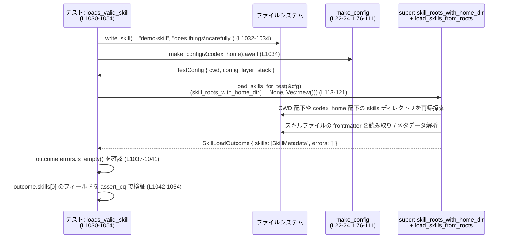

# core-skills/src/loader_tests.rs

## 0. ざっくり一言

`core-skills/src/loader_tests.rs` は、「スキルローダー」モジュール（`super::*`）の挙動を検証する統合テスト群と、そのためのヘルパー関数をまとめたファイルです。  
スキル探索ルートの決定、メタデータのパース、シンボリックリンクや深さ制限など、セキュリティ・堅牢性に関わるコアロジックの契約をテストで定義しています。

---

## 1. このモジュールの役割

### 1.1 概要

- このモジュールは **スキルローダーの公開 API**（`load_skills_from_roots`、`skill_roots_from_layer_stack`、`skill_roots` など）の期待される挙動をテストで規定します。
- テスト用の一時ディレクトリ・設定 (`ConfigLayerStack`)・スキルファイル群を構築し、それに対してスキルローダーを実行して **`SkillLoadOutcome` の `skills` / `errors` が期待通りか**を検証します。
- 特に、スキルの探索ルート、メタデータの検証、シンボリックリンク、探索深さ、重複スキル名・パスの扱い、ポリシー（暗黙呼び出し可否・対応プロダクト）といったコアな契約をカバーしています。

### 1.2 アーキテクチャ内での位置づけ

このファイルは「テストモジュール」であり、実装本体は `super` モジュール（ファイル名はこのチャンクからは不明）にあります。依存関係の概要は次の通りです。

```mermaid
graph TD
  TestMod["loader_tests.rs (L17-1715)"]
  Loader["super::skill loader<br/>load_skills_from_roots 等（実装は別ファイル）"]
  Config["codex_config::ConfigLayerStack<br/>& ConfigLayerEntry (L17-20, L76-111)"]
  Proto["codex_protocol::protocol::*<br/>SkillScope, Product (L7-8)"]
  FS["ファイルシステム std::fs<br/>+ symlink (L79-84, L785-793)"]
  Home["home_dir()（super 側, L1710-1712）"]

  TestMod -->|make_config_for_cwd<br/>project_layers_for_cwd| Config
  TestMod -->|skill_roots_from_layer_stack<br/>skill_roots| Loader
  TestMod -->|load_skills_from_roots| Loader
  Loader -->|スキル探索/メタデータ読込| FS
  Loader -->|SkillLoadOutcome<br/>skills/errors| TestMod
  Loader -->|SkillScope/Product の利用| Proto
  Loader -->|home_dir() によるルート追加| Home
```

- **テストモジュール**（本ファイル）は、`ConfigLayerStack` と一時ディレクトリ階層を構築し、`super` の API を呼び出します（例: `load_skills_for_test` 内, `core-skills/src/loader_tests.rs:L113-121`）。
- 実装本体（`Loader`）はこのチャンクには含まれませんが、テストのアサーションから、公開 API の入出力契約が読み取れます。

### 1.3 設計上のポイント（テストから読み取れる契約）

- **設定レイヤとスコープの対応**  
  - `ConfigLayerStack` 内の System/User/Project レイヤに応じて、`SkillScope::System / ::User / ::Repo / ::Admin` のスキル探索ルートが決まる（`skill_roots_from_layer_stack` のテスト, L133-244）。
- **スキル探索ルートの優先順位と重複処理**
  - 同一パスから複数スコープで探索しようとしても、**先に渡したルートが優先される**（`deduplicates_by_path_preferring_first_root`, L1410-1444）。
  - ただし **スキル名の重複は許容**し、別スコープ・別パスのスキルとして両方残す（L1447-1496, L1499-1569）。
- **メタデータ検証と長さ制限**
  - 名前・説明・short-description・default_prompt に対して明示的な最大長があり、超過するとエラーまたは無視される（例: L1161-1183, L1213-1237, L691-741）。
- **ファイルシステム安全性**
  - シンボリックリンクされたディレクトリはスコープにより挙動が異なる（User/Admin/Repo では許可、System では無視, L795-985）。
  - シンボリックリンクされた `skills.md` ファイルは User スコープでは無視される（L829-850）。
  - シンボリックリンクによる循環があっても無限ループしない（L852-885）。
  - アイコンパスは `assets/` 以下に制限され、`..` を含むパスは拒否される（L744-783）。
- **非同期テスト環境**
  - 多くのテストは `#[tokio::test]` で実行されるが、`load_skills_from_roots` 自体は同期関数として呼び出されている（例: L343-441, L601-649）。

---

## 2. 主要な機能一覧（コンポーネントインベントリー）

このセクションでは、本ファイルに定義されている主なコンポーネント（定数・構造体・関数）を一覧します。  
行範囲は `core-skills/src/loader_tests.rs:L開始-終了` 形式で記載します。

### 2.1 定数・構造体

| 名前 | 種別 | 役割 / 用途 | 行範囲 |
|------|------|-------------|--------|
| `REPO_ROOT_CONFIG_DIR_NAME` | `const &str` | プロジェクト（リポジトリ）内の設定ディレクトリ名。`.codex` 固定。テスト内のパス構築に利用。 | L15 |
| `TestConfig` | `struct` | テスト用の設定束ね構造体。`cwd: PathBuf` と `config_layer_stack: ConfigLayerStack` を保持し、`load_skills_for_test` に渡す。 | L17-20 |

### 2.2 ヘルパー関数（設定・パス関連）

| 関数名 | 種別 | 役割 / 用途 | 行範囲 |
|--------|------|-------------|--------|
| `make_config` | `async fn` | テスト用の `TestConfig` を作成する高レベルヘルパー。`codex_home` を CWD とみなして `make_config_for_cwd` を呼ぶ。 | L22-24 |
| `config_file` | `fn` | 相対パスから `AbsolutePathBuf` を生成するヘルパー。パスが絶対であることを `expect` で保証。 | L26-28 |
| `project_layers_for_cwd` | `fn` | CWD から上位ディレクトリをたどり、`.git` までの間に存在する `.codex` ディレクトリを `ConfigLayerEntry::Project` として列挙。 | L30-74 |
| `make_config_for_cwd` | `async fn` | System/User と `project_layers_for_cwd` の結果をまとめて `ConfigLayerStack` を構築し、`TestConfig` を返す。 | L76-111 |
| `load_skills_for_test` | `fn` | 実装側 `skill_roots_with_home_dir` と `load_skills_from_roots` を組み合わせて呼び出すテスト用ラッパー。`home_dir` は常に `None`。 | L113-121 |
| `mark_as_git_repo` | `fn` | 指定ディレクトリに `.git` ファイルを書き、Git リポジトリであると見なせる状態を作る。`project_layers_for_cwd` やローダーの「リポジトリ検出」のテストに使用。 | L123-127 |
| `normalized` | `fn` | `canonicalize_path`（実装は super 側と推定）で正規化したパスを返すヘルパー。失敗した場合は元のパスを返す。 | L129-131 |

### 2.3 ヘルパー関数（スキルファイル生成）

| 関数名 | 種別 | 役割 / 用途 | 行範囲 |
|--------|------|-------------|--------|
| `write_skill` | `fn` | `codex_home/skills/<dir>/SKILLS_FILENAME` に YAML frontmatter 付きスキルファイルを生成。User/System 共通の土台。 | L295-297 |
| `write_system_skill` | `fn` | `codex_home/skills/.system/<dir>/...` にシステムスキルを生成。System スコープ用のテストで使用。 | L299-306 |
| `write_skill_at` | `fn` | 任意の `root` 直下に `<dir>/SKILLS_FILENAME` を生成し、`name` と `description` を frontmatter に書き込む。改行をインデントして複数行 description に対応。 | L308-317 |
| `write_raw_skill_at` | `fn` | frontmatter 全体を文字列で渡してスキルファイルを生成する低レベルヘルパー。name 欠如など、フレキシブルなテストに使用。 | L319-325 |
| `write_skill_metadata_at` | `fn` | `skill_dir/SKILLS_METADATA_DIR/SKILLS_METADATA_FILENAME` に JSON/YAML 形式のメタデータをそのまま書き込む。 | L328-336 |
| `write_skill_interface_at` | `fn` | インターフェース用メタデータを `write_skill_metadata_at` に委譲するエイリアス。 | L339-341 |

### 2.4 ヘルパー関数（UNIX シンボリックリンク）

| 関数名 | 種別 | 役割 / 用途 | 行範囲 |
|--------|------|-------------|--------|
| `symlink_dir` | `fn`（`#[cfg(unix)]`） | ディレクトリ用のシンボリックリンクを作成。シンボリックリンク経由のスキル探索テストに使用。 | L785-788 |
| `symlink_file` | `fn`（`#[cfg(unix)]`） | ファイル用のシンボリックリンクを作成。シンボリックリンクされたスキルファイルを無視する挙動のテストに使用。 | L790-793 |

### 2.5 テスト関数一覧

テストは大きく以下のカテゴリに分かれます。各テストの詳細な説明は後続セクションでまとめて扱います。

#### ルート決定・Config レイヤ関連

| 関数名 | 役割 / 用途 | 行範囲 |
|--------|-------------|--------|
| `skill_roots_from_layer_stack_maps_user_to_user_and_system_cache_and_system_to_admin` | System/User レイヤから `SkillScope::User/System/Admin` へのルートマッピングを検証。 | L133-186 |
| `skill_roots_from_layer_stack_includes_disabled_project_layers` | 無効化された Project レイヤ（untrusted）も探索対象に含まれることを検証。 | L188-244 |
| `loads_skills_from_home_agents_dir_for_user_scope` | `$HOME/.agents/skills` 配下から User スコープのスキルがロードされることを検証。 | L246-293 |
| `skill_roots_include_admin_with_lowest_priority` | `super::skill_roots` が User → (homeベースUser) → System → Admin の順でルートを返すことを検証。 | L1700-1715 |

#### メタデータ（dependencies / interface / policy）

| 関数名 | 役割 / 用途 | 行範囲 |
|--------|-------------|--------|
| `loads_skill_dependencies_metadata_from_yaml` | JSON 形式の `dependencies.tools` メタデータを `SkillDependencies` / `SkillToolDependency` として読み込む挙動を検証。 | L343-441 |
| `loads_skill_interface_metadata_from_yaml` | YAML 形式の `interface` メタデータから UI 情報（表示名、short_description、アイコン、ブランドカラー、デフォルトプロンプト）を読み込む挙動を検証。 | L443-495 |
| `accepts_icon_paths_under_assets_dir` | `assets/` 以下のアイコンパスのみ許可し、正しく `SkillInterface` のパスへ解決されることを検証。 | L601-649 |
| `ignores_invalid_brand_color` | `brand_color` が期待フォーマット（例: `#RRGGBB`）でない場合、`interface` 全体が無視されることを検証。 | L651-688 |
| `ignores_default_prompt_over_max_length` | `default_prompt` が `MAX_DEFAULT_PROMPT_LEN` を超えると無視されることを検証。 | L691-741 |
| `drops_interface_when_icons_are_invalid` | アイコンパスに問題がある場合、`interface` 全体を無効化する挙動を検証。 | L744-783 |
| `loads_skill_policy_from_yaml` | `policy.allow_implicit_invocation` を bool として読み込み、false なら暗黙呼び出し対象から外れることを検証。 | L498-529 |
| `empty_skill_policy_defaults_to_allow_implicit_invocation` | `policy: {}` の場合、allow_implicit_invocation が None（デフォルト許可）として扱われること、および暗黙呼び出し対象に含まれることを検証。 | L531-564 |
| `loads_skill_policy_products_from_yaml` | `policy.products` 文字列配列から `Product` 列挙体へのマッピング（`codex`, `CHATGPT`, `atlas`）を検証。 | L566-599 |

#### スキル本体・説明・short-description の制限

| 関数名 | 役割 / 用途 | 行範囲 |
|--------|-------------|--------|
| `loads_valid_skill` | 正常なスキルファイルが期待通り `SkillMetadata` として読み込まれることを検証。 | L1030-1054 |
| `falls_back_to_directory_name_when_skill_name_is_missing` | frontmatter に `name` がない場合、ディレクトリ名をスキル名として利用する挙動を検証。 | L1057-1086 |
| `loads_short_description_from_metadata` | frontmatter の `metadata.short-description` が `SkillMetadata.short_description` に反映されることを検証。 | L1130-1158 |
| `enforces_short_description_length_limits` | `metadata.short-description` が `MAX_SHORT_DESCRIPTION_LEN` を超えるとエラーとしてスキップされることを検証。 | L1161-1183 |
| `skips_hidden_and_invalid` | `.hidden` ディレクトリ配下のスキルを無視し、frontmatter が不完全なスキルをエラーとして報告する挙動を検証。 | L1185-1211 |
| `enforces_length_limits` | description が `MAX_DESCRIPTION_LEN` を超えた場合の挙動（最初の1つはOK、2つ目はエラーとしてカウント）を検証。 | L1213-1237 |

#### シンボリックリンク・探索深さ

| 関数名 | 役割 / 用途 | 行範囲 |
|--------|-------------|--------|
| `loads_skills_via_symlinked_subdir_for_user_scope` | User スコープで symlink されたサブディレクトリ配下のスキルが読み込まれることを検証。 | L795-827 |
| `ignores_symlinked_skill_file_for_user_scope` | symlink されたスキルファイル（`skills.md`）を User スコープで無視する挙動を検証。 | L829-850 |
| `does_not_loop_on_symlink_cycle_for_user_scope` | symlink でディレクトリ循環がある場合でも無限ループしない（1 回だけスキルを読み込む）ことを検証。 | L852-885 |
| `loads_skills_via_symlinked_subdir_for_admin_scope` | Admin スコープでも symlink サブディレクトリからスキルが読まれることを検証。 | L888-921 |
| `loads_skills_via_symlinked_subdir_for_repo_scope` | Repo スコープでも symlink サブディレクトリからスキルが読まれることを検証。 | L924-960 |
| `system_scope_ignores_symlinked_subdir` | System スコープでは symlink されたサブディレクトリを無視する挙動を検証。 | L963-985 |
| `respects_max_scan_depth_for_user_scope` | 再帰探索の最大深さを超えたディレクトリ配下のスキルは読み込まれないことを検証。 | L987-1027 |

#### プロジェクト/リポジトリスコープでの探索

| 関数名 | 役割 / 用途 | 行範囲 |
|--------|-------------|--------|
| `loads_skills_from_repo_root` | Git リポジトリルートの `.codex/skills` から Repo スコープのスキルをロードする挙動を検証。 | L1239-1270 |
| `loads_skills_from_agents_dir_without_codex_dir` | `.codex` がなくても `repo/.agents/skills` から Repo スコープのスキルをロードする挙動を検証。 | L1273-1305 |
| `loads_skills_from_all_codex_dirs_under_project_root` | プロジェクトルート配下の複数 `.codex/skills`（ネスト含む）から全てのスキルをロードする挙動を検証。 | L1308-1369 |
| `loads_skills_from_codex_dir_when_not_git_repo` | Git でない単なるディレクトリでも、カレントディレクトリ直下の `.codex/skills` から Repo スコープのスキルをロードする挙動を検証。 | L1372-1407 |
| `repo_skills_search_does_not_escape_repo_root` | Git リポジトリ外の `.codex/skills` は Repo スコープ探索の対象外であることを検証。 | L1572-1599 |
| `loads_skills_when_cwd_is_file_in_repo` | CWD がリポジトリ内の「ファイル」であっても、そのリポジトリルートから `.codex/skills` を探索できることを検証。 | L1601-1639 |
| `non_git_repo_skills_search_does_not_walk_parents` | Git でない場合は親ディレクトリまでさかのぼって `.codex/skills` を探索しない挙動を検証。 | L1642-1668 |

#### キャッシュ・重複名/パス・プラグイン

| 関数名 | 役割 / 用途 | 行範囲 |
|--------|-------------|--------|
| `loads_skills_from_system_cache_when_present` | `skills/.system` キャッシュディレクトリから System スコープスキルをロードする挙動を検証。 | L1670-1697 |
| `deduplicates_by_path_preferring_first_root` | 同一パスを指す複数の `SkillRoot` が渡された場合、最初の root のスコープを採用する（同一パスからの二重読み込みを避ける）挙動を検証。 | L1410-1444 |
| `keeps_duplicate_names_from_repo_and_user` | Repo と User で同名スキルがあっても両方を残す挙動（スコープで区別）を検証。 | L1447-1496 |
| `keeps_duplicate_names_from_nested_codex_dirs` | ネストされた `.codex/skills` 間での同名スキルを両方保持するが、パスのソート順で並ぶ挙動を検証。 | L1499-1569 |
| `namespaces_plugin_skills_using_plugin_name` | プラグインディレクトリ（`.codex-plugin/plugin.json`）内のスキル名に `plugin_name:` をプレフィックスする挙動を検証。 | L1089-1127 |

---

## 3. 公開 API と詳細解説

ここでは、テストから読み取れる範囲で **実装側の公開 API** と、テスト内の重要なヘルパー関数を詳細に説明します。

### 3.1 型一覧（構造体・列挙体など）

> ※多くの型は `super::*` からインポートされており、このチャンクには定義がありません。フィールド構造はテストの使用箇所から推測できる範囲でのみ記述します。

| 名前 | 種別 | 役割 / 用途 | 根拠 |
|------|------|-------------|------|
| `TestConfig` | 構造体 | テスト用に CWD（`cwd: PathBuf`）と設定スタック（`config_layer_stack: ConfigLayerStack`）をまとめた構造体。`load_skills_for_test` に渡される。 | L17-20, L102-110, L113-121 |
| `ConfigLayerStack` | 構造体（外部 crate） | System/User/Project の設定レイヤーをスタックしたもの。`ConfigLayerStack::new` で構築され、`skill_roots_from_layer_stack` と `skill_roots` の入力となる。 | L4, L76-111, L133-163, L1705-1708 |
| `ConfigLayerEntry` | 構造体（外部 crate） | 各レイヤ（System/User/Project）の情報を表す。`ConfigLayerEntry::new` / `new_disabled` の引数から、ソース種別と TOML 値を保持すると推定される。 | L3, L86-99, L148-157, L203-215, L255-258 |
| `SkillRoot` | 構造体（super 側） | スキル探索の起点ディレクトリとスコープを表す。テストでは `SkillRoot { path: PathBuf, scope: SkillScope }` としてリテラル構築される。 | L899-902, L975-978, L1005-1008, L1105-1108, L1416-1425 |
| `SkillScope` | 列挙体（外部 crate） | スキルのスコープ。少なくとも `User`, `System`, `Repo`, `Admin` が存在。探索ルートとロード結果の両方で使用される。 | L8, L172-181, L230-239, L281-289 他多数 |
| `SkillLoadOutcome` | 構造体（super 側） | スキルロード結果。`skills: Vec<SkillMetadata>` と `errors: Vec<...>`、および `allowed_skills_for_implicit_invocation()` メソッドを持つと推定される。 | `load_skills_for_test` の戻り値型 L113-121、および多数のテストで `outcome.skills` / `outcome.errors` 利用 L272-280, L387-440, L512-528 など |
| `SkillMetadata` | 構造体（super 側） | 各スキルのメタ情報。少なくとも `name`, `description`, `short_description`, `interface`, `dependencies`, `policy`, `path_to_skills_md`, `scope` フィールドを持つ。 | L279-289, L394-439, L477-494 他多数 |
| `SkillDependencies` | 構造体（super 側） | スキルの依存ツールリストを表す。`tools: Vec<SkillToolDependency>` フィールドが存在。 | L400-435 |
| `SkillToolDependency` | 構造体（super 側） | 個々のツール依存を表す。`type`, `value`, `description`, `transport`, `command`, `url` などのフィールドを持つ。 | L402-433 |
| `SkillInterface` | 構造体（super 側） | UI 向けインターフェース情報。`display_name`, `short_description`, `icon_small`, `icon_large`, `brand_color`, `default_prompt` フィールドを持つ。 | L482-489, L635-641, L728-735 |
| `SkillPolicy` | 構造体（super 側） | 暗黙呼び出し可否や対応プロダクトを表すポリシー。`allow_implicit_invocation: Option<bool>`, `products: Vec<Product>` を持つ。 | L522-527, L554-558, L593-597 |
| `Product` | 列挙体（外部 crate） | プロダクト種別。少なくとも `Codex`, `Chatgpt`, `Atlas` が存在。`policy.products` として使用。 | L7, L593-597 |

> ※ `canonicalize_path`, `load_skills_from_roots`, `skill_roots_from_layer_stack`, `skill_roots`, `home_dir` はすべて `super` 側の関数であり、このファイルには実装は現れません。

### 3.2 関数詳細（7件）

#### 1. `load_skills_from_roots(roots: impl IntoIterator<Item = SkillRoot>) -> SkillLoadOutcome`

> 実装は `super` モジュール側にあり、このチャンクには現れません。以下はテストから読み取れる契約です。

**概要**

- 指定された複数のスキル探索ルート (`SkillRoot { path, scope }`) を走査してスキルファイルを読み込み、その結果を `SkillLoadOutcome` として返す関数です。
- スキルファイルの frontmatter・メタデータファイルをパースし、`SkillMetadata` ベクタとエラー情報を収集します。

**引数（推定）**

| 引数名 | 型 | 説明 | 根拠 |
|--------|----|------|------|
| `roots` | `impl IntoIterator<Item = SkillRoot>`（推定） | スキル探索ルートの集合。各ルートは `path` と `scope` を持つ。 | テストで `load_skills_from_roots([SkillRoot { .. }])` と呼び出し, L899-902, L975-978, L1005-1008 など |

**戻り値**

- `SkillLoadOutcome`  
  - `skills: Vec<SkillMetadata>`: 成功したスキルの一覧。各 `SkillMetadata` は `scope` フィールドでどのルートからのスキルかを示す。  
    - 例: Admin スコープ, L910-920。User スコープ, L815-825。Repo スコープ, L949-959。
  - `errors: Vec<...>`: 読み込み中に発生したエラー。  
    - 例: 無効な frontmatter の場合に1件のエラーを保持, L1185-1211。説明が長すぎる場合のエラー, L1213-1237。

**内部処理の流れ（テストから推定される高レベル動作）**

1. 各 `SkillRoot` について、`path` を起点に再帰的にディレクトリ探索を行う。ただし:
   - 再帰の最大深さは固定値（`MAX_SCAN_DEPTH` 相当）で制限されている（`respects_max_scan_depth_for_user_scope`, L987-1027）。
   - `.hidden` ディレクトリはスキップされる（`skips_hidden_and_invalid`, L1185-1211）。
2. 各ディレクトリでスキルファイル `SKILLS_FILENAME` を探し、見つかれば:
   - ファイル内容から YAML frontmatter をパース。失敗した場合はエラーとして `errors` に追加し、そのスキルは `skills` に含めない（L1196-1210）。
   - `name` が無い場合はディレクトリ名からスキル名を導出（L1057-1086）。
   - `description`・`metadata.short-description` の長さ検査を行い、制限超過はエラー扱い（L1161-1183, L1213-1237）。
3. `skill_dir/SKILLS_METADATA_DIR/SKILLS_METADATA_FILENAME` があれば:
   - JSON/YAML をパースし、`dependencies` や `policy`、`interface` を構築（L343-441, L498-599, L443-495, L601-649）。
   - `interface` のアイコンパスが `assets/` 以下にあり、かつパストラバーサルを含まないことを確認（L601-649, L744-783）。
   - `brand_color` などのフィールドが無効な場合は `interface` 全体を破棄する（L651-688, L744-783）。
4. 取得した情報から `SkillMetadata` を構築し、`scope` にはルートの `SkillScope` を設定する（多くのテストの期待値で確認）。
5. 同一パスに対する重複読み込みを避けるため、パスで一意にする。ただし:
   - **パスが同じ場合**: 最初のルートのスコープが優先（L1410-1444）。
   - **名前が同じでもパスが異なる場合**: 両方を保持（L1447-1496, L1499-1569）。
6. シンボリックリンク:
   - User/Admin/Repo スコープでは symlink されたサブディレクトリ配下も探索する（L795-827, L888-921, L924-960）。
   - System スコープでは symlink サブディレクトリを無視する（L963-985）。
   - symlink による循環を検出し、無限ループにならないようにする（L852-885）。
   - symlink された `SKILLS_FILENAME` 自体は User スコープでは無視される（L829-850）。

**Examples（使用例）**

テスト `loads_valid_skill` に近い使用例です（L1030-1054）。

```rust
use super::{load_skills_from_roots, SkillRoot};
use codex_protocol::protocol::SkillScope;
use std::path::PathBuf;

// 任意の skills ルートを用意する
let skills_root: PathBuf = /* ... skills ディレクトリ ... */;

// ルートを定義
let roots = [SkillRoot {
    path: skills_root,
    scope: SkillScope::User,
}];

// スキルをロード
let outcome = load_skills_from_roots(roots);

// エラーが無いことを確認
assert!(outcome.errors.is_empty());

// ロードされたスキル一覧を確認
for skill in &outcome.skills {
    println!("skill {} from scope {:?}", skill.name, skill.scope);
}
```

**Errors / Panics**

- エラーは `outcome.errors` に蓄積され、**panic ではなく Result 風に収集するスタイル**がテストから読み取れます。
  - 無効 frontmatter: `"missing YAML frontmatter"` を含むエラーメッセージ（L1185-1211）。
  - description が長すぎる: `"invalid description"` を含むエラーメッセージ（L1213-1237）。
  - short-description が長すぎる: `"invalid metadata.short-description"` を含むエラーメッセージ（L1161-1183）。
- テストでは `load_skills_from_roots` 自身が panic するケースは出てきません。panic の可能性はこのチャンクからは分かりません。

**Edge cases（エッジケース）**

- 隠しディレクトリ `.hidden` 配下のスキルは無視（L1185-1194）。
- frontmatter が閉じられていないスキルは `skills` に含めず `errors` のみ（L1196-1210）。
- description / short-description / default_prompt の最大長を超えるとエラーまたは無視（L1161-1183, L1213-1237, L691-741）。
- シンボリックリンクの扱いはスコープに依存（L795-827, L963-985）。
- 再帰深さが上限を超えたディレクトリ配下は探索されない（L987-1027）。

**使用上の注意点**

- **前提条件**: `SkillRoot.path` は実在するディレクトリであることが期待されます。存在しないパスの扱いはこのチャンクには現れません。
- 同じパスを指す `SkillRoot` を複数渡すと、先頭のスコープのみが有効になるため、**スコープを変えて再探索したい場面では同一パスで roots を重ねない**ことが必要です（L1410-1444）。
- 大量のディレクトリや深い階層を渡すと、再帰探索コストが高くなります。深さ制限はありますが、性能上の注意は実装側依存で、このチャンクからは詳細不明です。

---

#### 2. `skill_roots_from_layer_stack(stack, home_dir) -> Vec<SkillRoot>`

> 実装は `super` 側。ここではテストから読み取れる振る舞いを記述します。

**概要**

- `ConfigLayerStack` とオプションの home ディレクトリから、スキル探索ルート (`SkillRoot`) の一覧を生成する関数です。
- System/User/Project レイヤに応じて、User/System/Repo/Admin スコープのルートを構築します。

**引数（推定）**

| 引数名 | 型 | 説明 | 根拠 |
|--------|----|------|------|
| `stack` | `&ConfigLayerStack` | 設定レイヤスタック。System/User/Project レイヤが含まれる。 | 呼び出し L164-167, L222-225 |
| `home_dir` | `Option<&Path>` | `$HOME` ディレクトリ。この情報から `$HOME/.agents/skills` などの追加ルートを生成。 | L164-167, L222-225, L246-272 |

**戻り値**

- `Vec<SkillRoot>`  
  - 各 `SkillRoot` は `path` と `scope` を持ちます。

**内部処理の流れ（テストから読み取れる範囲）**

1. `ConfigLayerStack` 内に含まれる System/User/Project 各レイヤから、対応する config ディレクトリ（例: `etc/codex`、`$HOME/codex`、`<repo>/.codex`）を導出。
   - System レイヤ → System config ディレクトリ（例: `tmp/etc/codex`）  
     → `SkillScope::Admin` 用の `skills` ルート（L138-147, L169-183）。
   - User レイヤ → User config ディレクトリ（例: `home/codex`）  
     → `SkillScope::User` 用の `skills` ルートと `skills/.system` ルート（L138-147, L169-183）。
   - Project レイヤ（`.codex` ディレクトリ）→ `SkillScope::Repo` 用の `skills` ルート（L196-201, L227-241）。
2. `home_dir` が Some の場合は、`home_dir/.agents/skills` を `SkillScope::User` として追加する（L172-176, L233-235, L265-272）。
3. レイヤが disabled であっても、Project レイヤは Repo スコープのルートとして含める（L203-215, L222-241）。

**Examples（使用例）**

テスト `skill_roots_from_layer_stack_maps_user_to_user_and_system_cache_and_system_to_admin`（L133-186）に相当:

```rust
let layers = vec![
    // System レイヤ
    ConfigLayerEntry::new(
        ConfigLayerSource::System { file: system_file },
        TomlValue::Table(toml::map::Map::new()),
    ),
    // User レイヤ
    ConfigLayerEntry::new(
        ConfigLayerSource::User { file: user_file },
        TomlValue::Table(toml::map::Map::new()),
    ),
];

let stack = ConfigLayerStack::new(
    layers,
    ConfigRequirements::default(),
    ConfigRequirementsToml::default(),
)?;

// home フォルダを与える
let roots = skill_roots_from_layer_stack(&stack, Some(&home_folder));

let got: Vec<(SkillScope, PathBuf)> =
    roots.into_iter().map(|root| (root.scope, root.path)).collect();
```

**Errors / Panics**

- `skill_roots_from_layer_stack` 自体がエラーを返すかどうかは、このチャンクからは分かりません（テスト側では `?` でエラー伝播しているのは `ConfigLayerStack::new` のみ, L158-162, L216-220）。
- 不正なレイヤ構成に対する挙動はテストされておらず、このチャンクからは読み取れません。

**Edge cases**

- Project レイヤが `new_disabled` で追加されていても、Repo スコープのスキルルートとして含める（L203-215, L227-241）。
- `home_dir` を `None` にした場合のルート構成は、このファイル内では `load_skills_for_test` からのみ使用されており、詳細な確認テストはありません（`home_dir` を None に固定, L113-121）。

**使用上の注意点**

- テストからは、**ConfigLayerStack のレイヤ順序**がルートの優先順位に影響するかどうかは分かりません。必要であれば実装側のドキュメント確認が必要です。
- `home_dir` を与えると User スコープルートが増えるため、User スキルの探索範囲が広がります（L246-272）。

---

#### 3. `skill_roots(config_layer_stack, cwd, extra_roots) -> Vec<SkillRoot>`

> 実装は `super` 側。`skill_roots_include_admin_with_lowest_priority` テストから分かる範囲を記述します。

**概要**

- `ConfigLayerStack`、カレントワーキングディレクトリ（CWD）、追加ルートを元に、最終的なスキル探索ルート一覧を返す関数です。
- Admin スコープのルートを **最も優先度の低い末尾**に配置する仕様を持ちます。

**引数（推定）**

| 引数名 | 型 | 説明 | 根拠 |
|--------|----|------|------|
| `config_layer_stack` | `&ConfigLayerStack` | 設定レイヤスタック。User/System/Project 情報を保持。 | L1705-1708 |
| `cwd` | `&Path`（`&PathBuf`） | 現在の作業ディレクトリ。Repo スコープのルート決定などに使用。 | L1705-1708 |
| `extra_roots` | `Vec<_>` | 追加の `SkillRoot` または類似構造体と推定される。ここでは常に `Vec::new()`。 | L1705-1708 |

**戻り値**

- `Vec<SkillRoot>`: 探索順に並んだルート一覧。

**内部処理の流れ（テストから読み取れる範囲）**

1. `ConfigLayerStack` および `cwd` から、User/System/Repo のルートを決定する（詳細は `skill_roots_from_layer_stack` および repo 関連テスト群参照）。
2. 実行環境の `home_dir()` の戻り値に応じて、User スコープのルート数が決まる。
   - `home_dir().is_some()` の場合、User スコープが 2 つ現れることを前提に `expected` ベクタを構築（L1709-1713）。
3. 最後に Admin スコープのルートを追加し、最も低い優先度を与える（L1713-1714）。

**Examples（使用例）**

テスト（L1700-1715）からの要約:

```rust
let cfg = make_config(&codex_home).await;

// skill_roots を取得
let roots = super::skill_roots(&cfg.config_layer_stack, &cfg.cwd, Vec::new());

// スコープだけ取り出して確認
let scopes: Vec<SkillScope> = roots.into_iter().map(|r| r.scope).collect();

// 期待される順序
let mut expected = vec![SkillScope::User, SkillScope::System];
if home_dir().is_some() {
    expected.insert(1, SkillScope::User); // 二つ目の User
}
expected.push(SkillScope::Admin);

assert_eq!(scopes, expected);
```

**Errors / Panics**

- この関数がエラーを返すかどうかは不明です。テストでは `skill_roots` の結果をそのまま利用しており、`Result` ではない形で使われています（L1705-1708）。

**Edge cases & 注意点**

- Admin スコープは常に最後に配置されるため、**ユーザー／プロジェクト／システムのスキルで上書き可能**な設計思想が示唆されます（L1709-1714）。
- `home_dir()` が None の環境では User スコープのルート数と順序が変わるため、テスト基盤側で `home_dir` を固定する必要がある場合があります。

---

#### 4. `project_layers_for_cwd(cwd: &Path) -> Vec<ConfigLayerEntry>`

**概要**

- CWD から上位ディレクトリをたどり、`.git` が見つかるまでの間に存在する `.codex` ディレクトリを `ConfigLayerEntry::Project` として列挙するテスト用ヘルパーです。
- 実際のプロジェクト設定レイヤがどのように決定されるかを模したロジックになっています。

**引数**

| 引数名 | 型 | 説明 |
|--------|----|------|
| `cwd` | `&Path` | 現在の作業ディレクトリ、またはファイルパス。ファイルの場合は親ディレクトリが CWD として扱われます。 |

**戻り値**

- `Vec<ConfigLayerEntry>`: CWD からプロジェクトルートまでの `.codex` ディレクトリを Project レイヤとして列挙したもの。

**内部処理の流れ**

1. `cwd` がディレクトリならそのまま、ファイルなら `parent()` を取得して `cwd_dir` とする（L31-37）。
2. `cwd_dir` から祖先ディレクトリを遡り、`.git` が存在する最初のディレクトリを `project_root` とする。存在しない場合は `cwd_dir` 自身（L38-42）。
3. `cwd_dir` から上に向かって `ancestors()` を走査し、`project_root` までを含むリストを作る。`scan` を用いて `project_root` に到達したら打ち切る（L44-55）。  
   → このリストを逆順にして、プロジェクトルートに近い順に並べ直す（L57-58）。
4. 各ディレクトリに対して `.codex` サブディレクトリが存在すれば、`ConfigLayerEntry::new(ConfigLayerSource::Project { dot_codex_folder: ... }, empty_toml)` を生成し、結果ベクタに追加（L59-73）。

**Examples（使用例）**

```rust
let cwd = Path::new("/tmp/repo/nested/inner/file.rs");
let project_layers = project_layers_for_cwd(cwd);

// ここで project_layers には /tmp/repo/.codex や /tmp/repo/nested/.codex などが
// 存在する場合、それぞれが Project レイヤとして含まれる。
```

**Errors / Panics**

- `cwd` がファイルで、`parent()` が `None` になるケースでは `expect("file cwd should have a parent directory")` で panic します（L34-36）。
- `.codex` パスを `AbsolutePathBuf` に変換できなければ `expect` で panic します（L66-67）。

**Edge cases / 注意点**

- `.git` が存在しない場合、`project_root` は `cwd_dir` になり、それより上の `.codex` は探索されません（L38-42）。
- `.codex` が一切存在しない場合、空ベクタを返します。
- この関数はテスト専用であり、実運用コードが同じアルゴリズムを使っているかどうかは、このチャンクからは分かりません。

---

#### 5. `make_config_for_cwd(codex_home: &TempDir, cwd: PathBuf) -> TestConfig`

**概要**

- テスト用に System/User/Project の各設定レイヤを組み立てた `ConfigLayerStack` を作り、`TestConfig` を返すヘルパーです。
- 実際の CLI 実行時に近いレイヤ構成を、仮想の `codex_home` ディレクトリ上に再現します。

**引数**

| 引数名 | 型 | 説明 |
|--------|----|------|
| `codex_home` | `&TempDir` | テスト用 `$CODEX_HOME` ルートディレクトリ。System/User 設定の基点になります。 |
| `cwd` | `PathBuf` | CWD として扱うパス。プロジェクトレイヤ決定に使用。 |

**戻り値**

- `TestConfig`（L102-110）  
  - `cwd`: 渡された `cwd`。  
  - `config_layer_stack`: System/User/Project レイヤを含む `ConfigLayerStack`。

**内部処理の流れ**

1. `codex_home` 直下に `CONFIG_TOML_FILE`（User）と `etc/codex/config.toml`（System）のパスを組み立てる（L77-78）。
2. System config の親ディレクトリを `create_dir_all` で作成（L79-84）。
3. System と User の `ConfigLayerEntry::new` を作成し、空の `TomlValue::Table` を設定値として与える（L86-99）。
4. `project_layers_for_cwd(&cwd)` で取得した Project レイヤエントリを拡張（L100）。
5. 以上のレイヤを `ConfigLayerStack::new` に渡し、`ConfigRequirements::default()` と `ConfigRequirementsToml::default()` を用いてスタックを構築（L104-108）。
6. `TestConfig { cwd, config_layer_stack }` を返す（L102-110）。

**Errors / Panics**

- `ConfigLayerStack::new` が失敗すると `expect("valid config layer stack")` で panic（L104-110）。
- System config の parent が取得できない場合にも `expect` で panic（L81-82）。

**Edge cases / 注意点**

- 実際の設定ファイルの中身は空の TOML テーブルとして与えられており、スキルローダーはこれらの内容に依存しない前提でテストが構成されています（L86-99）。
- `cwd` が非ディレクトリの場合でも、`project_layers_for_cwd` が内部で適切に親ディレクトリを扱うため、特別なケアは不要です（L30-37）。

---

#### 6. `load_skills_for_test(config: &TestConfig) -> SkillLoadOutcome`

**概要**

- 実装側 API（`skill_roots_with_home_dir` と `load_skills_from_roots`）をまとめて呼び出すテスト専用ラッパーです。
- 実運用環境の `$HOME` を使わずに、常に「home_dir: None」でテストできるようにする役割を持ちます。

**引数**

| 引数名 | 型 | 説明 |
|--------|----|------|
| `config` | `&TestConfig` | CWD と設定レイヤスタックを含むテスト用構造体。 |

**戻り値**

- `SkillLoadOutcome`: スキルローダーの結果。

**内部処理の流れ**

1. コメントで「実際の `$HOME/.agents/skills` をスキャンしないためのテスト専用ラッパー」であることが明示されています（L114-115）。
2. `super::skill_roots_with_home_dir(&config.config_layer_stack, &config.cwd, /*home_dir*/ None, Vec::new())` を呼び出し、ルート一覧を取得（L115-120）。
   - 第3引数に `None` を渡すことで、実行環境の HOME に依存しない挙動を保証。
3. 得られたルートを `super::load_skills_from_roots(...)` に渡し、その戻り値をそのまま返す（L115-121）。

**Examples**

多くの `#[tokio::test]` で同じパターンが使われています（例: L343-441, L1030-1054）:

```rust
let codex_home = tempfile::tempdir().expect("tempdir");
// スキルファイルなどを codex_home 配下に作成 ...

let cfg = make_config(&codex_home).await;
let outcome = load_skills_for_test(&cfg);

assert!(outcome.errors.is_empty());
assert_eq!(outcome.skills.len(), 1);
```

**注意点**

- 実運用コードで `skill_roots_with_home_dir` を直接使う場合は、`home_dir()` の戻り値などを渡す可能性がありますが、テストでは常に `None` として固定されています。
- `extra_roots` 的な第4引数に `Vec::new()` が渡されているため、追加ルートのテストはこのラッパーを通じては行われていません。

---

#### 7. `write_skill_at(root: &Path, dir: &str, name: &str, description: &str) -> PathBuf`

**概要**

- 指定ルート配下に、YAML frontmatter 形式のスキルファイルを作成するテスト用ヘルパーです。
- description の改行をインデントし、`description: |-\n` スタイルのブロックスカラを生成します。

**引数**

| 引数名 | 型 | 説明 |
|--------|----|------|
| `root` | `&Path` | `skills` ディレクトリなど、スキルディレクトリ群のルート。 |
| `dir` | `&str` | ルートからのサブディレクトリ。実際のスキルディレクトリ名になります。 |
| `name` | `&str` | スキル名。frontmatter の `name` に使用。 |
| `description` | `&str` | 説明文。複数行の場合はインデントして YAML ブロックに埋め込まれる。 |

**戻り値**

- `PathBuf`: 生成されたスキルファイル (`<root>/<dir>/SKILLS_FILENAME`) のパス。

**内部処理の流れ**

1. `skill_dir = root.join(dir)` を作成し、`create_dir_all` でディレクトリを作成（L309-310）。
2. `description.replace('\n', "\n  ")` で改行後に 2 スペースを追加し、YAML ブロックスカラに適した形に整形（L311-312）。
3. `format!("---\nname: {name}\ndescription: |-\n  {indented_description}\n---\n\n# Body\n")` で frontmatter と本文を含むコンテンツを生成（L312-313）。
4. `path = skill_dir.join(SKILLS_FILENAME)` に書き込み、`path` を返す（L314-316）。

**Examples**

```rust
let root = codex_home.path().join("skills");
let skill_path = write_skill_at(&root, "demo", "demo-skill", "does things\ncarefully");

// skill_path には .../skills/demo/<SKILLS_FILENAME> が入る
```

**Errors / Panics**

- `create_dir_all` と `fs::write` は `unwrap()` されており、失敗すると panic します（L310, L315）。
- これはテスト専用ヘルパーであり、実運用コードでの使用は想定されていません。

**Edge cases / 注意点**

- description に改行が多い場合もすべて `\n` に置換されるため、YAML 的に問題ない形で保存されます。
- description の内容自体の妥当性（長さ制限など）は `load_skills_from_roots` 側の責務となります（L1213-1237）。

---

### 3.3 その他の関数

- セクション 2.5 で列挙したテスト関数は、すべて「`load_skills_from_roots` および関連 API の契約」をカバーする用途のものであり、個別の内部ロジックは持ちません。
- 必要に応じて、特定のシナリオ（シンボリックリンク、ポリシー、プラグインなど）を参照する場合には、2.5 の表と行番号を起点にコードを確認するのが有用です。

---

## 4. データフロー

ここでは代表的なシナリオとして、`loads_valid_skill` テストにおける処理の流れを示します。

### 4.1 `loads_valid_skill` におけるデータフロー（L1030-1054）

- テストは一時ディレクトリ配下にスキルファイルを生成し、`make_config` → `load_skills_for_test` → 実装側ローダーという流れでスキルをロードします。



**要点**

- テストは **実ファイルシステム** を用いてシナリオを構築し、ローダーの入出力契約を end-to-end で検証します。
- `load_skills_for_test` が `home_dir: None` を固定することで、テスト結果が実行環境の `$HOME` に依存しないようになっています（L113-121）。
- スキルのメタ情報（`name`, `description`, `scope`, `path_to_skills_md`）はすべて `SkillMetadata` 経由で検証されます（L1042-1053）。

---

## 5. 使い方（How to Use）

このファイルはテスト用ですが、実際のスキルローダー API の使い方もほぼ同じ形になります。

### 5.1 基本的な使用方法

実装側 API を直接使う場合の典型的なフローは、以下のようにテストコードと同じパターンになります（テスト `loads_skills_from_repo_root`, L1239-1270 を参考）。

```rust
use super::{load_skills_from_roots, SkillRoot};
use codex_protocol::protocol::SkillScope;
use std::path::PathBuf;

fn main() -> anyhow::Result<()> {
    // 1. スキル探索ルートを決める
    let repo_root: PathBuf = /* リポジトリルート */;
    let skills_root = repo_root.join(".codex").join("skills");

    let roots = [SkillRoot {
        path: skills_root,
        scope: SkillScope::Repo,
    }];

    // 2. スキルをロードする
    let outcome = load_skills_from_roots(roots);

    // 3. エラーを確認
    if !outcome.errors.is_empty() {
        for err in &outcome.errors {
            eprintln!("skill load error: {}", err.message);
        }
    }

    // 4. 成功したスキルを利用
    for skill in &outcome.skills {
        println!("Loaded skill '{}' in scope {:?}", skill.name, skill.scope);
    }

    Ok(())
}
```

### 5.2 よくある使用パターン

1. **Config からルートを自動決定する**

   テスト `skill_roots_from_layer_stack_maps_user_to_user_and_system_cache_and_system_to_admin`（L133-186）と同様に、`ConfigLayerStack` からルートを生成して利用できます。

   ```rust
   let stack = ConfigLayerStack::new(/* System/User/Project レイヤ */)?;
   let roots = skill_roots_from_layer_stack(&stack, Some(&home_folder));

   let outcome = load_skills_from_roots(roots);
   ```

2. **Repo と User を同時に読み込む**

   テスト `keeps_duplicate_names_from_repo_and_user`（L1447-1496）のように、Repo と User から同名スキルをロードし、スコープで区別します。

   ```rust
   let roots = [
       SkillRoot { path: repo_skills_root, scope: SkillScope::Repo },
       SkillRoot { path: user_skills_root, scope: SkillScope::User },
   ];
   let outcome = load_skills_from_roots(roots);

   // Repo 優先などのポリシーは、呼び出し側で outcome.skills の順序を見て判断する
   ```

3. **プラグインからのスキル namespace 付与**

   テスト `namespaces_plugin_skills_using_plugin_name`（L1089-1127）のように、プラグインディレクトリ内のスキルは `plugin_name:skill_name` 形式の名前でロードされます。

### 5.3 よくある間違い

```rust
// 間違い例: System と User で同一パスの SkillRoot を渡してしまう
let outcome = load_skills_from_roots([
    SkillRoot { path: root.clone(), scope: SkillScope::Repo },
    SkillRoot { path: root.clone(), scope: SkillScope::User },
]);
// → テスト deduplicates_by_path_preferring_first_root (L1410-1444) から、
//   Repo の方だけが有効になり、User スコープでは読み込まれない

// 正しい例: パスが異なるようにルートを構成する
let outcome = load_skills_from_roots([
    SkillRoot { path: repo_root,  scope: SkillScope::Repo },
    SkillRoot { path: user_root,  scope: SkillScope::User },
]);
```

```rust
// 間違い例: assets/ 以外の場所を指すアイコンパスを書いてしまう
// interface:
//   icon_small: "icon.png"   # assets 直下ではない
//   icon_large: "./assets/../logo.svg"  # パストラバーサル

// → drops_interface_when_icons_are_invalid (L744-783) のように interface 自体が無視される

// 正しい例: assets/ 以下のみを利用
// interface:
//   icon_small: "assets/icon.png"
//   icon_large: "./assets/logo.svg"
```

### 5.4 使用上の注意点（まとめ）

テストから読み取れる主な注意点をまとめます。

- **パスの安全性**
  - アイコンパスは `assets/` 以下に限定され、`..` を含むパスは許可されません（L744-783）。
  - シンボリックリンクされた skill ファイルは User スコープでは無視されます（L829-850）。
  - System スコープでは symlink ディレクトリ全体を無視します（L963-985）。
- **メタデータの長さ制限**
  - description: `MAX_DESCRIPTION_LEN` 文字まで（L1213-1237）。
  - short-description: `MAX_SHORT_DESCRIPTION_LEN` 文字まで（L1161-1183）。
  - default_prompt: `MAX_DEFAULT_PROMPT_LEN` 文字まで（L691-741）。
- **探索範囲**
  - Repo スコープの探索は Git リポジトリルートの外には出ません（L1572-1599）。
  - Git でないディレクトリでは親ディレクトリまでさかのぼって `.codex/skills` を探しません（L1642-1668）。
  - 再帰探索には深さ制限があります（L987-1027）。
- **重複スキル名**
  - 同名スキルが複数存在しても、**パスが異なれば両方ロード**されます（L1447-1496, L1499-1569）。

---

## 6. 変更の仕方（How to Modify）

このファイルはテストファイルなので、「機能追加・変更時にどのテストを触るべきか」という観点で整理します。

### 6.1 新しい機能を追加する場合

例: 新しいスコープ `SkillScope::Org` を追加し、そのスコープ向けルートを増やしたい場合。

1. **実装側（super モジュール）を変更**
   - `skill_roots_from_layer_stack` および `skill_roots` に `Org` 用ルート生成ロジックを追加。
2. **テスト側での追加・修正ポイント**
   - スコープ順序の契約が変わる場合は `skill_roots_include_admin_with_lowest_priority`（L1700-1715）に新しい期待順序を反映。
   - 新スコープルートが生成されるシナリオを追加したテストを新規に作成。
   - 必要ならば `loads_skills_from_...` 系のテスト（L1239-1407 付近）を参考に、新スコープ用のディレクトリ構成を作るヘルパーを追加。

3. **メタデータに新フィールドを追加する場合**
   - `SkillMetadata`・`SkillInterface` などにフィールドを追加したら、それを検証するテストをこのファイルに追加。
   - 短いサンプルとしては `loads_skill_interface_metadata_from_yaml`（L443-495）が参考になります。

### 6.2 既存の機能を変更する場合

- **探索範囲や深さ制限を変更する**
  - `respects_max_scan_depth_for_user_scope`（L987-1027）を修正し、新しい深さ制限に合わせて `within-depth` / `too-deep` のディレクトリ構成を更新します。
- **シンボリックリンクの扱いを変更する**
  - User/Admin/Repo/System ごとに対象となるテストは以下です:
    - User: L795-827, L829-850, L852-885
    - Admin: L888-921
    - Repo: L924-960
    - System: L963-985
  - 挙動の仕様が変わったら、対応するテストの期待値（`outcome.skills` の内容）が新仕様に一致するように更新します。
- **メタデータ検証ルール（長さ制限など）を変更する**
  - `enforces_short_description_length_limits`（L1161-1183）、`enforces_length_limits`（L1213-1237）、`ignores_default_prompt_over_max_length`（L691-741）などの閾値を修正。
  - 長さ制限を緩和/強化した場合は、テストに使用している `"x".repeat(...)` や `"\u{1F4A1}".repeat(...)` の繰り返し回数も調整する必要があります。

**共通の注意点**

- いずれの場合も、「どのテストがどの契約を表しているか」を理解した上で修正することが重要です。  
  行番号とセクション 2.5 の説明を手がかりに、影響範囲を確認すると安全です。

---

## 7. 関連ファイル

このモジュールと密接に関係するコンポーネントを列挙します。

| パス / モジュール | 役割 / 関係 |
|-------------------|------------|
| `super` モジュール（ファイル名不明） | `load_skills_from_roots`, `skill_roots_from_layer_stack`, `skill_roots`, `SkillLoadOutcome`, `SkillMetadata` など、スキルローダー本体の実装を提供します。このファイルからは `use super::*;` および各種型/関数名の使用のみが見えます（L1, L113-121 他）。 |
| `codex_config` クレート | `ConfigLayerStack`, `ConfigLayerEntry`, `ConfigRequirements`, `ConfigRequirementsToml` を提供し、スキルルート決定の元となる設定レイヤ情報を管理します（L2-6, L76-111, L133-163）。 |
| `codex_protocol::protocol` | `SkillScope`, `Product` 列挙体を提供し、スキルスコープや対象プロダクトの表現に使用されます（L7-8, L566-599 他）。 |
| `codex_utils_absolute_path::AbsolutePathBuf` | 絶対パスのみを扱うためのラッパー。テストでは config ファイルの場所を絶対パスとして扱うために使用されています（L9, L26-28, L145-146, L200-201）。 |
| `std::fs`, `std::os::unix::fs::symlink` | ファイル・ディレクトリの作成、書き込み、シンボリックリンク作成など、テスト用ファイルシステム環境構築に使用されます（L79-84, L123-127, L785-793 など）。 |
| `tempfile::TempDir` | テストごとに分離された一時ディレクトリを提供し、ファイルシステム状態がテスト間で干渉しないようにしています（L12, L136, L190 など）。 |

---

このレポートは、`core-skills/src/loader_tests.rs` に現れる情報のみを根拠として記述しています。  
`super` 側の実装詳細（具体的なアルゴリズムや内部構造）については、このチャンクには現れないため、「テストから読み取れる契約」の範囲に留めています。
