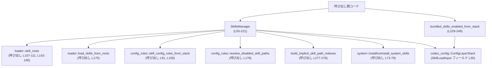
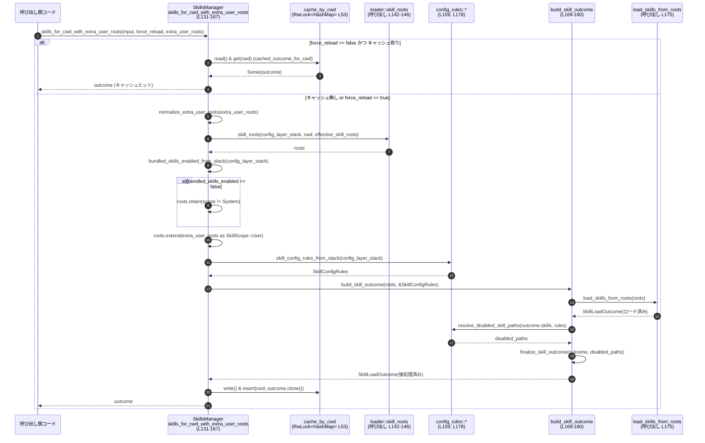

# core-skills/src/manager.rs コード解説

## 0. ざっくり一言

- スキルの探索・読み込み結果（`SkillLoadOutcome`）を、**カレントディレクトリや設定状態ごとにキャッシュしつつ取得する管理コンポーネント**です。  
- バンドル済みシステムスキルのインストール/アンインストールや、「バンドルスキル有効」設定の解釈もあわせて担当します。

---

## 1. このモジュールの役割

### 1.1 概要

- このモジュールは、Codex の「スキル」をどのディレクトリから読み込むかを決定し、実際にロードしてフィルタし、**再利用可能な形でキャッシュして提供する**ために存在します。  
  （`SkillsManager` 構造体とそのメソッド群が中心です。`core-skills/src/manager.rs:L50-55`）
- キャッシュのキーは大きく 2 種類あります。
  - **カレントディレクトリ（cwd）ごと**のキャッシュ（`cache_by_cwd`、`core-skills/src/manager.rs:L53`）
  - **有効なスキル設定状態ごと**のキャッシュ（`cache_by_config` と `ConfigSkillsCacheKey`、`core-skills/src/manager.rs:L54, L223-227`）
- 設定レイヤースタック (`ConfigLayerStack`) から「バンドルスキルが有効か」を解釈するヘルパー関数 `bundled_skills_enabled_from_stack` も提供します（`core-skills/src/manager.rs:L229-249`）。

### 1.2 アーキテクチャ内での位置づけ

このモジュールは、外部からは `SkillsManager` と `SkillsLoadInput` を通じて利用され、内部では他モジュールのユーティリティを組み合わせてスキルをロードします。

主な依存関係（このファイル内での `use` から読み取れる範囲）:

- 設定関連:  
  - `codex_config::ConfigLayerStack`（`core-skills/src/manager.rs:L8`）  
  - `codex_config::SkillsConfig`（`core-skills/src/manager.rs:L24`）
- プロトコル・スコープ:  
  - `codex_protocol::protocol::Product`（`core-skills/src/manager.rs:L9`）  
  - `codex_protocol::protocol::SkillScope`（`core-skills/src/manager.rs:L10`）
- スキルロード系:  
  - `crate::loader::{SkillRoot, load_skills_from_roots, skill_roots}`（`core-skills/src/manager.rs:L19-21`）
- 設定ルール・無効化判定:  
  - `crate::config_rules::{SkillConfigRules, resolve_disabled_skill_paths, skill_config_rules_from_stack}`（`core-skills/src/manager.rs:L16-18`）
- システムスキル管理:  
  - `crate::system::{install_system_skills, uninstall_system_skills}`（`core-skills/src/manager.rs:L22-23`）
- 結果後処理:  
  - `crate::SkillLoadOutcome` と `crate::build_implicit_skill_path_indexes`（`core-skills/src/manager.rs:L14-15`）  
  - `crate::filter_skill_load_outcome_for_product`（呼び出しのみ、`core-skills/src/manager.rs:L174-177`）

依存関係を簡略に図示すると、次のようになります。



> 図中の `SkillsManager (L50-221)` は `SkillsManager` 実装本体の行範囲を示します。

### 1.3 設計上のポイント

コードから読み取れる設計上の特徴は次の通りです。

- **責務の分割**  
  - `SkillsLoadInput` は、「どこから・どの設定でスキルを読むか」という入力パラメータの束を表します（`core-skills/src/manager.rs:L26-32`）。  
  - `SkillsManager` は、  
    - スキルルートの決定 (`skill_roots_for_config` / `skills_for_cwd_with_extra_user_roots`)  
    - 実際のロード処理の呼び出し (`build_skill_outcome`)  
    - 結果キャッシュ (`cache_by_cwd` / `cache_by_config`)  
    をまとめて担当します（`core-skills/src/manager.rs:L50-55, L57-221`）。
  - `ConfigSkillsCacheKey` は、「設定ベースのキャッシュキー」を表現する内部専用型です（`core-skills/src/manager.rs:L223-227`）。

- **状態と並行性**  
  - `SkillsManager` は内部に 2 つのキャッシュを持ち、それぞれ `RwLock<HashMap<...>>` で保護されています（`core-skills/src/manager.rs:L53-54`）。  
    - `RwLock`（読み書きロック）は、複数スレッドから同時アクセスされることを想定した設計です。
  - ロック取得時にポイズン（スレッドパニックによるロック汚染）が起きても、`unwrap_or_else(std::sync::PoisonError::into_inner)` で内部データを取り出して処理を継続する方針です（例: `core-skills/src/manager.rs:L98-101, L161-164, L185-187, L193-196`）。

- **エラーハンドリングの方針**  
  - システムスキルのインストールに失敗した場合は、エラーログを出力するのみでコンストラクタは `SkillsManager` を返します（`core-skills/src/manager.rs:L73-79`）。  
  - 設定のパース (`bundled_skills_enabled_from_stack`) が失敗した場合も、警告ログを出して **安全側（バンドルスキル有効）** に倒す設計です（`core-skills/src/manager.rs:L240-245`）。
  - このモジュール内には `panic!` 呼び出しはなく、標準ライブラリの `unwrap` もポイズン処理にのみ使われています。

- **キャッシュキーの設計**  
  - 設定ベースのキャッシュキー `ConfigSkillsCacheKey` は、  
    - ルートのパスとスコープ種別（`SkillScope` を `u8` にマッピング）  
    - スキル設定ルール `SkillConfigRules`  
    を組み合わせて構成されます（`core-skills/src/manager.rs:L223-227, L255-269`）。  
  - `roots` は `Vec<(PathBuf, u8)>` のまま保存されるため、**ルートの順序もキャッシュキーの一部**になります（`core-skills/src/manager.rs:L255-267`）。

---

## 2. 主要な機能一覧

このモジュールが提供する主な機能をまとめます。

- スキル読み込み入力の束ね (`SkillsLoadInput`)  
- スキルマネージャの構築と、システムスキルのインストール/アンインストール（`SkillsManager::new` / `new_with_restriction_product`）  
- 設定ベースのスキルロードとキャッシュ（`SkillsManager::skills_for_config`）  
- カレントディレクトリベースのスキルロードとキャッシュ（`SkillsManager::skills_for_cwd`）  
- 追加ユーザールートを含めたスキルロード（`SkillsManager::skills_for_cwd_with_extra_user_roots`）  
- スキル読み込み結果の後処理と、暗黙的呼び出し用インデックス構築（`build_skill_outcome` → `finalize_skill_outcome`）  
- キャッシュのクリア（`SkillsManager::clear_cache`）  
- 設定レイヤースタックから「バンドルスキル有効」フラグを判定するヘルパー（`bundled_skills_enabled_from_stack`）  

---

## 3. 公開 API と詳細解説

### 3.1 型一覧（構造体など）

| 名前 | 種別 | 公開性 | 役割 / 用途 | 定義位置 |
|------|------|--------|-------------|----------|
| `SkillsLoadInput` | 構造体 | `pub` | スキルロード時に必要な情報（`cwd`、有効なスキルルート、設定レイヤースタック、バンドルスキル有効フラグ）をまとめた入力オブジェクトです。 | `core-skills/src/manager.rs:L26-32` |
| `SkillsManager` | 構造体 | `pub` | スキルのロード・フィルタ・キャッシュ・システムスキルのインストール/アンインストールを統合的に管理するコンポーネントです。 | `core-skills/src/manager.rs:L50-55` |
| `ConfigSkillsCacheKey` | 構造体 | 非公開 | 設定ベースのキャッシュキー。スキルルートとスキル設定ルールの組で、`cache_by_config` のキーに使用されます。 | `core-skills/src/manager.rs:L223-227` |

### 3.2 関数詳細（主要 7 件）

#### `SkillsManager::new_with_restriction_product(codex_home: PathBuf, bundled_skills_enabled: bool, restriction_product: Option<Product>) -> Self`

**定義位置**: `core-skills/src/manager.rs:L62-81`

**概要**

- `SkillsManager` のフル機能コンストラクタです。  
- インスタンスを生成すると同時に、バンドルスキルの有効/無効設定に応じて **システムスキルのインストールまたはアンインストール** を行います（`core-skills/src/manager.rs:L67-79`）。

**引数**

| 引数名 | 型 | 説明 |
|--------|----|------|
| `codex_home` | `PathBuf` | Codex のホームディレクトリ。システムスキルの格納/削除に利用されます。 |
| `bundled_skills_enabled` | `bool` | バンドル済みシステムスキルを有効にするかどうか。`false` の場合はシステムスキルがアンインストールされます。 |
| `restriction_product` | `Option<Product>` | スキルロード結果を特定の `Product` に制限するためのオプション。`build_skill_outcome` 内で `filter_skill_load_outcome_for_product` に渡されます（`core-skills/src/manager.rs:L169-177`）。 |

**戻り値**

- 初期化済みの `SkillsManager` インスタンス。

**内部処理の流れ**

1. `SkillsManager` のフィールドを初期化します（`codex_home`, `restriction_product`, 2 種類のキャッシュ）（`core-skills/src/manager.rs:L67-72`）。
2. `bundled_skills_enabled` が `false` の場合、`uninstall_system_skills(&manager.codex_home)` を呼び出します（`core-skills/src/manager.rs:L73-77`）。
   - 戻り値は無視されるため、エラー時の挙動はこのチャンクからは不明です。
3. `bundled_skills_enabled` が `true` の場合、`install_system_skills(&manager.codex_home)` を呼び出します（`core-skills/src/manager.rs:L77-79`）。
   - 失敗した場合は `tracing::error!` でログを出すのみで、エラーは呼び出し元へは伝播しません。
4. 生成した `manager` を返します（`core-skills/src/manager.rs:L80`）。

**Examples（使用例）**

```rust
use std::path::PathBuf;
use codex_protocol::protocol::Product;
use core_skills::manager::SkillsManager; // 実際のパスはクレート構成によります

fn create_manager() -> SkillsManager {
    // Codex のホームディレクトリを指定する
    let codex_home = PathBuf::from("/path/to/codex_home"); // 任意のディレクトリ

    // Product::Codex に制限しつつ、バンドルスキルを有効にしたマネージャを作る
    let manager = SkillsManager::new_with_restriction_product(
        codex_home,
        true,                             // バンドルスキル有効
        Some(Product::Codex),            // Product による制限を有効化
    );

    manager
}
```

**Errors / Panics**

- この関数自体は `Result` を返さず、エラーを呼び出し元に伝播しません。  
- `install_system_skills` が `Err` を返した場合、`tracing::error!` にログを出しつつ処理を継続します（`core-skills/src/manager.rs:L77-79`）。  
- `uninstall_system_skills` の戻り値は無視されており、成功・失敗はここからは判別できません（`core-skills/src/manager.rs:L73-77`）。  
- 標準ライブラリの `unwrap` は使用していないため、この関数内での明示的な panic はありません。

**Edge cases（エッジケース）**

- `bundled_skills_enabled == false` の場合:
  - `skills/.system` 配下のキャッシュを削除するベストエフォートなクリーンアップが行われる旨のコメントがあります（`core-skills/src/manager.rs:L73-76`）。
  - 削除に失敗しても、ルート選択側で設定が強制されるため、スキルロード結果には反映される設計であることがコメントから読み取れます。
- `restriction_product == None` の場合:
  - `build_skill_outcome` 内の `filter_skill_load_outcome_for_product` がどのように振る舞うかは、このチャンクには現れません。

**使用上の注意点**

- コンストラクタ呼び出し時に、ファイルシステムへの変更（システムスキルのインストール/アンインストール）が行われる点に注意が必要です。  
  テストや一時的な環境では、`codex_home` の指定に注意する必要があります。  
- システムスキルのインストール失敗をエラーとして扱いたい場合は、`install_system_skills` の呼び出し側に別途ラッパーを設けるなどの拡張が必要になります。

---

#### `SkillsManager::skills_for_config(&self, input: &SkillsLoadInput) -> SkillLoadOutcome`

**定義位置**: `core-skills/src/manager.rs:L83-104`

**概要**

- すでに構築済みの設定 (`ConfigLayerStack`) を用いてスキルをロードし、**設定状態をキーとしたキャッシュ**を利用して `SkillLoadOutcome` を返す同期メソッドです。
- カレントディレクトリではなく、「実効スキル設定」単位でキャッシュされるため、同じディレクトリを共有する別セッション間での設定のにじみを防ぎます（コメントより、`core-skills/src/manager.rs:L83-88`）。

**引数**

| 引数名 | 型 | 説明 |
|--------|----|------|
| `input` | `&SkillsLoadInput` | スキルロードに必要な `cwd`, `effective_skill_roots`, `config_layer_stack` などを含む入力。ここでは主に `config_layer_stack` を利用します。 |

**戻り値**

- スキル読み込み結果 `SkillLoadOutcome`。  
  - この型の詳細はこのチャンクには定義がありませんが、少なくとも `skills` フィールドと `allowed_skills_for_implicit_invocation` メソッドなどを持つことが `build_skill_outcome`／`finalize_skill_outcome` の使用から分かります（`core-skills/src/manager.rs:L178, L277-278`）。

**内部処理の流れ**

1. `self.skill_roots_for_config(input)` を呼び出して、スキル探索ルートを決定します（`core-skills/src/manager.rs:L90`）。
2. `skill_config_rules_from_stack(&input.config_layer_stack)` で、設定スタックからスキル設定ルールを生成します（`core-skills/src/manager.rs:L91`）。
3. `config_skills_cache_key(&roots, &skill_config_rules)` で、`ConfigSkillsCacheKey` を生成します（`core-skills/src/manager.rs:L92`）。
4. `cached_outcome_for_config(&cache_key)` を呼び出して、既にキャッシュされた結果があればそれを返します（`core-skills/src/manager.rs:L93-95`）。
5. キャッシュがなければ、`self.build_skill_outcome(roots, &skill_config_rules)` を呼び出して新たな結果を構築します（`core-skills/src/manager.rs:L97-100`）。
6. `cache_by_config` の書き込みロックを取得し（`RwLock::write()`）、新しい結果をキャッシュに挿入します（`core-skills/src/manager.rs:L98-103`）。
7. 構築された `SkillLoadOutcome` を返します。

**Examples（使用例）**

```rust
use std::path::PathBuf;
use codex_config::ConfigLayerStack;
use core_skills::manager::{SkillsManager, SkillsLoadInput};

fn load_skills_for_config(
    manager: &SkillsManager,
    stack: ConfigLayerStack,
) -> crate::SkillLoadOutcome {
    // カレントディレクトリと有効なスキルルートを用意する
    let cwd = std::env::current_dir().unwrap();                 // 現在の作業ディレクトリ
    let effective_roots: Vec<PathBuf> = Vec::new();             // 追加のルートがあればここに入れる

    // 入力を構築する
    let input = SkillsLoadInput::new(
        cwd,
        effective_roots,
        stack,
        true,                                                   // bundled_skills_enabled
    );

    // 設定ベースでスキルをロードする
    let outcome = manager.skills_for_config(&input);            // 同期呼び出し

    outcome
}
```

**Errors / Panics**

- `cache_by_config.write().unwrap_or_else(...)` により、ロックポイズン時もパニックせずに内部データを継続利用します（`core-skills/src/manager.rs:L98-101`）。
- `skills_for_config` 自身は `Result` を返さず、`load_skills_from_roots` や `resolve_disabled_skill_paths` 内のエラーは完全には分かりません。

**Edge cases（エッジケース）**

- 同じ `ConfigLayerStack` だが別の `cwd` を持つ `SkillsLoadInput` を渡した場合:
  - `config_skills_cache_key` は `roots` と `SkillConfigRules` から構成されるため、`cwd` が異なっても実効ルートとルールが同じであればキャッシュヒットします（`core-skills/src/manager.rs:L255-269`）。
- `ConfigLayerStack` から得られるスキル設定が不変でも、`skill_roots` の戻り順序が変化した場合には、`roots` ベクタの順序が違うためキャッシュミスになる可能性があります（`Vec<(PathBuf, u8)>` がそのままキーとして使われているため、`core-skills/src/manager.rs:L255-267`）。

**使用上の注意点**

- 設定ベースのキャッシュを利用することで、**同一設定の繰り返しロードを避ける**ことができます。  
- 設定を変更したあとでこのメソッドを呼ぶ場合は、`ConfigLayerStack` 側の変更が `skill_roots` や `SkillConfigRules` に反映されることが前提です。  
- 設定変更を無視して古いキャッシュを利用したくない場合は、`ConfigSkillsCacheKey` の構成要素（ルートとルール）が変わるように設定を更新する必要があります。

---

#### `SkillsManager::skills_for_cwd(&self, input: &SkillsLoadInput, force_reload: bool) -> SkillLoadOutcome`

**定義位置**: `core-skills/src/manager.rs:L118-129`

**概要**

- カレントディレクトリ (`cwd`) をキーとしてスキルをロードし、**ディレクトリごとのキャッシュ**を利用する非同期メソッドです。
- 追加ユーザールートが不要なケースのショートカットであり、実際の処理は `skills_for_cwd_with_extra_user_roots` に委譲されます（`core-skills/src/manager.rs:L127-128`）。

**引数**

| 引数名 | 型 | 説明 |
|--------|----|------|
| `input` | `&SkillsLoadInput` | `cwd`, 有効なスキルルート、設定レイヤースタック、`bundled_skills_enabled` などを含む入力。ここでは `cwd` と `config_layer_stack` が主に使われます。 |
| `force_reload` | `bool` | `true` の場合、既存キャッシュを無視して再ロードを強制します。`false` の場合、キャッシュがあればそれを返します。 |

**戻り値**

- 非同期に計算される `SkillLoadOutcome`。`async fn` ですが戻り値型は `SkillLoadOutcome` であり、呼び出し側から見た型は `impl Future<Output = SkillLoadOutcome>` です。

**内部処理の流れ**

1. `force_reload == false` かつ `cache_by_cwd` に `cwd` キーのキャッシュが存在する場合、`cached_outcome_for_cwd` からその結果を即座に返します（`core-skills/src/manager.rs:L123-125`）。  
   - `cached_outcome_for_cwd` は `RwLock::read()` を使う読み取り専用キャッシュアクセスです（`core-skills/src/manager.rs:L205-210`）。
2. 上記条件に当てはまらない場合は、`skills_for_cwd_with_extra_user_roots(input, force_reload, &[])` を呼び出し、その `Future` を `await` して結果を返します（`core-skills/src/manager.rs:L127-128`）。

**Examples（使用例）**

```rust
use std::path::PathBuf;
use codex_config::ConfigLayerStack;
use core_skills::manager::{SkillsManager, SkillsLoadInput};

// 非同期コンテキストでの使用例
async fn load_for_current_dir(manager: &SkillsManager) -> crate::SkillLoadOutcome {
    // 前提: ConfigLayerStack はどこかで構築済み
    let stack: ConfigLayerStack = /* ... */ unimplemented!(); // 実装はこのチャンクにはありません

    let cwd = std::env::current_dir().unwrap();        // 現在の作業ディレクトリを取得
    let effective_roots: Vec<PathBuf> = Vec::new();    // 追加のルートがあればここに追加

    let input = SkillsLoadInput::new(
        cwd,
        effective_roots,
        stack,
        true,                                          // bundled_skills_enabled
    );

    // キャッシュを利用してスキルを取得する（force_reload = false）
    manager.skills_for_cwd(&input, false).await
}
```

**Errors / Panics**

- キャッシュ読み取り部 (`cached_outcome_for_cwd`) ではロックポイズンを `Err(err) => err.into_inner()` によって回避しており、panic にはなりません（`core-skills/src/manager.rs:L205-209`）。
- `skills_for_cwd` 自体は `Result` を返さず、失敗の表現は `SkillLoadOutcome` の中身に委ねられている可能性がありますが、このチャンクには定義がありません。

**Edge cases（エッジケース）**

- `force_reload == true` の場合:
  - `cached_outcome_for_cwd` を無視して常に `skills_for_cwd_with_extra_user_roots` に進みます（`core-skills/src/manager.rs:L123`）。
- `cwd` が異なる複数の `SkillsLoadInput` で呼び出された場合:
  - `cache_by_cwd` のキーは `PathBuf` であり、パスが異なれば必ず別エントリになります（`core-skills/src/manager.rs:L53, L205-210`）。

**使用上の注意点**

- 設定変更後に同じ `cwd` で最新のスキルをロードしたい場合、**`force_reload = true` を明示的に指定する必要があります**。  
  `cache_by_cwd` のキーは `cwd` のみであり、設定内容はキャッシュキーに含まれていません（`core-skills/src/manager.rs:L53, L162-166`）。
- 非同期関数ですが、内部で使用している `std::sync::RwLock` はスレッドをブロックする同期ロックです。  
  ただし、このロック保持区間では HashMap への軽量な操作しか行っておらず、`load_skills_from_roots` などの重い処理はロック外で実行されています（`core-skills/src/manager.rs:L160-165`）。

---

#### `SkillsManager::skills_for_cwd_with_extra_user_roots(&self, input: &SkillsLoadInput, force_reload: bool, extra_user_roots: &[PathBuf]) -> SkillLoadOutcome`

**定義位置**: `core-skills/src/manager.rs:L131-167`

**概要**

- `skills_for_cwd` の拡張版で、**追加のユーザールート `extra_user_roots` をスキル探索対象に含める**非同期メソッドです。
- `force_reload` と `cache_by_cwd` によるディレクトリ単位のキャッシュ戦略は `skills_for_cwd` と同じです。

**引数**

| 引数名 | 型 | 説明 |
|--------|----|------|
| `input` | `&SkillsLoadInput` | 基本のスキルロード入力（`cwd`, `effective_skill_roots`, `config_layer_stack` など）。 |
| `force_reload` | `bool` | キャッシュを無視して再ロードするかどうか。 |
| `extra_user_roots` | `&[PathBuf]` | 追加のユーザースキルディレクトリ。`SkillScope::User` として扱われます。 |

**戻り値**

- 非同期に計算される `SkillLoadOutcome`。

**内部処理の流れ**

1. `force_reload == false` かつ `cache_by_cwd` に `cwd` キーのキャッシュが存在すればそれを返します（`core-skills/src/manager.rs:L137-139`）。
2. `normalize_extra_user_roots` により、`extra_user_roots` を正規化します（canonicalize → sort → dedup）（`core-skills/src/manager.rs:L140-141, L284-291`）。
3. `skill_roots` を呼び出して基本のスキルルートを決定します（`core-skills/src/manager.rs:L142-146`）。
4. 設定レイヤースタックから `bundled_skills_enabled_from_stack` を呼び出し、それが `false` なら `SkillScope::System` のルートを除外します（`core-skills/src/manager.rs:L147-149`）。
5. 正規化済みの `extra_user_roots` を、`SkillScope::User` スコープの `SkillRoot` として `roots` に追加します（`core-skills/src/manager.rs:L150-158`）。
6. `skill_config_rules_from_stack` を用いてスキル設定ルールを取得し（`core-skills/src/manager.rs:L159`）、`self.build_skill_outcome(roots, &skill_config_rules)` で結果を構築します（`core-skills/src/manager.rs:L160`）。
7. 結果を `cache_by_cwd` に `cwd` キーで保存します（書き込みロック `write()` を取得して `insert`）（`core-skills/src/manager.rs:L161-166`）。
8. 構築された `SkillLoadOutcome` を返します。

**Examples（使用例）**

```rust
use std::path::PathBuf;
use codex_config::ConfigLayerStack;
use core_skills::manager::{SkillsManager, SkillsLoadInput};

async fn load_with_extra_roots(
    manager: &SkillsManager,
    extra_roots: Vec<PathBuf>,
) -> crate::SkillLoadOutcome {
    let stack: ConfigLayerStack = /* ... */ unimplemented!();

    let cwd = std::env::current_dir().unwrap();        // 作業ディレクトリ
    let effective_roots: Vec<PathBuf> = Vec::new();    // 通常のルート

    let input = SkillsLoadInput::new(
        cwd.clone(),
        effective_roots,
        stack,
        true,
    );

    manager
        .skills_for_cwd_with_extra_user_roots(
            &input,
            true,                  // force_reload: 追加ルートを反映させたいので true
            &extra_roots,          // 追加ユーザールート
        )
        .await
}
```

**Errors / Panics**

- キャッシュ書き込み時の `RwLock::write()` でポイズンが発生した場合も、`unwrap_or_else(PoisonError::into_inner)` により panic せずに内部データを使用します（`core-skills/src/manager.rs:L161-164`）。
- `normalize_extra_user_roots` 内で `dunce::canonicalize` のエラーが発生しても、`unwrap_or_else(|_| path.clone())` で元のパスを利用するため、パニックになりません（`core-skills/src/manager.rs:L287-288`）。

**Edge cases（エッジケース）**

- `extra_user_roots` に同じパスが複数含まれる場合:
  - canonicalize → sort → dedup により、結果ベクタ内では一意な形に正規化されます（`core-skills/src/manager.rs:L284-291`）。
- `bundled_skills_enabled_from_stack` が `false` を返す設定の場合:
  - `SkillScope::System` のルートが除外されるため、システムスキルはロードされません（`core-skills/src/manager.rs:L147-149`）。
- `force_reload == false` かつ既存キャッシュがある場合:
  - `extra_user_roots` が新規に追加されていても、**キャッシュが優先されるため反映されません**。  
    （先に `cached_outcome_for_cwd` が返るため、`core-skills/src/manager.rs:L137-139`）

**使用上の注意点**

- 追加ルートを変更した場合、それを反映させるには少なくとも以下のいずれかが必要になります。
  - `force_reload = true` で呼び出す  
  - `SkillsManager::clear_cache` を呼び出して `cache_by_cwd` をクリアする（`core-skills/src/manager.rs:L182-203`）
- `extra_user_roots` のロジックでは `SkillScope::User` 固定でルート追加されます。別スコープとして扱いたい場合は、この関数の拡張が必要です。

---

#### `SkillsManager::build_skill_outcome(&self, roots: Vec<SkillRoot>, skill_config_rules: &SkillConfigRules) -> SkillLoadOutcome`

**定義位置**: `core-skills/src/manager.rs:L169-180`

**概要**

- スキルルートとスキル設定ルールを受け取り、  
  1. スキルロード  
  2. Product に基づくフィルタ  
  3. 無効スキルの決定  
  4. 暗黙呼び出し用インデックスの構築  
  を行って最終的な `SkillLoadOutcome` を構築する、**コアロジック**となるメソッドです。

**引数**

| 引数名 | 型 | 説明 |
|--------|----|------|
| `roots` | `Vec<SkillRoot>` | スキル探索対象ルート。`SkillScope` を含みます。 |
| `skill_config_rules` | `&SkillConfigRules` | スキルの有効/無効などを決定する設定ルール。 |

**戻り値**

- 後処理済みの `SkillLoadOutcome`。  
  - `disabled_paths` フィールドや暗黙インデックス (`implicit_skills_by_scripts_dir`, `implicit_skills_by_doc_path`) が設定された状態で返されます（`core-skills/src/manager.rs:L276-280`）。

**内部処理の流れ**

1. `load_skills_from_roots(roots)` を呼び出してスキル群をロードします（`core-skills/src/manager.rs:L175`）。
2. `crate::filter_skill_load_outcome_for_product` で、`self.restriction_product` に基づいてロード結果をフィルタします（`core-skills/src/manager.rs:L174-177`）。
3. `resolve_disabled_skill_paths(&outcome.skills, skill_config_rules)` によって、無効化すべきスキルパスの集合を求めます（`core-skills/src/manager.rs:L178`）。
4. `finalize_skill_outcome(outcome, disabled_paths)` を呼び出し、`disabled_paths` の設定と暗黙スキルインデックス構築を行います（`core-skills/src/manager.rs:L179`）。

**Examples（使用例）**

`build_skill_outcome` は内部専用関数ですが、処理イメージは次のようにまとめられます。

```rust
use crate::config_rules::SkillConfigRules;
use crate::loader::SkillRoot;
use crate::manager::SkillsManager;

fn build_outcome_example(
    manager: &SkillsManager,
    roots: Vec<SkillRoot>,
    rules: &SkillConfigRules,
) -> crate::SkillLoadOutcome {
    // roots と ルールを用いて SkillLoadOutcome を構築
    let outcome = manager.build_skill_outcome(roots, rules);

    outcome
}
```

**Errors / Panics**

- このメソッド自体は `Result` を返しません。  
- `load_skills_from_roots` や `filter_skill_load_outcome_for_product`、`resolve_disabled_skill_paths`、`build_implicit_skill_path_indexes` がどのようなエラーハンドリングを行うかは、このチャンクには定義がありません。  
- 関数内に `unwrap` や `panic!` はありません。

**Edge cases（エッジケース）**

- `roots` が空の場合:
  - `load_skills_from_roots` の挙動はこのチャンクには現れませんが、少なくとも `finalize_skill_outcome` では空集合に対してインデックスを構築する処理があります（`core-skills/src/manager.rs:L277-280`）。
- `restriction_product == None` の場合:
  - `filter_skill_load_outcome_for_product` の挙動は不明ですが、Product によるフィルタをスキップする可能性があります（推測。実際の挙動は別ファイルに依存します）。

**使用上の注意点**

- 公開 API から直接呼ばれることはなく、`skills_for_config` と `skills_for_cwd_with_extra_user_roots` の内部で呼ばれます（`core-skills/src/manager.rs:L97, L160`）。  
  `SkillLoadOutcome` の後処理を共通化するポイントとして把握しておくと、拡張時に参照しやすくなります。

---

#### `SkillsManager::clear_cache(&self)`

**定義位置**: `core-skills/src/manager.rs:L182-203`

**概要**

- `cache_by_cwd` と `cache_by_config` の両方をクリアし、削除したエントリ数をログ出力するメソッドです。  
- 設定変更などで既存キャッシュを無効化したい場合に使用されます。

**引数**

- なし。

**戻り値**

- なし。  
  ログメッセージ `info!("skills cache cleared ({cleared} entries)");` に削除数が出力されます（`core-skills/src/manager.rs:L201-202`）。

**内部処理の流れ**

1. `cache_by_cwd.write()` で書き込みロックを取得し、  
   - `len()` でエントリ数を数え、  
   - `clear()` で全削除し、その数を `cleared_cwd` に保持します（`core-skills/src/manager.rs:L183-191`）。
2. `cache_by_config.write()` についても同様の操作を行い、`cleared_config` に保持します（`core-skills/src/manager.rs:L192-200`）。
3. `cleared_cwd + cleared_config` を `cleared` として計算し（`core-skills/src/manager.rs:L201`）、`tracing::info!` でログ出力します（`core-skills/src/manager.rs:L202`）。

**Examples（使用例）**

```rust
use core_skills::manager::SkillsManager;

fn invalidate_caches(manager: &SkillsManager) {
    // 設定変更後などにキャッシュを一括クリアする
    manager.clear_cache();  // ログに削除エントリ数が出力される
}
```

**Errors / Panics**

- ロックポイズン時には `unwrap_or_else(PoisonError::into_inner)` を利用しており、panic せずに内部 HashMap で操作を続行します（`core-skills/src/manager.rs:L185-187, L193-196`）。

**Edge cases（エッジケース）**

- キャッシュが空の状態で呼び出した場合:
  - `cleared_cwd` と `cleared_config` はそれぞれ 0 となり、ログには `"skills cache cleared (0 entries)"` のようなメッセージが出力されます（`core-skills/src/manager.rs:L188-191, L197-201`）。

**使用上の注意点**

- 大量のエントリが存在する場合、`clear()` は一度に全削除するため、一時的にロック保持時間が長くなります。  
  とはいえ、HashMap の `clear` は線形時間ですが、通常の規模であれば問題になりにくいと考えられます（一般論であり、具体的なデータ量はこのチャンクからは不明です）。
- 設定が変わってもキャッシュを自動無効化しない `cache_by_cwd` を利用しているため、**明示的にキャッシュを無効化したい場合にはこのメソッドの呼び出しが有効**です。

---

#### `pub fn bundled_skills_enabled_from_stack(config_layer_stack: &ConfigLayerStack) -> bool`

**定義位置**: `core-skills/src/manager.rs:L229-249`

**概要**

- 設定レイヤースタック (`ConfigLayerStack`) から「バンドルスキルが有効かどうか」を導出する関数です。
- 設定が存在しない・不正な場合には警告を出しつつ **`true`（有効）を返す**、安全側の振る舞いを取ります。

**引数**

| 引数名 | 型 | 説明 |
|--------|----|------|
| `config_layer_stack` | `&codex_config::ConfigLayerStack` | 有効設定を計算可能な設定レイヤースタック。`effective_config()` を通じて最終的な設定ビューを取得します。 |

**戻り値**

- `bool` — バンドルスキルが有効なら `true`、無効なら `false`。

**内部処理の流れ**

1. `config_layer_stack.effective_config()` から有効設定を取得します（`core-skills/src/manager.rs:L232`）。
2. `as_table().and_then(|table| table.get("skills"))` により、`"skills"` セクションの値を取得します（`core-skills/src/manager.rs:L233-236`）。
3. `"skills"` セクションが存在しない場合、`true` を返します（`core-skills/src/manager.rs:L237-238`）。
4. `"skills"` セクションが存在する場合、それを `SkillsConfig` 型へ `try_into()` で変換します（`core-skills/src/manager.rs:L240-241`）。
5. 変換に成功した場合、`skills.bundled.unwrap_or_default().enabled` を返します（`core-skills/src/manager.rs:L240, L248`）。
   - `bundled` は `Option<...>` であり、未設定の場合は `Default` 実装の値を用います。
6. 変換に失敗した場合は、警告ログ `warn!("invalid skills config: {err}")` を出した上で `true` を返します（`core-skills/src/manager.rs:L242-245`）。

**Examples（使用例）**

```rust
use codex_config::ConfigLayerStack;
use core_skills::manager::bundled_skills_enabled_from_stack;

fn decide_bundled_enabled(stack: &ConfigLayerStack) -> bool {
    // ConfigLayerStack からバンドルスキルの有効/無効を判定
    let enabled = bundled_skills_enabled_from_stack(stack);

    enabled
}
```

**Errors / Panics**

- 設定取得・パースに失敗した場合も、panic せずに `true` を返します。
- ログレベル `warn!` により、不正な設定であることは観測できます（`core-skills/src/manager.rs:L243`）。

**Edge cases（エッジケース）**

- `"skills"` セクションがまったく存在しない設定:
  - バンドルスキルは有効 (`true`) と見なされます（`core-skills/src/manager.rs:L233-238`）。
- `"skills"` セクションはあるが、構造が `SkillsConfig` に変換できない場合:
  - `warn!("invalid skills config: {err}")` が出力され、`true` が返ります（`core-skills/src/manager.rs:L240-245`）。
- `"skills"` セクション内で `bundled` が未指定 (`None`) の場合:
  - `unwrap_or_default()` により、`bundled` のデフォルト値の `enabled` が利用されます（`core-skills/src/manager.rs:L248`）。  
    デフォルトの `enabled` が何かは `SkillsConfig` 側の定義に依存し、このチャンクからは分かりません。

**使用上の注意点**

- 不正な設定をしても「有効扱い」になるため、**明示的に無効 (`enabled = false`) にしたい場合は正しい形式で設定を書く必要があります**。  
- 設定ミスを検知するには、ログ出力（`warn!`）を監視することが有効です。

---

#### `fn finalize_skill_outcome(mut outcome: SkillLoadOutcome, disabled_paths: HashSet<PathBuf>) -> SkillLoadOutcome`

**定義位置**: `core-skills/src/manager.rs:L272-281`

**概要**

- `SkillLoadOutcome` に対して、  
  - 無効化パス (`disabled_paths`) の設定  
  - 暗黙スキル呼び出しのためのインデックス構築  
  を行い、最終的な形に仕上げるヘルパー関数です。

**引数**

| 引数名 | 型 | 説明 |
|--------|----|------|
| `outcome` | `SkillLoadOutcome` | スキルロード結果。呼び出し元で Product フィルタ済みの状態です。 |
| `disabled_paths` | `HashSet<PathBuf>` | 無効化されるスキルパスの集合。`resolve_disabled_skill_paths` から提供されます（`core-skills/src/manager.rs:L178`）。 |

**戻り値**

- 後処理を施した `SkillLoadOutcome`。

**内部処理の流れ**

1. `outcome.disabled_paths = disabled_paths;` で無効パス集合を設定します（`core-skills/src/manager.rs:L276`）。
2. `outcome.allowed_skills_for_implicit_invocation()` を引数に `build_implicit_skill_path_indexes` を呼び出し、  
   - スクリプトディレクトリ別  
   - ドキュメントパス別  
   の暗黙スキルインデックスを構築します（`core-skills/src/manager.rs:L277-278`）。
3. インデックスを `Arc` で包み、`outcome` のフィールド `implicit_skills_by_scripts_dir` と `implicit_skills_by_doc_path` に設定します（`core-skills/src/manager.rs:L279-280`）。
4. 加工済みの `outcome` を返します（`core-skills/src/manager.rs:L281`）。

**Examples（使用例）**

```rust
use std::collections::HashSet;
use std::path::PathBuf;
use crate::SkillLoadOutcome;
use crate::manager::finalize_skill_outcome;

fn apply_disabled_and_index(
    outcome: SkillLoadOutcome,
    disabled: HashSet<PathBuf>,
) -> SkillLoadOutcome {
    // 無効パスとインデックスを設定して完成させる
    finalize_skill_outcome(outcome, disabled)
}
```

**Errors / Panics**

- `Arc::new`、フィールド代入など、panic を起こすコードは見当たりません。  
- `build_implicit_skill_path_indexes` の内部は別ファイルのため、この関数から見える範囲では panic 可能性は不明です。

**Edge cases（エッジケース）**

- `disabled_paths` が空の場合:
  - そのまま `outcome.disabled_paths = {}` となり、暗黙インデックスは `allowed_skills_for_implicit_invocation()` に基づいて構築されます（`core-skills/src/manager.rs:L276-280`）。
- `allowed_skills_for_implicit_invocation()` が空コレクションを返す場合:
  - `build_implicit_skill_path_indexes` の挙動は不明ですが、空インデックスが設定されることが想定されます（名前からの推測）。

**使用上の注意点**

- 公開 API から直接使うことはありませんが、`SkillLoadOutcome` に新しい付加情報を持たせる場合、この関数が拡張ポイントになります。  
  例えば「別種のインデックス」を追加したい場合などです。

---

#### `fn normalize_extra_user_roots(extra_user_roots: &[PathBuf]) -> Vec<PathBuf>`

**定義位置**: `core-skills/src/manager.rs:L284-291`

**概要**

- 追加ユーザールート `extra_user_roots` を  
  1. `canonicalize`  
  2. ソート  
  3. 重複排除  
  した正規化済みの `Vec<PathBuf>` に変換するヘルパー関数です。

**引数**

| 引数名 | 型 | 説明 |
|--------|----|------|
| `extra_user_roots` | `&[PathBuf]` | 正規化前の追加ユーザールート。 |

**戻り値**

- 正規化された `Vec<PathBuf>`。  
  - 各要素は可能な限り `dunce::canonicalize` された絶対パス（または OS に応じた正規形）になります（`core-skills/src/manager.rs:L285-288`）。
  - パス順はソートされた順です。

**内部処理の流れ**

1. `extra_user_roots.iter()` を回し、各 `path` について `dunce::canonicalize(path)` を試みます（`core-skills/src/manager.rs:L285-288`）。
   - 成功すればそのパスを使用し、失敗した場合は元の `path` をそのまま使用します（`unwrap_or_else(|_| path.clone())`）。
2. 得られた `Vec<PathBuf>` に対して `sort_unstable()` でソートします（`core-skills/src/manager.rs:L289`）。
3. `dedup()` で隣接する重複要素を削除します（`core-skills/src/manager.rs:L290`）。
4. 正規化済みベクタを返します（`core-skills/src/manager.rs:L291`）。

**Examples（使用例）**

```rust
use std::path::PathBuf;
use core_skills::manager::normalize_extra_user_roots;

fn normalize_example() {
    let roots = vec![
        PathBuf::from("./skills"),  // 相対パス
        PathBuf::from("./skills"),  // 重複
    ];

    let normalized = normalize_extra_user_roots(&roots);

    // normalized は canonicalize 済み + 重複除去されたベクタになる
    println!("{:?}", normalized);
}
```

**Errors / Panics**

- `dunce::canonicalize` の失敗は `unwrap_or_else` で補足され、元のパスが使われるためパニックしません（`core-skills/src/manager.rs:L287-288`）。

**Edge cases（エッジケース）**

- `extra_user_roots` が空スライスの場合:
  - 結果は空ベクタになります。
- `canonicalize` に失敗するパスを含む場合:
  - その要素は元のパスとして残ります。
- 同じパスを異なる表記（例: `.` と `./` や、シンボリックリンク）で指定した場合:
  - `canonicalize` 結果が同じになれば重複として `dedup` により削除される可能性があります。

**使用上の注意点**

- ソート順序は OS 依存の `PathBuf` 比較に基づきますが、一般的にはパス文字列表現の辞書順となります。  
- キャッシュキーには `normalize_extra_user_roots` の結果は直接使われていませんが、スキルルート集合の安定性と重複排除に寄与します。

---

### 3.3 その他の関数

詳細解説以外の関数を一覧としてまとめます。

| 関数名 | 公開性 | 役割（1 行） | 定義位置 |
|--------|--------|--------------|----------|
| `SkillsLoadInput::new` | `pub` | `SkillsLoadInput` のフィールドをそのまま構築するシンプルなコンストラクタです。 | `core-skills/src/manager.rs:L35-47` |
| `SkillsManager::new` | `pub` | `restriction_product` に `Some(Product::Codex)` を指定して `new_with_restriction_product` を呼ぶショートカットコンストラクタです。 | `core-skills/src/manager.rs:L58-60` |
| `SkillsManager::skill_roots_for_config` | `pub` | 設定スタックと `cwd`・`effective_skill_roots` からスキルルートを決定し、必要に応じてバンドルスキル（`System` スコープ）を除外します。 | `core-skills/src/manager.rs:L106-116` |
| `SkillsManager::cached_outcome_for_cwd` | 非公開 | `cache_by_cwd` から `cwd` に対応する `SkillLoadOutcome` を取得するヘルパーです。ロックポイズンにも対応します。 | `core-skills/src/manager.rs:L205-210` |
| `SkillsManager::cached_outcome_for_config` | 非公開 | `cache_by_config` から `ConfigSkillsCacheKey` に対応する `SkillLoadOutcome` を取得するヘルパーです。 | `core-skills/src/manager.rs:L212-220` |
| `config_skills_cache_key` | 非公開 | `roots` と `SkillConfigRules` を基に `ConfigSkillsCacheKey` を生成します。`SkillScope` を `u8` のランクに変換して保存します。 | `core-skills/src/manager.rs:L251-270` |

---

## 4. データフロー

ここでは、`skills_for_cwd_with_extra_user_roots` を用いてスキルをロードし、キャッシュする典型的なフローを説明します。

### 処理の要点

- 呼び出し側は `SkillsLoadInput` と追加ルートを用意して `skills_for_cwd_with_extra_user_roots` を呼び出します（`core-skills/src/manager.rs:L131-136`）。  
- `SkillsManager` はまず `cache_by_cwd` を参照し、キャッシュヒットなら即座に返します（`core-skills/src/manager.rs:L137-139`）。  
- キャッシュミス時には:
  - スキルルート決定 (`skill_roots` + System スコープフィルタ + 追加ルート付加)
  - 設定ルール取得 (`skill_config_rules_from_stack`)
  - スキルロード & 後処理 (`build_skill_outcome`)
  - キャッシュ保存 (`cache_by_cwd.insert`)
  を順に行います。

### シーケンス図



> 図中の `skills_for_cwd_with_extra_user_roots (L131-167)` は、このフローを実装するメソッドの行範囲です。

---

## 5. 使い方（How to Use）

### 5.1 基本的な使用方法

典型的な使用フローは次の通りです。

1. `SkillsManager` を構築（`new` または `new_with_restriction_product`）。  
2. `ConfigLayerStack` 等を利用して `SkillsLoadInput` を準備。  
3. `skills_for_cwd`（非同期）または `skills_for_config`（同期）を呼び出して `SkillLoadOutcome` を取得。  
4. 必要に応じてキャッシュクリアや再ロードを行う。

```rust
use std::path::PathBuf;
use codex_config::ConfigLayerStack;
use codex_protocol::protocol::Product;
use core_skills::manager::{SkillsManager, SkillsLoadInput};

async fn example_usage() -> crate::SkillLoadOutcome {
    // 1. SkillsManager の構築
    let codex_home = PathBuf::from("/path/to/codex_home");   // Codex のホームディレクトリ
    let manager = SkillsManager::new_with_restriction_product(
        codex_home,
        true,                                                // バンドルスキルを有効にする
        Some(Product::Codex),                                // Product 制限
    );

    // 2. SkillsLoadInput の準備
    let stack: ConfigLayerStack = /* ... */ unimplemented!();  // 実装は別モジュール
    let cwd = std::env::current_dir().unwrap();               // 現在ディレクトリ
    let effective_roots: Vec<PathBuf> = Vec::new();           // 追加ルートがあればここに

    let input = SkillsLoadInput::new(
        cwd.clone(),
        effective_roots,
        stack,
        true,                                                 // bundled_skills_enabled
    );

    // 3. カレントディレクトリベースでスキルをロード（キャッシュ利用）
    let outcome = manager.skills_for_cwd(&input, false).await;

    // 4. outcome を使って、利用可能なスキルを参照する
    outcome
}
```

### 5.2 よくある使用パターン

- **設定ベースでの使い回し（`skills_for_config`）**  
  - ツール全体で共通の `ConfigLayerStack` を利用し、複数ディレクトリから同じ設定でスキルを使う場合、`skills_for_config` を利用すると設定状態に基づくキャッシュが効きます（`core-skills/src/manager.rs:L83-104`）。

- **ディレクトリベースの高速な繰り返し呼び出し（`skills_for_cwd`）**  
  - インタラクティブなセッションなどで、同じ `cwd` から頻繁にスキルを問い合わせるケースでは、`skills_for_cwd` のキャッシュが有効です（`core-skills/src/manager.rs:L118-129`）。

- **一時的な追加スキルディレクトリの利用（`skills_for_cwd_with_extra_user_roots`）**  
  - ユーザーが一時的なスキルディレクトリを指定して追加したい場合に `extra_user_roots` を渡します（`core-skills/src/manager.rs:L131-167`）。  
  - この場合、追加ルートを反映させるために `force_reload = true` にするか、事前に `clear_cache` を呼んでおくと確実です。

### 5.3 よくある間違い（推測されるパターン）

コードから推測できる誤用例と、その修正版を示します。

```rust
use core_skills::manager::{SkillsManager, SkillsLoadInput};

async fn wrong(manager: &SkillsManager, input: &SkillsLoadInput) {
    // 誤り例: 設定を変更しているのに force_reload = false のまま
    // → cache_by_cwd は cwd だけをキーにしているため、古い結果が返る可能性がある
    let _outcome = manager.skills_for_cwd(input, false).await;
}

async fn correct(manager: &SkillsManager, input: &SkillsLoadInput) {
    // 正しい例: 設定変更後は force_reload = true でキャッシュを無視する
    let _outcome = manager.skills_for_cwd(input, true).await;
}
```

```rust
use core_skills::manager::SkillsManager;

fn wrong_clear(manager: &SkillsManager) {
    // 誤り例: 設定変更後も clear_cache を呼ばない
    // → cache_by_config / cache_by_cwd に古い結果が残る可能性がある
}

fn correct_clear(manager: &SkillsManager) {
    // 正しい例: 大きく設定が変わったタイミングで一度キャッシュをクリアする
    manager.clear_cache();
}
```

### 5.4 使用上の注意点（まとめ）

- **キャッシュキーの前提**  
  - ディレクトリ単位キャッシュ `cache_by_cwd` は `cwd` のみをキーにしています。  
    設定変更は自動では反映されないため、`force_reload` や `clear_cache` の利用が前提となります（`core-skills/src/manager.rs:L53, L162-166, L182-203`）。
  - 設定単位キャッシュ `cache_by_config` は `ConfigSkillsCacheKey` に基づいていますが、そのキーは `roots` の順序も含む点に留意が必要です（`core-skills/src/manager.rs:L255-267`）。

- **並行性**  
  - `SkillsManager` は `RwLock` による内部同期を行っており、複数スレッド／タスクから同時に呼び出してもデータ競合は発生しない構造になっています（`core-skills/src/manager.rs:L53-54, L185-187, L193-196, L205-209, L216-219`）。
  - ただし `RwLock` は同期プリミティブであり、非同期ランタイム上で大量にロック競合するとスレッドブロッキングが起こりうる点に注意が必要です。  
    このモジュールではロック保持区間が短い（HashMap 操作のみ）ため、通常規模では大きな問題になりにくいと考えられます。

- **設定解釈の安全側挙動**  
  - `bundled_skills_enabled_from_stack` は設定が不正なときでも `true` を返し、バンドルスキルを有効扱いとします（`core-skills/src/manager.rs:L240-245`）。  
    バンドルスキルを確実に無効にしたい場合は、正しい構造で設定を書く必要があります。

---

## 6. 変更の仕方（How to Modify）

### 6.1 新しい機能を追加する場合

例として、「スキルロード結果に別のインデックスを追加したい」ケースを想定します。

1. **`SkillLoadOutcome` へのフィールド追加**  
   - `SkillLoadOutcome` 定義ファイル（このチャンクには出てきません）に、新しいインデックス用フィールドを追加します。  
   - 例: `pub new_index: Arc<...>` のようなもの。

2. **`finalize_skill_outcome` の拡張**（`core-skills/src/manager.rs:L272-281`）  
   - 既存の `build_implicit_skill_path_indexes` と同様に、新しいインデックス構築関数を呼び出し、`outcome` にセットします。

3. **テストの追加／更新**  
   - `manager_tests.rs`（`#[path = "manager_tests.rs"]`、`core-skills/src/manager.rs:L294-296`）で、新しいインデックスが正しく構築されることを確認するテストを追加します。

4. **必要ならキャッシュキーへの反映**  
   - 新しい挙動が設定に依存する場合、`ConfigSkillsCacheKey`（`core-skills/src/manager.rs:L223-227, L251-269`）に必要な情報を追加し、`config_skills_cache_key` で組み立てるように変更します。

### 6.2 既存の機能を変更する場合

- **キャッシュ戦略を変更する場合**  
  - `cache_by_cwd` を設定も含めたキーに変えたい場合、以下を確認します。
    - `SkillsManager` のフィールド定義（`core-skills/src/manager.rs:L50-55`）  
    - `cached_outcome_for_cwd` / `skills_for_cwd` / `skills_for_cwd_with_extra_user_roots` のキーの取り扱い（`core-skills/src/manager.rs:L118-139, L161-166, L205-210`）
  - `ConfigSkillsCacheKey` に新情報を加える場合、`derive(PartialEq, Eq, Hash)` との整合性を保つ必要があります（`core-skills/src/manager.rs:L223-227`）。

- **バンドルスキルの扱いを変更する場合**  
  - `bundled_skills_enabled_from_stack` の振る舞いを変えると、以下の箇所に影響します。
    - `skills_for_cwd_with_extra_user_roots` 内での `SkillScope::System` フィルタリング（`core-skills/src/manager.rs:L147-149`）
    - `SkillsManager::new_with_restriction_product` での `install_system_skills` / `uninstall_system_skills` の呼び出し条件を整合させる必要があるかもしれません（`core-skills/src/manager.rs:L73-79`）。

- **ロックポイズンへの対応ポリシー変更**  
  - 現状は `PoisonError::into_inner` を使って処理を継続しています（`core-skills/src/manager.rs:L98-101, L161-164, L185-187, L193-196, L205-209, L216-219`）。  
  - これをエラーを返す形に変える場合、各呼び出し元のシグネチャ（戻り値型）も `Result` に変える必要が出てくるため、API 互換性への影響が大きくなります。

---

## 7. 関連ファイル

このモジュールと密接に関係するファイル・モジュールをまとめます（このチャンクに実装は含まれませんが、`use` から推定できる範囲です）。

| パス / モジュール | 役割 / 関係 |
|-------------------|------------|
| `crate::loader::SkillRoot` | スキル探索ルートを表す型。`skill_roots` の戻り値、および `build_skill_outcome` の入力に利用されます（`core-skills/src/manager.rs:L19-21, L169-180`）。 |
| `crate::loader::skill_roots` | 設定スタック・`cwd`・`effective_skill_roots` からスキルルート集合を構築する関数です（`core-skills/src/manager.rs:L107-111, L142-146`）。 |
| `crate::loader::load_skills_from_roots` | スキルルートから実際のスキルをロードする関数です（`core-skills/src/manager.rs:L175`）。 |
| `crate::config_rules::SkillConfigRules` | スキル有効/無効などの設定ルールを表す型。キャッシュキーや `build_skill_outcome` で使用されます（`core-skills/src/manager.rs:L16, L169-180, L223-227, L255-269`）。 |
| `crate::config_rules::skill_config_rules_from_stack` | `ConfigLayerStack` から `SkillConfigRules` を生成する関数です（`core-skills/src/manager.rs:L18, L91, L159`）。 |
| `crate::config_rules::resolve_disabled_skill_paths` | スキル設定ルールに基づいて無効なスキルパス集合を求める関数です（`core-skills/src/manager.rs:L17, L178`）。 |
| `crate::system::install_system_skills` | システムスキルを Codex ホームディレクトリにインストールする関数です（`core-skills/src/manager.rs:L22, L77-79`）。 |
| `crate::system::uninstall_system_skills` | システムスキルをアンインストールする関数です（`core-skills/src/manager.rs:L23, L73-77`）。 |
| `crate::build_implicit_skill_path_indexes` | 暗黙的なスキル呼び出し用のパスインデックスを構築する関数です（`core-skills/src/manager.rs:L15, L277-278`）。 |
| `crate::SkillLoadOutcome` | スキルロード結果を表す型で、本モジュールのコア入出力です（`core-skills/src/manager.rs:L14, L169-180, L272-281`）。 |
| `core-skills/src/manager_tests.rs` | `#[cfg(test)]` でインポートされるテストモジュールです。`SkillsManager` の振る舞いを検証するテストが含まれていると推測されます（`core-skills/src/manager.rs:L294-296`）。 |

このチャンクにはこれら関連モジュールの実装は含まれていないため、具体的な挙動は別ファイルを参照する必要があります。
