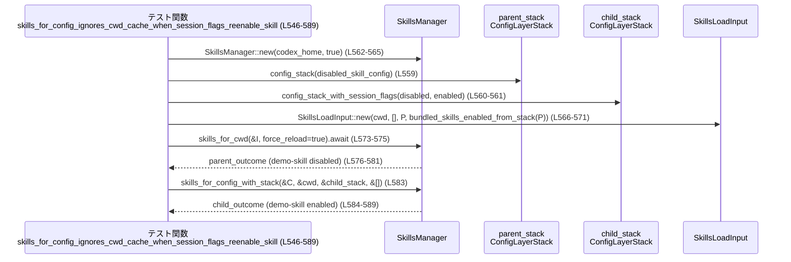

# core-skills/src/manager_tests.rs コード解説

> ※この解説で挙げる行番号は、提示されたチャンクの先頭を `L1` とする**相対行番号**です。  
> 実リポジトリの行番号とずれる可能性がありますが、コード位置の目安として記載します。

---

## 0. ざっくり一言

`SkillsManager` とその周辺 API（スキルの検索・キャッシュ・有効/無効化設定）について、

- **キャッシュの挙動**
- **バンドルスキル・プラグインスキルの扱い**
- **ユーザー設定 vs セッションフラグの優先順位**

を検証するテスト群と、それを支援するヘルパー関数を集めたモジュールです。

---

## 1. このモジュールの役割

### 1.1 概要

- このモジュールは、`super` モジュールに定義されている `SkillsManager` の振る舞いを検証するテストを提供します。
- 特に、スキルロードの**キャッシュキー**（cwd・設定・追加ルート）、**バンドルスキルの有効/無効**、**設定レイヤー（User / SessionFlags）間の優先順位**を確認します。
- 付随して、`ConfigLayerStack` や `resolve_disabled_skill_paths` など設定関連のロジックもテストから利用されます。

### 1.2 アーキテクチャ内での位置づけ

テストコードがどのコンポーネントに依存しているかを概観します。

```mermaid
graph TD
  subgraph core-skills
    A[manager_tests.rs<br/>テストモジュール]:::test
    B[SkillsManager<br/>(super)]:::impl
    C[normalize_extra_user_roots<br/>(super)]:::impl
  end

  subgraph config
    D[ConfigLayerStack<br/>ConfigLayerEntry]:::config
    E[ConfigRequirementsToml]:::config
    F[ConfigLayerSource]:::config
  end

  subgraph rules
    G[config_rules::skill_config_rules_from_stack]:::rules
    H[config_rules::resolve_disabled_skill_paths]:::rules
  end

  subgraph external
    I[codex_config]:::ext
    J[codex_app_server_protocol]:::ext
  end

  A --> B
  A --> C
  A --> D
  A --> G
  A --> H
  D --> I
  F --> J

classDef test fill:#eef,stroke:#446;
classDef impl fill:#efe,stroke:#484;
classDef config fill:#ffe,stroke:#aa4;
classDef rules fill:#fee,stroke:#a44;
classDef ext fill:#eee,stroke:#999;
```

- 本ファイル `manager_tests.rs` は `super::*`（`SkillsManager` など）に依存しています（L1）。
- 設定レイヤー関連は `ConfigLayerEntry` / `ConfigLayerStack`（L7–9, 65–81）を通じて `codex_config` に依存します。
- `resolve_disabled_skill_paths`（L3, 446–451 など）は `config_rules` モジュールの公開 API を検証する形になっています。

### 1.3 設計上のポイント（テストから読み取れるもの）

- **責務の分割**
  - ファイル操作（SKILL.md の作成など）は `write_user_skill` / `write_plugin_skill` に切り出されています（L17–50）。
  - 設定レイヤー構築は `user_config_layer` / `config_stack` / `config_stack_with_session_flags` に分割されています（L65–100）。
  - 繰り返し使う `SkillsManager::skills_for_config` 呼び出しは `skills_for_config_with_stack` にまとめられています（L121–134）。
- **状態とキャッシュ**
  - `SkillsManager` は内部に **cwd ごとのキャッシュ** を持つ前提でテストされています。
    - 同じ「有効設定」（ConfigLayerStack + bundled 設定）の場合はキャッシュ再利用（L155–178）。
    - `force_reload` フラグや「extra user roots」の有無でキャッシュの再利用/無効化が切り替わる（L325–407）。
- **設定レイヤーの優先順位**
  - `ConfigLayerSource::SessionFlags` が `ConfigLayerSource::User` を上書きできることをテストしています（L421–451, 453–483, 512–542, 546–589）。
- **エラーハンドリング**
  - テスト内の I/O や設定パースは `unwrap` / `expect` で処理されており、失敗時は即座にパニックする想定です（例: L19–21, 66–67, 290–293）。
  - 本番ロジック側のエラーは `SkillLoadOutcome.errors` に集約される設計がテストから読み取れます（L176–177, 280–281）。

---

## 2. 主要な機能一覧

このテストモジュールを通じて確認されている主な機能を列挙します。

- システムスキルキャッシュのクリーンアップ:
  - `SkillsManager::new` が、`bundled_skills_enabled = false` の場合に、`skills/.system` 配下の**古いバンドルスキルキャッシュを削除**することを検証（L136–153）。
- Config ベースのスキルロードキャッシュ:
  - 同じ `ConfigLayerStack` と cwd で `skills_for_config` を2回呼んだ場合、**ファイルシステムに新しいスキルが追加されても結果はキャッシュから再利用**されることを検証（L155–178）。
- プラグインスキルの名前による無効化:
  - `[skills.config]` の `name` 指定でプラグインスキルを無効化した場合、
    - スキル自体は `skills` に含まれるが（L212–216）、
    - `disabled_paths` に追加され、`allowed_skills_for_implicit_invocation` からは除外されることを検証（L219–226）。
- extra user roots を含む cwd キャッシュの挙動:
  - `skills_for_cwd_with_extra_user_roots` が `force_reload` フラグに応じてキャッシュを更新/再利用する挙動（L325–407）。
  - `skills_for_cwd` が、直近の「extra roots 付き」キャッシュを cwd 単位で再利用する挙動（L269–281）。
- バンドルスキルの無効化:
  - `[skills.bundled].enabled = false` と、`SkillsManager` のコンストラクタ引数 `bundled_skills_enabled = false` の組み合わせで、**System スコープのスキルが一切含まれない**ことを検証（L284–323）。
- extra roots 正規化:
  - `normalize_extra_user_roots` が、重複や順序の違う入力でも**同値な集合なら同じ結果を返す**こと（L410–419）。
- スキル無効化ルールの解決:
  - `resolve_disabled_skill_paths` が、User 層と SessionFlags 層の設定、および name / path 両方のセレクタを解釈して、
    - SessionFlags が User を上書きできる（L421–451, 453–483, 512–542）。
    - `name` セレクタが `path` セレクタを上書きできる（L512–542）。
- セッションフラグによる再有効化時のキャッシュ無視:
  - 親設定でスキルを無効化した後に、子設定（SessionFlags）で再有効化した場合、`skills_for_config` が **cwd キャッシュを無視して再評価する**こと（L546–589）。

---

## 3. 公開 API と詳細解説

このファイル自身はテストモジュールなので公開 API を定義していませんが、  
**テスト対象 API** の挙動がかなり明確に読み取れるため、それらを中心に整理します。

### 3.1 型一覧（主要な外部型）

| 名前 | 種別 | 役割 / 用途 | 出現箇所 |
|------|------|-------------|----------|
| `SkillsManager` | 構造体（推定） | スキルの探索・キャッシュ・有効/無効判定を行う中心的なサービス | 生成: L144–147, L160–163, L201–204, L235–238, L296–299, L332–335, L562–565 |
| `SkillsLoadInput` | 構造体（推定） | スキルロード時の入力（cwd、ユーザールート、設定スタック、バンドル有効フラグ）をまとめる | L127–132, L243–248, L271–276, L342–347, L566–571 |
| `SkillLoadOutcome` | 構造体（推定） | スキルロードの結果。`skills` と `errors` フィールド、および `disabled_paths`・`is_skill_enabled` などの補助 API を持つ | L126–134, L166–177, L206–226, L249–281, L310–322, L348–407, L573–581, L583–589 |
| `SkillMetadata` | 構造体 | 1つのスキルのメタ情報（名前・説明・スコープなど）。テスト用に `test_skill` で生成される | 定義に依存: L52–62, 利用: L426–448, L458–482, L490–508, L517–540 |
| `SkillScope` | 列挙体（推定） | スキルのスコープ（User / System など）を表す。`SkillScope::User` / `SkillScope::System` を利用 | L61, L266–267, L321–322 |
| `ConfigLayerEntry` | 構造体 | 設定レイヤー1枚分（User や SessionFlags）を表す | L7, L65–71, L88–99, L429–433, L434–438, L461–465, L466–470, L493–497, L520–524, L525–529 |
| `ConfigLayerStack` | 構造体 | 複数の `ConfigLayerEntry` を積み上げた設定スタック | L8, L74–81, L83–100, L159–160, L234–235, L295–296, L331–332, L439–444, L471–476, L498–503, L530–535, L559–561 |
| `ConfigLayerSource` | 列挙体 | 設定レイヤーのソース種別（User, SessionFlags）を表す | L5, L69, L92, L430, L435, L462, L467, L494, L521, L526 |
| `ConfigRequirementsToml` | 構造体 | 設定の必須条件を表す TOML 構造。ここでは既定値でスタック構築に利用 | L9, L78–79, L96–97, L442–443, L474–475, L501–502, L533–534 |
| `HashSet<T>` | 標準コレクション | 無効化されたスキルのパス集合などを表す | インポート L12, 利用 L448–450, L480–482, L507–508, L539–540 |

内部定義（このファイル内）の型はありません。

### 3.2 関数詳細（テスト対象 API 中心）

#### `SkillsManager::new(codex_home: PathBuf, bundled_skills_enabled: bool) -> SkillsManager`

**概要**

- スキル管理オブジェクト `SkillsManager` を初期化します。
- `codex_home` 以下のスキルルートやキャッシュディレクトリを準備し、とくに `bundled_skills_enabled` が `false` の場合、古いバンドルスキルキャッシュを削除する振る舞いがテストされています（L136–152）。

**引数**

| 引数名 | 型 | 説明 | 根拠 |
|--------|----|------|------|
| `codex_home` | `PathBuf` | Codex のホームディレクトリパス。`tempfile::tempdir().path().to_path_buf()` から渡される（L138, L145, L157, L161 など） | L138–147 |
| `bundled_skills_enabled` | `bool` | バンドル済みスキル（`.system` 配下）の有効/無効を示すフラグ | コメントと実引数から（L144–147, L296–299） |

**戻り値**

- `SkillsManager` インスタンス。テストでは変数に直接代入しており、`Result` などのエラー型は返していません（L144, L160, L201 など）。

**内部処理の流れ（テストから読み取れる範囲）**

1. `codex_home` を基点に、スキルやプラグインのキャッシュディレクトリを内部状態として保持すると考えられます（テストでは `skills/.system` を作成してからコンストラクタを呼んでいます、L138–147）。
2. `bundled_skills_enabled == false` の場合、`codex_home/skills/.system` ディレクトリを削除し、古いバンドルスキルキャッシュをクリアする動作がテストで確認されています（`!exists()` のアサート, L149–152）。
3. それ以外の詳細な処理（ログ出力・キャッシュ構造の初期化など）はこのチャンクには現れません。

**Examples（使用例）**

```rust
// テスト内での利用例（L136–152 相当）
let codex_home = tempfile::tempdir().expect("tempdir");
let stale_system_skill_dir = codex_home.path().join("skills/.system/stale-skill");
fs::create_dir_all(&stale_system_skill_dir).expect("create stale system skill dir");
fs::write(stale_system_skill_dir.join("SKILL.md"), "# stale\n").expect("write stale");

// bundled_skills_enabled = false で初期化
let skills_manager = SkillsManager::new(
    codex_home.path().to_path_buf(),
    /*bundled_skills_enabled*/ false,
);

// `.system` 配下が削除されていることを確認
assert!(!codex_home.path().join("skills/.system").exists());
```

**Errors / Panics**

- コンストラクタ自身は `Result` を返しておらず、テスト側もエラー処理を行っていないため、**エラーは発生しない前提**で書かれています。
- ただし内部でファイルシステム操作をしている可能性はあり、その失敗時の挙動はこのファイルからは分かりません。

**Edge cases（エッジケース）**

- `codex_home` 配下に `.system` ディレクトリが存在しない場合の挙動はテストされていません。
- 権限不足などでディレクトリ削除に失敗した場合の扱いも、このチャンクからは読み取れません。

**使用上の注意点**

- `bundled_skills_enabled` と、設定側（`[skills.bundled].enabled`）を組み合わせて使うことが前提になっています（L284–299）。
- コンストラクタ呼び出し時点で `.system` 以下のディレクトリ構造が変化する可能性があるため、別スレッドから同じディレクトリを参照している場合は注意が必要です（テストは単一スレッドでのみ実行）。

---

#### `SkillsManager::skills_for_config(&self, input: &SkillsLoadInput) -> SkillLoadOutcome`

**概要**

- 指定された `SkillsLoadInput`（cwd・スキルルート・設定スタック・バンドル有効フラグ）に基づいてスキルをロードし、その結果とエラーを `SkillLoadOutcome` として返します（L121–134）。
- **設定に依存したキャッシュ** を持ち、同じ「有効設定」の場合はファイルシステムの変更があっても結果を再利用することがテストされています（L155–178）。

**引数**

| 引数名 | 型 | 説明 | 根拠 |
|--------|----|------|------|
| `input` | `&SkillsLoadInput` | ロード対象 cwd、追加スキルルート、`ConfigLayerStack`、バンドル有効フラグをまとめた入力 | `SkillsLoadInput::new` から生成されて渡されている（L127–132, L243–248 など） |

**戻り値**

- `SkillLoadOutcome`  
  - `skills: Vec<SkillMetadata>` を含み、名前やスコープでフィルタされています（例: L167–169, L310–322）。
  - `errors` フィールドで読み込み時のエラー集合を保持し、キャッシュ再利用時もこの値が同じであることが確認されています（L176–177）。

**内部処理の流れ（テストから読み取れる範囲）**

1. `input` に含まれる `ConfigLayerStack` と `bundled_skills_enabled` をもとに、**有効なスキルルート集合**を決定します（L121–132, L295–299）。
2. その「有効設定」（cwd + skill_roots + ConfigLayerStack + bundled フラグ）をキャッシュキーとして、前回の結果があればそれを再利用します（L166–177）。
3. キャッシュミスの場合は、スキルルート配下の `SKILL.md` を走査・パースし、`SkillLoadOutcome` の `skills` と `errors` を構築します（実装はこのチャンクには現れません）。
4. 設定中の `[skills.config]` や `[skills.bundled]` を解釈して、スキルの有効/無効やバンドルスキルの除外を行います（L192–195, L295–299）。

**Examples（使用例）**

```rust
// テストの一部を簡略化（L155–177 相当）
let config_layer_stack = config_stack(&codex_home, "");
let skills_manager = SkillsManager::new(codex_home.path().to_path_buf(), true);

write_user_skill(&codex_home, "a", "skill-a", "from a");

// SkillsLoadInput を作ってから skills_for_config を呼ぶ
let outcome1 = skills_for_config_with_stack(
    &skills_manager,
    &cwd,
    &config_layer_stack,
    &[],
);
// "skill-a" が見つかることを確認
assert!(outcome1.skills.iter().any(|s| s.name == "skill-a"));

// 新しいスキルを追加するが、有効設定は変えない
write_user_skill(&codex_home, "b", "skill-b", "from b");
let outcome2 = skills_for_config_with_stack(
    &skills_manager,
    &cwd,
    &config_layer_stack,
    &[],
);

// キャッシュ再利用により、skills / errors は同一
assert_eq!(outcome2.errors, outcome1.errors);
assert_eq!(outcome2.skills, outcome1.skills);
```

**Errors / Panics**

- 関数自体は `Result` ではなく `SkillLoadOutcome` を返しています。
- I/O エラーなどは `outcome.errors` に集約される設計で、テストでは `errors` が等しいことのみ確認しています（L176–177）。  
  パニック条件はコードからは読み取れません。

**Edge cases（エッジケース）**

- 有効設定が完全に同じであれば、**ファイルシステム上で新しいスキルが追加されても**結果は変わらない（キャッシュ優先）ことがエッジケースとして検証されています（L172–177）。
- `[skills.bundled].enabled = false` の場合は、System スコープのスキルが結果から完全に除外されます（L284–323）。
- プラグインスキルの名前が `name` セレクタで無効化されていても `skills` には含まれ、`disabled_paths` と `allowed_skills_for_implicit_invocation` で有効/無効が区別されます（L212–226）。

**使用上の注意点**

- **キャッシュキーは「有効設定」ベース**であり、ファイルシステムの変化（新規スキル追加）を即時反映させたい場合は、別の API（`skills_for_cwd_with_extra_user_roots` + `force_reload`）を使うか、内部キャッシュをクリアする必要があると考えられます。
- 設定レイヤー（特に SessionFlags）を変えた場合には、別の `ConfigLayerStack` を用いて呼び出す必要があります（L546–589）。

---

#### `SkillsManager::skills_for_cwd_with_extra_user_roots(&self, base_input: &SkillsLoadInput, force_reload: bool, extra_roots: &[PathBuf]) -> SkillLoadOutcome`（非同期）

**概要**

- 指定した cwd と設定に対して、**追加のユーザースキルルート（extra roots）** を含めてスキルをロードします。
- `force_reload` フラグに応じて、既存キャッシュの再利用か再ロードかを切り替えます（L325–407, L249–255）。

**引数**

| 引数名 | 型 | 説明 | 根拠 |
|--------|----|------|------|
| `base_input` | `&SkillsLoadInput` | cwd と基本設定を含む入力。`user_skill_roots` は通常空で、extra roots で補われます | L243–248, L342–347 |
| `force_reload` | `bool` | `true` ならキャッシュを無視して再ロード、`false` なら既存キャッシュを再利用 | L251–253, L351–352, L372–373, L392–393 |
| `extra_roots` | `&[PathBuf]` | 追加のユーザースキルルート。`std::slice::from_ref(&path)` で1件指定されている | L253, L352, L373, L393 |

**戻り値**

- 非同期に `SkillLoadOutcome` を返します。テストでは `.await` して `SkillLoadOutcome` を受け取っています（L255, L354, L375, L395）。

**内部処理の流れ（テストから読み取れる範囲）**

1. `base_input` の cwd・設定・bundled フラグをもとに、**追加ルートを含めた有効なスキルルート**集合を構築します。
2. `force_reload == false` かつ該当 cwd/設定でキャッシュが存在する場合、**extra roots の内容に関わらず**そのキャッシュを再利用します（L368–387）。
3. `force_reload == true` の場合、extra roots を考慮した新しいスキルリストを構築し、キャッシュを更新します（L348–360, L389–407）。

**Examples（使用例）**

```rust
// 追加ルートを含めてスキルをロードし、その後 force_reload=false で再利用（L325–387）
let extra_root_a_path = extra_root_a.path().to_path_buf();
let base_input = SkillsLoadInput::new(
    cwd.path().to_path_buf(),
    Vec::new(),
    config_layer_stack.clone(),
    bundled_skills_enabled_from_stack(&config_layer_stack),
);

let outcome_a = skills_manager
    .skills_for_cwd_with_extra_user_roots(
        &base_input,
        /*force_reload*/ true,
        std::slice::from_ref(&extra_root_a_path),
    )
    .await;

assert!(outcome_a.skills.iter().any(|s| s.name == "extra-skill-a"));

let extra_root_b_path = extra_root_b.path().to_path_buf();
let outcome_b = skills_manager
    .skills_for_cwd_with_extra_user_roots(
        &base_input,
        /*force_reload*/ false, // キャッシュ再利用
        std::slice::from_ref(&extra_root_b_path),
    )
    .await;

// extra-skill-a は残り、extra-skill-b はまだ出てこない
assert!(outcome_b.skills.iter().any(|s| s.name == "extra-skill-a"));
assert!(outcome_b.skills.iter().all(|s| s.name != "extra-skill-b"));
```

**Errors / Panics**

- 非同期関数ですが、`Result` ではなく `SkillLoadOutcome` を返します。
- I/O やパースエラーは `errors` フィールドに格納されると考えられます（`errors` を比較しているテストもあります、L280–281）。

**Edge cases（エッジケース）**

- `force_reload = false` かつ、既存キャッシュが「別の extra roots で構築されている場合」でも、そのキャッシュを再利用することがエッジケースとして検証されています（L368–387）。
- `force_reload = true` にすると、直近の extra roots だけを反映した新しい結果でキャッシュを置き換えます（L389–407）。

**使用上の注意点**

- **extra roots の違いをキャッシュキーに含めない**設計になっているため、「ある extra roots でロードした結果」が **cwd 単位のキャッシュ**として使い回されます（L269–281）。  
  - そのため、「異なる extra roots ごとに独立したビュー」が欲しい場合は、`force_reload = true` で都度ロードする必要があります。
- 非同期メソッドなので、tokio などの非同期ランタイム上で `.await` する必要があります（`#[tokio::test]` で実行されている、L325–327）。

---

#### `SkillsManager::skills_for_cwd(&self, base_input: &SkillsLoadInput, force_reload: bool) -> SkillLoadOutcome`（非同期）

**概要**

- cwd と設定に基づいてスキルをロードする、extra roots なしの基本 API です。
- `force_reload` に応じて、cwd 単位のキャッシュを再利用するか再構築するかを制御します。

**引数**

| 引数名 | 型 | 説明 | 根拠 |
|--------|----|------|------|
| `base_input` | `&SkillsLoadInput` | cwd・設定・bundled フラグなどを含む入力 | L271–276, L566–571 |
| `force_reload` | `bool` | キャッシュ再利用 (`false`) / 再ロード (`true`) の切り替え | L278–279, L574–575 |

**戻り値**

- 非同期に `SkillLoadOutcome` を返します（`.await` 使用、L255, L278–279, L573–575）。

**内部処理の流れ（テストから読み取れる範囲）**

1. `base_input` の情報から cwd/設定をキーとしてキャッシュを参照します。
2. `force_reload == false` かつキャッシュが存在する場合、extra roots の有無に関わらず **直近のキャッシュ**を返すことがテストで確認されています（L269–281）。
3. `force_reload == true` の場合、新たにスキルをスキャンしてキャッシュを更新します（L573–575）。

**Examples（使用例）**

```rust
// extra roots で構築したキャッシュを cwd-only API から再利用（L269–281）
let base_input = SkillsLoadInput::new(
    cwd.path().to_path_buf(),
    Vec::new(),
    config_layer_stack.clone(),
    bundled_skills_enabled_from_stack(&config_layer_stack),
);

// 直前に skills_for_cwd_with_extra_user_roots が呼ばれている前提
let outcome_without_extra = skills_manager
    .skills_for_cwd(&base_input, /*force_reload*/ false)
    .await;

// extra roots 付きの結果と完全に同じ
assert_eq!(outcome_without_extra.skills, outcome_with_extra.skills);
assert_eq!(outcome_without_extra.errors, outcome_with_extra.errors);
```

**Errors / Panics**

- `Result` ではなく `SkillLoadOutcome` を返すため、エラーは `errors` で表現される前提です（L280–281）。
- パニック条件はこのチャンクからは分かりません。

**Edge cases（エッジケース）**

- 直前の `skills_for_cwd_with_extra_user_roots` で extra roots を使ってロードしていた場合でも、cwd-only API が **そのキャッシュをそのまま再利用する**点がエッジケースです（L269–281）。
- SessionFlags による再有効化など、設定スタックが変わる場合は `SkillsLoadInput` 自体を作り直す必要があります（L566–571）。

**使用上の注意点**

- 「cwd ベースの最新キャッシュ」を返す API とみなすのが適切で、  
  extra roots の差異まで管理したい場合は、この API だけに依存しないほうがよいです。
- 初回ロード時に `force_reload = true` を使うことで、確実に現在のディスク状態に基づいた結果を得られます（L573–581）。

---

#### `normalize_extra_user_roots(roots: &[PathBuf]) -> ???`

**概要**

- 追加ユーザールート（extra roots）のスライスを受け取り、重複や順序の違いを正規化して、**同値な入力に対して同じ出力**を返す関数です（L410–419）。
- 戻り値の具体的な型はこのチャンクには現れませんが、`assert_eq!` で比較可能な型です。

**引数**

| 引数名 | 型 | 説明 | 根拠 |
|--------|----|------|------|
| `roots` | `&[PathBuf]` | ユーザー指定の追加ルート一覧。`&[a.clone(), b.clone(), a.clone()]` のように渡されている | L415–416 |

**戻り値**

- `Eq` を満たし、`assert_eq!` で比較可能なコレクション型（おそらく `Vec<PathBuf>` か `Vec<AbsolutePathBuf>`）です（L415–418）。
- 具体的な型名はこのチャンクには現れません。

**内部処理の流れ（推測できる範囲）**

1. 入力スライスから重複を除去していると考えられます。`[a, b, a]` と `[b, a]` が同じ結果になるためです（L415–418）。
2. 入力順序に依存しない結果を返していると考えられます。`[a, b, a]` と `[b, a]` の順序が違っても同一結果になるからです（L415–418）。
3. ソート戦略（辞書順か、パスの正規化を伴うか）は、このチャンクからは分かりません。

**Examples（使用例）**

```rust
let a = PathBuf::from("/tmp/a");
let b = PathBuf::from("/tmp/b");

let first = normalize_extra_user_roots(&[a.clone(), b.clone(), a.clone()]);
let second = normalize_extra_user_roots(&[b, a]);

assert_eq!(first, second);
```

**Errors / Panics**

- テストからはエラーやパニックが発生する可能性は読み取れません。

**Edge cases（エッジケース）**

- 同じパスが複数回含まれている場合でも、結果には 1 回だけ含まれることが期待されます（L415–418）。
- 大文字小文字の違い（ケースセンシティブ/インセンシティブ）やシンボリックリンクの扱いなどは、コードからは分かりません。

**使用上の注意点**

- 正規化された extra roots がキャッシュキーの一部に使われる可能性が高いため、extra roots をキャッシュキーに組み込みたい場合は、この関数を通すべきです（ただし実際の利用箇所はこのチャンクには現れません）。

---

#### `resolve_disabled_skill_paths(skills: &[SkillMetadata], rules: &SkillConfigRules) -> HashSet<PathBuf>`

**概要**

- スキル一覧と、設定から導出されたスキル設定ルールをもとに、**無効化されているスキルのパス集合**を返す関数です。
- Path セレクタと Name セレクタ、User レイヤーと SessionFlags レイヤーの優先順位が複数のテストで検証されています（L421–451, 453–483, 485–510, 512–542）。

**引数**

| 引数名 | 型 | 説明 | 根拠 |
|--------|----|------|------|
| `skills` | `&[SkillMetadata]` | 判定対象のスキル一覧。テストでは 1 件だけ渡している | L426–427, L458–459, L490–491, L517–518 |
| `rules` | `&SkillConfigRules`（推定） | `skill_config_rules_from_stack` により生成されたルール。具体的な型定義はこのチャンクには現れません | L446–449, L478–482, L505–508, L537–540 |

**戻り値**

- `HashSet<PathBuf>`  
  - テストでは `HashSet::new()` や `HashSet::from([skill_path])` と比較しています（L448–450, L480–482, L507–508, L539–540）。

**内部処理の流れ（テストから読み取れる範囲）**

1. `rules` 内のパスセレクタ (`path = "...")` とネームセレクタ (`name = "github:yeet"` など) を解釈します（L431–437, L463–469, L495–497, L522–528）。
2. それぞれの `enabled` フラグに基づいて、対象スキルを有効/無効に振り分けます。
3. 複数レイヤーがある場合の優先順位:
   - SessionFlags レイヤーが User レイヤーを上書きする（L421–451, L453–483）。
   - Name セレクタが Path セレクタを上書きする（L512–542）。
4. 無効と判定されたスキルの `path_to_skills_md` を `HashSet` に追加して返します（L426–427, L458–459, L490–491, L517–518）。

**Examples（使用例）**

```rust
let tempdir = tempfile::tempdir().expect("tempdir");
let skill_path = tempdir.path().join("skills").join("demo").join("SKILL.md");
let skill = test_skill("github:yeet", skill_path.clone());

let user_file = AbsolutePathBuf::try_from(tempdir.path().join("config.toml"))
    .expect("user config path should be absolute");

// User レイヤーで name セレクタにより無効化
let user_layer = ConfigLayerEntry::new(
    ConfigLayerSource::User { file: user_file },
    toml::from_str(&name_toggle_config("github:yeet", /*enabled*/ false))
        .expect("user layer toml"),
);

let stack = ConfigLayerStack::new(
    vec![user_layer],
    Default::default(),
    ConfigRequirementsToml::default(),
).expect("valid config layer stack");

let skill_config_rules = skill_config_rules_from_stack(&stack);
assert_eq!(
    resolve_disabled_skill_paths(&[skill], &skill_config_rules),
    HashSet::from([skill_path])
);
```

**Errors / Panics**

- 関数シグネチャには `Result` が含まれておらず、テストもパニックを期待していないため、エラーは出さない前提になっています。
- 無効な設定値に対する扱い（例: 不正な TOML）は `toml::from_str` 側でパニックとして扱われ、`resolve_disabled_skill_paths` には到達しません（L431–432, L463–464 など）。

**Edge cases（エッジケース）**

- **User: disabled, SessionFlags: enabled**  
  → 最終的に無効化集合は空（L421–451）。
- **User: enabled, SessionFlags: disabled**  
  → Path ベースでスキルが無効化される（L453–483）。
- **名前セレクタのみ（User レイヤー）**  
  → 該当スキルのパスが無効化集合に含まれる（L485–510）。
- **User: path で disabled, SessionFlags: name で enabled**  
  → 名前セレクタが優先され、無効化集合は空（L512–542）。

**使用上の注意点**

- スキルパスをキーとしているため、**パスの正規化（シンボリックリンクや相対パスの扱い）** の違いが存在すると、意図しないスキルが無効にならない可能性があります。  
  この点はテストではカバーされていません。
- Name セレクタと Path セレクタが両方ヒットする場合の優先順位は「名前優先」であることが前提になっています（L512–542）。

---

#### `bundled_skills_enabled_from_stack(stack: &ConfigLayerStack) -> bool`

**概要**

- `ConfigLayerStack` から `[skills.bundled].enabled` の有効値を計算するヘルパー関数です。
- `SkillsLoadInput::new` の引数として使用され、バンドルスキルをロードするかどうかに影響します（L127–132, L243–248, L342–347, L566–571）。

**引数**

| 引数名 | 型 | 説明 | 根拠 |
|--------|----|------|------|
| `stack` | `&ConfigLayerStack` | 設定レイヤーのスタック | 参照渡しで使用（L131, L247, L346, L570） |

**戻り値**

- `bool`  
  - `SkillsLoadInput::new` の第4引数として渡されており、バンドルスキルの有効/無効設定として利用されます（L127–132, L243–248）。

**内部処理の流れ（推測できる範囲）**

1. `stack` に含まれる各 `ConfigLayerEntry` から `[skills.bundled].enabled` を読み出します。
2. 適切な優先順位（おそらく後勝ち）でマージして最終的なブール値を決定します。
3. その値を返し、`SkillsLoadInput` の `bundled_skills_enabled` フィールドに反映します（L295–299, L284–323）。

**使用上の注意点**

- `SkillsManager::new` に渡す `bundled_skills_enabled` 引数と、この関数が返す値が矛盾している場合の挙動（例: Manager 側 false, Config 側 true）は、このチャンクではテストされていません。

---

### 3.3 その他の関数（このファイル内のヘルパー・テスト）

#### ローカルヘルパー関数

| 関数名 | 役割 | 出現箇所 |
|--------|------|----------|
| `write_user_skill` | `codex_home/skills/<dir>/SKILL.md` を作成し、シンプルな YAML フロントマター + Body を書き出すテスト用ユーティリティ | 定義 L17–22, 利用 L165, L174, L241, L338–339 |
| `write_plugin_skill` | プラグインキャッシュディレクトリ (`plugins/cache/<marketplace>/<plugin>/local/skills/...`) に SKILL.md と plugin.json を作成し、そのパスを返す | 定義 L24–50, 利用 L184–191 |
| `test_skill` | 簡易な `SkillMetadata` インスタンス（User スコープ）を構築するヘルパー | 定義 L52–63, 利用 L426, L458, L490, L517 |
| `user_config_layer` | User レイヤーの `ConfigLayerEntry` を生成するヘルパー（ファイルパスを `AbsolutePathBuf` に変換し、TOML をパース） | 定義 L65–72, 利用 L76, L90, L429–433, L461–465, L493–497, L520–524 |
| `config_stack` | User レイヤー1枚だけから `ConfigLayerStack` を構築する | 定義 L74–81, 利用 L159, L234, L295, L331, L559 |
| `config_stack_with_session_flags` | User レイヤー + SessionFlags レイヤーから `ConfigLayerStack` を構築する | 定義 L83–100, 利用 L560–561 |
| `path_toggle_config` | `[[skills.config]]` セクションで `path` と `enabled` を設定する TOML 文字列を生成する | 定義 L102–110, 利用 L431–437, L463–469, L557–558 |
| `name_toggle_config` | `[[skills.config]]` セクションで `name` と `enabled` を設定する TOML 文字列を生成する | 定義 L112–119, 利用 L194–195, L495–497, L527–528 |
| `skills_for_config_with_stack` | `SkillsLoadInput::new` + `SkillsManager::skills_for_config` の薄いラッパー。繰り返し使う呼び出しパターンをカプセル化 | 定義 L121–134, 利用 L166, L175, L206–211, L239, L310, L336, L583 |

#### テスト関数

| 関数名 | テスト対象の振る舞い | 出現箇所 |
|--------|----------------------|----------|
| `new_with_disabled_bundled_skills_removes_stale_cached_system_skills` | `SkillsManager::new` が `bundled_skills_enabled = false` のとき、`skills/.system` ディレクトリを削除する | L136–153 |
| `skills_for_config_reuses_cache_for_same_effective_config` (`#[tokio::test]`) | 同一の `ConfigLayerStack` かつ cwd で `skills_for_config` を2回呼ぶと、結果（skills と errors）がキャッシュ再利用で変わらない | L155–178 |
| `skills_for_config_disables_plugin_skills_by_name` (`#[tokio::test]`) | `name` セレクタでプラグインスキルを無効化した場合、`disabled_paths` と `allowed_skills_for_implicit_invocation` が正しく反映される | L180–227 |
| `skills_for_cwd_reuses_cached_entry_even_when_entry_has_extra_roots` (`#[tokio::test]`) | extra roots を使って構築したキャッシュを、cwd-only API (`skills_for_cwd`) がそのまま再利用する挙動を検証 | L229–282 |
| `skills_for_config_excludes_bundled_skills_when_disabled_in_config` (`#[tokio::test]`) | `[skills.bundled].enabled = false` と `bundled_skills_enabled = false` の組み合わせで、System スコープのスキルが結果から完全に除外される | L284–323 |
| `skills_for_cwd_with_extra_roots_only_refreshes_on_force_reload` (`#[tokio::test]`) | `skills_for_cwd_with_extra_user_roots` の `force_reload` フラグが、extra roots を変えたときのキャッシュ更新/再利用の切り替えに効いていることを検証 | L325–407 |
| `normalize_extra_user_roots_is_stable_for_equivalent_inputs` | `normalize_extra_user_roots` が、重複・順序の違う同値集合から同じ結果を返すことを確認 | L410–419 |
| `disabled_paths_for_skills_allows_session_flags_to_override_user_layer` | User レイヤーで無効、SessionFlags で有効にした場合、最終的にスキルは無効化されない（空の `HashSet`）ことを検証 | L421–451 |
| `disabled_paths_for_skills_allows_session_flags_to_disable_user_enabled_skill` | User レイヤーで有効、SessionFlags で無効のとき、スキルが無効化されることを検証 | L453–483 |
| `disabled_paths_for_skills_disables_matching_name_selectors` | `name` セレクタだけでスキルを無効化した場合、そのパスが無効集合に含まれることを検証 | L485–510 |
| `disabled_paths_for_skills_allows_name_selector_to_override_path_selector` | User の path セレクタで無効、SessionFlags の name セレクタで有効にした場合、名前が優先されて無効化されないことを検証 | L512–542 |
| `skills_for_config_ignores_cwd_cache_when_session_flags_reenable_skill` (`#[tokio::test]`) | 親設定でスキルを無効化した後、SessionFlags で再有効化した子設定に対して `skills_for_config` が cwd キャッシュを無視して再評価することを検証 | L546–589 |

---

## 4. データフロー

### 4.1 代表的なシナリオ

ここでは、**親設定でスキルを無効化 → 子設定（SessionFlags）で再有効化** するシナリオを取り上げます（`skills_for_config_ignores_cwd_cache_when_session_flags_reenable_skill`, L546–589）。

- 親設定 (`parent_stack`) でスキルをパス指定により無効化し、その状態で `skills_for_cwd` を `force_reload = true` で実行し、キャッシュを作ります（L557–581）。
- その後、親設定 + SessionFlags による再有効化を含む子設定 (`child_stack`) を作り、`skills_for_config_with_stack` 経由で `SkillsManager::skills_for_config` を呼びます（L583–589）。
- このとき、子設定に対する結果は親設定の cwd キャッシュではなく、**ConfigLayerStack 差分を考慮した評価結果**になっている必要があります。



要点:

- **cwd は同じ**ですが、ConfigLayerStack（親 vs 子）が異なるため、`skills_for_config` は cwd キャッシュをそのまま再利用してはいけません。
- テストは `is_skill_enabled` の結果が親では `false`、子では `true` になることを確認し、その挙動を保証しています（L581, L589）。

---

## 5. 使い方（How to Use）

ここでは、本テストから読み取れる範囲での `SkillsManager` の基本的な使い方を整理します。

### 5.1 基本的な使用方法

1. `ConfigLayerStack` を構築する（User 設定や SessionFlags をレイヤーとして積む）。
2. `SkillsManager::new` でマネージャを初期化する。
3. `SkillsLoadInput::new` で入力パラメータ（cwd, skill roots, 設定スタック, bundled フラグ）を作る。
4. `skills_for_cwd` または `skills_for_config` / `skills_for_cwd_with_extra_user_roots` を呼び出す。

```rust
use codex_config::{ConfigLayerEntry, ConfigLayerStack, ConfigRequirementsToml, CONFIG_TOML_FILE};
use codex_app_server_protocol::ConfigLayerSource;
use codex_utils_absolute_path::AbsolutePathBuf;

// 1. ConfigLayerStack を構築（テスト内の user_config_layer / config_stack に相当）
fn build_config_stack(codex_home: &TempDir, user_config_toml: &str) -> ConfigLayerStack {
    let config_path = AbsolutePathBuf::try_from(codex_home.path().join(CONFIG_TOML_FILE))
        .expect("user config path should be absolute");
    let user_layer = ConfigLayerEntry::new(
        ConfigLayerSource::User { file: config_path },
        toml::from_str(user_config_toml).expect("user layer toml"),
    );
    ConfigLayerStack::new(
        vec![user_layer],
        Default::default(),
        ConfigRequirementsToml::default(),
    )
    .expect("valid config layer stack")
}

#[tokio::main]
async fn main() {
    let codex_home = tempfile::tempdir().expect("tempdir");
    let cwd = tempfile::tempdir().expect("tempdir");

    // 例: 設定は空
    let stack = build_config_stack(&codex_home, "");

    // 2. SkillsManager を初期化（バンドルスキルを有効化）
    let manager = SkillsManager::new(codex_home.path().to_path_buf(), true);

    // 3. SkillsLoadInput を組み立て
    let input = SkillsLoadInput::new(
        cwd.path().to_path_buf(),
        Vec::new(), // extra user roots なし
        stack.clone(),
        bundled_skills_enabled_from_stack(&stack),
    );

    // 4. cwd に基づいてスキルをロード
    let outcome = manager.skills_for_cwd(&input, /*force_reload*/ true).await;

    for skill in &outcome.skills {
        println!("skill: {}", skill.name);
    }
}
```

### 5.2 よくある使用パターン

- **設定依存のキャッシュを効かせたい場合**
  - `skills_for_config` を用い、同じ `ConfigLayerStack` と cwd で何度も呼ぶ。
  - ファイルシステム側に変化があっても結果を変えたくない（安定性重視）シナリオ（L155–178）。

- **プロジェクト固有の追加スキルルートを一時的に含めたい場合**
  - `SkillsLoadInput` には共通の cwd/設定を詰めておき、extra roots だけ `skills_for_cwd_with_extra_user_roots` の引数で渡す（L325–407）。

- **セッションフラグによる一時的なスキル有効/無効切り替え**
  - User レイヤーと SessionFlags レイヤーを組み合わせて `ConfigLayerStack` を構築し、`skill_config_rules_from_stack` → `resolve_disabled_skill_paths` や `is_skill_enabled` を利用する（L421–451, L546–589）。

### 5.3 よくある間違い（テストから逆読みできるもの）

```rust
// 誤り例: extra roots を変えたのに force_reload=false のまま
let outcome_b = skills_manager
    .skills_for_cwd_with_extra_user_roots(
        &base_input,
        /*force_reload*/ false,                 // キャッシュを再利用してしまう
        std::slice::from_ref(&extra_root_b_path),
    )
    .await;
// → 結果は古い extra roots (extra_root_a) に基づいたもののまま（L368–387）

// 正しい例: extra roots を変更したら force_reload=true で明示的に再ロード
let outcome_b = skills_manager
    .skills_for_cwd_with_extra_user_roots(
        &base_input,
        /*force_reload*/ true,                  // キャッシュを更新
        std::slice::from_ref(&extra_root_b_path),
    )
    .await;
```

```rust
// 誤り例: 親の ConfigLayerStack に対して構築された cwd キャッシュを、
// 子設定（SessionFlags 付き）でもそのまま使ってしまう
// （コードではなく設計上の誤用イメージ）

// 正しい例: 子設定用の ConfigLayerStack を作り直し、そのスタックを
// 用いて skills_for_config を呼び出す（L559–561, L583–589）
let parent_stack = config_stack(&codex_home, &disabled_skill_config);
let child_stack = config_stack_with_session_flags(
    &codex_home,
    &disabled_skill_config,
    &enabled_skill_config,
);

let child_outcome = skills_for_config_with_stack(&skills_manager, &cwd, &child_stack, &[]);
```

### 5.4 使用上の注意点（まとめ）

- **キャッシュキーを意識する必要があります**
  - `skills_for_config` は有効設定ベースのキャッシュ、`skills_for_cwd` / `skills_for_cwd_with_extra_user_roots` は cwd ベースのキャッシュを持つ設計です（L155–178, L229–282, L325–407）。
  - extra roots の違いを含めて結果を切り替えたい場合は `force_reload` を正しく使う必要があります。
- **設定レイヤーの優先順位**
  - SessionFlags が User を上書きし、name セレクタが path セレクタを上書きするという前提で API が利用されています（L421–451, L512–542）。
- **非同期コンテキスト**
  - `skills_for_cwd` / `skills_for_cwd_with_extra_user_roots` は async 関数であり、tokio などのランタイム内で `.await` が必要です（`#[tokio::test]` の利用, L155, L180, L229, L284, L325, L545, L546）。
- **テストと本番コードの違い**
  - テストではファイル I/O や TOML パースに `unwrap` / `expect` を多用しており、エラー時はパニックします（L19–21, L66–67, L431–432 など）。  
    本番コードでは適切なエラーハンドリングを行う必要があります。

---

## 6. 変更の仕方（How to Modify）

このチャンクには実装本体は含まれていませんが、**テスト駆動で挙動を変更・追加する**観点で整理します。

### 6.1 新しい機能を追加する場合

例: 新しい種類のスキル無効化セレクタ（タグなど）を追加したい場合。

1. **テストの追加**
   - `manager_tests.rs` に新しいテスト関数を追加し、期待する挙動を表現します。
   - 既存の `disabled_paths_for_skills_*` 系テスト（L421–451, L453–483, L485–510, L512–542）を参考に、  
     `ConfigLayerStack` の組み立て → `skill_config_rules_from_stack` → `resolve_disabled_skill_paths` の流れを踏襲します。
2. **実装箇所の特定**
   - スキル無効化ロジックは `crate::config_rules` 内にあるため、`resolve_disabled_skill_paths` やその周辺を修正します。
   - キャッシュの扱いが変わる場合は `SkillsManager`（`super` モジュール）側のキャッシュキー生成処理も対象になります。
3. **Config の追加**
   - TOML 設定に新しいセクションを追加する場合は、`codex_config` 側の TOML モデルにも対応が必要です。

### 6.2 既存の機能を変更する場合

例: extra roots の違いもキャッシュキーに含めたい場合。

- **影響範囲の確認**
  - `skills_for_cwd_reuses_cached_entry_even_when_entry_has_extra_roots`（L229–282）と  
    `skills_for_cwd_with_extra_roots_only_refreshes_on_force_reload`（L325–407）の挙動を変えることになります。
  - これらのテストは「cwd-only API は extra roots 付きのキャッシュをそのまま使う」という前提に依存しているため、変更時にはテストを書き換える必要があります。
- **契約（前提条件）の整理**
  - 「cwd ごとに常に最後にロードした結果を返す」のが現在の契約です。  
    これを「cwd + extra roots ごとに独立した結果を返す」方向に変えるなら、API 利用者の期待も変更されます。
- **関連するテスト・使用箇所の再確認**
  - `skills_for_config_ignores_cwd_cache_when_session_flags_reenable_skill`（L546–589）など、  
    ConfigLayerStack と cwd キャッシュの関係を前提としているテストも併せて確認する必要があります。

---

## 7. 関連ファイル

このテストモジュールと密接に関係するファイル・モジュールです（パスは推定されるものも含みますが、Rust モジュールパスとしてはコードに現れています）。

| パス / モジュール | 役割 / 関係 |
|------------------|------------|
| `core-skills/src/manager.rs`（推定, `super::*`） | `SkillsManager` 本体と `SkillsLoadInput`, `SkillLoadOutcome`, `normalize_extra_user_roots`, `bundled_skills_enabled_from_stack` などの実装が含まれると考えられます（L1, L121–134, L410–419）。 |
| `crate::config_rules` | `skill_config_rules_from_stack` と `resolve_disabled_skill_paths` を提供し、スキル無効化ロジックの中核を担います（L3–4, L446–449 など）。 |
| `codex_config` クレート | `ConfigLayerEntry`, `ConfigLayerStack`, `ConfigRequirementsToml`, `CONFIG_TOML_FILE` など、設定読み込みとレイヤー構築のための型を提供します（L6–9, L65–81, L295–299）。 |
| `codex_app_server_protocol::ConfigLayerSource` | 設定レイヤーのソース種別（User / SessionFlags）を表す enum を提供し、`ConfigLayerEntry` の生成に使われます（L5, L69, L92, L430, L435, L462, L467, L494, L521, L526）。 |
| `codex_utils_absolute_path::AbsolutePathBuf` | `config.toml` などのパスを絶対パスとして扱うためのラッパー型。`ConfigLayerSource::User` に渡されます（L10, L65–67, L427–428, L459–460, L491–492, L518–519）。 |
| `tests 用の一時ディレクトリ (tempfile::TempDir)` | 実ファイルシステムに依存しない形でスキルファイルや設定ファイルを作成するために利用されます（L15, L138, L157, L182, L231, L232 など）。 |

このモジュールは実装本体ではなくテストコードですが、  
ここに書かれたテストケースの契約を満たすことが `SkillsManager` と設定ロジックの**仕様**として重要になります。
