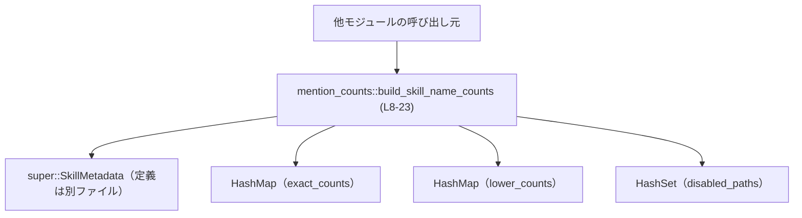
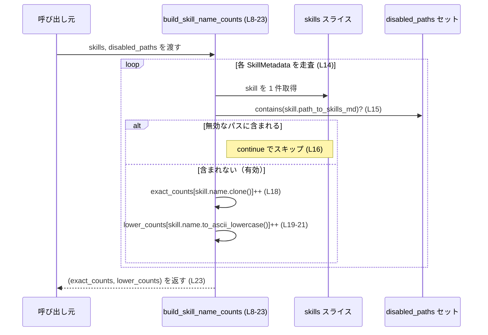

# core-skills/src/mention_counts.rs コード解説

## 0. ざっくり一言

`SkillMetadata` の配列から、**有効なスキルだけを対象に「そのままの名前」と「ASCII 小文字化した名前」ごとの出現回数を数えるユーティリティ関数**を提供するファイルです（`mention_counts.rs:L7-L23`）。

---

## 1. このモジュールの役割

### 1.1 概要

- このモジュールは、スキル定義（`SkillMetadata`）の一覧から、
  - スキル名そのもの（大文字小文字を区別）
  - スキル名を ASCII 小文字化したもの（大文字小文字を区別しないカウント用）
  
  の **2 種類の頻度表（`HashMap<String, usize>`）を構築する**機能を提供します（`mention_counts.rs:L7-L23`）。
- 特定パスにあるスキル定義は「無効（disabled）」とみなしてカウントから除外します（`mention_counts.rs:L8-L10, L15-L16`）。

### 1.2 アーキテクチャ内での位置づけ

このファイルは、上位モジュールから提供される `SkillMetadata` を入力として、スキル名の集計結果を返す、**純粋な計算ユーティリティ**として位置づけられます。

依存関係は次のとおりです。

- 入力
  - `super::SkillMetadata`（定義はこのチャンクには含まれません）
  - `std::collections::HashSet<PathBuf>`（無効なスキル定義ファイルのパス集合）
- 出力
  - `std::collections::HashMap<String, usize>` を 2 つ（名前・小文字化名前ごとのカウント）



**根拠**

- `SkillMetadata` の利用: `use super::SkillMetadata;`（`mention_counts.rs:L5`）
- `HashMap`/`HashSet`/`PathBuf` の利用: `mention_counts.rs:L1-L3, L8-L13`
- 唯一の公開関数 `build_skill_name_counts` がこれらを結びつける: `mention_counts.rs:L8-L23`

### 1.3 設計上のポイント

- **ステートレスなユーティリティ関数**  
  グローバル状態を持たず、入力スライスとセットから新しく `HashMap` を構築して返します（`mention_counts.rs:L12-L13, L23`）。
- **フィルタリングと集計を一つのループで実施**  
  `for skill in skills` のループ内で、無効パスの除外と 2 種類のカウント更新を行います（`mention_counts.rs:L14-L21`）。
- **エラーを返さないシンプルな API**  
  戻り値は `Result` ではなく単純なタプルであり、関数内部で失敗を表現する分岐はありません（`mention_counts.rs:L11, L23`）。
- **ASCII ベースの大文字小文字無視**  
  `to_ascii_lowercase` を使うため、Unicode 全体ではなく ASCII 文字に対して大文字小文字を正規化します（`mention_counts.rs:L19-L21`）。

---

## 2. 主要な機能一覧

- **スキル名出現カウント構築**  
  `build_skill_name_counts`: 有効な `SkillMetadata` のみを対象に、  
  - 「スキル名そのまま」  
  - 「スキル名を ASCII 小文字化したもの」  
  のそれぞれについて出現回数を数え、`HashMap` 2 つとして返します（`mention_counts.rs:L7-L23`）。

### 2.1 コンポーネントインベントリー（関数・構造体一覧）

| 名前 | 種別 | 公開 | 位置 | 説明 |
|------|------|------|------|------|
| `build_skill_name_counts` | 関数 | `pub` | `mention_counts.rs:L8-L23` | スキル一覧と無効パス集合から、スキル名ごとの出現回数（そのまま／ASCII 小文字）を集計して返す |

このファイル内で **新たに定義される構造体・列挙体はありません**。  
`SkillMetadata` は `super` モジュールからインポートされる型であり、その定義はこのチャンクには現れません（`mention_counts.rs:L5`）。

---

## 3. 公開 API と詳細解説

### 3.1 型一覧（構造体・列挙体など）

このファイル内で新しく定義される公開型はありません。

ただし、以下の外部型を利用しています。

| 名前 | 種別 | 定義場所 | 役割 / 用途 | 根拠 |
|------|------|----------|-------------|------|
| `SkillMetadata` | 構造体（と推定） | `super` モジュール（具体的なファイルは不明） | スキルのメタデータを表す型。少なくとも `name` と `path_to_skills_md` フィールドを持ちます。 | フィールドアクセス `skill.name`, `skill.path_to_skills_md`（`mention_counts.rs:L14-L21`） |
| `HashMap<K, V>` | 標準ライブラリ構造体 | `std::collections` | スキル名 → 出現回数のマップ | `use std::collections::HashMap;` と `HashMap::new()` の利用（`mention_counts.rs:L1, L12-L13`） |
| `HashSet<T>` | 標準ライブラリ構造体 | `std::collections` | 無効なスキル定義ファイルのパス集合 | `use std::collections::HashSet;` と引数 `disabled_paths: &HashSet<PathBuf>`（`mention_counts.rs:L2, L10`） |
| `PathBuf` | 標準ライブラリ構造体 | `std::path` | スキル定義ファイルのパスを表現 | `use std::path::PathBuf;` と `HashSet<PathBuf>` の型引数（`mention_counts.rs:L3, L10`） |

> `SkillMetadata` の正確な定義（フィールドの型・派生トレイトなど）は、このチャンクには含まれていません。「name」「path_to_skills_md」というフィールド名が存在することだけがコードから分かります（`mention_counts.rs:L14-L21`）。

### 3.2 関数詳細

#### `build_skill_name_counts(skills: &[SkillMetadata], disabled_paths: &HashSet<PathBuf>) -> (HashMap<String, usize>, HashMap<String, usize>)`

**概要**

- `skills` に含まれる各 `SkillMetadata` について、
  - `disabled_paths` にファイルパスが含まれていないものだけを対象とし（無効なスキル定義を除外）、  
  - `skill.name` ごとの出現回数（大文字小文字を区別したカウント）と、  
  - `skill.name` を `to_ascii_lowercase` したものごとの出現回数（ASCII ベースで大文字小文字を無視したカウント）  
- を `HashMap` 2 つとして返します（`mention_counts.rs:L8-L23`）。

**引数**

| 引数名 | 型 | 説明 | 根拠 |
|--------|----|------|------|
| `skills` | `&[SkillMetadata]` | スキルメタデータの配列への参照。各要素の `name` と `path_to_skills_md` を利用して集計を行います。 | 関数シグネチャと `for skill in skills`（`mention_counts.rs:L8-L9, L14`） |
| `disabled_paths` | `&HashSet<PathBuf>` | カウント対象から除外したいスキル定義ファイルのパス集合。`SkillMetadata` の `path_to_skills_md` がこの集合に含まれる場合、そのスキルはカウントされません。 | 関数シグネチャと `disabled_paths.contains(&skill.path_to_skills_md)`（`mention_counts.rs:L10, L15`） |

**戻り値**

- 型: `(HashMap<String, usize>, HashMap<String, usize>)`（`mention_counts.rs:L11`）
  - 第 1 要素: `exact_counts`  
    - キー: スキル名（`skill.name` をそのまま使用）  
    - 値: そのスキル名が有効なスキルとして現れた回数  
    - 構築箇所: `let mut exact_counts: HashMap<String, usize> = HashMap::new();` と `*exact_counts.entry(skill.name.clone()).or_insert(0) += 1;`（`mention_counts.rs:L12, L18`）
  - 第 2 要素: `lower_counts`  
    - キー: `skill.name.to_ascii_lowercase()` の結果（ASCII 小文字化されたスキル名）  
    - 値: その小文字化名に対応するスキルが有効なスキルとして現れた回数  
    - 構築箇所: `let mut lower_counts: HashMap<String, usize> = HashMap::new();` と `entry(skill.name.to_ascii_lowercase())`（`mention_counts.rs:L13, L19-L21`）

**内部処理の流れ（アルゴリズム）**

1. 空の `HashMap<String, usize>` を 2 つ用意します（`exact_counts` と `lower_counts`）（`mention_counts.rs:L12-L13`）。
2. `skills` スライスの各 `skill` についてループします（`mention_counts.rs:L14`）。
3. 各 `skill` について、その `path_to_skills_md` が `disabled_paths` に含まれるかを確認します（`mention_counts.rs:L15`）。
   - 含まれている場合は、その `skill` を無視して次の要素に進みます（`continue`）（`mention_counts.rs:L16`）。
4. 含まれていない（有効な）場合:
   - `exact_counts` に対して、キー `skill.name.clone()` の値を 1 増やします。  
     キーが存在しない場合は `0` で初期化してから加算します（`mention_counts.rs:L18`）。
   - `lower_counts` に対して、キー `skill.name.to_ascii_lowercase()` の値を 1 増やします。  
     こちらも同様に、存在しない場合は `0` で初期化します（`mention_counts.rs:L19-L21`）。
5. ループ終了後、`(exact_counts, lower_counts)` のタプルを返します（`mention_counts.rs:L23`）。

**Examples（使用例）**

> 注意: 実際のコードベースの `SkillMetadata` 定義はこのチャンクには含まれていません。  
> 以下の例では、`build_skill_name_counts` の利用方法を示すために、簡略化した `SkillMetadata` を **例として** 定義しています。

```rust
use std::collections::{HashMap, HashSet};              // HashMap / HashSet をインポート
use std::path::PathBuf;                                // PathBuf をインポート

// 実際のコードとは異なる可能性があるが、
// build_skill_name_counts の使い方説明用の例示的な定義
#[derive(Clone)]
struct SkillMetadata {
    name: String,                                      // スキル名
    path_to_skills_md: PathBuf,                        // スキル定義ファイルのパス
}

// mention_counts モジュールから関数をインポートする想定
use core_skills::mention_counts::build_skill_name_counts;

fn main() {
    // スキル定義の一覧を用意する
    let skills = vec![
        SkillMetadata {
            name: "Rust".to_string(),
            path_to_skills_md: PathBuf::from("skills/rust.md"),
        },
        SkillMetadata {
            name: "rust".to_string(),
            path_to_skills_md: PathBuf::from("skills/rust_intro.md"),
        },
        SkillMetadata {
            name: "Python".to_string(),
            path_to_skills_md: PathBuf::from("skills/python.md"),
        },
    ];

    // 無効なスキル定義ファイルのパス集合を用意する
    let mut disabled_paths = HashSet::new();
    disabled_paths.insert(PathBuf::from("skills/rust_intro.md")); // 2 番目の Rust は無効扱い

    // 出現回数を集計する
    let (exact_counts, lower_counts): (HashMap<String, usize>, HashMap<String, usize>) =
        build_skill_name_counts(&skills, &disabled_paths);

    // exact_counts（大文字小文字区別）の例
    assert_eq!(exact_counts.get("Rust"), Some(&1));    // 1 番目の Rust のみカウントされる
    assert_eq!(exact_counts.get("rust"), None);        // 無効パスのためカウントされない
    assert_eq!(exact_counts.get("Python"), Some(&1));  // Python は有効

    // lower_counts（ASCII 小文字化）の例
    assert_eq!(lower_counts.get("rust"), Some(&1));    // "Rust" -> "rust" に小文字化されて 1 回
    assert_eq!(lower_counts.get("python"), Some(&1));  // "Python" -> "python" に小文字化されて 1 回
}
```

**Errors / Panics**

- この関数は `Result` を返さず、明示的なエラー分岐もありません（`mention_counts.rs:L11-L23`）。
- 使用している操作はいずれも通常は panic を起こさないものです。
  - `HashMap::new`, `HashMap::entry`, `or_insert`, `+= 1` などは、入力に依存した panic 条件を持ちません（`mention_counts.rs:L12-L13, L18-L21`）。
  - `to_ascii_lowercase` も、標準ライブラリでは panic せずに文字列を変換します（`mention_counts.rs:L19-L21`）。
- 実行時に発生し得るのは、システム資源の枯渇（メモリ不足など）による暗黙的なエラーのみです。この挙動は Rust プログラム全般に共通であり、本関数特有のものではありません。

**Edge cases（エッジケース）**

- `skills` が空スライスの場合  
  - ループが一度も回らないため、両方の `HashMap` が空のまま返されます（`mention_counts.rs:L12-L14, L23`）。
- `disabled_paths` にすべての `SkillMetadata` の `path_to_skills_md` が含まれている場合  
  - すべての要素が `continue` でスキップされるため、両方の `HashMap` が空になります（`mention_counts.rs:L14-L16`）。
- 同じ `name` を持つスキルが複数ある場合  
  - 無効でない限り、それらの数だけカウントが増加します（`mention_counts.rs:L18`）。
- 大文字・小文字が異なるが、ASCII ベースでは同一とみなされるスキル名の場合  
  - 例: `"Rust"` と `"RUST"`  
  - `exact_counts` では別々のキーとしてカウントされます（`name.clone()` のため）（`mention_counts.rs:L18`）。  
  - `lower_counts` では同じキー（例: `"rust"`) に集約されてカウントされます（`to_ascii_lowercase` のため）（`mention_counts.rs:L19-L21`）。
- 非 ASCII 文字を含むスキル名  
  - `to_ascii_lowercase` は ASCII 以外の文字に対しては変換を行わないため、大文字小文字の正規化も行われません。  
  - この挙動は Rust 標準ライブラリの仕様に基づきますが、本チャンクからは詳細は読み取れません。  
  - Unicode の大文字小文字を考慮した比較が必要な場合には、この関数の仕様と異なることになります。

**使用上の注意点**

- **無効パスの一致条件**  
  - 除外判定は `disabled_paths.contains(&skill.path_to_skills_md)` によって行われます（`mention_counts.rs:L15`）。  
  - そのため、`disabled_paths` に挿入するパスと `SkillMetadata::path_to_skills_md` は、同じ表現（絶対パス／相対パス、正規化の有無など）である必要があります。
- **大小文字の扱い**  
  - 大文字小文字を区別するカウントとしないカウントの両方が返ります。  
  - 大文字小文字を無視した集計を行いたい場合は、第 2 要素（`lower_counts`）を利用する必要があります。
- **並行性（スレッドセーフティ）**  
  - この関数は引数を共有参照（`&`）で受け取り、内部でのみローカルな `HashMap` を構築して返します（`mention_counts.rs:L8-L13`）。  
  - 関数内部で共有状態を書き換えることはないため、**同じ入力に対して複数スレッドから同時に呼び出しても、関数内部のデータ競合は発生しません**。  
  - ただし、呼び出し側で `skills` や `disabled_paths` を並行して変更している場合の安全性は、そのデータ型の実装や外側の制御に依存します。このチャンクからはそこまでは分かりません。
- **性能面**  
  - 計算量は `skills.len()` に対して線形（O(n)）です。  
  - 各要素ごとに
    - `HashSet::contains`
    - 2 回の `HashMap::entry` と `or_insert`
    - `name` の `clone` と `to_ascii_lowercase`  
    を行うため、大量のスキルや長い名前の場合には、文字列操作とハッシュ計算が支配的になります（`mention_counts.rs:L14-L21`）。

### 3.3 その他の関数

このファイルには、`build_skill_name_counts` 以外の関数は定義されていません（`mention_counts.rs` 全体参照）。

---

## 4. データフロー

このセクションでは、`build_skill_name_counts` が呼び出されたときに、データがどのように流れるかを示します。

### 4.1 処理の概要

1. 呼び出し元から `skills` と `disabled_paths` が渡されます（`mention_counts.rs:L8-L10`）。
2. 各 `SkillMetadata` について、`path_to_skills_md` が `disabled_paths` に含まれているか判定します（`mention_counts.rs:L14-L16`）。
3. 無効でなければ、`skill.name` と `skill.name.to_ascii_lowercase()` をキーとして 2 つの `HashMap` を更新します（`mention_counts.rs:L18-L21`）。
4. 最後に `(exact_counts, lower_counts)` を返します（`mention_counts.rs:L23`）。

### 4.2 シーケンス図



---

## 5. 使い方（How to Use）

### 5.1 基本的な使用方法

典型的なフローは「`SkillMetadata` の一覧を用意 → 無効パス集合を用意 → 関数呼び出し → 結果を利用」という形になります。

```rust
use std::collections::{HashMap, HashSet};
use std::path::PathBuf;

// 実際には別モジュールから提供される SkillMetadata を想定
#[derive(Clone)]
struct SkillMetadata {
    name: String,
    path_to_skills_md: PathBuf,
}

// mention_counts モジュールから関数をインポート
use core_skills::mention_counts::build_skill_name_counts;

fn summarize_skills(skills: Vec<SkillMetadata>,
                    disabled_paths: HashSet<PathBuf>) {
    // スライス参照と &HashSet を渡して集計
    let (exact_counts, lower_counts): (HashMap<String, usize>, HashMap<String, usize>) =
        build_skill_name_counts(&skills, &disabled_paths);

    // 例: 大文字小文字を区別しない頻度の高いスキルを表示
    for (name_lower, count) in lower_counts.iter() {
        println!("{name_lower}: {count}");
    }

    // exact_counts は、大文字小文字を区別して表示したい場合などに利用できる
}
```

### 5.2 よくある使用パターン

1. **大文字小文字を無視した人気スキルランキングの作成**
   - `lower_counts` を使って、`count` の降順にソートすることで、おおまかな人気スキルランキングを作ることができます。
2. **入力データの品質チェック**
   - `exact_counts` と `lower_counts` の差分を見ることで、  
     例: `"Rust"`, `"rust"`, `"RUST"` がすべて別キーになっている場合に、名前表記の揺れを検出する用途が考えられます。
   - これらはあくまで本関数の出力をどう使うかの一例であり、具体的な利用形態はこのチャンクからは分かりません。

### 5.3 よくある間違い

```rust
use std::collections::HashSet;
use std::path::PathBuf;

// 間違い例: disabled_paths に「異なる表現のパス」を入れてしまう
let mut disabled = HashSet::new();
disabled.insert(PathBuf::from("./skills/rust.md"));  // 相対パス（./付き）

let skills = vec![
    SkillMetadata {
        name: "Rust".to_string(),
        // こちらは "skills/rust.md" として格納されているとする
        path_to_skills_md: PathBuf::from("skills/rust.md"),
    },
];

// contains 判定は PathBuf の等価性に依存するため、
// "./skills/rust.md" と "skills/rust.md" は一致せず、
// 本来無効にしたかったスキルがカウントされてしまう可能性がある。
let (exact, lower) = build_skill_name_counts(&skills, &disabled);
```

**正しい例（の一つ）**

```rust
// disabled_paths のパス表現を SkillMetadata 側と合わせる
let mut disabled = HashSet::new();
disabled.insert(PathBuf::from("skills/rust.md"));   // 同じ表現で格納

let (exact, lower) = build_skill_name_counts(&skills, &disabled);

// ここでは "Rust" に対応するカウントが除外される
```

このように、`disabled_paths` に格納するパスの表現と `SkillMetadata::path_to_skills_md` の表現を揃えることが重要です（`mention_counts.rs:L10, L15`）。

### 5.4 使用上の注意点（まとめ）

- `skills` と `disabled_paths` は、この関数呼び出し中に他スレッドから書き換えられないようにする必要があります（共有参照で渡されているため、通常は外側で排他制御を行います）。
- 大文字小文字の扱いが重要なシナリオでは、
  - 厳密な一致が必要な場合は `exact_counts`
  - ラフな集計で十分な場合は `lower_counts`
  を選択することが前提になります。
- 非 ASCII 文字を含むスキル名に対しては、`lower_counts` が期待する Unicode のケースフォールディングを行わない可能性があります。

---

## 6. 変更の仕方（How to Modify）

### 6.1 新しい機能を追加する場合

この関数に新しい集計機能を追加する場合の一般的なパターンは次のとおりです。

1. **追加したい集計軸を決める**
   - 例: 「スキル名の先頭文字ごとのカウント」など。
   - 本チャンクから具体的な要件は分かりませんが、追加のカウントは同じループ内で行うのが自然です（`mention_counts.rs:L14-L21`）。
2. **新しい `HashMap` をローカル変数として追加**
   - `exact_counts` や `lower_counts` と同様に、新しい `HashMap` を `let mut` で定義します（`mention_counts.rs:L12-L13` を参考）。
3. **ループ内で新しいマップも更新**
   - 既存の `exact_counts` / `lower_counts` を更新している箇所に並べて、新しいマップも `entry` / `or_insert` パターンで更新します（`mention_counts.rs:L18-L21`）。
4. **戻り値に新しいマップを含めるかどうかを検討**
   - 戻り値のタプルに要素を追加すると、呼び出し側すべてのコードに影響します。  
     そのため、既存の API 契約との整合性を確認する必要があります。

### 6.2 既存の機能を変更する場合

- **無効パスの扱いを変更したい場合**
  - 現状は「完全一致したパスを除外」する仕様です（`disabled_paths.contains(&skill.path_to_skills_md)`、`mention_counts.rs:L15`）。  
  - 例えば「ディレクトリ単位で除外したい」といった要件がある場合、`contains` の代わりにパスの親ディレクトリを比較するなどのロジックへの変更が必要になります。
  - その際、`HashSet<PathBuf>` のキーや `SkillMetadata` のフィールドの型が変更になる可能性があるため、関連する全呼び出し元の確認が必要です。
- **大文字小文字の扱いを変更したい場合**
  - 現状は `to_ascii_lowercase` による ASCII ベースの小文字化です（`mention_counts.rs:L19-L21`）。  
  - Unicode 対応への変更（たとえば `to_lowercase` 利用など）を行うと、`lower_counts` の意味が変わるため、呼び出し側で `lower_counts` を使っている箇所が期待する挙動との整合性を確認する必要があります。
- **戻り値の形式を変える場合**
  - タプルではなく構造体にまとめるなどの変更は、API 互換性に大きな影響を与えます。  
  - このファイル以外に存在する呼び出しコード（このチャンクには現れません）をすべて更新する必要があります。

---

## 7. 関連ファイル

このファイルと密接に関係するコンポーネントは次のとおりですが、具体的なファイルパスはこのチャンクからは分かりません。

| パス（推定） | 役割 / 関係 |
|--------------|------------|
| `super` モジュール内の `SkillMetadata` 定義ファイル | `SkillMetadata` のフィールド（少なくとも `name`, `path_to_skills_md`）を定義しており、本モジュールの入力型となります（`mention_counts.rs:L5, L14-L21`）。 |
| `tests` 関連ファイル（不明） | この関数に対するテストコードが存在する場合は別ファイルになると考えられますが、このチャンクには現れません。 |
| `core-skills` クレート内の呼び出し元モジュール（不明） | `build_skill_name_counts` を実際に利用して集計結果を使うコードが存在するはずですが、具体的な場所はこのチャンクには現れません。 |

> 以上の関連ファイルについて、正確なパスや構造は「このチャンクには現れない」ため、「不明」としています。
