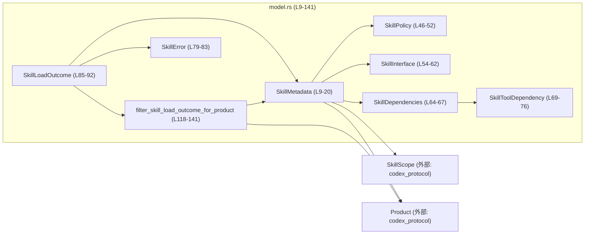
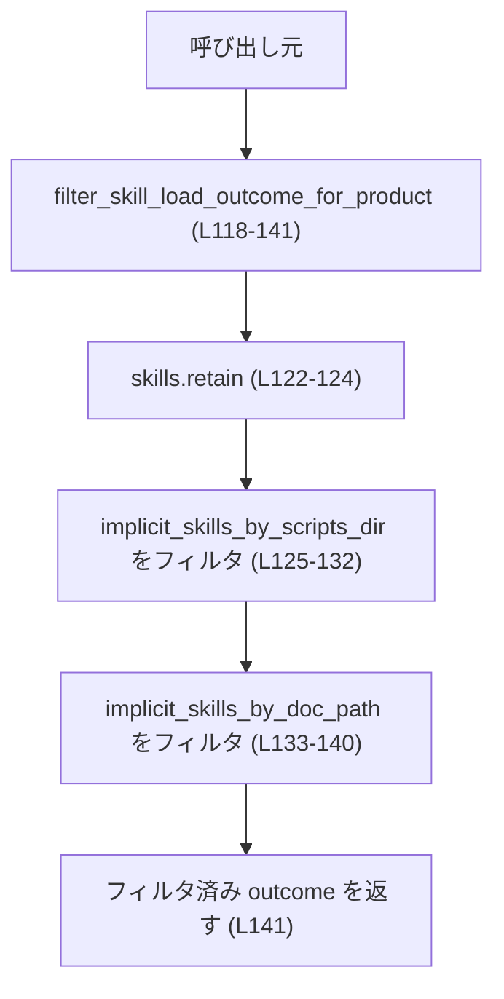
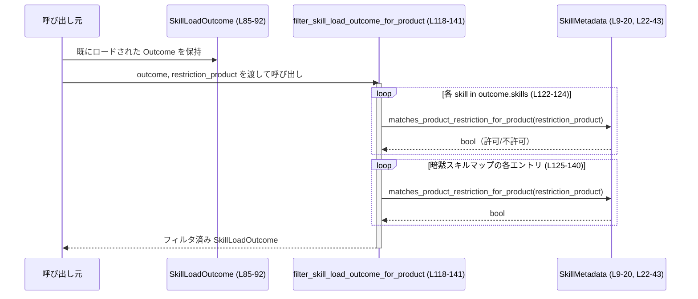

# core-skills/src/model.rs コード解説

## 0. ざっくり一言

このモジュールは、「スキル」のメタデータ・依存情報・ロード結果を表すドメインモデルと、  
プロダクトごとの利用制限や暗黙呼び出し可否に基づいてスキル集合をフィルタリングするロジックを提供します。（根拠: core-skills/src/model.rs:L9-20, L46-92, L118-141）

---

## 1. このモジュールの役割

### 1.1 概要

- このモジュールは **スキル機能のメタデータ管理** と **フィルタリング** を行うために存在し、次のような機能を提供します。（L9-20, L85-92, L118-141）
  - スキルの名称・説明文・UI用メタ情報・依存関係・ポリシー（暗黙呼び出し可否・対応プロダクト）を保持するデータ構造
  - スキルのロード結果（成功したスキル、エラー、無効化されたパス、暗黙スキルのインデックス）を保持する構造体
  - プロダクト制限・無効化状態・暗黙呼び出し可否に基づいたフィルタリング関数群

### 1.2 アーキテクチャ内での位置づけ

このモジュール内の主な型と依存関係を簡略化すると次のようになります。



- `Product` と `SkillScope` は外部クレート `codex_protocol::protocol` からインポートされており、このチャンクには定義が現れません。（L6-7）

### 1.3 設計上のポイント

コードから読み取れる設計上の特徴は次の通りです。

- **ドメインモデル中心の構造**  
  - スキルに関する情報（名前・説明・UI・依存・ポリシー・スコープ）を一つの構造体 `SkillMetadata` に集約しています。（L9-20）
- **ポリシーによる振る舞い制御**  
  - 暗黙呼び出し可否やプロダクト制限は `SkillPolicy` に保持し、その解釈は `SkillMetadata` のメソッド（`allow_implicit_invocation`, `matches_product_restriction_for_product`）に閉じ込めています。（L22-43, L46-52）
- **ロード結果のスナップショット**  
  - `SkillLoadOutcome` は、ロード済みスキル群とエラー、無効化されたパス、および暗黙スキルのインデックスをまとめた「スナップショット」的な構造になっています。（L85-92）
  - 暗黙スキルのインデックスは `Arc<HashMap<...>>` で共有されるため、スレッド間で共有されることを意図した設計と解釈できます。（L90-91）
- **副作用の少ないフィルタリング**  
  - `filter_skill_load_outcome_for_product` は `SkillLoadOutcome` を値として受け取り、内部でフィルタした後に同じ値を返す構造です。  
    既存の `Arc<HashMap<...>>` から新しい `HashMap` を生成して新しい `Arc` を作成するため、他の `Arc` クローンへの影響を与えません。（L118-141）

---

## 2. 主要な機能一覧（コンポーネントインベントリー・概要）

このモジュールが提供する主な機能は次の通りです。

- `SkillMetadata`: スキルのメタデータとポリシーを保持し、プロダクト制限の判定を行う。（L9-20, L22-43）
- `SkillPolicy`: 暗黙呼び出し可否・対象プロダクト一覧を保持するポリシー情報。（L46-52）
- `SkillInterface`: UI 表示用のメタ情報（表示名・アイコン・ブランドカラー・デフォルトプロンプト）を保持。（L54-62）
- `SkillDependencies` / `SkillToolDependency`: スキルが依存するツールとその詳細情報を表現。（L64-67, L69-76）
- `SkillError`: スキルロード時のエラー（パス + メッセージ）を表現。（L79-83）
- `SkillLoadOutcome`: スキルロードの結果（スキル・エラー・無効化パス・暗黙スキルインデックス）を保持し、スキルの有効/無効や暗黙呼び出し可否を判定する。（L85-92, L94-115）
- `filter_skill_load_outcome_for_product`: プロダクト制限に基づき `SkillLoadOutcome` 内のスキルと暗黙スキルインデックスをフィルタリングする。（L118-141）

---

## 3. 公開 API と詳細解説

### 3.1 型一覧（構造体・列挙体など）

このチャンクで定義されている主な型は次の通りです。

| 名前 | 種別 | 役割 / 用途 | 定義位置 |
|------|------|-------------|----------|
| `SkillMetadata` | 構造体 | スキルの名称・説明・UI 情報・依存関係・ポリシー・宣言元ファイルパス・スコープを保持し、ポリシー判定ロジックを持つ | core-skills/src/model.rs:L9-20, L22-43 |
| `SkillPolicy` | 構造体 | 暗黙呼び出し可否（オプション）と対象 `Product` の一覧を保持するポリシー情報 | L46-52 |
| `SkillInterface` | 構造体 | 表示名・短い説明・小/大アイコン・ブランドカラー・標準プロンプトなど UI 表示用メタ情報 | L54-62 |
| `SkillDependencies` | 構造体 | スキルが依存するツール群の一覧 | L64-67 |
| `SkillToolDependency` | 構造体 | 単一ツール依存の詳細（種別、値、説明、トランスポート種別、コマンド、URL） | L69-76 |
| `SkillError` | 構造体 | スキルロード時のエラー（ファイルパスとメッセージ）を表現 | L79-83 |
| `SkillLoadOutcome` | 構造体 | ロードされたスキル一覧、エラー一覧、無効化パス集合、暗黙スキルのインデックスを保持 | L85-92, L94-115 |

外部で定義され、このモジュールが利用する型は次の通りです（定義はこのチャンクには現れません）。

| 名前 | 種別 | 役割 / 用途 | 定義位置 |
|------|------|-------------|----------|
| `Product` | 構造体/列挙体（詳細不明） | スキルの対象プロダクトを表現し、`matches_product_restriction` メソッドでポリシーのプロダクト制限と照合する | 外部クレート `codex_protocol::protocol`（L6） |
| `SkillScope` | 構造体/列挙体（詳細不明） | スキルのスコープ（適用範囲）を表す | 外部クレート `codex_protocol::protocol`（L7） |

### 3.2 関数詳細（重要なメソッド・関数）

#### `SkillMetadata::matches_product_restriction_for_product(&self, restriction_product: Option<Product>) -> bool`

**概要**

- このスキルが、与えられた `restriction_product` のもとで有効かどうか（プロダクト制限を満たしているかどうか）を判定します。（L30-43）

**引数**

| 引数名 | 型 | 説明 |
|--------|----|------|
| `restriction_product` | `Option<Product>` | 判定対象のプロダクト。`None` の場合は「プロダクト文脈なし」と解釈されます。（L31-33） |

**戻り値**

- `bool`:  
  - `true`: このスキルは `restriction_product` の下で使用可能  
  - `false`: プロダクト制限により使用不可

**内部処理の流れ**

1. `self.policy` の有無で分岐します。（L34）
2. `policy` が `None` の場合は、プロダクト制限が存在しないとして常に `true` を返します。（L41-42）
3. `policy` が存在する場合:
   - `policy.products` が空であれば制限なしとして `true` を返します。（L35-37）
   - 空でない場合は、`restriction_product.is_some_and(...)` で  
     `restriction_product` が `Some(product)` かつ  
     `product.matches_product_restriction(&policy.products)` が `true` のときのみ `true` になります。（L37-39）

**Examples（使用例）**

```rust
use codex_protocol::protocol::Product;

// スキルにポリシーが設定されている例（Product の詳細定義はこのチャンクにはありません）
let skill = SkillMetadata {
    name: "example".to_string(),
    description: "Example skill".to_string(),
    short_description: None,
    interface: None,
    dependencies: None,
    policy: Some(SkillPolicy {
        allow_implicit_invocation: None,
        products: vec![/* Product 値 */],
    }),
    path_to_skills_md: PathBuf::from("skills/SKILLS.md"),
    scope: /* SkillScope 値 */,
};

// restriction_product が None の場合、products が空でなければ false になる
let allowed = skill.matches_product_restriction_for_product(None);
println!("allowed = {allowed}");
```

※ `Product` や `SkillScope` の具体的な構築方法はこのチャンクには現れないため不明です。

**Errors / Panics**

- 内部で `unwrap` 系メソッドは使用しておらず、パニックを起こすコードは含まれていません。（L34-42）

**Edge cases（エッジケース）**

- `self.policy` が `None` の場合:  
  - プロダクト制限なしとして必ず `true` が返ります。（L41-42）
- `self.policy` は `Some` だが `policy.products` が空の場合:  
  - 同じく制限なしとして `true` です。（L35-37）
- `policy.products` が空でなく、`restriction_product` が `None` の場合:  
  - `restriction_product.is_some_and(...)` が `false` になり、全体として `false` になります。  
    つまり、「制限付きスキルに対してプロダクトが指定されないと利用不可」という挙動になります。（L35-39）
- `Product::matches_product_restriction` の具体的な判定ロジックはこのチャンクには現れないため不明です。（L38）

**使用上の注意点**

- 呼び出し側で `restriction_product` を `None` にすると、制限付きスキルがすべて無効になる可能性があります。  
  プロダクトに応じたフィルタリングを期待する場合、適切な `Some(Product)` を渡す必要があります。（L35-39）
- この関数は純粋にブール判定だけを行い、状態を変更しません。スレッドセーフです。

---

#### `SkillMetadata::allow_implicit_invocation(&self) -> bool`

**概要**

- スキルが「暗黙の呼び出し（implicit invocation）」を許可するかどうかを判定します。（L23-28）

**内部処理の流れ**

1. `self.policy.as_ref()` でポリシーへの参照を取得（`Option<&SkillPolicy>`）。（L24-25）
2. `and_then(|policy| policy.allow_implicit_invocation)` で  
   `Option<Option<bool>>` を `Option<bool>` にフラット化。（L26）
3. `unwrap_or(true)` で、`None` の場合（ポリシーなし or フラグ未設定）にはデフォルト `true` を返します。（L27）

**振る舞いのまとめ**

- `policy` がない / `policy.allow_implicit_invocation` が `None`: 暗黙呼び出しを許可（`true`）。  
- `policy.allow_implicit_invocation == Some(true)`: 許可。  
- `policy.allow_implicit_invocation == Some(false)`: 不許可（`false`）。

**使用上の注意点**

- デフォルトが「許可（true）」である点が重要です。暗黙呼び出しを禁止したい場合は、ポリシーで明示的に `Some(false)` を設定する必要があります。（L24-27）
- このメソッドは `pub` ではなくモジュール内専用ですが、`SkillLoadOutcome` のロジックで利用されるため（L100）、暗黙スキル制御の中心的な意味を持ちます。

---

#### `SkillLoadOutcome::is_skill_enabled(&self, skill: &SkillMetadata) -> bool`

**概要**

- `SkillLoadOutcome` の文脈で、特定のスキルが「有効（disabled でない）」かどうかを判定します。（L95-97）

**引数**

| 引数名 | 型 | 説明 |
|--------|----|------|
| `skill` | `&SkillMetadata` | 判定対象のスキル。`path_to_skills_md` フィールドが使用されます。（L95-97, L17-19） |

**戻り値**

- `bool`:  
  - `true`: スキルは無効化されていない  
  - `false`: `disabled_paths` に含まれており、無効化されています

**内部処理の流れ**

1. `self.disabled_paths.contains(&skill.path_to_skills_md)` で、スキルの宣言ファイルパスが無効パス集合に含まれるかを確認します。（L96）
2. 含まれていない場合に `true` を返すために `!` で否定しています。（L96）

**Edge cases**

- `disabled_paths` に同一パスが複数回追加されていた場合でも、`HashSet` による集合表現のため重複は自動的に除外されます。（L89）
- `skill.path_to_skills_md` が未設定になるケースは構造体定義的に存在せず（必須フィールド）、`None` のようなケースは発生しません。（L17-19）

**使用上の注意点**

- 無効化の単位は「SKILLS.md ファイルのパス」であり、スキル ID などではありません。  
  同じファイルに複数スキルが定義されている場合、その扱いがどのようになるかは、このチャンクからは分かりません。

---

#### `SkillLoadOutcome::is_skill_allowed_for_implicit_invocation(&self, skill: &SkillMetadata) -> bool`

**概要**

- スキルが「有効で」かつ「暗黙呼び出しを許可」しているかをまとめて判定します。（L99-101）

**内部処理の流れ**

1. `self.is_skill_enabled(skill)` で有効性を判定。（L100）
2. `skill.allow_implicit_invocation()` で暗黙呼び出し可否を判定。（L100）
3. 両方が `true` のときのみ `true` を返します。（論理積 `&&`）（L100）

**使用上の注意点**

- 「暗黙呼び出し可否」の判定は `SkillMetadata` 側のメソッドに委譲しており、ここでは組み合わせのみ行います。（L22-28, L99-101）
- 無効化されたスキルは、ポリシーで暗黙呼び出しが許可されていても `false` になります。

---

#### `SkillLoadOutcome::allowed_skills_for_implicit_invocation(&self) -> Vec<SkillMetadata>`

**概要**

- 現在の `SkillLoadOutcome` 内で、暗黙呼び出しが許可されているスキルをすべて収集して返します。（L103-109）

**戻り値**

- `Vec<SkillMetadata>`:  
  暗黙呼び出しが許可されているスキルのクローンを格納したベクタ。元の `self.skills` とは独立した所有権を持ちます。（L104-108）

**内部処理の流れ**

1. `self.skills.iter()` でスキルのイテレータを取得。（L104-105）
2. `filter(|skill| self.is_skill_allowed_for_implicit_invocation(skill))` で条件に合うものだけを残します。（L106）
3. `cloned()` で `&SkillMetadata` を `SkillMetadata` にクローン。（L107）
4. `collect()` で `Vec<SkillMetadata>` にまとめて返します。（L108）

**Examples（使用例）**

```rust
let outcome: SkillLoadOutcome = /* ロード済み outcome */;
let implicit_skills: Vec<SkillMetadata> = outcome.allowed_skills_for_implicit_invocation();

for skill in &implicit_skills {
    println!("暗黙呼び出し可能なスキル: {}", skill.name);
}
```

**Edge cases**

- `self.skills` が空の場合: 空のベクタを返します。（L104-108）
- すべてのスキルが無効化 or 暗黙呼び出し禁止のいずれかの場合: 空のベクタを返します。

**使用上の注意点**

- クローンを返しているため、戻り値を変更しても `SkillLoadOutcome` 内のオリジナルは変更されません。（L107）
- スキル数が多い場合、大きなベクタと多数のクローンが発生するため、パフォーマンスとメモリ使用量への影響に注意が必要です。

---

#### `SkillLoadOutcome::skills_with_enabled(&self) -> impl Iterator<Item = (&SkillMetadata, bool)>`

**概要**

- 各スキルと、そのスキルが有効かどうか（`is_skill_enabled`）のフラグをペアにしたイテレータを返します。（L111-115）

**戻り値**

- `impl Iterator<Item = (&SkillMetadata, bool)>`:  
  - 要素は `(skill_ref, enabled)` で、`skill_ref` は元の `self.skills` 中の要素への参照です。（L112-114）

**内部処理の流れ**

1. `self.skills.iter()` でスキルへの参照のイテレータを取得。（L112-113）
2. `map(|skill| (skill, self.is_skill_enabled(skill)))` で `(スキル参照, 有効/無効フラグ)` を生成。（L113-114）

**使用上の注意点**

- 戻り値はイテレータであり、`self` を借用したままになるため、イテレータを使い終えるまで `self` の可変借用は取れません（Rust の借用規則による）。
- `skill` は共有参照（`&SkillMetadata`）であり、読み取り専用です。

---

#### `filter_skill_load_outcome_for_product(mut outcome: SkillLoadOutcome, restriction_product: Option<Product>) -> SkillLoadOutcome`

**概要**

- 与えられた `SkillLoadOutcome` から、`restriction_product` に適合するスキルだけを残す新しい `SkillLoadOutcome` を構築します。（L118-141）
- `skills` ベクタだけでなく、暗黙スキルのインデックス用 `Arc<HashMap<...>>` も同じ条件でフィルタします。（L125-140）

**引数**

| 引数名 | 型 | 説明 |
|--------|----|------|
| `outcome` | `SkillLoadOutcome` | フィルタの対象となるスキルロード結果。値で受け取り、内部で書き換えた後に返します。（L118-121） |
| `restriction_product` | `Option<Product>` | フィルタに使用するプロダクト。`None` の場合の扱いは `SkillMetadata::matches_product_restriction_for_product` に依存します。（L119-120, L30-43） |

**戻り値**

- `SkillLoadOutcome`:  
  元の `outcome` と同じ構造を持ちますが、`skills` と暗黙スキルインデックスがプロダクト制限に基づいてフィルタされた状態です。（L122-141）

**内部処理の流れ**

1. `outcome.skills.retain(...)` で、プロダクト制限を満たさないスキルを `skills` ベクタから除外します。（L122-124）
   - 判定には各 `SkillMetadata` の `matches_product_restriction_for_product(restriction_product)` を使用します。（L123-124）
2. `outcome.implicit_skills_by_scripts_dir` について:
   - 元の `Arc<HashMap<...>>` から `.iter()` で `(path, skill)` のペアを走査。（L126-128）
   - 同じく `matches_product_restriction_for_product` でフィルタ。（L129）
   - パスとスキルを `clone` し、新たな `HashMap<PathBuf, SkillMetadata>` に `collect`。（L130-131）
   - それを `Arc::new(...)` でラップし直してフィールドに再代入。（L125-132）
3. `outcome.implicit_skills_by_doc_path` についても同様のフィルタリングと再構築を行います。（L133-140）
4. 最後に `outcome` を返します。（L141）

**Mermaid 処理フロー図**



**安全性・並行性**

- `implicit_skills_by_*` は `Arc<HashMap<...>>` で表現されており、`filter` 処理では
  - 元の `HashMap` から読み取り専用の `.iter()` を行い（L127-128, L135-136）
  - 新しい `HashMap` を `collect()` で構築し（L130-131, L138-139）
  - それを新たな `Arc` に包み直しています。（L125-132, L133-140）
- そのため、この関数が既存の `Arc` クローンに影響を与えることはなく、  
  他スレッドで旧 `Arc` を参照している場合でもデータ競合は発生しません（書き込みは新しいインスタンスに対して行われます）。

**Edge cases**

- `restriction_product` が `None` の場合:
  - プロダクト制限のあるスキルは `matches_product_restriction_for_product` により除外されます。（L35-39, L122-124）
- `outcome.skills` が空の場合:
  - `.retain` は何もしません。暗黙スキルインデックスは単独でフィルタされます。（L122-124）
- 暗黙スキルマップが空の場合:
  - `.iter()` → `.collect()` により空の `HashMap` が生成され、新しい `Arc` としてセットされます。（L127-131, L135-139）

**使用上の注意点**

- `outcome` を値で受け取り、同じ値を返すスタイルのため、呼び出し側では「再束縛」する形で使うのが自然です。

  ```rust
  let outcome = filter_skill_load_outcome_for_product(outcome, Some(product));
  ```

- `Product::matches_product_restriction` の実装次第でフィルタの意味が変わるため、この関数単体からフィルタロジックのすべては分かりません。（L38）
- `SkillError` や `disabled_paths` はこの関数内では変更されません。（L85-92, L118-141）

### 3.3 その他の関数

上で詳細に扱わなかったが、このモジュール内で定義されている補助的な関数・メソッドの一覧です。

| 関数名 | 役割（1 行） | 定義位置 |
|--------|--------------|----------|
| `SkillLoadOutcome::new` | ※明示的な `new` コンストラクタは定義されておらず、`Default` 実装を利用することが想定されます（構造体に `#[derive(Default)]` が付与されています） | L85-92 |

※ `SkillLoadOutcome` には明示的なコンストラクタ関数は存在せず、このチャンクからは `Default::default()` またはフィールド初期化による生成が想定されます。（L85-92）

---

## 4. データフロー

ここでは、プロダクト制限に基づくスキルフィルタリングの典型的なデータフローを示します。

### 4.1 プロダクトごとのスキルフィルタリング



- 呼び出し元は、外部ローダから得た `SkillLoadOutcome` と `restriction_product` を `filter_skill_load_outcome_for_product` に渡します。（L118-121）
- フィルタ関数は、各 `SkillMetadata` に委譲してプロダクト制限を判定し、`skills` および暗黙スキルインデックスを再構築します。（L122-140）

---

## 5. 使い方（How to Use）

### 5.1 基本的な使用方法

`SkillLoadOutcome` とフィルタ関数を組み合わせた典型的な使用例です。

```rust
use std::collections::{HashMap, HashSet};
use std::path::PathBuf;
use std::sync::Arc;
use codex_protocol::protocol::{Product, SkillScope};

// 1. Outcome を構築（実際には別モジュールのローダから取得する想定）
let mut outcome = SkillLoadOutcome {
    skills: vec![
        SkillMetadata {
            name: "example".to_string(),
            description: "Example skill".to_string(),
            short_description: None,
            interface: None,
            dependencies: None,
            policy: Some(SkillPolicy {
                allow_implicit_invocation: Some(true),
                products: vec![/* Product 値 */],
            }),
            path_to_skills_md: PathBuf::from("skills/SKILLS.md"),
            scope: /* SkillScope 値 */,
        },
    ],
    errors: Vec::new(),
    disabled_paths: HashSet::new(),
    implicit_skills_by_scripts_dir: Arc::new(HashMap::new()),
    implicit_skills_by_doc_path: Arc::new(HashMap::new()),
};

// 2. プロダクト文脈を用意（詳細はこのチャンクにはありません）
let product: Product = /* ... */;

// 3. プロダクト制限でフィルタ
let outcome = filter_skill_load_outcome_for_product(outcome, Some(product));

// 4. 暗黙呼び出し可能なスキルを取得
let implicit_skills = outcome.allowed_skills_for_implicit_invocation();
```

※ `Product` や `SkillScope` の具体的な初期化方法は、このチャンクには現れません。

### 5.2 よくある使用パターン

1. **GUI/UX 層でのスキル一覧表示**  
   - `skills_with_enabled` を使って、「スキル + 有効/無効フラグ」の一覧を UI に渡す。（L111-115）

   ```rust
   for (skill, enabled) in outcome.skills_with_enabled() {
       println!("{}: enabled = {}", skill.name, enabled);
   }
   ```

2. **バックグラウンドでの暗黙スキル選択**  
   - `allowed_skills_for_implicit_invocation` を使って、暗黙呼び出し可能なスキルだけを候補にする。（L103-109）

### 5.3 よくある間違い（想定されるパターン）

```rust
// 間違い例: Product 制限付きスキルに restriction_product=None を渡している
let outcome = filter_skill_load_outcome_for_product(outcome, None);
// → policy.products が空でないスキルはすべて除外される（L35-39）

// 正しい例: 適切な Product 文脈を付与する
let outcome = filter_skill_load_outcome_for_product(outcome, Some(product));
```

```rust
// 間違い例: 暗黙呼び出しを禁止したいのに policy を設定していない
let skill = SkillMetadata {
    // ...
    policy: None, // allow_implicit_invocation のデフォルトは true（L24-27）
    // ...
};

// 正しい例: ポリシーで明示的に禁止する
let skill = SkillMetadata {
    // ...
    policy: Some(SkillPolicy {
        allow_implicit_invocation: Some(false),
        products: Vec::new(),
    }),
    // ...
};
```

### 5.4 使用上の注意点（まとめ）

- 暗黙呼び出し可否のデフォルトは「許可（true）」であり、明示的に禁止しない限り暗黙呼び出し候補に含まれます。（L23-28, L100-108）
- プロダクト制限付きスキルは、`restriction_product` が `None` の場合に全て除外されるため、フィルタ呼び出し時の引数に注意が必要です。（L35-39, L122-124）
- `allowed_skills_for_implicit_invocation` はスキルをクローンして返すため、スキル数が多い場合のメモリコストに留意します。（L104-108）
- このモジュールにはログ出力やメトリクスといった観測性（Observability）の仕組みは含まれていません。

---

## 6. 変更の仕方（How to Modify）

### 6.1 新しい機能を追加する場合

- **暗黙呼び出しの別種ポリシー** を導入したい場合:
  - 判定ロジックは `SkillMetadata::allow_implicit_invocation` にまとまっているため、このメソッドを変更または拡張するのが自然です。（L23-28）
  - `SkillLoadOutcome::is_skill_allowed_for_implicit_invocation` は単に `is_skill_enabled` と `allow_implicit_invocation` の AND を取っているだけなので、基本的には変更不要です。（L99-101）
- **プロダクト制限の追加属性** を扱いたい場合:
  - 現在は `SkillPolicy.products` と `Product::matches_product_restriction` の組み合わせで判定しているため（L35-39, L46-52）、新しい属性を使った判定ロジックは `Product` 側またはこのメソッドに追加する形になると考えられます。

### 6.2 既存の機能を変更する場合

- **暗黙呼び出しのデフォルト挙動を変更する** 場合:
  - `SkillMetadata::allow_implicit_invocation` の `unwrap_or(true)` を変更すると、ポリシー未設定時の挙動が変わります。（L27）
  - 影響範囲: `SkillLoadOutcome::is_skill_allowed_for_implicit_invocation`, `allowed_skills_for_implicit_invocation` の結果。（L99-101, L103-109）
- **プロダクト制限のデフォルト挙動を変更する** 場合:
  - `matches_product_restriction_for_product` の  
    - `self.policy == None` → `true`  
    - `policy.products.is_empty()` → `true`  
    の部分を変更する必要があります。（L35-42）
  - 影響範囲: `filter_skill_load_outcome_for_product` のフィルタ結果全般。（L122-140）
- 変更時には、他モジュールからの呼び出し箇所（このチャンクには現れていません）と、関連するテストコード（このチャンクには現れません）を再確認する必要があります。

---

## 7. 関連ファイル

このモジュールと密接に関係していることが明らかな外部コンポーネントは次の通りです。

| パス / 名称 | 役割 / 関係 |
|-------------|------------|
| `codex_protocol::protocol::Product` | スキルのプロダクト制限判定で利用される型。`matches_product_restriction` メソッドが呼ばれています。（L6, L38） |
| `codex_protocol::protocol::SkillScope` | `SkillMetadata.scope` として使用されるスキルスコープの型。（L7, L19） |

このチャンクにはテストコードや他モジュールからの呼び出しは現れないため、  
テストとの関係や実際の利用箇所の詳細は不明です。
