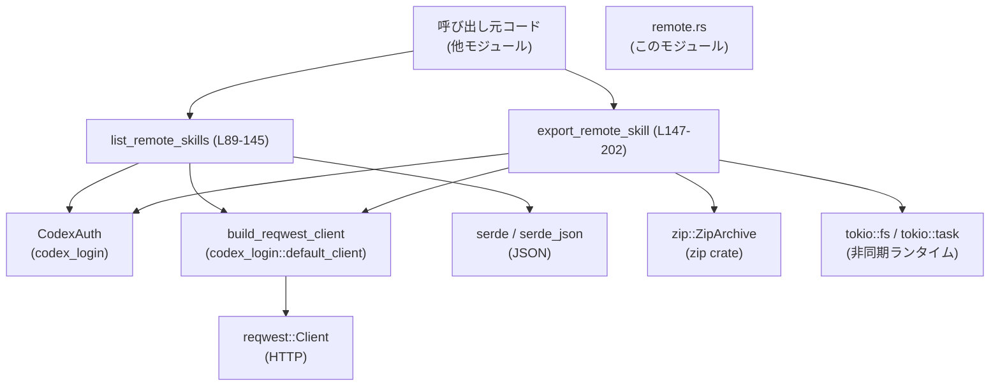
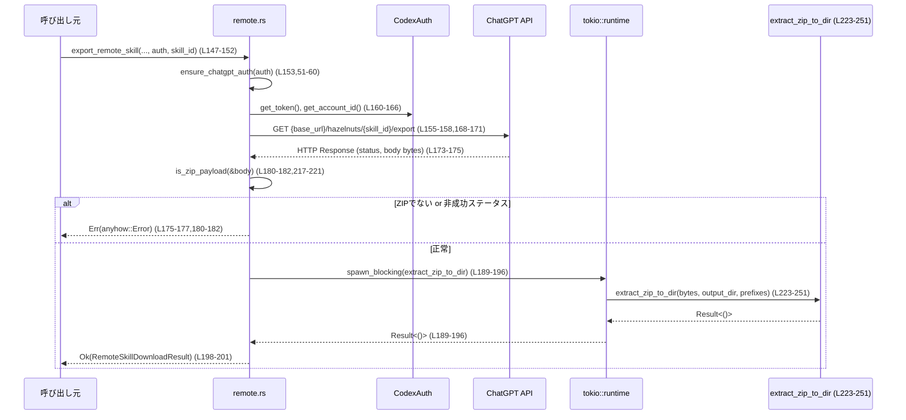

# core-skills/src/remote.rs コード解説

---

## 0. ざっくり一言

`remote.rs` は、ChatGPT の「リモートスキル」API に対して

- スキル一覧の取得
- スキル ZIP アーカイブのダウンロードと安全な展開

を行う低レベルクライアントを実装したモジュールです。  
（コメントにある通り、将来の配線用で、現時点ではプロダクトからは直接使われていない実装です。`remote.rs:L14-15`）

---

## 1. このモジュールの役割

### 1.1 概要

- このモジュールは **ChatGPT のリモートスキル管理 API** を叩くためのヘルパーを提供します。
- スキルの **スコープ**（Workspace 共有 / 全体共有 / 個人 / サンプル）と **プロダクトサーフェス**（ChatGPT/Codex/API/Atlas）を列挙型で表現し、HTTP クエリに変換します。`remote.rs:L17-31,33-49`
- スキル一覧を JSON で取得し、内部構造体から公開用の `RemoteSkillSummary` に変換します。`remote.rs:L76-80,82-87,133-144`
- スキル ZIP をダウンロードし、**パストラバーサルを防ぐ検証**を行いながらファイルシステムに展開します。`remote.rs:L180-215,223-251`

### 1.2 アーキテクチャ内での位置づけ

外部・内部コンポーネントとの依存関係は概ね次の通りです。



- 認証情報は `CodexAuth` に依存し、ChatGPT 用のトークンとアカウント ID を読み出します。`remote.rs:L51-60,115-121,160-166`
- HTTP クライアントは `codex_login::default_client::build_reqwest_client` を経由して作られます。`remote.rs:L9-10,110,155`
- JSON デコードと ZIP 展開はそれぞれ `serde_json`, `zip` クレート上で行います。`remote.rs:L76-87,133-134,223-230`
- ZIP 展開は `tokio::task::spawn_blocking` で同期 I/O を別スレッドにオフロードし、非同期ランタイムをブロックしないようにしています。`remote.rs:L189-196`

### 1.3 設計上のポイント

- **型安全なクエリパラメータ**  
  - スコープとプロダクトサーフェスを enum で表現し、クエリ文字列への変換を専用関数に切り出しています。`remote.rs:L17-23,25-31,33-49`
- **認証の前提条件を関数で強制**  
  - `ensure_chatgpt_auth` で「ChatGPT 認証であること」をチェックし、満たさない場合は即座にエラーにします。`remote.rs:L51-60`
- **エラーハンドリング統一**  
  - すべて `anyhow::Result` を返し、`anyhow::bail!` と `.context()` でエラーメッセージに文脈を付与しています。`remote.rs:L1-2,51-60,115-117,133-134,160-162,171-177,185-187,229-248`
- **ZIP 展開時のパス安全性**  
  - ZIP エントリ名を正規化 (`normalize_zip_name`) し、`safe_join` で `..` や絶対パスなどを拒否します。これにより、いわゆる「Zip Slip」攻撃を防いでいます。`remote.rs:L204-215,223-251,253-270`
- **非同期 + ブロッキング I/O の分離**  
  - HTTP 部分は `async` 関数で非同期に、ZIP 展開とファイル書き込みは `spawn_blocking` 内で同期 I/O を実行し、ランタイムのスレッドをブロックしないようにしています。`remote.rs:L147-202,189-196,223-251`

---

### 1.4 コンポーネントインベントリー

#### 型一覧

| 名前 | 種別 | 公開範囲 | 行範囲 | 役割 / 用途 |
|------|------|----------|--------|-------------|
| `RemoteSkillScope` | enum | `pub` | `remote.rs:L17-23` | リモートスキルのスコープ（Workspace共有/全体共有/個人/サンプル）を表現する列挙体 |
| `RemoteSkillProductSurface` | enum | `pub` | `remote.rs:L25-31` | 対象プロダクトサーフェス（ChatGPT/Codex/API/Atlas）を表現する列挙体 |
| `RemoteSkillSummary` | struct | `pub` | `remote.rs:L63-68` | `list_remote_skills` の結果として返されるスキルの概要情報（id, name, description）の DTO |
| `RemoteSkillDownloadResult` | struct | `pub` | `remote.rs:L70-74` | `export_remote_skill` の結果として返される、ダウンロードされたスキル ID と保存先ディレクトリ |
| `RemoteSkillsResponse` | struct | private | `remote.rs:L76-80` | `/hazelnuts` API の JSON レスポンスをデシリアライズする内部用ラッパー（`hazelnuts` フィールドにスキル一覧） |
| `RemoteSkill` | struct | private | `remote.rs:L82-87` | 単一スキルの JSON 表現（id, name, description）を受け取る内部用構造体 |

#### 関数一覧

| 名前 | 種別 | 公開範囲 | 行範囲 | 役割 / 用途 |
|------|------|----------|--------|-------------|
| `as_query_scope` | 関数 | private | `remote.rs:L33-40` | `RemoteSkillScope` を HTTP クエリ用文字列 (`"workspace-shared"` 等) に変換する |
| `as_query_product_surface` | 関数 | private | `remote.rs:L42-49` | `RemoteSkillProductSurface` をクエリ用文字列に変換する |
| `ensure_chatgpt_auth` | 関数 | private | `remote.rs:L51-60` | `CodexAuth` が ChatGPT 用認証であることを検証し、そうでなければエラーを返す |
| `list_remote_skills` | `async fn` | `pub` | `remote.rs:L89-145` | リモートスキル一覧を取得し、`RemoteSkillSummary` のベクタとして返すメイン API |
| `export_remote_skill` | `async fn` | `pub` | `remote.rs:L147-202` | 指定スキル ID の ZIP をダウンロードしてローカルに展開するメイン API |
| `safe_join` | 関数 | private | `remote.rs:L204-215` | パスコンポーネントを検証しつつ `base` と `name` を結合する、安全な join ヘルパー |
| `is_zip_payload` | 関数 | private | `remote.rs:L217-221` | ZIP ファイルのシグネチャを先頭バイト列で判定する軽量チェック |
| `extract_zip_to_dir` | 関数 | private | `remote.rs:L223-251` | ZIP バイト列を解凍し、正規化されたパスで `output_dir` 以下に書き出す |
| `normalize_zip_name` | 関数 | private | `remote.rs:L253-270` | ZIP エントリ名から先頭 `"./"` や `"{skill_id}/"` のようなプレフィックスを取り除き、空になれば無視する |

---

## 2. 主要な機能一覧

- リモートスキルの一覧取得: `list_remote_skills` で `/hazelnuts` エンドポイントからスキル一覧を取得し、`RemoteSkillSummary` に変換する。`remote.rs:L89-145`
- リモートスキルの ZIP ダウンロードと展開: `export_remote_skill` で `/hazelnuts/{skill_id}/export` から ZIP を取得し、検証付きでディスクに展開する。`remote.rs:L147-202`
- スコープ/プロダクトサーフェスの文字列変換: enum からクエリ文字列へ変換する内部ヘルパー。`remote.rs:L17-31,33-49`
- ZIP パスの安全な正規化と join: ZIP エントリ名を正規化し、不正なパスコンポーネントを拒否した上で出力ディレクトリに書き出す。`remote.rs:L204-215,223-251,253-270`

---

## 3. 公開 API と詳細解説

### 3.1 型一覧（構造体・列挙体など）

#### 公開型

| 名前 | 種別 | 行範囲 | 役割 / 用途 |
|------|------|--------|-------------|
| `RemoteSkillScope` | enum | `remote.rs:L17-23` | スキルの公開範囲（Workspace 共有、全体共有、個人、サンプル）を指定するための列挙体です。`list_remote_skills` の引数として使用され、クエリパラメータ `scope` に変換されます（`as_query_scope`）。 |
| `RemoteSkillProductSurface` | enum | `remote.rs:L25-31` | スキルを利用するプロダクトサーフェス（ChatGPT、Codex、API、Atlas）を指定するための列挙体です。`list_remote_skills` の引数として使用され、`product_surface` クエリに変換されます（`as_query_product_surface`）。 |
| `RemoteSkillSummary` | struct | `remote.rs:L63-68` | スキルの ID・名前・説明を保持する DTO（データ転送オブジェクト）で、`list_remote_skills` の戻り値の要素です。 |
| `RemoteSkillDownloadResult` | struct | `remote.rs:L70-74` | ダウンロードされたスキル ID と、展開先ディレクトリのパスを保持します。`export_remote_skill` の戻り値です。 |

#### 内部型

| 名前 | 種別 | 行範囲 | 役割 / 用途 |
|------|------|--------|-------------|
| `RemoteSkillsResponse` | struct | `remote.rs:L76-80` | `/hazelnuts` API の JSON レスポンス全体を表現します。フィールド名 `hazelnuts` を `skills` にマッピングするため `#[serde(rename = "hazelnuts")]` を利用しています。 |
| `RemoteSkill` | struct | `remote.rs:L82-87` | 個々のスキルオブジェクト（id, name, description）をデシリアライズする内部型です。`RemoteSkillSummary` へ変換されます。 |

---

### 3.2 関数詳細（主要 7 件）

#### `list_remote_skills(chatgpt_base_url: String, auth: Option<&CodexAuth>, scope: RemoteSkillScope, product_surface: RemoteSkillProductSurface, enabled: Option<bool>) -> Result<Vec<RemoteSkillSummary>>`

**概要**

- ChatGPT のリモートスキル API (`/hazelnuts`) を呼び出してスキル一覧を取得し、`RemoteSkillSummary` のリストとして返します。`remote.rs:L89-145`
- スコープやプロダクトサーフェス、`enabled` フラグをクエリパラメータとして付与します。

**引数**

| 引数名 | 型 | 説明 |
|--------|----|------|
| `chatgpt_base_url` | `String` | ChatGPT API のベース URL。末尾の `/` は関数内で削除されます。`remote.rs:L96,99` |
| `auth` | `Option<&CodexAuth>` | 認証情報。ChatGPT 用認証が必須で、`None` または API key 認証ならエラーになります（`ensure_chatgpt_auth`）。`remote.rs:L97` |
| `scope` | `RemoteSkillScope` | スキルのスコープ。存在する場合 `scope` クエリに反映されます。`remote.rs:L92,102-104` |
| `product_surface` | `RemoteSkillProductSurface` | プロダクトサーフェス。`product_surface` クエリに反映されます。`remote.rs:L93,100-101` |
| `enabled` | `Option<bool>` | スキルが有効かどうか。`Some(true/false)` なら文字列 `"true"` / `"false"` をクエリ `enabled` に追加します。`remote.rs:L94,105-108` |

**戻り値**

- `Result<Vec<RemoteSkillSummary>>`（`anyhow::Result` エイリアス）  
  正常時はスキル一覧、異常時はエラーを返します。`remote.rs:L1-2,136-144`

**内部処理の流れ（アルゴリズム）**

1. `chatgpt_base_url` の末尾 `/` を削除して `base_url` を作る。`remote.rs:L96`
2. `ensure_chatgpt_auth` で認証情報を検証し、ChatGPT 用でない場合はエラー。`remote.rs:L97,51-60`
3. `url = "{base_url}/hazelnuts"` を組み立てる。`remote.rs:L99`
4. `product_surface` を文字列に変換し、必須クエリとして追加。さらに `scope` と `enabled` が `Some` なら、それぞれクエリに追加。`remote.rs:L100-108`
5. `build_reqwest_client()` から HTTP クライアントを作成し、GET リクエストにタイムアウトとクエリを設定。`remote.rs:L110-114`
6. `auth.get_token()` を呼んで Bearer トークンを取得し、`Authorization: Bearer ...` を付与。`get_account_id()` があれば `chatgpt-account-id` ヘッダも追加。`remote.rs:L115-121`
7. リクエストを送信し、失敗時には「どの URL に対して失敗したか」を含むエラーを返す。`remote.rs:L122-125`
8. レスポンスステータスとボディ文字列を取得。ステータスが成功（2xx）でなければ、ステータスとボディ内容を含むエラーを返す。`remote.rs:L127-131`
9. ボディを `RemoteSkillsResponse` として JSON デコードし、`skills` ベクタから `RemoteSkillSummary` にマップして返す。`remote.rs:L133-144`

**Examples（使用例）**

```rust
// 非同期コンテキスト（tokio など）から呼び出す例
use core_skills::remote::{
    list_remote_skills, RemoteSkillScope, RemoteSkillProductSurface,
};
use codex_login::CodexAuth;

async fn fetch_skills_example(auth: &CodexAuth) -> anyhow::Result<()> {
    // ChatGPT のベース URL（末尾に / があってもよい）
    let base_url = "https://chatgpt.example.com/".to_string();

    // Workspace共有スキル、ChatGPT サーフェス、enabled=true のみを取得
    let skills = list_remote_skills(
        base_url,
        Some(auth),
        RemoteSkillScope::WorkspaceShared,
        RemoteSkillProductSurface::Chatgpt,
        Some(true),
    )
    .await?; // anyhow::Result なので ? で伝播可能

    for skill in skills {
        println!("{}: {}", skill.id, skill.name);
    }
    Ok(())
}
```

**Errors / Panics**

- `auth` が `None` または ChatGPT 認証でない場合  
  - `ensure_chatgpt_auth` 内で `anyhow::bail!` によりエラー。`remote.rs:L51-60`
- `auth.get_token()` が失敗した場合  
  - `"Failed to read auth token for remote skills"` というコンテキスト付きエラー。`remote.rs:L115-117`
- HTTP リクエスト送信失敗（ネットワーク障害など）  
  - `"Failed to send request to {url}"` というエラー。`remote.rs:L122-125`
- ステータスコードが 2xx 以外  
  - `"Request failed with status {status} from {url}: {body}"` としてエラー。`remote.rs:L127-131`
- JSON パース失敗  
  - `"Failed to parse skills response"` という文脈でエラー。`remote.rs:L133-134`
- パニックを発生させるコードは含まれていません（すべて `Result` ベース）。

**Edge cases（エッジケース）**

- `enabled == None`  
  - クエリに `enabled` パラメータが含まれません。`remote.rs:L105-108`
- `scope` によって `as_query_scope` が `None` を返す可能性は現状ありません（全列挙値が Some）。しかし、将来 `RemoteSkillScope` に新しい値が追加された場合、`as_query_scope` を更新しないと `scope` パラメータが落ちる可能性があります。`remote.rs:L33-39`
- レスポンスボディ取得でエラーが起きた場合  
  - `response.text().await.unwrap_or_default()` なので、エラー時には空文字列として扱われます。結果として「パース失敗」など別のエラーに変換され、元の I/O エラーの詳細は失われます。`remote.rs:L128,133-134`

**使用上の注意点**

- **認証前提**: ChatGPT 用の認証である必要があります。API key ベース認証は拒否されます。`remote.rs:L55-58`
- **非同期コンテキスト必須**: `async fn` なので、`tokio` などのランタイム上から `.await` で呼び出す必要があります。
- **ネットワーク障害時のエラー文言**: `text().await` のエラーが握りつぶされるため、ボディ読み出しの I/O エラーが JSON パースエラーとして現れる点に注意が必要です。`remote.rs:L128,133-134`

**根拠**

- 実装全体: `core-skills/src/remote.rs:L89-145`  
- 認証チェック: `core-skills/src/remote.rs:L51-60,97,115-121`  
- エラーメッセージ: `core-skills/src/remote.rs:L115-117,122-125,127-131,133-134`

---

#### `export_remote_skill(chatgpt_base_url: String, codex_home: PathBuf, auth: Option<&CodexAuth>, skill_id: &str) -> Result<RemoteSkillDownloadResult>`

**概要**

- 指定された `skill_id` のリモートスキルを ZIP としてダウンロードし、`codex_home/skills/{skill_id}` 以下に展開します。`remote.rs:L147-202`
- ZIP であることの簡易チェックと、展開時のパス検証により、ある程度安全性を確保しています。

**引数**

| 引数名 | 型 | 説明 |
|--------|----|------|
| `chatgpt_base_url` | `String` | ChatGPT API のベース URL。`list_remote_skills` 同様、末尾の `/` は削除されます。`remote.rs:L156-157` |
| `codex_home` | `PathBuf` | ローカルの Codex ホームディレクトリ。`skills/{skill_id}` 配下に展開されます。`remote.rs:L149,184-185` |
| `auth` | `Option<&CodexAuth>` | 認証情報。ChatGPT 認証であることが必須です。`remote.rs:L153,51-60` |
| `skill_id` | `&str` | ダウンロード対象スキルの ID。URL のパスと展開先ディレクトリ名に利用されます。`remote.rs:L151,157,184`

**戻り値**

- `Result<RemoteSkillDownloadResult>`  
  - 正常時: `id` に `skill_id`、`path` に展開完了したディレクトリのパスを設定。`remote.rs:L198-201`
  - 異常時: ZIP でない、HTTP エラー、ファイルシステムエラーなどを `anyhow::Error` で返します。

**内部処理の流れ**

1. `ensure_chatgpt_auth` で ChatGPT 認証を強制。`remote.rs:L153,51-60`
2. `build_reqwest_client` でクライアント生成、`"{base_url}/hazelnuts/{skill_id}/export"` の URL を組み立て。`remote.rs:L155-158`
3. ベアラートークンと `chatgpt-account-id` ヘッダの付与。`remote.rs:L160-166`
4. HTTP GET を送信。失敗時には `"Failed to send download request to {url}"` でエラー。`remote.rs:L168-171`
5. レスポンスステータスとボディバイト列を取得。`remote.rs:L173-175`
6. ステータスが成功でない場合は `String::from_utf8_lossy` でボディを文字列化し、エラーメッセージに埋め込んで `bail!`。`remote.rs:L175-177`
7. `is_zip_payload(&body)` で ZIP シグネチャを判定し、違う場合は `"Downloaded remote skill payload is not a zip archive"` でエラー。`remote.rs:L180-182,217-221`
8. 出力ディレクトリ `codex_home/skills/{skill_id}` を作成（再帰的）。失敗時には `"Failed to create downloaded skills directory"`。`remote.rs:L184-187`
9. `tokio::task::spawn_blocking` で ZIP 展開処理を別スレッドにオフロードし、`extract_zip_to_dir` を呼び出し。`remote.rs:L189-196,223-251`
10. 展開成功後、`RemoteSkillDownloadResult` を返す。`remote.rs:L198-201`

**Examples（使用例）**

```rust
use core_skills::remote::export_remote_skill;
use codex_login::CodexAuth;
use std::path::PathBuf;

async fn download_skill_example(auth: &CodexAuth) -> anyhow::Result<()> {
    let base_url = "https://chatgpt.example.com".to_string();
    let codex_home = PathBuf::from("/home/user/.codex");
    let skill_id = "my-skill-123";

    let result = export_remote_skill(
        base_url,
        codex_home,
        Some(auth),
        skill_id,
    )
    .await?; // ZIP ダウンロードと展開が完了

    println!("Skill {} downloaded to {:?}", result.id, result.path);
    Ok(())
}
```

**Errors / Panics**

- 認証関連のエラー（`ensure_chatgpt_auth`）  
  - `auth` が無い、もしくは ChatGPT 認証でない場合。`remote.rs:L51-60,153`
- トークン取得失敗  
  - `"Failed to read auth token for remote skills"`。`remote.rs:L160-162`
- HTTP リクエスト送信失敗  
  - `"Failed to send download request to {url}"`。`remote.rs:L168-171`
- 非成功ステータスコード  
  - `"Download failed with status {status} from {url}: {body_text}"`。`remote.rs:L173-177`
- ZIP シグネチャ不一致  
  - `"Downloaded remote skill payload is not a zip archive"`。`remote.rs:L180-182,217-221`
- ディレクトリ作成失敗  
  - `"Failed to create downloaded skills directory"`。`remote.rs:L184-187`
- ZIP 展開スレッドの失敗 (`spawn_blocking` 側)  
  - `"Zip extraction task failed"`。`remote.rs:L189-196`
- `extract_zip_to_dir` 内でのファイル I/O エラー（詳細は同関数を参照）。`remote.rs:L223-251`
- パニックは使用せず、すべて `Result` ベース。

**Edge cases**

- 非 ZIP ファイルを返すサーバ  
  - シグネチャチェックでエラーになるため、ZIP と見なされません。`remote.rs:L180-182,217-221`
- 非常に大きな ZIP ファイル  
  - メモリ上に全バイト (`Vec<u8>`) を保持し、さらに `zip::ZipArchive` で展開するため、巨大ファイルではメモリ・ディスク使用量が大きくなります。リソース枯渇に注意が必要です。`remote.rs:L174-175,189,223-230`
- 出力ディレクトリが既に存在・一部ファイルが存在する場合  
  - `create_dir_all` は既存でも成功しますが、既存ファイルに対して `File::create` を行うと上書きされます。`remote.rs:L184-187,245-247`

**使用上の注意点**

- **信頼できない ZIP に対するリソース消費**: 非常に大きい、もしくは多数のファイルを含む ZIP を渡されると、CPU・メモリ・ディスクを大量に消費します。上位レイヤでサイズ制限やタイムアウトを設けることが望ましいです。
- **パス検証はあるがシンボリックリンクは検出しない**: `safe_join` は `..` 等を防ぎますが、既存のシンボリックリンク経由で外部パスに書き込まれる可能性はコードからは排除されていません。`remote.rs:L204-215`

**根拠**

- 実装全体: `core-skills/src/remote.rs:L147-202`  
- ZIP 判定: `core-skills/src/remote.rs:L173-182,217-221`  
- 出力ディレクトリと展開処理: `core-skills/src/remote.rs:L184-187,189-196,223-251`

---

#### `ensure_chatgpt_auth(auth: Option<&CodexAuth>) -> Result<&CodexAuth>`

**概要**

- 渡された `CodexAuth` が「ChatGPT 用認証」であることを保証するヘルパーです。`auth` が `None` だったり、API key 認証だった場合はエラーを返します。`remote.rs:L51-60`

**引数**

| 引数名 | 型 | 説明 |
|--------|----|------|
| `auth` | `Option<&CodexAuth>` | Optional な認証情報。 |

**戻り値**

- `Result<&CodexAuth>`  
  - 正常時: 引数の `auth` をそのまま返します（借用）。  
  - 異常時: 「chatgpt authentication required ...」というメッセージでエラー。

**内部処理**

1. `let Some(auth) = auth else { ... }` で `Option` をアンラップ。`None` なら `bail!`。`remote.rs:L52-54`
2. `auth.is_chatgpt_auth()` を呼び出し、`false` の場合も `bail!`。`remote.rs:L55-58`
3. 条件を満たしていれば `Ok(auth)` を返す。`remote.rs:L60`

**使用例**

```rust
fn use_auth(auth: Option<&CodexAuth>) -> anyhow::Result<()> {
    let auth = ensure_chatgpt_auth(auth)?; // ここ以降は ChatGPT 認証が保証される
    // auth を使って処理…
    Ok(())
}
```

**Errors**

- `auth` が `None` の場合: `"chatgpt authentication required for remote skill scopes"`。`remote.rs:L52-54`
- `auth.is_chatgpt_auth()` が `false` の場合: `"chatgpt authentication required for remote skill scopes; api key auth is not supported"`。`remote.rs:L55-58`

**根拠**

- `core-skills/src/remote.rs:L51-60`

---

#### `extract_zip_to_dir(bytes: Vec<u8>, output_dir: &Path, prefix_candidates: &[String]) -> Result<()>`

**概要**

- メモリ上の ZIP データを `zip::ZipArchive` で開き、各エントリを正規化・検証して `output_dir` 以下に展開します。`remote.rs:L223-251`
- `export_remote_skill` から `spawn_blocking` 経由で呼び出されます。`remote.rs:L189-196`

**引数**

| 引数名 | 型 | 説明 |
|--------|----|------|
| `bytes` | `Vec<u8>` | ZIP ファイルの全バイト。 |
| `output_dir` | `&Path` | 展開先ディレクトリ。 |
| `prefix_candidates` | `&[String]` | ZIP 内のトップレベルディレクトリ名として削除したいプレフィックス候補（例: `["{skill_id}".to_string()]`）。`remote.rs:L191,253-263` |

**戻り値**

- `Result<()>`  
  - 正常時: `Ok(())`。  
  - 異常時: ZIP オープン、エントリ読み込み、ファイルシステム操作などのエラーを `anyhow::Error` で返す。

**内部処理**

1. `std::io::Cursor::new(bytes)` でバイト列を `Read` 実装にラップ。`remote.rs:L228`
2. `zip::ZipArchive::new(cursor)` で ZIP を開く。失敗時は `"Failed to open zip archive"`。`remote.rs:L229`
3. `for i in 0..archive.len()` で全エントリをループ。`remote.rs:L230-231`
4. 各エントリについて:
   - ディレクトリ (`file.is_dir()`) はスキップ。`remote.rs:L232-234`
   - `file.name()` を `String` にし、`normalize_zip_name` に渡して正規化。`None` ならスキップ。`remote.rs:L235-239`
   - `safe_join(output_dir, &normalized)` でパス部品を検証しつつ出力パスを決定。`remote.rs:L240-241`
   - 親ディレクトリがあれば `create_dir_all` で作成。失敗時は `"Failed to create parent dir for {normalized}"`。`remote.rs:L241-243`
   - `File::create` でファイルを開き、`std::io::copy` で ZIP 内のデータを書き出す。各ステップで `with_context` によりエラーにファイル名を付与。`remote.rs:L245-248`
5. すべてのファイル処理が成功したら `Ok(())`。`remote.rs:L250`

**Errors / Edge cases**

- ZIP オープン失敗: `"Failed to open zip archive"`。`remote.rs:L229`
- 各エントリ読み込み失敗: `"Failed to read zip entry"`。`remote.rs:L231`
- `normalize_zip_name` が `None` を返したエントリは単に無視されます（例: 名前が `"./"` や `"skill_id/"` だけのディレクトリエントリ）。`remote.rs:L235-239,253-266`
- `safe_join` で不正なパスコンポーネント（`..`, 絶対パスなど）が検出された場合は `"Invalid file path in remote skill payload: {name}"` でエラー。`remote.rs:L204-215,240`
- ディレクトリ作成・ファイル作成・コピーで失敗した場合、それぞれ `"Failed to create parent dir ..."`, `"Failed to create file ..."`, `"Failed to write skill file ..."` でエラー。`remote.rs:L241-243,245-248`

**使用上の注意点**

- 信頼できない ZIP に対しては、シンボリックリンク等に起因するパストラバーサルを完全には防げない可能性があります（`safe_join` は Path コンポーネントのみを検査します）。  
- 大量のファイル・大容量 ZIP の展開は時間とディスク容量を消費します。

**根拠**

- `core-skills/src/remote.rs:L223-251`

---

#### `safe_join(base: &Path, name: &str) -> Result<PathBuf>`

**概要**

- 与えられたパスをコンポーネント単位で検査し、`Component::Normal` 以外（`..`, ルート、ドライブ指定など）が含まれていればエラーを返します。`remote.rs:L204-215`
- 問題なければ `base.join(path)` を返します。

**引数**

| 引数名 | 型 | 説明 |
|--------|----|------|
| `base` | `&Path` | ベースとなるディレクトリパス。 |
| `name` | `&str` | 相対パスとして想定されるファイル名（`"dir/file.txt"` など）。 |

**戻り値**

- `Result<PathBuf>`  
  - 正常時: 安全と判断された結合パス。  
  - 異常時: `"Invalid file path in remote skill payload: {name}"`。

**内部処理**

1. `Path::new(name)` を作成。`remote.rs:L205`
2. `for component in path.components()` で各コンポーネントを検査。`remote.rs:L206-212`
3. `Component::Normal(_)` 以外が一つでもあれば `bail!`。`remote.rs:L207-211`
4. 最後に `Ok(base.join(path))` を返す。`remote.rs:L214`

**Edge cases / セキュリティ**

- `name` に `..`, 絶対パス（`/root/...`）、ドライブ指定（Windows の `C:\...`）などが含まれていれば拒否されます。  
- ただし、既存の `base` 配下にシンボリックリンクが存在する場合、そのリンク先が外部ディレクトリであっても検出されません。この点は設計上の限界です。

**根拠**

- `core-skills/src/remote.rs:L204-215`

---

#### `normalize_zip_name(name: &str, prefix_candidates: &[String]) -> Option<String>`

**概要**

- ZIP 内エントリ名から
  - 先頭の `"./"`
  - `"{prefix}/"`（`prefix_candidates` の要素）  
  を順に取り除き、結果の文字列が空なら `None` を返します。`remote.rs:L253-270`
- これにより ZIP 内のトップレベルディレクトリなどを無視し、相対パスとして扱える形に正規化します。

**引数**

| 引数名 | 型 | 説明 |
|--------|----|------|
| `name` | `&str` | ZIP エントリの元のファイル名。 |
| `prefix_candidates` | `&[String]` | 削除したいパスプレフィックス候補（例: `["skill_id".to_string()]`）。 |

**戻り値**

- `Option<String>`  
  - `Some(normalized)` : 正規化されたファイル名。  
  - `None` : 有効なファイル名が残らない場合（例: ディレクトリエントリ）や完全に空文字列になった場合。

**内部処理**

1. `trim_start_matches("./")` で先頭 `"./"` を削除。`remote.rs:L254`
2. `for prefix in prefix_candidates` で各候補をチェック。空文字の候補はスキップ。`remote.rs:L255-258`
3. 各 `prefix` について、`format!("{prefix}/")` を作成し、`trimmed.strip_prefix(&prefix)` に成功したら残りを `trimmed` に上書きしてループ終了。`remote.rs:L259-263`
4. 最終的な `trimmed` が空なら `None`、そうでなければ `Some(trimmed.to_string())`。`remote.rs:L265-268`

**使用例**

- `name = "my-skill/file.txt"`, `prefix_candidates = ["my-skill"]` → `"file.txt"`  
- `name = "./my-skill/dir/file.txt"` → `"dir/file.txt"`

**根拠**

- `core-skills/src/remote.rs:L253-270`

---

#### `is_zip_payload(bytes: &[u8]) -> bool`

**概要**

- ZIP ファイルかどうかを、先頭 4 バイトのマジックナンバー `"PK\x03\x04"`, `"PK\x05\x06"`, `"PK\x07\x08"` を用いて簡易判定します。`remote.rs:L217-221`

**戻り値**

- `bool`  
  - true: いずれかのマジックナンバーで始まっている。  
  - false: それ以外。

**注意点**

- これはあくまで簡易チェックであり、完全な ZIP 検証ではありません（壊れている ZIP でも先頭 4 バイトが一致すれば true になります）。

**根拠**

- `core-skills/src/remote.rs:L217-221`

---

#### `as_query_scope` / `as_query_product_surface`

これらは `list_remote_skills` の内部でのみ使用されるシンプルなマッピング関数であるため、詳細は簡略化します。

- `as_query_scope(scope: RemoteSkillScope) -> Option<&'static str>`  
  - 各 enum 値を対応する文字列にマップします（`"workspace-shared"` 等）。`remote.rs:L33-39`
- `as_query_product_surface(product_surface: RemoteSkillProductSurface) -> &'static str`  
  - 各プロダクトサーフェスを `"chatgpt"`, `"codex"`, `"api"`, `"atlas"` にマップします。`remote.rs:L42-48`

---

### 3.3 その他の関数

| 関数名 | 役割（1 行） | 行範囲 |
|--------|--------------|--------|
| `as_query_scope` | スコープをクエリパラメータ用の文字列に変換する | `remote.rs:L33-40` |
| `as_query_product_surface` | プロダクトサーフェスをクエリパラメータ用の文字列に変換する | `remote.rs:L42-49` |

---

## 4. データフロー

ここでは、より複雑な `export_remote_skill (L147-202)` の典型的な処理フローを図示します。

### 4.1 `export_remote_skill` のシーケンス



- 認証チェックと HTTP 通信は非同期関数の中で行われますが、ZIP 展開は `spawn_blocking` により別スレッドへ移されます。`remote.rs:L189-196`
- ZIP 展開中は `extract_zip_to_dir` が `normalize_zip_name` と `safe_join` を通じてファイル名を検証しながら `std::fs` で書き込みます。`remote.rs:L223-251,253-270,204-215`

---

## 5. 使い方（How to Use）

### 5.1 基本的な使用方法

`list_remote_skills` でスキル一覧を取得し、`export_remote_skill` で特定スキルをダウンロードする一連の例です。

```rust
use core_skills::remote::{
    list_remote_skills, export_remote_skill,
    RemoteSkillScope, RemoteSkillProductSurface,
};
use codex_login::CodexAuth;
use std::path::PathBuf;

// tokio ランタイムで動く main 関数の例
#[tokio::main]
async fn main() -> anyhow::Result<()> {
    // CodexAuth の取得方法はこのファイルには出てこないため不明
    let auth: CodexAuth = obtain_auth_somehow(); // 仮の関数

    let base_url = "https://chatgpt.example.com".to_string(); // ChatGPT ベース URL
    let codex_home = PathBuf::from("/home/user/.codex");     // Codex ホームディレクトリ

    // 1. スキル一覧を取得する
    let skills = list_remote_skills(
        base_url.clone(),                      // ベース URL
        Some(&auth),                           // ChatGPT 認証
        RemoteSkillScope::WorkspaceShared,     // スコープ
        RemoteSkillProductSurface::Chatgpt,    // プロダクトサーフェス
        Some(true),                            // enabled=true のみ
    ).await?;

    // 2. 最初のスキルをダウンロードする
    if let Some(first) = skills.first() {
        let download = export_remote_skill(
            base_url,
            codex_home.clone(),
            Some(&auth),
            &first.id,
        ).await?;

        println!("Downloaded {} to {:?}", download.id, download.path);
    }

    Ok(())
}
```

### 5.2 よくある使用パターン

- **スコープによるフィルタリング**  
  - 例: 個人スキルのみ取得 → `RemoteSkillScope::Personal`。`remote.rs:L19-22,33-39`
- **サーフェス切り替え**  
  - 同じスキルでも ChatGPT と API で異なる扱いがある場合、`RemoteSkillProductSurface` を切り替えて API を呼び分けます。`remote.rs:L25-31,42-48`
- **enabled フラグを使わない取得**  
  - `enabled: None` を渡すとクエリから `enabled` が省かれます。`remote.rs:L105-108`

### 5.3 よくある間違い

```rust
// 間違い例: ChatGPT 認証ではない CodexAuth を渡してしまう
let api_key_auth: CodexAuth = obtain_api_key_auth();
let result = list_remote_skills(
    base_url.clone(),
    Some(&api_key_auth),
    RemoteSkillScope::WorkspaceShared,
    RemoteSkillProductSurface::Chatgpt,
    None,
).await?; // 実際には ensure_chatgpt_auth 内でエラーになる
```

```rust
// 正しい例: ChatGPT 認証である CodexAuth を渡す
let chatgpt_auth: CodexAuth = obtain_chatgpt_auth();
let skills = list_remote_skills(
    base_url.clone(),
    Some(&chatgpt_auth),
    RemoteSkillScope::WorkspaceShared,
    RemoteSkillProductSurface::Chatgpt,
    None,
).await?;
```

- **非同期コンテキスト外での `.await`**  
  - `async fn` は必ず tokio などのランタイムの中で `.await` する必要があります。

### 5.4 使用上の注意点（まとめ）

- 認証は必ず ChatGPT 用のものを用いる必要があります。API key 認証は拒否されます。`remote.rs:L51-60`
- ダウンロードされる ZIP のサイズや内容は制限されておらず、大きなアーカイブに対してはリソース消費に注意が必要です。`remote.rs:L174-175,189,223-230`
- ZIP 展開は `spawn_blocking` により別スレッドで行われますが、CPU が長時間占有される可能性はあります（大量ファイルなど）。`remote.rs:L189-196`
- エラーメッセージは `anyhow::Error` によって集約されるため、上位層で `?` を使った伝播が容易です。

---

## 6. 変更の仕方（How to Modify）

### 6.1 新しい機能を追加する場合

**例: 新しいクエリパラメータ `category` を追加したい**

1. API 仕様に応じて、必要であれば新しい enum や型を定義します（例: `RemoteSkillCategory`）。  
2. `list_remote_skills` の引数に新パラメータを追加し、`query_params` に `("category", category_str)` を push します。`remote.rs:L101-108`
3. エラー条件やバリデーションが必要であれば、`ensure_chatgpt_auth` と同様に小さなヘルパー関数を追加します。`remote.rs:L51-60`

### 6.2 既存の機能を変更する場合

- **スコープ／サーフェスのバリエーション追加**  
  - `RemoteSkillScope` / `RemoteSkillProductSurface` に新しい variant を追加した場合は、必ず `as_query_scope` / `as_query_product_surface` を更新する必要があります。`remote.rs:L17-23,25-31,33-49`
- **ZIP パス検証ルールの変更**  
  - パス検証を強化したい場合は `safe_join` と `normalize_zip_name` を確認し、変更します。  
  - その際、`extract_zip_to_dir` の呼び出し箇所（`export_remote_skill`）にも影響が出る可能性があります。`remote.rs:L223-251,147-202`
- **エラーメッセージの変更**  
  - メッセージは `bail!` / `.context()` の文字列として散在しているため、変更時は該当行を検索して一括置換するのが安全です。`remote.rs:L115-117,122-125,127-131,133-134,160-162,171-177,180-182,185-187,229-248`

---

## 7. 関連ファイル

このチャンクには他のローカルファイルのパスは現れませんが、次の外部クレート／モジュールと密接に関係します。

| パス / クレート | 役割 / 関係 |
|-----------------|------------|
| `codex_login::CodexAuth` | 認証情報の型。ChatGPT 認証かどうかの判定 (`is_chatgpt_auth`)、トークン取得 (`get_token`)、アカウント ID 取得 (`get_account_id`) に使用されます。`remote.rs:L9,51-60,115-121,160-166` |
| `codex_login::default_client::build_reqwest_client` | 共通の `reqwest::Client` を生成するヘルパー。タイムアウトなどの設定はこの関数側にあると推測されますが、このチャンクからは詳細不明です。`remote.rs:L10,110,155` |
| `zip` クレート (`zip::ZipArchive`) | ZIP アーカイブの展開処理に使用されます。`remote.rs:L223-230` |
| `tokio::fs`, `tokio::task` | 非同期ファイルシステム操作と、ZIP 展開のための `spawn_blocking` に使用されます。`remote.rs:L185-187,189-196` |
| `serde`, `serde_json` | JSON レスポンスのデコードに使用されます。`remote.rs:L3,76-80,82-87,133-134` |

---

## Bugs / Security / Contracts / Edge Cases（まとめ）

最後に、要求された観点を簡潔に整理します。

- **潜在的なバグ/制約**
  - `response.text().await.unwrap_or_default()` により、ボディ読み出しエラーが空文字として扱われ、以後の JSON パースエラーに隠される可能性があります。`remote.rs:L128`
- **セキュリティ**
  - ZIP 展開時に `safe_join` でパスコンポーネントを検証しており、`..` 等のパストラバーサルは防止されています。`remote.rs:L204-215,240`
  - 既存のシンボリックリンクを経由した書き込みまでは防げない可能性があります（コードからはその対策は読み取れません）。
- **コントラクト（前提条件）**
  - `list_remote_skills` / `export_remote_skill` は ChatGPT 認証を前提としており、API key 認証ではエラーになります。`remote.rs:L51-60`
  - 呼び出しは非同期コンテキストで行う必要があります。
- **エッジケース**
  - `enabled: None` の場合はクエリに含まれない。`remote.rs:L105-108`
  - ZIP のシグネチャチェックは簡易的であり、完全に壊れた ZIP を除外できるとは限りません。`remote.rs:L217-221`

この範囲を前提として利用・変更することで、`remote.rs` の機能を安全に活用できる構造になっています。
