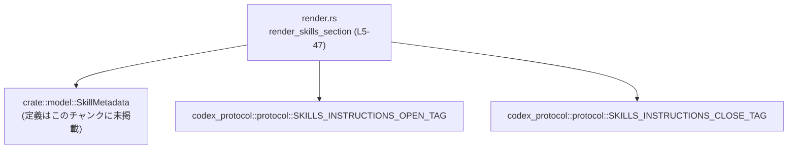
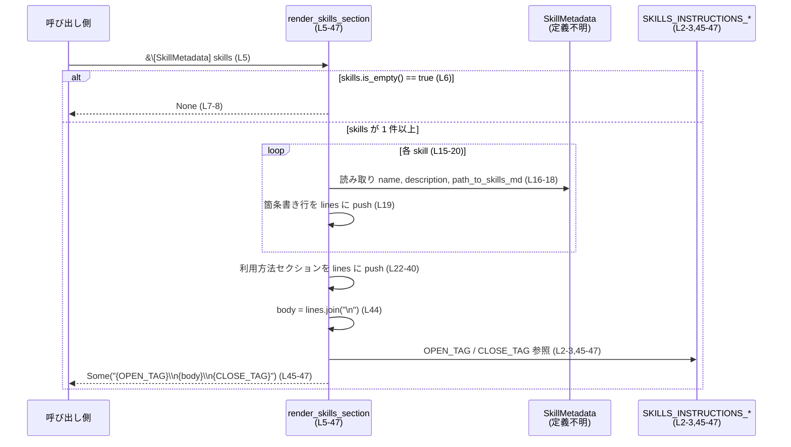

# core-skills/src/render.rs

## 0. ざっくり一言

`SkillMetadata` の一覧から、スキル説明と利用方法を含む Markdown セクションを生成し、プロトコル用の開始・終了タグで囲んだ文字列として返すレンダリング関数を定義しているファイルです（`render.rs:L1-3,5-47`）。

---

## 1. このモジュールの役割

### 1.1 概要

- このモジュールは、**スキル情報（名前・説明・SKILL.md へのパス）を人間向けの Markdown テキストに整形する**ために存在します（`render.rs:L5-24`）。
- 生成した Markdown 全体を、`codex_protocol` が定める **`SKILLS_INSTRUCTIONS_OPEN_TAG` / `SKILLS_INSTRUCTIONS_CLOSE_TAG`** で囲み、1 つの文字列として返します（`render.rs:L2-3,45-47`）。
- スキルが 1 つもない場合は何も出力せず `None` を返し、呼び出し側でセクションの有無を判定できるようにしています（`render.rs:L6-8`）。

### 1.2 アーキテクチャ内での位置づけ

このファイルは以下のコンポーネントに依存しています。

- `crate::model::SkillMetadata` 型（スキルのメタデータ。定義はこのチャンクには現れませんが、`name`/`description`/`path_to_skills_md` フィールドを持ちます）（`render.rs:L1,15-18`）。
- `codex_protocol::protocol` 内のタグ定数 `SKILLS_INSTRUCTIONS_OPEN_TAG` / `SKILLS_INSTRUCTIONS_CLOSE_TAG`（`render.rs:L2-3,45-47`）。

依存関係を簡略図で示します。



### 1.3 設計上のポイント

- **純粋関数**  
  - 引数スライス `&[SkillMetadata]` から `Option<String>` を生成するだけで、副作用（I/O・グローバル状態の変更）はありません（`render.rs:L5-47`）。
- **条件付き出力**  
  - スキルが空の場合は `None` を返し、空のセクション文字列は作らない設計です（`render.rs:L6-8`）。
- **Markdown ベースの人間向けフォーマット**  
  - `## Skills` や `### Available skills` など、Markdown の見出し・箇条書きを用いて読みやすく構成しています（`render.rs:L11-13,19,22-40`）。
- **パスの正規化**  
  - Windows などのバックスラッシュ区切りパスをすべてスラッシュ区切りに変換し、表示の一貫性を保っています（`render.rs:L16`）。
- **プロトコルタグでの囲い込み**  
  - 生成結果は常に `{SKILLS_INSTRUCTIONS_OPEN_TAG}\n...{SKILLS_INSTRUCTIONS_CLOSE_TAG}` という形式でラップされ、外部プロトコルから機械的に検出しやすい形になっています（`render.rs:L45-47`）。

---

## 2. 主要な機能一覧

### 2.1 コンポーネント一覧（このファイルに現れるもの）

| 名前 | 種別 | 役割 / 用途 | 定義 or 使用 | 位置（行範囲） |
|------|------|-------------|--------------|----------------|
| `render_skills_section` | 関数 | スキル一覧と利用ガイドの Markdown を生成し、プロトコルタグでラップして返す | 定義 | `render.rs:L5-47` |
| `SkillMetadata` | 構造体（と推測されるが、定義は不明） | スキルのメタデータ。`name`/`description`/`path_to_skills_md` フィールドが参照される | 使用 | `render.rs:L1,15-18` |
| `SKILLS_INSTRUCTIONS_OPEN_TAG` | 定数 | 出力文字列の先頭に付与するタグ | 使用 | `render.rs:L2,45-46` |
| `SKILLS_INSTRUCTIONS_CLOSE_TAG` | 定数 | 出力文字列の末尾に付与するタグ | 使用 | `render.rs:L3,45-47` |

※ `SkillMetadata` 自体の定義（フィールド型・派生トレイトなど）は、このチャンクには現れません。

### 2.2 機能一覧（人間向け）

- スキル一覧セクション生成: `SkillMetadata` の配列から、「Available skills」リストを含む Markdown テキストを生成する（`render.rs:L10-20`）。
- スキル利用ガイド埋め込み: スキルの発見・トリガールール・利用手順などの説明文を埋め込む（`render.rs:L22-40`）。
- プロトコルタグでのラップ: 外部プロトコル用の開始・終了タグで全体を囲んだ文字列を返す（`render.rs:L45-47`）。
- 空入力の無視: スキルが空ならセクション自体を生成しない（`render.rs:L6-8`）。

---

## 3. 公開 API と詳細解説

### 3.1 型一覧（このファイル内で新規定義される公開型）

- このファイル内で **新たに定義されている公開型はありません**。  
  利用している `SkillMetadata` は他ファイルで定義されており、このチャンクにはその定義が現れません（`render.rs:L1`）。

### 3.2 関数詳細

#### `render_skills_section(skills: &[SkillMetadata]) -> Option<String>`

**概要**

- 渡されたスキル配列から、スキル一覧と利用方法を説明する Markdown 文書を組み立て、プロトコル用タグで囲んだ文字列を返します（`render.rs:L5-47`）。
- スキル配列が空の場合は `None` を返し、出力を抑制します（`render.rs:L6-8`）。

**引数**

| 引数名 | 型 | 説明 |
|--------|----|------|
| `skills` | `&[SkillMetadata]` | 表示対象のスキルメタデータ配列。各要素から名前・説明・`SKILL.md` のパスが参照されます（`render.rs:L5,15-19`）。 |

> `SkillMetadata` の具体的な型定義（所有権・ライフタイムなど）はこのチャンクには現れませんが、`name`/`description`/`path_to_skills_md` フィールドを持ち、それぞれに `as_str` / `to_string_lossy` メソッドが生えていることが分かります（`render.rs:L16-18`）。

**戻り値**

- 戻り値の型: `Option<String>`（`render.rs:L5`）
  - `Some(String)`:
    - 少なくとも 1 件のスキルが存在する場合に返される、Markdown + プロトコルタグ付きの文字列です（`render.rs:L10-47`）。
  - `None`:
    - `skills` が空スライスのときに返されます（`render.rs:L6-8`）。

**内部処理の流れ（アルゴリズム）**

1. **空チェック**  
   - `if skills.is_empty() { return None; }` により、スキルが 1 件もなければ即座に `None` を返します（`render.rs:L6-8`）。
2. **行バッファの初期化**  
   - `let mut lines: Vec<String> = Vec::new();` として文字列のベクタを用意します（`render.rs:L10`）。
   - セクションタイトルと説明文、サブセクションタイトルを追加します（`render.rs:L11-13`）。
3. **スキル一覧の構築**  
   - `for skill in skills { ... }` で各スキルを走査し（`render.rs:L15-20`）:
     - `path_to_skills_md.to_string_lossy().replace('\\', "/")` によりパスを UTF-8 文字列（欠損は代替文字）にし、バックスラッシュをスラッシュに置換します（`render.rs:L16`）。
     - `name` と `description` を文字列スライスとして取り出します（`render.rs:L17-18`）。
     - `- {name}: {description} (file: {path_str})` 形式の Markdown 箇条書き行を `lines` に追加します（`render.rs:L19`）。
4. **利用方法セクションの追加**  
   - `"### How to use skills"` という見出しを追加した後（`render.rs:L22`）、
   - スキルの発見・トリガールール・利用手順・コンテキスト管理・フォールバック方針を詳細に説明する複数行の生文字列（raw string）を `lines` に追加します（`render.rs:L23-40`）。
5. **最終文字列の組み立て**  
   - `let body = lines.join("\n");` で行ベクタを改行で連結し、1 つの Markdown 文字列にします（`render.rs:L44`）。
   - `Some(format!("{SKILLS_INSTRUCTIONS_OPEN_TAG}\n{body}\n{SKILLS_INSTRUCTIONS_CLOSE_TAG}"))` で、プロトコル開始タグ → 改行 → 本文 → 改行 → 終了タグという形式にまとめて返します（`render.rs:L45-47`）。

**処理フロー図**

```mermaid
flowchart TD
    A["開始<br/>render_skills_section (L5)"]
    B{"skills.is_empty()? (L6)"}
    C["None を返す (L7-8)"]
    D["lines を初期化し見出し3行を push (L10-13)"]
    E["for skill in skills で箇条書き生成 (L15-20)"]
    F["利用方法セクションを push (L22-40)"]
    G["lines.join(\"\\n\") で body 作成 (L44)"]
    H["タグでラップして Some(...) を返す (L45-47)"]

    A --> B
    B -- yes --> C
    B -- no --> D --> E --> F --> G --> H
```

**Examples（使用例）**

以下は、呼び出し側でスキル一覧を Markdown として出力する例です。`SkillMetadata` の具体的なコンストラクタはこのチャンクにはないため、擬似的に表現しています。

```rust
use core_skills::render::render_skills_section;
use core_skills::model::SkillMetadata; // 実際のパスはこのチャンクには現れません

fn main() {
    // 仮の SkillMetadata インスタンスを用意する
    let skills: Vec<SkillMetadata> = vec![
        SkillMetadata {
            // name, description, path_to_skills_md などのフィールド初期化
            // このチャンクには定義がないため擬似コード
        },
        // 他のスキル...
    ];

    if let Some(markdown) = render_skills_section(&skills) {
        // プロトコルタグ付きの Markdown をコンソールに出力する
        println!("{markdown}");
    } else {
        // スキルがない場合
        println!("No skills available for this session.");
    }
}
```

※ `SkillMetadata` のインスタンス生成方法は、このファイルには定義がないため「不明」です。

**Errors / Panics**

- この関数内には明示的な `panic!` 呼び出しや `unwrap` などはありません（`render.rs:L5-47`）。
- 実行時エラーが発生しうる箇所:
  - `to_string_lossy()` と `replace` は標準的な文字列処理であり、通常はパニックしません（`render.rs:L16`）。
  - `format!` も、ここで使用しているプレースホルダ構成ではコンパイル時に整合性が検査されるため、実行時パニックの可能性は低いです（`render.rs:L19,45-47`）。
- したがって、**通常の使用においては `Err` を返さず、パニックもしない設計**といえます。

**Edge cases（エッジケース）**

- `skills` が空スライス  
  - 即座に `None` を返し、一切出力を生成しません（`render.rs:L6-8`）。
- `path_to_skills_md` に非 UTF-8 文字が含まれる場合  
  - `to_string_lossy()` の仕様により、無効なバイト列は置換文字に変換されます。エラーにはならず、表示上のみ代替文字が混入します（`render.rs:L16`）。
  - 具体的な置換方法は `to_string_lossy` の実装に依存し、このチャンクには現れません。
- Windows 形式のパス（バックスラッシュ区切り）  
  - `replace('\\', "/")` によりスラッシュに統一され、Markdown 上でパスが一貫した形式で表示されます（`render.rs:L16`）。
- `name` / `description` に改行や Markdown メタ文字が含まれる場合  
  - そのまま挿入されており、追加のエスケープ処理は行っていません（`render.rs:L17-19`）。
  - そのため、意図しない Markdown のレイアウトになる可能性がありますが、このファイルでは特別な対策は取られていません。

**使用上の注意点**

- **前提条件**
  - `skills` スライスの要素は有効な `SkillMetadata` である必要があります（`render.rs:L5,15-19`）。
  - `path_to_skills_md` は存在するファイルパスであることが望ましいですが、この関数は存在チェックを行いません（`render.rs:L16`）。
- **フォーマットに関する注意**
  - `name` と `description` にユーザー入力などをそのまま入れると、Markdown として予期せぬ表示になる可能性があります（`render.rs:L17-19`）。
  - パスや説明文を Markdown として安全に表示したい場合は、呼び出し側でエスケープ処理を行うのが安全です。
- **セキュリティ上の観点**
  - 出力にローカルファイルパス（`path_to_skills_md`）が含まれるため、環境によっては内部パス情報を露出させることになります（`render.rs:L16,19`）。
  - 外部にそのまま提示する場面では、パスをマスクするなどの対応を検討する余地がありますが、そのような処理はこの関数では行っていません。
- **並行性**
  - 関数内部で共有ミュータブル状態に触れておらず、引数も参照のみであるため、**複数スレッドから同時に呼び出しても関数自身はスレッド安全**です（`render.rs:L5-47`）。
  - ただし、`SkillMetadata` の実装がスレッド安全であるかどうかは、このチャンクには現れません。

### 3.3 その他の関数

- このファイルには `render_skills_section` 以外の関数はありません（`render.rs:L5-47`）。

---

## 4. データフロー

この関数の典型的なデータフローは、以下のようになります。

1. 呼び出し側が `SkillMetadata` のスライス（参照）を作成し、`render_skills_section` に渡す（`render.rs:L5`）。
2. 関数内で `SkillMetadata` から `name` / `description` / `path_to_skills_md` を読み取り、行バッファ `lines` に Markdown の行として順次追加する（`render.rs:L15-20`）。
3. スキルの利用方法に関する固定の説明テキストを行バッファの末尾に追加する（`render.rs:L22-40`）。
4. `lines` を改行で連結した `body` を作り、プロトコルタグで囲った文字列を返す（`render.rs:L44-47`）。

これをシーケンス図で表します。



---

## 5. 使い方（How to Use）

### 5.1 基本的な使用方法

呼び出し側は、セッションで利用可能なスキル一覧をもとに、この関数を呼び出して Markdown セクションを生成します。

```rust
use core_skills::render::render_skills_section;
use core_skills::model::SkillMetadata; // 実際のパスはこのチャンクには現れません

fn render_for_session(skills: Vec<SkillMetadata>) -> String {
    match render_skills_section(&skills) {
        Some(section) => section,                    // 生成されたセクションをそのまま使う
        None => String::from(""),                    // スキルがない場合は空文字列などを返す
    }
}
```

- ここで返される `section` は、すでに `SKILLS_INSTRUCTIONS_OPEN_TAG` / `SKILLS_INSTRUCTIONS_CLOSE_TAG` でラップされた完全なブロックです（`render.rs:L45-47`）。

### 5.2 よくある使用パターン

1. **テンプレートへの挿入**

   既存のシステムメッセージやプロンプトテンプレートの一部として埋め込む場合:

   ```rust
   let base_prompt = "You are an AI assistant..."; // 既存の説明文

   let skills_section = render_skills_section(&skills).unwrap_or_default();
   let full_prompt = format!("{base_prompt}\n\n{skills_section}");
   ```

   - スキルがない場合でも `.unwrap_or_default()` により空文字となり、テンプレートが壊れません（`render.rs:L6-8`）。

2. **条件付きで出力するログ・ドキュメントの生成**

   スキル情報を人間向けドキュメントとして出力したい場合にも再利用できます。

### 5.3 よくある間違い

```rust
// 間違い例: None を想定せずに unwrap してしまう
let section = render_skills_section(&skills).unwrap(); // skills が空だとパニックする

// 正しい例: None の可能性を考慮する
let section = match render_skills_section(&skills) {
    Some(s) => s,
    None => String::from("No skills available."), // フォールバック文を用意
};
```

- `render_skills_section` は `Option<String>` を返すため、**空スキル時の `None` ケースを必ず扱う必要**があります（`render.rs:L6-8`）。

### 5.4 使用上の注意点（まとめ）

- `SkillMetadata` の中身（特に `name` / `description` / `path_to_skills_md`）がそのまま外部に露出されるため、機密情報を含めないようにする必要があります（`render.rs:L16-19`）。
- Markdown のエスケープは行われないため、必要であれば呼び出し側でエスケープしてから `SkillMetadata` を組み立てると安全です（`render.rs:L17-19`）。
- 関数は計算量的には O(N)（N = スキル数）であり、スキル数が非常に多い場合には出力文字列が大きくなる点に注意します（`render.rs:L15-20,44`）。

---

## 6. 変更の仕方（How to Modify）

### 6.1 新しい機能を追加する場合

- **スキルリストのフォーマットを変更したい場合**
  1. 箇条書きの書式を変更: `format!("- {name}: {description} (file: {path_str})")` を編集します（`render.rs:L19`）。
  2. 例えば、ファイルパスを別行に出したい場合は、改行を含むフォーマット文字列に変更します。

- **追加情報（例: タグ・カテゴリ）を表示したい場合**
  1. `SkillMetadata` に新しいフィールドがあることを確認（定義ファイルはこのチャンクには現れません）。
  2. `for skill in skills { ... }` ブロック内でそのフィールドを読み取り、`format!` に組み込みます（`render.rs:L15-20`）。

- **プロトコルタグに新しいメタデータを含めたい場合**
  - 現状は単にタグと本文を連結していますが、フォーマット文字列を拡張してタグの直後や前後にメタ情報を埋め込む余地があります（`render.rs:L45-47`）。

### 6.2 既存の機能を変更する場合の注意点

- **空スキル時の挙動変更**
  - `is_empty` チェックを削除して常に `Some` を返すようにすると、呼び出し側の前提が変わるため、全呼び出し箇所で `Option` 取り扱いを見直す必要があります（`render.rs:L6-8`）。
- **パス表現の変更**
  - `replace('\\', "/")` を変更または削除すると、Windows 等でパス表記が変わり、既存クライアントの解析ロジックに影響する可能性があります（`render.rs:L16`）。
- **利用方法テキストの変更**
  - 生文字列リテラル（`r###"..."###`）内の内容を変更する際は、引用符数（`###`）と閉じタグを崩さないように注意が必要です（`render.rs:L23-40`）。
- **テスト**
  - このチャンクにはテストコードが含まれていないため、挙動を変える場合は別ファイルのテスト（存在するかどうかはこのチャンクには現れません）を追加・更新することが望ましいです。

---

## 7. 関連ファイル

このファイルと密接に関係するコンポーネントは次のとおりです。いずれもこのチャンクには定義が現れません。

| パス / シンボル | 役割 / 関係 |
|----------------|------------|
| `crate::model::SkillMetadata` | スキルのメタデータ（名前・説明・パスなど）を保持する型。`render_skills_section` は、この型のスライスから Markdown を生成します（`render.rs:L1,15-19`）。 |
| `codex_protocol::protocol::SKILLS_INSTRUCTIONS_OPEN_TAG` | 生成した Markdown セクションの前に付与するプロトコルタグ（`render.rs:L2,45-46`）。 |
| `codex_protocol::protocol::SKILLS_INSTRUCTIONS_CLOSE_TAG` | 生成した Markdown セクションの後ろに付与するプロトコルタグ（`render.rs:L3,45-47`）。 |

これらの定義内容（具体的な文字列値や構造体の詳細）は、このチャンクには現れていないため「不明」です。
