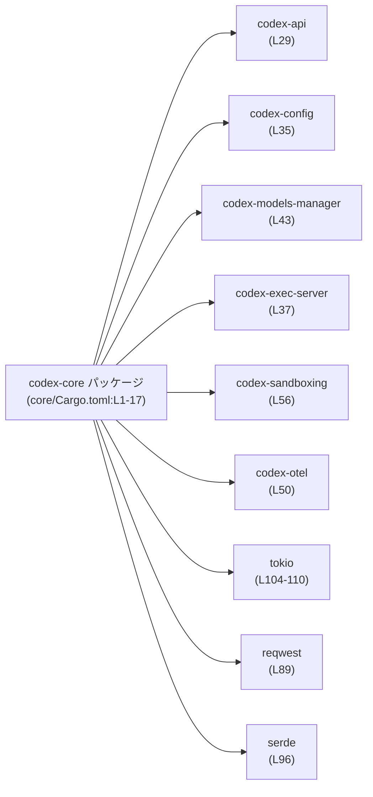
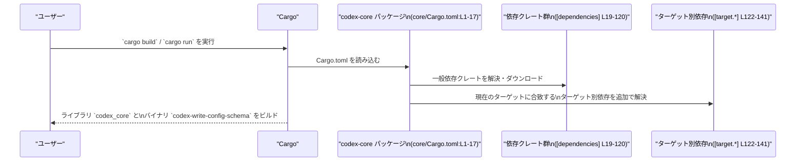

# core/Cargo.toml コード解説

## 0. ざっくり一言

`core/Cargo.toml` は、`codex-core` クレートの **マニフェストファイル** であり、ライブラリ／バイナリターゲット、依存クレート、ターゲットごとの依存、開発用依存、およびツール向けメタデータを定義しています  
（`[package]`〜`[dev-dependencies]` まで全体にわたる構成。`core/Cargo.toml:L1-171`）。

---

## 1. このモジュールの役割

### 1.1 概要

- このファイルは、`codex-core` クレートの **ビルド設定と依存関係** を定義します  
  （`[package]` と `[lib]` 定義。`core/Cargo.toml:L1-10`）。
- ライブラリターゲット `codex_core` とバイナリターゲット `codex-write-config-schema` を公開します  
  （`[lib]` と `[[bin]]`。`core/Cargo.toml:L7-14`）。
- ほぼすべての依存をワークスペース管理（`workspace = true`）として宣言し、バージョンや設定をワークスペースルート側に集約しています  
  （`[dependencies]`, `[dev-dependencies]` の全般。`core/Cargo.toml:L19-120, L143-168`）。
- OS やターゲット（macOS / Windows / Unix / musl）ごとに異なる依存を追加することで、多環境対応のビルド構成になっています  
  （`[target.*.dependencies]` 群。`core/Cargo.toml:L122-141`）。

### 1.2 アーキテクチャ内での位置づけ

`codex-core` クレートは、同一ワークスペース内の多くの `codex-*` サブクレートおよび外部クレートの上に構築される中心的なコンポーネントとして設定されています  
（`[dependencies]` に多数の `codex-*` と一般クレートが列挙されています。`core/Cargo.toml:L28-71, L79-120`）。



この図は、`codex-core` が代表的なドメインクレート（`codex-*` 群）と、非同期／ネットワーク／シリアライズ関連の外部クレートを依存として利用可能な構成であることを示します。  
実際にどの API をどう呼び出しているかは、ソースコード（`src/lib.rs` など）側を見ないと分かりません。

### 1.3 設計上のポイント

コードではなくマニフェストですが、このファイルから読み取れる設計上の特徴をまとめます。

- **ワークスペース集中管理**  
  - edition・license・version のみならず、多くの依存クレートが `workspace = true` で指定されています  
    （`[package]` の `edition.workspace`, `license.workspace`, `version.workspace` と `[dependencies]` 全般。`core/Cargo.toml:L2-5, L19-120`）。
  - これにより、依存バージョンの更新をワークスペースルートから一括管理できる構造になっています。

- **マルチターゲット対応**  
  - macOS: `core-foundation` 依存を追加  
    （`target.'cfg(target_os = "macos")'.dependencies`。`core/Cargo.toml:L122-123`）。
  - Windows: `windows-sys` に複数の Win32 機能フラグを付与  
    （`target.'cfg(target_os = "windows")'.dependencies`。`core/Cargo.toml:L133-138`）。
  - Unix: `codex-shell-escalation` を追加  
    （`target.'cfg(unix)'.dependencies`。`core/Cargo.toml:L140-141`）。
  - musl（x86_64 / aarch64）: `openssl-sys` を `vendored` フラグ付きで追加し、OpenSSL をソースからビルドするコメントが添えられています  
    （`core/Cargo.toml:L125-131`）。

- **非同期・並行処理のための依存が用意されている**  
  - `tokio`, `async-trait`, `async-channel`, `futures` などが依存に含まれており  
    （`core/Cargo.toml:L22-23, L79, L104-110`）、非同期処理や並行性に関連する機能を利用可能な構成になっています。  
  - 実際にどのような並行処理モデルが採用されているかは、このファイルからは分かりません。

- **ネットワーク・シリアライズ・ストレージ関連の依存**  
  - `reqwest`, `tokio-tungstenite`, `http`, `serde`, `serde_json`, `uuid`, `zip`, `image` など、多数の一般クレートが依存として列挙されています  
    （`core/Cargo.toml:L80-89, L96-120`）。
  - これらのクレートの API を利用できる前提で `codex-core` が設計されていると考えられますが、具体的な利用方法はこのファイルからは分かりません。

- **テスト・観測性への配慮**  
  - 開発用依存として `assert_cmd`, `wiremock`, `insta`, `tracing-test`, `opentelemetry`, `opentelemetry_sdk`, `tracing-opentelemetry`, `tracing-subscriber` などが追加されています  
    （`core/Cargo.toml:L143-168`）。
  - これにより、コマンドラインテスト、HTTP モック、スナップショットテスト、およびトレーシング・メトリクス連携を行うための基盤があることが分かります。  

---

## 2. コンポーネント一覧（インベントリー）

このセクションでは、この Cargo.toml から分かる「ビルドターゲット」「依存クレート」「ターゲット別依存」「開発用依存」をコンポーネントとして整理します。

### 2.1 ビルドターゲット一覧

| ターゲット名 | 種別 | 役割（このファイルから分かる範囲） | 根拠 |
|--------------|------|--------------------------------------|------|
| `codex_core` | ライブラリ | `codex-core` パッケージのライブラリターゲット。クレート名は `codex_core`。 | `core/Cargo.toml:L7-10` |
| `codex-write-config-schema` | バイナリ | `codex-core` パッケージのバイナリターゲット。名前から設定スキーマ関連ツールであることが想定されますが、このファイルから実際の動作は分かりません。 | `core/Cargo.toml:L12-14` |

### 2.2 主要依存クレート群（ランタイム）

細かく見ると多数存在しますが、ここではグループごとに整理します。

#### Codex ワークスペース内クレート群

すべて `workspace = true` で指定されており、同一ワークスペース内のサブクレートであることが分かります  
（`core/Cargo.toml:L28-71, L69, L73, L141, L147, L149` など）。

| グループ | 含まれるクレート（抜粋） | 説明（このファイルから分かる範囲） | 根拠 |
|----------|--------------------------|--------------------------------------|------|
| Codex コア機能 | `codex-core-skills`, `codex-state`, `codex-features`, `codex-tools` など | コア機能や状態管理、ツール群に関するサブクレート群と考えられますが、このファイルから具体的な API や責務は分かりません。 | `core/Cargo.toml:L36, L38, L57, L59` |
| 接続・外部サービス | `codex-connectors`, `codex-network-proxy`, `codex-models-manager`, `codex-model-provider-info` など | 外部システム／モデルとのやり取りに関係しそうなクレート群ですが、詳細な挙動はこのファイルからは読み取れません。 | `core/Cargo.toml:L34, L49, L42-43` |
| 実行・サンドボックス | `codex-exec-server`, `codex-execpolicy`, `codex-sandboxing`, `codex-windows-sandbox`, `codex-shell-command` など | コマンド実行やポリシー、サンドボックス実行に関するサブクレート群であることが名称から想定されますが、具体的な制御内容は不明です。 | `core/Cargo.toml:L37, L45, L56, L73, L44` |
| 設定・指示 | `codex-config`, `codex-instructions`, `codex-login`, `codex-rollout` など | 設定管理や指示（instructions）、ログイン、ロールアウト関連のクレートであると推測されますが、このファイルからは API は分かりません。 | `core/Cargo.toml:L35, L48, L40, L54` |
| 解析・フィードバック・プロトコル | `codex-analytics`, `codex-feedback`, `codex-protocol`, `codex-app-server-protocol`, `codex-response-debug-context` など | 分析、フィードバック、各種プロトコルとレスポンスのデバッグ情報に関するクレート群と考えられますが、詳細は不明です。 | `core/Cargo.toml:L28-30, L39, L52-53` |
| 拡張・プラグイン | `codex-plugin`, `codex-utils-plugins` | プラグインフレームワークやプラグイン管理のためのクレートと想定されますが、このファイルからは利用方法は分かりません。 | `core/Cargo.toml:L51, L66` |
| MCP / RMCP 関連 | `codex-mcp`, `codex-rmcp-client`, `rmcp` | MCP / RMCP に関連するクレート。`rmcp` には `server` や `schemars` などの feature が付与されています。 | `core/Cargo.toml:L41, L55, L90-95` |
| 観測・テレメトリ | `codex-otel`, `codex-analytics`, 開発用の `opentelemetry`, `opentelemetry_sdk`, `tracing-opentelemetry` など | OpenTelemetry や解析に関連するクレート。観測性を重視した構成であることが分かります（具体的なトレースポイントはコード側で確認が必要です）。 | `core/Cargo.toml:L28, L50, L153-154, L157-160, L163` |

> 上記の「〜と考えられます／想定されます」という部分はクレート名からの一般的な解釈であり、実際の責務・API は各クレートのコードを確認しないと断定できません。

#### 一般的な外部クレート（ランタイム）

| コンポーネント | 概要（一般的な役割） | このファイルから分かること | 根拠 |
|----------------|----------------------|-----------------------------|------|
| `tokio` | Rust の非同期ランタイム | マルチスレッドランタイム (`rt-multi-thread`) やプロセス、シグナル等の機能を feature で有効化しています。 | `core/Cargo.toml:L104-110` |
| `futures` | 非同期処理ユーティリティ群 | 非同期処理を記述するための標準的なツール群を利用できる構成です。 | `core/Cargo.toml:L79` |
| `async-trait`, `async-channel`, `arc-swap` | 非同期トレイト・チャネル・ロックフリー共有のためのクレート | 非同期トレイト実装やチャネル、共有状態管理用のクレートを依存に含めています。 | `core/Cargo.toml:L21-23` |
| `reqwest`, `http`, `tokio-tungstenite`, `eventsource-stream` | HTTP / WebSocket / SSE などのネットワーク関連クレート | HTTP クライアントや WebSocket、イベントストリームを扱える構成です。 | `core/Cargo.toml:L80, L89, L112, L78` |
| `serde`, `serde_json`, `toml`, `toml_edit`, `csv` | シリアライズ・各種フォーマット処理 | JSON / TOML / CSV などを扱えるよう依存が設定されています。`serde` には `derive` feature が有効です。 | `core/Cargo.toml:L26, L96-97, L113-114, L74` |
| `tracing` | 構造化ログ／トレーシング | `log` feature が有効で、トレーシング基盤を利用できる構成です。 | `core/Cargo.toml:L115` |
| `uuid` | UUID 生成・扱い | `serde`, `v4`, `v5` feature が有効で、シリアライズ可能な UUID を利用できる構成です。 | `core/Cargo.toml:L117` |
| `image`, `zip` | 画像処理・ZIP アーカイブ | `image` は JPEG/PNG/WebP feature を有効化しています。 | `core/Cargo.toml:L82, L120` |
| その他ユーティリティ | `rand`, `once_cell`, `indexmap`, `notify`, `which`, `whoami`, `tempfile` など | 乱数、遅延初期化、順序付きマップ、ファイル監視、外部コマンド探索、ユーザー情報取得、一時ファイル等に関連する一般的クレート群です。 | `core/Cargo.toml:L83-88, L85-87, L118-119, L101` |

### 2.3 ターゲット別依存クレート

| ターゲット条件 | 依存クレート | 設定内容・役割（このファイルから分かる範囲） | 根拠 |
|----------------|------------|-----------------------------------------------|------|
| `cfg(target_os = "macos")` | `core-foundation` | バージョン `0.9` を直接指定。macOS の Core Foundation API を扱うためのクレートが利用可能です。 | `core/Cargo.toml:L122-123` |
| `x86_64-unknown-linux-musl` | `openssl-sys` | `workspace = true` かつ `vendored` feature を有効化。「musl ビルドでは OpenSSL をソースからビルドする」旨のコメント付きです。 | `core/Cargo.toml:L125-127` |
| `aarch64-unknown-linux-musl` | `openssl-sys` | 上記と同様。aarch64 向け musl ターゲットでも OpenSSL をソースからビルドする設定です。 | `core/Cargo.toml:L129-131` |
| `cfg(target_os = "windows")` | `windows-sys` | バージョン `0.52`。`Win32_Foundation`, `Win32_System_Com`, `Win32_UI_Shell` feature を有効化。Win32 API を扱うコードが存在することが想定されます。 | `core/Cargo.toml:L133-138` |
| `cfg(unix)` | `codex-shell-escalation` | Unix 系 OS でのみ追加される Codex ワークスペース内クレートです。具体的な挙動はコード側を参照する必要があります。 | `core/Cargo.toml:L140-141` |

**注意（契約的な前提）**  
これらのターゲット別依存は、Cargo の仕様上「該当ターゲットでのみコンパイル時に利用可能」なため、コード中で `core-foundation` や `windows-sys` などを使う場合は、通常 `#[cfg(...)]` などの条件付きコンパイルと組み合わせて記述する必要があります。  
この点は Cargo の一般的な契約であり、このファイルからもターゲット別依存の存在として読み取れます。

### 2.4 開発用（テスト・ツール）依存クレート

| コンポーネント | 役割（一般的な用途） | このファイルから分かること | 根拠 |
|----------------|----------------------|-----------------------------|------|
| `assert_cmd` | CLI テストヘルパ | バイナリなどのコマンドをテストするためのユーティリティを利用可能な構成です。 | `core/Cargo.toml:L144` |
| `wiremock` | HTTP モックサーバ | HTTP クライアントコードのテストのためにモックサーバを使える構成です。 | `core/Cargo.toml:L167` |
| `insta` | スナップショットテスト | スナップショットベースのテストが書かれていることが想定されます。 | `core/Cargo.toml:L151` |
| `tracing-test`, `test-log` | ログ／トレースを検証するテスト | トレーシングやログ出力を検証するテストが書けるようになっています。 | `core/Cargo.toml:L102, L165` |
| `opentelemetry`, `opentelemetry_sdk`, `tracing-opentelemetry`, `tracing-subscriber` | テレメトリテスト・設定 | OpenTelemetry と `tracing` の連携をテスト・設定するためのクレート群が依存に含まれています。 | `core/Cargo.toml:L153-154, L157-160, L163-164` |
| `core_test_support` | ワークスペース内テスト支援クレート | Codex ワークスペース独自のテスト支援クレートと考えられます。 | `core/Cargo.toml:L149` |
| その他 | `assert_matches`, `maplit`, `predicates`, `pretty_assertions`, `serial_test`, `walkdir`, `zstd` など | マッチング、マップ構築、アサーション強化、並列テスト制御、ファイルツリー走査、圧縮などのユーティリティ群がテストで利用可能です。 | `core/Cargo.toml:L145-146, L152, L154-156, L161-162, L166, L168` |

---

## 3. 公開 API と詳細解説

このファイルは **Cargo マニフェスト** であり、関数・構造体・列挙体などの **コード上の API 定義は含まれていません**。  
公開 API は `src/lib.rs` や `src/bin/config_schema.rs` などのソース側に存在すると考えられますが、このチャンクには現れません。

### 3.1 型一覧（構造体・列挙体など）

- 該当なし  
  - このファイルには Rust の型定義は登場しません（TOML セクションとキーのみです）。

### 3.2 関数詳細（最大 7 件）

- 該当なし  
  - Cargo.toml には関数定義が存在しないため、関数レベルの詳細解説はできません。
  - 公開関数やメソッドの仕様は、`src/lib.rs` のコードを参照する必要があります（このチャンクには現れません）。

### 3.3 その他の関数

- 該当なし

---

## 4. データフロー

このファイルから直接読み取れる「処理の流れ」は、主に **ビルド時の依存解決フロー** です。  
ランタイムにおけるコード間のデータフローは、このファイルには現れません。

### 4.1 ビルド時の依存解決フロー

以下の sequence diagram は、ユーザーが `codex-core` をビルド／実行したときに、Cargo がこの `Cargo.toml` をどのように利用するかを表したものです。



- この図は「Cargo とこの `Cargo.toml` の関係」を示しており、具体的にどの関数がどの依存クレートを呼び出すかは、このファイルからは分かりません。
- `openssl-sys` の `vendored` feature など、一部の設定はビルド方法（例: musl 向けに OpenSSL を同梱ビルド）に影響します  
  （`core/Cargo.toml:L125-131`）。

---

## 5. 使い方（How to Use）

ここでは、「この Cargo.toml がある状態で `codex-core` をどのように利用・維持するか」という観点で説明します。

### 5.1 基本的な利用方法（他クレートからの依存）

別のクレートから `codex-core` を利用する一般的な例を示します。  
ワークスペースの外から利用する場合の概略です（実際のパスやバージョンはプロジェクト構成によります）。

```toml
# 他クレート側の Cargo.toml の例

[dependencies]
# crates.io 公開 or ローカルパスの場合
codex-core = { version = "x.y.z" }        # バージョンは `core/Cargo.toml:L4` に対応
# あるいはワークスペース内ローカル参照
# codex-core = { path = "../core" }
```

- このとき、ライブラリとしては `codex_core` というクレート名で `use codex_core::...` のように利用します  
  （`[lib] name = "codex_core"` による。`core/Cargo.toml:L7-10`）。
- どのモジュール／関数が公開されているかは `src/lib.rs` 側を確認する必要があります。

### 5.2 ビルドパターンの例

Cargo の標準的な使い方になりますが、この `Cargo.toml` が存在することにより以下のビルドが可能です。

1. **通常ビルド（ホスト OS向け）**

   ```bash
   # codex-core ライブラリとバイナリをホスト環境向けにビルド
   cargo build -p codex-core
   ```

   - ホスト OS が macOS なら `core-foundation` 依存も有効になります  
     （`core/Cargo.toml:L122-123`）。
   - Windows なら `windows-sys` 依存が有効になり、Win32 API 関連コードをビルド可能です  
     （`core/Cargo.toml:L133-138`）。
   - Unix 系なら `codex-shell-escalation` がリンクされます  
     （`core/Cargo.toml:L140-141`）。

2. **musl ターゲット向けビルド（静的リンク構成など）**

   ```bash
   # 例: x86_64-unknown-linux-musl 向けビルド
   cargo build -p codex-core --target x86_64-unknown-linux-musl
   ```

   - `target.x86_64-unknown-linux-musl.dependencies` により、`openssl-sys` が `vendored` feature 付きで追加されます  
     （`core/Cargo.toml:L125-127`）。
   - 同様に aarch64 向け musl ビルドでも `openssl-sys` が `vendored` で有効になります  
     （`core/Cargo.toml:L129-131`）。

3. **バイナリ `codex-write-config-schema` の実行**

   ```bash
   # codex-core パッケージのバイナリターゲットを実行
   cargo run -p codex-core --bin codex-write-config-schema -- <引数...>
   ```

   - このバイナリがどのような引数・出力形式を持つかは `src/bin/config_schema.rs` を参照する必要があります  
     （パスは `core/Cargo.toml:L13-14`）。

### 5.3 よくある間違い（一般的な Cargo.toml 編集時の注意）

このファイル固有のバグ事例は書かれていませんが、一般に以下のような点がミスの原因になりやすいです。

```toml
# 間違い例: ワークスペース管理を壊してしまう
[dependencies]
tokio = "1.36"           # ← workspace = true ではなく、ローカルで直接バージョン指定してしまう

# 正しい（このプロジェクト方針と整合する）例:
[dependencies]
tokio = { workspace = true }   # ルートの workspace でバージョンを一元管理
```

- このファイルでは、ほとんどの依存が `{ workspace = true }` で宣言されています  
  （`core/Cargo.toml:L19-120, L143-168`）。このスタイルを崩すと、ワークスペース全体でのバージョン統一が難しくなります。
- ターゲット別依存を追加する際には、`[target.'cfg(...)'.dependencies]` などのセクション名を正しく書く必要があります（引用符やドット区切りがずれると Cargo が認識できません）。

### 5.4 使用上の注意点（まとめ）

- **ターゲット別依存と `#[cfg]` の整合性**  
  - 例として `core-foundation` は macOS でのみ依存に含まれますが  
    （`core/Cargo.toml:L122-123`）、コード側でこのクレートを使う場合は `#[cfg(target_os = "macos")]` などと併用する必要があります。  
  - 同様に、`windows-sys` と `codex-shell-escalation` の使用箇所も、OS 条件でガードする前提が想定されます。

- **OpenSSL のビルド方法（セキュリティ／ビルド再現性）**  
  - musl ターゲットでは `openssl-sys` に `vendored` feature が付与されており、OpenSSL をソースからビルドする設定になっています  
    （`core/Cargo.toml:L125-131`）。  
  - これは静的リンクバイナリの配布やビルド再現性に影響するため、この設定を変更する場合は他の環境（CI・配布物）への影響を確認する必要があります。

- **観測性クレートの存在**  
  - `tracing`, `codex-otel`, `opentelemetry`, `opentelemetry_sdk`, `tracing-opentelemetry`, `tracing-subscriber` などが依存に含まれていることから  
    （`core/Cargo.toml:L50, L115, L153-154, L157-160, L163-164`）、トレースやメトリクスに関するコードが存在する可能性が高いですが、実際の計測ポイントはコード側を確認する必要があります。

- **cargo-shear メタデータ**  
  - `[package.metadata.cargo-shear] ignored = ["openssl-sys"]` と設定されており  
    （`core/Cargo.toml:L170-171`）、未使用依存チェックツール（cargo-shear）が `openssl-sys` を誤って「未使用」と判断しないように設定されています。  
  - `openssl-sys` はターゲット限定依存として使われるため、このような除外設定が必要になっていると考えられます。

---

## 6. 変更の仕方（How to Modify）

### 6.1 新しい機能を追加する場合（Cargo.toml 観点）

新しいコード機能自体は `src/` 以下に追加しますが、それに伴い依存やバイナリを追加する場合、このファイルでの作業は次のようになります。

1. **新しいランタイム依存を追加する**

   - 例: 新しい HTTP クライアント機能が必要になり、追加で別クレートを使う場合:

   ```toml
   [dependencies]
   # 既存の行…
   # 新規依存（ワークスペースで管理したい場合）
   my-http-lib = { workspace = true }
   ```

   - このプロジェクトはほぼすべての依存を `{ workspace = true }` で管理しているため  
     （`core/Cargo.toml:L19-120`）、同じ方針を踏襲するのが自然です。  
   - 実際にはワークスペースルートの `Cargo.toml` にも該当クレートの設定を追加する必要があります（このチャンクには現れません）。

2. **新しいバイナリターゲットを追加する**

   - 例: 追加ツール用バイナリ `codex-something-tool` を追加する場合:

   ```toml
   [[bin]]
   name = "codex-something-tool"
   path = "src/bin/something_tool.rs"
   ```

   - 既存の `[[bin]]` セクション（`codex-write-config-schema`）と同じ形式で追加します  
     （`core/Cargo.toml:L12-14` を参考）。

3. **ターゲット別依存を追加する**

   - 例: Windows のみで利用する新クレートを追加する場合:

   ```toml
   [target.'cfg(target_os = "windows")'.dependencies]
   windows-sys = { version = "0.52", features = [ "Win32_Foundation", "Win32_System_Com", "Win32_UI_Shell" ] }
   my-windows-only-lib = { workspace = true }
   ```

   - 既存のセクション名・書式（`core/Cargo.toml:L133-138`）を真似ることで、Cargo が正しく解釈できるようにします。

### 6.2 既存の機能を変更する場合（影響範囲と契約）

- **依存バージョンの変更**

  - 多くの依存は `workspace = true` なので、バージョン変更はワークスペースルートで行う必要があります  
    （`core/Cargo.toml:L19-120, L143-168`）。
  - codex-core 単独ではなく、ワークスペース内の他クレートにも影響する可能性があり、影響範囲の見極めが重要です。

- **ターゲット別依存の変更**

  - `openssl-sys` の feature を変える／削除するなどの変更は、musl 向けビルド（CI など）でのリンクエラーやセキュリティポリシー（静的リンクの有無）に影響します  
    （`core/Cargo.toml:L125-131`）。
  - `core-foundation`, `windows-sys`, `codex-shell-escalation` など OS 固有クレートを削除・変更する場合、対応する `#[cfg]` 付きコードがコンパイルできなくなる可能性があります。

- **テスト関連依存の変更**

  - `assert_cmd`, `wiremock`, `insta` などの削除・変更は、テストコードのビルドや実行に直接影響します  
    （`core/Cargo.toml:L143-168`）。  
  - テストコード側の `use` 文やマクロ使用箇所を検索し、影響範囲を確認することが推奨されます（コードはこのチャンクにはありません）。

---

## 7. 関連ファイル

この Cargo.toml から直接参照されているファイル・ディレクトリ、および密接に関連しそうなものを整理します。

| パス | 役割 / 関係 | 根拠 |
|------|-------------|------|
| `core/src/lib.rs` | ライブラリターゲット `codex_core` のクレートルート。公開 API やコアロジックが定義されていると考えられます。 | `[lib] path = "src/lib.rs"`（`core/Cargo.toml:L7-10`） |
| `core/src/bin/config_schema.rs` | バイナリターゲット `codex-write-config-schema` のエントリポイント。設定スキーマ関連の処理がここに実装されていると考えられます。 | `[[bin]]` の `path = "src/bin/config_schema.rs"`（`core/Cargo.toml:L12-14`） |
| `../windows-sandbox-rs` | `codex-windows-sandbox` クレートのパス。Windows 版サンドボックス関連の実装が含まれると考えられます。 | `codex-windows-sandbox = { path = "../windows-sandbox-rs" }`（`core/Cargo.toml:L73`） |
| ワークスペースルートの `Cargo.toml` | `workspace = true` で参照される edition, license, version, 各種依存の実体を定義するファイル。 | `edition.workspace = true`, `license.workspace = true`, `version.workspace = true`, および多数の `{ workspace = true }`（`core/Cargo.toml:L2-5, L19-120, L143-168`） |
| `core_test_support` クレート | 開発用依存として参照されるワークスペース内テスト支援クレート。パスはワークスペースルート側で定義。 | `[dev-dependencies] core_test_support = { workspace = true }`（`core/Cargo.toml:L149`） |
| 各 `codex-*` クレートの Cargo.toml | `codex-analytics`, `codex-api`, `codex-config` などの依存の詳細を定義するマニフェスト。codex-core と密に連携していると考えられます。 | `[dependencies]` に多数の `codex-*` が列挙（`core/Cargo.toml:L28-71`） |
| `package.metadata.cargo-shear` 設定 | 依存解析ツール cargo-shear 用の設定。`openssl-sys` を無視する指定が含まれます。 | `[package.metadata.cargo-shear] ignored = ["openssl-sys"]`（`core/Cargo.toml:L170-171`） |

---

### 付記：Bugs / Security / Edge Cases 観点（このファイルから分かる範囲）

- このファイル自体にはロジックバグは存在しませんが、**設定ミス** がビルド失敗やセキュリティ設定の変化につながる可能性があります。
  - 例: `vendored` feature の削除により musl ターゲットで OpenSSL が見つからずビルドエラーになる、など（`core/Cargo.toml:L125-131`）。
- `codex-sandboxing`, `codex-windows-sandbox`, `codex-shell-escalation` のようなクレートは、権限昇格やサンドボックス実行に関わる可能性があり、セキュリティ上重要ですが、**具体的な安全性・エラー処理・並行性の実装はこのファイルからは分かりません**。
- ターゲット別依存の存在は、「特定 OS でのみ利用可能な API がある」という契約をコード側に課します。`#[cfg]` のつけ忘れはコンパイルエラーの原因になりやすい一般的なエッジケースです。

このレポートは Cargo.toml だけを根拠としているため、コードの振る舞いについては必要に応じて `src/` 以下の実装を確認する必要があります。
