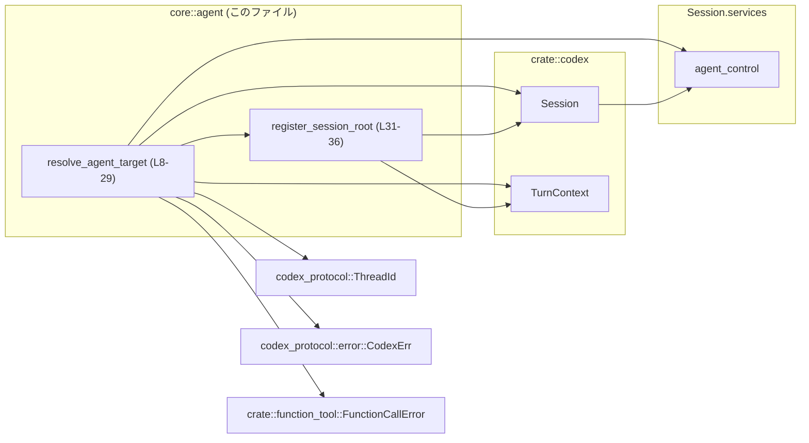
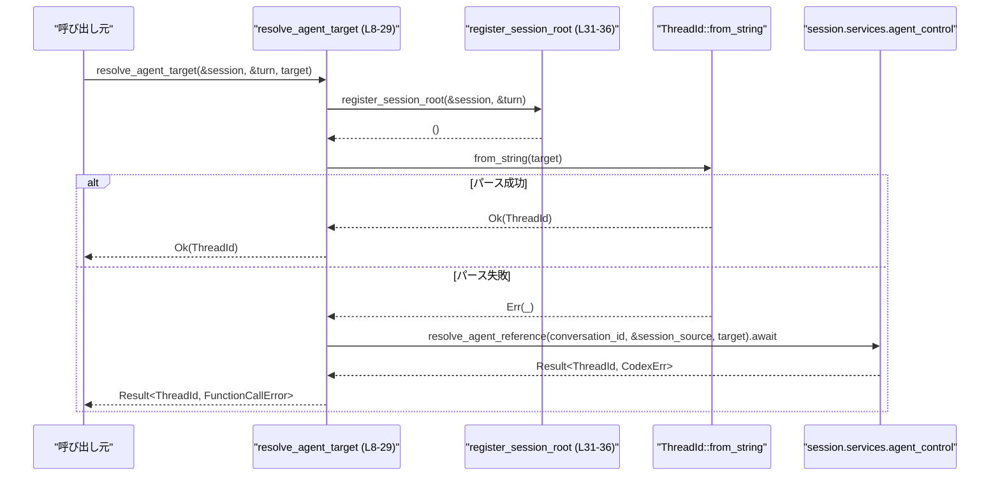
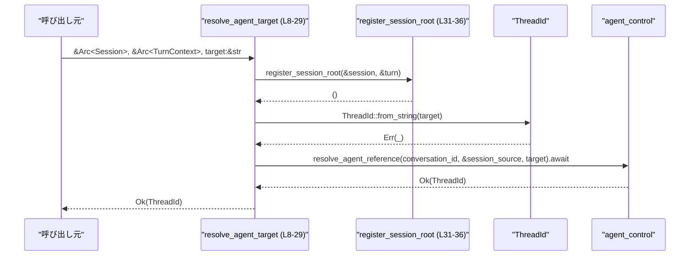

# core\src\agent\agent_resolver.rs コード解説

## 0. ざっくり一言

`Session` と `TurnContext` を使って、ツール側から指定されたエージェントターゲット文字列を、実際に使用する `ThreadId` に解決する非同期ヘルパー関数を提供するモジュールです。[core\src\agent\agent_resolver.rs:L7-29]

---

## 1. このモジュールの役割

### 1.1 概要

- このモジュールは、**「エージェントを指す文字列」** から **`ThreadId`** を求めるための解決ロジックを提供します。[L7-29]
- まず文字列をそのまま `ThreadId` として解釈しようとし、失敗した場合は `Session` が持つ `agent_control` サービスに委譲して、エージェント参照を解決します。[L14-16, L18-22]
- すべてのエラーは `FunctionCallError::RespondToModel` にマッピングされ、上位の「関数ツール呼び出し」エラーとして扱われます。[L23-28]

### 1.2 アーキテクチャ内での位置づけ

このモジュール内で見える依存関係を図示します（対象範囲: `core\src\agent\agent_resolver.rs:L1-36`）。



- `resolve_agent_target` は、`Session` と `TurnContext` に依存し、内部で `agent_control` サービスに処理を委譲します。[L8-13, L18-22]
- `ThreadId::from_string` によるローカルな変換と、`agent_control.resolve_agent_reference` による外部解決の二段構えになっています。[L14-16, L18-22]
- エラーは `CodexErr` から `FunctionCallError::RespondToModel` に変換されます。[L23-28]
- `register_session_root` は、エージェント制御側に「セッションのルート」を登録するための内部ヘルパーです。[L31-35]

### 1.3 設計上のポイント

- **二段階解決**  
  1. `ThreadId::from_string(target)` による直接パース。[L14-16]  
  2. 失敗時は `agent_control.resolve_agent_reference(...)` にフォールバック。[L18-22]
- **セッションルート登録の前処理**  
  毎回 `resolve_agent_target` の先頭で `register_session_root` を呼び出し、`agent_control` に対してセッションのルートを通知しています。[L13, L31-35]
- **非同期処理**  
  エージェント参照の解決は `async` 関数として実装されており、`.await` で非同期結果を待つ形です。[L8, L22]
- **エラーラッピング方針**  
  - `CodexErr::UnsupportedOperation(message)` はメッセージをそのまま `FunctionCallError::RespondToModel(message)` に変換。[L23-26]
  - それ以外の `CodexErr` は `to_string()` で文字列化して `FunctionCallError::RespondToModel` に包みます。[L27-28]
- **共有所有権 (`Arc`) の利用**  
  `Session` と `TurnContext` は `Arc` 経由で共有され、関数は `&Arc<T>` を取ることで参照カウントを増やさずに参照しています。[L8-12, L31]

---

## 2. 主要な機能・コンポーネント一覧

### 2.1 関数インベントリー

| 名前 | 種別 | 公開範囲 | 概要 | 定義位置 |
|------|------|----------|------|----------|
| `resolve_agent_target` | 関数（`async`） | `pub(crate)` | エージェントターゲット文字列を `ThreadId` に解決するメイン関数 | `core\src\agent\agent_resolver.rs:L8-29` |
| `register_session_root` | 関数 | `private` | `agent_control` にセッションルートを登録する内部ヘルパー | `core\src\agent\agent_resolver.rs:L31-36` |

### 2.2 機能一覧（役割ベース）

- エージェントターゲット文字列からの `ThreadId` への変換（直接パース + サービスによる解決）。[L14-16, L18-22]
- セッションルートの事前登録（エージェント制御サービスへの通知）。[L13, L31-35]
- `CodexErr` を `FunctionCallError::RespondToModel` に変換するエラーラッピング。[L23-28]

---

## 3. 公開 API と詳細解説

### 3.1 型一覧（このモジュール内で利用される主な型）

このファイル内で新たな型定義は行われていませんが、API理解に重要な外部型を整理します。

| 名前 | 種別 | 役割 / 用途 | このファイルでの利用箇所 |
|------|------|-------------|--------------------------|
| `Session` | 構造体（推定） | 会話セッション全体の状態とサービス群 (`services.agent_control` を含む) を保持するコンテキスト | 関数引数・フィールドアクセス [L1, L8-9, L18-21, L31-35] |
| `TurnContext` | 構造体（推定） | 現在の「ターン」（ユーザ入力〜モデル出力の一往復）のコンテキスト。`session_source` を保持。 | 関数引数・フィールドアクセス [L2, L10, L21, L31-35] |
| `ThreadId` | 構造体/型エイリアス（外部） | 会話スレッドを識別するID。`from_string` で文字列から生成される。 | 戻り値型・`from_string` 呼び出し [L4, L12, L14-16, L21] |
| `FunctionCallError` | 列挙体（推定） | 「関数ツールの呼び出し」におけるエラー型。`RespondToModel` 変種が利用される。 | 戻り値型・`map_err` 内で構築 [L3, L12, L25-27] |
| `Arc<T>` | スマートポインタ | 複数スレッドから共有できる参照カウント付きポインタ。ここでは `Session`, `TurnContext` を共有するために利用。 | 関数引数型 [L5, L8-11, L31] |
| `CodexErr` | 列挙体（外部） | `codex_protocol` 側のエラー型。`UnsupportedOperation` 変種がハンドリングされている。 | パターンマッチ対象 [L23-27] |

※ `Session`, `TurnContext`, `FunctionCallError`, `CodexErr` の具体的な定義やフィールドは、このチャンクには現れません。

---

### 3.2 関数詳細

#### `resolve_agent_target(session: &Arc<Session>, turn: &Arc<TurnContext>, target: &str) -> Result<ThreadId, FunctionCallError>`

**概要**

- ツールから渡された `target` 文字列を、実際に使用する `ThreadId` に解決する非同期関数です。[L7-12]
- 文字列を `ThreadId` として直接パースできればそれを返し、できなければ `Session` に紐づく `agent_control` サービスに解決を委譲します。[L14-16, L18-22]
- 失敗時は `FunctionCallError::RespondToModel` としてエラーを返します。[L23-28]

**引数**

| 引数名 | 型 | 説明 |
|--------|----|------|
| `session` | `&Arc<Session>` | 会話セッションコンテキストへの共有ポインタ参照。`services.agent_control` や `conversation_id` などにアクセスするために利用されます。[L8-9, L18-21] |
| `turn` | `&Arc<TurnContext>` | 現在のターンのコンテキストへの共有ポインタ参照。`session_source` を取り出すために使用されます。[L10, L21, L31-35] |
| `target` | `&str` | エージェントやスレッドを指す文字列。`ThreadId::from_string` でパースされ、失敗時には `agent_control.resolve_agent_reference` に渡されます。[L11, L14-16, L21] |

**戻り値**

- `Result<ThreadId, FunctionCallError>`  
  - `Ok(ThreadId)` : 成功時。`target` が直接 `ThreadId` にパースできた場合、または `agent_control` 経由で解決できた場合。[L14-16, L18-22]
  - `Err(FunctionCallError::RespondToModel(_))` : `agent_control.resolve_agent_reference` が `Err(CodexErr)` を返した場合に、`CodexErr` を文字列メッセージに変換した結果を保持するエラーを返します。[L23-28]

**内部処理の流れ（アルゴリズム）**

1. **セッションルートの登録**  
   `register_session_root(session, turn)` を呼び出して、`agent_control` にセッションルートを登録します。[L13, L31-35]

2. **直接 `ThreadId` としての解釈**  
   `ThreadId::from_string(target)` を呼び出します。[L14]  
   - `Ok(thread_id)` の場合は即座に `Ok(thread_id)` を返し、処理を終了します。[L14-16]  
   - `Err(_)` の場合は何もせず、次のステップへ進みます。[L14-16]

3. **`agent_control` によるエージェント参照解決**  
   `session.services.agent_control.resolve_agent_reference(session.conversation_id, &turn.session_source, target)` を呼び出し、`await` します。[L18-22]  
   - 引数には、`conversation_id` と `session_source` と `target` が渡されます。[L21]

4. **エラーのマッピング**  
   `resolve_agent_reference` の戻り値に対して `map_err` を適用し、`CodexErr` を `FunctionCallError::RespondToModel` に変換します。[L23-28]  
   - `CodexErr::UnsupportedOperation(message)` → `FunctionCallError::RespondToModel(message)`。[L23-26]  
   - その他の `CodexErr` → `FunctionCallError::RespondToModel(other.to_string())`。[L27-28]

5. **結果の返却**  
   `Ok(ThreadId)` または `Err(FunctionCallError::RespondToModel(_))` が呼び出し元に返されます。[L18-29]

**処理フロー図**

以下は `resolve_agent_target` の処理フローです（対象: `core\src\agent\agent_resolver.rs:L8-29`）。



**Examples（使用例）**

> 注: `Session` や `TurnContext` の具体的な生成方法はこのチャンクには現れないため、ダミーコメントで表現します。

```rust
use std::sync::Arc;
// use crate::codex::{Session, TurnContext};
// use crate::agent::agent_resolver::resolve_agent_target; // 実際のモジュールパスはこのチャンクでは不明

// 非同期コンテキスト内での利用例
async fn handle_tool_call(
    session: Arc<Session>,      // どこかで構築された Session を共有
    turn: Arc<TurnContext>,     // 現在のターン情報
    target: String,             // ツールから渡されたターゲット文字列
) -> Result<ThreadId, FunctionCallError> {
    // Arc を &参照として渡す
    resolve_agent_target(&session, &turn, &target).await
}
```

このコードでは、`target` が既に `ThreadId` の文字列表現であれば即座に成功し、そうでなければ `agent_control` に解決を委譲します。

**Errors / Panics**

- **`Result::Err` になる条件**（このファイルから読み取れる範囲）:
  - `session.services.agent_control.resolve_agent_reference(...)` が `Err(CodexErr)` を返した場合のみ、`Err(FunctionCallError::RespondToModel(_))` となります。[L18-22, L23-28]
- **エラー内容**:
  - `CodexErr::UnsupportedOperation(message)` → `FunctionCallError::RespondToModel(message)`。[L23-26]
  - その他の `CodexErr` → `FunctionCallError::RespondToModel(other.to_string())`。[L27-28]
- **panic の可能性**:
  - この関数自身の中には `unwrap` や `expect` など明示的に `panic!` を起こすコードはありません。[L8-29]
  - ただし、`ThreadId::from_string` や `resolve_agent_reference` の実装が `panic!` するかどうかは、このチャンクには現れないため不明です。

**Edge cases（エッジケース）**

- `target` が空文字列や不正形式の場合:
  - `ThreadId::from_string(target)` が `Err` を返すと想定され、その場合は `agent_control.resolve_agent_reference(...)` にフォールバックします。[L14-16, L18-22]
  - その後の挙動（成功/失敗）は `resolve_agent_reference` の実装に依存し、このチャンクからは分かりません。
- `agent_control` が `UnsupportedOperation` を返す場合:
  - `FunctionCallError::RespondToModel(message)` として、`message` がそのまま上位に渡ります。[L23-26]
- `CodexErr` が他の種類の場合:
  - `other.to_string()` で文字列化され、`FunctionCallError::RespondToModel` に包まれます。[L27-28]
  - `to_string()` のメッセージ内容（内部情報を含むかなど）は不明です。
- `session` / `turn` が `Arc` のみ渡されているため、`None` のような「未初期化」状態は型レベルでは発生しません。

**使用上の注意点**

- **非同期コンテキストでの利用**  
  - `async fn` であり、呼び出しには `.await` が必要です。[L8, L22]  
  - `.await` は非同期ランタイム（例: tokio）上でのみ実行可能です。同期関数から直接 `.await` することはできません。
- **エラーの粒度**  
  - どのような `CodexErr` であっても、呼び出し元からは `FunctionCallError::RespondToModel` としてしか見えません。[L23-28]  
  - 呼び出し元は「エラーになったかどうか」と「モデルへ提示するメッセージ」だけを扱う設計になっていると解釈できますが、`FunctionCallError` の他のバリアントが必要な場合はこの関数の仕様を見直す必要があります。
- **エラーメッセージの情報漏えいリスク**  
  - `other.to_string()` によって生成される文字列が、そのままモデルに返される可能性があります。[L27-28]  
  - もし `CodexErr` の文字列表現に内部実装情報や機密情報が含まれている場合、それが外部に露出する可能性があります。実際に何が含まれるかはこのチャンクでは不明です。
- **性能面**  
  - `ThreadId::from_string` が成功すればサービス呼び出しなしで即座に返るため、`target` を直接な `ThreadId` 文字列にしておくとオーバーヘッドを減らせると考えられます。[L14-16]  
  - フォールバック経路では `resolve_agent_reference` を `await` するため、ネットワークやI/Oに依存した遅延が発生する可能性があります。[L18-22]
- **並行性**  
  - `Session` と `TurnContext` は `Arc` 経由で共有される前提で設計されており、複数の並行呼び出しから共有されることを想定したインターフェースになっています。[L5, L8-11, L31]  
  - ただし `Session` / `agent_control` 自体がスレッドセーフ (`Send`/`Sync`) かどうかは、このチャンクからは判断できません。

---

#### `register_session_root(session: &Arc<Session>, turn: &Arc<TurnContext>)`

**概要**

- `Session` が保持する `agent_control` サービスに対して、現在の `conversation_id` と `session_source` を使って「セッションルート」を登録する内部関数です。[L31-35]
- `resolve_agent_target` の先頭で毎回呼び出されます。[L13]

**引数**

| 引数名 | 型 | 説明 |
|--------|----|------|
| `session` | `&Arc<Session>` | `conversation_id` および `services.agent_control` にアクセスするためのコンテキスト。[L31-35] |
| `turn` | `&Arc<TurnContext>` | `session_source` を取得するために使用されます。[L31-35] |

**戻り値**

- 戻り値は `()`（ユニット）と推定されます。戻り値が利用されていないため、エラー型を返していない、もしくはエラーを内部で処理している実装と考えられますが、`register_session_root` 自身のシグネチャと本文からは型は明示されていません（`agent_control.register_session_root` の定義はこのチャンクには現れません）。[L31-35]

**内部処理の流れ**

1. `session.services.agent_control.register_session_root(session.conversation_id, &turn.session_source)` を呼び出します。[L31-35]
2. 戻り値は無視されており、呼び出し元にエラーや結果を返していません。[L31-35]

**Examples（使用例）**

この関数は `pub` でなく、`resolve_agent_target` 内からのみ利用されています。[L13, L31-35]  
外部コードから直接呼び出すことはできませんが、概念的な利用例は次のようになります。

```rust
fn example_register_root(session: &Arc<Session>, turn: &Arc<TurnContext>) {
    // セッションルートを agent_control に登録する
    // 実際には resolve_agent_target 内で自動的に呼ばれます。
    register_session_root(session, turn);
}
```

**Errors / Panics**

- `register_session_root` 自体は `Result` を返していないため、エラーは呼び出し元には伝播しません。[L31-35]
- `agent_control.register_session_root` の内部でどのようなエラーハンドリングや panic が行われているかは、このチャンクからは不明です。

**使用上の注意点**

- 呼び出し元にエラーが伝わらないため、`register_session_root` の失敗をトリガに処理を中断したい場合は、この関数の設計や `agent_control.register_session_root` のインターフェースを変更する必要があります。[L31-35]
- 現状は `resolve_agent_target` が暗黙に呼び出しているだけなので、通常はこの関数を直接意識せずに利用できます。[L13]

---

### 3.3 その他の関数

- このモジュールには上記 2 関数以外の関数は存在しません。[L8-29, L31-36]

---

## 4. データフロー

### 4.1 代表的なシナリオ: ターゲット文字列から ThreadId を解決する

「`target` がエイリアス（直接 `ThreadId` ではない）であり、`agent_control` によって解決される」ケースのデータフローを示します（対象: `core\src\agent\agent_resolver.rs:L8-29`）。



- `Caller` から `resolve_agent_target` へ `session`, `turn`, `target` が渡されます。[L8-13]
- 最初に `register_session_root` が呼び出され、セッションルートが `agent_control` に登録されます。[L13, L31-35]
- `ThreadId::from_string` による直接解決が失敗すると、`agent_control.resolve_agent_reference` に解決処理が委譲されます。[L14-16, L18-22]
- `agent_control` から `Ok(ThreadId)` が返ってくれば、そのまま `Ok(ThreadId)` として呼び出し元に返されます。[L18-22]

`agent_control` が `Err(CodexErr)` を返した場合には、前述の通り `FunctionCallError::RespondToModel` に変換されて呼び出し元に返却されます。[L23-28]

---

## 5. 使い方（How to Use）

### 5.1 基本的な使用方法

この関数は非同期であり、`Session` / `TurnContext` を共有したうえで、ターゲット文字列から `ThreadId` を取得します。

```rust
use std::sync::Arc;
// use crate::codex::{Session, TurnContext};
// use crate::agent::agent_resolver::resolve_agent_target; // 実際のパスはこのチャンクには現れません

async fn resolve_for_tool(
    session: Arc<Session>,      // セッションコンテキスト
    turn: Arc<TurnContext>,     // 現在のターン
    target: String,             // ツールから渡されるターゲット文字列
) -> Result<ThreadId, FunctionCallError> {
    // &Arc<T> を渡し、async 関数なので .await で待機する
    let thread_id = resolve_agent_target(&session, &turn, &target).await?;
    Ok(thread_id)
}
```

- 非同期ランタイム上で `resolve_for_tool` を呼び出せば、`target` に応じた `ThreadId` が得られます。
- `Err` の場合は `FunctionCallError::RespondToModel` を受け取り、呼び出し元でエラー文をそのままモデル側に返す設計と推測されますが、`FunctionCallError` の詳細はこのチャンクには現れません。

### 5.2 よくある使用パターン

1. **`ThreadId` 文字列として直接指定する場合**

   ```rust
   let target = existing_thread_id.to_string(); // ThreadId の文字列表現
   let thread_id = resolve_agent_target(&session, &turn, &target).await?;
   // ここでは resolve_agent_reference は呼ばれず、即座に戻るパターンが期待されます。[L14-16]
   ```

2. **エージェント名やエイリアスとして指定する場合**

   ```rust
   let target = "support-bot"; // エージェント名など
   let thread_id = resolve_agent_target(&session, &turn, target).await?;
   // ThreadId::from_string が失敗し、agent_control.resolve_agent_reference が呼ばれる想定です。[L14-16, L18-22]
   ```

   実際に `support-bot` のような文字列をどう扱うかは `resolve_agent_reference` の実装に依存し、このチャンクからは分かりません。

### 5.3 よくある間違い（想定）

- **同期関数から `.await` しようとする**

  ```rust
  // 間違い例: 非 async 関数から .await を直接使う
  fn bad_usage(session: Arc<Session>, turn: Arc<TurnContext>, target: String) {
      // コンパイルエラー: .await は async コンテキストでのみ使用可能
      // let thread_id = resolve_agent_target(&session, &turn, &target).await;
  }

  // 正しい例: 呼び出し側を async にする
  async fn good_usage(session: Arc<Session>, turn: Arc<TurnContext>, target: String) {
      let _thread_id = resolve_agent_target(&session, &turn, &target).await;
  }
  ```

- **エラー型の扱いを誤る**

  `resolve_agent_target` の `Err` は常に `FunctionCallError` であり、`CodexErr` はその内部には直接現れません。[L23-28]  
  `CodexErr` を直接扱おうとするとコンパイルエラーになります。

### 5.4 使用上の注意点（まとめ）

- `async` 関数であるため、呼び出しには非同期ランタイムが必要です。[L8, L22]
- `target` の検証やフォーマットチェックはこの関数内では行っておらず、`ThreadId::from_string` と `resolve_agent_reference` の実装に依存します。[L14-16, L18-22]
- どのようなエラーであっても、呼び出し元には `FunctionCallError::RespondToModel` として返るため、エラーの種類ごとの分岐を行いたい場合は、この関数の仕様自体を見直す必要があります。[L23-28]
- エラーメッセージがそのままモデル側に渡る設計である場合、メッセージに機密情報を含めないようにする必要があります。[L23-28]

---

## 6. 変更の仕方（How to Modify）

### 6.1 新しい機能を追加する場合

1. **新たな解決戦略を追加したい場合**

   - 例: `target` が特定のプレフィックスを持つ場合に別の解決ロジックを挟む、など。
   - 変更ポイント:
     - `resolve_agent_target` 内の `ThreadId::from_string` と `resolve_agent_reference` の間に分岐を追加するのが自然です。[L14-22]

   ```rust
   // 例: 特定プレフィックス "local:" の場合はローカルマップで解決する（仮想コード）
   if target.starts_with("local:") {
       // ローカル解決ロジックをここに追加
   } else if let Ok(thread_id) = ThreadId::from_string(target) {
       return Ok(thread_id);
   } else {
       // 既存の resolve_agent_reference 呼び出し
   }
   ```

   実際のロジックやデータ構造はこのチャンクの外に定義する必要があります。

2. **セッションルート登録の条件を変えたい場合**

   - 現在は毎回 `register_session_root` を呼び出していますが、これを一度だけにしたい、または条件付きにしたい場合は、`resolve_agent_target` の先頭部分を編集します。[L13]
   - その際、`register_session_root` の呼ばれ方（回数やタイミング）に依存している可能性のある `agent_control` 側の実装への影響を確認する必要があります（実装はこのチャンク外）。

### 6.2 既存の機能を変更する場合

- **エラー変換の契約に関する注意**

  - 現在はすべての `CodexErr` を `FunctionCallError::RespondToModel` に変換しています。[L23-28]
  - 呼び出し元が「`Err` なら必ず `RespondToModel` 型であり、メッセージはモデル向けである」という前提で実装されている可能性があります。  
    この挙動を変える場合は、呼び出し元のコードも合わせて確認する必要があります。

- **`ThreadId::from_string` の扱い**

  - 現在、`from_string` の失敗は「想定されたケース」として扱い、エラーとしては扱わずフォールバックしています。[L14-16]  
  - もし「特定の形式の失敗は即座にエラーにしたい」という要件が出た場合、`from_string` のエラー内容に応じて挙動を変えるように修正する必要がありますが、`from_string` のエラー型はこのチャンクに現れないため、まずはその定義を確認する必要があります。

- **セッションルート登録の戻り値扱い**

  - 現在 `register_session_root` の戻り値は無視されています。[L31-35]  
  - もし「登録失敗時にはターゲット解決自体を失敗させたい」場合は、`register_session_root` の戻り値や `agent_control.register_session_root` のインターフェースを `Result` に変更し、`resolve_agent_target` から `Err` を返すように書き換える必要があります。

---

## 7. 関連ファイル・コンポーネント

このモジュールと密接に関係するが、このチャンクには定義が現れない要素を列挙します。

| パス / モジュール名 | 役割 / 関係 |
|---------------------|------------|
| `crate::codex::Session` | `session` 引数の型。`conversation_id` や `services.agent_control` を提供します。[L1, L8-9, L18-21, L31-35] 実際のファイルパスはこのチャンクには現れません。 |
| `crate::codex::TurnContext` | `turn` 引数の型。`session_source` を提供します。[L2, L10, L21, L31-35] |
| `session.services.agent_control` | エージェント制御サービス。`resolve_agent_reference` と `register_session_root` メソッドを提供します。[L18-21, L31-35] 型名・定義ファイルはこのチャンクには現れません。 |
| `codex_protocol::ThreadId` | スレッド識別子の型。`from_string` メソッドを通じて文字列から生成されます。[L4, L12, L14-16, L21] |
| `codex_protocol::error::CodexErr` | エージェント制御側から返されるエラー型。`UnsupportedOperation` 変種が特別扱いされています。[L23-27] |
| `crate::function_tool::FunctionCallError` | ツール呼び出し全体におけるエラー型。ここでは `RespondToModel` 変種のみ使用されています。[L3, L12, L25-27] |

---

## 付記: Bugs/Security / Tests / Performance / Observability に関するメモ

- **潜在的なバグ / セキュリティ上の懸念**
  - `other.to_string()` の結果をそのままモデルに返す場合、エラー文字列に機密情報が含まれていれば情報漏えいにつながる可能性があります。[L27-28]  
    実際にどのような文字列が生成されるかは、このチャンクからは分かりません。
- **テストに関する観察**
  - このファイルにはテストコードは含まれていません。[L1-36]  
  - 望ましいテスト観点としては、「直接パース成功」「直接パース失敗→解決成功」「直接パース失敗→`UnsupportedOperation`」「直接パース失敗→その他の `CodexErr`」などが考えられます。
- **性能 / スケーラビリティ**
  - ローカルパースが成功するケースでは軽量であり、スケールしやすい構造になっています。[L14-16]  
  - フォールバック経路は `agent_control` のスケーラビリティに依存します。[L18-22]
- **観測性（ログ / メトリクス）**
  - このファイル内にはログ出力やメトリクス送信などの観測性コードはありません。[L1-36]  
  - もしトラブルシュートが難しい場合は、`resolve_agent_target` 内で `target` や `CodexErr` の種類をログに残すなどの拡張を検討できます（ただし機密情報の扱いには注意が必要です）。
