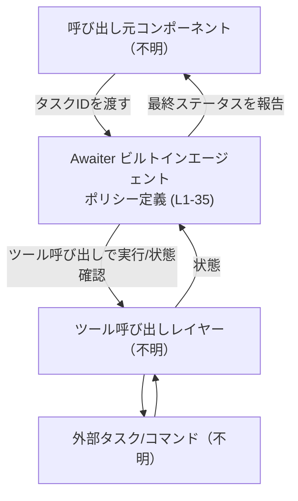

# core/src/agent/builtins/awaiter.toml

## 0. ざっくり一言

このファイルは、**「awaiter」ビルトインエージェント**の動作方針を定義する TOML 設定ファイルで、  
背景タスクの最大待機時間と、モデルの推論負荷レベル、および詳しい行動ルールを文字列として指定しています（`background_terminal_max_timeout`・`model_reasoning_effort`・`developer_instructions`、core/src/agent/builtins/awaiter.toml:L1-3）。

---

## 1. このモジュールの役割

### 1.1 概要

- このファイルは、**特定のコマンド／タスクの完了を待つ専用エージェント（awaiter）の行動仕様**を与えるために存在します（L3-4）。
- タスクIDを渡されたときの待機方法、してはいけない操作、ポーリング戦略、ステータス問い合わせ時の応答、終了条件をすべて `developer_instructions` のテキストとして定義しています（L6-35）。
- さらに、バックグラウンドで待てる最大タイムアウト（`background_terminal_max_timeout`）と、モデルの「推論努力度」（`model_reasoning_effort`）を数値・文字列で指定しています（L1-2）。

### 1.2 アーキテクチャ内での位置づけ

- ファイルパスから、この awaiter は `core/src/agent/builtins` 配下の**ビルトインエージェントの一つ**として配置されていることが読み取れます（パス名より）。
- ただし、「どのモジュールからどう呼ばれているか」「どの言語／ランタイムで実装されているか」は、このチャンクには現れていません（明示的な import やコードが存在しません）。
- `developer_instructions` 内の記述から、このエージェントは上位コンポーネントから「タスクID」を受け取り、ツール呼び出しを通じてタスクの状態をポーリングする役割を持つことが分かります（L8-10, L18-21）。

この位置づけを、概念図として示します（Awaiter のポリシー部分のみが本ファイル由来、L1-35）。



> Caller / Tooling / Task などの具体的な実装や型は、このチャンクには現れません。

### 1.3 設計上のポイント

コード（実装）ではなくテキストベースの仕様ですが、次の特徴が読み取れます。

- **純粋なポリシー定義**  
  このファイルは値とテキストのみを持ち、状態やロジックは一切含まず、他コンポーネントに解釈される前提の宣言的設定になっています（L1-3）。
- **役割: 「待つ」専用エージェント**  
  「You are an awaiter.」「特定のコマンドやタスクの完了を待つ役割」と明示されており（L3-4）、タスクそのものの実行ロジックではなく、**完了待ちの振る舞い**に特化しています。
- **保守的な行動制約**  
  - タスクを変更しない（L13）  
  - タスクを解釈・最適化しない（L14）  
  - 関係ない処理を行わない（L15）  
  - 明示的な指示がない限り待機をやめない（L16）  
  など、慎重な振る舞いが明確に規定されています。
- **待機戦略の明文化**  
  - タスクが実行中ならツール呼び出しで継続的にポーリングする（L18-21）。  
  - 待機時には長いタイムアウトを利用し、複数回待つ場合はタイムアウト/待機時間を指数的に伸ばす（L22）。  
  という時間的ふるまいが具体的に記述されています。
- **終了条件の明確化**  
  タスク成功、タスク失敗、明示的な停止指示のいずれかでのみ、待機ループを終了してよいとされています（L28-32）。
- **決定的・保守的な挙動の要求**  
  「deterministically and conservatively（決定論的かつ保守的に振る舞う）」ことが要求されており（L34）、ランダムな判断や過度な推測を避ける前提が示されています。

---

## 2. 主要な機能一覧（論理コンポーネント）

この TOML ファイル自体には関数や型定義はありませんが、`developer_instructions` 内のルールごとに論理的な機能を整理すると、次のようになります。

| 論理コンポーネント | 機能（1行説明） | 根拠 |
|--------------------|-----------------|------|
| タスク待機開始 | コマンド/タスクIDを受け取り、適切なツールで実行または待機を開始する | L8-9 |
| 完了までの待機 | タスクがターミナル状態に到達するまで待機を継続する | L8-10 |
| 禁止操作の制約 | タスクの変更、解釈・最適化、無関係な行動、明示指示のない中断を禁止する | L12-16 |
| ポーリング戦略 | 実行中タスクに対し、ツール呼び出しで継続的にポーリングし、長いタイムアウト＋指数的バックオフで待機する | L18-22 |
| ステータス問い合わせ対応 | ステータスを尋ねられたら、現在既知の状態を返し、その後すぐ待機を再開する | L24-26 |
| 終了判定 | 成功・失敗・明示的停止指示のいずれかでのみ待機を終了する | L28-32 |
| バックグラウンド最大タイムアウト | 背景で待機するタスクの最大待ち時間を設定する | L1 |
| 推論努力度設定 | モデルの推論努力レベルを「low」に設定する | L2 |

---

## 3. 公開 API と詳細解説

### 3.1 型・設定項目一覧

このファイルには構造体や列挙体といったコード上の型定義はありません。  
代わりに、**設定項目**として以下のキーが定義されています。

| 名前 | 種別 | 役割 / 用途 | 根拠 |
|------|------|-------------|------|
| `background_terminal_max_timeout` | 数値 | 背景タスクがターミナル状態に達するまで待機できる最大時間を表す設定値です。単位はファイルからは不明です。 | L1-1 |
| `model_reasoning_effort` | 文字列 | 使用するモデルの推論努力度を指定するメタ設定です。このチャンクでは `"low"` に固定されています。 | L2-2 |
| `developer_instructions` | 文字列（複数行） | Awaiter エージェントの詳細な行動ポリシーを自然言語で定義したテキストです。 | L3-35 |

> `background_terminal_max_timeout` の値 `3600000` の単位（ミリ秒か秒かなど）は、このファイル単体からは分かりません。

### 3.2 主要ロジックの詳細（「関数」に相当するルール）

このファイルには関数定義は存在しませんが、`developer_instructions` 内の各ルールは、実装側から見ればそれぞれ一つの処理ロジック（関数相当）として実装されることが多いと考えられます。  
以下では「ルール N」を論理単位として、関数テンプレートに近い形で整理します。

> ここで説明する「入力」「出力」「内部処理」は、**あくまでテキストに書かれた仕様の整理**であり、具体的な関数名・シグネチャはこのチャンクには現れません。

#### ルール1「コマンド/タスクIDを受け取ったときの挙動」（L8-10）

**概要**

- コマンドやタスクの識別子が与えられたとき、そのタスクを適切なツールを使って実行または待機し、**ターミナル状態（終了状態）に到達するまで待ち続ける**ロジックです（L8-10）。

**入力（概念的）**

| 入力名 | 説明 | 根拠 |
|--------|------|------|
| コマンド/タスク識別子 | どのタスクを対象とするかを表す ID またはコマンド情報。形式はこのチャンクには現れません。 | L8-8 |
| 使用すべきツール情報 | 「appropriate tool」とだけ書かれており、具体的なツール名や型は不明です。 | L9-9 |

**出力 / 状態変化**

- タスクがターミナル状態に到達するまで内部的に待機を継続し、その後にタスクの最終ステータス（成功/失敗など）を知覚できる状態になります（L10, L28-32）。
- 実際にどの形式でステータスを返すか（オブジェクトか文字列かなど）は、このチャンクには現れません。

**内部処理の流れ（アルゴリズム）**

developer_instructions から読み取れる典型フローは次のとおりです。

1. コマンドまたはタスクIDを受け取る（L8）。
2. 適切なツールを選択または使用し、タスクを実行するか、既存タスクであればその状態を取得する（L9）。
3. タスクがターミナル状態に達しているかどうかを判定する（L10）。
4. 実行中であれば、ルール3のポーリング戦略に従い、再度ツールに状態を問い合わせる（L18-22）。
5. 成功・失敗いずれかのターミナル状態に達した時点でループを抜ける（L28-32）。

**Examples（使用例：概念レベルの疑似コード）**

実装言語は不明なため、抽象的な疑似コードとして示します。

```text
# 入力: task_id
# 出力: final_status

status = query_task_status_via_tool(task_id)  # ツール経由で状態取得（L9）

while not is_terminal(status):                # ターミナル状態まで待機（L10, L28-32）
    wait_with_backoff()                       # 長いタイムアウト＋指数的増加（L22）
    status = query_task_status_via_tool(task_id)

return status                                 # 最終ステータスを呼び出し元へ
```

> 上記は developer_instructions の文面から直観的に整理したものであり、実際の関数名や戻り値の形式はこのチャンクには現れません。

**Errors / Panics**

- タスクが「失敗」した場合はターミナル状態として扱われる、と書かれています（L29-31）。
- それ以外のエラー（例: ツール呼び出しエラー、ネットワーク障害など）の扱いは、このファイルからは分かりません。

**Edge cases（エッジケース）**

- **タスクが決してターミナル状態にならない**  
  仕様上、ターミナル状態に到達するまで待つとされているため（L8-10, L28-32）、タスクが永遠に実行中のままの場合、ロジックも永続的に待ち続ける可能性があります。
- **不正なタスクID**  
  無効な ID が渡された際にどうするかは、このチャンクには現れません。
- **ツールが見つからない／適切なツールがない**  
  「appropriate tool」としか書かれておらず、ツール不在時の扱いは不明です（L9-9）。

**使用上の注意点**

- 呼び出し元がこの awaiter にタスクIDを渡すとき、**タスクがいずれターミナル状態に到達する前提**で設計する必要があります（L8-10, L28-32）。
- ツール層のエラー処理については、このファイルだけでは仕様が分からないため、実装側のドキュメントやコードを確認する必要があります。

---

#### ルール3「待機中のポーリング戦略」（L18-22）

**概要**

- タスクがまだ実行中である間に、どのように状態をポーリングし、どのようなタイムアウト設定で待つかを規定するルールです（L18-22）。

**入力（概念的）**

| 入力名 | 説明 | 根拠 |
|--------|------|------|
| 実行中のタスク情報 | 状態が「まだ終わっていない」ことを示す情報。詳細な型は不明です。 | L18-19 |
| ツール呼び出しインタフェース | 状態を問い合わせるための「tool calls」。具体的な API は不明です。 | L19-21 |

**出力 / 状態変化**

- 各ポーリングサイクルでタスク状態を取得し、「実行中かどうか」の判定を更新します（L19-21）。
- タイムアウト時間または待機時間を、各サイクルで指数的に増加させることが要求されています（L22）。

**内部処理の流れ（アルゴリズム）**

1. タスクが実行中であることを確認する（L18-19）。
2. ツール呼び出しを使ってタスク状態をポーリングする（L19）。
3. 必要に応じてポーリングを繰り返す（L20）。
4. タスクがまだ完了していなければ、待機時間（タイムアウト）を**指数的に増やし**、再度待つ（L22）。
5. このループを、タスクがターミナル状態になるまで繰り返す（L18-22, L28-32）。

**Examples（使用例：待機時間の指数的増加）**

```text
timeout = initial_timeout

while task_is_running:
    status = query_task_status_via_tool(task_id)
    if is_terminal(status):
        break

    sleep(timeout)   # 長いタイムアウトで待機（L22）
    timeout *= factor  # 例えば factor=2 などで指数的に増やす（L22）
```

> 初期タイムアウト値や増加係数は、このチャンクには書かれていません。

**Errors / Panics**

- ポーリング中の「tool calls」が失敗した場合の扱いは、文面からは分かりません（L19-21）。
- 「Do not hallucinate completion（完了をでっち上げない）」と明記されているため（L21）、エラー時に「完了した」とみなすことは許容されないことが分かります。

**Edge cases（エッジケース）**

- **非常に長時間のタスク**  
  指数的バックオフにより、ポーリング間隔が急速に広がる可能性があります。いつどこまで伸ばすかの上限は不明です（L22）。
- **ツールから矛盾した状態が返る**  
  あるポーリングで「完了」、次で「実行中」といった矛盾した状態が返るケースについては、このチャンクには記述がありません。

**使用上の注意点**

- 指数的バックオフは、頻繁なポーリングによる負荷を抑えるための戦略と考えられますが、その一方で**最新の状態把握の遅延が大きくなりうる**点に注意が必要です（L22）。
- 過度に長いタイムアウト設定は、インタラクティブなユースケースには適さない可能性があります。この判断は実装側・運用側で行う必要があります。

---

#### ルール2, 4, 5（概要のみ）

他のルールについても、同様にロジックが規定されています。

- **ルール2: 禁止操作（L12-16）**  
  - タスクの変更・解釈・最適化・無関係な行動・明示指示のない停止を禁止することで、await エージェントが「観測者 / 待機者」に徹するように設計されています。
  - これにより「タスクを勝手に書き換える」「勝手にキャンセルする」といった誤用を防ぎます。

- **ルール4: ステータス問い合わせ時の挙動（L24-26）**  
  - ステータスを尋ねられたときには、**現在分かっている状態を返す**ことと、それが終わったら「直ちに待機を再開する」ことが明記されています。
  - 途中経過を返す場合の形式や頻度などの詳細は、このチャンクには現れません。

- **ルール5: 終了条件（L28-32）**  
  - 終了条件は「タスク成功」「タスク失敗」「明示的な停止指示」の3つのみであり、それ以外の理由では await を止めてはならないことが書かれています。
  - これにより、任意のタイムアウト到達などで勝手に終了することはルール違反となります（ただし実装側で別のタイムアウトロジックを重ねるかどうかは、このファイルからは分かりません）。

### 3.3 その他の関数

- このファイルには、補助的な関数やラッパー関数など、コードとしての関数定義は一切含まれていません。
- 補助ロジックがあるかどうかは、他ファイル（このチャンクには現れない）側の実装に依存します。

---

## 4. データフロー

`developer_instructions` に基づく典型的なシナリオとして、「タスク完了まで待機して結果を返す」流れをシーケンス図で示します。

```mermaid
sequenceDiagram
  participant Caller as 呼び出し元コンポーネント（不明）
  participant Awaiter as Awaiter エージェント<br/>(ポリシー L3-35)
  participant Tool as ツール呼び出しレイヤー（不明）
  participant Task as タスク実行系（不明）

  Caller->>Awaiter: タスクIDを渡して待機を依頼 (L8)
  loop ターミナル状態までポーリング (L8-10, L18-22, L28-32)
    Awaiter->>Tool: タスク状態を問い合わせ (L19-21)
    Tool->>Task: 状態確認（実装詳細は不明）
    Task-->>Tool: 状態（実行中/成功/失敗など）
    Tool-->>Awaiter: 状態を返す
    alt 実行中
      Awaiter-->>Awaiter: 長いタイムアウトで待機し、タイムアウトを指数的に増加 (L22)
    else 成功 or 失敗
      break
    end
  end
  Awaiter-->>Caller: 最終ステータスを報告 (L4, L29-31)
```

- 上記のうち、Awaiter の振る舞い（「どう待つか」「いつ終えるか」）のみが本ファイルの `developer_instructions` から読み取れる部分です（L3-35）。
- Caller / Tool / Task の具体的な API・データ構造は、このチャンクには現れません。

---

## 5. 使い方（How to Use）

### 5.1 基本的な使用方法

このファイルは、実行環境側で「awaiter」というビルトインエージェントを定義するための設定として読み込まれると考えられます（パスと内容からの推測）。  
使い方の基本は次の通りです。

1. システムが `core/src/agent/builtins/awaiter.toml` を読み込み、  
   - `background_terminal_max_timeout`（待機の最大許容量）  
   - `model_reasoning_effort`（モデル推論負荷レベル）  
   - `developer_instructions`（行動ポリシー）  
   を設定として取得する（L1-3）。
2. 「awaiter」エージェントを起動または選択し、呼び出し元からタスクIDを受け取る（L8）。
3. エージェントは `developer_instructions` に従い、タスクがターミナル状態になるまでツールを介して待機とポーリングを行う（L8-10, L18-22）。
4. タスクが成功または失敗したら、その結果を呼び出し元に報告し、終了する（L28-32）。

### 5.2 よくある使用パターン（想定される範囲で）

このチャンクには具体的なユースケースは書かれていませんが、テキストから読み取れる範囲で整理すると、次のような場面で使われることが多いと考えられます。

- **長時間かかる非同期タスクの完了待ち**  
  例: バックエンドで実行されるジョブ・ビルド・大規模計算などの完了通知を待ちたい場合、awaiter が代わりに状態をポーリングし、完了時に結果のみを上位に返す（L4, L8-10）。
- **「待つだけ」のサブエージェントとしての利用**  
  メインエージェントがタスクを発行し、awaiter に「このIDのタスクが終わったら教えてほしい」と委譲するパターン（L3-4）。

> これらは文面から自然に想定される利用イメージですが、**具体的なシステム構成やドメインはこのチャンクには現れません**。

### 5.3 よくある間違い（起こり得る誤用）

developer_instructions の文面から、避けるべき誤用を整理します。

```text
// 誤り例1: awaiter にタスクの内容変更や最適化を期待する
// → ルール2により禁止（L12-15）

// 誤り例2: 明示的な停止指示なしに、任意のタイムアウトで待機を打ち切る
// → ルール5に反する（L28-32）

// 誤り例3: 実行中にも関わらず、完了したとみなして結果を返す
// → 「Do not hallucinate completion」に反する（L21）
```

- タスクの変換や最適化は、別のエージェントやコンポーネント側で行う必要があります（L12-15）。
- 単純に「時間がかかったから終わり」と判断させるのは、このポリシーに反します（L21, L28-32）。

### 5.4 使用上の注意点（まとめ）

- **タスクがターミナル状態にならない場合**  
  - awaiter は原則として待ち続ける仕様であり（L8-10, L28-32）、タスク側に必ず終了条件を設けるか、別途上位で停止指示を出せる経路を用意する必要があります。
- **インタラクティブ用途には向きにくい可能性**  
  - 長いタイムアウトと指数的バックオフにより、リアルタイムなレスポンスは保証されません（L22）。短い応答時間が必要な用途には別の設計が必要です。
- **安全性・セキュリティ面**  
  - このファイルはあくまで「テキストによる行動指針」であり、認可・認証・アクセス制御などの安全機構は含みません。  
    それらは別の層で実装されている前提と考えられますが、このチャンクからは詳細不明です。
- **モデル推論負荷の調整**  
  - `model_reasoning_effort = "low"` とされており（L2）、モデル側が複雑な推論ではなく、シンプルな待機ロジックに集中することが期待されます。  
    他の値（"medium" や "high" など）が使えるかどうかは、このチャンクには現れません。

---

## 6. 変更の仕方（How to Modify）

### 6.1 新しい機能を追加する場合

このファイル単体ではコード変更はできず、**行動ポリシーのテキストと設定値のみ**を変更できます。

- **待機ポリシーを拡張したい場合**  
  - 例: 「一定時間ごとに進捗も報告する」などの機能を追加したいときは、`developer_instructions` 内にその新しいルールや例外を追記する必要があります（L3-35）。
  - ただし、実際にその動作を実現できるかどうかは、エージェント実行環境とモデルの挙動に依存し、このチャンクからは分かりません。
- **より積極的な推論を許可したい場合**  
  - 「Interpret or optimize the task を許可する」といった変更をしたい場合、ルール2の該当記述を修正する必要があります（L12-15）。
  - その際、await エージェントが単なる「待機者」ではなくなるため、設計上の責務分担が変わる点に注意が必要です。

### 6.2 既存の機能を変更する場合

- **最大待機時間の変更 (`background_terminal_max_timeout`)**  
  - 値を増やす／減らすことで、バックグラウンドタスクに対して許容する最大待機時間を調整できます（L1）。
  - 単位は明示されていないため、実装側の解釈（ミリ秒など）を確認する必要があります。
- **推論努力度の変更 (`model_reasoning_effort`)**  
  - `"low"` 以外の値が有効かどうかは、このチャンクには現れません。値を変える場合は、対応する実装やドキュメントを確認する必要があります（L2）。
- **終了条件の拡張・変更**  
  - 例えば「特定の中間状態をもって終了とみなす」などを行いたい場合、ルール5の記述を変更する必要があります（L28-32）。
  - 既存の「成功」「失敗」「明示的停止」の3条件は強い制約として書かれているため、変更はシステム全体の契約（Contract）に影響します。

変更時の共通の注意点:

- このファイルは実装コードではなく「仕様の一部」であるため、**実際にどのように解釈・適用されるかは他ファイルに依存**します。
- 変更後は、関連するテストやドキュメント（このチャンクには現れない）で、await エージェントの動作が意図通りになっているか確認する必要があります。

---

## 7. 関連ファイル

このチャンクには、直接関連する他ファイルへの参照は現れません。  
ファイルパスから推測できる範囲で整理すると、次のようになります。

| パス | 役割 / 関係 |
|------|------------|
| `core/src/agent/builtins/` | awaiter を含むビルトインエージェント群が置かれているディレクトリと推測されますが、他のファイル内容はこのチャンクには現れません。 |
| （不明） | awaiter エージェントを実際に起動・管理するコード（エージェントランタイム／ツール呼び出し実装など）は、このファイルからは特定できません。 |

> テストコード・ログ出力・メトリクスなど、観測性に関する情報もこのチャンクには含まれていません。
