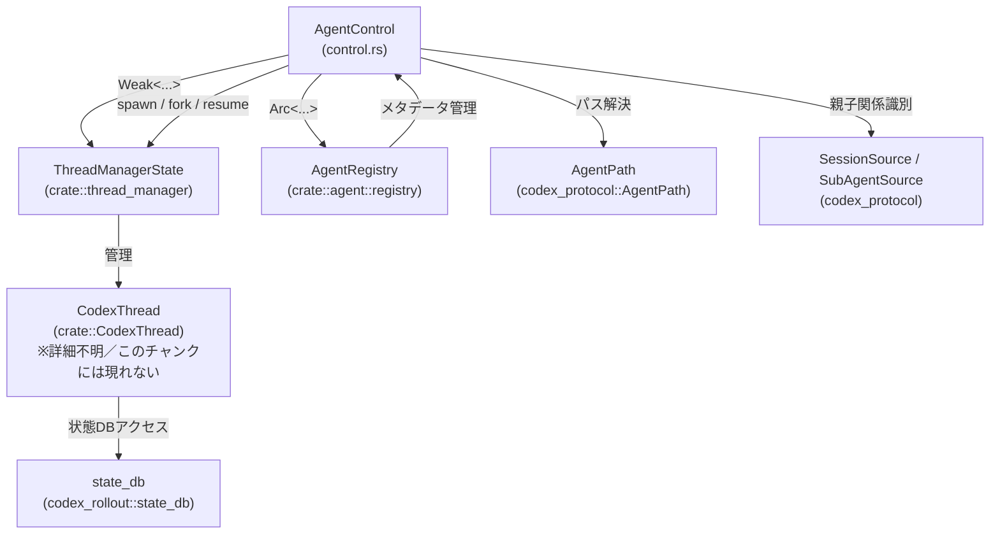
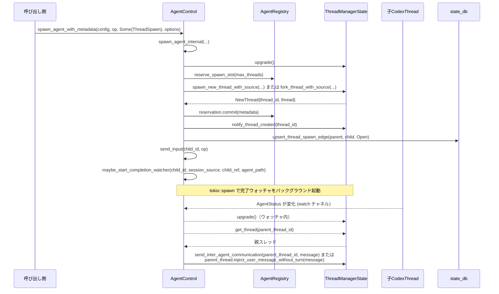

# core/src/agent/control.rs コード解説

## 0. ざっくり一言

`AgentControl` は、マルチエージェント実行のための「コントロールプレーン」です。  
スレッド（エージェント）のスポーン／フォーク／レジューム、シャットダウン、ステータス監視、エージェント間通信などを一箇所でまとめて扱うモジュールです（`core/src/agent/control.rs:L126-139`）。

---

## 1. このモジュールの役割

### 1.1 概要

このモジュールは、**マルチエージェント環境でのスレッド管理**を一元的に扱うために存在し、主に次の機能を提供します。

- `ThreadManagerState` に対するラッパとしてのエージェント生成・フォーク・レジューム（`spawn_agent*`, `spawn_forked_thread`, `resume_*`）（`L151-166`, `L327-402`, `L405-578`）
- エージェントへの入力送信・エージェント間通信・割り込み（`send_input`, `send_inter_agent_communication`, `interrupt_agent`）（`L581-645`）
- エージェントのシャットダウン／クローズと、子孫スレッドのツリー処理（`shutdown_live_agent`, `close_agent`, `shutdown_agent_tree`）（`L662-705`）
- ライブなエージェント一覧やメタデータ・トークン使用量の取得（`list_agents`, `get_agent_config_snapshot`, `get_total_token_usage`）（`L743-795`, `L819-891`）
- サブエージェント完了時の非同期通知（`maybe_start_completion_watcher`）（`L898-971`）

### 1.2 アーキテクチャ内での位置づけ

このモジュールは、グローバルなスレッド管理 (`ThreadManagerState`) と、ルートスレッド単位のレジストリ (`AgentRegistry`) の間に位置し、セッションソース (`SessionSource`, `SubAgentSource`) とパス (`AgentPath`) を使ってエージェントツリーを管理します。



`AgentControl` は `Weak<ThreadManagerState>` を保持し（`L133-139`）、スレッド管理のライフタイムに追従しつつ、レジストリ `AgentRegistry` を `Arc` 経由で共有します。

### 1.3 設計上のポイント

コードから読み取れる特徴を挙げます。

- **ルートスレッド単位のレジストリ**
  - `AgentControl` はルートスレッドごとに 1 つ作られ、サブエージェントにも同じインスタンスが共有されます（コメント `L126-132`）。
  - これにより、レジストリは `ThreadManagerState` 全体ではなく、そのルートツリーにスコープされます。

- **Weak 参照による循環参照回避**
  - `manager: Weak<ThreadManagerState>` を保持し、`upgrade()` 失敗時は `UnsupportedOperation("thread manager dropped")` を返します（`L133-139`, `L1013-1017`）。
  - これにより `ThreadManagerState ↔ Session` 間の循環参照を避けています（コメント `L134-137`）。

- **非同期 & 並行処理**
  - 主要な操作はすべて `async fn` で定義され、Tokio ランタイム上で実行される前提です（例: `spawn_agent`, `send_input`, `list_agents`）。
  - ステータス監視は `tokio::sync::watch` チャネルで行い（`subscribe_status`, `L778-785`）、`tokio::spawn` でバックグラウンドタスクを起動します（`maybe_start_completion_watcher`, `L912-970`）。

- **状態の二層構造**
  - メモリ内状態: `ThreadManagerState` にあるライブスレッド群（`list_thread_ids`, `get_thread` などを使用、`L1075-1080`）。
  - 永続状態: `state_db` を用いたスレッドスポーンエッジの保存・読み出し（`resume_agent_from_rollout`, `persist_thread_spawn_edge_for_source`, `L405-476`, `L1112-1133`）。

- **エラーハンドリング方針**
  - 多くの関数が `CodexResult<T>` を返し、`CodexErr` によるアプリケーションレベルのエラー区別を行います（`L20-21`）。
  - スレッド内部の異常終了 (`InternalAgentDied`) を検出すると、スレッドの削除とレジストリからの解放を行います（`handle_thread_request_result`, `L653-656`）。

- **Rust の安全性**
  - 本ファイル内に `unsafe` ブロックは存在しません。
  - 共有状態は `Arc` を通じて共有され、ミュータブルな共有は他モジュールに委譲されています（このチャンクには現れない）。

---

## 2. 主要な機能一覧

このモジュールの主な機能を列挙します。

- エージェント生成
  - `spawn_agent` / `spawn_agent_with_metadata`: 新規スレッド（エージェント）を生成し、初期 `Op` を送信（`L151-178`）。
  - `spawn_forked_thread`: 親スレッドのロールアウトを元にフォークしたスレッドを生成（`L327-402`）。

- エージェントのレジューム
  - `resume_agent_from_rollout`: ロールアウトファイルからスレッドツリーを再構築（`L405-476`）。
  - `resume_single_agent_from_rollout`: 個々のスレッドのレジューム処理（`L478-578`）。

- 入力と通信
  - `send_input`: ユーザ入力 `Op::UserInput` 等を既存スレッドに送信（`L581-600`）。
  - `send_inter_agent_communication`: `InterAgentCommunication` を使ったエージェント間メッセージ送信（`L618-639`）。
  - `interrupt_agent`: 実行中タスクへの割り込み (`Op::Interrupt`)（`L642-645`）。

- 終了処理
  - `shutdown_live_agent`: ロールアウトを flush した上でエージェントに `Op::Shutdown` を送信し、スレッドを削除（`L662-677`）。
  - `close_agent`: state_db 上のスポーンエッジを `Closed` にし、当該スレッドとメモリ上の子孫スレッドをシャットダウン（`L682-705`）。

- メタデータ・ツリー操作
  - `list_live_agent_subtree_thread_ids`: あるエージェントとライブな子孫スレッド ID 一覧を取得（`L734-741`）。
  - `format_environment_context_subagents`: サブエージェントの一覧を環境コンテキスト用の文字列に整形（`L797-817`）。
  - `list_agents`: パスプレフィックスでフィルタされたエージェント一覧を返す（`L819-891`）。

- ステータスと監視
  - `get_status`: エージェントの最新ステータス取得（`L708-718`）。
  - `subscribe_status`: `watch::Receiver<AgentStatus>` を返し、ステータス変化を購読（`L778-785`）。
  - `maybe_start_completion_watcher`: 子エージェント完了を検知し、親へ通知する非同期ウォッチャ（`L898-971`）。

- サポート
  - ニックネーム候補の解決 (`agent_nickname_candidates`, `L79-94`)。
  - 入力プレビュー文字列の生成 (`render_input_preview`, `L1186-1202`)。
  - スレッドスポーンの親 ID / 深さの抽出（`thread_spawn_parent_thread_id`, `thread_spawn_depth`, `L1163-1169`, `L1205-1209`）。

---

## 3. 公開 API と詳細解説

### 3.1 型一覧（構造体・列挙体など）

| 名前 | 種別 | 役割 / 用途 | 定義位置 |
|------|------|-------------|----------|
| `SpawnAgentForkMode` | enum | フォーク時に親ロールアウトをどこまで引き継ぐかを指定します。`FullHistory` は全履歴、`LastNTurns(usize)` は直近 N ターンのみを残します。 | `core/src/agent/control.rs:L45-49` |
| `SpawnAgentOptions` | struct | スポーン時のオプション。フォーク元呼び出し ID (`fork_parent_spawn_call_id`) とフォークモード (`fork_mode`) を保持します。 | `L51-55` |
| `LiveAgent` | struct | スポーンされたエージェントを表す軽量ハンドル。`thread_id`, `metadata`, `status` を含みます。 | `L57-62` |
| `ListedAgent` | struct | `list_agents` の結果として返される表示用情報。エージェント名、ステータス、最後のタスクメッセージを含みます。 | `L64-69` |
| `AgentControl` | struct | 本モジュールの中心となるコントローラ。`Weak<ThreadManagerState>` と `Arc<AgentRegistry>` を保持し、マルチエージェント操作のエントリポイントを提供します。 | `L126-139` |

補助的な定数:

| 名前 | 種別 | 役割 / 用途 | 定義位置 |
|------|------|-------------|----------|
| `AGENT_NAMES` | `&'static str` | デフォルトのエージェントニックネーム候補一覧（テキストファイル `agent_names.txt` の内容） | `L42` |
| `ROOT_LAST_TASK_MESSAGE` | `&'static str` | ルートスレッド用の固定表示メッセージ `"Main thread"` | `L43` |

### 3.2 関数詳細（最大 7 件）

以下では特に重要な 7 関数を詳細に説明します。

---

#### `AgentControl::spawn_agent(&self, config: crate::config::Config, initial_operation: Op, session_source: Option<SessionSource>) -> CodexResult<ThreadId>`

**概要**

新しいエージェントスレッドを生成し、初期 `Op`（通常はユーザ入力や内部操作）を送信します。実際の処理は `spawn_agent_internal` に委譲され、`ThreadId` だけを返します（`L151-166`, `L180-325`）。

**引数**

| 引数名 | 型 | 説明 |
|--------|----|------|
| `config` | `crate::config::Config` | 新しいスレッドに適用する設定。全体設定からコピーされたものが渡される想定ですが、詳細はこのチャンクには現れません。 |
| `initial_operation` | `Op` | スレッドに最初に送る操作。`Op::UserInput`, `Op::InterAgentCommunication` など。 |
| `session_source` | `Option<SessionSource>` | スレッド生成の起点を表す情報。`None` の場合はルートスレッド、`Some(SessionSource::SubAgent(SubAgentSource::ThreadSpawn { ... }))` の場合はサブエージェントとして扱われます（`L195-215`）。 |

**戻り値**

- `Ok(ThreadId)` : スポーンされたスレッドの ID。
- `Err(CodexErr)` : スポーンに失敗した場合（スレッドマネージャ解決失敗、スロット不足、ThreadManager 側のエラーなど）。

**内部処理の流れ（`spawn_agent_internal` を含む）**

1. `upgrade()` で `Weak<ThreadManagerState>` から `Arc` を取得。失敗した場合 `UnsupportedOperation("thread manager dropped")` を返します（`L187`, `L1013-1017`）。
2. `AgentRegistry::reserve_spawn_slot` でスレッド数制限に基づいたスポーンスロットを予約（`L188-189`）。
3. 親スレッドがある場合、`inherited_shell_snapshot_for_source` と `inherited_exec_policy_for_source` により、シェルスナップショットと実行ポリシーを継承するかどうかを決定（`L189-194`, `L1019-1057`）。
4. `session_source` が `SubAgent::ThreadSpawn` の場合は `prepare_thread_spawn` でエージェントパスとニックネームを決定し、`AgentMetadata` を初期化（`L195-215`, `L973-1011`）。
5. `fork_mode` の有無に応じて、以下のいずれかでスレッド生成（`L218-245`）。
   - フォークモードあり: `spawn_forked_thread` で親ロールアウトからフォーク。
   - セッションソースあり: `ThreadManagerState::spawn_new_thread_with_source`。
   - セッションソースなし: `ThreadManagerState::spawn_new_thread`。
6. 生成した `thread_id` を `agent_metadata` に設定し、`reservation.commit` でレジストリに登録（`L246-248`）。
7. サブエージェントで GeneralAnalytics が有効な場合、`emit_subagent_session_started` による分析イベント送信（`L249-290`）。
8. `notify_thread_created` でクライアントへのスレッド作成通知を送出（`L292-295`）。
9. state_db に親子関係エッジを `Open` として永続化 (`persist_thread_spawn_edge_for_source`, `L297-302`, `L1112-1133`)。
10. `send_input` で初期 `Op` を送信し、`last_task_message` を更新（`L304-305`, `L581-600`）。
11. `MultiAgentV2` が無効な場合は `maybe_start_completion_watcher` を起動し、子スレッド完了時の通知をセットアップ（`L306-318`, `L898-971`）。
12. 最終的に `LiveAgent` から `thread_id` を取り出して呼び出し元に返却（`L320-324`, `L157-166`）。

**Examples（使用例）**

```rust
use codex_protocol::protocol::Op;
use codex_protocol::ThreadId;
use crate::agent::control::AgentControl;

// 非同期コンテキスト内の例
async fn spawn_root_agent(
    control: AgentControl,
    config: crate::config::Config,
    initial_op: Op,
) -> codex_protocol::error::Result<ThreadId> {
    // ルートスレッドとしてエージェントを生成する（session_source = None）
    control.spawn_agent(config, initial_op, None).await
}
```

**Errors / Panics**

- `upgrade` 失敗時: `CodexErr::UnsupportedOperation("thread manager dropped")`（`L1013-1017`）。
- スロット予約失敗時: `reserve_spawn_slot` からのエラーをそのまま伝播（実装はこのチャンクには現れないが、`?` によって伝播している `L188-189`）。
- `spawn_new_thread*`, `spawn_forked_thread`, `send_input` 内で発生した `CodexErr` をそのまま返します（`L231-245`, `L304-305`）。
- 本関数内に `panic!` や `unwrap()` は存在しません。

**Edge cases（エッジケース）**

- `session_source = None` の場合: ルートスレッドとして生成され、`AgentRegistry` のルート登録は別途 `register_session_root` で行われます（`L720-727`）。
- `spawn_forked_thread` が返すエラー（フォークモード不備など）はそのまま `spawn_agent` のエラーになります（`L327-345`）。
- 初期 `Op` が `UserInput` 以外（例: `InterAgentCommunication`）の場合でも、そのまま `send_op` されます（`L581-593`）。

**使用上の注意点**

- 本関数は `async fn` なので、必ず非同期コンテキストで `.await` する必要があります。
- 親・子の関係を適切に構築するには、`session_source` を正しく設定することが前提です。不整合な `session_source` はエラー（特にフォーク時）につながります。
- スレッド生成後すぐに `ThreadManagerState` 側のスレッド削除が起こる可能性もあるため、`ThreadId` を取得した後でも `get_thread` が失敗する可能性はあります（`get_status`, `L708-718`）。

---

#### `AgentControl::spawn_forked_thread(&self, state: &Arc<ThreadManagerState>, config: crate::config::Config, session_source: SessionSource, options: &SpawnAgentOptions, inherited_shell_snapshot: Option<Arc<ShellSnapshot>>, inherited_exec_policy: Option<Arc<crate::exec_policy::ExecPolicyManager>>) -> CodexResult<crate::thread_manager::NewThread>`

**概要**

既存の親スレッドのロールアウト（会話履歴）を JSONL から読み出し、適宜トリミングした上で、新しいスレッドとしてフォークします（`L327-402`）。

**引数**

| 引数名 | 型 | 説明 |
|--------|----|------|
| `state` | `Arc<ThreadManagerState>` | ライブスレッドを管理するグローバル状態。 |
| `config` | `crate::config::Config` | フォーク先スレッドの設定。親ロールアウトのパス解決に `config.codex_home` を使用（`L371-375`）。 |
| `session_source` | `SessionSource` | 必ず `SubAgentSource::ThreadSpawn { parent_thread_id, .. }` である必要があります（`L346-353`）。 |
| `options` | `&SpawnAgentOptions` | `fork_parent_spawn_call_id` と `fork_mode` を含みます。どちらか一方でも不足しているとエラー。 |
| `inherited_shell_snapshot` | `Option<Arc<ShellSnapshot>>` | 親から継承されたシェルスナップショット。 |
| `inherited_exec_policy` | `Option<Arc<ExecPolicyManager>>` | 親から継承された実行ポリシー。 |

**戻り値**

- `Ok(NewThread)` : フォークして生成したスレッド。
- `Err(CodexErr)` : オプション不足・親ロールアウトが見つからない・ロールアウト読み取り失敗など。

**内部処理の流れ**

1. `fork_parent_spawn_call_id` が `None` の場合、`CodexErr::Fatal("spawn_agent fork requires a parent spawn call id")` を返す（`L336-340`）。
2. `fork_mode` が `None` の場合、同様に `Fatal("spawn_agent fork requires a fork mode")`（`L341-345`）。
3. `session_source` が `SubAgentSource::ThreadSpawn` 以外なら `Fatal("spawn_agent fork requires a thread-spawn session source")`（`L346-353`）。
4. 親スレッドを `state.get_thread(parent_thread_id)` で取得し、存在すればロールアウトを確実に永続化するため `ensure_rollout_materialized` と `flush_rollout` を呼び出し（`L355-366`）。
5. ロールアウトファイルのパスを取得（`rollout_path`）。
   - 親スレッドから `rollout_path()` を優先的に取得し（`L368-371`）、
   - ダメなら `find_thread_path_by_id_str` で `codex_home` から検索（`L371-375`）。
   - どちらも失敗した場合は `Fatal("parent thread rollout unavailable for fork: {parent_thread_id}")`（`L376-380`）。
6. `RolloutRecorder::get_rollout_history` でロールアウトを読み込み、`get_rollout_items()` を取得（`L382-384`）。
7. `fork_mode` が `LastNTurns(n)` の場合は `truncate_rollout_to_last_n_fork_turns` でターン数を絞り込み（`L385-388`）。
8. `keep_forked_rollout_item` を用いてロールアウトアイテムをフィルタリング（システム/ユーザ/FinalAnswer メッセージ等のみ残す）（`L389-389`, `L96-123`）。
9. `ThreadManagerState::fork_thread_with_source` を呼び出し、新しい `NewThread` を生成して返す（`L391-401`）。

**Examples（使用例）**

フォークは内部的に `spawn_agent_internal` から呼ばれるため、外部から直接呼ぶことはありません（`spawn_agent` は `options.fork_mode` を設定してこの関数を使います）。

設計理解のための擬似コード例:

```rust
// 親スレッドから直近 3 ターンだけを持つ子スレッドをフォークするイメージ
let options = SpawnAgentOptions {
    fork_parent_spawn_call_id: Some("call-123".to_string()),
    fork_mode: Some(SpawnAgentForkMode::LastNTurns(3)),
};
let live = control
    .spawn_agent_with_metadata(config, initial_op, Some(session_source), options)
    .await?;
```

**Errors / Panics**

- オプション不足はすべて `CodexErr::Fatal` で即時エラー（`L336-345`）。
- 親ロールアウトパスの解決失敗も `Fatal`（`L376-380`）。
- ロールアウト読み込みや `fork_thread_with_source` のエラーはそのまま伝播（`L382-384`, `L391-401`）。
- 本関数にも `panic!` や `unwrap()` はありません。

**Edge cases**

- 親スレッドが `ThreadManagerState` に存在しない場合: `parent_thread` は `None` となりますが、`find_thread_path_by_id_str` によるファイル検索は行われるため、過去に存在したスレッドのフォークも可能です（`L355-376`）。
- ロールアウトが大きい場合: フォーク前に全アイテムを読み込んでメモリ上でフィルタリングするため、メモリ負荷が増加します（`L382-389`）。

**使用上の注意点**

- フォークには親ロールアウトへのアクセスが必須です。アーカイブや削除によりロールアウトファイルが失われるとフォークできません。
- 親スレッドのロールアウトはフォーク直前に `flush_rollout` されます。頻繁なフォークは I/O 負荷増加につながります。

---

#### `AgentControl::resume_agent_from_rollout(&self, config: crate::config::Config, thread_id: ThreadId, session_source: SessionSource) -> CodexResult<ThreadId>`

**概要**

単一スレッドをロールアウトファイルからレジュームするとともに、そのスレッドが親となる**子孫スレッドツリー**を、state_db に記録されたスポーンエッジ情報に基づいて再帰的にレジュームします（`L405-476`）。

**引数**

| 引数名 | 型 | 説明 |
|--------|----|------|
| `config` | `crate::config::Config` | レジューム対象スレッドに適用する設定。子孫の再レジューム時にもクローンして再利用（`L413-414`, `L455-459`）。 |
| `thread_id` | `ThreadId` | レジューム対象（ルート）のスレッド ID。 |
| `session_source` | `SessionSource` | レジューム元のコンテキスト。`ThreadSpawn` の場合は深さに応じて機能を制限（`L411`, `L484-489`）。 |

**戻り値**

- `Ok(ThreadId)` : レジュームされたルートスレッドの ID（引数 `thread_id` と同じ）。
- `Err(CodexErr)` : レジュームに失敗した場合。

**内部処理の流れ**

1. `thread_spawn_depth(&session_source)` からルートの深さ `root_depth` を取得。`ThreadSpawn` でない場合は 0（`L411`, `L1205-1209`）。
2. `resume_single_agent_from_rollout` を呼び出し、指定された `thread_id` をレジューム（`L412-414`, `L478-578`）。
3. レジュームされたスレッドから `state_db` コンテキストを取得。なければ子孫レジュームは行わずに終了（`L415-421`）。
4. BFS 風のキュー `resume_queue` を `(thread_id, root_depth)` で初期化し、以下のループを実行（`L423-424`）。
   - `list_thread_spawn_children_with_status(parent_thread_id, Open)` で子スレッド ID を取得（`L425-431`）。
   - 失敗した場合は warn ログを出し、その親の処理をスキップ（`L432-438`）。
   - 各子について:
     - すでに `ThreadManagerState` に存在すれば `child_resumed = true`（`L443-444`）。
     - 存在しなければ、`ThreadSpawn` な `SessionSource` を構築し、`resume_single_agent_from_rollout` でレジュームを試みる（`L446-460`）。
     - レジューム成功は `child_resumed = true`、失敗は warn ログを出して `false`（`L461-467`）。
   - `child_resumed` が `true` の子は `(child_thread_id, child_depth)` をキューに追加（`L469-471`）。
5. すべての子孫の処理が終わったら、ルートの `resumed_thread_id` を返す（`L475-475`）。

**Examples（使用例）**

```rust
use codex_protocol::protocol::{SessionSource, SubAgentSource};
use codex_protocol::ThreadId;

// ルートスレッドのレジューム例（説明用）
async fn resume_tree(
    control: AgentControl,
    config: crate::config::Config,
    root_thread_id: ThreadId,
) -> codex_protocol::error::Result<ThreadId> {
    // ログなどから復元したセッションソースを用いる前提
    let session_source = SessionSource::SubAgent(SubAgentSource::ThreadSpawn {
        parent_thread_id: root_thread_id,
        depth: 0,
        agent_path: None,
        agent_nickname: None,
        agent_role: None,
    });
    control
        .resume_agent_from_rollout(config, root_thread_id, session_source)
        .await
}
```

**Errors / Panics**

- `resume_single_agent_from_rollout` でのエラーは即座に伝播（`L412-414`）。
- 子孫の `resume_single_agent_from_rollout` が失敗した場合は warn ログを出し、その子のみスキップ。全体としては成功扱いでルート ID を返します（`L461-467`）。
- state_db の `list_thread_spawn_children_with_status` が失敗した場合も warn ログのみに留め、その親以下の子孫はスキップ（`L432-438`）。
- パニックはありません。

**Edge cases**

- `state_db` が取得できない場合: ルートのスレッドのみレジュームし、子孫はレジュームしません（`L419-421`）。
- すでにライブな子スレッド: 再レジュームは行わず、そのままツリーに含めます（`L443-444`）。
- 深いツリー: BFS で処理するため、スタックオーバーフローの心配はなく、キューサイズに応じたメモリ使用となります。

**使用上の注意点**

- 再レジュームされたスレッドは `notify_thread_created` によってクライアントから再購読可能な状態になります（`L555-556`）。
- 深さ制限や機能制限（特定 `Feature` の無効化）は `resume_single_agent_from_rollout` 内で行われます（`L484-489`）。

---

#### `AgentControl::send_input(&self, agent_id: ThreadId, initial_operation: Op) -> CodexResult<String>`

**概要**

既存エージェントスレッドに対して `Op` を送信し、その実行結果（通常は応答 ID などの文字列）を返します。また、ユーザに見せるための「最後のタスクメッセージ」を更新します（`L580-600`）。

**引数**

| 引数名 | 型 | 説明 |
|--------|----|------|
| `agent_id` | `ThreadId` | 入力を送信する対象エージェントの ID。 |
| `initial_operation` | `Op` | 送信する操作。`Op::UserInput` の場合は入力プレビューが作られます。 |

**戻り値**

- `Ok(String)` : ThreadManager 側から返された結果文字列。
- `Err(CodexErr)` : スレッドが見つからない・内部エラー・エージェント死亡などのエラー。

**内部処理の流れ**

1. `render_input_preview(initial_operation)` でタスクメッセージのプレビューを生成（`L586-587`, `L1186-1202`）。
2. `upgrade()` により `ThreadManagerState` を取得（`L587-588`）。
3. `state.send_op(agent_id, initial_operation).await` を呼び出し、結果を `handle_thread_request_result` に渡す（`L588-593`, `L647-658`）。
4. 結果が `Ok` の場合のみ、`AgentRegistry::update_last_task_message` でレジストリ側のメタデータを更新（`L595-598`）。

**Examples（使用例）**

```rust
async fn send_user_message(
    control: &AgentControl,
    agent_id: ThreadId,
    text: String,
) -> codex_protocol::error::Result<String> {
    use codex_protocol::protocol::Op;
    use codex_protocol::user_input::UserInput;

    let op = Op::UserInput {
        items: vec![UserInput::Text { text, metadata: None }],
        // 他フィールドはこのチャンクには現れない
        ..
        // 省略
    };
    control.send_input(agent_id, op).await
}
```

**Errors / Panics**

- `ThreadManagerState::send_op` からの `CodexErr` をそのまま返します。
- `CodexErr::InternalAgentDied` の場合、`handle_thread_request_result` がスレッド削除とスロット解放を行います（`L653-656`）。
- `render_input_preview` 内には `panic!` はありません（`L1186-1202`）。

**Edge cases**

- `Op::UserInput` 以外の場合:
  - `render_input_preview` では `Op::InterAgentCommunication` なら `communication.content`、その他は空文字列になります（`L1199-1202`）。
- スレッドがすでに削除されている場合:
  - `send_op` 側の挙動はこのチャンクには現れませんが、エラーとして返ってくる前提で設計されています。

**使用上の注意点**

- `InternalAgentDied` エラー時には内部でクリーンアップが行われるため、呼び出し側で `close_agent` を重ねて呼ぶ必要は通常ありません。
- 高頻度に呼び出される関数であり、内部で追加の I/O は行わず `send_op` に委譲しています。パフォーマンスは主に `ThreadManagerState` の実装に依存します。

---

#### `AgentControl::send_inter_agent_communication(&self, agent_id: ThreadId, communication: InterAgentCommunication) -> CodexResult<String>`

**概要**

あるエージェントから別のエージェントへ送るための `InterAgentCommunication` を、対象スレッドに `Op::InterAgentCommunication` として送信します。`send_input` と同様に `last_task_message` を更新します（`L618-639`）。

**引数**

| 引数名 | 型 | 説明 |
|--------|----|------|
| `agent_id` | `ThreadId` | メッセージを受け取る側のエージェント ID（一般に親／子エージェント）。 |
| `communication` | `InterAgentCommunication` | 送信するメッセージとコンテキスト。 |

**戻り値**

- `Ok(String)` : ThreadManager 側の結果文字列。
- `Err(CodexErr)` : スレッドが存在しない・エージェント死亡などのエラー。

**内部処理の流れ**

1. `communication.content` を `last_task_message` としてコピー（`L623-623`）。
2. `state.send_op(agent_id, Op::InterAgentCommunication { communication })` を実行（`L625-631`）。
3. `handle_thread_request_result` で `InternalAgentDied` 処理を行う（`L626-633`, `L647-658`）。
4. `Ok` の場合のみ `update_last_task_message` でレジストリ更新（`L634-637`）。

**Examples（使用例）**

`maybe_start_completion_watcher` からの呼び出し例が本体にあります（`L952-961`）。親エージェントに子の完了通知を送る用途です。

```rust
// 親エージェントに「子エージェントが完了した」ことを通知する簡略イメージ
use codex_protocol::protocol::InterAgentCommunication;

async fn notify_parent_completion(
    control: &AgentControl,
    parent_id: ThreadId,
    child_path: AgentPath,
    parent_path: AgentPath,
    message: String,
) {
    let comm = InterAgentCommunication::new(
        child_path,
        parent_path,
        Vec::new(), // 添付アイテムなし
        message,
        false,      // trigger_turn = false
    );
    let _ = control.send_inter_agent_communication(parent_id, comm).await;
}
```

**Errors / Panics**

- `send_op` のエラー伝播、および `InternalAgentDied` クリーンアップは `send_input` と同様です。
- 本関数自体にパニックはありません。

**Edge cases**

- `communication.content` が長大でも、そのまま `last_task_message` として保存されます（`L623-637`）。
- 通信相手が存在しない（`ThreadNotFound` 等）ケースでは、エラーが呼び出し元に返るだけで、追加の処理は行われません。

**使用上の注意点**

- 送信先の `ThreadId` は、`AgentPath` から `resolve_agent_reference` 等を通じて正しく解決しておく必要があります（`L756-775`）。
- MultiAgent V2 モードでは、子完了通知の経路としてこの関数が多用されます（`L936-961`）。

---

#### `AgentControl::close_agent(&self, agent_id: ThreadId) -> CodexResult<String>`

**概要**

対象エージェントのスポーンエッジ状態を `Closed` として永続化した上で、そのスレッドとメモリ上で到達可能な子孫スレッドをすべてシャットダウンします（`L680-693`）。

**引数**

| 引数名 | 型 | 説明 |
|--------|----|------|
| `agent_id` | `ThreadId` | 閉じる対象エージェントの ID。 |

**戻り値**

- `Ok(String)` : ルートエージェントに対する `shutdown_live_agent` の結果文字列。
- `Err(CodexErr)` : シャットダウン処理中に発生したエラー。

**内部処理の流れ**

1. `ThreadManagerState::get_thread(agent_id)` でスレッドを取得（`L683-684`）。
2. 取得に成功し、`state_db` があれば `set_thread_spawn_edge_status(agent_id, Closed)` を呼び出し、エッジ状態を永続化（`L685-688`）。
   - 失敗時は warn ログのみで処理継続（`L685-691`）。
3. `shutdown_agent_tree(agent_id)` を呼び出し（`L692-692`）。
   - ルートを `shutdown_live_agent` で停止後、`live_thread_spawn_descendants` で得た子孫に対して `shutdown_live_agent` を順番に呼ぶ（`L696-705`, `L1136-1160`）。

**Examples（使用例）**

```rust
async fn close_agent_tree(control: &AgentControl, root_id: ThreadId) -> codex_protocol::error::Result<()> {
    // ルートエージェントとその子孫をすべてクローズ
    control.close_agent(root_id).await?;
    Ok(())
}
```

**Errors / Panics**

- state_db への `set_thread_spawn_edge_status` エラーはログのみで無視し、`shutdown_agent_tree` は実行されます（`L685-691`）。
- `shutdown_agent_tree` 内で子孫シャットダウン時に `ThreadNotFound` または `InternalAgentDied` が返った場合は無視しますが、その他のエラーは即時伝播します（`L699-703`）。
- パニックはありません。

**Edge cases**

- すでに削除されたスレッド: `get_thread` が失敗した場合は state_db 更新をスキップし、`shutdown_agent_tree` 内で `shutdown_live_agent` が `ThreadNotFound` を返す可能性があります（許容、`L699-703`）。
- 子孫が非常に多い場合: `live_thread_spawn_descendants` は DFS スタックをベクタ上で管理するため、ツリーの幅・深さに応じたメモリ使用が発生します（`L1140-1157`）。

**使用上の注意点**

- 持続的な系譜管理を行う場合、エッジ状態を `Closed` にすることは重要です。`close_agent` では state_db への書き込み失敗を無視して続行しているため、永続状態との不整合が残る可能性があります（ログで検知、`L685-691`）。
- 単にライブスレッドを停止したいだけなら `shutdown_live_agent` を使う選択肢もあります（state_db は変更されません, `L660-677`）。

---

#### `AgentControl::list_agents(&self, current_session_source: &SessionSource, path_prefix: Option<&str>) -> CodexResult<Vec<ListedAgent>>`

**概要**

ライブなエージェントの一覧を、エージェントパス（`AgentPath`）に基づきソートおよびフィルタして返します。ルートエージェントを含めるかどうかや、プレフィックスによる絞り込みも行います（`L819-891`）。

**引数**

| 引数名 | 型 | 説明 |
|--------|----|------|
| `current_session_source` | `&SessionSource` | 呼び出し元エージェントのコンテキスト。相対パス解決時の基準になります（`L825-832`, `L762-767`）。 |
| `path_prefix` | `Option<&str>` | エージェントパスのプレフィックス。`None` の場合はすべて、`Some("child")` 等の場合は現在パスからの相対解釈でフィルタします。 |

**戻り値**

- `Ok(Vec<ListedAgent>)` : プレフィックス条件に一致するエージェントのリスト。
- `Err(CodexErr)` : パス解決 (`AgentPath::resolve`) に失敗した場合など。

**内部処理の流れ**

1. `path_prefix` があれば、`current_session_source.get_agent_path().unwrap_or_else(AgentPath::root)` を基準に `AgentPath::resolve` で `resolved_prefix` を計算（`L825-833`）。
2. `self.state.live_agents()` から登録済みのエージェントメタデータ一覧を取得し、`agent_path` → `agent_id` の順にソート（`L835-847`）。
3. ルートパス `AgentPath::root()` を取得し（`L849-849`）、以下条件を満たす場合はルートを先頭に追加（`L850-861`）。
   - `resolved_prefix` が未指定、またはルートとマッチ。
   - レジストリで `root_path` に対応する `agent_id` が存在。
   - `ThreadManagerState::get_thread(root_thread_id)` が成功。
4. 各 `metadata` について:
   - `agent_id` が `Some` のものだけを対象に（`L865-867`）。
   - `resolved_prefix` が指定されている場合は `agent_matches_prefix(metadata.agent_path.as_ref(), prefix)` が `true` のものだけ残す（`L868-873`, `L1172-1183`）。
   - `ThreadManagerState::get_thread(thread_id)` を取得できたものだけ対象に（`L875-876`）。
   - `agent_name` は `agent_path` の文字列表現、なければ `thread_id` にフォールバック（`L878-882`）。
   - 最後のタスクメッセージはメタデータからコピー（`L883-883`）。
5. 上記から `ListedAgent { agent_name, agent_status, last_task_message }` を構築して返す（`L883-891`）。

**Examples（使用例）**

```rust
async fn print_agents(
    control: &AgentControl,
    session_source: &SessionSource,
) -> codex_protocol::error::Result<()> {
    let agents = control.list_agents(session_source, None).await?;
    for agent in agents {
        println!(
            "agent: {}, status: {:?}, last: {:?}",
            agent.agent_name, agent.agent_status, agent.last_task_message
        );
    }
    Ok(())
}
```

**Errors / Panics**

- `AgentPath::resolve` に失敗した場合、`CodexErr::UnsupportedOperation` として返されます（`L762-767`, `L825-833`）。
- `get_thread` に失敗した場合は、そのエージェントを単にスキップします（`L875-876`）。
- パニックはありません。

**Edge cases**

- `path_prefix = None`: ルート＋すべてのライブエージェントが対象です。
- `path_prefix` がルート (`"/"` 相当): `agent_matches_prefix` により常にマッチします（`L1172-1175`）。
- `agent_path` を持たないエージェント（パスなしスポーン）: 名前は `thread_id` を文字列にしたものになります（`L878-882`）。

**使用上の注意点**

- この関数は `AgentRegistry` に登録されている「ライブエージェント」ベースの一覧です。すでに削除済み／クローズ済みのエージェントは含まれません。
- `agent_matches_prefix` はプレフィックス一致に加え、「`prefix/child` 形式の子孫」もマッチさせる実装なので、サブツリー単位での一覧取得に適しています（`L1177-1183`）。

---

#### `AgentControl::maybe_start_completion_watcher(&self, child_thread_id: ThreadId, session_source: Option<SessionSource>, child_reference: String, child_agent_path: Option<AgentPath>)`

**概要**

子エージェント（`SubAgentSource::ThreadSpawn` で生成されたスレッド）の完了を監視し、完了時に親スレッドへ通知を送るバックグラウンドタスクを起動します（`L894-971`）。MultiAgent V2 の有無によって通知方法が変わります。

**引数**

| 引数名 | 型 | 説明 |
|--------|----|------|
| `child_thread_id` | `ThreadId` | 監視対象の子スレッド ID。 |
| `session_source` | `Option<SessionSource>` | 子スレッドの生成元。`SubAgent::ThreadSpawn` でない場合は何もしません（`L905-908`）。 |
| `child_reference` | `String` | 通知メッセージ内で子を参照するための文字列（パス or ID）（`L912-916`, `L935-936`）。 |
| `child_agent_path` | `Option<AgentPath>` | MultiAgent V2 モードで、親子間の `InterAgentCommunication` に使用するパス（`L936-961`）。 |

**戻り値**

- 戻り値はなく、副作用として `tokio::spawn` によりタスクを起動します。

**内部処理の流れ**

1. `session_source` が `Some(SessionSource::SubAgent(SubAgentSource::ThreadSpawn{ parent_thread_id, .. }))` でなければ何もせず return（`L905-908`）。
2. `AgentControl` をクローンして `control` に束縛し、`tokio::spawn(async move { ... })` で非同期タスクを起動（`L911-912`）。
3. タスク内で子ステータスを取得:
   - `subscribe_status(child_thread_id)` に成功した場合: `watch::Receiver` を使ってステータス変化を監視。`is_final(&status)` になるまでループ（`L913-923`）。
   - 失敗した場合: `get_status(child_thread_id)` 一発で取得（`L924-926`）。
   - どちらの経路でも、最終ステータスが非 `final` の場合は何もせず return（`L927-929`）。
4. `upgrade()` で `ThreadManagerState` を取得。失敗した場合も return（`L931-933`）。
5. 子スレッドを `get_thread(child_thread_id)` で取得（オプション扱い）（`L934-935`）。
6. `format_subagent_notification_message(child_reference, &status)` で通知メッセージを生成（`L935-936`）。
7. MultiAgent V2 の場合（`child_agent_path.is_some()` かつ `child_thread.enabled(Feature::MultiAgentV2)`）:
   - 親パスを `child_agent_path` から逆算（`rsplit_once('/')` → `AgentPath::try_from`）（`L945-951`）。
   - `InterAgentCommunication::new` で親に送る通信を作り、`send_inter_agent_communication(parent_thread_id, communication)` を実行（`L952-961`）。
8. MultiAgent V1 の場合:
   - 親スレッドを `get_thread(parent_thread_id)` から取得し、`inject_user_message_without_turn(message)` でユーザメッセージとして注入（`L964-969`）。

**Examples（使用例）**

この関数は `spawn_agent_internal` および `resume_single_agent_from_rollout` 内から呼び出されます（`L306-318`, `L557-569`）。外部から直接呼ぶ必要は通常ありません。

**Errors / Panics**

- タスク内での各種エラー (`subscribe_status`, `upgrade`, `get_thread`, `send_inter_agent_communication`) はすべて無視され、`Result` はログにも残していません（`L952-961` 付近の `let _ = ...`）。
- `AgentPath::try_from` でのパース失敗時も `None` 判定で return し、パニックはありません（`L945-951`）。

**Edge cases**

- 子スレッド監視中に `watch::Receiver::changed()` がエラーを返した場合（送信側が drop された等）、`get_status` を呼び直してループを抜ける設計です（`L915-921`）。
- `child_agent_path` が `None` だが MultiAgent V2 が有効なスレッド: MultiAgent V2 判定ブロックをスキップして、親へのユーザメッセージ注入パスを使用します（`L936-941`）。

**使用上の注意点**

- 完了通知の送信タイミングは `AgentStatus` の最終状態に依存します。`is_final` の定義は別モジュールにあり（`L6`）、このチャンクには現れません。
- MultiAgent V2 モードでは親子間通信に `InterAgentCommunication` を使うため、アプリケーション側でそれを処理するロジックが必要です。

---

### 3.3 その他の関数（インベントリー）

主要 7 関数以外の関数・メソッドを一覧で示します。

#### トップレベル関数

| 関数名 | 役割 | 位置 |
|--------|------|------|
| `default_agent_nickname_list()` | `AGENT_NAMES` ファイルから空でない行を抽出し、デフォルトのニックネーム候補リストを生成します。 | `core/src/agent/control.rs:L71-77` |
| `agent_nickname_candidates(config, role_name)` | ロール名に応じてロール設定から `nickname_candidates` を取り出すか、なければ `default_agent_nickname_list` を使用して `Vec<String>` に変換します。 | `L79-94` |
| `keep_forked_rollout_item(item)` | ロールアウトアイテムのうち、フォークに含めるべきものだけを `true` とするフィルタ関数。メッセージ種別と `MessagePhase::FinalAnswer` を基準にしています。 | `L96-123` |
| `thread_spawn_parent_thread_id(session_source)` | `SessionSource::SubAgent(SubAgentSource::ThreadSpawn{ parent_thread_id, .. })` から親スレッド ID を抽出します。 | `L1163-1169` |
| `agent_matches_prefix(agent_path, prefix)` | `AgentPath` が指定プレフィックスと一致するか、あるいはその子孫パス（`prefix/...`）かどうかを判定します。 | `L1172-1183` |
| `render_input_preview(initial_operation)` | `Op::UserInput` や `Op::InterAgentCommunication` から、人間向けのタスクメッセージプレビューを組み立てます。 | `L1186-1202` |
| `thread_spawn_depth(session_source)` | `ThreadSpawn` 型の `SessionSource` から深さ `depth` を抽出します。 | `L1205-1209` |

#### `AgentControl` のその他メソッド

| メソッド | 公開性 | 役割 / 説明 | 位置 |
|---------|--------|-------------|------|
| `new(manager)` | `pub(crate)` | `Weak<ThreadManagerState>` を受け取り、新しい `AgentControl` を構築。`state` は `Default`。 | `L143-148` |
| `spawn_agent_with_metadata(...)` | `pub(crate)` | `spawn_agent_internal` の `LiveAgent` をそのまま返すバージョン。オプション付きスポーン。 | `L169-178` |
| `resume_single_agent_from_rollout(...)` | private | 単一スレッドのレジューム処理。深さ `>= agent_max_depth` の場合には一部 `Feature` を無効化します。 | `L478-578` |
| `append_message(...)` | `pub(crate)` (test-only) | テスト用ヘルパ。通常のユーザ入力経路を通らずに `ResponseItem` をスレッド末尾に追加します。 | `L603-616` |
| `interrupt_agent(agent_id)` | `pub(crate)` | 指定スレッドに `Op::Interrupt` を送信します。 | `L641-645` |
| `handle_thread_request_result(agent_id, state, result)` | private | `send_op/append_message` の結果をチェックし、`InternalAgentDied` の場合にスレッド削除＋スロット解放を行います。 | `L647-658` |
| `shutdown_live_agent(agent_id)` | `pub(crate)` | ロールアウトを materialize & flush した上で、スレッドに `Shutdown` を送信し、`ThreadManagerState` から削除・スロット解放します。 | `L660-677` |
| `shutdown_agent_tree(agent_id)` | private | ルート＋ライブな子孫をすべて `shutdown_live_agent` で停止します。`ThreadNotFound` 等一部エラーは無視。 | `L695-705` |
| `get_status(agent_id)` | `pub(crate)` | `ThreadManagerState` / `CodexThread` から `AgentStatus` を取得。いずれか取得失敗時は `AgentStatus::NotFound` を返します。 | `L708-718` |
| `register_session_root(current_thread_id, current_session_source)` | `pub(crate)` | 親を持たない `SessionSource` をルートとしてレジストリに登録します。 | `L720-727` |
| `get_agent_metadata(agent_id)` | `pub(crate)` | `AgentRegistry` から `AgentMetadata` を取得します。 | `L730-732` |
| `list_live_agent_subtree_thread_ids(agent_id)` | `pub(crate)` | `live_thread_spawn_descendants` によりライブな子孫 ID を取得し、ルートを含めた ID ベクタを返します。 | `L734-741` |
| `get_agent_config_snapshot(agent_id)` | `pub(crate)` | スレッドの現在の `ThreadConfigSnapshot` を非同期に取得します。 | `L743-754` |
| `resolve_agent_reference(_current_thread_id, current_session_source, agent_reference)` | `pub(crate)` | 現在のエージェントパスを基準に `agent_reference` を解決し、`AgentRegistry` から対応する `ThreadId` を取得します。 | `L756-775` |
| `subscribe_status(agent_id)` | `pub(crate)` | スレッドに紐づく `watch::Receiver<AgentStatus>` を返し、ステータス変更の購読を可能にします。 | `L778-785` |
| `get_total_token_usage(agent_id)` | `pub(crate)` | スレッドが消費したトークンの合計を `TokenUsage` として取得します。 | `L787-795` |
| `format_environment_context_subagents(parent_thread_id)` | `pub(crate)` | 指定親スレッド直下の子エージェントを列挙し、コンテキスト用の文字列（1 行 1 エージェント）にフォーマットします。 | `L797-817` |
| `prepare_thread_spawn(...)` | private | スポーン時にエージェントパス／ニックネームを予約し、`SessionSource::ThreadSpawn` と `AgentMetadata` を構築します。 | `L973-1011` |
| `upgrade()` | private | `Weak<ThreadManagerState>` を `Arc` にアップグレードし、失敗時に `CodexErr::UnsupportedOperation` を返します。 | `L1013-1017` |
| `inherited_shell_snapshot_for_source(...)` | private | 親 `ThreadSpawn` がある場合に、親の `user_shell().shell_snapshot()` を返します。 | `L1019-1033` |
| `inherited_exec_policy_for_source(...)` | private | 親の `ExecPolicyManager` を子に共有すべきかを `child_uses_parent_exec_policy` で判定し、必要なら `Arc` をクローンして返します。 | `L1035-1057` |
| `open_thread_spawn_children(parent_thread_id)` | private | ライブな子スレッド構造から、指定親直下の `(ThreadId, AgentMetadata)` ベクタを取得します。 | `L1059-1067` |
| `live_thread_spawn_children()` | private | ライブスレッド一覧から、`parent_thread_id → Vec<(child_id, metadata)>` マップを構築します。 | `L1069-1110` |
| `persist_thread_spawn_edge_for_source(thread, child_thread_id, session_source)` | private | `SessionSource` から親 ID を抽出し、state_db にスポーンエッジを `Open` として upsert します。 | `L1112-1133` |
| `live_thread_spawn_descendants(root_thread_id)` | private | DFS で `live_thread_spawn_children` を辿り、ルートから到達可能な子孫スレッド ID 一覧を返します。 | `L1136-1160` |

---

## 4. データフロー

### 4.1 代表的なシナリオ: サブエージェントのスポーンと完了通知

ここでは、既存スレッドからサブエージェントをスポーンし、その完了時に親へ通知が届くまでの流れを示します（`spawn_agent_internal`, `maybe_start_completion_watcher`）。



要点:

- スポーン処理では、レジストリ・state_db と連携しつつ新しい `CodexThread` を生成します（`L187-248`, `L291-302`）。
- `maybe_start_completion_watcher` は `spawn_agent_internal` の直後に起動され、`watch::Receiver` で `AgentStatus` を監視します（`L306-318`, `L913-923`）。
- 子のステータスが最終状態になった時点で、MultiAgent V2 の有無に応じて `send_inter_agent_communication` か `inject_user_message_without_turn` で親へ通知します（`L935-969`）。

---

## 5. 使い方（How to Use）

### 5.1 基本的な使用方法

以下は、単純なルートエージェントをスポーンしてメッセージを送り、その後クローズする一連の流れの例です。

```rust
use codex_protocol::protocol::{Op};
use codex_protocol::user_input::UserInput;
use codex_protocol::ThreadId;
use crate::agent::control::AgentControl;

// 仮のエラー型エイリアス
use codex_protocol::error::Result as CodexResult;

// 非同期コンテキスト
async fn run_example(control: AgentControl, mut config: crate::config::Config) -> CodexResult<()> {
    // 1. 初期ユーザ入力 Op を準備する
    let op = Op::UserInput {
        items: vec![UserInput::Text {
            text: "Hello, agent".to_string(),
            metadata: None,
        }],
        // 他のフィールドはこのチャンクには現れない
        ..Default::default() // 実際は適切な初期化が必要
    };

    // 2. ルートエージェントをスポーンする（session_source = None）
    let thread_id: ThreadId = control.spawn_agent(config.clone(), op, None).await?;

    // 3. 追加メッセージを送信する
    let op2 = Op::UserInput {
        items: vec![UserInput::Text {
            text: "Second message".to_string(),
            metadata: None,
        }],
        ..Default::default()
    };
    let _ = control.send_input(thread_id, op2).await?;

    // 4. エージェントの状態を確認する
    let status = control.get_status(thread_id).await;
    println!("Status: {:?}", status);

    // 5. エージェントとその子孫を閉じる
    let _ = control.close_agent(thread_id).await?;

    Ok(())
}
```

※ `Op` や `Config` の詳細なフィールド定義はこのチャンクには現れないため、上記は構造イメージです。

### 5.2 よくある使用パターン

1. **サブエージェントをスポーンする**

   - 親スレッドから `SessionSource::SubAgent(SubAgentSource::ThreadSpawn { parent_thread_id, depth, ... })` を渡して `spawn_agent_with_metadata` を呼び出すと、親子関係付きのエージェントが生成されます（`L195-215`, `L973-1003`）。
   - MultiAgent V1 の場合、完了時には親スレッドの会話にユーザメッセージとして通知が挿入されます（`L964-969`）。

2. **ロールアウトからの再開**

   - 再起動後に以前のスレッドツリーを復元する用途では、`resume_agent_from_rollout` を使用します（`L405-476`）。
   - 子孫ツリーも state_db を元に自動的にレジュームされます。

3. **エージェント一覧の表示**

   - 現在のコンテキストでアクセス可能なエージェント一覧を表示するには、`list_agents(&session_source, Some("prefix"))` を用いて、サブツリーごとに一覧を取得します（`L819-891`）。

### 5.3 よくある間違い

```rust
// 誤り例: フォークモードだけ指定して session_source を ThreadSpawn にしていない
let options = SpawnAgentOptions {
    fork_parent_spawn_call_id: Some("call-id".into()),
    fork_mode: Some(SpawnAgentForkMode::LastNTurns(5)),
};
let result = control
    .spawn_agent_with_metadata(config, op, None, options) // session_source = None
    .await;
// → spawn_forked_thread は "requires a thread-spawn session source" で Fatal エラーを返す (L346-353)

// 正しい例: ThreadSpawn セッションソースとセットで渡す
use codex_protocol::protocol::{SessionSource, SubAgentSource};

let session_source = SessionSource::SubAgent(SubAgentSource::ThreadSpawn {
    parent_thread_id,
    depth: 1,
    agent_path: None,
    agent_nickname: None,
    agent_role: None,
});
let live = control
    .spawn_agent_with_metadata(config, op, Some(session_source), options)
    .await?;
```

```rust
// 誤り例: upgrade() 失敗を考慮せずに AgentControl を使いつづける
// （ThreadManagerState がすでに drop された状況）

let status = control.get_status(thread_id).await;
// → 内部では UnsupportedOperation("thread manager dropped") が返り、Status::NotFound にフォールバック (L708-717)

// 正しい扱い: NotFound や UnsupportedOperation を検出し、上位で再初期化やエラーメッセージを出す
```

### 5.4 使用上の注意点（まとめ）

- **ライフタイムと Weak 参照**
  - `AgentControl` は `Weak<ThreadManagerState>` を通じてマネージャに依存しており、マネージャ drop 後はすべての操作が `UnsupportedOperation` や `NotFound` になる可能性があります（`L1013-1017`, `L708-717`）。
  - アプリケーション側では、こうした状態を検知して再初期化する設計が望ましいです。

- **並行性**
  - 多くのメソッドが非同期であり、内部で他タスクと同時に `ThreadManagerState` を操作します。
  - `live_thread_spawn_children` などは「時点スナップショット」であり、イテレーション中にスレッドが消える可能性を考慮した実装になっています（`get_thread` 失敗時にスキップ, `L1075-1078`, `L875-876`）。

- **エラーとクリーンアップ**
  - `send_input` / `send_inter_agent_communication` で `InternalAgentDied` を検出した場合、スレッドは自動的に削除・スロット解放されます（`L653-656`）。
  - 一方、state_db への書き込みエラーはログ出力にとどまり、処理は続行されます（`L685-691`, `L1124-1133`）。永続状態との整合性が重要な環境ではログの監視が必須です。

- **セキュリティ／責務の範囲**
  - このモジュールには認証・認可に関するコードは現れていません。どのスレッドに対して `send_op` / `close_agent` を呼べるかの制御は、呼び出し側が担う設計と解釈できます（根拠: 本チャンク内に該当チェックが存在しない）。
  - 不適切な `ThreadId` を渡すと `ThreadNotFound` などのエラーで安全に失敗しますが、「誰がどのスレッドを操作してよいか」の制限は別レイヤに依存します。

---

## 6. 変更の仕方（How to Modify）

### 6.1 新しい機能を追加する場合

1. **新しいスポーンモードを追加**
   - `SpawnAgentForkMode` にバリアントを追加し（`L45-49`）、`spawn_forked_thread` 内の `match` / フィルタ処理に分岐を追加します（`L385-389`）。
   - 必要であれば `SpawnAgentOptions` にオプションを追加し、`spawn_agent_internal` から渡すように変更します（`L185-186`, `L327-335`）。

2. **新しい通知方式を追加**
   - 子エージェント完了時の挙動を変えたい場合は、`maybe_start_completion_watcher` を起点に変更するのが自然です（`L898-971`）。
   - MultiAgent V2 判定ブロックに条件や通知先を追加することができます。

3. **エージェント一覧の拡張**
   - 一覧に追加情報（例: 作成時刻）を含めたい場合は、`AgentMetadata`（別モジュール）および `ListedAgent` にフィールドを追加し、`list_agents` 内で埋める処理を追加します（`L64-69`, `L819-891`）。

### 6.2 既存の機能を変更する場合

- **影響範囲の確認**
  - `AgentControl` のメソッドは他モジュールから広く呼ばれる可能性が高いため、シグネチャ変更は最小限にとどめ、振る舞いの変更は内部ロジックで行うのが安全です。
  - 特に `spawn_agent*`, `send_input`, `close_agent`, `list_agents` は公開 API 的な位置づけのため、呼び出し側への影響をよく確認する必要があります。

- **契約と前提条件**
  - `spawn_forked_thread` は「フォークには `ThreadSpawn` セッションソース＋`fork_parent_spawn_call_id`＋`fork_mode` が必須」という契約に依存しています（`L336-353`）。この条件を緩める場合は、エラー文言と呼び出し側の期待も合わせて見直す必要があります。
  - `close_agent` は「state_db に Closed を記録する」ことを前提としてクリーンアップ設計されています。state_db を使用しない環境向けに振る舞いを変える場合は、テストの見直しも必要です（`L682-693`）。

- **テスト**
  - 本ファイル末尾で `mod tests;` が読み込まれており、`control_tests.rs` に単体テストが存在します（`L1211-1213`）。挙動を変更した場合は、このテストファイルを確認・更新する必要があります（内容はこのチャンクには現れません）。

---

## 7. 関連ファイル

このモジュールと密接に関係するモジュール／型の一覧です。

| パス（モジュール） | 役割 / 関係 |
|--------------------|------------|
| `crate::thread_manager::ThreadManagerState` | ライブスレッドの生成・取得・削除・リスト操作を提供します。`AgentControl` はこれを Weak 参照し、すべてのスレッド操作をここに委譲します（`L15`, `L187`, `L327`, `L662` など）。実装はこのチャンクには現れません。 |
| `crate::agent::registry::AgentRegistry` | エージェントメタデータ、スポーンスロット、ニックネーム／パス予約などを管理します。`AgentControl` は `state` フィールドとして保持します（`L2-3`, `L133-139`）。 |
| `crate::codex::CodexThread`（推定: `crate::CodexThread` 型） | スレッド本体。`ensure_rollout_materialized`, `flush_rollout`, `config_snapshot`, `agent_status`, `state_db` などを提供します（`L361-366`, `L664-667`, `L743-754`）。 |
| `codex_rollout::state_db` | スレッドスポーンエッジやエージェントメタデータを永続化するためのインターフェース。`resume_agent_from_rollout`, `persist_thread_spawn_edge_for_source` などで利用されます（`L32`, `L419-421`, `L1112-1133`）。 |
| `codex_protocol::protocol::{Op, SessionSource, SubAgentSource, InterAgentCommunication, RolloutItem, InitialHistory}` | プロトコルレベルの操作やセッションコンテキストを表す型群。スポーン／フォーク／通信・ロールアウト処理の基盤になっています（`L24-30`, `L96-123`, `L327-402`）。 |
| `codex_protocol::AgentPath` | エージェントツリー内の論理パス。`resolve_agent_reference` や `list_agents` のフィルタに使用されます（`L18`, `L756-775`, `L819-891`）。 |
| `crate::agent::status::{AgentStatus, is_final}` | エージェントの状態と、その状態が最終かどうかの判定関数。`get_status`, `maybe_start_completion_watcher` で利用されます（`L1`, `L6`, `L708-718`, `L913-929`）。 |
| `crate::session_prefix::{format_subagent_context_line, format_subagent_notification_message}` | 表示用にコンテキスト行や通知メッセージをフォーマットするユーティリティ（`L12-13`, `L805-816`, `L935-936`）。 |

これらのモジュールの詳細実装はこのチャンクには現れませんが、`AgentControl` の振る舞いを理解するうえで重要な依存先です。
