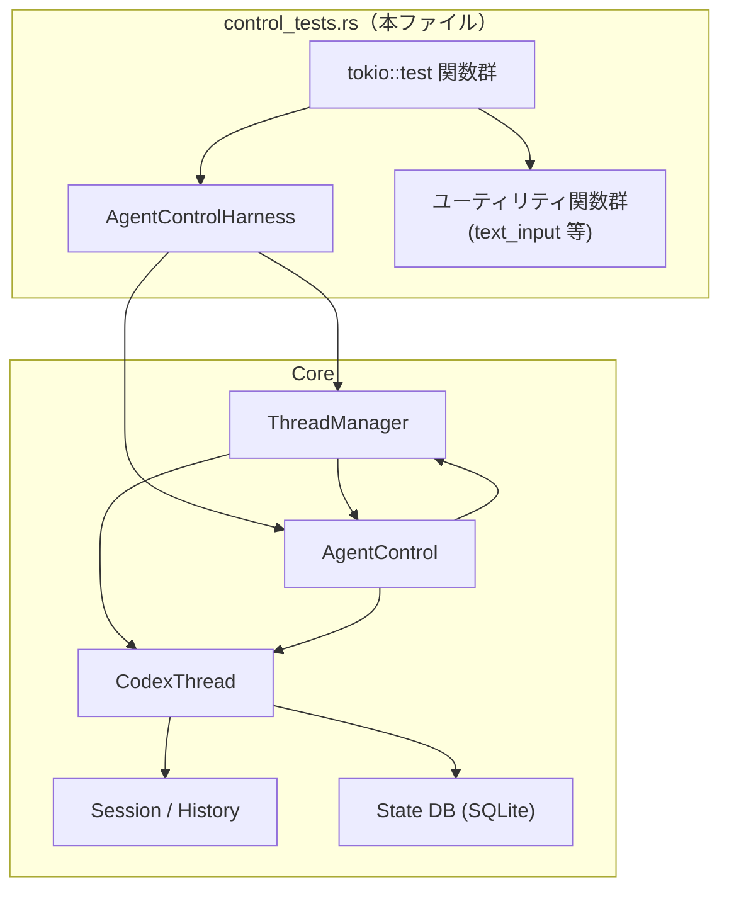
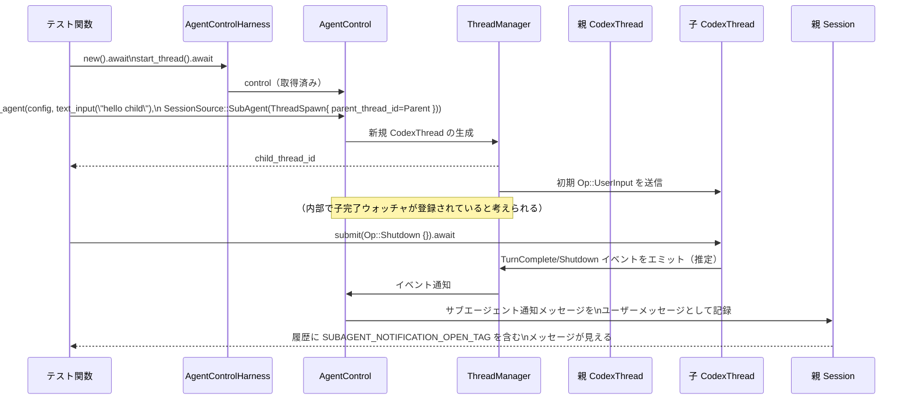
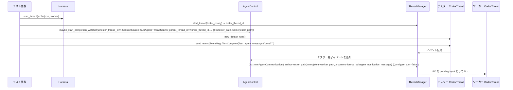

# core/src/agent/control_tests.rs コード解説

## 0. ざっくり一言

`core/src/agent/control_tests.rs` は、`AgentControl` と `ThreadManager` を中心とした **エージェント制御レイヤの振る舞いを統合的に検証するテストモジュール**です。  
スレッド生成・再開・終了、サブエージェントの親子関係、マルチエージェント完了通知、最大スレッド数の制限など、多数のシナリオが網羅されています。

> 注: 正確な行番号はこのインターフェースから取得できないため、本レポートでは関数名・テスト名を根拠として参照します。

---

## 1. このモジュールの役割

### 1.1 概要

このモジュールは次の問題を対象としたテストを提供します。

- **エージェント制御 API (`AgentControl`) の契約検証**  
  - マネージャ未設定時のエラー
  - 存在しないスレッド ID への操作
  - ステータス購読とイベントによる更新
- **スレッドの生成・フォーク・再開・終了**  
  - `spawn_agent` / `spawn_agent_with_metadata`
  - `resume_agent_from_rollout`
  - `shutdown_live_agent` / `shutdown_agent_tree` / `close_agent`
- **マルチエージェント・サブエージェント機能**  
  - 親スレッドへの完了通知（テキスト通知 / InterAgentCommunication）
  - `MultiAgentV2` 機能フラグ有効時の特別なルーティング
  - エージェントのニックネーム・ロールの付与と永続化
- **リソースガード（最大スレッド数）の検証**  
  - `agents.max_threads` によるスロット制限とその解放

このファイル自身は公開 API を定義していませんが、**テストを通じて `AgentControl` などの外部 API の期待される振る舞い（契約）を明らかにしている**点が特徴です。

### 1.2 アーキテクチャ内での位置づけ

このモジュールはテストコードであり、本体実装（例: `AgentControl`, `ThreadManager`, `CodexThread` 等）を間接的に利用します。主な依存関係を概念的に示すと次のようになります。



- テスト関数は `AgentControlHarness` を介して `ThreadManager` と `AgentControl` を取得します。
- `CodexThread` の `session` や `state_db` を直接叩くことで、履歴・メタデータの永続化結果も検証しています。
- `Feature::MultiAgentV2` や `Feature::Sqlite` による機能フラグ切替もテスト対象です。

### 1.3 設計上のポイント

コードから読み取れる設計上の特徴は次のとおりです。

- **非同期・並行性**
  - すべてのテストは `#[tokio::test]` の async 関数です。
  - 長時間待機する可能性のある処理には `tokio::time::timeout` と短い `sleep` を組み合わせ、**待ち合わせの上限を明示**しています（例: 通知到着待ちで 2〜5 秒のタイムアウト）。
- **エラーハンドリングの一貫性**
  - マネージャが無い `AgentControl::default()` に対する操作は `"unsupported operation: thread manager dropped"` というエラー文字列になることをテストしています。
  - スレッド未登録時には `CodexErr::ThreadNotFound(ThreadId)` を返すことを `assert_matches!` で確認しています。
  - スレッド数制限に達した場合には `CodexErr::AgentLimitReached { max_threads }` が返されることを確認しています。
- **状態管理と永続化**
  - スレッド履歴は `CodexThread.codex.session` を通じて操作され、`ensure_rollout_materialized` → `flush_rollout` によってローカルストレージへ永続化される前提でテストされています。
  - SQLite (`Feature::Sqlite`) 有効時には、スレッドごとのメタデータ（ニックネーム・ロール・rollout パス）が `state_db` に記録され、それを用いて再開 (`resume_agent_from_rollout`) が行われることが確認されています。
- **ツリー構造の子孫管理**
  - サブエージェントは `SessionSource::SubAgent(SubAgentSource::ThreadSpawn { parent_thread_id, depth, ... })` によって親子関係が表現されます。
  - `ThreadManager::list_agent_subtree_thread_ids` と `shutdown_agent_tree` を使って、**親から子孫をたどるツリー操作**が行われる前提でテストされています。
- **マルチエージェント完了通知**
  - MultiAgentV2 では、子スレッドの `TurnComplete` イベントから親スレッドへの `InterAgentCommunication` やサブエージェント通知メッセージが生成されること、親が既に死んでいる場合には無視されることがテストされています。

---

## 2. 主要な機能一覧（このテストモジュールが検証する機能）

このモジュール内のテストは、おおむね次の機能群を検証しています。

- **構成とハーネス**
  - 一時ディレクトリと `ConfigBuilder` を用いたテスト用設定の構築
  - `AgentControlHarness` による `ThreadManager` と `AgentControl` のセットアップ・スレッド開始

- **エージェントの基本操作**
  - `AgentControl::send_input` によるユーザー入力送信
  - `AgentControl::append_message` によるアシスタントメッセージの履歴追加
  - `AgentControl::send_inter_agent_communication` によるエージェント間通信のキューイング
  - `AgentControl::get_status` と `subscribe_status` によるステータス取得・購読

- **イベントからステータスへの変換**
  - `agent_status_from_event` が `EventMsg::{TurnStarted, TurnComplete, Error, TurnAborted, ShutdownComplete}` を `AgentStatus` にマップするロジック

- **エージェント生成 / フォーク / 再開**
  - `spawn_agent` / `spawn_agent_with_metadata` によるスレッド生成
  - 親スレッド履歴からのフォーク（`FullHistory` と `LastNTurns` モード）
  - ロール／ニックネーム付きサブエージェント生成と `AgentRoleConfig` による候補ニックネームの利用
  - `resume_agent_from_rollout` によるロールアウトファイルからのスレッド再開（通常・アーカイブ済み両方）

- **最大スレッド数制限**
  - `agents.max_threads` 設定によるスレッド総数の制御
  - スレッド終了・再開失敗時にスロットが正しく解放されること
  - `AgentControl` のクローン間で制限が共有されること

- **サブエージェント完了通知（ツリー / MultiAgentV2）**
  - 子スレッドの完了時に親スレッドの履歴へ通知が追加されること
  - `MultiAgentV2` 有効時に直接の親へだけ `InterAgentCommunication` がキューされること
  - 親が死んでいる場合に通知を無視すること
  - 子スレッドが存在しない場合にも `"status":"not_found"` を含む通知が親に書かれること

- **スレッドツリー操作と再開**
  - `ThreadManager::list_agent_subtree_thread_ids` によるサブツリーの走査（匿名・クローズ済み子孫を含む）
  - `shutdown_agent_tree` による木全体のシャットダウン
  - `resume_agent_from_rollout` による
    - 親のみ再開（閉じた子孫は再開しない）
    - 閉じた子を再開したとき開いた孫も再開される
    - マネージャの `shutdown_all_threads_bounded` 後にツリー全体を再開
    - descendant 側の metadata が stale な場合でも edge 情報から正しい親・深さを復元
    - 親の再開に失敗した子孫はスキップされる

---

## 3. 公開 API と詳細解説

このファイル自身は公開 API を定義しませんが、テストから **外部 API の期待される契約** が明確になっています。ここではそれらを中心に解説します。

### 3.1 型一覧（構造体・列挙体など）

#### このファイル内で定義される主な型

| 名前 | 種別 | 役割 / 用途 | 根拠 |
|------|------|-------------|------|
| `AgentControlHarness` | 構造体 | テスト用に `TempDir`・`Config`・`ThreadManager`・`AgentControl` をまとめるハーネス。スレッド開始やコントロール取得を簡略化。 | `AgentControlHarness` 定義と `AgentControlHarness::new`, `start_thread` の実装より |

#### テスト対象となる主な外部型（抜粋）

| 名前 | 種別 | 役割 / 用途 | 根拠 |
|------|------|-------------|------|
| `AgentControl` | 構造体（推測） | エージェントスレッドに対する高レベル操作 API。入力送信・スレッド生成／再開／終了・ステータス購読・完了ウォッチャ起動など。 | `manager.agent_control()`, `AgentControl::default()`, 各テストでのメソッド呼び出し |
| `ThreadManager` | 構造体 | スレッド (`CodexThread`) の生成・管理・シャットダウン・ツリー列挙を行う。 | `ThreadManager::with_models_provider_and_home_for_tests`, `start_thread`, `shutdown_all_threads_bounded`, `list_agent_subtree_thread_ids` の利用 |
| `CodexThread` | 構造体 | 個々のエージェントスレッドを表す。`submit(Op)` で操作を送信し、`codex.session` で会話履歴を管理。`state_db`, `rollout_path` も提供。 | `start_thread` 戻り値、`thread.submit`, `thread.codex.session`, `thread.state_db()` の利用 |
| `AgentStatus` | 列挙体 | エージェントの状態（`PendingInit`, `Running`, `Completed`, `Errored`, `Interrupted`, `Shutdown`, `NotFound` 等）を表す。 | `get_status...` 系テストおよび `agent_status_from_event` の期待値 |
| `CodexErr` | 列挙体 | コントロール API のエラー。`ThreadNotFound(ThreadId)` や `AgentLimitReached { max_threads }` など。 | `assert_matches!(err, CodexErr::ThreadNotFound(..))`, `CodexErr::AgentLimitReached{..}` |
| `ThreadId` | 構造体 | スレッドを一意に識別する ID。`ThreadId::new()` で生成し、`ToString` 実装あり。 | `ThreadId::new()`, `sort_by_key(ToString::to_string)` |
| `SessionSource` | 列挙体 | セッションの起源を表す。`Exec` や `SubAgent(SubAgentSource::ThreadSpawn { .. })` を使用。 | `resume_agent_from_rollout(..., SessionSource::Exec)`, 多数の `SessionSource::SubAgent(...)` |
| `SubAgentSource::ThreadSpawn` | 列挙体のバリアント | 親スレッドから spawn されたサブエージェントのメタデータ（`parent_thread_id`, `depth`, `agent_path`, `agent_nickname`, `agent_role`）を保持。 | ほぼすべてのサブエージェント関連テスト |
| `InterAgentCommunication` | 構造体 | エージェント間のメッセージ（author, recipient, other_recipients, content, trigger_turn）を JSON 文字列としてやり取りする。 | `InterAgentCommunication::new`, `to_response_input_item`, `history_contains_assistant_inter_agent_communication` |
| `Op` | 列挙体（推測） | スレッドへ送信される操作。`UserInput`, `InterAgentCommunication`, `Shutdown` など。 | `Op::UserInput { .. }`, `Op::InterAgentCommunication { .. }`, `matches!(op, Op::Shutdown)` |
| `SpawnAgentOptions` | 構造体 | `spawn_agent_with_metadata` 用の追加オプション。`fork_parent_spawn_call_id`, `fork_mode` など。 | `SpawnAgentOptions { fork_parent_spawn_call_id: ..., fork_mode: ... }` |
| `SpawnAgentForkMode` | 列挙体 | 親履歴フォーク方法。`FullHistory`, `LastNTurns(u32)`。 | `SpawnAgentForkMode::FullHistory`, `SpawnAgentForkMode::LastNTurns(2)` |
| `Feature` | 列挙体 | 機能フラグ。`Feature::MultiAgentV2`, `Feature::Sqlite` など。 | `config.features.enable(Feature::MultiAgentV2)`, `enable(Feature::Sqlite)` |
| `AgentRoleConfig` | 構造体 | ロールごとの説明・コンフィグ・ニックネーム候補を保持。 | `harness.config.agent_roles.insert(... AgentRoleConfig { nickname_candidates: Some(vec!["Atlas"]) })` |

> これら外部型の正確な定義は別ファイルにありますが、このテストモジュールから少なくとも上記の役割が読み取れます。

---

### 3.2 関数詳細（重要な API 契約）

ここでは、このテストから読み取れる **外部 API の振る舞い** を中心に、最大 7 件を詳述します。  
明示されていない内部実装については「推測」ではなく「テストから読み取れること」のみに限定します。

#### 1. `AgentControl::send_input(thread_id, op: Op) -> Result<SubmissionId, CodexErr>`

※ 正確なシグネチャはこのファイルからは分かりませんが、テストでは「ユーザー入力用の `Op::UserInput` を生成して送るメソッド」として扱われています。

**概要**

- 指定したスレッドに対し、ユーザー入力 (`UserInput`) を送信します。
- 正常時にはサブミッション ID（非空文字列）を返し、`ThreadManager` に `Op::UserInput` が記録されます。
- マネージャ未設定・スレッド未登録などのエラー条件を明示的に返します。

**引数**（テストから分かる範囲）

| 引数名 | 型 | 説明 |
|--------|----|------|
| `thread_id` | `ThreadId` | 入力を送る対象スレッドの ID。 |
| `op` | `Op` または `Op` に変換可能な型 | テストでは `Vec<UserInput>` を `.into()` して渡しており、最終的に `Op::UserInput { items, ... }` が生成されます。 |

**戻り値**

- 成功時: `Ok(submission_id)`  
  - テストでは `String` 相当として扱われており、`!submission_id.is_empty()` で検証されています。
- 失敗時: `Err(CodexErr)`  
  - マネージャ未設定: エラー文字列 `"unsupported operation: thread manager dropped"`（`send_input_errors_when_manager_dropped` より）
  - スレッド未登録: `CodexErr::ThreadNotFound(thread_id)` （`send_input_errors_when_thread_missing` より）

**内部処理の流れ（テストから読み取れる範囲）**

1. **マネージャが存在するかチェック**
   - `AgentControl::default()` のようにマネージャが関連付いていない場合、即座に `Err(...)` を返します（共通エラーメッセージ）。
2. **`thread_id` が有効かチェック**
   - `ThreadManager` からスレッドを取得できない場合は `CodexErr::ThreadNotFound(thread_id)` を返します。
3. **`Op::UserInput` を生成して送信**
   - テストでは `text_input("...")` を `.into()` して渡すと、`captured_ops()` に

     ```rust
     (thread_id, Op::UserInput {
         items: vec![UserInput::Text { text: "...".to_string(), text_elements: Vec::new() }],
         final_output_json_schema: None,
         responsesapi_client_metadata: None,
     })
     ```

     が記録されています（`send_input_submits_user_message`）。
4. **サブミッション ID を返す**
   - 送信が成功すると非空の ID を返します（具体的生成方法は不明）。

**Examples（使用例）**

テストを簡略化した例です。

```rust
// スレッドを開始し、AgentControl を取得する
let harness = AgentControlHarness::new().await;           // テスト用ハーネス
let (thread_id, _thread) = harness.start_thread().await;  // 新規スレッド開始

// ユーザー入力を送る
let submission_id = harness
    .control
    .send_input(
        thread_id,
        vec![UserInput::Text {                        // ユーザー入力 1 件
            text: "hello from tests".to_string(),
            text_elements: Vec::new(),
        }]
        .into(),                                      // Op に変換
    )
    .await
    .expect("send_input should succeed");

// 送信された Op が ThreadManager に記録されていることを検証
let expected = (
    thread_id,
    Op::UserInput {
        items: vec![UserInput::Text {
            text: "hello from tests".to_string(),
            text_elements: Vec::new(),
        }],
        final_output_json_schema: None,
        responsesapi_client_metadata: None,
    },
);
let captured = harness
    .manager
    .captured_ops()
    .into_iter()
    .find(|entry| *entry == expected);
assert_eq!(captured, Some(expected));
```

**Errors / Panics**

- マネージャ未設定（`AgentControl::default()` の場合）:
  - `Err` の `to_string()` が `"unsupported operation: thread manager dropped"` になることがテストされています。
- 存在しない `thread_id`:
  - `Err(CodexErr::ThreadNotFound(thread_id))`。
- パニック条件はこのファイルからは読み取れません。

**Edge cases（エッジケース）**

- **マネージャ未設定**: 上記の通り、例外ではなく `Err` が返るため、呼び出し側でハンドリングが必要です。
- **スレッド終了済み / クローズ済み**: このファイルでは明示的なテストはありません。実装側で `ThreadNotFound` と同様に扱われている可能性がありますが、断定はできません。
- **空入力**: `Vec<UserInput>` が空の場合の挙動はテストされていません。

**使用上の注意点**

- `AgentControl` は必ず `ThreadManager::agent_control()` から取得されたものを使う必要があります。`AgentControl::default()` はテスト用にのみ使われており、実運用ではエラーになります。
- `ThreadId` が有効であることを呼び出し前に確認するか、`CodexErr::ThreadNotFound` を正しく処理する前提で使う必要があります。
- このメソッドは非同期であり、内部でスレッドとの通信を行うため、await の呼び出し元も async コンテキストである必要があります。

---

#### 2. `AgentControl::spawn_agent(config, input_op, session_source) -> Result<ThreadId, CodexErr>`

および `spawn_agent_with_metadata(config, input_op, session_source, options)`

**概要**

- 新しいエージェントスレッドを生成し、初期入力 (`Op::UserInput`) を送信します。
- `SessionSource::SubAgent` を指定することで、親スレッドからのサブエージェントとして生成できます。
- `SpawnAgentOptions::fork_mode` によって、親スレッド履歴から子スレッドの初期履歴をフォークする機能があります。
- `agents.max_threads` 設定によるスレッド数制限がかかります。

**引数**

| 引数名 | 型 | 説明 |
|--------|----|------|
| `config` | `Config` | スレッド用設定。モデルプロバイダや機能フラグ、ニックネーム候補などを含む。 |
| `input_op` | `Op` または `Op` に変換可能な値 | 初期入力。テストでは `text_input("...")` で `UserInput::Text` を包んだ `Op` を渡しています。 |
| `session_source` | `Option<SessionSource>` | セッションの起源。`None` は通常スレッド、`Some(SessionSource::SubAgent(...))` はサブエージェント。 |
| `options` | `SpawnAgentOptions`（`spawn_agent_with_metadata` のみ） | 履歴フォークなどの追加オプション。`fork_parent_spawn_call_id`, `fork_mode` を含む。 |

**戻り値**

- `spawn_agent`:
  - 成功時: `Ok(thread_id: ThreadId)`
  - 失敗時: `Err(CodexErr)`
- `spawn_agent_with_metadata`:
  - 成功時: `Ok(struct { thread_id: ThreadId, .. })` のような構造体（`.thread_id` フィールドがテストで使われています）。
  - 失敗時: `Err(CodexErr)`

**内部処理の流れ（テストから読み取れる範囲）**

1. **マネージャ存在チェック**
   - `AgentControl::default()` から呼び出した場合は `Err("unsupported operation: thread manager dropped")` になります（`spawn_agent_errors_when_manager_dropped`）。
2. **最大スレッド数制限 `agents.max_threads` のチェック**
   - `Config` の CLI オーバーライド `agents.max_threads`（例: 1）を超えて新規スレッドを生成しようとすると `CodexErr::AgentLimitReached { max_threads }` を返します（`spawn_agent_respects_max_threads_limit`）。
   - 制限は `AgentControl` のクローン間で共有されます（`spawn_agent_limit_shared_across_clones`）。
   - スレッド終了 (`shutdown_live_agent`) によりスロットが解放され、再び `spawn_agent` に成功することが確認されています（`spawn_agent_releases_slot_after_shutdown`）。
3. **スレッド生成**
   - 正常時には `ThreadManager` によって新規 `CodexThread` が作られます。
   - 生成後、`ThreadManager::get_thread(thread_id)` で取得可能であることがテストされています（`spawn_agent_creates_thread_and_sends_prompt`）。
4. **初期入力の送信**
   - 生成直後に `Op::UserInput { items: .. }` が `ThreadManager` に渡されます。  
     `captured_ops()` から `(thread_id, Op::UserInput { .. })` が確認されています。
5. **フォークモードの処理（`spawn_agent_with_metadata`）**
   - `SpawnAgentForkMode::FullHistory`:
     - 親スレッドの履歴のうち、**ユーザーメッセージとアシスタントの FinalAnswer のみ** を子スレッドにコピーします。
     - Commentary フェーズや Reasoning、`spawn_agent` 関数コール、InterAgentCommunication などは除外されます（`spawn_agent_can_fork_parent_thread_history_with_sanitized_items`）。
     - 親に未フラッシュの FinalAnswer があっても、子生成時に親ロールアウトを強制フラッシュしてから履歴を読み込むため、子履歴に含まれます（`spawn_agent_fork_flushes_parent_rollout_before_loading_history`）。
   - `SpawnAgentForkMode::LastNTurns(n)`:
     - 親の最後の `n` ターン相当のコンテキストを残し、それ以前の履歴をドロップします。
     - さらに、アシスタントの InterAgentCommunication など、特定の種類のメッセージは、たとえ `n` ターン内でもフィルタリングされます（`spawn_agent_fork_last_n_turns_keeps_only_recent_turns`）。

6. **サブエージェントのメタデータ設定**
   - `SessionSource::SubAgent(SubAgentSource::ThreadSpawn { ... })` を渡すと、子スレッドの `config_snapshot().await.session_source` にその情報が反映されます。
   - `agent_nickname` が `None` の場合:
     - `AgentRoleConfig.nickname_candidates` があれば、そこからニックネームが選ばれます（例: `"researcher"` ロールに `"Atlas"` をセットした場合、子には `Some("Atlas")` が設定される）。
     - 候補がない場合でも、何らかのランダムなニックネームが付与されることが `spawn_thread_subagent_gets_random_nickname_in_session_source` から分かります。
   - `agent_role` は指定されたロール文字列（例: `"explorer"`, `"worker"`, `"reviewer"`）が保持されます。

**Examples（使用例）**

単純なエージェント生成:

```rust
let harness = AgentControlHarness::new().await;

// 通常エージェントを生成
let agent_id = harness
    .control
    .spawn_agent(
        harness.config.clone(),
        text_input("hello"),             // UserInput::Text を Op に包むヘルパ
        None,                           // SessionSource なし（通常実行）
    )
    .await
    .expect("spawn_agent should succeed");

// スレッドが ThreadManager に登録されていることを確認
let _thread = harness
    .manager
    .get_thread(agent_id)
    .await
    .expect("thread should be registered");
```

親履歴をフォークしてサブエージェントを生成:

```rust
let harness = AgentControlHarness::new().await;
let (parent_thread_id, parent_thread) = harness.start_thread().await;

// 親にコンテキストと final answer を記録し、spawn_agent 呼び出しを記録
// （詳細は実際のテスト `spawn_agent_can_fork_parent_thread_history_with_sanitized_items` を参照）

let child_thread_id = harness
    .control
    .spawn_agent_with_metadata(
        harness.config.clone(),
        text_input("child task"),
        Some(SessionSource::SubAgent(SubAgentSource::ThreadSpawn {
            parent_thread_id,
            depth: 1,
            agent_path: None,
            agent_nickname: None,
            agent_role: Some("explorer".to_string()),
        })),
        SpawnAgentOptions {
            fork_parent_spawn_call_id: Some("spawn-call-history".to_string()),
            fork_mode: Some(SpawnAgentForkMode::FullHistory),
        },
    )
    .await
    .expect("forked spawn should succeed")
    .thread_id;

// 子履歴が「親のユーザーメッセージ」と「アシスタントの FinalAnswer」のみを含むことを確認
let child_thread = harness.manager.get_thread(child_thread_id).await.unwrap();
let history = child_thread.codex.session.clone_history().await;
// ...（期待履歴との比較）
```

**Errors / Panics**

- マネージャ未設定時: `"unsupported operation: thread manager dropped"`。
- スレッド数超過時: `CodexErr::AgentLimitReached { max_threads }`。
- 未確認のロールアウトパスやその他 IO エラーについては、このファイルからは詳細不明です。

**Edge cases**

- `agents.max_threads` が 0 または負値のときの挙動はテストされていません。
- フォーク対象の `fork_parent_spawn_call_id` が存在しない場合の挙動はこのチャンクには現れません。
- `SpawnAgentForkMode::LastNTurns(0)` のような境界値はテストされていません。

**使用上の注意点**

- スレッド数制限は **`AgentControl` のインスタンス間で共有**されるため、複数のコントロールを持つ場合でも合計スレッド数が上限を超えないように設計されています。
- 親履歴フォークは、「どの `spawn_agent` 呼び出しに紐づく履歴をフォークするか」を `fork_parent_spawn_call_id` で特定する前提なので、この ID を一意に保つ必要があります。
- MultiAgent 環境では、`SessionSource::SubAgent` の `parent_thread_id` や `depth` がツリー構造の再構築に使われるため、誤った値を渡すと再開時に意図しない挙動になる可能性があります（ただし、テストでは edge 情報で補正されるケースも確認されています）。

---

#### 3. `AgentControl::resume_agent_from_rollout(config, thread_id, session_source) -> Result<ThreadId, CodexErr>`

**概要**

- 過去に停止したスレッドを **ロールアウトファイル（会話履歴のスナップショット）から再開**します。
- 単独スレッドだけでなく、ツリー全体の再開を行うロジックも含むことがテストから読み取れます。
- SQLite のメタデータやアーカイブされたロールアウトパスも参照します。

**引数**

| 引数名 | 型 | 説明 |
|--------|----|------|
| `config` | `Config` | 再開時に用いる設定。元の設定と同等であることが期待されます。 |
| `thread_id` | `ThreadId` | 再開したい対象スレッドの ID。 |
| `session_source` | `SessionSource` | 再開元（例: `SessionSource::Exec`, `SessionSource::SubAgent(ThreadSpawn { .. })`）。不足しているニックネーム等は state_db から補完される場合があります。 |

**戻り値**

- 成功時: `Ok(thread_id)`（再開後も ID は変わらないことがテストされています）。
- 失敗時: `Err(CodexErr)`（エラー種別は複数あり）。

**内部処理の流れ（テストから読み取れる範囲）**

1. **マネージャ存在・スレッド数制限チェック**
   - `AgentControl::default()` の場合は `"unsupported operation: thread manager dropped"` エラー。
   - `agents.max_threads` 制限に達している場合は `CodexErr::AgentLimitReached` を返し、再開は行いません（`resume_agent_respects_max_threads_limit`）。
   - 再開失敗時（例: ロールアウト無し）はスロットが解放され、後続の `spawn_agent` が成功することが `resume_agent_releases_slot_after_resume_failure` で確認されています。
2. **ロールアウトパスの解決**
   - `CodexThread.rollout_path()` で取得したパスが存在しない場合、state_db に保存された `archived_rollout_path`（`mark_archived` による）を用いてアーカイブから読み込むロジックがあります（`resume_agent_from_rollout_reads_archived_rollout_path`）。
3. **state_db メタデータの読み込み**
   - SQLite が有効 (`Feature::Sqlite`) な場合、`state_db.get_thread(thread_id)` からスレッドメタデータ（ニックネーム・ロール・source JSON など）を取得します。
   - `SessionSource::SubAgent` の再開時には、渡された `session_source` に不足している `agent_nickname` や `agent_role` を state_db の値で補完します（`resume_thread_subagent_restores_stored_nickname_and_role`）。
4. **ツリー再開ロジック**
   - 親スレッドを再開した際に、**「開いていた子孫のみ」** を再開するロジックと、「親が閉じた子を再開したとき、その下の開いた孫も再開する」ロジックがテストされています。
   - `shutdown_all_threads_bounded` 後の再開では、親・子・孫すべてが再度 `NotFound` でない状態になることから、state_db のツリー情報を使って再開対象を決定していることが分かります。
   - 子スレッドの metadata `source` が stale（親 ID や depth が誤っている）でも、edge 情報から正しい `parent_thread_id` と `depth` を復元して再開していることが `resume_agent_from_rollout_uses_edge_data_when_descendant_metadata_source_is_stale` から分かります。
   - 親の再開に失敗した場合、その子孫はスキップされる（再開されない）ことが `resume_agent_from_rollout_skips_descendants_when_parent_resume_fails` で確認されています。

**Examples（使用例）**

単一スレッドの再開:

```rust
let harness = AgentControlHarness::new().await;

// 子スレッドを生成し、ある程度履歴を蓄積してから永続化
let child_thread_id = harness
    .control
    .spawn_agent(
        harness.config.clone(),
        text_input("hello"),
        None,
    )
    .await
    .expect("child spawn should succeed");
let child_thread = harness.manager.get_thread(child_thread_id).await.unwrap();
persist_thread_for_tree_resume(&child_thread, "persist before archiving").await;

// スレッドを停止
harness
    .control
    .shutdown_live_agent(child_thread_id)
    .await
    .expect("child shutdown should succeed");

// 再開
let resumed_thread_id = harness
    .control
    .resume_agent_from_rollout(harness.config.clone(), child_thread_id, SessionSource::Exec)
    .await
    .expect("resume should succeed");
assert_eq!(resumed_thread_id, child_thread_id);
```

サブエージェントのニックネーム／ロールを復元して再開:

```rust
// SQLite 有効な設定でハーネスを構築済みとする
let (parent_thread_id, _parent_thread) = harness.start_thread().await;
let agent_path = AgentPath::from_string("/root/explorer".to_string()).unwrap();

// 初回 spawn（ニックネームは自動で付与される）
let child_thread_id = harness
    .control
    .spawn_agent(
        harness.config.clone(),
        text_input("hello child"),
        Some(SessionSource::SubAgent(SubAgentSource::ThreadSpawn {
            parent_thread_id,
            depth: 1,
            agent_path: Some(agent_path.clone()),
            agent_nickname: None,
            agent_role: Some("explorer".to_string()),
        })),
    )
    .await
    .expect("child spawn should succeed");

// ... 状態保存・停止処理 ...

// 再開時、agent_nickname と agent_role は None で渡す
let resumed_thread_id = harness
    .control
    .resume_agent_from_rollout(
        harness.config.clone(),
        child_thread_id,
        SessionSource::SubAgent(SubAgentSource::ThreadSpawn {
            parent_thread_id,
            depth: 1,
            agent_path: Some(agent_path.clone()),
            agent_nickname: None,
            agent_role: None,
        }),
    )
    .await
    .expect("resume should succeed");
```

**Errors / Panics**

- ロールアウトファイルが存在しない場合（例: 手動削除）:
  - 該当スレッドの再開は失敗しますが、親や兄弟の再開には影響しないようスキップされます。
- state_db アクセスに失敗した場合の挙動はこのチャンクからは分かりません。
- パニック条件は明示されていません。

**Edge cases**

- **アーカイブ済みロールアウト**: ロールアウトファイルが通常のパスから別ディレクトリに移動されていても、state_db にアーカイブパスが記録されていれば再開可能です。
- **stale metadata**: descendant の `source` JSON が stale であっても、edge 情報が正しければ再開時に正しい親と深さに修正されます。
- **ツリー一部のみの復元**: 親の再開に失敗したサブツリーは自動再開されず、`AgentStatus::NotFound` のままになります。

**使用上の注意点**

- 再開対象の `Config` は、元のスレッド生成時の設定と互換である必要があります。特にモデルプロバイダや機能フラグの差異は予期せぬ挙動を引き起こす可能性があります。
- `SessionSource` に不完全な情報（ニックネームなし等）を渡しても state_db が補完しますが、**元のメタデータがない場合は補完できません**。
- ロールアウトファイルやアーカイブディレクトリを外部から操作する場合は、state_db の `archived` 状態と整合が取れている必要があります。

---

#### 4. `AgentControl::shutdown_agent_tree(root_thread_id) -> Result<(), CodexErr>`

**概要**

- 指定したスレッド ID を根とする **エージェントツリー全体をシャットダウン** します。
- 親・子・孫など全てのライブスレッドに対して `Op::Shutdown` を送信し、終了後は `AgentStatus::NotFound` になることがテストされています。

**引数**

| 引数名 | 型 | 説明 |
|--------|----|------|
| `root_thread_id` | `ThreadId` | シャットダウン対象ツリーの根となるスレッド ID。 |

**戻り値**

- 成功時: `Ok(())`
- 失敗時: `Err(CodexErr)`（詳細はこのファイルからは分かりません）

**内部処理の流れ（テストから読み取れる範囲）**

1. **サブツリーの列挙**
   - `ThreadManager::list_agent_subtree_thread_ids(root_thread_id)` で、根を含むサブツリーの全スレッド ID を取得していると考えられます。
2. **各スレッドへの Shutdown 送信**
   - 列挙された各スレッドに対し `Op::Shutdown` を送信します。
   - `shutdown_agent_tree_closes_live_descendants` では、`captured_ops()` から `Op::Shutdown` が親・子・孫すべてに対して記録されていることを確認しています。
3. **ステータスの NotFound 化**
   - シャットダウン完了後、`AgentControl::get_status(thread_id)` が三者すべて `AgentStatus::NotFound` を返すことがテストされています。
4. **子から開始した場合の挙動**
   - 子スレッドを `close_agent` で閉じたあとでも、親側から `shutdown_agent_tree(parent_thread_id)` を呼ぶと、閉じていた子とその孫も含めて `Op::Shutdown` が送信されます（`shutdown_agent_tree_closes_descendants_when_started_at_child`）。

**Edge cases**

- root 自体が既に `NotFound` の場合の挙動はこのチャンクには現れません。
- 部分的にロールアウトが存在しないなどの異常系は、後述の再開テストで扱われていますが、シャットダウン側の挙動は不明です。

**使用上の注意点**

- `shutdown_agent_tree` はツリー全体に影響するため、意図せず他の作業中の子孫スレッドを巻き込まないよう、呼び出し箇所は限定する必要があります。
- `close_agent` と組み合わせる場合、**閉じた子もシャットダウン対象に含まれる**ことを前提に設計する必要があります。

---

#### 5. `AgentControl::maybe_start_completion_watcher(child_thread_id, session_source, child_label, child_agent_path)`

**概要**

- 子スレッドの完了イベント（`TurnComplete` など）を監視し、必要に応じて親スレッドに通知を行うウォッチャを起動します。
- MultiAgentV2 有効時には、直接の親への `InterAgentCommunication` 送信やサブエージェント通知の生成が行われます。

**引数**（テストから読み取れる範囲）

| 引数名 | 型 | 説明 |
|--------|----|------|
| `child_thread_id` | `ThreadId` | 監視対象とする子スレッドの ID。 |
| `session_source` | `Option<SessionSource>` | 子スレッドの起源情報。主に `SessionSource::SubAgent(SubAgentSource::ThreadSpawn { parent_thread_id, depth, agent_path, agent_role, .. })` が使われます。 |
| `child_label` | `String` | 子エージェントを識別するためのラベル（パス文字列や ThreadId の文字列表現など）。 |
| `child_agent_path` | `Option<AgentPath>` | 子エージェントの論理パス。親への `InterAgentCommunication` の author/recipient を構成するのに使われます。 |

**動作（テストから読み取れる範囲）**

- 子スレッドが存在しない場合:
  - 即座に親スレッドにサブエージェント通知メッセージを送ります。
  - 通知には `"agent_path":"<child_thread_id>"` と `"status":"not_found"` を含む JSON テキストが含まれることが `completion_watcher_notifies_parent_when_child_is_missing` で確認されています。
- MultiAgentV2 有効時の正常完了:
  - 子スレッドが `TurnComplete` イベントを発火すると、直接の親スレッド（`parent_thread_id`）宛てに `Op::InterAgentCommunication` がキューイングされます。
  - `communication` の内容は
    - `author`: 子エージェントのパス（例: `/root/worker_a/tester`）
    - `recipient`: 親エージェントのパス（例: `/root/worker_a`）
    - `content`: `session_prefix::format_subagent_notification_message` で生成されたテキスト（`AgentStatus::Completed(..)` を含む）
    - `trigger_turn`: `false`（ターンを開始しない）  
    であることが `multi_agent_v2_completion_queues_message_for_direct_parent` から分かります。
  - ルートスレッドには通知メッセージは送信されません。
- 親が既に死んでいる場合:
  - 子の完了時に親スレッドへの `InterAgentCommunication` は送信されません。
  - ルートスレッドへの通知も行われません（`multi_agent_v2_completion_ignores_dead_direct_parent`）。

**使用上の注意点**

- `maybe_start_completion_watcher` は子スレッドの `SessionSource::SubAgent` 情報を前提としているため、親 ID や depth が正しく設定されていることが重要です。
- 親が死んでいる場合にイベントを無視する設計になっているため、「必ず完了通知が届く」という前提でアプリケーションを設計しないほうが安全です。
- 子スレッドが存在しないケース（ID だけが渡された場合）は `"not_found"` として通知される仕様であり、この JSON 形式に依存してアプリケーション側でパースすることができます。

---

#### 6. `ThreadManager::list_agent_subtree_thread_ids(root_thread_id) -> Result<Vec<ThreadId>, CodexErr>`

**概要**

- 指定したスレッド ID を根とするサブツリーに含まれるすべてのスレッド ID を列挙します。
- 匿名スレッド（`agent_path: None`）やシャットダウン済みスレッドも含めて返すことがテストされています。

**動作（テストから読み取れる範囲）**

- `list_agent_subtree_thread_ids(worker_thread_id)` の結果には、以下が含まれます（`list_agent_subtree_thread_ids_includes_anonymous_and_closed_descendants`）。
  - 自身（`worker_thread_id`）
  - 子（`worker_child_thread_id`）
  - 匿名子（`no_path_child_thread_id`）
  - 匿名孫（`no_path_grandchild_thread_id`、shutdown済み）
- 他の兄弟スレッド（例: 同じ親を持つ reviewer スレッド）は含まれません。
- より深いノード（`no_path_child_thread_id`）を根にした場合は、その子孫のみが含まれます。

**使用上の注意点**

- shutdown 済みのスレッドも含めて返すため、「現時点でライブなスレッドのみが欲しい」場合には、別途ステータスチェックが必要です。
- 返される順序は保証されていない前提でテスト側でもソートして比較しているため、呼び出し側もソートが必要な場合があります。

---

#### 7. `agent_status_from_event(event: &EventMsg) -> Option<AgentStatus>`

**概要**

- Codex プロトコルのイベント (`EventMsg`) から、高レベルの `AgentStatus` を導出するヘルパー関数です。

**対応づけ（テストから読み取れる範囲）**

| EventMsg バリアント | 期待される `AgentStatus` |
|---------------------|--------------------------|
| `TurnStarted(TurnStartedEvent { .. })` | `Some(AgentStatus::Running)` |
| `TurnComplete(TurnCompleteEvent { last_agent_message: Some(msg), .. })` | `Some(AgentStatus::Completed(Some(msg)))` |
| `Error(ErrorEvent { message, .. })` | `Some(AgentStatus::Errored(message))` |
| `TurnAborted(TurnAbortedEvent { reason: TurnAbortReason::Interrupted, .. })` | `Some(AgentStatus::Interrupted)` |
| `ShutdownComplete` | `Some(AgentStatus::Shutdown)` |

その他のイベントバリアントに対する挙動はこのファイルからは分かりませんが、`Option` を返していることから「関連しないイベントには `None` を返す」設計の可能性があります。

**使用上の注意点**

- ステータス購読 (`subscribe_status`) の内部でもこの関数が使われていると考えられます。特に `Shutdown` への遷移は `TurnComplete`→`ShutdownComplete` の組み合わせで実現されている可能性があります。
- `TurnComplete` の `last_agent_message` が `None` の場合の挙動はテストされていません。

---

### 3.3 このファイル内のその他の関数

このファイルに定義されるテスト用ヘルパー関数の一覧です。

| 関数名 | 役割（1 行） |
|--------|--------------|
| `test_config_with_cli_overrides` | 一時ディレクトリと CLI オーバーライド付き `Config` を構築する async ヘルパー。 |
| `test_config` | CLI オーバーライドなしの標準テスト用 `Config` を構築する。 |
| `text_input` | 文字列から `Op::UserInput` 相当の値を作るヘルパー。 |
| `assistant_message` | テキストとオプションの `MessagePhase` から `ResponseItem::Message` を生成する。 |
| `spawn_agent_call` | `spawn_agent` 関数呼び出しを表す `ResponseItem::FunctionCall` を生成する。 |
| `AgentControlHarness::new` | `TempDir`・`Config`・`ThreadManager`・`AgentControl` をまとめたハーネスを構築する。 |
| `AgentControlHarness::start_thread` | `ThreadManager::start_thread` を呼び、新しい `CodexThread` を開始して ID と一緒に返す。 |
| `has_subagent_notification` | 履歴内のユーザーメッセージにサブエージェント通知タグが含まれているか判定する。 |
| `history_contains_text` | 履歴内のメッセージテキストに任意の文字列が含まれているか検索する。 |
| `history_contains_assistant_inter_agent_communication` | アシスタントメッセージ中に特定の `InterAgentCommunication` を表す JSON テキストが含まれているか判定する。 |
| `wait_for_subagent_notification` | 親スレッドの履歴に通知が現れるまでポーリングし、2 秒のタイムアウトを設定する。 |
| `persist_thread_for_tree_resume` | ユーザーメッセージを挿入しロールアウトを `flush` してツリー再開用に永続化する。 |
| `wait_for_live_thread_spawn_children` | `open_thread_spawn_children` をポーリングし、期待される子スレッド ID の集合と一致するまで待つ。 |

テスト関数（`#[tokio::test]`）は 40+ 個あり、ここでは名前から読み取れるシナリオ名の通りに動作を検証しています（エラー系・フォーク系・ツリー系など、前節で概略を説明した通りです）。

---

## 4. データフロー

代表的なシナリオとして、**サブエージェントの完了通知が親スレッドに届くフロー**（`spawn_child_completion_notifies_parent_history`）をシーケンス図で示します。



要点:

- サブエージェントは `SessionSource::SubAgent` に `parent_thread_id` を持つことで親子関係が決まります。
- 子スレッドの完了（ここでは `Op::Shutdown` を送信）は、内部で完了イベントを発火させ、`AgentControl` 側のウォッチャがそれを受けて親セッションに通知を書き込みます。
- テスト側は `wait_for_subagent_notification` を使い、親履歴に特定タグを含むメッセージが現れるまでポーリングします。

もう一つ、**MultiAgentV2 の直接親へのメッセージキューイング**（`multi_agent_v2_completion_queues_message_for_direct_parent`）の流れも整理すると、次のようになります。



ここでのポイント:

- `MultiAgentV2` 有効時には、子の完了は直接親（worker）のみに伝達されます。
- `trigger_turn` を `false` にすることで、親のターンを起動せずにメッセージをキューイングします。
- ルートスレッドにはこのメッセージは送信されません（テストで否定確認）。

---

## 5. 使い方（How to Use）

このファイルはテストコードですが、ここで使われているパターンは **`AgentControl` / `ThreadManager` の実務での利用方法の参考**になります。

### 5.1 基本的な使用方法

1. **設定とマネージャの準備**

```rust
// 設定の構築（本番では適切な ConfigBuilder を使用）
let (home, config) = test_config().await; // テストヘルパだが、パターンは同様

// ThreadManager を構築
let manager = ThreadManager::with_models_provider_and_home_for_tests(
    CodexAuth::from_api_key("dummy"),
    config.model_provider.clone(),
    config.codex_home.clone(),
    std::sync::Arc::new(codex_exec_server::EnvironmentManager::new(None)),
);

// エージェント制御ハンドルを取得
let control = manager.agent_control();
```

1. **スレッドの生成と入力送信**

```rust
// 新規スレッドを開始
let thread = manager
    .start_thread(config.clone())
    .await
    .expect("start thread");
let thread_id = thread.thread_id;

// ユーザー入力を送信
let submission_id = control
    .send_input(
        thread_id,
        vec![UserInput::Text {
            text: "hello".to_string(),
            text_elements: Vec::new(),
        }]
        .into(),
    )
    .await
    .expect("send_input should succeed");
```

1. **ステータスの取得と購読**

```rust
// 単発で状態を取得
let status = control.get_status(thread_id).await; // AgentStatus::PendingInit など

// ステータス変更の購読
let mut status_rx = control.subscribe_status(thread_id).await.unwrap();
assert_eq!(status_rx.borrow().clone(), AgentStatus::PendingInit);

// サブスレッド終了などによりステータスが変わるのを待つ
status_rx.changed().await.unwrap();
let new_status = status_rx.borrow().clone();
```

1. **スレッドの終了**

```rust
// 個別スレッドの終了
control
    .shutdown_live_agent(thread_id)
    .await
    .expect("shutdown agent");

// ツリー全体の終了
control
    .shutdown_agent_tree(root_thread_id)
    .await
    .expect("tree shutdown should succeed");
```

### 5.2 よくある使用パターン

- **サブエージェントの生成**

```rust
let (parent_thread_id, _parent_thread) = harness.start_thread().await;
let child_thread_id = harness
    .control
    .spawn_agent(
        harness.config.clone(),
        text_input("sub task"),
        Some(SessionSource::SubAgent(SubAgentSource::ThreadSpawn {
            parent_thread_id,
            depth: 1,
            agent_path: None,
            agent_nickname: None,
            agent_role: Some("explorer".to_string()),
        })),
    )
    .await
    .expect("child spawn should succeed");
```

- **親履歴からのフォーク付きサブエージェント**

```rust
let child_thread_id = control
    .spawn_agent_with_metadata(
        config.clone(),
        text_input("child task"),
        Some(SessionSource::SubAgent(SubAgentSource::ThreadSpawn { /* ... */ })),
        SpawnAgentOptions {
            fork_parent_spawn_call_id: Some("spawn-call-id".to_string()),
            fork_mode: Some(SpawnAgentForkMode::LastNTurns(2)),
        },
    )
    .await?
    .thread_id;
```

- **最大スレッド数制限の利用**

```rust
// agents.max_threads を 1 に設定した Config を使用
let agent1 = control.spawn_agent(config.clone(), text_input("hello"), None).await?;
let err = control
    .spawn_agent(config.clone(), text_input("hello again"), None)
    .await
    .expect_err("should respect max threads");

// エラーが AgentLimitReached であることを確認
if let CodexErr::AgentLimitReached { max_threads } = err {
    assert_eq!(max_threads, 1);
}
```

### 5.3 よくある間違い

```rust
// 間違い例: AgentControl::default() を使う（マネージャ未設定）
let control = AgentControl::default();
let result = control
    .send_input(ThreadId::new(), text_input("hello"))
    .await;
// result は Err("unsupported operation: thread manager dropped") になる

// 正しい例: ThreadManager から AgentControl を取得して使う
let manager = ThreadManager::with_models_provider_and_home_for_tests(/* ... */);
let control = manager.agent_control();
let (thread_id, _thread) = manager.start_thread(config.clone()).await?;
let submission_id = control
    .send_input(thread_id, text_input("hello"))
    .await?; // 正常に送信される
```

```rust
// 間違い例: 存在しない ThreadId に対して操作する
let thread_id = ThreadId::new(); // manager に登録していない
let err = control
    .send_input(thread_id, text_input("hello"))
    .await
    .expect_err("should fail for missing thread");

// 正しい例: start_thread / spawn_agent で取得した ID を使う
let t = manager.start_thread(config.clone()).await?;
let thread_id = t.thread_id;
control.send_input(thread_id, text_input("hello")).await?;
```

### 5.4 使用上の注意点（まとめ）

- **並行性**
  - すべての API は async であり、`tokio` ランタイム上で動作します。
  - ステータス通知や完了ウォッチャは **非同期で遅延して反映** されるため、テストでは `timeout` と短い `sleep` のループで「そのうち状態が変わる」前提のコードになっています。
- **リソース制限**
  - `agents.max_threads` によって総スレッド数が制限されるため、バックグラウンドでスレッドを溜め込みすぎない設計になっています。
  - 再開失敗時にもスロットが解放されることがテストされており、リソースリークを防ぐ意図が見られます。
- **ツリー構造**
  - サブエージェントはツリー構造で管理され、`shutdown_agent_tree` や `list_agent_subtree_thread_ids` などの API がこの前提に依存しています。
  - ルートだけでなく部分木（子から見たサブツリー）単位の操作も可能です。
- **安全性 / セキュリティ的観点**
  - このテストからは、**過剰なスレッド増加を防ぐガード** や、**死んだ親には完了メッセージを配送しない** といったロバストネス上の配慮が読み取れます。
  - 外部入力の直接パースやコマンド実行などはこのファイルには登場しないため、テストコード自体に明白なセキュリティ上の懸念は見当たりません。

---

## 6. 変更の仕方（How to Modify）

### 6.1 新しい機能を追加する場合（テスト観点）

- **新しい `AgentControl` メソッドを追加したい場合**
  1. 実装側（例: `core/src/agent/control.rs`）にメソッドを追加。
  2. このテストモジュールに対応する `#[tokio::test]` を追加し、必要であれば `AgentControlHarness` にヘルパーを足します。
  3. `ThreadManager::captured_ops()` や `CodexThread.codex.session` を使って、「内部でどの `Op` が送られるか」「履歴がどう変化するか」を検証に組み込みます。

- **MultiAgent 関連の新しい通知ルールを追加したい場合**
  1. `SessionSource::SubAgent` に新しいフィールドを加える場合は、既存テスト（親子関係・ニックネームなど）との整合性を確認します。
  2. 必要に応じて `maybe_start_completion_watcher` を経由するテストを追加し、親／ルートへの通知有無を明示的に検証します。

### 6.2 既存の機能を変更する場合

- **エラー契約の変更**
  - 例: `"unsupported operation: thread manager dropped"` の文言を変更する場合は、該当テスト（`send_input_errors_when_manager_dropped` など）の期待値を更新する必要があります。
  - `CodexErr` のバリアント構造を変える場合も、`assert_matches!` を使っているテストを追って修正します。

- **スレッドツリーの挙動変更**
  - `shutdown_agent_tree` や `list_agent_subtree_thread_ids` の挙動を変える場合は、以下のテストが影響を受けます。
    - `list_agent_subtree_thread_ids_includes_anonymous_and_closed_descendants`
    - `shutdown_agent_tree_closes_live_descendants`
    - `shutdown_agent_tree_closes_descendants_when_started_at_child`
    - 各種 `resume_agent_from_rollout_*` 系テスト
  - ツリー再開ロジックに手を入れる場合は、**stale metadata** や **archived ロールアウト** のケースも含めた回帰テストが必須です。

- **MultiAgent 完了通知の仕様変更**
  - 直接親だけでなくルートにも通知したい、など仕様変更を行う場合、以下のテストを確認しながら挙動を調整する必要があります。
    - `multi_agent_v2_completion_ignores_dead_direct_parent`
    - `multi_agent_v2_completion_queues_message_for_direct_parent`
    - `completion_watcher_notifies_parent_when_child_is_missing`
    - `spawn_child_completion_notifies_parent_history`

---

## 7. 関連ファイル

このモジュールと密接に関係すると思われるファイル・モジュール（use 句や型名から推測できる範囲）です。

| パス / モジュール | 役割 / 関係 |
|------------------|------------|
| `core/src/agent/control.rs`（推定） | `AgentControl` の本体実装。`send_input`, `spawn_agent`, `resume_agent_from_rollout`, `shutdown_agent_tree`, `maybe_start_completion_watcher` などが定義されていると考えられます。 |
| `core/src/agent/mod.rs`（推定） | `agent_status_from_event` や `AgentStatus` 定義の所在として参照されている可能性があります（実際には `use crate::agent::agent_status_from_event;`）。 |
| `core/src/config.rs` 付近 | `Config`, `ConfigBuilder`, `AgentRoleConfig` の定義と `features` フラグ管理。 |
| `codex_protocol` クレート | `EventMsg`, `Turn*Event`, `ErrorEvent`, `InterAgentCommunication`, `MessagePhase`, `ContentItem`, `ResponseItem` などのプロトコル型群。 |
| `codex_exec_server::EnvironmentManager` | 実行環境管理。テストでは `with_models_provider_and_home_for_tests` に渡されます。 |
| `core/src/session_prefix.rs` | `format_subagent_notification_message` を提供し、サブエージェント完了通知のメッセージ内容を構築。 |
| `state_db` 関連モジュール | `thread.state_db()` や `mark_archived`, `get_thread`, `upsert_thread` など、スレッドメタデータの永続化・取得を担当。 |
| `core/src/contextual_user_message.rs` | `SUBAGENT_NOTIFICATION_OPEN_TAG` の定義元。サブエージェント通知メッセージのフォーマットを決める。 |

このテストモジュールは、それらのコンポーネントに対する **高レベルの契約テスト** として機能しており、今後の変更時に「意図する振る舞いを保てているか」を検証する上で重要な役割を担っています。
