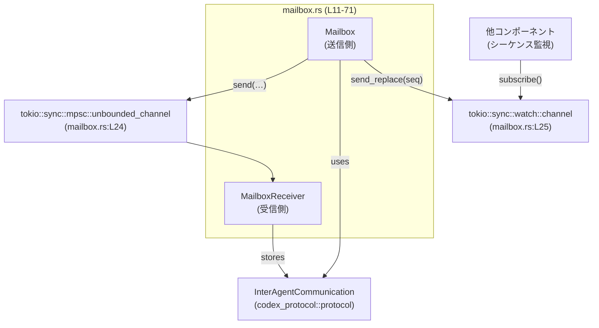
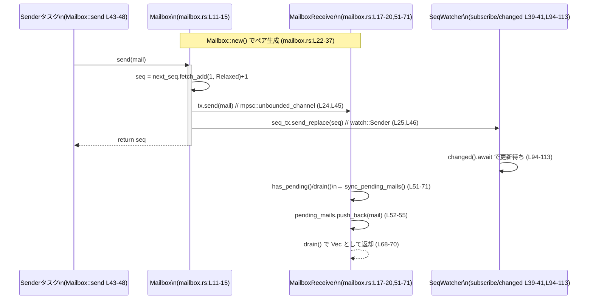

# core/src/agent/mailbox.rs

## 0. ざっくり一言

エージェント間メッセージ（`InterAgentCommunication`）を送受信するための **非同期メールボックス** と、そのメールボックスに届いたメッセージ群をキューとして扱う **受信側ラッパー** を提供するモジュールです（`mailbox.rs:L11-20,22-71`）。

---

## 1. このモジュールの役割

### 1.1 概要

- このモジュールは、エージェント間通信メッセージを
  - 非同期に送信（プロデューサ側）し、
  - 単一のコンシューマ側で順序通りに受信・バッファリング
  するための仕組みを提供します（`mailbox.rs:L11-20,22-71`）。
- 送信時には単調増加するシーケンス番号を払い出し、その最新値を `watch` チャンネル経由で監視できます（`mailbox.rs:L11-15,L22-25,L39-47`）。

### 1.2 アーキテクチャ内での位置づけ

- 送信専用コンポーネント: `Mailbox`
  - `tokio::sync::mpsc::UnboundedSender` を内部に持ち、`InterAgentCommunication` をキューに投入します（`mailbox.rs:L11-15,L22-25,L43-46`）。
  - `AtomicU64` でメッセージシーケンス番号を管理します（`mailbox.rs:L11-15,L29,L43-44`）。
  - `tokio::sync::watch::Sender<u64>` で最新シーケンス番号をブロードキャストします（`mailbox.rs:L11-15,L24-25,L39-41,L46`）。
- 受信専用コンポーネント: `MailboxReceiver`
  - `mpsc::UnboundedReceiver` からメッセージを非ブロッキングで回収し、`VecDeque` に溜めておきます（`mailbox.rs:L17-20,L24,L33-35,L51-56`）。
  - 「未処理メッセージがあるか」「`trigger_turn` なメッセージがあるか」「全メッセージを drain する」といったクエリを提供します（`mailbox.rs:L58-71`）。

依存関係を簡略図で示します（この図は `mailbox.rs:L11-71` の範囲のコードを表現します）:



### 1.3 設計上のポイント（並行性・安全性含む）

- **責務分離**
  - `Mailbox` は送信とシーケンス管理のみを担当（`mailbox.rs:L11-15,L22-48`）。
  - `MailboxReceiver` は受信とローカルキュー管理のみを担当（`mailbox.rs:L17-20,L51-71`）。
- **並行性**
  - `Mailbox::send(&self, …)` は `&self` で呼べるため、同一 `Mailbox` を複数タスクから共有して送信する設計になっています（`mailbox.rs:L43-48`）。
  - シーケンス番号は `AtomicU64` + `Ordering::Relaxed` で増加させ、ユニーク性とスレッド安全性を確保しています（`mailbox.rs:L11-15,L29,L43-44`）。
  - 受信側 `MailboxReceiver` のメソッドはすべて `&mut self` を必要とし、単一コンシューマでの使用を前提にしています（`mailbox.rs:L51-71`）。
- **非同期チャネル**
  - メッセージ配送には `mpsc::unbounded_channel` を使用しており、バックプレッシャなし・非ブロッキングでメッセージを投入します（`mailbox.rs:L24-25,L43-46`）。
- **通知機構**
  - 最新シーケンス番号のみ `watch` チャンネルで通知し、中間値は購読側が見逃し得る設計です（`mailbox.rs:L24-25,L39-41,L43-47`）。
- **エラーハンドリング**
  - `mpsc::UnboundedSender::send` の戻り値（送信エラー）を無視する実装で、受信側がドロップされていてもシーケンス番号は進みます（`mailbox.rs:L45`）。
  - `watch::Sender::send_replace` はエラーを返さないため、その失敗パスは存在しません（`mailbox.rs:L46`）。

---

## 2. コンポーネント一覧（インベントリー）

### 2.1 型（構造体）一覧

| 名前 | 種別 | 役割 / 用途 | 主なフィールド | 定義位置 |
|------|------|-------------|----------------|----------|
| `Mailbox` | 構造体 | メッセージ送信とシーケンス番号管理、シーケンスの `watch` 通知を担う送信専用メールボックス | `tx: mpsc::UnboundedSender<InterAgentCommunication>`（送信チャネル）、`next_seq: AtomicU64`（次のシーケンス）、`seq_tx: watch::Sender<u64>`（シーケンス通知） | `mailbox.rs:L11-15` |
| `MailboxReceiver` | 構造体 | `Mailbox` が送信したメッセージを受信・キューイングし、問い合わせや一括取得を提供する受信専用ラッパー | `rx: mpsc::UnboundedReceiver<InterAgentCommunication>`（受信チャネル）、`pending_mails: VecDeque<InterAgentCommunication>`（未処理メッセージ） | `mailbox.rs:L17-20` |

### 2.2 関数・メソッド一覧

| 関数名 / メソッド名 | 所属 | 可視性 | 一言役割 | 定義位置 |
|---------------------|------|--------|----------|----------|
| `Mailbox::new() -> (Mailbox, MailboxReceiver)` | `Mailbox` | `pub(crate)` | 送信側・受信側ペアを初期化して返す | `mailbox.rs:L22-37` |
| `Mailbox::subscribe(&self) -> watch::Receiver<u64>` | `Mailbox` | `pub(crate)` | シーケンス番号更新を購読する `watch` レシーバを取得 | `mailbox.rs:L39-41` |
| `Mailbox::send(&self, InterAgentCommunication) -> u64` | `Mailbox` | `pub(crate)` | メッセージを送信し、割り当てたシーケンス番号を返す | `mailbox.rs:L43-48` |
| `MailboxReceiver::sync_pending_mails(&mut self)` | `MailboxReceiver` | 非公開 | `mpsc` から受信可能なメッセージをすべて `pending_mails` に取り込む | `mailbox.rs:L51-56` |
| `MailboxReceiver::has_pending(&mut self) -> bool` | `MailboxReceiver` | `pub(crate)` | 未処理メッセージが一件以上あるかを確認 | `mailbox.rs:L58-61` |
| `MailboxReceiver::has_pending_trigger_turn(&mut self) -> bool` | `MailboxReceiver` | `pub(crate)` | 未処理メッセージの中に `trigger_turn == true` なものがあるかを確認 | `mailbox.rs:L63-66` |
| `MailboxReceiver::drain(&mut self) -> Vec<InterAgentCommunication>` | `MailboxReceiver` | `pub(crate)` | 未処理メッセージをすべて取り出して返し、キューを空にする | `mailbox.rs:L68-71` |
| `tests::make_mail(...)` | `tests` | `fn` | テスト用 `InterAgentCommunication` 生成ヘルパ | `mailbox.rs:L79-92` |
| `mailbox_assigns_monotonic_sequence_numbers` | `tests` | `#[tokio::test]` | シーケンス番号が 1,2,… と単調増加することを検証 | `mailbox.rs:L94-116` |
| `mailbox_drains_in_delivery_order` | `tests` | `#[tokio::test]` | `drain` の返す順序が送信順と一致することを検証 | `mailbox.rs:L118-139` |
| `mailbox_tracks_pending_trigger_turn_mail` | `tests` | `#[tokio::test]` | `has_pending_trigger_turn` が正しく true/false を返すことを検証 | `mailbox.rs:L141-160` |

---

## 3. 公開 API と詳細解説

### 3.1 型一覧（再掲＋補足）

（2.1 の表に加え、使用上の前提条件を補足します。）

| 名前 | スレッド安全性の前提 | 使用上の前提条件 |
|------|----------------------|------------------|
| `Mailbox` | フィールド `next_seq` は `AtomicU64` であり、`send(&self, …)` は複数タスクから同時呼び出し可能な設計になっています（`mailbox.rs:L11-15,L29,L43-44`）。`tx` と `seq_tx` は内部に排他制御を持つ Tokio チャンネルです。 | 受信側 `MailboxReceiver` がどこかで生きており、`mpsc::UnboundedReceiver` がドロップされていない場合に限り、メッセージは実際に配送されます（`mailbox.rs:L22-25,L33`）。 |
| `MailboxReceiver` | メソッドはすべて `&mut self` を要求するため、単一スレッド／タスクでの利用を前提としています（`mailbox.rs:L51-71`）。 | `Mailbox::new` でペアとして生成された `Mailbox` からのメッセージだけを前提に動作します（`mailbox.rs:L22-37`）。 |

### 3.2 重要関数の詳細（テンプレート適用）

#### `Mailbox::new() -> (Mailbox, MailboxReceiver)`

**概要**

- 送信側 `Mailbox` と受信側 `MailboxReceiver` のペアを生成し、初期化済みで返します（`mailbox.rs:L22-37`）。

**引数**

- なし。

**戻り値**

- `(Mailbox, MailboxReceiver)`
  - 同一の `mpsc::unbounded_channel` と `watch::channel` を共有するペアです（`mailbox.rs:L24-25,L27-35`）。

**内部処理の流れ**

1. `mpsc::unbounded_channel()` で送受信チャネル `(tx, rx)` を生成（`mailbox.rs:L24`）。
2. `watch::channel(0)` で初期値 0 のシーケンス通知チャネル `(seq_tx, _)` を生成（`mailbox.rs:L25`）。
3. `Mailbox` を `tx`, `AtomicU64::new(0)`, `seq_tx` で構築（`mailbox.rs:L27-31`）。
4. `MailboxReceiver` を `rx`, 空の `VecDeque` で構築（`mailbox.rs:L32-35`）。
5. `(Mailbox, MailboxReceiver)` のタプルとして返却（`mailbox.rs:L26-36`）。

**Examples（使用例）**

```rust
use crate::agent::mailbox::Mailbox;

fn setup_mailbox_pair() {
    // Mailbox と MailboxReceiver をペアで生成する（mailbox.rs:L22-37）
    let (mailbox, mut receiver) = Mailbox::new();

    // mailbox を他タスクへクローンして共有してもよい（UnboundedSender 内部は多 producer 対応）
    // receiver は &mut 必須なので通常は単一タスクで処理を担当させる
}
```

**Errors / Panics**

- 明示的なエラーは返しません。
- `mpsc::unbounded_channel` および `watch::channel` は通常パニックしませんが、理論的にはメモリ確保に失敗するとランタイムパニックになり得ます（一般的な Rust/Tokio 挙動であり、コードからはこれ以上の情報は読み取れません）。

**Edge cases（エッジケース）**

- 特になし（引数がなく、常に同じ初期状態を返します）。

**使用上の注意点**

- `Mailbox` と `MailboxReceiver` は **必ずペアで扱う** 前提です。同じ `MailboxReceiver` に複数の `Mailbox` から送ることは、このコードからは想定されていません（`mailbox.rs:L22-37`）。
- `MailboxReceiver` の所有者は通常 1 つだけとし、`&mut self` で操作します。

---

#### `Mailbox::subscribe(&self) -> watch::Receiver<u64>`

**概要**

- 内部 `watch::Sender<u64>` に対する購読を開始し、シーケンス番号更新を受け取るための `watch::Receiver<u64>` を返します（`mailbox.rs:L39-41`）。

**引数**

| 引数名 | 型 | 説明 |
|--------|----|------|
| `&self` | `&Mailbox` | 呼び出し対象の `Mailbox` への共有参照 |

**戻り値**

- `watch::Receiver<u64>`:
  - シーケンス番号の最新値を監視できるレシーバです。`send` が呼ばれるたびに更新されます（`mailbox.rs:L39-41,L43-47`）。

**内部処理の流れ**

1. `self.seq_tx.subscribe()` を呼び出し、`watch::Receiver<u64>` を生成して返します（`mailbox.rs:L40`）。

**Examples（使用例）**

```rust
use crate::agent::mailbox::Mailbox;

async fn observe_sequence() {
    let (mailbox, _receiver) = Mailbox::new();
    let mut seq_rx = mailbox.subscribe(); // mailbox.rs:L39-41

    // どこか別タスクで mailbox.send(...) が呼ばれると…

    seq_rx.changed().await.expect("seq update"); // 更新を待つ
    let current_seq = *seq_rx.borrow(); // 最新シーケンス番号を取得
    println!("latest seq = {}", current_seq);
}
```

**Errors / Panics**

- `subscribe` 自体はエラーを返しません。
- `watch::Receiver::changed().await` は、送信側がすべてドロップされると `Err(Closed)` を返す可能性がありますが、そのコードはこのモジュール外にあります（`mailbox.rs:L94-113` のテストで `expect("first seq update")` を使用）。

**Edge cases**

- `send` が一度も呼ばれていない状態では、`borrow()` による値は初期値 0 です（`watch::channel(0)` の初期値。`mailbox.rs:L25`）。
- 複数回 `send` が呼ばれた場合でも、`changed().await` は一回の待ちで最新値までスキップされることがあります（watch の一般的仕様。テスト `mailbox_assigns_monotonic_sequence_numbers` がこれを前提にしています。`mailbox.rs:L94-115`）。

**使用上の注意点**

- すべての更新を逐一トレースする用途ではなく、「最新のシーケンス番号が何か」を知る用途に適しています。
- 新たな `subscribe` 呼び出しは、それ以前の更新をすべて見逃した状態から開始します。

---

#### `Mailbox::send(&self, communication: InterAgentCommunication) -> u64`

**概要**

- 渡された `InterAgentCommunication` メッセージに新たなシーケンス番号を割り当て、内部 `mpsc` チャネルへ送信します（`mailbox.rs:L43-47`）。
- 同時に `watch` チャネル経由で最新シーケンス番号を通知し、その番号を返します。

**引数**

| 引数名 | 型 | 説明 |
|--------|----|------|
| `communication` | `InterAgentCommunication` | 送信するエージェント間メッセージ。所有権は `Mailbox` 内部から `mpsc` に移動します（`mailbox.rs:L43,45`）。 |

**戻り値**

- `u64`:
  - 割り当てられた新しいシーケンス番号。1 から開始して単調増加します（`mailbox.rs:L29,L43-44,L94-115`）。

**内部処理の流れ**

1. `self.next_seq.fetch_add(1, Ordering::Relaxed)` で現在値を取得しつつ 1 を加算し、その返り値に 1 を足してシーケンス番号 `seq` を計算（`mailbox.rs:L43-44`）。
   - 初期値 0 なので、最初の呼び出しでは `seq == 1` になります。
2. `self.tx.send(communication)` により、メッセージを `mpsc` チャネルに送信（`mailbox.rs:L45`）。
   - 戻り値は `_` に束縛し無視しています。
3. `self.seq_tx.send_replace(seq)` で `watch` チャネルに最新シーケンス番号をセット（`mailbox.rs:L46`）。
4. `seq` を呼び出し元に返却（`mailbox.rs:L47`）。

**Examples（使用例）**

```rust
use crate::agent::mailbox::Mailbox;
use codex_protocol::protocol::InterAgentCommunication;

fn send_one_mail(mailbox: &Mailbox, mail: InterAgentCommunication) {
    // メッセージを送信し、割り当てられたシーケンス番号を取得する（mailbox.rs:L43-48）
    let seq = mailbox.send(mail);
    println!("sent with seq = {}", seq);
}
```

**Errors / Panics**

- `mpsc::UnboundedSender::send` の失敗（受信側がすべてドロップされている）は `Result::Err` として返されますが、このコードでは `let _ = ...` として完全に無視しています（`mailbox.rs:L45`）。
  - したがって `send` メソッドは **常に** シーケンス番号を返し、エラーを通知しません。
- `watch::Sender::send_replace` はエラーを返さない API であり、失敗パスはありません（`mailbox.rs:L46`）。
- `Ordering::Relaxed` はシーケンス番号の一貫した増加のみを保証し、他のメモリ可視性は保証しませんが、このメソッド内ではシーケンス番号以外に共有メモリを扱っていません（`mailbox.rs:L29,L43-44`）。

**Edge cases（エッジケース）**

- **受信側がドロップされている場合**:
  - `tx.send(…)` はエラーになりますが、無視されるため、`send` はシーケンス番号だけを進める結果になります（`mailbox.rs:L45`）。
  - `watch` チャンネルはまだ生きているので、購読者は「新しいシーケンス番号が来た」と認識しますが、対応する実メッセージは存在しない状態が起こり得ます。
- **シーケンス番号のオーバーフロー**:
  - 非常に多くのメッセージ（`u64::MAX` 個）を送るとオーバーフローする理論上の可能性があります。コード上でオーバーフロー対策は行っていません（`mailbox.rs:L29,L43-44`）。
- **多スレッド呼び出し**:
  - `Ordering::Relaxed` を使用しているため、シーケンス値はユニークで単調ですが、他の共有データとの順序関係は保証されません。ただし、ここでは他の共有データを操作していません。

**使用上の注意点**

- 「送信に成功したかどうか検知したい」場合には、この `send` 戻り値だけでは判断できません。必要であればラッパー関数で `tx.send` の戻り値を扱う必要があります。
- シーケンス番号に意味（ログ追跡など）を持たせる場合、メッセージが実際に配送されたかどうかとは独立で増加する点に注意が必要です。

---

#### `MailboxReceiver::sync_pending_mails(&mut self)`

**概要**

- `mpsc::UnboundedReceiver` から「今すぐ取得できる」メッセージをすべて受信し、内部キュー `pending_mails` に追加します（`mailbox.rs:L51-56`）。
- 他メソッドからのみ利用される内部ヘルパーです。

**引数**

| 引数名 | 型 | 説明 |
|--------|----|------|
| `&mut self` | `&mut MailboxReceiver` | 受信チャネルとキューを更新するための可変参照 |

**戻り値**

- なし。

**内部処理の流れ**

1. `while let Ok(mail) = self.rx.try_recv()` でループ（`mailbox.rs:L52-53`）。
   - `try_recv` はチャネルが空の場合に `Err(TryRecvError::Empty)` を返します。
2. `Ok(mail)` が得られる間、`pending_mails.push_back(mail)` でキュー末尾に積む（`mailbox.rs:L54`）。
3. チャネルが空になった時点でループ終了（`mailbox.rs:L52-55`）。

**Examples（使用例）**

- 外部から直接呼ぶことは想定されておらず、`has_pending`, `has_pending_trigger_turn`, `drain` が内部で使用します（`mailbox.rs:L58-71`）。

**Errors / Panics**

- `try_recv` の `Err` は「チャネルが空」「送信側がすべてドロップ」のいずれかですが、このコードでは両者を区別せず単にループ終了の条件として扱います（`mailbox.rs:L52-55`）。
- パニックを起こすコードは含まれていません。

**Edge cases**

- 送信側が全てドロップされている場合、以降メッセージが追加されることはありませんが、それ以上の特別な処理は行いません。

**使用上の注意点**

- ループはチャネルに溜まったメッセージ数に比例して回るため、一度に大量のメッセージが一気に届いた場合はその場でまとめて処理されます。高頻度で呼び出すと 1 回あたりの処理時間が変動し得ます。

---

#### `MailboxReceiver::has_pending(&mut self) -> bool`

**概要**

- 現時点で未処理のメッセージが一件以上あるかどうかを返します（`mailbox.rs:L58-61`）。

**引数**

| 引数名 | 型 | 説明 |
|--------|----|------|
| `&mut self` | `&mut MailboxReceiver` | 内部キュー更新と参照のため |

**戻り値**

- `bool`:
  - 未処理メッセージが一件以上あれば `true`、なければ `false`（`mailbox.rs:L59-61`）。

**内部処理の流れ**

1. `self.sync_pending_mails()` を呼び出し、受信チャネルからキューを最新化（`mailbox.rs:L59`）。
2. `!self.pending_mails.is_empty()` を評価し、結果を返す（`mailbox.rs:L60`）。

**Examples（使用例）**

```rust
use crate::agent::mailbox::Mailbox;

fn poll_mailbox() {
    let (mailbox, mut receiver) = Mailbox::new();

    // どこかで mailbox.send(...) が呼ばれていると想定
    if receiver.has_pending() { // mailbox.rs:L58-61
        // 未処理メッセージが存在する
    }
}
```

**Errors / Panics**

- ありません（`sync_pending_mails` に準じます）。

**Edge cases**

- 呼び出し直後に新しいメッセージが届く可能性があり、「呼び出した瞬間の状態」を返すだけである点に注意が必要です。
- チャネルが閉じていても、内部キューに残っているメッセージがあれば `true` になります。

**使用上の注意点**

- ポーリング用途で頻繁に呼び出されることを想定したシンプルな問い合わせです。
- 実際の処理を行いたい場合は、`has_pending` だけでなく `drain` と組み合わせるのが自然です。

---

#### `MailboxReceiver::has_pending_trigger_turn(&mut self) -> bool`

**概要**

- 未処理メッセージの中に `trigger_turn == true` なメッセージが存在するかを返します（`mailbox.rs:L63-66`）。
- 例えば「エージェントを起こすべきイベントが待機しているか」の判定に使えます（用途はテストから推測されます。`mailbox.rs:L141-159`）。

**引数**

| 引数名 | 型 | 説明 |
|--------|----|------|
| `&mut self` | `&mut MailboxReceiver` | キューの更新と走査のため |

**戻り値**

- `bool`:
  - `pending_mails` の中に `mail.trigger_turn == true` のものがあれば `true`（`mailbox.rs:L65`）。

**内部処理の流れ**

1. `self.sync_pending_mails()` でキューを最新化（`mailbox.rs:L64`）。
2. `self.pending_mails.iter().any(|mail| mail.trigger_turn)` で、キュー内を走査（`mailbox.rs:L65`）。
3. 条件に合致するものが一件でもあれば `true`、なければ `false` を返す。

**Examples（使用例）**

```rust
use crate::agent::mailbox::Mailbox;

fn check_wakeup_needed() {
    let (mailbox, mut receiver) = Mailbox::new();

    // queue 用と wake 用のメッセージを送る例（テストに類似, mailbox.rs:L145-158）
    // mailbox.send(... trigger_turn = false);
    // mailbox.send(... trigger_turn = true);

    if receiver.has_pending_trigger_turn() {
        // 何らかの wake-up 処理を行う
    }
}
```

**Errors / Panics**

- ありません。

**Edge cases**

- `trigger_turn == true` のメッセージがあっても、`drain` で取り出してしまうと次回以降は `false` を返します（テスト `mailbox_tracks_pending_trigger_turn_mail` の前半・後半から推測できますが、明示コードはこのモジュールにはありません。`mailbox.rs:L141-159`）。
- 呼び出し直後に新しい `trigger_turn` メッセージが届く可能性はありますが、その分は次回呼び出し時に反映されます。

**使用上の注意点**

- 「少なくとも一件あるかどうか」だけを知りたい用途向けであり、個々のメッセージを取得するには `drain` を使う必要があります。

---

#### `MailboxReceiver::drain(&mut self) -> Vec<InterAgentCommunication>`

**概要**

- 未処理メッセージをすべて取り出して `Vec` として返し、内部キューを空にします（`mailbox.rs:L68-71`）。

**引数**

| 引数名 | 型 | 説明 |
|--------|----|------|
| `&mut self` | `&mut MailboxReceiver` | キュー更新と drain 操作のため |

**戻り値**

- `Vec<InterAgentCommunication>`:
  - 取り出されたメッセージ群。順序は `mpsc` からの受信順で、`send` の呼び出し順と一致します（`mailbox.rs:L52-55,L68-70` とテスト `mailbox_drains_in_delivery_order` の確認から。`mailbox.rs:L118-139`）。

**内部処理の流れ**

1. `self.sync_pending_mails()` で受信チャネルから取り出せる分をすべてキューに取り込む（`mailbox.rs:L69`）。
2. `self.pending_mails.drain(..).collect()` で全要素を取り出し、`Vec` に収集して返す（`mailbox.rs:L70`）。

**Examples（使用例）**

```rust
use crate::agent::mailbox::Mailbox;

fn process_all_pending() {
    let (mailbox, mut receiver) = Mailbox::new();

    // 例: 2通送る（テストに類似, mailbox.rs:L120-135）
    // mailbox.send(mail_one.clone());
    // mailbox.send(mail_two.clone());

    let mails = receiver.drain(); // 送信順で取り出される
    for mail in mails {
        // mail を処理
    }

    assert!(!receiver.has_pending()); // キューは空になっている（mailbox.rs:L137-138）
}
```

**Errors / Panics**

- ありません。

**Edge cases**

- 未処理メッセージがゼロのときは、空の `Vec` を返します（`drain(..)` + `collect()` の挙動から。`mailbox.rs:L70`）。
- `drain` 直後に新しいメッセージが届いた場合、そのメッセージはこの呼び出しの結果には含まれず、次回以降の `drain` の対象になります。

**使用上の注意点**

- `drain` は「一括で全メッセージを取り出す」操作であり、「一件だけ取り出す」といった用途には向いていません。
- 1 回の呼び出しで大量のメッセージを返す可能性があるため、呼び出し側で適切にバッチ処理することを前提とします。

---

### 3.3 その他の関数

| 関数名 | 役割（1 行） | 定義位置 |
|--------|--------------|----------|
| `tests::make_mail(author, recipient, content, trigger_turn)` | テスト用に `InterAgentCommunication` を生成するヘルパ関数 | `mailbox.rs:L79-92` |
| `mailbox_assigns_monotonic_sequence_numbers` | `send` が 1,2,… と単調増加するシーケンスを割り当てることを確認するテスト | `mailbox.rs:L94-116` |
| `mailbox_drains_in_delivery_order` | `MailboxReceiver::drain` がメッセージを送信順に返すことを確認するテスト | `mailbox.rs:L118-139` |
| `mailbox_tracks_pending_trigger_turn_mail` | `has_pending_trigger_turn` が `trigger_turn` フラグを正しく検知することを確認するテスト | `mailbox.rs:L141-159` |

---

## 4. データフロー

### 4.1 代表的な処理シナリオ

ここでは「メッセージを送信し、受信側で drain する」フローと、「シーケンス番号を監視する」フローをまとめて示します（`mailbox.rs:L22-48,L51-71,L94-139` に対応）。



**要点**

- 送信側は `Mailbox::send` を呼ぶだけで、シーケンス管理・チャネルへの投入・シーケンス通知が行われます。
- 受信側は `MailboxReceiver` のメソッドを通じて `mpsc` から `VecDeque` へ同期し、その上で問い合わせや `drain` を実行します。
- シーケンス監視側は `subscribe` で `watch::Receiver<u64>` を取得し、`changed().await` で更新を待機します。

---

## 5. 使用上の契約・エッジケース（まとめ）

※ セクション見出しに「Contracts / Edge Cases」という英語は使わないという制約があるため、ここでは「使用上の契約・エッジケース」としてまとめます。

### 5.1 前提条件（契約的側面）

- `Mailbox` と `MailboxReceiver` は **`Mailbox::new` で生成されたペア** として扱う前提です（`mailbox.rs:L22-37`）。
- 送信側は `Mailbox` 経由でのみメッセージを送る前提であり、`MailboxReceiver` の `rx` に対して別の送信者がメッセージを送ることは想定されていません（`mailbox.rs:L22-25,L33`）。
- `MailboxReceiver` のメソッドは `&mut self` を要求し、通常 1 タスクからのみアクセスされる前提です（`mailbox.rs:L51-71`）。

### 5.2 代表的なエッジケース

- **チャネルが閉じている場合**
  - `Mailbox::send` は失敗を無視し、シーケンス番号だけ進みます（`mailbox.rs:L45`）。
  - `MailboxReceiver` 側は、`try_recv` が `Err` を返すためそれ以上メッセージを受け取りません（`mailbox.rs:L52-55`）。
- **未処理メッセージが 0 件の場合**
  - `has_pending` は `false` を返し（`mailbox.rs:L58-61`）、`drain` は空の `Vec` を返します（`mailbox.rs:L68-70`）。
- **`trigger_turn` メッセージがない／ある場合**
  - `has_pending_trigger_turn` は内部キューを同期したうえで `any(|mail| mail.trigger_turn)` を評価します（`mailbox.rs:L63-66`）。
  - テストでは `trigger_turn=false` のメッセージだけの状態では `false`、`true` を含めると `true` になることが確認されています（`mailbox.rs:L145-159`）。
- **シーケンス番号監視**
  - `send` が複数回呼ばれても、`watch` 経由では最新値のみ観測される可能性があります（`mailbox.rs:L43-47,L94-115`）。

---

## 6. テストコードとカバレッジ

### 6.1 テスト内容

1. **`mailbox_assigns_monotonic_sequence_numbers`（`mailbox.rs:L94-116`）**
   - `Mailbox::new` で生成した `mailbox` に対して `send` を 2 回呼び、戻り値が `1` と `2` になることを検証（`mailbox.rs:L99-110,L114-115`）。
   - さらに、`subscribe` で取得した `watch::Receiver<u64>` から `changed().await` 後に `borrow()` した値が、最後に送信されたシーケンス番号と一致することを確認（`mailbox.rs:L96-98,L112-113`）。
2. **`mailbox_drains_in_delivery_order`（`mailbox.rs:L118-139`）**
   - 2 通のメッセージ `mail_one`, `mail_two` を `mailbox.send` で送った後、`receiver.drain()` の結果が `[mail_one, mail_two]` となることを検証（`mailbox.rs:L120-137`）。
   - `drain` 後には `receiver.has_pending()` が `false` になることを確認（`mailbox.rs:L137-138`）。
3. **`mailbox_tracks_pending_trigger_turn_mail`（`mailbox.rs:L141-159`）**
   - `trigger_turn=false` のメッセージ送信時には `receiver.has_pending_trigger_turn()` が `false` であること（`mailbox.rs:L145-151`）。
   - その後 `trigger_turn=true` のメッセージを送ると `has_pending_trigger_turn()` が `true` になることを確認（`mailbox.rs:L153-159`）。

### 6.2 カバレッジ観点

- 主な公開 API である `new`, `subscribe`, `send`, `drain`, `has_pending`, `has_pending_trigger_turn` は、少なくとも一度以上テストから呼ばれています。
- 一方で、以下の点はテストされていません（コードから読み取れる範囲での観測です）:
  - `Mailbox::send` が `mpsc` の送信エラーになった場合の挙動（戻り値を無視しているため、テストもない）。
  - `watch` の購読者が存在しない状態での動作（`send` 上の差異はありませんが、テストはありません）。
  - 大量メッセージやシーケンス番号の極端な値に関する動作。

---

## 7. パフォーマンスとスケーラビリティ上の注意

（見出し名として "Performance / Scalability" を直接使うことは避けています。）

- **Unbounded チャネル**
  - `mpsc::unbounded_channel` はバックプレッシャをかけないため、受信側が遅いとメモリ消費が増加します（`mailbox.rs:L24-25,L43-45`）。
- **バッチ取り込み**
  - `sync_pending_mails` では `try_recv` をループすることで、到着済みメッセージを一度にバッチ取り込みします（`mailbox.rs:L52-55`）。
  - これにより、`has_pending`, `has_pending_trigger_turn`, `drain` 呼び出しごとに「その時点まで」のメッセージをまとめて処理できますが、メッセージ数に応じて一回の呼び出し時間が変動します（`mailbox.rs:L58-71`）。
- **シーケンス番号の原子操作**
  - `AtomicU64::fetch_add` は比較的軽量な操作であり、`Ordering::Relaxed` によりメモリバリアのコストを抑えています（`mailbox.rs:L29,L43-44`）。
  - シーケンス番号付与がボトルネックになる可能性は低いと考えられます（一般的な `AtomicU64` の特性に基づく一般論であり、本コードに特化した測定データはありません）。

---

## 8. 潜在的な問題点・セキュリティ観点

### 8.1 潜在的な問題点（バグ候補ではなく仕様上の注意）

- **送信エラーの無視**（`mailbox.rs:L45`）
  - 受信側がドロップされている場合でも、`send` はシーケンス番号を増やし `watch` 通知を行います。
  - シーケンス番号を「実際に配送されたメッセージ数」と見なすと、ずれが発生する可能性があります。
- **シーケンス番号オーバーフロー未対応**
  - `AtomicU64` を単純に `fetch_add(1)` しており、`u64::MAX` を超えた場合の処理はありません（`mailbox.rs:L29,L43-44`）。
  - 現実的にそこまで到達しないシナリオが多いと考えられますが、理論的には考慮点です。

### 8.2 セキュリティ観点

- このモジュールはメモリ内のメッセージパッシングのみを扱っており、暗号や認可などのセキュリティ機構は含まれていません。
- 外部入力の検証やサニタイズは `InterAgentCommunication` の生成側（`codex_protocol` など）に委ねられています（`mailbox.rs:L1,L79-92`）。
- 共有状態の破壊やデータ競合に関しては、Rust の型システム (`AtomicU64`, 所有権, `&mut self` 等) により、未定義動作が生じないようになっています。

---

## 9. 設計上のトレードオフ

- **Unbounded vs Bounded チャネル**
  - Unbounded にすることで送信側のスループットが高くなり、`send` で待たされない一方、受信側が処理しきれない場合のメモリ上限がなくなります（`mailbox.rs:L24,L45`）。
- **`watch` で最新のみ通知**
  - 各メッセージごとに通知をキューイングするのではなく、最新シーケンス番号だけを持つため、監視のオーバーヘッドを抑えられますが、すべての中間更新を追跡することはできません（`mailbox.rs:L24-25,L39-47`）。
- **`Ordering::Relaxed`**
  - 最小限のメモリオーダリングで性能を優先しています。ここではシーケンス値以外に共有状態がないため、安全性は保たれていますが、他の共有状態を追加する場合は再検討が必要になります（`mailbox.rs:L29,L43-44`）。

---

## 10. 変更の仕方（How to Modify）

### 10.1 新しい機能を追加する場合

例として「特定の条件でのみ `drain` する API」を追加する場合のステップです。

1. **どこに追加するか**
   - 受信側の機能であれば `impl MailboxReceiver` 内（`mailbox.rs:L51-71`）にメソッドを追加するのが自然です。
2. **既存関数との連携**
   - ほぼ確実に `sync_pending_mails` を最初に呼び出し、内部キューを最新化する必要があります（`mailbox.rs:L51-56`）。
   - その上で `pending_mails` に対して条件付きのフィルタや部分的な `drain` を行います。
3. **呼び出し元からの利用**
   - このモジュール外から利用される場合は `pub(crate)` 可視性を維持し、他のエージェント管理ロジックと整合するようにします。

### 10.2 既存の機能を変更する場合の注意点

- **`send` の振る舞い変更**
  - `tx.send` のエラーを呼び出し側に伝えたい場合、戻り値の型を `Result<u64, SendError<_>>` などに変える必要があり、既存の呼び出し箇所（テストを含む）への影響が出ます（`mailbox.rs:L43-48,L94-116,L118-139,L141-159`）。
- **シーケンス番号の扱い**
  - 初期値やインクリメント方法を変えるとテスト `mailbox_assigns_monotonic_sequence_numbers` が失敗するため、テストも合わせて更新する必要があります（`mailbox.rs:L94-116`）。
- **`MailboxReceiver` の API**
  - `has_pending` / `has_pending_trigger_turn` / `drain` はテストにより動作が固定されているため（`mailbox.rs:L118-139,L141-159`）、意味論を変える場合はテスト追加・修正が必要です。

---

## 11. 監視・ロギング（オブザーバビリティ）

- このモジュール自体にはログ出力やメトリクス計測は含まれていません。
- シーケンス番号の監視用途には `subscribe` + `watch::Receiver` を使うことができます（`mailbox.rs:L39-41,L94-115`）。
- メッセージ数やキュー長などの観測が必要な場合は、`MailboxReceiver` の `pending_mails.len()` を参照するメソッドを追加するなどの拡張が考えられます（現時点のコードには存在しません）。

---

## 12. 関連ファイル・型

| パス / 型 | 役割 / 関係 | 根拠 |
|----------|-------------|------|
| `codex_protocol::protocol::InterAgentCommunication` | 本モジュールが送受信するメッセージ型。author/recipient や `trigger_turn` フラグなどを持ちます（テストから `trigger_turn` フィールドの存在が読み取れます）。 | `mailbox.rs:L1,L65,L79-92,L118-132,L145-158` |
| `codex_protocol::AgentPath` | テストでエージェントの識別に使用されるパス型。`InterAgentCommunication::new` の引数として渡されます。 | `mailbox.rs:L8-9,L79-92,L99-110,L120-132,L145-158` |
| `tokio::sync::mpsc` | メッセージ配送のための非同期多対一チャネルを提供します。 | `mailbox.rs:L5,L24,L33,L45,L51-54` |
| `tokio::sync::watch` | 最新シーケンス番号をブロードキャストするための簡易 pub-sub 機構として使用されます。 | `mailbox.rs:L6,L11-15,L24-25,L39-41,L46,L94-113` |

以上が `core/src/agent/mailbox.rs` の構造と振る舞いの整理です。この情報を基に、クレート内部から安全に `Mailbox` / `MailboxReceiver` を利用・拡張できるようになります。
