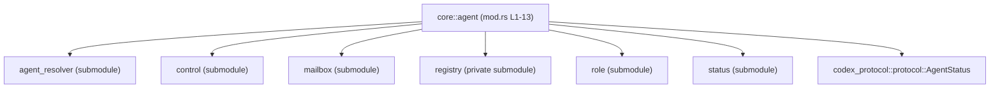
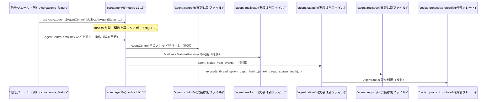

# core/src/agent/mod.rs コード解説

## 0. ざっくり一言

`core::agent` モジュール全体のサブモジュールを束ね、エージェント関連の主要な型・関数を **crate 内向けに再エクスポートするハブ（入口）** の役割を持つファイルです。  
このファイル自身にはロジック（関数本体）はなく、モジュール定義と `use` による公開のみが記述されています。

---

## 1. このモジュールの役割

### 1.1 概要

- このモジュールは、エージェント周りの機能（制御、メールボックス、状態管理など）を **一つの名前空間 `crate::agent` にまとめて提供** するために存在しています。  
- 具体的な処理はすべてサブモジュール（`agent_resolver`, `control`, `mailbox`, `registry`, `role`, `status`）側にあり、この `mod.rs` はそれらを宣言し、一部の重要な型・関数を `pub(crate) use` で再エクスポートしています。  
  - 根拠: モジュール宣言と再エクスポートのみで構成されていること（`core/src/agent/mod.rs:L1-13`）。

### 1.2 アーキテクチャ内での位置づけ

このファイルから見える依存関係をモジュール単位で整理すると、次のようになります。

- `core::agent` モジュールは、以下のサブモジュールに依存します（いずれも同じディレクトリにあると推定されます）。
  - `agent_resolver`（`pub(crate) mod agent_resolver;`）  
    根拠: `core/src/agent/mod.rs:L1`
  - `control`（`pub(crate) mod control;`）  
    根拠: `core/src/agent/mod.rs:L2`
  - `mailbox`（`pub(crate) mod mailbox;`）  
    根拠: `core/src/agent/mod.rs:L3`
  - `registry`（`mod registry;` – 非公開モジュール）  
    根拠: `core/src/agent/mod.rs:L4`
  - `role`（`pub(crate) mod role;`）  
    根拠: `core/src/agent/mod.rs:L5`
  - `status`（`pub(crate) mod status;`）  
    根拠: `core/src/agent/mod.rs:L6`

- 外部クレート `codex_protocol::protocol` に定義された `AgentStatus` 型も再エクスポートしています。  
  根拠: `core/src/agent/mod.rs:L7`

これを簡易な依存関係図として表すと、次のようになります。



この図は、「`core::agent` モジュールが何を束ねているか」の関係だけを示しており、各サブモジュールの内部処理や相互呼び出しは、このチャンクからは分かりません。

### 1.3 設計上のポイント

コードから読み取れる設計上の特徴は次の通りです。

- **ハブ／ファサード的な構造**  
  - 実際の処理はサブモジュール側に持たせ、この `mod.rs` では
    - サブモジュールを宣言し  
      根拠: `core/src/agent/mod.rs:L1-6`
    - その一部の要素を `pub(crate) use` で再エクスポートする  
      根拠: `core/src/agent/mod.rs:L7-13`
    という構造になっています。
- **crate 内限定の公開 (`pub(crate)`)**  
  - すべての再エクスポートが `pub(crate)` であり、**同一クレート内でのみ利用可能な API** を提供しています。  
    根拠: `core/src/agent/mod.rs:L1-3,5-13`
- **内部実装の隠蔽**  
  - `registry` モジュールは `mod registry;` で宣言され、**再エクスポートされる関数のみを `pub(crate) use`** しています。  
  - これにより「スレッド生成深度関連の関数は公開するが、`registry` のその他の実装詳細は隠す」という構成になっています。  
    根拠: `core/src/agent/mod.rs:L4,11-12`
- **言語固有の安全性・並行性に関する情報**  
  - このファイル自身には `unsafe` ブロックやスレッドを直接扱うコード、エラーハンドリングのコードは一切ありません。  
  - ただし、`exceeds_thread_spawn_depth_limit` および `next_thread_spawn_depth` という関数名から、スレッド生成に関する制御を別モジュールで行っていることが分かりますが、その具体的な安全性確保の方法はこのチャンクからは分かりません。  
    根拠: `core/src/agent/mod.rs:L11-12`

---

## 2. 主要な機能一覧

このファイルから外に見える「機能」は、すべてサブモジュールや外部クレートからの **型・関数の再エクスポート** です。  
それぞれの詳細実装はこのチャンクには無いため、役割は名前と所在から分かる範囲に留めます。

- `AgentStatus`: エージェントの状態を表す型（と考えられますが、詳細は不明）  
  - 元: `codex_protocol::protocol::AgentStatus`（外部クレート）  
  - 根拠: `core/src/agent/mod.rs:L7`
- `AgentControl`: エージェント制御用の型（用途は名前から推測されますが、定義は不明）  
  - 元: `control` モジュール  
  - 根拠: `core/src/agent/mod.rs:L2, L8`
- `Mailbox`: メールボックス（メッセージキュー）らしき型（詳細は不明）  
  - 元: `mailbox` モジュール  
  - 根拠: `core/src/agent/mod.rs:L3, L9`
- `MailboxReceiver`: メールボックスからの受信用の型（詳細は不明）  
  - 元: `mailbox` モジュール  
  - 根拠: `core/src/agent/mod.rs:L3, L10`
- `exceeds_thread_spawn_depth_limit`: スレッド生成の深さが制限を超えているかを判定する関数（と推測されますが、シグネチャ・実装は不明）  
  - 元: `registry` モジュール  
  - 根拠: `core/src/agent/mod.rs:L4, L11`
- `next_thread_spawn_depth`: 次のスレッド生成深さを計算もしくは取得する関数（と推測されますが、詳細不明）  
  - 元: `registry` モジュール  
  - 根拠: `core/src/agent/mod.rs:L4, L12`
- `agent_status_from_event`: 何らかの「イベント」から `AgentStatus` を導出する関数（と推測されますが、イベント型や実装は不明）  
  - 元: `status` モジュール  
  - 根拠: `core/src/agent/mod.rs:L6, L13`

### 2.1 コンポーネントインベントリー（このチャンク）

Rust の命名規約（型は `UpperCamelCase`、関数や値は `snake_case`）と `use` の形から、次の表のように整理できます。

| 名称 | 種別（推定含む） | 所属モジュール | 公開レベル | 根拠行 (`file:Lstart-end`) |
|------|------------------|----------------|------------|----------------------------|
| `agent_resolver` | サブモジュール | `core::agent` | `pub(crate) mod` | `core/src/agent/mod.rs:L1` |
| `control` | サブモジュール | `core::agent` | `pub(crate) mod` | `core/src/agent/mod.rs:L2` |
| `mailbox` | サブモジュール | `core::agent` | `pub(crate) mod` | `core/src/agent/mod.rs:L3` |
| `registry` | サブモジュール | `core::agent` | `mod`（非公開） | `core/src/agent/mod.rs:L4` |
| `role` | サブモジュール | `core::agent` | `pub(crate) mod` | `core/src/agent/mod.rs:L5` |
| `status` | サブモジュール | `core::agent` | `pub(crate) mod` | `core/src/agent/mod.rs:L6` |
| `AgentStatus` | 型（推定: UpperCamelCase） | `codex_protocol::protocol` | `pub(crate) use` | `core/src/agent/mod.rs:L7` |
| `AgentControl` | 型（推定） | `core::agent::control` | `pub(crate) use` | `core/src/agent/mod.rs:L2, L8` |
| `Mailbox` | 型（推定） | `core::agent::mailbox` | `pub(crate) use` | `core/src/agent/mod.rs:L3, L9` |
| `MailboxReceiver` | 型（推定） | `core::agent::mailbox` | `pub(crate) use` | `core/src/agent/mod.rs:L3, L10` |
| `exceeds_thread_spawn_depth_limit` | 関数（推定: snake_case） | `core::agent::registry` | `pub(crate) use` | `core/src/agent/mod.rs:L4, L11` |
| `next_thread_spawn_depth` | 関数（推定） | `core::agent::registry` | `pub(crate) use` | `core/src/agent/mod.rs:L4, L12` |
| `agent_status_from_event` | 関数（推定） | `core::agent::status` | `pub(crate) use` | `core/src/agent/mod.rs:L6, L13` |

> 注: 種別については、**命名規約による推定** を含んでいます。定義本体がこのチャンクにないため、厳密な型定義・シグネチャは不明です。

---

## 3. 公開 API と詳細解説

このファイルが直接公開する API は、すべて **サブモジュールや外部クレートからの再エクスポート** です。  
ここでは `pub(crate) use` されているものを「このモジュールの公開 API」とみなし、分かる範囲で整理します。

### 3.1 型一覧（構造体・列挙体など）

このチャンクから明確に型情報を特定することはできませんが、命名規約に基づき型と推定できるものを一覧にします。

| 名前 | 種別（推定） | 元定義モジュール | 役割 / 用途（分かる範囲） | 根拠 |
|------|--------------|------------------|---------------------------|------|
| `AgentStatus` | 型（列挙体等の可能性が高いが不明） | `codex_protocol::protocol` | エージェントの状態を表す型と考えられますが、このファイルからは内部構造やバリアントは分かりません。 | `core/src/agent/mod.rs:L7` |
| `AgentControl` | 型 | `core::agent::control` | エージェントの制御用 API を提供する型と推測されますが、メソッドやフィールドは不明です。 | `core/src/agent/mod.rs:L2, L8` |
| `Mailbox` | 型 | `core::agent::mailbox` | メッセージの送受信を管理するコンポーネント名ですが、スレッド安全性や内部キュー構造はこのチャンクでは不明です。 | `core/src/agent/mod.rs:L3, L9` |
| `MailboxReceiver` | 型 | `core::agent::mailbox` | `Mailbox` からメッセージを受信するための型と推測されますが、具体的なインターフェースは不明です。 | `core/src/agent/mod.rs:L3, L10` |

> 重要: これらの型が構造体・列挙体・トレイトのどれであるか、またスレッド安全 (`Send`/`Sync`) かどうか、エラー処理をどう行うかなどは、このファイルからは判断できません。

### 3.2 関数詳細（再エクスポートされた関数）

このファイルに実装本体は存在しませんが、**ハブとして重要そうな関数名** を 3 つ取り上げ、テンプレートに沿って「このファイルから分かること / 分からないこと」を明示します。

#### `exceeds_thread_spawn_depth_limit(/* シグネチャ不明 */)`

**概要**

- 名前から、「現在のスレッド生成の深さが何らかの制限値を超えているかどうか」を判定する関数と推測されます。
- このファイルでは、`registry` モジュールから `pub(crate) use` されており、クレート内の他のコードからは `crate::agent::exceeds_thread_spawn_depth_limit` のように呼び出されると考えられます。  
  根拠: `core/src/agent/mod.rs:L4, L11`

**引数 / 戻り値**

- このチャンクには定義が無いため、引数の型・個数、戻り値の型は **一切不明** です。
- 例えば `bool` を返す可能性はありますが、それは名前からの推測に過ぎず、ここでは断定しません。

**内部処理の流れ**

- 実装は `registry` モジュール側にあり、このチャンクには記載されていません。  
  → アルゴリズムや、どのように深さを管理しているかは不明です。

**Examples（使用例）**

- このファイルだけでは具体的な使用例を正しく示せないため、シグネチャを捏造しない範囲での例のみを記載します。

```rust
// ※シグネチャ不明のため、コンパイル可能な例ではありません。
// crate 内の別モジュールからの利用イメージだけを示します。

use crate::agent; // core::agent モジュールをインポートする

fn maybe_spawn_thread(/* 引数など不明 */) {
    // スレッド生成前に、深さ制限を確認しているような使い方が想定されますが、
    // 実際の API は registry モジュールの定義を確認する必要があります。
    //
    // if agent::exceeds_thread_spawn_depth_limit(/* 不明 */) {
    //     // 制限超過時の処理
    // } else {
    //     // スレッドを生成する処理
    // }
}
```

**Errors / Panics**

- どのような条件でエラーや panic が発生するかは、このチャンクからは分かりません。
- エラー処理・スレッド安全性は `registry` モジュール側の実装に依存します。

**Edge cases（エッジケース）**

- 引数が最大深さちょうどの場合や、異常な深さ（負値など）が渡された場合の挙動も不明です。

**使用上の注意点**

- 現時点で言えるのは、「スレッド生成深度に関する制約をチェックするための関数が `agent` モジュール経由で公開されている」ということのみです。
- 実際に利用する場合は、必ず `registry` モジュール側の定義とドキュメントを確認する必要があります。

---

#### `next_thread_spawn_depth(/* シグネチャ不明 */)`

**概要**

- 名前から、次にスレッドを生成する際の「深さ」を計算または取得する関数と推測されます。
- `registry` モジュールから `pub(crate) use` されているため、クレート内部で共通的に利用するためのユーティリティであると考えられます。  
  根拠: `core/src/agent/mod.rs:L4, L12`

**引数 / 戻り値**

- シグネチャはこのファイルには一切現れないため不明です。

**内部処理の流れ**

- 不明（`registry` モジュールの実装を参照する必要があります）。

**Examples（使用例）**

- 実際の型を捏造せずに書ける範囲でのイメージのみ示します。

```rust
use crate::agent; // core::agent モジュール

fn spawn_child_thread(/* 引数不明 */) {
    // let depth = agent::next_thread_spawn_depth(/* 不明 */);
    // 上記のように、次のスレッドの深さを算出してからスレッドを生成する利用パターンが
    // 想定されますが、正確な呼び出し方は registry 側の定義に依存します。
}
```

**Errors / Panics / Edge cases / 使用上の注意点**

- すべて `registry` モジュールの定義に依存し、このチャンクからは判断できません。

---

#### `agent_status_from_event(/* シグネチャ不明 */)`

**概要**

- 名前から、「何らかのイベント」から `AgentStatus` を導出する変換関数と推測されます。
- `status` モジュールから再エクスポートされており、クレート内の他のコードからは `crate::agent::agent_status_from_event` を通じて利用可能です。  
  根拠: `core/src/agent/mod.rs:L6, L13`

**引数 / 戻り値**

- 戻り値に `AgentStatus` を含む可能性は高いですが、このファイルのコードだけではシグネチャは一切記載されていません。
- イベントの型も不明です。

**内部処理の流れ**

- 不明（`status` モジュールの実装が必要です）。

**Examples（使用例）**

```rust
use crate::agent::{self, AgentStatus}; // AgentStatus と関数を agent モジュールから利用する

fn handle_event(/* event 型不明 */) {
    // let status: AgentStatus = agent::agent_status_from_event(event);
    // というような変換が行われることが名前からは想定されますが、
    // 実際のイベント型やエラー処理は status モジュール側の定義次第です。
}
```

**Errors / Panics / Edge cases / 使用上の注意点**

- イベントが未知の種類である場合や無効な状態遷移を表す場合にどう振る舞うかなど、
  状態管理に関する重要な仕様は `status` モジュールの実装に依存し、このファイルからは分かりません。

---

### 3.3 その他の関数

- この `mod.rs` には、上記 3 つ以外に再エクスポートされている関数は存在しません。  
  根拠: `core/src/agent/mod.rs:L11-13` には 3 つだけが列挙されています。
- サブモジュール内にその他の関数が多数存在する可能性はありますが、それらはこのチャンクには現れません。

---

## 4. データフロー

このファイルの役割は「データ処理」ではなく「名前空間と API の集約」ですが、  
クレート内部から見た典型的な呼び出しの流れを、モジュールレベルで示すと下記のようになります。

- 外部のモジュール（例: `core::some_feature`）は、`crate::agent` モジュールを通じてエージェント関連の型・関数を利用します。
- `crate::agent` は、この `mod.rs (L1-13)` で再エクスポートされた名前を提供し、実際の処理は各サブモジュールや外部クレートに委譲されます。



> 重要:  
> 図中のメソッド呼び出しやデータ内容は、**名前からの推測レベル** であり、  
> 正確なデータフローは各サブモジュールの実装を確認する必要があります。

---

## 5. 使い方（How to Use）

この `mod.rs` 自体には公開関数や構造体の定義はありませんが、  
**「crate 内の他モジュールからどのようにインポートして使うか」** という観点で基本的な利用例を示します。

### 5.1 基本的な使用方法

クレート内の別モジュールから `core::agent` の API を利用する場合の典型的なインポート例です。

```rust
// core 内の別モジュールからの利用例（擬似コード）

// agent モジュールから必要な型や関数をインポートする
use crate::agent::{
    AgentStatus,                        // 状態型（外部クレート由来）
    AgentControl,                       // 制御用の型（control モジュール由来）
    Mailbox,                            // メールボックス（mailbox モジュール由来）
    MailboxReceiver,                    // メールボックス受信用の型
    exceeds_thread_spawn_depth_limit,   // スレッド深度チェック関数
    next_thread_spawn_depth,            // 次のスレッド深度を得る関数
    agent_status_from_event,            // イベントから状態を生成する関数
};

fn example_usage() {
    // ここから先は、それぞれの型・関数のシグネチャが不明なため、
    // 実際のインスタンス化やメソッド呼び出しは、このチャンクでは示せません。
    //
    // let control = AgentControl::new(/* 不明 */);
    // let mailbox = Mailbox::new(/* 不明 */);
    // let receiver: MailboxReceiver = mailbox.subscribe(/* 不明 */);
    // let status: AgentStatus = agent_status_from_event(/* イベント型不明 */);
}
```

### 5.2 よくある使用パターン（推測レベル）

このファイルの情報だけで厳密なパターンは示せませんが、名前と構造から想定されるパターンを挙げます（**すべて推測であり、実装で必ずしもこうなっているとは限りません**）。

- `AgentControl` を中心にエージェントを起動・停止し、`Mailbox` を通じてメッセージをやり取りする。
- スレッド（またはエージェントの階層構造）を作る際に、`next_thread_spawn_depth` と `exceeds_thread_spawn_depth_limit` を併用して深さ制限を設ける。
- 何らかのイベント（通信イベント、内部イベント等）から `agent_status_from_event` を使って `AgentStatus` を得て状態管理を行う。

これらは **命名と re-export の構成から想定される利用像** に過ぎないことに注意が必要です。

### 5.3 よくある間違い（このファイルから言えること）

この `mod.rs` の設計に基づき、起こりうる誤用として考えられるのは次のようなものです（一般論としての注意点です）。

```rust
// 誤りの例（推測）: サブモジュールを直接参照してしまう
// use crate::agent::control::AgentControl;  // こう書ける可能性はありますが…

// 推奨される使い方（この mod.rs の設計意図に沿う）:
use crate::agent::AgentControl;            // mod.rs の再エクスポート経由で利用
```

このように、**`mod.rs` が用意している再エクスポートを経由して利用する** ことで、  
内部構造の変更（例: `control` モジュールの移動・リファクタリング）があっても呼び出し側への影響を減らせる設計になっていると考えられます。

### 5.4 使用上の注意点（まとめ）

このファイルに関して言える注意点は次の通りです。

- この `mod.rs` は **API の窓口** であり、実際の安全性（スレッド安全性、エラーハンドリング）はサブモジュール側の実装に依存します。
- `pub(crate)` 公開であるため、**クレート外からは利用できません**。外部向け API を設計する際は、別途 `pub` で再エクスポートするレイヤが必要になります。
- スレッド生成深度関連の関数 (`exceeds_thread_spawn_depth_limit`, `next_thread_spawn_depth`) は、**並行性やリソース制御に関わる重要な部分** である可能性が高いため、実装を確認せずに使い方を推測で決めることは避ける必要があります。

---

## 6. 変更の仕方（How to Modify）

この `mod.rs` を変更する場合の入口と注意点を整理します。

### 6.1 新しい機能を追加する場合

新しいエージェント関連のモジュールや型・関数を追加したい場合、一般的な手順は次のようになります。

1. **サブモジュールの追加**
   - 例: 新しいモジュール `scheduler` を追加する場合  
     - `core/src/agent/scheduler.rs` または `core/src/agent/scheduler/mod.rs` を作成する。  
     - `mod.rs` に `pub(crate) mod scheduler;` を追加する。  
       根拠: 既存のモジュール宣言パターン（`core/src/agent/mod.rs:L1-6`）。

2. **再エクスポートの検討**
   - そのモジュール内の型・関数を、クレート内全体から簡便に利用したい場合には、
     `pub(crate) use scheduler::SomeType;` のような行を `mod.rs` に追加する。  
   - 公開レベルを `pub(crate)` にするか `pub` にするかは、他の API との整合性を考慮して決める。

3. **呼び出し側の更新**
   - 新しい API を利用するモジュールでは、`use crate::agent::SomeType;` のようにインポートする。

### 6.2 既存の機能を変更する場合

- **モジュール構成を変える場合**
  - 例: `AgentControl` を別モジュールへ移動したい場合:
    - 実装を移動した上で、`mod.rs` の `pub(crate) use` 先を新しいモジュールに合わせて修正する。
    - 呼び出し側が `crate::agent::AgentControl` を使っていれば、呼び出し側への影響を最小限にできます。

- **公開範囲を変更する場合**
  - `pub(crate)` → `pub` に切り替えると、クレート外からも利用される API になります。
  - この場合、後方互換性・セキュリティ・スレッド安全性などの観点から、
    仕様を十分に検討し、テストやドキュメントを整備する必要があります。

- **スレッド関連関数を変える場合**
  - `exceeds_thread_spawn_depth_limit` / `next_thread_spawn_depth` のシグネチャや挙動を変更する場合は、
    - これらが再エクスポートされクレート内で広く使われている可能性があるため、  
      影響範囲の洗い出し（`rg`, `grep` 等での参照検索）が必須です。
    - 深さ制限ロジックの変更は、**並行性バグやリソース枯渇** に直結しうるため、慎重なテストが必要です。

---

## 7. 関連ファイル

この `mod.rs` と密接に関係するファイル・モジュールは次の通りです。

| パス（推定含む） | 役割 / 関係 |
|------------------|------------|
| `core/src/agent/agent_resolver.rs` または `core/src/agent/agent_resolver/mod.rs` | `pub(crate) mod agent_resolver;` の実体。エージェントの解決・探索に関するロジックを持つ可能性がありますが、このチャンクからは詳細不明です。根拠: `core/src/agent/mod.rs:L1` |
| `core/src/agent/control.rs` または `core/src/agent/control/mod.rs` | `AgentControl` 型などを定義していると推定されるモジュール。根拠: `core/src/agent/mod.rs:L2, L8` |
| `core/src/agent/mailbox.rs` または `core/src/agent/mailbox/mod.rs` | `Mailbox` / `MailboxReceiver` を定義していると推定されるモジュール。根拠: `core/src/agent/mod.rs:L3, L9-10` |
| `core/src/agent/registry.rs` または `core/src/agent/registry/mod.rs` | `exceeds_thread_spawn_depth_limit` / `next_thread_spawn_depth` を定義する内部モジュール。`mod` のみで公開されていないため、実装詳細を隠蔽する役割を持ちます。根拠: `core/src/agent/mod.rs:L4, L11-12` |
| `core/src/agent/role.rs` または `core/src/agent/role/mod.rs` | エージェントの役割（ロール）に関する型やロジックを持つと推測されるモジュール。根拠: `core/src/agent/mod.rs:L5` |
| `core/src/agent/status.rs` または `core/src/agent/status/mod.rs` | `agent_status_from_event` など、エージェント状態に関する処理を提供するモジュール。根拠: `core/src/agent/mod.rs:L6, L13` |
| 外部クレート `codex_protocol` | `AgentStatus` 型を提供するプロトコル定義クレート。根拠: `core/src/agent/mod.rs:L7` |

> 補足: ファイルパスは Rust のモジュール規約（`mod foo;` → `foo.rs` または `foo/mod.rs`）に基づいた推定です。リポジトリ全体が手元にないため、正確なパスはこのチャンクからは確定できません。

---

### このファイルに関する Bugs / Security / 契約・エッジケース / テスト / パフォーマンス

- **Bugs / Security**
  - この `mod.rs` 自体はモジュール宣言と `use` のみであり、ロジックを持たないため、このファイルに起因する直接のバグやセキュリティ脆弱性は（構文的には）考えにくいです。
  - ただし、`pub(crate) use` の対象を誤ると、意図しない API が公開される、もしくは必要な API が公開されないといった設計上の問題は起こりえます。

- **Contracts / Edge Cases**
  - 本ファイルに API 契約（前提条件・後保証）やエッジケース処理は存在しません。契約はすべて再エクスポート元の型・関数の仕様に依存します。

- **Tests**
  - このファイルに対する直接のテストは通常不要であり、再エクスポートされた API の挙動は、それぞれの元モジュールのテストで検証されるのが一般的です。このチャンクにはテストコードは含まれていません。

- **Performance / Scalability**
  - `use` とモジュール宣言のみで構成されるため、このファイルの変更が直接パフォーマンスに影響することはほとんどありません。
  - 並行性やスケーラビリティに影響するのは、`registry` や `mailbox` などサブモジュール側の実装です。

以上が、このチャンク（`core/src/agent/mod.rs:L1-13`）から読み取れる事実にもとづく解説です。
