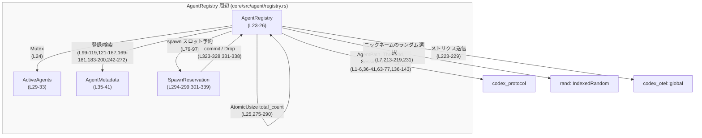
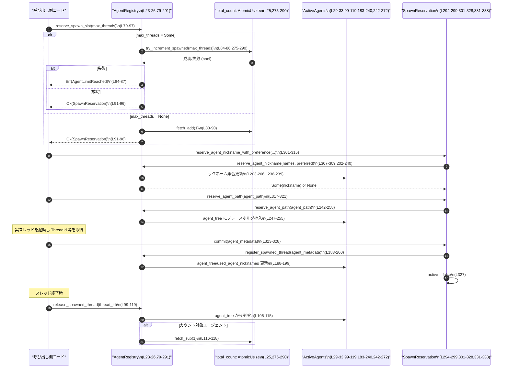

# core/src/agent/registry.rs コード解説

---

## 0. ざっくり一言

Codex の「マルチエージェント」機能向けに、**セッション内で生成されるサブエージェント（スレッド）の数・階層を制限しつつ、エージェントのメタデータ（パス・ニックネームなど）を管理するレジストリ**を提供するモジュールです  
（根拠: `core/src/agent/registry.rs:L16-26,L35-41,L63-77`）。

---

## 1. このモジュールの役割

### 1.1 概要

- このモジュールは、**1ユーザーセッション内で生成されるサブエージェント（スレッド）の管理と制限**を行います  
  （根拠: `L16-21,L23-26`）。
- 具体的には、
  - セッション内での**総スレッド数の上限管理**と
  - エージェントごとの **ID・パス・ニックネーム・役割・最後のタスクメッセージ** の保存  
    を行います（根拠: `L23-26,L29-33,L35-41,L79-97,L99-119`）。

### 1.2 アーキテクチャ内での位置づけ

主な依存関係と内部構造を示します。



- `AgentRegistry` はセッション単位で共有され、内部に
  - `Mutex<ActiveAgents>` による可変状態（エージェントツリー・ニックネーム使用状況）と
  - `AtomicUsize total_count` によるスレッド数カウンタ  
  を持ちます（根拠: `L23-26`）。
- スレッド生成時には `SpawnReservation` が一時的な **RAIIガード** として使われ、  
  成功時は `commit`、失敗時は `Drop` によってカウント・パス予約が自動調整されます（根拠: `L79-97,L294-299,L301-328,L331-338`）。

### 1.3 設計上のポイント

- **責務分割**
  - `AgentRegistry`: スレッド数カウントとエージェントメタデータの管理（根拠: `L23-26,L79-97,L99-181`）。
  - `ActiveAgents`: 実際のマップ・セット状態を持つ内部構造体（根拠: `L29-33`）。
  - `SpawnReservation`: スレッド生成準備中の一時状態を表す RAII 型（根拠: `L294-299,L301-328,L331-338`）。
- **並行性**
  - `total_count` は `AtomicUsize` + `compare_exchange_weak` でスレッド上限を競合状態なく制御（根拠: `L25,L275-290`）。
  - `active_agents` は `Mutex` で保護され、エージェントツリーやニックネーム集合の整合性を保ちます（根拠: `L24,L99-119,L121-134,L136-181,L183-240,L242-272`）。
  - ロックの poisoning は `unwrap_or_else(PoisonError::into_inner)` で無視し、処理を継続します（根拠: `L101-104,L122-125,137-140,147-148,156-159,170-173,188-190,203-206,243-246,262-265`）。
- **エラーハンドリング**
  - 上限超過のとき `CodexErr::AgentLimitReached`、パス重複のとき `CodexErr::UnsupportedOperation` を返します（根拠: `L84-87,L242-250`）。
  - ニックネーム枯渇時は `Result` 経由で `UnsupportedOperation("no available agent nicknames")` を返します（根拠: `L301-315`）。
- **RAII と安全性**
  - `SpawnReservation` が `Drop` される際、未 commit であれば `total_count` を自動で戻し、予約済みパスも解放します（根拠: `L323-328,L331-338`）。
  - これにより、スレッド生成途中でエラーや panic が起きても、スロットの取りっぱなしを防ぎます。

---

## 2. 主要な機能一覧

- スレッド生成スロットの予約と上限チェック: `AgentRegistry::reserve_spawn_slot`（根拠: `L79-97`）
- スレッド終了時の登録解除とカウンタ更新: `AgentRegistry::release_spawned_thread`（根拠: `L99-119`）
- ルートエージェント（セッションの親）スレッドの登録: `AgentRegistry::register_root_thread`（根拠: `L121-134`）
- エージェント ID / メタデータの検索: `agent_id_for_path`, `agent_metadata_for_thread`, `live_agents`（根拠: `L136-167`）
- タスクメッセージの更新: `update_last_task_message`（根拠: `L169-181`）
- エージェントニックネームの予約とプールリセット: `reserve_agent_nickname`（根拠: `L202-240`）
- エージェントパスの予約と開放: `reserve_agent_path`, `release_reserved_agent_path`（根拠: `L242-272`）
- スレッドスロットカウンタの安全なインクリメント: `try_increment_spawned`（根拠: `L275-290`）
- 深さ制御用ヘルパ: `next_thread_spawn_depth`, `exceeds_thread_spawn_depth_limit`（根拠: `L63-77`）
- 予約オブジェクト経由のニックネーム／パス予約＋ commit / Drop による RAII: `SpawnReservation`（根拠: `L294-299,L301-328,L331-338`）

---

## 3. 公開 API と詳細解説

### 3.1 型一覧（構造体・列挙体など）

| 名前 | 種別 | 可視性 | 役割 / 用途 | 根拠 |
|------|------|--------|-------------|------|
| `AgentRegistry` | 構造体 | `pub(crate)` | セッション内の全エージェントに共有されるレジストリ。スレッド数カウンタとエージェントメタデータを保持する。 | `core/src/agent/registry.rs:L16-26` |
| `ActiveAgents` | 構造体 | crate 内 private | `Mutex` 内部で保持される実データ構造。エージェントツリー、使用済みニックネーム集合、リセット回数を管理。 | `L29-33` |
| `AgentMetadata` | 構造体 | `pub(crate)` | 各エージェントに紐づくメタデータ（ID, パス, ニックネーム, 役割, 最後のタスクメッセージ）を格納。 | `L35-41` |
| `SpawnReservation` | 構造体 | `pub(crate)` | スレッド生成処理中の予約状態を表す RAII ガード。commit までにニックネーム／パス予約を行い、Drop 時に後始末。 | `L294-299,L301-328,L331-338` |

### 3.2 関数詳細（主要 7 件）

#### 3.2.1 `AgentRegistry::reserve_spawn_slot(self: &Arc<Self>, max_threads: Option<usize>) -> Result<SpawnReservation>`

**概要**

- 新しいサブエージェント（スレッド）を生成する前に、**スレッド数上限を確認しつつスロットを予約**します。
- 成功すると `SpawnReservation` を返し、予約が有効な間は `total_count` が 1 増加した状態になります（根拠: `L79-97`）。

**引数**

| 引数名 | 型 | 説明 |
|--------|----|------|
| `self` | `&Arc<Self>` | `AgentRegistry` への共有ポインタ。`SpawnReservation` にクローンして保持するため `Arc` が要求されます。 |
| `max_threads` | `Option<usize>` | セッション内で許可される最大サブエージェント数。`Some(n)` のとき n を上限としてチェックし、`None` のときは上限なしでカウンタだけ増やします。 |

**戻り値**

- `Ok(SpawnReservation)`:
  - スロットが確保できた場合。`SpawnReservation` は commit までの間、スレッド生成処理の RAII ガードとして振る舞います。
- `Err(CodexErr::AgentLimitReached { max_threads })`:
  - `max_threads` が指定されており、すでに上限に達していてスロットを確保できなかった場合（根拠: `L84-87`）。

**内部処理の流れ**

1. `max_threads` が `Some` の場合
   - `try_increment_spawned(max_threads)` を呼び出し、`total_count` を CAS ループでインクリメントできるか試みる（根拠: `L84-86,L275-290`）。
   - 失敗した場合は `CodexErr::AgentLimitReached` を返して終了（根拠: `L84-87`）。
2. `max_threads` が `None` の場合
   - 制限なく `total_count.fetch_add(1, Ordering::AcqRel)` でカウンタを増やす（根拠: `L88-90`）。
3. `SpawnReservation` を生成し、`state=Arc::clone(self)`, `active=true`, `reserved_agent_nickname=None`, `reserved_agent_path=None` をセットして返す（根拠: `L91-96`）。

**Examples（使用例）**

```rust
use std::sync::Arc;
use codex_protocol::ThreadId;
use core::agent::registry::{AgentRegistry, AgentMetadata}; // パスは仮の例

fn spawn_sub_agent_example(registry: Arc<AgentRegistry>) -> Result<(), codex_protocol::error::CodexErr> {
    // スレッド上限 10 でスロット予約
    let reservation = registry.reserve_spawn_slot(Some(10))?; // L79-97

    // ここで実際のスレッド生成処理を行う（詳細はこのモジュール外）
    let thread_id = ThreadId::new(123); // 仮のコンストラクタ。実際の生成方法はこのチャンクからは不明です。

    // 必要ならニックネームやパスを予約してメタデータを構築
    let metadata = AgentMetadata {
        agent_id: Some(thread_id),
        agent_path: None,
        agent_nickname: None,
        agent_role: None,
        last_task_message: None,
    };

    // commit で登録を完了し、予約を無効化
    reservation.commit(metadata); // L323-328

    Ok(())
}
```

**Errors / Panics**

- `Err(CodexErr::AgentLimitReached { max_threads })`:
  - `try_increment_spawned` が `false` を返したとき（すでに上限に達している）に返されます（根拠: `L84-87,L275-290`）。
- パニック:
  - `total_count.fetch_add` 自体はパニックしません。
  - `Arc::clone` もパニックしません。
  - よってこの関数単体がパニックを起こす経路はコードからは読み取れません。

**Edge cases（エッジケース）**

- `max_threads = Some(0)`:
  - `try_increment_spawned` 内で `current >= max_threads` 判定により即 `false` となり、`AgentLimitReached { max_threads: 0 }` が返ると解釈できます（根拠: `L275-280`）。
- 高負荷下での同時呼び出し:
  - `total_count` は CAS ループにより正しくシリアライズされ、上限を超えるインクリメントはブロックされます（根拠: `L275-290`）。

**使用上の注意点**

- `SpawnReservation` が **commit されないままスコープを抜ける**と、`Drop` 実装により `total_count` が 1 減算されます（根拠: `L331-338`）。  
  これはリソースリークを防ぐためですが、「予約したのにスレッドを生成していない」状態を区別できない点に注意が必要です。
- commit した後は `release_spawned_thread` を呼ばない限り `total_count` は減らないため、**スレッド終了時に必ず `release_spawned_thread` を呼ぶ契約**が暗黙に存在します（根拠: `L99-119`）。

---

#### 3.2.2 `AgentRegistry::release_spawned_thread(&self, thread_id: ThreadId)`

**概要**

- 指定された `thread_id` に対応するエージェントをレジストリから削除し、  
  そのエージェントがカウント対象であれば `total_count` を 1 減らします（根拠: `L99-119`）。

**引数**

| 引数名 | 型 | 説明 |
|--------|----|------|
| `thread_id` | `ThreadId` | 終了したサブエージェントのスレッド ID。 |

**戻り値**

- 戻り値はなく、成功・失敗を返しません。指定 ID のエージェントが存在しない場合は何もしません（根拠: `L105-115`）。

**内部処理**

1. `active_agents` のロックを取得（根拠: `L101-104`）。
2. `agent_tree` を走査し、`metadata.agent_id == Some(thread_id)` なエントリのキーを探す（根拠: `L105-109`）。
3. 見つかれば `remove` でエントリを削除し、そのメタデータで
   - `agent_path` があり、かつ `AgentPath::is_root` **ではない**場合のみ「カウント対象のエージェント」とみなす（根拠: `L110-114`）。
4. カウント対象であった場合に限り `total_count.fetch_sub(1, Ordering::AcqRel)` を実行（根拠: `L116-118`）。

**Examples（使用例）**

```rust
fn on_agent_thread_exit(registry: &AgentRegistry, thread_id: ThreadId) {
    // スレッド終了時に呼び出すことで、レジストリとカウンタを更新
    registry.release_spawned_thread(thread_id); // L99-119
}
```

**Edge cases**

- `thread_id` に対応するエントリが存在しない:
  - `find_map` が `None` を返し、`removed_counted_agent` は `false` になり、`total_count` は変更されません（根拠: `L105-115`）。
- ルートエージェント:
  - `agent_path.is_root()` なエージェントはカウント対象から除外され、削除されても `total_count` は変化しません（根拠: `L112-114`）。

**使用上の注意点**

- commit 済みのスレッドに対して **必ず一度だけ呼び出す**必要があります。
  - 呼び出し忘れると `total_count` が減らず、上限チェックが実際より厳しくなります。
  - 重複呼び出しをしても 2回目以降は対象エージェントが見つからないため `total_count` は変化しませんが、呼び出しパターンとしては避けるのが安全です。

---

#### 3.2.3 `AgentRegistry::reserve_agent_nickname(&self, names: &[&str], preferred: Option<&str>) -> Option<String>`

> この関数は `pub(crate)` ではなく `impl AgentRegistry` 内の private メソッドですが、  
> ニックネーム管理のコアロジックのため詳細を記載します（根拠: `L202-240`）。

**概要**

- 指定された候補 `names` と任意の `preferred` から、まだ使われていないニックネームを選び、予約済み集合に追加します。
- 全候補が使い切られた場合はプールをリセットし、メトリクスを送信しつつ世代番号（`nickname_reset_count`）を増やします（根拠: `L213-223`）。

**引数**

| 引数名 | 型 | 説明 |
|--------|----|------|
| `names` | `&[&str]` | 候補となるベース名一覧（例: `["Scout", "Planner"]`）。空の場合は `None` を返します。 |
| `preferred` | `Option<&str>` | 明示的に指定したいニックネーム。指定があれば候補からのランダム選択は行いません。 |

**戻り値**

- `Some(String)`:
  - 予約されたニックネーム。`used_agent_nicknames` に追加されます（根拠: `L236-239`）。
- `None`:
  - `names` が空で、候補から選べない場合のみ `None` が返されます（根拠: `L210-212`）。

**内部処理**

1. `active_agents` をロックし、`ActiveAgents` へのミュータブル参照を得る（根拠: `L203-206`）。
2. `preferred` が `Some` の場合:
   - その文字列をそのままニックネームとして採用（使用済みチェックは行わない）（根拠: `L207-209`）。
3. `preferred` が `None` の場合:
   - `names` が空であれば `None` を返す（根拠: `L210-212`）。
   - それ以外:
     1. 各候補名に対し `format_agent_nickname(name, nickname_reset_count)` を適用し、  
        現在の世代向けの表示名（例: `"Scout the 2nd"`）を生成（根拠: `L213-216`）。
     2. まだ `used_agent_nicknames` に入っていないものだけを `available_names` として収集（根拠: `L215-217`）。
     3. `available_names` から `choose` でランダムに 1 つ選択できれば採用（根拠: `L218-219`）。
     4. 選択できなかった場合（すべて使用済み）:
        - `used_agent_nicknames.clear()` で集合をクリア（根拠: `L221`）。
        - `nickname_reset_count += 1` で世代番号をインクリメント（根拠: `L222`）。
        - `codex_otel::global()` が `Some(metrics)` を返せば、`codex.multi_agent.nickname_pool_reset` カウンタを 1 増加させる（根拠: `L223-228`）。
        - 新しい世代番号で再度 `names` からランダムに 1 つ選び、`format_agent_nickname` で表示名を作る（根拠: `L230-233`）。
4. 決定した `agent_nickname` を `used_agent_nicknames` に追加し、`Some(agent_nickname)` を返す（根拠: `L236-239`）。

**Examples（使用例）**

```rust
fn example_reserve_nickname(registry: &AgentRegistry) -> Option<String> {
    let names = ["Scout", "Planner", "Builder"];

    // preferred なし: 未使用の候補からランダムに選ばれる
    registry.reserve_agent_nickname(&names, None) // L202-240
}
```

**Errors / Panics**

- この関数は `Option<String>` を返すのみで、`Result` や panic は使っていません。
- `names` が空でない限り `Some` を返す設計になっています（根拠: `L210-212,L231-233`）。

**Edge cases**

- `preferred` がすでに `used_agent_nicknames` に存在する場合:
  - コード上は **チェックを行わず** そのまま採用し、再度 `used_agent_nicknames.insert` されます（根拠: `L207-209,L236-239`）。
  - そのため、「同じニックネームを複数エージェントに割り当てうる」挙動になります。
- ニックネームプールの完全枯渇:
  - 全候補が使用済みになると、集合をクリアして `nickname_reset_count` を増やし、表示上「2nd, 3rd, ...」といった suffix 付きの名前として再利用します（根拠: `L215-223,L48-59`）。

**使用上の注意点**

- 呼び出し側は、返ってきたニックネームを `AgentMetadata.agent_nickname` にセットして `register_spawned_thread` 経由で登録する前提になっています（根拠: `L183-200`）。
- `SpawnReservation` 側でこの関数を呼び出した場合でも、**Drop 時にニックネームは解放されません**。
  - `used_agent_nicknames` から削除される処理が存在せず、プールリセット時のみクリアされます（根拠: `L236-239,L221`）。
  - そのため、予約だけ行って commit しなかった場合でも、そのニックネームは（次のリセットまで）再利用されません。

---

#### 3.2.4 `AgentRegistry::reserve_agent_path(&self, agent_path: &AgentPath) -> Result<()>`

**概要**

- 指定された `AgentPath` がまだ存在しないことを確認し、**プレースホルダのメタデータを挿入して「パスを予約」**します（根拠: `L242-258`）。
- この予約は `SpawnReservation` が Drop される際に解除される可能性があります（根拠: `L261-272,L331-338`）。

**引数**

| 引数名 | 型 | 説明 |
|--------|----|------|
| `agent_path` | `&AgentPath` | 予約したいエージェントパス。文字列化して `agent_tree` のキーに使われます。 |

**戻り値**

- `Ok(())`:
  - パスが未使用で、予約が成功した場合。
- `Err(CodexErr::UnsupportedOperation("agent path`<path>`already exists"))`:
  - 指定パスのエントリがすでに `agent_tree` に存在する場合（根拠: `L247-250`）。

**内部処理**

1. `active_agents` をロック（根拠: `L243-246`）。
2. `agent_tree.entry(agent_path.to_string())` でエントリを取得（根拠: `L247`）。
3. `Entry::Occupied` の場合:
   - `UnsupportedOperation` エラーを返す（根拠: `L248-250`）。
4. `Entry::Vacant` の場合:
   - `AgentMetadata { agent_path: Some(agent_path.clone()), ..Default::default() }` を挿入し、`Ok(())` を返す（根拠: `L251-255`）。

**Examples（使用例）**

```rust
fn reserve_path_via_reservation(
    reservation: &mut SpawnReservation,
    path: &AgentPath,
) -> Result<(), codex_protocol::error::CodexErr> {
    // SpawnReservation 経由で呼び出される形が標準的
    reservation.reserve_agent_path(path) // L317-321
}
```

**Errors / Panics**

- `agent_tree.entry` 系 API はパニックしません。
- 既存パスとの衝突時のみ `CodexErr::UnsupportedOperation` を返します（根拠: `L248-250`）。

**Edge cases**

- すでに **予約だけされているパス** に対して再度予約を試みると、Occupied 判定でエラーになります。
  - 予約状態の解除は `release_reserved_agent_path`（後述）か、`SpawnReservation` の Drop によって行われます（根拠: `L261-272,L331-338`）。

**使用上の注意点**

- この関数単体は、`agent_id` を設定しない「空のメタデータ」だけを挿入します（根拠: `L251-255`）。  
  実際のスレッドが起動したら `AgentMetadata` を含む `register_spawned_thread` を呼び出して、完全な情報に差し替える前提と考えられます（根拠: `L183-200`）。
- `SpawnReservation` 経由で利用する場合、commit されずに Drop されたときは `release_reserved_agent_path` によって予約が自動解除されます（根拠: `L261-272,L331-338`）。

---

#### 3.2.5 `AgentRegistry::try_increment_spawned(&self, max_threads: usize) -> bool`

**概要**

- `total_count` を `max_threads` までに抑えるための、**ロックフリーなインクリメント試行関数**です（根拠: `L275-290`）。
- `reserve_spawn_slot` からのみ呼び出されています（根拠: `L84-86`）。

**引数**

| 引数名 | 型 | 説明 |
|--------|----|------|
| `max_threads` | `usize` | 許可される最大スレッド数。 |

**戻り値**

- `true`:
  - `total_count` を 1 増やすことに成功した場合。
- `false`:
  - すでに `current >= max_threads` であった場合（根拠: `L278-280`）。

**内部処理**

1. `current = total_count.load(Ordering::Acquire)` を取得（根拠: `L275-277`）。
2. ループ:
   - `current >= max_threads` なら `false` を返して終了（根拠: `L278-280`）。
   - `compare_exchange_weak(current, current+1, Ordering::AcqRel, Ordering::Acquire)` を試みる（根拠: `L281-286`）。
   - 成功 (`Ok(_)`) なら `true` を返す（根拠: `L287`）。
   - 失敗 (`Err(updated)`) なら `current = updated` としてループ継続（根拠: `L288`）。

**使用上の注意点**

- `compare_exchange_weak` を用いているためスプリアス失敗がありえますが、ループで再試行する設計になっています（根拠: `L275-290`）。
- `max_threads` が 0 の場合、常に `false` となり、`reserve_spawn_slot` は必ず `AgentLimitReached` を返す挙動になります。

---

#### 3.2.6 `SpawnReservation::reserve_agent_nickname_with_preference(&mut self, names: &[&str], preferred: Option<&str>) -> Result<String>`

**概要**

- `SpawnReservation` を介して、ニックネームの予約とエラー変換 (`Option` → `Result`) を行います（根拠: `L301-315`）。
- 成功時には、自身の `reserved_agent_nickname` フィールドにも保存します（根拠: `L313-314`）。

**引数**

| 引数名 | 型 | 説明 |
|--------|----|------|
| `names` | `&[&str]` | ニックネーム候補一覧。 |
| `preferred` | `Option<&str>` | 優先的に使いたいニックネーム。 |

**戻り値**

- `Ok(String)`:
  - 予約されたニックネーム。
- `Err(CodexErr::UnsupportedOperation("no available agent nicknames"))`:
  - `names` が空であり、ニックネームが一切予約できなかった場合（根拠: `L309-312`）。

**内部処理**

1. `self.state.reserve_agent_nickname(names, preferred)` を呼び出し、`Option<String>` を取得（根拠: `L307-309`）。
2. `ok_or_else` で `None` を `UnsupportedOperation` エラーに変換（根拠: `L309-312`）。
3. 成功したニックネームを `self.reserved_agent_nickname = Some(..)` に保存（根拠: `L313`）。
4. そのニックネームを返す（根拠: `L314`）。

**使用上の注意点**

- `Drop` 実装では `reserved_agent_nickname` は参照しておらず、**予約済みニックネームの解放は行いません**（根拠: `L331-338`）。  
  これは「一度使った候補は、その世代では再利用しない」というポリシーに沿っています。
- エラーとなるのは `names` が空の場合のみで、それ以外は `Some` を返す設計です（根拠: `L210-212,L231-233`）。

---

#### 3.2.7 `SpawnReservation::commit(mut self, agent_metadata: AgentMetadata)` と `Drop for SpawnReservation`

**概要**

- `commit` は予約完了時に呼ばれ、エージェントのメタデータをレジストリに登録すると同時に、  
  `SpawnReservation` を非アクティブ化します（根拠: `L323-328`）。
- `Drop` 実装は、未 commit のままスコープを抜けた場合に **パス予約の解除と `total_count` のデクリメント**を行います（根拠: `L331-338`）。

**引数（commit）**

| 引数名 | 型 | 説明 |
|--------|----|------|
| `agent_metadata` | `AgentMetadata` | 実際に起動したエージェントに関するメタデータ。少なくとも `agent_id` が設定されている必要があります（根拠: `L183-186`）。 |

**戻り値**

- `commit` は `()` を返し、失敗を通知しません。
- `Drop` は戻り値を持ちません。

**内部処理（commit）**

1. `self.reserved_agent_nickname = None` と `self.reserved_agent_path = None` に設定（根拠: `L323-325`）。
   - ※ ニックネーム自体はすでに `AgentRegistry` 側の `used_agent_nicknames` に登録済みであり、ここでは「ローカルな記録」を消しています（根拠: `L236-239,L313`）。
2. `self.state.register_spawned_thread(agent_metadata)` を呼び出し、レジストリにエージェントメタデータを登録（根拠: `L326,L183-200`）。
3. `self.active = false` とし、以後 Drop が `total_count` をいじらないようにする（根拠: `L327`）。
4. 所有権移動により `self` はここで消費されます（`self` のムーブ）。

**内部処理（Drop）**

1. `if self.active { ... }` により、未 commit の場合のみ後処理を行う（根拠: `L333`）。
2. `self.reserved_agent_path.take()` が `Some(agent_path)` であれば、
   - `state.release_reserved_agent_path(&agent_path)` を呼び出し、パス予約を解除（根拠: `L334-336,L261-272`）。
3. `state.total_count.fetch_sub(1, Ordering::AcqRel)` でカウンタを 1 減らす（根拠: `L337`）。

**Examples（使用例）**

```rust
fn spawn_with_reservation(registry: Arc<AgentRegistry>) -> Result<(), codex_protocol::error::CodexErr> {
    let mut reservation = registry.reserve_spawn_slot(Some(10))?; // L79-97

    // ニックネームとパスを予約
    let nickname = reservation.reserve_agent_nickname_with_preference(&["Scout"], None)?; // L301-315

    let path = some_agent_path(); // 仮の関数。このチャンクには定義がありません。
    reservation.reserve_agent_path(&path)?; // L317-321

    // 実スレッドを起動し ThreadId を得る（詳細はこのモジュール外）
    let thread_id = obtain_thread_id(); // 仮の関数

    // メタデータを構築して commit
    let metadata = AgentMetadata {
        agent_id: Some(thread_id),
        agent_path: Some(path),
        agent_nickname: Some(nickname),
        agent_role: Some("scout".to_string()),
        last_task_message: None,
    };

    reservation.commit(metadata); // L323-328

    // commit 後は Drop しても total_count は変更されず、
    // 終了時は release_spawned_thread 側で total_count が減ります。

    Ok(())
}
```

**Edge cases**

- `agent_metadata.agent_id` が `None` のまま `commit` された場合:
  - `register_spawned_thread` 内の `let Some(thread_id) = agent_metadata.agent_id else { return; }` により  
    何も登録されません（根拠: `L183-186`）。`total_count` はすでに増えたままなので、設計上は「ありえない入力」を想定しているように見えます。
- `commit` しないままスコープを抜ける場合:
  - Drop によってパス予約が解除され、`total_count` が 1 減ります（根拠: `L331-338`）。
  - ニックネームは解放されません（根拠: `L236-239`）。

**使用上の注意点**

- **正しいライフサイクル**は「`reserve_spawn_slot` → (ニックネーム/パス予約) → 実スレッド起動 → `commit` → 終了時 `release_spawned_thread`」です。
- `commit` の呼び出し忘れは致命的ではありませんが、「予約されたスロットが実際には使われなかった」という状態を作ります。
- `agent_metadata` に `agent_id` を必ず設定する契約を満たさないと、レジストリに登録されず、`release_spawned_thread` にも到達しないため、`total_count` の整合性が崩れます。

---

### 3.3 その他の関数一覧

| 関数名 | シグネチャ | 役割（1 行） | 根拠 |
|--------|------------|--------------|------|
| `format_agent_nickname` | `fn format_agent_nickname(name: &str, nickname_reset_count: usize) -> String` | 世代番号に応じて `"Name the 2nd"` などの表示名を生成。 | `L44-61` |
| `session_depth` | `fn session_depth(session_source: &SessionSource) -> i32` | `SessionSource` からサブエージェントのネスト深さを抽出する内部ヘルパ。 | `L63-69` |
| `next_thread_spawn_depth` | `pub(crate) fn next_thread_spawn_depth(session_source: &SessionSource) -> i32` | 現在の深さに 1 を足した次のスレッド深さを返し、オーバーフローは飽和加算で防ぐ。 | `L71-73` |
| `exceeds_thread_spawn_depth_limit` | `pub(crate) fn exceeds_thread_spawn_depth_limit(depth: i32, max_depth: i32) -> bool` | 指定の深さが最大許容量を超えているかをチェック。 | `L75-77` |
| `agent_id_for_path` | `pub(crate) fn agent_id_for_path(&self, agent_path: &AgentPath) -> Option<ThreadId>` | パスから `ThreadId` を逆引きする。 | `L136-143` |
| `agent_metadata_for_thread` | `pub(crate) fn agent_metadata_for_thread(&self, thread_id: ThreadId) -> Option<AgentMetadata>` | `ThreadId` からメタデータを取得。 | `L145-153` |
| `live_agents` | `pub(crate) fn live_agents(&self) -> Vec<AgentMetadata>` | ルート以外で `agent_id` を持つ全エージェントのメタデータ一覧を返す。 | `L155-167` |
| `update_last_task_message` | `pub(crate) fn update_last_task_message(&self, thread_id: ThreadId, last_task_message: String)` | 該当スレッドの `last_task_message` を更新。 | `L169-181` |
| `register_root_thread` | `pub(crate) fn register_root_thread(&self, thread_id: ThreadId)` | ルートパス `AgentPath::ROOT` にメタデータを登録。 | `L121-134` |
| `register_spawned_thread` | `fn register_spawned_thread(&self, agent_metadata: AgentMetadata)` | commit 時に呼ばれ、エージェントツリーとニックネーム集合を更新。 | `L183-200` |
| `release_reserved_agent_path` | `fn release_reserved_agent_path(&self, agent_path: &AgentPath)` | `reserve_agent_path` で作成されたが `agent_id` を持たないエントリのみを削除。 | `L261-272` |
| `SpawnReservation::reserve_agent_path` | `pub(crate) fn reserve_agent_path(&mut self, agent_path: &AgentPath) -> Result<()>` | `AgentRegistry::reserve_agent_path` をラップし、予約パスを `SpawnReservation` に記録。 | `L317-321` |

---

## 4. データフロー

### 4.1 スレッド生成から終了までの典型フロー

新しいサブエージェントを生成するときの処理の流れを示します。



- **失敗フロー**: 途中でエラーが発生し `Res` が Drop されると、 `active == true` のため
  - 必要に応じて `release_reserved_agent_path` が呼ばれ、
  - `total_count.fetch_sub(1)` が実行されて、カウンタが元に戻ります（根拠: `L331-338`）。

---

## 5. 使い方（How to Use）

### 5.1 基本的な使用方法

1 つのセッション内で `AgentRegistry` を共有し、新しいサブエージェントを起動する例です。

```rust
use std::sync::Arc;
use codex_protocol::{ThreadId, AgentPath};
use codex_protocol::error::Result;
use core::agent::registry::{AgentRegistry, AgentMetadata}; // モジュールパスは仮の例です

fn spawn_child_agent(registry: Arc<AgentRegistry>) -> Result<()> {
    // 1. スロットを予約（上限 10）
    let mut reservation = registry.reserve_spawn_slot(Some(10))?; // L79-97

    // 2. ニックネームとパスを予約
    let nickname = reservation
        .reserve_agent_nickname_with_preference(&["Scout", "Planner"], None)?; // L301-315

    // AgentPath の生成方法はこのチャンクからは分からないため仮置きです。
    let child_path: AgentPath = obtain_child_path(); // 仮の関数

    reservation.reserve_agent_path(&child_path)?; // L317-321

    // 3. 実際のスレッドを起動し ThreadId を得る
    let thread_id: ThreadId = start_thread_for_agent(); // 仮の関数

    // 4. メタデータを構築して commit
    let metadata = AgentMetadata {
        agent_id: Some(thread_id),
        agent_path: Some(child_path.clone()),
        agent_nickname: Some(nickname),
        agent_role: Some("scout".to_string()),
        last_task_message: None,
    };

    reservation.commit(metadata); // L323-328

    Ok(())
}

// スレッド終了時に呼ぶ
fn on_thread_exit(registry: &AgentRegistry, thread_id: ThreadId) {
    registry.release_spawned_thread(thread_id); // L99-119
}
```

※ `obtain_child_path` や `start_thread_for_agent` はこのファイルには定義がなく、実際の実装は別モジュールに依存します。

### 5.2 よくある使用パターン

- **上限なしで使う場合**

```rust
let mut reservation = registry.reserve_spawn_slot(None)?; // 制限なし（L79-97）
```

- **深さ制限を併用する場合**

```rust
use codex_protocol::protocol::SessionSource;
use core::agent::registry::{next_thread_spawn_depth, exceeds_thread_spawn_depth_limit};

fn can_spawn_child(session_source: &SessionSource, max_depth: i32) -> bool {
    let next_depth = next_thread_spawn_depth(session_source); // L71-73
    !exceeds_thread_spawn_depth_limit(next_depth, max_depth)  // L75-77
}
```

### 5.3 よくある間違い

```rust
// NG: commit を呼ばずにスレッドだけ起動してしまう
fn wrong_pattern(registry: Arc<AgentRegistry>) -> Result<()> {
    let reservation = registry.reserve_spawn_slot(Some(10))?;
    // ここでスレッド起動…（ThreadId取得）するが commit を呼ばない
    // -> total_count は Drop 時に減るが、レジストリにメタデータが登録されない
    Ok(())
}

// OK: commit してからスレッドを起動（あるいは起動後に commit）
fn correct_pattern(registry: Arc<AgentRegistry>) -> Result<()> {
    let mut reservation = registry.reserve_spawn_slot(Some(10))?;
    let nickname = reservation.reserve_agent_nickname_with_preference(&["Worker"], None)?;
    let path = obtain_child_path(); // 仮
    reservation.reserve_agent_path(&path)?;

    let thread_id = start_thread_for_agent(); // 仮

    let metadata = AgentMetadata {
        agent_id: Some(thread_id),
        agent_path: Some(path),
        agent_nickname: Some(nickname),
        agent_role: None,
        last_task_message: None,
    };

    reservation.commit(metadata);
    Ok(())
}
```

### 5.4 使用上の注意点（まとめ）

- **並行性**
  - `total_count` は atomic で管理されるため、複数スレッドから `reserve_spawn_slot` を呼び出しても上限を超えません（根拠: `L275-290`）。
  - エージェントツリーやニックネーム集合へのアクセスは `Mutex` でシリアライズされます（根拠: `L24,L99-119,L183-240,L242-272`）。
  - ロック poisoning は無視されるため、panic 後の状態は不整合である可能性がありますが、処理は続行されます（根拠: `L101-104` など）。
- **契約（見えない前提条件）**
  - `SpawnReservation::commit` に渡す `AgentMetadata` には、少なくとも `agent_id` を設定する前提があります（根拠: `L183-186`）。
  - commit 済みスレッドは終了時に `release_spawned_thread` を呼ぶ必要があります（根拠: `L99-119`）。
- **ニックネーム**
  - 一度確保したニックネームは、プールリセットが起こるまで再利用されません（根拠: `L215-223,L236-239`）。
  - `preferred` で同じ文字列を繰り返し指定すると、同名エージェントが複数回登場しうる点に注意が必要です（根拠: `L207-209`）。
- **パス予約**
  - 予約したパスは commit 前に Drop されると自動解除されますが、commit 後は `release_spawned_thread` によってのみ削除されます（根拠: `L261-272,L331-338`）。

---

## 6. 変更の仕方（How to Modify）

### 6.1 新しい機能を追加する場合

- **新しいメタデータ項目を追加したい場合**
  1. `AgentMetadata` にフィールドを追加（根拠: `L35-41`）。
  2. `register_root_thread` / `register_spawned_thread` でそのフィールドの初期化を行う（根拠: `L121-134,L183-200`）。
  3. 必要に応じて `live_agents` や `agent_metadata_for_thread` に依存するコードを更新。

- **新しい制限（例: 1ユーザー当たりのニックネーム使用上限）を追加する場合**
  1. `ActiveAgents` にカウンタや追加の集合を追加（根拠: `L29-33`）。
  2. `reserve_agent_nickname` 内でロジックを拡張し、条件に応じて `None` を返すようにする（根拠: `L202-240`）。
  3. それに応じて `reserve_agent_nickname_with_preference` のエラー文言などを調整（根拠: `L301-315`）。

### 6.2 既存の機能を変更する場合

- 影響範囲の確認ポイント
  - `total_count` の意味や更新タイミングを変える場合、  
    必ず `reserve_spawn_slot`, `try_increment_spawned`, `Drop for SpawnReservation`, `release_spawned_thread` をセットで確認する必要があります（根拠: `L79-97,L275-290,L331-338,L99-119`）。
  - ニックネームの扱いを変える場合は `reserve_agent_nickname`, `register_spawned_thread`、およびテストモジュール `registry_tests.rs` を確認します（根拠: `L202-240,L183-200,L342-344`）。

- 契約に注意すべき点
  - `AgentPath::ROOT` とそれ以外では `total_count` のカウント有無が異なるため、ルートエージェントの扱いを変更する場合は `release_spawned_thread` の条件式（`AgentPath::is_root`）を理解した上で修正する必要があります（根拠: `L112-114`）。
  - `session_depth`／`next_thread_spawn_depth`／`exceeds_thread_spawn_depth_limit` による深さ制約ロジックと整合性を取る必要があります（根拠: `L63-77`）。

---

## 7. 関連ファイル

| パス/モジュール | 役割 / 関係 | 根拠 |
|----------------|------------|------|
| `codex_protocol::AgentPath` | エージェントの階層パス。`AgentRegistry` のキーやメタデータとして使用。`AgentPath::ROOT`, `AgentPath::root()`, `AgentPath::is_root` が使われている。 | `L1,L36-39,L121-133,L112-114,L191-195,L242-258,L261-272` |
| `codex_protocol::ThreadId` | エージェント（スレッド）の識別子。メタデータや検索に使用。 | `L2,L37,L99-119,L136-143,L145-153,L169-181` |
| `codex_protocol::protocol::SessionSource`, `SubAgentSource` | サブエージェントの生成元や深さを表すプロトコル情報。深さ制限ヘルパで使用。 | `L5-6,L63-69,L71-77` |
| `codex_protocol::error::{Result, CodexErr}` | このモジュールで使われる共通エラー型と `Result` エイリアス。スロット上限、パス重複、ニックネーム枯渇で使用。 | `L3-4,L79-97,L242-250,L301-315` |
| `codex_otel::global()` | ニックネームプールリセット時にメトリクスカウンタ `codex.multi_agent.nickname_pool_reset` を増やすために使用。 | `L223-229` |
| `rand::prelude::IndexedRandom` | `choose` による候補のランダム選択で使用。 | `L7,L218-219,L231` |
| `core/src/agent/registry_tests.rs` | このモジュールのテストコード。内容はこのチャンクには含まれていません。 | `L342-344` |

このチャンクには、テストの具体的な内容や `AgentPath`/`ThreadId` の詳細な定義、実際のスレッド起動コードは含まれていないため、それらの挙動は「不明」となります。
