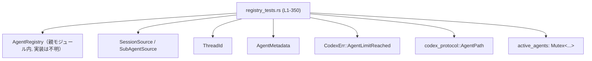
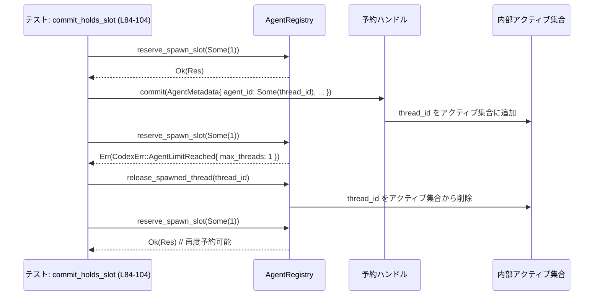

# core/src/agent/registry_tests.rs コード解説

## 0. ざっくり一言

`AgentRegistry` と関連ユーティリティ（セッション深度、ニックネーム・パス管理）の **仕様をテストで定義しているモジュール** です。  
スレッド生成制限、予約ハンドルの RAII 動作、ニックネームのリセット・序数サフィックス、エージェントパスのインデックスなどの振る舞いを確認しています。

---

## 1. このモジュールの役割

### 1.1 概要

このモジュールは、`core::agent` モジュール内の以下の振る舞いをテストします。

- ニックネーム整形関数 `format_agent_nickname` の序数サフィックス付与仕様（`registry_tests.rs:L17-39`）
- セッション／スレッド生成深度の計算と上限チェック（`session_depth`, `next_thread_spawn_depth`, `exceeds_thread_spawn_depth_limit`; `L41-71`）
- `AgentRegistry` によるスレッド生成スロットの予約／解放の挙動とエラー `CodexErr::AgentLimitReached`（`L73-160`）
- ニックネームプールの消費・リセットと `nickname_reset_count` の意味（`L162-250`, `L252-290`）
- ルートスレッドとエージェントパス (`AgentPath`) のインデックス管理（`L292-349`）

### 1.2 アーキテクチャ内での位置づけ

`use super::*;` から、このテストは同じモジュール階層の `AgentRegistry` 実装に依存していることが分かります（`L1`）。  
外部クレート `codex_protocol::AgentPath` も利用しています（`L2`）。

主要な依存関係を図にすると次のようになります。



> 備考: `AgentRegistry` や `SessionSource` などの定義位置はこのチャンクには現れませんが、`use super::*;` により同一モジュール階層に存在することが分かります。

### 1.3 設計上のポイント（テストから読み取れる範囲）

- **RAII による予約管理**  
  - `reserve_spawn_slot` が返す「予約ハンドル」を `drop` するとスロットやパスが解放されます（`L73-81`, `L305-322`）。  
  - `commit` した予約は `release_spawned_thread` 呼び出しまで占有が続きます（`L84-104`, `L324-349`）。

- **上限付きスレッド生成**  
  - `reserve_spawn_slot(Some(1))` が `Err(CodexErr::AgentLimitReached { max_threads })` を返す条件をテストで明確化しています（`L90-97`, `L115-122`, `L146-153`）。

- **セッション深度とスレッド生成深度**  
  - ルートセッション (`SessionSource::Cli`) は深度 0（`L41-44`）。
  - `SubAgentSource::ThreadSpawn { depth }` から子を生成するとき、深度が 1 増え、上限チェックされます（`L46-61`）。
  - スレッド生成以外のサブエージェント（`SubAgentSource::Review`）は深度 0 から始まることが確認できます（`L63-71`）。

- **ニックネームプールとリセット**  
  - 使われたニックネームは、スレッドが失敗した場合でも「使用済み」として扱われます（`L162-181`）。
  - プールが「枯渇」すると `nickname_reset_count` がインクリメントされ、以降は `"Plato the 2nd"` のような序数サフィックス付きのニックネームが生成されます（`L184-208`, `L210-250`, `L252-290`）。
  - `active_agents` が `Mutex` で保護されており、その中に `nickname_reset_count` が保持されています（`L203-207`, `L245-249`, `L285-289`）。

- **エージェントパスの一意性管理**  
  - `reserve_agent_path` によるパス予約は、予約ハンドルが `drop` すると解放されます（`L305-322`）。
  - `commit` されたパスは `release_spawned_thread` まで `agent_id_for_path` で引ける状態が続きます（`L324-349`）。

---

## 2. 主要な機能一覧（テストが対象としている仕様）

- ニックネーム整形: `format_agent_nickname` の序数サフィックス付与仕様（`L17-39`）
- セッション深度計算: `session_depth` のデフォルト深度（`L41-44`, `L63-67`）
- スレッド生成深度: `next_thread_spawn_depth` と `exceeds_thread_spawn_depth_limit` の関係（`L46-61`, `L63-71`）
- スレッドスロット予約: `reserve_spawn_slot` の予約／解放／上限超過エラー（`L73-160`）
- リリースの冪等性: `release_spawned_thread` が未知・重複 ID を安全に無視すること（`L106-129`, `L131-160`）
- ニックネーム管理: `reserve_agent_nickname_with_preference` とニックネームプールのリセット仕様（`L162-181`, `L184-208`, `L210-250`, `L252-290`）
- ルートスレッド登録: `register_root_thread` と `AgentPath::root()` の対応付け（`L292-303`）
- エージェントパス管理: `reserve_agent_path`, `agent_id_for_path`, `release_spawned_thread` の連携（`L305-322`, `L324-349`）

---

## 3. 公開 API と詳細解説（テストから見えるコンポーネント）

### 3.1 型一覧（構造体・列挙体など）

このファイルで利用されている主要な型を一覧します（定義はすべて他モジュールにあり、このチャンクには現れません）。

| 名前 | 種別 | 定義位置（推定） | 利用位置（このファイル） | 役割 / 用途 |
|------|------|------------------|---------------------------|-------------|
| `AgentRegistry` | 構造体 | 親モジュール（`use super::*;` より） | 初出: `L73-81`, 以降全テストで多数使用 | エージェントスレッド・ニックネーム・パスの登録／管理を行うレジストリ。`reserve_spawn_slot`, `release_spawned_thread`, `register_root_thread`, `agent_id_for_path` などのメソッドを提供。 |
| `ThreadId` | 構造体/新型 | 親モジュール | 初出: `L48-50`, `L87`, `L110-111` など | スレッド（エージェント）の識別子。新規 ID を `ThreadId::new()` で生成。 |
| `AgentMetadata` | 構造体 | 親モジュール | ヘルパの戻り値: `L10-15`; `commit` 時に使用: `L88`, `L193`, `L221`, `L234`, `L262`, `L274`, `L335-338` | エージェントの付帯情報（`agent_id`, `agent_path` など）を保持。 |
| `SessionSource` | 列挙体 | 親モジュール | `SessionSource::Cli` (`L43`), `SessionSource::SubAgent(..)` (`L48`, `L65`) | セッションの起点（CLI / サブエージェントなど）を表現。`session_depth`, `next_thread_spawn_depth` の入力。 |
| `SubAgentSource` | 列挙体 | 親モジュール | `SubAgentSource::ThreadSpawn { .. }` (`L48-54`), `SubAgentSource::Review` (`L65`) | サブエージェントの生成理由を表現。スレッド生成の場合は親の `depth` を保持。 |
| `CodexErr` | 列挙体 | 親モジュール | `CodexErr::AgentLimitReached { max_threads }` へのパターンマッチ (`L94-97`, `L119-122`, `L150-153`) | エラー型。スレッド上限に達した場合のエラー情報（`max_threads`）を保持。 |
| `AgentPath` | 構造体 | `codex_protocol` クレート | `use codex_protocol::AgentPath;` (`L2`), `AgentPath::root()` (`L300`), `try_from` 使用（`L6-8`）, パス指定（`L312`, `L332`, `L336`, `L341-342`, `L347-348`） | エージェントの論理パス（`/root/researcher` 等）を表現。 |
| 予約ハンドル型（名前不明） | 構造体 | 親モジュール | 変数 `reservation`, `first`, `second`, `third` の型（`reserve_spawn_slot` 戻り値; 例: `L73-81`, `L84-104`, `L162-181`, `L184-208` など） | スレッド生成スロットおよびニックネーム・パスの一時的な予約状態を表すハンドル。`commit`, `reserve_agent_nickname_with_preference`, `reserve_agent_path` メソッドを持つ。具体的な型名はこのチャンクには現れません。 |
| `active_agents` の中身（型名不明） | 構造体 | 親モジュール | `registry.active_agents.lock().unwrap_or_else(...).nickname_reset_count` (`L203-207`, `L245-249`, `L285-289`) | レジストリ内部でアクティブエージェント群を管理する構造体。少なくとも `nickname_reset_count: u64` のようなフィールドを持つ。`Mutex` で保護されている。 |

**補足（並行性）**  
`active_agents` に対して `lock()` を呼び `unwrap_or_else(std::sync::PoisonError::into_inner)` で取得していることから（`L203-207`, `L245-249`, `L285-289`）、`Mutex` が使われており、ロックのポイズン（panic による）を無視して内部値を取り出す方針であることが分かります。

### 3.2 重要なテスト関数の詳細

ここでは代表的なテスト関数 7 件を取り上げ、そこから読み取れる **コア API の契約・エッジケース** を整理します。

---

#### `fn format_agent_nickname_adds_ordinals_after_reset()`

**位置**: `registry_tests.rs:L17-39`

**概要**

`format_agent_nickname` がニックネームリセット回数に応じて正しい序数サフィックス（"the 2nd", "the 3rd", "the 11th", "the 21st" など）を付けることを確認するテストです。

**関数がテストしている外部 API**

- `format_agent_nickname(base: &str, nickname_reset_count: u64) -> String`（署名は推定。実体は `super` 内）

**テスト内容（アルゴリズム観点）**

- `"Plato", 0` → `"Plato"`（`L19-22`）
- `"Plato", 1` → `"Plato the 2nd"`（`L23-26`）
- `"Plato", 2` → `"Plato the 3rd"`（`L27-30`）
- `"Plato", 10` → `"Plato the 11th"`（`L31-34`）
- `"Plato", 20` → `"Plato the 21st"`（`L35-38`）

これにより少なくとも以下が要求されています。

- `nickname_reset_count == 0` のときはサフィックスなし。
- それ以外は **基数 (= reset_count + 1)** に対する英語序数を付ける。
- 11 → "11th" のような例外形も正しく扱う。

**Examples（使用例）**

このテスト自体が使用例です。

```rust
// registry_tests.rs:L19-22 より簡略化
let nick = format_agent_nickname("Plato", 1);
assert_eq!(nick, "Plato the 2nd");
```

**Errors / Panics**

- このテストでは `format_agent_nickname` 自体は panic しない前提で利用されています。
- テストは `assert_eq!` に失敗すると panic しますが、これはテスト失敗を表す通常の挙動です。

**Edge cases（エッジケース）**

- `nickname_reset_count == 0` の特別扱い（サフィックスなし）。
- 10, 20 といった 10 の倍数のとき、"11th", "21st" のように +1 した値で序数を生成することを要求しています。

**使用上の注意点**

- この関数は **ニックネームの「再利用回数」ではなく「リセット回数」** に基づいてサフィックスを付ける設計であると解釈できます（ただし詳細ロジックは実装コードを見ないと確定できません）。
- 序数ロジックは英語の規則に依存しているため、ローカライズが必要な場合は別の関数や設定が必要です（本チャンクにはそうした仕組みは現れません）。

---

#### `fn thread_spawn_depth_increments_and_enforces_limit()`

**位置**: `registry_tests.rs:L46-61`

**概要**

サブエージェントが `ThreadSpawn` によって生成されるときに、スレッド生成深度が 1 増え、指定した最大深度を超えると `exceeds_thread_spawn_depth_limit` が `true` になることを確認するテストです。

**テストしている外部 API**

- `session_depth(source: &SessionSource) -> u32`（署名は推定）
- `next_thread_spawn_depth(source: &SessionSource) -> u32`
- `exceeds_thread_spawn_depth_limit(depth: u32, max_depth: u32) -> bool`

**引数の例**

| フィールド | 型 | 説明 |
|-----------|----|------|
| `SessionSource::SubAgent(SubAgentSource::ThreadSpawn { depth: 1, .. })` | `SessionSource` | 親スレッドの生成深度を 1 として持つサブエージェント |

**内部処理の流れ（テスト観点）**

1. `SessionSource::SubAgent(SubAgentSource::ThreadSpawn { depth: 1, ... })` を構築（`L48-54`）。
2. `next_thread_spawn_depth(&session_source)` を呼び出し、戻り値を `child_depth` とする（`L55`）。
3. `child_depth == 2` であることを検証（`L56`）。
4. `exceeds_thread_spawn_depth_limit(child_depth, 1)` が `true` になることを検証（`L57-60`）。

`non_thread_spawn_subagents_default_to_depth_zero`（`L63-71`）と合わせると、以下が読み取れます。

- `SubAgentSource::Review` のような非 ThreadSpawn 起源のサブエージェントは `session_depth == 0`（`L65-66`）。
- その場合 `next_thread_spawn_depth` は 1 を返し、`exceeds_thread_spawn_depth_limit(1, 1) == false`（`L67-70`）。

**Examples（使用例）**

```rust
// registry_tests.rs:L48-56 を簡略化
let session_source = SessionSource::SubAgent(SubAgentSource::ThreadSpawn {
    parent_thread_id: ThreadId::new(),
    depth: 1,
    agent_path: None,
    agent_nickname: None,
    agent_role: None,
});
let child_depth = next_thread_spawn_depth(&session_source);
assert_eq!(child_depth, 2);
assert!(exceeds_thread_spawn_depth_limit(child_depth, 1));
```

**Errors / Panics**

- これらの関数はテスト中で panic されておらず、`assert!` / `assert_eq!` のみが panic の原因になりうる状況です。
- 深度が上限を超えた場合も、関数自体はエラーではなくブール値を返す設計と見えます。

**Edge cases**

- ルートセッション（`SessionSource::Cli`）では `session_depth == 0`（`L41-44`）。
- `SubAgentSource::Review` のような非 ThreadSpawn では、`session_depth == 0`, `next_thread_spawn_depth == 1`（`L63-71`）。
- 深度と上限が等しいときに `exceeds_thread_spawn_depth_limit` が `false` であることが保証されます（`L68-70`）。

**使用上の注意点**

- 深度上限に達したかどうかは **呼び出し側で `exceeds_thread_spawn_depth_limit` を確認して判断する想定** であり、この関数が直接エラーを投げるわけではありません。
- `SessionSource` に新しいバリアントを追加する場合、それに対する `session_depth` / `next_thread_spawn_depth` の扱いを別途テストで追加する必要があります。

---

#### `fn commit_holds_slot_until_release()`

**位置**: `registry_tests.rs:L84-104`

**概要**

`reserve_spawn_slot` によるスロット予約を `commit` すると、対応するスレッドが `release_spawned_thread` で明示的に解放されるまで、スロットが占有され続けることを確認するテストです。

**テストしている外部 API**

- `AgentRegistry::reserve_spawn_slot(max_threads: Option<usize>) -> Result<Reservation, CodexErr>`
- `Reservation::commit(metadata: AgentMetadata)`
- `AgentRegistry::release_spawned_thread(thread_id: ThreadId)`
- エラー型 `CodexErr::AgentLimitReached { max_threads }`

**内部処理の流れ（テスト観点）**

1. `AgentRegistry::default()` を `Arc` で包んで生成（`L85`）。
2. `reserve_spawn_slot(Some(1))` でスロットを 1 つ予約し、`expect` で失敗しないことを確認（`L86`）。
3. `ThreadId::new()` で新しいスレッド ID を生成し（`L87`）、`reservation.commit(agent_metadata(thread_id))` でコミット（`L88`）。
4. 再度 `reserve_spawn_slot(Some(1))` を呼び、`Err(err)` になることを `match` で確認（`L90-93`）。
5. エラーが `CodexErr::AgentLimitReached { max_threads }` であり、`max_threads == 1` であることを検証（`L94-97`）。
6. `release_spawned_thread(thread_id)` を呼び、スロットを解放（`L99`）。
7. もう一度 `reserve_spawn_slot(Some(1))` を呼び、今度は成功することを検証（`L100-103`）。

**Examples（使用例）**

```rust
// registry_tests.rs:L85-103 を簡略化した使用例
let registry = Arc::new(AgentRegistry::default());

let reservation = registry.reserve_spawn_slot(Some(1)).expect("reserve slot");
let thread_id = ThreadId::new();
reservation.commit(agent_metadata(thread_id));

// これ以上スレッドを増やせない
let err = match registry.reserve_spawn_slot(Some(1)) {
    Ok(_) => panic!("limit should be enforced"),
    Err(err) => err,
};
let CodexErr::AgentLimitReached { max_threads } = err else {
    panic!("expected CodexErr::AgentLimitReached");
};
assert_eq!(max_threads, 1);

// スレッドを解放すると再度予約可能
registry.release_spawned_thread(thread_id);
let reservation = registry
    .reserve_spawn_slot(Some(1))
    .expect("slot released after thread removal");
drop(reservation);
```

**Errors / Panics**

- `reserve_spawn_slot` の失敗時には `CodexErr::AgentLimitReached { max_threads }` が返る契約をテストしています（`L94-96`）。
- このテストでは `reserve_spawn_slot` は `Result` を返す前提であり、直接 panic しない想定です。
- `expect` と `panic!` による panic はテストの失敗条件として意図的です。

**Edge cases**

- `max_threads` が 1 の場合、1 スレッドをコミットした時点で次の予約は必ず `Err(AgentLimitReached{ max_threads: 1 })` になる（`L86-97`）。
- スロットを解放する唯一の方法は `release_spawned_thread` を呼ぶことであり、予約ハンドルの `drop` だけではコミット済みスロットは解放されない（このテストと `reservation_drop_releases_slot`（`L73-81`）との対比から読み取れます）。

**使用上の注意点**

- **スレッドが実際に起動した後は必ず `release_spawned_thread` を呼ぶ契約**になっていると解釈できます。さもないとスロットが枯渇し、以後の生成が `AgentLimitReached` になります。
- `reserve_spawn_slot` の戻り値を `drop` するだけでは、コミット済みスロットは解放されない点に注意が必要です。

---

#### `fn release_is_idempotent_for_registered_threads()`

**位置**: `registry_tests.rs:L131-160`

**概要**

`release_spawned_thread` を同じ `ThreadId` に対して複数回呼んでも、2 回目以降は何も起きず（冪等）、スレッド上限のカウントには影響を与えないことを確認するテストです。

**テストしている外部 API**

- `AgentRegistry::release_spawned_thread(thread_id: ThreadId)` の冪等性
- `reserve_spawn_slot` と `CodexErr::AgentLimitReached`

**内部処理の流れ**

1. レジストリ生成 & スロット予約 (`Some(1)`)（`L133-135`）。
2. `first_id` をコミットし、スロットを消費（`L135-137`）。
3. `release_spawned_thread(first_id)` でスロットを解放（`L138`）。
4. 再度スロットを予約し、`second_id` をコミット（`L140-142`）。
5. 再び `release_spawned_thread(first_id)` を呼ぶが、この時点で `first_id` は既に登録されていない（`L144`）。
6. それでも `reserve_spawn_slot(Some(1))` は `Err(AgentLimitReached { max_threads: 1 })` を返し、`second_id` によるスロット占有は維持されていることを確認（`L146-153`）。
7. `release_spawned_thread(second_id)` を呼び、スロットが解放されることを確認（`L155-159`）。

**Examples（使用例）**

```rust
// registry_tests.rs:L133-159 を簡略化
let registry = Arc::new(AgentRegistry::default());

let reservation = registry.reserve_spawn_slot(Some(1)).expect("reserve slot");
let first_id = ThreadId::new();
reservation.commit(agent_metadata(first_id));

// 一度目の解放
registry.release_spawned_thread(first_id);

// ふたたび予約・別IDをコミット
let reservation = registry.reserve_spawn_slot(Some(1)).expect("slot reused");
let second_id = ThreadId::new();
reservation.commit(agent_metadata(second_id));

// first_id の再解放は無視される
registry.release_spawned_thread(first_id);

// 依然として上限に達している
let err = match registry.reserve_spawn_slot(Some(1)) {
    Ok(_) => panic!("limit should still be enforced"),
    Err(err) => err,
};
let CodexErr::AgentLimitReached { max_threads } = err else {
    panic!("expected CodexErr::AgentLimitReached");
};
assert_eq!(max_threads, 1);

// second_id を解放するとスロットが空く
registry.release_spawned_thread(second_id);
let reservation = registry
    .reserve_spawn_slot(Some(1))
    .expect("slot released after second thread removal");
drop(reservation);
```

**Errors / Panics**

- 未登録または既に解放済みの `ThreadId` を `release_spawned_thread` に渡してもエラーにはならず、単に無視されることを `release_ignores_unknown_thread_id` と合わせて確認しています（`L106-129`, `L144`）。
- これにより、二重解放による panic などは起きない設計です。

**Edge cases**

- 未登録 ID の解放（`release_ignores_unknown_thread_id`, `L106-129`）と、登録済み後に解放された ID の再解放（このテスト、`L144`）のどちらも安全に無視されます。
- どちらのケースでも、既存スレッドのスロットには影響しないことが保証されます。

**使用上の注意点**

- 呼び出し元は `release_spawned_thread` の冪等性に依存できるため、「一度だけ呼ぶ」ことを厳密に保証する必要はありません。
- ただし、解放すべき ID を間違えてもスロット上限が意図せず緩むことはないため、安全側の設計になっています。

---

#### `fn released_nickname_stays_used_until_pool_reset()`

**位置**: `registry_tests.rs:L210-250`

**概要**

一度割り当てたニックネームは、そのエージェントが `release_spawned_thread` で解放された後でも、**プールがリセットされるまでは「使用済み」として扱われる**ことを確認するテストです。

**テストしている外部 API**

- `Reservation::reserve_agent_nickname_with_preference(candidates: &[&str], preferred: Option<&str>) -> Result<String, _>`
- `Reservation::commit`
- `AgentRegistry::release_spawned_thread`
- レジストリ内部の `nickname_reset_count`

**内部処理の流れ**

1. レジストリ生成（`L212`）。
2. `first` 予約を取得し、候補 `["alpha"]` からニックネームを予約 → `"alpha"`（`L214-221`, `L222`）。
3. `first_id` でコミットし、スレッドを登録（`L220-221`）。
4. `release_spawned_thread(first_id)` でスレッドを解放（`L224`）。
5. `second` 予約を取得し、候補 `["alpha", "beta"]` からニックネームを予約 → `"beta"`（`L226-232`）。
   - ここで `"alpha"` はスレッドが既に解放されているにもかかわらず選ばれない。
6. `second_id` でコミットし、その後再び解放（`L233-235`）。
7. `third` 予約で再度 `["alpha", "beta"]` を与えると、今度は `"alpha the 2nd"` または `"beta the 2nd"` のいずれかが返る（`L237-244`）。
8. `nickname_reset_count == 1` であることを確認し、プールのリセットが 1 回行われたことを検証（`L245-249`）。

**Examples（使用例）**

```rust
// registry_tests.rs:L214-244 を要約
let registry = Arc::new(AgentRegistry::default());

// 1. alpha を使用
let mut first = registry.reserve_spawn_slot(None).expect("reserve first slot");
let first_name = first
    .reserve_agent_nickname_with_preference(&["alpha"], None)
    .expect("reserve first agent name");
let first_id = ThreadId::new();
first.commit(agent_metadata(first_id));
assert_eq!(first_name, "alpha");
registry.release_spawned_thread(first_id);

// 2. alpha は解放後も使用済みとして扱われ、beta が選ばれる
let mut second = registry
    .reserve_spawn_slot(None)
    .expect("reserve second slot");
let second_name = second
    .reserve_agent_nickname_with_preference(&["alpha", "beta"], None)
    .expect("released name should still be marked used");
assert_eq!(second_name, "beta");
let second_id = ThreadId::new();
second.commit(agent_metadata(second_id));
registry.release_spawned_thread(second_id);

// 3. プールリセット後、2nd サフィックス付きニックネームが生成される
let mut third = registry
    .reserve_spawn_slot(None)
    .expect("reserve third slot");
let third_name = third
    .reserve_agent_nickname_with_preference(&["alpha", "beta"], None)
    .expect("pool reset should permit a duplicate");
let expected_names = HashSet::from(["alpha the 2nd".to_string(), "beta the 2nd".to_string()]);
assert!(expected_names.contains(&third_name));
```

**Errors / Panics**

- `reserve_agent_nickname_with_preference` は `Result` を返し、テストでは `expect(...)` で成功を前提としています（`L218-220`, `L229-231`, `L241-242`）。
- ニックネームが全く選べない場合にどのようなエラーが返るかは、このチャンクには現れません（不明）。

**Edge cases**

- 「解放されたニックネーム」も **プールリセットまでは再利用されない** ことが仕様になっています。
  - alpha → 使用 → 解放 → なお使用済み扱い（`L224`, `L226-232`）。
- プールリセット後は、元の候補文字列に `"the 2nd"` サフィックス付きの形で再出現します（`L243-244`）。

**使用上の注意点**

- エージェントが起動に失敗したケースでもニックネームが「使用済み」となる仕様は `failed_spawn_keeps_nickname_marked_used` で確認されており（`L162-181`）、**短時間に大量の失敗スパンがあると、すぐにサフィックス付きニックネームに移行する**可能性があります。
- ニックネームの「一意性」は「同一ベース名の同時利用がない」ことを意味し、時系列的には同じベース名を繰り返し使う設計になっています（サフィックスで区別）。

---

#### `fn repeated_resets_advance_the_ordinal_suffix()`

**位置**: `registry_tests.rs:L252-290`

**概要**

ニックネームプールのリセットが繰り返されるごとに `nickname_reset_count` が増加し、それに伴ってニックネームの序数サフィックスも `"the 2nd"`, `"the 3rd"` と進んでいくことを確認するテストです。

**内部処理の流れ**

1. 1 回目:
   - `"Plato"` を割り当て、`first_id` でコミット後リリース（`L256-265`）。
2. 2 回目:
   - 再度 `"Plato"` を候補に指定し、今度は `"Plato the 2nd"` が返る（`L267-275`）。
   - コミット後リリース（`L273-276`）。
3. 3 回目:
   - 再度 `"Plato"` を候補に指定し、 `"Plato the 3rd"` が返る（`L278-284`）。
4. 最後に `nickname_reset_count == 2` であることを確認（`L285-289`）。

**読み取れる仕様**

- `nickname_reset_count` は「プールリセット回数」のような意味を持ち、  
  `"Plato"` → `"Plato the 2nd"` → `"Plato the 3rd"` とサフィックスが進むに従って `1, 2, ...` と増加しているように見えます。
- サフィックスの決定には `format_agent_nickname` のロジックが用いられていると考えられますが（`L17-39`）、実装はこのチャンクからは確認できません。

**使用上の注意点**

- ニックネームのサフィックスは **ベース名ごとではなく、グローバルなリセット回数に依存**している可能性があります（`nickname_reset_count` が `active_agents` 内に一つだけ存在しているため、`L203-207`, `L245-249`, `L285-289`）。  
  ただし、ベース名別のカウントかどうかはコードからは断定できません。

---

#### `fn committed_agent_path_is_indexed_until_release()`

**位置**: `registry_tests.rs:L324-349`

**概要**

`reserve_agent_path` で予約し、`commit` で確定した `AgentPath` が `agent_id_for_path` で引けるようになり、その後 `release_spawned_thread` を呼ぶとエントリが削除されることを確認するテストです。

**テストしている外部 API**

- `Reservation::reserve_agent_path(path: &AgentPath) -> Result<(), _>`
- `Reservation::commit(metadata: AgentMetadata)`
- `AgentRegistry::agent_id_for_path(path: &AgentPath) -> Option<ThreadId>`
- `AgentRegistry::release_spawned_thread(thread_id: ThreadId)`

**内部処理の流れ**

1. レジストリ生成とスロット予約（`L326-330`）。
2. `agent_path("/root/researcher")` で `AgentPath` を構築するヘルパーを利用（`L331-333`）。  
   - `agent_path` ヘルパーは `AgentPath::try_from(path).expect("valid agent path")` で `AgentPath` を生成します（`L6-8`）。
3. `reserve_agent_path` でパスを予約（`L331-333`）。
4. `AgentMetadata { agent_id: Some(thread_id), agent_path: Some(agent_path("/root/researcher")), .. }` を使って `commit`（`L334-338`）。
5. `agent_id_for_path(&agent_path("/root/researcher")) == Some(thread_id)` であることを検証（`L340-343`）。
6. `release_spawned_thread(thread_id)` を呼び、スレッドを解放（`L345`）。
7. 再度 `agent_id_for_path` を呼び、今度は `None` になることを確認（`L346-348`）。

**Examples（使用例）**

```rust
// registry_tests.rs:L326-348 を簡略化
let registry = Arc::new(AgentRegistry::default());
let thread_id = ThreadId::new();
let mut reservation = registry
    .reserve_spawn_slot(None)
    .expect("reserve slot");

reservation
    .reserve_agent_path(&agent_path("/root/researcher"))
    .expect("reserve path");

reservation.commit(AgentMetadata {
    agent_id: Some(thread_id),
    agent_path: Some(agent_path("/root/researcher")),
    ..Default::default()
});

// インデックスに登録されている
assert_eq!(
    registry.agent_id_for_path(&agent_path("/root/researcher")),
    Some(thread_id)
);

// 解放後は登録が消える
registry.release_spawned_thread(thread_id);
assert_eq!(
    registry.agent_id_for_path(&agent_path("/root/researcher")),
    None
);
```

**Errors / Panics**

- `reserve_agent_path` は `Result` を返し、失敗時には `expect("reserve path")` で panic します（`L331-333`）。  
  どのような条件で失敗しうるかは、`reserved_agent_path_is_released_when_spawn_fails`（`L305-322`）から部分的に読み取れますが、詳細なエラー型はこのチャンクには現れません。
- 二重に同じパスを予約した場合は、後述のテストより「2 回目は失敗するが、予約ハンドルが drop された後なら成功する」という振る舞いが確認できます（`L305-322`）。

**Edge cases**

- スレッド生成が失敗し、予約ハンドルが `drop` された場合、パス予約も解放される（`reserved_agent_path_is_released_when_spawn_fails`, `L305-322`）。
- コミットされていないパスはインデックス（`agent_id_for_path`）に登録されない。 インデックスへの登録は `commit` の一部とみなせます（`L334-343`）。

**使用上の注意点**

- パスの一意性を保証するためには、**必ず予約（`reserve_agent_path`）→ commit → release** のライフサイクルに従う必要があります。
- 予約ハンドルを drop した場合はパス予約も解放されるため、「予約したがスレッド生成に失敗した」ケースでもパスリークは起きない設計です（`L305-322`）。

---

### 3.3 その他の関数（テスト・ヘルパー）

このファイル内の残りの関数を一覧します。

| 関数名 | 種別 | 位置 | 役割（1 行） |
|--------|------|------|--------------|
| `fn agent_path(path: &str) -> AgentPath` | ヘルパー | `L6-8` | 文字列から `AgentPath::try_from` で `AgentPath` を生成し、失敗時には panic するテスト用ユーティリティ。 |
| `fn agent_metadata(thread_id: ThreadId) -> AgentMetadata` | ヘルパー | `L10-15` | `agent_id` フィールドだけを設定した `AgentMetadata` を返すテスト用ユーティリティ。 |
| `fn session_depth_defaults_to_zero_for_root_sources()` | テスト | `L41-44` | `SessionSource::Cli` の `session_depth` が 0 であることを検証。 |
| `fn non_thread_spawn_subagents_default_to_depth_zero()` | テスト | `L63-71` | `SubAgentSource::Review` の `session_depth` と `next_thread_spawn_depth` のデフォルトを検証。 |
| `fn reservation_drop_releases_slot()` | テスト | `L73-81` | スロット予約だけ行って `drop` すると、再度予約できることを確認し、予約ハンドルの RAII 動作をテスト。 |
| `fn release_ignores_unknown_thread_id()` | テスト | `L106-129` | 存在しない `ThreadId` に対する `release_spawned_thread` が上限カウントに影響しないことを検証。 |
| `fn failed_spawn_keeps_nickname_marked_used()` | テスト | `L162-181` | スレッド生成に失敗して予約が drop された場合でも、ニックネームが使用済みとして扱われることを確認。 |
| `fn agent_nickname_resets_used_pool_when_exhausted()` | テスト | `L183-208` | ニックネームプールが使い尽くされると、次回から `"alpha the 2nd"` などのサフィックス付きニックネームが使われ、`nickname_reset_count` が増えることを確認。 |
| `fn register_root_thread_indexes_root_path()` | テスト | `L292-303` | `register_root_thread` により `AgentPath::root()` がルートスレッド ID にマッピングされることを確認。 |
| `fn reserved_agent_path_is_released_when_spawn_fails()` | テスト | `L305-322` | パス予約のみ行って予約が drop された場合、そのパスが再度予約可能になることを確認。 |

---

## 4. データフロー

ここでは、代表的なシナリオとして「スレッドスロットの予約・コミット・解放」を取り上げ、テスト `commit_holds_slot_until_release`（`L84-104`）に基づいてデータフローを説明します。

### 4.1 スロット予約と上限エラーのフロー

**概要**

- `AgentRegistry` からスロットの予約ハンドルを取得する。
- 予約ハンドルに対して `commit` を行うと、内部のアクティブスレッド集合に登録される。
- 上限 (`max_threads`) に達すると、新たな予約は `CodexErr::AgentLimitReached` で失敗する。
- `release_spawned_thread` を呼ぶと集合から削除され、再度予約可能になる。

**シーケンス図**



**セーフティ / 並行性の観点**

- アクティブ集合は `Mutex` で保護されており（`active_agents.lock()`, `L203-207`）、並行アクセス時も整合性が保たれるようになっています。
- テストコードは単一スレッドで実行されますが、`Arc<AgentRegistry>` を介して共有される前提の設計です（`L73`, `L85`, `L108`, ...）。

---

## 5. 使い方（How to Use）

このモジュール自体はテスト専用ですが、テストコードは `AgentRegistry` と周辺 API を利用する典型的な方法を示しています。

### 5.1 基本的な使用方法（スレッド生成のライフサイクル）

`commit_holds_slot_until_release` と `committed_agent_path_is_indexed_until_release` を組み合わせると、以下のような使用パターンが見えます。

```rust
// 例: registry_tests.rs:L84-104, L324-349 を組み合わせたもの

let registry = Arc::new(AgentRegistry::default());           // レジストリ生成
let thread_id = ThreadId::new();                             // 新しいスレッドID

// 1. スロットを予約（最大スレッド数に制限をかける場合は Some(上限) を渡す）
let mut reservation = registry
    .reserve_spawn_slot(/*max_threads*/ Some(1))
    .expect("reserve slot");

// 2. ニックネームやパスなど、必要なリソースを予約する
let agent_nickname = reservation
    .reserve_agent_nickname_with_preference(&["alpha"], None)
    .expect("reserve agent nickname");

reservation
    .reserve_agent_path(&agent_path("/root/researcher"))
    .expect("reserve agent path");

// 3. スレッドメタデータを commit してレジストリに登録する
reservation.commit(AgentMetadata {
    agent_id: Some(thread_id),
    agent_path: Some(agent_path("/root/researcher")),
    // 他のメタデータはデフォルト
    ..Default::default()
});

// 4. path → thread_id の引き当てが可能になる
assert_eq!(
    registry.agent_id_for_path(&agent_path("/root/researcher")),
    Some(thread_id)
);

// 5. スレッド終了時に release を呼び、スロットとパスを解放する
registry.release_spawned_thread(thread_id);
```

### 5.2 よくある使用パターン

1. **上限なしでのスレッド生成**

    - テストでは `max_threads` に `None` を渡すことで、スレッド数に上限を設けないパターンが利用されています（`L162-167`, `L183-188`, `L210-216`, `L252-258`, `L305-310`, `L324-330`）。
    - この場合、`reserve_spawn_slot` は `CodexErr::AgentLimitReached` を返さない前提でテストされています。

2. **失敗したスレッド生成の扱い**

    - スロットを予約し、ニックネームやパスを予約したものの、実際のスレッド生成が失敗した場合は、  
      **予約ハンドルを `drop` するだけでスロット・パスは解放**されます（`L73-81`, `L162-173`, `L305-315`）。
    - ただし、ニックネームについては「使用済み」と扱い続ける仕様である点が特徴です（`L162-181`）。

3. **ルートスレッドの登録**

    ```rust
    // registry_tests.rs:L292-303 より
    let registry = Arc::new(AgentRegistry::default());
    let root_thread_id = ThreadId::new();

    registry.register_root_thread(root_thread_id);

    assert_eq!(
        registry.agent_id_for_path(&AgentPath::root()),
        Some(root_thread_id)
    );
    ```

    - CLI などのルートセッションに対応するスレッドを `AgentPath::root()` に紐付ける際に利用されます。

### 5.3 よくある誤用と注意点（テストから推測できるもの）

テストから「こうしてはいけない」ケースが見えてきます。

```rust
// 誤りが想定される使用例 1: コミット後に release しない
let reservation = registry.reserve_spawn_slot(Some(1)).unwrap();
let thread_id = ThreadId::new();
reservation.commit(agent_metadata(thread_id));
// release_spawned_thread(thread_id) を呼び忘れると、以後の予約が AgentLimitReached になる

// 誤りが想定される使用例 2: 失敗したスレッド生成でニックネームが再利用されると思う
let mut reservation = registry.reserve_spawn_slot(None).unwrap();
let nick = reservation
    .reserve_agent_nickname_with_preference(&["alpha"], None)
    .unwrap();
// 実際には使用しないので、"alpha" はまた使えるだろうと期待する

drop(reservation);

// 実際の挙動: "alpha" は使用済みと見なされ、次は "beta" が選ばれる（L162-181）
```

### 5.4 モジュール全体の注意点（安全性・エラー・パフォーマンス）

- **エラー処理**

  - スレッド数の上限に達すると、`reserve_spawn_slot` は `Err(CodexErr::AgentLimitReached { max_threads })` を返します（`L90-97`, `L115-122`, `L146-153`）。
  - ニックネーム・パスの予約関数は `Result` を返し、`expect` で失敗時は panic します（`L169-170`, `L190-191`, `L218-219`, `L229-231`, `L241-242`, `L312-313`, `L332-333`）。

- **並行性**

  - `AgentRegistry` は `Arc` で共有される前提です（全テストで `Arc::new` を使用、`L73`, `L85`, `L108`, `L133`, `L164`, `L185`, `L212`, `L254`, `L294`, `L307`, `L326`）。
  - 内部の `active_agents` は `Mutex` で保護され、`lock().unwrap_or_else(PoisonError::into_inner)` によりポイズンロックからも回復する設計です（`L203-207`, `L245-249`, `L285-289`）。

- **セキュリティ / 安全性**

  - 未知または二重解放された `ThreadId` に対する `release_spawned_thread` が上限カウントに影響を与えない設計であり、解放周りのバグを吸収しやすい安全側の挙動です（`L106-129`, `L131-160`）。
  - ニックネームの再利用ポリシーは、ログや UI 上で「かつて存在したエージェント」と混同されないように配慮されている可能性がありますが、これは推測であり、このチャンクからは確定できません。

- **パフォーマンス**

  - テストから直接パフォーマンス特性は分かりませんが、ニックネームプールの消費・リセットは、使用済みニックネームの集合サイズに依存する処理であることが想定されます。  
    ただし、実際のデータ構造（`HashSet` など）や性能はこのチャンクには現れません。

---

## 6. 変更の仕方（How to Modify）

このファイルはテストモジュールのため、「このテストをどう変更するとよいか」という視点で説明します。  
**実装コード（`AgentRegistry` など）を変更する際には、ここに挙げるテストを基準に仕様を確認する**とよいです。

### 6.1 新しい機能を追加する場合（テスト側）

- **新しいセッションソースやサブエージェント種別を追加する場合**

  - `SessionSource` / `SubAgentSource` に新しいバリアントを追加したら、その深度計算が妥当かを確認するテストを、`session_depth_defaults_to_zero_for_root_sources`（`L41-44`）や `non_thread_spawn_subagents_default_to_depth_zero`（`L63-71`）に倣って追加するのが自然です。

- **新しいニックネーム戦略を導入する場合**

  - ニックネームフォーマットやプールリセット条件を変更する場合は、以下のテスト群が仕様を定めているため、併せて見直す必要があります。
    - `format_agent_nickname_adds_ordinals_after_reset`（`L17-39`）
    - `failed_spawn_keeps_nickname_marked_used`（`L162-181`）
    - `agent_nickname_resets_used_pool_when_exhausted`（`L183-208`）
    - `released_nickname_stays_used_until_pool_reset`（`L210-250`）
    - `repeated_resets_advance_the_ordinal_suffix`（`L252-290`）

- **エージェントパスの階層構造を拡張する場合**

  - 新しい種類のパス（例えば `/root/researcher/assistant`）を導入する場合は、`reserved_agent_path_is_released_when_spawn_fails`（`L305-322`）と `committed_agent_path_is_indexed_until_release`（`L324-349`）に類似のテストを追加すると、パス予約／解放の正しさを検証できます。

### 6.2 既存の機能を変更する場合（仕様変更に伴うテスト調整）

- **スレッド数上限ロジックを変更する場合**

  - `reserve_spawn_slot` の挙動を変える場合、以下のテストがすべて仕様として効いているため、変更の前後でどのような挙動にしたいかを明確にし、それに合わせてテストを更新する必要があります。
    - `reservation_drop_releases_slot`（`L73-81`）
    - `commit_holds_slot_until_release`（`L84-104`）
    - `release_ignores_unknown_thread_id`（`L106-129`）
    - `release_is_idempotent_for_registered_threads`（`L131-160`）

- **ニックネームの再利用ポリシーを変えたい場合**

  - 「失敗したスレッド生成のニックネームは再利用してよい」といった仕様に変えると、`failed_spawn_keeps_nickname_marked_used`（`L162-181`）は意図的に壊れることになります。
  - そのような変更を行う場合は、テスト名やアサーションを新仕様に合わせて書き換える必要があります。

- **`AgentPath` の扱いを変える場合**

  - パス予約のスコープ（予約ハンドル drop 時に解放されるかどうか）や、`release_spawned_thread` とインデックスの関係を変更する場合、`reserved_agent_path_is_released_when_spawn_fails`（`L305-322`）と `committed_agent_path_is_indexed_until_release`（`L324-349`）が壊れるかどうかを確認することが重要です。

---

## 7. 関連ファイル

このモジュールと密接に関係するファイル・モジュールを、コードから読み取れる範囲で整理します。

| パス / モジュール | 役割 / 関係 |
|-------------------|------------|
| 親モジュール（`use super::*;` でインポートされるもの） | `AgentRegistry`, `SessionSource`, `SubAgentSource`, `ThreadId`, `AgentMetadata`, `CodexErr`, `format_agent_nickname`, `session_depth`, `next_thread_spawn_depth`, `exceeds_thread_spawn_depth_limit` などの実装を提供します（`L1`, 各テストでの使用）。具体的なファイルパスはこのチャンクからは分かりません。 |
| `codex_protocol::AgentPath` | エージェントパス型。`AgentPath::root()` および `AgentPath::try_from` を通じて、ルートパスや `/root/researcher` などのパス表現を提供します（`L2`, `L6-8`, `L300-301`, `L312-313`, `L332-333`, `L336-337`, `L341-343`, `L347-348`）。 |
| `pretty_assertions::assert_eq` | テスト用の `assert_eq!` マクロ。差分を見やすく出力する目的で利用されていると考えられます（`L3`）。 |
| `std::collections::HashSet` | ニックネームの候補集合と比較に利用されています（`L4`, `L243-244`）。 |
| `std::sync::{Arc, Mutex, PoisonError}` | `AgentRegistry` の共有（`Arc`）と内部状態の排他制御（`Mutex`）、およびポイズンロックからの復帰（`PoisonError::into_inner`）に利用されます（`L73`, `L85`, `L108`, `L133`, `L164`, `L185`, `L212`, `L254`, `L294`, `L307`, `L326`, `L203-207`, `L245-249`, `L285-289`）。 |

このテストファイルは、`AgentRegistry` 周辺の **契約（Contract）を具体的な例とアサーションで示した仕様書的な役割** を果たしており、実装を変更する際のリファレンスとして利用することができます。
