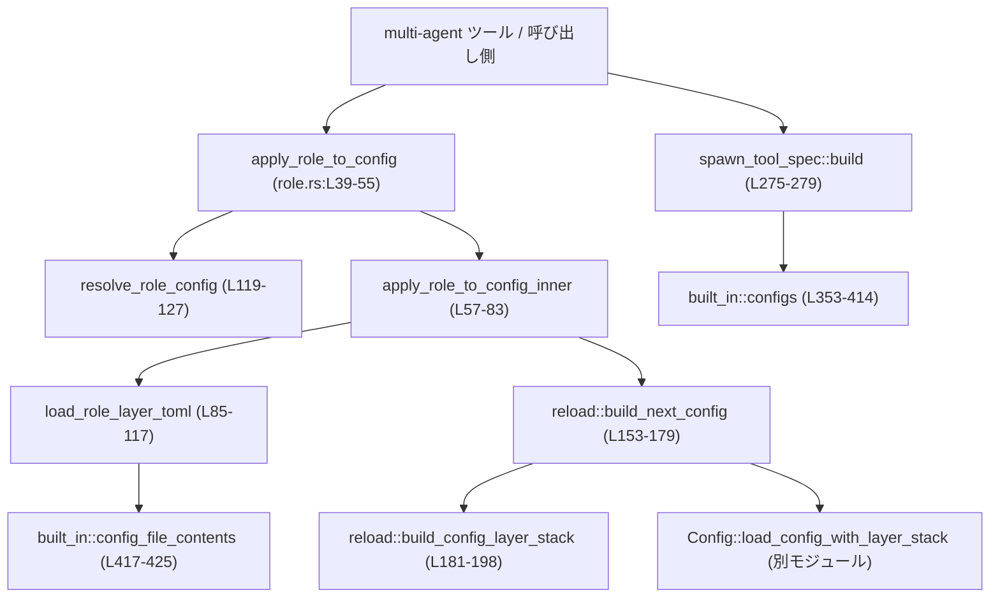
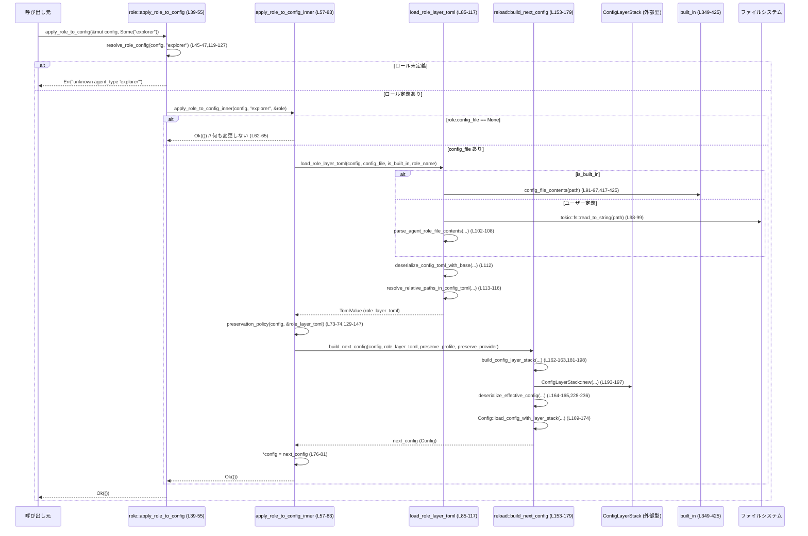

core/src/agent/role.rs コード解説
================================================

## 0. ざっくり一言

このモジュールは、既存のセッション `Config` に対して「エージェントロール」用の設定レイヤーを適用する処理と、利用可能なロール一覧の説明文を生成する処理を提供するものです（`role.rs:L1-7, L31-38, L272-303`）。

---

## 1. このモジュールの役割

### 1.1 概要

- このモジュールは **エージェントの「役割（role）」に応じた設定レイヤー** を `Config` に適用するために存在し、以下の機能を提供します。
  - 組み込みロールとユーザー定義ロールから、指定されたロールの設定ファイル（TOML）を読み込み、現在の `Config` に高優先度レイヤーとして挿入する（`role.rs:L39-83, L85-117, L150-269`）。
  - ロール適用時にも、**呼び出し元が選んだ profile / model_provider を必要に応じて保持**する（`role.rs:L31-38, L129-147, L153-179, L260-269`）。
  - 利用可能なロール一覧と説明文を生成し、spawn-agent ツールのヘルプテキストとして使える文字列を構築する（`role.rs:L272-303, L305-345`）。
  - 組み込みロール定義（`default`, `explorer`, `worker`）を静的に保持し、必要に応じて組み込み TOML を埋め込み文字列から読み出す（`role.rs:L349-425`）。

### 1.2 アーキテクチャ内での位置づけ

このモジュールは、全体として「セッション設定」と「ロール設定ファイル」の間に入るレイヤーです。



- `apply_role_to_config` がモジュールのフロントドアとなり、ロール名に基づいてロール設定を解決し、適用します（`role.rs:L39-55`）。
- 実際の設定レイヤー構築とマージは内部モジュール `reload` が担います（`role.rs:L150-269`）。
- spawn-agent ツールの説明テキスト生成は `spawn_tool_spec` サブモジュールが担い、その元データとして `built_in` サブモジュールの組み込みロール定義を利用します（`role.rs:L272-347, L349-425`）。

### 1.3 設計上のポイント

コードから読み取れる特徴は以下の通りです。

- **責務分割**
  - 外向き API（ロールの適用・ロール一覧の説明）はトップレベル関数と `spawn_tool_spec` モジュールにまとまっています（`role.rs:L39-55, L272-303`）。
  - 設定レイヤースタックの構築・マージは `reload` モジュールに分離されており、テストや再利用を意識した構造になっています（`role.rs:L150-269`）。
  - 組み込みロール定義は `built_in` モジュールに閉じ込められています（`role.rs:L349-425`）。

- **状態管理**
  - `apply_role_to_config` は `&mut Config` を受け取り、新しい構成で `Config` 自体を書き換えますが、グローバルな可変状態は `LazyLock` を用いた組み込みロールマップのみで、これは初期化後は読み取り専用です（`role.rs:L24, L353-414`）。
  - それ以外は関数スコープ内で完結するローカル変数のみで、共有可変状態は持ちません。

- **エラーハンドリング**
  - 内部処理は `anyhow::Result` を用いて詳細なエラー情報を保持し（`role.rs:L57-61, L85-90, L150-158`）、外向きの `apply_role_to_config` ではログ出力後に、利用者向けのシンプルな `String` エラーに変換します（`role.rs:L49-54`）。
  - ファイル I/O、TOML パース、設定マージなどはすべて `Result` 経由で伝播されており、panic を発生させる記述はありません（`role.rs:L91-116, L164-178, L200-225`）。

- **並行性**
  - 非同期 API として `apply_role_to_config` / `load_role_layer_toml` が `async fn` で実装され、ユーザー定義ロールファイルの読み込みには `tokio::fs::read_to_string` を用いることで、非同期 I/O を行っています（`role.rs:L39-42, L85-90, L98-99`）。
  - 組み込みロール定義へのアクセスは `LazyLock` + イミュータブルな `BTreeMap` であり、複数スレッドから同時に読み取っても安全です（`role.rs:L24, L353-414`）。

---

## 2. 主要な機能一覧

- ロール適用: `apply_role_to_config` による、指定ロールの設定レイヤーを `Config` に適用する処理（`role.rs:L39-55`）。
- ロール解決: `resolve_role_config` による、ユーザー定義ロールと組み込みロールからのロール宣言検索（`role.rs:L119-127`）。
- プロファイル／プロバイダ保持方針の判定: `preservation_policy` による、現在の `profile` / `model_provider` を保持するかどうかの決定（`role.rs:L129-147`）。
- ロール設定ファイルの読み込み: `load_role_layer_toml` による、組み込み／外部ファイルからのロール TOML の読み込み・検証・パス解決（`role.rs:L85-117`）。
- 設定レイヤースタックの再構築: `reload::build_next_config` と関連関数による、ロールレイヤーを含む新しい `Config` の構築（`role.rs:L150-269`）。
- spawn-agent 用説明文生成: `spawn_tool_spec::build` ほかにより、利用可能なロール名と説明を含むヘルプ文字列の生成（`role.rs:L272-303, L305-345`）。
- 組み込みロール定義の提供: `built_in::configs` による、`default` / `explorer` / `worker` ロール宣言の提供（`role.rs:L349-414`）。

### 2.1 コンポーネントインベントリー（関数・定数・モジュール）

| 名前 | 種別 | 可視性 | 位置 | 役割 / 用途 |
|------|------|--------|------|-------------|
| `DEFAULT_ROLE_NAME` | 定数 `&'static str` | `pub` | `role.rs:L27-28` | `agent_type` 省略時に用いるデフォルトロール名 `"default"`。 |
| `AGENT_TYPE_UNAVAILABLE_ERROR` | 定数 `&'static str` | `const`（モジュール内） | `role.rs:L29` | ロール適用失敗時に返す共通エラーメッセージ。 |
| `apply_role_to_config` | 関数（`async`） | `pub(crate)` | `role.rs:L39-55` | 指定ロールを現在の `Config` に適用するモジュールのメイン API。 |
| `apply_role_to_config_inner` | 関数（`async`） | モジュール内 | `role.rs:L57-83` | ロール設定ファイルの読み込み・保持方針決定・再ロードの内部処理。 |
| `load_role_layer_toml` | 関数（`async`） | モジュール内 | `role.rs:L85-117` | ロールの TOML 設定ファイルを読み込み、パス解決を行う。 |
| `resolve_role_config` | 関数 | `pub(crate)` | `role.rs:L119-127` | ユーザー定義／組み込みロールからロール宣言を検索する。 |
| `preservation_policy` | 関数 | モジュール内 | `role.rs:L129-147` | ロール適用時に既存の `profile` / `model_provider` を保持するか判定する。 |
| `reload` | モジュール | モジュール内 | `role.rs:L150-269` | ロールレイヤーを含む新しい `Config` の構築処理をカプセル化。 |
| `reload::build_next_config` | 関数 | `pub(super)` | `role.rs:L153-179` | 既存 `Config` とロールレイヤーから次の `Config` を構築する。 |
| `reload::build_config_layer_stack` | 関数 | モジュール内 | `role.rs:L181-198` | 既存レイヤー + ロールレイヤー + 解決済みプロファイルレイヤーから新規 `ConfigLayerStack` を作成。 |
| `reload::resolved_profile_layer` | 関数 | モジュール内 | `role.rs:L200-226` | ロール適用後の実効設定から、アクティブプロファイルの設定のみを抽出したレイヤーを生成。 |
| `reload::deserialize_effective_config` | 関数 | モジュール内 | `role.rs:L228-236` | レイヤースタックから得た TOML を `ConfigToml` にデシリアライズ。 |
| `reload::existing_layers` | 関数 | モジュール内 | `role.rs:L238-248` | 既存の `ConfigLayerStack` からレイヤー一覧を抽出。 |
| `reload::insert_layer` | 関数 | モジュール内 | `role.rs:L250-254` | レイヤー名順になるよう `ConfigLayerEntry` をソート挿入。 |
| `reload::role_layer` | 関数 | モジュール内 | `role.rs:L256-258` | ロールレイヤー専用の `ConfigLayerEntry` を生成。 |
| `reload::reload_overrides` | 関数 | モジュール内 | `role.rs:L260-269` | 再ロード時に適用する `ConfigOverrides` を構築。 |
| `spawn_tool_spec` | モジュール | `pub(crate)` | `role.rs:L272-347` | spawn-agent ツール用のロール説明文生成処理を提供。 |
| `spawn_tool_spec::build` | 関数 | `pub(crate)` | `role.rs:L275-279` | 組み込み＋ユーザー定義ロールから説明文字列を構築する外向き API。 |
| `spawn_tool_spec::build_from_configs` | 関数 | モジュール内 | `role.rs:L282-303` | 重複排除や並び順制御を含む説明文字列生成の内部実装。 |
| `spawn_tool_spec::format_role` | 関数 | モジュール内 | `role.rs:L305-345` | 単一ロールについて、説明＋固定モデル設定の注記を整形。 |
| `built_in` | モジュール | モジュール内 | `role.rs:L349-426` | 組み込みロール定義と埋め込み TOML へのアクセスを提供。 |
| `built_in::configs` | 関数 | `pub(super)` | `role.rs:L353-414` | 組み込みロール `AgentRoleConfig` の静的マップを返す。 |
| `built_in::config_file_contents` | 関数 | `pub(super)` | `role.rs:L417-425` | `"explorer.toml"` 等のパスに対応する埋め込み TOML 文字列を返す。 |
| `tests` | モジュール | `#[cfg(test)]` | `role.rs:L428-430` | 別ファイル `role_tests.rs` にあるテストモジュールへのエイリアス。 |

---

## 3. 公開 API と詳細解説

### 3.1 型一覧

このファイル内で新たに定義されている構造体・列挙体はありません。すべて、以下の外部型を利用しています（定義はこのチャンクには含まれていません）。

| 名前 | 種別 | 出所 | 用途 |
|------|------|------|------|
| `Config` | 構造体 | `crate::config::Config` | セッション全体の設定。ロール適用前後で書き換え対象となる（`role.rs:L10, L39-41, L57-58, L153-155`）。 |
| `AgentRoleConfig` | 構造体 | `crate::config::AgentRoleConfig` | 各ロールの説明・設定ファイルパスなどを保持（`role.rs:L9, L60-61, L272-279, L353-414`）。 |
| `ConfigLayerEntry` | 構造体 | `crate::config_loader::ConfigLayerEntry` | 設定レイヤー1件を表す（`role.rs:L14, L150-151, L181-198, L200-226`）。 |
| `ConfigLayerStack` | 構造体 | `crate::config_loader::ConfigLayerStack` | レイヤー群とそのマージ結果を扱う（`role.rs:L15, L181-198, L228-236`）。 |
| `ConfigOverrides` | 構造体 | `crate::config::ConfigOverrides` | 再ロード時に適用するオーバーライド設定（`role.rs:L11, L260-269`）。 |
| `ConfigToml` | 構造体 | `codex_config::config_toml::ConfigToml` | TOML からデシリアライズした中間表現（`role.rs:L20, L228-236`）。 |

（他にも `ConfigLayerSource`, `TomlValue` 等を利用していますが、ここでは主要なものに絞っています。）

---

### 3.2 主要関数の詳細

ここでは、このモジュールの利用者にとって重要度が高い 7 関数を詳しく説明します。

---

#### `apply_role_to_config(config: &mut Config, role_name: Option<&str>) -> Result<(), String>`  

**位置**: `role.rs:L39-55`  
**可視性**: `pub(crate)`  

**概要**

- 現在のセッション `Config` に対して、指定されたロールの設定レイヤーを適用するエントリポイントです。
- ロールを適用しても、必要に応じて呼び出し元が選択した `profile` / `model_provider` を保持するよう配慮されています（`role.rs:L31-38`）。

**引数**

| 引数名 | 型 | 説明 |
|--------|----|------|
| `config` | `&mut Config` | ロール適用対象となる設定。関数内で書き換えられます。 |
| `role_name` | `Option<&str>` | 適用するロール名。`None` の場合は `DEFAULT_ROLE_NAME` (`"default"`) が使われます。 |

**戻り値**

- `Ok(())`: ロール適用に成功した場合。ロールに `config_file` が無い、あるいはロール TOML が空テーブルだった場合も含めて成功扱いです（`role.rs:L63-66, L68-72`）。
- `Err(String)`: ロールが見つからない、またはロール適用中に何らかのエラーが発生した場合。
  - ロール未定義時: `"unknown agent_type '<name>'"` というメッセージ（`role.rs:L45-47`）。
  - その他のエラー時: `AGENT_TYPE_UNAVAILABLE_ERROR`（固定文字列）にマッピングされます（`role.rs:L51-54`）。

**内部処理の流れ**

1. `role_name` が `None` の場合は `DEFAULT_ROLE_NAME`（`"default"`）に置き換えます（`role.rs:L43`）。
2. `resolve_role_config` を使って、ユーザー定義ロールまたは組み込みロールから `AgentRoleConfig` を取得します。見つからなければ `"unknown agent_type ..."` で `Err`（`role.rs:L45-47, L119-127`）。
3. 見つかった `AgentRoleConfig` を参照で渡しつつ、`apply_role_to_config_inner` を呼び出します（`role.rs:L49-50`）。
4. `apply_role_to_config_inner` から `anyhow::Error` が返ってきた場合は、`tracing::warn!` で詳細をログに出しつつ、外部には一般化されたメッセージ `AGENT_TYPE_UNAVAILABLE_ERROR` を返します（`role.rs:L51-54`）。

**Examples（使用例）**

ロール `"explorer"` を適用する例（モジュールパスは簡略化しています）。

```rust
use crate::config::Config;
use crate::agent::role::apply_role_to_config; // 実際のモジュールパスはプロジェクト構成に依存

// 非同期コンテキストの中で利用する
async fn spawn_explorer_agent(mut config: Config) -> Result<(), String> {
    // "explorer" ロールを適用。Config は in-place で更新される。
    apply_role_to_config(&mut config, Some("explorer")).await?;

    // ここで更新後の config を使ってサブエージェントを起動する、など
    Ok(())
}
```

ロール名を省略し、デフォルトロールを使う例:

```rust
async fn spawn_default_agent(mut config: Config) -> Result<(), String> {
    // role_name = None の場合、"default" ロールが選ばれる
    apply_role_to_config(&mut config, None).await?;
    Ok(())
}
```

**Errors / Panics**

- panic の可能性:
  - この関数内には `unwrap` や `expect` はなく、panic を発生させるコードはありません。
- `Err(String)` になる条件:
  - ロールが存在しない: `resolve_role_config` が `None` を返した場合（`role.rs:L45-47, L119-127`）。
  - ロール設定ファイルの読み込み・パース・適用中に `anyhow::Error` が発生した場合（`apply_role_to_config_inner` 内部での `?` 演算子経由、`role.rs:L66, L76-81`）。具体例:
    - ロールの設定ファイルが存在しない・読み込めない。
    - ロール TOML が不正で `toml::from_str` が失敗。
    - `Config::load_config_with_layer_stack` が失敗。
- これら内部の詳細なエラー理由はログにだけ出力され、呼び出し側には `AGENT_TYPE_UNAVAILABLE_ERROR` という抽象化されたメッセージが返ります（`role.rs:L51-54`）。

**Edge cases（エッジケース）**

- `role_name = None` の場合: `"default"` ロールが使われます（`role.rs:L43`）。
- 指定したロールが `config.agent_roles` にも `built_in::configs()` にも存在しない場合: `"unknown agent_type '<name>'"` で即座にエラー（`role.rs:L45-47, L119-127`）。
- ロールが見つかっても `config_file = None` の場合: `apply_role_to_config_inner` 内で即 `Ok(())` が返り、`Config` は変更されません（`role.rs:L62-65`）。
- ロール TOML が空テーブルだった場合: 何も適用せず `Ok(())`（`role.rs:L66-72`）。

**使用上の注意点**

- `config` は `&mut Config` として渡されるため、この関数を呼ぶスレッド（またはタスク）以外から同じ `Config` への同時書き込みが行われないようにする必要があります（Rust の借用規則的にも同時可変借用はコンパイル時に禁止されます）。
- エラーメッセージはかなり抽象化されているため、詳細な失敗理由が必要な場合は `tracing` のログ出力を確認する必要があります（`role.rs:L51-54`）。

---

#### `load_role_layer_toml(config: &Config, config_file: &Path, is_built_in: bool, role_name: &str) -> anyhow::Result<TomlValue>`

**位置**: `role.rs:L85-117`  

**概要**

- ロールに紐づく設定ファイル（TOML）を読み込み、中身を `TomlValue` として返す関数です。
- 組み込みロールとユーザー定義ロールで読み込み方法が分かれ、読み込み後には **TOML と基準ディレクトリの整合性チェック** と **相対パスの解決** が行われます（`role.rs:L91-116`）。

**引数**

| 引数名 | 型 | 説明 |
|--------|----|------|
| `config` | `&Config` | 現在のセッション設定。`codex_home` などの基準パスを利用します。 |
| `config_file` | `&Path` | ロールの設定ファイルパス。組み込みロールの場合も文字列パスで指定されます。 |
| `is_built_in` | `bool` | このロールが組み込みロールかどうか。読み込み方法の分岐に使用されます（`role.rs:L91-110`）。 |
| `role_name` | `&str` | ロール名。ユーザー定義ロールのパース時に利用されます（`role.rs:L102-107`）。 |

**戻り値**

- 成功時: ロール設定を表す `TomlValue`。`resolve_relative_paths_in_config_toml` 済みの値が返ります（`role.rs:L112-116`）。
- 失敗時: `anyhow::Error`。エラーの種類に応じてメッセージが変わります。

**内部処理の流れ**

1. `is_built_in` に応じて処理を分岐（`role.rs:L91-110`）:
   - 組み込みロール (`is_built_in = true`):
     - `built_in::config_file_contents(config_file)` から埋め込み TOML 文字列を取得。無い場合は `"No corresponding config content"` でエラー（`role.rs:L92-95, L417-425`）。
     - `toml::from_str` で `TomlValue` にパースし、基準パスとして `config.codex_home` を採用（`role.rs:L95-97`）。
   - ユーザー定義ロール (`is_built_in = false`):
     - `tokio::fs::read_to_string(config_file)` で非同期にファイルを読む（`role.rs:L98-99`）。
     - `config_file.parent()` を基準パスとして取得。無ければ `"No corresponding config content"` でエラー（`role.rs:L100-101`）。
     - `parse_agent_role_file_contents` でロール TOML をパースし、`.config` フィールドから `TomlValue` を取り出す（`role.rs:L102-108`）。
2. 取得した `role_config_toml` と `role_config_base` の組み合わせを `deserialize_config_toml_with_base` に渡し、**構造として有効な config.toml になっているか検証**（戻り値は使わず検証のみ）（`role.rs:L112`）。
3. 最後に `resolve_relative_paths_in_config_toml` を呼び、基準ディレクトリに対する相対パスを解決した `TomlValue` を返す（`role.rs:L113-116`）。

**Errors / Panics**

- panic はありません。
- `Err` になりうる主な条件:
  - 組み込みロールで `built_in::config_file_contents` がパスに対応する TOML を持っていない（`role.rs:L92-95`）。
  - ファイル読み込み失敗（ユーザー定義ロール、`tokio::fs::read_to_string`）（`role.rs:L98-99`）。
  - `config_file.parent()` が `None`（相対パスやルートパスが不正）である場合（`role.rs:L100-101`）。
  - `toml::from_str` による TOML パース失敗（`role.rs:L95, L102-108`）。
  - `deserialize_config_toml_with_base` による構造検証でのエラー（`role.rs:L112`）。
  - `resolve_relative_paths_in_config_toml` 内部のエラー（`role.rs:L113-116`）。

**Edge cases**

- 組み込みロールだが `config_file` が `"explorer.toml"` でも `"awaiter.toml"` でもない場合、`built_in::config_file_contents` は `None` を返し、本関数は `"No corresponding config content"` を返します（`role.rs:L92-95, L417-425`）。
- ユーザー定義ロールで `config_file` が存在しない、または読み取り権限がない場合も、そのまま `read_to_string` のエラーとして伝播します（`role.rs:L98-99`）。

**使用上の注意点**

- この関数は `apply_role_to_config_inner` からのみ呼ばれており、外部から直接呼び出すことは想定されていません（`role.rs:L66, L85-90`）。
- 非同期 I/O を行うため、必ず `async` コンテキスト（`tokio` などのランタイム上）で `.await` される必要があります。

---

#### `resolve_role_config(config: &Config, role_name: &str) -> Option<&AgentRoleConfig>`

**位置**: `role.rs:L119-127`  
**可視性**: `pub(crate)`  

**概要**

- 与えられたロール名に対応する `AgentRoleConfig` を、ユーザー定義ロールと組み込みロールから検索して返します。
- ユーザー定義ロールが **組み込みロールより優先**されます（`role.rs:L123-126, L353-414`）。

**引数**

| 引数名 | 型 | 説明 |
|--------|----|------|
| `config` | `&Config` | 現在の設定。`agent_roles` マップを参照します。 |
| `role_name` | `&str` | 検索対象のロール名。 |

**戻り値**

- `Some(&AgentRoleConfig)`: ユーザー定義ロールまたは組み込みロールにロール名が存在した場合。
- `None`: どちらにも存在しない場合。

**内部処理の流れ**

1. まず `config.agent_roles.get(role_name)` を試し、ユーザー定義ロールを優先的に検索（`role.rs:L123-125`）。
2. 見つからない場合は、`built_in::configs().get(role_name)` を試し、組み込みロールから検索（`role.rs:L126, L353-414`）。

**Edge cases**

- ユーザー定義と組み込みの両方に同一ロール名が存在する場合、ユーザー側の定義が使われます（`role.rs:L123-126`）。
- ロール名が空文字列などでも、そのままキーとして扱われます。存在しなければ `None` です。

**使用上の注意点**

- 戻り値は参照 (`&AgentRoleConfig`) であり、所有権は呼び出し元から移動しません（所有権の移動は `apply_role_to_config` 側で `.cloned()` により行われます、`role.rs:L45-47`）。

---

#### `preservation_policy(config: &Config, role_layer_toml: &TomlValue) -> (bool, bool)`

**位置**: `role.rs:L129-147`  

**概要**

- ロールの TOML 内容に基づいて、「現在の `profile` と `model_provider` を保持するかどうか」を決定します。
- 呼び出し元が選んだプロファイル／モデルプロバイダを、ロールが明示的に変更していない限り保持するためのポリシーです（`role.rs:L31-38`）。

**引数**

| 引数名 | 型 | 説明 |
|--------|----|------|
| `config` | `&Config` | 現在の設定。`active_profile` を参照します。 |
| `role_layer_toml` | `&TomlValue` | ロールの設定レイヤー（TOML）。トップレベルキーや `profiles` セクションを参照します。 |

**戻り値**

- `(preserve_current_profile, preserve_current_provider)` のタプル:
  - `preserve_current_profile: bool`  
    - `true`: ロール適用後も現在の `active_profile` を引き続き使う。
  - `preserve_current_provider: bool`  
    - `true`: 現在の `model_provider` 選択を保持する。

**内部処理の流れ**

1. `role_layer_toml` にトップレベルの `"model_provider"` キーがあるかを確認（`role.rs:L130`）。
2. 同様に、`"profile"` キーの有無を確認（`role.rs:L131`）。
3. `config.active_profile` が存在する場合は、`role_layer_toml["profiles"][active_profile]["model_provider"]` の有無をチェックし、「アクティブプロファイルの `model_provider` がロールレイヤーで上書きされるか」を判定（`role.rs:L132-143`）。
4. 以下のルールでフラグを決定（`role.rs:L144-147`）:
   - `preserve_current_profile = !role_selects_provider && !role_selects_profile`
   - `preserve_current_provider = preserve_current_profile && !role_updates_active_profile_provider`

**Edge cases**

- `config.active_profile` が `None` の場合は、`role_updates_active_profile_provider` はデフォルト `false` になります（`role.rs:L132-143`）。
- ロールがトップレベルに `"model_provider"` だけを設定している場合:
  - `role_selects_provider = true` なので、`preserve_current_profile = false` となり、プロファイルの保持は行われません。
- ロールが `profiles.<active_profile>.model_provider` のみを変更している場合:
  - `role_selects_provider = false`, `role_selects_profile = false` なので `preserve_current_profile = true`。
  - ただし `role_updates_active_profile_provider = true` となるため `preserve_current_provider = false` となり、プロバイダはロール側設定に従います（`role.rs:L132-147`）。

**使用上の注意点**

- この関数は純粋関数であり、副作用はありません。`Config` や `TomlValue` の状態を変更しません。
- ロールが明示的に「このロールでプロバイダを固定したい」場合は、トップレベルまたは該当プロファイルで `model_provider` を指定する必要があります。

---

#### `reload::build_next_config(config: &Config, role_layer_toml: TomlValue, preserve_current_profile: bool, preserve_current_provider: bool) -> anyhow::Result<Config>`

**位置**: `role.rs:L153-179`  

**概要**

- 既存の `Config` とロール設定レイヤーを入力として、「ロール適用後の次の `Config`」を構築する中心的な関数です。
- プロファイル／プロバイダ保持フラグに応じて、アクティブプロファイルを固定したり、再選択をさせたりします。

**引数**

| 引数名 | 型 | 説明 |
|--------|----|------|
| `config` | `&Config` | もともとのセッション設定。 |
| `role_layer_toml` | `TomlValue` | ロール用の設定レイヤー（TOML）。所有権が移動します。 |
| `preserve_current_profile` | `bool` | 現在の `active_profile` を保持するかどうか（`preservation_policy` の結果）（`role.rs:L73-74, L144-145`）。 |
| `preserve_current_provider` | `bool` | 現在の `model_provider` を保持するかどうか（`role.rs:L73-74, L145-147`）。 |

**戻り値**

- 成功時: ロール適用後の新しい `Config`。
- 失敗時: レイヤースタック構築やデシリアライズ、`Config::load_config_with_layer_stack` のエラーを包含した `anyhow::Error`。

**内部処理の流れ**

1. `preserve_current_profile` が `true` の場合に限り、`config.active_profile` の `&str` 参照を `active_profile_name` にセット（`role.rs:L159-161`）。
2. `build_config_layer_stack` を呼び出し、既存レイヤー + 必要なら解決済みプロファイルレイヤー + ロールレイヤーを統合した `ConfigLayerStack` を構築（`role.rs:L162-163, L181-198`）。
3. `deserialize_effective_config` により、`config_layer_stack` から得られる実効設定を `ConfigToml` にデシリアライズ（`role.rs:L164-165, L228-236`）。
4. `preserve_current_profile` が `true` の場合は、`merged_config.profile = None;` として、トップレベルの `profile` 選択を消しておきます（`role.rs:L165-167`）。
5. `Config::load_config_with_layer_stack` を呼び、`merged_config` と `reload_overrides`、`config.codex_home`、レイヤースタックを渡して新たな `Config` をロード（`role.rs:L169-174, L260-269`）。
6. `preserve_current_profile` が `true` なら、`next_config.active_profile = config.active_profile.clone();` として元のアクティブプロファイル名を復元し、保持します（`role.rs:L175-176`）。
7. 新しい `Config` を返します（`role.rs:L178`）。

**Edge cases**

- `preserve_current_profile = false` の場合:
  - アクティブプロファイル名は渡されず、`build_config_layer_stack` 内の `resolved_profile_layer` も生成されません（`role.rs:L159-161, L181-198, L200-208`）。
  - その結果、ロール適用後のプロファイル選択は `Config::load_config_with_layer_stack` の内部ロジックに委ねられます。
- `preserve_current_provider = true` の場合:
  - `reload_overrides` 内で `model_provider` フィールドに `config.model_provider_id.clone()` がセットされ、新しい `Config` に対してもプロバイダ選択が維持されます（`role.rs:L260-269`）。

**使用上の注意点**

- この関数は `apply_role_to_config_inner` からのみ利用されます。引数の `preserve_current_*` フラグは、必ず `preservation_policy` と同期した値を渡す必要があります（`role.rs:L73-80, L153-158`）。
- 途中の処理で `Config` のクローンやレイヤースタックの再構築を行うため、頻繁・大量に呼ぶとパフォーマンスコストがありますが、ロール選択は通常スパン頻度が低いイベントです。

---

#### `reload::build_config_layer_stack(config: &Config, role_layer_toml: &TomlValue, active_profile_name: Option<&str>) -> anyhow::Result<ConfigLayerStack>`

**位置**: `role.rs:L181-198`  

**概要**

- ロール適用後に使用する新しい `ConfigLayerStack` を構築する関数です。
- 必要に応じて「解決済みプロファイルレイヤー」をレイヤー群に挿入した上で、ロールレイヤーを追加します。

**引数**

| 引数名 | 型 | 説明 |
|--------|----|------|
| `config` | `&Config` | もともとの設定。既存レイヤーや要求情報を取得します。 |
| `role_layer_toml` | `&TomlValue` | ロールの設定レイヤー。 |
| `active_profile_name` | `Option<&str>` | 保持したいアクティブプロファイル名。`None` の場合はプロファイルレイヤーを特別には生成しません。 |

**内部処理の流れ**

1. `existing_layers(config)` で、既存 `ConfigLayerStack` からすべてのレイヤーを `Vec<ConfigLayerEntry>` として取得します（`role.rs:L186-187, L238-248`）。
2. `resolved_profile_layer` を呼び、`active_profile_name` がある場合は「ロール適用後のアクティブプロファイルの設定」を独立したレイヤーとして生成します（`role.rs:L187-191, L200-226`）。
3. もし `resolved_profile_layer` が `Some(layer)` を返した場合は、`insert_layer` を通じてレイヤーリストに挿入します（`role.rs:L187-191, L250-254`）。
4. 次に、ロールレイヤー（`role_layer(role_layer_toml.clone())`）を同じく挿入します（`role.rs:L192, L256-258`）。
5. 最後に、生成した `layers` と元の `config.config_layer_stack` が持つ `requirements` / `requirements_toml` を使って新たな `ConfigLayerStack` を構築し返します（`role.rs:L193-197`）。

**ポイント**

- レイヤー挿入には `insert_layer` を用い、`ConfigLayerEntry.name` の順序に従ってソートされるようになっています（`role.rs:L250-253`）。
- プロファイル固定のためのレイヤーもロールレイヤーも、`ConfigLayerSource::SessionFlags` として扱われます（`role.rs:L222-223, L256-258`）。

---

#### `spawn_tool_spec::build(user_defined_agent_roles: &BTreeMap<String, AgentRoleConfig>) -> String`

**位置**: `role.rs:L275-279`  
**可視性**: `pub(crate)`  

**概要**

- spawn-agent ツールのパラメータ説明として利用される、「利用可能なロール一覧」のテキストを構築します。
- 組み込みロールとユーザー定義ロールを統合し、重複名を除外した上で、説明文とオプションの注記を含む整形済み文字列を返します（`role.rs:L282-303, L305-345`）。

**引数**

| 引数名 | 型 | 説明 |
|--------|----|------|
| `user_defined_agent_roles` | `&BTreeMap<String, AgentRoleConfig>` | ユーザーが設定ファイルなどで定義したロールのマップ。 |

**戻り値**

- `String`:  
  先頭に「省略時は `default` が使われる」旨と、`Available roles:` 見出しを含み、その下に各ロールの説明が改行区切りで並ぶ文字列（`role.rs:L299-302`）。

**内部処理の流れ**

1. `built_in::configs()` を呼び、組み込みロールのマップへの参照を取得（`role.rs:L276-277, L353-414`）。
2. `build_from_configs` に `built_in_roles` と `user_defined_agent_roles` を渡し、整形済み文字列を得る（`role.rs:L276-279, L282-303`）。

**使用例**

```rust
use std::collections::BTreeMap;
use crate::config::AgentRoleConfig;
use crate::agent::role::spawn_tool_spec;

// CLI ツールなどでヘルプ文生成に使うイメージ
fn build_spawn_agent_help(user_roles: &BTreeMap<String, AgentRoleConfig>) -> String {
    let roles_text = spawn_tool_spec::build(user_roles);
    format!("--agent_type <ROLE>\n\n{}", roles_text)
}
```

**Edge cases**

- `user_defined_agent_roles` に何も入っていない場合でも、組み込みロール（`default`, `explorer`, `worker`）は常に出力されます（`role.rs:L286-297, L353-414`）。
- ユーザー定義ロールと組み込みロールで同じ名前のロールがある場合、**ユーザー定義ロールの説明だけが使われ、組み込み側は無視**されます（重複除外は `seen: BTreeSet` で実現、`role.rs:L286-297`）。

---

### 3.3 その他の関数（簡易一覧）

| 関数名 | 位置 | 役割（1 行） |
|--------|------|--------------|
| `apply_role_to_config_inner` | `role.rs:L57-83` | ロール設定ファイルの有無・中身に応じて `preservation_policy` を求め、`reload::build_next_config` を呼び出す内部処理。 |
| `reload::resolved_profile_layer` | `role.rs:L200-226` | ロールレイヤーを仮適用した設定から、アクティブプロファイルの設定部分だけを抽出し、独立レイヤーとして返す。 |
| `reload::deserialize_effective_config` | `role.rs:L228-236` | レイヤースタックの実効設定を `ConfigToml` にデシリアライズする薄いラッパー。 |
| `reload::existing_layers` | `role.rs:L238-248` | 現在の `ConfigLayerStack` からレイヤー一覧を抽出し、`Vec<ConfigLayerEntry>` として返す。 |
| `reload::insert_layer` | `role.rs:L250-254` | レイヤー名順を保つように `partition_point` で挿入位置を決めるヘルパー。 |
| `reload::role_layer` | `role.rs:L256-258` | ロールレイヤー用の `ConfigLayerEntry` を `ConfigLayerSource::SessionFlags` として生成。 |
| `reload::reload_overrides` | `role.rs:L260-269` | CWD や `model_provider` など、再ロード時に上書きすべき値をまとめた `ConfigOverrides` を構築。 |
| `spawn_tool_spec::build_from_configs` | `role.rs:L282-303` | ユーザー定義ロール→組み込みロールの順で重複を排除しながら説明文を組み立てる内部関数。 |
| `spawn_tool_spec::format_role` | `role.rs:L305-345` | 単一ロールの説明に加え、TOML による固定モデル設定を解析して注記を付与する。 |
| `built_in::configs` | `role.rs:L353-414` | `LazyLock` された組み込みロールの `BTreeMap` を返す。 |
| `built_in::config_file_contents` | `role.rs:L417-425` | `"explorer.toml"` / `"awaiter.toml"` に対応する埋め込み TOML 文字列を返す。 |

---

## 4. データフロー

ここでは、代表的なシナリオとして「ユーザーが `explorer` ロールを指定してサブエージェントを起動する」場合のデータフローを示します。

### 4.1 処理の要点

1. 呼び出し元が `apply_role_to_config(&mut config, Some("explorer"))` を呼ぶ（`role.rs:L39-43`）。
2. ロール名 `"explorer"` に対応する `AgentRoleConfig` が、ユーザー定義ロールか組み込みロールから検索される（`role.rs:L45-47, L119-127, L353-377`）。
3. ロールの `config_file`（`"explorer.toml"`）が実際の TOML ファイル（埋め込みまたはディスク）から読み込まれ、相対パスが解決された `TomlValue` が得られる（`role.rs:L62-67, L91-110, L417-425`）。
4. `preservation_policy` により、現在の `profile` / `model_provider` を保持するかどうかが決まり、その方針に基づいて `reload::build_next_config` が新しい `Config` を構築する（`role.rs:L73-80, L129-147, L153-179`）。
5. 最終的に `*config` が新しい `Config` で上書きされ、後続のエージェント起動処理に利用されます（`role.rs:L76-82`）。

### 4.2 シーケンス図



---

## 5. 使い方（How to Use）

### 5.1 基本的な使用方法

#### ロールを適用してサブエージェントを起動する

```rust
use crate::config::Config;
use crate::agent::role::apply_role_to_config; // 実際のパスはプロジェクト構成に依存します

// 既存のセッション設定からサブエージェント用 Config を作りたいケース
async fn spawn_sub_agent(mut base_config: Config) -> Result<(), String> {
    // 1. 必要なら base_config をクローンし、サブエージェント専用の Config を用意する
    let mut agent_config = base_config; // ここでは簡略化のためそのまま代入

    // 2. ロール "worker" を適用（config_file が無いので設定は変わらないが、将来的な拡張に備えられる）
    apply_role_to_config(&mut agent_config, Some("worker")).await?;

    // 3. agent_config を使って実際のエージェントを起動する
    // start_agent(agent_config).await?;

    Ok(())
}
```

#### spawn-agent ツールのヘルプにロール一覧を出す

```rust
use std::collections::BTreeMap;
use crate::config::AgentRoleConfig;
use crate::agent::role::spawn_tool_spec;

// ロール一覧を CLI のヘルプに組み込むイメージ
fn print_spawn_agent_help(user_roles: &BTreeMap<String, AgentRoleConfig>) {
    let roles_help = spawn_tool_spec::build(user_roles);
    println!("Usage: spawn-agent [OPTIONS]\n");
    println!("{}", roles_help);
}
```

### 5.2 よくある使用パターン

- **デフォルトロールの利用**  
  ロール名を指定しない（`None` を渡す）ことで `"default"` ロールが選ばれますが、組み込み定義では `config_file: None` なので、設定は実質変わりません（`role.rs:L27-28, L353-363`）。  
  「ロール指定が無い場合もコードパスを統一したい」場合に有効です。

- **ユーザー定義ロールの追加**  
  別モジュールで `agent_roles: BTreeMap<String, AgentRoleConfig>` にロールを追加すれば、`resolve_role_config` はそれを優先的に利用します（`role.rs:L123-126`）。  
  これにより、組み込みの `"explorer"` をユーザー側で上書きすることも可能です。

### 5.3 よくある間違い

```rust
// 間違い例: &Config のまま渡してしまう
async fn wrong_usage(config: &Config) {
    // apply_role_to_config は &mut Config を要求するのでコンパイルエラー
    // apply_role_to_config(config, Some("explorer")).await.unwrap();
}

// 正しい例: &mut Config を用意する
async fn correct_usage(mut config: Config) -> Result<(), String> {
    apply_role_to_config(&mut config, Some("explorer")).await?;
    Ok(())
}
```

```rust
// 間違い例: 非同期コンテキスト外で .await しようとする
fn wrong_sync_usage(mut config: Config) {
    // コンパイルエラー: async fn の戻り値 Future に対して .await は async コンテキスト外では使えない
    // apply_role_to_config(&mut config, None).await;
}

// 正しい例: tokio ランタイム内で await する
#[tokio::main]
async fn main() -> Result<(), String> {
    let mut config = load_config_somehow();
    apply_role_to_config(&mut config, None).await?;
    Ok(())
}
```

### 5.4 使用上の注意点（モジュール全体）

- `apply_role_to_config` は `&mut Config` を取るため、同じ `Config` を複数タスクから同時に操作しないように構成する必要があります（ただし Rust の借用規則により、コンパイル時にもある程度防止されます）。
- ユーザー定義ロールの `config_file` パスが不正な場合や TOML が壊れている場合、ロール適用は失敗し `"agent type is currently not available"` でエラーになります（`role.rs:L85-116, L51-54`）。
- CLI などでロール一覧を提示する際には `spawn_tool_spec::build` を使うことで、組み込み／ユーザー定義ロールを一貫したフォーマットで表示できます（`role.rs:L275-303`）。

---

## 6. 変更の仕方（How to Modify）

### 6.1 新しい機能を追加する場合

#### 新しい組み込みロールを追加したい

1. `built_in::configs` の `BTreeMap::from([...])` に新しいエントリを追加します（`role.rs:L353-414`）。
   - `AgentRoleConfig { description, config_file, nickname_candidates }` を1件追加。
   - `config_file` に TOML ファイル名（`PathBuf`）を指定する場合は、そのファイルを `builtins/` ディレクトリに用意し、`include_str!` に追加する必要があります（`role.rs:L417-425`）。
2. `built_in::config_file_contents` の `match` 式に新しいファイル名と `include_str!` 定数を追加します（`role.rs:L417-425`）。
3. これにより、`resolve_role_config` 経由で新ロールが参照可能になり、`spawn_tool_spec::build` の出力にも自動的に現れます（`role.rs:L119-127, L275-303`）。

#### ロール適用ポリシーを変えたい

- 「どの条件で `profile` / `model_provider` を保持するか」を変えたい場合は、`preservation_policy` のロジックを修正します（`role.rs:L129-147`）。
- 変更時には、`reload::build_next_config` 内でこのフラグを利用している箇所（`active_profile` 固定など）への影響を確認する必要があります（`role.rs:L159-167, L175-176`）。

### 6.2 既存の機能を変更する場合の注意点

- **ロール解決の優先順位を変える場合**  
  `resolve_role_config` の `config.agent_roles.get(...)` と `built_in::configs().get(...)` の順序を変えると、ユーザー定義ロールと組み込みロールの優先順位が変わります（`role.rs:L123-126`）。既存設定との互換性に影響するため、慎重な変更が必要です。

- **レイヤー順序を変える場合**  
  ロールレイヤーや解決済みプロファイルレイヤーの挿入順序は `build_config_layer_stack` と `insert_layer` が担っています（`role.rs:L181-198, L250-254`）。  
  ここを変更すると、同じキーに対してどのレイヤーが最終的に優先されるかが変わるため、期待通りの上書き順になっているかをテストで確認する必要があります。

- **テストとの関係**  
  このファイルには `#[cfg(test)] mod tests;` があり、テストコードは `role_tests.rs` に分離されています（`role.rs:L428-430`）。  
  変更後は対応するテスト（このチャンクからは内容不明）を更新し、全テストを実行する必要があります。

---

## 7. 関連ファイル

このモジュールと密接に関係するファイル・モジュール（このチャンクから参照されているもの）は以下の通りです。

| パス / モジュール | 役割 / 関係 |
|-------------------|------------|
| `crate::config::Config` | セッション全体の設定オブジェクト。ロール適用前後で書き換え対象となる（`role.rs:L10, L39-41, L57-58, L153-155`）。 |
| `crate::config::AgentRoleConfig` | 各ロールのメタ情報（説明・設定ファイルパスなど）を保持する構造体（`role.rs:L9, L60-61, L272-279, L353-414`）。 |
| `crate::config::ConfigOverrides` | 設定再ロード時に上書きする値をまとめた構造体。`reload_overrides` で利用（`role.rs:L11, L260-269`）。 |
| `crate::config::agent_roles::parse_agent_role_file_contents` | ユーザー定義ロールの TOML ファイルをパースし、中間表現を構築する関数（`role.rs:L12, L102-108`）。このチャンクには実装はありません。 |
| `crate::config::deserialize_config_toml_with_base` | TOML と基準パスを組み合わせて `ConfigToml` にデシリアライズする関数。ロール TOML の検証や実効設定の復元に使用（`role.rs:L13, L112, L228-236`）。 |
| `crate::config_loader::ConfigLayerEntry` / `ConfigLayerStack` / `ConfigLayerStackOrdering` | 設定レイヤーとそのスタックを扱う型。ロールレイヤーの挿入や有効設定の計算に使用（`role.rs:L14-16, L181-198, L238-248`）。 |
| `crate::config_loader::resolve_relative_paths_in_config_toml` | ロール TOML 内の相対パスを基準ディレクトリに対して解決する関数（`role.rs:L17, L113-116`）。 |
| `codex_app_server_protocol::ConfigLayerSource` | 設定レイヤーの起源を表す列挙体。ロールや解決済みプロファイルレイヤーは `SessionFlags` として扱われる（`role.rs:L19, L222-223, L256-258`）。 |
| `codex_config::config_toml::ConfigToml` | TOML ベースの設定構造体。`deserialize_effective_config` で使用（`role.rs:L20, L228-236`）。 |
| `core/src/agent/role_tests.rs` | このファイルに対応するテストモジュール。`#[cfg(test)] mod tests;` 経由でインクルードされます（`role.rs:L428-430`）。内容はこのチャンクには含まれません。 |

---

## 付記: バグ・セキュリティ・性能面の観点（このチャンクから言える範囲）

- **バグの可能性**
  - `spawn_tool_spec::format_role` は `config_file` に対して `built_in::config_file_contents` → `std::fs::read_to_string` の順で読み込みを試みますが、読み込みに失敗した場合は単に注記を付けないだけであり、落ちることはありません（`role.rs:L305-341`）。  
    そのため、「ロールのモデルが固定されているのに注記が出ない」といった軽微な一貫性問題は起こり得ますが、クラッシュには繋がりません。
- **セキュリティ**
  - このモジュールが扱う I/O はローカルファイルのみであり、ネットワークアクセスは行っていません（`tokio::fs::read_to_string`, `std::fs::read_to_string`, `include_str!`、`role.rs:L98-99, L311-314, L417-419`）。
  - ファイルパスは `AgentRoleConfig.config_file` から来るため、外部から任意のパスを注入できるかどうかは、この構造体の構築経路に依存します（このチャンクにはその定義・構築コードがないため不明）。
- **並行性 / 安全性**
  - `LazyLock<BTreeMap<...>>` により、組み込みロール定義は一度だけ生成され、その後は読み取り専用なのでスレッド安全です（`role.rs:L24, L353-414`）。
  - グローバルな可変状態は無く、`&mut Config` 経由の変更のみであるため、Rust の所有権・借用規則がメモリ安全性を保証します。
- **性能**
  - ロール適用時には設定レイヤースタックのクローンや TOML デシリアライズが行われるため、一定のオーバーヘッドがありますが、ロール選択は通常頻繁ではないため、ボトルネックになりにくい設計です（`role.rs:L186-187, L193-197, L228-236`）。
  - spawn-agent ツールのヘルプ生成は `BTreeMap` / `BTreeSet` を用いて行われ、ロール数に対して O(n log n) 程度です（`role.rs:L281-297`）。ロール数が少ない前提では十分です。

このチャンクに含まれない他ファイルの実装や外部環境については、ここからは判断できないため、上記以上の推測は行っていません。
