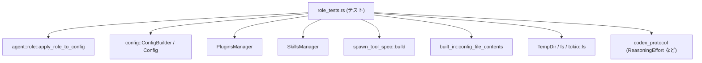
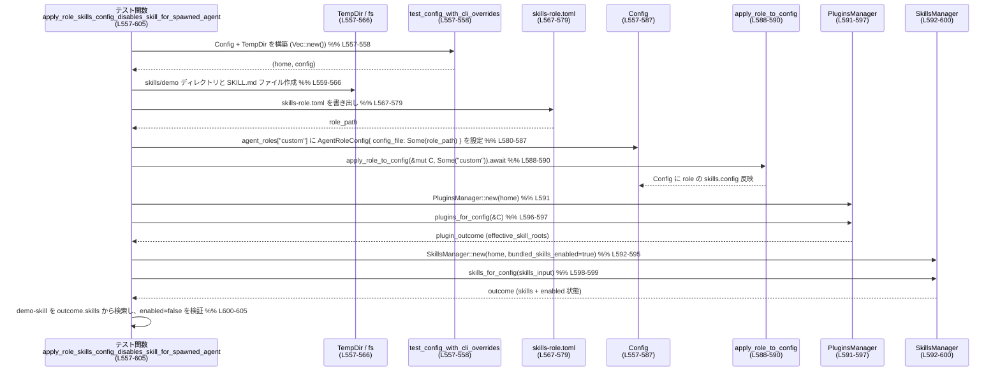

# core/src/agent/role_tests.rs コード解説

## 0. ざっくり一言

- エージェントの「ロール」設定を `Config` に適用する関数 `apply_role_to_config` と、ロール一覧を表現する `spawn_tool_spec::build`、組み込みロール設定 `built_in::config_file_contents` の **契約（期待される挙動）を検証するテスト群**です（`core/src/agent/role_tests.rs:L48-56`, `L607-625`, `L687-692`）。
- CLI オプション・プロフィール・モデルプロバイダ・サンドボックス設定・スキル有効/無効など、ロール適用時の細かい優先順位とエッジケースを網羅的にテストしています。

---

## 1. このモジュールの役割

### 1.1 概要

このモジュールは次の問題を扱います。

> 「ユーザー/組み込みロールを `Config` に適用したときに、**どのフィールドがどう変わり、どのフィールドは維持されるべきか**、またロール一覧をユーザー向けにどう説明すべきか」

具体的には、以下の点をテストで保証しています。

- `apply_role_to_config` がロール名に応じて `Config` を更新するが、未指定の設定や現在のプロフィールは必要に応じて保持されること（例: `apply_role_preserves_unspecified_keys` `L151-187`、`apply_role_preserves_active_profile_and_model_provider` `L188-235`）。
- ロール設定ファイルのエラーや欠損時に、特定のエラー文字列/コードで失敗すること（`L91-105`, `L106-122`）。
- ロールに紐づくスキル設定により、スキルを無効化できること（`apply_role_skills_config_disables_skill_for_spawned_agent` `L557-605`）。
- spawn ツール用のロール仕様文字列を組み立てる `spawn_tool_spec::build` の重複排除・並び順・ロックされた設定の説明文を検証すること（`L607-685`）。
- built-in ロール設定読み出し関数 `built_in::config_file_contents` が未知ファイルに対して `None` を返すこと（`L687-692`）。

### 1.2 アーキテクチャ内での位置づけ

このファイルは **テスト専用モジュール** であり、プロダクションコードは別モジュールにありますが、テストから見た依存関係は次のようになります。



- `ConfigBuilder` と `TempDir` を使って、テストごとに独立した一時ホームディレクトリと `Config` を生成します（`test_config_with_cli_overrides` `L16-29`）。
- 必要に応じてロール設定 TOML をファイルとして書き出し (`write_role_config` `L30-36`)、`config.agent_roles` に登録した上で `apply_role_to_config` を呼びます（例: `L90-105`, `L151-187`）。
- スキル関連テストでは `PluginsManager` と `SkillsManager` を用いて、ロール適用後の有効スキルを検証します（`L591-600`）。
- ロール一覧仕様テストでは、ユーザー定義ロールの `BTreeMap<String, AgentRoleConfig>` を渡して `spawn_tool_spec::build` を呼び、生成された文字列を検証します（`L607-625`, `L643-664`, `L665-685`）。
- 組み込みロール設定の解決は `built_in::config_file_contents` を通じてテストされます（`L687-692`）。

### 1.3 設計上のポイント

コードから読み取れる設計上の特徴は次の通りです。

- **テスト用の構築ヘルパー**  
  - `test_config_with_cli_overrides` で、CLI オプションを TOML 風のキー/値として渡して `Config` を構築する共通パターンをカプセル化しています（`L16-29`）。
  - ロール設定ファイル作成も `write_role_config` を通じて一元化されています（`L30-36`）。
- **設定レイヤーと優先順位の明示的テスト**  
  - `session_flags_layer_count` で `ConfigLayerStack` 内の `SessionFlags` レイヤー数をカウントし（`L37-47`）、ロール適用によるレイヤー追加/上書きの挙動を検証しています（`L65-76`, `L528-553`）。
- **エラー処理の契約テスト**  
  - 不明なロール名・存在しないロールファイル・パース不能な TOML について、返されるエラー文字列/コードを厳密に検証しています（`L58-64`, `L91-105`, `L106-122`）。
- **非同期 I/O と Tokio テスト**  
  - 設定ファイル・ロールファイルの読み書きに `tokio::fs` を利用し、`#[tokio::test]` で非同期テストとして実行しています（`L30-35`, `L188-220`）。
- **プラットフォーム依存テストの制御**  
  - サンドボックス関連テストは Windows では無効 (`#[cfg(not(windows))]` `L459-461`)、スキル関連テストも Windows を無視するようにしています (`#[cfg_attr(windows, ignore)]` `L555-556`)。

### 1.4 コンポーネント一覧（関数インベントリ）

このファイル内で定義されている関数を一覧にします。

| 名前 | 種別 | 役割 / 用途 | 定義位置 |
|------|------|-------------|----------|
| `test_config_with_cli_overrides` | 非公開 async ヘルパー | 一時ホームディレクトリを作成し、CLI オーバーライド付きの `Config` を構築する | `core/src/agent/role_tests.rs:L16-29` |
| `write_role_config` | 非公開 async ヘルパー | 指定パスにロール設定 TOML ファイルを書き出す | `L30-36` |
| `session_flags_layer_count` | 非公開ヘルパー | `Config` 内の `SessionFlags` レイヤーの数を数える | `L37-47` |
| `apply_role_defaults_to_default_and_leaves_config_unchanged` | `#[tokio::test]` | ロール名 `None` 適用時に `Config` が変化しないことを検証 | `L48-56` |
| `apply_role_returns_error_for_unknown_role` | `#[tokio::test]` | 不明なロール名でエラー文字列が返ることを検証 | `L57-64` |
| `apply_explorer_role_sets_model_and_adds_session_flags_layer` | `#[tokio::test]` (ignore) | `explorer` ロールがモデル設定とセッションフラグレイヤーを追加することを検証 | `L65-76` |
| `apply_empty_explorer_role_preserves_current_model_and_reasoning_effort` | `#[tokio::test]` | 既に設定済みの model / reasoning_effort が空ロールで上書きされないことを検証 | `L77-89` |
| `apply_role_returns_unavailable_for_missing_user_role_file` | `#[tokio::test]` | 存在しないロールファイル指定時に `AGENT_TYPE_UNAVAILABLE_ERROR` が返ることを検証 | `L90-105` |
| `apply_role_returns_unavailable_for_invalid_user_role_toml` | `#[tokio::test]` | パース不能なロールファイル指定時に同じエラーが返ることを検証 | `L106-122` |
| `apply_role_ignores_agent_metadata_fields_in_user_role_file` | `#[tokio::test]` | ロールファイル内の name/description などのメタデータが `Config` には反映されず、model などだけが使われることを検証 | `L123-150` |
| `apply_role_preserves_unspecified_keys` | `#[tokio::test]` | ロールで指定していない `Config` のフィールドが保持されることを検証 | `L151-187` |
| `apply_role_preserves_active_profile_and_model_provider` | `#[tokio::test]` | 現在のプロフィールとモデルプロバイダ設定が空ロール適用で維持されることを検証 | `L188-235` |
| `apply_role_top_level_profile_settings_override_preserved_profile` | `#[tokio::test]` | active_profile を維持したまま、トップレベルの model/verbosity などだけをロールで上書きできることを検証 | `L236-291` |
| `apply_role_uses_role_profile_instead_of_current_profile` | `#[tokio::test]` | ロールに `profile` が指定されている場合、現在のプロフィールではなくそのプロフィールを使うことを検証 | `L292-346` |
| `apply_role_uses_role_model_provider_instead_of_current_profile_provider` | `#[tokio::test]` | ロールに `model_provider` が指定されている場合、プロフィール由来ではなくそのプロバイダを使うことを検証 | `L347-399` |
| `apply_role_uses_active_profile_model_provider_update` | `#[tokio::test]` | プロフィールセクションに対するロール側の差分指定（同名 profile セクション）で model_provider / reasoning_effort が更新されることを検証 | `L400-458` |
| `apply_role_does_not_materialize_default_sandbox_workspace_write_fields` | `#[tokio::test]`（非 Windows のみ） | CLI で指定されたサンドボックス設定を壊さないよう、ロール側が未指定のフィールドをデフォルト値で「勝手に埋めない」ことを検証 | `L459-526` |
| `apply_role_takes_precedence_over_existing_session_flags_for_same_key` | `#[tokio::test]` | 同じキーについて、既存セッションフラグよりロールのセッションフラグが優先されることを検証 | `L527-553` |
| `apply_role_skills_config_disables_skill_for_spawned_agent` | `#[tokio::test]` | ロールの `skills.config` 設定で、spawn されたエージェントに対するスキルの有効/無効を制御できることを検証 | `L555-605` |
| `spawn_tool_spec_build_deduplicates_user_defined_built_in_roles` | `#[test]` | ユーザー定義ロールが既存の組み込みロールと同名の場合、説明文をユーザー側で上書きし、重複説明が出ないことを検証 | `L607-625` |
| `spawn_tool_spec_lists_user_defined_roles_before_built_ins` | `#[test]` | spawn ツール仕様文字列で、ユーザー定義ロールが組み込みロールより先に並ぶことを検証 | `L626-642` |
| `spawn_tool_spec_marks_role_locked_model_and_reasoning_effort` | `#[test]` | ロールファイルに model と reasoning_effort が設定されている場合、それらが変更不能である旨のメッセージを含めることを検証 | `L643-664` |
| `spawn_tool_spec_marks_role_locked_reasoning_effort_only` | `#[test]` | reasoning_effort のみ設定されたロールに対し、それが変更不可である旨のメッセージを含めることを検証 | `L665-685` |
| `built_in_config_file_contents_resolves_explorer_only` | `#[test]` | `built_in::config_file_contents` が未知ファイルに対し `None` を返すことを検証 | `L687-692` |

---

## 2. 主要な機能一覧

このモジュールが提供する主な「機能」（＝検証している契約）は次の通りです。

- ロール未指定時の挙動: `apply_role_to_config` に `None` を渡すと `Config` が変化しないことを保証します（`L48-56`）。
- 不明ロール名のエラー処理: 存在しないロール名で `"unknown agent_type '<name>'"` というエラー文字列が返ることを確認します（`L57-64`）。
- ユーザー定義ロールファイルの読込とエラー: 存在しない/壊れた TOML のロールファイルに対して `AGENT_TYPE_UNAVAILABLE_ERROR` が返ることを確認します（`L90-105`, `L106-122`）。
- ロールによる設定上書きの優先順位:  
  - 既存の model / reasoning_effort を保持するケース（`L77-89`, `L151-187`）。  
  - active_profile / model_provider の保持・切り替え（`L188-235`, `L236-291`, `L292-399`, `L400-458`）。  
  - session flags レイヤーの追加と優先順位（`L37-47`, `L65-76`, `L527-553`）。
- サンドボックス設定の安全なマージ: CLI で指定した危険度の高いフィールド（`network_access` など）がロール適用時に暗黙のデフォルト値で上書きされないことを確認します（`L459-526`）。
- スキル設定のロール依存制御: ロールで `skills.config` を指定することで、スキルの enabled 状態を制御できることを確認します（`L555-605`）。
- spawn ツール仕様生成: `spawn_tool_spec::build` が  
  - ユーザー定義と組み込みのロール説明を重複なく統合し（`L607-625`）、  
  - ユーザー定義ロールを先頭に並べ（`L626-642`）、  
  - ロックされた model / reasoning_effort を説明文に明示する（`L643-664`, `L665-685`）  
  ことを保証します。
- 組み込みロール設定の参照: `built_in::config_file_contents` が未知ファイルに対し `None` を返すことで「 explorer 以外は組み込みに存在しない」という前提を確認します（`L687-692`）。

---

## 3. 公開 API と詳細解説

### 3.1 型一覧（このモジュールから見える主要型）

このファイル内で新しい型定義は行われていませんが、テストで重要な役割を持つ外部型を整理します。

| 名前 | 種別 | 役割 / 用途 | 根拠 |
|------|------|-------------|------|
| `Config` | 構造体 | アプリケーション全体の設定を表す。ロール適用対象。 | `test_config_with_cli_overrides` の戻り値、各テストの `mut config` から（`L16-29`, `L48-56`） |
| `ConfigBuilder` | 構造体 | `Config` を組み立てるビルダー。`codex_home`, `cli_overrides`, `fallback_cwd` などを指定して `build().await` する。 | `L21-27`, `L205-214`, `L251-260` など |
| `ConfigOverrides` | 構造体 | ハーネス用のオーバーライド設定。プロフィール名などを上書きする。 | `L205-210`, `L251-256`, `L316-321` |
| `AgentRoleConfig` | 構造体 | ロール 1 件分の設定（説明文、ロール TOML ファイルパス、ニックネーム候補）。`config.agent_roles` の値。 | `L93-100`, `L110-117`, `L138-145`, `L166-173`, `L221-228` 他 |
| `ConfigLayerStackOrdering` | 列挙体 | 設定レイヤーを取得するときの優先順序指定。ここでは `LowestPrecedenceFirst` を使用。 | `L41-43`, `L496-499` |
| `ConfigLayerSource` | 列挙体 | 設定レイヤーの種別。`SessionFlags` など。 | レイヤー名との比較から（`L45-46`, `L501-502`） |
| `PluginsManager` | 構造体 | プラグイン（スキルなど）の読み込み・有効化を管理。ここでは `plugins_for_config` で有効スキルのルートを得る。 | `L591-597` |
| `SkillsManager` | 構造体 | スキル読み込み・有効/無効判定。`skills_for_config` でスキル一覧と有効状態を取得。 | `L592-600` |
| `ReasoningEffort` | 列挙体 | モデルの推論負荷（`Medium`, `High`, `Low` 等）を表す。 | `L10`, 具体的使用箇所 `L74-75`, `L82`, `L178`, `L285`, `L457` |
| `ReasoningSummary` | 列挙体 | 要約スタイル (`Concise`, `Detailed` など)。 | `L8`, 使用箇所 `L246`, `L287-288` |
| `Verbosity` | 列挙体 | モデルの出力冗長度 (`Low`, `High` 等)。 | `L9`, 使用箇所 `L246`, `L290` |
| `SandboxPolicy` | 列挙体 | サンドボックス動作ポリシー。`WorkspaceWrite { network_access, .. }` など。 | `L462`, 使用箇所 `L520-525` |

> これらの型の内部構造はこのチャンクには現れませんが、フィールド名・メソッド呼び出しから上記の用途が読み取れます。

### 3.2 関数詳細（ヘルパー関数）

このファイル内で定義されるヘルパー関数 3 つについて、詳細を説明します。

#### `test_config_with_cli_overrides(cli_overrides: Vec<(String, TomlValue)>) -> (TempDir, Config)`

**概要**

- 一時ディレクトリをホームディレクトリとして使い、CLI オーバーライドを適用した `Config` を構築する非同期ヘルパーです（`L16-29`）。
- ほぼ全てのロール関連テストで `Config` の初期化に利用されています。

**引数**

| 引数名 | 型 | 説明 |
|--------|----|------|
| `cli_overrides` | `Vec<(String, TomlValue)>` | `config.toml` に対して CLI から上書きされたと想定するキーと値のペアの一覧です（例: `"model"` → `"cli-model"` `L529-532`）。 |

**戻り値**

- `(TempDir, Config)`  
  - `TempDir`: テスト専用の一時ディレクトリ。`codex_home` や設定ファイルを書き込むディレクトリとして利用されます（`L19-20`）。  
  - `Config`: オーバーライド適用済みの設定オブジェクトです。

**内部処理の流れ**

1. `TempDir::new()` で一時ディレクトリを作成し、`home` として保持します（`L19`）。
2. `home.path().to_path_buf()` でパスを取得し `home_path` に保存します（`L20`）。
3. `ConfigBuilder::default()` からビルダーを作成し、`codex_home(home_path.clone())`、`cli_overrides(cli_overrides)`、`fallback_cwd(Some(home_path))` を順に適用します（`L21-24`）。
4. `build().await.expect("load test config")` で `Config` を構築し、エラー時にはテストを panic させます（`L25-27`）。
5. `(home, config)` を返します（`L28`）。

**Examples（使用例）**

```rust
// CLI から model を上書きした Config を準備するテスト例  // core/src/agent/role_tests.rs:L529-533
let (home, mut config) = test_config_with_cli_overrides(vec![(
    "model".to_string(),
    TomlValue::String("cli-model".to_string()),
)])
.await;

// 以降、この config にロールを適用して挙動を検証する
apply_role_to_config(&mut config, Some("custom")).await?;
```

**Errors / Panics**

- `TempDir::new()` や `ConfigBuilder::build().await` がエラーを返した場合、`expect("...")` によりテストは panic します（`L19`, `L27`）。
- プロダクションコードではなくテストヘルパーなので、エラーを `Result` で伝播せず、すぐに失敗させる実装です。

**Edge cases（エッジケース）**

- `cli_overrides` が空でも動作します（多数のテストが `Vec::new()` を渡しています `L50`, `L59`, `L92` など）。
- 同じキーが複数回指定された場合の挙動は、このチャンクには登場せず不明です（`ConfigBuilder` 実装側の問題です）。

**使用上の注意点**

- ディスク I/O を伴うため、本番コードで頻繁に呼ぶべき関数ではなく、あくまでテスト専用です。
- `TempDir` はスコープを抜けたときに削除されるため、戻り値の `TempDir` を保持している間だけファイルシステム上に存在します。

---

#### `write_role_config(home: &TempDir, name: &str, contents: &str) -> PathBuf`

**概要**

- 一時ホームディレクトリ配下にロール設定 TOML ファイルを書き出し、そのパスを返す非同期ヘルパーです（`L30-36`）。

**引数**

| 引数名 | 型 | 説明 |
|--------|----|------|
| `home` | `&TempDir` | 書き込み先ディレクトリのルート。`test_config_with_cli_overrides` が生成した `TempDir` を想定します（`L108-109`, `L151-165`）。 |
| `name` | `&str` | ファイル名（例: `"invalid-role.toml"` `L108-109`）。 |
| `contents` | `&str` | TOML 形式のロール設定内容を表すテキスト（`L161-164`, `L262-269` など）。 |

**戻り値**

- `PathBuf`: 作成したロールファイルの絶対パスです（`L31`, `L35`）。

**内部処理の流れ**

1. `home.path().join(name)` で書き込み先パス `role_path` を作成します（`L31`）。
2. `tokio::fs::write(&role_path, contents).await.expect("write role config")` でファイル内容を書き込み、失敗時は panic します（`L32-34`）。
3. `role_path` を返します（`L35`）。

**Examples（使用例）**

```rust
// 「model_reasoning_effort」だけを設定するロールファイルを作成する例    // core/src/agent/role_tests.rs:L160-165
let role_path = write_role_config(
    &home,
    "effort-only.toml",
    "developer_instructions = \"Stay focused\"\nmodel_reasoning_effort = \"high\"",
)
.await;

// このファイルを AgentRoleConfig に登録して apply_role_to_config をテストする
config.agent_roles.insert(
    "custom".to_string(),
    AgentRoleConfig {
        description: None,
        config_file: Some(role_path),
        nickname_candidates: None,
    },
);
```

**Errors / Panics**

- `tokio::fs::write` が I/O エラーを返した場合、`expect("write role config")` によりテストは panic します（`L32-34`）。

**Edge cases（エッジケース）**

- `contents` が TOML として無効でもファイル書き込み自体は成功します。  
  → 実際にその後の `apply_role_to_config` 内でパースエラーとなり、`AGENT_TYPE_UNAVAILABLE_ERROR` を返すテストがあります（`L108-121`）。

**使用上の注意点**

- テスト用ヘルパーのため、エラーを握り潰してはいませんが、`expect` で即時失敗する形になっています。
- 非同期 I/O を行うので、呼び出し元は `async fn` であり `await` する必要があります。

---

#### `session_flags_layer_count(config: &Config) -> usize`

**概要**

- `Config` 内部の `config_layer_stack` のうち、`ConfigLayerSource::SessionFlags` にあたるレイヤーの数を数えます（`L37-47`）。
- ロール適用により session flags レイヤーが新たに追加されるかどうかをテストするために使われます（例: `L65-76`, `L527-553`）。

**引数**

| 引数名 | 型 | 説明 |
|--------|----|------|
| `config` | `&Config` | 設定全体。内部に `config_layer_stack` を持つ前提です（`L38-39`）。 |

**戻り値**

- `usize`: `ConfigLayerSource::SessionFlags` に一致するレイヤーの数です。

**内部処理の流れ**

1. `config.config_layer_stack.get_layers(ConfigLayerStackOrdering::LowestPrecedenceFirst, /*include_disabled*/ true)` でレイヤー一覧を取得します（`L39-43`）。
2. `into_iter()` でイテレータに変換し（`L44`）、`filter(|layer| layer.name == ConfigLayerSource::SessionFlags)` でセッションフラグレイヤーのみを残します（`L45-46`）。
3. `.count()` で件数を返します（`L46`）。

**Examples（使用例）**

```rust
// ロール適用前後で SessionFlags レイヤー数の変化を検証する例         // core/src/agent/role_tests.rs:L528-553
let before_layers = session_flags_layer_count(&config);

apply_role_to_config(&mut config, Some("custom"))
    .await
    .expect("custom role should apply");

assert_eq!(session_flags_layer_count(&config), before_layers + 1);
```

**Errors / Panics**

- この関数自体は panic を起こしません。
- `config_layer_stack` が `SessionFlags` を含まない場合も `count()` は 0 を返すだけです。

**Edge cases（エッジケース）**

- `include_disabled = true` でレイヤーを取得しているため、無効化された session flags レイヤーも件数に含まれます（`L41-43`）。これはテストの意図として「レイヤーの物理的存在」を見たいからと解釈できますが、厳密な意図はコードだけでは断定できません。

**使用上の注意点**

- `ConfigLayerSource::SessionFlags` の意味や `config_layer_stack` の詳細仕様は別モジュールにあり、このチャンクには登場しません。

---

### 3.2 追加: 外部 API の契約（テストから読み取れる範囲）

ここからは **別モジュールに定義された公開 API** について、このテストが前提としている契約をまとめます。関数シグネチャは完全には分からないため、挙動のみを記述します。

#### `apply_role_to_config(config: &mut Config, role_name: Option<&str>) -> impl Future<Output = Result<_, E>>`

**テストから読み取れる挙動**

- `role_name == None` の場合  
  - `Config` は変更されず、`Ok(..)` で成功します（`apply_role_defaults_to_default_and_leaves_config_unchanged` `L48-56`）。
- 不明なロール名の場合  
  - `Err` が返り、その値は `"unknown agent_type '<role_name>'"` と等しい文字列になります（`L60-63`）。
- ユーザー定義ロールで `config_file` が存在しない場合  
  - エラーは `AGENT_TYPE_UNAVAILABLE_ERROR` と等しい文字列になります（`L90-105`）。
- ロールファイルが TOML として壊れている場合  
  - 同じく `AGENT_TYPE_UNAVAILABLE_ERROR` で失敗します（`L106-122`）。
- ロールファイルに `name`, `description`, `nickname_candidates`, `developer_instructions` などのメタデータが含まれていても、`Config` のフィールドとしては `model = "role-model"` のような「設定項目」だけが反映されます（`L123-150`）。
- ロールで指定していない `Config` のフィールド（モデルプロバイダ、sandbox 実行バイナリなど）は保持されます（`L151-187`, `L188-235`）。
- ロール TOML のトップレベルに `profile = "role-profile"` があれば、`config.active_profile` はその値に切り替わり、それに対応する model_provider が読み込まれます（`L292-346`）。
- ロール TOML のトップレベルに `model_provider = "role-provider"` があれば、プロフィールに依存せず、そのプロバイダが選択されます。この場合 `active_profile` は `None` になります（`L347-399`）。
- ロール TOML に `[profiles.<name>]` セクションがあり、既存 profile と同名の場合、その profile の model_provider や reasoning_effort を上書きした上で active_profile は維持されます（`L400-458`）。
- サンドボックス関連では、ロール TOML の `[sandbox_workspace_write]` セクションに列挙されていないフィールド（`network_access` など）は session flags レイヤー内に materialize されませんが、`config.permissions.sandbox_policy` 自体は CLI が設定した `WorkspaceWrite { network_access: true, .. }` を維持します（`L459-526`）。
- session flags に同じキーが既に存在していても、ロール適用によりロールの値が優先されます（model の例 `L527-553`）。
- ロールの `[[skills.config]]` に `enabled = false` が含まれると、スキルの `is_skill_enabled` が `false` になります（`L555-605`）。

**エラー契約まとめ**

- 不明ロール名 → `"unknown agent_type '<name>'"`（`L60-63`）。
- ユーザーロールファイルが missing / invalid TOML → `AGENT_TYPE_UNAVAILABLE_ERROR`（`L101-105`, `L118-121`）。

> 実際の `E` の型はこのチャンクには現れませんが、テストでは `assert_eq!(err, "...")` として文字列比較を行っているため、`E` は `String` または `&'static str` 等、文字列と比較可能な型であることが分かります（`L60-63`, `L101-105`）。

---

#### `spawn_tool_spec::build(user_defined_roles: &BTreeMap<String, AgentRoleConfig>) -> String`

**テストから読み取れる挙動**

- 返り値は文字列（`String`）であり、`\n` を含む複数行の仕様書です（`L620`, `L636`）。
- 仕様書は、ユーザー定義ロールと組み込みロールをまとめて記述します。
- ユーザー定義ロールが組み込みロールと同じ名前（例: `"explorer"`）を持つ場合、説明はユーザー定義のものだけが残り、組み込みの説明文 `"Explorers are fast and authoritative."` が含まれないことが期待されています（`L607-625`）。
- ユーザー定義ロールは、組み込みロールより先に出力されます（`L626-642`）。
- ロールの `config_file` に TOML ファイルパスが指定され、その中に `model` と `model_reasoning_effort` が含まれている場合、仕様書には「このロールの model は `gpt-5` に固定されており、reasoning effort は `high` で変更できない」というメッセージが追加されます（`L643-664`）。
- `model` を指定せず `model_reasoning_effort` のみを設定しているロールでは、「reasoning effort は `medium` で変更できない」といったメッセージだけが追加されます（`L665-685`）。

---

#### `built_in::config_file_contents(path: &Path) -> Option<_>`

**テストから読み取れる挙動**

- 未知のファイル名 ― 例えば `Path::new("missing.toml")` ― に対して `None` を返すことが保証されています（`L687-692`）。
- テスト名 `built_in_config_file_contents_resolves_explorer_only` から、「組み込みとしては `explorer` ロールのみを解決する」ことが想定されますが、実際に explorer を渡すテストはこのチャンクにはありません。

---

### 3.3 その他の関数（テスト本体）

テスト関数（`#[tokio::test]` / `#[test]`）は上記インベントリ表の説明のとおりです。すべて「振る舞いの検証」であり、追加のロジックは持っていません。

---

## 4. データフロー

ここでは、**ロールにスキル設定を含めた場合の処理フロー**を例として、テスト内のデータの流れを示します。

対象は `apply_role_skills_config_disables_skill_for_spawned_agent`（`L557-605`）です。

### 4.1 処理の要点

- 一時ホームディレクトリと空の `Config` を準備する（`L557-558`）。
- ファイルシステム上に `skills/demo/SKILL.md` を作成し、YAML フロントマターで `demo-skill` として定義する（`L559-566`）。
- ロール TOML `skills-role.toml` を書き出し、その中で `[[skills.config]]` に `path` と `enabled = false` を指定する（`L567-579`）。
- ロールを `config.agent_roles["custom"]` に登録し、`apply_role_to_config` を通じて設定を反映する（`L580-590`）。
- `PluginsManager` と `SkillsManager` でスキルの実効設定を読み込み、`demo-skill` が `enabled = false` であることを確認する（`L591-605`）。

### 4.2 シーケンス図



このフローから、

- ロールの `skills.config` は `Config` に反映され、それをもとに `SkillsManager` が有効/無効を判定していること、
- ロール適用後の設定がプラグイン/スキル読み込みパスにそのまま使われること

が読み取れます。

---

## 5. 使い方（How to Use）

このファイル自体はテスト専用ですが、テストコードは **`apply_role_to_config` や `spawn_tool_spec::build` の具体的な利用例** としても参考になります。

### 5.1 基本的な使用方法（ロール適用）

`apply_role_to_config` を使って、ユーザー定義ロールを `Config` に適用する流れは、典型的には次のようになります（テスト `apply_role_preserves_unspecified_keys` を簡略化した例 `L151-187`）。

```rust
// 1. Config を構築する (ここではテストヘルパーを利用)                    // core/src/agent/role_tests.rs:L151-157
let (home, mut config) = test_config_with_cli_overrides(vec![(
    "model".to_string(),
    TomlValue::String("base-model".to_string()),
)])
.await;

// 2. 既存の設定 (例: sandbox 実行バイナリ) を Config に入れておく        // L158-159
config.codex_linux_sandbox_exe = Some(PathBuf::from("/tmp/codex-linux-sandbox"));
config.main_execve_wrapper_exe = Some(PathBuf::from("/tmp/codex-execve-wrapper"));

// 3. ロール TOML をファイルとして書き出す                               // L160-165
let role_path = write_role_config(
    &home,
    "effort-only.toml",
    "developer_instructions = \"Stay focused\"\nmodel_reasoning_effort = \"high\"",
)
.await;

// 4. ロールを Config.agent_roles に登録する                             // L166-173
config.agent_roles.insert(
    "custom".to_string(),
    AgentRoleConfig {
        description: None,
        config_file: Some(role_path),
        nickname_candidates: None,
    },
);

// 5. apply_role_to_config でロールを適用する                            // L174-176
apply_role_to_config(&mut config, Some("custom"))
    .await
    .expect("custom role should apply");

// 6. 期待される状態を利用・検証する                                     // L177-186
assert_eq!(config.model.as_deref(), Some("base-model"));
assert_eq!(config.model_reasoning_effort, Some(ReasoningEffort::High));
// 他のフィールドは保持されている
```

この例から、「ロールは明示的に指定されたキーのみを上書きし、それ以外の既存設定は保持される」という契約が読み取れます。

### 5.2 spawn ツール仕様の生成

`spawn_tool_spec::build` を使って、ロール一覧を人間向け仕様として取得する流れは以下のようになります（`L607-625` をもとにしています）。

```rust
// 1. ユーザー定義ロールのマップを構築する                             // core/src/agent/role_tests.rs:L609-619
let user_defined_roles = BTreeMap::from([
    (
        "explorer".to_string(),
        AgentRoleConfig {
            description: Some("user override".to_string()),
            config_file: None,
            nickname_candidates: None,
        },
    ),
    ("researcher".to_string(), AgentRoleConfig::default()),
]);

// 2. spawn ツール仕様文字列を生成する                                 // L620
let spec = spawn_tool_spec::build(&user_defined_roles);

// 3. 仕様文字列を CLI ヘルプや UI に表示する                         // L621-624
assert!(spec.contains("researcher: no description"));
assert!(spec.contains("explorer: {\nuser override\n}"));
assert!(spec.contains("default: {\nDefault agent.\n}"));
```

ここでは `spec` が単なる `String` であり、各ロールの説明が `"name: {\n..."` というフォーマットで含まれていることが分かります。

### 5.3 よくある使用パターンと間違い

#### パターン 1: プロフィールを維持したまま top-level 設定だけ上書き

- `ConfigOverrides` で `config_profile` を指定し（`L205-210`）、ロール TOML のトップレベルに `model`, `model_reasoning_effort`, `model_reasoning_summary`, `model_verbosity` を置くパターン（`L262-269`）。
- この場合、`active_profile` は維持されたまま (`"base-profile"`) で、モデル関連設定だけがロール値に更新されます（`L283-290`）。

#### 間違い例（テストが防いでいるもの）

- 「サンドボックスモード `workspace-write` に切り替えたいので、ロール TOML に `[sandbox_workspace_write]` だけ書けば、`network_access` などはデフォルトで false になる」と考えること。  
  → テスト `apply_role_does_not_materialize_default_sandbox_workspace_write_fields` は、**ロール側で指定していないフィールドは session flags レイヤーに現れず、CLI で `true` にした `network_access` はそのまま維持される**ことを確認しています（`L459-526`）。

### 5.4 使用上の注意点（まとめ）

- **エラー処理契約**  
  - 不明ロール名 → `"unknown agent_type '<name>'"`（`L60-63`）。  
  - ロールファイル missing / invalid → `AGENT_TYPE_UNAVAILABLE_ERROR`（`L101-105`, `L118-121`）。  
  これらの文字列に依存するコードを書く場合、テストと同じメッセージであることを前提にする必要があります。
- **設定の優先順位**  
  - CLI オーバーライド > ロールの session flags > それ以前のレイヤー、という優先構造がテストから間接的に読み取れます（`L527-553`）。  
  - active_profile / model_provider は、`profile` や `model_provider` がロール TOML に明示されている場合のみ切り替わり、そうでない場合は保持されます（`L188-235`, `L292-399`）。
- **安全性（サンドボックスとスキル）**  
  - サンドボックス設定では、ロールが指定していないフィールドをデフォルトで勝手に埋めない実装であることが重要です。そうでないと、CLI やユーザー設定が意図せず上書きされ、セキュリティホールの原因になり得ます（`L459-526`）。  
  - スキル有効/無効はロール設定に依存し得るため、重要なスキルを誤って `enabled = false` にするロールを配布しないよう注意が必要です（`L571-575`, `L605`）。

---

## 6. 変更の仕方（How to Modify）

### 6.1 新しい機能（テストケース）を追加する場合

このファイルはすべてテストであるため、「新しい機能」とは通常、新しい **挙動の契約** をテストとして追加することを意味します。

1. **対象 API の特定**  
   - たとえば `apply_role_to_config` に新たなフィールド（例: `temperature`）をロールから上書きする機能を追加した場合、その挙動を検証するテストをこのファイルに追加します。
2. **テスト用 Config の準備**  
   - `test_config_with_cli_overrides` を使って CLI オーバーライド有無のケースを作る（`L16-29`）。
3. **ロール TOML の準備**  
   - `write_role_config` でロールファイルを書き出し、`config.agent_roles` に登録します（`L160-173`）。
4. **API 呼び出しと検証**  
   - `apply_role_to_config` あるいは `spawn_tool_spec::build` を呼び出し、期待するフィールドや文字列が含まれるかを `assert_eq!` / `assert!` で検証します（`L174-186`, `L620-624`）。

### 6.2 既存の機能を変更する場合の注意点

- **契約の維持**  
  - このテストファイルが表現しているのは、事実上 `apply_role_to_config` と `spawn_tool_spec::build` の「公開契約」です。挙動を変える場合は、  
    - どのテストがその契約に依存しているか（インベントリ表とテスト名）を確認し、  
    - 必要に応じてテスト内容も新しい設計に合わせて更新する必要があります。
- **エラー文字列の変更**  
  - `"unknown agent_type '...'"` や `AGENT_TYPE_UNAVAILABLE_ERROR` のようなエラー文字列はテストで直接比較されているため（`L60-63`, `L101-105`）、メッセージフォーマットを変えるとテストが失敗します。メッセージの互換性を維持するか、テスト側を意図的に変更するかを検討する必要があります。
- **サンドボックス関連の安全性**  
  - `apply_role_does_not_materialize_default_sandbox_workspace_write_fields` が検証しているように、未指定フィールドをデフォルト値で materialize しないことはセキュリティ上重要です（`L459-526`）。  
    - ロール適用ロジックをリファクタリングする際、この挙動が崩れないよう特に注意する必要があります。
- **パフォーマンス・スケーラビリティ観点**  
  - テストでは小さな一時ディレクトリと短い TOML ファイルしか扱っていませんが、実運用ではロール数・プロファイル数が増える可能性があります。  
  - `spawn_tool_spec::build` は全ロールを走査し仕様文字列を組み立てるため、将来的にロール数が非常に多い場合に備え、生成コストを意識した設計・テストを追加することも考慮されます（このチャンクでは実装詳細は不明です）。

---

## 7. 関連ファイル

このモジュールと密接に関係すると思われるファイル・モジュール（名前はコードから推測したものを含みます）。

| パス / モジュール | 役割 / 関係 |
|-------------------|------------|
| `super`（おそらく `core/src/agent/role.rs`） | `apply_role_to_config` の実装を提供し、本テストの主対象となっています（`L52-55`, `L60-63` など）。 |
| `crate::config` | `Config`, `ConfigBuilder`, `CONFIG_TOML_FILE`, `ConfigOverrides` を提供し、テスト用設定の構築に使われています（`L3-4`, `L188-214`）。 |
| `crate::config_loader` | `ConfigLayerStackOrdering` や `config_layer_stack` を通じて設定レイヤー管理を提供します。session flags レイヤーのカウントなどに利用されています（`L5`, `L37-47`, `L495-502`）。 |
| `crate::plugins::PluginsManager` | プラグイン（スキル）読み込みと有効スキルルートの決定ロジックを提供し、スキル関連のテストで使用されています（`L6`, `L591-597`）。 |
| `crate::SkillsManager` / `crate::skills_load_input_from_config` | スキルのロードと有効/無効判定ロジックを提供し、ロールによるスキル無効化テストの対象となっています（`L2`, `L7`, `L592-600`）。 |
| `super::spawn_tool_spec`（推測） | `spawn_tool_spec::build` を実装するモジュールで、ロール仕様文字列生成のテスト対象です（`L607-625`, `L626-642`, `L643-664`, `L665-685`）。 |
| `super::built_in`（推測） | `built_in::config_file_contents` を実装し、組み込みロール設定ファイルの内容を返すモジュールです（`L687-692`）。 |

このファイルは、これら関連モジュールの契約をテストで固定する位置づけにあります。
