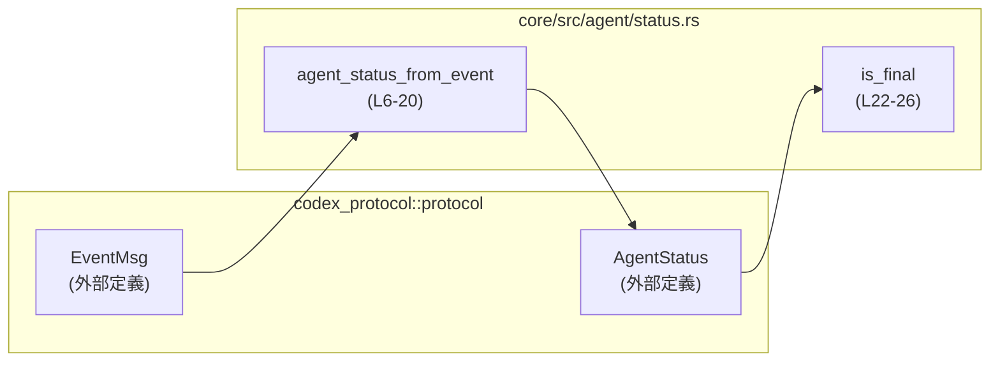

# core/src/agent/status.rs コード解説

## 0. ざっくり一言

- エージェント実行中に発生する `EventMsg` から `AgentStatus` を導出し、その状態が「最終状態」かどうかを判定するための小さなユーティリティモジュールです。

---

## 1. このモジュールの役割

### 1.1 概要

- このモジュールは、**イベント駆動で流れてくるエージェント関連イベント `EventMsg`** から、**現在のエージェント状態 `AgentStatus`** を計算する役割を持ちます（`agent_status_from_event`、`core/src/agent/status.rs:L6-20`）。
- また、ある `AgentStatus` が**まだ処理継続中か、それとも完了・エラーなどの最終状態か**を判定する機能を提供します（`is_final`、`core/src/agent/status.rs:L22-26`）。

### 1.2 アーキテクチャ内での位置づけ

- 外部クレート `codex_protocol::protocol` が定義する、プロトコルレベルの型 `EventMsg` と `AgentStatus` の間の「変換レイヤ」です（`use` 文、`core/src/agent/status.rs:L1-2`）。
- このファイル内には状態を保持する構造体やグローバル変数はなく、**純粋関数の集合**として振る舞います。

依存関係のイメージを簡易な Mermaid 図で示します。



### 1.3 設計上のポイント

- **ステートレスな設計**  
  - どちらの関数も引数だけに依存する純粋関数で、内部状態や外部 I/O を持ちません（`core/src/agent/status.rs` 全体）。
- **イベント→状態の一方向マッピング**  
  - `EventMsg` の一部のバリアント（`TurnStarted`, `TurnComplete`, `TurnAborted`, `Error`, `ShutdownComplete`）に対してのみ状態が変化し、それ以外のイベントは `None` で「状態に影響しない」とみなします（`core/src/agent/status.rs:L7-18`）。
- **最終状態判定のポリシーが明示的**  
  - `PendingInit`, `Running`, `Interrupted` を「非最終」、それ以外を「最終」とみなすポリシーが `matches!` マクロで記述されています（`core/src/agent/status.rs:L22-25`）。
- **エラー表現方針**  
  - 中断理由 `TurnAbortReason` やエラーメッセージを文字列化して `AgentStatus::Errored` に格納する方針になっています（`core/src/agent/status.rs:L14,16`）。

---

## 2. 主要な機能一覧

- イベントから状態への変換: `EventMsg` 1 件から、対応する `AgentStatus` を導出します（`agent_status_from_event`）。
- 状態が最終かどうかの判定: `AgentStatus` が完了・エラー・シャットダウンなどの最終状態かどうかを論理値で返します（`is_final`）。

---

## 3. 公開 API と詳細解説

### 3.1 型・関数一覧（コンポーネントインベントリー）

#### 型一覧（すべて外部クレートからの利用）

| 名前 | 種別 | 役割 / 用途 | 定義/利用行 |
|------|------|------------|-------------|
| `AgentStatus` | 列挙体（推定） | エージェントの状態を表します。このファイル内では `Running`, `Completed(..)`, `Interrupted`, `Errored(..)`, `Shutdown`, `PendingInit` などのバリアントが利用されています。 | `core/src/agent/status.rs:L1,8-9,12,14,16-17,23-25` |
| `EventMsg` | 列挙体（推定） | エージェント関連のイベントを表します。このファイルでは `TurnStarted`, `TurnComplete`, `TurnAborted`, `Error`, `ShutdownComplete` などのバリアントにマッチしています。 | `core/src/agent/status.rs:L2,6-10,16-18` |
| `TurnAbortReason` | 列挙体（推定） | `TurnAborted` イベントの理由を表します。このファイルでは `Interrupted` バリアントだけが特別扱いされています。フルパスで参照されています。 | `core/src/agent/status.rs:L10-14` |

> 補足: 上記の型はいずれも `codex_protocol::protocol` モジュールから提供され、`core/src/agent/status.rs` 内ではインポートまたはフルパス参照のみ行われています。

#### 関数一覧

| 名前 | 可視性 | 役割 / 用途 | 定義行 |
|------|--------|-------------|--------|
| `agent_status_from_event` | `pub(crate)` | 単一の `EventMsg` から、そのイベントが引き起こす `AgentStatus` の変化を計算します。対応しないイベントの場合は `None` を返します。 | `core/src/agent/status.rs:L6-20` |
| `is_final` | `pub(crate)` | 与えられた `AgentStatus` が最終状態かどうかを判定します。 | `core/src/agent/status.rs:L22-26` |

---

### 3.2 関数詳細

#### `agent_status_from_event(msg: &EventMsg) -> Option<AgentStatus>`

**概要**

- 単一のイベント `EventMsg` から、次に遷移すべき `AgentStatus` を算出します（`core/src/agent/status.rs:L6-20`）。
- 対象外のイベントの場合は `None` を返し、「このイベントは状態遷移には関与しない」という意味になります（`core/src/agent/status.rs:L18`）。

**引数**

| 引数名 | 型 | 説明 |
|--------|----|------|
| `msg` | `&EventMsg` | 処理対象のイベント。借用（参照）で受け取り、所有権は移動しません（`core/src/agent/status.rs:L6`）。 |

**戻り値**

- `Option<AgentStatus>`  
  - `Some(status)`  
    - イベントに応じて更新された `AgentStatus`。  
  - `None`  
    - 状態遷移に影響を与えないイベントだったことを表します（`core/src/agent/status.rs:L18`）。

**内部処理の流れ（アルゴリズム）**

コードに基づく処理の分岐は以下のとおりです（`match msg`、`core/src/agent/status.rs:L7-18`）。

1. `EventMsg::TurnStarted(_)` の場合（`core/src/agent/status.rs:L8`）  
   - `Some(AgentStatus::Running)` を返します。  
   - 実行が開始されたことを表す状態遷移です。

2. `EventMsg::TurnComplete(ev)` の場合（`core/src/agent/status.rs:L9`）  
   - `AgentStatus::Completed(ev.last_agent_message.clone())` を返します。  
   - `ev.last_agent_message` の型はこのチャンクからは不明ですが、`clone()` されて `Completed` バリアントに保持されます。

3. `EventMsg::TurnAborted(ev)` の場合（`core/src/agent/status.rs:L10-15`）  
   - 内部で `ev.reason` に対してさらに `match` します（`core/src/agent/status.rs:L10`）。  
   - `TurnAbortReason::Interrupted` のとき（`core/src/agent/status.rs:L11-13`）  
     - `Some(AgentStatus::Interrupted)` を返します。  
   - それ以外の中断理由のとき（`_`、`core/src/agent/status.rs:L14`）  
     - `Some(AgentStatus::Errored(format!("{:?}", ev.reason)))` を返します。  
     - `format!("{:?}", ev.reason)` で `Debug` 表現の文字列に変換しています。

4. `EventMsg::Error(ev)` の場合（`core/src/agent/status.rs:L16`）  
   - `Some(AgentStatus::Errored(ev.message.clone()))` を返します。  
   - `ev.message` の型はこのチャンクからは不明ですが、`clone()` されています。

5. `EventMsg::ShutdownComplete` の場合（`core/src/agent/status.rs:L17`）  
   - `Some(AgentStatus::Shutdown)` を返します。  
   - シャットダウン完了を表す状態遷移です。

6. 上記以外のイベント（`_` ワイルドカード、`core/src/agent/status.rs:L18`）  
   - `None` を返します。  
   - このイベントは状態遷移に関係しないと見なされます。

**Examples（使用例）**

`EventMsg` の具体的なコンストラクタやフィールド型はこのチャンクからは分からないため、ここでは「イベント列を処理して最新の状態を得る」パターンの概念的な例を示します。

```rust
use codex_protocol::protocol::{AgentStatus, EventMsg};

// イベント列から最後の意味のある AgentStatus を導出する例
fn derive_final_status(events: &[EventMsg]) -> Option<AgentStatus> {
    // 状態を保持する変数。初期状態は None（まだ何も分からない）
    let mut status: Option<AgentStatus> = None;

    for ev in events {
        // 各イベントから状態へのマッピングを試みる
        if let Some(new_status) = agent_status_from_event(ev) {
            status = Some(new_status); // 有効な状態のみを更新
        }
    }

    status
}
```

> 上記は `agent_status_from_event` の使い方の一例であり、`EventMsg` の構築方法は外部の定義に依存するため、このチャンクからは記述できません。

**Errors / Panics**

- この関数は `Result` ではなく `Option` を返すため、エラー情報は `AgentStatus::Errored(..)` を通じて表現されます。
- 関数内には `unwrap` や `expect` といったパニックを引き起こすコードはなく、`format!` も固定フォーマット文字列と `Debug` 表示のみを行っているため、**コード上から見える範囲ではパニック要因はありません**（`core/src/agent/status.rs:L11-16`）。

**Edge cases（エッジケース）**

- **未対応のイベント種別**  
  - `TurnStarted`, `TurnComplete`, `TurnAborted`, `Error`, `ShutdownComplete` 以外のイベントはすべて `_` にマッチし、`None` が返ります（`core/src/agent/status.rs:L18`）。
- **中断理由 `Interrupted` とその他の違い**  
  - `TurnAbortReason::Interrupted` のみが `AgentStatus::Interrupted` になり、それ以外は `AgentStatus::Errored(..)` になります（`core/src/agent/status.rs:L11-14`）。
  - これにより、「ユーザーやシステムによる中断」と「その他の異常中断」が明確に区別されています。
- **エラーメッセージの内容**  
  - `TurnAborted`（非 Interrupted）では `Debug` 表現、`Error` では `ev.message.clone()` が使われます（`core/src/agent/status.rs:L14,16`）。
  - 文字列の中身や言語はこのチャンクからは分かりません。

**使用上の注意点**

- **`None` の扱いが必須**  
  - 未対応のイベントでは `None` が返るため、呼び出し側で `Option` を適切に扱う必要があります。安易な `.unwrap()` はパニックの原因になります。
- **`clone()` のコスト**  
  - `ev.last_agent_message.clone()` や `ev.message.clone()` によってメモリ確保やコピーが発生します（`core/src/agent/status.rs:L9,16`）。  
    大きなメッセージを扱う場合は、頻繁な呼び出しによるパフォーマンスへの影響に注意が必要です。
- **将来のイベント追加への対応**  
  - 新しい `EventMsg` バリアントが追加されても、デフォルトでは `_ => None` に落ちるため、「状態に影響しないイベント」として扱われます。仕様としてそれで問題ないかは、プロトコル変更時に確認する必要があります。
- **スレッド安全性**  
  - この関数自体は引数を読み取るだけの純粋関数であり、グローバルな可変状態や `unsafe` ブロックを使用していません。  
    従って、`EventMsg` 型自体が並行利用に適している前提であれば、複数スレッドから同時に呼び出しても問題ない構造になっています。

---

#### `is_final(status: &AgentStatus) -> bool`

**概要**

- `AgentStatus` が「まだ処理継続中の状態」か「完了・エラーなどの最終状態」かを判定する関数です（`core/src/agent/status.rs:L22-26`）。

**引数**

| 引数名 | 型 | 説明 |
|--------|----|------|
| `status` | `&AgentStatus` | 判定対象の状態。借用で受け取り、所有権は移動しません（`core/src/agent/status.rs:L22`）。 |

**戻り値**

- `bool`  
  - `true` : 最終状態と判定された場合。  
  - `false`: まだ処理継続中と判定された場合。

**内部処理の流れ（アルゴリズム）**

`matches!` マクロを用いたシンプルなパターンマッチです（`core/src/agent/status.rs:L22-25`）。

1. `matches!(status, AgentStatus::PendingInit | AgentStatus::Running | AgentStatus::Interrupted)`  
   - これら 3 種類の状態を「非最終状態」とみなします。
2. 上記 `matches!` の結果を `!`（論理否定）で反転し、戻り値とします（`core/src/agent/status.rs:L22-23`）。
   - よって、`PendingInit`, `Running`, `Interrupted` 以外のすべての `AgentStatus` は `true`（最終状態）になります。

**Examples（使用例）**

以下は `agent_status_from_event` と組み合わせて、「イベント列を処理し、最終状態が来たらそこで止める」例です。

```rust
use codex_protocol::protocol::{AgentStatus, EventMsg};

fn process_until_final(events: &[EventMsg]) -> Option<AgentStatus> {
    let mut status: Option<AgentStatus> = None;

    for ev in events {
        if let Some(new_status) = agent_status_from_event(ev) {
            // 状態を更新
            if is_final(&new_status) {
                // 最終状態になったら早期終了
                return Some(new_status);
            } else {
                status = Some(new_status);
            }
        }
    }

    status
}
```

**Errors / Panics**

- ただの `matches!` に基づく判定ロジックであり、エラー型やパニックを発生させる処理は含まれていません（`core/src/agent/status.rs:L22-25`）。

**Edge cases（エッジケース）**

- **未定義の新しい状態バリアント**  
  - 将来 `AgentStatus` に新しいバリアントが追加された場合、それが `matches!` の 3 種類に含まれない限り、**自動的に「最終状態」とみなされます**。  
  - これは、プロトコルの拡張時に意図しない挙動を生む可能性があるため、注意が必要です（例: `Paused` を追加した場合など）。
- **`Interrupted` の扱い**  
  - `Interrupted` は `PendingInit` や `Running` と同じく「非最終」として扱われます（`core/src/agent/status.rs:L24-25`）。  
  - つまり、中断状態からの再開を前提としたポリシーになっています。

**使用上の注意点**

- **状態判定ポリシーの集中管理**  
  - 「どの状態を最終とみなすか」は本関数に集約されているため、仕様変更時はここを参照する必要があります。
- **`AgentStatus` の拡張時の見直しが必須**  
  - 新しいバリアント追加時には、`is_final` の `matches!` にそのバリアントを含めるかどうかを検討する必要があります。含めない場合、自動的に「最終」と判定されます。
- **スレッド安全性**  
  - この関数も純粋関数であり、共有可変状態を持ちません。`AgentStatus` がスレッド間で安全に共有できる前提であれば、並行呼び出しに問題はない構造です。

---

### 3.3 その他の関数

- このファイルには、上記 2 関数以外の関数定義はありません（`core/src/agent/status.rs` 全体を確認）。

---

## 4. データフロー

このモジュールを利用した典型的な処理フローは次のようになります。

1. 外部コンポーネントが `EventMsg` を受信する。
2. 受信した各イベントを `agent_status_from_event` に渡し、`AgentStatus` への変換を試みる。
3. 変換された `AgentStatus` について、`is_final` で最終状態かどうかを判定する。
4. 最終状態であれば処理を終了し、そうでなければ次のイベントを待つ。

これをシーケンス図で表すと以下のようになります。

```mermaid
sequenceDiagram
    participant C as 呼び出し元コンポーネント
    participant F1 as status.rs::agent_status_from_event<br/>(L6-20)
    participant F2 as status.rs::is_final<br/>(L22-26)

    C->>F1: &EventMsg
    F1-->>C: Option&lt;AgentStatus&gt;

    alt Some(status)
        C->>F2: &AgentStatus
        F2-->>C: bool (最終状態か)
        alt is_final == true
            C-->>C: 処理を終了 / リソース解放
        else
            C-->>C: 次の EventMsg を待つ
        end
    else None
        C-->>C: 状態は変化せず、次の EventMsg を待つ
    end
```

---

## 5. 使い方（How to Use）

### 5.1 基本的な使用方法

このモジュールの関数を使って、イベントストリームから最終的な `AgentStatus` を得る基本パターンです。

```rust
use codex_protocol::protocol::{AgentStatus, EventMsg};
use core::agent::status::{agent_status_from_event, is_final}; // 実際のモジュールパスはこのチャンクからは不明

// イベント列を処理して、最後に到達した最終状態を返す
fn handle_events(events: &[EventMsg]) -> Option<AgentStatus> {
    let mut last_status: Option<AgentStatus> = None;

    for ev in events {
        if let Some(new_status) = agent_status_from_event(ev) {
            if is_final(&new_status) {
                // 最終状態に到達したら、その状態を返して終了
                return Some(new_status);
            } else {
                // 非最終状態の場合は、状態だけ更新して続行
                last_status = Some(new_status);
            }
        }
        // None の場合は状態変化なしとして無視
    }

    last_status
}
```

> 上記では `core::agent::status` というパスを例示していますが、実際のモジュール階層はこのチャンクからは分からないため、適宜読み替えが必要です。

### 5.2 よくある使用パターン

1. **イベントハンドラ内での逐次更新**

```rust
fn on_event(ev: &EventMsg, current_status: &mut Option<AgentStatus>) {
    if let Some(new_status) = agent_status_from_event(ev) {
        *current_status = Some(new_status.clone()); // 必要であれば clone
        if is_final(current_status.as_ref().unwrap()) {
            // ここで UI 更新やログ出力、リソース解放などを行う
        }
    }
}
```

- `current_status` を都度更新し、`is_final` で完了検知を行うパターンです。

1. **テスト想定のパターン（推奨テストケース）**

このファイルにはテストコードは含まれていませんが、以下のようなケースをユニットテストでカバーすると挙動を確認しやすくなります。

- `TurnStarted` → `Running` になること。
- `TurnComplete` → `Completed(..)` になり、`last_agent_message` がコピーされること。
- `TurnAborted`（`Interrupted`）→ `Interrupted` になること。
- `TurnAborted`（その他の理由）→ `Errored(..)` になること。
- `Error` → `Errored(..)` になること。
- `ShutdownComplete` → `Shutdown` になること。
- 未対応イベント → `None` が返ること。
- `is_final` が `PendingInit`, `Running`, `Interrupted` を `false`、それ以外を `true` とすること。

> 具体的な `EventMsg` / `AgentStatus` のコンストラクタは、このチャンクには現れないためテストコード例は省略します。

### 5.3 よくある間違い

```rust
// 間違い例: None を考慮せずに unwrap してしまう
fn wrong_use(ev: &EventMsg) -> AgentStatus {
    // agent_status_from_event が None を返すケースで panic
    agent_status_from_event(ev).unwrap()
}

// 正しい例: Option をパターンマッチで扱う
fn correct_use(ev: &EventMsg, default_status: AgentStatus) -> AgentStatus {
    match agent_status_from_event(ev) {
        Some(status) => status,
        None => default_status, // 状態に影響しないイベントとして扱う
    }
}
```

- `agent_status_from_event` の戻り値が `Option` であることを忘れ、`unwrap` を使うと未対応イベントでパニックになる可能性があります。

### 5.4 使用上の注意点（まとめ）

- **`Option` の取り扱い**  
  - `agent_status_from_event` は `None` を返す可能性があるため、必ず `match` や `if let` で分岐を行う必要があります。
- **最終状態判定ロジックの一貫性**  
  - 「どの状態を最終とみなすか」は `is_final` に集約されています。状態の扱いを変えたい場合、呼び出し側で別ロジックを持つより、この関数を更新する方が一貫性を保ちやすいです。
- **将来の拡張時の注意（新バリアント追加）**  
  - `EventMsg` に新しいバリアントが増えた場合、`agent_status_from_event` での扱い（新しい状態を返すのか、`None` なのか）を検討する必要があります。  
  - `AgentStatus` に新しいバリアントが増えた場合、`is_final` での判定を見直さないと、意図しない「常に最終扱い」になる可能性があります。
- **パフォーマンス**  
  - 処理自体は O(1) で非常に軽量ですが、`clone()` や `format!` による割り当てコストがあるため、非常に高頻度なイベント処理では影響を考慮する必要があります。
- **並行性**  
  - 純粋関数であり、共有状態や I/O にアクセスしていないため、関数レベルでは並行呼び出しによる問題は見当たりません。  
    ただし、`AgentStatus` / `EventMsg` の内部実装がスレッド安全であるかどうかは、このチャンクには現れないため不明です。

---

## 6. 変更の仕方（How to Modify）

### 6.1 新しい機能を追加する場合

例: 新しいイベント種別 `EventMsg::TurnPaused` を導入し、それに対応する状態を追加したい場合。

1. **プロトコル側の拡張**  
   - `codex_protocol::protocol::EventMsg` と `AgentStatus` に新しいバリアントを追加します。  
     （このファイルからは定義場所は不明ですが、外部クレート側の変更が必要です。）
2. **`agent_status_from_event` に分岐を追加**（`core/src/agent/status.rs:L7-18`）  
   - `match msg` に新しい `EventMsg::TurnPaused(..)` の分岐を追加し、対応する `AgentStatus` を `Some(..)` で返すようにします。
3. **`is_final` の見直し**（`core/src/agent/status.rs:L22-25`）  
   - 新しい `AgentStatus` バリアントを「最終」とみなすかどうかを決め、必要に応じて `matches!` の列挙に追加または追加しない判断を行います。
4. **テスト追加**  
   - 新しいイベントと状態について、`agent_status_from_event` と `is_final` の挙動を検証するユニットテストを追加します。

### 6.2 既存の機能を変更する場合

- **中断理由の扱いを変更したい場合**  
  - 現在は `Interrupted` のみが `AgentStatus::Interrupted` で、それ以外は `Errored(..)` です（`core/src/agent/status.rs:L11-14`）。  
  - 他の中断理由を区別したい場合は、`TurnAbortReason` の各バリアントごとに別の `AgentStatus` を返す分岐を追加します。
- **最終状態の定義を変更したい場合**  
  - `is_final` の `matches!` 内の列挙を修正します（`core/src/agent/status.rs:L24-25`）。  
  - 変更前後で、呼び出し元（ループを抜ける条件など）が期待通りに動作するかを確認する必要があります。
- **影響範囲の確認方法**  
  - Rust では IDE や `rg`, `ripgrep` 等で `agent_status_from_event` / `is_final` を参照している箇所を検索し、挙動変更の影響を受ける箇所を洗い出すのが有効です。
- **契約（前提条件・返り値の意味）の保持**  
  - `agent_status_from_event` が「未対応イベントでは `None` を返す」という契約を変える場合、`unwrap` に依存した呼び出し側が存在するとクラッシュにつながる可能性があります。  
  - 仕様変更時は、呼び出し元の期待と整合しているかを必ず確認する必要があります。

---

## 7. 関連ファイル

このチャンクに明示的に現れる関連モジュール・型は以下のとおりです。

| パス / モジュール | 役割 / 関係 |
|------------------|------------|
| `codex_protocol::protocol::AgentStatus` | エージェントの状態を表す列挙体（と推定）。本モジュールの判定対象となる中心的な型です（`core/src/agent/status.rs:L1,8-9,12,14,16-17,23-25`）。 |
| `codex_protocol::protocol::EventMsg` | エージェント関連のイベントを表す列挙体（と推定）。本モジュールの入力として使用されます（`core/src/agent/status.rs:L2,6-10,16-18`）。 |
| `codex_protocol::protocol::TurnAbortReason` | ターン中断理由を表す列挙体（と推定）。`TurnAborted` イベントの理由に応じて状態を分岐させるために利用されています（`core/src/agent/status.rs:L10-14`）。 |

> `core/src/agent/status.rs` からは、同一ディレクトリ内の他ファイル（例: 他の `agent` 関連モジュール）への直接の参照は読み取れません。このため、それらとの関係はこのチャンクでは不明です。
