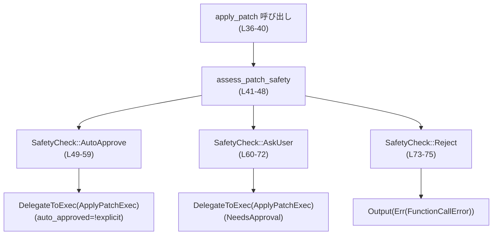
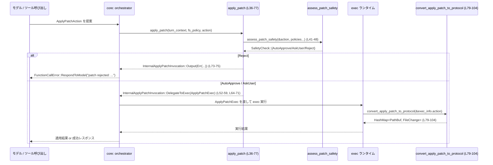

# core/src/apply_patch.rs コード解説

---

## 0. ざっくり一言

`apply_patch` リクエストに対して「安全性チェック → 実行方法の選択」と「プロトコル用のパッチ表現への変換」を行うモジュールです。

---

## 1. このモジュールの役割

### 1.1 概要

- このモジュールは、**AI エージェントからのファイルパッチ操作（apply_patch）** を扱うために存在し、  
  1) パッチ操作の安全性を評価して「どう実行するか」を決める  
  2) パッチ内容をプロトコル用の `FileChange` 形式に変換する  
  という機能を提供します（`core/src/apply_patch.rs:L13-77`, `L79-104`）。

### 1.2 アーキテクチャ内での位置づけ

このモジュールは「ツール呼び出しオーケストレーション」と「パッチ適用ツール / プロトコル」の橋渡しをします。

```mermaid
graph TD
    subgraph Core ("core crate")
        TC["TurnContext<br/>（会話・ポリシー）"]
        AP["apply_patch (async)<br/>(L36-77)"]
        Conv["convert_apply_patch_to_protocol<br/>(L79-104)"]
        SAF["assess_patch_safety<br/>(外部、safetyモジュール)"]
    end

    subgraph Tools
        AAction["ApplyPatchAction<br/>(codex_apply_patch)"]
        AChange["ApplyPatchFileChange<br/>(codex_apply_patch)"]
        ExecReq["ExecApprovalRequirement<br/>(tools::sandboxing)"]
    end

    subgraph Protocol
        FChange["FileChange<br/>(codex_protocol)"]
        FSP["FileSystemSandboxPolicy<br/>(codex_protocol)"]
    end

    TC --> AP
    AAction --> AP
    FSP --> AP
    AP --> SAF
    AP --> ExecReq
    AP -->|"InternalApplyPatchInvocation<br/>(Output / DelegateToExec)"| Core

    AAction --> Conv
    AChange --> Conv
    Conv --> FChange
```

- 実際のパッチ適用（`exec()` や `codex_apply_patch::CODEX_CORE_APPLY_PATCH_ARG1`）は、このモジュールの外側で行われることがコメントから分かります（`core/src/apply_patch.rs:L19-25`）。

### 1.3 設計上のポイント

- **安全性チェックの集中化**  
  - 実際にパッチを適用する前に `assess_patch_safety` を呼び、  
    自動承認 / 要ユーザー確認 / 拒否 の 3 パターンに分類します（`core/src/apply_patch.rs:L41-48`）。
- **実行パスの列挙型による表現**  
  - `InternalApplyPatchInvocation` により、  
    「同期的に結果を返す」か「外部 `exec` に委譲する」かを型で表現しています（`core/src/apply_patch.rs:L13-27`）。
- **sandbox と承認フローの分離**  
  - `ApplyPatchExec` に「アクション」「自動承認フラグ」「exec 時の承認要件」をまとめ、  
    実際の実行は別コンポーネントに任せる構造です（`core/src/apply_patch.rs:L29-34`）。
- **プロトコル変換の単純なマッピング関数**  
  - `convert_apply_patch_to_protocol` は `ApplyPatchFileChange` → `FileChange` の変換のみを行い、  
    それ以上のロジックを持ちません（`core/src/apply_patch.rs:L79-104`）。
- **Rust の安全性**  
  - どちらの関数も unsafe ブロックを使っておらず、標準的な所有権・借用の範囲で完結しています。
  - エラーは `FunctionCallError` や enum 分岐で表現され、panic を発生させるコードは含まれていません（`core/src/apply_patch.rs:L73-75`）。

---

## 2. 主要な機能一覧

- **安全な apply_patch 呼び出し判定**: `apply_patch`  
  `ApplyPatchAction` と各種ポリシーから、実行方式（即時エラー / exec に委譲）を決めます（`L36-77`）。
- **exec 委譲情報のカプセル化**: `ApplyPatchExec`  
  exec に渡すアクション・自動承認フラグ・承認要件をまとめます（`L29-34`）。
- **パッチ → プロトコル変換**: `convert_apply_patch_to_protocol`  
  `ApplyPatchAction` 内の変更群を `HashMap<PathBuf, FileChange>` に変換します（`L79-104`）。

---

## 3. 公開 API と詳細解説

このファイル内の要素はいずれも `pub(crate)` であり、**crate 内部向け API** です。

### 3.1 型一覧（構造体・列挙体など）

| 名前 | 種別 | 役割 / 用途 | 定義位置 |
|------|------|-------------|----------|
| `InternalApplyPatchInvocation` | enum | `apply_patch` の結果として、「即時結果を返す」か「exec に委譲する」かを表す | `core/src/apply_patch.rs:L13-27` |
| `ApplyPatchExec` | 構造体 | exec でパッチ適用を行う際に必要な情報をまとめる（アクション・自動承認かどうか・承認要件） | `core/src/apply_patch.rs:L29-34` |

外部依存の主な型（このファイルでは定義されていないもの）:

| 名前 | 種別 | 説明（コードから分かる範囲） | 使用位置 |
|------|------|------------------------------|----------|
| `TurnContext` | 構造体 | 会話ターンのコンテキスト。`approval_policy`、`sandbox_policy`、`cwd`、`windows_sandbox_level` を持つ | `L36-47` |
| `FileSystemSandboxPolicy` | 構造体 | ファイルシステムの sandbox ポリシー。安全性評価に渡される | `L38`, `L45` |
| `ApplyPatchAction` | 構造体 | パッチ操作の集合。`changes()` メソッドを持つ | `L31`, `L39`, `L79-83` |
| `ApplyPatchFileChange` | enum | 単一ファイルに対する Add/Delete/Update の変更内容 | `L86-99` |
| `FileChange` | enum | プロトコルレベルのファイル変更表現。Add/Delete/Update 変種を持つ | `L86-99` |
| `ExecApprovalRequirement` | enum | exec 実行に必要な承認条件（Skip, NeedsApproval など） | `L33`, `L55-58`, `L67-70` |
| `SafetyCheck` | enum | 安全性評価の結果（AutoApprove, AskUser, Reject{reason}） | `L41-48`, `L49-75` |
| `FunctionCallError` | enum or 構造体 | モデルへのレスポンス用エラーを表現。`RespondToModel` 変種を持つ | `L17`, `L73-75` |

### 3.2 関数詳細

#### `apply_patch(turn_context: &TurnContext, file_system_sandbox_policy: &FileSystemSandboxPolicy, action: ApplyPatchAction) -> InternalApplyPatchInvocation`

**概要**

- `ApplyPatchAction` と各種ポリシー情報からパッチ適用の安全性を評価し、  
  - 即時にエラーを返す (`Output(Err(...))`) か  
  - exec ベースのパッチ適用に委譲する (`DelegateToExec(ApplyPatchExec)`)  
  のどちらかを決定します（`core/src/apply_patch.rs:L36-77`）。
- 非同期関数として定義されていますが、このファイル内では `await` を使用しておらず、ロジック自体は同期的です（`L36-77`）。

**引数**

| 引数名 | 型 | 説明 |
|--------|----|------|
| `turn_context` | `&TurnContext` | 現在の会話・実行コンテキスト。承認ポリシーや sandbox ポリシー、カレントディレクトリなどを提供します（`L37`, `L43-47`）。 |
| `file_system_sandbox_policy` | `&FileSystemSandboxPolicy` | ファイルシステムに対する sandbox 設定。安全性評価に渡されます（`L38`, `L45`）。 |
| `action` | `ApplyPatchAction` | 実際に適用しようとしているパッチ操作の集合（`L39`, `L41-42`）。所有権がこの関数に移動します。 |

**戻り値**

- `InternalApplyPatchInvocation`（`core/src/apply_patch.rs:L13-27`）  
  - `Output(Result<String, FunctionCallError>)`  
    → この場で処理完了し、結果またはエラーを返すべきケース（現状この関数内では Reject 時のみ Err を生成）（`L73-75`）。  
  - `DelegateToExec(ApplyPatchExec)`  
    → 外部の `exec` ベースの処理に委譲するケース。`ApplyPatchExec` にはアクションと承認状態が含まれます（`L52-59`, `L64-71`）。

**内部処理の流れ（アルゴリズム）**

1. `assess_patch_safety` を呼び出し、パッチの安全性を評価する（`L41-48`）。
   - 渡す情報:
     - `&action`（`L42`）
     - `turn_context.approval_policy.value()`（承認ポリシーの値）（`L43`）
     - `turn_context.sandbox_policy.get()`（sandbox ポリシー）（`L44`）
     - `file_system_sandbox_policy`（ファイルシステム sandbox）（`L45`）
     - `&turn_context.cwd`（作業ディレクトリ）（`L46`）
     - `turn_context.windows_sandbox_level`（Windows 用 sandbox レベル）（`L47`）
2. `SafetyCheck` の結果で分岐する（`L49-75`）:
   - `SafetyCheck::AutoApprove { user_explicitly_approved, .. }` の場合（`L49-52`）:
     - `ApplyPatchExec` を生成（`L52-59`）:
       - `action`: 引数から受け取った `ApplyPatchAction` をそのまま格納。
       - `auto_approved`: `!user_explicitly_approved`（`L54`）  
         → 「ユーザーによる明示承認がなければ true（自動承認）」となる。
       - `exec_approval_requirement`: `ExecApprovalRequirement::Skip` で、  
         `bypass_sandbox: false`（sandbox はバイパスしない）、  
         `proposed_execpolicy_amendment: None` を設定（`L55-58`）。
     - `InternalApplyPatchInvocation::DelegateToExec(...)` を返す（`L52-59`）。
   - `SafetyCheck::AskUser` の場合（`L60-72`）:
     - コメントにあるとおり、「承認プロンプト（およびキャッシュされた承認）はツールランタイムに委譲」します（`L61-63`）。
     - `ApplyPatchExec` を生成し、`auto_approved: false` とする（`L64-66`）。
     - `exec_approval_requirement` は `ExecApprovalRequirement::NeedsApproval` で  
       `reason: None`, `proposed_execpolicy_amendment: None` を設定（`L67-70`）。
     - `InternalApplyPatchInvocation::DelegateToExec(...)` を返す（`L64-71`）。
   - `SafetyCheck::Reject { reason }` の場合（`L73-75`）:
     - `FunctionCallError::RespondToModel` で「patch rejected: {reason}」というエラーメッセージを生成（`L73-75`）。
     - これを `Err(...)` として `InternalApplyPatchInvocation::Output(Err(...))` を返す（`L73-75`）。

**Mermaid フロー図（apply_patch の処理）**



**Examples（使用例）**

この関数は `pub(crate)` なので、同じ crate 内からの利用例です。

```rust
use crate::codex::TurnContext;                         // TurnContext 型
use codex_apply_patch::ApplyPatchAction;               // パッチアクション
use codex_protocol::protocol::FileSystemSandboxPolicy; // ファイルシステム sandbox ポリシー
use crate::apply_patch::{apply_patch, InternalApplyPatchInvocation};

async fn handle_apply_patch(
    turn_context: &TurnContext,                        // 会話コンテキスト
    fs_policy: &FileSystemSandboxPolicy,               // sandbox ポリシー
    action: ApplyPatchAction,                          // 実行したいパッチ
) {
    match apply_patch(turn_context, fs_policy, action).await {
        InternalApplyPatchInvocation::DelegateToExec(exec_info) => {
            // exec_info.action を codex_apply_patch 経由で実行する
            // exec_info.auto_approved, exec_info.exec_approval_requirement に応じて
            // sandbox やユーザー承認フローを構成する
        }
        InternalApplyPatchInvocation::Output(result) => {
            // 拒否された場合はここに Err が入る
            match result {
                Ok(output) => {
                    // 現状、この関数内から Ok が返るパスはありませんが、
                    // 型としては成功結果も扱えるようになっています
                    println!("apply_patch output: {output}");
                }
                Err(err) => {
                    // モデルへのレスポンス用エラーとして処理する
                    eprintln!("apply_patch rejected: {err:?}");
                }
            }
        }
    }
}
```

**Errors / Panics**

- `Errors`
  - `SafetyCheck::Reject { reason }` の場合、  
    `FunctionCallError::RespondToModel(format!("patch rejected: {reason}"))` を生成し、`Err` として返します（`L73-75`）。
  - 他のエラー型はこの関数内では生成されません。
- `Panics`
  - この関数内には明示的な `panic!` やインデックスアクセスなどはなく、  
    標準的な操作（`format!` のみ）しか行っていません。
  - ただし、呼び出している `assess_patch_safety` が panic する可能性については、このチャンクからは分かりません。

**並行性 / async 観点**

- この関数自体は `async fn` ですが、内部で `await` を行っていません（`L36-77`）。
  - そのため、**実質的には同期処理を Future でラップした形** になっています。
  - おそらく「他のツール実装とのインターフェース整合性」のために async にしていると考えられますが、コードからは意図を断定できません。
- 引数はすべて参照または値渡しで、共有メモリへの同時書き込みなどは行っていません。
  - `turn_context` と `file_system_sandbox_policy` は不変参照であり、  
    この関数はそれらのフィールドを読み取るだけです（`L43-47`）。
- スレッドを生成したり、非同期タスクを spawn したりするコードはありません。

**Edge cases（エッジケース）**

- `SafetyCheck::AutoApprove` で `user_explicitly_approved = true` の場合（`L49-54`）:
  - `auto_approved` が `!true` → `false` になるため、  
    「自動承認ではなく、ユーザーが明示的に承認した」という情報を保持できます。
- `SafetyCheck::AskUser` の場合（`L60-72`）:
  - `auto_approved` は常に `false` になり、  
    `ExecApprovalRequirement::NeedsApproval` により、  
    必ず何らかの承認フローを通ることが示唆されます（`L67-70`）。
- `SafetyCheck::Reject { reason }` の `reason` が空文字列でも、  
  メッセージは `"patch rejected: "` となります（`L73-75`）。  
  この扱いが許容されるかどうかは、他コードからは分かりません。
- `ApplyPatchAction` が実際にどのようなパッチを含むかに関わらず、  
  安全性評価の結果だけで処理が分岐する点に注意が必要です（中身をここでは直接検査していません）。

**使用上の注意点**

- この関数は **実際のファイル変更を行いません**。  
  - `DelegateToExec` を返した場合は、別のコンポーネントが `ApplyPatchExec` を使って exec 呼び出しを行う必要があります。
- `Output(Ok(_))` を返すパスはこのコード内には存在しません（`L49-75`）。  
  - 将来的に「プログラム的にパッチを適用する」ロジックを追加する余地がありますが、このチャンクにはその実装は現れません。
- `ApplyPatchAction` の所有権はこの関数に移動し、  
  `DelegateToExec` の場合は `ApplyPatchExec.action` に保持されます（`L52-53`, `L64-65`）。  
  呼び出し側は `action` を再利用できません。

---

#### `convert_apply_patch_to_protocol(action: &ApplyPatchAction) -> HashMap<PathBuf, FileChange>`

**概要**

- `ApplyPatchAction` 内部の変更集合を、プロトコル層で使う `FileChange` のマップ (`HashMap<PathBuf, FileChange>`) に変換します（`core/src/apply_patch.rs:L79-104`）。
- `ApplyPatchFileChange` の各バリアントを、それに対応する `FileChange` バリアントへ変換する単純なマッピングです（`L85-100`）。

**引数**

| 引数名 | 型 | 説明 |
|--------|----|------|
| `action` | `&ApplyPatchAction` | 変換対象のパッチアクション。`changes()` メソッドで `(Path, ApplyPatchFileChange)` のイテレータを返すオブジェクトです（`L80-83`）。 |

**戻り値**

- `HashMap<PathBuf, FileChange>`（`core/src/apply_patch.rs:L79-104`）
  - キー: パス (`PathBuf`)  
  - 値: プロトコル定義の `FileChange`（`Add`, `Delete`, `Update` のいずれか）（`L86-99`）。

**内部処理の流れ**

1. `action.changes()` で変更集合を取得する（`L82`）。
2. 取得した変更数 `changes.len()` に合わせて `HashMap` の容量を確保する（`L83`）。  
   - これにより再ハッシュの回数を減らし、性能を改善する意図が読み取れます。
3. `for (path, change) in changes` で各変更を走査する（`L84-85`）。
4. `change` の内容に応じて `protocol_change` を生成する（`L85-100`）:
   - `ApplyPatchFileChange::Add { content }`  
     → `FileChange::Add { content: content.clone() }`（`L86-88`）。
   - `ApplyPatchFileChange::Delete { content }`  
     → `FileChange::Delete { content: content.clone() }`（`L89-91`）。
   - `ApplyPatchFileChange::Update { unified_diff, move_path, new_content: _new_content }`  
     → `FileChange::Update { unified_diff: unified_diff.clone(), move_path: move_path.clone() }`（`L92-99`）。
     - `new_content` はパターン上 `_new_content` という名前で完全に無視されています（`L92-95`）。
5. `result.insert(path.clone(), protocol_change)` でマップに追加する（`L101`）。
6. 最終的な `result` を返す（`L103`）。

**Examples（使用例）**

以下は、この変換結果をそのままプロトコルレイヤーに渡す例です。

```rust
use codex_apply_patch::ApplyPatchAction;               // パッチアクション
use codex_protocol::protocol::FileChange;             // プロトコル側の変更型
use crate::apply_patch::convert_apply_patch_to_protocol;

fn send_patch(action: &ApplyPatchAction) {
    // ApplyPatchAction から FileChange のマップへ変換
    let changes: std::collections::HashMap<std::path::PathBuf, FileChange> =
        convert_apply_patch_to_protocol(action);      // core/src/apply_patch.rs:L79-104

    // 生成された changes を、プロトコル層の送信ロジックに渡す
    for (path, change) in &changes {
        println!("Path: {:?}, Change: {:?}", path, change);
        // 実際にはここで RPC 送信やシリアライズを行うと想定されます（このチャンクには現れません）
    }
}
```

**Errors / Panics**

- `Errors`
  - この関数は `Result` を返さず、エラーを返すパスを持ちません。
- `Panics`
  - `HashMap::with_capacity`、`insert`、`clone` など、標準的な操作のみを行っています（`L83`, `L101`）。  
  - デフォルトではこれらは panic を発生させませんが、  
    非常に大きい容量の確保が OS に拒否された場合などは、内部的に panic する可能性があります。  
    ただし、それは通常の Rust プログラムと同様の挙動であり、このコード固有のものではありません。

**Edge cases（エッジケース）**

- `action.changes()` が空の場合（`len() == 0`）:
  - 容量 0 の `HashMap` が生成され、そのまま返されます（`L82-83`, `L103`）。
- 同じ `path` で複数の変更が含まれている場合:
  - `HashMap::insert` は同じキーで挿入すると **最後の値で上書き** されます（`L101`）。
  - `changes` の順序や定義に依存して、どの変更が最終的に採用されるかが決まります。  
    `changes` の仕様はこのチャンクには現れないため、ここでは挙動のみを記述します。
- `ApplyPatchFileChange::Update` に含まれる `new_content` が完全に無視されている点（`L92-95`）:
  - 変数名が `_new_content` になっていることから、「意図的に未使用」であることが分かります。
  - プロトコル側の `FileChange::Update` には `new_content` 相当のフィールドが存在しないか、  
    またはこのレイヤーでは diff だけを扱う設計である可能性がありますが、  
    実際の意図はこのチャンクからは断定できません。

**使用上の注意点**

- 戻り値の `HashMap` は **パスごとに 1 つの `FileChange` しか保持しない** ため、  
  1 ファイルに対して複数変更を順序付きで適用したい場合には、別のレイヤーで順序を管理する必要があります。
- `content` や `unified_diff`, `move_path` はすべて `clone()` されます（`L86-88`, `L90-91`, `L97-98`）。  
  大きな文字列やデータを扱う場合、メモリ使用量に注意が必要です。

### 3.3 その他の関数

このファイルには、上記 2 つ以外の関数はありません。

テストモジュール:

| モジュール名 | 役割（1 行） | 定義位置 |
|--------------|--------------|----------|
| `tests` | `apply_patch_tests.rs` によるテストコードを含む。内容はこのチャンクには現れません。 | `core/src/apply_patch.rs:L106-108` |

---

## 4. データフロー

ここでは、代表的なシナリオとして「AI モデルが apply_patch を提案し、それが exec で適用される」流れを示します。

### シナリオ概要

1. モデルが `ApplyPatchAction` を提案する。
2. コアロジックが `apply_patch` を呼び、`assess_patch_safety` を通じて安全性を評価する。
3. 結果に応じて:
   - 拒否される → `Output(Err(...))` を返す。
   - 許可される → `DelegateToExec(ApplyPatchExec)` を返す。
4. exec 側で `ApplyPatchAction` と `ExecApprovalRequirement` に従って実際のパッチ適用を行う。
5. プロトコル層に送る必要がある場合、`convert_apply_patch_to_protocol` で `FileChange` マップを生成する。

### シーケンス図



---

## 5. 使い方（How to Use）

### 5.1 基本的な使用方法

このモジュールを利用する典型的なフローは以下のとおりです。

```rust
use crate::codex::TurnContext;                         // 会話コンテキスト
use codex_apply_patch::ApplyPatchAction;               // パッチアクション
use codex_protocol::protocol::{FileSystemSandboxPolicy, FileChange};
use crate::apply_patch::{
    apply_patch, InternalApplyPatchInvocation,         // core/src/apply_patch.rs:L36-40, L13-27
    convert_apply_patch_to_protocol,                   // L79-81
};

async fn process_model_patch(
    turn_context: &TurnContext,                        // 現在のターンのコンテキスト
    fs_policy: &FileSystemSandboxPolicy,               // ファイルシステム sandbox ポリシー
    action: ApplyPatchAction,                          // モデルが提案したパッチ
) {
    // 1. 安全性チェックと実行経路の決定
    match apply_patch(turn_context, fs_policy, action).await {
        InternalApplyPatchInvocation::Output(result) => {
            // 安全性評価で Reject されたケース（L73-75）
            if let Err(err) = result {
                // モデルにエラーを返すなど、適切に処理する
                eprintln!("patch rejected: {err:?}");
            }
        }
        InternalApplyPatchInvocation::DelegateToExec(exec_info) => {
            // 2. exec で apply_patch を実行するための情報が入っている
            let auto_approved = exec_info.auto_approved;         // 自動承認かどうか（L31-32, L52-54, L64-66）
            let approval_req = exec_info.exec_approval_requirement;

            // 3. 実際のパッチ適用準備（プロトコル変換など）
            let file_changes: std::collections::HashMap<std::path::PathBuf, FileChange> =
                convert_apply_patch_to_protocol(&exec_info.action); // L79-104

            // 4. sandbox・承認要件に応じて exec を実行する
            // （実際の exec 呼び出しロジックはこのチャンクには現れません）
            // run_exec_with_patches(auto_approved, approval_req, file_changes).await?;
        }
    }
}
```

### 5.2 よくある使用パターン

1. **自動承認されたパッチの適用**

   - `ApplyPatchExec.auto_approved == true` の場合（`SafetyCheck::AutoApprove` かつ `user_explicitly_approved == false` 時、`L49-55`）:
     - ユーザーとの追加インタラクションなしで sandbox 内で実行できます。
     - `ExecApprovalRequirement::Skip { bypass_sandbox: false, .. }` により、  
       sandbox は維持されたまま承認プロンプトのみスキップされます（`L55-58`）。

2. **ユーザー承認が必要なパッチの適用**

   - `SafetyCheck::AskUser` によって `ExecApprovalRequirement::NeedsApproval` が返された場合（`L60-72`）:
     - UI での確認ダイアログや CLI プロンプトを出し、  
       ユーザーの承認後に exec を実行するフローが想定されます。

### 5.3 よくある間違い

```rust
// 間違い例: apply_patch の結果を無視してすぐに ApplyPatchAction を実行する
// （安全性チェックや sandbox 設定をバイパスしてしまう危険があります）
async fn wrong_usage(turn_context: &TurnContext, fs_policy: &FileSystemSandboxPolicy, action: ApplyPatchAction) {
    let _ = apply_patch(turn_context, fs_policy, action.clone()).await; // 結果を利用していない
    // ここで action を直接 exec に渡してしまうと、安全性チェック結果が反映されません。
}

// 正しい例: InternalApplyPatchInvocation を解釈してから実行する
async fn correct_usage(turn_context: &TurnContext, fs_policy: &FileSystemSandboxPolicy, action: ApplyPatchAction) {
    match apply_patch(turn_context, fs_policy, action).await {
        InternalApplyPatchInvocation::DelegateToExec(exec_info) => {
            // exec_info に基づいて実行する
        }
        InternalApplyPatchInvocation::Output(result) => {
            // Reject を処理する
        }
    }
}
```

### 5.4 使用上の注意点（まとめ）

- `apply_patch` の戻り値 `InternalApplyPatchInvocation` を **必ず解釈すること**。  
  - これを無視して `ApplyPatchAction` を直接実行すると、sandbox ポリシーや承認ポリシーが反映されません。
- `convert_apply_patch_to_protocol` は `ApplyPatchFileChange::Update` の `new_content` を無視します（`L92-99`）。  
  - 差分ではなく新しいファイル内容そのものが必要な場合は、上位レイヤーで `new_content` を扱う必要があります。
- 両関数とも、**I/O やファイル操作を直接行いません**。  
  - 実際のファイル書き換えは別コンポーネントの責務であり、このモジュールはその前段階の判定と変換のみ行います。

---

## 6. 変更の仕方（How to Modify）

### 6.1 新しい機能を追加する場合

1. **新しい安全性判定結果を追加したい場合**

   - 例: `SafetyCheck::WarnAndProceed` のような新たなバリアントを追加する場合:
     - `crate::safety` 内の `SafetyCheck` 定義と `assess_patch_safety` 実装を変更する必要があります（このチャンクには現れません）。
     - その後、このファイルの `apply_patch` の `match` 式（`L49-75`）に新しい分岐を追加し、  
       適切な `InternalApplyPatchInvocation` を返すようにします。

2. **`FileChange` の新しいバリアントを追加したい場合**

   - 例: `Rename` などの新しい変更タイプを追加する場合:
     - `codex_protocol::protocol::FileChange` に新バリアントを追加（このチャンクには現れません）。
     - `codex_apply_patch::ApplyPatchFileChange` にも対応するバリアントを追加し、  
       `convert_apply_patch_to_protocol` 内の `match change`（`L85-100`）に変換ロジックを追加します。

### 6.2 既存の機能を変更する場合

- **`auto_approved` の意味を変更する場合**
  - 現状: 「`SafetyCheck::AutoApprove` かつ `user_explicitly_approved == false` のとき true」（`L49-55`）。
  - 意味を変える場合は:
    - `AssesPatchExec` を利用している全ての呼び出し元を確認し、  
      `auto_approved` の semantics に依存している箇所を更新する必要があります。
- **`Update` における `new_content` を利用したい場合**
  - `convert_apply_patch_to_protocol` の `Update` 分岐（`L92-99`）を修正し、  
    `FileChange::Update` 側に新しいフィールドを追加するか、  
    あるいは別の経路で `new_content` を渡す必要があります。
- **影響範囲の確認方法**
  - `InternalApplyPatchInvocation` や `ApplyPatchExec` は `pub(crate)` なので、  
    同じ crate 内でこれらを使用しているファイルを検索し、挙動依存箇所を確認することが重要です。

---

## 7. 関連ファイル

| パス | 役割 / 関係 |
|------|------------|
| `core/src/apply_patch.rs` | 本ファイル。apply_patch の安全性判定とパッチ → プロトコル変換を担当。 |
| `core/src/apply_patch_tests.rs` | `#[path = "apply_patch_tests.rs"]` で参照されるテストコード。内容はこのチャンクには現れません（`L106-108`）。 |
| `crate::codex::TurnContext` | 会話コンテキスト。承認ポリシーや sandbox ポリシー、CWD などを提供します（`L1`, `L36-47`）。 |
| `crate::function_tool::FunctionCallError` | モデルへのレスポンス用エラー型。`RespondToModel` を使用（`L2`, `L73-75`）。 |
| `crate::safety::{SafetyCheck, assess_patch_safety}` | パッチの安全性評価ロジック。AutoApprove/AskUser/Reject を返します（`L3-4`, `L41-48`）。 |
| `crate::tools::sandboxing::ExecApprovalRequirement` | exec に必要な承認要件を定義する型。Skip/NeedsApproval を利用（`L5`, `L55-58`, `L67-70`）。 |
| `codex_apply_patch::{ApplyPatchAction, ApplyPatchFileChange}` | パッチアクションとファイル単位の変更表現（`L6-7`, `L31`, `L39`, `L80-83`, `L86-99`）。 |
| `codex_protocol::protocol::{FileChange, FileSystemSandboxPolicy}` | プロトコルレイヤーのファイル変更表現とファイルシステム sandbox ポリシー（`L8-9`, `L38`, `L45`, `L86-99`）。 |

---

以上が `core/src/apply_patch.rs` の構造と挙動の整理です。コードから直接読み取れない設計意図や他モジュールの詳細は、このチャンクには現れないため記述していません。
