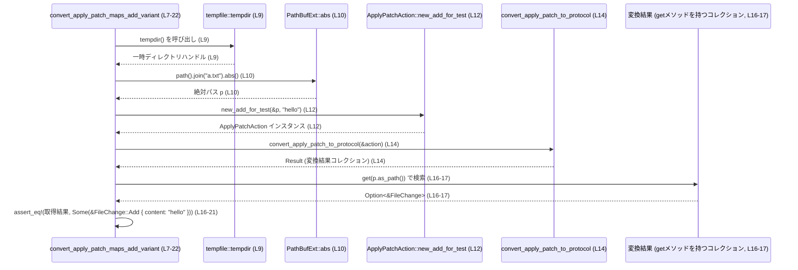

# core/src/apply_patch_tests.rs コード解説

## 0. ざっくり一言

`convert_apply_patch_to_protocol` が `ApplyPatchAction` の `Add` 変更を、`FileChange::Add` へ正しく変換できているかを検証する単一のテスト関数だけを持つファイルです（`core/src/apply_patch_tests.rs:L7-22`）。

---

## 1. このモジュールの役割

### 1.1 概要

- このファイルは、パッチ適用用アクション `ApplyPatchAction` を「プロトコル表現」に変換する関数 `convert_apply_patch_to_protocol` の振る舞いの一部をテストしています（`core/src/apply_patch_tests.rs:L12-14`）。
- 具体的には、ファイル追加（`Add`）のケースで、指定したパスと内容が、そのまま `FileChange::Add { content }` としてマッピングされることを確認します（`core/src/apply_patch_tests.rs:L16-21`）。

### 1.2 アーキテクチャ内での位置づけ

このテストモジュールは、親モジュール（`super::*`）の公開 API を検証するために存在しています（`core/src/apply_patch_tests.rs:L1`）。外部クレートとしてテスト支援・一時ディレクトリ・アサーション用ユーティリティを利用します。

```mermaid
graph LR
  subgraph "core::apply_patch_tests (core/src/apply_patch_tests.rs:L1-22)"
    T["convert_apply_patch_maps_add_variant テスト (L7-22)"]
  end

  T -->|"use super::*"(L1)| Apply["親モジュール（apply_patch関連, 詳細不明）"]
  T -->|"PathBufExt"(L2)| Support["core_test_support"]
  T -->|"assert_eq!"(L3)| Pretty["pretty_assertions"]
  T -->|"tempdir()"(L5)| Temp["tempfile"]
```

- 親モジュール `super` 側に `ApplyPatchAction`, `convert_apply_patch_to_protocol`, `FileChange` が定義されていることが、`use super::*;` とそれらの利用から分かります（`core/src/apply_patch_tests.rs:L1,L12,L14,L18`）。
- ファイルパス操作のために `core_test_support::PathBufExt` の拡張メソッド `abs` を使用しています（`core/src/apply_patch_tests.rs:L2,L10`）。
- 一時ディレクトリ作成に `tempfile::tempdir` を使用し、ファイルシステムへの副作用をテスト毎の一時領域に閉じ込めています（`core/src/apply_patch_tests.rs:L5,L9`）。
- アサーションには `pretty_assertions::assert_eq` を使っており、失敗時に差分が見やすく表示されると考えられますが、表示形式の詳細はこのチャンクには現れません（`core/src/apply_patch_tests.rs:L3,L16-21`）。

### 1.3 設計上のポイント

- **テスト専用ファイル**  
  本ファイル内で定義されているのは `#[test]` が付いた関数のみであり、実行時の本番コードは含まれていません（`core/src/apply_patch_tests.rs:L7-8`）。
- **ファイルシステム依存の隔離**  
  一時ディレクトリを `tempdir()` で作成し（`core/src/apply_patch_tests.rs:L9`）、その配下でパスを生成することでテストの副作用を限定しています（`core/src/apply_patch_tests.rs:L10`）。
- **ドメイン専用テストヘルパ**  
  `ApplyPatchAction::new_add_for_test` という名前から、テスト用に簡単に `Add` アクションを構築するヘルパであることが分かります（`core/src/apply_patch_tests.rs:L12`）。
- **期待値の明示的検証**  
  `assert_eq!` を用いて、変換結果のコレクションから `p` に対応するエントリを取り出し、その値が `FileChange::Add { content: "hello" }` であることを直接比較しています（`core/src/apply_patch_tests.rs:L16-21`）。

---

## 2. 主要な機能一覧（コンポーネントインベントリー）

このファイル内で定義・利用される主なコンポーネントを一覧にします。

| 名前 | 種別 | 定義/利用位置 | 役割 / 用途 |
|------|------|--------------|-------------|
| `convert_apply_patch_maps_add_variant` | 関数（テスト） | 定義: `core/src/apply_patch_tests.rs:L7-22` | `ApplyPatchAction` の `Add` 変更が `FileChange::Add` に変換されることを検証する単体テスト |
| `ApplyPatchAction` | 構造体（外部） | 利用: `core/src/apply_patch_tests.rs:L12` | パッチ適用アクションを表す型。ここでは `new_add_for_test` で `Add` 変更だけを持つインスタンスを生成する用途で使用されています |
| `ApplyPatchAction::new_add_for_test` | 関数/メソッド（外部） | 利用: `core/src/apply_patch_tests.rs:L12` | テスト用に、指定パスとコンテンツを持つ `Add` 変更だけの `ApplyPatchAction` を作るヘルパ |
| `convert_apply_patch_to_protocol` | 関数（外部） | 利用: `core/src/apply_patch_tests.rs:L14` | `ApplyPatchAction` をプロトコル層で使う表現（`FileChange` を値に持つコレクションなど）へ変換する関数 |
| `FileChange` | 列挙体（外部） | 利用: `core/src/apply_patch_tests.rs:L18-20` | ファイルに対する変更（`Add` など）を表す列挙体。ここでは `Add` バリアントのみ使用されています |
| `FileChange::Add` | 列挙体バリアント（外部） | 利用: `core/src/apply_patch_tests.rs:L18-20` | 新しいファイルの追加と、その内容 `content` を表現する変更 |
| `core_test_support::PathBufExt` | トレイト（外部） | 利用: `core/src/apply_patch_tests.rs:L2,L10` | `PathBuf` に対して `abs()` メソッドを追加する拡張トレイト。ここではパスを絶対パスに変換するために使われていますと推測できますが、実装はこのチャンクには現れません |
| `tempfile::tempdir` | 関数（外部） | 利用: `core/src/apply_patch_tests.rs:L5,L9` | 一時ディレクトリを作成し、そのパスをテスト中に利用するための関数 |
| `pretty_assertions::assert_eq` | マクロ（外部） | 利用: `core/src/apply_patch_tests.rs:L3,L16-21` | 2 つの値を比較し、異なっていればテストを失敗させるアサーションマクロ |
| `PathBufExt::abs` | メソッド（外部トレイトの拡張） | 利用: `core/src/apply_patch_tests.rs:L10` | `PathBuf` を絶対パスに変換するメソッド。`PathBufExt` により提供されていると読めます |

このファイル自身が新しい型や公開 API を定義しているわけではなく、既存コンポーネントを組み合わせてテストを構成している点が特徴です。

---

## 3. 公開 API と詳細解説

### 3.1 型一覧（構造体・列挙体など）

このファイル内で **新たに定義されている** 型はありません（`core/src/apply_patch_tests.rs:L1-22`）。

ただし、テスト対象として以下の外部型を利用しています。

| 名前 | 種別 | 役割 / 用途 | 根拠 |
|------|------|-------------|------|
| `ApplyPatchAction` | 構造体（推定） | パッチ適用指示全体を表す。テストでは `new_add_for_test` により `Add` 変更を含むインスタンスを生成している | 利用: `core/src/apply_patch_tests.rs:L12` |
| `FileChange` | 列挙体（推定） | 個々のファイルに対する変更を表す。ここでは `Add { content: String }` バリアントだけが利用される | 利用: `core/src/apply_patch_tests.rs:L18-20` |

> これらの型定義そのものはこのチャンクには現れないため、詳細なフィールド構成などは不明です。

### 3.2 関数詳細

#### `convert_apply_patch_maps_add_variant()`

```rust
#[test]                                                    // L7
fn convert_apply_patch_maps_add_variant() {                // L8
    let tmp = tempdir().expect("tmp");                     // L9
    let p = tmp.path().join("a.txt").abs();                // L10
    // Create an action with a single Add change           // L11
    let action = ApplyPatchAction::new_add_for_test(       // L12
        &p, "hello".to_string(),
    );

    let got = convert_apply_patch_to_protocol(&action);    // L14

    assert_eq!(                                           // L16
        got.get(p.as_path()),                             // L17
        Some(&FileChange::Add {                           // L18-20
            content: "hello".to_string()
        })
    );
}                                                          // L22
```

**概要**

- `ApplyPatchAction` に `Add` 変更が 1 つだけ含まれるケースで、`convert_apply_patch_to_protocol` の変換結果が、対象パス `p` に対して `FileChange::Add { content: "hello" }` を返すことを検証するテストです（`core/src/apply_patch_tests.rs:L12-14,L16-20`）。

**引数**

このテスト関数は引数を取りません（`core/src/apply_patch_tests.rs:L8`）。

| 引数名 | 型 | 説明 |
|--------|----|------|
| なし | なし | テストランナーから自動的に呼び出される関数です |

**戻り値**

- 戻り値型は `()` です（Rust のテスト関数のデフォルト）。失敗時には `panic!` によりテストが失敗します。

**内部処理の流れ**

1. **一時ディレクトリの作成**  
   `tempdir().expect("tmp")` で一時ディレクトリを作成し、失敗した場合は `expect` によってパニックになります（`core/src/apply_patch_tests.rs:L9`）。

2. **テスト用ファイルパスの生成**  
   一時ディレクトリのパスに `"a.txt"` を連結し、`abs()` を呼び出して絶対パス `p` を得ます（`core/src/apply_patch_tests.rs:L10`）。  
   - `tmp.path().join("a.txt")` で `PathBuf` を生成  
   - `.abs()` は `PathBufExt` の拡張メソッドです（`core/src/apply_patch_tests.rs:L2,L10`）。

3. **`Add` アクションの構築**  
   `ApplyPatchAction::new_add_for_test(&p, "hello".to_string())` により、パス `p` と内容 `"hello"` を持つ `Add` 変更だけからなる `ApplyPatchAction` インスタンス `action` を生成します（`core/src/apply_patch_tests.rs:L12`）。

4. **プロトコル表現への変換**  
   `convert_apply_patch_to_protocol(&action)` を呼び出し、変換結果 `got` を得ます（`core/src/apply_patch_tests.rs:L14`）。  
   `got` は `get` メソッドを持つコレクション型（たとえばマップのようなもの）であると分かりますが、具体的な型はこのチャンクには現れません（`core/src/apply_patch_tests.rs:L16-17`）。

5. **結果の検証**  
   `got.get(p.as_path())` でパス `p` に対応する値を取得し（`core/src/apply_patch_tests.rs:L17`）、それが  
   `Some(&FileChange::Add { content: "hello".to_string() })` と等しいことを `assert_eq!` で検証します（`core/src/apply_patch_tests.rs:L16-21`）。  
   一致しなければ `assert_eq!` はパニックを起こし、テストは失敗します。

**Examples（使用例）**

この関数自体はテストランナーから自動的に呼び出されます。似た構造のテストを追加する例を示します。

```rust
use super::*;
use core_test_support::PathBufExt;
use pretty_assertions::assert_eq;
use tempfile::tempdir;

// 内容だけを変えたバリエーションテストの例
#[test]
fn convert_apply_patch_maps_add_variant_with_different_content() {
    let tmp = tempdir().expect("tmp");                    // 一時ディレクトリを作成
    let p = tmp.path().join("b.txt").abs();               // "b.txt" の絶対パスを生成
    let action = ApplyPatchAction::new_add_for_test(      // Add 変更を1つだけ持つアクションを作成
        &p,
        "world".to_string(),
    );

    let got = convert_apply_patch_to_protocol(&action);   // プロトコル表現へ変換

    assert_eq!(
        got.get(p.as_path()),                             // パスに対応する FileChange を取得
        Some(&FileChange::Add {
            content: "world".to_string(),                 // 内容が "world" であることを確認
        }),
    );
}
```

この例は、既存のテストパターンをそのまま踏襲しつつ、コンテンツだけを変更して検証する形になっています。

**エラー / パニック条件**

- `tempdir().expect("tmp")`  
  一時ディレクトリの作成に失敗した場合、`expect("tmp")` が `panic!` を発生させます（`core/src/apply_patch_tests.rs:L9`）。  
  テストコードとしては、環境依存の致命的な失敗として扱う設計です。
- `assert_eq!`  
  - 第 1 引数 `got.get(p.as_path())` と第 2 引数 `Some(&FileChange::Add { ... })` が等しくない場合、`assert_eq!` が `panic!` を起こし、テストが失敗します（`core/src/apply_patch_tests.rs:L16-21`）。
- その他  
  - `ApplyPatchAction::new_add_for_test` や `convert_apply_patch_to_protocol` 自体が `panic!` を起こす可能性について、このチャンクからは分かりません。

**エッジケース（挙動）**

コードから直接読み取れる範囲での挙動は次のとおりです。

- `got` にパス `p` のエントリが存在しない場合  
  - `got.get(p.as_path())` は `None` を返すはずですが（コレクションの典型的な API からの推測）、この場合 `assert_eq!(None, Some(...))` によりテストは失敗します（`core/src/apply_patch_tests.rs:L16-21`）。
- `got` に別のバリアント（例: `FileChange::Modify` 等）が入っている場合  
  - パターンが `Some(&FileChange::Add { ... })` と一致しないため、`PartialEq` 実装に従って `assert_eq!` が失敗し、テストが失敗します（`core/src/apply_patch_tests.rs:L16-21`）。
- コンテンツが `"hello"` と異なる場合  
  - `content: "hello".to_string()` と比較しているため、文字列が一致しなければ `assert_eq!` が失敗します（`core/src/apply_patch_tests.rs:L18-20`）。

**使用上の注意点**

- このテストはファイルシステムへの依存を持ちますが、一時ディレクトリ内に閉じ込めることで他のテストや本番環境に影響しないようにしています（`core/src/apply_patch_tests.rs:L9-10`）。
- パスの比較に `p.as_path()` を用いており、変換結果のコレクションは所有パスではなくパス参照（`&Path` 等）をキーとしている可能性があります（`core/src/apply_patch_tests.rs:L17`）。これは API の設計に依存するため、詳細は親モジュール側の定義を確認する必要があります。
- 並行性（複数スレッド）に関する要素はこのテストにはなく、同期的に 1 つのテストケースを実行する前提になっています（`core/src/apply_patch_tests.rs:L7-22`）。

### 3.3 その他の関数

このファイル内に、補助的な関数やラッパー関数は定義されていません（`core/src/apply_patch_tests.rs:L1-22`）。

---

## 4. データフロー

このテストにおける典型的な処理シナリオは、「一時ディレクトリ上に論理的なファイルパスを作る → そのパスに対する `Add` アクションを構築する → プロトコル表現に変換 → パスで引いて結果を検証」という流れです。



- データは、パス `p` と文字列 `"hello"` を核として生成され、それが `ApplyPatchAction` → プロトコル表現 → `FileChange::Add` の順に流れ、最後に比較される構造になっています。
- 変換関数 `convert_apply_patch_to_protocol` の内部実装はこのチャンクには現れないため、プロトコル表現の具体的な型や内部のマッピング構造は不明です。

---

## 5. 使い方（How to Use）

### 5.1 基本的な使用方法

このファイルの主な用途は、`convert_apply_patch_to_protocol` の挙動を回帰テストとして検証することです。テストは通常、以下のように実行します。

```bash
cargo test convert_apply_patch_maps_add_variant
```

- 上記コマンドにより、このテスト関数だけを対象に実行できます（テスト名指定）。
- 引数や設定は不要で、テストランナーが自動的に一時ディレクトリを作成し、アクションの生成・変換・検証を行います（`core/src/apply_patch_tests.rs:L9-21`）。

### 5.2 よくある使用パターン

このテストのパターンは、他の変換ロジックのテストにも流用しやすい構造になっています。

- **別ファイル名・別コンテンツを検証するパターン**  
  既に示した例のように、`"a.txt"` → `"b.txt"` や `"hello"` → `"world"` に変えるだけで、同じ API の別パラメータを検証できます（`core/src/apply_patch_tests.rs:L10,L12,L18-20` を参考）。

- **複数変更を含むアクションの検証**  
  このファイルだけからは、複数変更を持つ `ApplyPatchAction` の構築方法は分かりませんが、もし親モジュール側がそのような API を提供している場合、同様に `convert_apply_patch_to_protocol` を呼び出し、`got.get(...)` で複数のパスをチェックするテストを追加することができます。  
  ただし、その具体的な関数名や呼び出し方は、このチャンクには現れないため不明です。

### 5.3 よくある間違い（推測ベースの一般的注意）

このファイルから直接「誤用例」を読み取ることはできませんが、一般的に似たテストを書く際に注意すべき点を挙げます。

- **パスを揃えない**  
  - テスト内で `ApplyPatchAction` を生成する際に使ったパスと、結果のコレクションを検索する際のパスが一致しないと、`got.get(...)` が `None` を返し、テストが失敗します（`core/src/apply_patch_tests.rs:L10,L12,L17`）。
- **相対パスと絶対パスの混在**  
  - このテストは `.abs()` によって絶対パスを使用しているため、変換関数側も絶対パスをキーとして使う前提で実装されている可能性があります（`core/src/apply_patch_tests.rs:L10`）。テストと実装で相対/絶対の扱いが異なると、マッピングが一致せずテストが失敗することがありえます。

### 5.4 使用上の注意点（まとめ）

- テストはファイルシステム（`tempfile` の一時ディレクトリ）に依存しますが、`tempdir` を使うことで他のテストや環境への影響を抑えています（`core/src/apply_patch_tests.rs:L5,L9-10`）。
- 変換結果のコレクションは `get` メソッドを提供している必要があります。これは `convert_apply_patch_to_protocol` の戻り値の型が満たすべき契約の一部と見なせます（`core/src/apply_patch_tests.rs:L14, L16-17`）。
- テストが想定する契約として、「`ApplyPatchAction` に `Add` 変更を 1 つだけ含めると、変換結果には該当パスに対して `FileChange::Add { content }` が 1 件存在する」ことが明示されています（`core/src/apply_patch_tests.rs:L12,L16-21`）。

---

## 6. 変更の仕方（How to Modify）

### 6.1 新しいテストケースを追加する場合

このファイルのパターンに沿って新しい機能をテストする流れは次のとおりです。

1. **テストの目的を決める**  
   例: `convert_apply_patch_to_protocol` が別の種類の変更や、エラーケースをどう扱うかを確認する。
2. **テスト関数を追加する**  
   - `#[test]` 属性を付けた関数を新しく定義します（`core/src/apply_patch_tests.rs:L7-8` を参考）。
3. **一時ディレクトリとパスを用意する**  
   - 既存テストと同じく `tempdir()` と `PathBufExt::abs()` を用いて、ユニークなパスを生成します（`core/src/apply_patch_tests.rs:L9-10`）。
4. **目的に応じた `ApplyPatchAction` を構築する**  
   - このチャンクでは `new_add_for_test` のみが見えていますが、他にもテスト用ヘルパがあれば、それらを利用してアクションを作ります（`core/src/apply_patch_tests.rs:L12`）。
5. **`convert_apply_patch_to_protocol` を呼び出す**  
   - 変換結果を受け取り（`core/src/apply_patch_tests.rs:L14`）、`get` などを使って検証対象の要素を取り出します。
6. **`assert_eq!` などで期待値を検証する**  
   - 期待される `FileChange` などと比較し、契約が守られていることを確認します（`core/src/apply_patch_tests.rs:L16-21`）。

### 6.2 既存のテストを変更する場合

`convert_apply_patch_maps_add_variant` を変更する際の注意点を挙げます。

- **テストの意図を維持する**  
  - このテストは「`Add` 変更のマッピング」が主題です。内容やパス名を変更しても構いませんが、`Add` 変換の検証という意図を保つべきです（`core/src/apply_patch_tests.rs:L11-12,L18-20`）。
- **影響範囲の確認**  
  - テスト名 `convert_apply_patch_maps_add_variant` は他のテストコードや CI 設定などから参照されている可能性がありますが、このチャンクだけからは分かりません。リネーム時は検索して影響箇所を確認する必要があります。
- **契約の変更に注意**  
  - もし `convert_apply_patch_to_protocol` の仕様を変更し、戻り値やマッピングのルールが変わる場合、このテストは仕様変更に合わせて更新する必要があります。  
    例: `content` の扱いを変える、キーを相対パスに変更するなど。
- **並行性・パフォーマンスの観点**  
  - このテストはシンプルで、性能やスレッド安全性に関する問題は実質的にありません（`core/src/apply_patch_tests.rs:L7-22`）。そのため、変更時も主には正しさ（仕様の検証）に関する影響を確認すれば十分です。

---

## 7. 関連ファイル

このファイルと密接に関係するであろうモジュールやクレートは次のとおりです。

| パス / モジュール | 役割 / 関係 |
|------------------|------------|
| 親モジュール（`super`） | `ApplyPatchAction`, `convert_apply_patch_to_protocol`, `FileChange` を定義しているモジュールです（`core/src/apply_patch_tests.rs:L1,L12,L14,L18-20`）。ファイルパス（例: `core/src/apply_patch.rs` 等）はこのチャンクからは不明です。 |
| `core_test_support::PathBufExt` | `PathBuf` に `abs()` メソッドを追加するテスト支援用トレイトを提供します（`core/src/apply_patch_tests.rs:L2,L10`）。 |
| `tempfile` クレート | `tempdir()` 関数を通じて一時ディレクトリの生成を行い、ファイルシステムを用いたテストを容易にします（`core/src/apply_patch_tests.rs:L5,L9`）。 |
| `pretty_assertions` クレート | `assert_eq!` の差分表示を改善したマクロを提供し、テスト失敗時のデバッグを支援します（`core/src/apply_patch_tests.rs:L3,L16-21`）。 |

> これら関連モジュールの具体的な実装や API は、このチャンクには現れないため、より詳細な理解のためには該当ファイルのコードやドキュメントを参照する必要があります。
