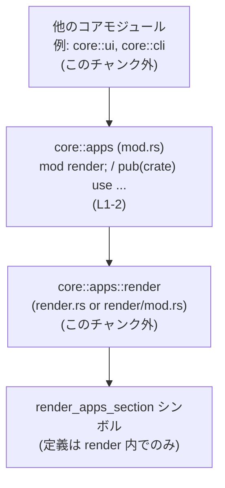

# core/src/apps/mod.rs

## 0. ざっくり一言

`core/src/apps/mod.rs` は、`apps` モジュール配下のサブモジュール `render` を宣言し、その中の `render_apps_section` というシンボルを **crate 内向けに再エクスポートする窓口モジュール**です（`core/src/apps/mod.rs:L1-2`）。

---

## 1. このモジュールの役割

### 1.1 概要

- このモジュールは、`apps` 関連の機能のうち、`render` サブモジュールに定義された `render_apps_section` シンボルを、`crate` 内の他モジュールから参照しやすくするために存在しています（`core/src/apps/mod.rs:L1-2`）。
- 実際のロジック（レンダリング処理やエラーハンドリングなど）は **すべて `render` サブモジュール側** にあり、このファイルには定義されていません。

### 1.2 アーキテクチャ内での位置づけ

このモジュールは、`apps::render` サブモジュールと他モジュールとの間に位置する「名前空間のエントリポイント」です。



- `mod render;` により、同階層の `render` サブモジュールを宣言しています（`core/src/apps/mod.rs:L1-1`）。
- `pub(crate) use render::render_apps_section;` により、そのサブモジュール内の `render_apps_section` を **crate 内のどこからでも `crate::apps::render_apps_section` として使えるように** しています（`core/src/apps/mod.rs:L2-2`）。
- 実際のロジックはすべて `core/src/apps/render.rs` もしくは `core/src/apps/render/mod.rs` にあると推測されますが、**このチャンクにはその内容は現れません**。

### 1.3 設計上のポイント

コードから読み取れる範囲での特徴は次のとおりです。

- **責務の分割**
  - このモジュールはロジックを持たず、**モジュール構造の定義と再エクスポートのみ** を行っています（`core/src/apps/mod.rs:L1-2`）。
- **API のまとめ役**
  - `render` サブモジュール内部の `render_apps_section` を crate 内の統一されたパス (`crate::apps::render_apps_section`) で提供することで、利用側の import 記述を簡略化します（`core/src/apps/mod.rs:L2-2`）。
- **状態・並行性**
  - このファイル内には構造体やグローバル状態、スレッドを扱うコードが存在しないため、状態管理や並行性に関するロジックはありません。
- **エラーハンドリング**
  - 実行される処理がないため、このモジュール内にはエラー処理ロジックは存在しません。

---

## 2. 主要な機能一覧（コンポーネントインベントリー）

このファイル自身が持つ「機能」は少ないため、**定義されているコンポーネントと再エクスポートの一覧**として整理します。

### 2.1 モジュール・再エクスポート一覧

| 名前                          | 種別           | 役割 / 用途                                                                 | 定義箇所                         |
|-------------------------------|----------------|-------------------------------------------------------------------------------|----------------------------------|
| `render`                      | サブモジュール | `apps` 配下のサブモジュール。アプリ関連の何らかのレンダリングロジックを含むと推測されますが、このチャンクからは不明です。 | `core/src/apps/mod.rs:L1-1`     |
| `render_apps_section`         | 再エクスポート | `render` モジュール内のシンボルを crate 内に再公開します。具体的なシグネチャや型は、このチャンクからは分かりません。 | `core/src/apps/mod.rs:L2-2`     |

> 注: `render_apps_section` は命名から「アプリのセクションをレンダリングする処理」である可能性が高いですが、**このチャンクには定義が存在しないため、関数かどうか・引数や戻り値の型などは断定できません**。

### 2.2 このファイルが提供する主要な役割

- `apps` 名前空間の初期化：
  - `mod render;` により `apps::render` サブモジュールを登録する（`core/src/apps/mod.rs:L1-1`）。
- `render_apps_section` へのアクセス統一：
  - `pub(crate) use render::render_apps_section;` により、crate 内から `crate::apps::render_apps_section` でアクセスできるようにする（`core/src/apps/mod.rs:L2-2`）。

---

## 3. 公開 API と詳細解説

### 3.1 型一覧（構造体・列挙体など）

このファイルには、構造体・列挙体・型エイリアスなどの **型定義は存在しません**（`core/src/apps/mod.rs:L1-2`）。

### 3.1 補足: モジュール / 再エクスポート一覧

上で挙げたインベントリーを再掲します。

| 名前                  | 種別           | 役割 / 用途                                                                 | 定義箇所                         |
|-----------------------|----------------|-------------------------------------------------------------------------------|----------------------------------|
| `render`              | サブモジュール | `apps` 配下の実装モジュール。内容はこのチャンクには現れません。             | `core/src/apps/mod.rs:L1-1`     |
| `render_apps_section` | 再エクスポート | `render` 内の同名シンボルを crate 内に公開。シンボル種別とシグネチャは不明。 | `core/src/apps/mod.rs:L2-2`     |

### 3.2 重要シンボルの詳細：`render_apps_section`

このファイルでは `render_apps_section` の実体は定義されておらず、**再エクスポートのみ** が行われています。そのため、可能な範囲で事実と推測を分けて記述します。

#### `render_apps_section`（シンボル／種別・シグネチャはこのチャンクからは不明）

**概要**

- `apps::render` サブモジュールに定義されている `render_apps_section` というシンボルを、`crate` 内の他モジュールから `crate::apps::render_apps_section` というパスで利用可能にするための再エクスポートです（`core/src/apps/mod.rs:L2-2`）。
- 命名からは「アプリ関連のセクションをレンダリングする」処理であると推測できますが、**このチャンクには定義が現れないため、これ以上の性質は断定できません**。

**引数**

- 実体は `render` モジュール内にあり、このファイルには定義が無いため、**引数の有無・型は不明**です。

**戻り値**

- 同様に、**戻り値の型や意味もこのチャンクからは不明**です。

**内部処理の流れ（アルゴリズム）**

- 実装は `render` モジュール側にあるため、このモジュールからは内部処理の流れを読み取れません。
- このファイルは `use` による再エクスポートだけを行い、処理本体は呼び出しません（`core/src/apps/mod.rs:L2-2`）。

**Examples（使用例）**

実装詳細は不明ですが、「再エクスポート経由でどう呼び出すか」という観点の例は示せます。

```rust
// crate 内の別モジュールから利用する場合のイメージ例
// 実際の引数・戻り値は render_apps_section の定義に依存するため、この例ではダミーコメントで表現します。

use crate::apps::render_apps_section; // 再エクスポートを通じて import（core/src/apps/mod.rs:L2-2 に依存）

fn render_ui() {
    // 実際には render_apps_section が要求する引数をここで準備する必要があります。
    // たとえば「アプリ一覧」や「テンプレートコンテキスト」などのデータかもしれませんが、このチャンクからは不明です。

    // 仮の呼び出し（引数部分はコメントに留める）
    // render_apps_section(/* 必要な引数 */);
}
```

このコード例は、「`crate::apps` 名前空間から `render_apps_section` を import して呼び出す」という **パスの使い方** を示すのみであり、具体的な引数や戻り値は `render` モジュールの定義に依存します。

**Errors / Panics**

- このファイル内には `render_apps_section` の本体が存在しないため、
  - どのような条件でエラー (`Result::Err` など) を返すか
  - panic を起こすかどうか
  は **このチャンクからは判断できません**。

**Edge cases（エッジケース）**

- エッジケースでの挙動（空データ・境界値・不正フォーマットなど）も、実装が見えないため不明です。
- このモジュールのレベルで言えるのは、「`render_apps_section` の仕様（契約）全般は `apps::render` 側の実装に従う」という一点だけです。

**使用上の注意点**

- このファイルが行うのは再エクスポートのみのため、**このモジュール固有の前提条件や禁止事項はありません**。
- `render_apps_section` の **正しい使い方・前提条件・エラー条件** は、`core/src/apps/render.rs` （または `core/src/apps/render/mod.rs`）にある定義を確認する必要があります。
- `pub(crate)` で再エクスポートされているため、
  - このシンボルは **crate 内部からのみ参照可能** です。
  - crate の外（別 crate）から直接利用することはできません。

### 3.3 その他の関数

- このファイル内には、ヘルパー関数やラッパー関数も含め、**関数定義は 1 つも存在しません**（`core/src/apps/mod.rs:L1-2`）。

---

## 4. データフロー

このモジュール単体には処理本体はありませんが、`render_apps_section` を利用する場合の典型的な呼び出しの流れを、**名前解決の観点**で図示します。

### 4.1 呼び出しフロー（名前解決）

```mermaid
sequenceDiagram
    participant Caller as 他モジュール<br/>(例: core::ui)
    participant AppsMod as core::apps (mod.rs)<br/>re-export(L1-2)
    participant Render as core::apps::render<br/>(このチャンク外)

    Caller->>AppsMod: use crate::apps::render_apps_section;
    Note over AppsMod: pub(crate) use render::render_apps_section;<br/>(L2)

    Caller->>Render: render_apps_section(...?)
    Note over Render: 実装・引数・戻り値は<br/>render モジュール側で定義
```

この図が表す要点:

- 呼び出し元は `crate::apps::render_apps_section` というパスでシンボルを import / 呼び出しします。
- Rust の名前解決により、その参照は `apps::render` サブモジュール内の定義に紐づきます。
- このモジュール (`mod.rs`) は、**シンボルの移譲（re-export）を行うだけ**で、引数や戻り値には関与しません。

---

## 5. 使い方（How to Use）

### 5.1 基本的な使用方法

`render_apps_section` の具体的な API は不明ですが、**再エクスポートされたシンボルの import の仕方**は次のようになります。

```rust
// crate 内の任意のモジュールから

// apps モジュール経由でシンボルを import する
use crate::apps::render_apps_section; // core/src/apps/mod.rs:L2-2 により利用可能

fn main_logic() {
    // 実際の呼び出しは、render_apps_section の定義に従う必要があります。
    // ここでは引数をコメントで表現するのみとします。

    // render_apps_section(/* 必要な引数をここに渡す */);
}
```

この例が示すのは:

- 利用側は `apps::render` を直接意識する必要はなく、`apps` モジュール配下のシンボルとして利用できます。
- API の詳細は `render_apps_section` の定義側に依存します。

### 5.2 よくある使用パターン

このチャンクからは実装や周辺コードが見えないため、**具体的な使用パターン（同期 / 非同期、UI / CLI など）を特定することはできません**。

想定される一般的なパターンとしては、アプリ一覧やアプリ関連の設定・情報から「アプリセクション」をレンダリングする UI / ドキュメント生成などが考えられますが、これは命名に基づく推測であり、コードから直接は読み取れません。

### 5.3 よくある間違い（このモジュール視点）

このモジュールに起因しそうな誤用は限定的ですが、考えられるものを列挙します。

```rust
// （誤用の可能性）render モジュールから直接 import しようとする
// use crate::apps::render::render_apps_section;

// （本モジュールの意図に沿った import）
use crate::apps::render_apps_section;
```

- 再エクスポートにより `crate::apps::render_apps_section` パスが用意されているため、
  - ライブラリ全体として「`apps` 経由でアクセスする」というスタイルを揃えたい意図がある可能性があります。
- ただし、これは設計意図の推測であり、このファイル単体からは断定できません。

### 5.4 使用上の注意点（まとめ）

- **可視性**
  - `pub(crate)` のため、このシンボルは crate 内部でのみ利用できます（`core/src/apps/mod.rs:L2-2`）。
- **仕様の確認場所**
  - 仕様・エラー条件・パフォーマンス特性などは、`apps::render` モジュール側の実装に依存します。
  - このファイルではそれらを制約・変更するコードは書かれていません。
- **並行性 / 安全性**
  - このファイルには状態やスレッドを扱うコードがなく、並行性やメモリ安全性に関わるロジックもありません。

---

## 6. 変更の仕方（How to Modify）

このファイルは非常に薄いラッパ（モジュール定義 + 再エクスポート）なので、変更パターンも限定的です。

### 6.1 新しい機能を追加する場合

新しいアプリ関連の機能を追加したい場合、このファイルをどう扱うかの一般的な流れを示します。

1. **新しいサブモジュールやシンボルの定義**
   - `core/src/apps/` 配下に `foo.rs` を追加し、`mod foo;` を `mod.rs` に追記する。
   - あるいは既存の `render` モジュールに新しいシンボルを定義する。
2. **再エクスポートの追加**
   - 外部（crate 内）から一貫したパスで利用させたい場合、`pub(crate) use ...;` を `mod.rs` に追記する。
   - 例: `pub(crate) use foo::new_feature;`
3. **影響範囲の確認**
   - 再エクスポートすることで、利用側が `crate::apps::new_feature` という新しいパスを使えるようになります。
   - 既存コードとの名前衝突（シンボル名の重複）がないか確認する必要があります。

### 6.2 既存の機能を変更する場合

`render_apps_section` の仕様や実装を変更する場合、以下の点に注意する必要があります。

- **実装の変更場所**
  - 実装は `apps::render` モジュール側にあるため、**このファイルではなく `render` の定義側を変更**する必要があります。
- **パスの変更**
  - `render_apps_section` の名前や位置を変える場合は、`mod.rs` の `pub(crate) use ...` 行（`core/src/apps/mod.rs:L2-2`）も合わせて更新する必要があります。
- **契約（前提条件・戻り値）**
  - 仕様を変更すると、`crate::apps::render_apps_section` を利用している全ての箇所に影響します。
  - 変更前後で互換性があるか（引数の数・型、戻り値の意味など）を確認し、必要に応じて利用側のコードも修正する必要があります。

---

## 7. 関連ファイル

このモジュールと密接に関連するファイルは次のとおりです。

| パス候補                                   | 役割 / 関係                                                                                 |
|--------------------------------------------|--------------------------------------------------------------------------------------------|
| `core/src/apps/render.rs`                  | `mod render;` に対応する最有力候補。`render_apps_section` の実体がここに定義されている可能性があります。 |
| `core/src/apps/render/mod.rs`              | 上記代替候補。Rust のモジュール規則上、`mod render;` はこのファイルにも対応し得ます。               |

> 注: 実際にどちらのファイルが存在するか、このチャンクからは判別できませんが、いずれかに `render` モジュールの本体がある必要があります（`core/src/apps/mod.rs:L1-1` がその根拠です）。

---

## Bugs / Security / Tests / パフォーマンス について

このファイルに関して、ユーザー指定の観点ごとに、このチャンクから分かる事実を簡潔にまとめます。

- **Bugs（バグ要因）**
  - 実行ロジックが無いため、このファイル単体で実行時バグ（ロジックミス・エラー処理漏れなど）が発生する余地はほとんどありません。
  - ただし、`render_apps_section` のシグネチャや位置を変更したのに `pub(crate) use` を更新し忘れると、コンパイルエラーにつながる可能性はあります。
- **Security（セキュリティ）**
  - セキュリティに影響し得る入出力処理や権限チェック等は、このファイルには存在しません。
  - セキュリティ上の性質は `render` モジュール側の実装に依存します。
- **Contracts / Edge Cases（契約・エッジケース）**
  - 契約: `crate` 内から `crate::apps::render_apps_section` というパスが有効であること。
  - エッジケース: この re-export 自体に特有のエッジケースはありませんが、`render` 側でシンボル名や可視性が変わるとコンパイルが失敗します。
- **Tests（テスト）**
  - このファイルにはテストコードは含まれていません（`#[cfg(test)]` 等も無し）。
  - 動作検証は `render` モジュールのテストや、`apps::render_apps_section` を利用する高レベルテストで行うのが自然です。
- **Performance / Scalability（性能・スケーラビリティ）**
  - 再エクスポートはコンパイル時の名前解決に関する機能であり、実行時オーバーヘッドは事実上ありません。
  - パフォーマンスやスケーラビリティは、`render_apps_section` の実装に依存します。
- **Observability（ログ・メトリクス）**
  - このファイルにはログ出力やメトリクス収集のコードはありません。
  - 観測可能性に関する設計も `render` モジュール側で行われていると考えられますが、このチャンクからは不明です。

---

このレポートは、`core/src/apps/mod.rs` のコード断片（2 行）から読み取れる範囲のみを対象としており、`render` モジュールの実装内容や `render_apps_section` の具体的な API については **「このチャンクには現れない」ため不明** であることに留意してください。
