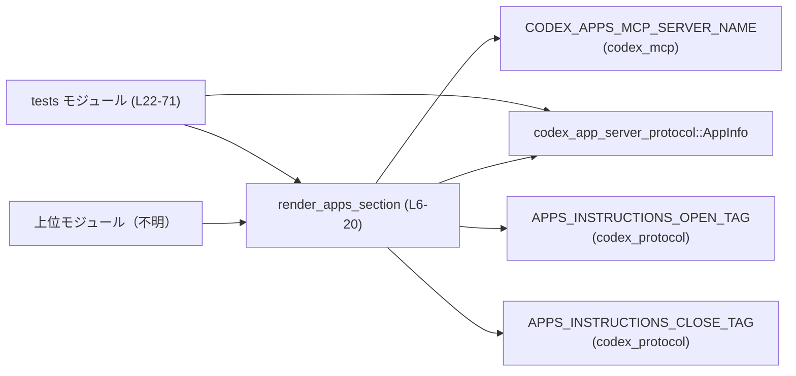
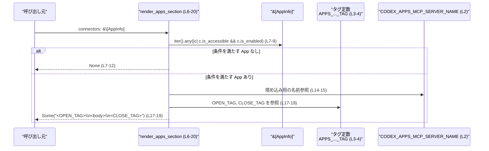

# core/src/apps/render.rs

## 0. ざっくり一言

`render_apps_section` 関数が、利用可能な App（Connector）が存在する場合にだけ「Apps (Connectors)」説明セクションを Markdown 文字列として生成し、専用のタグで囲んで返すモジュールです。[根拠: `core/src/apps/render.rs`:L6-20]

---

## 1. このモジュールの役割

### 1.1 概要

- このモジュールは、アプリケーション内部で使用される「Apps (Connectors)」説明文を組み立てるための補助関数を提供します。[根拠:L6-20]
- 接続可能かつ有効化された `AppInfo` が 1 つ以上存在する場合だけ、この説明セクションを返し、それ以外の場合は `None` を返します。[根拠:L6-12]

### 1.2 アーキテクチャ内での位置づけ

このファイル単体から分かる依存関係を図示します。上位の呼び出し元はこのチャンクには現れないため「不明」としています。



- 呼び出し元（プロンプト生成などを行うモジュール）は不明ですが、`render_apps_section` の戻り値の `Option<String>` を用いて、Apps セクションを付けるかどうかを決める構造が想定されます（ただしこのチャンクからは呼び出しコードは確認できません）。[根拠:L6-20]
- テスト用の `tests` モジュールから `render_apps_section` が直接呼び出されています。[根拠:L22-24, L45-59, L61-70]

### 1.3 設計上のポイント

- **責務の分割**  
  - Apps セクションの生成ロジックを 1 関数 `render_apps_section` に閉じ込め、呼び出し側は存在有無のみを意識すればよい構造になっています。[根拠:L6-20]
- **状態を持たない純粋関数**  
  - グローバルな可変状態には一切触れず、入力スライス `&[AppInfo]` だけから結果を計算する純粋な関数です。[根拠:L6-19]
- **ガード付きレンダリング**  
  - `connectors` の中に「`is_accessible` かつ `is_enabled` なものが 1 つもない場合」は即座に `None` を返し、文字列構築を行いません。[根拠:L7-12]
- **タグで囲まれたプロンプト断片**  
  - 生成される文字列は、`APPS_INSTRUCTIONS_OPEN_TAG` と `APPS_INSTRUCTIONS_CLOSE_TAG` で囲まれたブロックとなっており、他コンポーネントがタグをキーに抽出・挿入できる前提の設計と考えられます。[根拠:L17-19]
- **エラーハンドリング方針**  
  - 成功／不成功を `Result` ではなく `Option` で表現しており、「Apps セクションが論理的に不要な場合」を `None` として返すだけで、エラー情報は持ちません。[根拠:L6]

---

## 2. 主要な機能一覧

- Apps セクション条件付きレンダリング: 利用可能な App が存在するときだけ、Apps の説明を含む Markdown セクションをタグ付きで生成する。[根拠:L6-20]
- テスト用ヘルパー `connector`: 指定された状態の `AppInfo` インスタンスを構築し、テストケースで利用する。[根拠:L26-42]
- Apps セクション非生成のテスト: 利用可能な App がない場合に `None` が返ることを検証する。[根拠:L44-59]
- Apps セクション生成のテスト: 利用可能な App が存在する場合に、タグや本文が含まれることを検証する。[根拠:L61-70]

---

## 3. 公開 API と詳細解説

### 3.1 型一覧（構造体・列挙体など）

このファイル内で定義されている新しい型はありません。外部クレートから次の型を利用しています。

| 名前 | 種別 | 定義場所（推定） | 使用箇所 / 役割 | 定義位置（このファイル内参照行） |
|------|------|------------------|-----------------|-----------------------------------|
| `AppInfo` | 構造体 | `codex_app_server_protocol` クレート（ファイルパスはこのチャンクには現れない） | 各 App（Connector）の状態・メタ情報を表す。`is_accessible` と `is_enabled` フィールドで「利用可能かつ有効か」を判定するために使用。[根拠:L1, L7-9, L26-41] | `core/src/apps/render.rs:L1, L7-9, L26-41` |

併せて利用している外部定数を整理します。

| 名前 | 種別 | 定義場所（推定） | 使用箇所 / 役割 | 定義位置（このファイル内参照行） |
|------|------|------------------|-----------------|-----------------------------------|
| `CODEX_APPS_MCP_SERVER_NAME` | 定数 | `codex_mcp` クレート | 本文中で「どの MCP サーバーに属するツールか」を説明するための名前として埋め込まれる。[根拠:L2, L14-15] | `core/src/apps/render.rs:L2, L14-15` |
| `APPS_INSTRUCTIONS_OPEN_TAG` | 定数 | `codex_protocol::protocol` | Apps セクションの開始タグ文字列。[根拠:L3, L17-18] | `core/src/apps/render.rs:L3, L17-18` |
| `APPS_INSTRUCTIONS_CLOSE_TAG` | 定数 | `codex_protocol::protocol` | Apps セクションの終了タグ文字列。[根拠:L4, L17-19] | `core/src/apps/render.rs:L4, L17-19` |

### 3.2 関数詳細

#### `render_apps_section(connectors: &[AppInfo]) -> Option<String>`

**概要**

- 与えられた `AppInfo` のスライスを調べ、少なくとも 1 つ「`is_accessible` かつ `is_enabled`」な App があれば、Apps (Connectors) に関する固定の説明文を Markdown 文字列として生成し、特定のタグで囲んで返す関数です。[根拠:L6-20]
- 条件を満たす App が 1 つもない場合は、Apps セクションを出力する必要がないとみなし、`None` を返します。[根拠:L7-12]

**引数**

| 引数名 | 型 | 説明 |
|--------|----|------|
| `connectors` | `&[AppInfo]` | 利用可能な App（Connector）一覧。参照（借用）のみで、所有権は移動しません。[根拠:L6] |

**戻り値**

- `Option<String>`  
  - `Some(String)`: Apps 説明セクションの Markdown。`APPS_INSTRUCTIONS_OPEN_TAG` と `APPS_INSTRUCTIONS_CLOSE_TAG` に挟まれた形の文字列です。[根拠:L14-19]  
  - `None`: `connectors` に「`is_accessible` かつ `is_enabled`」な App が存在しない場合。[根拠:L7-12]

**内部処理の流れ（アルゴリズム）**

1. `connectors` に対して `.iter()` でイテレータを取得します。[根拠:L7-8]
2. `.any(...)` を用いて、「`is_accessible` と `is_enabled` が両方とも `true` な要素」が 1 つでも存在するかを判定します。[根拠:L8-9]
3. もしそのような要素が 1 つも存在しなければ、`None` を返して処理を終了します。[根拠:L7-12]
4. 少なくとも 1 つ存在する場合は、固定の Markdown 文字列を `format!` マクロで生成し、`body` 変数に格納します。この文字列には `CODEX_APPS_MCP_SERVER_NAME` の値が埋め込まれます。[根拠:L14-16]
5. 最後に、`APPS_INSTRUCTIONS_OPEN_TAG`・`body`・`APPS_INSTRUCTIONS_CLOSE_TAG` を改行区切りで結合した文字列を `format!` で生成し、`Some(...)` で包んで返します。[根拠:L17-19]

この処理は参照透過（同じ入力に対して常に同じ出力）であり、副作用はありません。

**Examples（使用例）**

テスト内の `connector` 関数を元に、基本的な利用例を示します。[根拠:L26-42]

```rust
use codex_app_server_protocol::AppInfo;                         // AppInfo 型をインポートする
use core::apps::render::render_apps_section;                    // この関数を仮にこのモジュールからインポートすると仮定する（パスは実際のクレート構成による）

// テスト内の connector 関数と同等のヘルパー関数                       // AppInfo を簡単に生成するための補助関数
fn connector(id: &str, is_accessible: bool, is_enabled: bool) -> AppInfo {
    AppInfo {
        id: id.to_string(),                                     // ID を文字列として設定
        name: id.to_string(),                                   // 名前も ID と同じに設定
        description: None,
        logo_url: None,
        logo_url_dark: None,
        distribution_channel: None,
        branding: None,
        app_metadata: None,
        labels: None,
        install_url: None,
        is_accessible,                                          // 引数から受け取ったフラグ
        is_enabled,                                             // 引数から受け取ったフラグ
        plugin_display_names: Vec::new(),
    }
}

fn build_prompt() -> String {
    // 利用可能かつ有効な App を 1 つ用意する                            // is_accessible & is_enabled が true
    let apps = vec![
        connector("calendar", true, true),
    ];

    let mut prompt = String::from("### System Instructions\n"); // もともとのプロンプト

    if let Some(apps_section) = render_apps_section(&apps) {    // Apps セクションを試しにレンダリングする
        prompt.push_str(&apps_section);                         // 返ってきたセクションを追記する
        prompt.push('\n');
    }

    prompt                                                      // 結果のプロンプト全体を返す
}
```

この例では、`apps` に利用可能かつ有効な App が含まれているため `Some(String)` が返り、`prompt` 末尾に Apps セクションが追加されます。

**Errors / Panics**

- この関数は `Result` ではなく `Option` を返すため、ドメイン上のエラー情報は返しません。[根拠:L6]
- 関数内での明示的な `panic!` や `unwrap` 呼び出しは存在しません。[根拠:L6-20]
- `format!` マクロ内部でのメモリ確保に失敗した場合など、極端な状況ではランタイムによるパニックが起きる可能性はありますが、これは Rust 全般に共通する挙動であり、このファイル固有のコードからは特別なパニック要因は読み取れません。

**エッジケース（Edge cases）**

- `connectors` が空スライス `&[]` の場合  
  - `.any(...)` が `false` を返すため、即座に `None` を返します。[根拠:L7-12, L46-47]
- すべての `AppInfo` が `is_accessible == true` だが `is_enabled == false` の場合  
  - 条件 `is_accessible && is_enabled` が満たされないため、`None`。[根拠:L8-9, L47-51]
- すべての `AppInfo` が `is_accessible == false` だが `is_enabled == true` の場合  
  - 同様に条件を満たさないため、`None`。[根拠:L8-9, L53-57]
- 条件を満たす App が 1 つでも存在すれば、その他の App の状態にかかわらず `Some(String)` を返します（実際の文字列内容は固定）。[根拠:L7-9, L14-19]

**使用上の注意点（安全性・エラー・並行性を含む）**

- **Option の扱い**  
  - `None` はエラーではなく「Apps セクションを出力する必要がない」という通常状態を表します。そのため、呼び出し側は `unwrap` ではなく `if let Some(...)` や `match` で分岐して扱うのが前提です。[根拠:L6-12]
- **参照と所有権**  
  - 引数は `&[AppInfo]` であり、`AppInfo` の所有権は呼び出し元に残ります。関数内で `AppInfo` のライフタイムを延長するような保持は行っていないため、所有権・ライフタイムに関する追加の制約はありません。[根拠:L6-12]
- **スレッド安全性 / 並行性**  
  - 関数はどのスレッドローカルな状態も変更せず、入力スライスを読み取るだけの純粋関数です。`connectors` が他のスレッドと共有されない限り、並列呼び出しに関する追加の注意点はありません（通常の Rust の借用規則に従います）。[根拠:L6-12]
- **パフォーマンス**  
  - `.any(...)` による判定は短絡評価されるため、条件を満たす App が先頭近くにあれば早期にループが終了します。[根拠:L7-9]
  - 文字列生成 (`format!`) は条件を満たす場合にのみ実行されるため、不要な文字列構築コストを避けています。[根拠:L7-9, L14-19]

### 3.3 その他の関数

このファイル内で `render_apps_section` 以外に定義されている関数の一覧です。

| 関数名 | 可視性 | 役割（1 行） | 定義位置（行範囲） |
|--------|--------|--------------|---------------------|
| `connector(id: &str, is_accessible: bool, is_enabled: bool) -> AppInfo` | モジュール内（テスト専用） | テスト用に、指定された状態の `AppInfo` インスタンスを生成するヘルパー関数。[根拠:L26-42] | `core/src/apps/render.rs:L26-42` |
| `omits_apps_section_without_accessible_and_enabled_apps()` | テスト関数 | 利用可能かつ有効な App が存在しないケースでは `render_apps_section` が `None` を返すことを検証する。[根拠:L44-59] | `core/src/apps/render.rs:L44-59` |
| `renders_apps_section_with_an_accessible_and_enabled_app()` | テスト関数 | 利用可能かつ有効な App が存在するケースで、返された文字列に開始タグ・見出し・終了タグが含まれることを検証する。[根拠:L61-70] | `core/src/apps/render.rs:L61-70` |

---

## 4. データフロー

ここでは `render_apps_section (L6-20)` 呼び出し時の典型的なデータフローを示します。

- 呼び出し元は `&[AppInfo]` を用意し、`render_apps_section` に渡します。[根拠:L6]
- 関数内部で `AppInfo` のフラグをチェックし、条件に応じて Apps セクション文字列を生成するかどうかを決めます。[根拠:L7-12, L14-19]
- 生成された文字列はタグで囲まれた 1 つの Markdown ブロックとして `Some(String)` で呼び出し元に返されます。[根拠:L17-19]



---

## 5. 使い方（How to Use）

### 5.1 基本的な使用方法

Apps セクションを必要に応じてプロンプトやメッセージに追加する基本パターンです。

```rust
use codex_app_server_protocol::AppInfo;                         // AppInfo 型を利用
use core::apps::render::render_apps_section;                    // 実際のパスはクレート構成に依存する

fn build_system_prompt(connectors: &[AppInfo]) -> String {
    let mut prompt = String::from("## System\n");               // ベースとなるシステムプロンプト

    if let Some(apps_section) = render_apps_section(connectors) {
        // Apps セクションが必要な場合のみ追加される                          // None の場合は何もしない
        prompt.push_str(&apps_section);
        prompt.push('\n');
    }

    prompt                                                      // 完成したプロンプトを返す
}
```

- 呼び出し側は `Option<String>` を安全に扱うために `if let` もしくは `match` を用いることが前提です。[根拠:L6-12]
- `connectors` の構築方法や `AppInfo` の取得元はこのチャンクには現れないため不明です。

### 5.2 よくある使用パターン

1. **サーバー側でのプロンプト構築時に条件付きで追加する**  
   - システムメッセージやガイドラインを構築するフェーズで `render_apps_section` を呼び出し、返ってきた `Some(String)` をそのまま結合する。
2. **デバッグ用途で Apps セクションだけのプレビューを行う**  
   - CLI ツールやテストコードから `render_apps_section` を直接呼び出し、返ってきた Markdown をログ出力やコンソール表示に利用する。

### 5.3 よくある間違い（想定される誤用）

このチャンクから推測できる、起こりうる誤用例です。

```rust
// 誤り例: None の可能性を考慮せずに unwrap してしまう
let section = render_apps_section(connectors).unwrap();          // 利用可能な App が無い場合に panic する可能性がある

// 正しい例: Option をパターンマッチで扱う
let mut prompt = String::new();
if let Some(section) = render_apps_section(connectors) {         // Some の場合だけ追加する
    prompt.push_str(&section);
}
```

- `None` は通常状態であり、エラーではありません。そのため `unwrap` を使うと、アプリがインストールされていない環境などで不必要にパニックする可能性があります。[根拠:L6-12]

### 5.4 使用上の注意点（まとめ）

- `connectors` に含まれる `AppInfo` の `is_accessible` / `is_enabled` フラグは、Apps セクションを出すかどうかの唯一の条件です。このロジックを変更したい場合は `render_apps_section` の条件式を修正する必要があります。[根拠:L7-9]
- 関数は純粋関数であり、スレッド間で共有して呼び出しても安全です（Rust の通常の借用規則に従う限り）。[根拠:L6-12]
- 出力フォーマット（開始タグ・終了タグ・本文の Markdown）の変更は、この関数内部の `format!` 呼び出しに集中しています。[根拠:L14-19]

---

## 6. 変更の仕方（How to Modify）

### 6.1 新しい機能を追加する場合

例として、「特定のラベルを持つ App だけを対象にしたい」などの拡張を行う場合の考え方です。

1. **判定条件の拡張**  
   - 追加の条件が `AppInfo` のどのフィールドに基づくかを確認します（例えば `labels` フィールドなど）。`connector.is_accessible && connector.is_enabled` の条件に AND / OR で条件を追加します。[根拠:L8-9]
2. **テキストの変更・追加**  
   - Apps セクションの説明文を変更・拡張するには、`body` を生成している `format!` 呼び出しを修正します。[根拠:L14-16]
3. **タグとの整合性**  
   - 開始タグ・終了タグを変更したい場合は、`APPS_INSTRUCTIONS_OPEN_TAG` / `APPS_INSTRUCTIONS_CLOSE_TAG` 側の定義変更、もしくはこの関数内で別の定数を用いるように変更します。[根拠:L17-19]
4. **テストの追加**  
   - 追加した条件ごとに、Apps セクションが出力されるケース／出力されないケースのテストを `tests` モジュールに追加するのが自然です。[根拠:L44-59, L61-70]

### 6.2 既存の機能を変更する場合

- **影響範囲の確認**  
  - `render_apps_section` は pub(crate) であり、同一クレート内の他モジュールから呼び出されている可能性があります。このチャンクには呼び出し箇所が現れないため、実際の影響範囲は不明です。[根拠:L6]
- **契約（前提条件・返り値の意味）**  
  - 「利用可能かつ有効な App が一つもないときに `None` を返す」という契約が暗黙的に存在し、テストでも検証されています。[根拠:L7-12, L44-59]  
  - この契約を変える（例えば常に `Some` を返す）場合は、テストの期待値と、呼び出し元のロジックを合わせて修正する必要があります。
- **テストの更新**  
  - 出力文字列の内容（見出しなど）を変更する場合、`renders_apps_section_with_an_accessible_and_enabled_app` が `contains("## Apps (Connectors)")` などで検証しているため、該当箇所も合わせて更新する必要があります。[根拠:L61-70]

---

## 7. 関連ファイル

このモジュールと密接に関係する外部クレートのモジュールを、わかる範囲で列挙します。

| パス / モジュール | 役割 / 関係 |
|-------------------|------------|
| `codex_app_server_protocol::AppInfo` | App（Connector）の ID、名前、状態（`is_accessible` / `is_enabled` など）を保持する構造体。`render_apps_section` の入力として利用される。[根拠:L1, L6-9, L26-41] |
| `codex_mcp::CODEX_APPS_MCP_SERVER_NAME` | Apps が属する MCP サーバー名を表す定数。Apps セクション本文の中に埋め込まれている。[根拠:L2, L14-15] |
| `codex_protocol::protocol::APPS_INSTRUCTIONS_OPEN_TAG` | Apps セクションの開始を示すタグ文字列。[根拠:L3, L17-18] |
| `codex_protocol::protocol::APPS_INSTRUCTIONS_CLOSE_TAG` | Apps セクションの終了を示すタグ文字列。[根拠:L4, L17-19] |

これら外部モジュールの具体的なファイルパスや内部実装は、このチャンクには現れないため不明です。
