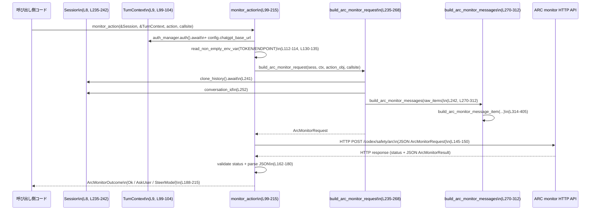

# core/src/arc_monitor.rs

## 0. ざっくり一言

外部の「ARC セーフティモニター」HTTP エンドポイントに対して、ツール呼び出し（`action`）と会話履歴を送信し、その結果に応じてツールの実行を続行するか・ユーザー確認を挟むか・モデルを迂回させるかを決める非同期ヘルパーモジュールです（`monitor_action`、`ArcMonitorOutcome` が中核、arc_monitor.rs:L21-26, L99-215）。

---

## 1. このモジュールの役割

### 1.1 概要

- このモジュールは **ツール実行前の安全性評価** のために存在し、  
  Codex のセッション・会話履歴・ツールアクションを外部の ARC モニター API に送信します（arc_monitor.rs:L99-150, L235-268, L270-312）。
- API の応答を `ArcMonitorOutcome` にマッピングし、呼び出し側が  
  「そのまま実行」「ユーザーへ確認」「モデルへのステアリング」の3パターンで分岐できるようにします（arc_monitor.rs:L21-26, L188-215）。
- 会話履歴（`ResponseItem`）を ARC モニター向けのシンプルな JSON チャット形式に変換するロジックを持ちます（arc_monitor.rs:L270-405）。

### 1.2 アーキテクチャ内での位置づけ

Codex 内のツール実行パイプラインから呼ばれ、外部の ARC モニターサービスに HTTP POST を送る位置づけです。

```mermaid
graph TD
  subgraph Codex Core
    Session["Session (会話履歴)\narc_monitor.rs:L8, L235-242"]
    TurnContext["TurnContext (設定/認証)\narc_monitor.rs:L9, L99-104, L130-135"]
    History["ResponseItem[]\narc_monitor.rs:L14-15, L241-243, L270-312"]
    ArcMon["monitor_action (L99-215)"]
  end

  subgraph External
    ArcService["ARC monitor HTTP API\nPOST /codex/safety/arc\narc_monitor.rs:L130-135, L145-172"]
  end

  Session -->|clone_history().await| ArcMon
  TurnContext --> ArcMon
  ArcMon -->|uses| History
  ArcMon -->|HTTP POST (JSON)| ArcService
  ArcService -->|JSON ArcMonitorResult| ArcMon
```

- `monitor_action` は `Session` と `TurnContext` に依存し、履歴と設定・認証情報を集約して ARC モニターに問い合わせます（arc_monitor.rs:L99-150, L235-268, L270-312）。
- HTTP クライアント生成は `codex_login::default_client::build_reqwest_client` に委譲されています（arc_monitor.rs:L13, L145-150）。
- 会話履歴の構造は `codex_protocol::models::ResponseItem` を前提としています（arc_monitor.rs:L14-15, L270-312, L314-404）。

### 1.3 設計上のポイント

- **責務の分割**
  - 外部 API 呼び出しと結果解釈: `monitor_action`（arc_monitor.rs:L99-215）。
  - 環境変数の安全な読み取り: `read_non_empty_env_var`（arc_monitor.rs:L218-233）。
  - リクエスト Body 組み立て: `build_arc_monitor_request`（arc_monitor.rs:L235-268）。
  - 会話履歴 → ARC 用メッセージ変換: `build_arc_monitor_messages` / `build_arc_monitor_message_item`（arc_monitor.rs:L270-405）。
- **エラーハンドリング方針**
  - 認証トークン取得失敗・HTTP エラー・ステータス非成功・レスポンス JSON パース失敗など、いずれの場合も **安全側に倒して ARC モニターを「スキップ」し、`ArcMonitorOutcome::Ok` を返す** 設計です（arc_monitor.rs:L112-128, L155-172, L174-180）。
- **パーサの安全性**
  - 受信 JSON の構造体（`ArcMonitorResult` 等）には `#[serde(deny_unknown_fields)]` を付与し、想定外のフィールドを含むレスポンスを拒否します（arc_monitor.rs:L40-48, L63-72, L74-80）。  
    その場合はパース失敗として扱われ、監視をスキップします（arc_monitor.rs:L174-180）。
- **非同期・並行性**
  - このモジュールは `async fn` と `reqwest` の非同期 I/O に依存しており、`monitor_action` は複数同時に呼ばれても共有可変状態を持ちません（`env` は OS 共有ですが内部でロックされます）。`unsafe` コードは使用していません。
- **プライバシー/ログ**
  - エラー時には `warn!` ログを出しますが、環境変数の値などはログに出さず、キー名のみを出力します（arc_monitor.rs:L226-229）。  
  - 非成功レスポンス時にはレスポンスボディ全文をログに含めるため、レスポンス内容に機微情報が含まれる可能性がある点は設計上の注意点です（arc_monitor.rs:L163-171）。

---

## 2. 主要な機能一覧

- ARC モニター呼び出しと結果解釈: `monitor_action` が外部 HTTP API を叩き、`ArcMonitorOutcome` を返す（arc_monitor.rs:L99-215）。
- 環境変数によるエンドポイント / トークンの上書き読み込み: `read_non_empty_env_var`（arc_monitor.rs:L218-233）。
- セッション履歴から ARC モニター用リクエスト Body の構築: `build_arc_monitor_request`（arc_monitor.rs:L235-268）。
- `ResponseItem` 配列から ARC モニター用チャットメッセージリストへの変換（ユーザー・アシスタント・最後のツール呼び出し・最後の encrypted reasoning の抽出）（arc_monitor.rs:L270-405）。
- ARC モニターへの入力用メタデータ（スレッド ID・ターン ID・callsite など）の付加（arc_monitor.rs:L253-259）。

---

## 3. 公開 API と詳細解説

### 3.1 型一覧（構造体・列挙体など）

| 名前 | 種別 | 役割 / 用途 | 定義箇所 |
|------|------|-------------|----------|
| `ArcMonitorOutcome` | 列挙体（`pub(crate)`） | ARC モニターの評価結果を、「そのまま実行 (`Ok`)」「モデルの挙動を変えるためのメッセージ (`SteerModel(String)`)」「ユーザーへの確認メッセージ (`AskUser(String)`)」の 3 種で表す | arc_monitor.rs:L21-26 |
| `ArcMonitorRequest` | 構造体 | ARC モニター HTTP API に送る JSON ボディ。メタデータ・会話メッセージ・入力・ポリシー・アクションを含む | arc_monitor.rs:L28-38 |
| `ArcMonitorResult` | 構造体 | ARC モニターからの JSON 応答（評価結果）を表す。outcome・短い理由・詳細な理由・リスクスコア・レベル・証拠を含む | arc_monitor.rs:L40-48 |
| `ArcMonitorChatMessage` | 構造体 | ARC モニター用に整形された 1 メッセージ（role + JSON content） | arc_monitor.rs:L51-55 |
| `ArcMonitorPolicies` | 構造体 | ユーザー/開発者ポリシー文字列を保持するオプションフィールド。現状 Both `None` で送信 | arc_monitor.rs:L57-61, L262-265 |
| `ArcMonitorMetadata` | 構造体 | スレッド ID・ターン ID・会話 ID・呼び出し元識別子を含むメタデータ | arc_monitor.rs:L63-72, L253-259 |
| `ArcMonitorEvidence` | 構造体 | モニター結果の「証拠」。メッセージと理由の組を持つ | arc_monitor.rs:L74-80 |
| `ArcMonitorResultOutcome` | 列挙体 | 応答の生 outcome 値（`Ok` / `SteerModel` / `AskUser`）を JSON からパースするための型 | arc_monitor.rs:L82-88 |
| `ArcMonitorRiskLevel` | 列挙体 | リスクレベル（`Low` / `Medium` / `High` / `Critical`）を表す | arc_monitor.rs:L90-97 |

`ArcMonitorRequest` / `ArcMonitorResult` / `ArcMonitorMetadata` / `ArcMonitorEvidence` には `#[serde(deny_unknown_fields)]` が一部に付与されており、JSON 構造が事前に定義されたものから外れた場合はパースエラーとなります（arc_monitor.rs:L40-48, L63-72, L74-80）。

### 3.2 関数詳細

#### `monitor_action(sess: &Session, turn_context: &TurnContext, action: serde_json::Value, protection_client_callsite: &'static str) -> ArcMonitorOutcome`

**概要**

- Codex のセッションとターンコンテキスト、およびツール呼び出し `action` をもとに ARC モニター API を非同期に呼び出し、その結果を `ArcMonitorOutcome` に変換して返す関数です（arc_monitor.rs:L99-215）。
- 認証トークンやエンドポイント URL は環境変数、または `TurnContext` 内のチャットベース URL・認証情報から決定されます（arc_monitor.rs:L112-135）。

**引数**

| 引数名 | 型 | 説明 |
|--------|----|------|
| `sess` | `&Session` | 会話履歴（`clone_history()` / `conversation_id`）を取得するための Codex セッション（arc_monitor.rs:L235-268） |
| `turn_context` | `&TurnContext` | 認証マネージャ (`auth_manager`) や設定（`config.chatgpt_base_url`）を含むコンテキスト（arc_monitor.rs:L99-111, L130-135） |
| `action` | `serde_json::Value` | ARC モニターに評価させたいツール呼び出しペイロード。オブジェクトである必要があります（arc_monitor.rs:L136-142） |
| `protection_client_callsite` | `&'static str` | 呼び出し元を識別するための文字列。メタデータに格納されます（arc_monitor.rs:L253-259） |

**戻り値**

- `ArcMonitorOutcome`（arc_monitor.rs:L21-26）  
  - `Ok`: モニターをスキップしたか、モニター結果として問題なしと判断されたケース。呼び出し側は通常どおりツール実行を継続できます。
  - `AskUser(String)`: ユーザーに追加の確認を行うべきと判断されたケース。文字列には確認メッセージ候補が含まれます（arc_monitor.rs:L192-203）。
  - `SteerModel(String)`: モデル自身をステアリングすべき（ツール実行を中止/変更する）ケース。文字列にはモデルへの指示や理由が入ります（arc_monitor.rs:L204-214）。

**内部処理の流れ**

1. **認証情報の取得とフィルタリング**  
   - `turn_context.auth_manager` が存在し、その `auth().await` により取得した認証が `is_chatgpt_auth()` を満たす場合だけ `Some(auth)` を保持します（arc_monitor.rs:L105-111）。
2. **トークン決定ロジック**
   - まず環境変数 `CODEX_ARC_MONITOR_TOKEN` を `read_non_empty_env_var` で読み取り、非空・Unicode の値があればそれをトークンとして使用します（arc_monitor.rs:L112-114, L218-223）。
   - そうでない場合は、手元の `auth` から `get_token()` を呼び出し、成功すればトークンとして採用。失敗すれば warn ログを出して `ArcMonitorOutcome::Ok` を返し、モニターをスキップします（arc_monitor.rs:L115-128）。
3. **エンドポイント URL の決定**
   - 環境変数 `CODEX_ARC_MONITOR_ENDPOINT_OVERRIDE` を優先し、なければ `turn_context.config.chatgpt_base_url` に `/codex/safety/arc` を付けた URL を使用します（arc_monitor.rs:L130-135）。
4. **`action` 形式の検証**
   - `serde_json::Value::Object` の場合のみ `action` をマップとして使用し、それ以外なら warn ログを出して `ArcMonitorOutcome::Ok` を返します（arc_monitor.rs:L136-142）。
5. **リクエスト Body の構築**
   - `build_arc_monitor_request` を呼び出して、メタデータ・会話メッセージ・アクションを含む `ArcMonitorRequest` を生成します（arc_monitor.rs:L143-144, L235-268）。
6. **HTTP リクエストの送信**
   - `build_reqwest_client()` からクライアントを生成し、`POST`・タイムアウト 30 秒（`ARC_MONITOR_TIMEOUT`）・JSON ボディ・Bearer 認証ヘッダを設定します（arc_monitor.rs:L145-150, L17）。
   - `auth` から `CodexAuth::get_account_id` が得られれば `chatgpt-account-id` ヘッダを追加します（arc_monitor.rs:L151-153）。
   - `send().await` を実行し、送信エラー時は warn ログの後 `ArcMonitorOutcome::Ok` を返します（arc_monitor.rs:L155-160）。
7. **レスポンスの検証とパース**
   - HTTP ステータスコードが成功 (`2xx`) でない場合、レスポンス本文をログに出力し `ArcMonitorOutcome::Ok` を返します（arc_monitor.rs:L162-172）。
   - 成功ステータスの場合、`response.json::<ArcMonitorResult>().await` で JSON をパースします。失敗すれば warn ログ後に `ArcMonitorOutcome::Ok` を返します（arc_monitor.rs:L174-180）。
   - 成功時は `risk_score`・`risk_level`・`evidence` 件数を debug ログに出します（arc_monitor.rs:L181-186）。
8. **アウトカムの変換**
   - `short_reason` と `rationale` を `trim()` し、空でない方を優先しつつ `ArcMonitorOutcome` にマッピングします（arc_monitor.rs:L188-215）。

**Examples（使用例）**

`monitor_action` を使ってツール実行前に安全性チェックを行う例です。  
（`Session` と `TurnContext` の定義はこのチャンク外なので疑似コードです。）

```rust
use crate::arc_monitor::{monitor_action, ArcMonitorOutcome}; // モジュールへのパスは crate 内の構成による
use serde_json::json;

// ツール実行の直前に ARC モニターを挟む非同期関数の例
async fn execute_tool_with_arc_monitor(
    sess: &crate::codex::Session,          // 会話セッション
    ctx: &crate::codex::TurnContext,       // ターンコンテキスト
) -> anyhow::Result<()> {
    // ツール呼び出しペイロード（必ず JSON オブジェクトにする）
    let action = json!({
        "tool_name": "my_tool",
        "arguments": { "query": "..." },
    });

    // ARC モニターを実行
    let outcome = monitor_action(sess, ctx, action, "my_tool_callsite").await;

    match outcome {
        ArcMonitorOutcome::Ok => {
            // 問題なしまたはモニター利用不可: 通常どおりツールを実行する
            // run_tool(...).await?;
        }
        ArcMonitorOutcome::AskUser(msg) => {
            // ユーザーへの追加確認メッセージとして利用する
            // send_message_to_user(msg).await?;
        }
        ArcMonitorOutcome::SteerModel(rationale) => {
            // モデルへのステアリング指示としてプロンプトに組み込む/ツール実行を中止するなど
            // adjust_model_behavior(rationale).await?;
        }
    }

    Ok(())
}
```

**Errors / Panics**

- この関数自体は `Result` ではなく、**常に `ArcMonitorOutcome` を返します**。  
  外部要因による失敗（ネットワークエラーなど）はすべて「モニターをスキップ（= `Ok`）」として扱われます。
- 想定されるエラー条件と挙動:
  - 認証情報がない、または `is_chatgpt_auth()` ではない場合: モニターをスキップし `ArcMonitorOutcome::Ok`（arc_monitor.rs:L105-117）。
  - `auth.get_token()` が `Err`: warn ログ + `ArcMonitorOutcome::Ok`（arc_monitor.rs:L118-126）。
  - HTTP 送信エラー: warn ログ + `ArcMonitorOutcome::Ok`（arc_monitor.rs:L155-160）。
  - 非 2xx ステータス: warn ログ + `ArcMonitorOutcome::Ok`（arc_monitor.rs:L162-172）。
  - JSON パースエラー（構造不一致・未知フィールドを含むなど）: warn ログ + `ArcMonitorOutcome::Ok`（arc_monitor.rs:L174-180）。
- panic となりうるコード（`unwrap` など）はこの関数には登場せず、`?` も使われていません。`env::var` なども `match` で安全に扱われています。

**Edge cases（エッジケース）**

- `action` がオブジェクトでない (`String`, `Number` など）の場合:
  - warn ログを出して即座に `ArcMonitorOutcome::Ok` を返します。モニターは実行されません（arc_monitor.rs:L136-142）。
- 環境変数 `CODEX_ARC_MONITOR_TOKEN` が空文字または空白のみ:
  - `trim()` 後に空と判定され、`None` 扱いとなり、認証オブジェクトからトークンを取得しようとします（arc_monitor.rs:L218-223）。
- ARC モニターがレスポンスとして `short_reason` と `rationale` の両方を空字符串で返した場合:
  - `AskUser` の場合: デフォルトメッセージ `"Additional confirmation is required..."` を返します（arc_monitor.rs:L198-201）。
  - `SteerModel` の場合: `"Tool call was cancelled because of safety risks."` を返します（arc_monitor.rs:L210-212）。

**使用上の注意点**

- `action` 引数は **JSON オブジェクトである必要** があります。そうでない場合は ARC モニターが完全にスキップされ、想定外にツールが無検査で実行される可能性があります（arc_monitor.rs:L136-142）。
- モニターが何らかの理由で失敗した場合でも、`ArcMonitorOutcome::Ok` として「問題なし」と同一扱いになるため、**「監視できなかった」と「安全である」が区別されない** 点に注意が必要です。
- HTTP 呼び出しには 30 秒のタイムアウトが設定されており（arc_monitor.rs:L17, L147-149）、遅い ARC モニターはツール実行全体のレイテンシを増やします。
- 並行性の観点では、`monitor_action` は共有可変状態を持たず、どのフィールドも `&` 参照経由でのみ読み取りを行うため、複数リクエストに対して安全に同時呼び出し可能です。

---

#### `read_non_empty_env_var(key: &str) -> Option<String>`

**概要**

- 指定された環境変数を読み取り、**非空 & Unicode** のときだけ `Some(String)` を返すユーティリティ関数です（arc_monitor.rs:L218-233）。
- ARC モニターのトークンやエンドポイントの上書きに利用されます（arc_monitor.rs:L112-114, L130-135）。

**引数**

| 引数名 | 型 | 説明 |
|--------|----|------|
| `key` | `&str` | 環境変数名 |

**戻り値**

- `Option<String>`  
  - `Some(value)`: 環境変数が存在し、`trim()` 後に非空、かつ Unicode 文字列である場合の値。
  - `None`: 環境変数が未定義、空文字、空白のみ、または非 Unicode だった場合。

**内部処理の流れ**

1. `env::var(key)` を呼び出し、`Result<String, env::VarError>` を取得（arc_monitor.rs:L219）。
2. 成功した場合は `trim()` を行い、空でなければ `Some(value.to_string())` を返し、空なら `None`（arc_monitor.rs:L220-223）。
3. `VarError::NotPresent` の場合は `None` を返すのみ（arc_monitor.rs:L224）。
4. `VarError::NotUnicode(_)` の場合は warn ログを出し、`None` を返す（arc_monitor.rs:L225-231）。

**Examples**

```rust
// ARC モニター用のトークン取得例
if let Some(token) = read_non_empty_env_var("CODEX_ARC_MONITOR_TOKEN") {
    // 環境変数が適切に設定されている場合はこちらが使われる
    // request = request.bearer_auth(token);
}
```

**Errors / Panics**

- この関数は panic しません。`env::var` の結果はすべて `match` でハンドリングされています。
- 非 Unicode の値はログに「キー名のみ」記録され、値自体は出力されません（arc_monitor.rs:L226-229）。

**Edge cases**

- 値が `"   "` のように空白文字だけの場合、`trim()` 後に空扱いとなり、`None` が返ります（arc_monitor.rs:L220-223）。

**使用上の注意点**

- 環境変数にバイナリ値や非 Unicode 文字列がセットされていると自動的に無視されるため、そのような設定は意図しない動作につながる可能性があります。

---

#### `build_arc_monitor_request(sess: &Session, turn_context: &TurnContext, action: serde_json::Map<String, serde_json::Value>, protection_client_callsite: &'static str) -> ArcMonitorRequest`

**概要**

- セッションの会話履歴とターンコンテキストをもとに、ARC モニター API に送信する `ArcMonitorRequest` を構築する非同期関数です（arc_monitor.rs:L235-268）。

**引数**

| 引数名 | 型 | 説明 |
|--------|----|------|
| `sess` | `&Session` | `clone_history()` と `conversation_id` を提供するセッション |
| `turn_context` | `&TurnContext` | ターン ID (`sub_id`) などを提供するコンテキスト（arc_monitor.rs:L255-257） |
| `action` | `serde_json::Map<String, serde_json::Value>` | ツール呼び出しの JSON オブジェクト（`monitor_action` 内で検証済み）（arc_monitor.rs:L136-144） |
| `protection_client_callsite` | `&'static str` | 呼び出し元識別子 |

**戻り値**

- `ArcMonitorRequest` 構造体（arc_monitor.rs:L253-267）。

**内部処理の流れ**

1. `sess.clone_history().await` で会話履歴を複製取得し（arc_monitor.rs:L241）、`history.raw_items()` から `&[ResponseItem]` を取り出す（arc_monitor.rs:L242）。
2. `build_arc_monitor_messages(raw_items)` を使って ARC モニター用のメッセージ一覧を作成（arc_monitor.rs:L242）。
3. メッセージが空の場合は、プレースホルダとして「履歴がない」ことを表すユーザーメッセージを 1 件追加（arc_monitor.rs:L243-250）。
4. `sess.conversation_id.to_string()` で会話 ID を取得し、`ArcMonitorMetadata` の `codex_thread_id` と `conversation_id` に設定。ターン ID と callsite も同様に設定（arc_monitor.rs:L252-259）。
5. `ArcMonitorRequest` を構築し、`messages` を `Some(messages)`、`input` を `None`、`policies` を `Some(ArcMonitorPolicies { user: None, developer: None })` として返す（arc_monitor.rs:L253-267）。

**Examples**

`monitor_action` 内での利用が代表例です（arc_monitor.rs:L143-144）。単体で利用するケースはこのチャンクからは見えません。

**Errors / Panics**

- この関数も `Result` を返さず、内部でエラーを返すような処理は含まれていません。  
  `clone_history().await` や `raw_items()` がどのようなエラーを持つかは、このチャンクには現れません。

**Edge cases**

- `history.raw_items()` が空配列の場合でも、プレースホルダメッセージが 1 件追加されるため、`messages` が空になることはありません（arc_monitor.rs:L243-250）。
- `ArcMonitorPolicies` の `user` / `developer` は常に `None` として送信されます（arc_monitor.rs:L262-265）。ポリシー文字列を送りたい場合はコード変更が必要です。

**使用上の注意点**

- `action` はすでに JSON オブジェクトとして正規化されている前提です。`monitor_action` ではここに到達する前に型チェックが行われています（arc_monitor.rs:L136-144）。
- 会話履歴からどのメッセージが含まれるかは `build_arc_monitor_messages` のロジックに依存します（次節）。

---

#### `build_arc_monitor_messages(items: &[ResponseItem]) -> Vec<ArcMonitorChatMessage>`

**概要**

- Codex の履歴型 `ResponseItem` のスライスから、ARC モニターに送る `ArcMonitorChatMessage` のリストを生成する関数です（arc_monitor.rs:L270-312）。
- ユーザーの入力、アシスタントの最終回答、最後の暗号化 reasoning、最後のツール呼び出しなど、特定の要素だけを抽出します。

**引数**

| 引数名 | 型 | 説明 |
|--------|----|------|
| `items` | `&[ResponseItem]` | セッション履歴の生アイテム列 |

**戻り値**

- `Vec<ArcMonitorChatMessage>`  
  ユーザー・アシスタント・ツールに関するメッセージだけが含まれます。

**内部処理の流れ**

1. **最後のツール呼び出しインデックスの特定**
   - 末尾から逆順で走査し、`ResponseItem::LocalShellCall` / `FunctionCall` / `CustomToolCall` / `WebSearchCall` のいずれかに該当する最後のインデックスを求めます（arc_monitor.rs:L271-284）。
2. **最後の encrypted reasoning インデックスの特定**
   - 同様に逆順で走査し、`ResponseItem::Reasoning { encrypted_content: Some(encrypted_content), .. }` かつ `encrypted_content.trim()` が非空の最後のインデックスを求めます（arc_monitor.rs:L285-298）。
3. **各アイテムの変換**
   - `items.iter().enumerate()` で順方向に走査し、`build_arc_monitor_message_item` に index・両インデックスを渡して `Option<ArcMonitorChatMessage>` を取得します（arc_monitor.rs:L300-309）。
   - `filter_map` で `Some` のみを集めて `Vec` にします（arc_monitor.rs:L300-312）。

**Examples**

`build_arc_monitor_request` から利用されます（arc_monitor.rs:L242）。

**Errors / Panics**

- パターンマッチとイテレータのみで構成され、panic する操作はありません。

**Edge cases**

- ツール呼び出しや encrypted reasoning が存在しない場合、それらに関するメッセージは単に生成されません（`last_*_index` が `None` になるだけです）。
- `ResponseItem` 内部のフィールド内容が不正でも、この関数は単にマッチしない部分をスキップするだけです。`content_items_to_text` が `None` を返した場合も同様です（arc_monitor.rs:L325-327, L334-335）。

**使用上の注意点**

- どの履歴情報が ARC モニターに渡るかはこの関数のロジックに依存するため、**新しい `ResponseItem` バリアントや、追加で送りたい情報** がある場合は `build_arc_monitor_message_item` の更新が必要です（arc_monitor.rs:L314-404）。

---

#### `build_arc_monitor_message_item(item: &ResponseItem, index: usize, last_tool_call_index: Option<usize>, last_encrypted_reasoning_index: Option<usize>) -> Option<ArcMonitorChatMessage>`

**概要**

- 1 つの `ResponseItem` を、条件に応じて `ArcMonitorChatMessage` に変換するかどうかを決める関数です（arc_monitor.rs:L314-405）。
- ユーザー/アシスタントメッセージ、暗号化 reasoning、特定のツール呼び出しを抽出対象としています。

**引数**

| 引数名 | 型 | 説明 |
|--------|----|------|
| `item` | `&ResponseItem` | 対象となる履歴アイテム |
| `index` | `usize` | `items` 内での位置（`build_arc_monitor_messages` から渡される） |
| `last_tool_call_index` | `Option<usize>` | 最後のツール呼び出しインデックス（なければ `None`） |
| `last_encrypted_reasoning_index` | `Option<usize>` | 最後の encrypted reasoning インデックス |

**戻り値**

- `Option<ArcMonitorChatMessage>`  
  対象として採用する場合は `Some(...)`、それ以外は `None`。

**内部処理の流れ（主要な分岐）**

1. **ユーザー発話 (`ResponseItem::Message` with `role == "user"`)**
   - `is_contextual_user_message_content(content)` が `true` ならコンテキスト用とみなし、`None`（スキップ）（arc_monitor.rs:L321-323）。
   - そうでなければ `content_items_to_text(content)` でテキスト化し、成功した場合は `build_arc_monitor_text_message("user", "input_text", text)` を返す（arc_monitor.rs:L325-327）。
2. **アシスタント最終回答 (`role == "assistant"` & `phase == Some(MessagePhase::FinalAnswer)`)**
   - `content_items_to_text` でテキスト化して `build_arc_monitor_text_message("assistant", "output_text", text)` に変換（arc_monitor.rs:L329-335）。
   - 上記条件以外の `Message` は `None`（arc_monitor.rs:L336）。
3. **encrypted reasoning**
   - `ResponseItem::Reasoning` かつ `encrypted_content: Some(encrypted_content)` で、`index == last_encrypted_reasoning_index`、`encrypted_content.trim()` 非空の場合のみ、`type: "encrypted_reasoning"` 形式の JSON を持つメッセージを生成（arc_monitor.rs:L337-350）。
   - それ以外の `Reasoning` は `None`（arc_monitor.rs:L351）。
4. **ツール呼び出し（最後の 1 件だけ）**
   - `LocalShellCall` / `FunctionCall` / `CustomToolCall` / `WebSearchCall` で `index == last_tool_call_index` の場合のみ、`type: "tool_call"` を持つメッセージを生成（arc_monitor.rs:L352-381）。
5. **その他すべて**
   - `ToolSearchCall` / 各種 *Output / `ImageGenerationCall` / `GhostSnapshot` / `Compaction` / `Other` はすべて `None`（arc_monitor.rs:L392-403）。

**Examples**

この関数自体は内部専用で、`build_arc_monitor_messages` 以外からは呼ばれていません（arc_monitor.rs:L303-309）。

**Errors / Panics**

- すべて `match` とメソッド呼び出しで構成され、panic しうる操作は含まれません。

**Edge cases**

- `content_items_to_text(content)` が `None` を返した場合、そのメッセージは ARC モニターには送られません（arc_monitor.rs:L325-327, L334-335）。
- 「最後のツール呼び出し」に `ToolSearchCall` やその他のツール呼び出しバリアントが該当する場合、それらは現状ここでは扱われないため、ARC モニターには送られません（`matches!` の対象外、arc_monitor.rs:L271-283, L392-403）。

**使用上の注意点**

- 会話履歴のどの部分が ARC モニターに渡るかを調整したい場合、この関数の `match` 分岐に手を入れる必要があります。
- `is_contextual_user_message_content` や `content_items_to_text` の挙動はこのチャンクに現れないため、それらがどの程度情報をフィルタ/変換しているかは別ファイルを確認する必要があります（arc_monitor.rs:L10-11, L321-327）。

---

### 3.3 その他の関数

| 関数名 | 役割（1 行） | 定義箇所 |
|--------|--------------|----------|
| `build_arc_monitor_text_message(role: &str, part_type: &str, text: String) -> ArcMonitorChatMessage` | `"type": part_type, "text": text` を含む content を構築するヘルパー | arc_monitor.rs:L407-419 |
| `build_arc_monitor_message(role: &str, content: serde_json::Value) -> ArcMonitorChatMessage` | 指定した role と content から `ArcMonitorChatMessage` を生成する単純なコンストラクタ | arc_monitor.rs:L421-425 |

---

## 4. データフロー

ここでは、典型的なシナリオ「ツール呼び出し前に ARC モニターで安全性チェックを行う」場合のデータフローを示します。

### 処理の要点（文章）

1. 呼び出し元は `Session` と `TurnContext`、およびツールの `action` JSON を用意し、`monitor_action` を呼び出します（arc_monitor.rs:L99-104）。
2. `monitor_action` は認証情報・環境変数をもとにトークンとエンドポイント URL を決定し、`build_arc_monitor_request` で会話履歴とアクションを組み合わせた `ArcMonitorRequest` を構築します（arc_monitor.rs:L112-135, L143-144, L235-268）。
3. `build_arc_monitor_request` は `Session` から履歴を取得し、`build_arc_monitor_messages` に委譲して `ArcMonitorChatMessage` のリストを作成します（arc_monitor.rs:L241-243, L270-312）。
4. `monitor_action` は `reqwest` クライアントで ARC モニター API に HTTP POST を送り、`ArcMonitorResult` にデシリアライズした後、それを `ArcMonitorOutcome` に変換して呼び出し元に返します（arc_monitor.rs:L145-215）。

### シーケンス図



---

## 5. 使い方（How to Use）

### 5.1 基本的な使用方法

ツール実行前に `monitor_action` を呼び出し、結果に応じて分岐するのが典型的な使い方です。

```rust
use crate::arc_monitor::{monitor_action, ArcMonitorOutcome};
use serde_json::json;

// ツール実行をラップする関数の例
async fn run_tool_with_safety_check(
    sess: &crate::codex::Session,        // セッション（履歴を持つ）
    ctx: &crate::codex::TurnContext,     // ターンコンテキスト（認証・設定）
) -> anyhow::Result<()> {
    // ツールに渡すアクションペイロード（必ず JSON オブジェクトとする）
    let action = json!({
        "tool_name": "example_tool",
        "arguments": { "param": "value" },
    });

    // ARC モニターで安全性チェック
    let outcome = monitor_action(sess, ctx, action, "example_tool_callsite").await;

    match outcome {
        ArcMonitorOutcome::Ok => {
            // モニターが成功して問題なし、またはモニターをスキップした場合
            // 実際のツール処理をここで実行する
        }
        ArcMonitorOutcome::AskUser(reason) => {
            // ユーザーに確認を促すメッセージを送る
            // send_to_user(reason).await?;
        }
        ArcMonitorOutcome::SteerModel(rationale) => {
            // モデルへの指示として利用し、ツール実行を中止/変更する
            // steer_model(rationale).await?;
        }
    }

    Ok(())
}
```

### 5.2 よくある使用パターン

1. **環境変数でサービス URL とトークンを固定するパターン**

   - デプロイ環境で `CODEX_ARC_MONITOR_ENDPOINT_OVERRIDE` と `CODEX_ARC_MONITOR_TOKEN` を設定しておき、ユーザーの認証状態に依存せず常に同じ ARC モニターを利用する（arc_monitor.rs:L112-114, L130-135）。
   - 利点: 実行ユーザー認証に依存せず、統一されたセーフティ基盤を利用できる。

2. **ユーザー認証ベースのトークンを利用するパターン**

   - 環境変数にトークンがない場合、`auth_manager.auth().await` から得た `CodexAuth` の `get_token()` を利用（arc_monitor.rs:L105-128）。
   - 利点: ユーザーごとのコンテキストに応じたセーフティポリシーやログ連携が可能になる設計が想定されます（コードから詳細は分かりません）。

### 5.3 よくある間違い

```rust
use serde_json::json;

// 間違い例: action が JSON オブジェクトではない
let action = json!("just a string");
// let outcome = monitor_action(sess, ctx, action, "callsite").await;
// ↑ この場合、monitor_action 内で action がオブジェクトでないと判定されて
//   warn ログを出し、ArcMonitorOutcome::Ok でモニターがスキップされる（arc_monitor.rs:L136-142）


// 正しい例: 必ず JSON オブジェクトを渡す
let action = json!({
    "tool_name": "my_tool",
    "arguments": { "query": "..." },
});
let outcome = monitor_action(sess, ctx, action, "callsite").await;
```

### 5.4 使用上の注意点（まとめ）

- **`action` は JSON オブジェクト必須**  
  それ以外を渡すとモニターが完全にスキップされ、ログ以外では検出できません（arc_monitor.rs:L136-142）。
- **モニター失敗と「安全」は区別されない**  
  ネットワーク障害や JSON 形式変更などにより ARC モニターが利用できない場合でも `ArcMonitorOutcome::Ok` になります（arc_monitor.rs:L112-128, L155-172, L174-180）。  
  呼び出し側で「監視不能時にはツールを中止したい」といったポリシーがある場合、この設計を踏まえた追加制御が必要です。
- **ログへの情報露出**  
  非成功ステータス時にはレスポンスボディがログに出力されるため、ARC モニターの応答に機微情報が含まれる場合、ログの扱いに注意が必要です（arc_monitor.rs:L163-171）。
- **並行性**  
  `monitor_action` は `&Session` / `&TurnContext` という共有参照のみを受け取るため、複数同時呼び出しが行われても Rust の所有権ルールによりデータ競合は防がれています。  
  ただし `env::var` はプロセス全体で共有されるため、環境変数の値を動的に変更するような特殊な環境では注意が必要です。

---

## 6. 変更の仕方（How to Modify）

### 6.1 新しい機能を追加する場合

- **ARC モニターに追加情報を送りたい場合**
  1. `ArcMonitorRequest` に新しいフィールドを定義する（arc_monitor.rs:L28-38）。
  2. `build_arc_monitor_request` で、そのフィールドに適切な値を詰める（arc_monitor.rs:L253-267）。
  3. 必要であれば `serde` 属性（`skip_serializing_if` など）を設定する。
- **会話履歴の別種の情報を送る場合**
  1. `ResponseItem` の新しいバリアントや既存バリアントのフィールドを ARC モニターに渡したい場合、`build_arc_monitor_message_item` の `match` 分岐に新しいパターンを追加する（arc_monitor.rs:L320-404）。
  2. JSON 形式を変えたい場合は `build_arc_monitor_text_message` または `build_arc_monitor_message` の呼び出し方を調整する（arc_monitor.rs:L407-425）。

### 6.2 既存の機能を変更する場合

- **ARC モニター結果の扱い方を変えたい場合**
  - `ArcMonitorOutcome` のバリアントを追加・変更し、`monitor_action` のレスポンス処理部分（`match response.outcome`）を更新します（arc_monitor.rs:L21-26, L190-215）。
  - 変更により呼び出し側コードへの影響が大きいため、`ArcMonitorOutcome` を利用している箇所を検索する必要があります（このチャンク外）。
- **エラーポリシーを変更する場合**
  - 例えば「JSON パースエラー時には `AskUser` にしたい」などの要件がある場合、`monitor_action` 内のエラーハンドリング部分（HTTP 送信、ステータスチェック、JSON パース）を `ArcMonitorOutcome::Ok` 以外に変える必要があります（arc_monitor.rs:L155-160, L162-172, L174-180）。
- **`deny_unknown_fields` の扱い**
  - サーバー側で応答に新フィールドが追加されると、現在の設定ではパースに失敗しモニターがスキップされます（arc_monitor.rs:L40-48, L63-72, L74-80）。  
    将来の互換性を重視する場合は、このアトリビュートを外す、または緩和することを検討する必要があります。

---

## 7. 関連ファイル

このモジュールと密接に関係する型やユーティリティは、他ファイルに定義されています。このチャンクにはそれらの実装は現れませんが、名前と利用方法から以下の関係が読み取れます。

| パス / 型 | 役割 / 関係 |
|-----------|------------|
| `crate::codex::Session` | セッションの会話履歴 (`clone_history().await`, `conversation_id`) を提供し、ARC モニターリクエストのメッセージ・メタデータ生成に利用されます（arc_monitor.rs:L8, L235-242, L252）。 |
| `crate::codex::TurnContext` | 認証マネージャ (`auth_manager`) と設定 (`config.chatgpt_base_url`, `sub_id`) を保持し、トークン取得・エンドポイント URL 生成・ターン ID 設定に使われます（arc_monitor.rs:L9, L99-111, L130-135, L255-257）。 |
| `crate::compact::content_items_to_text` | `ResponseItem::Message` の `content` からプレーンテキストを抽出するユーティリティです。ARC モニターに送るテキストを生成する際に利用されます（arc_monitor.rs:L10, L325-327, L334-335）。 |
| `crate::event_mapping::is_contextual_user_message_content` | ユーザーのメッセージが「コンテキスト用」（ARC モニターには不要）かどうかを判定するフィルタ関数として利用されています（arc_monitor.rs:L11, L321-323）。 |
| `codex_login::CodexAuth` | `auth_manager.auth().await` から得られる認証オブジェクトの型であり、`is_chatgpt_auth`・`get_token`・`get_account_id` 等を通じて ARC モニターの認証ヘッダを構築するのに使われます（arc_monitor.rs:L12, L105-128, L151-153）。 |
| `codex_login::default_client::build_reqwest_client` | `reqwest::Client` を返すファクトリ関数で、ARC モニターへの HTTP リクエスト送信に使われます（arc_monitor.rs:L13, L145-150）。 |
| `codex_protocol::models::ResponseItem` | 会話履歴の各要素を表す列挙体であり、ARC モニター用メッセージへの変換の基礎となります（arc_monitor.rs:L15, L270-312, L314-404）。 |
| `codex_protocol::models::MessagePhase` | メッセージが最終回答かどうか（`FinalAnswer`）を識別するために利用されます（arc_monitor.rs:L14, L329-335）。 |
| `core/src/arc_monitor_tests.rs` | `#[cfg(test)] #[path = "arc_monitor_tests.rs"] mod tests;` により、このモジュールのテストコードがここに存在することが分かりますが、内容はこのチャンクには現れません（arc_monitor.rs:L428-430）。 |

このレポートで記述していない振る舞い（`Session` や `TurnContext` の詳細、`content_items_to_text` の具体的な変換ルールなど）は、上記関連ファイルを参照しないと分かりません。
