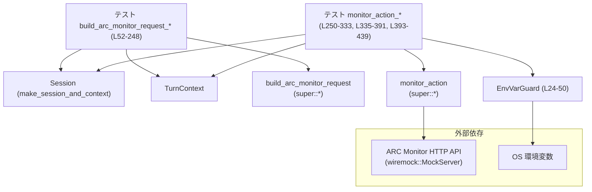
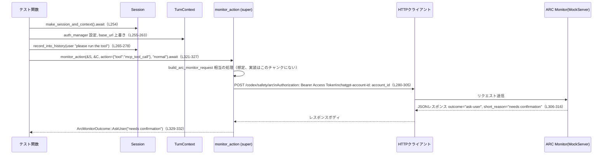

# core/src/arc_monitor_tests.rs コード解説

## 0. ざっくり一言

- ARC Monitor に送るリクエスト生成・送信ロジック（`build_arc_monitor_request`, `monitor_action`）の振る舞いを検証する非同期テスト群と、テスト中に環境変数を一時的に上書きするための RAII ガード `EnvVarGuard` を定義するファイルです（core/src/arc_monitor_tests.rs:L24-50, L52-440）。

---

## 1. このモジュールの役割

### 1.1 概要

- このモジュールは、上位モジュール（`super::*`）で定義されている ARC Monitor 関連 API の **対外的な契約（Contract）** をテストを通じて明示します。
- 特に以下を検証します（すべてこのファイル内のテストから読み取れる事実です）:
  - 会話履歴から ARC Monitor 用リクエスト (`ArcMonitorRequest`) をどのように構築するか（core/src/arc_monitor_tests.rs:L52-248）。
  - `monitor_action` がどの URL に、どのヘッダと JSON ボディで POST するか（L250-333, L335-391, L393-439）。
  - 環境変数によるエンドポイント・トークンの上書きの挙動（L337-344, L361-377）。
  - レガシーなレスポンス形式をどう扱うか（L393-405, L431-439）。
- 併せて、グローバルな環境変数操作を安全に巻き戻すための `EnvVarGuard` を提供します（L24-50）。

### 1.2 アーキテクチャ内での位置づけ

このファイルは「テストモジュール」であり、本番ロジックそのものではありませんが、上位モジュールの API と外部サービス（ARC Monitor HTTP API）の間のデータフローを検証する役割を持ちます。



- `make_session_and_context` で会話セッションとターンコンテキストを作り（L54, L254, L345, L408）、それを `build_arc_monitor_request` / `monitor_action` に渡す構造になっています（L176-183, L321-327, L379-385, L431-437）。
- HTTP 通信は `wiremock::MockServer` でモックされ、送信される JSON とヘッダを厳密に検証します（L253, L280-319, L361-377, L396-406）。
- 環境変数の上書きは `EnvVarGuard` を通して行われます（L339-343）。

### 1.3 設計上のポイント

- **RAII による環境変数管理**  
  - `EnvVarGuard` が環境変数の元の値を保持し、`Drop` 実装で元に戻します（L24-27, L39-49）。  
  - `EnvVarGuard::set` は元の値を `Option<OsString>` として保存し、存在しなかった場合は `Drop` 時に `remove_var` します（L31, L41-47）。

- **非同期・並行性への配慮**
  - 全テストは `#[tokio::test]` の非同期テストです（L52, L250, L335, L393）。
  - グローバル状態（環境変数や ARC モニターのエンドポイント）を扱うテストは `#[serial(arc_monitor_env)]` で同じキーのテストを直列実行にしています（L251, L336, L394）。  
    これにより並行実行中の環境変数競合リスクが軽減されます。

- **HTTP インタラクションの明示的な検証**
  - `wiremock::Mock` に対し、HTTP メソッド、パス、ヘッダ、JSON ボディをすべて条件として指定し（L280-305, L361-374, L397-403）、`expect(1)` で「必ず 1 回だけ呼ばれる」ことを契約にしています（L317, L375, L404）。

- **ARC Monitor API の契約をテストから明示**
  - `ArcMonitorRequest`, `ArcMonitorOutcome` などの型は `super::*` からインポートされ定義はこのチャンクにはありませんが（L15）、テストの `assert_eq!` から期待されるフィールドや JSON 表現が読み取れます（L185-247, L280-305, L364-374, L399-403, L329-332, L387-390, L439）。

---

## 2. 主要な機能一覧（コンポーネントインベントリー）

### 2.1 機能一覧（概要）

- `EnvVarGuard`: 環境変数の値を一時的に変更し、スコープ終了時に元に戻す RAII ガード。
- `build_arc_monitor_request_includes_relevant_history_and_null_policies`: 会話履歴から ARC Monitor 用リクエストがどのように構築されるかを検証するテスト。
- `monitor_action_posts_expected_arc_request`: `monitor_action` が正しい HTTP リクエストを送り、レスポンスから `AskUser` を返すことを検証するテスト。
- `monitor_action_uses_env_url_and_token_overrides`: 環境変数でエンドポイント URL とトークンが上書きされることを検証するテスト。
- `monitor_action_rejects_legacy_response_fields`: レガシーなレスポンスフィールドのみを含む応答を `Ok` として扱うことを検証するテスト。

### 2.2 コンポーネントインベントリー（定義位置付き）

| 名前 | 種別 | 役割 / 用途 | 定義位置（行範囲） |
|------|------|------------|---------------------|
| `EnvVarGuard` | 構造体 | 環境変数の元の値を保持し、Drop 時に復元するためのガード | core/src/arc_monitor_tests.rs:L24-27 |
| `EnvVarGuard::set` | 関数（関連関数） | 環境変数を新しい値に設定し、元の値を記録した `EnvVarGuard` を返す | core/src/arc_monitor_tests.rs:L29-37 |
| `EnvVarGuard` の `Drop::drop` | メソッド | `EnvVarGuard` 破棄時に環境変数を元の値に戻す（または削除） | core/src/arc_monitor_tests.rs:L39-49 |
| `build_arc_monitor_request_includes_relevant_history_and_null_policies` | 非同期テスト関数 | 会話履歴フィルタリングとポリシーフィールドの扱いを検証 | core/src/arc_monitor_tests.rs:L52-248 |
| `monitor_action_posts_expected_arc_request` | 非同期テスト関数 | 通常パスでの `monitor_action` の HTTP リクエスト・レスポンス処理を検証 | core/src/arc_monitor_tests.rs:L250-333 |
| `monitor_action_uses_env_url_and_token_overrides` | 非同期テスト関数 | 環境変数経由のエンドポイント/トークン上書きを検証 | core/src/arc_monitor_tests.rs:L335-391 |
| `monitor_action_rejects_legacy_response_fields` | 非同期テスト関数 | レガシーフィールドのみの応答を `Ok` とみなす挙動を検証 | core/src/arc_monitor_tests.rs:L393-439 |

※ 上記行番号は、この回答中で再カウントしたものであり、ローカルのエディタ等とは多少のずれがある可能性があります。

---

## 3. 公開 API と詳細解説

このファイル自身が公開 API を定義しているわけではありませんが、テストを通じて **上位モジュールの公開 API の契約** を明らかにしています。  
まず、このファイル内で定義される型を整理し、その後、主要なテスト関数ごとに「何を検証しているか」を詳細化します。

### 3.1 型一覧（構造体など）

| 名前 | 種別 | 役割 / 用途 | 定義位置 |
|------|------|-------------|----------|
| `EnvVarGuard` | 構造体 | 環境変数 `key` の元の値 (`original`) を保持し、`Drop` 時に元に戻す RAII ガードです。`original` が `None` の場合は変数自体を削除します。 | core/src/arc_monitor_tests.rs:L24-27 |

### 3.2 関数詳細

#### `EnvVarGuard::set(key: &'static str, value: &OsStr) -> EnvVarGuard`

**概要**

- 指定した環境変数 `key` の現在値を保存した上で、新しい値 `value` をセットし、その復元責任を持つ `EnvVarGuard` を返します（L29-36）。

**引数**

| 引数名 | 型 | 説明 |
|--------|----|------|
| `key` | `&'static str` | 対象環境変数名。`'static` なのでリテラルや定数向けです（L30）。 |
| `value` | `&OsStr` | 新しく設定する値。OS 依存の文字列型 `OsStr` を使用します（L30）。 |

**戻り値**

- `EnvVarGuard`  
  - `key`: 対象環境変数名（L35）。  
  - `original`: 呼び出し前の値（`env::var_os(key)` の結果）（L31, L35）。

**内部処理の流れ**

1. `env::var_os(key)` で現在の値を `Option<OsString>` として取得し、`original` に保存します（L31）。
2. `unsafe` ブロック内で `env::set_var(key, value)` を呼び、新しい値をセットします（L32-34）。
3. `EnvVarGuard { key, original }` を返します（L35）。

> 備考: `std::env::set_var` 自体は safe 関数ですが、このコードでは `unsafe { ... }` ブロックでラップされています（L32-34）。この理由はこのチャンクからは分かりません。

**Examples（使用例）**

このファイルでは、ARC Monitor の URL/TOKEN 上書きテストで使用されています。

```rust
// エンドポイントとトークンを一時的に上書きする（core/src/arc_monitor_tests.rs:L337-344）
let server = MockServer::start().await;
let _url_guard = EnvVarGuard::set(
    CODEX_ARC_MONITOR_ENDPOINT_OVERRIDE,
    OsStr::new(&format!("{}/override/arc", server.uri())),
);
let _token_guard = EnvVarGuard::set(
    CODEX_ARC_MONITOR_TOKEN,
    OsStr::new("override-token"),
);
// _url_guard, _token_guard がスコープを抜けると元の環境変数値に戻る
```

**Errors / Panics**

- 環境変数アクセス (`env::var_os`, `env::set_var`) はパニックしない設計ですが、OS の制限等でエラーになる可能性が完全には排除できません。Rust 標準ライブラリの仕様上、これらはパニックではなく OS への委譲が基本であり、このチャンクからは追加のエラーハンドリングは確認できません。
- `unsafe` ブロックを使用していますが、この中で呼ばれているのは safe 関数のみであり、直接的な未定義動作を引き起こすコードは含まれていません（L32-34）。

**Edge cases（エッジケース）**

- 環境変数がもともと存在しない場合  
  - `env::var_os` は `None` を返し、`original` は `None` になります（L31, L35）。
  - `Drop::drop` 時に `env::remove_var(self.key)` が呼ばれ、環境変数は「存在しない」状態に保たれます（L41, L45-47）。
- 値を空文字列に設定する場合  
  - このチャンク内にそのような使用例はなく、OS ごとの扱い（「空文字」と「未設定」の違いなど）はここからは分かりません。

**使用上の注意点**

- **並行性**: 環境変数はプロセス全体で共有されるため、他スレッドからも参照・変更される可能性があります。  
  - このファイルでは、環境変数を変更するテストはすべて `#[serial(arc_monitor_env)]` でシリアル化されています（L336, L394）。ただし、同じキーを使わない他モジュールのテストとの相互作用については、このチャンクからは分かりません。
- **スコープ管理**: `EnvVarGuard` はスコープを抜けたときに `Drop` されます。環境変数の変更を有効にしたい範囲でガード変数を保持する必要があります。

---

#### `impl Drop for EnvVarGuard { fn drop(&mut self) }`

**概要**

- `EnvVarGuard` がスコープから外れたとき、記録しておいた `original` の値に基づき環境変数を復元または削除します（L39-49）。

**引数**

- `&mut self`（暗黙的）: 自身の `key` と `original` にアクセスします（L40）。

**戻り値**

- なし（`()`）。`Drop` トレイトの実装です。

**内部処理の流れ**

1. `self.original.take()` で `Option<OsString>` から値を取り出しつつ `None` にします（L41）。
2. `Some(value)` の場合:
   - `unsafe { env::set_var(self.key, value) }` で元の値を再設定します（L42-44）。
3. `None` の場合:
   - `unsafe { env::remove_var(self.key) }` で環境変数を削除します（L45-47）。

**Examples（使用例）**

- 明示的に呼び出すことはなく、`EnvVarGuard` がスコープを抜けたときに自動的に実行されます（上記 `EnvVarGuard::set` の例と同じスコープ）。

**Errors / Panics**

- `env::set_var`, `env::remove_var` は OS に依存した挙動をとりますが、このテストコードではエラーを捕捉していません（L42-47）。  
- `take()` は常に成功し、パニックしません（L41）。

**Edge cases**

- `Drop` が複数回呼ばれることは Rust の所有権ルール上ありません。`take()` を使っているため、仮に二重 `drop` が起きても二回目は `None` 分岐に入るだけですが、そのような状況自体は発生しません（L41）。

**使用上の注意点**

- `EnvVarGuard` を `mem::forget` した場合は `Drop` が呼ばれず、環境変数が元に戻らなくなります。このような使い方は意図されていないと考えられますが、このチャンクにはそのような使用例はありません。

---

#### `build_arc_monitor_request_includes_relevant_history_and_null_policies()`

（`#[tokio::test] async fn`、戻り値は `()`）

**概要**

- 会話履歴に多様な種類の `ResponseItem` を記録した上で `build_arc_monitor_request` を呼び、  
  「どの履歴が `ArcMonitorRequest.messages` に含まれるか」「`policies` がどのように設定されるか」を検証するテストです（L52-248）。

**引数**

- なし（テスト関数）。

**内部処理の流れ（テストとしてのアルゴリズム）**

1. セッションとターンコンテキストを生成（`make_session_and_context().await`）（L54）。
2. `developer_instructions`, `user_instructions` に値をセット（L55-56）。
3. 以下の順に会話履歴を `session.record_into_history` で追加（L58-174）:
   - ユーザー `first request`（L60-68）。
   - 環境コンテキスト・フラグメント（`ENVIRONMENT_CONTEXT_FRAGMENT`）（L73-80）。
   - アシスタント `commentary`（`MessagePhase::Commentary`）（L83-92）。
   - アシスタント `final response`（`MessagePhase::FinalAnswer`）（L97-106）。
   - ユーザー `latest request`（L111-120）。
   - FunctionCall `old_tool`（L125-132）。
   - Reasoning `reasoning_old`（L137-143）。
   - LocalShellCall（`pwd` 実行） completed（L148-160）。
   - Reasoning `reasoning_latest`（L165-171）。
4. `build_arc_monitor_request(&session, &turn_context, action, "normal").await` を呼び出し（L176-183）、戻り値を `request` に格納。
5. `assert_eq!` で `request` が期待する `ArcMonitorRequest` と一致することを確認（L185-247）。

**このテストから分かる `build_arc_monitor_request` の契約**

テストの期待値部分（L185-247）から、次の仕様が読み取れます：

- **メタデータ (`ArcMonitorMetadata`)**
  - `codex_thread_id`: `session.conversation_id.to_string()`（L189）。
  - `codex_turn_id`: `turn_context.sub_id.clone()`（L190）。
  - `conversation_id`: `Some(session.conversation_id.to_string())`（つまり常に `Some` をセットしているケース）（L191）。
  - `protection_client_callsite`: `Some("normal".to_string())`（第 4 引数）をそのまま利用（L192）。

- **履歴からのメッセージ抽出 (`messages`)**
  - 含まれるのは次の 5 つ（順序はテストどおり）（L195-238）:
    1. 最初のユーザー `first request` → `role: "user"`, `"type": "input_text"`（L195-201）。
    2. アシスタントの最終回答 `final response` (`MessagePhase::FinalAnswer`) → `"type": "output_text"`（L202-208）。
    3. 最新のユーザー `latest request` → `"type": "input_text"`（L209-215）。
    4. LocalShellCall → `"type": "tool_call"`, `"tool_name": "shell"`, `"action": { "type": "exec", ... }`（L216-230）。
    5. 最新の Reasoning (`reasoning_latest`) → `"type": "encrypted_reasoning", "encrypted_content": "encrypted-latest"`（L231-237）。
  - 次のものは **含まれない**（テスト名の "relevant" からも示唆される）:
    - `ENVIRONMENT_CONTEXT_FRAGMENT`（L73-80）。
    - `MessagePhase::Commentary` のアシスタント返信（L83-92）。
    - 古い Reasoning (`reasoning_old`) や FunctionCall (`old_tool`)（L125-132, L137-143）。

- **policies**
  - `policies: Some(ArcMonitorPolicies { user: None, developer: None })`（L239-243）。  
    つまり、このケースでは `turn_context.developer_instructions` / `user_instructions`（L55-56）を ARC Monitor の `policies` に送信していません。

- **action**
  - 入力として渡した `serde_json::Value` を `serde_json::from_value` したものがそのまま `action` にセットされます（L179-181, L244-245）。

**Errors / Panics**

- `serde_json::from_value(...).expect("action should deserialize")` が失敗した場合はパニックします（L179-181, L244-245）。  
  テストでは JSON が固定値のため、通常は失敗しません。
- `assert_eq!` が失敗するとテストは失敗として終了します（L185-247）。

**Edge cases**

- 空の履歴や Reasoning が存在しない場合の挙動は、このチャンクには現れていません。
- 複数の LocalShellCall や Reasoning がある場合、どのように選択されるか（すべて含めるのか、最新のみか）については、この単一ケースからは「少なくともこのテストでは最後の Reasoning が使われている」ことしか分かりません。

**使用上の注意点**

- `build_arc_monitor_request` は `async fn` であり、`await` が必須です（L176-183）。
- 戻り値は `ArcMonitorRequest` であり、`Result` ではないことがテストから読み取れます（エラー処理をしていないため）（L185-247）。

---

#### `monitor_action_posts_expected_arc_request()`

**概要**

- 認証情報と ARC Monitor 本番風エンドポイント（モック）を設定し、`monitor_action` が期待どおりの JSON とヘッダを持つ POST を 1 回だけ送信し、レスポンスに応じて `ArcMonitorOutcome::AskUser("needs confirmation")` を返すことを検証するテストです（L250-333）。

**内部処理の流れ**

1. `MockServer::start().await` でモックサーバを起動（L253）。
2. `make_session_and_context().await` で `session`, `turn_context` を取得（L254）。
3. `turn_context.auth_manager` にダミー ChatGPT 認証情報を設定（L255-257）。
4. `turn_context.developer_instructions` / `user_instructions` に値を設定（L258-259）。
5. `config.chatgpt_base_url` をモックサーバの URI に変更し、`turn_context.config` を差し替え（L261-263）。
6. 会話履歴にユーザーからのメッセージ `"please run the tool"` を 1 件記録（L265-278）。
7. `Mock::given(...)` で以下をすべて満たす POST リクエストを期待（L280-305）:
   - メソッド: `POST`（L280）。
   - パス: `/codex/safety/arc`（L281）。
   - ヘッダ:  
     - `authorization: "Bearer Access Token"`（L282）。  
     - `chatgpt-account-id: "account_id"`（L283）。
   - ボディ JSON（抜粋）（L284-305）:
     - `metadata.codex_thread_id` 等がセッション・ターン情報から構築される（L285-290）。
     - `messages` は直近のユーザーメッセージのみ（`"please run the tool"`）（L291-297）。
     - `policies.developer`, `policies.user` は `null`（L298-301）。
     - `action.tool` は `"mcp_tool_call"`（L302-304）。
8. 上記の条件を満たすリクエストに対するレスポンスとして、`outcome: "ask-user"` などを返す JSON を設定（L306-316）。
9. `monitor_action(&session, &turn_context, ..., "normal").await` を呼び出し（L321-327）。
10. 戻り値が `ArcMonitorOutcome::AskUser("needs confirmation".to_string())` と等しいことを確認（L329-332）。

**このテストから分かる `monitor_action` の契約**

- 認証ヘッダ:
  - `authorization` ヘッダには `Bearer Access Token` を設定している（L282）。  
    これは `auth_manager_from_auth` と `CodexAuth::create_dummy_chatgpt_auth_for_testing()` の結果から取得されていると推測されますが、具体的な実装はこのチャンクにはありません。
  - `chatgpt-account-id` ヘッダには `"account_id"` を設定（L283）。

- エンドポイント URL:
  - `config.chatgpt_base_url` がモックサーバの URI に設定されているため（L261-263）、`monitor_action` はこのベース URL に対して `/codex/safety/arc` を結合して POST していることが分かります（L280-282）。

- ボディの構造:
  - `metadata` の各フィールドは `session` と `turn_context` から構築される（L285-290）。
  - `messages` には直近のユーザーメッセージのみが含まれ、`developer_instructions` / `user_instructions` は `policies` に反映されず、`null` のままです（L291-301, L258-259）。
  - `action` は渡した JSON に由来するシンプルなオブジェクト（L302-304, L324-325）。

- レスポンス処理:
  - `monitor_action` はレスポンスの `outcome: "ask-user"` と `short_reason: "needs confirmation"` を利用して `ArcMonitorOutcome::AskUser("needs confirmation")` を返していることが分かります（L306-309, L321-332）。

**Errors / Panics**

- モックに対して `.expect(1)` が設定されているため、1 回も呼ばれなかった場合や 2 回以上呼ばれた場合、テストは失敗します（L317）。
- HTTP クライアント内部のエラー処理はこのチャンクには見えません。`monitor_action` が `Result` ではなく直接 `ArcMonitorOutcome` を返している点（L321-332）から、内部でのエラーは何らかの形でマッピングされている可能性がありますが、詳細は不明です。

**Edge cases**

- 認証情報 (`auth_manager`) が設定されていない場合の挙動はこのテストからは分かりませんが、後述の環境変数 override のテストでは `auth_manager` を設定していないケースが存在します（L345 以降）。

**使用上の注意点**

- `monitor_action` は `async` 関数であり、Tokio ランタイムの中で `.await` する必要があります（L321-327）。
- `policies` に `developer_instructions` / `user_instructions` が送られない点は、プライバシーや機密情報の扱いに関する設計上の意図を示唆しますが、その理由はコード上には明示されていません。

---

#### `monitor_action_uses_env_url_and_token_overrides()`

**概要**

- 環境変数 `CODEX_ARC_MONITOR_ENDPOINT_OVERRIDE` と `CODEX_ARC_MONITOR_TOKEN` を設定すると、`monitor_action` が設定ファイルや ChatGPT 認証情報ではなく、これらの値を優先して ARC Monitor にアクセスすることを検証するテストです（L335-391）。

**内部処理の流れ**

1. モックサーバ起動（L338）。
2. `EnvVarGuard::set` で以下の環境変数を設定（L339-343）:
   - `CODEX_ARC_MONITOR_ENDPOINT_OVERRIDE` → `"{server.uri()}/override/arc"`（L339-342）。
   - `CODEX_ARC_MONITOR_TOKEN` → `"override-token"`（L343）。
3. `make_session_and_context().await` から取得した `session`, `turn_context` を使用（L345）。
   - このテストでは `auth_manager` や `chatgpt_base_url` の上書きは行っていません（L345-359）。
4. 会話履歴にユーザーメッセージ `"please run the tool"` を記録（L346-359）。
5. モックを以下条件で設定（L361-374）:
   - パス: `/override/arc`（L362）。
   - ヘッダ: `authorization: "Bearer override-token"`（L363）。
   - ボディは特に絞り込まず、レスポンスに `"steer-model"` などを返す（L364-374）。
6. `monitor_action(...).await` を呼び出し（L379-385）。
7. 戻り値が `ArcMonitorOutcome::SteerModel("high-risk action".to_string())` であることを確認（L387-390）。

**このテストから分かる `monitor_action` の契約**

- エンドポイント URL:
  - `chatgpt_base_url` を設定していなくても、`CODEX_ARC_MONITOR_ENDPOINT_OVERRIDE` を設定することで `/override/arc` に POST することが分かります（L339-342, L361-363）。

- 認証トークン:
  - `authorization` ヘッダには `"Bearer override-token"` が使用され、ChatGPT の Access Token ではないことが確認されます（L343, L363）。
  - このテストでは `auth_manager` を設定していないため、環境変数が唯一のトークンソースになっていると解釈できます（L345-359）。

- レスポンス処理:
  - `outcome: "steer-model"` と `short_reason: "needs approval"`, `rationale: "high-risk action"` を返すレスポンスに対して `ArcMonitorOutcome::SteerModel("high-risk action")` を返します（L364-369, L387-390）。  
    ここから「`SteerModel` のメッセージは `rationale` を使っている」ことが読み取れます。

**Errors / Panics**

- `EnvVarGuard` がスコープから抜けると環境変数は元に戻されます（L339-343）。  
  テストの途中でパニックが発生しても、`Drop` により cleanup は実行されます。

**Edge cases**

- 環境変数と `chatgpt_base_url` / `auth_manager` の両方が設定されている場合にどちらが優先されるかは、このチャンクには現れていません（ここでは前者のみ使用）。

**使用上の注意点**

- グローバルな環境変数 override を使うため、**並行テスト実行時の干渉**に注意が必要です。  
  実際には `#[serial(arc_monitor_env)]` により、このキーを持つテスト間では直列実行になっています（L336）。

---

#### `monitor_action_rejects_legacy_response_fields()`

**概要**

- ARC Monitor からのレスポンスがレガシー形式（`reason`, `monitorRequestId` のみ）であった場合、`monitor_action` がそれを「安全な OK」とみなし、`ArcMonitorOutcome::Ok` を返すことを検証するテストです（L393-439）。

**内部処理の流れ**

1. モックサーバ起動（L396）。
2. `Mock::given(method("POST")).and(path("/codex/safety/arc"))` のリクエストに対し、以下の JSON を返すように設定（L397-403）:
   - `"outcome": "steer-model"`
   - `"reason": "legacy high-risk action"`
   - `"monitorRequestId": "arc_456"`
   - ※ `short_reason` や `rationale`, `risk_score` などは含まない。
3. `make_session_and_context().await` でセッション・コンテキストを取得し（L408）、`auth_manager` と `chatgpt_base_url` を設定（L409-414）。
4. 履歴にユーザーメッセージ `"please run the tool"` を記録（L416-429）。
5. `monitor_action(...).await` を呼び出し（L431-437）。
6. 戻り値が `ArcMonitorOutcome::Ok` であることを `assert_eq!` で確認（L439）。

**このテストから分かる `monitor_action` の契約**

- レガシーレスポンスのみが返ってきた場合（`reason`, `monitorRequestId` など）、`outcome: "steer-model"` が指定されていても、それを「危険」とは解釈せず、`ArcMonitorOutcome::Ok` を返します（L399-403, L439）。  
- つまり、`monitor_action` は **新しい形式のフィールド（少なくとも `short_reason`, `rationale` 等）を含まないレスポンスを「無効」とみなし、ブロックやステアリングを行わない** 振る舞いをしていると読み取れます。

**使用上の注意点**

- 本番環境で ARC Monitor 側が古いスキーマを返した場合、`monitor_action` は保守的に「OK」と判断する設計であることを示しています。  
  これは「レガシーデータに基づいてユーザ操作をブロックしない」という安全側のポリシーと解釈できます。

---

### 3.3 その他の関数

上記以外に、このファイル内で定義される関数はありません。  
`build_arc_monitor_request` や `monitor_action` 自体は `super::*` からインポートされたものであり、その実装はこのチャンクには含まれていません（L15, L176-183, L321-327, L379-385, L431-437）。

---

## 4. データフロー

ここでは、`monitor_action_posts_expected_arc_request` テストにおける代表的なデータフローを示します。

### 4.1 monitor_action を通じた ARC Monitor 呼び出し

このフローでは、ユーザーメッセージがどのように HTTP POST リクエストに変換され、レスポンスがどのように `ArcMonitorOutcome` にマッピングされるかを表します（L250-333）。



- `monitor_action` の内部で `build_arc_monitor_request` を呼んでいるかどうかはこのチャンクでは分かりませんが、「metadata/messages/policies/action を持つ JSON を POST している」という点はテストの `body_json` から確実に分かります（L284-305）。
- 認証情報とセッションの情報が組み合わさって ARC Monitor リクエストが構築される構造です。

---

## 5. 使い方（How to Use）

このファイルはテスト専用ですが、「ARC Monitor をどのように呼び出し・検証するか」の実例として、そのまま他のテスト作成時のテンプレートになります。

### 5.1 基本的な使用方法（新しいテストを追加する場合）

`monitor_action` の新しい挙動をテストしたい場合の基本パターンは以下のとおりです（本ファイルのパターンを簡略化）。

```rust
#[tokio::test]                                  // 非同期テストとして定義する（L250 等）
#[serial(arc_monitor_env)]                      // 環境を共有するテストはシリアル実行にする（L251 等）
async fn new_monitor_action_scenario() {
    let server = MockServer::start().await;     // wiremock サーバ起動（L253）

    let (session, mut turn_context) =          // セッション・コンテキスト生成（L254, L408）
        make_session_and_context().await;

    // 必要なら認証情報・設定を上書き
    turn_context.auth_manager = Some(
        crate::test_support::auth_manager_from_auth(
            codex_login::CodexAuth::create_dummy_chatgpt_auth_for_testing(),
        ),
    );
    let mut config = (*turn_context.config).clone();
    config.chatgpt_base_url = server.uri();     // モックサーバをベース URL に（L261-263）
    turn_context.config = Arc::new(config);

    // 履歴の準備
    session
        .record_into_history(
            &[ResponseItem::Message {
                id: None,
                role: "user".to_string(),
                content: vec![ContentItem::InputText {
                    text: "some request".to_string(),
                }],
                end_turn: None,
                phase: None,
            }],
            &turn_context,
        )
        .await;

    // モックの期待リクエストとレスポンスを設定
    Mock::given(method("POST"))
        .and(path("/codex/safety/arc"))
        // 必要に応じてヘッダや body_json を追加
        .respond_with(ResponseTemplate::new(200).set_body_json(
            serde_json::json!({
                "outcome": "ok",
                "short_reason": "all good",
            }),
        ))
        .expect(1)
        .mount(&server)
        .await;

    // monitor_action を呼び出して検証
    let outcome = monitor_action(
        &session,
        &turn_context,
        serde_json::json!({ "tool": "mcp_tool_call" }),
        "normal",
    )
    .await;

    assert_eq!(outcome, ArcMonitorOutcome::Ok); // 振る舞いの検証
}
```

### 5.2 よくある使用パターン

- **通常の ARC Monitor 呼び出し**
  - `auth_manager` と `chatgpt_base_url` を設定し、`/codex/safety/arc` に POST させる（L255-263, L280-305）。
- **環境変数による override**
  - `EnvVarGuard` を使って `CODEX_ARC_MONITOR_ENDPOINT_OVERRIDE` と `CODEX_ARC_MONITOR_TOKEN` を一時的に変更し、`/override/arc` に POST させる（L337-343, L361-363）。
- **履歴に依存するリクエスト組み立ての検証**
  - `record_into_history` で様々な種類の `ResponseItem` を追加し、`build_arc_monitor_request` の出力を直接検証する（L58-174, L185-247）。

### 5.3 よくある間違い（推測ではなく、このファイルから注意点として導けるもの）

- **環境変数の後片付けをしない**
  - このファイルでは必ず `EnvVarGuard` を使い、`Drop` による復元を行っています（L339-343）。  
    手動で `set_var` だけを呼ぶと、他のテストやプロセスに影響が残る可能性があります。
- **モックの `expect(1)` を設定し忘れる**
  - ここではすべての HTTP モックに `expect(1)` を設定し、「必ず 1 回呼ばれる」ことを契約にしています（L317, L375, L404）。  
    これがないと、「呼ばれなかった」ことを検知しづらくなります。

### 5.4 使用上の注意点（まとめ）

- 環境変数の操作はプロセス全体に影響するため、`EnvVarGuard` と `serial_test::serial` を併用し、**スコープと実行順序を明確に管理**している点が重要です（L24-50, L336, L394）。
- `monitor_action` や `build_arc_monitor_request` はこのチャンクでは定義されていませんが、テストから:
  - `async fn` であること（L176-183, L321-327, L379-385, L431-437）。
  - 戻り値として `ArcMonitorRequest` / `ArcMonitorOutcome` を直接返すこと（L185-247, L329-332, L387-390, L439）。
  が分かります。エラー処理を呼び出し側で行っていない点に注意が必要です。

---

## 6. 変更の仕方（How to Modify）

### 6.1 新しいテストシナリオを追加する場合

1. **テスト関数を追加**  
   - 本ファイルと同様に `#[tokio::test]` を付け、非同期テストとして定義します。
   - 環境変数や共有リソースを扱う場合は、既存テストと同じ `#[serial(arc_monitor_env)]` を付与するのが自然です（L251, L336, L394）。

2. **セッションと履歴の準備**
   - `make_session_and_context().await` で `session` と `turn_context` を取得し（L54, L254, L345, L408）、必要な履歴を `record_into_history` で追加します（L58-174, L265-278, L346-359, L416-429）。

3. **モックサーバの設定**
   - `MockServer::start().await` でサーバを起動し（L253, L338, L396）、`Mock::given(...)` で期待リクエストとレスポンスを設定します（L280-305, L361-374, L397-403）。

4. **`monitor_action` / `build_arc_monitor_request` の呼び出しと検証**
   - 適切な引数で呼び出し、戻り値が期待どおりであることを `assert_eq!` などで検証します（L176-183, L185-247, L321-332, L379-390, L431-439）。

### 6.2 既存のテストを変更する場合

- **ARC Monitor API スキーマが変わった場合**
  - `body_json(serde_json::json!(...))` の期待 JSON を新しいスキーマに合わせて更新する必要があります（L284-305, L364-374, L399-403）。
  - 同時に、`ArcMonitorRequest` / `ArcMonitorOutcome` の比較部分（`assert_eq!`）も整合するように更新します（L185-247, L329-332, L387-390, L439）。

- **環境変数のキー名が変わる場合**
  - `CODEX_ARC_MONITOR_ENDPOINT_OVERRIDE`, `CODEX_ARC_MONITOR_TOKEN` の使用箇所（L339-343）を一括で更新します。
  - これらは `&'static str` である必要があるため、`EnvVarGuard::set` のインターフェースとも整合させます（L30）。

- **認証方式が変わる場合**
  - ヘッダ `authorization`, `chatgpt-account-id` の期待値（L282-283）を新しい仕様に合わせて修正します。
  - 同時に `auth_manager_from_auth` 等のテスト用ユーティリティも別ファイルで調整する必要があります（ただしその実装はこのチャンクにはありません）。

---

## 7. 関連ファイル

このモジュールと密接に関係するコンポーネント（このチャンクから読み取れる範囲）は次のとおりです。

| パス / モジュール | 役割 / 関係 |
|------------------|------------|
| `super` モジュール（ファイルパスはこのチャンクからは不明） | `build_arc_monitor_request`, `monitor_action`, `ArcMonitorRequest`, `ArcMonitorMetadata`, `ArcMonitorChatMessage`, `ArcMonitorPolicies`, `ArcMonitorOutcome`, `CODEX_ARC_MONITOR_ENDPOINT_OVERRIDE`, `CODEX_ARC_MONITOR_TOKEN` など ARC Monitor 本体ロジックと型を提供します（L15, L176-183, L185-247, L321-327, L379-385, L431-437, L339-343）。 |
| `crate::codex::make_session_and_context` | テストで使用する `session` と `turn_context` を生成するヘルパーです（L16, L54, L254, L345, L408）。 |
| `codex_protocol::models::*` | 会話履歴を表す `ResponseItem`, `ContentItem`, `LocalShellAction`, `LocalShellExecAction`, `LocalShellStatus`, `MessagePhase` などのドメインモデルを定義します（L17-22）。 |
| `crate::test_support::auth_manager_from_auth` | テスト用 `AuthManager` を生成するユーティリティ。`monitor_action` の認証ヘッダの検証に利用されています（L255-257, L409-411）。 |
| `codex_login::CodexAuth` | ダミー ChatGPT 認証情報を生成するために使用されています（L255-257, L409-411）。 |
| `wiremock` クレート | ARC Monitor HTTP API をモックするために使用。`MockServer`, `Mock`, `ResponseTemplate`, `matchers` などを提供します（L7-13, L253, L280-319, L361-377, L396-406）。 |
| `serial_test` クレート | `#[serial(arc_monitor_env)]` 属性を提供し、環境変数を共有するテストの直列実行を保証します（L251, L336, L394）。 |

---

### バグ / セキュリティ上の観点（このチャンクから読み取れる範囲）

- 環境変数の操作が RAII で確実に復元されるため、テストによる永続的な環境汚染は防がれています（L24-50, L339-343）。
- ARC Monitor に送るリクエストから `developer_instructions` / `user_instructions` が除外されていることにより、ポリシーテキストが外部サービスに送信されない設計になっていることが、少なくともテストケースから確認できます（L55-56, L258-259, L239-243, L298-301）。  
  これは情報漏えいリスクを下げる方向の設計と解釈できます。
- レガシースキーマのみを返す ARC Monitor レスポンスは安全側 (`ArcMonitorOutcome::Ok`) に倒すため、古いサーバと新しいクライアントの非互換がユーザ操作の不必要なブロックにつながらないようにしています（L399-403, L439）。
