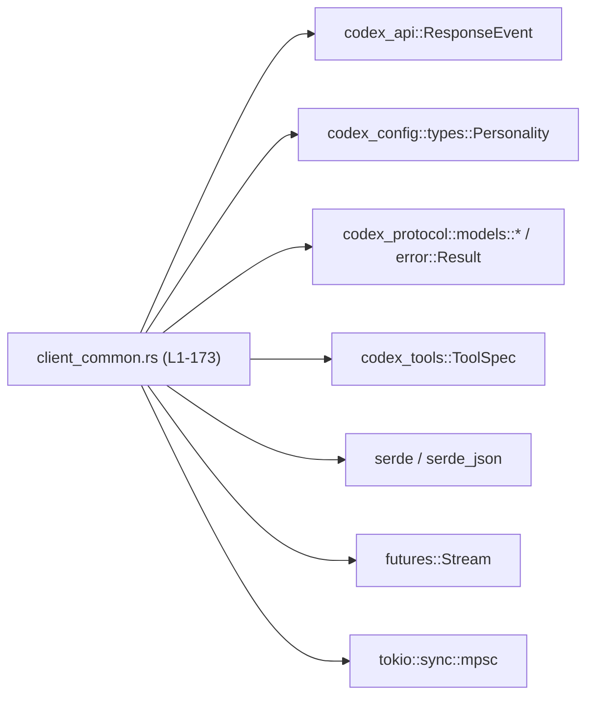
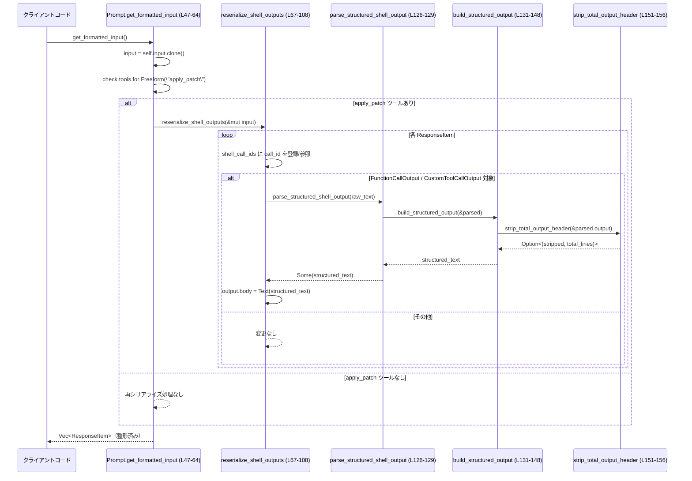
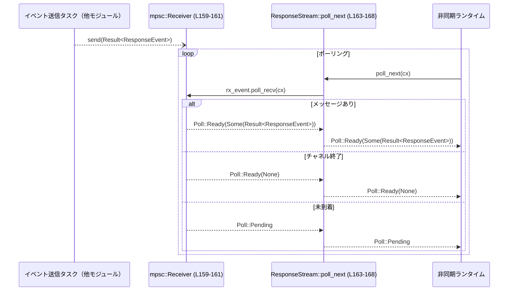

# core/src/client_common.rs コード解説

## 0. ざっくり一言

このモジュールは、クライアント側で共通的に使われる **プロンプト構築ロジック** と **ストリーミングレスポンスのラッパー** を提供し、特にレビュー用スレッドでのプロンプト／ツール出力の整形と、非同期レスポンスの受信を担っています（`client_common.rs:L17-23,L25-65,L159-168`）。

---

## 1. このモジュールの役割

### 1.1 概要

- このモジュールは、LLM クライアントにおける 1 ターン分の API リクエストペイロード（`Prompt`）と、レスポンスストリーム（`ResponseStream`）をまとめて扱うために存在します（`client_common.rs:L25-45,L159-168`）。
- 併せて、レビュー機能向けのシステムプロンプトとテンプレートを定数として公開します（`client_common.rs:L17-23`）。
- 特に、シェル実行結果を JSON から人間向けの構造化テキストに変換するロジックを集中管理し、特定ツール（`apply_patch`）利用時にのみ適用する仕組みを持ちます（`client_common.rs:L47-64,L67-108,L126-148`）。

### 1.2 アーキテクチャ内での位置づけ

このモジュールが依存している主な外部コンポーネントは `use` 句から読み取れます（`client_common.rs:L1-15`）。  
下図は、このファイルを中心とした依存関係の概略です。



- 上位の「クライアントコード」など、このモジュールを呼び出す側はこのチャンクには現れません。
- `ResponseEvent` は `pub use` によって再エクスポートされており、このモジュール経由で他のコードから利用できるようになっています（`client_common.rs:L1`）。

### 1.3 設計上のポイント

- **責務の分割**
  - プロンプト構築（`Prompt` とそのメソッド）と、シェル出力の再シリアライズ（`reserialize_shell_outputs` 周辺）、レスポンスストリーム（`ResponseStream`）が明確に分かれています（`client_common.rs:L25-65,L67-157,L159-168`）。
- **状態管理**
  - `Prompt` は 1 回のモデル呼び出しに必要な状態（入力、ツール、指示、パーソナリティなど）を保持する単純なデータ構造です（`client_common.rs:L25-45`）。
  - `ResponseStream` は非同期チャネル `mpsc::Receiver` だけを内部状態として持つ軽量なラッパーです（`client_common.rs:L159-161`）。
- **エラーハンドリング**
  - シェル出力パースは `Option` を使って安全に失敗を表現し、JSON 形式でない場合や形式が合わない場合でもパニックせずに単に変換を行わない設計です（`client_common.rs:L126-129,L151-156`）。
  - ストリーム要素は外部定義の `Result<ResponseEvent>` 型で表され、エラーをストリーム上で伝播できるようになっています（`client_common.rs:L3,L159-168`）。
- **並行性**
  - レスポンスストリームは `tokio::sync::mpsc::Receiver` を使って非同期にイベントを受け取り、`futures::Stream` トレイトを実装することで、通常の `Stream` として扱えるようになっています（`client_common.rs:L8,L15,L159-168`）。
  - 明示的なスレッド操作や `unsafe` は存在せず、Tokio のチャネルに処理を委ねています。

---

## 2. 主要な機能一覧

（根拠位置は各行末に記載します）

- `ResponseEvent` の再エクスポート: API レスポンスイベント型をこのモジュール経由で公開します（`client_common.rs:L1`）。
- レビュー用システムプロンプトとテンプレート定数の提供: `REVIEW_PROMPT`, `REVIEW_EXIT_SUCCESS_TMPL`, `REVIEW_EXIT_INTERRUPTED_TMPL`（`client_common.rs:L17-23`）。
- `Prompt` 構造体: 1 ターン分の AI 呼び出しに必要な入力・ツール・指示などを保持します（`client_common.rs:L25-45`）。
- `Prompt::get_formatted_input`: 特定ツールが含まれている場合、シェル実行結果を再フォーマットした入力リストを返します（`client_common.rs:L47-64`）。
- シェル出力再シリアライズ処理: `reserialize_shell_outputs` とその補助関数群（`is_shell_tool_name`, `parse_structured_shell_output`, `build_structured_output`, `strip_total_output_header`）で、JSON 形式の出力を人間向けテキストに変換します（`client_common.rs:L67-108,L110-112,L114-124,L126-157`）。
- `ResponseStream`: `mpsc::Receiver<Result<ResponseEvent>>` を `Stream` として扱うためのラッパーです（`client_common.rs:L159-168`）。
- テストモジュールの参照: `client_common_tests.rs` へのパスが定義されており、このモジュール専用のテストが存在することが分かります（`client_common.rs:L171-173`）。

---

## 3. 公開 API と詳細解説

### 3.1 型一覧（構造体・列挙体など）

#### 構造体・公開型

| 名前 | 種別 | 公開範囲 | 役割 / 用途 | 定義位置 |
|------|------|----------|-------------|----------|
| `Prompt` | 構造体 | `pub` | 1 モデルターン分の API リクエストペイロード。入力メッセージ、利用可能ツール、ベース指示、パーソナリティ、出力スキーマなどを保持します。 | `client_common.rs:L25-45` |
| `ExecOutputJson` | 構造体 | モジュール内専用 (`pub` なし) | シェル実行結果 JSON の内部表現。`output` 本文と `metadata` を持ちます。`serde_json` からのデシリアライズ用です。 | `client_common.rs:L114-118` |
| `ExecOutputMetadataJson` | 構造体 | モジュール内専用 | シェル実行メタデータ（終了コードと経過秒数）を保持します。`ExecOutputJson.metadata` の型です。 | `client_common.rs:L120-124` |
| `ResponseStream` | 構造体 | `pub` | `tokio::mpsc::Receiver<Result<ResponseEvent>>` を内包し、`futures::Stream` としてポーリング可能にするためのラッパーです。 | `client_common.rs:L159-161` |

#### 定数・再エクスポート

| 名前 | 種別 | 公開範囲 | 役割 / 用途 | 定義位置 |
|------|------|----------|-------------|----------|
| `ResponseEvent` | 型再エクスポート | `pub` | `codex_api::ResponseEvent` をこのモジュール経由で公開します。 | `client_common.rs:L1` |
| `REVIEW_PROMPT` | `&'static str` 定数 | `pub` | レビュー用スレッドのシステムプロンプト。`../review_prompt.md` の内容が埋め込まれます。 | `client_common.rs:L17-18` |
| `REVIEW_EXIT_SUCCESS_TMPL` | `&'static str` 定数 | `pub` | レビュー完了時のユーザーメッセージテンプレート XML。 | `client_common.rs:L20-21` |
| `REVIEW_EXIT_INTERRUPTED_TMPL` | `&'static str` 定数 | `pub` | レビュー途中終了時のユーザーメッセージテンプレート XML。 | `client_common.rs:L20-23` |

### 3.2 関数詳細（主要 5 件）

#### `Prompt::get_formatted_input(&self) -> Vec<ResponseItem>`  

**概要**

- `Prompt` に保存されている入力メッセージ列を基に、必要に応じてシェル実行結果を再シリアライズした新しい `Vec<ResponseItem>` を生成して返します（`client_common.rs:L47-64`）。
- 特定のツール（`ToolSpec::Freeform` で名前が `"apply_patch"` のもの）が有効な場合のみ、シェル出力に対して整形処理を行います（`client_common.rs:L55-60`）。

**引数**

| 引数名 | 型 | 説明 |
|--------|----|------|
| `&self` | `&Prompt` | 元となるプロンプト。`self.input` と `self.tools` を参照します。 |

**戻り値**

- `Vec<ResponseItem>`: 入力を複製し、必要に応じてシェル出力を再フォーマットしたものです。元の `self.input` は変更されません（`client_common.rs:L49,L63-64`）。

**内部処理の流れ**

1. `self.input.clone()` により入力リスト全体をディープコピーします（`client_common.rs:L49`）。これにより元の `Prompt` の状態は不変のままです。
2. `self.tools.iter().any(...)` を用いて、ツール一覧に `ToolSpec::Freeform` 変種かつ `name == "apply_patch"` のツールが含まれているかを判定します（`client_common.rs:L55-58`）。
3. そのツールが存在する場合のみ、`reserialize_shell_outputs(&mut input)` を呼び出し、コピーした入力内のシェル出力を書き換えます（`client_common.rs:L59-60`）。
4. 最終的に、整形済みまたは元のままの `input` を返します（`client_common.rs:L63`）。

**Examples（使用例）**

> 注: 以下は同ファイル内からの概念的な例であり、`ResponseItem` / `ToolSpec` の詳細な定義はこのチャンクには現れません。

```rust
fn prepare_request(prompt: &Prompt) -> Vec<ResponseItem> {
    // Prompt 内に設定された input / tools に基づき、
    // 必要ならシェル出力を再整形した入力リストを取得する
    let formatted = prompt.get_formatted_input(); // client_common.rs:L47-64

    // formatted をそのまま下流の API 呼び出しに渡す想定
    formatted
}
```

**Errors / Panics**

- この関数自体は `Result` を返さず、パニックを発生させるコード（`unwrap` / `expect` など）も含んでいません（`client_common.rs:L47-64`）。
- 内部で呼び出す `reserialize_shell_outputs` や JSON パース処理も、エラーを `Option` 経由で吸収する設計になっているため、通常の入力ではパニックを起こさない構造です（`client_common.rs:L67-108,L126-129`）。

**Edge cases（エッジケース）**

- `self.tools` に `ToolSpec::Freeform` / `"apply_patch"` が含まれない場合:  
  `reserialize_shell_outputs` は呼ばれず、単に `self.input` のコピーが返されます（`client_common.rs:L55-60`）。
- `self.input` が空の場合:  
  空の `Vec` が返ります。ループは実行されません（`client_common.rs:L49,L63`）。
- `self.input` 内にシェル関連の `ResponseItem` が存在しない場合:  
  `reserialize_shell_outputs` 内で該当するアイテムが見つからず、結果的に何も変更されません（`client_common.rs:L67-108`）。

**使用上の注意点**

- シェル出力の再整形は **`ToolSpec::Freeform` かつ `name == "apply_patch"`** のツールが存在するときだけ行われるため、同じ `Prompt` を使い回すときは `tools` の内容に注意が必要です（`client_common.rs:L55-60`）。
- 元の `Prompt` は不変であり、戻り値の `Vec<ResponseItem>` のみが変化します。呼び出し側がこのベクタを保持しておく必要があります。

---

#### `reserialize_shell_outputs(items: &mut [ResponseItem])`  

**概要**

- 入力アイテム列からシェル呼び出しに対応する `call_id` を収集し、その出力に対応する `ResponseItem::FunctionCallOutput` / `CustomToolCallOutput` を、JSON 文字列から構造化テキストへ差し替えます（`client_common.rs:L67-108`）。
- `apply_patch` とシェルツール（`shell` / `container.exec`）に関わる出力のみが対象です（`client_common.rs:L70-91`）。

**引数**

| 引数名 | 型 | 説明 |
|--------|----|------|
| `items` | `&mut [ResponseItem]` | 変換対象のレスポンスアイテムスライス。シェル呼び出しとその出力の両方を含みます。 |

**戻り値**

- なし（`()`）。`items` をインプレースで書き換えます（`client_common.rs:L67,L70-107`）。

**内部処理の流れ**

1. 空の `HashSet<String>` を用意し、シェル呼び出しの `call_id` を保持します（`client_common.rs:L68`）。
2. `items.iter_mut().for_each(...)` による 1 パスのループで、`match` によって `ResponseItem` の各バリアントを処理します（`client_common.rs:L70-107`）。
3. 以下のバリアントで `call_id` を `shell_call_ids` に追加します:
   - `LocalShellCall { call_id, id, .. }`: `call_id` または `id` のどちらか存在する方（`client_common.rs:L71-75`）。
   - `CustomToolCall { call_id, name, .. }` で `name == "apply_patch"`（`client_common.rs:L76-86`）。
   - `FunctionCall { name, call_id, .. }` で `is_shell_tool_name(name)` または `name == "apply_patch"`（`client_common.rs:L87-91`）。
4. `FunctionCallOutput` / `CustomToolCallOutput` バリアントに対して:
   - `shell_call_ids.remove(call_id)` が真（= 対応する呼び出しが登録済み）で、
   - `output.text_content().and_then(parse_structured_shell_output)` が `Some(structured)` を返すときに、
   - `output.body = FunctionCallOutputBody::Text(structured)` に置き換えます（`client_common.rs:L92-105`）。
5. その他のバリアントは `_ => {}` で無視します（`client_common.rs:L106`）。

**Examples（使用例）**

概念的な例として、シェル呼び出しとその出力が含まれるケースです:

```rust
fn normalize_shell_outputs(items: &mut [ResponseItem]) {
    // items 内には LocalShellCall / FunctionCallOutput などが混在していると仮定
    reserialize_shell_outputs(items); // client_common.rs:L67-108

    // 対象となる出力の output.body が Text に変換されている
}
```

**Errors / Panics**

- `HashSet::insert` や `remove` は通常パニックしません。
- `output.text_content()` が `None` の場合や、`parse_structured_shell_output` が `None` を返した場合でも、そのアイテムは単に変換されず、エラーにはなりません（`client_common.rs:L98-104,L126-129`）。
- この関数自体は `Result` を返さず、エラーを明示的に表現しません。

**Edge cases（エッジケース）**

- 対応する呼び出しがない出力:  
  `call_id` が `shell_call_ids` に存在しない場合は変換されません（`client_common.rs:L98`）。
- 同じ `call_id` が複数の出力に現れる場合:  
  `HashSet::remove` により最初の 1 回だけ `true` を返し、その後は `false` となるため、最初の出力だけが変換対象になります（`client_common.rs:L98`）。
- JSON 形式でない出力 / 期待しない構造:  
  `parse_structured_shell_output` が `None` を返し、変換されません（`client_common.rs:L99-101,L126-129`）。

**使用上の注意点**

- `call_id` の紐付けはこの関数に依存するため、呼び出し側は `LocalShellCall` / `FunctionCall` などの `call_id` を適切に設定しておく必要があります（`client_common.rs:L71-75,L87-91`）。
- 出力テキストにはシェルの生出力がそのまま連結されるため、後続で HTML などに埋め込む場合は別途エスケープ処理が必要です（`build_structured_output` の出力構造参照, `client_common.rs:L131-148`）。

---

#### `parse_structured_shell_output(raw: &str) -> Option<String>`

**概要**

- シェル実行結果を表す JSON 文字列（`ExecOutputJson` 構造）を解析し、人間向けの構造化テキストに変換します（`client_common.rs:L126-129`）。
- 解析に失敗した場合や形式が合わない場合は `None` を返します。

**引数**

| 引数名 | 型 | 説明 |
|--------|----|------|
| `raw` | `&str` | シェル出力を JSON としてシリアライズした文字列。`ExecOutputJson` に対応する形式が期待されます。 |

**戻り値**

- `Option<String>`:  
  - `Some(s)`: 構造化テキストへの変換に成功した場合の文字列。  
  - `None`: JSON パースや構造確認に失敗した場合。

**内部処理の流れ**

1. `serde_json::from_str(raw).ok()?` で `ExecOutputJson` にデシリアライズを試みます（`client_common.rs:L127`）。
   - `Err` の場合は `.ok()?` により `None` が返されます。
2. パースに成功した場合、`build_structured_output(&parsed)` を呼び出し、その結果を `Some(...)` に包んで返します（`client_common.rs:L128`）。

**Examples（使用例）**

```rust
fn example_parse() {
    let raw = r#"{
        "output": "Total output lines: 2\nline1\nline2\n",
        "metadata": { "exit_code": 0, "duration_seconds": 0.12 }
    }"#;

    if let Some(text) = parse_structured_shell_output(raw) {
        println!("{text}");
        // 例:
        // Exit code: 0
        // Wall time: 0.12 seconds
        // Total output lines: 2
        // Output:
        // line1
        // line2
    }
}
```

**Errors / Panics**

- `serde_json::from_str` のエラーは `.ok()?` により `None` に変換されるため、例外的な状況を除きパニックは発生しません（`client_common.rs:L127`）。

**Edge cases（エッジケース）**

- `raw` が JSON でない / 不正な JSON: `None` を返します。
- `metadata` フィールドが欠けている / 型が違う: デシリアライズに失敗し、`None` を返します。
- `duration_seconds` が負値・異常値であっても、`f32` として読み込める限り、そのまま文字列に埋め込まれます（検証ロジックはこのチャンクにはありません）。

**使用上の注意点**

- 変換の成否は `Option` で表現されるため、呼び出し側は `None` の場合を考慮する必要があります。
- 失敗時に理由は得られない設計（`Err` を捨てている）なので、詳細なデバッグには別途ログなどが必要になる可能性があります（`client_common.rs:L127`）。

---

#### `build_structured_output(parsed: &ExecOutputJson) -> String`

**概要**

- `ExecOutputJson` 構造体から、人間が読みやすい形式のテキストを生成します（`client_common.rs:L131-148`）。
- 終了コード、実行時間、出力行数（ヘッダがある場合）、出力本文をセクションとして連結します。

**引数**

| 引数名 | 型 | 説明 |
|--------|----|------|
| `parsed` | `&ExecOutputJson` | すでに JSON からパース済みのシェル実行結果。 |

**戻り値**

- `String`: 複数行からなる構造化テキスト。  
  例:

  ```text
  Exit code: 0
  Wall time: 0.12 seconds
  Total output lines: 2
  Output:
  line1
  line2
  ```

**内部処理の流れ**

1. 空の `Vec<String>` を作成し、`Exit code: ...` と `Wall time: ... seconds` の 2 行を追加します（`client_common.rs:L132-137`）。
2. `parsed.output.clone()` を `output` 変数にコピーします（`client_common.rs:L139`）。
3. `strip_total_output_header(&parsed.output)` を呼び出し、先頭に `"Total output lines: "` 形式のヘッダが含まれていれば:
   - `Total output lines: {total_lines}` 行をセクションとして追加し（`client_common.rs:L141`）、
   - 出力本文からヘッダ部分を取り除いた文字列を `output` に再設定します（`client_common.rs:L140-142`）。
4. `"Output:"` 行と `output` 本文をセクションに追加します（`client_common.rs:L145-146`）。
5. `sections.join("\n")` で行を改行区切りで結合し、1 つの文字列として返します（`client_common.rs:L148`）。

**Examples（使用例）**

```rust
fn example_build() {
    let parsed = ExecOutputJson {
        output: "Total output lines: 1\nhello\n".to_string(),
        metadata: ExecOutputMetadataJson {
            exit_code: 0,
            duration_seconds: 0.01,
        },
    };

    let s = build_structured_output(&parsed);
    println!("{s}");
}
```

**Errors / Panics**

- この関数はパースや数値変換を行わず、全ての値をそのまま文字列化するだけなので、通常の入力ではパニックを起こしません（`client_common.rs:L131-148`）。

**Edge cases（エッジケース）**

- `parsed.output` に `"Total output lines: "` ヘッダがない場合:  
  ヘッダ行は追加されず、`Output:` と `output` の 2 セクションだけになります（`client_common.rs:L139-147`）。
- `strip_total_output_header` が `None` の場合（フォーマット不一致・パース失敗など）も同上です（`client_common.rs:L140-142,L151-156`）。

**使用上の注意点**

- 出力行数はヘッダに書かれている値をそのまま使用するため、ヘッダ側の値の整合性チェックは行われません。

---

#### `impl Stream for ResponseStream { fn poll_next(...) -> Poll<Option<Result<ResponseEvent>>> }`

**概要**

- `ResponseStream` に対して `futures::Stream` トレイトを実装し、内部の `mpsc::Receiver<Result<ResponseEvent>>` を通じてイベントをストリームとしてポーリング可能にします（`client_common.rs:L163-168`）。

**引数**

| 引数名 | 型 | 説明 |
|--------|----|------|
| `self` | `Pin<&mut Self>` | `ResponseStream` への可変参照。非 `Unpin` でも安全にポーリングできるようにピン留めされた参照です。 |
| `cx` | `&mut Context<'_>` | 非同期ランタイムから渡される実行コンテキスト。Waker などを含みます。 |

**戻り値**

- `Poll<Option<Result<ResponseEvent>>>`（実際には `Result` の型エイリアス）:  
  - `Poll::Pending`: まだイベントが到着していない。  
  - `Poll::Ready(Some(result))`: 新しいイベントを 1 件受信。  
  - `Poll::Ready(None)`: チャネルがクローズされ、これ以上イベントは来ない。

**内部処理の流れ**

1. `self.rx_event.poll_recv(cx)` をそのまま返します（`client_common.rs:L167`）。
   - `rx_event` は `mpsc::Receiver<Result<ResponseEvent>>` 型です（`client_common.rs:L159-161`）。
   - `tokio::sync::mpsc::Receiver::poll_recv` は `Poll<Option<T>>` を返すため、そのまま `Stream` の実装になります。

**Examples（使用例）**

> 実際のコードでは `futures::StreamExt` の `next().await` などを使うことが多い想定です。

```rust
use futures::StreamExt; // features に依存

async fn consume_stream(mut stream: ResponseStream) {
    while let Some(result) = stream.next().await {
        match result {
            Ok(event) => {
                // ResponseEvent を処理する
            }
            Err(e) => {
                // エラーを処理する
            }
        }
    }
}
```

**Errors / Panics**

- 低レベルの `poll_next` 自体はエラーやパニックを発生させません。  
  エラーは `Result<ResponseEvent>` としてストリームの要素に含まれます（`client_common.rs:L3,L163-168`）。

**Edge cases（エッジケース）**

- 送信側が先にドロップされた場合:  
  `rx_event` は `None` を返し、`Stream` としても `Poll::Ready(None)` となり、ストリームは終了します（`tokio::mpsc::Receiver` の仕様に依存。コード上ではこの挙動を変えていません）。
- 同一の `ResponseStream` に対して複数スレッドから同時に `poll_next` を呼び出すことは一般的に想定されていません。`Stream` の契約上、単一のタスクからポーリングする必要があります。

**使用上の注意点**

- `poll_next` は通常、直接呼び出すのではなく、非同期ランタイム上のタスクから `StreamExt::next().await` 等を通じて使用されます。
- `ResponseStream` は内部で `tokio::mpsc` を使っているため、Tokio ランタイム上での利用が前提となります（`client_common.rs:L15,L159-168`）。

---

### 3.3 その他の関数

| 関数名 | シグネチャ | 役割（1 行） | 定義位置 |
|--------|------------|--------------|----------|
| `is_shell_tool_name` | `fn is_shell_tool_name(name: &str) -> bool` | ツール名が `"shell"` または `"container.exec"` のどちらかであるかを判定します。 | `client_common.rs:L110-112` |
| `strip_total_output_header` | `fn strip_total_output_header(output: &str) -> Option<(&str, u32)>` | `"Total output lines: N\n"` というヘッダをパースして除去し、残りの文字列と行数を返します。 | `client_common.rs:L151-156` |

---

## 4. データフロー

### 4.1 シェル出力再シリアライズのデータフロー

`Prompt::get_formatted_input` を起点としたシェル出力変換の流れです（`client_common.rs:L47-64,L67-108,L126-148,L151-156`）。

1. クライアントコードが `Prompt` を構築し、`get_formatted_input` を呼び出します。
2. `Prompt` 内の `tools` から、`apply_patch` フリーフォームツールの有無を判定します。
3. ツールが存在する場合、`self.input` のコピーに対して `reserialize_shell_outputs` を呼び出します。
4. `reserialize_shell_outputs` は `ResponseItem` の列を 1 パスで走査し、シェル呼び出しとその出力を対応付けて、必要なものだけ `parse_structured_shell_output` → `build_structured_output` で再フォーマットします。
5. 変換済みの入力が呼び出し元に返され、その後の API 呼び出しに使われます。



### 4.2 レスポンスストリームのデータフロー

このモジュール内では送信側は定義されていませんが、`ResponseStream` を介したイベント受信の流れは次のようになります（`client_common.rs:L159-168`）。



---

## 5. 使い方（How to Use）

### 5.1 基本的な使用方法

#### 5.1.1 Prompt とシェル出力整形

同一モジュール内で `Prompt` を使う基本例です（シェル出力整形にフォーカス）。

```rust
fn build_prompt_with_shell_items(
    input_items: Vec<ResponseItem>,      // 事前に構築された会話コンテキスト
    tools: Vec<ToolSpec>,                // ToolSpec::Freeform("apply_patch") を含む想定
    base_instructions: BaseInstructions, // モデルへの基本指示
) -> Vec<ResponseItem> {
    let prompt = Prompt {                         // client_common.rs:L25-45
        input: input_items,
        tools,                                   // pub(crate) のため同一クレート内から設定
        parallel_tool_calls: false,
        base_instructions,
        personality: None,
        output_schema: None,
    };

    // apply_patch ツールが含まれていれば、シェル出力が再整形される
    let formatted = prompt.get_formatted_input(); // client_common.rs:L47-64

    formatted
}
```

#### 5.1.2 ResponseStream の利用

```rust
use futures::StreamExt; // Stream の拡張トレイト

async fn consume_events(mut stream: ResponseStream) {
    while let Some(result) = stream.next().await {
        match result {
            Ok(event) => {
                // ResponseEvent を処理する
            }
            Err(err) => {
                // codex_protocol::error::Result に依存したエラー処理
            }
        }
    }
}
```

### 5.2 よくある使用パターン

- **apply_patch ツールを使うレビュー用プロンプト**
  - `Prompt` にレビュー用の `input` と `base_instructions`、`REVIEW_PROMPT` 定数の内容を組み合わせ、`tools` に `apply_patch` 関連ツールを含める。
  - `get_formatted_input` を通すことで、シェル出力が人間向けのログ形式に整形され、モデルが扱いやすくなる（`client_common.rs:L17-23,L47-64,L67-148`）。
- **ストリーミングレスポンスの逐次処理**
  - 別タスクから `mpsc::Sender<Result<ResponseEvent>>` 経由でイベントを送信し、`ResponseStream` を `Stream` として UI やログロジックから逐次消費する（`client_common.rs:L159-168`）。

### 5.3 よくある間違い

```rust
// 間違い例: tools に apply_patch フリーフォームツールを含めずに
// シェル出力の整形を期待してしまう
fn bad_usage(prompt: &Prompt) -> Vec<ResponseItem> {
    // tools に何も入っていない、または別種のツールのみ
    // get_formatted_input は単に input を clone するだけになり、
    // シェル出力は JSON のまま残る
    prompt.get_formatted_input()
}

// 正しいパターンの一例: tools に Freeform("apply_patch") を含めた Prompt を構築する
fn better_usage(mut prompt: Prompt, apply_patch_tool: ToolSpec) -> Vec<ResponseItem> {
    // apply_patch_tool が ToolSpec::Freeform("apply_patch") であることが前提
    prompt.tools.push(apply_patch_tool); // client_common.rs:L33
    prompt.get_formatted_input()
}
```

### 5.4 使用上の注意点（まとめ）

- **シェル出力整形の前提**（Contracts/Edge Cases）
  - `reserialize_shell_outputs` は `ResponseItem` の特定バリアントとフィールド名（`LocalShellCall`, `FunctionCall`, `FunctionCallOutput` など）に依存しているため、このデータ構造を変更する場合は同関数のロジックも追随させる必要があります（`client_common.rs:L70-107`）。
  - JSON 形式の出力構造は `ExecOutputJson` / `ExecOutputMetadataJson` に固定されており、スキーマ変更時は両構造体と `parse_structured_shell_output` の整合に注意が必要です（`client_common.rs:L114-124,L126-129`）。
- **安全性・エラー処理**
  - JSON パースやヘッダ解析の失敗は全て `Option::None` として扱われ、パニックは発生しない設計です（`client_common.rs:L127,L151-156`）。
  - その代わり、失敗理由は呼び出し側には伝わらないため、デバッグ時にはログなどの補助が必要になる可能性があります。
- **並行性**
  - `ResponseStream` は単一のコンシューマによる連続ポーリングを前提としています。複数タスクから同じストリームを同時にポーリングすることは `Stream` の契約に反します（`client_common.rs:L163-168`）。
- **セキュリティ面の注意**
  - `build_structured_output` によって生成されるテキストには、シェルコマンドの生出力がそのまま含まれるため、このテキストを HTML やシェルに再度流し込む場合は、適切なエスケープ・サニタイズが必要です（`client_common.rs:L139-147`）。

---

## 6. 変更の仕方（How to Modify）

### 6.1 新しい機能を追加する場合

- **別のツール名に対してもシェル出力再整形を行いたい場合**
  1. `is_shell_tool_name` に対象ツール名を追加します（`client_common.rs:L110-112`）。
  2. ツール宣言側で、対応する `ToolSpec` 変種と `name` を `reserialize_shell_outputs` で検出できるように整合させます（`client_common.rs:L55-58,L87-91`）。
- **ExecOutputJson のメタデータを増やしたい場合**
  1. `ExecOutputMetadataJson` に新フィールド（例: `stderr_lines`）を追加します（`client_common.rs:L120-124`）。
  2. `build_structured_output` に、新フィールドを表示する行を追加します（`client_common.rs:L131-148`）。
  3. JSON 生成側（このチャンクには現れない）も同じスキーマに合わせます。
- **出力フォーマットを変更したい場合**
  - `build_structured_output` の `sections.push` と `join("\n")` 部分を変更することで、行構成やラベルを任意の形式に変更できます（`client_common.rs:L131-148`）。

### 6.2 既存の機能を変更する場合

- **影響範囲の確認**
  - `Prompt` のフィールドに変更を加える場合は、このモジュール以外に `Prompt` を直接使用している箇所（このチャンクには現れない）も検索して影響を確認する必要があります（`client_common.rs:L25-45`）。
  - `ResponseItem` のバリアントやフィールド構造を変更する場合は、`reserialize_shell_outputs` とテスト `client_common_tests.rs` の両方を確認します（`client_common.rs:L70-107,L171-173`）。
- **契約の維持**
  - `Prompt::get_formatted_input` が「元の `input` を変更せず、新しい `Vec<ResponseItem>` を返す」という契約を前提に呼び出しているコードがある可能性が高いため、インプレースで `self.input` を変更するような仕様変更には注意が必要です（`client_common.rs:L49,L63`）。
  - `ResponseStream` の `Stream` 実装は、単に内部の `Receiver` に委譲する現在の挙動を保つことが期待されます（`client_common.rs:L163-168`）。

---

## 7. 関連ファイル

| パス | 役割 / 関係 |
|------|------------|
| `core/src/client_common_tests.rs` | 本モジュール専用のテストコード。`#[cfg(test)]` と `#[path = "client_common_tests.rs"]` から読み取れます（`client_common.rs:L171-173`）。 |
| `core/review_prompt.md`（実際の相対パスは `../review_prompt.md`） | `REVIEW_PROMPT` 定数として埋め込まれるレビュー用システムプロンプトの元ファイルです（`client_common.rs:L17-18`）。 |
| `core/templates/review/exit_success.xml` | レビュー完了メッセージテンプレート。`REVIEW_EXIT_SUCCESS_TMPL` に埋め込まれます（`client_common.rs:L20-21`）。 |
| `core/templates/review/exit_interrupted.xml` | レビュー中断メッセージテンプレート。`REVIEW_EXIT_INTERRUPTED_TMPL` に埋め込まれます（`client_common.rs:L20-23`）。 |
| `codex_api::ResponseEvent` | レスポンスイベント型。`pub use` によってこのモジュールから再エクスポートされています（`client_common.rs:L1`）。 |
| `codex_protocol::models::{BaseInstructions, FunctionCallOutputBody, ResponseItem}` | プロンプト構築およびツール呼び出し結果表現の基礎モデル。`Prompt` と再シリアライズ処理が依存しています（`client_common.rs:L4-6,L25-45,L67-108`）。 |
| `codex_tools::ToolSpec` | 利用可能なツールの仕様を表す型。`Prompt` の `tools` フィールドと、`get_formatted_input` のツール検出に使用されます（`client_common.rs:L7,L25-45,L55-60`）。 |
| `tokio::sync::mpsc` | レスポンスイベントの非同期チャネル。`ResponseStream` が `Receiver` をラップしています（`client_common.rs:L15,L159-168`）。 |

このチャンクには、これら外部ファイル・型の具体的な実装詳細は現れませんが、インターフェースレベルでの関係は上記のとおり確認できます。
