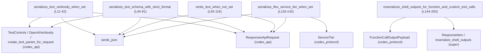
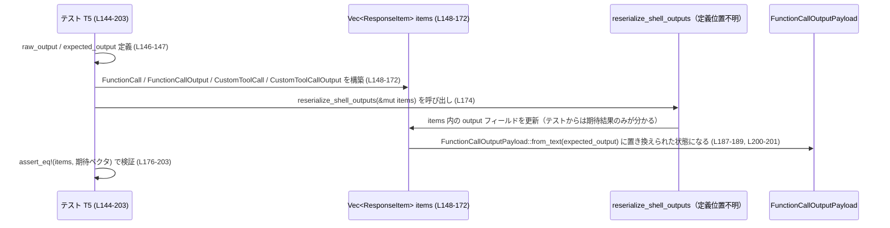

# core/src/client_common_tests.rs コード解説

※ 行番号は、このチャンク先頭からの通し番号として付与しています。

---

## 0. ざっくり一言

`core/src/client_common_tests.rs` は、クライアント側で組み立てる `ResponsesApiRequest` と `ResponseItem` 周りの挙動について、

- JSON シリアライズ結果（`text` フィールド、`service_tier` フィールド）  
- シェルツールの出力再シリアライズロジック（`reserialize_shell_outputs`）

を検証するテスト関数をまとめたモジュールです（`client_common_tests.rs:L11-42, L44-91, L93-116, L118-142, L144-203`）。

---

## 1. このモジュールの役割

### 1.1 概要

このテストモジュールは、クライアント共通処理のうち次の点を確認するために存在します。

- `ResponsesApiRequest` の `text` / `service_tier` フィールドが、期待どおりに JSON にシリアライズされること  
  （`text.verbosity` が `"low"` になる、`text` が `None` のときはフィールドごと省略される、`service_tier` が `"flex"` として出力される等）（`client_common_tests.rs:L11-42, L44-91, L93-116, L118-142`）
- シェルツール関係の `ResponseItem` 群に対して、`reserialize_shell_outputs` が「生の JSON 文字列」を人間向けの整形テキストに置き換えること（`client_common_tests.rs:L144-203`）

### 1.2 アーキテクチャ内での位置づけ

このテストは、親モジュール（`use super::*;`）が提供する `ResponseItem` 型・`reserialize_shell_outputs` 関数と、外部クレート `codex_api` / `codex_protocol` の型に依存しています（`client_common_tests.rs:L1-7, L9`）。

以下の Mermaid 図は、各テスト関数と依存コンポーネントの関係を示します。



### 1.3 設計上のポイント（テストコードとしての特徴）

コードから読み取れる特徴は次のとおりです。

- **責務の分割**  
  - 各テスト関数は 1 つの仕様に対応しており、  
    - `text.verbosity` のシリアライズ（`L11-42`）  
    - `text.format`（スキーマ付き）のシリアライズ（`L44-91`）  
    - `text` フィールドの省略（`L93-116`）  
    - `service_tier` のシリアライズ（`L118-142`）  
    - シェル出力の再シリアライズ（`L144-203`）  
    をそれぞれ個別に検証しています。
- **状態を持たない**  
  - グローバルな状態や共有ミューテーションはなく、テストごとにローカル変数を構築しています。唯一のミューテーションは `reserializes_shell_outputs_for_function_and_custom_tool_calls` 内での `items` ベクタへの可変参照渡しです（`L148-175`）。
- **エラーハンドリングの方針**  
  - テスト内では `serde_json::to_value(&req).expect("json")` や `create_text_param_for_request(...).expect("text controls")` のように、失敗したら即座に panic させるスタイルです（`L35, L56-57, L76, L114, L137`）。
  - これは「シリアライズやパラメータ生成が失敗すること自体がバグ」とみなしていることを示しています。
- **並行性**  
  - スレッド生成や `async`/`await` などの並行・非同期処理は、このファイルには登場しません。
  - `&mut items` を渡す `reserialize_shell_outputs` は可変参照ベースの API であり、同時に複数スレッドから同じベクタを扱う設計にはなっていないことが分かります（Rust の借用ルール上もコンパイルできません）。

---

## 2. 主要な機能一覧（テスト観点）

このファイルに定義されている主なテスト関数と、その検証対象のまとめです。

- `serializes_text_verbosity_when_set`: `TextControls` の `verbosity` を `Some(Low)` に設定したとき、`text.verbosity` が `"low"` として JSON に出力されることを検証します（`client_common_tests.rs:L11-42`）。
- `serializes_text_schema_with_strict_format`: 出力スキーマを指定した `TextControls` を使った場合に、`text.format` フィールドが `"codex_output_schema"`, `"json_schema"`, `strict: true`, `schema` に指定した JSON を持ち、かつ `text.verbosity` が出力されないことを検証します（`L44-91`）。
- `omits_text_when_not_set`: `text: None` としたときに、シリアライズ結果の JSON から `text` フィールド自体が省略されることを検証します（`L93-116`）。
- `serializes_flex_service_tier_when_set`: `service_tier: Some(ServiceTier::Flex.to_string())` と設定したとき、`"service_tier": "flex"` としてシリアライズされることを検証します（`L118-142`）。
- `reserializes_shell_outputs_for_function_and_custom_tool_calls`: シェルツールの `FunctionCallOutput` および `CustomToolCallOutput` の `output` が、生の JSON 文字列ではなく整形済みテキスト `"Exit code: ..."` 形式に書き換えられることを検証します（`L144-203`）。

---

## 3. 公開 API と詳細解説（テストから見える範囲）

### 3.1 型・関数のインベントリー

#### このファイルで使用している主な外部型

| 名前 | 種別 | 役割 / 用途 | 根拠 |
|------|------|------------|------|
| `ResponsesApiRequest` | 外部構造体（定義は `codex_api` 内; 本チャンクには現れない） | Codex Responses API のリクエストペイロードを表現し、シリアライズ対象のオブジェクトとして使われます。`model`, `instructions`, `input`, `tools`, `tool_choice`, `parallel_tool_calls`, `reasoning`, `store`, `stream`, `include`, `prompt_cache_key`, `service_tier`, `text`, `client_metadata` といったフィールドがテストから確認できます。 | `client_common_tests.rs:L15-33, L59-73, L97-112, L120-135` |
| `TextControls` | 外部構造体（`codex_api`） | レスポンスのテキスト出力に関する制御パラメータを保持します。少なくとも `verbosity` と `format` フィールドが存在することが分かります。 | `client_common_tests.rs:L28-31` |
| `OpenAiVerbosity` | 外部型（おそらく列挙体; 定義は本チャンクには現れない） | テキスト出力の冗長さを表します。このテストでは `OpenAiVerbosity::Low` が使用され、JSON では `"low"` という文字列にマッピングされています。 | `client_common_tests.rs:L1, L29-30, L35-41` |
| `ServiceTier` | 外部型（`codex_protocol` 内; 定義は本チャンクには現れない） | サービスのティア（`Flex` など）を表します。`to_string()` を通じて `"flex"` という文字列に変換され、`ResponsesApiRequest.service_tier` に格納される様子が確認できます。 | `client_common_tests.rs:L5, L132-133, L137-141` |
| `FunctionCallOutputPayload` | 外部型（`codex_protocol::models`） | 関数呼び出しあるいはカスタムツール呼び出しの出力を表現するペイロード型です。このテストではテキストベースの出力をラップするのに使用され、`from_text` という関連関数（コンストラクタ）を持つことが分かります。 | `client_common_tests.rs:L6, L158-159, L170-171, L188-189, L200-201` |
| `ResponseItem` | 外部型（親モジュール; 列挙体またはそれに類するものと考えられるが、定義は本チャンクには現れない） | モデルとの対話・ツール呼び出しに関連するイベントを表現します。少なくとも `FunctionCall`, `FunctionCallOutput`, `CustomToolCall`, `CustomToolCallOutput` の 4 つのバリアント（あるいは関連コンストラクタ）が存在することが、このファイルから分かります。 | `client_common_tests.rs:L13, L46, L95, L148-172, L179-201` |

#### このファイル内で定義されている関数（すべてテスト）

| 名前 | 種別 | 役割 / 用途 | 根拠 |
|------|------|------------|------|
| `serializes_text_verbosity_when_set` | テスト関数 | `TextControls.verbosity` が `"low"` としてシリアライズされることを検証します。 | `client_common_tests.rs:L11-42` |
| `serializes_text_schema_with_strict_format` | テスト関数 | スキーマ付きの `TextControls` が `format` フィールドに特定の JSON を生成し、`verbosity` を出力しないことを検証します。 | `client_common_tests.rs:L44-91` |
| `omits_text_when_not_set` | テスト関数 | `text: None` の場合に JSON から `text` フィールドが省略されることを検証します。 | `client_common_tests.rs:L93-116` |
| `serializes_flex_service_tier_when_set` | テスト関数 | `service_tier` に `"flex"` がシリアライズされることを検証します。 | `client_common_tests.rs:L118-142` |
| `reserializes_shell_outputs_for_function_and_custom_tool_calls` | テスト関数 | `reserialize_shell_outputs` が、シェルツールの `FunctionCallOutput`/`CustomToolCallOutput` の出力文字列を整形テキストに置き換えることを検証します。 | `client_common_tests.rs:L144-203` |

---

### 3.2 関数詳細

以下では、このファイル内の 5 つのテスト関数について、テンプレートに沿って整理します。

#### `serializes_text_verbosity_when_set() -> ()`

**概要**

- `ResponsesApiRequest.text` に `TextControls { verbosity: Some(Low), format: None }` を設定した場合に、シリアライズ結果の JSON に `"text": { "verbosity": "low" }` が含まれることを検証するテストです（`client_common_tests.rs:L15-33, L35-41`）。

**引数**

| 引数名 | 型 | 説明 |
|--------|----|------|
| なし | - | テスト関数であり、引数は取りません。 |

**戻り値**

- 戻り値はユニット型 `()` です（Rust の標準的なテスト関数と同じ）。
- アサーションに失敗した場合や `expect("json")` が失敗した場合、テストは panic します。

**内部処理の流れ**

1. 空の `input: Vec<ResponseItem>` と `tools: Vec<serde_json::Value>` を用意します（`L13-14`）。
2. `ResponsesApiRequest` を初期化し、`text` フィールドに `Some(TextControls { verbosity: Some(OpenAiVerbosity::Low), format: None })` を設定します（`L15-33`）。
3. `serde_json::to_value(&req)` で JSON 値 (`serde_json::Value`) に変換し、`expect("json")` でエラーがあれば panic させます（`L35`）。
4. 変換された JSON から `"text"` → `"verbosity"` → 文字列値を順に取り出し（`L37-39`）、それが `Some("low")` であることを `assert_eq!` で検証します（`L36-41`）。

**Examples（使用例）**

このテスト自体が、そのまま `ResponsesApiRequest` と `TextControls` の利用例になっています。

```rust
// TextControls に verbosity を設定してリクエストを構築する例
let req = ResponsesApiRequest {
    model: "gpt-5.1".to_string(),                // 使用するモデル名
    instructions: "i".to_string(),               // システムプロンプトなどの指示
    input: Vec::<ResponseItem>::new(),           // 入力アイテム（ここでは空）
    tools: Vec::<serde_json::Value>::new(),      // 利用可能なツール一覧（ここでは空）
    tool_choice: "auto".to_string(),             // ツール選択モード
    parallel_tool_calls: true,                   // ツール呼び出しの並列実行を許可
    reasoning: None,                             // 推論設定（このチャンクでは詳細不明）
    store: false,                                // ストレージへの保存フラグ
    stream: true,                                // ストリーミング応答を要求
    include: vec![],                             // 応答に含める追加情報（このチャンクでは詳細不明）
    prompt_cache_key: None,                      // プロンプトキャッシュキー
    service_tier: None,                          // サービスティア（ここでは未設定）
    text: Some(TextControls {
        verbosity: Some(OpenAiVerbosity::Low),   // 冗長さを Low に設定
        format: None,                            // 出力フォーマットは未指定
    }),
    client_metadata: None,                       // クライアントメタデータ
};
let v = serde_json::to_value(&req).expect("json"); // JSON にシリアライズ
assert_eq!(
    v.get("text")
        .and_then(|t| t.get("verbosity"))
        .and_then(|s| s.as_str()),
    Some("low"),                                 // "low" であることを確認
);
```

**Errors / Panics**

- `serde_json::to_value(&req)` が失敗した場合、`expect("json")` により panic します（`L35`）。
- `assert_eq!` が失敗した場合も panic します（`L36-41`）。
- これらはすべてテスト実行時の panic であり、ライブラリのプロダクションコードとは異なる扱いです。

**Edge cases（エッジケース）**

- このテストは `verbosity: Some(OpenAiVerbosity::Low)` のケースのみを扱います。
- `verbosity: None` や他の値（例: `High` が存在するかどうかも含めて）は、このファイルの他の箇所には現れていません。

**使用上の注意点**

- `ResponsesApiRequest` の `text` フィールドを設定しない限り、`text.verbosity` は JSON に出力されません（`omits_text_when_not_set` テスト参照、`L93-116`）。
- プロダクションコードでは `serde_json::to_value` のエラーを `expect` ではなく `Result` として扱う必要があります。

---

#### `serializes_text_schema_with_strict_format() -> ()`

**概要**

- `create_text_param_for_request(None, &Some(schema))` で得られた `TextControls` を `ResponsesApiRequest.text` にセットした場合のシリアライズ結果を検証します。
- JSON の `text.format` が特定の構造を持ち、`text.verbosity` フィールドが存在しないことを確認します（`client_common_tests.rs:L48-90`）。

**引数**

| 引数名 | 型 | 説明 |
|--------|----|------|
| なし | - | テスト関数であり、引数は取りません。 |

**戻り値**

- ユニット型 `()`。テスト失敗時に panic します。

**内部処理の流れ**

1. 空の `input` と `tools` を用意します（`L46-47`）。
2. JSON スキーマ（`schema`）を `serde_json::json!` で構築します（`L48-54`）。
3. `create_text_param_for_request(/*verbosity*/ None, &Some(schema.clone()))` を呼び出し、`TextControls` 相当の値を生成します。失敗した場合は `expect("text controls")` で panic します（`L55-57`）。
4. 生成した `text_controls` を `ResponsesApiRequest.text` にセットし、`ResponsesApiRequest` を初期化します（`L59-73`）。
5. `serde_json::to_value(&req)` で JSON に変換し（`L76`）、`text` フィールドの値を取得します（`L77`）。
6. `text.get("verbosity")` が `None`（フィールドが存在しない）であることを `assert!` で確認します（`L78`）。
7. `text.get("format")` を取得し、以下のキーが期待どおりであることを `assert_eq!` で検証します（`L79-90`）。  
   - `name == "codex_output_schema"`（`L81-84`）  
   - `type == "json_schema"`（`L85-88`）  
   - `strict == true`（`L89`）  
   - `schema == schema`（`L90`）

**Examples（使用例）**

このテストが `create_text_param_for_request` の代表的な利用例です。

```rust
// スキーマ付きの TextControls を生成し、リクエストに設定する例
let schema = serde_json::json!({
    "type": "object",
    "properties": {
        "answer": { "type": "string" },
    },
    "required": ["answer"],
});

let text_controls =
    create_text_param_for_request(/*verbosity*/ None, &Some(schema.clone()))
        .expect("text controls");                     // 失敗時は panic

let req = ResponsesApiRequest {
    // ...（他フィールドは省略; テストと同様の初期化）...
    text: Some(text_controls),                        // 生成した TextControls を利用
    // ...
};

let v = serde_json::to_value(&req).expect("json");
let text = v.get("text").expect("text field");
assert!(text.get("verbosity").is_none());             // verbosity は出力されない
let format = text.get("format").expect("format field");
assert_eq!(format.get("name").unwrap(), "codex_output_schema");
assert_eq!(format.get("type").unwrap(), "json_schema");
assert_eq!(format.get("strict").unwrap(), &serde_json::Value::Bool(true));
assert_eq!(format.get("schema").unwrap(), &schema);
```

**Errors / Panics**

- `create_text_param_for_request` がエラーを返すと、`expect("text controls")` で panic します（`L56-57`）。
- `serde_json::to_value` の失敗で `expect("json")` が panic します（`L76`）。
- JSON から `text` や `format` が取得できない場合、`expect("text field")` / `expect("format field")` により panic します（`L77, L79`）。
- アサーション失敗もすべて panic となります（`L78, L81-90`）。

**Edge cases**

- このテストでは `verbosity` を `None` として `create_text_param_for_request` を呼んだ場合の挙動のみを検証しています。
- `verbosity` を `Some(...)` にした場合の挙動は、このチャンクには現れていません。
- `schema: None` の場合の挙動も、このファイルからは分かりません。

**使用上の注意点**

- このテストから、「スキーマを指定した場合は `verbosity` をシリアライズしない」という仕様が期待されていることが分かります（`L76-79`）。
- 実コードで `create_text_param_for_request` を使う際には、`Result` を適切に処理する必要があります（ここでは `expect` で簡略化されています）。

---

#### `omits_text_when_not_set() -> ()`

**概要**

- `ResponsesApiRequest.text` を `None` にした場合、シリアライズされた JSON から `text` フィールドが完全に省略されることを確認するテストです（`client_common_tests.rs:L93-116`）。

**引数**

| 引数名 | 型 | 説明 |
|--------|----|------|
| なし | - | テスト関数のため引数はありません。 |

**戻り値**

- ユニット型 `()`。

**内部処理の流れ**

1. 空の `input` と `tools` を用意します（`L95-96`）。
2. `text: None` を含む `ResponsesApiRequest` を構築します（`L97-112`）。
3. `serde_json::to_value(&req)` で JSON に変換し、`expect("json")` でエラー時に panic させます（`L114`）。
4. 変換結果から `v.get("text")` を取得し、その結果が `None`（フィールドが存在しない）であることを `assert!` で検証します（`L115`）。

**Examples（使用例）**

```rust
// text フィールドを完全に省略したい場合のリクエスト構築例
let req = ResponsesApiRequest {
    // ...他フィールドはテストと同様...
    text: None,                              // TextControls を設定しない
    // ...
};

let v = serde_json::to_value(&req).expect("json");
assert!(v.get("text").is_none());            // "text" フィールド自体が存在しない
```

**Errors / Panics**

- `serde_json::to_value` のエラー時に `expect("json")` が panic します（`L114`）。
- `assert!(v.get("text").is_none())` が失敗した場合も panic します（`L115`）。

**Edge cases**

- `text: None` のケースのみが対象であり、`text: Some(TextControls { ... })` かつ内部フィールドがすべて `None` の場合にどうシリアライズされるかは、このファイルからは分かりません。

**使用上の注意点**

- 「`text` フィールドそのものを JSON から消したい」場合は、`text: None` を設定する必要があります（テストの期待からの推測ですが、コード上の事実として `None` のときはフィールドが出ていないことが確認できます: `L97-116`）。
- プロダクションコードでは同様に `serde_json::to_value` のエラーを明示的に処理するべきです。

---

#### `serializes_flex_service_tier_when_set() -> ()`

**概要**

- `ResponsesApiRequest.service_tier` に `Some(ServiceTier::Flex.to_string())` を設定したときに、シリアライズされた JSON の `"service_tier"` フィールドが `"flex"` であることを検証するテストです（`client_common_tests.rs:L118-142`）。

**引数**

| 引数名 | 型 | 説明 |
|--------|----|------|
| なし | - | テスト関数のため引数はありません。 |

**戻り値**

- ユニット型 `()`。

**内部処理の流れ**

1. `ResponsesApiRequest` を構築し、`service_tier` フィールドに `Some(ServiceTier::Flex.to_string())` を設定します（`L120-135`）。
2. `serde_json::to_value(&req)` で JSON に変換し、`expect("json")` でエラー時に panic させます（`L137`）。
3. JSON から `v.get("service_tier").and_then(|tier| tier.as_str())` を取り出し、それが `Some("flex")` であることを `assert_eq!` で検証します（`L138-141`）。

**Examples（使用例）**

```rust
// service_tier を Flex に設定してリクエストを構築し、シリアライズを確認する例
let req = ResponsesApiRequest {
    // ...他フィールドは省略...
    service_tier: Some(ServiceTier::Flex.to_string()), // "flex" という文字列を格納
    text: None,
    client_metadata: None,
};

let v = serde_json::to_value(&req).expect("json");
assert_eq!(
    v.get("service_tier").and_then(|tier| tier.as_str()),
    Some("flex"),                                      // JSON 上では "flex" として現れる
);
```

**Errors / Panics**

- `serde_json::to_value` の失敗で `expect("json")` が panic します（`L137`）。
- アサーション失敗も panic です（`L138-141`）。

**Edge cases**

- このテストは `ServiceTier::Flex` のみを扱っています。
- 他のティア値（たとえば `Standard` など）が存在するかどうか、またそれらがどのような文字列にマッピングされるかは、このチャンクには現れていません。

**使用上の注意点**

- テストからは、「`ServiceTier` を `to_string()` した結果を `service_tier` に格納すると、その文字列がそのまま JSON に出る」という仕様が期待されていることが分かります（`L132-133, L138-141`）。
- 実際の使用時には `ServiceTier` の文字列表現と API 仕様の整合性に注意する必要があります。

---

#### `reserializes_shell_outputs_for_function_and_custom_tool_calls() -> ()`

**概要**

- `ResponseItem` のベクタに対して `reserialize_shell_outputs` を実行すると、`FunctionCallOutput` および `CustomToolCallOutput` に含まれる `FunctionCallOutputPayload` のテキストが、生の JSON から整形済みテキストに変換されることを検証するテストです（`client_common_tests.rs:L144-203`）。

**引数**

| 引数名 | 型 | 説明 |
|--------|----|------|
| なし | - | テスト関数であり、引数は取りません。 |

**戻り値**

- ユニット型 `()`。

**内部処理の流れ**

1. `raw_output` として、シェル実行結果を表す JSON 文字列を用意します（`L146`）。  
   例: `{"output":"hello","metadata":{"exit_code":0,"duration_seconds":0.5}}`
2. `expected_output` として、期待される整形済みテキストを定義します（`L147`）。  
   例: `"Exit code: 0\nWall time: 0.5 seconds\nOutput:\nhello"`
3. `items` ベクタを構築します（`L148-172`）。  
   - `ResponseItem::FunctionCall { name: "shell", call_id: "call-1", ... }`  
   - `ResponseItem::FunctionCallOutput { call_id: "call-1", output: from_text(raw_output) }`  
   - `ResponseItem::CustomToolCall { name: "apply_patch", call_id: "call-2", ... }`  
   - `ResponseItem::CustomToolCallOutput { call_id: "call-2", output: from_text(raw_output) }`
4. `reserialize_shell_outputs(&mut items);` を呼び出し、`items` をインプレースで書き換えます（`L174`）。
5. `assert_eq!` によって、`items` が期待される構造と値になっていることを検証します（`L176-203`）。  
   - `FunctionCallOutput` / `CustomToolCallOutput` の `output` フィールドは `from_text(expected_output.to_string())` に変わっている必要があります（`L187-189, L200-201`）。

**Examples（使用例）**

このテスト自体が `reserialize_shell_outputs` の典型的な利用方法です。

```rust
// シェルツールの出力を含む ResponseItem 群を作り、reserialize_shell_outputs で整形する例
let raw_output = r#"{"output":"hello","metadata":{"exit_code":0,"duration_seconds":0.5}}"#;
let mut items = vec![
    ResponseItem::FunctionCall {
        id: None,
        name: "shell".to_string(),
        namespace: None,
        arguments: "{}".to_string(),
        call_id: "call-1".to_string(),
    },
    ResponseItem::FunctionCallOutput {
        call_id: "call-1".to_string(),
        output: FunctionCallOutputPayload::from_text(raw_output.to_string()),
    },
    // ... CustomToolCall / CustomToolCallOutput も続く ...
];

reserialize_shell_outputs(&mut items); // items がインプレースで書き換えられる
// 以降、items[1] / items[3] の output には整形済みテキストが入っていることを期待
```

**Errors / Panics**

- このテスト関数自身には `expect` 呼び出しはありません。
- `reserialize_shell_outputs` の内部で発生しうるエラーや panic については、このチャンクには実装が現れていないため不明です。
- `assert_eq!` が失敗した場合はテストが panic します（`L176-203`）。

**Edge cases**

- このテストが扱うのは、`call_id` を媒介にした 1 組の `FunctionCall`/`FunctionCallOutput` と、1 組の `CustomToolCall`/`CustomToolCallOutput` のケースです（`L148-172`）。
- `reserialize_shell_outputs` が「シェル以外のツール」・`call_id` の不一致・`output` が別フォーマットの場合にどう振る舞うかは、このチャンクには現れていません。

**使用上の注意点**

- `reserialize_shell_outputs` は `&mut items` を受け取ってインプレースで変更する API であることが分かります（`L174`）。同じベクタを他スレッドと共有して同時操作するような使い方は Rust の借用ルール上もできません。
- シェル出力の再シリアライズ仕様（どのような JSON → どのようなテキストになるか）はこのテストケースで確認できる範囲に限られます。新しいフィールドが追加された場合などは、挙動を別途確認する必要があります。

---

### 3.3 その他の関数

- このファイル内には、上記 5 つ以外の関数定義はありません。
- `create_text_param_for_request` および `reserialize_shell_outputs` は、いずれも他モジュールで定義された関数であり、その実装はこのチャンクには現れていません（`client_common_tests.rs:L4, L55-57, L174`）。

---

### 3.4 バグ / セキュリティ観点（テストから読み取れる範囲）

- **シリアライズ仕様の回 regress 防止**  
  - `text` / `service_tier` の JSON 表現に対するテストにより、ライブラリの変更でフィールド名や値が変わることを検知できます（`L35-41, L76-90, L114-115, L137-141`）。
- **シェル出力の扱い**  
  - シェルツールの生出力（JSON 文字列）を、人間向けの整形テキストに変換することが期待されています（`L146-147, L187-189, L200-201`）。  
    内部実装は不明ですが、この変換が適切に行われない場合、ユーザーにとって可読性が低下したり、ツールとのインタフェース仕様が破綻する可能性があります。
- **入力検証やエスケープ処理**  
  - `reserialize_shell_outputs` 内でどのようなエスケープ処理や入力検証が行われているかは、このチャンクからは分かりません。セキュリティ面（コマンド出力中の制御文字など）については実装側の確認が必要です。

---

## 4. データフロー

ここでは、`reserializes_shell_outputs_for_function_and_custom_tool_calls` テストにおけるデータフローを例に説明します。

### 4.1 処理の要点

- テスト関数内で、シェル実行結果を表す JSON 文字列 `raw_output` を用意します（`L146`）。
- `raw_output` を `FunctionCallOutputPayload::from_text(raw_output.to_string())` でラップし、`ResponseItem::FunctionCallOutput` および `ResponseItem::CustomToolCallOutput` の `output` フィールドに格納します（`L157-159, L170-171`）。
- その後 `reserialize_shell_outputs(&mut items)` を呼び出すことで、`items` 内の `output` フィールドが書き換えられることを期待します（`L174, L187-189, L200-201`）。

### 4.2 シーケンス図



この図から分かるとおり、`reserialize_shell_outputs` は `Vec<ResponseItem>` をインプレースに更新する関数として利用されていますが、その内部アルゴリズムやエラー処理の詳細はこのチャンクには現れていません。

---

## 5. 使い方（How to Use） — テストから読み取れるパターン

このファイルはテストモジュールですが、テストコードはそのまま API の基本的な使い方の例にもなっています。

### 5.1 基本的な使用方法

#### 5.1.1 `ResponsesApiRequest` と `TextControls` の構築

`text.verbosity` を指定してリクエストを組み立てるパターンです（`L15-33`）。

```rust
use codex_api::{OpenAiVerbosity, ResponsesApiRequest, TextControls};

// ResponseItem 型は親モジュールからインポートされる前提
fn build_request_with_low_verbosity(input: Vec<ResponseItem>) -> ResponsesApiRequest {
    let tools: Vec<serde_json::Value> = Vec::new();         // ツール設定（ここでは空）

    ResponsesApiRequest {
        model: "gpt-5.1".to_string(),                      // モデル名
        instructions: "i".to_string(),                     // 指示文
        input,                                             // 呼び出し元から渡された入力
        tools,                                             // ツール一覧
        tool_choice: "auto".to_string(),                   // 自動ツール選択
        parallel_tool_calls: true,                         // ツール呼び出しの並列実行
        reasoning: None,                                   // 推論設定（詳細不明）
        store: false,                                      // 保存しない
        stream: true,                                      // ストリーミング応答
        include: vec![],                                   // 追加情報なし
        prompt_cache_key: None,                            // キャッシュキーなし
        service_tier: None,                                // サービスティア未設定
        text: Some(TextControls {
            verbosity: Some(OpenAiVerbosity::Low),         // 冗長さ Low
            format: None,                                  // フォーマット未指定
        }),
        client_metadata: None,                             // メタデータなし
    }
}
```

#### 5.1.2 スキーマ付き `TextControls` の作成

`create_text_param_for_request` を利用して `format` に JSON スキーマを埋め込むパターンです（`L48-57`）。

```rust
use codex_api::{create_text_param_for_request, TextControls};

fn build_text_controls_with_schema(schema: &serde_json::Value) -> TextControls {
    create_text_param_for_request(/*verbosity*/ None, &Some(schema.clone()))
        .expect("text controls")    // テストでは失敗時に panic させている
}
```

### 5.2 よくある使用パターン（このファイルから読み取れるもの）

- **テキスト出力の細かい制御が不要な場合**  
  - `text: None` として `text` フィールドごと省略する（`omits_text_when_not_set`, `L97-116`）。
- **冗長さだけを制御したい場合**  
  - `TextControls { verbosity: Some(Low), format: None }` を指定し、`text.verbosity` だけを出力する（`L28-31`）。
- **出力をスキーマに準拠させたい場合**  
  - `create_text_param_for_request(None, &Some(schema))` を利用し、`text.format` のみ出力させる（`L55-57, L76-90`）。

### 5.3 よくある間違い（起こりうる誤用と、このテストから分かること）

```rust
// 誤りの可能性がある例（仕様はこのチャンクからは断定できません）
let text_controls = TextControls {
    verbosity: None,
    format: None,
};
let req = ResponsesApiRequest {
    // ...
    text: Some(text_controls),          // 「text フィールドを出したくない」意図でこう書くと、
    // ...                               // 実際にどうシリアライズされるかはこのファイルからは分からない
};

// このテストから確実に分かる正しい方法:
let req = ResponsesApiRequest {
    // ...
    text: None,                         // text フィールドを完全に省略したいときは None を指定 (L97-116)
    // ...
};
```

- このファイルからは「`text: None` のときにフィールドが省略される」ことだけが確実に分かります（`L97-116`）。  
  `text: Some(TextControls { verbosity: None, format: None })` の挙動は不明です。

### 5.4 使用上の注意点（まとめ）

- **エラー処理**  
  - テストでは `expect` や `assert!` を使って失敗時に即 panic させていますが、プロダクションコードでは `Result` を適切に伝播・処理する必要があります（`L35, L56-57, L76, L114, L137`）。
- **ミューテーション**  
  - `reserialize_shell_outputs` は `&mut Vec<ResponseItem>` に対してインプレース変更を行うため、呼び出し後の `items` の状態を前提にしたコードを書くことになります（`L174-203`）。
- **並行性**  
  - このファイルにはスレッドや `async`/`await` は登場しません。並列環境で `ResponsesApiRequest` や `ResponseItem` をどう扱うかは、親モジュールや外部クレート側の設計に依存します。

---

## 6. 変更の仕方（How to Modify）

このファイルはテストコードであるため、「何かを変更したい」ときは主にテストケースの追加・更新が対象になります。

### 6.1 新しい機能を追加する場合

例として、`ResponsesApiRequest` に新しいフィールド（例えば `priority`）が追加されたと想定した場合の流れです。  
実際にそのようなフィールドが存在するかどうかはこのチャンクには現れませんので、以下は一般的な方針です。

1. **親モジュール側の変更を確認**  
   - `use super::*;` でインポートされている親モジュール（`ResponseItem` や `reserialize_shell_outputs` 定義元）や `codex_api` 側で追加されたフィールド・関数を確認します。
2. **既存テストのパターンを参考にする**  
   - `serializes_text_verbosity_when_set` や `serializes_flex_service_tier_when_set` のように、  
     「フィールドを設定 → `serde_json::to_value` → JSON から値を取り出して `assert_eq!`」という流れを真似て、新しいフィールドのテストを追加します。
3. **エッジケース用テストの追加**  
   - `text: None` と同様に、新フィールドに対しても「未設定の時に JSON に現れないか」「`Some(...)` の時はどのようにシリアライズされるか」を別テストとして追加するのが自然です。

### 6.2 既存の機能を変更する場合

- **シリアライズ仕様を変えたい場合**  
  - 例えば `text.verbosity` の文字列表現を `"low"` から `"LOW"` に変えたいといった仕様変更を行う場合、  
    - 対応するテスト（`serializes_text_verbosity_when_set`）の期待値（`Some("low")`）を変更し、  
    - 実装を変更したあとでテストが通ることを確認します。
- **シェル出力のフォーマットを変えたい場合**  
  - `expected_output` の文言（`"Exit code: 0\nWall time: 0.5 seconds\nOutput:\nhello"`）を変更し（`L147, L187-189, L200-201`）、  
    - `reserialize_shell_outputs` 実装を修正したうえで、このテストが新しいフォーマットに基づいて成功することを確認します。
- **影響範囲の確認**  
  - このファイルにあるテストは、シリアライズ仕様の一部を暗黙的な契約として固定しているため、仕様変更の際にはどのテストがその契約を表現しているかを確認し、テストと実装のどちらを変更するべきかを明確にする必要があります。

---

## 7. 関連ファイル

このテストモジュールと密接に関係するファイル・モジュールは、コードから次のように読み取れます。

| パス / モジュール | 役割 / 関係 |
|-------------------|------------|
| `super`（親モジュール; ファイルパスはこのチャンクには現れない） | `use super::*;` により、`ResponseItem` 型および `reserialize_shell_outputs` 関数を提供していることが分かります（`client_common_tests.rs:L9, L13, L46, L95, L148-172, L174`）。親モジュールの具体的なファイル名や構造はこのチャンクには現れません。 |
| `codex_api` クレート | `OpenAiVerbosity`, `ResponsesApiRequest`, `TextControls`, `create_text_param_for_request` を提供します（`L1-4, L15-33, L55-57, L59-73`）。クライアントから Codex API に送信するリクエスト構造やテキスト制御パラメータを定義していると考えられますが、定義自体はこのチャンクには現れません。 |
| `codex_protocol` クレート | `config_types::ServiceTier` と `models::FunctionCallOutputPayload` を提供します（`L5-6, L132-133, L158-159, L170-171, L188-189, L200-201`）。サービスティアの指定やツール実行結果のペイロード表現に使用されています。 |
| `serde_json` クレート | `serde_json::to_value`, `serde_json::json!` を利用して JSON への変換および JSON の構築を行っています（`L35, L48-54, L76, L114, L137`）。 |
| `pretty_assertions` クレート | `assert_eq` マクロを提供し、差分表示を強化したアサーションとして使用されています（`L7, L36-41, L81-90, L138-141, L176-203`）。 |

このチャンクには、親モジュール側の実装（`ResponseItem`, `reserialize_shell_outputs` など）や `codex_api` / `codex_protocol` 側の型定義は現れていません。そのため、より詳細な仕様・エッジケース・エラー条件については、これら関連モジュールのコードやドキュメントを参照する必要があります。
