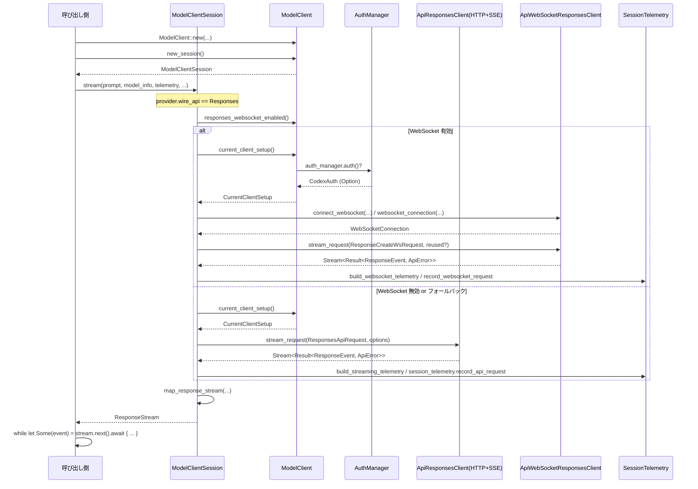

# core/src/client.rs コード解説

## 0. ざっくり一言

- モデルプロバイダ（主に OpenAI Responses API）とやり取りするための、**セッション単位（ModelClient）** と **ターン単位（ModelClientSession）** のクライアント実装です。
- HTTP(SSE) と WebSocket の両方に対応し、認証・自動リトライ（401 対応）・テレメトリ・WebSocket フォールバック・会話履歴コンパクト化・メモリ要約などをまとめて扱います。

> 注: 提示されたコードには行番号情報が含まれていないため、**正確な行番号付きの `L開始-終了` 表記は行いません**。根拠は常に「core/src/client.rs 内の該当関数・型定義」に基づきます。

---

## 1. このモジュールの役割

### 1.1 概要

- このモジュールは **「Codex セッション内でのモデル API 呼び出し」** を整理するために存在し、次の機能を提供します。
  - セッションごとの固定設定（認証情報、プロバイダ情報、会話 ID、WebSocket フォールバック状態）の保持。
  - ターンごとのストリーミングリクエスト（Prompt → Responses API ストリーム）を HTTP または WebSocket で実行。
  - コンパクション API・メモリ要約 API・Realtime WebRTC 呼び出しの単発（unary）リクエスト。
  - 認証失効時のリフレッシュ、詳細なテレメトリ送信、sticky routing（`x-codex-turn-state`）の管理。

### 1.2 アーキテクチャ内での位置づけ

このファイル内の主なコンポーネントと、その外部依存関係の関係を簡略化して示します。

```mermaid
graph TD
    %% 対象: core/src/client.rs 全体

    Caller["呼び出し側コード\n(上位レイヤ)"]
    MC["ModelClient\n(セッションスコープ)"]
    MCS["ModelClientSession\n(ターンスコープ)"]
    Auth["AuthManager\n(codex_login)"]
    Prov["ModelProviderInfo\n(codex_model_provider_info)"]
    Tele["SessionTelemetry\n(codex_otel)"]
    HTTP["ApiResponsesClient\n(HTTP+SSE)"]
    WS["ApiWebSocketResponsesClient\n(WebSocket)"]
    OtherAPI["Compact/Memories/Realtime\n(ApiCompactClient 等)"]

    Caller --> MC
    MC -->|new_session| MCS
    MC -->|auth_manager() / current_client_setup()| Auth
    MC --> Prov

    MCS -->|stream()/prewarm_websocket()| WS
    MCS -->|stream_responses_api()| HTTP
    MCS -->|compact_conversation_history() / summarize_memories() / create_realtime_call_with_headers()| OtherAPI

    MCS --> Tele
    HTTP --> Tele
    WS --> Tele
```

- `ModelClient` はセッション全体で共有され、`ModelClientSession` をターンごとに生成します。
- `ModelClientSession::stream` がメインの推論ストリーム入口で、内部で WebSocket か HTTP を選択します。
- 認証とテレメトリは `AuthManager`, `SessionTelemetry`, `ApiTelemetry` を通して一元管理されています。

### 1.3 設計上のポイント（コードから読み取れる事実）

- **責務の分割**
  - `ModelClient`:
    - セッション固定の情報（認証マネージャ、会話 ID、インストール ID、プロバイダ情報など）を保持。
    - WebSocket フォールバック状態（`disable_websockets`, `cached_websocket_session`）をセッション単位で管理。
    - Compact / Memories / Realtime call などのセッションスコープの unary API を提供。
  - `ModelClientSession`:
    - ターン単位の WebSocket セッション（`WebsocketSession`）と sticky routing トークン（`turn_state: OnceLock<String>`）を保持。
    - Responses API ストリーミング（HTTP / WebSocket）と WebSocket プレウォームを実装。
- **状態管理**
  - `ModelClientState` は `Arc` + `AtomicBool` / `AtomicU64` / `StdMutex` / `OnceLock` を用いて、スレッドセーフに状態を共有しています。
  - `window_generation` によってウィンドウ ID を世代管理し、変更時には WebSocket セッションをリセットしています。
  - WebSocket の再利用可否 (`connection_reused`) は `StdMutex<bool>` で保護されています。
- **エラーハンドリング方針**
  - 外部 API からのエラー型 `ApiError` は `map_api_error` を通してドメインエラー `CodexErr` にマッピングされます。
  - 401 (Unauthorized) の場合は `AuthManager::unauthorized_recovery` を用いて **一連のリカバリ手順** を実行し、成功すれば同じリクエストをリトライします。
  - WebSocket 接続のタイムアウトは `tokio::time::timeout` で明示的に `TransportError::Timeout` として扱い、場合によって WebSocket セッションをリセットします。
- **並行性**
  - `ModelClient` は `#[derive(Clone)]` されており、内部状態は `Arc<ModelClientState>` で共有されるため、複数スレッド／タスクから安全にクローンして使用できます。
  - `ModelClientSession` 内ではネットワーク I/O はすべて `async` 関数で実装され、`tokio` ランタイム上で非同期に実行されます。
  - ストリーム変換 (`map_response_stream`) では `tokio::spawn` + `mpsc::channel` + `oneshot::channel` を使い、バックグラウンドタスクとしてイベントを転送します。

---

## 2. 主要な機能一覧 & コンポーネントインベントリー

### 2.1 機能一覧（高レベル）

- モデルストリーミング:
  - Responses API を HTTP(SSE) または WebSocket 経由でストリームする。
  - WebSocket 接続のプレウォーム（prewarm）と再利用。
  - WebSocket が使えない場合の自動 HTTP フォールバック。
- 会話履歴コンパクション:
  - `/responses/compact` を叩いて `ResponseItem` のリストをコンパクト化。
- メモリ要約:
  - `/memories/trace_summarize` を叩いて `ApiRawMemory` のリストを要約。
- Realtime WebRTC 呼び出し:
  - HTTP で WebRTC call を作成し、その情報を元にサイドバンド WebSocket で接続するためのヘッダを生成。
- Sticky routing & メタデータ:
  - `x-codex-turn-state`, `x-codex-turn-metadata`, `x-codex-window-id` などのヘッダを一貫して付与。
- 認証 & リトライ:
  - `AuthManager` と `UnauthorizedRecovery` による 401 時のトークンリフレッシュ。
- テレメトリ & フィードバック:
  - HTTP / SSE / WebSocket それぞれに対する詳細なタイミング・エラー情報を `SessionTelemetry` や `FeedbackRequestTags` として記録。

### 2.2 型インベントリー（主要構造体・列挙体）

| 名前 | 種別 | 公開範囲 | 役割 / 用途 |
|------|------|----------|-------------|
| `ModelClientState` | 構造体 | private | `ModelClient` が共有するセッションスコープ状態（認証、プロバイダ情報、会話 ID、WebSocket キャッシュなど）を保持します。 |
| `CurrentClientSetup` | 構造体 | private | 単一リクエスト試行に必要な `CodexAuth`, API プロバイダ、API 認証設定をまとめたバンドル。 |
| `RequestRouteTelemetry` | 構造体 | private | テレメトリ用にエンドポイント名（例: `/responses`）を保持します。 |
| `ModelClient` | 構造体 | `pub` | セッションスコープのクライアント。`new`, `new_session`, `compact_conversation_history`, `summarize_memories` などを提供します。 |
| `ModelClientSession` | 構造体 | `pub` | ターンスコープのストリーミングセッション。Responses API ストリーミングや WebSocket プレウォームを担当します。 |
| `LastResponse` | 構造体 | private | 前回 WebSocket 応答の `response_id` と、追加された `ResponseItem` の一覧を保持します（増分リクエストに利用）。 |
| `WebsocketSession` | 構造体 | private | 現在の WebSocket 接続・直近リクエスト・直近レスポンス受信チャネル・再利用フラグを保持します。 |
| `WebsocketStreamOutcome` | enum | private | WebSocket ストリーム結果を `Stream(ResponseStream)` または `FallbackToHttp` で表現。 |
| `RealtimeWebrtcCallStart` | 構造体 | `pub(crate)` | WebRTC call 開始時の SDP・call ID・サイドバンド WebSocket 用ヘッダをまとめた型。 |
| `UnauthorizedRecoveryExecution` | 構造体 | private | 認証リカバリで実行された mode / phase の記録に使用します。 |
| `PendingUnauthorizedRetry` | 構造体 | private | 401 後のリトライが pending かどうか、およびリカバリ mode/phase を保持します。 |
| `AuthRequestTelemetryContext` | 構造体 | private | 認証関連のテレメトリ情報（auth mode、ヘッダ有無、リカバリ状態など）を保持します。 |
| `WebsocketConnectParams<'a>` | 構造体 | private | `websocket_connection` に渡されるパラメータ（テレメトリ・プロバイダ・オプション）をまとめた型。 |
| `ApiTelemetry` | 構造体 | private + トレイト実装 | HTTP/SSE/WebSocket 用のテレメトリ実装。`RequestTelemetry` / `SseTelemetry` / `WebsocketTelemetry` を実装します。 |

### 2.3 関数インベントリー（概要）

#### 2.3.1 公開 / クレート公開 API

| 関数名 | 所属 | 公開範囲 | 役割（1 行） |
|--------|------|----------|--------------|
| `ModelClient::new` | `ModelClient` | `pub` | セッションスコープの `ModelClient` を生成し、プロバイダ・認証・初期状態をセットアップします。 |
| `ModelClient::new_session` | `ModelClient` | `pub` | ターンスコープの `ModelClientSession` を新規作成し、キャッシュされた WebSocket セッションを引き継ぎます。 |
| `ModelClient::auth_manager` | `ModelClient` | `pub(crate)` | 内部用に `AuthManager` を取得します。 |
| `ModelClient::set_window_generation` | `ModelClient` | `pub(crate)` | `window_generation` を指定値に設定し、WebSocket セッションをリセットします。 |
| `ModelClient::advance_window_generation` | `ModelClient` | `pub(crate)` | `window_generation` をインクリメントし、WebSocket セッションをリセットします。 |
| `ModelClient::force_http_fallback` | `ModelClient` | `pub(crate)` | WebSocket 利用をセッション単位で無効化し、HTTP フォールバックに切り替えます。 |
| `ModelClient::compact_conversation_history` | `ModelClient` | `pub async` | `/responses/compact` を呼び出し、会話履歴（`Prompt`）をコンパクト化した `Vec<ResponseItem>` を返します。 |
| `ModelClient::create_realtime_call_with_headers` | `ModelClient` | `pub(crate) async` | Realtime WebRTC call を HTTP で作成し、サイドバンド WebSocket 用ヘッダを含む `RealtimeWebrtcCallStart` を返します。 |
| `ModelClient::summarize_memories` | `ModelClient` | `pub async` | `/memories/trace_summarize` を呼び出し、メモリ要約 (`Vec<ApiMemorySummarizeOutput>`) を返します。 |
| `ModelClient::responses_websocket_enabled` | `ModelClient` | `pub` | プロバイダ能力・フォールバック状態・SSE fixture 設定に基づき、WebSocket 利用可否を返します。 |
| `ModelClientSession::reset_websocket_session` | `ModelClientSession` | `pub(crate)` | WebSocket セッション状態を初期化します。 |
| `ModelClientSession::preconnect_websocket` | `ModelClientSession` | `pub async` | ターン開始時に WebSocket を「接続だけ」先行して張るプレコネクトを行います。 |
| `ModelClientSession::prewarm_websocket` | `ModelClientSession` | `pub async` | `generate = false` の v2 WebSocket リクエストを送り、次の本番ストリームに備えてプレウォームします。 |
| `ModelClientSession::stream` | `ModelClientSession` | `pub async` | 単一ターンのモデルリクエストをストリームし、WebSocket 優先で HTTP にフォールバックします。 |
| `ModelClientSession::try_switch_fallback_transport` | `ModelClientSession` | `pub(crate)` | セッション全体の WebSocket を恒久的に無効化し、HTTP へ切り替えます。 |

#### 2.3.2 主な内部ヘルパ関数（抜粋）

| 関数名 | 役割（1 行） |
|--------|--------------|
| `sideband_websocket_auth_headers` | Realtime WebRTC call に対応するサイドバンド WebSocket 用の Authorization / Account ID ヘッダを構築します。 |
| `ModelClient::build_subagent_headers` | `SessionSource` に応じて `x-openai-subagent` ヘッダを組み立てます。 |
| `ModelClient::build_responses_identity_headers` | window ID や parent thread ID 等、Responses API でのアイデンティティ系ヘッダを構築します。 |
| `ModelClient::build_ws_client_metadata` | WebSocket 用の `client_metadata` マップを作成します。 |
| `ModelClient::current_client_setup` | 現在の `AuthManager` 状態から `CodexAuth` と `codex_api::Provider`, `CoreAuthProvider` を解決します。 |
| `ModelClient::connect_websocket` | WebSocket 接続を張り、接続時間・エラーをテレメトリに記録します。 |
| `ModelClient::build_websocket_headers` | WebSocket ハンドシェイク時に送る各種ヘッダを構築します。 |
| `ModelClientSession::build_responses_request` | `Prompt` や `ModelInfo` から Responses API のリクエストボディ (`ResponsesApiRequest`) を構築します。 |
| `ModelClientSession::build_responses_options` | Responses API 共通のオプション（会話 ID, ヘッダ, 圧縮, turn_state）を構築します。 |
| `ModelClientSession::get_incremental_items` | 前回リクエストとの比較から、今回リクエストで追加された `ResponseItem` のみを抽出します。 |
| `ModelClientSession::prepare_websocket_request` | 過去レスポンス情報をもとに `previous_response_id` と追加分 `input` を設定した WebSocket リクエストを構築します。 |
| `ModelClientSession::websocket_connection` | 必要に応じて WebSocket 再接続を行い、その接続を返します。 |
| `ModelClientSession::responses_request_compression` | 認証・プロバイダに基づいて Zstd 圧縮を行うかどうかを決定します。 |
| `ModelClientSession::stream_responses_api` | HTTP + SSE を使った Responses API ストリーミングを実装します（401 リカバリ込み）。 |
| `ModelClientSession::stream_responses_websocket` | WebSocket を使った Responses API ストリーミングを実装します（プレウォーム・401 リカバリ・フォールバック込み）。 |
| `parse_turn_metadata_header` | 任意の文字列をヘッダ値として安全にパースし、不正な値は `None` にします。 |
| `build_responses_headers` | beta feature / turn-state / turn-metadata のヘッダを一括で構築します。 |
| `subagent_header_value` | `SessionSource` から `x-openai-subagent` に入れるラベル文字列を生成します。 |
| `parent_thread_id_header_value` | SubAgent の ThreadSpawn 由来セッションから parent thread ID を取得します。 |
| `map_response_stream` | `ApiError` を `CodexErr` に変換しつつ、ストリームイベントを `ResponseStream` + `LastResponse` に変換するバックグラウンドタスクを起動します。 |
| `handle_unauthorized` | 401 発生時に `UnauthorizedRecovery` を使ってトークンリフレッシュを試み、その結果をテレメトリに記録します。 |
| `api_error_http_status` | `ApiError` から HTTP ステータスコード（u16）を抽出します。 |
| `ApiTelemetry::{on_request,on_sse_poll,on_ws_request,on_ws_event}` | HTTP/SSE/WebSocket に関する各種テレメトリを `SessionTelemetry` に伝達します。 |

---

## 3. 公開 API と詳細解説

### 3.1 公開型・定数一覧

#### 構造体

| 名前 | 種別 | 役割 / 用途 |
|------|------|-------------|
| `ModelClient` | 構造体 (`pub`) | 1 Codex セッション中で共有されるクライアント。認証・プロバイダ・会話 ID・WebSocket フォールバック状態などのセッション固定情報を持ちます。 |
| `ModelClientSession` | 構造体 (`pub`) | 1 ターン中で使用するクライアント。WebSocket 接続や turn-state トークンを保持し、Responses API ストリーミングを実施します。 |

#### 定数

| 名前 | 種別 | 説明 |
|------|------|------|
| `OPENAI_BETA_HEADER` | `&'static str` | OpenAI Beta 用ヘッダ名 `"OpenAI-Beta"`。 |
| `X_CODEX_INSTALLATION_ID_HEADER` | `&'static str` | `"x-codex-installation-id"`。 |
| `X_CODEX_TURN_STATE_HEADER` | `&'static str` | sticky routing 用 `"x-codex-turn-state"`。 |
| `X_CODEX_TURN_METADATA_HEADER` | `&'static str` | ターンメタデータ `"x-codex-turn-metadata"`。 |
| `X_CODEX_PARENT_THREAD_ID_HEADER` | `&'static str` | 親スレッド ID `"x-codex-parent-thread-id"`。 |
| `X_CODEX_WINDOW_ID_HEADER` | `&'static str` | ウィンドウ ID `"x-codex-window-id"`。 |
| `X_OPENAI_SUBAGENT_HEADER` | `&'static str` | サブエージェント種別 `"x-openai-subagent"`。 |
| `X_RESPONSESAPI_INCLUDE_TIMING_METRICS_HEADER` | `&'static str` | timing metrics 要求 `"x-responsesapi-include-timing-metrics"`。 |
| `WEBSOCKET_CONNECT_TIMEOUT` | `Duration` (`pub(crate)`、テストのみ) | WebSocket 接続のタイムアウト（テスト用に公開）。 |

### 3.2 関数詳細（主要 7 件）

#### 1. `ModelClient::new(...) -> ModelClient`

```rust
pub fn new(
    auth_manager: Option<Arc<AuthManager>>,
    conversation_id: ThreadId,
    installation_id: String,
    provider: ModelProviderInfo,
    session_source: SessionSource,
    model_verbosity: Option<VerbosityConfig>,
    enable_request_compression: bool,
    include_timing_metrics: bool,
    beta_features_header: Option<String>,
) -> Self
```

**概要**

- Codex セッション全体で使う `ModelClient` を初期化します。
- 認証マネージャとプロバイダ情報から、セッション共通の `ModelClientState` を構築します。

**引数**

| 引数名 | 型 | 説明 |
|--------|----|------|
| `auth_manager` | `Option<Arc<AuthManager>>` | 認証管理。なければ API キー等は使われず、`None` になります。 |
| `conversation_id` | `ThreadId` | セッション中の論理会話 ID。ウィンドウ ID やヘッダに使用。 |
| `installation_id` | `String` | クライアントインストールごとの ID。ヘッダやメタデータに埋め込み。 |
| `provider` | `ModelProviderInfo` | モデルプロバイダの設定（OpenAI / Azure など）。 |
| `session_source` | `SessionSource` | セッションの発生元（CLI, VSCode, SubAgent など）。ヘッダやサブエージェント情報に使用。 |
| `model_verbosity` | `Option<VerbosityConfig>` | モデル応答の冗長さのデフォルト設定。 |
| `enable_request_compression` | `bool` | Zstd 圧縮を有効にするかのフラグ。 |
| `include_timing_metrics` | `bool` | timing metrics ヘッダを付けるかどうか。 |
| `beta_features_header` | `Option<String>` | beta 機能指定用のヘッダ値（カンマ区切り）。 |

**戻り値**

- `ModelClient`: 初期化済みのセッションスコープクライアント。

**内部処理の流れ**

1. `auth_manager_for_provider` で、プロバイダ単位に適した `AuthManager` に変換します。
2. `auth_manager` がある場合は `codex_api_key_env_enabled()` を確認し、認証環境テレメトリ `AuthEnvTelemetry` を収集します。
3. `ModelClientState` を構築し、`Arc` で包んで `ModelClient` として返します。

**Edge cases**

- `auth_manager` が `None` の場合:
  - 認証は全て `None` 扱いになり、後続のリクエストで API パスワード等は付与されません。
- `beta_features_header` が `Some("")` のような空文字列の場合:
  - 後続のヘッダ構築時に無視されます（`build_responses_headers` で空文字はスキップ）。

**使用上の注意点**

- `ModelClient` は `Clone` 可能ですが、内部状態は `Arc` で共有されます。複数タスクで共有してもデータ競合は起きません。
- セッション内で `provider` や `conversation_id` を変えたい場合は、新しい `ModelClient` を作る必要があります。

---

#### 2. `ModelClient::new_session(&self) -> ModelClientSession`

**概要**

- セッションスコープの `ModelClient` から、ターンスコープの `ModelClientSession` を新規作成します。
- WebSocket セッションを `ModelClient` 内のキャッシュから引き継ぎます。

**引数**

| 引数名 | 型 | 説明 |
|--------|----|------|
| `&self` | `&ModelClient` | 既存のセッションクライアント。 |

**戻り値**

- `ModelClientSession`: 新規ターン用セッション。`turn_state` は空 (`OnceLock::new()`) からスタート。

**内部処理の流れ**

1. `take_cached_websocket_session` で、セッションスコープの `WebsocketSession` を取り出します（キャッシュは空になります）。
2. `ModelClientSession { client: self.clone(), websocket_session, turn_state: Arc::new(OnceLock::new()) }` を返します。

**Edge cases**

- 複数回 `new_session` を呼ぶと、2 回目以降は `cached_websocket_session` が空なので、新規の `WebsocketSession::default()`が使われます（キャッシュ再利用は行われません）。

**使用上の注意点**

- コメントにもある通り、**1 Codex ターンにつき 1 つの `ModelClientSession` を使用する契約**になっています。
- 異なるターン間で同じ `ModelClientSession` を再利用すると、`x-codex-turn-state` が混ざり、sticky routing の契約違反になります。

---

#### 3. `ModelClientSession::stream(...) -> Result<ResponseStream>`

```rust
pub async fn stream(
    &mut self,
    prompt: &Prompt,
    model_info: &ModelInfo,
    session_telemetry: &SessionTelemetry,
    effort: Option<ReasoningEffortConfig>,
    summary: ReasoningSummaryConfig,
    service_tier: Option<ServiceTier>,
    turn_metadata_header: Option<&str>,
) -> Result<ResponseStream>
```

**概要**

- 単一ターンのモデルリクエストをストリームします。
- プロバイダが WebSocket に対応し、かつフォールバックが発動していなければ **WebSocket 経由**を優先し、失敗時は **HTTP(SSE)** にフォールバックします。

**引数**

| 引数名 | 型 | 説明 |
|--------|----|------|
| `prompt` | `&Prompt` | 入力メッセージ・ツール・スキーマなどを含む Codex 独自のプロンプト。 |
| `model_info` | `&ModelInfo` | モデル slug や推論オプション（reasoning summaries サポート有無など）を含む情報。 |
| `session_telemetry` | `&SessionTelemetry` | セッションレベルのテレメトリ集約オブジェクト。 |
| `effort` | `Option<ReasoningEffortConfig>` | Reasoning の effort レベル（未指定ならモデルのデフォルト）。 |
| `summary` | `ReasoningSummaryConfig` | Reasoning summary の有無 / レベル。 |
| `service_tier` | `Option<ServiceTier>` | 優先実行（`Fast` → `"priority"`）などのサービスレベル。 |
| `turn_metadata_header` | `Option<&str>` | 追加ターンメタデータを表す生文字列。HTTP/WebSocket ヘッダに変換されます。 |

**戻り値**

- `Result<ResponseStream>`:
  - `Ok(ResponseStream)`: `ResponseEvent` を非同期に受け取るストリーム。
  - `Err(CodexErr)`：ネットワークエラー、認証エラー、サーバエラーなど。

**内部処理の流れ**

1. `provider.wire_api` が `WireApi::Responses` であることを確認（他の wire_api はこのファイルには現れません）。
2. `responses_websocket_enabled()` が `true` の場合:
   1. `current_span_w3c_trace_context()` からトレースコンテキストを取得。
   2. `stream_responses_websocket(...)` を呼び出し。
   3. 結果が `WebsocketStreamOutcome::Stream(stream)` ならそのまま返却。
   4. `FallbackToHttp` の場合は `try_switch_fallback_transport` を呼び出し、以後 HTTP を使うようにします。
3. WebSocket が無効、またはフォールバックした場合:
   - `stream_responses_api(...)` を呼び、HTTP + SSE によるストリーミングを行います。

**Errors / Panics**

- WebSocket 経由:
  - 401 (Unauthorized) の場合は `handle_unauthorized` によるトークンリフレッシュを試み、成功すれば同じリクエストを再試行します。
  - `StatusCode::UPGRADE_REQUIRED` などで WebSocket が不可能な場合は `FallbackToHttp` 経由で HTTP に切り替わります。
- HTTP 経由:
  - 同様に 401 に対してはリカバリを試み、失敗時には `CodexErr::RefreshTokenFailed` 等が返る可能性があります。
- パニック条件:
  - コード中に `unwrap` / `expect` は使われていますが、`StdMutex::lock().unwrap_or_else(PoisonError::into_inner)` となっており、ロックが Poisoned の場合も recover するため、そこからのパニックは避けられています。
  - その他明示的な `panic!` 呼び出しはありません。

**Edge cases**

- `CODEX_RS_SSE_FIXTURE` がセットされている場合:
  - そもそも `responses_websocket_enabled()` が `false` になり、常に HTTP + SSE の fixture ストリームが利用されます。
- `prompt` にエラーが含まれる場合（例: ツール定義の JSON 化に失敗）:
  - `create_tools_json_for_responses_api` が `Err` を返し、そのまま `Result` の `Err` にマッピングされます。

**使用上の注意点**

- この関数は `async` なので、`tokio` などの非同期ランタイム上で `.await` する必要があります。
- `ResponseStream` を消費しないと、内部の `tokio::spawn` タスクやチャネルが未解放のまま残る可能性があります（`map_response_stream` が mpsc チャネルでイベントを配信しているため）。

---

#### 4. `ModelClientSession::prewarm_websocket(...) -> Result<()>`

**概要**

- 最初の本番ストリーミング前に、WebSocket をプレウォームするための v2 `responses.create` リクエストを `generate=false` 付きで発行します。
- レスポンスの `Completed` イベントまで待ち、その接続・`previous_response_id` を次のリクエストで再利用します。

**引数・戻り値**

- 引数は `stream` とほぼ同様（`prompt`, `model_info`, `session_telemetry`, `effort`, `summary`, `service_tier`, `turn_metadata_header`）。
- `Result<()>`:
  - `Ok(())`: プレウォーム成功または実施不要（WebSocket 無効・既にリクエスト済み）。
  - `Err(CodexErr)`: プレウォーム中のエラー（リカバリ失敗など）。

**内部処理の流れ**

1. `responses_websocket_enabled()` が `false` なら何もせず `Ok(())`。
2. `websocket_session.last_request` が `Some`（既に WebSocket を利用した）なら何もせず `Ok(())`。
3. `stream_responses_websocket(..., warmup = true, request_trace = current_span_w3c_trace_context())` を呼ぶ。
4. その結果に応じて:
   - `WebsocketStreamOutcome::Stream(stream)` の場合:
     - `stream` からイベントを読み出し、`ResponseEvent::Completed` まで進めてから `Ok(())` を返します。
     - `Err(err)` イベントが来た場合はその `err` を返します。
   - `WebsocketStreamOutcome::FallbackToHttp` の場合:
     - `try_switch_fallback_transport` を呼び出し、以後 WebSocket を使わないようにした上で `Ok(())`。
   - `Err(err)` の場合: そのまま `Err(err)`。

**Edge cases**

- `websocket_session.last_request.is_some()` の場合、プレウォームは**二度と行われません**（既に本番リクエストが送られたと解釈）。
- WebSocket がサポートされていないプロバイダ (`provider.supports_websockets == false`) の場合、プレウォームはスキップされます。

**使用上の注意点**

- プレウォームは「最初のターンレベルのストリーミングリクエストの前」に呼び出すことが想定されています。
- プレウォーム自体も API 呼び出しコストを伴うため、全てのケースで必須ではありません（WebSocket 接続再利用のトレードオフ）。

---

#### 5. `ModelClientSession::preconnect_websocket(...) -> std::result::Result<(), ApiError>`

**概要**

- WebSocket 接続だけを先行して張る関数です。プロンプトは送信せず、単に handshake と接続確立を行います。

**引数**

| 引数名 | 型 | 説明 |
|--------|----|------|
| `session_telemetry` | `&SessionTelemetry` | WebSocket 接続のテレメトリを記録するためのオブジェクト。 |
| `_model_info` | `&ModelInfo` | API ではまだ使われていません（将来の拡張のためプレースホルダとして存在）。 |

**戻り値**

- `Ok(())`: 接続成功、または WebSocket が無効・既に接続済みで何もする必要がなかった場合。
- `Err(ApiError)`: 接続試行中のエラー。ここではまだ `CodexErr` には変換していません（低レイヤ API 用）。

**内部処理の流れ**

1. `responses_websocket_enabled()` が `false` なら即 `Ok(())`。
2. `websocket_session.connection` が `Some` なら既に接続済みとみなし `Ok(())`。
3. `current_client_setup()` で `auth`, `api_provider`, `api_auth` を解決。
4. `AuthRequestTelemetryContext::new(...)` で認証テレメトリコンテキストを作成。
5. `connect_websocket(...)` を呼び出して WebSocket 接続を確立。
6. 成功したら `self.websocket_session.connection = Some(connection)` に保存し、`connection_reused` を `false` にセット。

**使用上の注意点**

- ここでは Unauthorized リカバリロジックはありません（401 は `ApiError` としてそのまま上位へ返ります）。
- 上位コード側では、必要に応じて `map_api_error` や `CodexErr` への変換を行う必要があります。

---

#### 6. `ModelClient::compact_conversation_history(...) -> Result<Vec<ResponseItem>>`

**概要**

- `/responses/compact` エンドポイントに対する unary API 呼び出しです。
- 現在の会話（`Prompt`）をコンパクト化し、新しい `ResponseItem` のリストとして返します。

**引数**

| 引数名 | 型 | 説明 |
|--------|----|------|
| `prompt` | `&Prompt` | コンパクト化対象の会話履歴。 |
| `model_info` | `&ModelInfo` | 使用するモデルと関連設定。 |
| `effort` | `Option<ReasoningEffortConfig>` | コンパクション時の reasoning effort。 |
| `summary` | `ReasoningSummaryConfig` | reasoning summary の扱い。 |
| `session_telemetry` | `&SessionTelemetry` | API 呼び出しのテレメトリ。 |

**戻り値**

- `Ok(Vec<ResponseItem>)`: コンパクト化された会話アイテム。
- `Err(CodexErr)`: ネットワークエラー・API エラー・認証エラー等。

**内部処理の流れ**

1. `prompt.input.is_empty()` ならすぐに `Ok(Vec::new())` を返します（API 呼び出しを行いません）。
2. `current_client_setup()` で `auth`, `api_provider`, `api_auth` を解決。
3. `ReqwestTransport::new` と `ApiCompactClient::new` で HTTP クライアントを作成。
4. `build_request_telemetry` で `ApiTelemetry` を作り、クライアントに紐付け。
5. `Prompt` から `instructions`, `input`, `tools`, `text` を組み立て。
6. `build_reasoning` で reasoning 設定を構築（モデルが reasoning summary をサポートしていなければ `None`）。
7. `ApiCompactionInput` を構築。
8. `installation_id`・会話 ID・Responses identity 用ヘッダを構築してリクエスト実行。
9. 結果を `map_api_error` で `CodexErr` に変換し、`Result` として返します。

**Edge cases**

- `prompt.input` が空の場合に **API を呼ばず** 即座に空の `Vec` を返す点が仕様として重要です。
- モデルが `support_verbosity` を持たない場合:
  - `model_verbosity` が設定されていても警告ログを出して無視します。

**使用上の注意点**

- この関数はストリーミングではなく unary 呼び出しなので、レスポンスサイズが大きい会話履歴の場合はレスポンスボディも大きくなります。
- 実際のトークン削減はサーバ側の実装に依存します。クライアント側では `ResponseItem` のリストとして返すだけです。

---

#### 7. `ModelClient::summarize_memories(...) -> Result<Vec<ApiMemorySummarizeOutput>>`

**概要**

- `/memories/trace_summarize` に対する unary API 呼び出しで、複数の `ApiRawMemory` を要約します。

**引数**

| 引数名 | 型 | 説明 |
|--------|----|------|
| `raw_memories` | `Vec<ApiRawMemory>` | 要約対象のメモリ群。 |
| `model_info` | `&ModelInfo` | 要約に使用するモデル情報。 |
| `effort` | `Option<ReasoningEffortConfig>` | reasoning effort。 |
| `session_telemetry` | `&SessionTelemetry` | テレメトリ。 |

**戻り値**

- `Ok(Vec<ApiMemorySummarizeOutput>)`: 各メモリに対応する要約結果（型は `codex_api` 側で定義）。
- `Err(CodexErr)`: エラー時。

**内部処理の流れ**

1. `raw_memories.is_empty()` なら `Ok(Vec::new())` を返し、API 呼び出しは行わない。
2. `current_client_setup()` でクライアント設定を解決。
3. `ReqwestTransport` + `ApiMemoriesClient` を構築し、`build_request_telemetry` でテレメトリを関連付け。
4. `ApiMemorySummarizeInput` に `model`, `raw_memories` と optional な `Reasoning` を詰める。
5. `build_subagent_headers()` でサブエージェント関連ヘッダを構築し、`summarize_input` を呼ぶ。
6. 結果を `map_api_error` で変換。

**Edge cases**

- `raw_memories` が空のときは即時 `Ok([])` を返す仕様になっています。
- `effort` が `None` でも、`Reasoning` が `Some` のときは effort が `None` のままサーバに渡ります（コード上明示的なデフォルトは入れていません）。

**使用上の注意点**

- この関数は `ModelClientSession` ではなく `ModelClient` にぶら下がっているため、「ターン」ではなく「セッション」単位の処理として扱われています。
- 大量の `raw_memories` を渡すと、HTTP リクエストボディが大きくなり、レイテンシや失敗率が増える可能性があります（クライアント側では分割処理は行っていません）。

---

### 3.3 その他の関数（補助）

詳解しなかった関数のうち、役割が分かりやすいものを抜粋します。

| 関数名 | 役割（1 行） |
|--------|--------------|
| `ModelClient::responses_websocket_enabled` | プロバイダ設定・フォールバックフラグ・SSE fixture を見て WebSocket 使用可否を判定します。 |
| `ModelClient::current_client_setup` | `AuthManager` と `provider` から `codex_api::Provider` と `CoreAuthProvider` を組み立てます。 |
| `ModelClientSession::stream_responses_websocket` | WebSocket ベースのストリーミング処理の本体（401 リカバリ・プレウォーム・フォールバック含む）。 |
| `ModelClientSession::stream_responses_api` | HTTP + SSE ベースのストリーミング処理の本体（401 リカバリ含む）。 |
| `map_response_stream` | `ApiError` ベースのレスポンスストリームを、テレメトリと `LastResponse` キャッシュ付きの `ResponseStream` に変換します。 |
| `handle_unauthorized` | 401 エラー発生時に、`UnauthorizedRecovery` を実行してテレメトリを記録し、必要なら `CodexErr` に変換します。 |

---

## 4. データフロー

ここでは、`ModelClientSession::stream` を呼び出して Responses API からストリームを受け取る典型的なフローを示します。

### 4.1 ストリーミング処理のシーケンス



**要点**

- 認証（`AuthManager`）とプロバイダ解決（`ModelProviderInfo::to_api_provider`）は、WebSocket/HTTP 両方の経路で共通化され `current_client_setup()` に集約されています。
- ストリームは一旦 `map_response_stream` で `ResponseStream` に変換されます。このとき:
  - `ResponseEvent::Completed` に含まれるトークン使用量を `session_telemetry.sse_event_completed` に送信。
  - `LastResponse` を oneshot チャネルに送信し、次回の WebSocket リクエストの増分送信に利用します。

---

## 5. 使い方（How to Use）

### 5.1 基本的な使用方法

ここでは、単純な 1 ターンのストリーミング推論を行う例を示します。実際には `Prompt`, `ModelInfo`, `SessionTelemetry` の生成は別モジュールに依存しますが、流れのイメージを示します。

```rust
use std::sync::Arc;
use codex_core::client::ModelClient;               // このモジュールの ModelClient
use codex_protocol::ThreadId;                      // 会話ID
use codex_protocol::openai_models::ModelInfo;      // モデル情報
use codex_protocol::config_types::ReasoningSummary as ReasoningSummaryConfig;
use codex_otel::SessionTelemetry;                  // テレメトリ
use crate::client_common::{Prompt, ResponseEvent}; // 同じ crate 内のユーティリティ

#[tokio::main]                                      // tokio ランタイムを起動
async fn main() -> codex_protocol::error::Result<()> {
    // 1. セッションスコープの ModelClient を作成する
    let auth_manager = None;                        // 例: APIキーは環境変数などから別途設定
    let conversation_id = ThreadId::new_v4();       // 仮の会話ID（実装依存）
    let installation_id = "my-installation-id".to_string();
    let provider = /* ModelProviderInfo を構築する */ todo!();
    let session_source = /* SessionSource を決める */ todo!();

    let client = ModelClient::new(
        auth_manager,
        conversation_id,
        installation_id,
        provider,
        session_source,
        None,                                       // model_verbosity
        true,                                       // enable_request_compression
        true,                                       // include_timing_metrics
        None,                                       // beta_features_header
    );

    // 2. ターンスコープの ModelClientSession を作成する
    let mut session = client.new_session();

    // 3. Prompt とモデル情報・テレメトリを用意する
    let prompt = Prompt::from_user_text("Hello!");  // 実際のコンストラクタは実装依存
    let model_info = ModelInfo::gpt4o_mini();       // 例: モデルを選択
    let session_telemetry = SessionTelemetry::new(); // 実装依存

    // 4. ストリームを開始する
    let mut stream = session
        .stream(
            &prompt,
            &model_info,
            &session_telemetry,
            None,                                    // effort
            ReasoningSummaryConfig::None,            // summary
            None,                                    // service_tier
            None,                                    // turn_metadata_header
        )
        .await?;                                     // Result を ? で伝播

    // 5. レスポンスイベントを逐次処理する
    while let Some(event) = stream.next().await {
        match event? {                               // Result<ResponseEvent> をアンラップ
            ResponseEvent::OutputItemDone(item) => {
                println!("chunk: {:?}", item);       // 部分的な出力
            }
            ResponseEvent::Completed { response_id, .. } => {
                println!("completed: response_id = {}", response_id);
            }
            other => {
                println!("other event: {:?}", other);
            }
        }
    }

    Ok(())
}
```

### 5.2 よくある使用パターン

#### パターン 1: WebSocket プレウォーム + ストリーム

```rust
// セッション・ターンの準備は上の例と同じとする

// 1. ターン開始時に WebSocket をプレウォーム
session
    .prewarm_websocket(
        &prompt,
        &model_info,
        &session_telemetry,
        None,                            // effort
        ReasoningSummaryConfig::None,    // summary
        None,                            // service_tier
        None,                            // turn_metadata_header
    )
    .await?;

// 2. プレウォーム済みの接続を再利用してストリーム
let stream = session
    .stream(
        &prompt,
        &model_info,
        &session_telemetry,
        None,
        ReasoningSummaryConfig::None,
        None,
        None,
    )
    .await?;
```

- 要点: プレウォームに成功すると、`stream` 呼び出しが同じ WebSocket 接続と `previous_response_id` を再利用して立ち上がるため、レイテンシが改善される可能性があります。

#### パターン 2: 会話履歴コンパクション

```rust
// セッションスコープの ModelClient は既にあるとする

let compacted_items = client
    .compact_conversation_history(
        &prompt,                     // 既存会話
        &model_info,
        None,                        // effort
        ReasoningSummaryConfig::None,
        &session_telemetry,
    )
    .await?;

// compacted_items を使って新しい Prompt を作るなど
```

#### パターン 3: メモリ要約

```rust
use codex_api::RawMemory as ApiRawMemory;

// raw_memories をどこかから集める
let raw_memories: Vec<ApiRawMemory> = get_raw_memories();

let summaries = client
    .summarize_memories(
        raw_memories,
        &model_info,
        None,                  // effort
        &session_telemetry,
    )
    .await?;

// summaries に要約結果が入る
```

### 5.3 よくある間違い

```rust
// 間違い例: ModelClientSession を複数ターンで再利用している
async fn wrong_usage(client: ModelClient, prompts: Vec<Prompt>, model_info: ModelInfo, tel: SessionTelemetry) {
    let mut session = client.new_session();      // 1つだけ作成

    for prompt in prompts {
        // 別のターンのつもりで使い回している
        let _ = session
            .stream(&prompt, &model_info, &tel, None, ReasoningSummaryConfig::None, None, None)
            .await;
    }
}

// 正しい例: ターンごとに新しい ModelClientSession を作成する
async fn correct_usage(client: ModelClient, prompts: Vec<Prompt>, model_info: ModelInfo, tel: SessionTelemetry) {
    for prompt in prompts {
        let mut session = client.new_session();  // ターンごとにセッションを作る
        let _stream = session
            .stream(&prompt, &model_info, &tel, None, ReasoningSummaryConfig::None, None, None)
            .await;
    }
}
```

**理由**

- `ModelClientSession` は `turn_state: OnceLock<String>` を持ち、サーバから得た `x-codex-turn-state` をターン内で再利用します。
- 異なるターンで同じ `turn_state` を送ると、サーバ側の sticky routing の前提が崩れ、間違ったノードにルーティングされる可能性があります。

### 5.4 使用上の注意点（まとめ）

- **セッション vs ターン**
  - `ModelClient` はセッション全体に渡って再利用する想定。
  - `ModelClientSession` は 1 ターンごとに作成・破棄する想定。
- **並行使用**
  - 同じ `ModelClient` から複数の `ModelClientSession` を同時に作ることは可能ですが、WebSocket キャッシュの再利用効率が低下します。
- **認証リカバリ**
  - 401 が返った場合、`AuthManager` が提供されていれば自動的にリカバリ手順を試みます。
  - リカバリが失敗すると `CodexErr::RefreshTokenFailed` などのエラーになります。
- **ヘッダ値の安全性**
  - 文字列からヘッダ値を作る箇所は全て `HeaderValue::from_str` を通しており、不正な文字列（改行など）はヘッダに採用されません。

---

## 6. 変更の仕方（How to Modify）

### 6.1 新しい機能を追加する場合

例: 新しい unary API `/v1/xyz` を呼び出す関数を追加する場合。

1. **呼び出し先クライアントの特定**
   - `codex_api` に対応するクライアント（例: `ApiXyzClient`）がある場合、それを `use` します。
2. **`ModelClient` にメソッド追加**
   - `compact_conversation_history` や `summarize_memories` と同じパターンで:
     - `current_client_setup()` を呼んで `api_provider` と `api_auth` を取得。
     - `ReqwestTransport` + `ApiXyzClient::new` でクライアント構築。
     - `build_request_telemetry(...)` を使ってテレメトリを付与。
     - ヘッダは `build_subagent_headers()` や `build_responses_identity_headers()` を参考に組み立てる。
3. **エラー処理**
   - 戻り値を `Result<_, CodexErr>` にしたい場合、`map_api_error` で `ApiError` を変換する既存パターンに従います。

### 6.2 既存の機能を変更する場合

- **影響範囲の確認**
  - `stream` の挙動を変える場合:
    - `stream_responses_websocket`, `stream_responses_api`, `try_switch_fallback_transport`, `responses_websocket_enabled`, `map_response_stream` などが影響を受ける可能性があります。
  - 認証関連を変える場合:
    - `current_client_setup`, `handle_unauthorized`, `AuthRequestTelemetryContext`, `ApiTelemetry` の実装を確認する必要があります。
- **契約事項の注意**
  - `ModelClientSession` は「ターンスコープ」の契約を満たすように維持する必要があります（turn_state の扱いなど）。
  - `parse_turn_metadata_header` は不正なヘッダ値を黙って落とす仕様なので、ここを変えると上位の比較ロジックへの影響があります。
- **テストの確認**
  - ファイル末尾で `#[cfg(test)] #[path = "client_tests.rs"] mod tests;` が宣言されており、このモジュール専用のテストが存在します。
  - 変更時には `client_tests.rs` 側も確認し、必要に応じてテストケースを更新する必要があります（このチャンクにはテスト内容は含まれていません）。

---

## 7. 関連ファイル

| パス / モジュール | 役割 / 関係 |
|------------------|------------|
| `crate::client_common` | `Prompt`, `ResponseEvent`, `ResponseStream` など、このモジュールが直接利用する共通型を提供します。 |
| `codex_api`（外部クレート） | `ApiResponsesClient`, `ApiWebSocketResponsesClient`, `ApiCompactClient`, `ApiMemoriesClient`, `ApiRealtimeCallClient` など、実際の HTTP / WebSocket 通信を行うクライアント群を提供します。 |
| `codex_login`（外部クレート） | `AuthManager`, `CodexAuth`, `UnauthorizedRecovery`, `RefreshTokenError` など、認証管理とトークンリフレッシュのロジックを提供します。 |
| `codex_model_provider_info`（外部クレート） | `ModelProviderInfo`, `WireApi` など、モデルプロバイダの能力（WebSocket サポート・タイムアウト設定など）を表現します。 |
| `codex_protocol`（外部クレート） | `ThreadId`, `ResponseItem`, `ModelInfo`, `ServiceTier`, `ReasoningSummaryConfig` など、ドメイン固有型とエラー型 `CodexErr` / `Result` を提供します。 |
| `codex_otel`（外部クレート） | `SessionTelemetry`, `current_span_w3c_trace_context` など、OpenTelemetry ベースのテレメトリを提供します。 |
| `codex_response_debug_context`（外部クレート） | API / トランスポートエラーから `request_id`, `cf_ray`, `auth_error` などを抽出するユーティリティを提供します。 |
| `codex_feedback`（外部クレート） | `FeedbackRequestTags` と `emit_feedback_request_tags_with_auth_env` を通じて、フィードバック用のタグ情報を送信します。 |
| `core/src/client_tests.rs` | `#[cfg(test)]` で参照される、このモジュール専用のテストコードが置かれています（本チャンクには内容は含まれていません）。 |

---

### Rust 固有の安全性・エラー・並行性のまとめ

- **所有権 / 借用**
  - `ModelClient` は内部状態を `Arc<ModelClientState>` で共有するため、クローンしても所有権の衝突は起こりません。
  - 非同期ストリームのイベントは `ResponseItem` など `Clone` 可能な型をクローンして転送しています。
- **エラー処理**
  - すべてのネットワーク呼び出しは `Result` 型でエラーを返し、`?` 演算子で呼び出し元に伝播しています。
  - 401 エラー時には `UnauthorizedRecovery` により明示的にトークンリフレッシュを試みるため、例外的な制御フローではなく、`Result` ベースで安全に扱われます。
- **並行性**
  - `StdMutex` と `Atomic*` により、WebSocket セッション再利用フラグや window 世代カウンタをスレッドセーフに操作しています。
  - `map_response_stream` は `tokio::spawn` でバックグラウンドタスクを起動しつつ、`mpsc` チャネルを使って非同期にイベントを呼び出し側へ渡しています。チャネルがクローズされた場合には早期にループを抜けるようになっており、リークを避ける設計になっています。
