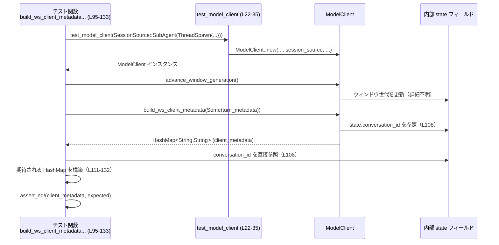
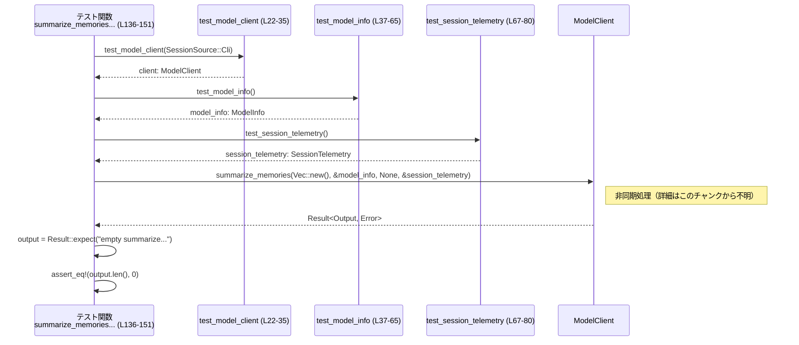

# core/src/client_tests.rs

## 0. ざっくり一言

`ModelClient` と認証テレメトリ (`AuthRequestTelemetryContext`) の挙動を検証するためのテストヘルパー関数と単体テストをまとめたモジュールです（`core/src/client_tests.rs:L22-171`）。

---

## 1. このモジュールの役割

### 1.1 概要

- このモジュールは、クライアント側コンポーネントのうち次の点をテストするために存在します。
  - サブエージェント用 HTTP ヘッダの生成内容（`X_OPENAI_SUBAGENT_HEADER` など）の検証（`L82-92`, `L95-133`）。
  - WebSocket クライアントメタデータ（インストール ID、ウィンドウ ID、親スレッド ID、ターンメタデータ）の検証（`L95-133`）。
  - `summarize_memories` 呼び出し時、空入力に対する戻り値の検証（`L136-151`）。
  - 認証テレメトリコンテキスト (`AuthRequestTelemetryContext`) における認証情報とリトライフェーズの記録の検証（`L154-170`）。
- そのために、テストで共有するフィクスチャ（`test_model_client`, `test_model_info`, `test_session_telemetry`）を提供します（`L22-80`）。

### 1.2 アーキテクチャ内での位置づけ

このファイルは「テスト層」に属し、実装本体（親モジュールや外部クレート）に依存して振る舞いを検証する立場です。依存関係を簡略化して示すと次のようになります。

```mermaid
graph TD
    subgraph "このモジュール (core/src/client_tests.rs)"
        A[test_model_client<br/>(L22-35)]
        B[test_model_info<br/>(L37-65)]
        C[test_session_telemetry<br/>(L67-80)]
        T1[build_subagent_headers_sets_other_subagent_label<br/>(L82-92)]
        T2[build_ws_client_metadata_includes_window_lineage_and_turn_metadata<br/>(L95-133)]
        T3[summarize_memories_returns_empty_for_empty_input<br/>(L136-151)]
        T4[auth_request_telemetry_context_tracks_attached_auth_and_retry_phase<br/>(L154-170)]
    end

    subgraph "親モジュール (super, 定義位置はこのチャンクでは不明)"
        MC[ModelClient]
        ATC[AuthRequestTelemetryContext]
        PUR[PendingUnauthorizedRetry]
        URE[UnauthorizedRecoveryExecution]
        H1[X_OPENAI_SUBAGENT_HEADER 他 各種ヘッダ定数]
    end

    subgraph "外部クレート"
        CAP[CoreAuthProvider<br/>(codex_api)]
        CAM[AuthMode<br/>(codex_app_server_protocol)]
        MPI[ModelInfo<br/>(codex_protocol)]
        WAPI[WireApi / create_oss_provider_with_base_url<br/>(codex_model_provider_info)]
        ST[SessionTelemetry<br/>(codex_otel)]
        PRT[ThreadId, SessionSource, SubAgentSource<br/>(codex_protocol)]
    end

    A --> MC
    A --> WAPI
    B --> MPI
    C --> ST
    T1 --> A
    T1 --> MC
    T1 --> H1
    T2 --> A
    T2 --> MC
    T2 --> H1
    T2 --> PRT
    T3 --> A
    T3 --> B
    T3 --> C
    T3 --> MC
    T4 --> ATC
    T4 --> PUR
    T4 --> URE
    T4 --> CAP
    T4 --> CAM
```

- **上向き依存**のみがあり、このモジュールを他から参照するコードはありません（テスト専用）。
- ネットワーク呼び出しや I/O の有無は、`ModelClient` 等の実装がこのチャンクには現れないため不明です。

### 1.3 設計上のポイント

コードから読み取れる設計上の特徴をまとめます。

- **テストフィクスチャの共通化**
  - `test_model_client`, `test_model_info`, `test_session_telemetry` により、複数のテストで共通の初期化ロジックを共有しています（`L22-80`）。
- **テレメトリ・ヘッダの検証に特化**
  - HTTP/WebSocket ヘッダの中身と、認証リトライ時のテレメトリ情報など「メタデータ」の正しさを検証するテストが中心です（`L82-92`, `L95-133`, `L154-170`）。
- **Rust の型とエラー処理を前提にしたテスト**
  - JSON デシリアライズに `serde_json::from_value(...).expect(...)` を用い、スキーマ不整合時にテストが即座にパニックするようになっています（`L38-64`）。
  - `summarize_memories` の結果は `Result` を返す想定で `expect` を使って成功を前提に検証しています（`L142-150`）。
- **非同期テストの利用**
  - `#[tokio::test]` により、非同期メソッド `summarize_memories` のテストを tokio ランタイム上で実行します（`L136-151`）。

---

## 2. 主要な機能一覧（コンポーネントインベントリー）

このファイルに定義されている関数・テスト関数の一覧です。

| 名前 | 種別 | 役割 / 用途 | 根拠 |
|------|------|-------------|------|
| `test_model_client` | ヘルパー関数 | OSS プロバイダと固定インストール ID を使って、テスト用の `ModelClient` を構築する | `core/src/client_tests.rs:L22-35` |
| `test_model_info` | ヘルパー関数 | `ModelInfo` 相当の JSON をデシリアライズしてテスト用モデル情報を作る | `L37-65` |
| `test_session_telemetry` | ヘルパー関数 | `SessionTelemetry` のテスト用インスタンスを構築する | `L67-80` |
| `build_subagent_headers_sets_other_subagent_label` | 単体テスト | `SessionSource::SubAgent(SubAgentSource::Other(..))` のとき、サブエージェントヘッダが期待値になることを検証する | `L82-92` |
| `build_ws_client_metadata_includes_window_lineage_and_turn_metadata` | 単体テスト | WebSocket クライアントメタデータにインストール ID・ウィンドウ ID・サブエージェント種別・親スレッド ID・ターンメタデータが含まれることを検証する | `L95-133` |
| `summarize_memories_returns_empty_for_empty_input` | 非同期単体テスト | `summarize_memories` に空のメモリ一覧を渡したとき、空の結果が返ることを検証する | `L136-151` |
| `auth_request_telemetry_context_tracks_attached_auth_and_retry_phase` | 単体テスト | `AuthRequestTelemetryContext` が認証モード・ヘッダ有無・リトライ情報を正しく記録することを検証する | `L154-170` |

---

## 3. 公開 API と詳細解説

### 3.1 型一覧（構造体・列挙体など）

このファイル自身は新しい型定義を行っていませんが、テスト対象として重要な外部型が複数登場します。

| 名前 | 種別 | 定義場所（推測されるクレート / モジュール） | このファイルでの役割 / 用途 | 根拠 |
|------|------|------------------------------------------|-----------------------------|------|
| `ModelClient` | 構造体（と考えられる） | 親モジュール（`super`） | モデル API へのアクセスと、ヘッダ・メタデータ生成、`summarize_memories` 実行の対象 | `L2`, `L24`, `L87`, `L105`, `L107`, `L143` |
| `AuthRequestTelemetryContext` | 構造体 | 親モジュール（`super`） | 認証リクエストに関するテレメトリ（モード、ヘッダ、リトライ情報）を保持 | `L1`, `L156`, `L165-170` |
| `PendingUnauthorizedRetry` | 型（構造体など） | 親モジュール（`super`） | 401 応答後のリトライ情報を表すヘルパーとして `AuthRequestTelemetryContext` に渡される | `L3`, `L159` |
| `UnauthorizedRecoveryExecution` | 構造体 | 親モジュール（`super`） | リカバリモードとフェーズ（例: `"managed"`, `"refresh_token"`）を表現 | `L4`, `L159-162` |
| 各種 `X_*` 定数 | `&'static str` などの定数 | 親モジュール（`super`） | HTTP / WebSocket ヘッダ名の定数（インストール ID, 親スレッド ID, ウィンドウ ID, ターンメタデータ, サブエージェント名） | `L5-9`, `L89`, `L113`, `L117`, `L121`, `L125`, `L129` |
| `SessionTelemetry` | 構造体 | `codex_otel` クレート | セッション関連のテレメトリ（スレッド ID、モデル名、起動元など） | `L14`, `L67-79` |
| `ModelInfo` | 構造体 | `codex_protocol::openai_models` | モデルに関するメタデータ（コンテキスト長など）を保持し、`summarize_memories` に渡される | `L16`, `L37-65`, `L139`, `L145` |
| `SessionSource` | 列挙体 | `codex_protocol::protocol` | セッションの起点（CLI / サブエージェントなど）を表す | `L17`, `L22`, `L78`, `L84`, `L97`, `L138` |
| `SubAgentSource` | 列挙体 | `codex_protocol::protocol` | サブエージェントの種別（`Other`, `ThreadSpawn` など）を表す | `L18`, `L84-85`, `L97-103` |
| `CoreAuthProvider` | 構造体 | `codex_api` | 認証情報（アクセストークン、ワークスペース ID など）を提供するテスト用プロバイダ | `L10`, `L158` |
| `AuthMode` | 列挙体 | `codex_app_server_protocol` | 認証モード（`Chatgpt` など）を表現 | `L11`, `L156-157` |
| `ThreadId` | 型 | `codex_protocol` | スレッド（会話）の ID を表現し、クライアントやテレメトリの識別に使用 | `L15`, `L26`, `L68`, `L96`, `L108`, `L125-127` |

> これらの型の詳細なフィールドやメソッドは、このチャンクには定義がないため不明です。

---

### 3.2 関数詳細

7 つすべての関数について、テンプレートに沿って説明します。

---

#### `test_model_client(session_source: SessionSource) -> ModelClient`

**概要**

- 与えられた `SessionSource` を持つテスト用 `ModelClient` インスタンスを構築します（`L22-35`）。
- OSS プロバイダを `https://example.com/v1` という固定ベース URL で初期化し（`L23`）、固定のインストール ID を使用します（`L27`）。

**引数**

| 引数名 | 型 | 説明 | 根拠 |
|--------|----|------|------|
| `session_source` | `SessionSource` | クライアントセッションの起点（CLI、サブエージェントなど）を指定 | `L22`, `L29` |

**戻り値**

- 型: `ModelClient`  
- `ModelClient::new` の戻り値をそのまま返します（`L24-34`）。

**内部処理の流れ**

1. `create_oss_provider_with_base_url("https://example.com/v1", WireApi::Responses)` で、レスポンス API 用の OSS プロバイダを生成する（`L23`）。
2. `ModelClient::new` を次の引数で呼び出す（`L24-34`）。
   - `auth_manager`: `None`（認証マネージャ非注入）
   - `thread_id`: `ThreadId::new()`（新規スレッド ID、`L26`）
   - `installation_id`: 固定 UUID 文字列 `"1111...1111"` を `String` として渡す（`L27`）。
   - `provider`: 上で生成した OSS プロバイダ（`L28`）。
   - `session_source`: 呼び出し元から渡された値（`L29`）。
   - 残りのオプション値・フラグはすべて `None` / `false`（`L30-33`）。
3. 生成された `ModelClient` を返す（`L34-35`）。

**Examples（使用例）**

テストと同様の使い方です。

```rust
// CLI からのセッションとして ModelClient を作成する例
let client = test_model_client(SessionSource::Cli); // L22-35

// サブエージェントとしてのセッション
let client = test_model_client(SessionSource::SubAgent(
    SubAgentSource::Other("memory_consolidation".to_string()),
));
```

**Errors / Panics**

- この関数内では `expect` や `unwrap` は使用していません。
- `ModelClient::new` 自体がどのような条件でパニックやエラーを起こすかは、このチャンクには現れないため不明です。

**Edge cases（エッジケース）**

- `session_source` にどのバリアントを渡しても、そのまま `ModelClient::new` に引き渡されるだけで、この関数内での分岐はありません（`L29`）。

**使用上の注意点**

- ベース URL に `"https://example.com/v1"` を使用しているため、実運用のクライアントを作る用途には適切ではなく、テスト専用のヘルパーとみなすのが自然です（`L23`）。
- 認証マネージャが `None` のため、認証付き API 呼び出しが必要なテストには別の構築方法が必要になる可能性があります。

---

#### `test_model_info() -> ModelInfo`

**概要**

- `ModelInfo` 型に対応する JSON を `serde_json::from_value` でデシリアライズし、テスト用のモデル情報を構築します（`L37-65`）。

**引数**

- 引数はありません。

**戻り値**

- 型: `ModelInfo`  
- JSON からデシリアライズした `ModelInfo` を返します。

**内部処理の流れ**

1. `json!({...})` マクロでモデル情報の JSON オブジェクトを構築する（`L38-62`）。
2. `serde_json::from_value` で `ModelInfo` 型にデシリアライズする（`L38`）。
3. `.expect("deserialize test model info")` により、デシリアライズ失敗時にはテストをパニックさせる（`L63-64`）。

**Examples（使用例）**

```rust
// テスト用の ModelInfo を作成する
let model_info = test_model_info(); // L37-65

// そのまま summarize_memories 等に渡す
let result = client
    .summarize_memories(Vec::new(), &model_info, None, &session_telemetry)
    .await?;
```

**Errors / Panics**

- JSON スキーマと `ModelInfo` 型定義の整合性が取れていない場合、`serde_json::from_value` が `Err` を返し、それに対する `.expect(...)` によりパニックします（`L63-64`）。

**Edge cases（エッジケース）**

- `ModelInfo` 型のフィールドが将来変更されると、この固定 JSON が適合しなくなり、テストがコンパイルは通るが実行時に失敗する可能性があります。

**使用上の注意点**

- 本関数はテスト用であり、実運用では動的に取得した `ModelInfo` を使うことが想定されます。
- デシリアライズ失敗時は即座にパニックするため、テストとしては妥当ですが、ライブラリコードでは `Result` を返す設計の方が一般的です。

---

#### `test_session_telemetry() -> SessionTelemetry`

**概要**

- `SessionTelemetry::new` を用いて、テスト用のテレメトリオブジェクトを構築します（`L67-80`）。

**引数**

- 引数はありません。

**戻り値**

- 型: `SessionTelemetry`  
- `ThreadId` やモデル名 `"gpt-test"`、起動元 `"test-originator"` を埋め込んだテレメトリを返します（`L68-79`）。

**内部処理の流れ**

1. `ThreadId::new()` で新しいスレッド ID を生成する（`L69`）。
2. モデル名や UI 名として `"gpt-test"` を使用する（`L70-71`）。
3. `account_id`, `account_email`, `auth_mode` は `None` とし、匿名的なテストセッションとする（`L72-75`）。
4. 起動元 `"test-originator"` と端末 `"test-terminal"` を固定文字列で設定（`L75`, `L77`）。
5. `SessionSource::Cli` を渡して CLI セッションとして扱う（`L78`）。

**Examples（使用例）**

```rust
// テスト用テレメトリの作成
let session_telemetry = test_session_telemetry(); // L67-80

// summarize_memories に渡す
let result = client
    .summarize_memories(Vec::new(), &model_info, None, &session_telemetry)
    .await?;
```

**Errors / Panics**

- この関数内には `expect` や `unwrap` はなく、`SessionTelemetry::new` がどのような条件でパニックしうるかはこのチャンクからは分かりません。

**Edge cases**

- `SessionTelemetry::new` の仕様によっては、フィールドに `None` を許容しない場合にパニックが起こり得ますが、その可否は不明です。

**使用上の注意点**

- ここで指定されているフィールド値は固定のテスト用であり、実運用では実際のアカウントや端末情報に置き換える必要があります。

---

#### `build_subagent_headers_sets_other_subagent_label()`

**概要**

- `SessionSource::SubAgent(SubAgentSource::Other("memory_consolidation"))` を持つクライアントで `build_subagent_headers` を呼んだ際、`X_OPENAI_SUBAGENT_HEADER` に `"memory_consolidation"` が設定されることを検証するテストです（`L82-92`）。

**引数**

- 引数はありません（テスト関数）。

**戻り値**

- 戻り値は `()`（ユニット型）で、アサーションがすべて通れば成功です。

**内部処理の流れ**

1. `test_model_client(SessionSource::SubAgent(SubAgentSource::Other("memory_consolidation".to_string())))` によりクライアントを構築（`L84-86`）。
2. `client.build_subagent_headers()` を呼び出してヘッダマップを取得（`L87`）。
3. `headers.get(X_OPENAI_SUBAGENT_HEADER)` でサブエージェントヘッダ値を取り出し、`to_str().ok()` で `Option<&str>` に変換（`L88-90`）。
4. `assert_eq!(value, Some("memory_consolidation"))` で期待値との一致を検証（`L91`）。

**Examples（使用例）**

このテスト自体が使用例になっています。

```rust
let client = test_model_client(SessionSource::SubAgent(
    SubAgentSource::Other("memory_consolidation".to_string()),
));
let headers = client.build_subagent_headers();
let value = headers
    .get(X_OPENAI_SUBAGENT_HEADER)
    .and_then(|value| value.to_str().ok());
assert_eq!(value, Some("memory_consolidation"));
```

**Errors / Panics**

- `assert_eq!` が失敗するとテストはパニックします（`L91`）。
- `headers.get(...)` が `None` を返した場合、`value` は `None` となり、アサーション失敗となります。
- `to_str()` がエラーを返した場合も `.ok()` により `None` となり、同様にテスト失敗になります（UTF-8 で無いヘッダ値など）。

**Edge cases**

- サブエージェントの文字列に非 ASCII 文字を含めた場合のエンコード・デコード挙動は、このチャンクでは検証されていません。
- `SessionSource` が他のバリアント（`Cli` など）の場合にサブエージェントヘッダがどうなるかは、このテストからは分かりません。

**使用上の注意点**

- テストの意図からは、「サブエージェントのラベルは `SubAgentSource::Other` の引数と一致する必要がある」という契約が `build_subagent_headers` に課されていると解釈できます（コード上の根拠は `L84-91`）。
- 実装側でヘッダ名の定数（`X_OPENAI_SUBAGENT_HEADER`）を変更した場合、このテストも同様に更新する必要があります。

---

#### `build_ws_client_metadata_includes_window_lineage_and_turn_metadata()`

**概要**

- WebSocket クライアントメタデータが、インストール ID・ウィンドウ ID（会話 ID + ウィンドウ世代）・サブエージェント種別・親スレッド ID・ターンメタデータを含むことを検証するテストです（`L95-133`）。

**引数**

- 引数はありません。

**戻り値**

- 戻り値は `()` で、アサーション成功でテスト成功です。

**内部処理の流れ**

1. `ThreadId::new()` で親スレッド ID を生成（`L96`）。
2. `SessionSource::SubAgent(SubAgentSource::ThreadSpawn { ... })` を用いてクライアントを構築（`L97-103`）。
3. `client.advance_window_generation()` を呼び出してウィンドウ世代を進める（`L105`）。  
   - `advance_window_generation` の内部実装は不明ですが、少なくとも次の `build_ws_client_metadata` の出力に影響すると想定されます。
4. `client.build_ws_client_metadata(Some(r#"{"turn_id":"turn-123"}"#))` を呼び出してメタデータマップを取得（`L107`）。
5. `client.state.conversation_id` を読み出し、会話 ID を取得（`L108`）。
6. `HashMap::from([...])` で期待されるメタデータマップを作成し（`L111-132`）、`assert_eq!` で比較（`L109-133`）。

**Examples（使用例）**

```rust
let parent_thread_id = ThreadId::new();
let client = test_model_client(SessionSource::SubAgent(SubAgentSource::ThreadSpawn {
    parent_thread_id,
    depth: 2,
    agent_path: None,
    agent_nickname: None,
    agent_role: None,
}));

client.advance_window_generation();

let client_metadata = client.build_ws_client_metadata(Some(r#"{"turn_id":"turn-123"}"#));
let conversation_id = client.state.conversation_id;

assert_eq!(
    client_metadata,
    std::collections::HashMap::from([
        (X_CODEX_INSTALLATION_ID_HEADER.to_string(),
         "11111111-1111-4111-8111-111111111111".to_string()),
        (X_CODEX_WINDOW_ID_HEADER.to_string(), format!("{conversation_id}:1")),
        (X_OPENAI_SUBAGENT_HEADER.to_string(), "collab_spawn".to_string()),
        (X_CODEX_PARENT_THREAD_ID_HEADER.to_string(), parent_thread_id.to_string()),
        (X_CODEX_TURN_METADATA_HEADER.to_string(), r#"{"turn_id":"turn-123"}"#.to_string()),
    ])
);
```

**Errors / Panics**

- `assert_eq!` のいずれかのフィールドが異なればテストはパニックします（`L109-133`）。
- `client.build_ws_client_metadata` がエラーを返す設計であれば、このテストではそれを受け取る手段が無いため、パニックや `Result::unwrap` などが内部で発生する可能性がありますが、このチャンクからは不明です。

**Edge cases**

- `advance_window_generation` を呼び出さなかった場合に `X_CODEX_WINDOW_ID_HEADER` がどうなるかは、このテストからは分かりません。
- `turn_metadata` を `None` で渡した場合の挙動も未検証です（このテストでは `Some(...)` のみを確認しています, `L107`）。

**使用上の注意点**

- ウィンドウ ID は `"conversation_id:1"` のように、会話 ID とウィンドウ世代が結合された形式を期待していることがわかります（`L117-119`）。
- サブエージェントヘッダ値 `"collab_spawn"` は、`SubAgentSource::ThreadSpawn` に対応するラベルであると考えられます（`L121-123`）。

---

#### `summarize_memories_returns_empty_for_empty_input()`

**概要**

- `summarize_memories` に空のメモリ一覧 (`Vec::new()`) を渡した場合、結果が空 (`len() == 0`) であることを非同期に検証するテストです（`L136-151`）。

**引数**

- 引数はありません（`#[tokio::test]` 付きの非同期テスト）。

**戻り値**

- 戻り値は `()` であり、アサーションが成功すればテスト成功です。

**内部処理の流れ**

1. `test_model_client(SessionSource::Cli)` で CLI セッションとしてのクライアントを構築（`L138`）。
2. `test_model_info()` でモデル情報を構築（`L139`）。
3. `test_session_telemetry()` でテレメトリを構築（`L140`）。
4. `client.summarize_memories(Vec::new(), &model_info, None, &session_telemetry)` を `await` で実行し、その `Result` に対して `.expect("empty summarize request should succeed")` を呼び、エラーを許容しない（`L142-150`）。
5. 返ってきた `output` の `len()` が 0 であることを `assert_eq!` で検証（`L151`）。

**Examples（使用例）**

```rust
#[tokio::test]
async fn summarize_memories_returns_empty_for_empty_input() {
    let client = test_model_client(SessionSource::Cli);
    let model_info = test_model_info();
    let session_telemetry = test_session_telemetry();

    let output = client
        .summarize_memories(
            Vec::new(),         // 空のメモリ一覧
            &model_info,        // モデル情報
            None,               // effort は指定なし
            &session_telemetry, // テレメトリ
        )
        .await
        .expect("empty summarize request should succeed");
    assert_eq!(output.len(), 0);
}
```

**Errors / Panics**

- `summarize_memories` が `Err` を返した場合、`.expect(...)` によりテストはパニックします（`L149-150`）。
- `output` が `Vec` 以外の型である場合、このコードはコンパイル時にエラーになるため、`output.len()` は `Vec` を前提としています（`L151`）。

**Edge cases**

- 空でないメモリ一覧に対する挙動や、`effort` を `Some(...)` で渡した場合の挙動は、このテストでは検証されていません。
- `summarize_memories` が内部で非同期 I/O（ネットワーク等）を行うかどうかは、このチャンクからは分かりません。

**使用上の注意点（非同期・並行性）**

- `#[tokio::test]` 属性により、テスト関数は tokio ランタイム上で実行されます（`L136`）。  
  非同期関数を呼び出すには、このようにランタイムの中で `.await` を使う必要があります。
- 実際のアプリケーションで `summarize_memories` を呼び出す際にも、tokio などの非同期ランタイム上で実行する前提となる可能性があります。

---

#### `auth_request_telemetry_context_tracks_attached_auth_and_retry_phase()`

**概要**

- `AuthRequestTelemetryContext::new` が、認証モード・認証ヘッダの有無・401 後のリトライ情報を正しくフィールドに反映することを検証するテストです（`L154-170`）。

**引数**

- 引数はありません。

**戻り値**

- 戻り値は `()` です。

**内部処理の流れ**

1. `Some(AuthMode::Chatgpt)` を認証モードとして準備（`L156-157`）。
2. `CoreAuthProvider::for_test(Some("access-token"), Some("workspace-123"))` を使ってテスト用認証プロバイダを生成（`L158`）。
3. `PendingUnauthorizedRetry::from_recovery(UnauthorizedRecoveryExecution { mode: "managed", phase: "refresh_token" })` によってリトライ情報を構築（`L159-162`）。
4. 上記 3 つを渡して `AuthRequestTelemetryContext::new(...)` を呼び出し、結果を `auth_context` に格納（`L156-163`）。
5. 次のフィールドをアサーションで検証（`L165-170`）。
   - `auth_mode == Some("Chatgpt")`
   - `auth_header_attached == true`
   - `auth_header_name == Some("authorization")`
   - `retry_after_unauthorized == true`
   - `recovery_mode == Some("managed")`
   - `recovery_phase == Some("refresh_token")`

**Examples（使用例）**

```rust
let auth_context = AuthRequestTelemetryContext::new(
    Some(AuthMode::Chatgpt),
    &CoreAuthProvider::for_test(Some("access-token"), Some("workspace-123")),
    PendingUnauthorizedRetry::from_recovery(UnauthorizedRecoveryExecution {
        mode: "managed",
        phase: "refresh_token",
    }),
);

assert_eq!(auth_context.auth_mode, Some("Chatgpt"));
assert!(auth_context.auth_header_attached);
assert_eq!(auth_context.auth_header_name, Some("authorization"));
assert!(auth_context.retry_after_unauthorized);
assert_eq!(auth_context.recovery_mode, Some("managed"));
assert_eq!(auth_context.recovery_phase, Some("refresh_token"));
```

**Errors / Panics**

- いずれかのアサーションが失敗するとテストはパニックします（`L165-170`）。
- `AuthRequestTelemetryContext::new` や `CoreAuthProvider::for_test` が内部でパニックする条件は、このチャンクからは分かりません。

**Edge cases**

- `auth_mode` を `None` にした場合や、`PendingUnauthorizedRetry` を渡さない場合（`None` 相当）は、このテストでは扱われておらず、挙動は不明です。
- 認証ヘッダ名が常に `"authorization"` 固定であるのか、可変であるのかは、このテストだけでは判断できません。

**使用上の注意点**

- テストの意図から、「テレメトリコンテキストは認証モード値を文字列（例: `"Chatgpt"`）として保持する」「401 後のリトライ有無や、リカバリモード/フェーズを追跡する」といった契約があると解釈できます（`L165-170`）。
- 本テストでは `CoreAuthProvider::for_test` を使っているため、実運用コードでは別のコンストラクタや設定を使う必要があります。

---

### 3.3 その他の関数

- このファイルには、上記 7 つ以外の関数は定義されていません。

---

## 4. データフロー

ここでは代表的な 2 つの処理シナリオについて、データフローを説明します。

### 4.1 WebSocket クライアントメタデータ生成のフロー

`build_ws_client_metadata_includes_window_lineage_and_turn_metadata (L95-133)` におけるデータの流れです。



- **要点**
  - テストは `ModelClient` のメソッド `advance_window_generation` と `build_ws_client_metadata` を連続して呼び出し、その結果が内部状態 (`state.conversation_id`) と整合しているかを確認しています。
  - `turn_metadata` は JSON 文字列としてそのままヘッダ値に利用されます（`L107`, `L129-131`）。

### 4.2 `summarize_memories` 空入力のフロー（非同期）



- **要点**
  - 空のメモリ一覧を渡した場合、`summarize_memories` が成功し、結果が空であるという契約を検証しています（`L142-151`）。
  - 非同期処理の具体的な内容（例えば API 呼び出しの有無）は `ModelClient` の実装に依存し、このチャンクからは分かりません。

---

## 5. 使い方（How to Use）

このファイルはテストコードですが、実装の利用例としても参考になります。

### 5.1 基本的な使用方法

#### `ModelClient` を用いた `summarize_memories` 呼び出しの例

```rust
use codex_model_provider_info::{WireApi, create_oss_provider_with_base_url};
use codex_protocol::protocol::{SessionSource};
use codex_protocol::openai_models::ModelInfo;
use codex_otel::SessionTelemetry;

// テストコードと同様に ModelClient を構築する
let client = test_model_client(SessionSource::Cli); // core/src/client_tests.rs:L22-35

// モデル情報とテレメトリを用意する
let model_info: ModelInfo = test_model_info();          // L37-65
let session_telemetry: SessionTelemetry = test_session_telemetry(); // L67-80

// 非同期コンテキスト（tokioランタイム）内で summarize_memories を呼び出す
let output = client
    .summarize_memories(
        Vec::new(),           // メモリ一覧（ここでは空）
        &model_info,          // モデル情報
        None,                 // 努力度 (effort) は指定なし
        &session_telemetry,   // テレメトリ
    )
    .await
    .expect("empty summarize request should succeed");

// output は Vec 相当のコレクションであることが暗黙に期待されている（L151）
println!("summarize_memories returned {} items", output.len());
```

- テストコードと同様、tokio ランタイム上で `.await` する必要があります（`L136-151`）。

### 5.2 よくある使用パターン

1. **サブエージェントヘッダの生成**

```rust
// サブエージェント "memory_consolidation" としてクライアントを構築
let client = test_model_client(SessionSource::SubAgent(
    SubAgentSource::Other("memory_consolidation".to_string()),
));

let headers = client.build_subagent_headers();
let subagent = headers
    .get(X_OPENAI_SUBAGENT_HEADER)
    .and_then(|v| v.to_str().ok());

assert_eq!(subagent, Some("memory_consolidation"));
```

- サブエージェント用ラベルがヘッダに反映されることを前提にしています（`L84-91`）。

1. **WebSocket クライアントメタデータの構築**

```rust
let parent_thread_id = ThreadId::new();
let client = test_model_client(SessionSource::SubAgent(SubAgentSource::ThreadSpawn {
    parent_thread_id,
    depth: 2,
    agent_path: None,
    agent_nickname: None,
    agent_role: None,
}));

client.advance_window_generation();

let metadata = client.build_ws_client_metadata(Some(r#"{"turn_id":"turn-123"}"#));
let conversation_id = client.state.conversation_id;

assert_eq!(
    metadata.get(&X_CODEX_WINDOW_ID_HEADER.to_string()),
    Some(&format!("{conversation_id}:1"))
);
```

- ウィンドウ ID に世代番号 `1` が付与される点が重要です（`L117-119`）。

1. **認証テレメトリコンテキストの生成**

```rust
let auth_context = AuthRequestTelemetryContext::new(
    Some(AuthMode::Chatgpt),
    &CoreAuthProvider::for_test(Some("access-token"), Some("workspace-123")),
    PendingUnauthorizedRetry::from_recovery(UnauthorizedRecoveryExecution {
        mode: "managed",
        phase: "refresh_token",
    }),
);

// テレメトリに反映されるフィールドを確認
assert_eq!(auth_context.auth_mode, Some("Chatgpt"));
assert!(auth_context.auth_header_attached);
```

- リトライのモードとフェーズも追跡されます（`L159-162`, `L169-170`）。

### 5.3 よくある間違いと注意点（推測を含まない範囲）

コードから直接読み取れる範囲で、誤用しやすい点を挙げます。

```rust
// 誤りの可能性: 非同期関数を同期コンテキストで呼ぶ
// let output = client.summarize_memories(Vec::new(), &model_info, None, &session_telemetry);
// ↑ このように .await せずに呼ぶとコンパイルエラーになる

// 正しいパターン（テストコードと同様）
let output = client
    .summarize_memories(Vec::new(), &model_info, None, &session_telemetry)
    .await
    .expect("empty summarize request should succeed"); // L142-150
```

- `summarize_memories` は `async` 関数であるため、`.await` が必須です。
- テストでは `#[tokio::test]` でランタイムを準備しており（`L136`）、同様の環境が必要になります。

```rust
// 誤りの可能性: サブエージェントでない SessionSource に対して
// サブエージェントヘッダを期待してしまう
let client = test_model_client(SessionSource::Cli);
let headers = client.build_subagent_headers();
let value = headers
    .get(X_OPENAI_SUBAGENT_HEADER)
    .and_then(|v| v.to_str().ok());

// この挙動はテストでは検証されていないため、value が None になる可能性がある
```

- コードから読み取れるのは、「`SubAgentSource::Other("memory_consolidation")` の場合にはヘッダが設定される」ことだけであり、それ以外のケースを同様に扱うと期待するのは危険です（`L84-91`）。

### 5.4 使用上の注意点（まとめ）

- **エラー処理**
  - `test_model_info` と `summarize_memories` のテストはいずれも `expect` を用いており、失敗時はパニックします（`L63-64`, `L149-150`）。  
    ライブラリとして使用する際には、`Result` を呼び出し側で扱う形にすることが望ましいです。
- **非同期・並行性**
  - `summarize_memories` のテストは tokio ランタイムを前提としています（`L136`）。  
    並行に複数のテストを走らせる場合も、tokio の同時実行モデルに依存します。
- **テスト依存の固定値**
  - ベース URL やインストール ID、モデル名などはテスト用の固定値であり、実運用コードにそのまま流用しないほうが安全です（`L23`, `L27`, `L70-71`）。

---

## 6. 変更の仕方（How to Modify）

### 6.1 新しい機能（テストケース）を追加する場合

1. **対象機能の特定**
   - 例: `ModelClient` に新しいヘッダを付与する機能が追加された場合、その機能のメソッド（例えば `build_new_headers`）を親モジュール側で確認します（親モジュールのファイル名はこのチャンクからは不明）。

2. **フィクスチャの再利用**
   - `test_model_client`, `test_model_info`, `test_session_telemetry` を再利用して、新しいテスト用クライアントやモデル情報、テレメトリを構築します（`L22-80`）。

3. **テスト関数の追加**
   - 本ファイル末尾に `#[test]` または `#[tokio::test]` 付きの関数を追加し、期待される出力や副作用を `assert_*` マクロで検証します。

4. **依存関係の更新**
   - 親モジュール側で新しい定数や型を追加した場合は、`use super::...;` や外部クレートの `use` 宣言を必要に応じて追加します（`L1-20` を参考）。

### 6.2 既存の機能（テスト）の変更時の注意点

- **`ModelClient::new` のシグネチャ変更**
  - 引数が増減した場合、`test_model_client` 内の呼び出し（`L24-34`）を更新する必要があります。
  - この関数に依存するすべてのテスト（`L82-92`, `L95-133`, `L136-151`）に影響します。

- **ヘッダ名定数の変更**
  - `X_OPENAI_SUBAGENT_HEADER` 等の定数名や意味が変わった場合、比較対象のキー名をすべて更新する必要があります（`L89`, `L113`, `L117`, `L121`, `L125`, `L129`）。

- **`AuthRequestTelemetryContext` のフィールド変更**
  - テストが直接フィールドを参照しているため（`L165-170`）、フィールド名や型が変わるとテストも合わせて修正する必要があります。

- **テストの契約（前提条件）の維持**
  - 例えば「空のメモリ一覧に対して空の結果を返す」という契約を変更する場合、仕様変更としてこのテストを更新するか、別テストとして扱うかを検討する必要があります（`L142-151`）。

---

## 7. 関連ファイル

このモジュールと密接に関係しそうなファイル・コンポーネントを一覧化します。

| パス / モジュール | 役割 / 関係 | 根拠 |
|-------------------|------------|------|
| 親モジュール (`super`, 具体的ファイルパスは不明) | `ModelClient`, `AuthRequestTelemetryContext`, `PendingUnauthorizedRetry`, `UnauthorizedRecoveryExecution`, 各種 `X_*` ヘッダ定数の実装本体を提供する | `L1-9`, `L22-35`, `L82-133`, `L154-170` |
| クレート `codex_model_provider_info` | `create_oss_provider_with_base_url`, `WireApi` を提供し、`ModelClient` 向けプロバイダを構築する | `L12-13`, `L23` |
| クレート `codex_protocol` | `ThreadId`, `ModelInfo`, `SessionSource`, `SubAgentSource` を提供し、モデル・セッション識別子を表す | `L15-18`, `L37-65`, `L96-103` |
| クレート `codex_otel` | `SessionTelemetry` を提供し、テレメトリ情報の生成に使われる | `L14`, `L67-80` |
| クレート `codex_api` | `CoreAuthProvider` を提供し、テスト用認証プロバイダ構築に利用される | `L10`, `L158` |
| クレート `codex_app_server_protocol` | `AuthMode` を提供し、認証モードの指定に利用される | `L11`, `L156-157` |
| クレート `serde_json` | `json!` マクロと `from_value` により `ModelInfo` のテストデータを構築・デシリアライズ | `L20`, `L37-65` |
| クレート `pretty_assertions` | `assert_eq` を提供し、差分が見やすい形でのアサーションに使用される | `L19`, `L91`, `L109`, `L151`, `L165-170` |
| クレート `tokio` | `#[tokio::test]` マクロを提供し、非同期テストの実行環境を提供する | `L136` |

---

### Bugs / Security に関するコメント（このチャンクから分かる範囲）

- **バグの可能性**
  - このファイル内には、明らかなロジックバグは見当たりません。テストの期待値と入力が一致しており、すべて型安全な記述になっています。
  - 将来的に型やフィールドが変更された場合にテストがコンパイルは通るが実行時に失敗する可能性（特に `test_model_info` の JSON と `ModelInfo` のスキーマ差異）はあります（`L37-65`）。

- **セキュリティ**
  - テスト用のアクセストークン `"access-token"` や `"workspace-123"` はダミー値であり、実際の秘密情報は含まれていません（`L158`）。
  - ベース URL も `https://example.com` となっており、実運用のエンドポイントは含まれていません（`L23`）。

このため、このファイル単体から重大なセキュリティ上の懸念は読み取れません。
