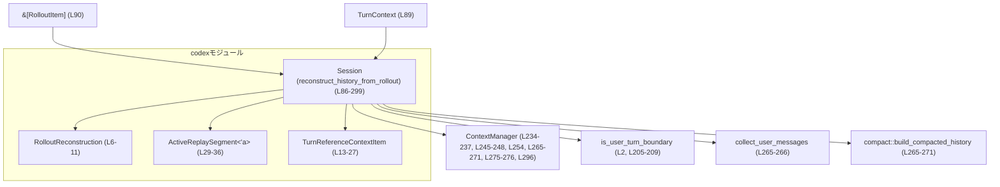
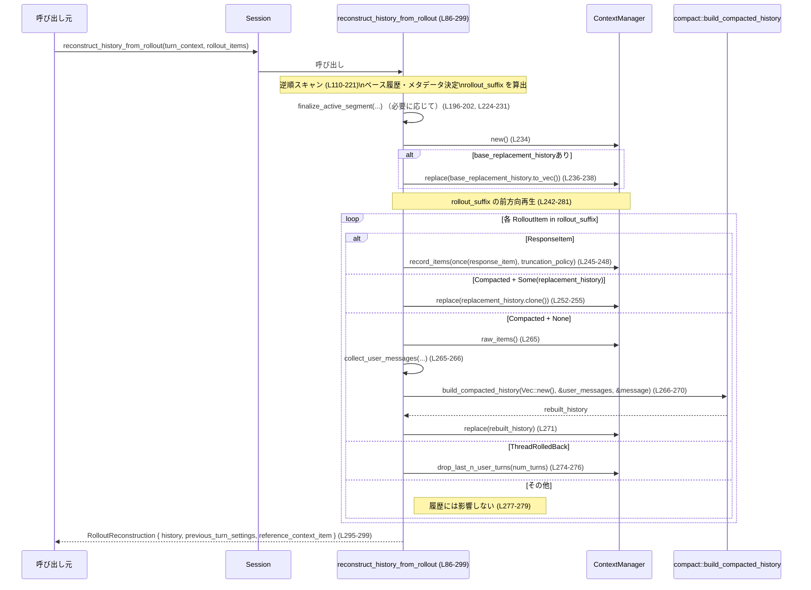

# core/src/codex/rollout_reconstruction.rs

## 0. ざっくり一言

セッションのロールアウトログ（`RolloutItem` の列）から、  
「最終的な履歴（`Vec<ResponseItem>`）」と「履歴再開用のメタデータ」を**再構成する処理**をまとめたモジュールです（core/src/codex/rollout_reconstruction.rs:L4-L11, L86-L91）。

---

## 1. このモジュールの役割

### 1.1 概要

- このモジュールは、**セッションのロールアウトログから会話履歴を復元し、再開（resume）やフォーク用のメタデータを得る問題**を解決するために存在し、  
  `Session::reconstruct_history_from_rollout` という非同期メソッドを提供します（L86-L91）。
- 復元結果は `RolloutReconstruction` 構造体にまとめられ、履歴本体と「前回ターンの設定」「参照用コンテキストアイテム」が含まれます（L6-L11, L295-L299）。

### 1.2 アーキテクチャ内での位置づけ

このファイルのコードから見える主な依存関係は以下です。

- `Session` 型のメソッドとして `reconstruct_history_from_rollout` が実装されている（L86-L91）。
- ロールアウトソース: `&[RolloutItem]`（L90）。
- 履歴構築: `ContextManager`（`ContextManager::new`, `replace`, `record_items`, `raw_items`, `drop_last_n_user_turns` を使用）（L234-L237, L245-L248, L254, L265-L271, L275-276, L296）。
- コンテキスト判定: `is_user_turn_boundary`（ユーザターン境界判定ヘルパ）（L2, L205-L209）。
- ロールバックイベント: `EventMsg::ThreadRolledBack` と `history.drop_last_n_user_turns`（L130-L133, L274-L276）。
- コンパクション（履歴の圧縮）: `RolloutItem::Compacted` と `compact::build_compacted_history`（L112-L128, L250-L273, L265-L271）。
- ユーザメッセージ抽出: `collect_user_messages`（L265-L266）。

依存関係の概略を Mermaid 図で表すと次のようになります。



### 1.3 設計上のポイント

コードから読み取れる設計上の特徴です。

- **逆順スキャン + 前方向再生の二段階構成**  
  - まずロールアウト全体を**新しい順（逆順）**にスキャンして、  
    - 「どのコンパクションチェックポイントを履歴のベースとするか」  
    - 「最新の有効な `previous_turn_settings`」  
    - 「再開に使う `TurnContextItem`（またはそのクリア情報）」  
    を決定し、`rollout_suffix`（そのベース以降の部分スライス）を求めます（L97-L108, L110-L221）。
  - 次に `rollout_suffix` を **古い順（前方向）**に再生して、`ContextManager` を用いて最終履歴を構築します（L234-L281）。
- **アクティブなリプレイ区間のモデル化**  
  - 逆順スキャン中の「1ターン分の区間」を `ActiveReplaySegment` 構造体としてまとめています（L29-L36）。
  - 区間は `TurnStarted` を見つけた時点で「1ターン分が確定」し、`finalize_active_segment` でグローバル情報に反映されます（L187-L203, L43-L84）。
- **ターン基準のロールバック**  
  - `ThreadRolledBack(num_turns)` イベントは「最新のユーザターンを N 個削除」という意味として扱われます（コメント L100-L102, 実処理 L130-L133, L50-L58）。
  - 逆順スキャン中は `pending_rollback_turns` を使い、「次に確定する N 個のユーザターン区間をスキップする」という形で実装されています（L50-L58, L100-L103, L130-L133）。
- **コンテキスト基準の参照情報管理**  
  - `TurnReferenceContextItem` で「コンテキストがまだ無い / クリアされた / 最新のベース」が3値で表現されます（L13-L27）。
  - コンパクションで古いベースはクリアされ、新しい `TurnContextItem` で再設定されます（L112-L122, L162-L185, L73-L83）。
- **Rust の安全性**  
  - ライフタイム `'a` を使い、`ActiveReplaySegment` 内の `base_replacement_history: Option<&'a [ResponseItem]>` が、元の `rollout_items` のライフタイムを越えて参照しないようにしています（L29-L36, L43-L48, L87-L91, L106-L108）。
  - `usize::saturating_add` と `unwrap_or(usize::MAX)` により、ロールバック回数の加算でオーバーフローや変換エラーによるパニックを避けています（L131-L133）。
  - `unsafe` は一切使われていません（このチャンク全体に `unsafe` キーワードは存在しません）。

---

## 2. 主要な機能一覧

このファイルが提供する主な機能です。

- ロールアウト履歴の再構成: `Session::reconstruct_history_from_rollout` により、`&[RolloutItem]` から `RolloutReconstruction` を構築（L86-L91, L295-L299）。
- ターン区間の集約・確定: `ActiveReplaySegment` と `finalize_active_segment` による、逆順リプレイ中の「1ターン分の区間」の管理とグローバル状態への反映（L29-L36, L43-L84, L187-L203, L224-L231）。
- ターン ID の一致判定: `turn_ids_are_compatible` による、`Option<&str>` 同士の「両方 None か / 少なくとも片方 None か / 両方 Some なら一致」判定（L38-L41, L170-L173, L189-L193）。
- ロールバック・コンパクション・コンテキストイベントを考慮した履歴構築ロジック（L110-L221, L239-L281）。
- 旧形式（`replacement_history` が `None`）のコンパクションに対する、フォールバック的な履歴再構成（L250-L273）。

---

## 3. 公開 API と詳細解説

### 3.1 型一覧（構造体・列挙体など）

#### このファイルで定義されている型

| 名前 | 種別 | 役割 / 用途 | 定義位置 |
|------|------|-------------|----------|
| `RolloutReconstruction` | 構造体 | 再構成済み履歴と再開用メタデータ（前回ターンの設定・参照コンテキスト）をまとめて返すための戻り値型 | core/src/codex/rollout_reconstruction.rs:L6-L11 |
| `TurnReferenceContextItem` | 列挙体 | 逆順リプレイ中における「このリプレイ区間に対応するコンテキストベース」の状態を表す（未設定 / クリア済み / 最新のベース） | L13-L27 |
| `ActiveReplaySegment<'a>` | 構造体 | 逆順リプレイ中の「1ターン分の区間」に対応する一時的な集約情報（ターン ID、ユーザターン判定、前回設定、コンテキストベース、チェックポイントなど） | L29-L36 |

#### このファイル外で定義されていると推測される型（参照のみ）

※ このチャンクには定義がなく、詳細は不明です。役割は名前と利用方法からの推測であり、断定ではありません。

| 名前 | 種別 | 役割 / 用途（推測） | 出現位置 |
|------|------|----------------------|----------|
| `Session` | 構造体 | セッション単位の状態管理とメソッド集 | `impl Session` 宣言から（L86） |
| `TurnContext` | 構造体 | あるターンにおけるモデルやフラグなどのコンテキスト情報 | 引数・フィールド使用から（L89, L174-L177, L245-L248） |
| `RolloutItem` | 列挙体 | ロールアウトログの1要素。`Compacted`, `EventMsg`, `TurnContext`, `SessionMeta`, `ResponseItem` などのバリアントを持つ | パターンマッチから（L110-L211, L242-L280） |
| `EventMsg` | 列挙体 | ロールアウト内のイベント。`ThreadRolledBack`, `TurnComplete`, `TurnAborted`, `UserMessage`, `TurnStarted` などを持つ | L130-L133, L134-L142, L143-L155, L157-L161, L187-L203, L274-L276, L277-L279 |
| `ResponseItem` | 構造体/列挙体 | 実際に履歴として保持されるメッセージ要素 | フィールド・型パラメータから（L8, L35, L97, L205-L209, L245-L248, L265-L266, L296） |
| `PreviousTurnSettings` | 構造体 | あるユーザターンに対応する「モデル」や「リアルタイムフラグ」の設定値 | L9, L33, L46, L68-L71, L174-L177, L295-L298 |
| `TurnContextItem` | 構造体 | `TurnContext` に相当する履歴上のアイテム。`reference_context_item` として保持される | L10, L26, L34, L162-L185, L283-L287 |
| `ContextManager` | 構造体 | 履歴 `Vec<ResponseItem>` の構築・置換・トランケーションなどを行う管理クラス | L234-L237, L245-L248, L254, L265-L271, L275-L276, L296 |
| `compact::build_compacted_history` | 関数 | 旧コンパクション形式から履歴を再構築するユーティリティ | L265-L271 |
| `collect_user_messages` | 関数 | `raw_items` からユーザメッセージを抽出するユーティリティ | L265-L266 |
| `is_user_turn_boundary` | 関数 | `ResponseItem` がユーザターン境界に相当するかどうか判定する | L2, L205-L209 |

### 3.2 関数詳細（3 件）

#### `turn_ids_are_compatible(active_turn_id: Option<&str>, item_turn_id: Option<&str>) -> bool`

**概要**

- 2つのターン ID（どちらも `Option<&str>`）が**「矛盾しないかどうか」**を判定します（L38-L41）。
- 具体的には、「少なくとも片方が `None` なら常に `true`」「両方 `Some` の場合は文字列が等しいときだけ `true`」というロジックです（L39-L40）。

**引数**

| 引数名 | 型 | 説明 |
|--------|----|------|
| `active_turn_id` | `Option<&str>` | 逆順スキャン中のアクティブ区間が持つターン ID（ない場合もある）（L38） |
| `item_turn_id` | `Option<&str>` | 現在処理中のアイテムに付随するターン ID（ない場合もある）（L38） |

**戻り値**

- `bool`  
  - `true`: 両 ID が矛盾しない（片方が `None`、または両方 `Some` かつ等しい）  
  - `false`: 両方 `Some` で、文字列が異なる場合（L39-L40）。

**内部処理の流れ**

1. `active_turn_id.is_none_or(...)` を呼び、`active_turn_id` が `None` なら即 `true`（どんな `item_turn_id` でも互換とみなす）（L39）。
2. `active_turn_id` が `Some(turn_id)` の場合は、`item_turn_id.is_none_or(...)` を評価する（L39-L40）。
3. `item_turn_id` が `None` なら `true`、`Some(item_turn_id)` なら `item_turn_id == turn_id` の結果を返す（L39-L40）。

**Examples（使用例）**

```rust
// &str のターンIDが完全に一致する場合
let active = Some("turn-123");
let item = Some("turn-123");
assert!(turn_ids_are_compatible(active, item)); // true

// どちらか一方が None の場合も互換とみなす
let active = None;
let item = Some("turn-123");
assert!(turn_ids_are_compatible(active, item)); // true

// 両方 Some で不一致なら互換ではない
let active = Some("turn-123");
let item = Some("turn-999");
assert!(!turn_ids_are_compatible(active, item)); // false
```

**Errors / Panics**

- この関数はパニックを起こさず、エラーも返しません（単純な比較のみ; L39-L40）。

**Edge cases（エッジケース）**

- `active_turn_id` も `item_turn_id` も `None` の場合: `true` を返します（`is_none_or` により両方とも許容; L39-L40）。
- 片方 `None` / 片方 `Some`: 常に `true`（L39-L40）。
- 両方 `Some("")`（空文字）: 文字列が等しいため `true`。

**使用上の注意点**

- 「ID が一致しているか」ではなく、「矛盾しないか」を調べる意図の関数です。  
  片方が `None` の場合は常に互換とみなす点に注意が必要です（L39-L40）。

---

#### `finalize_active_segment<'a>(...)`

```rust
fn finalize_active_segment<'a>(
    active_segment: ActiveReplaySegment<'a>,
    base_replacement_history: &mut Option<&'a [ResponseItem]>,
    previous_turn_settings: &mut Option<PreviousTurnSettings>,
    reference_context_item: &mut TurnReferenceContextItem,
    pending_rollback_turns: &mut usize,
)
```

**概要**

- 逆順スキャン中の「1ターン分の区間 (`ActiveReplaySegment`)」を**確定**し、  
  グローバルな集約結果（ベース履歴・前回ターン設定・参照コンテキスト・ロールバック状態）に反映します（L43-L49, L60-L83）。
- ロールバック指示が残っている場合、その区間がユーザターンであれば「削除すべきターン」として扱い、グローバル状態へは反映しません（L50-L58）。

**引数**

| 引数名 | 型 | 説明 |
|--------|----|------|
| `active_segment` | `ActiveReplaySegment<'a>` | 逆順リプレイ中に蓄積してきた最新のターン区間（L43-L48） |
| `base_replacement_history` | `&mut Option<&'a [ResponseItem]>` | 「ベースとなる完全な履歴スナップショット」を指すスライス（まだ未設定の可能性あり）（L45, L60-L66） |
| `previous_turn_settings` | `&mut Option<PreviousTurnSettings>` | 最新のユーザターンが確立した「前回ターンの設定」（未設定ならこの区間で設定するかもしれない）（L46, L68-L71） |
| `reference_context_item` | `&mut TurnReferenceContextItem` | コンテキストベース（NeverSet / Cleared / Latest）を表す集約値（L47, L73-L83, L283-L287） |
| `pending_rollback_turns` | `&mut usize` | 逆順スキャン中にまだ「スキップ」すべきユーザターン区間の残数（L48, L50-L58） |

**戻り値**

- 返り値はありません（`()`）。  
  引数のミュータブル参照経由で集約状態を更新します（L60-L83）。

**内部処理の流れ**

1. **ロールバック処理**（L50-L58）
   - `pending_rollback_turns > 0` の場合:
     - `active_segment.counts_as_user_turn` が `true` なら `*pending_rollback_turns -= 1`（ユーザターン1つ分を消費）（L53-L55）。
     - いずれにせよ、この区間の情報は他の集約値には反映せず `return`（L57）。
2. **ベース履歴の確定**（L60-L66）
   - `base_replacement_history` がまだ `None` で、`active_segment.base_replacement_history` が `Some` の場合に、その値を採用します（L62-L66）。
   - これにより「最新の生き残った replacement-history チェックポイント」を一度だけ設定します。
3. **前回ターン設定の確定**（L68-L71）
   - `previous_turn_settings` が未設定で、かつ区間がユーザターン（`counts_as_user_turn == true`）なら、  
     `active_segment.previous_turn_settings` をそのまま採用します（L69-L71）。
4. **参照コンテキストの確定**（L73-L83）
   - 集約済み `reference_context_item` がまだ `NeverSet` の場合だけ更新を試みます（L75）。
   - かつ、以下のいずれかを満たすときのみ更新します（L75-L80）:
     - 区間がユーザターン (`counts_as_user_turn == true`)（L76）。
     - 区間の `reference_context_item` が `Cleared`（コンパクションなどで明示的にクリアされたことを意味）である（L77-L80）。
   - 条件を満たす場合、`*reference_context_item = active_segment.reference_context_item` として上書きします（L81-L82）。

**Examples（使用例）**

※ 実際には `reconstruct_history_from_rollout` からのみ呼び出される内部関数です（L196-L202, L224-L231）。  
呼び出しイメージを示します。

```rust
// 逆順スキャンで1ターン分の情報を集め終わったと仮定
let active_segment: ActiveReplaySegment<'_> = /* ... */;

let mut base_replacement_history: Option<&[ResponseItem]> = None;
let mut previous_turn_settings: Option<PreviousTurnSettings> = None;
let mut reference_context_item = TurnReferenceContextItem::NeverSet;
let mut pending_rollback_turns: usize = 0;

// 区間を確定して、上記4つの集約値を更新する
finalize_active_segment(
    active_segment,
    &mut base_replacement_history,
    &mut previous_turn_settings,
    &mut reference_context_item,
    &mut pending_rollback_turns,
);
```

**Errors / Panics**

- `pending_rollback_turns` の更新・比較・デクリメントのみで、パニック要因は見当たりません（L50-L58）。
- `base_replacement_history` / `previous_turn_settings` / `reference_context_item` の更新も単純な代入のみです（L60-L83）。

**Edge cases（エッジケース）**

- `pending_rollback_turns > 0` かつ `active_segment.counts_as_user_turn == false` の場合:
  - ロールバックカウンタは減らず、この区間は完全に無視されます（L50-L58）。
- `active_segment.base_replacement_history` が `Some` だが、`pending_rollback_turns > 0` でユーザターン区間の場合:
  - ロールバック処理が先に走るため、このコンパクションはベース履歴として採用されません（L50-L58）。
- 既に `base_replacement_history` が `Some` になっているとき、さらに新しい区間で `base_replacement_history` が `Some` でも採用されません（L60-L66）。  
  → 「最初に確定したもの」を採用する設計です。
- `reference_context_item` が既に `Cleared` または `Latest` になっている場合、後続の区間で上書きされません（L75-L83）。

**使用上の注意点**

- `ActiveReplaySegment` は**所有権ごと消費**されるため、関数呼び出し後に再利用できません（シグネチャ上 `active_segment` は by-value; L44）。
- 呼び出し側は、逆順スキャンの区切り（`TurnStarted` を見つけたとき）でこの関数を呼ぶ前提で設計されています（L187-L203）。

---

#### `Session::reconstruct_history_from_rollout(&self, turn_context: &TurnContext, rollout_items: &[RolloutItem]) -> RolloutReconstruction`

**概要**

- セッションのロールアウトログ `rollout_items` を解析し、  
  1. **会話履歴 `Vec<ResponseItem>`**  
  2. **最新の前回ターン設定 `Option<PreviousTurnSettings>`**  
  3. **履歴再開に用いる参照コンテキスト `Option<TurnContextItem>`**  
  をまとめた `RolloutReconstruction` を構築する非同期メソッドです（L86-L91, L295-L299）。
- 動作は以下の二段階からなります（コメントとコードより; L92-L108, L239-L241）。
  1. ロールアウトを新しい順に逆向きで走査し、ベース履歴とメタデータ・`rollout_suffix` を決定。
  2. `rollout_suffix` を古い順に再生し、`ContextManager` で履歴を構築。

**引数**

| 引数名 | 型 | 説明 |
|--------|----|------|
| `&self` | `&Session` | セッションインスタンスへの参照（内部状態の詳細はこのチャンクには現れません） |
| `turn_context` | `&TurnContext` | トランケーションポリシーなどを含むターンコンテキスト（`record_items` 呼び出しに使用; L89, L245-L248） |
| `rollout_items` | `&[RolloutItem]` | 再生対象のロールアウトログ（履歴とイベント、コンテキスト等を含む） |

**戻り値**

- `RolloutReconstruction`（L87-L91, L295-L299）
  - `history: Vec<ResponseItem>`: 再構成済みの最終履歴。`ContextManager::raw_items().to_vec()` によるコピーです（L295-L297）。
  - `previous_turn_settings: Option<PreviousTurnSettings>`: 最新の生き残ったユーザターンが確立したモデル設定など（L68-L71, L174-L177, L295-L298）。
  - `reference_context_item: Option<TurnContextItem>`: 再開時に再利用される `TurnContextItem`（ただし特定条件では `None` にされる; L283-L293, L295-L299）。

**内部処理の流れ（アルゴリズム）**

高レベルのステップは以下です。

1. **集約用変数の初期化**（L97-L108）
   - `base_replacement_history: Option<&[ResponseItem]> = None`（ベース履歴候補）（L97）。
   - `previous_turn_settings: Option<PreviousTurnSettings> = None`（L98）。
   - `reference_context_item: TurnReferenceContextItem = NeverSet`（L99）。
   - `pending_rollback_turns: usize = 0`（ロールバックすべきユーザターン数; L100-L103）。
   - `rollout_suffix = rollout_items`（後でベースより新しい部分に短縮; L105）。
   - `active_segment: Option<ActiveReplaySegment<'_>> = None`（逆順スキャン中のアクティブ区間; L108）。

2. **ロールアウトの逆順スキャン**（L110-L221）

   `for (index, item) in rollout_items.iter().enumerate().rev()` で新しいものから古いものへと処理します（L110）。

   - `RolloutItem::Compacted(compacted)`（L112-L129）
     - `active_segment` を初期化または取得（L113-L115）。
     - 初回のコンパクションであれば、その区間の `reference_context_item` を `Cleared` に設定（古いコンテキストベースが無効化されたことを意味）（L117-L122）。
     - その区間でまだ `base_replacement_history` が未設定なら、`compacted.replacement_history`（`Some` の場合）を `active_segment.base_replacement_history` に保存し、  
       かつ `rollout_suffix = &rollout_items[index + 1..]` として、ベースより新しい部分に短縮します（L123-L128）。
   - `RolloutItem::EventMsg(EventMsg::ThreadRolledBack(rollback))`（L130-L133）
     - `rollback.num_turns` を `usize::try_from` で変換し、失敗時は `usize::MAX` として扱う（L131-L133）。
     - `saturating_add` で `pending_rollback_turns` に加算（オーバーフローを防止; L131-L133）。
   - `RolloutItem::EventMsg(EventMsg::TurnComplete(event))`（L134-L142）
     - `active_segment` を取得し、まだ `turn_id` が未設定であれば `event.turn_id.clone()` を設定（L136-L141）。
   - `RolloutItem::EventMsg(EventMsg::TurnAborted(event))`（L143-L155）
     - 既存の `active_segment` があれば、`turn_id` が未設定のときに `event.turn_id` をセット（L144-L149）。
     - なければ `event.turn_id` を使って新しい `ActiveReplaySegment` を作成（L150-L155）。
   - `RolloutItem::EventMsg(EventMsg::UserMessage(_))`（L157-L161）
     - `active_segment.counts_as_user_turn = true` として、この区間がユーザターンであることを記録（L159-L160）。
   - `RolloutItem::TurnContext(ctx)`（L162-L185）
     - `active_segment` を取得し、`turn_id` が未設定なら `ctx.turn_id.clone()` を設定（L163-L169）。
     - `turn_ids_are_compatible(active_segment.turn_id.as_deref(), ctx.turn_id.as_deref())` が `true` なら（L170-L173）:
       - `active_segment.previous_turn_settings` に `model`/`realtime_active` を保存（L174-L177）。
       - かつ `active_segment.reference_context_item` が `NeverSet` であれば `Latest(Box::new(ctx.clone()))` に更新（L178-L184）。
   - `RolloutItem::EventMsg(EventMsg::TurnStarted(event))`（L187-L203）
     - コメントどおり、「この逆順区間の最も古い境界」として扱われます（L188）。
     - `active_segment` が存在し、かつターン ID が互換であるとき（L189-L193）  
       `active_segment.take()` で区間を取り出し、`finalize_active_segment` を呼び出して集約値を更新します（L194-L202）。
   - `RolloutItem::ResponseItem(response_item)`（L205-L209）
     - `active_segment` を取得し、`is_user_turn_boundary(response_item)` が `true` なら `counts_as_user_turn` を `true` に OR 結合（L205-L209）。
   - その他のイベント・メタ（`EventMsg(_)`, `SessionMeta(_)`）は無視（L210）。

   逆順スキャン中、以下の条件をすべて満たしたらループを打ち切ります（L213-L220）。

   - `base_replacement_history.is_some()`（L213）。
   - `previous_turn_settings.is_some()`（L214）。
   - `reference_context_item` が `NeverSet` ではない（L215）。

3. **スキャン終了後のアクティブ区間の確定**（L224-L231）

   - ループ終了時にまだ `active_segment` が残っている場合、それも `finalize_active_segment` で集約に反映します（L224-L231）。

4. **ContextManager による履歴構築の準備**（L234-L238）

   - `let mut history = ContextManager::new();`（L234）。
   - `let mut saw_legacy_compaction_without_replacement_history = false;`（L235）。
   - `base_replacement_history` が `Some` なら、`history.replace(base_replacement_history.to_vec());` で初期履歴としてセット（L236-L238）。

5. **rollout_suffix を前方向に再生して履歴を構築**（L239-L281）

   `for item in rollout_suffix { ... }` で古い順に処理します（L242）。

   - `RolloutItem::ResponseItem(response_item)`（L244-L248）
     - `ContextManager::record_items` で履歴に追加（1件だけ `std::iter::once(response_item)` として渡す）（L245-L248）。
     - トランケーションポリシーは `turn_context.truncation_policy` から取得（L247-L248）。
   - `RolloutItem::Compacted(compacted)`（L250-L273）
     - `replacement_history` が `Some` の場合:
       - コメント上は「本来ここには到達しない」とされていますが（L252-L254）、  
         念のため `history.replace(replacement_history.clone())` で履歴全体を置き換えます（L252-L255）。
     - `replacement_history` が `None` の場合（旧形式のコンパクション; L255-L273）:
       - `saw_legacy_compaction_without_replacement_history = true` を立てる（L256）。
       - `collect_user_messages(history.raw_items())` でユーザメッセージを抽出（L265-L266）。
       - `compact::build_compacted_history(Vec::new(), &user_messages, &compacted.message)` で履歴を再構築（L266-L270）。
       - `history.replace(rebuilt)` で履歴全体を置き換える（L271）。
   - `RolloutItem::EventMsg(EventMsg::ThreadRolledBack(rollback))`（L274-L276）
     - `history.drop_last_n_user_turns(rollback.num_turns);` で最新のユーザターンを N 個削除（L274-L276）。
   - その他のイベント・コンテキスト・メタ情報は履歴 materialization では無視（L277-L279）。

6. **参照コンテキストの後処理**（L283-L293）

   - `reference_context_item: TurnReferenceContextItem` を `Option<TurnContextItem>` に変換（L283-L288）。
     - `NeverSet` / `Cleared` → `None`（L283-L285）。
     - `Latest(turn_reference_context_item)` → `Some(*turn_reference_context_item)`（L285-L287）。
   - さらに、`saw_legacy_compaction_without_replacement_history` が `true` の場合は常に `None` に落とし、  
     そうでなければ上記の値を採用（L289-L293）。
     - コメントでは「旧形式のコンパクションでは一旦コンテキストをクリアし、会話末尾で正規コンテキストを再注入する妥協策」と説明されています（L258-L262）。

7. **結果構造体の構築と返却**（L295-L299）

   - `history: history.raw_items().to_vec()`（L296-L297）。
   - `previous_turn_settings`（そのまま; L295-L298）。
   - `reference_context_item`（後処理済みの `Option<TurnContextItem>`; L295-L299）。

**Examples（使用例）**

※ `Session`, `TurnContext`, `RolloutItem` などは他のモジュールで定義されている前提の擬似コードです。

```rust
// Session・RolloutItem・TurnContext などが既に定義されていると仮定する
async fn resume_from_rollout(session: &Session) -> anyhow::Result<()> {
    // どこかからロールアウトログを読み込む
    let rollout_items: Vec<RolloutItem> = load_rollout_items()?; // ロードロジックは別モジュール（このチャンクには現れない）

    // 現在のターンコンテキスト（トランケーションポリシー等を含む）を用意
    let turn_context: TurnContext = current_turn_context();      // 定義はこのチャンクには現れない

    // 履歴と再開用メタデータを再構成
    let reconstruction = session
        .reconstruct_history_from_rollout(&turn_context, &rollout_items)
        .await;

    // 復元された履歴
    let history: Vec<ResponseItem> = reconstruction.history;
    // 再開時に使える前回ターン設定（モデル・フラグなど）
    let prev_settings: Option<PreviousTurnSettings> = reconstruction.previous_turn_settings;
    // 再開・フォーク時のコンテキストベース
    let reference_ctx: Option<TurnContextItem> = reconstruction.reference_context_item;

    // ここから先は呼び出し側のロジック……
    Ok(())
}
```

**Errors / Panics**

- このメソッドは `Result` を返さず、エラーを明示的に表現しません（L87-L91, L295-L299）。
- 内部で `unwrap` を呼んでいる箇所は `usize::try_from(...).unwrap_or(usize::MAX)` のみであり（L131-L133）、  
  ここでは `unwrap_or` が使われているため、変換失敗時にもパニックは発生しません。
- `ContextManager`、`collect_user_messages`、`compact::build_compacted_history` の内部挙動はこのチャンクからは分からず、  
  それらがパニックを起こすかどうかは不明です。

**Edge cases（エッジケース）**

- `rollout_items` が空スライスの場合（L110 のループは1度も回らない）:
  - `base_replacement_history`, `previous_turn_settings` は `None` のまま（L97-L99）。
  - `reference_context_item` は `NeverSet` のまま → 最終的に `None` に変換される（L283-L285）。
  - `history` は空のまま `Vec::new()` 相当で返されます（L234, L296-L297）。
- ロールバック数が極端に大きい（`rollback.num_turns` が非常に大きい値）場合:
  - `usize::try_from` に失敗すると `usize::MAX` として扱われ、`pending_rollback_turns` が飽和加算されます（L131-L133）。
  - 逆順スキャン中に多数のユーザターン区間がスキップされる可能性があります（L50-L58）。
- 旧形式コンパクション（`replacement_history == None`）が `rollout_suffix` 中に存在する場合:
  - `saw_legacy_compaction_without_replacement_history` が `true` になり、`reference_context_item` は最終的に必ず `None` になります（L256, L289-L293）。
- `RolloutItem::TurnContext` の `turn_id` と現在の `active_segment.turn_id` が互換でない場合:
  - その `TurnContext` は無視され、`previous_turn_settings` や `reference_context_item` は更新されません（L170-L185）。
- `RolloutItem::ResponseItem` がユーザターン境界かどうかは `is_user_turn_boundary` に委譲されており（L205-L209）、  
  その定義はこのチャンクには現れません。

**使用上の注意点**

- メソッドは `async fn` ですが、このチャンク内では `await` を一切使っていないため、**現在の実装は本質的に同期処理**です（L86-L299）。  
  ただし、将来非同期の I/O を組み込む可能性を見越したインターフェースであると考えられます（推測であり断定ではありません）。
- 履歴再構成は **ロールアウト全体に対して O(n)** の処理（逆順1回 + 前方向1回）であり、ロールアウトが大きい場合は CPU 時間とメモリ（`Vec<ResponseItem>` へのコピー）が増加します（L110-L221, L242-L281, L296-L297）。
- 旧形式コンパクションが存在する場合、`reference_context_item` が強制的に `None` にされる点に留意が必要です（L255-L273, L289-L293）。  
  呼び出し側が `reference_context_item` を必須と考える場合、このケースをチェックしてフォールバック処理を用意する必要があるかもしれません。
- ロールバックの解釈は「ユーザターン単位」です。`ResponseItem` や `EventMsg::UserMessage` をユーザターン境界とみなすロジックが `is_user_turn_boundary` に依存しているため、  
  その挙動が変わると再構成結果も変わる可能性があります（L157-L161, L205-L209）。

---

### 3.3 その他の関数

このファイルには上記 3 つ以外の関数定義はありません（L1-L301 を通して確認）。

---

## 4. データフロー

### 4.1 全体の処理シナリオ

代表的なシナリオとして「ロールアウトから履歴を完全再構成する」ケースを想定します。

1. 呼び出し元が `Session::reconstruct_history_from_rollout` を `await` する（L86-L91）。
2. 関数内部でロールアウト全体を逆順スキャンし、ベース履歴やメタデータを抽出するとともに `rollout_suffix` を確定する（L92-L108, L110-L221）。
3. `ContextManager` を初期化し、ベース履歴があればそこから履歴を開始する（L234-L238）。
4. `rollout_suffix` を古い順に再生しながら `ContextManager` に `ResponseItem` を追加／コンパクションを適用／ロールバックを反映する（L242-L281）。
5. 最終的な履歴、前回ターン設定、参照コンテキストを `RolloutReconstruction` として返す（L283-L299）。

これを sequence diagram で示すと次のようになります。



---

## 5. 使い方（How to Use）

### 5.1 基本的な使用方法

もっとも基本的な使い方は、「既存のロールアウトログから会話状態を完全に復元する」ことです。

```rust
// 型定義は他モジュールにある前提
async fn rebuild_session(session: &Session) -> anyhow::Result<()> {
    // 1. ロールアウトログを読み込む（永続ストアや別サービスなど）
    let rollout_items: Vec<RolloutItem> = load_rollout_from_store()?; // この関数はこのチャンクには現れない

    // 2. 現在のターンコンテキストを用意する
    let turn_context: TurnContext = build_turn_context(); // 詳細は他モジュール

    // 3. 履歴と再開用メタデータを再構成する
    let reconstruction = session
        .reconstruct_history_from_rollout(&turn_context, &rollout_items)
        .await;

    // 4. 再構成された履歴を取り出す
    let history: Vec<ResponseItem> = reconstruction.history;
    let prev_turn_settings: Option<PreviousTurnSettings> = reconstruction.previous_turn_settings;
    let reference_context: Option<TurnContextItem> = reconstruction.reference_context_item;

    // 5. これらを用いて UI やエージェント状態を初期化する等の処理を行う
    //    （このチャンクには具体的な利用コードはありません）

    Ok(())
}
```

このコードを実行すると、`history` には `ContextManager` が再構成した完全な履歴が入ります（L234-L238, L242-L281, L295-L297）。

### 5.2 よくある使用パターン

1. **セッション再開時の初回ロード**

   - 永続化された `rollout_items` を読み込んだ直後に一度だけ呼び出し、  
     UI 側で履歴をレンダリングし、モデル・コンテキストを `previous_turn_settings` / `reference_context_item` に合わせて復元する。

2. **フォーク（分岐）セッションの初期化**

   - ある時点までのロールアウトを切り出して `rollout_items` とし、本関数で復元した履歴を新しいセッションの初期状態として利用する。  
   - `reference_context_item` を使うかどうかは設計次第ですが、このチャンクでは利用側のコードは現れていません。

### 5.3 よくある間違い

```rust
// 間違い例: ロールアウトが不完全な状態（途中までしか読み込めていない）で呼び出す
let reconstruction = session
    .reconstruct_history_from_rollout(&turn_context, &partial_rollout_items)
    .await;
// → ロールバックやコンパクションの整合性が取れない可能性がある
```

```rust
// 正しい例: 一貫したロールアウトスライスに対して呼び出す
let full_rollout_items = load_full_rollout()?; // スナップショットとイベントログを整合が取れた状態でロード
let reconstruction = session
    .reconstruct_history_from_rollout(&turn_context, &full_rollout_items)
    .await;
```

このチャンクだけからは、途中までのロールアウトを渡したときの厳密な挙動（たとえばロールバックイベントが末尾で途切れている場合など）は分かりませんが、  
コメントやロジックからは「完全なロールアウト」を前提としているように見えます（L92-L96, L239-L241）。

### 5.4 使用上の注意点（まとめ）

- **完全なロールアウト入力が前提**  
  ロールバック・コンパクション・TurnContext イベントなど、複数の種類のイベント間の整合性に依存したロジックを持ちます（L110-L221, L242-L281）。  
  途中で切れたロールアウトや順序が壊れたロールアウトに対しては、期待通りの結果にならない可能性があります。
- **旧形式コンパクションが含まれる場合の `reference_context_item`**  
  `replacement_history == None` のコンパクションが `rollout_suffix` にあると、`reference_context_item` は意図的に `None` にされています（L255-L273, L289-L293）。  
  呼び出し側で参照コンテキストが必要な場合、この条件をチェックする必要があります。
- **非同期関数だが内部は同期処理**  
  現時点では `await` を使っておらず、全処理が一気に実行されます（L86-L299）。  
  大規模なロールアウトに対して頻繁に呼び出すと、実行スレッドが長時間ブロックされる可能性があります。
- **所有権とライフタイムの制約**  
  関数は引数として `&[RolloutItem]` を取り、内部では `ActiveReplaySegment<'_>` がそれを参照するだけで、  
  最終的には `Vec<ResponseItem>` として履歴をコピーして返す設計です（L29-L36, L87-L91, L234-L238, L295-L297）。  
  これにより、呼び出し元は `rollout_items` のライフタイムに関係なく復元された履歴を保持できます。

---

## 6. 変更の仕方（How to Modify）

### 6.1 新しい機能を追加する場合

例として、「ロールアウトの各ターンごとに追加の統計情報を集計したい」ようなケースを考えます。

1. **一時的な区間情報を拡張**
   - `ActiveReplaySegment` に新しいフィールドを追加し、逆順スキャン中に必要な情報を蓄積します（L29-L36）。
2. **区間確定処理に反映**
   - 追加した情報を集約値に反映する場合は、`finalize_active_segment` に対応する引数と更新ロジックを追加します（L43-L84）。
3. **戻り値構造体の拡張**
   - その情報を呼び出し側に返す必要があれば、`RolloutReconstruction` にフィールドを追加し（L6-L11）、  
     `reconstruct_history_from_rollout` の末尾で設定します（L295-L299）。
4. **外部 API との整合性確認**
   - `RolloutReconstruction` は `pub(super)` であり、同一モジュール階層の他ファイルから利用されている可能性があります。  
     追加フィールドの利用をどこまで広げるかは、外部参照箇所を確認して決める必要があります。

### 6.2 既存の機能を変更する場合

- **影響範囲の確認**
  - `Session::reconstruct_history_from_rollout` はこのファイル唯一の公開メソッドであり、  
    上位モジュール（`super::*` でインポート）から呼び出されている可能性があります（L1, L86-L91）。
  - 署名（引数や戻り値）を変える場合は、同じモジュール階層全体の呼び出し箇所を確認する必要があります。
- **ロールバックとコンパクションの契約**
  - `pending_rollback_turns` の扱い（L50-L58, L100-L103, L130-L133, L274-L276）や  
    `base_replacement_history` の決定ロジック（L60-L66, L112-L128, L236-L238）は、  
    ロールアウトデータの意味に深く依存する「契約」の一部です。  
    これらを変更する場合は、ロールアウトの生成側（このチャンクには現れません）との整合性を確認する必要があります。
- **エッジケースの再確認**
  - 特に旧形式コンパクション (`replacement_history == None`; L255-L273) や極端なロールバック数（L131-L133, L274-L276）に関する挙動は、  
    仕様としてどのように扱うべきかを決め、それに合わせてテストを更新する必要があります（テストコードはこのチャンクには現れません）。

---

## 7. 関連ファイル

このモジュールと密接に関係しそうなファイル・モジュールです。  
一部は `use` やパス表記から推測しており、実際の物理ファイル名はこのチャンクだけでは断定できません。

| パス / モジュール | 役割 / 関係 |
|-------------------|------------|
| `super::*`（具体パス不明） | `Session`, `TurnContext`, `RolloutItem`, `EventMsg`, `ResponseItem`, `PreviousTurnSettings`, `TurnContextItem`, `ContextManager`, `collect_user_messages`, `compact` などを提供していると考えられます（L1, L86-L91, L234-L271）。|
| `crate::context_manager` | `is_user_turn_boundary` を定義するモジュール（L2, L205-L209）。`ContextManager` 自体もここか近傍にある可能性がありますが、このチャンクからは断定できません。 |
| `compact` モジュール（パス不明） | `build_compacted_history` を提供し、旧形式コンパクションから履歴を再構築する役割を持ちます（L265-L271）。 |

このファイル単独ではテストコードやロギングは確認できないため、  
テストや監視の観点を把握するには、関連するテストモジュールやログ出力部分を別途確認する必要があります（このチャンクには現れません）。
