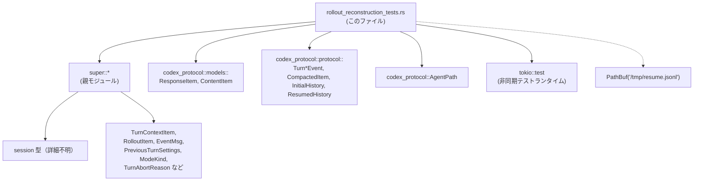
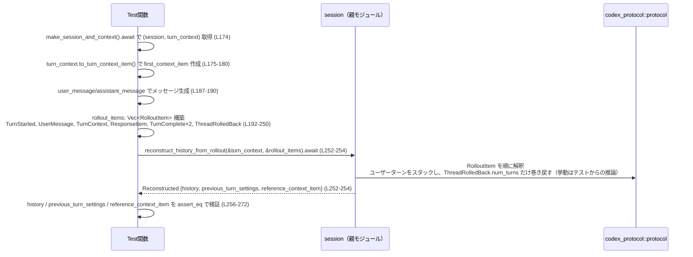
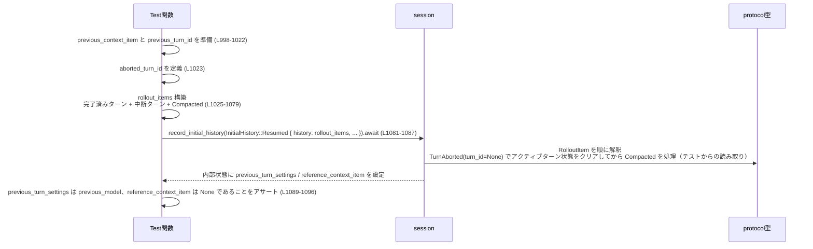

# core/src/codex/rollout_reconstruction_tests.rs

## 0. ざっくり一言

- Rollout ログ（`RolloutItem` の列）から会話履歴とメタデータを再構築するロジックについて、**ロールバック (`ThreadRolledBack`)、コンパクション (`Compacted`)、中断 (`TurnAborted`) など複雑なケースを網羅的に検証するテスト群**です（`core/src/codex/rollout_reconstruction_tests.rs:L57-1471`）。
- `session.record_initial_history` と `session.reconstruct_history_from_rollout` が、どのように履歴 (`history`)、前回ターン設定 (`PreviousTurnSettings`)、基準コンテキスト (`reference_context_item`) を扱うべきかの「仕様書」として機能しています（同上）。

---

## 1. このモジュールの役割

### 1.1 概要

- このファイルは、親モジュール（`use super::*;`）が提供する **セッション復元ロジック** をテストするために存在します（`rollout_reconstruction_tests.rs:L1`）。
- 特に、次の 2 つの API の振る舞いを、様々なイベント列に対して検証しています。
  - `session.record_initial_history(InitialHistory::Resumed(...))`（例: `L84-90`, `L155-161`, `L677-683`）
  - `session.reconstruct_history_from_rollout(&turn_context, &rollout_items)`（例: `L252-254`, `L338-340`, `L544-546`）
- テストでは `TurnStarted` / `UserMessage` / `TurnContext` / `TurnComplete` / `TurnRolledBack` / `TurnAborted` / `Compacted` / 各種 `ResponseItem` を組み合わせることで、**ユーザーターンのロールバック数の解釈**, **コンパクション後の基準コンテキスト扱い**, **中断イベントの影響**などを確認します。

### 1.2 アーキテクチャ内での位置づけ

テストファイルから読み取れる依存関係を簡略図にまとめると、次のようになります。



- **このファイル**は親モジュールの全てを `use super::*;` で取り込み、`make_session_and_context` 等のヘルパーや `TurnContextItem`, `RolloutItem` などの型を利用しています（`L1`, `L60`, `L62`, `L82` など）。
- セッションロジックそのもの（`record_initial_history`, `reconstruct_history_from_rollout` の実装）は **親モジュール側** にあり、このファイルからは関数名・型名・戻り値のフィールドのみが分かります。
- プロトコルイベントやメッセージの型は `codex_protocol` クレートからインポートされています（`L3-10`, `L7-10`, `L127-143` など）。

### 1.3 設計上のポイント（テストコードとしての特徴）

コードから読み取れる設計上の特徴は次のとおりです。

- **明示的なシナリオ駆動テスト**
  - 1 テスト関数 = 1 シナリオ（例: 「ロールバックで履歴/メタデータが同期しているか」など）に対応しており、テスト名が仕様をそのまま表現しています（例: `reconstruct_history_rollback_keeps_history_and_metadata_in_sync_for_completed_turns` `L172`）。
- **イベント列をハンドクラフト**
  - 各テストで `Vec<RolloutItem>` を手作業で構築し、そこから再構築される `history` や `previous_turn_settings` を検証しています（例: `L192-250`, `L288-336`, `L699-748`）。
- **状態の 3 つの側面を常にセットで検証**
  - 再構築結果 / セッション状態として、必ず次の 3 つのどれか（または全部）についてアサーションが置かれています。
    - `history: Vec<ResponseItem>`（`L256-259`, `L342-345`, `L457-460`）
    - `previous_turn_settings: Option<PreviousTurnSettings>`（`L260-266`, `L346-352`, `L615-616`）
    - `reference_context_item: Option<TurnContextItem>`（`L267-272`, `L353-358`, `L615-617`）
- **非同期テスト**
  - すべてのテスト関数は `#[tokio::test]` な `async fn` であり、`session` の API も `async` です（`L57-60`, `L96-100` など）。テストランナーは Tokio ランタイム上で動作します。

---

## 2. 主要な機能一覧（このテストが検証している仕様）

テスト名から読み取れる、「セッション側が満たすべき仕様」を機能粒度で整理します。

- ロールアウト再構築:
  - 完了済みターンに対するロールバックで、**履歴 (`history`) とメタデータ (`previous_turn_settings`, `reference_context_item`) が整合する**こと（`L172-273`）。
  - 未完了ターンがロールバックされた場合も、直前の完了済みユーザーターンに対応するメタデータが残ること（`L275-359`）。
  - ロールバックカウントは「ユーザーターン」のみを消費し、スタンドアロンなアシスタントターンはロールバック数には含めないこと（`L361-474`）。
  - inter-agent なアシスタントメッセージ（`InterAgentCommunication` を JSON にシリアライズした `assistant` ロールのメッセージ）はユーザーターンとしてカウントされること（`L476-568`）。
  - ロールバック数がユーザーターン数を超えた場合、履歴とメタデータをすべてクリアすること（`L570-618`）。
- 初期履歴の記録（Resumed セッション）:
  - 「裸の」`TurnContext` のみがある場合、`previous_turn_settings` と `reference_context_item` は設定されないこと（`L57-94`, `L773-788`）。
  - ライフサイクルイベント（`TurnStarted` / `UserMessage` / `TurnComplete`）がある場合、そこから `previous_turn_settings` を復元できること（`L96-170`）。
  - `ThreadRolledBack` がある場合、ロールバック対象のユーザーターンに関連するコンパクションメタデータやリファレンスコンテキストがどのように扱われるか（`L620-687`, `L689-771`, `L1216-1311`, `L1365-1471`）。
  - コンパクション (`CompactedItem`) と `replacement_history` の有無に応じて、基準コンテキストの扱いがどう変わるか（`L689-771`, `L790-812`, `L890-992`）。
  - `TurnAborted` がアクティブなターンにマッチするかどうかで、コンパクション計数に使う「アクティブターン」がどう変わるか（`L994-1097`, `L1099-1214`）。
- レガシーコンパクション対応:
  - `replacement_history: None` のレガシー `CompactedItem` が存在する場合、新しい初期コンテキストを履歴の先頭に挿入しないこと、および後続の `TurnContext` があっても `reference_context_item` をクリアすること（`L814-839`, `L841-888`）。

---

## 3. コンポーネント・API 詳細

### 3.1 型一覧（このファイルで利用している主要な型）

このファイル内で **新たに定義される型はありません**。ただし、テストの理解に重要な外部型を整理します。

| 名前 | 定義場所（推定） | 種別 | このファイルでの役割 / 用途 | 根拠 |
|------|------------------|------|------------------------------|------|
| `TurnContextItem` | `super` モジュール | 構造体 | 1 ターン分のメタデータ（`turn_id`, `model`, `cwd`, 日付/タイムゾーン、各種ポリシー、人格、`realtime_active`, 推論サマリなど）を保持する | フィールド初期化 `L62-80`, `L101-119`, `L895-913` など |
| `RolloutItem` | `super` モジュール | 列挙体 | ログ 1 行に相当するイベント／メタデータを表現。`EventMsg`, `TurnContext`, `ResponseItem`, `Compacted` などのバリアントが確認できます | 使用例 `L82`, `L127-152`, `L192-250` など |
| `EventMsg` | `super` モジュール | 列挙体 | `TurnStarted`, `UserMessage`, `TurnComplete`, `ThreadRolledBack`, `TurnAborted` などのイベントをラップする | 例: `RolloutItem::EventMsg(EventMsg::TurnStarted(...))` `L127-135`, `L193-200` など |
| `PreviousTurnSettings` | `super` モジュール | 構造体 | 直前のターンの設定（`model`, `realtime_active`）を表現し、ロールバック・コンパクション後もどの設定を引き継ぐかを表す | アサーション `L163-169`, `L261-266`, `L759-763` など |
| `ResponseItem` | `codex_protocol::models` | 列挙体 | 会話履歴に載るメッセージ（`Message { role, content, ... }`）を表現 | `use` `L6`, コンストラクタとしての利用 `L15-23`, `L27-35` |
| `ContentItem` | `codex_protocol::models` | 列挙体 | メッセージ本文（入力テキスト / 出力テキスト）を表現 | `ContentItem::InputText` `L18-20`, `ContentItem::OutputText` `L30-32` |
| `CompactedItem` | `codex_protocol::protocol` | 構造体 | 会話履歴のコンパクション結果（要約テキスト `message` とオプションの `replacement_history`）を表現 | 生成 `L741-744`, `L796-799`, `L821-824` など |
| `InitialHistory`, `ResumedHistory` | `codex_protocol::protocol` | 列挙体 / 構造体 | セッション開始時に渡す初期履歴の種類・内容を表す。ここでは `InitialHistory::Resumed(ResumedHistory { history: Vec<RolloutItem>, rollout_path, conversation_id })` が使われる | 例 `L84-89`, `L155-160`, `L677-682` |
| `InterAgentCommunication` | `codex_protocol::protocol` | 構造体 | エージェント間の通信指示（root→worker など）を表現し、その JSON がアシスタントメッセージとして格納されます | `InterAgentCommunication::new(...)` `L39-45` |
| `ModeKind` | `super` モジュールまたは `codex_protocol` | 列挙体 | `TurnStartedEvent` の `collaboration_mode_kind` として、ターンのモード（ここでは常に `Default`）を指定 | 使用例 `L133-134`, `L197-199` など |
| `TurnAbortReason` | `super` または `codex_protocol` | 列挙体 | `TurnAbortedEvent` の理由を表す。ここでは `Interrupted` のみ登場 | 使用例 `L1069-1072`, `L1175-1180` |

> 親モジュールにある `session` の具体的な型名・実装ファイルは、このチャンクには現れません。`make_session_and_context().await` が `(session, turn_context)` を返すことのみ確認できます（`L60`, `L99`, `L174` など）。

### 3.2 関数詳細（重要な 7 関数）

#### `fn user_message(text: &str) -> ResponseItem`（L14-24）

**概要**

- 与えられた文字列 `text` を、`role: "user"` の `ResponseItem::Message` に変換するテスト用ヘルパーです（`L14-23`）。

**引数**

| 引数名 | 型 | 説明 |
|--------|----|------|
| `text` | `&str` | ユーザーメッセージとして履歴に格納するテキスト |

**戻り値**

- `ResponseItem`:
  - バリアントは `ResponseItem::Message`。
  - `role` は `"user"` 固定。
  - `content` は `vec![ContentItem::InputText { text: text.to_string() }]`（`L18-20`）。
  - `id`, `end_turn`, `phase` はすべて `None`。

**内部処理の流れ**

1. 引数 `text` を `String` に変換する（`text.to_string()` `L19`）。
2. それを `ContentItem::InputText { text: ... }` に包む（`L18-20`）。
3. `role: "user"` を設定した `ResponseItem::Message` を構築し、返却する（`L15-23`）。

**Examples（使用例）**

この関数はテスト内でユーザー側の発話を生成するために繰り返し利用されています。

```rust
// ユーザーターン 1 回目のメッセージを作成（L187）
let turn_one_user = user_message("turn 1 user");

// RolloutItem として履歴に追加（L210）
RolloutItem::ResponseItem(turn_one_user.clone());
```

**Errors / Panics**

- この関数自体は `unwrap` や `expect` を使用しておらず、パニックを起こす要素は見当たりません。

**Edge cases（エッジケース）**

- `text` が空文字列でも、そのまま `InputText` に格納されるだけで特別な扱いはありません（コードに特別な分岐はありません）。

**使用上の注意点**

- あくまでテスト用ヘルパーであり、`id`, `end_turn`, `phase` は常に `None` になるため、これらのフィールドに依存したロジックのテストには直接は向きません。

---

#### `fn assistant_message(text: &str) -> ResponseItem`（L26-36）

**概要**

- 指定した文字列 `text` を `role: "assistant"` の `ResponseItem::Message` に変換するヘルパーです（`L26-35`）。

**引数**

| 引数名 | 型 | 説明 |
|--------|----|------|
| `text` | `&str` | アシスタントメッセージのテキスト |

**戻り値**

- `ResponseItem`:
  - バリアントは `ResponseItem::Message`。
  - `role` は `"assistant"`。
  - `content` は `vec![ContentItem::OutputText { text: text.to_string() }]`（`L30-32`）。
  - `id`, `end_turn`, `phase` は `None`。

**内部処理の流れ**

1. `text` を `String` に変換（`L31`）。
2. それを `ContentItem::OutputText { text }` に包む（`L30-32`）。
3. `role: "assistant"` で `ResponseItem::Message` を生成して返却（`L27-35`）。

**使用例**

```rust
// アシスタントの応答メッセージを作成（L188）
let turn_one_assistant = assistant_message("turn 1 assistant");

// 履歴に追加（L211）
RolloutItem::ResponseItem(turn_one_assistant.clone());
```

**Errors / Panics / Edge cases**

- `user_message` と同様、特にパニック要因や特別な分岐はありません。

**使用上の注意点**

- `role` が `"assistant"` に固定されるため、システムメッセージなど他のロールをテストしたい場合は別途ヘルパーが必要になります。

---

#### `fn inter_agent_assistant_message(text: &str) -> ResponseItem`（L38-55）

**概要**

- Inter-agent 通信指示 (`InterAgentCommunication`) を生成し、それを JSON 文字列にシリアライズした `assistant` メッセージを作るヘルパーです（`L38-55`）。
- エージェントパスは `AgentPath::root()` → `.join("worker")` でルートから worker への通信を表します（`L39-42`）。

**引数**

| 引数名 | 型 | 説明 |
|--------|----|------|
| `text` | `&str` | 通信指示の本文テキスト（`InterAgentCommunication` の `message`） |

**戻り値**

- `ResponseItem`:
  - `role: "assistant"`。
  - `content` は `ContentItem::OutputText` 1 要素を持つベクタ。
  - `text` フィールドには `serde_json::to_string(&communication)` の結果（`L50`）。

**内部処理の流れ**

1. `InterAgentCommunication::new` を呼び出し、`from = AgentPath::root()`, `to = AgentPath::root().join("worker").unwrap()` 等で通信オブジェクトを生成（`L39-45`）。
2. 生成した `communication` を `serde_json::to_string(&communication).unwrap()` で JSON にシリアライズ（`L50`）。
3. その JSON を `ContentItem::OutputText` に包み、`ResponseItem::Message` として返す（`L47-54`）。

**Examples**

```rust
// Inter-agent 指示メッセージを生成（L489-490）
let assistant_instruction = inter_agent_assistant_message("continue");

// ロールバックカウントに影響するターンを構成（L528-530）
RolloutItem::ResponseItem(assistant_instruction);
```

**Errors / Panics**

- `AgentPath::root().join("worker").unwrap()` が失敗するとパニックします（`L41`）。
- `serde_json::to_string(&communication).unwrap()` がシリアライズに失敗した場合もパニックします（`L50`）。
- テストコードなので、これらの `unwrap` は「ここでは必ず成功する」という前提で書かれています。

**Edge cases**

- `text` が空文字でも `InterAgentCommunication` と JSON にそのまま反映されるだけで、特別な扱いはありません。

**使用上の注意点**

- 本関数は **「assistant ロールだがユーザーターンとして扱われる」** シナリオをテストするために使われています（`reconstruct_history_rollback_counts_inter_agent_assistant_turns` `L476-568`）。
- プロダクションコードでは、JSON のパースエラーやパス解決失敗を `Result` で扱う必要がありますが、このテストはそこまでは検証していません。

---

#### `async fn reconstruct_history_rollback_keeps_history_and_metadata_in_sync_for_completed_turns()`（L172-273）

**概要**

- 完了済みの 2 ユーザーターンの後に `ThreadRolledBack { num_turns: 1 }` が発生した場合に、**最後の 1 ユーザーターンだけが履歴から削除され、メタデータ（前回ターン設定、基準コンテキスト）が 1 つ前のターンに揃うこと**を検証するテストです（`L172-273`）。

**引数**

- なし（`#[tokio::test]` によりテストランナーから呼び出される、非同期テスト関数）。

**戻り値**

- `()`（Rust のテスト関数としての標準）。

**内部処理の流れ（シナリオ）**

1. `make_session_and_context().await` で `(session, turn_context)` を取得（`L174`）。
2. `turn_context.to_turn_context_item()` から `first_context_item` を生成し、その `turn_id` を `first_turn_id` に保存（`L175-180`）。
3. `first_context_item` をクローンして `rolled_back_context_item` を作り、`turn_id` と `model` を別値に変更（`L180-182`）。
4. 4 つのメッセージ（1・2 ターン目の user/assistant）を `user_message` / `assistant_message` から生成（`L187-190`）。
5. `rollout_items: Vec<RolloutItem>` に、次の順でイベントを積む（`L192-250`）。
   - ターン 1: `TurnStarted` → `UserMessage` → `TurnContext(first_context_item)` → `ResponseItem`2件 → `TurnComplete(first_turn_id)`。
   - ターン 2: `TurnStarted(rolled_back_turn_id)` → `UserMessage` → `TurnContext(rolled_back_context_item)` → `ResponseItem`2件 → `TurnComplete(rolled_back_turn_id)`。
   - スレッドロールバック: `ThreadRolledBack { num_turns: 1 }`。
6. `session.reconstruct_history_from_rollout(&turn_context, &rollout_items).await` を呼び出して `reconstructed` を得る（`L252-254`）。
7. 次をアサート（`L256-272`）。
   - `reconstructed.history` はターン 1 の user/assistant のみ（ターン 2 はロールバックされる）。
   - `reconstructed.previous_turn_settings` は `turn_context.model_info.slug` と `realtime_active` に一致する。
   - `reconstructed.reference_context_item` は `Some(first_context_item)`。

**Examples（使用例）**

本関数自体はテストエントリポイントですが、シナリオや `rollout_items` の構成は、`reconstruct_history_from_rollout` の利用例として参考になります。

```rust
// テストと同様に、2 ターン分の RolloutItem を構成し、1 ターン分のロールバックを要求する
let reconstructed = session
    .reconstruct_history_from_rollout(&turn_context, &rollout_items)
    .await;

// ロールバック後の履歴とメタデータに対する期待を検証する
assert_eq!(reconstructed.history, vec![turn_one_user, turn_one_assistant]);
```

**Errors / Panics**

- `first_context_item.turn_id.clone().expect("...")` により、`turn_id` が `None` の場合はテストがパニックします（`L176-179`）。
- `session.reconstruct_history_from_rollout` の内部のエラー挙動はこのチャンクからは分かりませんが、少なくともこのケースでは `await` が失敗せず、結果が返ってくる前提です（`L252-254`）。

**Edge cases**

このテストから、`reconstruct_history_from_rollout` は少なくとも次を保証する必要があると読み取れます。

- `ThreadRolledBack { num_turns: 1 }` の対象は **ユーザーターン単位** であり、ターン 2（`rolled_back_turn_id`）のメッセージとメタデータのみが削除される（`L247-249`, `L256-261`）。
- ロールバックされたターンの `TurnContext` や `model` は、`previous_turn_settings` や `reference_context_item` に残らない（ターン 1 のコンテキストが採用されている `L261-266`, `L267-272`）。

**使用上の注意点**

- 正しいロールバック挙動を得るには、`TurnStarted` / `UserMessage` / `TurnContext` / `TurnComplete` のペアリングと `turn_id` の整合性が重要であることが、このテストから分かります。
- `ThreadRolledBack` の `num_turns` は **ターン ID の個数ではなく「ユーザーターンの数」** として解釈される前提でその他のテストとも一貫しています（詳細は `L361-474`, `L570-618` 参照）。

---

#### `async fn reconstruct_history_rollback_clears_history_and_metadata_when_exceeding_user_turns()`（L570-618）

**概要**

- ロールバック対象のユーザーターン数が実際のユーザーターン数を超えた場合、**履歴 (`history`) とメタデータ (`previous_turn_settings`, `reference_context_item`) をすべてクリアする**べきことを検証するテストです（`L570-618`）。

**内部処理の流れ（シナリオ）**

1. `only_context_item` とその `turn_id` を取得（`L573-577`）。
2. 1 ユーザーターンのみ含む `rollout_items` を構築（`L578-608`）。
   - `TurnStarted(only_turn_id)` → `UserMessage("only user")` → `TurnContext(only_context_item)` → `ResponseItem`2件 → `TurnComplete(only_turn_id)`。
   - `ThreadRolledBack { num_turns: 99 }`。
3. `reconstruct_history_from_rollout` 呼び出し（`L611-613`）。
4. 結果に対して次をアサート（`L615-617`）。
   - `history` は空配列。
   - `previous_turn_settings` は `None`。
   - `reference_context_item` は `None`。

**仕様として読み取れること**

- `num_turns` が実際のユーザーターン数より大きい場合、「巻き戻せるところまで全て巻き戻した結果」として **完全に空の状態** が期待されています。

**Errors / Panics / Edge cases**

- `only_context_item.turn_id.expect("...")` によるパニックの可能性（`L575-577`）。
- `ThreadRolledBack.num_turns` の極端な値（99）が渡されても、`reconstruct_history_from_rollout` はエラーではなく空の状態を返すべきであることが示唆されています。

---

#### `async fn record_initial_history_resumed_rollback_drops_incomplete_user_turn_compaction_metadata()`（L689-771）

**概要**

- Resumed セッションの初期履歴において、「完了済みのユーザーターン」→「未完了だがロールバックされるユーザーターン（コンパクションあり）」という流れがある場合に、**未完了ターンに対するコンパクションメタデータを無視し、直前の完了済みターンのコンテキストと現在モデルを基準として扱う**ことを検証するテストです（`L689-771`）。

**内部処理の流れ**

1. `previous_context_item` とその `turn_id` を取得（`L692-697`）。
2. `incomplete_turn_id` を定義（`L697-698`）。
3. `rollout_items` を構築（`L699-748`）。
   - 完了済みターン:
     - `TurnStarted(previous_turn_id)` → `UserMessage("seed")` → `TurnContext(previous_context_item.clone())` → `TurnComplete(previous_turn_id)`（`L700-724`）。
   - 未完了ターン:
     - `TurnStarted(incomplete_turn_id)` → `UserMessage("rolled back")` → `Compacted { message: "", replacement_history: Some(Vec::new()) }` → `ThreadRolledBack { num_turns: 1 }`（`L725-747`）。
4. `record_initial_history(InitialHistory::Resumed(...))` を呼び出し（`L750-756`）。
5. 次をアサート（`L758-770`）。
   - `session.previous_turn_settings().await` は「**現在のモデル** (`turn_context.model_info.slug`) と `realtime_active`」を表す `PreviousTurnSettings`。
   - `session.reference_context_item().await` は `Some(previous_context_item)`。

**仕様として読み取れること**

- ロールバックされた未完了ターンに付随する `CompactedItem` のメタデータは、初期状態の「基準コンテキスト」や「前回設定」を上書きすべきでない。
- Resumed 時点の **現在モデル（`turn_context.model_info.slug`）** を `previous_turn_settings.model` に採用するルールがある（`L761-763`）。

**Errors / Panics**

- `previous_context_item.turn_id.expect("...")` によるパニックの可能性（`L693-696`）。

**使用上の注意点**

- ロールバック対象となる未完了ターンにコンパクションが掛かっていても、そのメタデータを初期状態に反映しないように実装する必要があります。
- 「どのターンまでが有効な履歴なのか」を正しく判断するため、`ThreadRolledBack` と完了イベント (`TurnComplete` / `TurnAborted`) の組み合わせが非常に重要です。

---

#### `async fn record_initial_history_resumed_aborted_turn_without_id_clears_active_turn_for_compaction_accounting()`（L994-1097）

**概要**

- Resumed セッションにおいて、アクティブなターンの途中で `TurnAborted { turn_id: None }` が発生し、その後に `Compacted` が続く場合に、**アクティブターン情報がクリアされ、コンパクションは前の完了済みターンの「基準コンテキスト」を上書きしない**ことを検証するテストです（`L994-1097`）。

**内部処理の流れ**

1. `previous_context_item` とその `turn_id`、`aborted_turn_id` を用意（`L998-1023`）。
2. `rollout_items` を構築（`L1025-1079`）。
   - 完了済みターン:
     - `TurnStarted(previous_turn_id)` → `UserMessage("seed")` → `TurnContext(previous_context_item)` → `TurnComplete(previous_turn_id)`。
   - 中断されたターン:
     - `TurnStarted(aborted_turn_id)` → `UserMessage("aborted")` → `TurnAborted { turn_id: None, reason: Interrupted }`。
   - その後のコンパクション:
     - `Compacted { message: "", replacement_history: Some(Vec::new()) }`。
3. `record_initial_history(InitialHistory::Resumed(...))` 呼び出し（`L1081-1087`）。
4. 次をアサート（`L1089-1096`）。
   - `session.previous_turn_settings().await` は `previous_model` と `realtime_active`。
   - `session.reference_context_item().await` は `None`。

**仕様として読み取れること**

- `TurnAborted.turn_id == None` は「**現在のアクティブターンをクリアするシグナル**」として扱われる必要がある（`L1067-1073` の後のコンパクションが基準を消している）。
- その結果、その直後の `Compacted` は前の完了済みターンの基準コンテキストを「消す」働きを持つが、**モデル設定 (`previous_turn_settings`) は保持される**（`L1090-1095`）。

**Errors / Panics / Edge cases**

- `previous_turn_id` の `expect`（`L1019-1022`）。
- `TurnAborted.turn_id: None` というレアケースをあえてテストしており、ここが実装上のエッジケースであることが分かります（`L1067-1073`）。

**使用上の注意点**

- `TurnAborted` が current ターンにマッチしない場合と、`turn_id: None` の場合で挙動が異なる点に注意が必要です（後者はアクティブターンのクリアと解釈される）。この違いは次のテストと対になっています。
  - `record_initial_history_resumed_unmatched_abort_preserves_active_turn_for_later_turn_context`（`L1099-1214`）。

---

#### `async fn record_initial_history_resumed_unmatched_abort_preserves_active_turn_for_later_turn_context()`（L1099-1214）

**概要**

- `TurnAborted` の `turn_id` が **現在のアクティブターンと一致しない場合**、その後に登場する `TurnContext` を利用してアクティブターンのコンテキストが再確立されることを検証するテストです（`L1099-1214`）。

**内部処理の流れ（要約）**

1. `previous_context_item`, `previous_turn_id` を完了済みターンとして用意（`L1103-1107`, `L1133-1157`）。
2. `current_turn_id`（アクティブターン）と `unmatched_abort_turn_id`（別のターン）を定義し、`current_context_item` を作成（`L1108-1130`）。
3. `rollout_items` の後半で:
   - `TurnStarted(current_turn_id)` → `UserMessage("current")` → `TurnAborted { turn_id: Some(unmatched_abort_turn_id) }` → `TurnContext(current_context_item)` → `TurnComplete(current_turn_id)`（`L1158-1190`）。
4. Resumed 初期履歴として `record_initial_history` に渡す（`L1193-1199`）。
5. アサーション（`L1201-1213`）。
   - `previous_turn_settings` の `model` は `current_model`。
   - `reference_context_item` は `Some(current_context_item)`。

**仕様として読み取れること**

- `TurnAborted` の `turn_id` がアクティブターンの `turn_id` と一致しない場合、そのアボートイベントは **アクティブターンのクリアにはならない**。
- そのため、後続の `TurnContext(current_context_item)` は有効なものとして扱われ、`previous_turn_settings`・`reference_context_item` を上書きする（`L1201-1213`）。

**対比**

- `turn_id: None` の場合はアクティブターンクリア（`L994-1097`）。
- `turn_id: Some(別 ID)` の場合はアクティブターン維持、後続の `TurnContext` で再確立（このテスト）。

---

### 3.3 その他の関数一覧（テストケース）

以下は詳細解説を省いたテスト関数の一覧です。いずれも `#[tokio::test] async fn` で、戻り値は `()` です。

| 関数名 | 役割（1 行） | 行範囲 |
|--------|--------------|--------|
| `record_initial_history_resumed_bare_turn_context_does_not_hydrate_previous_turn_settings` | Resumed 初期履歴に `TurnContext` だけがある場合、`previous_turn_settings`・`reference_context_item` が設定されないことを確認 | `L57-94` |
| `record_initial_history_resumed_hydrates_previous_turn_settings_from_lifecycle_turn_with_missing_turn_context_id` | `TurnContext.turn_id` が `None` でも、ライフサイクルイベントから `previous_turn_settings` を復元できることを確認 | `L96-170` |
| `reconstruct_history_rollback_keeps_history_and_metadata_in_sync_for_incomplete_turn` | ロールバック対象ターンが未完了（`TurnComplete` 不在）の場合でも、直前の完了済みターンに履歴とメタデータが揃うことを確認 | `L275-359` |
| `reconstruct_history_rollback_skips_non_user_turns_for_history_and_metadata` | ロールバック数の消費対象がユーザーターンのみであり、スタンドアロンなアシスタントターンはスキップされることを確認 | `L361-474` |
| `reconstruct_history_rollback_counts_inter_agent_assistant_turns` | Inter-agent な `assistant` メッセージを含むターンがユーザーターンとしてロールバック数にカウントされることを確認 | `L476-568` |
| `record_initial_history_resumed_rollback_skips_only_user_turns` | Resumed 初期履歴でのロールバックがユーザーターンだけを対象にすることを確認 | `L620-687` |
| `record_initial_history_resumed_bare_turn_context_does_not_seed_reference_context_item` | `TurnContext` 単体では `reference_context_item` をシードしないことを確認 | `L773-788` |
| `record_initial_history_resumed_does_not_seed_reference_context_item_after_compaction` | `TurnContext` の後に `Compacted` がある場合、基準コンテキストがシードされないことを確認 | `L790-812` |
| `reconstruct_history_legacy_compaction_without_replacement_history_does_not_inject_current_initial_context` | `replacement_history: None` のレガシーコンパクションが存在しても、現在の初期コンテキストを履歴に挿入しないことを確認 | `L814-839` |
| `reconstruct_history_legacy_compaction_without_replacement_history_clears_later_reference_context_item` | レガシーコンパクションの後に `TurnContext` が来ても `reference_context_item` が設定されないことを確認 | `L841-888` |
| `record_initial_history_resumed_turn_context_after_compaction_reestablishes_reference_context_item` | `Compacted` の後の `TurnContext` が基準コンテキストと前回設定を再確立することを確認 | `L890-992` |
| `record_initial_history_resumed_trailing_incomplete_turn_compaction_clears_reference_context_item` | 末尾の未完了ターンに対するコンパクションが基準コンテキストをクリアし、前回設定のみ保持することを確認 | `L1216-1311` |
| `record_initial_history_resumed_trailing_incomplete_turn_preserves_turn_context_item` | 末尾の未完了ターンが `TurnContext` で終わる場合、基準コンテキストと前回設定が保存されることを確認 | `L1313-1363` |
| `record_initial_history_resumed_replaced_incomplete_compacted_turn_clears_reference_context_item` | 未完了コンパクト済みターンが別の `TurnStarted` に置き換えられた場合、基準コンテキストがクリアされることを確認 | `L1365-1471` |

---

## 4. データフロー

### 4.1 再構築処理のデータフロー（ロールバック付き）

`reconstruct_history_rollback_keeps_history_and_metadata_in_sync_for_completed_turns`（`L172-273`）を例に、テストから見えるデータフローを抽象化します。



この図から読み取れるポイント:

- テスト側は **純粋なデータ（`Vec<RolloutItem>`）のみ** をセッションに渡し、セッションはそれを解釈して再構築結果を返します。
- ロールバック対象の計算や `PreviousTurnSettings` の決定はセッション内部で行われ、その正しさをテストが検証しています。

### 4.2 Resumed 初期履歴処理のデータフロー（コンパクション + 中断）

`record_initial_history_resumed_aborted_turn_without_id_clears_active_turn_for_compaction_accounting`（`L994-1097`）のケースを抽象化します。



要点:

- `TurnAborted(turn_id=None)` は「アクティブターンをクリアし、その後の `Compacted` を基準コンテキストから切り離す」という契約を暗に示しています。
- `record_initial_history` は、セッション内部状態（前回設定と基準コンテキスト）を更新する **初期化フェーズ** として機能していることが分かります。

---

## 5. 使い方（How to Use）

このファイル自体はテストですが、`session.reconstruct_history_from_rollout` と `session.record_initial_history` の **典型的な呼び出しパターン** を理解するのに役立ちます。

### 5.1 基本的な使用方法（reconstruct_history_from_rollout）

テストを簡略化した形の疑似コードです。コメントで主要な要素を示します。

```rust
// (1) セッションと現在ターン用のコンテキストを用意する（L174, L277, L363 等）
let (session, turn_context) = make_session_and_context().await;

// (2) 前回ターンのコンテキストを取得する（L175-180）
let context_item = turn_context.to_turn_context_item();
let turn_id = context_item
    .turn_id
    .clone()
    .expect("turn context should have turn_id");

// (3) RolloutItem の列を構築する（L192-250 など）
let rollout_items = vec![
    // ターン開始イベント
    RolloutItem::EventMsg(EventMsg::TurnStarted(
        codex_protocol::protocol::TurnStartedEvent {
            turn_id: turn_id.clone(),
            started_at: None,
            model_context_window: Some(128_000),
            collaboration_mode_kind: ModeKind::Default,
        },
    )),
    // ユーザーからのメッセージ
    RolloutItem::EventMsg(EventMsg::UserMessage(
        codex_protocol::protocol::UserMessageEvent {
            message: "hello".to_string(),
            images: None,
            local_images: Vec::new(),
            text_elements: Vec::new(),
        },
    )),
    // ターンのコンテキスト
    RolloutItem::TurnContext(context_item.clone()),
    // 応答メッセージ（必要に応じて）
    RolloutItem::ResponseItem(user_message("hello")),
    RolloutItem::ResponseItem(assistant_message("hi there")),
    // ターン完了
    RolloutItem::EventMsg(EventMsg::TurnComplete(
        codex_protocol::protocol::TurnCompleteEvent {
            turn_id,
            last_agent_message: None,
            completed_at: None,
            duration_ms: None,
        },
    )),
];

// (4) ロールアウトから履歴を再構築する（L252-254, L338-340 等）
let reconstructed = session
    .reconstruct_history_from_rollout(&turn_context, &rollout_items)
    .await;

// (5) 再構築結果を利用する（history / previous_turn_settings / reference_context_item）
println!("{:?}", reconstructed.history);
```

### 5.2 Resumed 初期履歴の設定（record_initial_history）

Resumed セッションを開始する場合の典型パターンです。

```rust
// (1) セッションと現在ターンのコンテキストを取得（L60, L99 など）
let (session, turn_context) = make_session_and_context().await;

// (2) 過去の rollout_items を何らかの方法で読み込んでおく（ここではテストコードと同様に手動で構築）
let rollout_items: Vec<RolloutItem> = /* ... ログから復元 ... */;

// (3) ResumedHistory を構築して session に渡す（L84-90, L155-161, L750-756 等）
session
    .record_initial_history(InitialHistory::Resumed(ResumedHistory {
        conversation_id: ThreadId::default(),
        history: rollout_items,
        rollout_path: PathBuf::from("/tmp/resume.jsonl"), // ログの保存場所
    }))
    .await;

// (4) セッション内に設定された前回設定や基準コンテキストを参照（L758-770 等）
let prev = session.previous_turn_settings().await;
let baseline = session.reference_context_item().await;
```

### 5.3 よくある使用パターン（テストから見えるもの）

- **ロールバック付き履歴復元**
  - `ThreadRolledBack { num_turns: N }` を `rollout_items` の末尾近くに配置し、`reconstruct_history_from_rollout` 結果の `history` および `previous_turn_settings` を確認する（`L192-250`, `L247-249`, `L256-266`）。
- **コンパクション後の基準コンテキスト再設定**
  - `Compacted` → `TurnContext` → `TurnComplete` の順で `rollout_items` を構成し、`record_initial_history` で `reference_context_item` が再設定されることを確認する（`L936-949`, `L952-958`, `L960-991`）。
- **中断イベントの扱い**
  - `TurnAborted` の `turn_id` によってアクティブターンの扱いが変わることを、`record_initial_history` 後の `reference_context_item` で検証する（`L1067-1073`, `L1089-1096`, `L1174-1181`, `L1201-1213`）。

### 5.4 よくある間違い（テストから推測される誤用パターン）

テストが明示的にチェックしている「してはいけない／期待どおりに動かない」パターンをまとめます。

```rust
// 間違い例: TurnContext だけから previous_turn_settings を復元できると期待する（L57-94, L773-788）
let rollout_items = vec![
    RolloutItem::TurnContext(previous_context_item),
];

session
    .record_initial_history(InitialHistory::Resumed(ResumedHistory {
        conversation_id: ThreadId::default(),
        history: rollout_items,
        rollout_path: PathBuf::from("/tmp/resume.jsonl"),
    }))
    .await;

// previous_turn_settings や reference_context_item は None のまま（L92-93, L787）
assert_eq!(session.previous_turn_settings().await, None);
assert!(session.reference_context_item().await.is_none());
```

```rust
// 正しい例: ライフサイクルイベントをセットで渡す（L127-152）
let rollout_items = vec![
    RolloutItem::EventMsg(EventMsg::TurnStarted(/* ... */)),
    RolloutItem::EventMsg(EventMsg::UserMessage(/* ... */)),
    RolloutItem::TurnContext(previous_context_item),
    RolloutItem::EventMsg(EventMsg::TurnComplete(/* ... */)),
];
```

- `record_initial_history` は **`TurnContext` 単体ではなく、ライフサイクルイベントとセットで過去ターンを認識する**ことがテストから分かります。
- `ThreadRolledBack` の `num_turns` を「単に最後の `TurnStarted` の数」と解釈すると、スタンドアロンターンや inter-agent ターンを誤ってカウントし、テストに反する挙動になります（`L361-474`, `L476-568`）。

### 5.5 使用上の注意点（まとめ）

- **非同期・並行性**
  - すべての API 呼び出しは `async` であり、`tokio::test` 上で動作しています（`L57`, `L96`, `L172` など）。テストでは単一タスクからのみ `session` にアクセスしており、並行アクセス時の挙動はこのチャンクでは分かりません。
- **エラー・パニック**
  - テストコード内では多数の `expect` / `unwrap` が使用されており、前提条件が満たされないと即座にパニックします（例: `turn_id` が `None` の場合 `L176-179`）。プロダクションコードでは、これらが起こらないように `TurnContextItem` の作り方に注意が必要です。
- **契約（Contracts）**
  - `ThreadRolledBack.num_turns` は「ユーザーターン数」として解釈され、スタンドアロンなアシスタントターンはカウントされない（`L361-474`）。
  - Inter-agent の `assistant` メッセージはユーザーターンと同等にロールバック対象としてカウントされる（`L476-568`）。
  - `TurnAborted.turn_id` が `None` の場合はアクティブターンがクリアされ、それ以降のコンパクションは基準コンテキストを消す（`L1067-1073`, `L1089-1096`）。
  - `replacement_history: None` の `CompactedItem` はレガシー扱いで、基準コンテキストの確立を阻害する（`L821-824`, `L831-838`, `L852-855`, `L887`）。

---

## 6. 変更の仕方（How to Modify）

### 6.1 新しい仕様・機能を追加する場合（テストの追加）

新しいイベント種別やコンパクション・ロールバックのルールを追加したい場合、このテストファイルにシナリオを追加するのが自然です。

1. **テスト名の決定**
   - 既存の命名規則に倣い、「何を期待するか」をそのまま英語の関数名にします（例: `reconstruct_history_rollback_handles_new_event_X`）。
2. **セットアップ**
   - `let (session, turn_context) = make_session_and_context().await;` で初期状態を用意（`L60`, `L174` など）。
3. **`rollout_items` の構築**
   - 新しいイベント種別を含めた `Vec<RolloutItem>` を手動で構築します（既存のパターンは `L192-250`, `L699-748` などが参考になります）。
4. **API 呼び出し**
   - ロジックに応じて `reconstruct_history_from_rollout` または `record_initial_history` を呼び出します。
5. **アサーション**
   - `history`, `previous_turn_settings`, `reference_context_item` のいずれか／すべてに対して `assert_eq!` / `assert!` を行い、仕様を明示します。

### 6.2 既存の仕様を変更する場合（注意点）

- **影響範囲の確認**
  - 例えばロールバックのカウントルールを変更した場合、少なくとも以下のテストが影響を受ける可能性があります。
    - `reconstruct_history_rollback_*` 系（`L172-359`, `L361-618`）
    - `record_initial_history_resumed_rollback_*` 系（`L620-687`, `L689-771`, `L1216-1311`, `L1365-1471`）
- **契約の明示**
  - テストは実装の「契約」を表すため、仕様変更時には **テストの期待値を先に変える** ことで、新しい仕様をドキュメント化するのが適切です。
- **エッジケースの再確認**
  - 特に次のエッジケースは、変更時に再検証が必要です。
    - 未完了ターン（`TurnComplete` の欠如）とロールバック／コンパクションの組み合わせ（`L275-359`, `L689-771`, `L1216-1311`）。
    - `TurnAborted.turn_id` が `None` または別 ID の場合（`L994-1097`, `L1099-1214`）。
    - レガシーコンパクション（`replacement_history: None`）の扱い（`L814-839`, `L841-888`）。

---

## 7. 関連ファイル・モジュール

このファイルから参照されている主なモジュールと、その関係をまとめます。

| パス / モジュール | 役割 / 関係 | 根拠 |
|-------------------|------------|------|
| `super`（親モジュール、ファイルパスはこのチャンクには現れない） | `make_session_and_context`, `TurnContextItem`, `RolloutItem`, `EventMsg`, `PreviousTurnSettings`, `ModeKind`, `TurnAbortReason` などを提供し、`record_initial_history` / `reconstruct_history_from_rollout` の実装を含む | `use super::*;` `L1`, 関数・型の利用 `L60`, `L62`, `L82`, `L163-169` 等 |
| `codex_protocol::models` | `ResponseItem`, `ContentItem` など会話メッセージに関する型を提供 | `use codex_protocol::models::ContentItem;` `L5`, `ResponseItem` `L6`, 生成コード `L14-23`, `L26-35` |
| `codex_protocol::protocol` | `CompactedItem`, `InitialHistory`, `ResumedHistory`, `InterAgentCommunication`, 各種イベント (`TurnStartedEvent`, `UserMessageEvent`, `TurnCompleteEvent`, `ThreadRolledBackEvent`, `TurnAbortedEvent`) を提供 | `L7-10`, 各イベントの生成 `L127-143`, `L192-250`, `L699-748`, `L1025-1079` 等 |
| `codex_protocol::AgentPath` | Inter-agent 通信のエージェントパスを表現し、`InterAgentCommunication` の生成に利用 | `L3`, `L39-42` |
| `tokio::test` マクロ | 非同期テストランタイムを提供し、本ファイルの全テストに適用 | `#[tokio::test]` が各テスト関数の直前に出現 `L57`, `L96`, `L172`, … |
| `pretty_assertions::assert_eq` | 通常の `assert_eq!` に色付き差分表示などを追加したマクロ。テストの期待値比較に利用 | `use pretty_assertions::assert_eq;` `L11`, 使用箇所 `L92`, `L163-169`, `L256-272` 等 |
| `std::path::PathBuf` | ResumedHistory の `rollout_path` 表現に利用されるパス型 | `L12`, 利用 `L88-89`, `L159-160`, `L754-755` |

> 親モジュールの実装ファイル名（例: `rollout_reconstruction.rs` など）は、このチャンクからは判別できません。「super モジュールがこれらのロジックを提供している」という事実だけが分かります。
