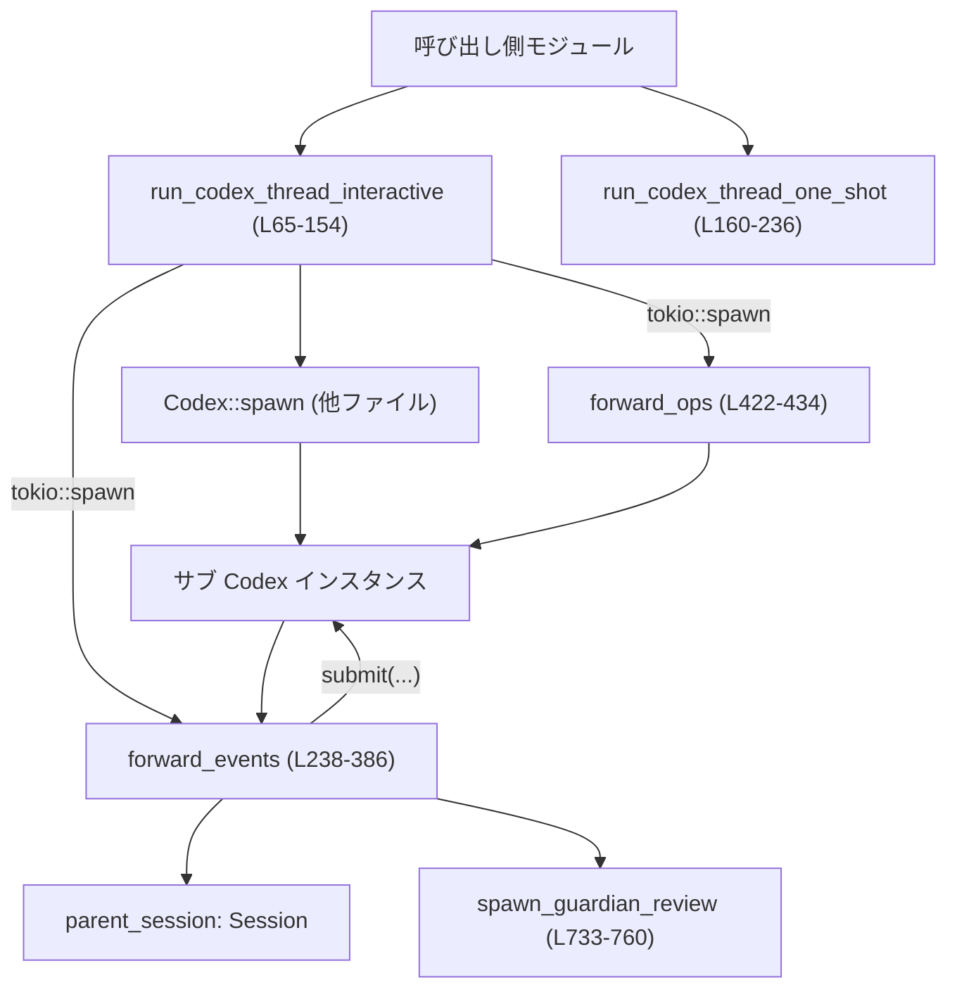
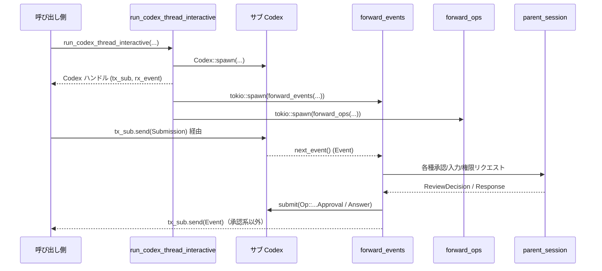
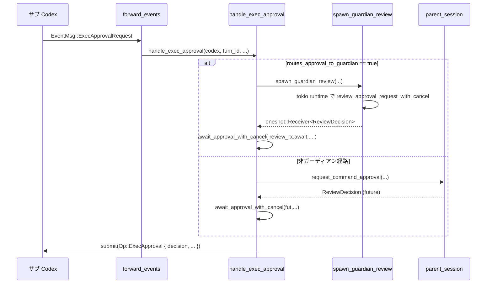

# core/src/codex_delegate.rs コード解説

## 0. ざっくり一言

このモジュールは、**サブ Codex（サブエージェント）を立ち上げ、親セッションとの間でイベント・承認・ユーザー入力・権限リクエストを中継する「デリゲート」層**を提供します。[core/src/codex_delegate.rs:L59-154,L160-236,L238-386]

---

## 1. このモジュールの役割

### 1.1 概要

- このモジュールは、親 `Session` の内部から **サブ Codex スレッド（サブエージェント）を起動し、その入出力を仲介する**ために存在します。[L65-154,L160-236]
- サブエージェントが発行する
  - 実行コマンド承認（ExecApproval）
  - パッチ適用承認（ApplyPatch）
  - パーミッション要求（RequestPermissions）
  - ユーザー入力要求（RequestUserInput）
  を **親セッション（およびガーディアン）に委譲し、結果だけをサブエージェントへ返信**します。[L238-386,L437-615,L617-653,L663-731,L763-785]
- 外側（呼び出し側）には、**通常の `Codex` ハンドルと同様のインターフェース**を返しつつ、内部ではイベントと Op のフォワーディング・キャンセル制御を行います。[L147-153,L229-235]

### 1.2 アーキテクチャ内での位置づけ

主な依存関係を簡略化した図です。



- `run_codex_thread_interactive`/`run_codex_thread_one_shot` が **入り口 API** です。[L65-154,L160-236]
- `forward_events` と `forward_ops` が、サブ Codex ↔ 呼び出し側の **ブリッジレイヤ**です。[L238-386,L422-434]
- 各種 `handle_*` 関数と `await_*_with_cancel` 系が、**承認/入力/権限リクエストのフローとキャンセル制御**を実装します。[L437-615,L617-653,L663-731,L763-839,L842-867]

### 1.3 設計上のポイント

- **責務の分割**  
  - 起動系 (`run_codex_thread_*`) とフォワーディング系 (`forward_events`/`forward_ops`) を分離。[L65-154,L160-236,L238-386,L422-434]
  - 各種イベント種別ごとに専用ハンドラ (`handle_exec_approval`, `handle_patch_approval`, `handle_request_user_input`, `handle_request_permissions`) を定義。[L437-516,L519-615,L617-653,L763-785]
- **状態管理**
  - サブ Codex や `Session`, `TurnContext` などの共有オブジェクトは `Arc` で共有し、スレッド間共有時の所有権を安全に扱っています。[L2,L33-38,L122-125,L460-463,L569-571,L733-739]
  - MCP ツール呼び出しのコンテキストは `Arc<Mutex<HashMap<...>>>` で管理し、同時アクセスを排他します。[L125-129,L243-244,L339-343,L361-362,L676-680]
- **キャンセルとエラーハンドリング**
  - `tokio_util::sync::CancellationToken` を広く利用し、**親側のキャンセルをサブ Codex とガーディアン処理に伝播**します。[L71,L117-118,L246-247,L459-460,L540-541,L588-589,L626-633,L688-689,L739,L763-769,L791-792,L817-818,L846-847]
  - `or_cancel` 拡張を使ってチャネル送受信をキャンセル可能にしています。[L6,L412-413,L428-429]
  - 多くの `submit` / `send` 結果は `let _ = ...` で捨てており、**エラーを上位へは伝播しません**（静かに失敗する設計）。[L390-391,L415,L432,L509-515,L609-614,L636-637,L652-652,L779-784]
- **非同期／同期境界**
  - ガーディアンレビューは `spawn_guardian_review` で OS スレッド＋ローカル tokio ランタイム上で動かし、非同期コードからは `oneshot::Receiver` 経由で結果を待つ構造です。[L733-760]

---

## 2. 主要な機能一覧

- サブ Codex のインタラクティブ起動と IO チャネル構成（`run_codex_thread_interactive`）[L65-154]
- 初回入力付きワンショット実行のヘルパー（`run_codex_thread_one_shot`）[L160-236]
- サブエージェントからのイベントのフォワーディングと承認イベントの親セッション委譲（`forward_events`）[L238-386]
- サブエージェントへの Op 提出のフォワーディング（`forward_ops`）[L422-434]
- コマンド実行承認フロー（`handle_exec_approval`）[L437-516]
- パッチ適用承認フロー（`handle_patch_approval`）[L519-615]
- ユーザー入力要求フローと MCP ツール承認の自動回答（`handle_request_user_input`, `maybe_auto_review_mcp_request_user_input`）[L617-653,L662-731]
- パーミッション要求フロー（`handle_request_permissions`）[L763-785]
- 承認／入力／パーミッション要求のキャンセル対応待ち受け（`await_user_input_with_cancel`, `await_request_permissions_with_cancel`, `await_approval_with_cancel`）[L787-811,L813-839,L842-867]
- ガーディアンレビューの別スレッド実行（`spawn_guardian_review`）[L733-760]

---

## 3. 公開 API と詳細解説

### 3.1 コンポーネント一覧（関数インベントリー）

| 名前 | 種別 | 役割 / 用途 | 定義位置 |
|------|------|-------------|----------|
| `run_codex_thread_interactive` | `pub(crate) async fn` | サブ Codex をインタラクティブに起動し、イベント/Op 用チャネルをブリッジした `Codex` ハンドルを返す | core/src/codex_delegate.rs:L65-154 |
| `run_codex_thread_one_shot` | `pub(crate) async fn` | 初期 `UserInput` を送信して 1 ターンで完了するサブ Codex を起動するヘルパー | L160-236 |
| `forward_events` | `async fn` | サブ Codex からのイベントを受信し、承認/入力関連は親セッションに委譲、それ以外を呼び出し側へ転送 | L238-386 |
| `shutdown_delegate` | `async fn` | サブ Codex に割り込みとシャットダウンを要求し、完了イベントまで短時間ドレイン | L388-404 |
| `forward_event_or_shutdown` | `async fn` | イベント送信を試み、失敗時にサブ Codex のシャットダウンをトリガー | L406-419 |
| `forward_ops` | `async fn` | 呼び出し側からの `Submission` をサブ Codex に転送（キャンセル対応） | L422-434 |
| `handle_exec_approval` | `async fn` | コマンド実行承認要求をガーディアンまたは親セッションに渡し、決定をサブ Codex に返信 | L437-516 |
| `handle_patch_approval` | `async fn` | パッチ適用承認要求をガーディアンまたは親セッションに渡し、決定をサブ Codex に返信 | L519-615 |
| `handle_request_user_input` | `async fn` | サブ Codex からの `RequestUserInput` を処理し、（必要ならガーディアン経由で）回答を返信 | L617-653 |
| `maybe_auto_review_mcp_request_user_input` | `async fn` | MCP ツール承認用の `RequestUserInput` を検出し、ガーディアンレビュー結果に基づいて自動回答を生成 | L662-731 |
| `spawn_guardian_review` | `fn` | ガーディアンレビューを別スレッド＋ローカル tokio ランタイムで実行し `oneshot` で結果を返す | L733-760 |
| `handle_request_permissions` | `async fn` | サブ Codex からの `RequestPermissions` を親セッションに委譲し、そのレスポンスを返信 | L763-785 |
| `await_user_input_with_cancel` | `async fn` | ユーザー入力レスポンスを待ち、キャンセル時は空レスポンスを返して親に通知 | L787-811 |
| `await_request_permissions_with_cancel` | `async fn` | パーミッションレスポンスを待ち、キャンセル時は空の権限セットを返して親に通知 | L813-839 |
| `await_approval_with_cancel` | `async fn` | 承認決定を待ち、キャンセル時は `Abort` を通知・返却し、必要ならガーディアン側もキャンセル | L842-867 |
| `tests` モジュール | `mod` | テストコードへのリダイレクト。内容はこのチャンクには現れません | L869-871 |

※ 型定義（構造体・列挙体）はこのファイルには存在せず、他ファイルからインポートされています。[L1-55]

---

### 3.2 重要関数の詳細

#### `run_codex_thread_interactive(...) -> Result<Codex, CodexErr>`

**定義**: `pub(crate) async fn`  
**位置**: core/src/codex_delegate.rs:L65-154

**概要**

- サブ Codex（サブエージェント）を起動し、  
  - サブ Codex ↔ 親セッション間のイベント処理・承認処理を `forward_events` で行い、
  - 呼び出し側 ↔ サブ Codex 間の Op を `forward_ops` でブリッジする  
  `Codex` ハンドルを返します。[L78-101,L120-145,L147-153]

**引数**

| 引数名 | 型 | 説明 |
|--------|----|------|
| `config` | `Config` | サブ Codex 用設定。親セッションとは独立した設定インスタンス。[L66,L79] |
| `auth_manager` | `Arc<AuthManager>` | 認証マネージャ（共有）[L67,L80] |
| `models_manager` | `Arc<ModelsManager>` | モデル管理。[L68,L82] |
| `parent_session` | `Arc<Session>` | 親セッション（承認・入力を肩代わりする主体）[L69,L81-L93] |
| `parent_ctx` | `Arc<TurnContext>` | 親ターンコンテキスト（CWD, 環境情報など）[L70,L83-L85,L90-L92] |
| `cancel_token` | `CancellationToken` | 呼び出し側からのキャンセルを伝播するトークン。[L71,L116-118] |
| `subagent_source` | `SubAgentSource` | サブエージェントの起動元種別（ツールなど）。`SessionSource::SubAgent` に渡されます。[L72,L91] |
| `initial_history` | `Option<InitialHistory>` | サブ Codex の初期会話履歴（無指定時は `InitialHistory::New`）。[L73,L90] |

**戻り値**

- `Ok(Codex)`  
  - `tx_sub`: 呼び出し側からサブ Codex へ `Submission` を送る送信側チャネル。[L147-149]
  - `rx_event`: サブ Codex からのイベント（承認系以外）を受け取る受信チャネル。[L148-150]
  - `agent_status`, `session`, `session_loop_termination`: 元サブ Codex からコピーした状態。[L150-152]
- `Err(CodexErr)`  
  - サブ Codex の `spawn` に失敗した場合など。[L78-101]

**内部処理の流れ**

1. サブ Codex 用のイベントチャネル (`tx_sub`, `rx_sub`) と Op チャネル (`tx_ops`, `rx_ops`) を作成。[L75-76]
2. `Codex::spawn` を呼び出し、サブ Codex を起動。  
   - 親セッションの各種マネージャや exec ポリシーを引き継ぎます。[L78-100]
   - セッションソースは `SessionSource::SubAgent(subagent_source.clone())`。[L91]
3. 一般アナリティクス機能が有効なら、サブエージェントセッション開始イベントを送出。[L102-113]
4. 起動した `codex` を `Arc` で包む。[L114]
5. 親 `CancellationToken` からイベント処理用と Op 処理用の子トークンを生成。[L116-118]
6. `tokio::spawn` で
   - `forward_events` タスクを起動（サブ Codex → 呼び出し側／親セッション）。[L129-139]
   - `forward_ops` タスクを起動（呼び出し側 → サブ Codex）。[L141-145]
7. 外向けの `Codex` ハンドルを組み立てて返す（Op 送信側は `tx_ops`、イベント受信側は `rx_sub`）。[L147-153]

**Examples（使用例）**

サブエージェントを起動し、イベントを受信しながら Op を投げる流れの概略です。

```rust
use std::sync::Arc;
use tokio_util::sync::CancellationToken;
use codex_protocol::protocol::{Submission, Op};

// 非同期コンテキスト内を想定
async fn run_subagent_example() -> Result<(), CodexErr> {
    let config: Config = /* 設定を構築する */;                     // サブ Codex 用設定
    let auth_manager: Arc<AuthManager> = /* 認証マネージャ */;      // 認証管理の共有ポインタ
    let models_manager: Arc<ModelsManager> = /* モデル管理 */;      // モデル管理
    let parent_session: Arc<Session> = /* 親セッション */;          // 親セッション
    let parent_ctx: Arc<TurnContext> = /* 親コンテキスト */;        // 親ターンコンテキスト
    let cancel = CancellationToken::new();                           // キャンセル用トークン

    let codex = run_codex_thread_interactive(
        config,
        auth_manager,
        models_manager,
        Arc::clone(&parent_session),
        Arc::clone(&parent_ctx),
        cancel.clone(),
        SubAgentSource::Tool,                                       // 具体的な値は他ファイル参照
        None,                                                       // 初期履歴なし（新規）
    ).await?;                                                       // 起動に失敗すると CodexErr

    // サブエージェントにユーザー入力 Op を送信する例
    let submission = Submission {
        id: "turn-1".to_string(),                                  // 一意な ID
        op: Op::UserInput {                                         // ユーザー入力 Op
            items: vec![/* UserInput を構築 */],
            final_output_json_schema: None,
            responsesapi_client_metadata: None,
        },
        trace: None,
    };
    codex.tx_sub.send(submission).await.unwrap();                   // 送信エラーはここでは単純に unwrap

    // サブエージェントからのイベントを受信するループ
    while let Ok(event) = codex.next_event().await {                // `Codex::next_event` は他ファイル定義
        println!("subagent event: {:?}", event.msg);                // メッセージ内容を確認
        // 必要に応じて break などで終了
    }

    Ok(())
}
```

**Errors / Panics**

- `Codex::spawn` が `Err(CodexErr)` を返した場合、関数全体も `Err` を返します。[L78-101]
- それ以外の内部の非同期タスク内での `send` / `submit` 失敗は、ほぼすべて `let _ = ...` で無視され、パニックは発生しません。[L390-391,L415,L432,L509-515,L609-614,L636-637,L652,L779-784]
- この関数内では `unwrap` を使用しておらず、panic を直接起こすコードはありません。

**Edge cases（エッジケース）**

- `initial_history` が `None` の場合、会話履歴は `InitialHistory::New` として扱われます。[L90]
- `parent_session.enabled(Feature::GeneralAnalytics)` が `false` の場合はアナリティクス送信がスキップされます。[L102-113]
- 親 `cancel_token` がキャンセルされると、子トークンを通じて `forward_events` / `forward_ops` にキャンセルが伝播し、`shutdown_delegate` によってサブ Codex 側に `Interrupt` / `Shutdown` が送信されます。[L116-118,L246-253,L388-404]

**使用上の注意点**

- 返される `Codex` は **サブエージェント専用のチャネル**を保持しています。親セッションの `Codex` と混同しないようにする必要があります。[L147-153]
- `CancellationToken` を適切にキャンセルしないと、サブ Codex が長時間動き続ける可能性があります。[L116-118,L246-253]
- 非公開 (`pub(crate)`) 関数なので、**同クレート内からのみ**利用できます。[L65]

---

#### `run_codex_thread_one_shot(...) -> Result<Codex, CodexErr>`

**定義**: `pub(crate) async fn`  
**位置**: core/src/codex_delegate.rs:L160-236

**概要**

- `run_codex_thread_interactive` の **ワンショット版**です。
- サブ Codex を起動し、すぐに 1 回分の `UserInput` を送信し、**そのターンの完了・中断までイベントをブリッジして自動シャットダウン**します。[L172-221,L223-235]

**引数**

`run_codex_thread_interactive` の引数に加え、次を受け取ります。

| 引数名 | 型 | 説明 |
|--------|----|------|
| `input` | `Vec<UserInput>` | 初回ターンに送信するユーザー入力一覧。[L164,L188-190] |
| `final_output_json_schema` | `Option<Value>` | 最終出力の JSON Schema。サブ Codex に渡されます。[L169,L190] |

**戻り値**

- `Ok(Codex)`  
  - `rx_event`: ワンショットセッションのイベントが流れるチャネル（内部ブリッジ済み）。[L229-231]
  - `tx_sub`: すでにクローズされたチャネル。追加の Op 提出はできません。[L223-227,L231-232]
- `Err(CodexErr)`  
  - サブ Codex 起動や初期 `submit` が失敗した場合のエラー。[L175-185,L188-193]

**内部処理の流れ**

1. 親の `cancel_token` から子トークン `child_cancel` を生成。[L172-175]
2. `run_codex_thread_interactive` を `child_cancel` 付きで呼び出し、サブ Codex を起動。[L175-185]
3. 直後に `Op::UserInput` を `io.submit` で送信。[L188-193]
4. 別チャネル `tx_bridge`/`rx_bridge` を作成し、`tokio::spawn` でイベントブリッジタスクを起動。[L195-221]
   - `io_for_bridge.next_event()` のイベントを `tx_bridge` に転送。[L203-209]
   - `EventMsg::TurnComplete` または `TurnAborted` を検出したら:
     - サブ Codex へ `Op::Shutdown` を送信。[L210-215]
     - `child_cancel.cancel()` を呼び出し、delegate 全体を停止。[L217]
5. 呼び出し側には
   - イベント受信用に `rx_bridge` を、
   - Op 送信用にはクローズ済みチャネル `tx_closed` を含む `Codex` を返す。[L223-235]

**Examples（使用例）**

ワンショットでツールのようにサブエージェントを使うイメージです。

```rust
use std::sync::Arc;
use tokio_util::sync::CancellationToken;

async fn run_subagent_oneshot() -> Result<(), CodexErr> {
    let config: Config = /* ... */;                              // サブ Codex 設定
    let auth_manager: Arc<AuthManager> = /* ... */;              // 認証マネージャ
    let models_manager: Arc<ModelsManager> = /* ... */;          // モデル管理
    let parent_session: Arc<Session> = /* ... */;                // 親セッション
    let parent_ctx: Arc<TurnContext> = /* ... */;                // 親コンテキスト
    let cancel = CancellationToken::new();                       // キャンセル用トークン

    let input: Vec<UserInput> = vec![/* 初期入力を構築 */];       // 1ターン分の入力
    let codex = run_codex_thread_one_shot(
        config,
        auth_manager,
        models_manager,
        input,
        Arc::clone(&parent_session),
        Arc::clone(&parent_ctx),
        cancel.clone(),
        SubAgentSource::Tool,
        None,                                                    // JSON Schema なし
        None,                                                    // 履歴なし
    ).await?;

    // 追加 Op は送れない (tx_sub はクローズ済)。
    // 結果イベントを読むだけのインターフェースになる。
    while let Ok(event) = codex.next_event().await {
        println!("oneshot event: {:?}", event.msg);              // ターン完了まで読み続ける
    }

    Ok(())
}
```

**Errors / Panics**

- `run_codex_thread_interactive` または `io.submit(...)` が失敗した場合、`Err(CodexErr)` を返します。[L175-185,L188-193]
- イベントブリッジタスク内の `send` 失敗は無視されています（`let _ = tx_bridge.send(event).await;`）。[L208-209]

**Edge cases**

- `tx_sub` が明示的にクローズされているため、**追加の Op を送ろうとするとチャネルエラー**になります。[L223-227,L231-232]
- `TurnComplete` / `TurnAborted` が発生しないままイベントストリームが終端した場合も、ループは終了します（`while let Ok(event)`）。[L203-220]
- 親 `cancel_token` をキャンセルした場合でも、`child_cancel` を明示的にキャンセルすることで delegate を停止します。[L172-175,L217]

**使用上の注意点**

- 本関数から返る `Codex` は「**結果読み取り専用**」である点に注意が必要です。[L223-235]
- ワンショット用途以外（追加のユーザー入力を重ねたいケース）には `run_codex_thread_interactive` を使う必要があります。

---

#### `forward_events(...)`

**定義**: `async fn`  
**位置**: core/src/codex_delegate.rs:L238-386

**概要**

- サブ Codex からイベントを読み出し、
  - ログ的な delta イベントやメタ系イベントを無視し、
  - 各種承認/権限/入力要求を親セッション（およびガーディアン）に委譲し、
  - それ以外のイベントを呼び出し側へ転送する  
  非公開のフォワーダです。[L249-383]

**引数**

| 引数名 | 型 | 説明 |
|--------|----|------|
| `codex` | `Arc<Codex>` | サブエージェントの `Codex` ハンドル。[L239] |
| `tx_sub` | `Sender<Event>` | 呼び出し側にイベントを渡す送信チャネル。[L240] |
| `parent_session` | `Arc<Session>` | 親セッション。承認等の窓口。[L241] |
| `parent_ctx` | `Arc<TurnContext>` | 親ターンコンテキスト。ガーディアンルーティング等に使用。[L242] |
| `pending_mcp_invocations` | `Arc<Mutex<HashMap<String, McpInvocation>>>` | MCP ツール呼び出しのコンテキストキャッシュ。[L243-244] |
| `cancel_token` | `CancellationToken` | イベントフォワーダ自体のキャンセル用トークン。[L245-247] |

**戻り値**

- 戻り値は `()` で、ループ終了時に単に終了します。エラーは呼び出し元に返されません。[L249-385]

**内部処理の流れ（アルゴリズム）**

1. `cancel_token.cancelled()` を `pin!` してキャンセル検知用 future を準備。[L246-247]
2. 無限ループ内で `tokio::select!` により
   - キャンセル（`cancelled`）を検知したら `shutdown_delegate` を呼び出しループ終了。[L249-253]
   - `codex.next_event()` からイベントを受信。[L255-259]
3. 受信イベントに対し `match` で分岐。[L260-381]
   - `AgentMessageDelta`/`AgentReasoningDelta`/`TokenCount`/`SessionConfigured`/`ThreadNameUpdated` は無視。[L262-277]
   - `ExecApprovalRequest` → `handle_exec_approval` を呼び、親セッション/ガーディアン経由で承認を取得。[L279-292]
   - `ApplyPatchApprovalRequest` → `handle_patch_approval`。[L293-306]
   - `RequestPermissions` → `handle_request_permissions`。[L307-319]
   - `RequestUserInput` → `handle_request_user_input`。[L320-333]
   - `McpToolCallBegin`:
     - `pending_mcp_invocations` に `call_id → invocation` を記録。[L339-343]
     - `forward_event_or_shutdown` で呼び出し側に転送。[L343-352]
   - `McpToolCallEnd`:
     - `pending_mcp_invocations` から `call_id` を削除。[L361-362]
     - `forward_event_or_shutdown` で転送。[L362-371]
   - その他全て → `forward_event_or_shutdown` でそのまま転送。[L376-381]
4. `forward_event_or_shutdown` が `false` を返した場合（送信失敗）、ループを抜けます。[L343-355,L361-374,L376-381]

**Errors / Panics**

- `codex.next_event()` が `Err` を返した場合は単にループを `break` し、以降のイベントフォワードを停止します。[L255-259]
- 各ハンドラ内のエラーはここでは扱われません（各ハンドラが内部で完結）。  
- `forward_event_or_shutdown` 内で送信失敗が発生すると、`shutdown_delegate` が呼ばれますが、ここからはエラーを返しません。[L343-355,L361-374,L376-381]

**Edge cases**

- 呼び出し側がイベントチャネルの受信を止めて送信エラーになった場合（`tx_sub` 側クローズなど）、サブ Codex は `shutdown_delegate` によって停止します。[L406-419]
- `pending_mcp_invocations` に `call_id` が存在しない場合、`maybe_auto_review_mcp_request_user_input` 側で自動レビューは行われず、通常のユーザー入力フローになります。[L676-680,L626-635]

**使用上の注意点**

- この関数は `tokio::spawn` でバックグラウンドタスクとして使われる前提で、**外部から直接呼び出す用途は想定されていません**。[L129-139]
- `CancellationToken` をキャンセルしないと、イベントストリームが終了しない限りループも終了しません。[L249-253]

---

#### `handle_exec_approval(...)`

**位置**: core/src/codex_delegate.rs:L437-516

**概要**

- サブ Codex からの `ExecApprovalRequestEvent`（コマンド実行承認要求）を処理し、
  - ガーディアンにルーティングすべきか (`routes_approval_to_guardian`) を判定し、
  - ガーディアンまたは親セッションから `ReviewDecision` を得て、  
  `Op::ExecApproval` をサブ Codex に返信します。[L437-456,L458-507,L509-515]

**引数**

| 引数名 | 型 | 説明 |
|--------|----|------|
| `codex` | `&Codex` | 返信用の `Codex` ハンドル。[L438,L509-515] |
| `turn_id` | `String` | 元のイベント ID（ターン ID として返信に埋め込む）。[L439,L511] |
| `parent_session` | `&Arc<Session>` | 親セッション。[L440,L481,L489-500] |
| `parent_ctx` | `&Arc<TurnContext>` | コンテキスト。ガーディアンルーティングに使用。[L441,L458,L489-500] |
| `event` | `ExecApprovalRequestEvent` | 承認リクエストイベント本体。[L442,L445-457] |
| `cancel_token` | `&CancellationToken` | 承認待ちをキャンセルするためのトークン。[L443,L459,L479-485,L503-505] |

**戻り値**

- 戻り値は `()`。成功/失敗の情報は返しません。[L437-516]

**内部処理**

1. `event.effective_approval_id()` で承認 ID を決定。[L445]
2. `ExecApprovalRequestEvent` を分解し、`call_id`, `approval_id`, `command` などのフィールドを取り出す。[L446-456]
3. `routes_approval_to_guardian(parent_ctx)` によりガーディアン経路かどうか判定。[L458]
   - **ガーディアン経路の場合**:
     1. `cancel_token` から `review_cancel` を生成。[L459]
     2. `GuardianApprovalRequest::Shell { ... }` を構築。[L464-475]
     3. `spawn_guardian_review(...)` を呼び出し、`ReviewDecision` を返す `oneshot::Receiver` を取得。[L460-463,L476-478]
     4. `await_approval_with_cancel(async move { review_rx.await.unwrap_or_default() }, ...)` でキャンセル対応しつつ決定を待つ。[L479-486]
   - **非ガーディアン経路の場合**:
     1. `parent_session.request_command_approval(...)` で承認リクエストを送信し、その future を `await_approval_with_cancel` に渡す。[L488-500,L501-505]
4. 得られた `decision: ReviewDecision` を `Op::ExecApproval` としてサブ Codex に送信。[L509-515]

**Errors / Panics**

- `spawn_guardian_review` からの `oneshot` がエラーになった場合、`unwrap_or_default()` により `ReviewDecision` のデフォルト値が使われます（デフォルト内容はこのファイルからは分かりません）。[L480]
- `await_approval_with_cancel` 内で、キャンセル時には `parent_session.notify_approval(..., Abort)` が呼ばれ、`Abort` が返ります。[L842-867]
- `codex.submit(Op::ExecApproval {...})` の結果は無視されており、送信失敗は上位に伝わりません。[L509-515]

**Edge cases**

- `additional_permissions` が `Some` の場合、ガーディアンへの依頼で `SandboxPermissions::WithAdditionalPermissions` が使われ、それ以外では `UseDefault` になります。[L468-472]
- キャンセルが発生した場合、
  - ガーディアン側の `review_cancel` がキャンセルされ、
  - 親セッションには `Abort` が通知されます。[L459,L479-486,L842-861]

**使用上の注意点**

- `routes_approval_to_guardian` の判定ロジックはこのファイルには存在しません（外部に依存）。そのため、ガーディアン経路になる条件はここからは分かりません。[L44,L458]
- デフォルト決定（`unwrap_or_default()`）に依存するため、`ReviewDecision` の `Default` 実装が重要になりますが、その内容はこのチャンクには現れません。[L480,L583,L601]

---

#### `handle_patch_approval(...)`

**位置**: core/src/codex_delegate.rs:L519-615

**概要**

- サブ Codex からの `ApplyPatchApprovalRequestEvent` を処理し、
  - 必要に応じてガーディアンにパッチ適用のレビューを依頼し、
  - 親セッションのパッチ承認と統合して、  
  `Op::PatchApproval` をサブ Codex に返信します。[L519-533,L535-596,L609-614]

**引数と戻り値**

- 構造は `handle_exec_approval` と同様ですが、イベント型が `ApplyPatchApprovalRequestEvent` で、返信 Op が `Op::PatchApproval` である点が異なります。[L519-525,L610-613]

**内部処理のポイント**

- ガーディアン経路の場合:
  - `changes`（ファイル変更マップ）から `files` としてフルパス一覧を構築。[L535-539]
  - `FileChange` の内容を人間可読な文字列 `patch`（Add/Delete/Update + unified diff）に整形。[L541-567]
  - これらを含む `GuardianApprovalRequest::ApplyPatch` を生成し、`spawn_guardian_review` → `await_approval_with_cancel` で決定を待機。[L568-590]
- ガーディアン経路でない場合:
  - `parent_session.request_patch_approval(...)` を呼び、返ってきた `decision_rx` を `await_approval_with_cancel` に渡す。[L597-607]
- 最終的な `decision` を `Op::PatchApproval` として返信。[L609-614]

**Edge cases / 注意点**

- どちらの経路でも `approval_id` は `call_id` をコピーしたものとして使用しています。[L534]
- ガーディアン経路の有無で `ReviewDecision` のソースが変わりますが、`await_approval_with_cancel` によりキャンセル時の挙動は統一されています。[L582-589,L601-606,L842-867]
- パッチ文字列には元ファイル内容や diff がそのまま連結されるため、**大きなパッチの場合に文字列サイズが大きくなる**点に注意が必要です。[L541-567]

---

#### `handle_request_user_input(...)`

**位置**: core/src/codex_delegate.rs:L617-653

**概要**

- サブ Codex からの `RequestUserInputEvent` を処理し、
  - ガーディアン経路かつ MCP 承認互換パスの場合は自動承認回答を生成し、
  - それ以外の場合は親セッションを通じて実際のユーザー入力を取得し、  
  `Op::UserInputAnswer` としてサブ Codex に返信します。[L626-637,L640-652]

**内部処理の流れ**

1. `routes_approval_to_guardian(parent_ctx)` が `true` かつ  
   `maybe_auto_review_mcp_request_user_input(...)` が `Some(response)` を返す場合:
   - 自動生成された `RequestUserInputResponse` をそのまま `Op::UserInputAnswer` として返信し、戻ります。[L626-637]
2. 上記以外の場合:
   - `RequestUserInputArgs { questions: event.questions }` を構築。[L640-642]
   - `parent_session.request_user_input(...)` でレスポンス `Option<RequestUserInputResponse>` を返す future を作成。[L643-644]
   - `await_user_input_with_cancel(...)` により、キャンセル対応しながらレスポンスを待機。[L645-650,L787-811]
   - 得られたレスポンスを `Op::UserInputAnswer` としてサブ Codex に返信。[L651-652]

**Errors / Edge cases**

- ガーディアン経路でも、`maybe_auto_review_mcp_request_user_input` が `None` を返すケース（MCP 承認用質問でないなど）は通常のユーザー入力フローへフォールバックします。[L626-635,L672-680]
- キャンセル時:
  - `await_user_input_with_cancel` の中で空の `RequestUserInputResponse { answers: HashMap::new() }` を生成し、`parent_session.notify_user_input_response` に通知します。[L787-806]
  - サブ Codex にはこの空レスポンスが返信されます。[L645-652]

**使用上の注意点**

- MCP ツール承認の自動回答は、**ガーディアンが有効かつ特定の質問 ID パターン**に対してのみ行われます。[L626-635,L672-675]
- 自動回答のロジックは `maybe_auto_review_mcp_request_user_input` 側に集中しており（次節参照）、そこでの `ReviewDecision` → 選択肢マッピングが重要です。[L705-722]

---

#### `maybe_auto_review_mcp_request_user_input(...) -> Option<RequestUserInputResponse>`

**位置**: core/src/codex_delegate.rs:L662-731

**概要**

- `RequestUserInputEvent` が **MCP ツール承認専用の互換パス**である場合に、ガーディアンレビューを実行し、その結果に応じた `RequestUserInputResponse` を自動生成します。[L655-661,L672-675,L705-722]

**内部処理のポイント**

1. `event.questions` の中から、`is_mcp_tool_approval_question_id(&question.id)` を満たす質問を探す。[L672-675]
2. `pending_mcp_invocations` から `event.call_id` に対応する `McpInvocation` を取得。[L676-680]
3. `lookup_mcp_tool_metadata(...)` により MCP ツールのメタデータを取得。[L681-687]
4. `build_guardian_mcp_tool_review_request` で `GuardianApprovalRequest` を構築し、`spawn_guardian_review` + `await_approval_with_cancel` で `ReviewDecision` を取得。[L688-703]
5. `ReviewDecision` に応じて質問の選択肢ラベルを決定。[L705-721]
   - `ApprovedForSession` → セッション許可用ラベル（存在しない場合は通常の許可ラベル）。[L705-716]
   - `Approved` 系 → 通常の許可ラベル。[L716-718]
   - `Denied` / `TimedOut` / `Abort` → 拒否用ラベル。[L719-721]
6. 上記ラベルを 1 つだけ選択した `RequestUserInputAnswer` を組み立て、`RequestUserInputResponse` として `Some` を返す。[L723-730]

**Edge cases / 注意点**

- 適合する質問 (`question`) が見つからない場合、`None` を返します（自動回答しない）。[L672-675]
- `pending_mcp_invocations` から `call_id` に対応するエントリが見つからない場合も `None` を返します。[L676-680]
- `lookup_mcp_tool_metadata` の戻り値（メタデータ）が `None` でも、自動回答自体は続行されます（メタデータはオプション扱い）。[L681-687,L693]
- `ReviewDecision::ApprovedForSession` でセッション許可用ラベルが質問オプションに存在しない場合は、通常の許可ラベルにフォールバックします。[L707-716]

---

#### `await_approval_with_cancel<F>(...) -> ReviewDecision`

**位置**: core/src/codex_delegate.rs:L842-867

**概要**

- 承認決定 (`ReviewDecision`) を返す future を待ちつつ、
  - キャンセルが発生した場合はガーディアン側のキャンセルをトリガーし、
  - 親セッションに `Abort` を通知して `ReviewDecision::Abort` を返す  
  汎用ヘルパーです。[L842-867]

**引数**

| 引数名 | 型 | 説明 |
|--------|----|------|
| `fut` | `F` | `Future<Output = ReviewDecision>` を返す非同期処理。[L842-850] |
| `parent_session` | `&Session` | `notify_approval` を呼ぶ対象セッション。[L844,L858-860] |
| `approval_id` | `&str` | 承認 ID。`notify_approval` に渡されます。[L845,L858-859] |
| `cancel_token` | `&CancellationToken` | キャンセル検知用トークン。[L846,L854] |
| `review_cancel_token` | `Option<&CancellationToken>` | ガーディアンレビューをキャンセルするためのトークン（任意）。[L847,L855-856] |

**内部処理**

- `tokio::select! { biased; ... }` により、キャンセルを優先的に監視します。[L852-854]
  - キャンセル分岐:
    - `review_cancel_token` が `Some` なら `review_cancel_token.cancel()` を呼ぶ。[L855-856]
    - `parent_session.notify_approval(approval_id, ReviewDecision::Abort)` を await。[L858-860]
    - `ReviewDecision::Abort` を返す。[L861]
  - 通常分岐:
    - `decision = fut` を await し、そのまま返します。[L863-865]

**使用上の注意点**

- 呼び出し側は、キャンセル時に必ず `Abort` が通知される前提で設計する必要があります。
- `Future` 側でのエラーは `ReviewDecision` 型にエンコードされている前提で、ここでは特別なハンドリングは行われません。

---

### 3.3 その他の関数（概要）

| 関数名 | 役割 / 振る舞い | 定義位置 |
|--------|-----------------|----------|
| `shutdown_delegate` | サブ Codex に `Interrupt` と `Shutdown` を送り、最大 500ms の間イベントをドレインして `TurnAborted` / `TurnComplete` を待つ。送信結果やエラーは無視。 | L388-404 |
| `forward_event_or_shutdown` | イベント転送を試み、`or_cancel` の結果が成功 (`Ok(Ok(()))`) 以外の場合に `shutdown_delegate` を呼び出して `false` を返す。 | L406-419 |
| `forward_ops` | `rx_ops.recv().or_cancel(...)` で `Submission` を受信し、サブ Codex に `submit_with_id` するループ。チャネルクローズまたはキャンセルで終了。 | L422-434 |
| `spawn_guardian_review` | 新しい OS スレッド内で `tokio::runtime::Builder::new_current_thread()` によりローカルランタイムを構築し、`review_approval_request_with_cancel` を `block_on` で実行して `oneshot` の送信側に渡す。 | L733-760 |
| `handle_request_permissions` | `RequestPermissionsEvent` を `RequestPermissionsArgs` に変換し、`parent_session.request_permissions` に渡してレスポンスを `await_request_permissions_with_cancel` で待機、`Op::RequestPermissionsResponse` として返信。 | L763-785 |
| `await_user_input_with_cancel` | キャンセル時に空 `RequestUserInputResponse` を生成して `notify_user_input_response` を呼び、その空レスポンスを返す。キャンセルされない場合は `Option` を `unwrap_or_else` で空レスポンスにフォールバック。 | L787-811 |
| `await_request_permissions_with_cancel` | キャンセル時に空の権限セット+`PermissionGrantScope::Turn` を生成して `notify_request_permissions_response` を呼び、そのレスポンスを返す。非キャンセル時も `Option` が `None` の場合に同じデフォルトを返す。 | L813-839 |

---

## 4. データフロー

ここでは、代表的な 2 つのフローを図示します。

### 4.1 インタラクティブサブエージェントの起動とイベントフォワード

`run_codex_thread_interactive` 〜 `forward_events` の全体像です。[core/src/codex_delegate.rs:L65-154,L238-386]



- フォワーダは `tokio::select!` と `CancellationToken` により、キャンセル時に `shutdown_delegate` を呼び出してサブ Codex を停止します。[L249-253,L388-404]

### 4.2 Exec 承認（ガーディアン経路）のデータフロー

`forward_events` → `handle_exec_approval` → `spawn_guardian_review` → `await_approval_with_cancel` の流れです。[L238-292,L437-516,L733-760,L842-867]



- キャンセル時には `await_approval_with_cancel` が `ReviewDecision::Abort` を通知し、必要なら `review_cancel_token` によってガーディアン処理を停止します。[L842-861]

---

## 5. 使い方（How to Use）

### 5.1 基本的な使用方法（インタラクティブ）

クレート内部から、サブエージェントとして Codex を起動し、親セッションを介して承認や入力を処理させたい場合に使います。

```rust
use std::sync::Arc;
use tokio_util::sync::CancellationToken;
use codex_protocol::protocol::{Submission, Op};

async fn example_interactive_delegate(
    config: Config,
    auth_manager: Arc<AuthManager>,
    models_manager: Arc<ModelsManager>,
    parent_session: Arc<Session>,
    parent_ctx: Arc<TurnContext>,
) -> Result<(), CodexErr> {
    let cancel = CancellationToken::new();                           // デリゲート全体のキャンセル用
    let subagent_source = SubAgentSource::Tool;                      // 実際の値は用途に応じて選択

    // サブ Codex をインタラクティブに起動
    let codex = run_codex_thread_interactive(
        config,
        auth_manager,
        models_manager,
        Arc::clone(&parent_session),
        Arc::clone(&parent_ctx),
        cancel.clone(),
        subagent_source,
        None,                                                        // 新規会話
    ).await?;

    // 1 回分のユーザー入力を送信
    let submission = Submission {
        id: "turn-1".to_string(),
        op: Op::UserInput {
            items: vec![/* UserInput を構築 */],
            final_output_json_schema: None,
            responsesapi_client_metadata: None,
        },
        trace: None,
    };
    codex.tx_sub.send(submission).await.unwrap();                    // 送信失敗の扱いは呼び出し側で決める

    // イベントを処理
    while let Ok(event) = codex.next_event().await {
        match event.msg {
            EventMsg::TurnComplete(_) | EventMsg::TurnAborted(_) => {
                break;                                               // ターン完了で終了
            }
            other => {
                println!("subagent event: {:?}", other);             // その他のイベントを処理
            }
        }
    }

    // 必要ならキャンセルを発行して後処理を早める
    cancel.cancel();

    Ok(())
}
```

### 5.2 ワンショット利用パターン

1 ターンだけサブエージェントを用いて結果を得たい場合は、`run_codex_thread_one_shot` が簡便です。[L160-236]

- 追加の Op を送る必要がない
- ターン完了または中断で自動的にシャットダウンしてほしい

といったケースに向きます。

### 5.3 よくある使用パターン

- **ガーディアン有効時の MCP ツール承認**  
  `routes_approval_to_guardian` が `true` で、MCP ツール承認互換パスを通る場合、ユーザーに確認を出さずにガーディアンだけで承認/拒否を自動決定します。[L626-635,L662-722]

- **キャンセル駆動の中断**  
  親側で `CancellationToken` をキャンセルすると、
  - イベントフォワーダが `shutdown_delegate` を呼び、サブ Codex に `Interrupt` + `Shutdown` を送信。[L249-253,L388-391]
  - ユーザー入力・承認・パーミッション待ちが `Abort` や空レスポンスで早期終了します。[L787-806,L813-833,L852-861]

### 5.3 よくある間違い（想定されるもの）

```rust
// 間違い例: run_codex_thread_one_shot の戻り値をインタラクティブに使おうとする
async fn wrong_usage(codex: Codex) {
    // ワンショット戻り値では tx_sub はクローズされているので失敗する
    let _ = codex.tx_sub.send(/* Submission */).await;  // ここでチャネルエラー
}

// 正しい例: 追加の Op を送りたいなら run_codex_thread_interactive を使う
async fn correct_usage(
    config: Config,
    auth_manager: Arc<AuthManager>,
    models_manager: Arc<ModelsManager>,
    parent_session: Arc<Session>,
    parent_ctx: Arc<TurnContext>,
) -> Result<(), CodexErr> {
    let cancel = CancellationToken::new();
    let codex = run_codex_thread_interactive(
        config,
        auth_manager,
        models_manager,
        Arc::clone(&parent_session),
        Arc::clone(&parent_ctx),
        cancel,
        SubAgentSource::Tool,
        None,
    ).await?;
    // ここで複数回 tx_sub.send(...) が可能
    Ok(())
}
```

### 5.4 使用上の注意点（まとめ）

**キャンセルとデフォルト動作**

- キャンセル時の挙動が関数によって異なりますが、概ね次のようになります。
  - 承認待ち: `ReviewDecision::Abort` を返し、`notify_approval` で伝達。[L852-861]
  - ユーザー入力待ち: 空の `answers` を返しつつ通知。[L798-806]
  - パーミッション待ち: 権限空＋`PermissionGrantScope::Turn` を返しつつ通知。[L824-833]
- いずれも **「無応答」＝「デフォルト（Abort/空）」とみなす**設計になっているため、呼び出し側ロジックはこれを前提にする必要があります。

**エラー／静かな失敗**

- 多くの `send` / `submit` / `oneshot::Sender::send` の結果は無視されており、**通信失敗がログやエラーとして表に出ない**可能性があります。[L390-391,L415,L432,L509-515,L609-614,L636-637,L652,L758-759,L779-784]
- ガーディアン側 `oneshot` のエラーは `unwrap_or_default()` により黙ってデフォルト決定にフォールバックします。[L480,L583,L601]

**並行性と安全性**

- 共有データ（セッション、コンテキスト、MCP 呼び出しキャッシュ）は `Arc` と `Mutex` によってスレッドセーフに扱われており、このファイル内に `unsafe` コードはありません。[L2,L33-38,L122-125,L243-244,L339-343,L361-362,L676-680]
- ガーディアンレビューは OS スレッド＋別 tokio ランタイム上で動作し、キャンセルは `CancellationToken` を介して同期的に通知されています。[L733-760,L855-856]

**セキュリティ関連の観点（コードから読み取れる範囲）**

- コマンド実行やファイルパッチ適用は、常に
  - 親セッションの UI/承認フローか、
  - ガーディアンレビュー経由  
 で決定されるようになっています。[L458-487,L535-596]
- パッチレビュー用の文字列には変更対象のファイル内容や diff 全体が含まれるため、**ログやレビュー UI への露出範囲**には注意が必要です（このファイルにはログ出力はありません）。[L541-567]

**観測性（Observability）**

- このモジュール内にはロギングやメトリクス送信コードはほぼ存在せず、観測の主な手段は
  - 親セッション側での `notify_*` 系メソッド、
  - アナリティクスイベント（サブセッション開始のみ）  
 です。[L102-113,L798-806,L824-833,L858-860]
- 詳細なデバッグ／トレースは、他モジュール側のロギングに依存します。

---

## 6. 変更の仕方（How to Modify）

### 6.1 新しい機能を追加する場合

例: **新しい種類の承認イベント**をサブ Codex から扱いたい場合。

1. **プロトコル側の拡張**
   - `codex_protocol::protocol::EventMsg` に新しいバリアントを追加（このファイルには定義はありません）。  
2. **フォワーダでの分岐追加**
   - `forward_events` の `match event` 内に新バリアント用の分岐を追加し、専用の `handle_*` 関数を呼ぶようにします。[L260-381]
3. **ハンドラの実装**
   - このファイルに `async fn handle_new_kind(...)` を追加し、
     - ガーディアンに送るか、
     - 親セッションのメソッドを呼ぶか、
     - あるいはそのまま `forward_event_or_shutdown` で転送するか  
     のパスを実装します。
4. **キャンセル対応**
   - 必要であれば `await_*_with_cancel` パターンに倣い、キャンセルを検出してデフォルト動作を定義します。[L787-811,L813-839,L842-867]

### 6.2 既存の機能を変更する場合の注意点

- **影響範囲の確認**
  - `handle_exec_approval` / `handle_patch_approval` / `handle_request_user_input` / `handle_request_permissions` は `forward_events` からのみ呼ばれています。[L279-319,L320-333,L307-319,L437-516,L519-615,L617-653,L763-785]
  - `await_*_with_cancel` 系はこれらハンドラからのみ呼ばれています。[L645-650,L777-778,L479-486,L582-589,L601-606]
- **契約（前提条件・戻り値の意味）**
  - キャンセル時に「空」「Abort」といったデフォルト値を返す契約を変えると、呼び出し元（親セッションやサブ Codex 側）の挙動に影響します。
  - `ReviewDecision` の `Default` 実装に依存している箇所（`unwrap_or_default`）を変更する場合は、ガーディアンエラー時のデフォルト動作を慎重に検討する必要があります。[L480,L583,L601]
- **テスト**
  - このファイルには `#[path = "codex_delegate_tests.rs"] mod tests;` というテストモジュール参照のみがあり、内容はこのチャンクには現れません。[L869-871]
  - 変更時には該当テストファイルを確認し、キャンセル・エラー・ガーディアン有無などのケースが十分にカバーされているか確認する必要があります（詳細は不明）。

---

## 7. 関連ファイル

このモジュールと密接に関係する（インポートされている）主なファイル・モジュールです。中身はこのチャンクには現れませんが、役割は名前から推測できる範囲で記述します。

| パス / モジュール | 役割 / 関係 |
|-------------------|------------|
| `crate::codex`（`Codex`, `Session`, `TurnContext`, `Codex::spawn` など） | サブ Codex 本体・セッションハンドル・ターンコンテキストを提供し、本モジュールの起動・イベント取得・Op 送信の中心となる。 [L33-39,L78-103] |
| `crate::config::Config` | サブ Codex 用の設定オブジェクト。 | [L40,L79] |
| `codex_exec_server::EnvironmentManager` | 実行環境管理。`parent_ctx.environment` から環境を構築するために使用。 | [L7,L83-85] |
| `crate::guardian`（`GuardianApprovalRequest`, `review_approval_request_with_cancel`, `routes_approval_to_guardian`, `new_guardian_review_id`） | ガーディアンレビュー機構。Exec / Patch / MCP tool 承認の判断に関与。 | [L41-44,L460-463,L568-579,L750-757] |
| `crate::mcp_tool_call`（`build_guardian_mcp_tool_review_request`, `lookup_mcp_tool_metadata`, `is_mcp_tool_approval_question_id`, ラベル定数など） | MCP ツール呼び出しのメタデータとガーディアン向けレビューリクエスト構築、および承認 UI の選択肢ラベル定義。 | [L45-50,L693-694,L705-721] |
| `codex_protocol::protocol` | `Event`, `EventMsg`, `Submission`, `Op`, 各種 *ApprovalRequestEvent, `ReviewDecision` など、通信プロトコルの型定義。 | [L8-19,L53-54,L188-193,L510-514,L610-613] |
| `codex_protocol::request_user_input` / `request_permissions` | ユーザー入力・権限要求のリクエスト/レスポンス型、および関連定数。 | [L20-24,L640-642,L770-778,L787-811,L813-839] |
| `codex_async_utils::OrCancelExt` | `Future` に `.or_cancel(&CancellationToken)` を追加する拡張トレイト。チャネル送受信のキャンセル対応に使用。 | [L6,L412-413,L428-429] |
| `core/src/codex_delegate_tests.rs` | 本モジュールのテストコードを含むファイル（内容はこのチャンクには現れない）。 | [L869-871] |

このレポートは、コードに書かれている事実に基づき、本モジュールを安全に理解・利用するための情報をまとめたものです。不明な挙動（たとえば `ReviewDecision` のデフォルト値など）は、該当型や関数の定義がこのチャンクに存在しないため、ここでは「不明」としています。
