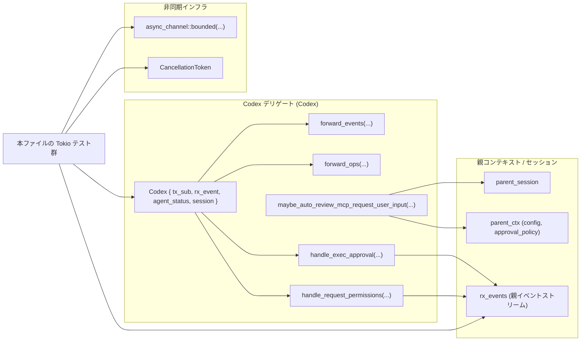
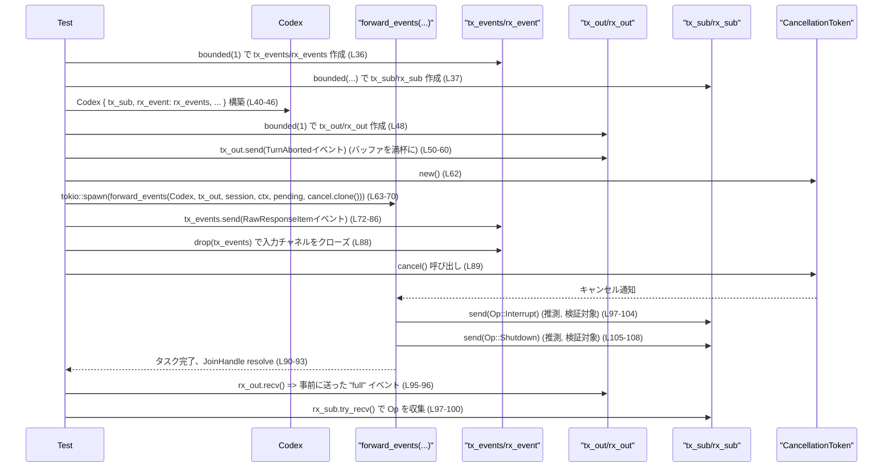

# core\src\codex_delegate_tests.rs

## 0. ざっくり一言

Codex の「デリゲート」機構が、  

- イベント転送  
- サブミッション転送  
- パーミッション要求  
- 実行承認（Guardian）  
- MCP ツール承認の自動拒否  

といった非同期フローの中で正しく動くことを検証する Tokio ベースの統合テスト集です  
（根拠: `codex_delegate_tests.rs:L34-411`）。

---

## 1. このモジュールの役割

### 1.1 概要

このモジュールは、Codex の「サブエージェント／デリゲート」側ロジックに対して次を確認するテストを提供します。

- イベント転送 (`forward_events`) がキャンセル時に **Interrupt と Shutdown の両方の Op** を発行しつつ停止すること  
  （`forward_events_cancelled_while_send_blocked_shuts_down_delegate`、`codex_delegate_tests.rs:L34-109`）。
- サブミッション転送 (`forward_ops`) が **W3C Trace Context を損なわず** に中継し、入力チャネルのクローズで終了すること  
  （`L111-153`）。
- 権限リクエスト (`handle_request_permissions`) が **tool call の `call_id` を往復のキーとして維持** し、親セッションからの応答を `Op::RequestPermissionsResponse` に載せて返すこと  
  （`L155-241`）。
- 実行承認 (`handle_exec_approval`) が子ターンからの Exec 要求を Guardian 向けの評価イベントに変換し、キャンセル時に `ReviewDecision::Abort` で応答すること  
  （`L243-353`）。
- MCP ツール承認質問に対して、Guardian 側で Abort 相当になった場合に **合成の「拒否」回答** を自動生成すること  
  （`L355-411`）。

いずれも **非同期処理・チャネル・キャンセル** に関する挙動を重点的に検証しています。

### 1.2 アーキテクチャ内での位置づけ

このテストファイルは、Codex デリゲートと親セッション／親コンテキストの間にある非同期フローを検証します。



- Codex デリゲートは `tx_sub` 経由で Op を外部へ送り出し、`rx_event` からイベントを受信します（`Codex` 構築: `L40-46, L117-123, L164-170, L260-266`）。
- 親セッション／親コンテキストは、権限や Guardian 評価イベントの送受信を担います（`make_session_and_context_with_rx` の利用: `L39, L157-158, L245-246, L357-358`）。
- `CancellationToken` と `async_channel::bounded` によって、キャンセル・バックプレッシャーを含む並行性シナリオが再現されています（`L36-37, L48-49, L62, L125, L182, L268, L377-378`）。

### 1.3 設計上のポイント

このテストコードから読み取れる設計上の特徴です。

- **キャンセル対応の明示的検証**  
  - `CancellationToken` を各ハンドラに渡し、キャンセル発生時に  
    - delegate 側から `Op::Interrupt` と `Op::Shutdown` を送ること（`L89-108`）  
    - 実行承認フローが `ReviewDecision::Abort` で終了すること（`L334-351`）  
    を確認しています。
- **チャネル容量とブロッキングのシナリオテスト**  
  - `async_channel::bounded(1)` を使い、送信側がブロックする状況を人工的に作り出しています  
    （`tx_out` を事前に埋めた状態で `forward_events` を動かす: `L48-60, L63-70`）。
- **トレースコンテキストの伝播保証**  
  - `W3cTraceContext` を `Submission.trace` に設定し、`forward_ops` を通して id/op/trace が完全に一致していることを検証しています（`L128-147`）。
- **ID の往復整合性（コントラクト）**  
  - `call_id` が RequestPermissions イベントと応答 Op の両方で一致すること（`L172-181, L212-220, L230-240`）。  
  - Exec 承認では、`call_id` が GuardianAssessment の `target_item_id` に、`approval_id` が最終的な `Op::ExecApproval.id` に使われること（`L281-283, L320-322, L345-348`）。
- **安全側デフォルト（セキュリティ観点）**  
  - Guardian ベースの Exec 承認が完了しない／キャンセルされた場合に `ReviewDecision::Abort` が選択されること（`L334-351`）。  
  - MCP ツール承認のフローで Guardian 側 Abort に相当する状況では、合成の「拒否」回答を返すこと（`L377-378, L380-410`）。

---

## 2. 主要な機能一覧

このファイル内のテストがカバーしている主な機能（＝対象 API のシナリオ）です。

- `forward_events` のキャンセル時挙動: 送信ブロック中にキャンセルされた際に、デリゲートが `Op::Interrupt` と `Op::Shutdown` を発行して終了すること  
  （`forward_events_cancelled_while_send_blocked_shuts_down_delegate`, `L34-109`）。
- `forward_ops` のトレースコンテキスト保全: `Submission` の `id` / `op` / `trace` がそのまま `tx_sub` に転送されること  
  （`forward_ops_preserves_submission_trace_context`, `L111-153`）。
- `handle_request_permissions` のラウンドトリップ ID 整合性: 子ターンからの `RequestPermissionsEvent.call_id` が、親セッションイベントと `Op::RequestPermissionsResponse.id` で一致すること  
  （`L155-241`）。
- `handle_exec_approval` の Guardian 評価フロー:  
  - GuardianSubagent 設定時に GuardianAssessment イベントが生成され、  
  - キャンセル時に `Op::ExecApproval` が `ReviewDecision::Abort` を返すこと  
  （`L243-353`）。
- `maybe_auto_review_mcp_request_user_input` の自動拒否回答: GuardianSubagent かつ OnRequest ポリシーで、キャンセル済みトークンと MCP Approval 質問に対し合成の decline 回答を生成すること  
  （`L355-411`）。

---

## 3. 公開 API と詳細解説

### 3.1 型・関数インベントリー

#### 関数（テスト関数 + テスト対象 API 呼び出し）

| 名前 | 種別 | 役割 / 用途 | ソース |
|------|------|-------------|--------|
| `forward_events_cancelled_while_send_blocked_shuts_down_delegate` | `#[tokio::test]` 非同期テスト | `forward_events` が送信ブロック中にキャンセルされたとき、Interrupt と Shutdown を送ることを検証 | `codex_delegate_tests.rs:L34-109` |
| `forward_ops_preserves_submission_trace_context` | `#[tokio::test]` | `forward_ops` が `Submission` のトレースコンテキストを変えずに転送することを検証 | `L111-153` |
| `handle_request_permissions_uses_tool_call_id_for_round_trip` | `#[tokio::test]` | パーミッション要求の `call_id` が往復で維持されることを検証 | `L155-241` |
| `handle_exec_approval_uses_call_id_for_guardian_review_and_approval_id_for_reply` | `#[tokio::test]` | Exec 承認の Guardian 評価と応答 ID の関係を検証 | `L243-353` |
| `delegated_mcp_guardian_abort_returns_synthetic_decline_answer` | `#[tokio::test]` | MCP ツール承認が Guardian Abort になった場合の合成拒否回答を検証 | `L355-411` |
| `forward_events(...)` | 外部非同期関数（実装は他ファイル） | デリゲート側でイベントを転送し、キャンセル時に Op を発行して終了 | 呼び出し: `L63-70` |
| `forward_ops(...)` | 外部非同期関数 | サブミッションを Codex の `tx_sub` に転送し、チャネルクローズで終了 | 呼び出し: `L126` |
| `handle_request_permissions(...)` | 外部非同期関数 | 子ターンの `RequestPermissionsEvent` を親セッションに橋渡しし、応答を `Op::RequestPermissionsResponse` として返す | 呼び出し: `L191-207` |
| `handle_exec_approval(...)` | 外部非同期関数 | Exec 承認リクエストを Guardian 評価フローに乗せ、最終的に `Op::ExecApproval` を返す | 呼び出し: `L275-298` |
| `maybe_auto_review_mcp_request_user_input(...)` | 外部非同期関数 | MCP ツール承認質問に対し自動的に拒否回答を生成するかどうかを決定 | 呼び出し: `L380-397` |

#### 主な型（このファイル内で新規定義は無し）

| 名前 | 種別 | 定義場所（推定） | 役割 / 用途 | 使用箇所 |
|------|------|------------------|-------------|----------|
| `Codex` | 構造体 | `super::*` | デリゲートのエージェント状態・イベントチャネル・セッションなどを束ねるコンテナ | インスタンス生成 `L40-46, L117-123, L164-170, L260-266` |
| `Submission` | 構造体 | `super::*` | デリゲートからメインループへ送る操作（`Op`）とトレース情報をまとめたもの | 作成 `L128-137`; 受信 `L97-100, L141-147, L230-240, L341-351` |
| `Op` | enum | `super::*` | デリゲートが発行する操作種別（Interrupt, Shutdown, RequestPermissionsResponse, ExecApproval など） | マッチ／比較 `L101-108, L130, L235-239, L347-351` |
| `Event` | 構造体 | `super::*` | セッション間でやり取りされるイベント（`EventMsg` を内包） | 送信 `L50-57, L73-83`; 受信 `L212-217, L303-307` |
| `EventMsg` | enum | `codex_protocol::protocol` | イベントの種類（`TurnAborted`, `RawResponseItem`, `RequestPermissions`, `GuardianAssessment` 等） | 使用 `L52, L75, L216, L306` |
| `ExecApprovalRequestEvent` | 構造体 | `codex_protocol::protocol` | 子ターンからの Exec 承認リクエスト情報 | 作成 `L280-296` |
| `RequestPermissionsEvent` | 構造体 | `codex_protocol::request_permissions` | 子ターンからの権限要求（call_id, permissions 等） | 作成 `L195-205` |
| `RequestPermissionsResponse` | 構造体 | 同上 | 親側からの権限付与結果 | 作成 `L173-181` |
| `RequestUserInputEvent` | 構造体 | `codex_protocol::request_user_input` | MCP ツール承認などのユーザー入力要求 | 作成 `L384-395` |
| `RequestUserInputAnswer` | 構造体 | 同上 | 個々の質問に対する回答（複数回答可） | 作成 `L405-407` |
| `CancellationToken` | 構造体 | `super::*` など | 非同期タスクのキャンセルを伝えるトークン | 生成・使用 `L62, L89, L125, L182, L268, L334, L377-378` |

> 注: これらの型の実装自体は本チャンクには現れず、名前と利用方法のみから役割を説明しています。

---

### 3.2 重要関数（テスト対象 API）の詳細

ここでは **実装本体は別モジュール** ですが、このテストから読み取れる挙動を「契約」として整理します。

---

#### `forward_events(codex, tx_out, session, ctx, pending_mcp_invocations, cancel)`

**概要**

- デリゲート内部のイベント受信チャネル (`codex.rx_event`) からイベントを読み取り、`tx_out` などを通じて外部へ転送する非同期ループであると解釈できます（根拠: 呼び出しとチャネル構成 `L36-46, L48-60, L63-70`）。
- キャンセルが発生した場合、`Op::Interrupt` と `Op::Shutdown` を `codex.tx_sub` に送信してデリゲートを停止させることが期待されています（`L97-108`）。

**引数（テストから推測される役割）**

| 引数名 | 型（推定） | 説明 |
|--------|-----------|------|
| `codex` | `Arc<Codex>` | デリゲートの状態と `tx_sub` / `rx_event` チャネルを保持するコンテナ（`L40-46, L63-65`）。 |
| `tx_out` | `async_channel::Sender<Event>` | 親側へイベントを転送するための送信チャネル（`L48-60, L63-66`）。 |
| `session` | `Arc<Session>` 相当 | 現在のセッション状態への参照。詳細は不明（`L39-40, L66`）。 |
| `ctx` | `Arc<TurnContext>` 相当 | ターンコンテキスト（サブ ID など）への参照。詳細は不明（`L39, L67`）。 |
| `pending_mcp_invocations` | `Arc<Mutex<HashMap<...>>>` | MCP ツール呼び出しの管理用マップと推測されます（`L68`）。 |
| `cancel` | `CancellationToken` | ループ終了・シャットダウンを指示するキャンセルトークン（`L62-63, L69, L89`）。 |

**戻り値**

- `tokio::spawn(forward_events(...))` が `JoinHandle<_>` を返していることから、`forward_events` 自体は `Future<Output = ()>` に近い形であると推測できます（`L63-70, L90-93`）。
- エラー型はテストからは読み取れません。

**内部処理の流れ（テストから読める範囲の推測）**

1. `codex.rx_event` からイベントを受信し、適宜 `tx_out` に転送するループを持つ。  
   - `rx_event` は `bounded(1)` で作られたチャネルの受信側です（`L36-37, L40-42`）。
2. ループ内で `tx_out.send(...)` を行うが、チャネルが満杯の場合は `await` によりブロックされる。  
   - テストでは `tx_out` をあらかじめ 1 件で満杯にして、最初の送信がブロックされるようにしています（`L48-60`）。
3. `cancel` が発火した場合、ループを抜ける前後で `codex.tx_sub` に  
   - `Op::Interrupt` と  
   - `Op::Shutdown`  
   を送信する（`L97-108`）。
4. ループ終了後、タスクは正しく完了し、`JoinHandle` が正常終了する（`L90-93`）。

**Examples（使用例）**

テスト内の簡略版です。

```rust
// イベントチャネルとサブミッションチャネルを用意
let (tx_events, rx_events) = bounded(1);                     // デリゲートが読むイベント
let (tx_sub, rx_sub) = bounded(SUBMISSION_CHANNEL_CAPACITY); // デリゲートが書く Op

// Codex デリゲートを構築
let (_agent_status_tx, agent_status) = watch::channel(AgentStatus::PendingInit);
let (session, ctx, _rx_evt) = crate::codex::make_session_and_context_with_rx().await;
let codex = Arc::new(Codex {
    tx_sub,
    rx_event: rx_events,
    agent_status,
    session: Arc::clone(&session),
    session_loop_termination: completed_session_loop_termination(),
});

// 親側へのイベント送信用チャネルを準備し、あえて満杯にする
let (tx_out, rx_out) = bounded(1);
tx_out.send(/* TurnAborted イベント */).await.unwrap();

let cancel = CancellationToken::new();

// forward_events を別タスクで起動
let handle = tokio::spawn(forward_events(
    Arc::clone(&codex),
    tx_out.clone(),
    session,
    ctx,
    Arc::new(Mutex::new(HashMap::new())),
    cancel.clone(),
));
```

**Errors / Panics**

- テスト側は `.expect("forward_events hung")` および `.expect("forward_events join error")` を用いて、  
  タスクがタイムアウトしたり Join に失敗した場合にパニックします（`L90-93`）。
- `forward_events` 自体の戻り値が `Result` かどうかは、本チャンクからは分かりません。

**Edge cases（エッジケース）**

- **送信ブロック中のキャンセル**  
  - `tx_out` が満杯で `forward_events` が送信待ちになっている状態で `cancel.cancel()` すると、  
    それでも `Op::Interrupt` と `Op::Shutdown` が発行されることが期待されています（`L48-60, L89-108`）。
- **入力チャネルクローズ**  
  - `drop(tx_events)` によりイベント入力チャネルがクローズされたあとも、キャンセルを受けて安全に終了します（`L88-93`）。

**使用上の注意点**

- キャンセルによる終了を期待する場合、**必ず `CancellationToken` を共有** し、適切なタイミングで `cancel()` を呼び出す必要があります（`L62-63, L89`）。
- バッファ容量 1 のチャネルに依存した挙動をテストしているため、本番環境で容量が異なる場合はブロッキングのタイミングが変わる可能性があります（`L36-37, L48-49`）。
- セキュリティ的には、キャンセル時に必ず `Interrupt` と `Shutdown` を送ることで、誤って危険な操作が継続されることを防いでいます（`L101-108`）。

---

#### `forward_ops(codex, rx_ops, cancel)`

**概要**

- デリゲートに渡された `Submission` を、`codex.tx_sub` にそのまま転送する非同期ループです（`L128-147`）。
- 入力チャネルがクローズされるとタスクは終了し、トレースコンテキスト（W3C Trace Context）を含めて内容を一切変更しないことが確認されています。

**引数（推定）**

| 引数名 | 型（推定） | 説明 |
|--------|-----------|------|
| `codex` | `Arc<Codex>` | 転送先 `tx_sub` を保持するコンテナ（`L117-123, L126`）。 |
| `rx_ops` | `async_channel::Receiver<Submission>` | 外部から送られてくる `Submission` の受信チャネル（`L124-126, L138-139`）。 |
| `cancel` | `CancellationToken` | 将来的なキャンセルフック。テストでは未使用（`L125-126`）。 |

**戻り値**

- `tokio::spawn(forward_ops(...))` から推測すると、`Future<Output = ()>` 型に近い非同期関数です（`L126, L149-152`）。

**内部処理の流れ（推測）**

1. `rx_ops` から `Submission` を連続して受信するループを持つ（`L138-139`）。
2. 受信した `Submission` を、フィールドを変更せずに `codex.tx_sub` に送信する。  
   - テストでは `id`, `op`, `trace` が完全一致することを確認（`L141-147`）。
3. `rx_ops` がクローズされ、すべてのメッセージを処理し終えると、ループを抜けてタスクが終了する（`L138-139, L149-152`）。

**Examples（使用例）**

```rust
let (tx_sub, rx_sub) = bounded(SUBMISSION_CHANNEL_CAPACITY); // Codex 側チャネル
let (_tx_events, rx_events) = bounded(SUBMISSION_CHANNEL_CAPACITY);
let (_agent_status_tx, agent_status) = watch::channel(AgentStatus::PendingInit);
let (session, _ctx, _rx_evt) = crate::codex::make_session_and_context_with_rx().await;

let codex = Arc::new(Codex {
    tx_sub,
    rx_event: rx_events,
    agent_status,
    session,
    session_loop_termination: completed_session_loop_termination(),
});

let (tx_ops, rx_ops) = bounded(1);
let cancel = CancellationToken::new();

// 転送タスクを起動
let handle = tokio::spawn(forward_ops(Arc::clone(&codex), rx_ops, cancel));

// どこか別の場所で Submission を送る
let submission = Submission { /* ... */ };
tx_ops.send(submission).await.unwrap();
drop(tx_ops); // 送信の完了を示すためにクローズ
```

**Errors / Panics**

- テスト側で `timeout(...).expect("forward_ops hung")` により、終了しない場合はパニックします（`L141-152`）。
- `forward_ops` 自体のエラー型は不明です。

**Edge cases**

- **`trace` フィールドの保持**  
  - `W3cTraceContext` の `traceparent` と `tracestate` がそのまま保たれる必要があります（`L131-136, L145-147`）。
- **入力チャネルクローズ時の終了**  
  - `drop(tx_ops)` によって `rx_ops` がクローズされたとき、タスクは速やかに終了する必要があります（`L138-140, L149-152`）。

**使用上の注意点**

- `forward_ops` は単なる転送役であるため、`Submission` の内容（特にトレース情報）を変更したい場合は、**呼び出し元で加工した上で送信する** 必要があります。
- 無限ループを避けるため、入力チャネルがクローズされる経路を必ず用意するべきです（テストでは `drop(tx_ops)` で実現: `L138-140`）。

---

#### `handle_request_permissions(codex, parent_session, parent_ctx, event, cancel)`

**概要**

- 子ターン側で発生した `RequestPermissionsEvent` を、親セッションに委譲し、その応答を `Op::RequestPermissionsResponse` としてデリゲート側に返すブリッジ関数です（`L185-210, L212-240`）。
- `call_id` が「往復のキー」となっており、  
  - 親に送る RequestPermissions イベント  
  - 親からの `notify_request_permissions_response` 呼び出し  
  - デリゲートへの最終 `Op::RequestPermissionsResponse.id`  
  の間で一貫性を持つことがテストされています（`L172-181, L212-220, L221-239`）。

**引数（推定）**

| 引数名 | 型（推定） | 説明 |
|--------|-----------|------|
| `codex` | `&Codex` | デリゲートへの操作送信（`tx_sub`）に利用（`L191-193, L230-240`）。 |
| `parent_session` | `&Arc<...>` | 親セッション。イベント送信と `notify_request_permissions_response` 連携に使われます（`L157-159, L187, L221-223`）。 |
| `parent_ctx` | `&Arc<...>` | 親コンテキスト。サブ ID や設定などを保持（詳細不明）（`L158-159, L188`）。 |
| `event` | `RequestPermissionsEvent` | 子ターンから渡された権限要求 (`call_id`, `permissions`, `turn_id` など)（`L195-205`）。 |
| `cancel` | `&CancellationToken` | キャンセル処理に利用可能。テストではキャンセルされません（`L182-183, L206`）。 |

**戻り値**

- テストでは戻り値を用いていません（`handle_request_permissions(...).await;` のみ: `L191-208`）。  
  `Future<Output = ()>` に近いと推測されます。

**内部処理の流れ（推測）**

1. 子ターンからの `RequestPermissionsEvent` を受け取る（`L195-205`）。
2. 親セッション側に `EventMsg::RequestPermissions` を送信する。  
   - 親側の `rx_events` から `RequestPermissions` イベントを受信できていることからわかります（`L212-217`）。
   - この時の `call_id` は元の `call_id` と一致しています（`L172-173, L216-220`）。
3. 親側から `parent_session.notify_request_permissions_response(&call_id, response)` が呼ばれるのを待つ（`L221-223`）。
4. 受け取った `RequestPermissionsResponse` を `Op::RequestPermissionsResponse { id: call_id, response }` に変換して `codex.tx_sub` に送信する（`L230-240`）。

**Examples（使用例）**

```rust
// 子ターンからの RequestPermissionsEvent
let event = RequestPermissionsEvent {
    call_id: "tool-call-1".to_string(),
    turn_id: "child-turn-1".to_string(),
    reason: Some("need access".to_string()),
    permissions: RequestPermissionProfile {
        network: Some(NetworkPermissions { enabled: Some(true) }),
        ..RequestPermissionProfile::default()
    },
};

let cancel_token = CancellationToken::new();

// 親コンテキストと親セッションへ委譲
handle_request_permissions(
    codex.as_ref(),
    &parent_session,
    &parent_ctx,
    event,
    &cancel_token,
).await;

// 親側はどこかで notify_request_permissions_response を呼ぶ
parent_session
    .notify_request_permissions_response(
        &"tool-call-1".to_string(),
        expected_response.clone(),
    )
    .await;
```

**Errors / Panics**

- 親側から適切なレスポンスが来ない場合の挙動（タイムアウト・エラー）は、本チャンクからは分かりません。
- テストは 1 秒の `timeout` を使い、イベントと応答の双方が届かない場合はパニックします（`L212-215, L230-233, L225-228`）。

**Edge cases**

- **アクティブターンの前提**  
  - テストの冒頭で `*parent_session.active_turn.lock().await = Some(ActiveTurn::default())` としていることから（`L159`）、アクティブターンが存在することが前提条件と考えられます。
- **レスポンス未到着**  
  - 親側が `notify_request_permissions_response` を呼ばない場合どうなるかはコードからは読めませんが、ハング防止のために何らかのタイムアウトやキャンセルに依存している可能性があります。

**使用上の注意点**

- `call_id` はラウンドトリップのキーになっているため、一意で衝突しないように管理する必要があります（`L172-173, L219-220, L235-239`）。
- 親セッションが `notify_request_permissions_response` を確実に呼ぶフローを設計する必要があります。そうしないとデリゲート側で待ち状態が続く可能性があります。

---

#### `handle_exec_approval(codex, child_turn_id, parent_session, parent_ctx, event, cancel)`

**概要**

- 子ターンからの「危険なコマンド実行リクエスト」を Guardian サブエージェントに評価させるためのブリッジ関数です（`L243-255, L275-296, L303-332`）。
- Guardian 評価イベントを親コンテキスト上で発行し、キャンセルされた場合には安全側として `ReviewDecision::Abort` を返すことがテストされています（`L334-351`）。

**引数（推定）**

| 引数名 | 型（推定） | 説明 |
|--------|-----------|------|
| `codex` | `&Codex` | 最終的な `Op::ExecApproval` の送信先（`L260-266, L345-351`）。 |
| `child_turn_id` | `String` | 子ターン ID。最終的な `Op::ExecApproval.turn_id` に設定されます（`L277-278, L349-350`）。 |
| `parent_session` | `&Arc<...>` | Guardian 評価イベントの送信元となる親セッション（`L245-246, L271-272, L303-307`）。 |
| `parent_ctx` | `&Arc<...>` | 親コンテキスト。`sub_id` が GuardianAssessment の `turn_id` に使われています（`L247-255, L323`）。 |
| `event` | `ExecApprovalRequestEvent` | コマンド、cwd、理由、`call_id`（target_item_id 用）、`approval_id`（応答 ID 用）などを含むリクエスト（`L280-296`）。 |
| `cancel` | `&CancellationToken` | Guardian 評価がキャンセルされたことを示すトークン（`L268-269, L297-298, L334`）。 |

**戻り値**

- テストでは戻り値を使用していません。`Future<Output = ()>` に近いと推測されます（`L275-299, L336-339`）。

**内部処理の流れ（推測）**

1. `ExecApprovalRequestEvent` を受け取り、その `command` や `cwd` などから `GuardianAssessmentAction::Command` を構成する（`L280-296, L313-317`）。
2. GuardianSubagent 設定（`ApprovalsReviewer::GuardianSubagent`）および `AskForApproval::OnRequest` ポリシーのもとで、親コンテキスト側に `EventMsg::GuardianAssessment` を送信する（`L248-255, L313-332`）。
   - `assessment_event.target_item_id = Some("command-item-1")`（`call_id`）  
   - `assessment_event.turn_id = parent_ctx.sub_id`（`L323`）  
   - `assessment_event.status = InProgress`（`L324-327`）  
   - `assessment_event.action` が `"rm -rf tmp"` と `/tmp` に設定される（`L313-317, L332`）。
3. Guardian 側から承認・拒否結果が来るまで待つか、`cancel` が発火するまで待つ。
4. テストでは `cancel_token.cancel()` が呼ばれるので（`L334`）、結果として `Op::ExecApproval { id: "callback-approval-1", turn_id: Some("child-turn-1"), decision: ReviewDecision::Abort }` を `codex.tx_sub` に送信する（`L341-351`）。

**Examples（使用例）**

```rust
let cancel_token = CancellationToken::new();

handle_exec_approval(
    codex.as_ref(),
    "child-turn-1".to_string(),
    &parent_session,
    &parent_ctx,
    ExecApprovalRequestEvent {
        call_id: "command-item-1".to_string(),
        approval_id: Some("callback-approval-1".to_string()),
        turn_id: "child-turn-1".to_string(),
        command: vec!["rm".to_string(), "-rf".to_string(), "tmp".to_string()],
        cwd: PathBuf::from("/tmp"),
        reason: Some("unsafe subcommand".to_string()),
        network_approval_context: None,
        proposed_execpolicy_amendment: None,
        proposed_network_policy_amendments: None,
        additional_permissions: None,
        available_decisions: Some(vec![ReviewDecision::Approved, ReviewDecision::Abort]),
        parsed_cmd: Vec::new(),
    },
    &cancel_token,
).await;
```

**Errors / Panics**

- Guardian 側が何も返さず、かつキャンセルも発動しない場合の挙動は不明です。
- テストでは 2 秒の `timeout` により、GuardianAssessment イベントとタスク終了が保証されなければパニックします（`L303-312, L336-339, L341-344`）。

**Edge cases**

- **Guardia n 未応答・キャンセル**  
  - `cancel` が発火した場合、ユーザ承認が行われないまま `ReviewDecision::Abort` が採用されることが確認されています（`L334-351`）。  
    これは「応答がない場合は安全側（Abort）」というセキュリティ上の重要な性質です。
- **ターン ID の扱い**  
  - GuardianAssessment の `turn_id` は親コンテキストの `sub_id` を使用し（`L323`）、最終 `Op::ExecApproval.turn_id` は子ターン ID を使用します（`L277-278, L349-350`）。  
    これは「親ビューでの識別」と「子ターンとの関連付け」を分けるための仕様と解釈できます。

**使用上の注意点**

- `ApprovalsReviewer::GuardianSubagent` と `AskForApproval::OnRequest` の設定が前提になっている挙動であり（`L248-255`）、設定値が異なる場合には別のコードパスが使われる可能性があります。
- `call_id` と `approval_id` は別用途（前者が GuardianAssessment の item ID、後者が応答の callback ID）であるため、混同しないようにする必要があります（`L281-283, L320-322, L345-348`）。
- キャンセルによりデフォルトが Abort になるため、ユーザが承認する余地がある場合はキャンセルのタイミングを慎重に扱う必要があります。

---

#### `maybe_auto_review_mcp_request_user_input(parent_session, parent_ctx, pending, event, cancel)`

**概要**

- MCP ツール呼び出しに関するユーザー入力（承認）のリクエストに対し、特定条件下で自動的に「拒否」回答を生成する関数です（`L369-376, L380-410`）。
- テストでは、GuardianSubagent 設定 & OnRequest ポリシー & キャンセル済みトークンのもとで、合成の decline 回答 (`MCP_TOOL_APPROVAL_DECLINE_SYNTHETIC`) を返すことを確認しています。

**引数（推定）**

| 引数名 | 型（推定） | 説明 |
|--------|-----------|------|
| `parent_session` | `&Arc<...>` | MCP 呼び出しのメタ情報や状態へのアクセスに利用される可能性があります（`L381`）。 |
| `parent_ctx` | `&Arc<...>` | approvals 設定（GuardianSubagent / OnRequest）を保持（`L359-367, L382`）。 |
| `pending_mcp_invocations` | `&Arc<Mutex<HashMap<String, McpInvocation>>>` | 未処理の MCP 呼び出し情報（server, tool, arguments）を保持（`L369-376, L383`）。 |
| `event` | `&RequestUserInputEvent` | MCP ツール承認に関する質問 (`questions[0].id` が MCP 承認用 ID)（`L384-395`）。 |
| `cancel` | `&CancellationToken` | Guardian 側が Abort した、あるいはユーザ入力がキャンセルされたことを示すトークン（`L377-378, L396`）。 |

**戻り値**

- テストでは `Option<RequestUserInputResponse>` であり、ここでは `Some(...)` が返ってきます（`L400-410`）。
- 条件が満たされない場合に `None` を返す可能性がありますが、このファイルからは確認できません。

**内部処理の流れ（推測）**

1. approvals 設定が `GuardianSubagent` + `AskForApproval::OnRequest` であることを前提として動作（`L359-367`）。
2. `pending_mcp_invocations` から `call_id` に対応するエントリが存在するか確認（`L369-376, L385-386`）。
3. `RequestUserInputEvent.questions` の中に MCP ツール承認用の質問が含まれているか確認。  
   - `id` が `"{MCP_TOOL_APPROVAL_QUESTION_ID_PREFIX}_call-1"` になっている（`L387-389`）。
4. `cancel` がすでにキャンセル済みであることを確認（`L377-378`）。
5. 上記条件を満たした場合、`RequestUserInputResponse` を組み立てて `Some(...)` として返す。  
   - 回答は 1 件で、内容は `MCP_TOOL_APPROVAL_DECLINE_SYNTHETIC`（`L400-408`）。

**Examples（使用例）**

```rust
let pending_mcp_invocations = Arc::new(Mutex::new(HashMap::from([(
    "call-1".to_string(),
    McpInvocation {
        server: "custom_server".to_string(),
        tool: "dangerous_tool".to_string(),
        arguments: None,
    },
)])));

let cancel_token = CancellationToken::new();
cancel_token.cancel(); // Guardian 側で Abort されたとみなす

let response = maybe_auto_review_mcp_request_user_input(
    &parent_session,
    &parent_ctx,
    &pending_mcp_invocations,
    &RequestUserInputEvent {
        call_id: "call-1".to_string(),
        turn_id: "child-turn-1".to_string(),
        questions: vec![RequestUserInputQuestion {
            id: format!("{MCP_TOOL_APPROVAL_QUESTION_ID_PREFIX}_call-1"),
            header: "Approve app tool call?".to_string(),
            question: "Allow this app tool?".to_string(),
            is_other: false,
            is_secret: false,
            options: None,
        }],
    },
    &cancel_token,
).await;
```

**Errors / Panics**

- 本関数内でのパニックまたはエラー条件はこのファイルからは読み取れません。

**Edge cases**

- **キャンセル未発生**  
  - `cancel` が未キャンセルの場合にどう振る舞うか（例えば `None` を返す、あるいは `Some` だが別回答など）は不明です。
- **pending に call_id が存在しない**  
  - `pending_mcp_invocations` に対応するエントリがない場合の扱いも不明です（例外・`None`・デフォルト回答など）。
- **質問 ID が想定の形式でない**  
  - `questions[0].id` が `MCP_TOOL_APPROVAL_QUESTION_ID_PREFIX` に一致しない場合の動作はテストされていません。

**使用上の注意点**

- このテストからは、「Guardian に委譲された MCP ツール承認が何らかの理由（キャンセル）で完遂しない場合は、自動的に拒否する」という安全側のポリシーが推測されます（`L359-367, L377-378, L400-408`）。
- `pending_mcp_invocations` の整合性（call_id ↔ invocation）はこの関数の前提条件と考えられます（`L369-376, L385-386`）。

---

### 3.3 その他の関数（テスト本体）

テスト本体自体は上記 API の使用例であり、補助的な役割です。代表的なものを一覧にします。

| 関数名 | 役割 | ソース |
|--------|------|--------|
| `forward_events_cancelled_while_send_blocked_shuts_down_delegate` | `forward_events` のキャンセル時動作（Interrupt/Shutdown 発行）を検証 | `L34-109` |
| `forward_ops_preserves_submission_trace_context` | `forward_ops` が Submission のトレースコンテキストをそのまま渡すことを検証 | `L111-153` |
| `handle_request_permissions_uses_tool_call_id_for_round_trip` | RequestPermissions の `call_id` が往復で保持されることを検証 | `L155-241` |
| `handle_exec_approval_uses_call_id_for_guardian_review_and_approval_id_for_reply` | Exec 承認の Guardian 評価・ID マッピングと Abort デフォルトを検証 | `L243-353` |
| `delegated_mcp_guardian_abort_returns_synthetic_decline_answer` | MCP ツール承認における Guardian Abort → 合成拒否回答を検証 | `L355-411` |

---

## 4. データフロー

ここでは、2 つの代表的なシナリオのデータフローを示します。

### 4.1 `forward_events` のキャンセル・シャットダウンフロー（L34-109）

このシナリオでは、デリゲートがイベントを転送中にキャンセルされる場合の挙動を検証しています。



ポイント:

- `tx_out` を先に満杯にすることで、`forward_events` の送信がブロックしている状態でキャンセルされるパスをテストしています（`L48-60, L63-70`）。
- キャンセル後も `Op::Interrupt` と `Op::Shutdown` が送られていることが `rx_sub` 経由で確認されます（`L97-108`）。

### 4.2 `handle_exec_approval` の Guardian 評価フロー（L243-353）

`ExecApprovalRequestEvent` から GuardianAssessment と最終 `Op::ExecApproval` に至るフローです。

```mermaid
sequenceDiagram
    %% handle_exec_approval_... (L243-353)
    participant Test
    participant Parent as "parent_session/parent_ctx"
    participant Codex
    participant HEA as "handle_exec_approval(...)"
    participant GEvents as "rx_events (Guardian 評価イベント)"
    participant Sub as "tx_sub/rx_sub"
    participant Cancel as "CancellationToken"

    Test->>Parent: make_session_and_context_with_rx() (L245-246)
    Test->>Parent: approvals_reviewer = GuardianSubagent (L248-250)
    Test->>Parent: approval_policy = OnRequest (L251-255)

    Test->>Codex: Codex { tx_sub, rx_event: rx_events_child, ... } 構築 (L257-266)
    Test->>Cancel: new() (L268)

    Test->>HEA: tokio::spawn(handle_exec_approval(Codex, "child-turn-1", &parent_session, &parent_ctx, ExecApprovalRequestEvent{...}, &cancel)) (L269-301)

    HEA->>Parent: GuardianAssessment イベント送信 (EventMsg::GuardianAssessment) (推測; 検証対象) (L303-307)
    Parent->>GEvents: イベントを rx_events に流す (L245-246)

    Test->>GEvents: GuardianAssessment を受信し内容検証 (id / target_item_id / turn_id / action ...) (L303-332)

    Test->>Cancel: cancel() 呼び出し (L334)
    Cancel-->>HEA: キャンセル通知

    HEA->>Sub: send(Op::ExecApproval { id: approval_id, turn_id: Some(child_turn_id), decision: Abort }) (推測; 検証対象) (L341-351)

    HEA-->>Test: タスク完了, JoinHandle resolve (L336-339)
    Test->>Sub: rx_sub.recv() で ExecApproval を検証 (L341-351)
```

ポイント:

- GuardianAssessment の `target_item_id` は `ExecApprovalRequestEvent.call_id` に一致し、`turn_id` は `parent_ctx.sub_id` であることが確認されています（`L281-283, L320-323`）。
- キャンセル時のデフォルト決定が `ReviewDecision::Abort` であることが `Op::ExecApproval` から分かります（`L345-351`）。

---

## 5. 使い方（How to Use）

このファイルはテストですが、実質的に **Codex デリゲート API の利用例** になっています。

### 5.1 基本的な使用方法（デリゲート起動）

`forward_events` / `forward_ops` を使って Codex デリゲートを駆動する典型的なフローです。

```rust
// 1. 設定や依存オブジェクトを用意する
let (tx_sub, rx_sub) = bounded(SUBMISSION_CHANNEL_CAPACITY);   // デリゲート→メインへの Op
let (tx_events, rx_events) = bounded(SUBMISSION_CHANNEL_CAPACITY); // メイン→デリゲートへのイベント
let (_agent_status_tx, agent_status) = watch::channel(AgentStatus::PendingInit);
let (session, ctx, _rx_evt) = crate::codex::make_session_and_context_with_rx().await;

// Codex を初期化
let codex = Arc::new(Codex {
    tx_sub,
    rx_event: rx_events,
    agent_status,
    session: Arc::clone(&session),
    session_loop_termination: completed_session_loop_termination(),
});

// 2. デリゲートのメイン処理を別タスクで起動する
let cancel = CancellationToken::new();
let (tx_out, rx_out) = bounded(16);                         // 親へのイベント
let events_task = tokio::spawn(forward_events(
    Arc::clone(&codex),
    tx_out.clone(),
    Arc::clone(&session),
    Arc::clone(&ctx),
    Arc::new(Mutex::new(HashMap::new())),
    cancel.clone(),
));

let (tx_ops, rx_ops) = bounded(16);                         // 親からの Op
let ops_task = tokio::spawn(forward_ops(Arc::clone(&codex), rx_ops, cancel.clone()));

// 3. 必要に応じて handle_request_permissions / handle_exec_approval などを呼び出す
//    （この部分は本テストのシナリオを参照）
```

### 5.2 よくある使用パターン

- **権限要求フロー**  
  - 子ターン側で権限が必要になったときに `handle_request_permissions` を呼び出し、  
    親セッションからの `notify_request_permissions_response` を待って結果を `Op::RequestPermissionsResponse` としてクライアントへ返す（`L185-240`）。
- **危険コマンドの Guardian レビュー**  
  - CLI コマンドなど危険な操作を実行する前に `handle_exec_approval` を呼び出し、Guardian サブエージェントの評価とユーザ承認を経て `Op::ExecApproval` を決定する（`L243-353`）。
- **MCP ツール承認の自動拒否**  
  - Guardian に委譲した MCP ツール承認がキャンセルされた場合、`maybe_auto_review_mcp_request_user_input` により自動で拒否回答を生成する（`L355-411`）。

### 5.3 よくある間違い（テストから推測される注意点）

```rust
// 誤り例: キャンセルやチャネルクローズの経路がなく、forward_ops が決して終了しない
let (tx_ops, rx_ops) = bounded(1);
let cancel = CancellationToken::new();
tokio::spawn(forward_ops(Arc::clone(&codex), rx_ops, cancel));
// tx_ops をクローズしないまま放置 → forward_ops が永遠に待ち続ける可能性

// 正しい例: 送信完了後に tx_ops をクローズし、タスクを終了可能にする
tx_ops.send(submission).await.unwrap();
drop(tx_ops); // これにより forward_ops のループが終了できる（L138-140, L149-152）
```

```rust
// 誤り例: ExecApprovalRequestEvent の call_id と approval_id の用途を混同する
ExecApprovalRequestEvent {
    call_id: "callback-approval-1".to_string(),  // 本来は command item ID
    approval_id: Some("command-item-1".to_string()),
    // ...
};

// 正しい例: call_id は GuardianAssessment の target_item_id、approval_id はコールバック用 ID
ExecApprovalRequestEvent {
    call_id: "command-item-1".to_string(),       // GuardianAssessment.target_item_id 用（L281, L320-322）
    approval_id: Some("callback-approval-1".to_string()), // ExecApproval.id 用（L282-283, L345-348）
    // ...
};
```

### 5.4 使用上の注意点（まとめ）

- **並行性 / キャンセル**
  - ループ型の非同期タスク（`forward_events`, `forward_ops`, `handle_exec_approval` など）には、  
    - 入力チャネルのクローズ  
    - `CancellationToken` のキャンセル  
    のいずれかで終了する経路が必要です（`L88-93, L138-140, L334-339`）。
- **ID の一貫性**
  - `call_id` / `approval_id` / `turn_id` などの ID は、それぞれの用途に沿って一貫して使う必要があります（`L172-181, L212-220, L281-283, L320-323, L345-350`）。
- **セキュリティ上の前提**
  - Guardian ベースの承認フローでは「応答がなければ Abort（拒否）」となることがテストから読み取れます（`L334-351, L377-408`）。  
    これは危険操作が誤って許可されないようにするための安全側の設計です。

---

## 6. 変更の仕方（How to Modify）

### 6.1 新しい機能（デリゲート挙動）を追加する場合

1. **Codex デリゲート側の API を実装／拡張する**  
   - 例: 新しい種類の承認フローやイベント転送を追加する。
2. **親セッション／親コンテキストとのインターフェースを設計する**  
   - どの ID を往復のキーに使うか、どのチャネルでイベントを送受信するかを決める。
3. **本ファイルにテストを追加する**  
   - 既存テストと同様に `make_session_and_context_with_rx` で環境を構築し（`L39, L157-158, L245-246, L357-358`）、  
   - `async_channel::bounded` と `CancellationToken` を用いて、想定される並行シナリオ（キャンセル・チャネルクローズ・タイムアウト）を再現する。
4. **ID 整合性と安全なデフォルトを検証する**  
   - `assert_eq!` や `matches!` を用いて、ID のマッピングとデフォルトの決定（例: Abort）が想定どおりであることを確認する（`L96, L145-147, L219-220, L235-239, L345-351, L400-408`）。

### 6.2 既存機能を変更する場合

- **影響範囲の確認**
  - `forward_events` / `forward_ops` / `handle_request_permissions` / `handle_exec_approval` / `maybe_auto_review_mcp_request_user_input` の呼び出し箇所を検索し、本ファイルのテスト以外も含めて契約を洗い出す必要があります。
- **契約（前提条件・返り値の意味）の維持**
  - 特に次の契約は変更に慎重を要します。
    - キャンセル時の `Op::Interrupt` + `Op::Shutdown` 発行（`L97-108`）。
    - `Submission.trace` の保全（`L131-137, L145-147`）。
    - `call_id` / `approval_id` / `turn_id` のマッピング（`L172-181, L212-220, L281-283, L320-323, L345-350`）。
    - 未承認時／キャンセル時の Abort / decline デフォルト（`L334-351, L377-408`）。
- **テストの更新**
  - 仕様変更に合わせて本ファイルのテストを修正し、  
    - 新しい期待値（例えば `ReviewDecision::Approved` になる条件など）を反映する。
  - タイムアウト値（1 秒 / 2 秒）に対する変更は、CI 環境での実行時間も考慮する必要があります（`L90-93, L141-152, L212-215, L225-228, L303-312, L336-344`）。

---

## 7. 関連ファイル

このモジュールと密接に関係するコンポーネント（モジュールパスベース）です。実際のファイルパスはこのチャンクからは分かりません。

| パス / モジュール | 役割 / 関係 |
|-------------------|------------|
| `crate::codex::make_session_and_context_with_rx` | セッションおよびターンコンテキストとイベント受信チャネルを生成するヘルパー関数。各テストの前処理で使用されています（`L39, L157-158, L245-246, L357-358`）。 |
| `crate::state::ActiveTurn` | セッションのアクティブターン状態を表す構造体。RequestPermissions テストの前提として設定されています（`L159`）。 |
| `crate::mcp_tool_call::{MCP_TOOL_APPROVAL_DECLINE_SYNTHETIC, MCP_TOOL_APPROVAL_QUESTION_ID_PREFIX}` | MCP ツール承認質問／回答を特定するための定数。`maybe_auto_review_mcp_request_user_input` のテストで使用されています（`L2-3, L388-389, L404-407`）。 |
| `codex_protocol::protocol::*` | `AgentStatus`, `EventMsg`, `ExecApprovalRequestEvent`, `GuardianAssessmentAction`, `GuardianAssessmentStatus`, `GuardianCommandSource`, `McpInvocation`, `ReviewDecision`, `TurnAbortedEvent` など、プロトコルレベルの型定義を提供します（`L8-19, L11-17, L281-296, L313-317`）。 |
| `codex_protocol::request_permissions::*` | `RequestPermissionProfile`, `RequestPermissionsEvent`, `RequestPermissionsResponse` など、権限要求フローの型（`L20-22, L173-181, L195-205`）。 |
| `codex_protocol::request_user_input::*` | `RequestUserInputEvent`, `RequestUserInputQuestion`, `RequestUserInputAnswer`（および `RequestUserInputResponse`）。MCP ツール承認質問の表現に使用（`L23-25, L384-395, L400-408`）。 |
| `async_channel` | 非同期チャネル (`bounded`) を提供し、イベント・サブミッションの送受信に使用（`L4, L36-37, L48-49, L113-114, L161-162, L257-258`）。 |
| `tokio::sync::watch` | `AgentStatus` の Watch チャネルを提供（`L31, L38, L115, L163, L259`）。 |
| `CancellationToken`（モジュールパスは super 経由） | 非同期タスクのキャンセル管理。複数テストで共通利用（`L62, L89, L125, L182, L268, L334, L377-378`）。 |

このテストファイルは、これらコンポーネント間の契約を明示的に検証することで、Codex デリゲートの非同期挙動・安全性・ID 整合性を保証する役割を果たしています。
