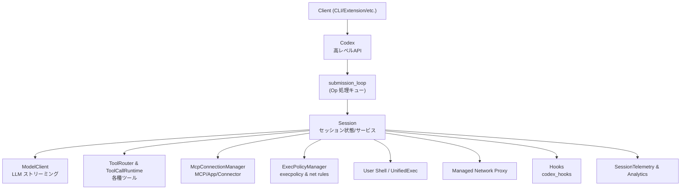
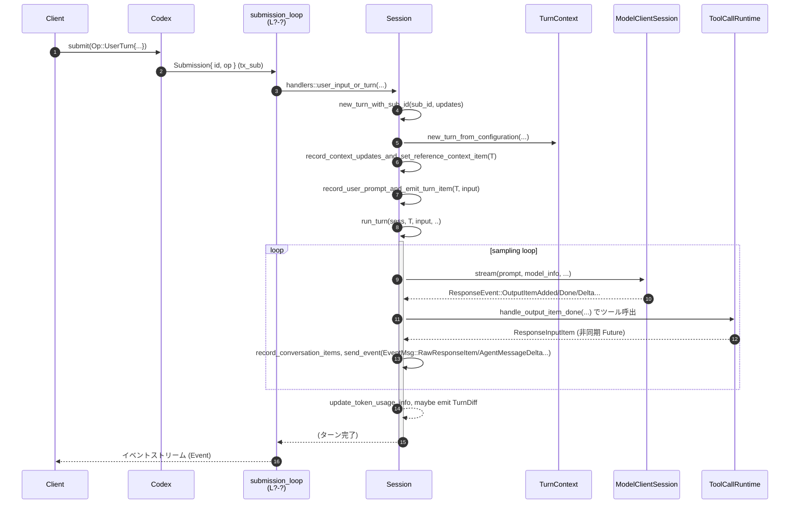

`core/src/codex.rs` モジュール解説レポート（単一チャンク）

> 注: 提供されたコード断片には元ファイルの行番号情報が含まれていません。  
> そのため、本レポートでは根拠位置を `core/src/codex.rs:L?-?` のように表記し、「正確な行範囲は不明」と明示します。

---

## 0. ざっくり一言

このファイルは、**Codex セッションのフロントエンド API（`Codex`）と、その裏側で動く `Session`／ターン処理・ツール実行・MCP/ネットワーク/権限管理・ストリーミング応答処理の中核ロジック**をまとめたモジュールです。

---

## 1. このモジュールの役割

### 1.1 概要

- このモジュールは **対話スレッド（Thread）単位の「Codex セッション」**を管理し、  
  クライアントが送る各種 `Op`（UserTurn、ExecApproval など）を非同期で受け取り、モデル呼び出し・ツール実行・履歴管理・ストリーミングイベント配信を行います。
- 上位から見えるインターフェースは主に `Codex` 構造体で、  
  内部では `Session` がセッション状態やサービス群（モデルクライアント、ツール、MCP、シェル、ネットワークプロキシなど）を統括します。
- モデルとのやり取りは **ストリーミング**を前提としており、`run_turn` / `run_sampling_request` / `try_run_sampling_request` がその中心です。
- セキュリティ面では、**execpolicy・sandbox・network policy・approval フロー**を通じて、コマンド実行やネットワークアクセスをユーザ承認付きで制御します。

### 1.2 アーキテクチャ内での位置づけ

主要コンポーネントの関係を、概略の依存図として示します。



典型的なフロー（UserTurn）:

- `Client` が `Codex::submit(Op::UserTurn {...})` を呼ぶ
- `submission_loop` が `handlers::user_input_or_turn` を通じて `Session::spawn_task` → `run_turn` を起動
- `run_turn` → `run_sampling_request` → `try_run_sampling_request` でモデルとストリーム通信
- 途中でツール呼び出し・MCP・exec/ネットワーク承認などを行いながら、  
  各種 `EventMsg`（TokenCount, AgentMessageDelta, ExecApprovalRequest など）がクライアントへ送信されます。

### 1.3 設計上のポイント

コードから読み取れる設計上の特徴を列挙します（根拠: `core/src/codex.rs:L?-?`）。

- **キュー駆動の Op 処理**
  - `Codex` は `tx_sub: Sender<Submission>` に `Submission{ id, op, trace }` を送り、  
    単一の `submission_loop` タスクが順次 Op を処理します。
- **セッション単位の一元管理**
  - `Session` は `SessionState` の `Mutex` と各種サービス (`SessionServices`) を持ち、  
    セッション中のモデル設定、履歴、ネットワーク/execpolicy、MCP、hooks、メモリなどを集中管理します。
- **「1セッションにつき同時に 1 つのアクティブターン」**
  - `Session.active_turn: Mutex<Option<ActiveTurn>>` により、  
    進行中のターン（およびその中の複数タスク）を1つに制限しています。
  - ユーザからの追加入力（steer）や mailbox 経由のメッセージは、  
    このアクティブターンに合流します。
- **ストリーミング応答とツール実行の統合**
  - モデルのストリーム (`ResponseEvent`) を逐次処理しつつ、  
    ツール呼び出し・結果の再投入・途中入力（steer）・自動コンパクションを行う  
    イベントループを `try_run_sampling_request` で実装しています。
- **トークンコントロールとコンパクション**
  - モデルごとの `auto_compact_token_limit` に基づき、  
    `run_pre_sampling_compact` / `run_auto_compact` で履歴の要約・置き換えを行います。
- **安全性・承認フロー**
  - コマンド実行 (`request_command_approval`)／ファイル変更 (`request_patch_approval`)／  
    追加権限 (`request_permissions`)／MCP elicitation などは oneshot チャネルを使った  
    明示的なユーザ承認フローを持ちます。
- **並行性管理**
  - Tokio の `Mutex` / `RwLock` / `watch::Sender` / `oneshot::channel` / `CancellationToken` /  
    `FuturesOrdered` などを組み合わせ、  
    - セッション状態の整合性
    - MCP 初期化のキャンセル
    - 進行中のターンの中断
    - 複数ツール呼び出しの並列実行
    を安全に制御しています。
- **観測性**
  - `tracing` の span (`session_init`, `op.dispatch.*`, `stream_request`, `receiving_stream` など)
  - `SessionTelemetry` メトリクス (`THREAD_STARTED_METRIC`, token usage, conversation.turn.count)
  - Analytics (`AnalyticsEventsClient`)  
  を通じて、性能・エラー・モデル reroute 等を観測可能にしています。

---

## 2. 主要な機能一覧

本モジュールが提供している主な機能（根拠: `core/src/codex.rs:L?-?`）:

- セッション生成・管理
  - `Codex::spawn` でセッションを生成し、`Codex` ハンドルを返す
  - `Codex::submit` / `submit_with_id` / `shutdown_and_wait` / `next_event`
- Op 処理ループ
  - `submission_loop` + `handlers` モジュールで全ての `Op` を処理
- ターン処理・モデル呼び出し
  - `run_turn`：1つのユーザーターンを処理する高レベルループ
  - `run_sampling_request` / `try_run_sampling_request`：モデルストリーミング & ツール実行
- ツール・MCP・アプリ連携
  - `built_tools` / `ToolRouter` 構築
  - 接続された MCP サーバのリスト取得・ツール呼び出しラッパ (`list_resources` 等)
  - アプリ／コネクタ／skills／plugins から利用可能ツールを解決
- コンテキストと履歴管理
  - `Session::build_initial_context` / `record_context_updates_and_set_reference_context_item`
  - `replace_history` / `replace_compacted_history` / rollout の永続化
  - トークン使用量集計と `TokenCountEvent` の送信
- コンパクションとモデルダウンシフト
  - `run_pre_sampling_compact` / `run_auto_compact` / `maybe_run_previous_model_inline_compact`
- 安全性と承認フロー
  - execpolicy / network policy の永続化とランタイム更新
  - `request_command_approval` / `request_patch_approval` / `request_permissions` /
    `request_user_input` / `request_mcp_server_elicitation` と、対応する `notify_*` 系
- Realtime / MultiAgent / Subagent
  - Realtime 音声/テキスト/クローズ Op の処理
  - mailbox ベースの inter-agent 通信とターントリガー
  - MultiAgentV2 子スレッドから親への完了通知
- hooks / guardian / memories などの周辺機能の起動と連携

---

## 3. 公開 API と詳細解説

### 3.1 型一覧（構造体・列挙体など）

公開/主要な型のみ抜粋します（行番号は全て `core/src/codex.rs:L?-?`、正確範囲は不明）。

| 名前 | 種別 | 公開範囲 | 役割 / 用途 | 定義箇所 |
|------|------|----------|-------------|----------|
| `Codex` | 構造体 | `pub` | クライアントが利用する高レベルセッションハンドル。Op 送信・イベント受信・steer 等を提供。 | `core/src/codex.rs:L?-?` |
| `CodexSpawnOk` | 構造体 | `pub` | `Codex::spawn` の戻り値。`codex` と `thread_id` を含む。 | `core/src/codex.rs:L?-?` |
| `SteerInputError` | enum | `pub` | `Codex::steer_input` 失敗時のエラー種別（NoActiveTurn, ExpectedTurnMismatch など）。 | `core/src/codex.rs:L?-?` |
| `PreviousTurnSettings` | 構造体 | `pub(crate)` | 直前のリアルユーザーターンのモデル名や `realtime_active` 状態を保持し、モデル切替やコンパクション判定に利用。 | `core/src/codex.rs:L?-?` |
| `Session` | 構造体 | `pub(crate)` | セッション内部のコアコンテキスト。状態 (`SessionState`)、サービス、アクティブターン、mailbox などを保持。 | `core/src/codex.rs:L?-?` |
| `SessionLoopTermination` | 型エイリアス | `pub(crate)` | セッションループ終了を待つための共有 future (`Shared<BoxFuture<'static, ()>>`)。 | `core/src/codex.rs:L?-?` |
| `CodexSpawnArgs` | 構造体 | `pub(crate)` | `Codex::spawn_internal` に渡されるセッション生成パラメータ（Config, AuthManager, ModelsManager 等）。 | `core/src/codex.rs:L?-?` |
| `TurnContext` | 構造体 | `pub(crate)` | 1 ターン分の設定・モデル情報・sandbox 情報・tools_config などのスナップショット。 | `core/src/codex.rs:L?-?` |
| `TurnSkillsContext` | 構造体 | `pub(crate)` | 1 ターン内でロードされた skill 情報と、implicit invocation 済みスキル集合。 | `core/src/codex.rs:L?-?` |
| `SessionConfiguration` | 構造体 | `pub(crate)` | セッションレベルの論理設定（モデル/approval/sandbox/cwd など）を保持。`SessionState` 内で使用。 | `core/src/codex.rs:L?-?` |
| `SessionSettingsUpdate` | 構造体 | `pub(crate)` | `Session::update_settings` / `new_turn_with_sub_id` に渡す更新要求（cwd, approval_policy など）。 | `core/src/codex.rs:L?-?` |
| `AppServerClientMetadata` | 構造体 | `pub(crate)` | app server クライアント名/バージョンのメタデータをラップ。 | `core/src/codex.rs:L?-?` |
| `SamplingRequestResult` | 構造体 | `#[derive(Debug)]` | 1 回の sampling リクエストの結果（follow-up 必要か・最後の agent message）を表現。 | `core/src/codex.rs:L?-?` |
| `ProposedPlanItemState` | 構造体 | 内部 | Plan モード時の 1 つの plan item 状態（started/completed）管理。 | `core/src/codex.rs:L?-?` |
| `PlanModeStreamState` | 構造体 | 内部 | Plan モード用ストリーミング状態（保留 agent message、plan item、先頭空白など）。 | `core/src/codex.rs:L?-?` |
| `AssistantMessageStreamParsers` | 構造体 | 内部 | 各 ResponseItem のテキストストリームを解析し、plan セグメントや citation を抽出。 | `core/src/codex.rs:L?-?` |

この他に、多数のヘルパー関数・小さな構造体が存在しますが、主要なデータフローに関わるものに絞っています。

---

### 3.2 関数詳細（主要 7 件）

#### 1. `Codex::spawn(args: CodexSpawnArgs) -> CodexResult<CodexSpawnOk>`

**概要**

- 新しい Codex セッション（スレッド）を起動し、`Codex` ハンドルと `ThreadId` を返します。
- 親トレースコンテキストの継承（W3C trace context）、モデル/skills/plugin ロード、MCP 初期化、network proxy 起動、rollout recorder 準備など、**セッションの初期化処理のほぼ全て**をまとめて実行します。  
  （実体は `spawn_internal` に委譲。）

**引数**

| 引数名 | 型 | 説明 |
|--------|----|------|
| `args` | `CodexSpawnArgs` | Config／各 Manager／初期履歴／SessionSource／dynamic_tools／analytics client など、セッション構築に必要な全依存をまとめた構造体。 |

**戻り値**

- `Ok(CodexSpawnOk { codex, thread_id })`：セッション起動成功。
- `Err(CodexErr)`：環境構築・ルールロード・MCP 必須サーバ失敗などの致命的エラー。

**内部処理の流れ（簡略）**

1. 親トレースコンテキスト `parent_trace` が有効なら span に設定（`set_parent_from_w3c_trace_context`）。
2. `spawn_internal` を `info_span!("thread_spawn")` の中で呼び出す。
3. `spawn_internal` 内では:
   - plugin/skills ロード、features 調整（SubAgent 深さや Node 実行環境の可用性による）
   - `EnvironmentManager` から環境取得、ユーザインストラクション読み込み
   - execpolicy（guardian の場合はデフォルト、それ以外は設定からロード）
   - モデル一覧のプレウォーム・デフォルトモデル決定
   - `SessionConfiguration` 構築
   - `Session::new(...)` で `Arc<Session>` 生成
   - bounded/unbounded channels (`tx_sub`, `rx_sub`, `tx_event`, `rx_event`) を用意
   - `submission_loop` を `tokio::spawn` で起動し、その終了 future を `SessionLoopTermination` に変換
4. `Codex` 構造体を組み立てて返却。

**Examples（使用例）**

```rust
// Config や各 Manager の生成は省略（実際のコードでは crate から取得）
let spawn_args = CodexSpawnArgs {
    config,
    auth_manager,
    models_manager,
    environment_manager,
    skills_manager,
    plugins_manager,
    mcp_manager,
    skills_watcher,
    conversation_history: InitialHistory::New,
    session_source: SessionSource::Cli,
    agent_control,
    dynamic_tools: Vec::new(),
    persist_extended_history: false,
    metrics_service_name: None,
    inherited_shell_snapshot: None,
    inherited_exec_policy: None,
    user_shell_override: None,
    parent_trace: None,
    analytics_events_client: None,
};

let CodexSpawnOk { codex, thread_id } = Codex::spawn(spawn_args).await?;
println!("Started thread: {thread_id}");
```

**Errors / Panics**

- `EnvironmentManager::current()` 失敗や `ExecPolicyManager::load` 失敗などは  
  `CodexErr::Fatal(...)` として返されます。
- 必須 MCP サーバが起動できなかった場合は `anyhow` エラー経由で `CodexErr` に変換され、起動自体が失敗します。
- `Session::new` の内部で `anyhow` エラーが発生した場合、そのエラーは `map_session_init_error` により CodexErr にマップされます。

**Edge cases（エッジケース）**

- `SessionSource::SubAgent(SubAgentSource::ThreadSpawn{ depth >= agent_max_depth })` の場合、`SpawnCsv`/`Collab` 機能が自動で無効化されます。
- Node runtime が見つからない／非対応の場合、`JsRepl` / `CodeMode` フィーチャが起動時に無効化され、警告イベントが送出されます。
- `config.ephemeral == true` の場合、rollout recorder や state_db 初期化はスキップされ、履歴は非永続になります。

**使用上の注意点**

- `Codex::spawn` は **非同期で重い処理**（ファイル I/O, ネットワーク, MCP 起動）を行います。  
  高頻度で呼ぶのではなく、「スレッド（会話）」単位で 1 回だけ呼び、以後は `Codex` を使い回す前提です。
- `CodexSpawnArgs` には多くの依存が必要なため、通常は上位レイヤ（CLI やサーバ）が組み立てます。

---

#### 2. `Codex::submit(&self, op: Op) -> CodexResult<String>`

**概要**

- 任意の `Op`（ユーザー入力、設定変更、承認結果など）を現在のセッションに送信するヘルパーです。
- UUID v7 による submission ID を自動生成し、その ID を返します。

**引数**

| 引数名 | 型 | 説明 |
|--------|----|------|
| `op` | `codex_protocol::protocol::Op` | 実行したい操作（UserTurn, ExecApproval, Compact, Shutdown 等）。 |

**戻り値**

- `Ok(id: String)`：送信された submission の ID。
- `Err(CodexErr::InternalAgentDied)`：セッション側の受信チャネルが閉じており、エージェントが停止している。

**内部処理**

1. `Uuid::now_v7().to_string()` で一意な ID を生成。
2. `Submission { id: id.clone(), op, trace: None }` を作る。
3. `submit_with_id` に委譲。

`submit_with_trace`/`submit_with_id` では、トレースコンテキストを付与し、`tx_sub.send(sub).await` します。

**Examples**

```rust
// 単純なユーザー入力を送信する例
use codex_protocol::protocol::Op;
use codex_protocol::user_input::UserInput;

let op = Op::UserInput {
    items: vec![UserInput::Text {
        text: "Hello Codex".into(),
        text_elements: Vec::new(),
    }],
    final_output_json_schema: None,
    responsesapi_client_metadata: None,
};

let submit_id = codex.submit(op).await?;
println!("Submission id: {submit_id}");
```

**Errors / Panics**

- `tx_sub.send` が失敗した場合は `CodexErr::InternalAgentDied` を返します。

**使用上の注意点**

- `Op::Shutdown` を送ると `submission_loop` が終了し、その後の `submit` は `InternalAgentDied` になります。
- `Op` は列挙型ですが `non_exhaustive` 想定で、未対応の Op は `submission_loop` 内で無視（`_ => false`）される設計です。

---

#### 3. `Codex::steer_input(&self, input: Vec<UserInput>, expected_turn_id: Option<&str>, ...) -> Result<String, SteerInputError>`

**概要**

- 進行中のターンに対して **途中で追加のユーザー入力（steer）を注入**する API です。
- マルチターンストリーム中、UI からの「追加入力」を同一ターンに取り込むために利用されます。

**引数**

| 引数名 | 型 | 説明 |
|--------|----|------|
| `input` | `Vec<UserInput>` | 追加入力内容。空は許可されません。 |
| `expected_turn_id` | `Option<&str>` | 呼び出し側が想定しているアクティブターン ID。Mismatch を検出するため。 |
| `responsesapi_client_metadata` | `Option<HashMap<String,String>>` | レスポンス API クライアントのメタデータ（任意）。 |

**戻り値**

- `Ok(active_turn_id)`：現在のアクティブターン ID（steer が受理された）。
- `Err(SteerInputError)`：以下のいずれか。
  - `EmptyInput`
  - `NoActiveTurn(input)`：steer 先のターンがない
  - `ExpectedTurnMismatch { expected, actual }`
  - `ActiveTurnNotSteerable { turn_kind: Review|Compact }`

**内部処理（`Session::steer_input`）**

1. `input.is_empty()` なら `SteerInputError::EmptyInput`。
2. `self.active_turn.lock().await` からアクティブターンを取得。存在しなければ `NoActiveTurn`。
3. `expected_turn_id` が Some で、実際の turn id と異なれば `ExpectedTurnMismatch`。
4. アクティブタスクの kind (`TaskKind::Regular/Review/Compact`) を見て:
   - Review/Compact は steer 不可 → `ActiveTurnNotSteerable`。
5. `responsesapi_client_metadata` が渡されていれば `turn_metadata_state` に保存。
6. `turn_state.push_pending_input(input.into())` し、`accept_mailbox_delivery_for_current_turn` で mailbox 入力も許可。

**Examples**

```rust
use codex_protocol::user_input::UserInput;

let steer = vec![UserInput::Text {
    text: "Actually, use a different library.".into(),
    text_elements: Vec::new(),
}];

match codex.steer_input(steer, None, None).await {
    Ok(turn_id) => println!("Steered current turn: {turn_id}"),
    Err(err) => eprintln!("Failed to steer: {:?}", err),
}
```

**Errors / Edge cases**

- `EmptyInput`：UI からうっかり空送信した場合に即座に検出されます。
- `NoActiveTurn`：ターンが終了した直後など、steer できる対象がない場合。
- `ExpectedTurnMismatch`：クライアントのローカル状態とサーバ側のターン ID が分岐していることを示すため、  
  極力 UI は `expected_turn_id` を指定して呼び出すと安全です。
- `ActiveTurnNotSteerable`：レビュー・コンパクトなどの特殊タスクには steer できません。

**使用上の注意点**

- steer は **「現在進行中のターンの補足」専用**です。新規ターンを開始したい場合は `Op::UserTurn`/`Op::UserInput` を送ります。
- Review / Compact 中に steer しようとするとエラーになるため、UI 側でモードに応じたボタン制御が必要です。

---

#### 4. `Session::new(...) -> anyhow::Result<Arc<Session>>`

**概要**

- `Codex::spawn_internal` から呼ばれ、**1 セッションの内部オブジェクト `Session` を構築**します。
- Rollout recorder、state_db、MCP、network proxy、hooks、shell snapshot、telemetry などを初期化し、`SessionConfigured` などの初期イベントを送出します。

**主な引数（抜粋）**

| 引数名 | 型 | 説明 |
|--------|----|------|
| `session_configuration` | `SessionConfiguration` | モデル・sandbox・approval・cwd 等を含む論理設定。 |
| `config` | `Arc<Config>` | 元の Config 全体。 |
| `auth_manager` / `models_manager` / `exec_policy` | 各 Manager | 認証・モデル情報・execpolicy 管理。 |
| `initial_history` | `InitialHistory` | 新規/再開/フォーク時の履歴。 |
| `session_source` | `SessionSource` | CLI / VSCode / SubAgent 等。 |
| `skills_manager` / `plugins_manager` / `mcp_manager` / `skills_watcher` | 各種マネージャ | skills, plugins, MCP, skills 更新通知。 |
| `agent_control` | `AgentControl` | 他スレッドへの連絡などに使用。 |
| `environment` | `Option<Arc<Environment>>` | exec 用の環境コンテキスト。 |

**戻り値**

- `Ok(Arc<Session>)`：セッションが正常に構築された。
- `Err(anyhow::Error)`：rollout recorder や MCP、network proxy の初期化に失敗したなど。

**内部処理のポイント**

- Rollout/履歴関連
  - `RolloutRecorderParams` を組み立て、`RolloutRecorder::new` を起動（ephemeral なら None）。
  - 再開 (`InitialHistory::Resumed`) 時は既存 rollout からメタデータを取得。
- Telemetry
  - `SessionTelemetry::new` により会話開始時のメトリクスを記録し、`THREAD_STARTED_METRIC` を更新。
- シェル・Snapshot
  - `default_user_shell` または zsh fork モード・shell snapshot 機能に基づき shell を決定。
  - `ShellSnapshot::start_snapshotting` でスナップショットをバックグラウンド取得。
- Network proxy / execpolicy
  - `start_managed_network_proxy` を通じて managed network proxy を起動し、runtime への apply 準備。
- MCP
  - `McpConnectionManager::new_uninitialized` で仮インスタンスを作成しておき、  
    その後 `McpConnectionManager::new` で実体を生成・必須サーバ起動を確認。
- Hooks / Analytics
  - `Hooks::new` で codex_hooks を初期化し、startup warnings をイベントとして送出。
  - `AnalyticsEventsClient` を構築（未指定ならデフォルト）。
- 初期イベント送出
  - `SessionConfiguredEvent` と startup warnings / deprecation notices / unstable feature warnings などを `EventMsg` として送信。
- 初期履歴の適用
  - `record_initial_history` で rollout 再構築や token usage のシードを行う。

**使用上の注意点**

- `Session::new` は `Codex` の内部専用であり、外部から直接呼び出すことは想定されていません。
- ephemeral セッションでは rollout が永続化されないため、後からファイルベースの履歴を参照する機能は使えません。

---

#### 5. `Session::new_turn_with_sub_id(&self, sub_id: String, updates: SessionSettingsUpdate) -> ConstraintResult<Arc<TurnContext>>`

**概要**

- 指定された submission ID（turn_id）に対応する **新しい `TurnContext`** を生成します。
- 同時に `SessionConfiguration` に `SessionSettingsUpdate` を適用し、必要であれば shell snapshot / sandbox / MCP に反映します。

**引数**

| 引数名 | 型 | 説明 |
|--------|----|------|
| `sub_id` | `String` | このターンに対応する submission ID。 |
| `updates` | `SessionSettingsUpdate` | cwd や approval policy、sandbox policy、collaboration_mode などの変更。 |

**戻り値**

- `Ok(Arc<TurnContext>)`：ターンコンテキスト生成成功。
- `Err(ConstraintError)`：`Constrained` な項目（approval_policy, sandbox_policy など）が要件違反。

**内部処理**

1. `state.session_configuration.apply(&updates)` を呼び出し、Constraint による検証を実施。
2. 失敗した場合は `EventMsg::Error`（`CodexErrorInfo::BadRequest`）を送出し、Err を返す。
3. 成功した場合:
   - cwd の変更に応じて shell snapshot をリフレッシュ（サブエージェント spawn は除外）。
   - sandbox policy 変更時は `refresh_managed_network_proxy_for_current_sandbox_policy` を呼ぶ。
4. `new_turn_from_configuration` を呼んで `TurnContext` を構築。

**使用上の注意点**

- `SessionSettingsUpdate` には `final_output_json_schema` も含まれるため、  
  1 ターンだけ JSON スキーマ付き出力を要求するようなケースにも対応できます。
- `ApprovalPolicy` や `SandboxPolicy` は `Constrained<T>` になっており、  
  要件に違反する値への変更は拒否され、エラーイベントとしてクライアントに通知されます。

---

#### 6. `run_turn(sess: Arc<Session>, turn_context: Arc<TurnContext>, input: Vec<UserInput>, ...) -> Option<String>`

**概要**

- **1 つのユーザーターンのメインループ**です。
- 入力メッセージ・skills/plugins/MCP 依存解決・hooks 実行・context 注入・モデルストリーミング・ツール実行・コンパクションなどをまとめて処理し、最後の assistant message を返します。

**引数（抜粋）**

| 引数名 | 型 | 説明 |
|--------|----|------|
| `sess` | `Arc<Session>` | セッション本体。 |
| `turn_context` | `Arc<TurnContext>` | このターンの設定・モデル情報など。 |
| `input` | `Vec<UserInput>` | ユーザーからの入力。空でも、pending input があればターンを続行。 |
| `prewarmed_client_session` | `Option<ModelClientSession>` | 事前にウォームされたモデルセッション（任意）。 |
| `cancellation_token` | `CancellationToken` | ターンを中断するためのトークン。 |

**戻り値**

- `Some(last_agent_message)`：ターン中の最後の assistant メッセージテキスト（通常は最終応答）。
- `None`：ターンが早期終了（hooks による stop, コンパクションのみ, 中断 など）した場合。

**典型的な処理フロー**

1. 入力と pending input を確認し、全く無ければ `None` を返す。
2. 自動コンパクション（pre-turn）
   - `run_pre_sampling_compact(sess, turn_context)` を呼び、前モデル向け / token limit 超過のコンパクションを実施。
3. context 注入 & TurnContextItem 更新
   - `record_context_updates_and_set_reference_context_item` で initial context または diff を履歴に記録。
4. skills/plugins/MCP 解析
   - `plugins_manager` から plugin capability を取得。
   - `mcp_connection_manager.list_all_tools()` で MCP ツール一覧を取得。
   - メッセージ中の plugin/skill/app メンションを解析し、skill の env var / MCP dependencies を解決。
5. hooks（session start / user prompt submit）
   - `run_pending_session_start_hooks`：初回 session_start hooks があれば実行。
   - `run_user_prompt_submit_hooks`：ユーザープロンプト送信時の hooks を実行し、追加 context を挿入。
6. 入力記録 & TurnItem（ユーザーメッセージ）イベント
   - `record_user_prompt_and_emit_turn_item` で履歴に user message を追加し、`ItemStarted`/`ItemCompleted` イベント送出。
   - `PreviousTurnSettings` にモデル・realtime 状態を保存。
7. skill/plugin からの追加メッセージ挿入（injections）
8. Ghost Snapshot タスクの起動
9. メインループ
   - `run_sampling_request` を呼び出し、モデルとストリーミング通信を行う。
   - auto-compact が必要なら mid-turn コンパクションを実施し、再度 sampling ループを回す。
10. hooks(stop) / after_agent hooks
    - last_assistant_message をもとに stop hooks をプレ/実行し、必要なら continuation を注入。
11. 最終的な `SamplingRequestResult` から `last_agent_message` を取り出して返却。

**Errors / Edge cases**

- モデル側エラー (`CodexErr` 派生) は `try_run_sampling_request` 内で処理され、`EventMsg::Error` としてクライアントへ送出されます。
- `CodexErr::TurnAborted`（`cancellation_token` のキャンセル）時は、イベント側でターン中止が報告され、`run_turn` は `None` を返してループを抜けます。
- invalid image 出力 (`CodexErr::InvalidImageRequest`) の場合、直前ターンの画像を「Invalid image」に差し替える sanitize 処理が走ります。

**使用上の注意点**

- `run_turn` は `Session::spawn_task` 等から内部的に呼び出され、外部 API として直接使う想定ではありません。
- 中断したい場合は、外側から `Interrupt` Op を送り、`CancellationToken` をキャンセルさせる形になります。

---

#### 7. `run_sampling_request(...)` と `try_run_sampling_request(...)`

（2 つを 1 グループとして扱います）

**概要**

- 1 回の sampling リクエスト（モデルへの問い合わせ）をストリーミングで処理する関数群です。
- `run_sampling_request` は ToolRouter 構築や Prompt 準備を行い、  
  実際のストリーム処理は `try_run_sampling_request` に委譲されます。

**主な引数（共通）**

| 引数名 | 型 | 説明 |
|--------|----|------|
| `sess` | `Arc<Session>` | セッション。 |
| `turn_context` | `Arc<TurnContext>` | 現在のターンの設定。 |
| `turn_diff_tracker` | `SharedTurnDiffTracker` | ファイル差分（TurnDiff）の追跡。 |
| `client_session` | `&mut ModelClientSession` | ストリーミング用のモデルクライアントセッション（WebSocket / HTTPS）。 |
| `turn_metadata_header` | `Option<&str>` | HTTP ヘッダなどに埋め込む turn metadata。 |
| `input` / `prompt` | 履歴を反映した `Vec<ResponseItem>` / `Prompt` | モデルへの入力全体。 |
| `explicitly_enabled_connectors` | `&HashSet<String>` | 明示的に有効化されたアプリ/コネクタ IDs。 |
| `skills_outcome` | `Option<&SkillLoadOutcome>` | skills ロード結果。 |
| `server_model_warning_emitted_for_turn` | `&mut bool` | モデル reroute 警告を 1 ターン 1 回に抑えるためのフラグ。 |
| `cancellation_token` | `CancellationToken` | 中断用トークン。 |

**内部処理のハイライト（`try_run_sampling_request`）**

- `client_session.stream(...)` により `ResponseEvent` のストリームを取得。
- ループで各 `ResponseEvent` を処理:
  - `OutputItemAdded` / `OutputItemDone`：
    - `handle_non_tool_response_item` / `handle_output_item_done` を通じて TurnItem イベントを生成・送信。
    - assistant メッセージのテキストは `AssistantTextStreamParser` で解析し、plan モード時は plan delta と通常テキストを分離。
  - `OutputTextDelta` / `Reasoning*Delta`：
    - `AgentMessageContentDeltaEvent` / `ReasoningContentDeltaEvent` 等に変換し送信。
  - `ServerModel`：
    - 要求モデルと異なる場合、`maybe_warn_on_server_model_mismatch` で ModelReroute 警告＆Warningイベントを送信。
  - `RateLimits`：
    - `Session::update_rate_limits` で内部状態を更新（TokenCountEvent は usage とまとめて送る）。
  - `Completed`：
    - トークン使用量を `Session::update_token_usage_info` で更新し、`SamplingRequestResult { needs_follow_up, last_agent_message }` を返す。
- `CodexErr` が retryable かどうかを見て、バックオフ (`backoff(retries)`) + `notify_stream_error` で再試行。
  - WebSocket → HTTPS fallback（`ModelClientSession::try_switch_fallback_transport`）も実装。
- 終了時に:
  - `drain_in_flight` で in-flight ツール future を全て完了させ履歴に記録。
  - `TurnDiffTracker` から unified diff を取り出し、`TurnDiffEvent` として送信。

**Errors / Edge cases**

- `ContextWindowExceeded` → `set_total_tokens_full` を呼んで TokenCountEvent を更新し、そのまま Err。
- `UsageLimitReached` → RateLimits 更新後に Err。
- ストリームが `response.completed` 前に `None` になった場合 → `CodexErr::Stream`。

**使用上の注意点**

- これらは **モデルとのストリーミング通信の中核**なので、エラー時の挙動（再試行回数・fallback 戦略）を変える場合はこの関数を読む必要があります。
- `CancellationToken` がキャンセルされると `CodexErr::TurnAborted` で終了します。

---

### 3.3 その他の関数（抜粋一覧）

| 関数名 | 役割（1 行） | 定義箇所 |
|--------|--------------|----------|
| `submission_loop` | `Rx<Submission>` から Op を受信し、`handlers` モジュール経由で適切な処理関数を呼び出すメインループ。 | `core/src/codex.rs:L?-?` |
| `Session::send_event` / `send_event_raw` | rollout 永続化＋クライアントへの Event 送信を行う。 | `core/src/codex.rs:L?-?` |
| `Session::request_command_approval` | ExecApprovalRequest イベントを送り、oneshot チャネルで結果を待つ。 | `core/src/codex.rs:L?-?` |
| `Session::request_permissions` / `request_user_input` / `request_mcp_server_elicitation` | 権限・追加入力・MCP elicitation の承認フロー。 | `core/src/codex.rs:L?-?` |
| `Session::update_settings` | セッション全体の設定を更新（shell snapshot や network proxy も更新）。 | `core/src/codex.rs:L?-?` |
| `Session::interrupt_task` | アクティブターンを `TurnAbortReason::Interrupted` で中断、または MCP startup をキャンセル。 | `core/src/codex.rs:L?-?` |
| `emit_subagent_session_started` | SubAgent スレッド開始の analytics イベントを送信。 | `core/src/codex.rs:L?-?` |
| `realtime_text_for_event` | EventMsg から Realtime 会話へミラーすべきテキストを抽出。 | `core/src/codex.rs:L?-?` |
| `get_last_assistant_message_from_turn` | ターン内の ResponseItem 群から最後の assistant メッセージ文字列を抽出。 | `core/src/codex.rs:L?-?` |

`mod handlers` 内には、各 Op（Interrupt, UserTurn, Compact, Undo, Review, RefreshMcpServers …）のラッパー関数が多数定義されています。  
それぞれ単に `Session` のメソッド呼び出し・Task 起動・エラーイベント送出を担当します。

---

## 4. データフロー

### 4.1 代表的なシナリオ: `Op::UserTurn` による通常ターン

クライアントからユーザーターンが送られてから、最終応答が返るまでのデータフローを示します。



要点:

- `Codex::submit` で `Submission` が送信され、`submission_loop` が `handlers::user_input_or_turn` を呼ぶ。
- `Session::new_turn_with_sub_id` で `TurnContext` を構築し、`run_turn` でターンを実行。
- モデル応答は `ResponseEvent` ストリームとして受信され、ツール呼び出しやイベント送信が逐次行われる。
- 最後に TokenCount / TurnComplete 等のイベントがクライアントへ戻る。

---

## 5. 使い方（How to Use）

### 5.1 基本的な使用方法

以下は、「Config や各 Manager が既に用意済み」である前提の最小イメージです。

```rust
use core::codex::Codex;
use codex_protocol::protocol::{Op, EventMsg};
use codex_protocol::user_input::UserInput;

// 1. Codex セッションを起動する
let spawn_args = CodexSpawnArgs { /* 依存をセット */ };
let CodexSpawnOk { codex, thread_id } = Codex::spawn(spawn_args).await?;

// 2. ユーザー入力を送信する
let op = Op::UserInput {
    items: vec![UserInput::Text {
        text: "Hello Codex".into(),
        text_elements: Vec::new(),
    }],
    final_output_json_schema: None,
    responsesapi_client_metadata: None,
};
let submit_id = codex.submit(op).await?;

// 3. イベントストリームを読む
while let Ok(event) = codex.next_event().await {
    match event.msg {
        EventMsg::AgentMessage(event) => {
            println!("assistant: {}", event.message);
        }
        EventMsg::Error(err) => {
            eprintln!("error: {}", err.message);
        }
        EventMsg::TurnComplete(_) => {
            println!("turn complete");
            break;
        }
        _ => {}
    }
}

// 4. 終了する場合
codex.shutdown_and_wait().await?;
```

### 5.2 よくある使用パターン

- **マルチターン対話**
  - 1 回目の `Op::UserInput` のターンが終わったら、再度 `Op::UserInput` や `Op::UserTurn` を送る。
- **途中 steer**
  - ストリーミング中に UI が追加のテキストを送るとき、`Codex::steer_input` を使って同一ターンに注入する。
- **ExecApproval / PatchApproval の処理**
  - モデル側が `ExecApprovalRequestEvent` を送ってきたら、  
    UI で承認/拒否を選ばせ、その結果を `Op::ExecApproval` で戻す。
- **MCP ツール呼び出し**
  - 通常はモデルが MCP ツールを使うが、外部から直接呼びたい場合は `Session::call_tool` 系のラッパーも利用可能です（同一セッション内）。

### 5.3 よくある間違い

```rust
// 間違い例: ターンが進行中か確認せずに steer_input を呼ぶ
let res = codex.steer_input(Vec::new(), None, None).await; // -> Err(EmptyInput)

// 正しい例: 入力を必ず 1 件以上用意する
let res = codex.steer_input(
    vec![UserInput::Text{ text: "more details".into(), text_elements: Vec::new() }],
    None,
    None,
).await;
```

```rust
// 間違い例: Shutdown した後も submit を続ける
codex.shutdown_and_wait().await?;
let id = codex.submit(Op::Compact).await?; // InternalAgentDied になる可能性

// 正しい例: shutdown 後は新しい Codex を spawn する
```

### 5.4 使用上の注意点（まとめ）

- **スレッド安全性**
  - `Codex` / `Session` は `Arc` で共有され、内部で Tokio の `Mutex` 等を利用しているため、  
    複数タスクから `submit` / `next_event` を呼ぶこと自体は許容されます。  
    ただし、1セッション内の `submission_loop` は 1 本のみです。
- **パフォーマンス**
  - モデル呼び出しや MCP/ツール実行はネットワーク I/O を伴うため、  
    多数のセッションを同時に開くときはリソース（接続数・CPU）に注意が必要です。
- **中断**
  - 即座にターンを止めたい場合は Op::Interrupt を送るか、 関連する `CancellationToken` をキャンセルする設計です。

---

## 6. 変更の仕方（How to Modify）

### 6.1 新しい機能を追加する場合

例: 新しい `Op::Foo` を追加して処理したい場合

1. `codex_protocol::protocol::Op` に `Foo` を追加。
2. `submission_loop` の `match sub.op` に `Op::Foo => { ... }` を追加し、  
   `handlers` モジュール内に `pub async fn foo(sess: &Arc<Session>, ...)` のようなハンドラを実装。
3. 必要であれば `Session` にメソッドを追加し、状態更新やイベント送出を行う。
4. イベントをクライアントに伝えるには `EventMsg` に新 variant を追加し、`Session::send_event` で送る。

### 6.2 既存の機能を変更する場合

- **ターン処理を変更したい場合**
  - `run_turn` → `run_sampling_request` → `try_run_sampling_request` の順に読み、  
    どこで変更したいかを決める。
- **コンパクション戦略を変える場合**
  - `run_pre_sampling_compact` / `run_auto_compact` / `maybe_run_previous_model_inline_compact` を確認。
- **承認フローを変える場合**
  - `request_command_approval` / `request_patch_approval` / `request_permissions` / `request_user_input`  
    と、対応する `notify_*` 関数を確認。oneshot チャネルに依存している点に注意。
- 変更時には:
  - `SessionState` や rollout への影響（履歴フォーマット）がないか
  - `EventMsg` とクライアント側プロトコルの互換性 を必ず確認する必要があります。

---

## 7. 関連ファイル

このモジュールと密接に関係するファイル・ディレクトリ（名前はコード中の `use` から分かる範囲）。

| パス | 役割 / 関係 |
|------|------------|
| `core/src/state.rs` | `SessionState`, `ActiveTurn`, `TurnState` などを定義し、`Session` の内部状態を管理。 |
| `core/src/tasks/*.rs` | `Session::spawn_task` から起動される各種 Task（RegularTask, CompactTask, ReviewTask, GhostSnapshotTask など）。 |
| `core/src/context_manager/*.rs` | コンテキストメッセージの構築・diff・personality などのロジック。 |
| `core/src/tools/*` | `ToolRouter`, `ToolCallRuntime`, code_mode, network_approval などツール実行関連。 |
| `core/src/mcp/*.rs` | `McpManager` や MCP ツールスナップショット収集、auth status 計算など。 |
| `core/src/rollout/*.rs` | RolloutRecorder と履歴の永続化・再構築 (`rollout_reconstruction` モジュール)。 |
| `core/src/memories/*.rs` | メモリ機能（ユーザーメモリの保存・読み出し・クリア）と、そのプロンプト (`build_memory_tool_developer_instructions`)。 |
| `core/src/agent/*.rs` | `AgentControl`, MultiAgentV2 関連、SubAgentThread の spawn/通知など。 |
| `codex_protocol` crate | `Op`, `EventMsg`, `ResponseItem` などプロトコル定義一式。 |
| `codex_models_manager` crate | モデルメタデータ・context window・auto_compact_limit など。 |
| `codex_exec_server` / `execpolicy` / `network_proxy` crates | execpolicy ルール・実行環境・ネットワーク sandbox の実装。 |

---

## Bugs / Security / Contracts / Edge cases （コードから読み取れる範囲）

最後に、このモジュール特有の注意点を簡潔にまとめます。

- **SteerInput の契約**
  - 入力は非空であること。
  - Review/Compact ターンには steer できない。
  - `expected_turn_id` を利用することで、クライアントとサーバのターン整合性を検証できる。
- **Exec / Network policy の安全性**
  - `validated_network_policy_amendment_host` で、承認された host と amendment の host が `normalize_host` 後に一致することを強制しているため、  
    承認レスポンスのすり替えによる異なるホストへの allow/deny 登録を防いでいます。
- **ストリーミングの安定性**
  - 再試行回数や fallback などは `try_run_sampling_request` 内のロジックに依存します。  
    retryable なエラーでなければ即座に `EventMsg::Error` として報告されます。
- **観測性とデバッグ**
  - 多数の `tracing` span と `SessionTelemetry` が埋め込まれており、  
    本モジュールの振る舞いをトレースしやすい構造になっています。
- **panic の可能性**
  - `error_or_panic` 呼び出しは、「原則として起きてほしくない内部不整合」発生時にパニックまたはログに使われます。  
    例えば「OutputTextDelta にアクティブアイテムが無い」等。

コードから読み取れる限りでは、安全性や整合性を保つためのチェックや Constrained 型の活用が随所にあります。  
より詳細な制約・仕様は `codex_protocol` や各サブモジュールのドキュメントと合わせて参照する必要があります。
