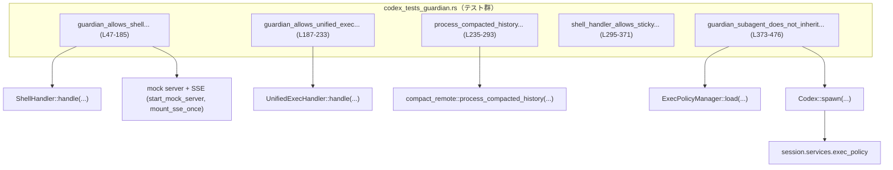
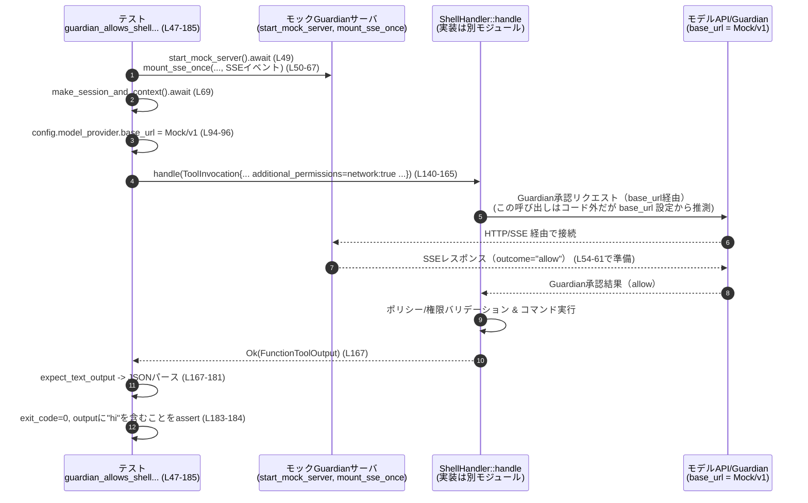

# core/src/codex_tests_guardian.rs

## 0. ざっくり一言

Guardian（承認用サブエージェント）と実行権限／サンドボックス周りの挙動を検証するための非公開テスト群です。  
シェルツール／統合実行ツールの追加権限要求、Guardian サブエージェントの exec policy 継承、履歴圧縮時の Guardian 用 developer メッセージの扱いなどを確認します。

---

## 1. このモジュールの役割

### 1.1 概要

このモジュールは、次のような振る舞いを検証する非公開テストを提供します。

- シェルツールや統合実行ツールが **追加サンドボックス権限（with_additional_permissions）** を正しく扱うか
- Guardian 承認フロー（GuardianApproval / ExecPermissionApprovals フラグ）が有効なときに、ガーディアンの「allow」判定が実行権限に反映されるか
- リクエストに `additional_permissions` が無い場合に、統合実行ツールが **事前バリデーションエラー** を返すか
- コンパクト化された履歴に対して、Guardian 用 developer メッセージが独立して維持されるか
- Guardian サブエージェントが親セッションの ExecPolicy のルール（deny.rules）を継承しないこと

### 1.2 アーキテクチャ内での位置づけ

このテストモジュールは実装モジュール（`super::*`）にある各種ハンドラ・サービスをブラックボックスとして呼び出し、外部との連携を含めた振る舞いを確認しています。

主な関係は次の通りです。

- `ShellHandler`, `UnifiedExecHandler`（`super::*` からインポート, 具体的定義はこのファイル外）
- セッション／ターンコンテキスト生成: `make_session_and_context()`（外部定義）
- Exec Policy 管理: `ExecPolicyManager`（`crate::exec_policy`）
- Guardian 関連:
  - `GUARDIAN_REVIEWER_NAME`（Guardian サブエージェント識別子）
  - `guardian_policy_prompt`（Guardian 用プロンプト, `crate::guardian`）
- 履歴コンパクト化: `crate::compact_remote::process_compacted_history`
- 実行環境: `ExecParams`, `ExecCapturePolicy`, `SandboxPermissions`
- モックサーバ & SSE: `start_mock_server`, `mount_sse_once`, `sse`, `ev_*`（`core_test_support::responses`）

依存関係のイメージ（テスト中心）:



※ ハンドラや Codex 本体の実装はこのチャンクには現れません。

### 1.3 設計上のポイント

- すべて `#[tokio::test]` の **非同期テスト関数** です（L47, L187, L235, L295, L373）。
- 共有状態（`session`, `turn_context`, `TurnDiffTracker` など）は `Arc` や `tokio::sync::Mutex` を通じてスレッドセーフに共有します（例: L145, L204, L324）。
- エラーは基本的に
  - テスト前提のセットアップ失敗: `.expect("...")` による panic（例: L74, L102）
  - 振る舞い検証: `assert_eq!`, `assert!` による検証（例: L183-184, L229-232, L286-292, L360-361, L459-472）
  で扱われます。
- 実行権限やサンドボックス権限は `Feature` フラグ＋`SandboxPermissions`／`PermissionProfile`／ExecPolicy ルールの組み合わせで制御され、その組み合わせが期待どおりになることをテストしています。
- 一部テストは OS 依存で条件付きコンパイルされています（Unix 限定: L295-297）。

---

## 2. 主要な機能一覧

このファイルで定義される主な機能（テスト）は次の通りです。

- `expect_text_output`: `FunctionToolOutput` からテキスト部分を取り出すテスト用ヘルパー
- `guardian_allows_shell_additional_permissions_requests_past_policy_validation`:
  - Guardian 承認が「allow」のとき、シェルツールの追加権限付き実行が成功することを検証
- `guardian_allows_unified_exec_additional_permissions_requests_past_policy_validation`:
  - 統合実行ツールで `with_additional_permissions` を使う場合、`additional_permissions` が無ければバリデーションエラーになることを検証
- `process_compacted_history_preserves_separate_guardian_developer_message`:
  - 履歴コンパクト化後も、Guardian 用 developer メッセージが古い developer メッセージと独立して維持されることを検証
- `shell_handler_allows_sticky_turn_permissions_without_inline_request_permissions_feature`:
  - すでに turn 単位で権限が付与されている場合（sticky permissions）、RequestPermissions 機能が無くてもシェル実行がブロックされないことを検証（Unix 限定）
- `guardian_subagent_does_not_inherit_parent_exec_policy_rules`:
  - Guardian サブエージェントが親 ExecPolicy の deny.rules を引き継がず、独自の heuristics ベースの判定を行うことを検証

### 2.1 コンポーネントインベントリー（関数・構造体）

このチャンク内で「定義されている」関数／構造体の一覧です。  
行番号はこのファイル内での番号です。

| 名前 | 種別 | 役割 / 用途 | 定義位置 |
|------|------|-------------|----------|
| `expect_text_output` | 非公開関数 | `FunctionToolOutput` の body からテキストを取り出すテスト用ヘルパー | `core/src/codex_tests_guardian.rs:L43-45` |
| `guardian_allows_shell_additional_permissions_requests_past_policy_validation` | 非公開 async テスト関数 | Guardian 承認付きシェル実行＋追加権限要求の成功パスを検証 | `core/src/codex_tests_guardian.rs:L47-185` |
| `ResponseExecMetadata` | ローカル構造体（上記テスト内） | シェル実行結果メタデータ（終了コード）をパースするためのテスト用型 | `core/src/codex_tests_guardian.rs:L169-172` |
| `ResponseExecOutput` | ローカル構造体（上記テスト内） | シェル実行結果 JSON（標準出力＋メタデータ）をパースするためのテスト用型 | `core/src/codex_tests_guardian.rs:L175-178` |
| `guardian_allows_unified_exec_additional_permissions_requests_past_policy_validation` | 非公開 async テスト関数 | 統合実行ツールにおける追加権限要求のバリデーションエラーを検証 | `core/src/codex_tests_guardian.rs:L187-233` |
| `process_compacted_history_preserves_separate_guardian_developer_message` | 非公開 async テスト関数 | 履歴コンパクト化後の Guardian developer メッセージの扱いを検証 | `core/src/codex_tests_guardian.rs:L235-293` |
| `shell_handler_allows_sticky_turn_permissions_without_inline_request_permissions_feature` | 非公開 async テスト関数（Unix 限定） | sticky turn permissions がある場合のシェル実行挙動を検証 | `core/src/codex_tests_guardian.rs:L295-371` |
| `ResponseExecMetadata` | ローカル構造体（上記 Unix テスト内） | 上記と同名・同構造。Unix テスト内でシェル実行結果メタデータをパース | `core/src/codex_tests_guardian.rs:L346-349` |
| `ResponseExecOutput` | ローカル構造体（上記 Unix テスト内） | 上記と同名・同構造。Unix テスト内で JSON 出力をパース | `core/src/codex_tests_guardian.rs:L351-355` |
| `guardian_subagent_does_not_inherit_parent_exec_policy_rules` | 非公開 async テスト関数 | Guardian サブエージェントへの ExecPolicy 継承の有無を検証 | `core/src/codex_tests_guardian.rs:L373-476` |

---

## 3. 公開 API と詳細解説

このファイルには「公開 API」はなく、すべてテスト用の内部関数です。  
ただし、テストが前提としている **外部 API の契約** を理解するために、各テストの役割を詳細に説明します。

### 3.1 型一覧（このファイルで定義される構造体）

| 名前 | 種別 | 役割 / 用途 | 定義位置 |
|------|------|-------------|----------|
| `ResponseExecMetadata` | 構造体 (`exit_code: i32`) | プロセスの終了コード（`exit_code`）を保持する JSON パース用テスト型。2つのテスト内でローカル定義されています。 | `L169-172`, `L346-349` |
| `ResponseExecOutput` | 構造体 (`output: String, metadata: ResponseExecMetadata`) | シェル実行の JSON 形式の結果（標準出力＋メタデータ）をパースするテスト型。2つのテスト内でローカル定義されています。 | `L175-178`, `L351-355` |

※ これらの型は両テストで同じ構造ですが、それぞれの関数スコープ内で独立に定義されています。

---

### 3.2 関数詳細

#### `expect_text_output(output: &FunctionToolOutput) -> String`  （L43-45）

**概要**

- `FunctionToolOutput` の `body` に含まれるコンテンツ（`ContentItem` の配列）をテキストに変換します。
- 変換に失敗した場合は空文字列を返します。

**引数**

| 引数名 | 型 | 説明 |
|--------|----|------|
| `output` | `&FunctionToolOutput` | ツール呼び出しの結果。`body` フィールドにコンテンツが格納されていると想定されています。 |

**戻り値**

- `String`  
  `function_call_output_content_items_to_text(&output.body)` の結果。エラー時は空文字列（`String::new()` 相当）になります（`unwrap_or_default()`, L44）。

**内部処理の流れ**

1. `function_call_output_content_items_to_text(&output.body)` を呼び出し（L44）
2. `Result<String, _>` であれば `unwrap_or_default()` で成功時は文字列、失敗時はデフォルト（空文字列）を返却（L44）

**Examples（使用例）**

```rust
// `resp` は `ShellHandler::handle(...)` 等から得られた Ok(FunctionToolOutput) とする
let output = resp.expect("expected Ok");
let text = expect_text_output(&output);
// text にはツールの JSON 文字列などが入ることを期待
```

**Errors / Panics**

- この関数自身は panic しません。
- `function_call_output_content_items_to_text` がエラーを返した場合も、`unwrap_or_default()` で空文字列を返します（L44）。

**Edge cases（エッジケース）**

- `output.body` にテキスト化できないコンテンツが含まれる場合:
  - `function_call_output_content_items_to_text` がエラーとなり、空文字列が返ります。
- `output.body` が空の場合:
  - 実装依存ですが、多くの場合空文字列、あるいは同じく空文字列にフォールバックされます。

**使用上の注意点**

- 変換失敗時も空文字列が返るため、「本当に空なのか」「変換に失敗したのか」が区別できません。
  - テストコードでは単純に `contains("hi")` などで検証しており、失敗した場合はアサーションが落ちる形になっています（L183-184, L360-361）。
- 実運用コードで同等の処理を行う場合は、エラーを無視せず `Result` をそのまま扱う方が挙動が明確になります。

---

#### `guardian_allows_shell_additional_permissions_requests_past_policy_validation() -> ()`  （L47-185）

**概要**

- Guardian 承認フローと実行権限バリデーションの連携を検証するテストです。
- シェルツールで `SandboxPermissions::WithAdditionalPermissions` を指定し、`additional_permissions` にネットワーク権限を要求した場合に、Guardian の「allow」判定を経てコマンドが正常終了することを確認します。

**引数**

- テスト関数なので引数はありません。必要なセッションやコンテキストは関数内で生成します（L69 など）。

**戻り値**

- `()`（テスト関数の標準的な戻り値）。アサーションがすべて成功すればテスト成功です。

**内部処理の流れ（アルゴリズム）**

1. モックサーバと SSE ストリームをセットアップ（L49-67）
   - `start_mock_server().await` でモックサーバを起動（L49）。
   - `mount_sse_once` により、Guardian レビューのレスポンス（`risk_level: "low"`, `outcome: "allow"` など）を SSE で返すよう設定（L50-67）。
2. セッションとターンコンテキストを生成（L69）
   - `make_session_and_context().await`（実装はこのファイル外）。
   - Linux のサンドボックス実行ファイルを `codex_linux_sandbox_exe_or_skip!()` で設定（L70）。
3. Guardian 関連機能を有効化（L71-82）
   - `approval_policy` を `AskForApproval::OnRequest` に設定（L71-74）。
   - `Feature::GuardianApproval` と `Feature::ExecPermissionApprovals` を有効化（L75-82）。
4. サンドボックスポリシーを実行可能な状態に広げる（L84-93）
   - `SandboxPolicy::DangerFullAccess` を設定し（L84-86）、
   - `FileSystemSandboxPolicy` と `NetworkSandboxPolicy` を直接 `sandbox_policy` から導出してフルアクセスにする（L90-93）。
5. モデルプロバイダの base_url をモックサーバへ差し替え（L94-104）
   - `config.model_provider.base_url = Some(format!("{}/v1", server.uri()));`（L94-96）。
   - `models_manager_with_provider` で `models_manager` を再構成し、`session.services.models_manager` に反映（L97-102）。
   - `turn_context_raw.config` や `turn_context_raw.provider` を新しい設定に合わせて更新（L103-104）。
6. `ExecParams` を構築（L109-138）
   - Windows の場合は `cmd.exe /Q /D /C "echo hi"`（L110-117）、Unix の場合は `/bin/sh -c "echo hi"`（L119-123）。
   - `SandboxPermissions::WithAdditionalPermissions` を指定（L130）。
   - その他、終了タイムアウトやワーキングディレクトリ等を設定（L125-137）。
7. `ShellHandler::handle` を呼び出し（L140-165）
   - `ToolInvocation` に `session`, `turn`, `tracker`, `tool_name: "shell"` などを詰めて渡す（L142-163）。
   - `payload` の `arguments` JSON には:
     - `command`, `workdir`, `timeout_ms`, `sandbox_permissions`,
     - `additional_permissions.network.enabled = true`（L154-157）
     - `justification = "test"`（L160）
     を含める。
8. 実行結果をパース・検証（L167-184）
   - `resp.expect("expected Ok result")` で `Ok(FunctionToolOutput)` を取り出し、失敗時は panic（L167）。
   - `expect_text_output` でテキストへ変換し（L167）、`serde_json::from_str` で `ResponseExecOutput` にデシリアライズ（L180-181）。
   - `exit_code == 0` および `output` に `"hi"` が含まれることを検証（L183-184）。

**Examples（使用例）**

テスト関数なので通常は直接呼び出さず、`cargo test` 経由で実行します:

```bash
cargo test guardian_allows_shell_additional_permissions_requests_past_policy_validation
```

同様のパターンで、自前のテストから `ShellHandler` を叩く例:

```rust
let handler = ShellHandler;
let resp = handler
    .handle(ToolInvocation {
        session: Arc::clone(&session),
        turn: Arc::clone(&turn_context),
        tracker: Arc::new(tokio::sync::Mutex::new(TurnDiffTracker::new())),
        call_id: "example-call".into(),
        tool_name: codex_tools::ToolName::plain("shell"),
        payload: ToolPayload::Function {
            arguments: serde_json::json!({
                "command": ["/bin/sh", "-c", "echo hi"],
                "workdir": Some(turn_context.cwd.to_string_lossy().to_string()),
                "timeout_ms": 1_000_u64,
                "sandbox_permissions": SandboxPermissions::WithAdditionalPermissions,
                "additional_permissions": PermissionProfile {
                    network: Some(NetworkPermissions { enabled: Some(true) }),
                    file_system: None,
                },
                "justification": "example",
            })
            .to_string(),
        },
    })
    .await?;
let text = expect_text_output(&resp);
```

**Errors / Panics**

- `mount_sse_once`、`models_manager_with_provider` 等のセットアップ系呼び出しは `.expect("...")` により失敗時に panic します（L74, L86, L97, L102 など）。
- ハンドラ呼び出しが `Err` を返した場合も `resp.expect("expected Ok result")` で panic します（L167）。
- JSON 出力のフォーマットが期待と異なる場合、`serde_json::from_str` が panic はせず `Result::Err` を返しますが、ここでは `.expect("valid exec output json")` で panic します（L180-181）。

**Edge cases（エッジケース）**

- OS によるコマンド差異:
  - Windows と Unix で `command` の内容が異なりますが、どちらも `"echo hi"` の標準出力を期待しています（L110-123）。
- Guardian 側の応答:
  - モックサーバは `outcome: "allow"` を返すように固定されているため（L54-61）、拒否ケースはこのテストではカバーしていません。
- サンドボックスバイナリ:
  - `codex_linux_sandbox_exe_or_skip!()` によって、必要なサンドボックス実行ファイルが存在しなければテスト自体をスキップすることが想定されます（L70）。

**使用上の注意点**

- 実行環境依存（モックサーバ, サンドボックスバイナリ, OS）で挙動が変わりうるテストです。
- このテストは「Guardian 承認が通った場合に追加権限付き実行が許可される」ことだけを検証しており、拒否パスや他のエラーパスは別テストで補う必要があります。
- `SandboxPolicy::DangerFullAccess` によってサンドボックス制御をバイパスしているため（L84-93）、プラットフォームサンドボックスの挙動そのものは対象外です。

---

#### `guardian_allows_unified_exec_additional_permissions_requests_past_policy_validation() -> ()`  （L187-233）

**概要**

- 統合実行ハンドラ（`UnifiedExecHandler`）に対し、`SandboxPermissions::WithAdditionalPermissions` を指定しつつ、`additional_permissions` を欠落させたリクエストを送ったときに、**バリデーションエラーをモデルに返す** ことを検証するテストです。

**内部処理の流れ**

1. セッションとターンコンテキストを生成（L189）。
2. Guardian 承認関連の設定を有効化（L190-201）。
   - `approval_policy = OnRequest`（L191-193）
   - `Feature::GuardianApproval` と `Feature::ExecPermissionApprovals` を有効化（L195-201）。
3. `session`／`turn_context`／`tracker` を `Arc`＋`Mutex` で準備（L202-205）。
4. `UnifiedExecHandler::handle` を呼び出し（L206-223）。
   - `tool_name` は `"exec_command"`（L213）。
   - `arguments` JSON には:
     - `cmd: "echo hi"`
     - `sandbox_permissions: WithAdditionalPermissions`
     - `justification: "need additional sandbox permissions"`
     - ※ `additional_permissions` は指定していない（L215-220）。
5. 戻り値 `resp` が `Err(FunctionCallError::RespondToModel(output))` であることを要求する（L225-227）。
6. `output` 文字列が期待されるエラーメッセージと一致していることを検証（L229-232）。

**検証している契約**

- `SandboxPermissions::WithAdditionalPermissions` を指定する場合、
  - 少なくとも `additional_permissions.network` または `additional_permissions.file_system` のどちらかを指定する必要がある。
- これを満たさない場合、`UnifiedExecHandler` は
  - モデルへの応答として `FunctionCallError::RespondToModel` を返し、
  - メッセージ `"missing \`additional_permissions\`; provide at least one of \`network\` or \`file_system\` when using \`with_additional_permissions\`"` を含める（L229-232）。

**Errors / Panics**

- `resp` が `Ok` であったり、`Err` でも `RespondToModel` 以外のバリアントであった場合、`let Err(...) = resp else { panic!(...) }` によって panic します（L225-227）。
- エラーメッセージが期待と異なる場合、`assert_eq!` により panic（L229-232）。

**Edge cases**

- 本テストは **「不足している場合のエラー」** のみを扱い、正しく `additional_permissions` を指定した成功パスは別テスト（`guardian_allows_shell...`）がカバーしています。
- `Feature::ExecPermissionApprovals` や `Feature::GuardianApproval` を無効にした場合の挙動はこのチャンクでは検証されていません。

**使用上の注意点**

- 実装側で `SandboxPermissions::WithAdditionalPermissions` を導入する際は、必ず `additional_permissions` の有無をバリデーションする必要があることを示しています。
- エラーメッセージ文字列に依存するテストであるため、文面を変更する場合はテスト更新が必要です。

---

#### `process_compacted_history_preserves_separate_guardian_developer_message() -> ()`  （L235-293）

**概要**

- `compact_remote::process_compacted_history` が、Guardian サブエージェント用の developer メッセージ（`guardian_policy_prompt`）を、古い developer メッセージとは別に維持することを検証するテストです。

**内部処理の流れ**

1. セッションとターンコンテキストの生成（L237）。
2. Guardian 関連設定（L238-247）
   - `guardian_policy = crate::guardian::guardian_policy_prompt()` を取得（L238）。
   - `guardian_source = SessionSource::SubAgent(SubAgentSource::Other(GUARDIAN_REVIEWER_NAME))` を構成（L239-240）。
   - `session.state` の `session_configuration.session_source` を `guardian_source` に設定（L242-245）。
   - `turn_context.session_source` と `turn_context.developer_instructions` にも同じ情報を設定（L246-247）。
3. `process_compacted_history` を呼び出し（L249-274）
   - 入力履歴:
     - 1つ目: role `"developer"`, content `"stale developer message"`（L253-259）
     - 2つ目: role `"user"`, content `"summary"`（L262-270）
   - `InitialContextInjection::BeforeLastUserMessage` を指定（L272）。
   - 戻り値を `refreshed` として受け取る（L274）。
4. `refreshed` の中から role `"developer"` のメッセージを抽出し、テキスト化（L276-284）。
5. 検証（L286-292）
   - `"stale developer message"` を含む developer メッセージが存在しないこと（L286-290）。
   - developer メッセージが 2 つ以上存在すること（L291）。
   - developer メッセージの最後の要素が `guardian_policy` と一致すること（L292）。

**契約（推測を含むがコード根拠あり）**

- Guardian サブエージェント環境では、`process_compacted_history` が Guardian 固有の developer メッセージを履歴に注入／維持する。
- 既存の developer メッセージ（ここでは `"stale developer message"`）は、Guardian 用の policy メッセージとは別扱いとされ、コンパクト化後には残らない（L286-290）。

**Edge cases**

- developer メッセージが複数ある場合の順序や統合ロジックの詳細は、このテストだけでは分かりません。
- `InitialContextInjection` の他のバリアント（例: `AtStart` など）の挙動はこのチャンクには現れません。

**使用上の注意点**

- compact 化ロジックを変更する場合、このテストが守っている invariants（Guardian developer メッセージが最後に存在し、古い developer メッセージと混ざらないこと）を維持する必要があります。

---

#### `shell_handler_allows_sticky_turn_permissions_without_inline_request_permissions_feature() -> ()`  （L295-371, Unix 限定）

**概要**

- Request Permissions ツール機能（`Feature::RequestPermissionsTool`）を有効にしたうえで、turn 単位の「sticky」権限としてネットワーク権限がすでに付与されている場合に、シェルツールが追加のインラインバリデーションによってブロックされないことを検証するテストです（Unix のみ）。

**内部処理の流れ**

1. セッションとターンコンテキストの生成（L298）。
2. `Feature::RequestPermissionsTool` を有効化（L299-302）。
3. `active_turn` の初期化と sticky permissions の設定（L303-314）
   - `*session.active_turn.lock().await = Some(ActiveTurn::default());` でアクティブターンをセット（L303）。
   - 再度 `active_turn` をロックし、`turn_state.record_granted_permissions(...)` により、`network.enabled = Some(true)` を記録（L305-313）。
4. `session`／`turn_context` を `Arc` で共有可能にする（L316-317）。
5. `ShellHandler::handle` 呼び出し（L319-340）
   - `tool_name` は `"shell"`（L326）。
   - `arguments` JSON には:
     - `command: ["/bin/sh", "-c", "echo hi"]`（L329-333）
     - `timeout_ms: 1000`
     - `workdir: Some(cwd)`
     - `sandbox_permissions` や `additional_permissions` は **指定していない**。
6. 戻り値 `resp` のパターンマッチ（L342-370）
   - `Ok(output)` の場合:
     - `expect_text_output` → `serde_json::from_str` で `ResponseExecOutput` にパース（L343-358）。
     - `exit_code == 0`、`output` に `"hi"` を含むことを検証（L360-361）。
   - `Err(FunctionCallError::RespondToModel(output))` の場合:
     - `output` メッセージに `"additional permissions are disabled"` が含まれないことを確認（L363-367）。
   - それ以外の `Err(err)` はテスト失敗（panic）（L369-370）。

**検証している契約**

- sticky turn permissions によって、すでにネットワーク権限が付与されている場合:
  - ShellHandler は「追加権限が無効」的なインラインバリデーションエラーを返さずに処理すること。
  - 実際には、正常終了（`Ok`) か、別の理由によるエラーであることを許容していますが、エラーメッセージに `"additional permissions are disabled"` が含まれてはならない、という形で検証しています（L363-367）。

**Edge cases**

- OS が Unix でない場合は、このテスト自体がコンパイル対象になりません（`#[cfg(unix)]`, L296）。
- sticky permissions が存在しない場合の挙動（たとえば、同じコマンドが追加権限エラーで止まるかどうか）は別途のテストでカバーされている可能性がありますが、このチャンクには現れません。

**使用上の注意点**

- sticky permissions の仕組み（`turn_state.record_granted_permissions`）に依存しているため、その仕様を変更する場合、このテストが意図していること（sticky permissions がインラインバリデーションのショートカットとして機能する）を踏まえて調整する必要があります。
- エラーメッセージの部分文字列に依存したテストであるため、実装側のメッセージ変更に弱い点があります。

---

#### `guardian_subagent_does_not_inherit_parent_exec_policy_rules() -> ()`  （L373-476）

**概要**

- 親コンテキストで定義されている ExecPolicy（`deny.rules` で `rm` を禁止）のルールが、Guardian サブエージェントに **そのまま継承されない** ことを確認するテストです。
- Guardian サブエージェント側では heuristics ベースの判定が用いられ、`rm` コマンドが許可されることを検証します。

**内部処理の流れ**

1. テンポラリディレクトリの作成（L375-377）
   - `codex_home` と `project_dir` を `tempdir()` で生成（L375-376）。
   - `rules_dir = project_dir.join("rules")` を作成（L377-378）。
2. 親 ExecPolicy 用の deny.rules を作成（L379-383）
   - `rules_dir/deny.rules` に `prefix_rule(pattern=["rm"], decision="forbidden")` を書き込み（L379-383）。
3. テスト用設定 `config` の構築と ConfigLayerStack の設定（L385-397）
   - `build_test_config(codex_home.path()).await` でベース設定を取得（L385）。
   - `config.cwd = project_dir.abs()` でカレントディレクトリをプロジェクトディレクトリに設定（L386）。
   - `ConfigLayerStack::new(...)` で `ConfigLayerSource::Project { dot_codex_folder: project_dir.path().abs() }` を持つレイヤを作成し、`config.config_layer_stack` にセット（L387-397）。
4. 親 `ExecPolicyManager` のロードと確認（L399-416）
   - `command = [vec!["rm".to_string()]]` としてコマンド列を準備（L399）。
   - `ExecPolicyManager::load(&config.config_layer_stack)` でポリシーをロード（L400-402）。
   - `check_multiple` により、親ポリシーでは `rm` に対して `Decision::Forbidden` が出ること、`RuleMatch::PrefixRuleMatch` がマッチすることを検証（L403-416）。
5. Guardian サブエージェント Codex の起動（L418-457）
   - `AuthManager`, `ModelsManager`, `PluginsManager`, `SkillsManager`, `McpManager`, `SkillsWatcher` を準備（L418-431）。
   - `Codex::spawn(CodexSpawnArgs { ... })` を呼び出し、
     - `session_source: SessionSource::SubAgent(SubAgentSource::Other(GUARDIAN_REVIEWER_NAME))`（L444-446）
     - `inherited_exec_policy: Some(Arc::new(parent_exec_policy))`（L452）
     などを指定して Guardian サブエージェントとして起動（L433-455）。
6. サブエージェント側 ExecPolicy の確認（L459-472）
   - `codex.session.services.exec_policy.current().check_multiple(command.iter(), &|_| Decision::Allow)` を実行（L460-465）。
   - 結果が `Evaluation { decision: Decision::Allow, matched_rules: vec![RuleMatch::HeuristicsRuleMatch { command: ["rm"], decision: Allow }] }` であることを検証（L466-472）。
7. `drop(codex)` によるクリーンアップ（L475）。

**検証している契約**

- Guardian サブエージェントは、親セッションから `inherited_exec_policy` としてポリシーを渡されても、そのまま親のルールを強制しない。
- 少なくとも `rm` コマンドに関しては、
  - 親ポリシー: `Forbidden`（L403-416）
  - Guardian サブエージェント: heuristics に基づき `Allow`（L459-472）
  となることがテストで保証されています。

**Edge cases**

- ここでは `rm` コマンドの単一ケースのみをテストしており、他のコマンドや複雑なルール（正規表現・条件付きルールなど）の扱いはこのチャンクからは分かりません。
- `inherited_exec_policy` の渡し方は `Some(Arc::new(parent_exec_policy))` に固定されていますが、`None` の場合の挙動はこのテストからは分かりません。

**使用上の注意点**

- Guardian サブエージェントの ExecPolicy は、ユーザー向けの ExecPolicy とは目的が異なる可能性があります（このファイルからは意図までは断定できませんが、テスト結果として「親と同じルールにはならない」ことが分かります）。
- ExecPolicy 継承ロジックを変更する場合、このテストが守っている前提（Guardian サブエージェントが親 deny.rules によって拘束されないこと）を意識する必要があります。

---

### 3.3 その他の関数

このファイルには、上記以外の補助関数定義はありません。  
`make_session_and_context`, `ShellHandler::handle`, `UnifiedExecHandler::handle` などは他モジュールに定義されており、このチャンクには実装が現れません。

---

## 4. データフロー

ここでは代表的なシナリオとして、`guardian_allows_shell_additional_permissions_requests_past_policy_validation`（L47-185）のデータフローを示します。

### 4.1 Guardian 承認付きシェル実行のフロー

概要:

1. テストがモックサーバを起動し、Guardian の承認レスポンス（allow）を SSE で返すよう登録します（L49-67）。
2. テストが `session`／`turn_context` をセットアップし、model provider の `base_url` をモックサーバに向けます（L69-105）。
3. テストが `ShellHandler::handle` に `ToolInvocation` を渡し、追加ネットワーク権限付きのシェル実行を要求します（L140-165）。
4. ハンドラ内部で Guardian 承認フローとポリシーバリデーションが行われ、許可された場合は実際のコマンドが実行されます。
5. 実行結果が `FunctionToolOutput` 経由でテストに戻り、テストは JSON をパースして `exit_code` や `output` を検証します（L167-184）。

シーケンス図（テスト観点、内部処理は概念レベル）:



※ ShellHandler 内部でのモデル API 呼び出しやコマンド実行の詳細はこのチャンクには現れませんが、`base_url` の差し替えと SSE モックから、そのような処理が行われる前提でテストが組まれていることが読み取れます（L49-67, L94-96）。

---

## 5. 使い方（How to Use）

このファイルはテスト用モジュールですが、実装側 API への典型的な呼び出し方法がテストコードとして示されています。

### 5.1 基本的な使用方法（ハンドラ呼び出し）

シェルツールハンドラを直接呼ぶ場合の最小例は次のようになります（テストコードを簡略化したもの）:

```rust
use std::sync::Arc;
use crate::tools::context::FunctionToolOutput;
use crate::turn_diff_tracker::TurnDiffTracker;

// セッションとターンコンテキストは既存のヘルパーで生成する（実装はこのチャンク外）
let (session, turn_context) = make_session_and_context().await;
let session = Arc::new(session);
let turn_context = Arc::new(turn_context);

// ハンドラのインスタンス
let handler = ShellHandler;

// ツール呼び出しの構築
let resp = handler
    .handle(ToolInvocation {
        session: Arc::clone(&session),
        turn: Arc::clone(&turn_context),
        tracker: Arc::new(tokio::sync::Mutex::new(TurnDiffTracker::new())),
        call_id: "example-call".to_string(),
        tool_name: codex_tools::ToolName::plain("shell"),
        payload: ToolPayload::Function {
            arguments: serde_json::json!({
                "command": ["/bin/sh", "-c", "echo hi"],
                "timeout_ms": 1_000_u64,
                "workdir": Some(turn_context.cwd.to_string_lossy().to_string()),
            })
            .to_string(),
        },
    })
    .await?;

let text = expect_text_output(&resp);
// text を JSON としてパースし、exit_code や標準出力を検査できる
```

### 5.2 よくある使用パターン

- **Guardian 承認付きで追加権限を要求する場合**
  - `SandboxPermissions::WithAdditionalPermissions` を指定し、
  - `additional_permissions.network` や `additional_permissions.file_system` を適切に埋める（L150-160）。
- **統合実行ツール（`UnifiedExecHandler`）でコマンドを実行する場合**
  - `tool_name: "exec_command"` を指定し（L213）、
  - `cmd` フィールドにシェルコマンド文字列を渡す（L215-218）。

### 5.3 よくある間違い

テストが防いでいる代表的な誤用は次の通りです。

```rust
// 誤り例: with_additional_permissions を使うが additional_permissions を指定しない
let resp = unified_exec_handler
    .handle(ToolInvocation {
        // ...
        payload: ToolPayload::Function {
            arguments: serde_json::json!({
                "cmd": "echo hi",
                "sandbox_permissions": SandboxPermissions::WithAdditionalPermissions,
                // "additional_permissions" がない → テストではエラーになるべき (L215-220)
            }).to_string(),
        },
    })
    .await;

// 正しい例: 少なくともどちらかの additional_permissions を指定する
let resp = unified_exec_handler
    .handle(ToolInvocation {
        // ...
        payload: ToolPayload::Function {
            arguments: serde_json::json!({
                "cmd": "echo hi",
                "sandbox_permissions": SandboxPermissions::WithAdditionalPermissions,
                "additional_permissions": PermissionProfile {
                    network: Some(NetworkPermissions { enabled: Some(true) }),
                    file_system: None,
                },
                "justification": "need additional sandbox permissions",
            }).to_string(),
        },
    })
    .await;
```

### 5.4 使用上の注意点（まとめ）

- **権限関連のフラグ**
  - `Feature::GuardianApproval`, `Feature::ExecPermissionApprovals`, `Feature::RequestPermissionsTool` など複数のフラグが組み合わさって挙動が決まります（例: L75-82, L299-302）。
  - 期待する挙動とフラグの組み合わせが一致しているかを確認する必要があります。
- **追加権限（with_additional_permissions）**
  - `SandboxPermissions::WithAdditionalPermissions` を使う場合は、必ず `additional_permissions` を伴うべきであり、そうでないとバリデーションエラーになる（L215-232）。
- **sticky permissions**
  - `turn_state.record_granted_permissions` による sticky permissions はインラインバリデーションを迂回させうるため、どの条件で記録・参照されるかを把握しておく必要があります（L305-313, L363-367）。
- **ExecPolicy 継承**
  - Guardian サブエージェントに渡した `inherited_exec_policy` がそのまま適用されるとは限らないことを、テストが示しています（L433-455, L459-472）。

---

## 6. 変更の仕方（How to Modify）

### 6.1 新しい機能を追加する場合（テスト追加）

- **新しい Guardian 関連機能**をテストしたい場合:
  1. `make_session_and_context().await` でベースとなるセッション／コンテキストを取得（L69, L189, L237などを参照）。
  2. 必要な `Feature` フラグや `approval_policy`、`sandbox_policy` をセット（L71-86, L195-201, L299-302）。
  3. 対象のハンドラ（`ShellHandler`, `UnifiedExecHandler` など）を呼び出すテスト関数を新規追加し、期待される `Ok`／`Err` パターンを `assert_eq!` などで検証する。

- **履歴処理の新たなケース**をテストしたい場合:
  1. `process_compacted_history` に渡す `ResponseItem` の配列を組み立てる（L253-271）。
  2. `InitialContextInjection` の別バリアントを使い、Guardian 用メッセージやユーザーメッセージの並びを検証する。

### 6.2 既存の機能を変更する場合（テスト観点）

- ExecPolicy や Guardian 承認ロジックを変更する際は:
  - `guardian_allows_shell...`（L47-185）と
  - `guardian_allows_unified_exec...`（L187-233）、
  - `guardian_subagent_does_not_inherit_parent_exec_policy_rules`（L373-476）
  がカバーしている契約（どの条件で許可／禁止されるべきか、どのエラーが返るべきか）を確認する必要があります。
- エラーメッセージ文字列を変更する場合は:
  - `guardian_allows_unified_exec...`（L229-232）や
  - `shell_handler_allows_sticky_turn_permissions...`（L363-367）
  のように文面に依存しているテストを更新する必要があります。
- Guardian サブエージェントの ExecPolicy 継承仕様を変える場合は:
  - `guardian_subagent_does_not_inherit_parent_exec_policy_rules` のアサーション（L403-416, L459-472）を新仕様に合わせて調整することが必要です。

---

## 7. 関連ファイル

このテストモジュールと密接に関係するファイル・モジュールの一覧です（実際のファイル名はこのチャンクからは一部不明です）。

| パス / モジュール | 役割 / 関係 |
|-------------------|------------|
| `super::*` | `ShellHandler`, `UnifiedExecHandler`, `FunctionCallError`, `ToolInvocation`, `ToolPayload` などテスト対象のハンドラ・型を提供します（L1, L140, L206, L225, L343 などで利用）。 |
| `crate::exec::ExecParams`, `crate::exec::ExecCapturePolicy` | 実行コマンドやタイムアウト、キャプチャポリシーを表す型。シェル実行テストで利用（L109-138）。 |
| `crate::sandboxing::SandboxPermissions` | サンドボックス権限レベル（`WithAdditionalPermissions` など）を表します（L130, L217）。 |
| `codex_protocol::models::{ContentItem, ResponseItem}` | モデルとのメッセージ交換フォーマット。履歴処理テストで使用（L253-270, L276-283）。 |
| `codex_protocol::permissions::{FileSystemSandboxPolicy, NetworkSandboxPolicy}` | サンドボックスポリシー設定。テストセットアップで使用（L90-93）。 |
| `crate::guardian::{GUARDIAN_REVIEWER_NAME, guardian_policy_prompt}` | Guardian サブエージェントの識別子とポリシープロンプト。履歴テストおよびサブエージェント起動テストで利用（L9, L238, L240, L444-446）。 |
| `crate::compact_remote::process_compacted_history` | 履歴圧縮とコンテキスト注入ロジックを提供する関数。`process_compacted_history_preserves_separate_guardian_developer_message` でテスト対象（L249-274）。 |
| `crate::exec_policy::ExecPolicyManager` | ExecPolicy のロード・評価を行うマネージャ。Guardian サブエージェントテストで使用（L400-407）。 |
| `codex_execpolicy::{Decision, Evaluation, RuleMatch}` | 実行ポリシーの判定結果を表す型。親ポリシーとサブエージェントポリシーの比較に使用（L403-416, L459-472）。 |
| `core_test_support::responses` 系 | モックサーバと SSE イベント生成・マウントを行うテストサポート。Guardian 承認のモックに使用（L49-67）。 |
| `tempfile::tempdir` | 一時ディレクトリの生成に使用。ExecPolicy テストのための `codex_home` と `project_dir` を分離するために使われます（L375-377）。 |

---

## Bugs / Security / Contracts / Edge Cases（まとめ）

- **明確なバグ**  
  - このチャンクから明らかになる不具合は特にありません。定義の重複（`ResponseExecMetadata`, `ResponseExecOutput` が2回定義されている点）はありますが、スコープが異なるためコンパイル上の問題にはなりません。

- **セキュリティ上の意味合い**
  - 追加権限（`WithAdditionalPermissions`）と `additional_permissions` の関係を厳密にバリデーションすること（L215-232）。
  - Guardian サブエージェントの ExecPolicy を親ポリシーと切り離しておくこと（L403-416 vs L459-472）。
  - sticky permissions の存在によって、どのようなバリデーションがスキップされるかを明示的にテストしていること（L305-313, L363-367）。

- **Contracts / Edge Cases**
  - 追加権限を要求する場合の必須フィールド（`additional_permissions`）の有無。
  - Guardian developer メッセージと既存 developer メッセージの分離。
  - OS 依存の挙動（`#[cfg(unix)]` によるシェル実行テストの限定）。

- **Tests / Performance / Observability**
  - すべてテストコードであり、パフォーマンスや観測性（ログ／メトリクス）は特に考慮されていません。
  - テストは主に機能契約レベルの振る舞いをカバーしており、並行性の問題（レースコンディション）については、このチャンクからは特別な検証を行っている様子はありません。`Arc`＋`Mutex` による基本的なスレッド安全性は守られています（例: L145, L204, L324, L303-307）。
