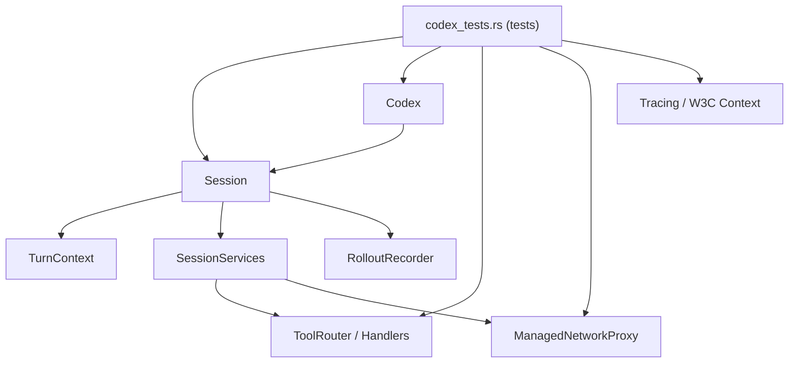
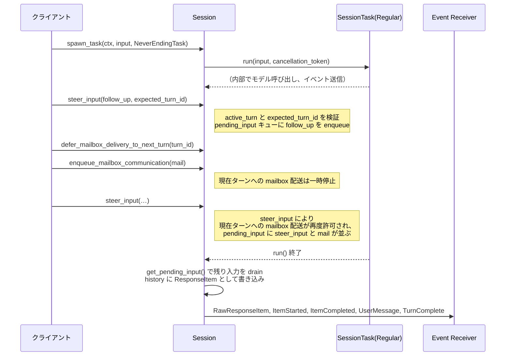

# core/src/codex_tests.rs

## 0. ざっくり一言

Codex のコア `Session` / `Codex` / ツールまわりのふるまいを、統合テストレベルで検証するための巨大なテストモジュールです。  
セッションライフサイクル、ネットワークプロキシ、履歴ロールバック、権限/承認ポリシー、MCP ツール、リアルタイム会話、トレース伝播など、主要な公開 API の契約をテスト経由で定義しています。

> ※行番号について  
> このインターフェースではファイルの実際の行番号情報が提供されていないため、要求されている `core/src/codex_tests.rs:L開始-L終了` 形式での**正確な**行番号は付与できません。  
> 代わりに「関数名／テスト名＋その役割」を根拠として記載します。

---

## 1. このモジュールの役割

### 1.1 概要

このモジュールは主に次の問題をテスト経由で検証しています。

- **Session / Codex のライフサイクル**  
  - セッション初期化、ターン開始・完了・中断、シャットダウンの挙動
- **履歴とロールアウト**  
  - `record_initial_history` / `reconstruct_history_from_rollout` / `thread_rollback` などによる履歴・トークン情報の再構築
- **ネットワーク・ファイルシステム・実行ポリシー**  
  - 管理プロキシ、サンドボックス、ツール実行の承認ポリシーとの連動
- **リアルタイム会話・トレース伝播**  
  - W3C Trace Context, OpenTelemetry のトレース ID の伝播とターンへの埋め込み

### 1.2 アーキテクチャ内での位置づけ

このファイル自身はテスト専用ですが、以下の主要コンポーネントを組み合わせて実際に動く「ミニ環境」を構築し、その上で API の契約を検証しています。

- `Session` / `TurnContext`（会話状態と 1 ターンのコンテキスト）
- `Codex`（サブミッションループとセッションのフロントエンド）
- `SessionServices`（モデル・ツール・ネットワーク・スキルなどの依存サービス）
- `RolloutRecorder`（ロールアウト＝イベントログの永続化）
- ツール関連:
  - `ToolRouter`, `ShellHandler`, `UnifiedExecHandler` など
- ネットワーク関連:
  - `Session::start_managed_network_proxy`, `NetworkProxyConfig`, execpolicy `Policy`
- トレース関連:
  - W3C TraceContext, `submission_dispatch_span`, `current_span_w3c_trace_context`

依存関係イメージを簡略化して示します。



### 1.3 設計上のポイント

コード（テスト）から読み取れる特徴を挙げます。

- **完全なテスト用セッション構築ヘルパー**
  - `make_session_and_context` / `make_session_and_context_with_rx` / `make_session_and_context_with_dynamic_tools_and_rx` で、実際の設定・モデル・ツール・ネットワーク・スキルを結線した `Session` と `TurnContext` を生成しています。
- **非同期・並行テスト**
  - ほぼ全て `#[tokio::test]` で書かれ、`multi_thread` フレーバのテストもあり、マルチスレッド環境でのふるまいを検証しています（例: `abort_regular_task_emits_turn_aborted_only`）。
- **イベント駆動の契約テスト**
  - `async_channel::Receiver<Event>` を使い `EventMsg::TurnStarted`, `TurnComplete`, `TurnAborted`, `UserMessage` などが**いつ・何回**流れるかをテストし、外部 API の契約を定義しています。
- **履歴・ロールアウトの再生テスト**
  - `RolloutItem` の列から `ContextManager` を使って履歴を再構成するパスと、`record_initial_history` の挙動を突き合わせてテストしています。
- **安全性／権限まわりの強制**
  - 実行ツール (`ShellHandler`, `UnifiedExecHandler`) に対し、「承認ポリシーが OnRequest 以外のときはエスカレートされた権限を拒否する」ことをテストで固定しています。
- **トレース伝播の明示**
  - OpenTelemetry / W3C Trace Context を利用し、「サーバーリクエスト → サブミッション → セッションターン → セッションタスク」の各レイヤでトレース ID がどのように引き継がれるかをテストしています。

---

## 2. 主要な機能一覧

このモジュールがテストしている主な機能をテーマ別にまとめると次の通りです。

- **セッション・ターンライフサイクル関連**
  - セッションの起動、`spawn_task` によるターン開始、`abort_all_tasks` による中断と `TurnAborted` イベントの発行
  - ターン終了時の履歴書き込みと、残っていた pending input の取り込み
- **ネットワークプロキシおよび execpolicy**
  - `Session::start_managed_network_proxy` が execpolicy のネットワークルールを反映すること
  - sandbox ポリシー変更時にプロキシ設定が再計算・適用されること
  - `NetworkPolicyDecider` の挙動と 403 応答の形
- **履歴・ロールアウト・ロールバック**
  - `record_initial_history` (New / Resumed / Forked) の挙動と `build_initial_context` との関係
  - `reconstruct_history_from_rollout` による履歴復元と Compacted ロールアウトとの整合性
  - `handlers::thread_rollback` によるターン単位ロールバック・マーカーの永続化
- **トークン利用・モデル設定**
  - `recompute_token_usage` がセッションの base instructions を基にトークン数を再計算し、`model_context_window` を更新すること
  - `RateLimitSnapshot` の `set_rate_limits` で credits / plan_type をどうマージするか
- **設定更新と環境コンテキスト**
  - `SessionSettingsUpdate` / `SessionConfiguration::apply` の CWD とファイルシステムポリシーの再導出
  - `build_settings_update_items` が環境（日時・タイムゾーン・ネットワーク）や realtime 状態の変化をどのように developer / user メッセージとして表現するか
- **リアルタイム会話と音声**
  - `new_default_turn` がトレース ID を埋め込むこと
  - `realtime_conversation_list_voices` が組み込みの音声リストを返すこと
- **Steering / mailbox / pending input**
  - `steer_input` の前提条件とエラーケース
  - mailbox（エージェント間通信）と pending input キューの振る舞い、ターン境界の扱い
- **ツール・MCP・実行環境**
  - MCP ツール露出 (`build_mcp_tool_exposure`) の閾値処理と explicit app の優先
  - `ShellHandler` / `UnifiedExecHandler` によるサンドボックス権限エスカレーション拒否
  - `McpCallToolResult::into_function_call_output_payload` の構造化コンテンツ優先ロジック
- **Guardian / サブエージェント**
  - guardian subagent / guardian review セッションが `shutdown_and_wait` で安全にシャットダウンされること
- **トレース／テレメトリ**
  - `submit_with_id`, `submission_dispatch_span`, `spawn_task` による W3C Trace Context の受け渡し

---

## 3. 公開 API と詳細解説

このファイル自体はテストモジュールであり「公開 API の定義」はありませんが、ここでテストされている**コア API の契約**が重要です。  
以下では、テストから読み取れる範囲で主要メソッド／関数の挙動を整理します。

### 3.1 型一覧（構造体・列挙体など）

このファイル内で新規に定義されている主な型です。

| 名前 | 種別 | 役割 / 用途 |
|------|------|-------------|
| `InstructionsTestCase` | 構造体 | `get_base_instructions_no_user_content` テストで、モデルスラグと apply_patch 説明を期待するかどうかを表す簡単なテストケース定義。 |
| `NeverEndingTask` | 構造体 + `SessionTask` 実装 | テスト用のタスク。`run` が終了しない or `CancellationToken` を待つことで、`abort_all_tasks` などの挙動を検証する。 |

※ `TraceCaptureTask` は `spawn_task_turn_span_inherits_dispatch_trace_context` テスト内で定義されるローカル構造体です。トレースコンテキストがタスクのスパンに引き継がれることを確認するために使用されます。

### 3.2 関数・メソッド詳細（代表 7 件）

以下は、このテストモジュールが強く依存しているコア API です。  
シグネチャはこのファイルから推測できる範囲での概略です。

---

#### 1. `Session::record_initial_history(initial: InitialHistory) -> impl Future<Output = ()>`

**概要**

- セッション開始時に、外部から与えられたロールアウト履歴 (`InitialHistory`) を元に内部の会話履歴・トークン情報・前回ターン設定などを復元するメソッドです。
- `InitialHistory::New` / `Resumed` / `Forked` を区別して扱っていることがテストから読み取れます。

**主な引数**

| 引数名 | 型 | 説明 |
|--------|----|------|
| `initial` | `InitialHistory` | `New`（新規会話）、`Resumed(ResumedHistory)`（既存会話の再開）、`Forked(Vec<RolloutItem>)`（フォークした履歴）など。 |

**戻り値**

- `Future<Output = ()>` に相当し、`await` することで初期履歴の適用が完了します。

**内部処理の流れ（テストから読み取れる契約）**

- `InitialHistory::New` の場合
  - 履歴は空のまま開始し、`build_initial_context` の内容は**最初のターンまで遅延**される（`record_initial_history_new_defers_initial_context_until_first_turn`）。
  - `reference_context_item`, `previous_turn_settings` は `None` にリセット。
- `InitialHistory::Resumed(ResumedHistory { history, rollout_path, .. })` の場合
  - 渡された `history: Vec<RolloutItem>` から `reconstruct_history_from_rollout` 相当のロジックで履歴を再構築し、`SessionState` に反映（`record_initial_history_reconstructs_resumed_transcript`）。
  - `RolloutItem::Compacted` の `replacement_history` がある場合、それをそのまま `reconstructed.history` として使用（`reconstruct_history_uses_replacement_history_verbatim`）。
  - `RolloutItem::EventMsg(EventMsg::TokenCount)` に含まれる `TokenUsageInfo` の**最後の非 None** を `state.token_info` にセット（`record_initial_history_seeds_token_info_from_rollout`）。
- `InitialHistory::Forked(Vec<RolloutItem>)` の場合
  - `history` を `raw_items` として復元し、`previous_turn_settings` と `reference_context_item` を、フォーク元ターンの `TurnContextItem` から設定（`record_initial_history_forked_hydrates_previous_turn_settings`）。
  - `Forked` の場合も `record_initial_history_reconstructs_forked_transcript` で、ロールアウトからの履歴再構築が行われる。

**使用例（テストから）**

```rust
// Resumed の例
let (session, turn_context) = make_session_and_context().await;
let (rollout_items, _expected) = sample_rollout(&session, &turn_context).await;

session
    .record_initial_history(InitialHistory::Resumed(ResumedHistory {
        conversation_id: ThreadId::default(),
        history: rollout_items,
        rollout_path: PathBuf::from("/tmp/resume.jsonl"),
    }))
    .await;
```

**Errors / Panics**

- このメソッド自体の `Result` はテストからは観測されていません（`await` しており `expect` なども使われていない）。
- ロールアウト JSONL の読み取りに失敗した場合などのエラー挙動は、このファイルからは分かりません。

**Edge cases**

- 履歴中に `TokenCountEvent` が複数ある場合：最後の `info: Some(...)` だけが採用される（`record_initial_history_seeds_token_info_from_rollout`）。
- `InitialHistory::New` の場合：初期文脈（環境説明など）は**即座には履歴に書き込まれない**（最初のターンまで defer）。

**使用上の注意点**

- `Resumed` / `Forked` の場合は、`rollout_path` を後続の `thread_rollback` が参照するため、適切なパスを与える必要があります。
- 既存履歴を上書きするため、呼び出し前の履歴は破棄される前提で使うべきです。

---

#### 2. `handlers::thread_rollback(session: &Session, sub_id: String, num_turns: usize) -> impl Future<Output = ()>`

**概要**

- 既存スレッドの最後の N ターンをロールバックし、履歴・ロールアウト・前回ターン設定を再構築するハンドラです。
- 複数のテストで、成功・失敗・エッジケースが詳細に検証されています。

**主な引数**

| 引数名 | 型 | 説明 |
|--------|----|------|
| `session` | `&Session` | 対象セッション。テストでは `Arc<Session>` を渡して `handlers::thread_rollback(&sess, ...)` として呼ばれます。 |
| `sub_id` | `String` | ロールバック対象サブスレッド ID。テストでは `"sub-1".to_string()` など。 |
| `num_turns` | `usize` | ロールバックするターン数（1 以上が必要）。 |

**戻り値**

- `Future<Output = ()>` 相当。完了時に `EventMsg::ThreadRolledBack` または `EventMsg::Error` がイベントとして流れます。

**内部処理（テストから読み取れる契約）**

1. **事前条件チェック**
   - `num_turns == 0` の場合、エラーで `EventMsg::Error`（`CodexErrorInfo::ThreadRollbackFailed`）を発行し、「`num_turns must be >= 1`」メッセージ（`thread_rollback_fails_when_num_turns_is_zero`）。
   - `Session` にアクティブなターンがある場合 (`active_turn.is_some()`)、ロールバックは拒否され `EventMsg::Error` が発行される（`thread_rollback_fails_when_turn_in_progress`）。
   - ロールアウトパスが永続化されていない場合もエラー（`thread_rollback_fails_without_persisted_rollout_path`）。

2. **ロールアウト再生と履歴再構築**
   - ロールアウト JSONL を読み、過去の `RolloutItem` からターンを数え上げ、`num_turns` を削除した状態で `history` を再構成。
   - 参照コンテキスト (`reference_context_item`) と `previous_turn_settings` をロールアウトから再計算（`thread_rollback_recomputes_previous_turn_settings_and_reference_context_from_replay`）。
   - Compacted 履歴（`RolloutItem::Compacted`）があり、`replacement_history` に書き換え履歴がある場合、ロールバック後の履歴が期待通りになるよう扱う（`thread_rollback_restores_cleared_reference_context_item_after_compaction`）。

3. **マーカーの永続化**
   - ロールバックが成功すると、`RolloutItem::EventMsg(EventMsg::ThreadRolledBack)` マーカーをロールアウト履歴に追記（`thread_rollback_persists_marker_and_replays_cumulatively`）。
   - 複数回ロールバックした場合、マーカーも複数残る（テストでカウント 2 を確認）。

4. **イベント発行**
   - 成功時：`EventMsg::ThreadRolledBack(ThreadRolledBackEvent { num_turns, .. })` を 1 回発行。
   - 失敗時：`EventMsg::Error(ErrorEvent { codex_error_info: Some(ThreadRollbackFailed), .. })`。

**使用例**

```rust
let (sess, tc, rx) = make_session_and_context_with_rx().await;
let rollout_path = attach_rollout_recorder(&sess).await;

// 履歴やロールアウトをセットアップした後
handlers::thread_rollback(&sess, "sub-1".to_string(), 1).await;

let rollback_event = wait_for_thread_rolled_back(&rx).await;
assert_eq!(rollback_event.num_turns, 1);
```

**Errors**

- `num_turns == 0` → エラー (`ThreadRollbackFailed`)。
- ロールアウトパス未永続化 → エラー (`thread rollback requires a persisted rollout path`)。
- ターン進行中 → エラー (`ThreadRollbackFailed`)。

**Edge cases**

- `num_turns` が存在するターン数を超える場合：履歴は初期コンテキストまでクリアされる（`thread_rollback_clears_history_when_num_turns_exceeds_existing_turns`）。
- Compacted 履歴との組み合わせで、`reference_context_item` が正しく復元されないケースがないようテストされています。

**使用上の注意点**

- 呼び出し前にターンが進行中でないことを確認する必要があります。
- ロールアウト JSONL が壊れている場合の挙動は、このファイルからは不明です。

---

#### 3. `Session::build_initial_context(turn: &TurnContext) -> impl Future<Output = Vec<ResponseItem>>`

**概要**

- モデルに最初に与える「初期コンテキスト」メッセージ群（developer / user メッセージ）を組み立てます。
- モデル切り替え、環境情報（日時・タイムゾーン・ネットワーク）、リアルタイム状態、パーソナリティなどを含む XML ライクなマークアップを生成します。

**引数**

| 引数名 | 型 | 説明 |
|--------|----|------|
| `turn` | `&TurnContext` | 現在のターンの設定・モデル情報を含むコンテキスト。 |

**戻り値**

- `Vec<ResponseItem>`：`ResponseItem::Message`（developer / user ロール）等のリスト。

**内部処理（テストから読み取れる契約）**

- モデル切り替え
  - `PreviousTurnSettings` の `model` と現在の `turn.model_info.slug` が異なる場合、最初の developer メッセージに `<model_switch>` ブロックを含める（`build_initial_context_prepends_model_switch_message`）。
- リアルタイム状態
  - `turn.realtime_active == true` かつ参照コンテキストがない場合、`<realtime_conversation>` ブロックを出力（`build_initial_context_uses_previous_realtime_state` & `build_initial_context_restates_realtime_start_when_reference_context_is_missing`）。
  - 参照コンテキストが既にあり、リアルタイム状態が変わっていない場合は重複出力しない。
  - `PreviousTurnSettings` に `realtime_active: Some(true)` があり、現在は false の場合、`Reason: inactive` を含むリアルタイム終了メッセージを出すこともある（`build_initial_context_uses_previous_turn_settings_for_realtime_end`）。
- 画像生成の保存場所
  - 画像履歴の有無に関わらず、初期コンテキストでは「Generated images are saved to ...」のような文言を出力しない（`build_initial_context_omits_default_image_save_location_*`）。
- パーソナリティ
  - Personality 機能が有効な場合、`<personality_spec>` を含む developer メッセージを挿入する（`sample_rollout` 内のロジック）。

**使用例**

```rust
let (session, turn_context) = make_session_and_context().await;
let initial_context = session.build_initial_context(&turn_context).await;
// initial_context を history に記録する等
```

**Edge cases**

- `reference_context_item` が無い場合とある場合で、リアルタイムに関する文言の重複抑制ロジックが異なります。
- `PreviousTurnSettings` のみがあり `reference_context_item` がない場合でも、アクティブな realtime 状態を再告知するケースがある。

**使用上の注意点**

- 履歴や `reference_context_item` の状態によって出力内容が変わるため、テストではその組み合わせを意識して検証しています。
- `build_initial_context` 自体は状態を変更せず、`record_context_updates_and_set_reference_context_item` と組み合わせて使う想定です。

---

#### 4. `Session::build_settings_update_items(previous: Option<&TurnContextItem>, current: &TurnContext) -> impl Future<Output = Vec<ResponseItem>>`

**概要**

- 「前のターン設定」と「現在のターン設定」の差分から、モデルに渡すべき**設定更新メッセージ**（環境・リアルタイム・ネットワーク等）を組み立てる関数です。

**引数**

| 引数名 | 型 | 説明 |
|--------|----|------|
| `previous` | `Option<&TurnContextItem>` | 直前ターンの設定スナップショット。なければ baseline とみなす。 |
| `current`  | `&TurnContext` | 現在ターンの設定。 |

**戻り値**

- `Vec<ResponseItem>`：ユーザ／開発者メッセージとしての差分アップデート。

**内部処理（テストからの契約）**

- ネットワーク設定の変化
  - `ConfigLayerStack` の requirements.network が変化した場合、`<environment_context>` 内に `<network enabled="...">` と `<allowed> / <denied>` エントリを含む user メッセージを追加（`build_settings_update_items_emits_environment_item_for_network_changes`）。
- 時刻・タイムゾーンの変化
  - `current.current_date` / `current.timezone` が `previous` と違う場合、`<current_date>` / `<timezone>` を含めた `<environment_context>` を出力（`build_settings_update_items_emits_environment_item_for_time_changes`）。
- include_environment_context フラグ
  - `config.include_environment_context == false` の場合、環境コンテキストは**一切生成しない**（`build_settings_update_items_omits_environment_item_when_disabled`）。
- リアルタイム状態
  - `previous.realtime_active == false` → `current.realtime_active == true` の場合、developer メッセージで `<realtime_conversation>` 開始を通知（`build_settings_update_items_emits_realtime_start_when_session_becomes_live`）。
  - `true` → `false` の場合、「Reason: inactive」を含む終了メッセージを developer メッセージとして出力（`build_settings_update_items_emits_realtime_end_when_session_stops_being_live`）。
  - `previous.turn_context_item` に realtime 情報が無くても、`PreviousTurnSettings` から realtime の終了を推定してメッセージを出すケースあり（`build_settings_update_items_uses_previous_turn_settings_for_realtime_end`）。

**使用例**

```rust
let reference_context_item = previous_context.to_turn_context_item();
let update_items = session
    .build_settings_update_items(Some(&reference_context_item), &current_context)
    .await;
```

**Edge cases**

- 差分が何も無い場合は、空の `Vec` を返す（`record_context_updates_and_set_reference_context_item_persists_baseline_without_emitting_diffs` の事前チェック）。

**使用上の注意点**

- この関数はあくまで差分メッセージ生成のみを行い、`reference_context_item` の更新や履歴への書き込みは行いません。  
  それらは `record_context_updates_and_set_reference_context_item` 側の責務です。

---

#### 5. `Session::steer_input(input: Vec<UserInput>, expected_turn_id: Option<&str>, ...) -> impl Future<Output = Result<String, SteerInputError>>`

**概要**

- 進行中のターンに対して「追加入力（steer）」を注入する API です。
- エラーケース・前提条件がテストで明確に押さえられています。

**引数（テストから推測）**

| 引数名 | 型 | 説明 |
|--------|----|------|
| `input` | `Vec<UserInput>` | 追加入力。 |
| `expected_turn_id` | `Option<&str>` | クライアントが期待している「アクティブターンのサブ ID」。ミスマッチ時にエラー。 |
| `responsesapi_client_metadata` | `Option<...>` | テストでは常に `None`。詳細はこのファイルからは不明。 |

**戻り値**

- `Ok(turn_id)`：実際のアクティブターン ID を返す。
- `Err(SteerInputError)`：各種エラー。

**内部契約（テストから）**

- 前提：アクティブターンが存在すること
  - アクティブターンが無い場合 → `SteerInputError::NoActiveTurn(...)`（`steer_input_requires_active_turn`）。
- expected_turn_id チェック
  - `Some(expected)` が渡され、現在の `tc.sub_id` と異なる場合  
    → `SteerInputError::ExpectedTurnMismatch { expected, actual }` を返す（`steer_input_enforces_expected_turn_id`）。
- ターン種別チェック
  - アクティブターンが `TaskKind::Regular` 以外（例: Review / Compact）の場合  
    → `SteerInputError::ActiveTurnNotSteerable { turn_kind: NonSteerableTurnKind }`（`steer_input_rejects_non_regular_turns`）。
- 正常系
  - 前提を満たせば `Ok(tc.sub_id.clone())` を返し、`pending_input` キューにユーザー入力を追加（`steer_input_returns_active_turn_id`）。
- mailbox との連携
  - 一度 `defer_mailbox_delivery_to_next_turn` により「次ターンまでメールボックス配送を defer」した後でも、steer_input が呼ばれると「現在ターンへの mailbox 配送が再び許可される」（`steered_input_reopens_mailbox_delivery_for_current_turn`）。

**使用例**

```rust
let turn_id = sess
    .steer_input(
        vec![UserInput::Text {
            text: "follow up".to_string(),
            text_elements: Vec::new(),
        }],
        Some(&tc.sub_id),
        None,
    )
    .await?;
```

**Errors**

- `NoActiveTurn` / `ExpectedTurnMismatch` / `ActiveTurnNotSteerable`（上記参照）。

**使用上の注意点**

- クライアントは `expected_turn_id` を指定して「どのターンを steer したつもりか」を明示するのが安全です。
- Review / Compact など非 regular ターンでは呼び出しても失敗する設計になっています。

---

#### 6. `Session::spawn_task(ctx: Arc<TurnContext>, input: Vec<UserInput>, task: impl SessionTask)`

**概要**

- 1 つのターン処理（通常の user input, review, compact など）を非同期タスクとして起動する API です。
- テストでは `NeverEndingTask` や `ReviewTask` を渡し、abort 時のイベントと履歴挙動を検証しています。

**主な引数**

| 引数名 | 型 | 説明 |
|--------|----|------|
| `ctx` | `Arc<TurnContext>` | このターンに紐づくコンテキスト。 |
| `input` | `Vec<UserInput>` | ターン開始時にモデルへ渡す入力。 |
| `task` | `impl SessionTask` | ターンのメインロジック。`kind()` により Regular / Review / Compact などが判別される。 |

**戻り値**

- `impl Future<Output = ()>` 相当。内部で `active_turn` やイベント送信を行います。

**契約（テストから）**

- 通常の Regular タスク
  - `abort_all_tasks(TurnAbortReason::Interrupted)` を呼ぶと `EventMsg::TurnAborted` だけがクライアントに見える（`abort_regular_task_emits_turn_aborted_only`）。
  - タスクがキャンセルを自前でハンドルしても、クライアントにはやはり `TurnAborted` だけが見える（`abort_gracefully_emits_turn_aborted_only`）。
- Review タスク
  - Review 中に abort すると、まず `EventMsg::ExitedReviewMode`（`review_output` なし）が発行され、その後 `TurnAborted` が出る（`abort_review_task_emits_exited_then_aborted_and_records_history`）。
  - 履歴上には `<turn_aborted>` を含む user メッセージが残り、モデル側は中断を認識できる。
- pending input の処理
  - タスク終了時に `idle_pending_input` に残っている `ResponseInputItem` があれば、履歴にユーザメッセージとして書き込み、  
    さらに `RawResponseItem` → `ItemStarted` → `ItemCompleted` → レガシー `UserMessage` → `TurnComplete` というイベントが発行される（`task_finish_emits_turn_item_lifecycle_for_leftover_pending_user_input`）。
- `previous_turn_settings` 更新
  - 非 run-turn タスクでは `previous_turn_settings` を更新しない（`spawn_task_does_not_update_previous_turn_settings_for_non_run_turn_tasks`）。

**使用上の注意点**

- `SessionTask::run` は `CancellationToken` を受け取るため、長時間処理ではそれを監視して早期終了することが推奨されます（`NeverEndingTask` のテスト参照）。
- どの `TaskKind` を返すかによって、`steer_input` 等で steer 可能かどうかが変わる点に注意が必要です。

---

#### 7. `ShellHandler::handle` / `UnifiedExecHandler::handle`

**概要**

- コマンド実行を行うツールハンドラで、サンドボックス権限のエスカレーション要求と「承認ポリシー」の組み合わせを検証するテストが含まれます。
- セキュリティ上重要な契約をテストで固定しています。

**主な引数（共通の `ToolInvocation`）**

| フィールド | 型 | 説明 |
|-----------|----|------|
| `session` | `Arc<Session>` | 実行環境を共有するセッション。 |
| `turn` | `Arc<TurnContext>` | 現在のターンコンテキスト。`approval_policy`, `sandbox_policy` を含む。 |
| `call_id` | `String` | ツールコール ID。 |
| `tool_name` | `codex_tools::ToolName` | `"shell"` や `"exec_command"` など。 |
| `payload` | `ToolPayload` | JSON 文字列の引数群。ここに `sandbox_permissions` / `justification` などが入る。 |

**挙動（テストから）**

- `rejects_escalated_permissions_when_policy_not_on_request`
  - `sandbox_permissions: RequireEscalated` かつ `approval_policy: OnFailure` など `OnRequest` 以外の場合、
  - `ShellHandler::handle` は `Err(FunctionCallError::RespondToModel(msg))` を返し、`msg` 内に  
    「approval policy is OnFailure; reject command — you should not ask for escalated permissions if the approval policy is OnFailure」  
    に相当する文言を含める。
  - 同じコマンドでも、`SandboxPermissions::UseDefault` で `exec_approval_requirement` を作成すると `ExecApprovalRequirement::Skip` になり、非エスカレート経路は妨げられないことも確認しています。
- `unified_exec_rejects_escalated_permissions_when_policy_not_on_request`
  - `UnifiedExecHandler` でも同様に、`RequireEscalated` + `OnFailure` 組み合わせを拒否し、  
    「you cannot ask for escalated permissions if the approval policy is ...」メッセージを返す。

**使用上の注意点**

- エスカレートされた権限（`RequireEscalated`）を要求する場合は、ポリシーが `AskForApproval::OnRequest` である必要があるという契約が、このテストで固定されています。
- テストでは `granted_turn_permissions` が `None` のままであることも確認し、拒否ケースで権限状態が汚染されないことを保証しています。

---

### 3.3 その他の関数・ヘルパー

このファイルに定義されるテストヘルパーのうち、頻出のものをまとめます。

| 関数名 | 役割（1 行） |
|--------|--------------|
| `user_message(text: &str)` | `ResponseItem::Message`（role: "user"）を手軽に生成するヘルパー。 |
| `assistant_message(text: &str)` | `ResponseItem::Message`（role: "assistant"）を生成するヘルパー。 |
| `skill_message(text: &str)` | スキル用 `ResponseItem::Message`（role: "user"）を生成。 |
| `developer_input_texts(items: &[ResponseItem])` | developer ロールのメッセージから `InputText` の文字列だけを抽出。 |
| `user_input_texts(items: &[ResponseItem])` | user ロールのメッセージから `InputText` の文字列だけを抽出。 |
| `test_tool_runtime(session, turn_context)` | ツールルータ・トラッカー付きの `ToolCallRuntime` をテスト用に構築。 |
| `make_connector(id, name)` | `AppInfo` を簡単に生成するヘルパー（コネクタテスト用）。 |
| `numbered_mcp_tools(count)` | `tool_0..tool_{n-1}` 名前の MCP ツールセットを構築。 |
| `tools_config_for_mcp_tool_exposure(search_tool: bool)` | MCP ツール露出テストのための `ToolsConfig` を構築。 |
| `wait_for_thread_rolled_back(rx)` | イベントストリームから `EventMsg::ThreadRolledBack` をタイムアウト付きで待つ。 |
| `wait_for_thread_rollback_failed(rx)` | `EventMsg::Error(CodexErrorInfo::ThreadRollbackFailed)` を待つ。 |
| `attach_rollout_recorder(session)` | テスト用に `RolloutRecorder` をセッションに接続し、ロールアウトパスを返す。 |
| `build_test_config(codex_home)` | 管理コンフィグ無し（managed config なし）でテスト用 `Config` を構築。 |
| `session_telemetry(...)` | テスト用の `SessionTelemetry` を生成。 |
| `make_session_configuration_for_tests()` | テスト向けの `SessionConfiguration` を返す async 関数。 |
| `make_session_and_context()` | テスト用 `Session` と `TurnContext` を作り、外部依存を一通り初期化する重要なヘルパー。 |
| `make_session_and_context_with_dynamic_tools_and_rx(dynamic_tools)` | 上記に加え、動的ツールとイベント受信チャネル付きで `Arc<Session>` を構築。 |
| `make_session_and_context_with_rx()` | 動的ツールなし版の `make_session_and_context_with_dynamic_tools_and_rx`。 |

---

## 4. データフロー

ここでは、**1 ターンのライフサイクル**と steering / mailbox / pending input のやりとりを、テストに基づいて整理します。

### 4.1 ターン開始〜steer〜完了のフロー

対象テスト例：

- `task_finish_emits_turn_item_lifecycle_for_leftover_pending_user_input`
- `steer_input_returns_active_turn_id`
- `steered_input_reopens_mailbox_delivery_for_current_turn`
- `queue_only_mailbox_mail_waits_for_next_turn_after_answer_boundary`

これらから読み取れるフローをシーケンス図で示します。



このフローは、`task_finish_emits_turn_item_lifecycle_for_leftover_pending_user_input` テストで、イベントの順序と pending input の履歴への書き込みが確認されています。

---

## 5. 使い方（How to Use）

このファイル自体はテストですが、「Codex のコア API をどう組み合わせるか」という実例として参考になります。

### 5.1 基本的な使用方法（統合テスト用セッション構築）

`make_session_and_context` を使うと、最小限の設定で実際の `Session` を立ち上げることができます。

```rust
#[tokio::test]
async fn my_integration_test() {
    // セッションとターンコンテキストを構築する
    let (session, mut turn_context) = make_session_and_context().await;

    // 必要に応じてコンテキストを書き換える
    turn_context.reasoning_effort = Some(ReasoningEffortConfig::Minimal);

    // ターンを開始する
    let input = vec![UserInput::Text {
        text: "hello".to_string(),
        text_elements: Vec::new(),
    }];
    session
        .spawn_task(
            Arc::new(turn_context),
            input,
            NeverEndingTask {
                kind: TaskKind::Regular,
                listen_to_cancellation_token: true,
            },
        )
        .await;

    // 必要な検証を行う …
}
```

### 5.2 よくある使用パターン

1. **ロールアウト付きでの履歴テスト**

```rust
let (sess, tc, rx) = make_session_and_context_with_rx().await;
let rollout_path = attach_rollout_recorder(&sess).await;

// 履歴を ResponseItem で差し替え
sess.replace_history(full_history.clone(), Some(tc.to_turn_context_item()))
    .await;
// RolloutItem に変換して永続化
let rollout_items: Vec<RolloutItem> = full_history
    .into_iter()
    .map(RolloutItem::ResponseItem)
    .collect();
sess.persist_rollout_items(&rollout_items).await;

// thread_rollback を呼んで挙動を確認
handlers::thread_rollback(&sess, "sub-1".to_string(), 1).await;
```

1. **承認ポリシーとエスカレート権限のテスト**

```rust
use crate::sandboxing::SandboxPermissions;
use codex_protocol::protocol::AskForApproval;

let (session, mut turn_context_raw) = make_session_and_context().await;
turn_context_raw
    .approval_policy
    .set(AskForApproval::OnFailure)
    .unwrap();

let session = Arc::new(session);
let turn_context = Arc::new(turn_context_raw);
let tracker = Arc::new(tokio::sync::Mutex::new(TurnDiffTracker::new()));

let handler = UnifiedExecHandler;
let resp = handler
    .handle(ToolInvocation {
        session: Arc::clone(&session),
        turn: Arc::clone(&turn_context),
        tracker,
        call_id: "exec-call".to_string(),
        tool_name: codex_tools::ToolName::plain("exec_command"),
        payload: ToolPayload::Function {
            arguments: serde_json::json!({
                "cmd": "echo hi",
                "sandbox_permissions": SandboxPermissions::RequireEscalated,
                "justification": "need unsandboxed execution",
            })
            .to_string(),
        },
    })
    .await;

assert!(matches!(resp, Err(FunctionCallError::RespondToModel(_))));
```

### 5.3 よくある間違い

テストが明示的に禁止している誤用例を挙げます。

```rust
// 誤り例: アクティブターンなしで steer_input する
let err = sess
    .steer_input(vec![UserInput::Text { text: "steer".into(), text_elements: Vec::new() }],
                 None,
                 None)
    .await
    .unwrap_err();
// => SteerInputError::NoActiveTurn

// 誤り例: OnRequest 以外の承認ポリシーで RequireEscalated を要求
turn_context.approval_policy.set(AskForApproval::OnFailure).unwrap();
// ...
let resp = handler.handle(ToolInvocation { /* sandbox_permissions: RequireEscalated */ }).await;
// => Err(FunctionCallError::RespondToModel(msg))
```

### 5.4 使用上の注意点（まとめ）

- **非同期前提**: ほぼ全て `async fn` であり、Tokio ランタイム上で実行する必要があります。
- **ステートフルな `Session`**:
  - `SessionState` の `Mutex` を通じて `token_info`, `reference_context_item`, `previous_turn_settings` が更新されるため、テストではロックの取り方に注意します。
- **イベントストリーム**:
  - イベントは `async_channel::Receiver<Event>` から読み取る設計で、テストでは `timeout` を利用してハングを防いでいます。
- **承認ポリシーとサンドボックス**:
  - エスカレート権限要求は承認ポリシー `OnRequest` との組み合わせでのみ許可されるようテストされており、これがセキュリティ上の重要な制約となります。

---

## 6. 変更の仕方（How to Modify）

### 6.1 新しい機能を追加する場合

- **新しい Session メソッドやハンドラを追加した場合**
  1. 実装先モジュール（例: `Session`, `handlers`, `tools::handlers` ）にロジックを追加。
  2. このテストモジュールで `make_session_and_context` 系を利用し、統合テストを追加。
  3. イベントや履歴への影響がある場合は、`*_with_rx` 系ヘルパーで `Receiver<Event>` を取得し、期待する `EventMsg` をアサートします。

- **新しいツールや MCP ツール関連のロジック**
  - `make_mcp_tool` / `numbered_mcp_tools` / `tools_config_for_mcp_tool_exposure` のパターンに倣い、必要なテスト用エントリを作り、`build_mcp_tool_exposure` 相当の関数の挙動をテストします。

### 6.2 既存の機能を変更する場合

- `record_initial_history` / `thread_rollback` / `build_initial_context` など、**履歴やコンテキストに関わる API** を変更する場合:
  - 対応するテストが多数あるため、影響範囲として以下を確認します。
    - 履歴 (`history.raw_items()`)、`previous_turn_settings`、`reference_context_item` の期待値
    - ロールアウト JSONL に永続化される `RolloutItem` の種類・順序
- `steer_input`・`spawn_task`・mailbox 関連を変更する場合:
  - steering と mailbox の再開ロジックを検証するテスト（`steered_input_reopens_mailbox_delivery_for_current_turn` 等）を再確認し、期待する順序が変わるかを明示します。
- セキュリティ／承認ポリシーまわり:
  - Shell / UnifiedExec ハンドラの挙動を変更する場合は、`rejects_escalated_permissions_when_policy_not_on_request` 等のテストが契約を表しているので、それを更新するか、新しい契約をテストで明示する必要があります。

---

## 7. 関連ファイル

このテストモジュールと密接に関係するモジュール・ファイル（推測できる範囲）です。

| パス / モジュール | 役割 / 関係 |
|-------------------|------------|
| `core/src/codex_tests_guardian.rs` | `#[path = "codex_tests_guardian.rs"] mod guardian_tests;` として取り込まれている追加テストモジュール。Guardian 関連のテストが含まれると推測されます。 |
| `crate::session` (`Session`, `SessionState`, `SessionServices` 等を定義するモジュール) | このファイル内のほぼ全テストが依存するコアセッション実装。 |
| `crate::handlers` | `thread_rollback`, `user_input_or_turn`, `run_user_shell_command`, `realtime_conversation_list_voices` などのハンドラを提供。 |
| `crate::tools::handlers` | `ShellHandler`, `UnifiedExecHandler` など各種ツールハンドラ。 |
| `crate::rollout` (`RolloutRecorder` 等) | ロールアウト JSONL の永続化と読み出しを行い、`record_initial_history` や `thread_rollback` のテストで利用される。 |
| `codex_models_manager` | モデル情報 (`ModelInfo`) の取得と `ModelClient` の構築に使用される。 |
| `codex_network_proxy` | 管理ネットワークプロキシの起動・再設定ロジックを提供し、ネットワーク関連テストで使用される。 |
| `codex_protocol` | プロトコル・イベント型 (`EventMsg`, `TurnStartedEvent`, `UserMessageEvent`, `RealtimeVoicesList` など) を定義。テストでイベントアサートに利用される。 |
| `core_test_support` 系モジュール | モックサーバ (`start_mock_server`)、SSE レスポンス、コンテキストスナップショット (`context_snapshot`) などのテスト支援。 |

このモジュールは、これらの実装モジュールと組み合わせることで、Codex コアの振る舞いを**実環境に近い形で検証する統合テスト群**となっています。
