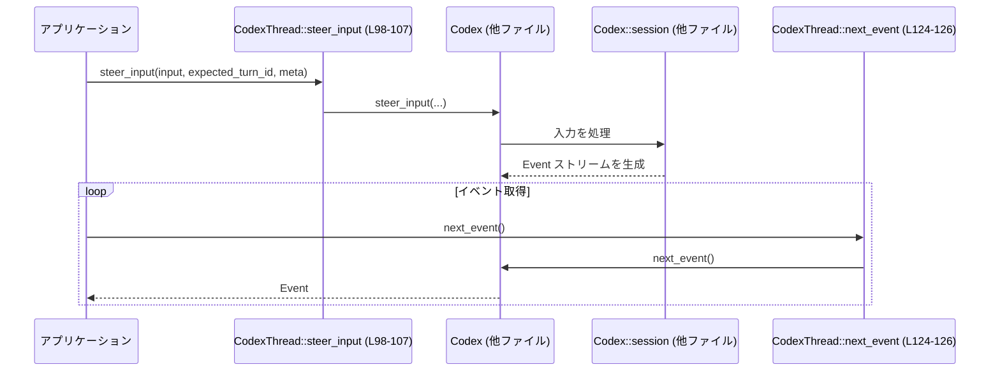

# core/src/codex_thread.rs

## 0. ざっくり一言

Codex の「スレッド（会話）」を表すハイレベルなハンドルであり、  
`Codex` 本体やその `session` への操作をラップして、メッセージ送信・イベント取得・MCP リソース／ツール呼び出し・アウトオブバンド処理の一時停止制御などを提供するモジュールです（`codex_thread.rs:L49-279`）。

---

## 1. このモジュールの役割

### 1.1 概要

このモジュールは **Codex の 1 セッション（スレッド）** を操作するための窓口を提供します。

- `CodexThread` 構造体で、内部の `Codex` インスタンスと関連状態を保持します（`codex_thread.rs:L49-54`）。
- ユーザー入力の送信、イベントストリームの受信、MCP（Model Context Protocol）のリソース／ツール操作をラップします。
- 「アウトオブバンドの問いかけ（elicitation）」中は通常の処理を一時停止するためのカウンタと、その状態を `session` に伝える制御を行います（`codex_thread.rs:L245-277`）。

### 1.2 アーキテクチャ内での位置づけ

`CodexThread` は主に以下のコンポーネントとの間を取り持ちます：

- `Codex`（コアエージェント実装）: ほぼすべての処理はここへ委譲されます（`codex_thread.rs:L50,L72-78,L90-121,L124-138,L163-167,L177-191,L200-206,L213-238,L241-243`）。
- `Codex.session`（他ファイル）: トークン使用量、MCP リソース／ツール、会話履歴操作、ロールアウトファイルなどの低レベル機能を提供（定義はこのチャンクには現れません）。
- `StateDbHandle`（ロールアウト用の外部ステート DB、`codex_rollout` クレート）: オプションとして保持（`codex_thread.rs:L32,L200-202`）。
- `WatchRegistration`（ファイル監視）: ドロップ時に監視解除するために保持していると考えられますが、詳細はこのチャンクには現れません（`codex_thread.rs:L49-53`）。
- `tokio::sync::Mutex` および `watch::Receiver` により、非同期並行環境での状態共有・ステータス購読を行います（`codex_thread.rs:L29-30,L49-53,L132-134,L245-247`）。

```mermaid
flowchart LR
    subgraph Thread["CodexThread (L49-279)"]
        CT[CodexThread 構造体\ncodex_thread.rs:L49-54]
        CTC[Mutex<u64> out_of_band_elicitation_count\n(L52,L245-277)]
        WR[WatchRegistration _watch_registration\n(L53)]
    end

    Codex["Codex (crate::codex::Codex)\n(定義は別ファイル)"]
    Session["session フィールド (Codex 内部)\n(定義は別ファイル)"]
    SDB["StateDbHandle\n(codex_rollout::state_db)\n(定義は別ファイル)"]

    CT --> Codex
    Codex --> Session
    CT --> SDB
    CT --> WR
    CT --> CTC
```

### 1.3 設計上のポイント

コードから読み取れる特徴を列挙します。

- **ファサード的構造**
  - `CodexThread` のほとんどのメソッドは、`Codex` または `Codex.session` への単純な委譲です（`submit`, `next_event`, `call_mcp_tool` など、`codex_thread.rs:L72-78,L124-126,L228-239`）。
- **状態管理**
  - スレッドごとに `rollout_path`（ロールアウトファイルの場所）と、アウトオブバンドエリシテーションのカウンタ（`Mutex<u64>`）を持ちます（`codex_thread.rs:L51-52,L245-277`）。
  - `_watch_registration` フィールドは未使用ですが、所有権を保持することで監視がスレッドライフタイムに紐付く構造になっています（`codex_thread.rs:L49-53`）。
- **エラーハンドリング**
  - Codex 固有の `CodexErr` とそのエイリアス `CodexResult` を多用しており（`codex_thread.rs:L10-11,L72-78,L120-122,L124-126,L245-278`）、MCP 関連では `anyhow::Result` も使用します（`codex_thread.rs:L208-225,L228-239`）。
  - アウトオブバンドカウンタでは `checked_add` によりオーバーフローを検知し、`CodexErr::Fatal` エラーに変換しています（`codex_thread.rs:L248-250`）。
- **並行性**
  - `tokio::sync::Mutex` により、非同期コンテキストでも安全にカウンタを更新します（`codex_thread.rs:L29,L52,L245-247,L261-263`）。
  - ステータスの購読には `tokio::sync::watch::Receiver` を利用し、状態変化を購読するチャネルが提供されています（`codex_thread.rs:L30,L132-134`）。

---

## 2. 主要な機能一覧

このモジュールが提供する主要機能を箇条書きにします。

- スレッドへの操作送信: `submit`, `submit_with_trace`, `submit_with_id` で `Op` や `Submission` を送信（`codex_thread.rs:L72-74,L90-96,L119-122`）。
- イベントストリームの取得: `next_event` でエージェントからの `Event` を逐次取得（`codex_thread.rs:L124-126`）。
- ユーザー入力のステアリング: `steer_input` で `UserInput` のバッチを送信し、Codex の振る舞いを制御（`codex_thread.rs:L98-107`）。
- エージェントステータスの取得／購読: `agent_status` と `subscribe_status`（`codex_thread.rs:L128-134`）。
- セッション構成のスナップショット取得: `config_snapshot` で `ThreadConfigSnapshot` を取得（`codex_thread.rs:L34-47,L204-206`）。
- MCP リソース／ツール呼び出し: `read_mcp_resource`, `call_mcp_tool`（`codex_thread.rs:L208-225,L228-239`）。
- アウトオブバンドエリシテーションの一時停止制御:
  - `increment_out_of_band_elicitation_count` / `decrement_out_of_band_elicitation_count` によりカウンタを増減し、`session` の pause 状態を切り替え（`codex_thread.rs:L245-277`）。
- ロールアウト／ステート関連:
  - ロールアウトファイルの materialize/flush（`ensure_rollout_materialized`, `flush_rollout`、`codex_thread.rs:L80-88`）。
  - `rollout_path` と `state_db` の取得（`codex_thread.rs:L196-202`）。
- 各種メタ情報設定と機能フラグ:
  - アプリケーションクライアント情報の設定: `set_app_server_client_info`（`codex_thread.rs:L109-117`）。
  - 機能フラグの有効判定: `enabled`（`codex_thread.rs:L241-243`）。
- メッセージ履歴への直接注入:
  - ターン境界を作らずに user メッセージを注入: `inject_user_message_without_turn`（`codex_thread.rs:L140-169`）。
  - テスト用の `append_message`（`#[cfg(test)]`, `codex_thread.rs:L177-193`）。

---

## 3. 公開 API と詳細解説

### 3.1 型一覧（構造体など）

#### 構造体

| 名前 | 種別 | 役割 / 用途 | 定義範囲 |
|------|------|-------------|----------|
| `ThreadConfigSnapshot` | 構造体 | スレッドの現在の構成（モデル、サービスティア、サンドボックスポリシーなど）のスナップショットを保持します。`config_snapshot` で取得されます。 | `codex_thread.rs:L34-47` |
| `CodexThread` | 構造体 | 1 スレッド（会話）に対する高レベルな操作インターフェース。内部に `Codex` とロールアウト・カウンタ・ウォッチ登録を保持します。 | `codex_thread.rs:L49-54` |

#### このファイル内の関数／メソッドインベントリー

| 名称 | 種別 | 可視性 | async | 概要 | 定義範囲 |
|------|------|--------|-------|------|----------|
| `CodexThread::new` | メソッド | `pub(crate)` | いいえ | `CodexThread` のコンストラクタ。`Codex`, `rollout_path`, `WatchRegistration` を受け取り、カウンタを 0 で初期化します。 | `codex_thread.rs:L59-70` |
| `submit` | メソッド | `pub` | はい | `Op` を Codex に送信し、サーバー側 submission ID 等の文字列を返します。 | `codex_thread.rs:L72-74` |
| `shutdown_and_wait` | メソッド | `pub` | はい | Codex のシャットダウンを開始し、完了まで待ちます。 | `codex_thread.rs:L76-78` |
| `ensure_rollout_materialized` | メソッド | `pub`（`#[doc(hidden)]`） | はい | `session` にロールアウトファイルを materialize させます。 | `codex_thread.rs:L80-83` |
| `flush_rollout` | メソッド | `pub`（`#[doc(hidden)]`） | はい | ロールアウトをフラッシュして I/O 結果を返します。 | `codex_thread.rs:L85-88` |
| `submit_with_trace` | メソッド | `pub` | はい | W3C Trace Context を付与して `Op` を送信します。 | `codex_thread.rs:L90-96` |
| `steer_input` | メソッド | `pub` | はい | `Vec<UserInput>` を渡して Codex の入力ステアリングを行います。 | `codex_thread.rs:L98-107` |
| `set_app_server_client_info` | メソッド | `pub` | はい | アプリケーションサーバーのクライアント情報（名前・バージョン）を設定します。 | `codex_thread.rs:L109-117` |
| `submit_with_id` | メソッド | `pub` | はい | 事前に ID を持つ `Submission` を送信します。 | `codex_thread.rs:L119-122` |
| `next_event` | メソッド | `pub` | はい | エージェントから次の `Event` を取得するイベントストリームの入口です。 | `codex_thread.rs:L124-126` |
| `agent_status` | メソッド | `pub` | はい | 現在の `AgentStatus` を返します。 | `codex_thread.rs:L128-130` |
| `subscribe_status` | メソッド | `pub(crate)` | いいえ | `watch::Receiver` を返し、ステータス変更を購読させます。 | `codex_thread.rs:L132-134` |
| `total_token_usage` | メソッド | `pub(crate)` | はい | セッション全体の `TokenUsage` を返します。 | `codex_thread.rs:L136-138` |
| `inject_user_message_without_turn` | メソッド | `pub(crate)` | はい | ユーザー role のメッセージをターン境界を作らずにセッションに注入します。 | `codex_thread.rs:L140-169` |
| `append_message` | メソッド | `pub(crate)` `#[cfg(test)]` | はい | テスト用補助: 既存の `ResponseItem` をターンとして扱わずに履歴に追加します。 | `codex_thread.rs:L177-193` |
| `rollout_path` | メソッド | `pub` | いいえ | スレッドに紐づくロールアウトパス（あれば）を返します。 | `codex_thread.rs:L196-198` |
| `state_db` | メソッド | `pub` | いいえ | 内部の `StateDbHandle` を返します。 | `codex_thread.rs:L200-202` |
| `config_snapshot` | メソッド | `pub` | はい | `ThreadConfigSnapshot` を取得します。 | `codex_thread.rs:L204-206` |
| `read_mcp_resource` | メソッド | `pub` | はい | MCP サーバーからリソースを `serde_json::Value` として読み出します。 | `codex_thread.rs:L208-225` |
| `call_mcp_tool` | メソッド | `pub` | はい | MCP サーバー上のツールを呼び出し、その結果を返します。 | `codex_thread.rs:L228-239` |
| `enabled` | メソッド | `pub` | いいえ | 機能フラグ `Feature` が有効か判定します。 | `codex_thread.rs:L241-243` |
| `increment_out_of_band_elicitation_count` | メソッド | `pub` | はい | カウンタを 1 増やし、0→1 になるときに session を一時停止状態にします。 | `codex_thread.rs:L245-258` |
| `decrement_out_of_band_elicitation_count` | メソッド | `pub` | はい | カウンタを 1 減らし、1→0 になるときに session の一時停止を解除します。 | `codex_thread.rs:L261-277` |
| `pending_message_input_item` | 関数 | `fn`（モジュール内 private） | いいえ | `ResponseItem::Message` から `ResponseInputItem::Message` を生成し、それ以外なら `InvalidRequest` エラーを返します。 | `codex_thread.rs:L281-290` |

---

### 3.2 関数詳細（7 件）

#### `submit(&self, op: Op) -> CodexResult<String>`

**概要**

- スレッドに対して 1 つの操作 `Op` を送信し、文字列（通常は submission ID など）を返します。
- 実体は `self.codex.submit(op).await` の単純なラッパーです（`codex_thread.rs:L72-74`）。

**引数**

| 引数名 | 型 | 説明 |
|--------|----|------|
| `op` | `Op` | 実行したい操作を表す Codex プロトコルのオペレーション。定義はこのチャンクには現れません（`codex_protocol::protocol::Op`）。 |

**戻り値**

- `CodexResult<String>`（`codex_thread.rs:L11,L72-74`）
  - `Ok(String)`: 送信が成功し、Codex 側で割り当てられた ID などの文字列を返します。
  - `Err(CodexErr)`: 送信に失敗した場合のエラー。

**内部処理の流れ**

1. `self.codex.submit(op).await` を呼びます（`codex_thread.rs:L73`）。
2. `Codex` 側の処理結果（`CodexResult<String>`）をそのまま呼び出し元に返します（`codex_thread.rs:L72-74`）。

**Examples（使用例）**

```rust
// thread: CodexThread がすでに用意されている前提
async fn send_op(thread: &CodexThread, op: Op) -> codex_protocol::error::Result<()> {
    // Op をスレッドに送信する
    let submission_id = thread.submit(op).await?; // エラー時は ? で呼び出し元に伝播
    println!("送信された submission_id: {}", submission_id); // 成功時に ID を出力
    Ok(())
}
```

**Errors / Panics**

- `CodexErr` の具体的な種類や条件は `Codex::submit` の実装に依存し、このチャンクには現れません（`Codex` 定義は不明）。
- この関数自体は panic を発生させるコードパスを持ちません。

**Edge cases（エッジケース）**

- `op` の内容が不正な場合や、Codex 側がエラーを返した場合は `Err(CodexErr)` になります（詳細条件は不明）。
- ネットワークや I/O に依存する場合、その失敗も `Err` として返る可能性があります（Codex 実装依存）。

**使用上の注意点**

- 非同期関数であり、`tokio` などの非同期ランタイム上から `.await` で呼び出す前提です。
- 返り値の文字列は次の処理（イベント監視など）で関連付けに使われる可能性があるため、必要なら保存しておくことが想定されますが、このファイルからは断定できません。

---

#### `next_event(&self) -> CodexResult<Event>`

**概要**

- エージェントからの次の `Event` を取得するストリーム API の 1 ステップです（`codex_thread.rs:L124-126`）。
- 内部的には `self.codex.next_event().await` を呼び出します。

**引数**

- なし（`&self` のみ）。

**戻り値**

- `CodexResult<Event>`（`codex_thread.rs:L18,L124-126`）
  - `Ok(Event)`: 次のイベント。種類（メッセージ、ツール呼び出し結果など）は `Event` の定義に依存し、このチャンクには現れません。
  - `Err(CodexErr)`: イベント取得に失敗した場合のエラー。

**内部処理の流れ**

1. `self.codex.next_event().await` を呼びます（`codex_thread.rs:L125`）。
2. 結果をそのまま返します（`codex_thread.rs:L124-126`）。

**Examples（使用例）**

```rust
// イベントループ的にイベントを受信する例
async fn consume_events(thread: &CodexThread) -> codex_protocol::error::Result<()> {
    loop {
        // 次のイベントを待機
        let event = thread.next_event().await?; // エラー時は ? で脱出
        println!("受信イベント: {:?}", event); // Debug 出力（Event が Debug 実装を持つ前提）

        // 適宜 break 条件を判定する（内容は Event の定義に依存）
    }
}
```

**Errors / Panics**

- `Codex::next_event` によって `Err(CodexErr)` が返る可能性がありますが、その条件はこのチャンクには現れません。
- このメソッド自体は panic を起こすコードパスを含みません。

**Edge cases**

- イベントストリームが枯渇した場合の挙動（`Ok` で特殊な終端イベントを返すのか、`Err` にするのか）はこのチャンクからは分かりません。
- 接続断やキャンセルなどの状況も Codex 側の実装に依存します。

**使用上の注意点**

- 多くの場合、送信した `submit` / `steer_input` に対応する結果を得るためにループで呼び出すことになります。
- イベント処理を行うタスクと送信タスクの並行実行を行う場合、`CodexThread` の参照を複数タスクで共有できますが、`next_event` 自体は 1 箇所でシリアルに呼び出す方がストリーム整合性を保ちやすくなります。

---

#### `steer_input(&self, input: Vec<UserInput>, expected_turn_id: Option<&str>, responsesapi_client_metadata: Option<HashMap<String, String>>) -> Result<String, SteerInputError>`

**概要**

- `UserInput` の一覧を渡して Codex の挙動をステアリングします（`codex_thread.rs:L98-107`）。
- `Codex::steer_input` にそのまま委譲し、結果として文字列（通常は ID）か `SteerInputError` を返します。

**引数**

| 引数名 | 型 | 説明 |
|--------|----|------|
| `input` | `Vec<UserInput>` | ユーザーからの入力（テキスト・コマンドなど）。`UserInput` の詳細はこのチャンクには現れません（`codex_protocol::user_input::UserInput`）。 |
| `expected_turn_id` | `Option<&str>` | 期待するターン ID。現在のターンがこの ID と一致することを期待する場合に指定し、整合しない場合にはエラーになる可能性があります（推測、詳細は不明）。 |
| `responsesapi_client_metadata` | `Option<HashMap<String, String>>` | クライアント側のメタデータ。レスポンス API 側に付帯情報として渡されます。 |

**戻り値**

- `Result<String, SteerInputError>`（`codex_thread.rs:L3,L103-107`）
  - `Ok(String)`: 成功した場合の ID 等。
  - `Err(SteerInputError)`: 入力内容やターン ID の不整合などに対するエラーと推測されますが、詳細は `SteerInputError` に依存し、このチャンクには現れません。

**内部処理の流れ（アルゴリズム）**

1. そのまま `self.codex.steer_input(input, expected_turn_id, responsesapi_client_metadata).await` を呼び出します（`codex_thread.rs:L104-106`）。
2. 結果を返します。

**Examples（使用例）**

```rust
use std::collections::HashMap;

async fn steer_example(thread: &CodexThread, user_inputs: Vec<UserInput>) 
    -> Result<String, SteerInputError> 
{
    // 追加メタデータを用意
    let mut meta = HashMap::new();
    meta.insert("client".to_string(), "my-app".to_string());

    // ターン ID を特に指定しない場合は None
    let result_id = thread
        .steer_input(user_inputs, None, Some(meta))
        .await?; // SteerInputError がそのまま伝播

    Ok(result_id)
}
```

**Errors / Panics**

- `SteerInputError` の発生条件は `Codex::steer_input` 実装に依存し、このチャンクには現れません。
- このメソッド本体には panic となる処理はありません。

**Edge cases**

- `input` が空の `Vec` の場合の扱い（エラーになるか、何もしないか）はこのチャンクからは分かりません。
- `expected_turn_id` が `Some` の場合に、実際のターン ID と不一致だったときの挙動は `SteerInputError` 側に依存します。
- `responsesapi_client_metadata` のキー重複やサイズ制限などもこのチャンクからは読み取れません。

**使用上の注意点**

- ユーザーの自由入力だけでなく、システムからの指示を含めるなど複雑なステアリングにも利用される可能性がありますが、`UserInput` の仕様に従う必要があります。
- 複数の非同期タスクから同時に `steer_input` を呼ぶ場合、Codex 側がどのように順序づけ／直列化するかは不明なため、通常は 1 つの「対話の流れ」に対して 1 本のタスクから呼び出す構造が扱いやすくなります。

---

#### `inject_user_message_without_turn(&self, message: String)`

**概要**

- ユーザー role のメッセージを、**新たなユーザーターン境界を作らずに** セッションに記録します（`codex_thread.rs:L140-169`）。
- まず「ペンディング入力」として注入を試み、失敗した場合は通常の会話アイテムとして新しいターンコンテキストを作成して保存します。

**引数**

| 引数名 | 型 | 説明 |
|--------|----|------|
| `message` | `String` | ユーザーからのテキストメッセージ。 |

**戻り値**

- なし（`()`）。エラーは内部で握りつぶし、必要に応じてフォールバックします。

**内部処理の流れ**

1. `message` を `ResponseItem::Message` に変換します（role=`"user"`, content は `ContentItem::InputText` のベクタ）（`codex_thread.rs:L142-147`）。
2. `pending_message_input_item(&message)` を呼んで、`ResponseInputItem::Message` に変換します（`codex_thread.rs:L149-150`）。
   - ここで `Err` が返る可能性は実質的にありません。なぜなら直前で `ResponseItem::Message` を構築しているからです（`codex_thread.rs:L142-148,L281-290`）。
   - それでも `Err` の場合は `debug_assert!(false, ...)` でデバッグビルド時に検知し、そのまま `return` します（`codex_thread.rs:L151-154`）。
3. `self.codex.session.inject_response_items(vec![pending_item]).await` を呼び、ペンディング入力として注入を試みます（`codex_thread.rs:L156-161`）。
   - `Ok(_)` の場合: そのまま終了。
   - `Err(_)` の場合: フォールバック処理に進みます（`codex_thread.rs:L162-168`）。
4. フォールバック処理:
   - `self.codex.session.new_default_turn().await` で新しいデフォルトのターンコンテキストを作成（`codex_thread.rs:L163`）。
   - `record_conversation_items(turn_context.as_ref(), &[message]).await` で、先ほど作成した `ResponseItem::Message` を会話履歴に記録します（`codex_thread.rs:L164-167`）。

**Examples（使用例）**

```rust
// セッションプレフィックスメッセージを追加するようなケース
async fn add_prefix(thread: &CodexThread) {
    // これはエラーを返さない API なので ? は使えない
    thread
        .inject_user_message_without_turn("前置きメッセージです".to_string())
        .await;
}
```

**Errors / Panics**

- `pending_message_input_item` の内部で `ResponseItem` が `Message` でない場合 `InvalidRequest` エラーを返しますが、この関数では必ず `Message` を作って渡しているため、通常は発生しません（`codex_thread.rs:L142-148,L281-290`）。
- その異常経路では `debug_assert!(false, ...)` が実行されます（`codex_thread.rs:L151-153`）。  
  リリースビルドでは何も起きずに `return` するだけですが、デバッグビルドではアサート失敗となります。
- `inject_response_items` や `record_conversation_items` の内部でのエラーは、このメソッドでは表面化しません。
  - `inject_response_items` が `Err` のときはフォールバック処理に切り替えます（`codex_thread.rs:L156-168`）。
  - `record_conversation_items` のエラー処理はこのチャンクには現れず、戻り値も無視されています（`codex_thread.rs:L164-167`）。

**Edge cases**

- `message` が空文字列でも、`ContentItem::InputText` として格納されます（特別扱いはありません）。
- `inject_response_items` が恒常的に失敗する場合、毎回フォールバック経路で `record_conversation_items` を呼ぶことになります。
- エラー情報が呼び出し側に返らないため、**失敗を検知することはできません**（ログや外部観測機構が別にある可能性はありますが、このチャンクには現れません）。

**使用上の注意点**

- 「ターンを切らずに履歴へ書き込みたい」特別な場面（セッションプレフィックスの挿入など）だけに使う想定であることが、コメントから読み取れます（`codex_thread.rs:L140-141`）。
- エラーが呼び出し元に伝わらないため、確実な配信が必要なメッセージには向きません。
- メッセージが二重に記録されることはありませんが、注入が失敗するとフォールバックで「通常の会話アイテム」として扱われる点に注意が必要です。

---

#### `call_mcp_tool(&self, server: &str, tool: &str, arguments: Option<serde_json::Value>, meta: Option<serde_json::Value>) -> anyhow::Result<CallToolResult>`

**概要**

- MCP サーバー上のツールを呼び出し、その結果 `CallToolResult` を返します（`codex_thread.rs:L228-239`）。
- 内部的には `self.codex.session.call_tool(...)` に委譲しています。

**引数**

| 引数名 | 型 | 説明 |
|--------|----|------|
| `server` | `&str` | 接続先 MCP サーバー名または ID。具体的な形式はこのチャンクには現れません。 |
| `tool` | `&str` | 呼び出したいツール名。 |
| `arguments` | `Option<serde_json::Value>` | ツールに渡す引数を JSON で表現したもの。 |
| `meta` | `Option<serde_json::Value>` | メタ情報（トレース ID など）のための任意 JSON。 |

**戻り値**

- `anyhow::Result<CallToolResult>`（`codex_thread.rs:L12,L228-239`）
  - `Ok(CallToolResult)`: ツール呼び出しの成功結果。
  - `Err(anyhow::Error)`: ネットワークエラー、バリデーションエラーなど、MCP 呼び出し中のあらゆる失敗。

**内部処理の流れ**

1. `self.codex.session.call_tool(server, tool, arguments, meta).await` を呼びます（`codex_thread.rs:L235-238`）。
2. その結果をそのまま返します。

**Examples（使用例）**

```rust
use serde_json::json;
use codex_protocol::mcp::CallToolResult;

async fn run_mcp_tool(thread: &CodexThread) -> anyhow::Result<CallToolResult> {
    // 引数を JSON で構築
    let args = json!({ "query": "SELECT * FROM users LIMIT 10" });

    // MCP ツールを呼び出す
    let result = thread
        .call_mcp_tool("my-mcp-server", "sql_query", Some(args), None)
        .await?; // anyhow::Error は ? で伝播

    Ok(result)
}
```

**Errors / Panics**

- エラーはすべて `anyhow::Error` に包まれます。具体的なエラー種別（接続失敗・タイムアウト・フォーマットエラーなど）は `session.call_tool` の実装に依存し、このチャンクには現れません。
- panic を起こすコードは含まれていません。

**Edge cases**

- `arguments` が `None` の場合、ツールは引数無しで呼び出されます。ツール側がそれを許容するかどうかは不明です。
- 非 UTF-8 なバイト列など、JSON で表現できないデータは、その時点でエラーになる可能性がありますが、このファイルからは分かりません。

**使用上の注意点**

- 例外を使わない Rust の設計に従い、失敗はすべて `Result` で返されます。`anyhow` を使っているため、高レベルなアプリケーション側ではエラーの詳細なダウンキャストが必要になる場合があります。
- セキュリティ上、ユーザー入力から直接 `server` や `tool` を組み立てる場合は、呼び出し側でバリデーションを行う必要があります。このモジュールではそれを行っていません（`codex_thread.rs:L228-239`）。

---

#### `increment_out_of_band_elicitation_count(&self) -> CodexResult<u64>`

**概要**

- 「アウトオブバンドエリシテーション（通常の対話とは別の問いかけ）」を開始するときに呼ぶ想定のメソッドです（`codex_thread.rs:L245-258`）。
- 内部カウンタを 1 増やし、0→1 になる場合に `session` に対して「一時停止状態（paused = true）」をセットします。

**引数**

- なし（`&self` のみ）。

**戻り値**

- `CodexResult<u64>`:
  - `Ok(count)`: インクリメント後のカウンタ値。
  - `Err(CodexErr::Fatal)`: カウンタがオーバーフローした場合。

**内部処理の流れ**

1. `self.out_of_band_elicitation_count.lock().await` で `Mutex` をロックし、可変参照 `guard` を取得（`codex_thread.rs:L245-247`）。
2. `was_zero = *guard == 0` を計算し、元が 0 だったかを記録（`codex_thread.rs:L247`）。
3. `guard.checked_add(1)` によってオーバーフローを検出し、`None` の場合は `CodexErr::Fatal("...overflowed")` を生成して `Err` を返します（`codex_thread.rs:L248-250`）。
4. インクリメントに成功した場合、`*guard` に新しい値を代入します（`codex_thread.rs:L248-250`）。
5. もし `was_zero` が `true` なら、`self.codex.session.set_out_of_band_elicitation_pause_state(true)` を呼び、session を「一時停止状態」にします（`codex_thread.rs:L252-255`）。
6. `Ok(*guard)` を返します（`codex_thread.rs:L257-258`）。

**Examples（使用例）**

```rust
async fn start_oob(thread: &CodexThread) -> codex_protocol::error::Result<()> {
    // カウンタをインクリメントし、必要なら session を pause にする
    let new_count = thread.increment_out_of_band_elicitation_count().await?;
    println!("アウトオブバンドカウンタ: {}", new_count);
    Ok(())
}
```

**Errors / Panics**

- オーバーフロー時に `CodexErr::Fatal` を返します（`codex_thread.rs:L248-250`）。
  - 現実的には `u64` がオーバーフローするほど呼ばれることは想定しづらく、**異常系検知用のガード** として機能します。
- `Mutex` のロック取得に関連する panic は、`tokio::sync::Mutex` の仕様上、通常は発生しません（ロックポイズンがない設計）。

**Edge cases**

- もともとカウンタが 0 のときに呼ぶと、`set_out_of_band_elicitation_pause_state(true)` が呼ばれます（`codex_thread.rs:L247,L252-255`）。
- すでに 1 以上のときに再度呼ぶと、pause 状態は変わらず、カウンタだけが増えます。
- カウンタが `u64::MAX` からさらにインクリメントされた場合、Fatal エラーになります。

**使用上の注意点**

- 複数のアウトオブバンド処理が並行して存在する場合、それぞれで `increment` / `decrement` を対に呼び出すことが前提です。  
  そうしないと、いつまでも pause 状態が解除されない、または想定より早く解除されるおそれがあります。
- このメソッドは非同期であり、カウンタ更新の前に `.await` で他タスクに切り替わる可能性がありますが、`Mutex` により値の整合性は保たれます。

---

#### `decrement_out_of_band_elicitation_count(&self) -> CodexResult<u64>`

**概要**

- アウトオブバンドエリシテーションが終了したときに呼ぶ想定のメソッドです（`codex_thread.rs:L261-277`）。
- カウンタを 1 減らし、1→0 になる場合に `session` の pause 状態を解除します。

**引数**

- なし。

**戻り値**

- `CodexResult<u64>`:
  - `Ok(count)`: デクリメント後のカウンタ値。
  - `Err(CodexErr::InvalidRequest)`: すでに 0 の状態で呼び出した場合。

**内部処理の流れ**

1. `self.out_of_band_elicitation_count.lock().await` でロックし、`guard` を取得（`codex_thread.rs:L261-263`）。
2. `*guard == 0` の場合、`CodexErr::InvalidRequest("...already zero")` を返して終了（`codex_thread.rs:L263-266`）。
3. `*guard -= 1` でカウンタを 1 減らす（`codex_thread.rs:L269`）。
4. `now_zero = *guard == 0` を計算し、0 になったか判定（`codex_thread.rs:L270`）。
5. `now_zero` が `true` の場合、`self.codex.session.set_out_of_band_elicitation_pause_state(false)` を呼び、pause を解除（`codex_thread.rs:L271-274`）。
6. `Ok(*guard)` を返す（`codex_thread.rs:L277`）。

**Examples（使用例）**

```rust
async fn end_oob(thread: &CodexThread) -> codex_protocol::error::Result<()> {
    // カウンタをデクリメントし、必要なら session の pause を解除
    let new_count = thread.decrement_out_of_band_elicitation_count().await?;
    println!("アウトオブバンドカウンタ(After): {}", new_count);
    Ok(())
}
```

**Errors / Panics**

- カウンタが 0 のときに呼び出すと `CodexErr::InvalidRequest` を返します（`codex_thread.rs:L263-266`）。
- panic となるコードは含まれていません。

**Edge cases**

- `increment` / `decrement` の呼び出し順序が崩れて、`decrement` が多く呼ばれると `InvalidRequest` が頻発します。
- 複数コンポーネントが同じスレッドに対して independently にカウンタを操作する場合、ペアリングが崩れないよう設計が必要です（このファイルではその管理方法は分かりません）。

**使用上の注意点**

- **必ず `increment` と対で使用する** ことが前提です。
- エラーが返った場合、その時点で pause 状態は変更されていないため、呼び出し側でロジックを見直す必要があります（ただし、本ファイルにはそのハンドリング例はありません）。

---

### 3.3 その他の関数

ここでは、比較的単純なラッパーや補助的な関数を一覧で示します。

| 関数名 | 役割（1 行） | 定義範囲 |
|--------|--------------|----------|
| `CodexThread::new` | `CodexThread` のコンストラクタ。`Codex` とロールアウトパス、`WatchRegistration` を受け取り、カウンタを 0 で初期化します。 | `codex_thread.rs:L59-70` |
| `shutdown_and_wait` | Codex のシャットダウンを開始し、その完了を待ちます。 | `codex_thread.rs:L76-78` |
| `ensure_rollout_materialized` | ロールアウトファイルが materialize 済みであることを保証します。 | `codex_thread.rs:L80-83` |
| `flush_rollout` | ロールアウトをフラッシュし、`std::io::Result<()>` を返します。 | `codex_thread.rs:L85-88` |
| `submit_with_trace` | W3C Trace Context を付与して `Op` を送信します。トレース識別子による観測性向上に利用されます。 | `codex_thread.rs:L90-96` |
| `set_app_server_client_info` | アプリケーションのクライアント名・バージョンを `session` に設定します。 | `codex_thread.rs:L109-117` |
| `submit_with_id` | 既に ID を割り当て済みの `Submission` を送信します。 | `codex_thread.rs:L119-122` |
| `agent_status` | 非同期に `AgentStatus` を取得します。 | `codex_thread.rs:L128-130` |
| `subscribe_status` | `watch::Receiver<AgentStatus>` を返し、ステータス更新の通知を購読させます。 | `codex_thread.rs:L132-134` |
| `total_token_usage` | セッションの総トークン使用量を返します。 | `codex_thread.rs:L136-138` |
| `append_message` | テスト専用: 事前に組み立てた `ResponseItem` をペンディングとして注入し、必要なら次ターンへキューします。 | `codex_thread.rs:L177-193` |
| `rollout_path` | ロールアウトファイルパス（`Option<PathBuf>`）をクローンして返します。 | `codex_thread.rs:L196-198` |
| `state_db` | 内部の `StateDbHandle` を返します。`Codex::state_db` の委譲です。 | `codex_thread.rs:L200-202` |
| `config_snapshot` | スレッドの現在の構成を `ThreadConfigSnapshot` として取得します。 | `codex_thread.rs:L204-206` |
| `read_mcp_resource` | MCP サーバーからリソースを読み出し、汎用的な `serde_json::Value` として返します。 | `codex_thread.rs:L208-225` |
| `enabled` | 指定された `Feature` が有効かどうかを判定します。 | `codex_thread.rs:L241-243` |
| `pending_message_input_item` | `ResponseItem::Message` を `ResponseInputItem::Message` に変換する補助関数です。それ以外の variant には `InvalidRequest` を返します。 | `codex_thread.rs:L281-290` |

---

## 4. データフロー

ここでは、典型的な「入力を送信してイベントを受け取る」フローのデータ流れを示します。

1. アプリケーションは `CodexThread::steer_input (L98-107)` でユーザー入力をスレッドに送信します。
2. `CodexThread` は `Codex::steer_input` にそのまま委譲し、Codex 内部の `session` に処理が渡ります（`codex_thread.rs:L104-106`）。
3. Codex は内部で必要な処理を行い、会話やツール実行などに応じた `Event` をストリームとして生成します（Codex 側の実装はこのチャンクには現れません）。
4. アプリケーションは別途 `CodexThread::next_event (L124-126)` を繰り返し呼び出し、発生した `Event` を取得します。



**要点**

- `CodexThread` はデータの内容を直接処理せず、ほぼすべてを `Codex`／`Session` に委譲しています。
- 入力（`UserInput` や `Op`）と出力（`Event`）の間の実際の対話ロジックは Codex 側に実装されています（このチャンクには現れません）。
- アウトオブバンドエリシテーション中（カウンタ > 0 の間）は、`session.set_out_of_band_elicitation_pause_state(true/false)` によって内部処理が pause/resume される設計になっています（`codex_thread.rs:L252-255,L271-274`）。

---

## 5. 使い方（How to Use）

### 5.1 基本的な使用方法

ここでは、すでにどこかで `CodexThread` が生成されている前提で、基本的な送受信の流れを示します。

```rust
use codex_protocol::protocol::{Op, Event};
use crate::codex_thread::CodexThread; // 実際のパスは crate 構成に依存

// スレッドに Op を送信し、その後のイベントを 1 件受信する例
async fn basic_flow(thread: &CodexThread, op: Op) -> codex_protocol::error::Result<()> {
    // 1. Op を送信する
    let submission_id = thread.submit(op).await?; // submit は CodexResult<String> を返す（L72-74）
    println!("submission_id: {}", submission_id);

    // 2. 次のイベントを待機する
    let event: Event = thread.next_event().await?; // next_event は CodexResult<Event>（L124-126）
    println!("受信イベント: {:?}", event);

    Ok(())
}
```

### 5.2 よくある使用パターン

1. **トレース付き送信 (`submit_with_trace`)**

```rust
use codex_protocol::protocol::{Op, W3cTraceContext};

async fn send_with_trace(
    thread: &CodexThread,
    op: Op,
    trace: W3cTraceContext,
) -> codex_protocol::error::Result<String> {
    // トレースコンテキストを付与して送信（L90-96）
    let submission_id = thread.submit_with_trace(op, Some(trace)).await?;
    Ok(submission_id)
}
```

- 分散トレーシング環境で、リクエスト間の関連付けを行いたい場合に有効です。

1. **MCP ツール呼び出し**

```rust
use serde_json::json;
use codex_protocol::mcp::CallToolResult;

async fn call_tool_example(thread: &CodexThread) -> anyhow::Result<CallToolResult> {
    // 引数を JSON オブジェクトで構築
    let args = json!({ "q": "hello" });

    // MCP ツールを呼び出す（L228-239）
    let result = thread
        .call_mcp_tool("server1", "echo_tool", Some(args), None)
        .await?;

    Ok(result)
}
```

1. **アウトオブバンドエリシテーション中の pause 制御**

```rust
async fn with_out_of_band(thread: &CodexThread) -> codex_protocol::error::Result<()> {
    // 開始時にインクリメント（L245-258）
    thread.increment_out_of_band_elicitation_count().await?;

    // ここでアウトオブバンド処理を行う（内容はアプリケーションに依存）

    // 終了時にデクリメント（L261-277）
    thread.decrement_out_of_band_elicitation_count().await?;
    Ok(())
}
```

### 5.3 よくある間違い

1. **カウンタをインクリメントしたままデクリメントし忘れる**

```rust
// 間違い例: increment のみ呼んで、decrement を呼ばない
async fn wrong_oob(thread: &CodexThread) -> codex_protocol::error::Result<()> {
    thread.increment_out_of_band_elicitation_count().await?;
    // ... アウトオブバンド処理 ...
    // decrement を呼ばないため、session が pause 解除されない可能性がある
    Ok(())
}

// 正しい例: increment と decrement を必ずペアにする
async fn correct_oob(thread: &CodexThread) -> codex_protocol::error::Result<()> {
    thread.increment_out_of_band_elicitation_count().await?;
    // ... アウトオブバンド処理 ...
    thread.decrement_out_of_band_elicitation_count().await?;
    Ok(())
}
```

1. **`decrement_out_of_band_elicitation_count` を 0 の状態で呼ぶ**

- この場合、`CodexErr::InvalidRequest("...already zero")` が返ります（`codex_thread.rs:L263-266`）。
- 上位ロジックでカウンタのライフサイクルを管理する必要があります。

1. **テスト専用 `append_message` をプロダクションで使おうとする**

- `append_message` は `#[cfg(test)]` が付いており、本番ビルドでは存在しません（`codex_thread.rs:L176-177`）。
- プロダクションコードから利用しようとするとコンパイルエラーになります。

### 5.4 使用上の注意点（まとめ）

- **並行性**
  - `out_of_band_elicitation_count` は `tokio::sync::Mutex` で保護されており、複数タスクから同時に `increment` / `decrement` を呼んでもカウンタ整合性は保たれます（`codex_thread.rs:L52,L245-247,L261-263`）。
  - `watch::Receiver<AgentStatus>` によるステータス購読は、複数の購読者を持つことができますが、`subscribe_status` は `pub(crate)` のため、クレート外からは利用できません（`codex_thread.rs:L132-134`）。
- **エラー処理**
  - `submit`, `next_event`, `increment_out_of_band_elicitation_count` など多くのメソッドは `CodexResult` を返し、失敗時には `CodexErr` のいずれかになります（`codex_thread.rs:L10-11,L72-78,L124-126,L245-278`）。
  - MCP 関連メソッドでは `anyhow::Result` を使用しているため、アプリケーション側では `?` 演算子での伝播やログ出力の際にエラー内容をそのまま利用できます（`codex_thread.rs:L208-225,L228-239`）。
- **潜在的な不具合・セキュリティ観点**
  - `inject_user_message_without_turn` は内部エラーを呼び出し元に返さない設計であり、メッセージが正しく記録されなかった場合でも検出が難しいです（`codex_thread.rs:L140-169`）。
  - `call_mcp_tool` / `read_mcp_resource` は引数を検証せずに下層へ渡すため、ユーザー入力を直接これらに渡す場合は呼び出し側でバリデーションやアクセス制御を行う必要があります（`codex_thread.rs:L208-225,L228-239`）。
- **パフォーマンス関連のメモ**
  - このモジュール自体はほとんどが委譲であり、重い処理やループは持ちません。パフォーマンス特性は主に `Codex` / `session` の実装に依存します。
  - `Mutex` で保護されているのは単一の `u64` 値であり、ロック競合が激しくならない限りオーバーヘッドは限定的です。

---

## 6. 変更の仕方（How to Modify）

### 6.1 新しい機能を追加する場合

このモジュールでは、ほとんどの機能が `Codex` またはその `session` へのラッパーとして実装されています。そのため、新しい機能を追加する場合の基本的な流れは次のようになります。

1. **下層 API の確認**
   - まず `Codex` または `Codex.session` に、必要な機能（メソッド）が既に存在するか確認します。  
     それらの定義はこのチャンクには現れないため、別ファイルを参照する必要があります。
2. **`CodexThread` へのメソッド追加**
   - `impl CodexThread` ブロック（`codex_thread.rs:L58-279`）に、新しい `pub` または `pub(crate)` メソッドを追加します。
   - 既存のメソッドのスタイルに合わせ、ほとんどの場合は 1 行または数行で `self.codex` または `self.codex.session` に委譲する形になります。
3. **エラー型の統一**
   - 既存メソッドに倣い、Codex 経由の処理は `CodexResult` や `CodexErr` を使い、MCP 周りは `anyhow::Result` を使うなど、用途に応じたエラー型を選択します。
4. **スレッド安全性の確認**
   - 共有状態（新たなカウンタなど）を追加する場合は、`tokio::sync::Mutex` や `watch` などで保護する必要があります。
   - 既存の `out_of_band_elicitation_count` のような実装（`codex_thread.rs:L52,L245-277`）が参考になります。

### 6.2 既存の機能を変更する場合

変更時に注意すべき点を箇条書きにします。

- **インターフェースの契約**
  - `increment_out_of_band_elicitation_count` / `decrement_out_of_band_elicitation_count` では、  
    「0→1 で pause = true」「1→0 で pause = false」「0 のときの decrement は `InvalidRequest`」という仕様が明確にコード化されています（`codex_thread.rs:L247-255,L263-274`）。  
    これを変えると、カウンタを前提とした他コンポーネントの動作に影響します。
- **エラー型の互換性**
  - `CodexResult` / `anyhow::Result` を別の型に変更すると、上位呼び出し側のエラーハンドリングにも波及します。
- **テストとの関係**
  - `append_message` はテスト用の API です（`codex_thread.rs:L176-177`）。  
    メッセージ注入ロジックを変更する場合、この関数を利用しているテスト（別ファイルに存在）も合わせて確認する必要があります。
- **観測性・トレース**
  - `submit_with_trace` は W3C Trace Context を受け取る唯一のメソッドです（`codex_thread.rs:L90-96`）。  
    観測性の仕様を変更する場合、このメソッドを入口としていることを意識する必要があります。
- **スレッド安全性**
  - `Mutex` 保護の削除や共有状態の追加／変更は、非同期タスク間での race の有無に直結します。  
    `out_of_band_elicitation_count` 以外には共有状態がないため、現状の設計では扱いやすいことが読み取れます。

---

## 7. 関連ファイル

このモジュールと密接に関係する型・モジュールを列挙します。

| パス / モジュール | 役割 / 関係 |
|------------------|------------|
| `crate::codex::Codex` | `CodexThread` が内部に保持するコアオブジェクトです。ほとんどのメソッド呼び出しは `Codex` への委譲です（`codex_thread.rs:L50,L72-78,L90-122,L124-138,L200-202,L213-238,L241-243`）。定義はこのチャンクには現れません。 |
| `crate::agent::AgentStatus` | エージェントの状態を表す列挙体または構造体であり、`agent_status` や `subscribe_status` の戻り値として使われます（`codex_thread.rs:L1,L128-134`）。 |
| `crate::file_watcher::WatchRegistration` | ファイル監視の登録ハンドル。`CodexThread` に保持され、ドロップ時に監視解除されると推測されますが、詳細はこのチャンクには現れません（`codex_thread.rs:L5,L49-53`）。 |
| `codex_rollout::state_db::StateDbHandle` | ロールアウト状態を保持する DB のハンドル。`state_db` メソッドを通して取得されます（`codex_thread.rs:L32,L200-202`）。 |
| `codex_protocol::protocol::*` | `Op`, `Event`, `Submission`, `TokenUsage`, `AskForApproval`, `SandboxPolicy`, `SessionSource`, `W3cTraceContext` などのプロトコル型を提供します（`codex_thread.rs:L17-24`）。定義はこのチャンクには現れません。 |
| `codex_protocol::models::{ResponseItem, ResponseInputItem, ContentItem}` | メッセージやコンテンツを表す型。`inject_user_message_without_turn` や `pending_message_input_item` で使用されます（`codex_thread.rs:L13-15,L140-148,L281-290`）。 |
| `codex_protocol::mcp::{CallToolResult}` および `rmcp::model::ReadResourceRequestParams` | MCP 関連のツール呼び出し結果およびリソース読み出しパラメータです（`codex_thread.rs:L12,L26,L208-225,L228-239`）。 |
| `codex_features::Feature` | 機能フラグの列挙体。`enabled` メソッドで使用します（`codex_thread.rs:L6,L241-243`）。 |

このファイルには、これら関連モジュールの具体的な実装は含まれておらず、インターフェースレベルでの利用のみが現れています。
