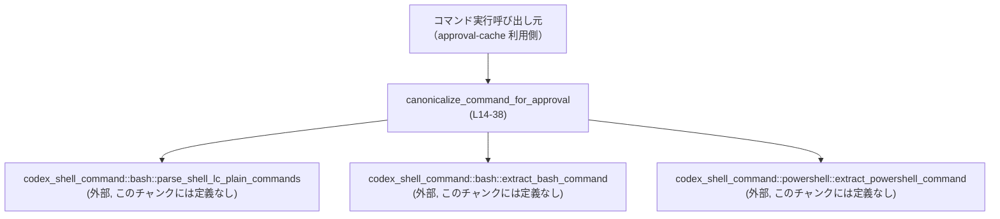
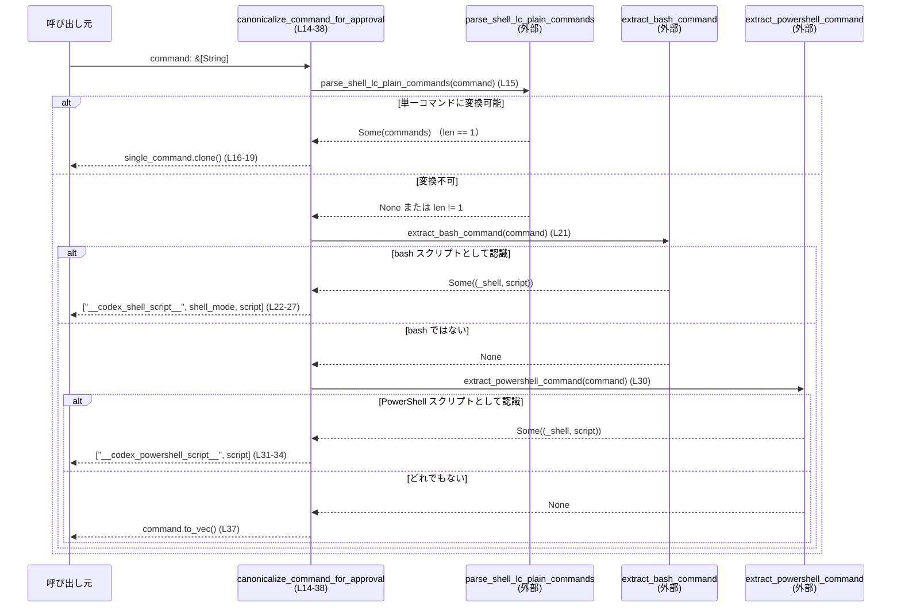

# core/src/command_canonicalization.rs コード解説

## 0. ざっくり一言

シェルコマンドの `argv`（文字列配列）を、承認キャッシュ（approval-cache）用に**安定した「正規形」**に変換するヘルパー関数を提供するモジュールです。  
シェル実行ラッパーやパスの違いがあっても、同じ意味のコマンドは同じキーになるように整形します。  
（根拠: ドキュメントコメント `core/src/command_canonicalization.rs:L8-13`）

---

## 1. このモジュールの役割

### 1.1 概要

- このモジュールは **承認キャッシュのキーとなるコマンド表現を正規化する**ために存在します。
- 同じスクリプトでも `/bin/bash -lc` と `bash -lc` のように**シェルのパスやラッパーが異なる場合**でも、同一視できるようにします。
- 一方で、**実行されるスクリプト本体のテキストは厳密に保持**し、異なるスクリプトは別物として扱えるようにします。  
  （根拠: ドキュメントコメント `L8-13`）

### 1.2 アーキテクチャ内での位置づけ

このファイルは、コマンド実行の前段で「承認キャッシュキーの整形」を行う位置にいると解釈できます。  
外部モジュール `codex_shell_command::{bash,powershell}` にシェル解析を委譲しています。



- `canonicalize_command_for_approval` は、このモジュール内の唯一の関数です。`L14-38`
- シェル判定やスクリプト抽出のロジックは `codex_shell_command` クレートに依存しており、このチャンクには実装が現れません。`L1-3`

### 1.3 設計上のポイント

- **責務の分割**
  - シェルごとの解析（bash, PowerShell）は専用モジュールに任せ、この関数は「正規形の作り方」のみに集中しています。`L1-3, L14-37`
- **状態を持たない**
  - グローバルな可変状態は持たず、入力スライス `&[String]` を受けて新しい `Vec<String>` を返す**純粋関数的な構造**です。`L14-37`
- **エラーハンドリング**
  - `Option` を返す外部関数の結果を `if let Some(...)` で分岐し、失敗（`None`）の場合は静かに次の候補へフォールバックします。パニックを起こすコードはありません。`L15-19, L21-28, L30-35`
- **優先順位付きの判定**
  1. `parse_shell_lc_plain_commands` で「単一のプレーンコマンド列」と判定できれば、そのコマンド列を採用。`L15-19`
  2. それ以外の bash スクリプトは `extract_bash_command` で抽出し、専用のプリフィクス + モード + スクリプトテキストに正規化。`L21-28`
  3. PowerShell スクリプトも同様に専用プリフィクス + スクリプトテキストに正規化。`L30-35`
  4. どれにも当てはまらなければ元の `argv` をそのまま返す。`L37`

---

## 2. 主要な機能一覧

- コマンド argv の正規化: `canonicalize_command_for_approval`
  - シェルラッパーやパスの差異を吸収し、approval-cache 用の安定したキーを生成します。`L8-13, L14-37`
- bash スクリプトコマンドの正規化
  - bash ラッパーを内部的なプリフィクス `__codex_shell_script__` に置き換えつつ、モード（例: `-lc`）とスクリプトテキストを保持します。`L5, L21-27`
- PowerShell スクリプトコマンドの正規化
  - PowerShell ラッパーをプリフィクス `__codex_powershell_script__` に置き換え、スクリプトテキストを保持します。`L6, L30-34`

---

## 3. 公開 API と詳細解説

### 3.1 コンポーネント一覧（関数・定数・テストモジュール）

| 名前 | 種別 | 役割 / 用途 | 根拠 |
|------|------|-------------|------|
| `CANONICAL_BASH_SCRIPT_PREFIX` | 定数 `&'static str` | bash スクリプトを正規形にする際の先頭要素として使うプリフィクス。実シェルパスの代わりに固定値を入れることで、パス違いを吸収します。 | `core/src/command_canonicalization.rs:L5` |
| `CANONICAL_POWERSHELL_SCRIPT_PREFIX` | 定数 `&'static str` | PowerShell スクリプト正規形の先頭要素用プリフィクス。 | `L6` |
| `canonicalize_command_for_approval` | 関数 | 承認キャッシュ用にコマンド `argv` を正規化するコア関数。 | `L8-13, L14-38` |
| `tests` | テストモジュール | このモジュールの単体テストを含む別ファイルへの参照。中身はこのチャンクには現れません。 | `L40-42` |

> 構造体・列挙体などの型定義は、このファイルには存在しません。

### 3.2 関数詳細

#### `canonicalize_command_for_approval(command: &[String]) -> Vec<String>`

**概要**

- 承認キャッシュ用のキーとして使うために、シェルコマンド `argv` を正規化します。`L8-13, L14`
- できるだけ「**実際に実行されるコマンド（またはスクリプト）**」を抽出し、そのトークン列またはスクリプトテキストを元に安定した `Vec<String>` を生成します。`L15-19, L21-27, L30-35`

**引数**

| 引数名 | 型 | 説明 | 根拠 |
|--------|----|------|------|
| `command` | `&[String]` | 実行予定のコマンドの `argv`。一般的には `["/bin/bash", "-lc", "echo hi"]` などのシェル起動コマンドが入ると想定されます。 | シグネチャ `L14` （中身の構造はドキュメントコメント `L8-13` から推測されるが、正確な形式はこのチャンクには定義なし） |

**戻り値**

- 型: `Vec<String>` `L14`
- 意味:
  - approval-cache のキーとして利用可能な、**正規化済みのコマンド表現**です。
  - 入力に応じて、次の 3 パターンのいずれかになります。
    1. 「単一のプレーンコマンド」と認識できた場合: そのコマンドの argv（例: `["echo", "hi"]`）。`L15-19`
    2. bash / PowerShell スクリプトと認識できた場合: 固定プリフィクス + メタ情報 + スクリプトテキスト。`L21-27, L30-34`
    3. 上記のどれでもない場合: 元の `command` をそのままコピー。`L37`

**内部処理の流れ（アルゴリズム）**

1. **プレーンコマンド解析（bash -lc の単純なケース）**  
   - `parse_shell_lc_plain_commands(command)` を呼び出し、bash の `-lc` 形式からプレーンなコマンド列を抽出できるかを試みます。`L15`
   - 戻り値 `commands` のスライスがちょうど 1 要素 (`[single_command]`) の場合のみマッチし、その `single_command` をクローンして即座に返します。`L16-19`  
     - ここで `single_command` はおそらく `Vec<String>` 型（`commands.as_slice()` が `&[T]` を返し `[single_command]` でパターンマッチしているため）。このチャンクでは型の定義自体は現れません。  
   - この段階で「シェルラッパーの存在」は忘れられ、純粋なコマンド argv になります。

2. **bash スクリプトの正規化**  
   - 上記にマッチしなかった場合、`extract_bash_command(command)` を呼び出し、bash 経由で実行されるスクリプトのテキストを抽出します。`L21`
   - `Some((_shell, script))` が返ればマッチし、`_shell` は捨てて `script` だけを利用します。`L21`
   - さらに `command.get(1)` で第二引数（典型的には `-lc` など）を取得し、`cloned().unwrap_or_default()` で `String` にします。第二引数が存在しない場合は空文字列になります。`L22`
   - 正規形として、次の `Vec<String>` を返します。`L23-27`
     1. `"__codex_shell_script__"`（`CANONICAL_BASH_SCRIPT_PREFIX`）`L5, L24`
     2. `shell_mode`（例: `"-lc"`）`L22, L25`
     3. `script.to_string()`（スクリプト全文）`L21, L26`

3. **PowerShell スクリプトの正規化**  
   - bash にもマッチしない場合、`extract_powershell_command(command)` を呼び出し、PowerShell スクリプトのテキストを抽出します。`L30`
   - `Some((_shell, script))` が返ればマッチし、bash と同様に `_shell` は捨てて `script` を利用します。`L30`
   - 正規形として、次の `Vec<String>` を返します。`L31-34`
     1. `"__codex_powershell_script__"`（`CANONICAL_POWERSHELL_SCRIPT_PREFIX`）`L6, L32`
     2. `script.to_string()` `L30-33`

4. **フォールバック（変換しない）**  
   - いずれの解析にもマッチしなかった場合は、`command.to_vec()` で元の argv をコピーして返します。`L37`
   - これにより、この関数は常に**入力と同じ意味を持つコマンド**を返すことが保証されています（少なくとも、変換の方向は「情報を捨てても意味を変えない」ように設計されていると解釈できます）。この点はドキュメントコメント `L8-13` からの解釈であり、厳密な契約はこのチャンク単体では明示されていません。

**処理フロー図**

```mermaid
flowchart TD
    A["入力: command: &[String]"] --> B["parse_shell_lc_plain_commands(command)<br/>(外部, L15)"]
    B -->|Some(commands) かつ commands.len()==1| C["single_command.clone() を返す<br/>(L16-19)"]
    B -->|None または len()!=1| D["extract_bash_command(command)<br/>(外部, L21)"]
    D -->|Some((_shell, script))| E["shell_mode = command.get(1)... (L22)<br/>['__codex_shell_script__', shell_mode, script] を返す (L23-27)"]
    D -->|None| F["extract_powershell_command(command)<br/>(外部, L30)"]
    F -->|Some((_shell, script))| G["['__codex_powershell_script__', script] を返す (L31-34)"]
    F -->|None| H["command.to_vec() を返す (L37)"]
```

**Examples（使用例）**

> モジュールパスはこのチャンクからは分からないため、ここでは便宜上 `crate::command_canonicalization` という名前を使います。このパスは実際のプロジェクト構成によって異なります。

1. **単純な bash -lc コマンド**

```rust
// 仮のインポート。実際のモジュールパスはプロジェクト構成に依存します。
use crate::command_canonicalization::canonicalize_command_for_approval;

fn main() {
    // もともとの argv: /bin/bash -lc "echo hello world"
    let command = vec![
        "/bin/bash".to_string(), // シェルパス
        "-lc".to_string(),       // モード
        "echo hello world".to_string(), // 実行したいコマンド
    ];

    let canonical = canonicalize_command_for_approval(&command);

    // 典型的には、次のようなプレーンコマンドに正規化される想定です
    // （実際にこの形になるかは parse_shell_lc_plain_commands の実装次第で、
    //  このチャンクからは断定できません）
    println!("{:?}", canonical);
    // 例: ["echo", "hello", "world"]
}
```

1. **複雑な bash スクリプト**

```rust
use crate::command_canonicalization::canonicalize_command_for_approval;

fn main() {
    // 例: bash -lc 'for i in {1..3}; do echo $i; done'
    let command = vec![
        "/usr/bin/bash".to_string(),
        "-lc".to_string(),
        "for i in {1..3}; do echo $i; done".to_string(),
    ];

    let canonical = canonicalize_command_for_approval(&command);

    // parse_shell_lc_plain_commands が「単純なプレーンコマンド」と判断できない場合、
    // bash スクリプトとして扱われる可能性があります。
    // その場合はおおむね次のような形になります（概念的な例）:
    //
    // [
    //   "__codex_shell_script__",
    //   "-lc",
    //   "for i in {1..3}; do echo $i; done",
    // ]
    println!("{:?}", canonical);
}
```

1. **PowerShell スクリプト**

```rust
use crate::command_canonicalization::canonicalize_command_for_approval;

fn main() {
    // 例: pwsh -Command "Write-Host 'Hello'"
    let command = vec![
        "pwsh".to_string(),
        "-Command".to_string(),
        "Write-Host 'Hello'".to_string(),
    ];

    let canonical = canonicalize_command_for_approval(&command);

    // PowerShell の場合は概念的に次のような形になります:
    //
    // [
    //   "__codex_powershell_script__",
    //   "Write-Host 'Hello'",
    // ]
    println!("{:?}", canonical);
}
```

> 上記の正確な出力形式は `codex_shell_command::{bash,powershell}` の実装に依存するため、このチャンクだけからは例のようになるとまでは断定できません。例は処理の意図を説明するための概念的なものです。

**Errors / Panics**

- この関数自身は、**明示的なエラー型（`Result`）を返さず、panic の可能性も低い**構造になっています。  
  - `parse_shell_lc_plain_commands` / `extract_bash_command` / `extract_powershell_command` はすべて `Option` を返していると推測され、`if let Some(...)` で安全に扱われています。`L15, L21, L30`
  - `commands.as_slice()` を `[single_command]` でパターンマッチしており、長さが 1 でない場合はマッチせず次の分岐に進むだけです。パニックはしません。`L15-19`
  - `command.get(1).cloned().unwrap_or_default()` は `Option` に対する `unwrap_or_default()` 呼び出しであり、`None` の場合でも panic せず、空文字列（`String::default()`）になります。`L22`
- したがって、**この関数の内部から直接 panic する経路は見当たりません**。  
  ただし、外部関数が内部で panic する可能性については、このチャンクには情報がなく「不明」です。`L1-3`

**Edge cases（エッジケース）**

- `command` が空 (`&[]`) の場合  
  - `parse_shell_lc_plain_commands`, `extract_bash_command`, `extract_powershell_command` がどう振る舞うかは不明ですが、3 つすべてが `None` を返すと仮定すると、最後のフォールバックで `command.to_vec()` により空の `Vec<String>` が返る挙動になります。`L15, L21, L30, L37`
- `command` の長さが 1 の場合（例: `["ls"]`）  
  - bash / PowerShell としては認識されない可能性があります。その場合も元の `argv` がそのまま返ります。`L37`
- 複数のプレーンコマンド列を含む場合  
  - `parse_shell_lc_plain_commands` が `commands` として複数要素を返した場合、`let [single_command] = commands.as_slice()` がマッチせず、プレーンコマンド化は行われません。`L15-19`
  - その後の bash / PowerShell 判定によりスクリプト扱いになるか、最終的に元の `argv` が返るかは外部関数の実装に依存します。
- 第二引数が存在しない bash スクリプト  
  - `command.get(1)` が `None` となり、`shell_mode` が空文字列になります。`L22`
  - 正規形には空文字列が 2 番目の要素として入ることになります。`L23-26`
- 非 UTF-8 / 特殊文字を含むスクリプト  
  - `script.to_string()` が呼ばれているため、`script` は `&str` または `String` など UTF-8 前提の型と推測されます。バイト列そのものを扱うケースは、この関数では想定されていません（このチャンクにはバイト列型は登場しません）。`L21, L30`

**使用上の注意点**

- **前提条件**
  - 入力 `command` は「実際に実行されるコマンドの argv」であることが前提です。そうでない任意の文字列配列を渡した場合、意図しない正規形になる可能性があります。これはドキュメントコメント `L8-13` における前提からの解釈であり、コード内で形式チェックは行っていません。`L14-37`
- **シェル情報の消失に注意**
  - プレーンコマンドとして正規化された場合、どのシェルから呼び出されたかという情報は完全に失われます。approval-cache のキーとしては問題ない一方で、「どのシェルで実行されたかをログしたい」といった用途には向きません。`L15-19`
- **プリフィクス定数の意味**
  - `CANONICAL_BASH_SCRIPT_PREFIX` / `CANONICAL_POWERSHELL_SCRIPT_PREFIX` の値を変更すると、既存の approval-cache のキーと整合しなくなる可能性があります。これらは**外部仕様の一部**とみなすのが自然です。`L5-6, L23-26, L31-33`
- **セキュリティ上の観点**
  - 承認キャッシュは通常「一度ユーザが承認したコマンドは次回以降自動承認する」ような用途に使われます。そのため、この正規化が「本来別物であるべきコマンドを同一視しすぎる」ことは危険です。  
  - 本関数は、少なくとも以下の情報は区別しています。
    - bash のモード（`shell_mode`）は正規形の 2 番目の要素として保存。`L22, L25`
    - スクリプトテキストは正確に `String` として保持。`L21, L26, L30, L33`
  - 逆に、シェルバイナリのパス（`/bin/bash` vs `bash`）は正規形からは除去されるため、**同じスクリプトであればパス違いは同一視されます**。`L5, L21-27`  
    これはドキュメントコメント `L10-11` に明記されています。
- **並行性**
  - グローバルな可変状態がなく、入力スライスを読み取って新しい `Vec<String>` を生成するだけなので、**スレッドセーフ**に利用できます。この関数を複数スレッドから同時呼び出ししても、関数自身が競合状態を生み出す要素はありません。`L5-37`

### 3.3 その他の関数

- このファイルには `canonicalize_command_for_approval` 以外の関数定義はありません。`L14-38`

---

## 4. データフロー

ここでは、代表的なシナリオとして「bash -lc で単純なコマンドを実行する場合」のデータフローを示します。

1. 呼び出し元が、ユーザの入力などから `command: &[String]` を構築します。
2. `canonicalize_command_for_approval` を呼び出し、approval-cache 用のキーを得ます。
3. まず `parse_shell_lc_plain_commands` が呼ばれ、単一のプレーンコマンド列に変換できるかが判定されます。`L15-19`
4. 成功した場合は、そのプレーンコマンドが正規形として返されます。失敗した場合は、bash / PowerShell スクリプトとして扱うための後続処理に進みます。`L21-35`



---

## 5. 使い方（How to Use）

### 5.1 基本的な使用方法

以下は、ユーザ入力されたシェルコマンドを approval-cache に登録する前に正規化する、という典型的な流れの例です。

```rust
// 実際のモジュールパスはこのチャンクからは分からないため、仮の例です。
use crate::command_canonicalization::canonicalize_command_for_approval;

// 仮の approval-cache API。実際の実装はこのチャンクには現れません。
fn is_approved(key: &[String]) -> bool {
    // ...
    unimplemented!()
}

fn main() {
    // ユーザが実行しようとしているコマンドを argv 形式で構築する
    let raw_command = vec![
        "/bin/bash".to_string(),
        "-lc".to_string(),
        "echo hello".to_string(),
    ];

    // 正規化して approval-cache 用キーを生成
    let key = canonicalize_command_for_approval(&raw_command);

    if is_approved(&key) {
        // 既に承認済みのコマンドとして扱う
        println!("Command is already approved: {:?}", key);
        // 実際にはここでコマンドを実行するなど
    } else {
        // 承認してキャッシュに保存する、など
        println!("Command needs approval: {:?}", key);
    }
}
```

### 5.2 よくある使用パターン

1. **単純コマンドの正規化（bash -lc 経由）**
   - コマンドラインの実装側では常に `bash -lc "<user_input>"` で実行していても、approval-cache 側では `["echo", "hello"]` のような**プレーンコマンド**としてキー管理できるため、bash のパスやオプションの違いを意識する必要がなくなります。`L15-19`

2. **複雑スクリプトの承認**
   - ループや条件分岐などを含む複雑なスクリプトはトークン化が困難なため、`extract_bash_command` / `extract_powershell_command` によって**スクリプトテキスト全体**を抽出し、それをキーとして扱います。`L21-27, L30-34`
   - こうすることで、「同じスクリプトテキストなら同じコマンド」とみなしつつ、細かいシェル呼び出し方法の違い（パスなど）を吸収できます。

3. **非シェルコマンドの透過処理**
   - シェルラッパーを使わず、`["ls", "-la"]` のように直接実行するコマンドについては、`canonicalize_command_for_approval` は単に `command.to_vec()` を返すフォールバックになります。`L37`
   - そのため、この関数は「シェル経由のコマンド」に限らず、あらゆるコマンド argv に対して安全に適用できます。

### 5.3 よくある間違い

コードから推測できる範囲で、起こり得る誤解・誤用を挙げます。

```rust
// 誤解の例: 正規化後も元のシェル情報が残っていると思い込む
let command = vec![
    "/bin/bash".to_string(),
    "-lc".to_string(),
    "echo hello".to_string(),
];

let canonical = canonicalize_command_for_approval(&command);

// ここで canonical[0] に "/bin/bash" が入っていると期待するのは誤り
// 正しくは、単純なコマンドなら ["echo", "hello"] になる可能性がある
// または "__codex_shell_script__" から始まるスクリプト形式になる
```

**ポイント**

- **誤解しやすい点**: 正規化結果には、元のシェルバイナリ（`/bin/bash`, `pwsh` 等）の情報は基本的に含まれません。`L5-6, L21-27, L30-34`
- 承認キャッシュ用としては適切ですが、「どのシェルで実行されたかを後から知りたい」という目的にはこの関数の返り値を使うべきではありません。

### 5.4 使用上の注意点（まとめ）

- この関数は**承認キャッシュのキー生成専用**のユーティリティとして設計されており、実行ログ・監査ログ用の完全なコマンド表現としては情報が不足する場合があります。`L8-13, L14-37`
- 正規化結果を永続化・共有する場合、`CANONICAL_*_SCRIPT_PREFIX` の値を変更すると互換性が失われるため、これらの定数は事実上 API の一部と考える必要があります。`L5-6, L23-26, L31-33`
- 並行環境（マルチスレッド）でも安全に利用できますが、頻繁に呼び出すと `Vec<String>` のアロケーションコストがかさむ可能性があります。この点はパフォーマンスチューニング時に考慮対象となります。`L15-19, L21-27, L30-37`

---

## 6. 変更の仕方（How to Modify）

### 6.1 新しい機能を追加する場合

このファイルの構造から、新しい種類のシェルやラッパーをサポートする場合の自然な拡張パターンは次のとおりです。`L14-37`

1. **新しい抽出関数の追加**
   - 例: `codex_shell_command::zsh::extract_zsh_command` のような関数を別モジュールに追加する（このチャンクには存在しません。仮の例です）。
2. **`canonicalize_command_for_approval` 内への分岐追加**
   - 既存の bash / PowerShell 分岐と同じパターンで `if let Some((_shell, script)) = extract_zsh_command(command)` のような条件を追加します。`L21-28, L30-35`
   - 必要に応じて、新しいプリフィクス定数（`CANONICAL_ZSH_SCRIPT_PREFIX` など）をこのファイルに追加します。`L5-6`
3. **分岐順序の検討**
   - どのシェル判定を先に行うかは、入力の曖昧さに影響します。現在は「プレーンコマンド」→「bash」→「PowerShell」の順です。`L15-19, L21-28, L30-35`
   - 新しい分岐を追加する場合も、誤判定が起こりにくい順序を選ぶ必要があります。

### 6.2 既存の機能を変更する場合

既存コードを変更する際に注意すべき点を整理します。

- **契約（Contracts）の確認**
  - ドキュメントコメント `L8-13` から、この関数の主な契約は「wrapper-path の違いやシェルラッパーツールの違いがあっても approval decisions を安定させる」ことです。
  - つまり、「**同じ意味のコマンドは同じ正規形にする**」ことが期待されています。
- **影響範囲**
  - `CANONICAL_*_SCRIPT_PREFIX` の変更は、既存の approval-cache キーすべてに影響します。以前に承認済みのコマンドが、新しいバージョンでは未承認扱いになる可能性があります。`L5-6, L23-26, L31-33`
  - bash / PowerShell の判定ロジックの変更（分岐順序の変更や条件の追加など）は、「どの入力がどの正規形にマップされるか」を変えるため、**互換性に注意が必要**です。`L15-19, L21-28, L30-37`
- **テストの確認**
  - このファイルには `command_canonicalization_tests.rs` というテストファイルへの参照があります。`L40-42`
  - 変更時には、そのテストファイルのケース（このチャンクには内容が現れません）を更新し、特に「正規形が変更されるべきでない入力」については回帰テストを追加するのが望ましいです。

---

## 7. 関連ファイル

このモジュールと密接に関係するファイル・モジュールをまとめます。

| パス / モジュール | 役割 / 関係 | 根拠 |
|-------------------|------------|------|
| `codex_shell_command::bash::parse_shell_lc_plain_commands` | bash の `-lc` 形式コマンドからプレーンなコマンド列を抽出する関数。`canonicalize_command_for_approval` の第一段階で使用されます。実装はこのチャンクには現れません。 | `use` 文および呼び出し `L2, L15` |
| `codex_shell_command::bash::extract_bash_command` | bash 経由で実行されるスクリプトのテキストを抽出する関数。bash スクリプト正規化に使用されます。 | `L1, L21` |
| `codex_shell_command::powershell::extract_powershell_command` | PowerShell で実行されるスクリプトのテキストを抽出する関数。PowerShell スクリプト正規化に使用されます。 | `L3, L30` |
| `core/src/command_canonicalization_tests.rs` | このモジュールのテストコードを含むファイル。`#[path = "..."]` により `tests` モジュールとしてインクルードされています。内容はこのチャンクには現れません。 | `L40-42` |

---

以上が、`core/src/command_canonicalization.rs` のコードから読み取れる範囲での、役割・データフロー・API・エッジケース・変更時の注意点の整理です。
