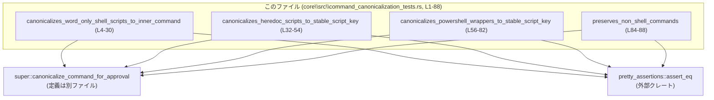
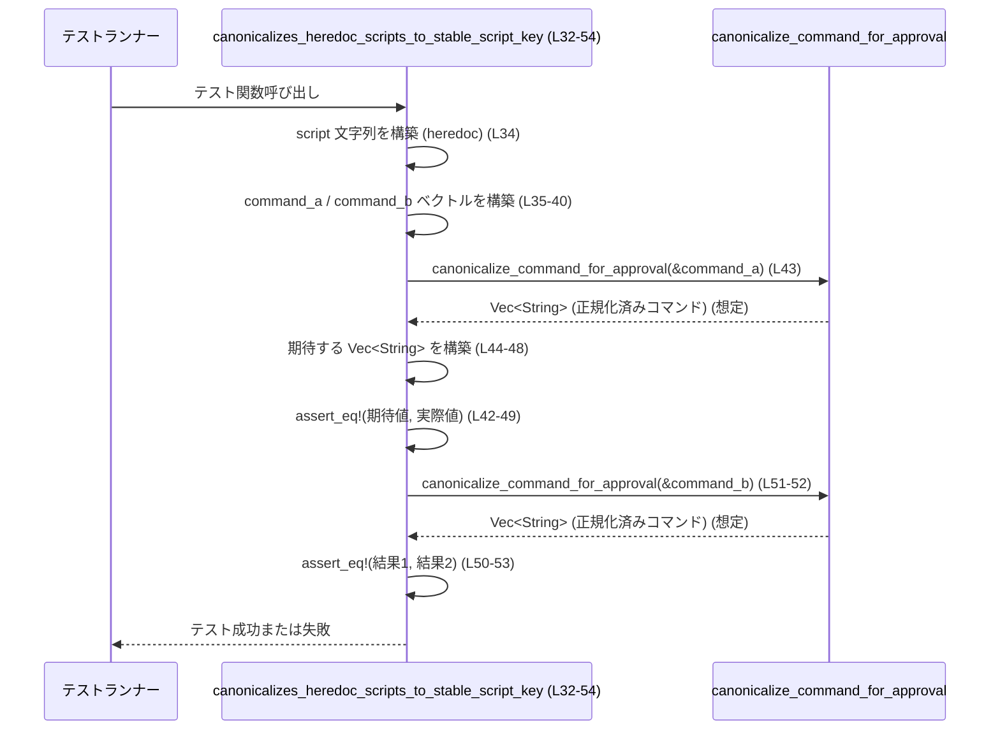

# core\src\command_canonicalization_tests.rs コード解説

## 0. ざっくり一言

`super::canonicalize_command_for_approval` 関数の挙動を検証する **ユニットテスト集**です。  
シェル／PowerShell でラップされたコマンドや通常のコマンドが、どのように「正規化」されるべきかをテストで定義しています。

---

## 1. このモジュールの役割

### 1.1 概要

- このモジュールは、コマンド列（`Vec<String>`）を正規化する関数 `canonicalize_command_for_approval` の **期待される仕様**をテストを通して定義しています。
- 主に次の 4 パターンを扱います（根拠: `#[test]` 関数群  
  `core\src\command_canonicalization_tests.rs:L4-30,32-54,56-82,84-88`）:
  - bash/zsh などのシェルラッパー
  - ヒアドキュメント（heredoc）形式のシェルスクリプト
  - PowerShell ラッパー
  - そもそもシェルでラップされていない通常のコマンド

### 1.2 アーキテクチャ内での位置づけ

- このファイル自体は **テスト用モジュール**であり、プロダクションコードは `super` モジュール側にあります。
- 依存関係は以下の通りです（根拠: `use super::...`, `use pretty_assertions::assert_eq;`  
  `core\src\command_canonicalization_tests.rs:L1-2`）。



### 1.3 設計上のポイント（テストから読み取れる範囲）

- 関数は **不変参照**でコマンド列を受け取ります（`&command_a` など  
  `core\src\command_canonicalization_tests.rs:L17-18,27-28,43,51-52,72,79,87`）。
  - そのため、入力ベクトルが関数内で変更されることはありません（Rust の型システム上）。
- 返り値は `Vec<String>` と等価なものと比較されています（`assert_eq!(..., vec![...])` や `assert_eq!(..., command)`  
  `core\src\command_canonicalization_tests.rs:L17-25,26-29,42-49,50-53,71-77,78-81,86-87`）。
  - テストから、「**元のコマンド列と同じ型の新しいベクトル**を返す関数」と考えられます。
- エラーハンドリング:
  - `Result` や `Option` を返していないため、関数レベルのエラーは **型としては表現されていません**。
  - このファイルから、関数内部でパニックを起こす条件があるかどうかは分かりません。
- 並行性:
  - テストはすべて単純な `#[test]` 関数であり、スレッドや `async` を使っていません。
  - `canonicalize_command_for_approval` のスレッド安全性（`Send`/`Sync` 等）は、このチャンクからは不明です。

---

## 2. 主要な機能一覧（コンポーネントインベントリー）

このファイルで定義・利用されている主な関数を一覧にします。

### 2.1 関数一覧

| 名前 | 種別 | 公開範囲 | 役割 / 用途 | 定義/使用位置 |
|------|------|----------|-------------|----------------|
| `canonicalizes_word_only_shell_scripts_to_inner_command` | 関数（テスト） | テスト専用 (`#[test]`) | bash ラッパー経由の単純なコマンドが、内部コマンド列に正規化されることを検証 | `core\src\command_canonicalization_tests.rs:L4-30` |
| `canonicalizes_heredoc_scripts_to_stable_script_key` | 関数（テスト） | テスト専用 | heredoc 形式のシェルスクリプトが、固定キー `__codex_shell_script__` を含む形に正規化されることを検証 | `core\src\command_canonicalization_tests.rs:L32-54` |
| `canonicalizes_powershell_wrappers_to_stable_script_key` | 関数（テスト） | テスト専用 | PowerShell ラッパーが、固定キー `__codex_powershell_script__` を含む形に正規化されることを検証 | `core\src\command_canonicalization_tests.rs:L56-82` |
| `preserves_non_shell_commands` | 関数（テスト） | テスト専用 | シェルラッパーでない通常のコマンドが、そのまま保持されることを検証 | `core\src\command_canonicalization_tests.rs:L84-88` |
| `canonicalize_command_for_approval` | 関数（外部定義） | 不明（`super` モジュールからインポート） | コマンド列を「承認用」（approval 用）に正規化する本体ロジック。テストから仕様が定義されている | 使用箇所: `core\src\command_canonicalization_tests.rs:L1,17-18,27-28,43,51-52,72,79,87` |

> `canonicalize_command_for_approval` の**定義場所や完全なシグネチャ**はこのファイルには存在せず、このチャンクからは分かりません。

---

## 3. 公開 API と詳細解説

### 3.1 型一覧（構造体・列挙体など）

このファイル内で **新しく定義されている型はありません**。  
使用している主な型は標準ライブラリの `Vec<String>` です（例: コマンド列 `vec![ "...".to_string(), ... ]`  
`core\src\command_canonicalization_tests.rs:L6-15,35-40,59-66,86`）。

### 3.2 重要関数の詳細: `canonicalize_command_for_approval`

テスト対象であるため、この関数の仕様をテストコードから読み取れる範囲で整理します。

#### `canonicalize_command_for_approval(args: &[String]) -> Vec<String>`（推測、定義は別ファイル）

> ここでのシグネチャは、テストでの使われ方から推測したものです。  
> 実際には `&[String]` ではなく `&Vec<String>` などである可能性があります（根拠: `&command_a` という呼び出し `core\src\command_canonicalization_tests.rs:L17-18,27,43,51,72,79,87`）。

**概要**

- シェルや PowerShell でラップされたコマンド列を、**比較や承認に適した安定した形式**に変換する純粋関数です。
- 具体的には以下を行うと考えられます（いずれもテストが保証する振る舞いです）:
  - bash/zsh の `-lc "コマンド"` 形式から、内部のコマンド単語列のみを取り出す。
  - heredoc を含むシェルスクリプトや PowerShell スクリプトを、固定キー＋スクリプト本文などの安定した形に変換する。
  - シェルラッパーでない通常のコマンドはそのまま返す。

**引数**

| 引数名 | 型 | 説明 |
|--------|----|------|
| `args` | `&[String]`（推測） | 実行予定のコマンドと引数を表す文字列ベクトルへの不変参照。例えば `["/bin/bash", "-lc", "cargo test -p codex-core"]` のような形（根拠: `core\src\command_canonicalization_tests.rs:L6-9,11-14,35-40,59-63,65-68,86`）。 |

**戻り値**

- 型: `Vec<String>` と等価なものと推測されます。
  - テストでは `vec![...]` や `command`（`Vec<String>`）との `assert_eq!` で比較されています（`core\src\command_canonicalization_tests.rs:L17-25,26-29,42-49,50-53,71-77,78-81,86-87`）。
- 意味:
  - 入力コマンド列を「承認用に正規化した」新しいベクトルです。
  - 正規化により、**同じ意味のコマンドが同じベクトル**になることが期待されています（例: `/bin/bash ...` と `bash ...` が同じ結果になる）。

**内部処理の流れ（テストから読み取れる仕様）**

※実際の実装はこのファイルには存在しないため、「こう振る舞うことがテストで要求されている」という形で記述します。

1. **通常のシェルラッパー（bash/zsh）の検出**  
   - 入力が `["/bin/bash" または "bash", "-lc", "<コマンド文字列>"]` 形式の場合（根拠: `core\src\command_canonicalization_tests.rs:L6-9,11-14`）:
     - 3番目の要素（コマンド文字列）を **空白でトークン分割**し、`["cargo", "test", "-p", "codex-core"]` のように単語列を返します（根拠: 期待値 `core\src\command_canonicalization_tests.rs:L19-24`）。
     - 連続した空白や `/bin/bash` vs `bash` の違いを吸収し、同じ結果を返す必要があります（`canonicalizes_word_only_shell_scripts_to_inner_command` テストの 2 つ目の `assert_eq!`  
       `core\src\command_canonicalization_tests.rs:L26-29`）。

2. **heredoc 形式シェルスクリプトの検出と正規化**  
   - 入力が `["/bin/zsh" または "zsh", "-lc", "<heredoc スクリプト>"]` 形式で、スクリプトが `python3 <<'PY'\n...\nPY` のような heredoc を含む場合（根拠: `core\src\command_canonicalization_tests.rs:L34-40`）:
     - 戻り値は `["__codex_shell_script__", "-lc", "<heredoc スクリプト>"]` という形になります（根拠: 期待値 `core\src\command_canonicalization_tests.rs:L42-49`）。
     - `/bin/zsh` と `zsh` の違いは無視され、同じ結果を返します（`core\src\command_canonicalization_tests.rs:L50-53`）。

3. **PowerShell ラッパーの検出と正規化**  
   - 入力が PowerShell ラッパーである場合（根拠: `core\src\command_canonicalization_tests.rs:L58-63,65-68`）:
     - 例: `["powershell.exe", "-NoProfile", "-Command", "Write-Host hi"]`  
       または `["powershell", "-Command", "Write-Host hi"]`
     - 戻り値は `["__codex_powershell_script__", "Write-Host hi"]` という形になります（根拠: 期待値 `core\src\command_canonicalization_tests.rs:L71-77`）。
     - `.exe` の有無や `-NoProfile` の有無を吸収して、コマンド内容のみを表す安定した形にすることが求められています（`core\src\command_canonicalization_tests.rs:L78-81`）。

4. **非シェルコマンドの保持**  
   - 入力が `["cargo", "fmt"]` のような通常のコマンドで、シェルラッパーではない場合（根拠: `core\src\command_canonicalization_tests.rs:L86`）:
     - 戻り値は **入力と完全に同じベクトル**です（`assert_eq!(..., command)`  
       `core\src\command_canonicalization_tests.rs:L86-87`）。
     - つまり、認識できるラッパーでないものは「そのまま通す」という挙動がテストで保証されています。

**Examples（使用例）**

この例は、テストではなく通常のコードから `canonicalize_command_for_approval` を利用するイメージです。  
実際のインポートパス（`use ...;`）は、このチャンクからは分からないため省略します。

```rust
// bash の -lc 経由で実行されるコマンドを用意する
let raw_command = vec![
    "/bin/bash".to_string(),              // シェル（フルパス指定）
    "-lc".to_string(),                    // ログインシェル + コマンド指定
    "cargo   test   -p  codex-core".into(), // 空白が不規則なコマンド文字列
];

// 正規化を実行する（このシグネチャはテストからの推測）
let canonical = canonicalize_command_for_approval(&raw_command);

// 期待: 内部コマンドのみを単語ごとに分割した形になる
assert_eq!(
    canonical,
    vec![
        "cargo".to_string(),
        "test".to_string(),
        "-p".to_string(),
        "codex-core".to_string(),
    ]
);
```

```rust
// PowerShell ラッパーのコマンド
let ps_command = vec![
    "powershell.exe".to_string(),
    "-NoProfile".to_string(),
    "-Command".to_string(),
    "Write-Host hi".to_string(),
];

// 正規化すると、ランタイム環境に依存しないキー＋スクリプト内容になるとテストでは期待されている
let canonical = canonicalize_command_for_approval(&ps_command);

assert_eq!(
    canonical,
    vec![
        "__codex_powershell_script__".to_string(),
        "Write-Host hi".to_string(),
    ]
);
```

**Errors / Panics**

- この関数は（テストから見る限り）`Result` や `Option` を返していません。
- テストコードにも `unwrap` などは存在しません（`core\src\command_canonicalization_tests.rs` 全体）。
- よって、エラーがあれば **パニックとして表現**されている可能性がありますが、
  - どのような入力でパニックになるか
  - そもそも内部でパニックを起こしうるか
  は、**このチャンクからは分かりません**。

**Edge cases（エッジケース）**

テストから分かる範囲と、分からない範囲を分けて記載します。

- 分かること:
  - `/bin/bash` と `bash`、`/bin/zsh` と `zsh` の違いは正規化で吸収されます（`core\src\command_canonicalization_tests.rs:L6,11,35,40`）。
  - PowerShell では `.exe` の有無や `-NoProfile` の有無も吸収されます（`core\src\command_canonicalization_tests.rs:L59-63,65-68,71-77`）。
  - コマンド文字列内の **複数スペース**は、単語単位に分割されるため、結果として同じベクトルになります（`"cargo test -p codex-core"` vs `"cargo   test   -p codex-core"` の比較  
    `core\src\command_canonicalization_tests.rs:L8-9,13-14,17-25,26-29`）。
  - シェルラッパーでないコマンドは変更されません（`core\src\command_canonicalization_tests.rs:L86-87`）。
- 分からないこと（テストがないため挙動不明）:
  - 空のコマンド（`args.len() == 0`）を渡した場合の挙動。
  - `args` が 1 要素だけ、あるいは 2 要素だけの場合の挙動。
  - bash/zsh/PowerShell 以外のシェル（例: `sh`, `cmd.exe` など）に対する扱い。
  - heredoc 以外の複雑なシェル構文の扱い。

**使用上の注意点**

- 引数は **不変参照**で渡されるため、呼び出し側で保持している `Vec<String>` は関数によって変更されません（呼び出し箇所はすべて `&command` 形式 `core\src\command_canonicalization_tests.rs:L17-18,27,43,51,72,79,87`）。
- 関数は新しい `Vec<String>` を返すため、大量のコマンド列に対して頻繁に呼ぶと、その分のメモリ確保・コピーコストが発生する可能性があります（実装詳細は不明ですが、テストから返り値が新しいベクトルであることは分かります）。
- ここでの正規化は「承認用」（おそらくスナップショット比較や approval testing 用）であり、**セキュリティ対策（コマンドインジェクション防止など）を目的としたものかどうかは、このチャンクからは判断できません**。
- スレッド安全性や `Send`/`Sync` 実装の有無は、このファイルからは分かりません。並列に使用する場合は、実際の実装側の制約を確認する必要があります。

### 3.3 その他の関数（テスト）

テスト関数はすべて **テストフレームワークから直接呼ばれるエントリポイント**です。  
それぞれの役割を短くまとめます。

| 関数名 | 役割（1 行） | 定義位置 |
|--------|--------------|----------|
| `canonicalizes_word_only_shell_scripts_to_inner_command` | bash シェルラッパー経由の単純なコマンドが、内部コマンドの単語列に正規化されることを検証する | `core\src\command_canonicalization_tests.rs:L4-30` |
| `canonicalizes_heredoc_scripts_to_stable_script_key` | heredoc 形式シェルスクリプトが、固定キー `__codex_shell_script__` を含む安定した形式に正規化されることを検証する | `core\src\command_canonicalization_tests.rs:L32-54` |
| `canonicalizes_powershell_wrappers_to_stable_script_key` | PowerShell ラッパーが固定キー `__codex_powershell_script__` ＋スクリプト本文に正規化されることを検証する | `core\src\command_canonicalization_tests.rs:L56-82` |
| `preserves_non_shell_commands` | シェルラッパーでない通常のコマンドが、変更されずに返されることを検証する | `core\src\command_canonicalization_tests.rs:L84-88` |

---

## 4. データフロー

ここでは、代表的なテストシナリオとして **heredoc スクリプト**の場合のデータフローを示します。

### 4.1 heredoc スクリプトの正規化フロー

テスト `canonicalizes_heredoc_scripts_to_stable_script_key` の処理の流れです（`core\src\command_canonicalization_tests.rs:L32-54`）。



要点:

- テスト関数内で heredoc 形式のスクリプト文字列 `script` を定義し、その文字列を含む `command_a` と `command_b` を構築します（`core\src\command_canonicalization_tests.rs:L34-40`）。
- `canonicalize_command_for_approval` に `&command_a` を渡し、その戻り値が `["__codex_shell_script__", "-lc", script]` になることを検証します（`core\src\command_canonicalization_tests.rs:L42-49`）。
- 同じ `script` を使った `command_b` に対しても関数を呼び、`command_a` の結果と等しいことを検証します（`core\src\command_canonicalization_tests.rs:L50-53`）。
- これにより、「シェルバイナリのパスが違っても、スクリプト内容が同じなら正規化結果は同じ」という仕様が定義されています。

---

## 5. 使い方（How to Use）

### 5.1 基本的な使用方法

このファイルはテストですが、`canonicalize_command_for_approval` を実際に利用する場合の基本的な流れは次のようになります。

```rust
// コマンド列を Vec<String> で組み立てる
let raw_command = vec![
    "/bin/zsh".to_string(),          // シェル
    "-lc".to_string(),               // 1つの文字列としてスクリプトを受け取る
    "python3 <<'PY'\nprint('hi')\nPY".to_string(), // heredoc スクリプト
];

// 正規化関数を呼び出す（関数が現在のスコープにあると仮定）
let canonical = canonicalize_command_for_approval(&raw_command);

// 正規化結果を利用する（例: キーとして使う）
println!("{:?}", canonical); // ["__codex_shell_script__", "-lc", "python3 <<'PY'..."]
```

この例は、テスト `canonicalizes_heredoc_scripts_to_stable_script_key` の内容（`core\src\command_canonicalization_tests.rs:L32-54`）に基づいています。

### 5.2 よくある使用パターン

テストから推測できる代表的な使用パターンは次の 3 つです。

1. **bash / zsh のラッパーから内部コマンドの抽出**

```rust
let cmd = vec![
    "bash".to_string(),
    "-lc".to_string(),
    "cargo   test   -p  codex-core".to_string(),
];

let canonical = canonicalize_command_for_approval(&cmd);

// 期待される形: ["cargo", "test", "-p", "codex-core"]
```

1. **heredoc スクリプトの安定キー化**

```rust
let script = "python3 <<'PY'\nprint('hello')\nPY".to_string();
let cmd = vec!["zsh".to_string(), "-lc".to_string(), script.clone()];

let canonical = canonicalize_command_for_approval(&cmd);

// 期待される形: ["__codex_shell_script__", "-lc", script]
```

1. **PowerShell スクリプトの安定キー化**

```rust
let cmd = vec![
    "powershell.exe".to_string(),
    "-NoProfile".to_string(),
    "-Command".to_string(),
    "Write-Host hi".to_string(),
];

let canonical = canonicalize_command_for_approval(&cmd);

// 期待される形: ["__codex_powershell_script__", "Write-Host hi"]
```

### 5.3 よくある間違い（推測されるもの）

このファイルには誤用例は書かれていませんが、テストから想定される注意点を挙げます。

```rust
// （誤用の可能性）: シェルラッパー部分だけを省いて渡す
let cmd = vec!["cargo test -p codex-core".to_string()]; // 一要素だけ

// こうした入力に対する挙動は、このチャンクのテストでは定義されていない。
// 正規化が期待通りに動かない可能性がある。
let canonical = canonicalize_command_for_approval(&cmd);
```

```rust
// より明示的な形: シェルラッパー込みで渡す
let cmd = vec![
    "bash".to_string(),
    "-lc".to_string(),
    "cargo test -p codex-core".to_string(),
];

let canonical = canonicalize_command_for_approval(&cmd);
// テストで保証されているパターンなので、期待した正規化が行われる。
```

### 5.4 使用上の注意点（まとめ）

- **前提条件**:
  - このファイルから読み取れる仕様は、主に bash/zsh/PowerShell ラッパーとシンプルな通常コマンドに対するものです。
  - それ以外の形式（要素数が少ない・未知のシェルなど）に対する挙動は不明です。
- **エラー / パニック**:
  - 戻り値の型からはエラーを表現しない API と考えられるため、型レベルのエラー処理はできません。
  - 異常入力時にパニックを起こすかどうかは、このファイルからは判断できません。
- **並行性**:
  - 引数が不変参照であるため、同じ `Vec<String>` を複数スレッドから同時に & 参照しても、少なくとも **呼び出し側から見えるデータ競合は起こらない**構造です（Rust の借用規則上）。
  - ただし、関数内部でグローバル状態を触っているかどうかは、実装コードがないため不明です。
- **パフォーマンス**:
  - 返り値が `Vec<String>` である以上、少なくとも **1 回はベクトルを確保し、文字列を複製する処理**があると考えられます。
  - 大量のコマンド列を高頻度に正規化する場合は、ベンチマークなどで性能を確認する必要があります（このファイルには性能テストはありません）。

---

## 6. 変更の仕方（How to Modify）

このファイルはテスト専用のため、「変更の仕方」は主にテストケース追加・修正の観点になります。

### 6.1 新しい機能を追加する場合（テスト側）

- 新しい正規化ルールを `canonicalize_command_for_approval` に追加した場合:
  1. そのルールに対応する **テスト関数を 1 つ追加**する。
  2. 既存のテストと同様に、入力となる `Vec<String>` と期待される出力 `Vec<String>` を定義する。
  3. `assert_eq!(canonicalize_command_for_approval(&input), expected);` 形式で検証する。
- 追加するテスト関数は、このファイル内の他のテストと同じパターンで配置すると分かりやすくなります（例: `canonicalizes_...` の命名規則）。

### 6.2 既存の機能を変更する場合（テスト側）

- `canonicalize_command_for_approval` の挙動を変更する場合は、以下に注意する必要があります。
  - **影響範囲の確認**:
    - どのテストがどのパターンを検証しているかを確認する（例: bash ラッパー → `canonicalizes_word_only_shell_scripts_to_inner_command`  
      `core\src\command_canonicalization_tests.rs:L4-30`）。
  - **契約（前提条件・返り値の意味）**:
    - 例えば「非シェルコマンドはそのまま返す」という契約（`core\src\command_canonicalization_tests.rs:L84-88`）を変更する場合、関連する全テストと呼び出し側コードへの影響を確認する必要があります。
  - **テストの更新**:
    - 仕様変更に伴い、期待値のベクトルやテストの有無を見直す必要があります。

---

## 7. 関連ファイル

このチャンクから直接参照できる関連ファイル・モジュールは次の通りです。

| パス / モジュール | 役割 / 関係 |
|------------------|------------|
| `super::canonicalize_command_for_approval` | 本ファイルのすべてのテストで対象となっている正規化関数。具体的なファイルパスや実装はこのチャンクには現れませんが、承認用コマンド正規化のコアロジックを提供していると考えられます（根拠: インポートと使用箇所 `core\src\command_canonicalization_tests.rs:L1,17-18,27-28,43,51-52,72,79,87`）。 |
| `pretty_assertions::assert_eq` | テストにおいて、期待値と実際の値の比較に使用されているマクロです。標準の `assert_eq!` に比べて差分表示が見やすいことが多い外部クレートですが、詳細はこのチャンクからは分かりません（根拠: `core\src\command_canonicalization_tests.rs:L2,17,26,42,50,71,78,87`）。 |

その他の関連ファイル（例えば `canonicalize_command_for_approval` の実装ファイル）は、このチャンクには明示されておらず、正確なパスやモジュール名は不明です。
