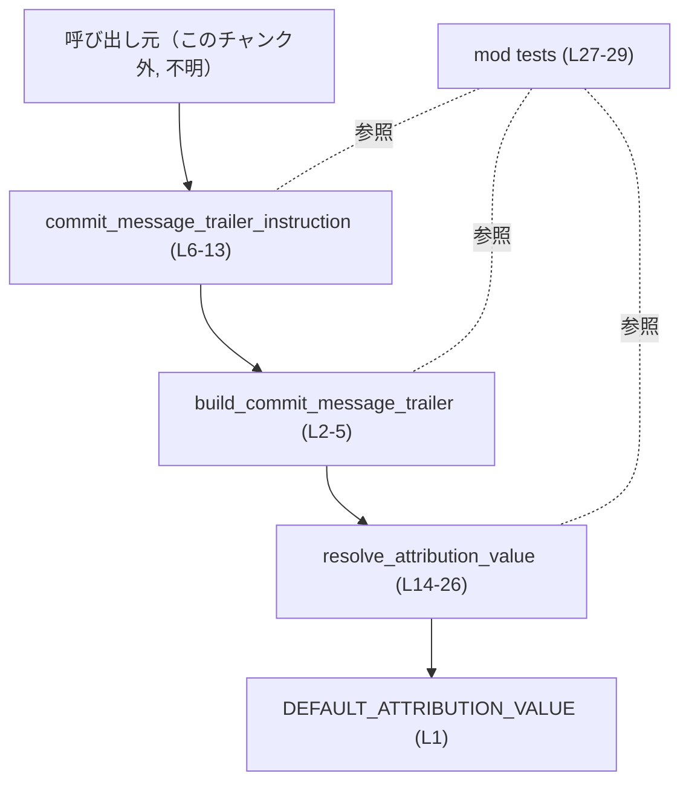
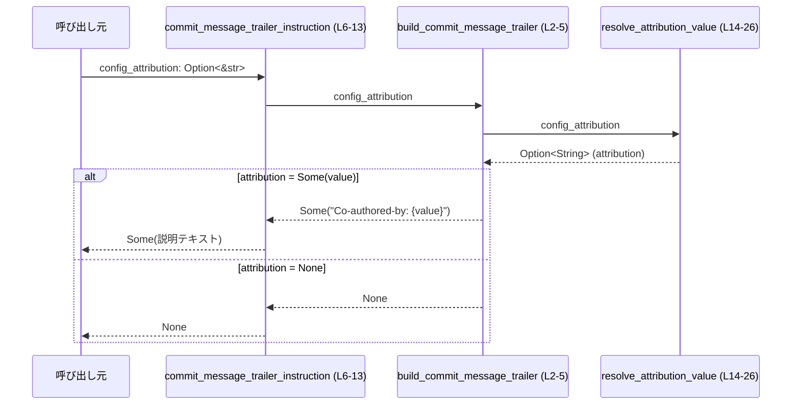

# core/src/commit_attribution.rs コード解説

## 0. ざっくり一言

Git のコミットメッセージに付ける「Co-authored-by: …」トレーラー文字列と、そのトレーラーをどう付けるかを説明する英語の指示文を生成するモジュールです（`core/src/commit_attribution.rs:L1-L26`）。

---

## 1. このモジュールの役割

### 1.1 概要

- 設定由来の「著者表記（attribution）」文字列から、`Co-authored-by: ...` 形式のトレーラーを組み立てます（`build_commit_message_trailer`。`core/src/commit_attribution.rs:L2-L5`）。
- 空文字列や空白のみの設定の場合は、トレーラー自体を無効化します（`resolve_attribution_value`。`core/src/commit_attribution.rs:L14-L23`）。
- 有効なトレーラーがある場合、そのトレーラーをコミットメッセージ末尾に 1 回だけ付けるように案内する英語の説明文を生成します（`commit_message_trailer_instruction`。`core/src/commit_attribution.rs:L6-L13`）。
- 設定が存在しない場合は、デフォルトの著者表記 `Codex <noreply@openai.com>` を用います（`DEFAULT_ATTRIBUTION_VALUE`。`core/src/commit_attribution.rs:L1`）。

### 1.2 アーキテクチャ内での位置づけ

このファイル内の依存関係は次のようになっています。

- 外部（このチャンク外）の呼び出し元が `commit_message_trailer_instruction` を呼び出す（`core/src/commit_attribution.rs:L6-L13`）。
- `commit_message_trailer_instruction` は内部で `build_commit_message_trailer` を呼び出す（`core/src/commit_attribution.rs:L9-L11`）。
- `build_commit_message_trailer` は内部で `resolve_attribution_value` を呼び出す（`core/src/commit_attribution.rs:L3-L4`）。
- `resolve_attribution_value` は `DEFAULT_ATTRIBUTION_VALUE` を参照する（`core/src/commit_attribution.rs:L24-L25`）。

他モジュールからの具体的な呼び出し関係は、このチャンクには現れていません。



### 1.3 設計上のポイント

- **純粋関数的な構造**  
  - 3 つの関数はいずれも入力引数と定数から結果の `String` を生成するだけで、副作用（I/O やグローバル状態の変更）はありません（`core/src/commit_attribution.rs:L2-L26`）。
- **`Option` による有効/無効の表現**  
  - `Option<String>` を使い、トレーラーや指示文が「存在する/しない」を表現しています（`core/src/commit_attribution.rs:L2-L5`, `L6-L13`, `L14-L26`）。
- **設定値のトリミングとバリデーション**  
  - ユーザ設定の attribution 文字列は `trim` で前後空白を除去し、空文字列（空白のみを含む場合を含む）のときは無効扱いにします（`core/src/commit_attribution.rs:L17-L23`）。
- **デフォルト値の明示**  
  - 設定が `None` のときだけ、固定のデフォルト値 `Codex <noreply@openai.com>` を用いるというはっきりしたルールになっています（`core/src/commit_attribution.rs:L24-L25`）。
- **エラーハンドリング方針**  
  - エラー型は用いず、`Option` で「生成しない」という分岐を表現しています。パニックや `Result` は使用していません。
- **安全性・並行性**  
  - `unsafe` ブロックや可変なグローバル状態はなく、すべての関数はスレッドセーフな純粋計算です（`core/src/commit_attribution.rs:L1-L26`）。

---

## 2. 主要な機能一覧

- 著者表記の決定: 設定値とデフォルトから、最終的に使う著者表記文字列（または無効）を決める（`resolve_attribution_value`。`core/src/commit_attribution.rs:L14-L26`）。
- Co-authored-by トレーラーの生成: 決定された著者表記から `Co-authored-by: NAME <email>` 形式の 1 行トレーラーを生成する（`build_commit_message_trailer`。`core/src/commit_attribution.rs:L2-L5`）。
- コミットメッセージ編集の指示文の生成: 上記トレーラーをどのようにコミットメッセージに付与すべきかを説明する英語の multi-line 文字列を生成する（`commit_message_trailer_instruction`。`core/src/commit_attribution.rs:L6-L13`）。

---

## 3. 公開 API と詳細解説

### 3.1 コンポーネント一覧

このファイルに定義されている主なコンポーネントの一覧です。

| 名前 | 種別 | 公開範囲 | 役割 / 用途 | 定義位置 |
|------|------|----------|-------------|----------|
| `DEFAULT_ATTRIBUTION_VALUE` | 定数 | モジュール内（`pub` ではない） | 設定がない場合に使用されるデフォルトの著者表記 | `core/src/commit_attribution.rs:L1` |
| `build_commit_message_trailer` | 関数 | モジュール内（非公開） | 著者表記から `Co-authored-by: ...` 形式のトレーラー 1 行を生成する | `core/src/commit_attribution.rs:L2-L5` |
| `commit_message_trailer_instruction` | 関数 | `pub(crate)`（クレート内に公開） | コミットメッセージの編集時に、このトレーラーをどう扱うかを説明する英文指示を生成する | `core/src/commit_attribution.rs:L6-L13` |
| `resolve_attribution_value` | 関数 | モジュール内（非公開） | 設定値とデフォルトから、実際に使用する著者表記（または無効）を決める | `core/src/commit_attribution.rs:L14-L26` |
| `tests` | モジュール | `cfg(test)` 時のみ | このファイルの単体テスト群（中身はこのチャンクには現れない） | `core/src/commit_attribution.rs:L27-L29` |

> このファイルには構造体や列挙体などの新しい型定義はありません。

### 3.2 関数詳細（3 件）

#### `commit_message_trailer_instruction(config_attribution: Option<&str>) -> Option<String>`

**概要**

- コミットメッセージに付けるべき `Co-authored-by: ...` トレーラーを埋め込んだ説明文を生成します（`core/src/commit_attribution.rs:L6-L13`）。
- 内部で `build_commit_message_trailer` を呼び出し、トレーラーが生成できない場合は `None` を返します（`core/src/commit_attribution.rs:L9-L11`）。

**引数**

| 引数名 | 型 | 説明 |
|--------|----|------|
| `config_attribution` | `Option<&str>` | 設定から読み出した著者表記。`None` の場合はデフォルト値を使い、`Some` の場合は内容を `trim` 済みで利用または無効化判定に使う（判定ロジックは `resolve_attribution_value` 参照）。 |

**戻り値**

- `Option<String>`  
  - `Some(String)`: 英文の説明文。内部にトレーラー 1 行（例: `Co-authored-by: Codex <noreply@openai.com>`）が埋め込まれています（`core/src/commit_attribution.rs:L10-L13`）。
  - `None`: トレーラーを使わないべき場合（設定が空や空白のみだった場合）で、説明文も生成されません（`build_commit_message_trailer` から `None` が伝播。`core/src/commit_attribution.rs:L9-L11`）。

**内部処理の流れ**

1. `build_commit_message_trailer(config_attribution)` を呼び出して、トレーラー文字列を生成しようとします（`core/src/commit_attribution.rs:L9`）。
2. `?` 演算子により、トレーラー生成が `None` の場合は、そのまま `None` を返して終了します（`core/src/commit_attribution.rs:L9-L11`）。
3. トレーラーが `Some(trailer)` の場合、`format!` マクロで英語の説明テキストを組み立てます（`core/src/commit_attribution.rs:L10-L13`）。
   - テキスト中に `{trailer}` が埋め込まれます。
   - 説明文には「末尾に一度だけこのトレーラーを付けること」「既存のトレーラーは残すこと」「トレーラーブロックの前に空行を 1 行置くこと」などのルールが列挙されます（文字列リテラルの中身そのもの。`core/src/commit_attribution.rs:L10-L13`）。
4. 最終的に `Some(説明テキスト)` を返します。

**Examples（使用例）**

同じモジュール内、または適切な `use` を行った状況を想定した例です。

```rust
// 設定から読み出した attribution（例: ユーザーが設定した名前とメールアドレス）
let config_attribution: Option<&str> = Some("Alice Example <alice@example.com>"); // 有効な著者表記

// 説明文を生成する
let instruction = commit_message_trailer_instruction(config_attribution); // Option<String> が返る

if let Some(text) = instruction {
    // 呼び出し元でこのテキストを表示したり、エディタに提示したりできる
    println!("{text}");
} else {
    // attribution が空や空白のみだった場合など、トレーラーを使わないケース
    // この場合は特に何もしないという判断が考えられる（呼び出し側の設計次第）
}
```

- `config_attribution` が `None` ならデフォルトの `Codex <noreply@openai.com>` を使ったトレーラーが埋め込まれた説明文が返ります（`core/src/commit_attribution.rs:L1`, `L24-L25`）。

**Errors / Panics**

- パニックを起こすコードは含まれていません（`unsafe`、`unwrap` など無し。`core/src/commit_attribution.rs:L6-L13`）。
- エラーは `Option::None` で表現されており、失敗を表す専用のエラー型はありません。

**Edge cases（エッジケース）**

- `config_attribution = None`  
  - `resolve_attribution_value` がデフォルト値を返し（`core/src/commit_attribution.rs:L24-L25`）、トレーラーおよび説明文が `Some` で返ります。
- `config_attribution = Some("")`（空文字）  
  - `trim()` 後も空のため、`resolve_attribution_value` が `None` を返します（`core/src/commit_attribution.rs:L17-L22`）。
  - その結果、`build_commit_message_trailer` も `None`、本関数も `None` を返します。
- `config_attribution = Some("   ")`（空白のみ）  
  - 同じく `trim()` で空文字になり、`None` が返ります（`core/src/commit_attribution.rs:L17-L22`）。
- 非 ASCII 文字を含む名前やメールアドレス  
  - 本関数内では単なる文字列として扱うだけで、特別な検証やエンコード処理はありません。`format!` でそのまま埋め込まれます（`core/src/commit_attribution.rs:L10-L13`）。

**使用上の注意点**

- 戻り値が `Option` であるため、`None` の場合の扱いを呼び出し側で必ず決める必要があります。
- `config_attribution = None` と `Some("")` では動作が異なります。
  - `None`: デフォルト値を用いた説明文が返る。
  - `Some("")`（または空白のみ）: 説明文自体が生成されない (`None`)。
- 説明テキストには複数行の英語文が含まれ、改行コード `\n` が埋め込まれています。これを UI やログに表示する際の改行処理に注意が必要です。
- 関数は純粋関数であり、スレッド間で安全に共有して使うことができます（外部状態に依存しないため）。

---

#### `build_commit_message_trailer(config_attribution: Option<&str>) -> Option<String>`

**概要**

- 実際に使用する著者表記を決定し、それを `Co-authored-by: {value}` 形式の 1 行のトレーラー文字列に変換します（`core/src/commit_attribution.rs:L2-L5`）。
- 著者表記が無効と判断された場合（空文字列など）、`None` を返します。

**引数**

| 引数名 | 型 | 説明 |
|--------|----|------|
| `config_attribution` | `Option<&str>` | 設定から読み出した著者表記。`resolve_attribution_value` にそのまま渡されます。 |

**戻り値**

- `Option<String>`  
  - `Some(String)`: `Co-authored-by: NAME <email>` という 1 行の文字列（`core/src/commit_attribution.rs:L4-L5`）。
  - `None`: 著者表記が空や空白のみであり、トレーラーを生成しないべき場合（`resolve_attribution_value` が `None` を返した場合。`core/src/commit_attribution.rs:L3-L4`）。

**内部処理の流れ**

1. `resolve_attribution_value(config_attribution)` を呼び出し、使うべき著者表記（`Option<String>`）を取得します（`core/src/commit_attribution.rs:L3`）。
2. `?` 演算子により、`resolve_attribution_value` が `None` を返した場合には、即座に `None` を返します（`core/src/commit_attribution.rs:L3`）。
3. 著者表記が `Some(value)` の場合は、`format!("Co-authored-by: {value}")` でトレーラー 1 行を生成し、`Some(...)` で返します（`core/src/commit_attribution.rs:L4-L5`）。

**Examples（使用例）**

```rust
// 有効な attribution を直接指定する
let trailer = build_commit_message_trailer(Some("Alice Example <alice@example.com>"));

assert_eq!(
    trailer.as_deref(),                           // Option<&str> に変換して比較
    Some("Co-authored-by: Alice Example <alice@example.com>")
);

// 空文字列を渡すと None が返る
let none_trailer = build_commit_message_trailer(Some("   ")); // 空白のみ
assert!(none_trailer.is_none());                              // resolve_attribution_value が None を返すため
```

**Errors / Panics**

- パニックを起こす可能性のあるコードは含まれていません（`core/src/commit_attribution.rs:L2-L5`）。
- エラーは `Option::None` で表現されます。

**Edge cases（エッジケース）**

- `config_attribution = None`  
  - デフォルト値 `DEFAULT_ATTRIBUTION_VALUE` が使われ、トレーラーが `Some("Co-authored-by: Codex <noreply@openai.com>")` になります（`core/src/commit_attribution.rs:L1`, `L24-L25`, `L4-L5`）。
- `config_attribution = Some("")` または `Some("   ")`  
  - `resolve_attribution_value` が `None` を返すため、本関数も `None` を返します（`core/src/commit_attribution.rs:L17-L22`, `L3-L4`）。
- 非常に長い著者表記  
  - そのまま 1 行の文字列として連結され、特別な制限や分割処理は行っていません。

**使用上の注意点**

- この関数は公開されていないため、通常は `commit_message_trailer_instruction` を通じて使われます。
- 戻り値 `None` は「トレーラーを付与しない」というシグナルなので、呼び出し側が直接使う場合にはその意味付けを明確にする必要があります。
- 著者表記の形式（「名前 <メールアドレス>」など）の妥当性は検証していません。必要なら呼び出し元で別途チェックする必要があります。

---

#### `resolve_attribution_value(config_attribution: Option<&str>) -> Option<String>`

**概要**

- ユーザ設定由来の attribution とデフォルト値 `DEFAULT_ATTRIBUTION_VALUE` をもとに、最終的に使用する著者表記（あるいは「使用しない」という判断）を決定する関数です（`core/src/commit_attribution.rs:L14-L26`）。
- `None` のときだけデフォルト値を使い、`Some` の場合は前後空白を削除した上で空であれば無効（`None`）とします。

**引数**

| 引数名 | 型 | 説明 |
|--------|----|------|
| `config_attribution` | `Option<&str>` | 設定値。`None` ならデフォルト値を使い、`Some` ならトリミングして空かどうかを判定します。 |

**戻り値**

- `Option<String>`  
  - `Some(String)`: 実際に使用する著者表記。
    - `config_attribution = None` の場合: デフォルト値 `DEFAULT_ATTRIBUTION_VALUE`（`core/src/commit_attribution.rs:L24-L25`）。
    - `config_attribution = Some(s)` の場合: `s.trim()` の結果が空でないとき、その値。
  - `None`: `config_attribution = Some(s)` かつ `s.trim()` が空文字列だった場合（空や空白のみの配置は「使わない」という判断。`core/src/commit_attribution.rs:L17-L22`）。

**内部処理の流れ**

1. `match config_attribution` で `Some` と `None` を分岐します（`core/src/commit_attribution.rs:L15-L18`, `L24-L25`）。
2. `Some(value)` の場合（`core/src/commit_attribution.rs:L16-L23`）:
   - `let trimmed = value.trim();` で前後空白を取り除きます（`core/src/commit_attribution.rs:L17`）。
   - `trimmed.is_empty()` なら `None` を返します（`core/src/commit_attribution.rs:L18-L22`）。
   - そうでなければ `Some(trimmed.to_string())` を返します（`core/src/commit_attribution.rs:L21-L22`）。
3. `None` の場合（`core/src/commit_attribution.rs:L24-L25`）:
   - `Some(DEFAULT_ATTRIBUTION_VALUE.to_string())` を返します。

**Examples（使用例）**

```rust
// 設定なし: デフォルト値を使う
let value = resolve_attribution_value(None);
assert_eq!(
    value.as_deref(),
    Some("Codex <noreply@openai.com>")       // DEFAULT_ATTRIBUTION_VALUE の中身（L1）
);

// 前後の空白があってもトリミングされる
let value = resolve_attribution_value(Some("  Alice <alice@example.com>  "));
assert_eq!(
    value.as_deref(),
    Some("Alice <alice@example.com>")        // 前後の空白が削除される（L17-L22）
);

// 空白のみは「無効」を意味する
let value = resolve_attribution_value(Some("   "));
assert!(value.is_none());                    // is_empty() で判定され None が返る（L18-L22）
```

**Errors / Panics**

- パニックを起こすコードは含まれていません（`core/src/commit_attribution.rs:L14-L26`）。
- エラーは `Option::None` ですが、ここでは主に「ユーザが空文字を指定した」という論理的状態を表します。

**Edge cases（エッジケース）**

- `config_attribution = None`  
  - 常に `Some(DEFAULT_ATTRIBUTION_VALUE)` になります（`core/src/commit_attribution.rs:L24-L25`）。
- `config_attribution = Some("")` / `Some("   ")`  
  - `trimmed.is_empty()` が真になり、`None` を返します（`core/src/commit_attribution.rs:L17-L22`）。
- `config_attribution = Some("  X  ")`  
  - `trim()` によって前後空白を除いた `"X"` が戻り値になります（`core/src/commit_attribution.rs:L17-L22`）。
- Unicode 空白  
  - `str::trim` は Unicode 空白にも対応しているため、そのような空白のみの文字列も `is_empty()` で `true` になり得ます。

**使用上の注意点**

- 「設定なし（`None`）」と「空文字または空白のみ（`Some("")` など）」が意味的に異なります。
  - 前者は「デフォルトの attribution を使う」。
  - 後者は「attribution 機能を無効化する」と解釈されます。
- 著者表記を完全に無効化したい場合は、`None` ではなく空文字（あるいは空白のみ）を `Some` として渡す必要があります。
- この振る舞いは他のコンポーネントとの契約になっている可能性があるため、変更する場合は呼び出し側すべてへの影響を確認する必要があります。

---

### 3.3 その他の関数

- すべての関数を上で詳細に解説したため、このセクションで別途挙げる補助関数はありません。

---

## 4. データフロー

ここでは、「設定値からコミットメッセージ用指示文が生成される」までの代表的なフローを示します。

1. 呼び出し元が `config_attribution`（`Option<&str>`）を用意して `commit_message_trailer_instruction` を呼び出します（`core/src/commit_attribution.rs:L6-L9`）。
2. `commit_message_trailer_instruction` は `build_commit_message_trailer` を呼び出し、トレーラーの有無を確認します（`core/src/commit_attribution.rs:L9-L11`）。
3. `build_commit_message_trailer` は `resolve_attribution_value` を通じて著者表記の有効性を判定し、必要に応じてデフォルトを適用します（`core/src/commit_attribution.rs:L3-L4`, `L14-L26`）。
4. 著者表記が有効なら、トレーラー→説明文と生成され、`Some(String)` が呼び出し元に返ります。無効なら `None` が返ります。



この図から分かるとおり、`Option` による有効/無効の情報が下位関数から上位関数へ `?` 演算子でそのまま伝播する設計になっています（`core/src/commit_attribution.rs:L3`, `L9`）。

---

## 5. 使い方（How to Use）

### 5.1 基本的な使用方法

ここでは、設定から attribution 文字列を読み出し、それをもとに説明文を取得して表示する一連の流れを示します。モジュールパスは、実際のプロジェクト構成に合わせて調整が必要です。

```rust
// この例は、同じモジュール内、または適切に use された状態を想定しています。

// 設定から取得した attribution。None のときは設定が存在しないことを表す。
let config_attribution: Option<String> = Some("Alice Example <alice@example.com>".to_string()); // 設定値

// Option<String> を Option<&str> に変換する（as_deref は所有権を移動せず参照に変える）
let config_attribution_ref: Option<&str> = config_attribution.as_deref(); // &str 参照に変換

// 説明文を生成するメイン関数を呼び出す
let instruction: Option<String> = commit_message_trailer_instruction(config_attribution_ref); // Option<String> が返る

// 戻り値に応じて処理を分岐する
match instruction {
    Some(text) => {
        // ここで text をユーザーに提示したり、エディタに埋め込んだりできる
        println!("Commit instructions:\n{text}"); // 説明文を表示
    }
    None => {
        // attribution が空/空白のみと判断され、トレーラーを使わないケース
        // 何もしない、または別の説明を表示するなど、呼び出し側で決める
    }
}
```

### 5.2 よくある使用パターン

1. **デフォルト attribution を使う**

```rust
// 設定が存在しないケースを表現する
let config_attribution: Option<&str> = None;             // None で渡すとデフォルトが使われる

let instruction = commit_message_trailer_instruction(config_attribution); // Option<String>

assert!(instruction.is_some());                          // デフォルトを使うので Some になる
```

1. **ユーザが attribution を空文字で指定し、機能を無効化する**

```rust
// 空文字または空白のみで「トレーラーを使わない」設定にする
let config_attribution: Option<&str> = Some("   ");      // 空白のみ

let instruction = commit_message_trailer_instruction(config_attribution); // Option<String>

assert!(instruction.is_none());                          // 無効化のため None になる
```

1. **前後空白つきの attribution を許容する**

```rust
let config_attribution: Option<&str> =
    Some("  Alice Example <alice@example.com>  ");       // 前後に空白がある

let instruction = commit_message_trailer_instruction(config_attribution).unwrap(); // Some を前提に unwrap

// instruction 内に埋め込まれたトレーラーにはトリミング済みの attribution が入る
assert!(instruction.contains("Co-authored-by: Alice Example <alice@example.com>"));
```

### 5.3 よくある間違い

```rust
// 間違い例 1: None と空文字の意味の違いを意識していない
let config_attribution = None;                           // 設定なし
let instr_default = commit_message_trailer_instruction(config_attribution);
// instr_default は Some(...) で、デフォルト値が使われる

let config_attribution = Some("");                       // 空文字
let instr_disabled = commit_message_trailer_instruction(config_attribution);
// instr_disabled は None で、トレーラー自体が無効化される

// この 2 つを同じ意味だと誤解すると、意図せずデフォルト attribution が使われる／使われないなどのズレが起きる。
```

```rust
// 間違い例 2: Option を無視して強制的に unwrap してしまう
let config_attribution = Some("   ");                    // 実質的に無効化の指定
let instruction = commit_message_trailer_instruction(config_attribution);

// エラー: None を unwrap してパニックになる
// let forced = instruction.unwrap();                    // <- こう書くと危険

// 正しい例: None を考慮した分岐にする
let safe_text = instruction.unwrap_or_else(|| {
    "No co-author trailer will be used.".to_string()     // デフォルトメッセージを用意するなど
});
```

### 5.4 使用上の注意点（まとめ）

- **意味の違いに注意**  
  - `None`: デフォルトの attribution を使う（`resolve_attribution_value` がデフォルトを返す。`core/src/commit_attribution.rs:L24-L25`）。
  - `Some("")` / `Some("   ")`: attribution 機能を無効化（`resolve_attribution_value` が `None` を返す。`core/src/commit_attribution.rs:L17-L22`）。
- **Option の扱い**  
  - すべての公開インターフェースは `Option<String>` を返すため、`None` の扱いを必ず明示する必要があります。
- **文字列内容の検証はしていない**  
  - メールアドレス形式や名前の妥当性検証は行っていません。必要な場合は呼び出し側で行う必要があります。
- **セキュリティ面**  
  - 生成される文字列はテキストのみで、外部コマンドとして実行されることを前提としてはいません。このチャンクでは特別なエスケープやサニタイズ処理は行っていないことだけが読み取れます（`core/src/commit_attribution.rs:L1-L26`）。
- **並行性**  
  - 関数はすべて副作用を持たず、共有状態もないため、複数スレッドから安全に同時呼び出しできます。

---

## 6. 変更の仕方（How to Modify）

### 6.1 新しい機能を追加する場合

このモジュールに機能追加する際の基本的な考え方です。

1. **著者表記の処理ルールを増やしたい場合**
   - 例: ドメインごとに異なるデフォルト値を使いたい、など。
   - 入口は `resolve_attribution_value`（`core/src/commit_attribution.rs:L14-L26`）になる可能性が高いです。
     - ここで `match config_attribution` の分岐や、その内側のロジックを拡張することで、設定値に応じたルールを追加できます。
2. **説明文の内容を条件によって変えたい場合**
   - 入口は `commit_message_trailer_instruction`（`core/src/commit_attribution.rs:L6-L13`）です。
     - `build_commit_message_trailer` の結果（トレーラー文字列）以外の情報も必要なら、引数に追加するか、別の設定値を受け取るよう関数シグネチャを拡張することが考えられます。
3. **トレーラーのフォーマットそのものを変えたい場合**
   - `build_commit_message_trailer` の `format!("Co-authored-by: {value}")` を変更することで対応できます（`core/src/commit_attribution.rs:L4-L5`）。
   - ただし、「`Co-authored-by:` が必ず先頭に来る」という前提を利用している他コードがある可能性があるため、この点は呼び出し側の利用方法を確認する必要があります（このチャンクには現れていません）。

### 6.2 既存の機能を変更する場合

変更時に注意すべき主な契約と影響範囲です。

- **`None` / 空文字 / デフォルトの意味付け**
  - `resolve_attribution_value` の現在の仕様:
    - `None` → デフォルト値（`core/src/commit_attribution.rs:L24-L25`）。
    - `Some` + `trim()` 結果が空 → `None`（`core/src/commit_attribution.rs:L17-L22`）。
  - ここを変えると、
    - トレーラーを使うかどうか（`build_commit_message_trailer`。`core/src/commit_attribution.rs:L3-L4`）、
    - 説明文が生成されるかどうか（`commit_message_trailer_instruction`。`core/src/commit_attribution.rs:L9-L11`）
    の挙動が変わります。
- **文字列フォーマットの変更**
  - `build_commit_message_trailer` のフォーマット（`Co-authored-by: {value}`）や、
  - `commit_message_trailer_instruction` の説明テキスト（`format!( "... {trailer} ..." )`。`core/src/commit_attribution.rs:L10-L13`）
  を変えると、それら文字列をパースしたり、検証したりしている他コードに影響する可能性があります。このチャンクにはそのようなコードは現れていませんが、検索などで確認する必要があります。
- **テストへの影響**
  - このファイルには `mod tests;` があり（`core/src/commit_attribution.rs:L27-L29`）、`commit_attribution_tests.rs` 内で現在の挙動を前提としたテストが書かれていると考えられます。
  - 仕様変更時は、必ずこのテストファイルも更新し、期待される仕様と整合するようにする必要があります。
- **パフォーマンス・スケーラビリティ**
  - 現状の処理は短い文字列に対する軽量な操作 (`trim`, `format!`) のみで、性能面での制約はほぼありません（`core/src/commit_attribution.rs:L1-L26`）。
  - 大量のコミットに対して頻繁に呼び出される場面でも、性能上の問題は起きにくい構造です。

---

## 7. 関連ファイル

このモジュールと密接に関係するファイルは、このチャンクから次の 1 つだけが確認できます。

| パス | 役割 / 関係 |
|------|------------|
| `core/src/commit_attribution_tests.rs` | `#[cfg(test)] mod tests;` で指定されているテストモジュール（`core/src/commit_attribution.rs:L27-L29`）。このファイルの関数群（特に `resolve_attribution_value`, `build_commit_message_trailer`, `commit_message_trailer_instruction`）の挙動を検証するテストが含まれていると考えられますが、具体的な内容はこのチャンクには現れていません。 |

このチャンクには、他モジュールから本モジュールがどのように呼ばれているかを示すコードは含まれていないため、外部との依存関係の詳細は不明です。
