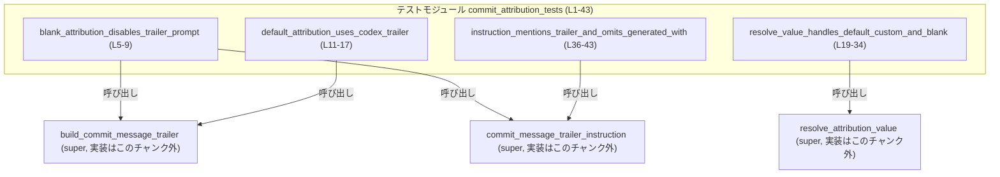
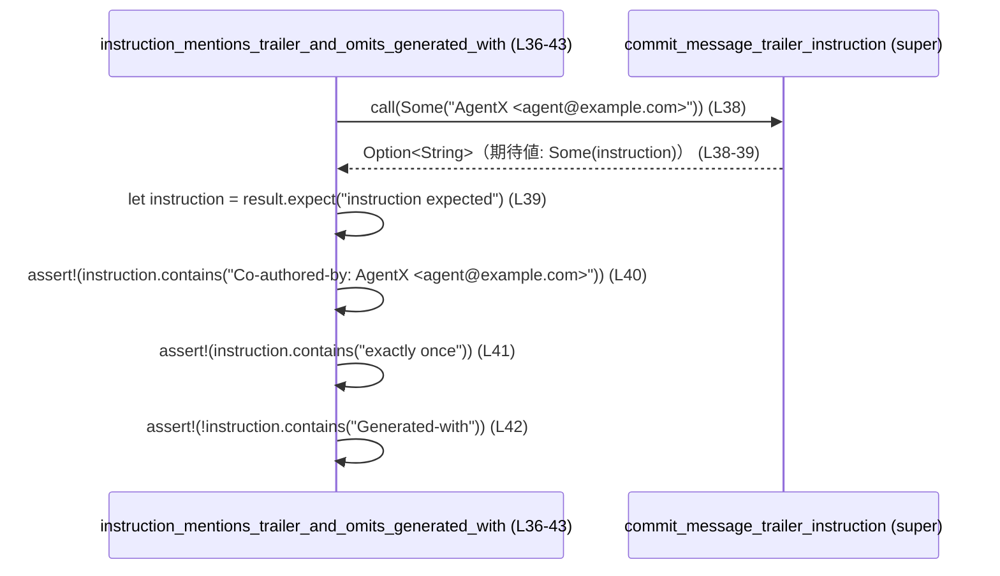

# core/src/commit_attribution_tests.rs コード解説

## 0. ざっくり一言

commit attribution（共同作成者表記）の設定値から、  
コミットメッセージのトレーラーや、その追記を促す説明文をどう生成するかを検証するユニットテスト群です（`core/src/commit_attribution_tests.rs:L1-43`）。

---

## 1. このモジュールの役割

### 1.1 概要

- このテストモジュールは、上位モジュール（`super`）に定義された以下 3 関数の振る舞いを確認します（`core/src/commit_attribution_tests.rs:L1-3`）。
  - `build_commit_message_trailer`
  - `commit_message_trailer_instruction`
  - `resolve_attribution_value`
- 主に、次のような入力ケースに対する挙動を検証しています。
  - attribution 設定が空文字または空白のみの場合（`L5-9, L19-34`）
  - attribution 設定が `None`（未設定）の場合（`L11-17, L19-24`）
  - attribution 設定が任意の文字列（メールアドレスあり／なし）の場合（`L19-33, L36-42`）

### 1.2 アーキテクチャ内での位置づけ

このファイルは、親モジュール（`super`）にある commit attribution ロジックのテスト専用モジュールとして機能しています。  
テスト関数から、上位モジュールの公開関数だけを呼び出す構造です（`core/src/commit_attribution_tests.rs:L1-3, L5-43`）。



> B/I/R の具体的な実装や定義ファイルは、このチャンクには現れません。

### 1.3 設計上のポイント（テストから読み取れる仕様）

- **Option と文字列による API 設計**  
  - 3 関数はいずれも `Option` を使って「設定あり／なし」や「生成できる／できない」を表現していることが、呼び出し形とアサーションから分かります（`core/src/commit_attribution_tests.rs:L7-8, L13-16, L21-33, L38-39`）。
- **空文字・空白のみの特別扱い**  
  - attribution が空文字 `""` または空白だけ `"   "` のとき、対応する結果が `None` になる（つまり「無効化」される）仕様がテストされています（`L7-8, L33`）。
- **デフォルト attribution の存在**  
  - attribution が `None`（未設定）の場合、`"Codex <noreply@openai.com>"` をデフォルト attribution として扱う仕様が明示されています（`L13-16, L21-24`）。
- **説明文内の具体的文言の検証**  
  - `commit_message_trailer_instruction` が返す説明文は、
    - `"Co-authored-by: AgentX <agent@example.com>"` を含む
    - `"exactly once"` を含む
    - `"Generated-with"` を含まない  
    という文字列条件を満たすことが検証されています（`L38-42`）。
- **安全性／エラー／並行性（このファイルから分かる範囲）**
  - このファイルには `unsafe` ブロックは存在せず、テストはすべて safe Rust で記述されています（`L1-43`）。
  - エラーは `Option` を通じて「`Some` / `None`」として表現されており、例外やパニックベースのエラー処理は見られません（`L7-8, L13-16, L21-33, L38-39`）。
  - スレッドや async 関連 API の使用はなく、並行性に関する要件・制約はこのチャンクからは分かりません（`L1-43`）。

---

## 2. 主要な機能一覧（テストケースの観点）

このファイル内で定義されているのは 4 つのテスト関数です（`core/src/commit_attribution_tests.rs:L5-9, L11-17, L19-34, L36-43`）。

- `blank_attribution_disables_trailer_prompt`  
  空文字や空白のみの attribution 設定を渡したとき、トレーラーおよび説明文が生成されない（`None` になる）ことを検証します（`L5-9`）。

- `default_attribution_uses_codex_trailer`  
  attribution 設定が `None` のとき、Codex のデフォルトトレーラー  
  `"Co-authored-by: Codex <noreply@openai.com>"` が生成されることを検証します（`L11-17`）。

- `resolve_value_handles_default_custom_and_blank`  
  `resolve_attribution_value` について、  
  - `None` → デフォルト値 `"Codex <noreply@openai.com>"`  
  - 任意の非空文字列 → その文字列をそのまま `String` 化したもの  
  - 空白のみの文字列 → `None`  
  となることを検証します（`L19-34`）。

- `instruction_mentions_trailer_and_omits_generated_with`  
  説明文を生成する `commit_message_trailer_instruction` が、
  - 適切な `Co-authored-by` 行を含むこと
  - `"exactly once"` を含むこと
  - `"Generated-with"` を含まないこと  
  を検証します（`L36-43`）。

---

## 3. 公開 API と詳細解説

### 3.1 コンポーネントインベントリー（関数一覧）

このファイル自身には構造体や列挙体は定義されていません。  
代わりに、このチャンクに登場する関数（テスト関数 + 上位モジュールの関数）のインベントリーを示します。

| 名前 | 種別 | 定義元 | 役割 / 用途 | 根拠 |
|------|------|--------|-------------|------|
| `build_commit_message_trailer` | 関数 | 上位モジュール（`super`、実装は不明） | attribution 設定からコミットメッセージのトレーラー文字列を `Option` で生成する | use 文と呼び出し（`core/src/commit_attribution_tests.rs:L1, L7, L13-16`） |
| `commit_message_trailer_instruction` | 関数 | 上位モジュール（`super`、実装は不明） | ユーザーにトレーラー追記を促す説明文を `Option<String>` として返す | use 文と呼び出し（`L2, L8, L38-42`） |
| `resolve_attribution_value` | 関数 | 上位モジュール（`super`、実装は不明） | 設定値から実際に使う attribution 文字列（例: `"Codex <…>"` や `"MyAgent"`）を解決し `Option<String>` で返す | use 文と呼び出し（`L3, L21-33`） |
| `blank_attribution_disables_trailer_prompt` | テスト関数 | 本ファイル | 空文字／空白のみの attribution がトレーラー・説明文の生成を無効化することを検証 | 関数定義とアサーション（`L5-9`） |
| `default_attribution_uses_codex_trailer` | テスト関数 | 本ファイル | attribution 未設定時に Codex 用トレーラーが生成されることを検証 | 関数定義とアサーション（`L11-17`） |
| `resolve_value_handles_default_custom_and_blank` | テスト関数 | 本ファイル | `resolve_attribution_value` のデフォルト・カスタム・空白ケースの振る舞いを検証 | 関数定義とアサーション（`L19-34`） |
| `instruction_mentions_trailer_and_omits_generated_with` | テスト関数 | 本ファイル | 説明文に含まれる／含まれないべき文言を検証 | 関数定義とアサーション（`L36-43`） |

> 上位モジュール側の具体的なシグネチャ（引数・戻り値の正確な型）は、このチャンクには現れません。以下ではテストの利用パターンから推測できる範囲のみ記述します。

---

### 3.2 重要な関数の詳細（上位モジュール API）

ここでは、テスト対象となっている 3 つの関数について、**テストから読み取れる仕様のみ** を整理します。

#### `build_commit_message_trailer(config_attribution: Option<&str>) -> Option<String>`（推定）

**概要**

- attribution 設定（`config_attribution`）に応じて、コミットメッセージに付与する「Co-authored-by: …」形式のトレーラー文字列を `Option` として返す関数です。
- テストから分かるのは次の点です。
  - 引数が `Some("")` のとき、戻り値は `None`（トレーラーなし）になります（`core/src/commit_attribution_tests.rs:L7`）。
  - 引数が `None` のとき、戻り値は `"Co-authored-by: Codex <noreply@openai.com>"` を含む `Some(String)` になります（`L13-16`）。

シグネチャは上記のように書きましたが、**あくまでテストの利用形からの推定**であり、実装ファイルはこのチャンクにはありません（`L1, L7, L13-16`）。

**引数**

| 引数名 | 型（推定） | 説明 |
|--------|-----------|------|
| `config_attribution` | `Option<&str>` | attribution 設定値。`None` は「未設定」、`Some(s)` は文字列設定。空文字 `""` が特別扱いされていることがテストから分かります（`L7, L13-16`）。 |

**戻り値**

- 型（推定）：`Option<String>`（`Option<T>` で、`as_deref()` が呼べる型）  
  - テストでは `build_commit_message_trailer(None).as_deref()` という呼び出しから、戻り値が `Option<T>`（`T: Deref<Target = str>`）であることが分かります（`L13-16`）。
- 意味：
  - `Some(trailer)` : コミットメッセージに付けるべきトレーラー文字列が存在する。
  - `None` : トレーラーを付けない。

**内部処理の流れ（分かる範囲）**

このファイルには実装が存在しないため、詳細なアルゴリズムは不明です。  
テストから読み取れる事実のみ列挙します。

- `config_attribution` が `Some("")` のときに `None` を返す（トレーラー生成を無効化）（`L7`）。
- `config_attribution` が `None` のときに、  
  `Some("Co-authored-by: Codex <noreply@openai.com>")` に等しい値を返す  
  （`as_deref()` で参照に変換した上で比較しています）（`L13-16`）。

これ以外の入力（たとえば `Some("MyAgent <me@example.com>")`）に対してどのようなトレーラーを返すかは、このテストファイルでは検証されていないため不明です。

**Examples（使用例：テストからの抜粋ベース）**

```rust
// attribution が空文字の場合はトレーラーを生成しないことを期待
let trailer = build_commit_message_trailer(Some(""));         // 空文字を渡す（L7）
assert_eq!(trailer, None);                                   // None になることをテスト（L7）

// attribution が未設定（None）の場合は Codex 用のトレーラーが生成されることを期待
let trailer = build_commit_message_trailer(None);            // None を渡す（L13）
assert_eq!(                                                  
    trailer.as_deref(),                                      // Option<String> を Option<&str> に変換（L14）
    Some("Co-authored-by: Codex <noreply@openai.com>"),      // 期待されるデフォルトトレーラー（L15）
);
```

**Errors / Panics**

- テストからは、エラーや panic を発生させるケースは確認できません。
- トレーラーを生成できない場合は `None` で表現する設計になっていると解釈できます（`L7, L13-16`）。
- その他のエラー条件や panic の有無は、実装がこのチャンクにないため不明です。

**Edge cases（エッジケース）**

- `config_attribution == Some("")`（空文字）：  
  → `None` が返る（トレーラーなし）（`L7`）。
- `config_attribution == None`：  
  → `"Co-authored-by: Codex <noreply@openai.com>"` を含む `Some` が返る（`L13-16`）。
- `config_attribution` にその他の値を渡したときの挙動は、このファイルからは分かりません。

**使用上の注意点**

- 「未設定」と「空文字（または空白のみ）」は意味が異なります。
  - `None` → デフォルトの Codex トレーラーが付く（`L13-16`）。
  - `Some("")` → トレーラーそのものが無効化される（`L7`）。
- どの文字列を渡すとどのようなトレーラーになるかは、テストされているケース以外は実装を確認する必要があります。

---

#### `resolve_attribution_value(config_attribution: Option<&str>) -> Option<String>`（推定）

**概要**

- attribution 設定値から、実際に使う attribution 文字列（例: `"Codex <…>"`, `"MyAgent"`, `"MyAgent <…>"`）を決定する関数です。
- テストでは、デフォルト値、カスタム値、空白の 3 パターンが検証されています（`core/src/commit_attribution_tests.rs:L21-33`）。

**引数**

| 引数名 | 型（推定） | 説明 |
|--------|-----------|------|
| `config_attribution` | `Option<&str>` | attribution 設定値。`None` は未設定、`Some(s)` は設定済み。空白のみの文字列は特別扱いされます（`L21-33`）。 |

**戻り値**

- 型（推定）：`Option<String>`
- 意味：
  - `Some(value)` : attribution に用いる文字列。
  - `None` : attribution を付けない。

**内部処理の流れ（テストから読み取れる仕様）**

- `config_attribution == None` の場合：  
  → `Some("Codex <noreply@openai.com>")` を返す（`L21-24`）。
- `config_attribution == Some("MyAgent <me@example.com>")` の場合：  
  → 同じ文字列を `String` として返す（`L25-28`）。
- `config_attribution == Some("MyAgent")` の場合：  
  → そのまま `"MyAgent"` を `String` 化して返す（`L29-32`）。
- `config_attribution == Some("   ")`（空白のみ）の場合：  
  → `None` を返す（`L33`）。

これら以外の入力（例えば `"  MyAgent  "` など）の扱いは、このファイルからは分かりません。

**Examples（使用例：テストベース）**

```rust
// attribution が未設定の場合は Codex のデフォルト attribution が返る（L21-24）
let value = resolve_attribution_value(None);                 // None を渡す
assert_eq!(
    value,
    Some("Codex <noreply@openai.com>".to_string()),          // デフォルト値（L23）
);

// カスタム attribution（メールアドレス付き）はそのまま返る（L25-28）
let value = resolve_attribution_value(Some("MyAgent <me@example.com>"));
assert_eq!(
    value,
    Some("MyAgent <me@example.com>".to_string()),            // そのまま to_string したもの（L27）
);

// カスタム attribution（名前だけ）もそのまま返る（L29-32）
let value = resolve_attribution_value(Some("MyAgent"));
assert_eq!(
    value,
    Some("MyAgent".to_string()),                             // そのまま to_string （L31）
);

// 空白のみの場合は None になる（L33）
let value = resolve_attribution_value(Some("   "));
assert_eq!(value, None);
```

**Errors / Panics**

- テストが扱うのは正常系のみであり、エラー型や panic を使ったエラー処理は確認できません（`L21-33`）。
- 無効な入力（空白のみ）を `None` で表現する方針が見て取れます（`L33`）。

**Edge cases（エッジケース）**

- `None` → デフォルト `"Codex <noreply@openai.com>"`（`L21-24`）。
- `Some("   ")`（空白のみ） → `None`（`L33`）。
- `Some("")`（完全な空文字）については、この関数ではテストされておらず、挙動は不明です（`L19-34` には登場しない）。

**使用上の注意点**

- `None` と `Some("   ")`（空白のみ）は異なる意味を持ちます。
  - `None` は「デフォルト値を使う」という意味（`L21-24`）。
  - 空白のみは「attribution 自体を無効化する」という意味（`L33`）。
- ユーザー入力などをそのまま渡す場合、前後の空白除去などをどこで行うかは実装側を確認する必要があります。このテストからは、すべての空白パターンがカバーされているわけではありません。

---

#### `commit_message_trailer_instruction(config_attribution: Option<&str>) -> Option<String>`（推定）

**概要**

- attribution 設定に応じて、「Co-authored-by」トレーラーをユーザーにどう追記してもらうかを説明する文面を、`Option<String>` として返す関数です。
- テストから分かるのは次の 2 ケースです（`core/src/commit_attribution_tests.rs:L8, L36-42`）。
  - 空白のみの attribution が渡された場合 → 説明文は生成されない（`None`）。
  - 有効な attribution が渡された場合 → 所定の文言を含む説明文が `Some(String)` として返る。

**引数**

| 引数名 | 型（推定） | 説明 |
|--------|-----------|------|
| `config_attribution` | `Option<&str>` | attribution 設定値。`Some("   ")` のような空白のみの文字列は特別扱いされます（`L8, L38-39`）。 |

**戻り値**

- 型（推定）：`Option<String>`
- 意味：
  - `Some(instruction)` : 説明文をユーザーに表示する必要がある。
  - `None` : 説明文を表示する必要がない（例: attribution が空白のみ）。

**内部処理の流れ（テストから読み取れる仕様）**

- `config_attribution == Some("   ")` → `None`（`L8`）。
- `config_attribution == Some("AgentX <agent@example.com>")` → `Some(instruction)` となり、その `instruction` については：
  - `"Co-authored-by: AgentX <agent@example.com>"` を含む（`L40`）。
  - `"exactly once"` を含む（`L41`）。
  - `"Generated-with"` を含まない（`L42`）。

説明文の全体的なフォーマットやその他の文言は、このテストでは検証されていません。

**Examples（使用例：テストベース）**

```rust
// attribution が空白のみの場合は説明文が生成されない（L8）
let instruction = commit_message_trailer_instruction(Some("   ")); // 空白のみを渡す
assert_eq!(instruction, None);                                     // None であることを検証

// 有効な attribution の場合は説明文が生成される（L36-42）
let instruction = commit_message_trailer_instruction(
    Some("AgentX <agent@example.com>"),                            // 有効な attribution（L38）
)
.expect("instruction expected");                                    // Option<String> を unwrap（L39）

assert!(instruction.contains("Co-authored-by: AgentX <agent@example.com>")); // トレーラー行を含む（L40）
assert!(instruction.contains("exactly once"));                               // 「exactly once」を含む（L41）
assert!(!instruction.contains("Generated-with"));                            // 「Generated-with」を含まない（L42）
```

**Errors / Panics**

- テストは `expect("instruction expected")` を呼んでおり、`Some` が返ることを前提にしています（`L38-39`）。
- それ以外のエラーや panic 条件は、このファイルからは分かりません。

**Edge cases（エッジケース）**

- `Some("   ")`（空白のみ） → `None`（`L8`）。
- `Some("AgentX <agent@example.com>")` → 上記条件を満たす説明文 `Some(String)`（`L38-42`）。
- `None` やその他の文字列に対する挙動は、このテストでは検証されておらず不明です。

**使用上の注意点**

- 説明文が `None` の場合、呼び出し側では「説明文なしでよい」という意味として扱う必要があります（`L8`）。
- 説明文の文言に `"Generated-with"` を含めないことが仕様としてテストされているため、この文字列を含めるような変更はテスト修正を伴います（`L42`）。

---

### 3.3 その他の関数（テスト関数）

テスト関数は補助ではなく本ファイルの主目的ですが、API ではないため簡潔にまとめます。

| 関数名 | 役割（1 行） | 根拠 |
|--------|--------------|------|
| `blank_attribution_disables_trailer_prompt` | 空文字／空白のみの attribution の場合に、トレーラーと説明文が `None` になることを検証する | `core/src/commit_attribution_tests.rs:L5-9` |
| `default_attribution_uses_codex_trailer` | attribution 未設定時に Codex デフォルトトレーラーが生成されることを検証する | `L11-17` |
| `resolve_value_handles_default_custom_and_blank` | `resolve_attribution_value` のデフォルト・カスタム・空白入力の振る舞いを検証する | `L19-34` |
| `instruction_mentions_trailer_and_omits_generated_with` | 説明文に含まれるべき文言と含まれてはならない文言を検証する | `L36-43` |

---

## 4. データフロー

ここでは、代表的なテストシナリオとして  
`instruction_mentions_trailer_and_omits_generated_with` の処理の流れを示します（`core/src/commit_attribution_tests.rs:L36-43`）。

### 処理の要点（テスト視点）

1. テスト関数が `commit_message_trailer_instruction` に attribution 文字列 `"AgentX <agent@example.com>"` を渡す（`L38`）。
2. 関数は `Option<String>` を返し、テスト関数は `expect` で `Some` であることを前提に中身を取得する（`L39`）。
3. 取得した文字列に対して、特定のサブ文字列の有無をアサーションで検証する（`L40-42`）。

### データフロー（sequence diagram）



> `commit_message_trailer_instruction` の内部でどのように文字列が構築されているかは、このチャンクには現れません。

---

## 5. 使い方（How to Use）

このファイル自体はテストコードですが、テストから推測できる最小限のインターフェースに基づき、典型的な利用例を示します。  
※ 実際のモジュールパスや詳細なシグネチャは、このチャンクからは断定できません。

### 5.1 基本的な使用方法（推定）

以下は、attribution 設定に基づいてトレーラーと説明文を生成し、標準出力に表示する例です。

```rust
// 仮の use 文: 実際のモジュールパスはこのチャンクからは不明です。
use core::commit_attribution::{
    build_commit_message_trailer,                  // トレーラー生成関数（テスト対象）
    commit_message_trailer_instruction,            // 説明文生成関数（テスト対象）
    resolve_attribution_value,                     // attribution 値解決関数（テスト対象）
};

fn main() {
    // 設定から読み込んだ attribution（ここでは例としてハードコード）
    let config_attribution: Option<&str> =
        Some("AgentX <agent@example.com>");        // 有効な attribution 文字列を仮定

    // 実際に使用する attribution 値を解決（None のときは Codex などのデフォルトになる）
    let attribution_value = resolve_attribution_value(config_attribution);
    println!("resolved attribution: {:?}", attribution_value);

    // コミットメッセージに付けるトレーラーを生成
    let trailer = build_commit_message_trailer(config_attribution); // Option<String> を想定
    println!("trailer: {:?}", trailer);

    // ユーザーへの説明文（トレーラーの付け方）を生成
    if let Some(instruction) = commit_message_trailer_instruction(config_attribution) {
        // Some の場合のみ表示する
        println!("instruction: {}", instruction);
    } else {
        println!("no instruction needed");
    }
}
```

> 上記コードは、このテストファイルで確認されている挙動（`None`/`Some` と文字列内容）に整合するように書かれていますが、  
> 実際のモジュール構成や全ての挙動はこのチャンクからは分かりません。

### 5.2 よくある使用パターン（テストから読み取れるもの）

1. **デフォルト attribution を使うパターン**（attribution 未設定）

   ```rust
   let config_attribution: Option<&str> = None;            // 未設定（L13, L21）

   // デフォルト値 Codex を使う
   let value = resolve_attribution_value(config_attribution);
   assert_eq!(
       value,
       Some("Codex <noreply@openai.com>".to_string()),     // デフォルト（L23）
   );

   let trailer = build_commit_message_trailer(config_attribution);
   assert_eq!(
       trailer.as_deref(),
       Some("Co-authored-by: Codex <noreply@openai.com>"), // デフォルトトレーラー（L14-16）
   );
   ```

2. **attribution を完全に無効化するパターン**（空文字 or 空白のみ）

   ```rust
   // 空文字で無効化するケース（L7）
   let config_attribution: Option<&str> = Some("");

   let trailer = build_commit_message_trailer(config_attribution);
   assert_eq!(trailer, None);                              // トレーラーなし（L7）

   // 空白だけで無効化するケース（L8, L33）
   let config_attribution: Option<&str> = Some("   ");

   let value = resolve_attribution_value(config_attribution);
   assert_eq!(value, None);                                // attribution 値も None（L33）

   let instruction = commit_message_trailer_instruction(config_attribution);
   assert_eq!(instruction, None);                          // 説明文もなし（L8）
   ```

### 5.3 よくある間違い（起こりうる誤解）

テストの仕様から、次のような誤解が起こりうると考えられます。

```rust
// 誤解例: 空白だけの文字列を「一応設定した」つもりで渡す
let config_attribution = Some("   ");                      // 実際には「無効化」を意味する（L8, L33）
let trailer = build_commit_message_trailer(config_attribution);
// 期待: デフォルトの Codex トレーラーが付く
// 実際: resolve_attribution_value と同様に None 相当として扱われる可能性が高いが、
//       build_commit_message_trailer についてはこのテストでは検証されていません。

// 正しい認識の例:
// - デフォルト（Codex）を使いたい → None を渡す（L13-16, L21-24）
// - attribution 自体を無効化したい → 空文字や空白のみを渡す（L7-8, L33）
```

> build_commit_message_trailer における `"   "` の扱いはこのテストでは明示されていないため、  
> 実際の挙動は実装ファイルを確認する必要があります。

### 5.4 使用上の注意点（まとめ）

- `None` / 空文字 / 空白のみ がそれぞれ異なる意味を持つ可能性があり、少なくとも次はテストで確認されています。
  - `None` → デフォルト Codex attribution / トレーラー（`L13-16, L21-24`）。
  - `Some("   ")` → attribution も説明文も `None`（`L8, L33`）。
  - `Some("")` → トレーラーが `None`（`L7`）。`resolve_attribution_value` での扱いは未検証。
- エラーは `Option` で表現されており、`panic!` や例外による制御はテストからは見られません（`L5-9, L11-17, L19-34, L36-43`）。
- 並行性やスレッド安全性に関する仕様は、このファイルからは読み取れません。

---

## 6. 変更の仕方（How to Modify）

### 6.1 新しい機能を追加する場合（テスト観点）

このファイルはテスト専用のため、新機能や仕様追加があった場合は、まず **上位モジュールの実装** を変更し、その後にこのファイルを更新する形になります。

- 例：新たな attribution フォーマットをサポートする場合
  1. 上位モジュールで `resolve_attribution_value` や `build_commit_message_trailer` の実装を拡張する（実装ファイルはこのチャンクにはない）。
  2. 新しい振る舞いに対応するテストを、このファイルに追加する。
     - たとえば新しい入力文字列パターンについて `assert_eq!` を追加する（`L21-33` のスタイルに倣う）。
  3. 既存のテスト（特にデフォルト値や空白扱い）と矛盾しないか確認する（`L7-8, L13-16, L21-33`）。

### 6.2 既存の機能を変更する場合（仕様変更への追従）

- **デフォルト attribution を変更する場合**
  - `"Codex <noreply@openai.com>"` に依存しているテストを更新する必要があります（`L15, L23`）。
  - `build_commit_message_trailer` と `resolve_attribution_value` の両方で同じデフォルトが使われていることをテストが前提としているため、両方のアサーションを揃えて変更する必要があります（`L13-16, L21-24`）。

- **空白扱いの仕様を変える場合**
  - `Some("   ")` を `None` とみなす挙動を変える場合、以下のテストを変更する必要があります。
    - `blank_attribution_disables_trailer_prompt` の `commit_message_trailer_instruction` に関するアサーション（`L8`）。
    - `resolve_value_handles_default_custom_and_blank` の `resolve_attribution_value(Some("   "))` に関するアサーション（`L33`）。

> このファイルは仕様の「契約テスト」の役割を持っているため、  
> 仕様変更の際には **まず期待する仕様をテストとして書き換える** ことが推奨されます。

---

## 7. 関連ファイル

このチャンクから直接分かる関連モジュールは、`super` によって参照されている上位モジュールのみです。

| パス / モジュール | 役割 / 関係 |
|------------------|------------|
| 上位モジュール（`super`、具体的ファイル名はこのチャンクには現れない） | `build_commit_message_trailer`, `commit_message_trailer_instruction`, `resolve_attribution_value` の実装を提供し、本テストモジュールから直接呼び出されます（`core/src/commit_attribution_tests.rs:L1-3`）。 |
| Rust テストハーネス（`#[test]` 属性） | 各テスト関数をユニットテストとして実行するための標準機能です（`L5, L11, L19, L36`）。 |

> それ以外のファイル（例: 上位モジュールの具体的なファイル名や、設定読み込みロジック等）は、このチャンクには現れず不明です。
