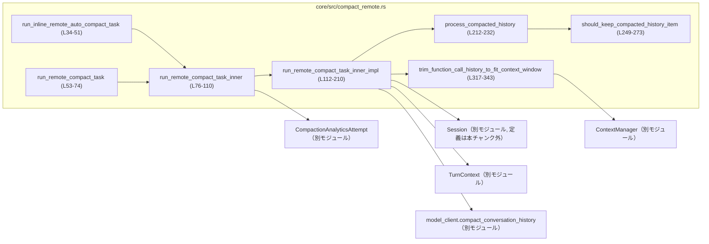
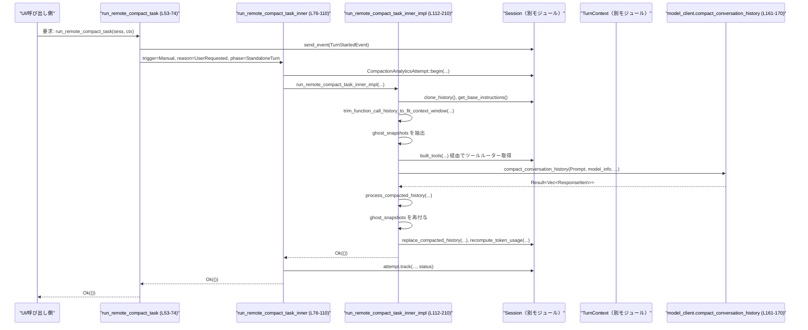

# core/src/compact_remote.rs コード解説

## 0. ざっくり一言

- 会話履歴をリモートの「コンパクション用モデル」に送って要約・縮約させ、その結果でセッション履歴を差し替える非同期タスクを実行するモジュールです（`compact_conversation_history` 呼び出しなどからの解釈です。根拠: `core/src/compact_remote.rs:L161-170`）。
- 実行のたびにトークン使用状況やエラーを計測・ログ出力し、履歴サイズがコンテキストウィンドウを超えないよう調整します（根拠: `CompactionAnalyticsAttempt`, ログ関数, トリミング処理。`core/src/compact_remote.rs:L84-101,L172-180,L298-315,L317-343`）。

---

## 1. このモジュールの役割

### 1.1 概要

このモジュールは、**会話履歴コンパクションをリモートモデルで実行するためのタスク実装**を提供します。

- `Session` / `TurnContext` から履歴・モデル情報・メタデータを取得し、コンパクション用プロンプトを組み立てます（根拠: `core/src/compact_remote.rs:L120-159`）。
- モデルクライアントの `compact_conversation_history` を非同期で呼び出し、返ってきた履歴をローカルの形式に整形し、必要に応じて初期コンテキストを注入します（根拠: `core/src/compact_remote.rs:L161-190,L212-232`）。
- 処理の成功/失敗をアナリティクスとイベントで記録し、エラー時にはトークン使用状況などの詳細ログを出力します（根拠: `core/src/compact_remote.rs:L84-110,L171-183,L298-315`）。

### 1.2 アーキテクチャ内での位置づけ

このモジュールは以下のコンポーネントと連携します:

- `Session`：履歴の取得/更新、イベント送信、モデルクライアント呼び出しなどを担う（根拠: `core/src/compact_remote.rs:L34-51,L112-121,L161-183,L193-205`）。
- `TurnContext`：ターンID、モデル情報、コンテキストウィンドウ、タイミング情報などを提供（根拠: `core/src/compact_remote.rs:L53-63,L120-143,L165-170,L195-198,L298-313`）。
- `ContextManager`：履歴のトークン数見積もりやアイテム削除などを行う（根拠: `core/src/compact_remote.rs:L120-126,L317-343`）。
- `model_client`：実際にリモートコンパクションモデルを叩くクライアント（根拠: `core/src/compact_remote.rs:L161-170`）。
- `codex_analytics` / トレースログ：コンパクションのメトリクス・ログ出力（根拠: `core/src/compact_remote.rs:L16-19,L84-101,L298-315`）。

依存関係（このファイル内で観測できる範囲）を簡略に示すと次の通りです。



### 1.3 設計上のポイント

- **責務分割**
  - 「エントリポイント（`run_inline_remote_auto_compact_task` / `run_remote_compact_task`）」と「共通内部処理（`run_remote_compact_task_inner` / `_impl`）」を分離しており、コンパクションのトリガー種別（自動/手動）や初期コンテキスト注入方法のみを切り替えています（根拠: `core/src/compact_remote.rs:L34-51,L53-74,L76-83`）。
  - 履歴のフィルタリング・初期コンテキスト挿入は `process_compacted_history`、履歴トリミングは `trim_function_call_history_to_fit_context_window` に切り出されています（根拠: `core/src/compact_remote.rs:L184-190,L212-232,L317-343`）。

- **状態管理**
  - セッション全体の状態は `Session`（`Arc<Session>`）に集約され、このモジュールは `clone_history` / `replace_compacted_history` / `recompute_token_usage` により、履歴とトークン使用状況を更新します（根拠: `core/src/compact_remote.rs:L120-121,L193-205`）。
  - ターン固有の情報は `TurnContext`（`Arc<TurnContext>`）から参照のみを行っています（根拠: `core/src/compact_remote.rs:L35-39,L53-56,L112-115`）。

- **エラー処理**
  - 主要関数はすべて `CodexResult<()>` を返し、失敗時には `CompactionAnalyticsAttempt` にステータスを記録し、イベント (`EventMsg::Error`) とログで通知した上でエラーを呼び出し元に伝播します（根拠: `core/src/compact_remote.rs:L21,L84-110,L171-183`）。
  - モデル呼び出し部分では `or_else` を使って、エラー時にトークン使用状況などのログデータを構築・出力してからエラーを返しています（根拠: `core/src/compact_remote.rs:L171-183,L281-296,L298-315`）。

- **並行性 / 安全性**
  - すべての対外処理（イベント送信・履歴操作・モデル呼び出し）は `async fn` と `await` を用いた非同期処理で実行されます（根拠: `core/src/compact_remote.rs:L34-51,L53-74,L76-110,L112-210,L212-232`）。
  - `Session` と `TurnContext` は `Arc` で共有され、所有権を移動することなく複数タスクから読み書きできる設計です（実際のスレッド安全性は型実装次第で、このチャンクには現れません。根拠: `core/src/compact_remote.rs:L35-36,L77-78,L112-115`）。

---

## 2. 主要なコンポーネント一覧

### 2.1 型一覧（このファイルで定義されているもの）

| 名前 | 種別 | 役割 / 用途 | 定義箇所 |
|------|------|-------------|----------|
| `CompactRequestLogData` | 構造体 | 失敗したコンパクションリクエストの「モデルが見るバイト数」をログ用に保持します。 | `core/src/compact_remote.rs:L276-279` |

※ `Session`, `TurnContext`, `ContextManager`, `ResponseItem` などは他モジュールで定義されており、このチャンクには現れません。

### 2.2 関数・メソッド一覧

| 関数名 | 可視性 | 役割（1 行） | 定義箇所 |
|--------|--------|--------------|----------|
| `run_inline_remote_auto_compact_task` | `pub(crate)` | セッション中（インライン）の自動リモートコンパクションを実行するエントリポイント。 | `core/src/compact_remote.rs:L34-51` |
| `run_remote_compact_task` | `pub(crate)` | ユーザー手動トリガー用のリモートコンパクションタスクのエントリポイント。 | `core/src/compact_remote.rs:L53-74` |
| `run_remote_compact_task_inner` | `async fn`（モジュール内） | エントリポイントから共通の内部処理を呼び、アナリティクスとエラーイベント送信を行う。 | `core/src/compact_remote.rs:L76-110` |
| `run_remote_compact_task_inner_impl` | `async fn` | 実際の履歴取得・トリミング・リモートコンパクション呼び出し・履歴差し替えを行うコアロジック。 | `core/src/compact_remote.rs:L112-210` |
| `process_compacted_history` | `pub(crate)` | モデルから返ったコンパクト済み履歴をフィルタリングし、必要に応じて初期コンテキストを注入する。 | `core/src/compact_remote.rs:L212-232` |
| `should_keep_compacted_history_item` | `fn`（モジュール内） | リモートコンパクション出力中の各 `ResponseItem` を保持するかどうか判定するフィルタ関数。 | `core/src/compact_remote.rs:L249-273` |
| `build_compact_request_log_data` | `fn` | コンパクションリクエストの可視バイト数を算出し `CompactRequestLogData` にまとめる。 | `core/src/compact_remote.rs:L281-296` |
| `log_remote_compact_failure` | `fn` | コンパクション失敗時にエラーと各種トークン使用メトリクスをログ出力する。 | `core/src/compact_remote.rs:L298-315` |
| `trim_function_call_history_to_fit_context_window` | `fn` | コンテキストウィンドウに収まるまで「Codex が生成した」履歴末尾のアイテムを削除する。 | `core/src/compact_remote.rs:L317-343` |

---

## 3. 公開 API と詳細解説

### 3.1 型一覧（構造体・列挙体など詳細）

| 名前 | 種別 | フィールド | 役割 / 用途 | 根拠 |
|------|------|-----------|-------------|------|
| `CompactRequestLogData` | 構造体 | `failing_compaction_request_model_visible_bytes: i64` | コンパクションリクエストの「モデルから見えるバイト数」をログの一部として保持します。構築は `build_compact_request_log_data` のみから行われます。 | `core/src/compact_remote.rs:L276-279,L281-296` |

---

### 3.2 主要関数詳細（最大 7 件）

#### 3.2.1 `run_inline_remote_auto_compact_task(sess: Arc<Session>, turn_context: Arc<TurnContext>, initial_context_injection: InitialContextInjection, reason: CompactionReason, phase: CompactionPhase) -> CodexResult<()>`

**概要**

- セッション中に自動的に発火する「インライン」リモートコンパクションを実行するエントリポイントです。
- 内部で `run_remote_compact_task_inner` を `CompactionTrigger::Auto` で呼び出し、指定された `InitialContextInjection` / `reason` / `phase` をそのまま渡します（根拠: `core/src/compact_remote.rs:L34-48`）。

**引数**

| 引数名 | 型 | 説明 |
|--------|----|------|
| `sess` | `Arc<Session>` | 現在のセッション全体を表すオブジェクト。履歴操作・モデル呼び出し・イベント送信を担います（定義は本チャンク外）。 |
| `turn_context` | `Arc<TurnContext>` | 現在のターンに関するメタ情報（サブID・モデル情報など）を保持します（定義は本チャンク外）。 |
| `initial_context_injection` | `InitialContextInjection` | コンパクション後にどのように初期コンテキストを注入するかの指定（例: `DoNotInject` / `BeforeLastUserMessage`）。 |
| `reason` | `CompactionReason` | コンパクション実行の理由（アナリティクス用）。 |
| `phase` | `CompactionPhase` | セッション中のフェーズ（例: mid-turn / standalone turn など、詳細は本チャンク外）。 |

**戻り値**

- `CodexResult<()>`：成功時は `Ok(())` を返し、失敗時は `CodexErr` を内包した `Err` を返します（根拠: `core/src/compact_remote.rs:L21,L34-51`）。

**内部処理の流れ**

1. `run_remote_compact_task_inner` を `CompactionTrigger::Auto` 付きで呼び出す（根拠: `core/src/compact_remote.rs:L41-48`）。
2. 非同期に完了を待ち、エラーがあればそのまま呼び出し元へ伝播する（`?` 演算子）。  
3. 成功時は `Ok(())` を明示的に返す。

**Examples（使用例）**

この関数は crate 内部向け (`pub(crate)`) ですが、同一 crate 内の別モジュールから呼び出すイメージ例です。

```rust
// 非同期コンテキスト内での使用例（擬似コード）
async fn maybe_compact_mid_turn(sess: Arc<Session>, turn_ctx: Arc<TurnContext>) -> CodexResult<()> {
    // mid-turn で、最後のユーザーメッセージの前に初期コンテキストを挿入しつつ自動コンパクション
    run_inline_remote_auto_compact_task(
        sess,
        turn_ctx,
        InitialContextInjection::BeforeLastUserMessage,
        CompactionReason::TokenLimitApproaching,
        CompactionPhase::MidTurn,
    ).await
}
```

- 所有権は `Arc` によって共有され、`run_inline_remote_auto_compact_task` に所有権がムーブしても、他のタスクから参照を継続できます。

**Errors / Panics**

- `run_remote_compact_task_inner` が `Err` を返した場合、この関数も `Err` を返します（根拠: `core/src/compact_remote.rs:L41-50`）。
- 明示的な `panic!` 呼び出しはなく、パニックの可能性は、この関数が呼び出す下位レイヤーに依存します（このチャンクには現れません）。

**Edge cases（エッジケース）**

- `initial_context_injection` による挙動差はすべて下位の `process_compacted_history` 側で処理されるため、この関数単体にはエッジケース固有のロジックはありません。

**使用上の注意点**

- 非同期関数のため、必ず `.await` を付けて呼び出す必要があります。
- `Session` / `TurnContext` が有効な状態であることが前提です（不正状態の扱いは本チャンク外）。

---

#### 3.2.2 `run_remote_compact_task(sess: Arc<Session>, turn_context: Arc<TurnContext>) -> CodexResult<()>`

**概要**

- ユーザーが明示的にリモートコンパクションを要求したときに呼ばれるエントリポイントです。
- ターン開始イベント (`EventMsg::TurnStarted`) を送信した上で、`run_remote_compact_task_inner` を「手動トリガー」として実行します（根拠: `core/src/compact_remote.rs:L53-74`）。

**引数**

| 引数名 | 型 | 説明 |
|--------|----|------|
| `sess` | `Arc<Session>` | セッションオブジェクト。イベント送信や履歴更新に用いられます。 |
| `turn_context` | `Arc<TurnContext>` | 実行中のターンについての情報。 |

**戻り値**

- `CodexResult<()>`：成功時は `Ok(())`。失敗時はエラーを返します。

**内部処理の流れ**

1. `TurnStartedEvent` を構築し、`turn_id` / `started_at` / `model_context_window` / `collaboration_mode_kind` を埋める（根拠: `core/src/compact_remote.rs:L57-62`）。
2. `sess.send_event(&turn_context, start_event).await` でターン開始イベントを送信する（根拠: `core/src/compact_remote.rs:L63`）。
3. `InitialContextInjection::DoNotInject`、`CompactionTrigger::Manual`、`CompactionReason::UserRequested`、`CompactionPhase::StandaloneTurn` を指定して `run_remote_compact_task_inner` を呼び、結果をそのまま返す（根拠: `core/src/compact_remote.rs:L65-73`）。

**Examples（使用例）**

```rust
// 手動コンパクションのリクエスト受付処理の一部（擬似コード）
async fn on_user_requested_compact(sess: Arc<Session>, turn_ctx: Arc<TurnContext>) -> CodexResult<()> {
    run_remote_compact_task(sess, turn_ctx).await
}
```

**Errors / Panics**

- イベント送信 (`send_event`) または `run_remote_compact_task_inner` が `Err` を返した場合、同様のエラーを返します。
- 本関数内にパニックはありません。

**Edge cases**

- `turn_context.model_context_window()` が `None` でも、この関数自体は問題なく実行されます（実際のトークン数調整は後続の `trim_function_call_history_to_fit_context_window` に委ねられます）。

**使用上の注意点**

- ユーザー操作に対応する関数であるため、UI 側などで多重実行を防ぐ設計が望ましいですが、その制御は本モジュールでは行っていません。

---

#### 3.2.3 `run_remote_compact_task_inner(sess: &Arc<Session>, turn_context: &Arc<TurnContext>, initial_context_injection: InitialContextInjection, trigger: CompactionTrigger, reason: CompactionReason, phase: CompactionPhase) -> CodexResult<()>`

**概要**

- コンパクション実行の共通ラッパーで、アナリティクス (`CompactionAnalyticsAttempt`) の開始・終了記録と、エラーイベント (`EventMsg::Error`) の送信を担当します（根拠: `core/src/compact_remote.rs:L84-110`）。
- 実際の処理は `run_remote_compact_task_inner_impl` に委譲します。

**引数**

| 引数名 | 型 | 説明 |
|--------|----|------|
| `sess` | `&Arc<Session>` | 共有セッションへの参照。所有権は呼び出し元に残ります。 |
| `turn_context` | `&Arc<TurnContext>` | 共有ターンコンテキストへの参照。 |
| `initial_context_injection` | `InitialContextInjection` | 初期コンテキスト注入方針。 |
| `trigger` | `CompactionTrigger` | 自動/手動などのトリガー種別。 |
| `reason` | `CompactionReason` | 実行理由。 |
| `phase` | `CompactionPhase` | 実行フェーズ。 |

**戻り値**

- `CodexResult<()>`。

**内部処理の流れ**

1. `CompactionAnalyticsAttempt::begin` を呼び出し、コンパクションの試行開始を記録します（根拠: `core/src/compact_remote.rs:L84-92`）。
2. `run_remote_compact_task_inner_impl` を呼んで実際のコンパクションを実行し、その `Result` を `result` 変数に保持します（根拠: `core/src/compact_remote.rs:L93-94`）。
3. `attempt.track(...)` を呼んで、成功/失敗ステータスとエラーメッセージ（あれば）をアナリティクスに記録します（根拠: `core/src/compact_remote.rs:L95-101`）。
4. `result` が `Err` であれば、`EventMsg::Error` を構築し、`sess.send_event` で送信したうえで `Err` を返します（根拠: `core/src/compact_remote.rs:L102-107`）。
5. 成功時は `Ok(())` を返します。

**Examples（使用例）**

通常は直接呼び出されず、`run_inline_remote_auto_compact_task` / `run_remote_compact_task` 経由で利用されます。

```rust
// テストや特殊ケースで直接呼ぶ想定の擬似コード
async fn run_with_custom_reason(sess: Arc<Session>, ctx: Arc<TurnContext>) -> CodexResult<()> {
    run_remote_compact_task_inner(
        &sess,
        &ctx,
        InitialContextInjection::DoNotInject,
        CompactionTrigger::Auto,
        CompactionReason::TokenLimitApproaching,
        CompactionPhase::StandaloneTurn,
    ).await
}
```

**Errors / Panics**

- `run_remote_compact_task_inner_impl` が返したエラーをそのまま返します。
- アナリティクス記録 (`begin` / `track`) やイベント送信がエラーになるかどうかは、このチャンクからは不明です。

**Edge cases**

- `attempt.track` 自体が失敗した場合の扱いは、この関数の戻り値ロジックには現れません（`track` の戻り値は `await` されるだけで、エラー処理は見えません。`core/src/compact_remote.rs:L95-101`）。`track` が `Result` を返すなら、`?` を使っていないため、失敗しても続行すると解釈できます。

**使用上の注意点**

- ログ・アナリティクスと実際のコンパクション処理を一括してラップしているため、コンパクション処理の新たなエントリポイントを追加する場合も、この関数を経由するのが一貫した挙動になります。

---

#### 3.2.4 `run_remote_compact_task_inner_impl(sess: &Arc<Session>, turn_context: &Arc<TurnContext>, initial_context_injection: InitialContextInjection) -> CodexResult<()>`

**概要**

- リモートコンパクションの「本体」処理です。
- 履歴のクローン取得、履歴トリミング、ゴーストスナップショットの退避、ツールルーター構築、モデルクライアントへのコンパクション問い合わせ、返ってきた履歴の整形と差し替えまでを一括で行います（根拠: `core/src/compact_remote.rs:L112-210`）。

**引数**

| 引数名 | 型 | 説明 |
|--------|----|------|
| `sess` | `&Arc<Session>` | セッションへの共有参照。 |
| `turn_context` | `&Arc<TurnContext>` | ターンコンテキストへの共有参照。 |
| `initial_context_injection` | `InitialContextInjection` | コンパクション後の初期コンテキスト注入方法。 |

**戻り値**

- `CodexResult<()>`：コンパクションと履歴差し替えが成功したかどうか。

**内部処理の流れ（概要）**

1. `ContextCompactionItem` を作成し、`emit_turn_item_started` でコンパクション開始を通知する（根拠: `core/src/compact_remote.rs:L117-119`）。
2. `sess.clone_history().await` で履歴をクローンし、`get_base_instructions().await` でベースインストラクションを取得（根拠: `core/src/compact_remote.rs:L120-121`）。
3. `trim_function_call_history_to_fit_context_window` により、コンテキストウィンドウを超える分の履歴を末尾から削除（Codex 生成アイテムのみ削除）（根拠: `core/src/compact_remote.rs:L122-133,L317-343`）。
4. `history` の中から `ResponseItem::GhostSnapshot` をフィルタリングして退避し、後で再度付け直す（根拠: `core/src/compact_remote.rs:L135-140,L192-194`）。
5. `history.for_prompt(...)` でプロンプト入力を生成し、`built_tools` でツールルーターを構築（根拠: `core/src/compact_remote.rs:L142-151`）。
6. `Prompt` 構造体を組み立て、`sess.services.model_client.compact_conversation_history(...)` を呼び出してリモートコンパクションを実行（根拠: `core/src/compact_remote.rs:L152-170`）。
7. モデル呼び出しがエラーの場合、`build_compact_request_log_data` と `log_remote_compact_failure` でログを出力し、エラーをそのまま返す（`or_else` を使用）（根拠: `core/src/compact_remote.rs:L171-183,L281-296,L298-315`）。
8. 成功時には `process_compacted_history` により、戻り値の履歴をフィルタリングし、必要な初期コンテキストを挿入（根拠: `core/src/compact_remote.rs:L184-190,L212-232`）。
9. 退避しておいた `ghost_snapshots` を新しい履歴に再度追加（根拠: `core/src/compact_remote.rs:L192-194`）。
10. `initial_context_injection` に応じて `reference_context_item` を決め（`BeforeLastUserMessage` の場合はターンコンテキストアイテムを参照に使う）、`CompactedItem` を構築（根拠: `core/src/compact_remote.rs:L195-202`）。
11. `sess.replace_compacted_history` で履歴を差し替え、`recompute_token_usage` でトークン使用量を再計算（根拠: `core/src/compact_remote.rs:L203-205`）。
12. `emit_turn_item_completed` でコンパクション完了を通知し、`Ok(())` を返す（根拠: `core/src/compact_remote.rs:L207-209`）。

**Examples（使用例）**

直接呼ぶことは通常想定されていませんが、簡略化した呼び出し例です。

```rust
async fn compact_with_impl(sess: Arc<Session>, ctx: Arc<TurnContext>) -> CodexResult<()> {
    run_remote_compact_task_inner_impl(
        &sess,
        &ctx,
        InitialContextInjection::DoNotInject,
    ).await
}
```

**Errors / Panics**

- モデルクライアント (`compact_conversation_history`) からのエラーは `or_else` 内でログを出力した上で、そのまま `Err` として伝播します（根拠: `core/src/compact_remote.rs:L171-183`）。
- 履歴差し替え・トークン再計算・イベント送信などの下層 API がエラーを返す場合、それぞれの `await` 部分で `CodexResult` のエラーとして伝播する可能性があります（このチャンクには各メソッドのシグネチャは現れません）。
- パニックの可能性としては、`build_compact_request_log_data` 内部が `unwrap_or` を用いているものの、`unwrap_or` 自体はパニックしないため、この関数から直接の `panic!` は観測されません（根拠: `core/src/compact_remote.rs:L289-290`）。

**Edge cases（エッジケース）**

- 履歴が空で `history.raw_items().last()` が `None` の場合、`trim_function_call_history_to_fit_context_window` のループはすぐに終了し、削除されるアイテムはありません（根拠: `core/src/compact_remote.rs:L331-333,L317-343`）。
- `model_context_window()` が `None` の場合、トリミングは一切行われず、そのままコンパクションに進みます（根拠: `core/src/compact_remote.rs:L322-325`）。
- リモートコンパクションモデルが `developer` ロールメッセージや、想定外の `ResponseItem` バリアントを返した場合でも、`process_compacted_history` / `should_keep_compacted_history_item` によるフィルタリングで適宜削除されます（根拠: `core/src/compact_remote.rs:L230-232,L249-273`）。

**使用上の注意点**

- `ContextManager` のトリミングロジックは「Codex が生成したアイテムのみ削除する」ように設計されており、ユーザー入力を削除しないようになっています（根拠: `core/src/compact_remote.rs:L334-336`）。
- `CancellationToken::new()` を `built_tools` に渡していますが、トークン自体はこの関数内で保持されておらず、以降のキャンセル制御は `built_tools` 内部に依存します（根拠: `core/src/compact_remote.rs:L143-150`）。

---

#### 3.2.5 `process_compacted_history(sess: &Session, turn_context: &TurnContext, compacted_history: Vec<ResponseItem>, initial_context_injection: InitialContextInjection) -> Vec<ResponseItem>`

**概要**

- モデルから返却されたコンパクト済み履歴 (`Vec<ResponseItem>`) を後処理します。
- 必要に応じて初期コンテキストを構築・挿入し、さらに `should_keep_compacted_history_item` に従って不要なアイテムを削除します（根拠: `core/src/compact_remote.rs:L212-232`）。

**引数**

| 引数名 | 型 | 説明 |
|--------|----|------|
| `sess` | `&Session` | セッション。初期コンテキスト構築 (`build_initial_context`) に利用されます。 |
| `turn_context` | `&TurnContext` | ターンコンテキスト。初期コンテキスト構築に利用されます。 |
| `compacted_history` | `Vec<ResponseItem>` | リモートモデルから返ってきたコンパクト済み履歴。 |
| `initial_context_injection` | `InitialContextInjection` | 初期コンテキストを挿入する位置指定（`BeforeLastUserMessage` の場合のみ、この関数で初期コンテキストを構築します）。 |

**戻り値**

- フィルタリングと初期コンテキスト挿入を行った後の `Vec<ResponseItem>`。

**内部処理の流れ**

1. `initial_context_injection` が `BeforeLastUserMessage` の場合にのみ、`sess.build_initial_context(turn_context).await` で初期コンテキストを構築し、それ以外の場合は空ベクタとする（根拠: `core/src/compact_remote.rs:L221-228`）。
2. `compacted_history.retain(should_keep_compacted_history_item)` で、`should_keep_compacted_history_item` が `true` を返すアイテムだけを残す（根拠: `core/src/compact_remote.rs:L230`）。
3. `insert_initial_context_before_last_real_user_or_summary(compacted_history, initial_context)` を呼び、初期コンテキストを挿入した結果を返す（根拠: `core/src/compact_remote.rs:L231-232`）。

**Examples（使用例）**

```rust
// run_remote_compact_task_inner_impl 内の実際の呼び出し
let processed = process_compacted_history(
    sess.as_ref(),
    turn_context.as_ref(),
    new_history,
    initial_context_injection,
).await;
```

**Errors / Panics**

- この関数は `Result` ではなく `Vec<ResponseItem>` を直接返します。
- 非同期メソッド `build_initial_context` は `await` されていますが、その戻り値の型やエラー処理は本チャンクには現れません。シグネチャから推測すると、少なくとも `Result` 型ではなく `Vec<ResponseItem>` を返していると解釈できます（根拠: `core/src/compact_remote.rs:L221-227`）。

**Edge cases**

- `initial_context_injection` が `DoNotInject` の場合、初期コンテキストは空ベクタとなり、履歴には何も追加されません。
- `compacted_history` が空でも `retain` と `insert_initial_context_before_last_real_user_or_summary` は呼ばれますが、後者の詳細な挙動は別モジュールにあり、このチャンクには現れません。

**使用上の注意点**

- `should_keep_compacted_history_item` によるフィルタは「リモートコンパクション出力専用」です。別の用途の履歴に対して安易に適用すると、想定以上にアイテムが削除される可能性があります。

---

#### 3.2.6 `should_keep_compacted_history_item(item: &ResponseItem) -> bool`

**概要**

- リモートコンパクションの出力として返ってきた各 `ResponseItem` を「保持するかどうか」判定する関数です。
- 主にロール (`role`) とバリアント種類に基づいて、開発者メッセージやツール呼び出しなどをドロップし、ユーザーメッセージや `Compaction` アイテムを残します（根拠: `core/src/compact_remote.rs:L234-273`）。

**引数**

| 引数名 | 型 | 説明 |
|--------|----|------|
| `item` | `&ResponseItem` | フィルタ対象の履歴アイテム。 |

**戻り値**

- `bool`：`true` の場合は履歴に残し、`false` の場合は削除します。

**内部処理の流れ**

`match item` によるパターンマッチングで判定します（根拠: `core/src/compact_remote.rs:L249-273`）。

1. `ResponseItem::Message { role, .. } if role == "developer"` → `false`（開発者メッセージは削除）。
2. `ResponseItem::Message { role, .. } if role == "user"` → `parse_turn_item(item)` が `Some(TurnItem::UserMessage(_) | TurnItem::HookPrompt(_))` の場合のみ `true`。そうでなければ `false`。
3. `ResponseItem::Message { role, .. } if role == "assistant"` → `true`。
4. その他の `ResponseItem::Message { .. }` → `false`。
5. `ResponseItem::Compaction { .. }` → `true`。
6. `ResponseItem::Reasoning` や各種ツール呼び出し/出力/スナップショット/その他 → `false`。

**安全性・セキュリティ上の意味**

- コメントにもある通り、`developer` メッセージ（多くの場合、システム/デベロッパーインストラクション）は「古くなった指示や重複内容が混入しうる」ため、リモートコンパクション出力からは削除しています（根拠: コメント `core/src/compact_remote.rs:L239-243`）。
- ユーザーロールであっても、「セッションプレフィックスやインストラクションラッパー」のような非ユーザーコンテンツは `parse_turn_item` により弾くことで、実際のユーザーメッセージと持続的なフックプロンプトのみを残します（根拠: コメントおよび `matches!` 条件 `core/src/compact_remote.rs:L242-243,L252-257`）。

**Edge cases**

- `parse_turn_item(item)` が `None` を返す場合、`user` ロールメッセージは削除対象になります。
- 将来新しい `ResponseItem` バリアントが追加された場合、この関数が更新されない限りデフォルトで `false` 扱いになりうる点に注意が必要ですが、そのような変更はこのチャンクには現れません。

**使用上の注意点**

- この関数は「リモートコンパクションモデルの出力」という文脈に依存したフィルタです。他の用途の履歴を処理する場合には、別のフィルタロジックが必要な可能性があります。

---

#### 3.2.7 `trim_function_call_history_to_fit_context_window(history: &mut ContextManager, turn_context: &TurnContext, base_instructions: &BaseInstructions) -> usize`

**概要**

- モデルのコンテキストウィンドウに収まるように、履歴末尾のアイテムを削除する関数です。
- ただし、「Codex が生成したアイテム (`is_codex_generated_item` が `true`)」に限定して削除し、ユーザーコンテンツを可能な限り温存します（根拠: `core/src/compact_remote.rs:L317-343`）。

**引数**

| 引数名 | 型 | 説明 |
|--------|----|------|
| `history` | `&mut ContextManager` | 履歴管理オブジェクト。内部のアイテム削除が行われます。 |
| `turn_context` | `&TurnContext` | コンテキストウィンドウサイズ取得に利用。 |
| `base_instructions` | `&BaseInstructions` | トークン数見積もり時に加味されるベースインストラクション。 |

**戻り値**

- `usize`：削除したアイテム数。

**内部処理の流れ**

1. `deleted_items` を 0 で初期化。
2. `turn_context.model_context_window()` からコンテキストウィンドウを取得。`None` の場合は何もせず 0 を返す（根拠: `core/src/compact_remote.rs:L322-325`）。
3. `while` ループで以下を繰り返す（根拠: `core/src/compact_remote.rs:L327-341`）:
   - `history.estimate_token_count_with_base_instructions(base_instructions)` でトークン数を見積もり、それが `context_window` を超える間だけ続行。
   - `history.raw_items().last()` で最後のアイテムを取得。無ければ終了。
   - `is_codex_generated_item(last_item)` が `false` なら削除を中止（安全のためユーザーコンテンツ等を削除しない）。
   - `history.remove_last_item()` が `false` を返した場合も削除を中止。
   - 削除できた場合、`deleted_items` をインクリメント。
4. ループ終了後 `deleted_items` を返す。

**Examples（使用例）**

```rust
let mut history = sess.clone_history().await;
let base_instructions = sess.get_base_instructions().await;
let deleted = trim_function_call_history_to_fit_context_window(
    &mut history,
    turn_context.as_ref(),
    &base_instructions,
);
if deleted > 0 {
    info!(/* ログ */);
}
```

（実際に `run_remote_compact_task_inner_impl` で同様のコードが使われています。根拠: `core/src/compact_remote.rs:L120-133`）

**Errors / Panics**

- `estimate_token_count_with_base_instructions` や `remove_last_item` がどのようなエラーを返すかは `ContextManager` の定義に依存し、このチャンクには現れません。
- この関数は `Result` を返しておらず、内部でエラーを表現できない API を利用しているように見えます (`is_some_and` / `remove_last_item` の bool 返却のみ)。

**Edge cases**

- `model_context_window()` が `None` → 削除処理は一切行われず、0 を返す。
- 履歴が空 → `raw_items().last()` が `None` のためループは最初の反復で終了。
- 最後のアイテムが Codex 生成アイテムではない → ユーザーコンテンツなどを保護するため、それ以上削除せずに終了。

**使用上の注意点**

- ユーザーコンテンツを削除しないという前提で設計されているため、コンテキストウィンドウを厳密に満たせないケース（ユーザーコンテンツが多すぎるなど）も起こりえます。
- 「関数名に `function_call` が含まれるが、実装を見る限り一般の履歴アイテムに対しても機能する」ため、命名と実際の挙動の差に注意が必要ですが、ここでは実装のみを根拠としています。

---

### 3.3 その他の関数

| 関数名 | 役割（1 行） | 根拠 |
|--------|--------------|------|
| `build_compact_request_log_data` | コンパクションリクエストに含まれる各 `ResponseItem` の「モデル可視バイト数」を合計し、ログ用データ構造にまとめます。 | `core/src/compact_remote.rs:L281-296` |
| `log_remote_compact_failure` | コンパクション失敗時に、最後の API レスポンストークン数や履歴のバイト数などを `tracing::error!` で出力します。 | `core/src/compact_remote.rs:L298-315` |

---

## 4. データフロー

### 4.1 代表的な処理シナリオ：手動リモートコンパクション

「ユーザーがコンパクションを要求し、リモートモデルで履歴をコンパクトし、結果をセッションに反映する」までのシーケンスです。



- 図中の `Lxx-yy` は、関数定義の行範囲を表します。
- エラー発生時には `Model-->>Impl` の部分が `Err` となり、`Impl` 内で `log_remote_compact_failure` が呼ばれ、その後 `Inner` で `EventMsg::Error` が送信されます（根拠: `core/src/compact_remote.rs:L171-183,L102-107`）。

---

## 5. 使い方（How to Use）

### 5.1 基本的な使用方法

このモジュールの主なエントリポイントは `run_remote_compact_task` と `run_inline_remote_auto_compact_task` です。crate 内の別モジュールから呼び出す典型的なフローは次のようになります。

```rust
use std::sync::Arc;
use crate::codex::{Session, TurnContext};
use crate::compact::{InitialContextInjection};
use crate::compact_remote::{ // 実際のモジュールパスはプロジェクト構成に依存（このチャンクには現れません）
    run_remote_compact_task,
    run_inline_remote_auto_compact_task,
};

// 非同期ランタイム上の関数
async fn compact_examples(sess: Arc<Session>, turn_ctx: Arc<TurnContext>) -> CodexResult<()> {
    // 1. ユーザーが手動でリモートコンパクションを要求した場合
    run_remote_compact_task(sess.clone(), turn_ctx.clone()).await?;

    // 2. mid-turn で自動コンパクションを行いたい場合
    run_inline_remote_auto_compact_task(
        sess,
        turn_ctx,
        InitialContextInjection::BeforeLastUserMessage,
        CompactionReason::TokenLimitApproaching,
        CompactionPhase::MidTurn,
    ).await?;

    Ok(())
}
```

- `Arc<Session>` / `Arc<TurnContext>` を使うことで、同じセッション・ターンを複数の非同期タスクで共有できます。
- いずれの関数も `CodexResult<()>` を返すため、失敗時は `?` 演算子で上位に伝播させることができます。

### 5.2 よくある使用パターン

1. **pre-turn コンパクション（手動）**
   - ユーザーが「履歴を整理したい」と明示的に要求したときに `run_remote_compact_task` を呼び出す。
   - `InitialContextInjection::DoNotInject` + `CompactionPhase::StandaloneTurn` が内部で指定されます（根拠: `core/src/compact_remote.rs:L65-72`）。

2. **mid-turn コンパクション（自動）**
   - モデルのトークン使用量が閾値を超えそうなときに、自動で `run_inline_remote_auto_compact_task` を発火する。
   - `InitialContextInjection::BeforeLastUserMessage` を指定することで、コンパクション後もユーザーメッセージの直前に初期コンテキストを挿入できます（処理は `process_compacted_history` 内。根拠: `core/src/compact_remote.rs:L221-228`）。

### 5.3 よくある間違い（推測されるもの）

コードから推測できる誤用例と、その対策例です。

```rust
// 間違い例: Arc ではなく &Session だけを渡そうとする（所有権/ライフタイムの問題を起こしやすい）
async fn wrong(sess: &Session, turn_ctx: &TurnContext) {
    // run_remote_compact_task は Arc<Session>, Arc<TurnContext> を要求する
    // run_remote_compact_task(sess, turn_ctx); // コンパイルエラー
}

// 正しい例: Arc で共有し、所有権を move して渡す
async fn correct(sess: Arc<Session>, turn_ctx: Arc<TurnContext>) -> CodexResult<()> {
    run_remote_compact_task(sess, turn_ctx).await
}
```

### 5.4 使用上の注意点（まとめ）

- **非同期ランタイム前提**  
  すべての公開関数は `async fn` であり、Tokio などの非同期ランタイム上で `.await` する必要があります。

- **履歴の一貫性**  
  `run_remote_compact_task_inner_impl` は `clone_history` → `replace_compacted_history` の順に処理を行いますが、途中で他のタスクが履歴を変更しうるかどうかは `Session` の内部実装に依存します（このチャンクには現れません）。実際の整合性保証は要確認です。

- **ユーザーコンテンツの保護**  
  履歴トリミングは Codex 生成アイテムに限定されており、ユーザーコンテンツを誤って削除しない設計になっています（根拠: `core/src/compact_remote.rs:L334-336`）。

---

## 6. 変更の仕方（How to Modify）

### 6.1 新しい機能を追加する場合

例: 「コンパクション前後で追加の検証ステップを実行したい」場合。

1. **前処理を追加する**
   - `run_remote_compact_task_inner_impl` の序盤（`clone_history` 実行後など）に、検証ロジックを追加するのが自然です（根拠: `core/src/compact_remote.rs:L120-133`）。

2. **後処理を追加する**
   - コンパクション結果を `process_compacted_history` で加工した後に、新たな検証や加工を入れたい場合は、`new_history = process_compacted_history(...).await;` の直後にコードを追加できます（根拠: `core/src/compact_remote.rs:L184-190`）。

3. **アナリティクス拡張**
   - コンパクションの新たなメトリクスを追跡したい場合は、`CompactionAnalyticsAttempt` の呼び出し部分（`begin` / `track`）に追加パラメータを渡す形で拡張する必要があります（この型の定義は本チャンクには現れません）。

### 6.2 既存の機能を変更する場合

- **フィルタ条件の変更**
  - リモートコンパクション出力のフィルタリングポリシーを変更する場合は、`should_keep_compacted_history_item` の `match` 記述を調整します（根拠: `core/src/compact_remote.rs:L249-273`）。
  - 変更の影響として、`process_compacted_history` を経由する全てのコンパクション結果に反映される点に注意が必要です。

- **トリミングポリシーの変更**
  - コンテキストウィンドウの埋め方を変更する場合は、`trim_function_call_history_to_fit_context_window` を変更します。
  - `is_codex_generated_item` の条件を緩めたり、新たな削除条件を加える場合、ユーザーコンテンツが削除されないことを確認するテストが必要です（`is_codex_generated_item` の定義は本チャンクには現れません）。

- **エラー処理の見直し**
  - モデル呼び出しエラー時の挙動を変えたい場合は、`or_else` ブロック内の `log_remote_compact_failure` 呼び出し部分や、その直後の `Err(err)` 返却を調整します（根拠: `core/src/compact_remote.rs:L171-183`）。

---

## 7. 関連ファイル

このモジュールと密接に関係する外部コンポーネント（いずれもこのチャンクには定義が現れません）:

| パス / モジュール | 役割 / 関係 | 根拠 |
|------------------|------------|------|
| `crate::codex::Session` | セッション全体の状態管理、履歴操作、モデルクライアント・イベント送信のラッパー。 | `core/src/compact_remote.rs:L5,L117-121,L161-183,L193-205` |
| `crate::codex::TurnContext` | 個々のターンに関する情報（サブID、モデル情報、タイミング、コラボモードなど）。 | `core/src/compact_remote.rs:L6,L57-62,L120-143,L165-170,L195-198,L298-313` |
| `crate::context_manager::ContextManager` | 履歴の内部表現とトークン数見積もり、アイテム削除などを提供。 | `core/src/compact_remote.rs:L12,L120-126,L317-343` |
| `crate::compact::{CompactionAnalyticsAttempt, InitialContextInjection, compaction_status_from_result, insert_initial_context_before_last_real_user_or_summary}` | コンパクションのアナリティクス、初期コンテキスト注入方針、ステータス変換、初期コンテキスト挿入処理。 | `core/src/compact_remote.rs:L8-11,L84-101,L195-198,L212-232` |
| `crate::context_manager::{TotalTokenUsageBreakdown, estimate_response_item_model_visible_bytes, is_codex_generated_item}` | トークン使用状況の内訳、レスポンスアイテムの可視バイト数見積もり、Codex 生成アイテム判定ロジック。 | `core/src/compact_remote.rs:L12-15,L172-180,L285-291,L317-343` |
| `crate::event_mapping::parse_turn_item` | `ResponseItem` から `TurnItem` への変換。ユーザーメッセージ判定に使用。 | `core/src/compact_remote.rs:L254-256` |
| `Session::services.model_client`（モジュール名不明） | `compact_conversation_history` メソッドを提供するモデルクライアント。 | `core/src/compact_remote.rs:L161-170` |

---

## Bugs / Security / Contracts / Tests / Performance（本チャンクから読み取れる範囲）

### Bugs（バグの可能性）

- 現時点で明確なロジックバグは読み取れませんが、**履歴トリミングがユーザーコンテンツに到達するとそこで停止する**ため、極度に長いユーザー発話が連続するケースでは、コンパクション前のリクエストがコンテキストウィンドウを依然として超える可能性があります（根拠: `core/src/compact_remote.rs:L334-336`）。これは仕様かもしれませんが、期待する動作はプロジェクト側の仕様を確認する必要があります。

### Security（セキュリティ的な観点）

- リモートコンパクションモデルの出力に含まれる `developer` ロールメッセージや、非ユーザーコンテンツの `user` ロールメッセージを削除することで、**リモートモデル経由で古い指示や不正なインストラクションが再挿入されるリスク**を軽減しています（根拠: コメントおよび `should_keep_compacted_history_item` の処理 `core/src/compact_remote.rs:L239-243,L249-257`）。
- `GhostSnapshot` をコンパクション結果からは削除しつつも、元の履歴から抽出したものを後で再付与することで、`/undo` 機能の安全な継続利用を確保しています（根拠: コメントおよびコード `core/src/compact_remote.rs:L134-140,L192-194`）。

### Contracts / Edge Cases（契約とエッジケース）

- `trim_function_call_history_to_fit_context_window` の契約:
  - ユーザーコンテンツを削除しない。
  - コンテキストウィンドウが `None` の場合は何もしない。
- `process_compacted_history` の契約:
  - `InitialContextInjection::BeforeLastUserMessage` のときだけ初期コンテキストを構築する。
  - `should_keep_compacted_history_item` を通さないアイテムはすべて削除される。

これらの契約を前提とした他モジュールの実装がある場合、変更時にはそちらの影響範囲も要確認です。

### Tests（テスト）

- このチャンクにはテストコード（`#[test]` など）は一切現れません。
- 特に以下の部分にはユニットテストがあると有用と考えられますが、存在の有無は不明です。
  - `should_keep_compacted_history_item` のフィルタロジック。
  - `trim_function_call_history_to_fit_context_window` の削除条件。
  - `build_compact_request_log_data` のバイト数計算。

### Performance / Scalability（性能・スケーラビリティ）

- 履歴トリミングは「末尾から 1 件ずつ削除してトークン数を再見積もり」するループであり、大量の履歴がある場合には繰り返し回数が多くなる可能性があります（根拠: `core/src/compact_remote.rs:L327-341`）。
- `build_compact_request_log_data` は `input` の全アイテムを走査してバイト数を合計しますが、ログ用途であり、一度のコンパクション失敗時のみ呼ばれるため、通常はボトルネックにはなりにくいと考えられます（根拠: `core/src/compact_remote.rs:L281-296,L171-183`）。

### Observability（可観測性）

- `tracing::info!` と `tracing::error!` を用いて、トリミングされたアイテム数やコンパクション失敗時の詳細メトリクスをログ出力しており、運用時のトラブルシューティングに利用できます（根拠: `core/src/compact_remote.rs:L128-132,L298-315`）。
- イベント (`EventMsg::TurnStarted`, `EventMsg::Error`) をセッション経由で送信しており、クライアント側の UI やログシステムで状態を把握できる設計になっています（根拠: `core/src/compact_remote.rs:L57-63,L102-107`）。
