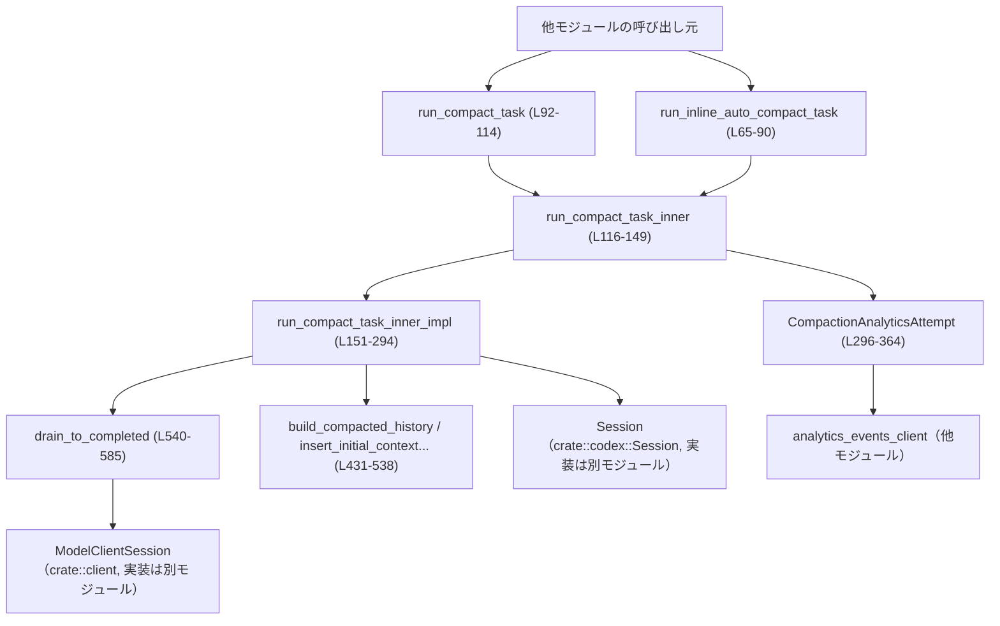
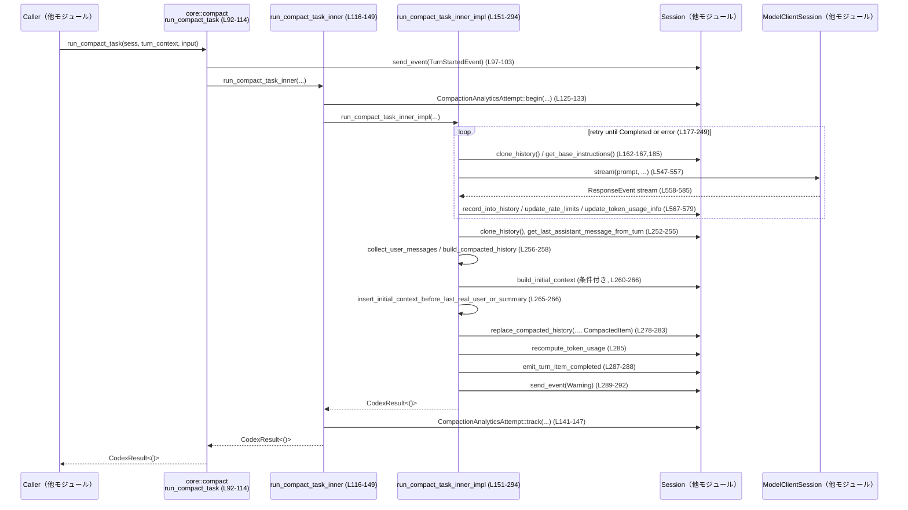

# core/src/compact.rs コード解説

---

## 0. ざっくり一言

会話スレッドの履歴がモデルのコンテキストウィンドウを超えないように、**履歴を要約・再構成（コンパクション）する非同期タスクと、その分析用ロギング**を実装したモジュールです（`run_compact_task_inner_impl` など, `core/src/compact.rs:L151-294`）。

---

## 1. このモジュールの役割

### 1.1 概要

- このモジュールは、LLM との会話スレッドが長くなったときに **履歴を要約＋一部のユーザーメッセージを残す形に圧縮**することで、コンテキストウィンドウ制限に対応します（`run_compact_task_inner_impl`, `build_compacted_history_with_limit`, `core/src/compact.rs:L151-294,485-538`）。
- 自動インライン実行（ターン途中）と手動コンパクションターンの両方をサポートし、**コンパクション前後のトークン数などを分析イベントとして送信**します（`run_inline_auto_compact_task`, `run_compact_task`, `CompactionAnalyticsAttempt`, `core/src/compact.rs:L65-114,296-364`）。
- コンパクション後の履歴に **初期コンテキストをどこに挿入するか**を細かく制御する仕組み（`InitialContextInjection`, `insert_initial_context_before_last_real_user_or_summary`, `core/src/compact.rs:L55-59,431-470`）も提供します。

### 1.2 アーキテクチャ内での位置づけ

このモジュールは「会話セッション (`Session`) とターンコンテキスト (`TurnContext`)」の上に乗り、モデルクライアント (`ModelClientSession`) 経由で LLM に要約を依頼します。その結果を元にセッション履歴を差し替え、併せて分析イベントを送出します。

主要な依存関係（このチャンク内に現れるもの）の関係を示します。



> 図はすべて `core/src/compact.rs` の本チャンクに現れる呼び出し関係を表しています。

### 1.3 設計上のポイント（コード根拠付き）

- **初期コンテキスト挿入の方針を列挙型で管理**  
  `InitialContextInjection` で「最後のユーザーメッセージの前に挿入する」か「挿入しない」かを明示的に指定します（`core/src/compact.rs:L55-59`）。インライン自動コンパクションでは呼び出し側から指定され、手動コンパクションでは `DoNotInject` が固定で使われています（`run_compact_task`, `core/src/compact.rs:L108-112`）。

- **コンパクションの実行と分析イベント送信を分離**  
  実処理は `run_compact_task_inner_impl`（`core/src/compact.rs:L151-294`）に集約し、その前後で `CompactionAnalyticsAttempt::begin` / `track` により分析イベントを送っています（`run_compact_task_inner`, `core/src/compact.rs:L116-149,296-364`）。

- **コンテキストウィンドウ超過時の再試行戦略**  
  LLM 呼び出し（`drain_to_completed`）が `ContextWindowExceeded` を返した場合、**最も古い履歴項目を 1 件ずつ削除して再試行**するロジックがあります（`history.remove_first_item()`, `core/src/compact.rs:L215-223`）。その他のエラー時は指数バックオフに似た待機時間を計算して再試行します（`backoff`, `core/src/compact.rs:L231-241`）。

- **履歴圧縮の方針**  
  `build_compacted_history_with_limit` で「トークン数上限内でできるだけ多く最新のユーザーメッセージを残し、それ以外をまとめた 1 つのサマリメッセージを末尾に追加する」という構造になっています（`core/src/compact.rs:L485-538`）。  
  トークン数の概算とテキストのトークン単位切り詰めには `approx_token_count` と `truncate_text` が利用されています（`core/src/compact.rs:L37-38,498-505`）。

- **要約メッセージの識別はプレフィックスで行う**  
  `SUMMARY_PREFIX`（テンプレートファイルの内容）＋改行をメッセージの先頭に付けて要約メッセージを作り（`summary_text`, `core/src/compact.rs:L255`）、後段で `is_summary_message` が同じプレフィックスで判別します（`core/src/compact.rs:L417-419`）。これにより、過去のコンパクション要約をユーザーメッセージとして再収集しないようになっています（`collect_user_messages`, `core/src/compact.rs:L401-415`）。

- **unsafe コードなし・すべて async/await ベース**  
  このファイル内には `unsafe` はなく、すべて安全な Rust 機能のみで実装されています。外部 I/O（モデル推論、アナリティクス送信など）はすべて async 関数・ストリームでラップされています（`run_*` / `drain_to_completed`, `core/src/compact.rs:L65-114,151-294,540-585`）。

---

## 2. 主要な機能一覧

### 2.1 機能の箇条書き

- 自動インラインコンパクションの実行（`run_inline_auto_compact_task`）：ターン中に合成プロンプトを用意してコンパクションを実行します（`core/src/compact.rs:L65-90`）。
- 手動コンパクションターンの実行（`run_compact_task`）：専用ターンとしてコンパクションを実行し、ターン開始イベントも送出します（`core/src/compact.rs:L92-114`）。
- コンパクションのコア処理（`run_compact_task_inner_impl`）：履歴の複製と切り詰め、モデル呼び出し、要約テキスト・新履歴構築、履歴差し替えまでを行います（`core/src/compact.rs:L151-294`）。
- 初期コンテキストの挿入位置制御（`InitialContextInjection`, `insert_initial_context_before_last_real_user_or_summary`）：コンパクション後の履歴に初期コンテキストを再挿入します（`core/src/compact.rs:L55-59,431-470`）。
- 圧縮済み履歴の構築（`build_compacted_history`）：ユーザーメッセージのサブセット＋要約メッセージから新しい履歴を構成します（`core/src/compact.rs:L472-538`）。
- コンテンツアイテム配列からテキスト抽出（`content_items_to_text`）：Input/Output テキストをまとめて 1 つの文字列に変換します（`core/src/compact.rs:L382-399`）。
- コンパクション分析イベントの生成と送信（`CompactionAnalyticsAttempt`）：コンパクションのトークン数増減や実行時間を記録します（`core/src/compact.rs:L296-364`）。
- モデルストリームの消費と履歴書き込み（`drain_to_completed`）：モデルからのストリームを最後まで受信し、履歴やトークン使用量を更新します（`core/src/compact.rs:L540-585`）。

### 2.2 コンポーネントインベントリー（関数・型・定数）

| 名前 | 種別 | 公開範囲 | 行番号 | 役割 / 用途 |
|------|------|----------|--------|-------------|
| `SUMMARIZATION_PROMPT` | 定数 `&'static str` | `pub` | `core/src/compact.rs:L42` | コンパクション用プロンプトテンプレートの内容（外部ファイルをインクルード）。 |
| `SUMMARY_PREFIX` | 定数 `&'static str` | `pub` | `core/src/compact.rs:L43` | 要約メッセージ先頭に付与するプレフィックス。要約判定にも使用。 |
| `COMPACT_USER_MESSAGE_MAX_TOKENS` | 定数 `usize` | `const`（モジュール内） | `core/src/compact.rs:L44` | `build_compacted_history` におけるユーザーメッセージの最大トークン数。 |
| `InitialContextInjection` | enum | `pub(crate)` | `core/src/compact.rs:L55-59` | コンパクション後の履歴に初期コンテキストを挿入するかどうか、また挿入位置を指定。 |
| `should_use_remote_compact_task` | 関数 | `pub(crate)` | `core/src/compact.rs:L61-63` | プロバイダ情報からリモートコンパクションを使うべきか判定（`provider.is_openai()`）。 |
| `run_inline_auto_compact_task` | async 関数 | `pub(crate)` | `core/src/compact.rs:L65-90` | ターン中に自動でコンパクションを実行するエントリーポイント。 |
| `run_compact_task` | async 関数 | `pub(crate)` | `core/src/compact.rs:L92-114` | 手動コンパクションターンのエントリーポイント。 |
| `run_compact_task_inner` | async 関数 | 非公開 | `core/src/compact.rs:L116-149` | 分析イベント計測付きでコンパクション処理を呼び出すラッパー。 |
| `run_compact_task_inner_impl` | async 関数 | 非公開 | `core/src/compact.rs:L151-294` | 実際のコンパクション処理本体。 |
| `CompactionAnalyticsAttempt` | 構造体 | `pub(crate)` | `core/src/compact.rs:L296-307` | コンパクション 1 回分の分析情報保持用。 |
| `CompactionAnalyticsAttempt::begin` | async 関数 | `pub(crate)` | `core/src/compact.rs:L310-332` | コンパクション開始時の情報を収集し、構造体を生成。 |
| `CompactionAnalyticsAttempt::track` | async 関数 | `pub(crate)` | `core/src/compact.rs:L334-364` | コンパクション完了時に分析イベントを送信。 |
| `compaction_status_from_result` | 関数 | `pub(crate)` | `core/src/compact.rs:L367-372` | コンパクション結果から `CompactionStatus` を導出。 |
| `now_unix_seconds` | 関数 | 非公開 | `core/src/compact.rs:L375-380` | 現在時刻の UNIX 秒を返す。 |
| `content_items_to_text` | 関数 | `pub` | `core/src/compact.rs:L382-399` | `ContentItem` の配列からテキストのみ抽出し連結。 |
| `collect_user_messages` | 関数 | `pub(crate)` | `core/src/compact.rs:L401-415` | 履歴から要約でないユーザーメッセージ本文だけを収集。 |
| `is_summary_message` | 関数 | `pub(crate)` | `core/src/compact.rs:L417-419` | 与えられたメッセージがコンパクション要約かどうか判定。 |
| `insert_initial_context_before_last_real_user_or_summary` | 関数 | `pub(crate)` | `core/src/compact.rs:L431-470` | コンパクション後履歴に初期コンテキストを挿入する位置を決定し挿入。 |
| `build_compacted_history` | 関数 | `pub(crate)` | `core/src/compact.rs:L472-483` | ユーザーメッセージ＋要約から圧縮履歴を構築する簡易ラッパー。 |
| `build_compacted_history_with_limit` | 関数 | 非公開 | `core/src/compact.rs:L485-538` | トークン数上限付きでユーザーメッセージのサブセットを選択し履歴を構成。 |
| `drain_to_completed` | async 関数 | 非公開 | `core/src/compact.rs:L540-585` | モデルのストリーム出力を最後まで処理し、履歴・トークン情報を更新。 |
| `tests` モジュール | モジュール | `cfg(test)` | `core/src/compact.rs:L588-590` | テストコードへのリンク（実体は `compact_tests.rs` にあり、このチャンクには現れません）。 |

---

## 3. 公開 API と詳細解説

### 3.1 型一覧（構造体・列挙体）

| 名前 | 種別 | 公開範囲 | 役割 / 用途 |
|------|------|----------|-------------|
| `InitialContextInjection` | 列挙体 | `pub(crate)` | コンパクション後の履歴に初期コンテキストを挿入するかどうか、および挿入位置のポリシーを表現します（`core/src/compact.rs:L55-59`）。 |
| `CompactionAnalyticsAttempt` | 構造体 | `pub(crate)` | コンパクション 1 回分の分析情報（スレッド ID, トークン数, 開始時刻など）を保持し、完了時にイベント送信に用います（`core/src/compact.rs:L296-307`）。 |

---

### 3.2 主要関数の詳細（最大 7 件）

#### 3.2.1 `run_compact_task(sess: Arc<Session>, turn_context: Arc<TurnContext>, input: Vec<UserInput>) -> CodexResult<()>`

**概要（何をするか）**

- 手動で開始される「コンパクション専用ターン」を処理するエントリーポイントです（`core/src/compact.rs:L92-114`）。
- ターン開始イベントを送信したあと、`InitialContextInjection::DoNotInject` で `run_compact_task_inner` を呼び出します。

**引数**

| 引数名 | 型 | 説明 |
|--------|----|------|
| `sess` | `Arc<Session>` | 対象会話スレッドのセッション。履歴の取得・更新やイベント送信に使用されます。 |
| `turn_context` | `Arc<TurnContext>` | このコンパクションターンに特有のコンテキスト（モデル設定・タイミング情報など）。 |
| `input` | `Vec<UserInput>` | ユーザーからの入力。`ResponseInputItem` に変換され履歴に記録されます。 |

**戻り値**

- `CodexResult<()>`  
  - 正常終了時は `Ok(())`。  
  - エラー時は `Err(CodexErr::...)`。具体的なエラー種別は内部の `run_compact_task_inner` と `run_compact_task_inner_impl` に依存します（`core/src/compact.rs:L116-149,151-294`）。

**内部処理の流れ**

1. `TurnStartedEvent` を組み立て（`turn_id`, 開始時刻, モデルのコンテキストウィンドウなど）、`EventMsg::TurnStarted` として送信します（`core/src/compact.rs:L97-103`）。
2. `run_compact_task_inner` を、`InitialContextInjection::DoNotInject` / `CompactionTrigger::Manual` / `CompactionReason::UserRequested` / `CompactionPhase::StandaloneTurn` で呼び出します（`core/src/compact.rs:L104-112`）。
3. 内部でのコンパクション処理と分析イベント送信が成功すると、結果をそのまま返します。

**使用例（crate 内部から）**

```rust
// 手動コンパクションを開始する例（擬似コード）
// 必要な型やコンテキストは、このチャンク外で定義されています。

use std::sync::Arc;
use codex_protocol::user_input::UserInput;
use crate::codex::{Session, TurnContext};
use crate::compact::run_compact_task; // 同モジュール内なので実際にはパスに応じて use

async fn manual_compact(sess: Arc<Session>, ctx: Arc<TurnContext>) -> codex_protocol::error::Result<()> {
    let input = vec![
        UserInput::Text {
            text: "Please compact this thread.".to_string(), // ユーザーの指示
            text_elements: Vec::new(),                        // UI 要素情報（ここでは空）
        }
    ];

    // コンパクション専用ターンを実行
    run_compact_task(sess, ctx, input).await
}
```

**Errors / Panics**

- 本関数自体で panic を起こすコードはありません。
- `sess.send_event` の内部や、後続の `run_compact_task_inner` 経由で LLM 呼び出しに失敗すると `Err(CodexErr::...)` が返ります（`core/src/compact.rs:L116-149,151-294`）。

**Edge cases（エッジケース）**

- `input` が空のベクタでも、そのまま `ResponseInputItem::from(input)` が呼ばれるため、呼び出し先の処理に依存します（このチャンクには詳細は現れません）。
- すでにターンが中断されている場合など、内部で `CodexErr::Interrupted` が返ると、そのままエラーとして伝播します（`core/src/compact.rs:L212-214`）。

**使用上の注意点**

- 初期コンテキストは `InitialContextInjection::DoNotInject` なので、このターン直後の通常ターンで再挿入されることを前提とした構造になっています（コメント `core/src/compact.rs:L46-54`）。
- ユーザーがコンパクションを明示的に要求したケースでのみ使われる前提の定数が埋め込まれているため、別のトリガー用途に使う場合は `run_compact_task_inner` の呼び出しパラメータを変更する必要があります。

---

#### 3.2.2 `run_inline_auto_compact_task(sess: Arc<Session>, turn_context: Arc<TurnContext>, initial_context_injection: InitialContextInjection, reason: CompactionReason, phase: CompactionPhase) -> CodexResult<()>`

**概要**

- 現在の `TurnContext` から **コンパクション用のプロンプト文字列を生成し、それを入力として自動コンパクションを実行**します（`core/src/compact.rs:L65-90`）。
- 「自動トリガー」用のコンパクションで、`CompactionTrigger::Auto` が設定されます。

**引数**

| 引数名 | 型 | 説明 |
|--------|----|------|
| `sess` | `Arc<Session>` | 対象セッション。 |
| `turn_context` | `Arc<TurnContext>` | 現在処理中のターン。`compact_prompt()` からプロンプトを生成します（`core/src/compact.rs:L72`）。 |
| `initial_context_injection` | `InitialContextInjection` | コンパクション後に初期コンテキストを挿入するかどうか、および位置。 |
| `reason` | `CompactionReason` | コンパクション実行の理由（分析イベント用）。 |
| `phase` | `CompactionPhase` | コンパクションが実行されるフェーズ（例: mid-turn など）。 |

**戻り値**

- `CodexResult<()>`：内部でのコンパクション処理が成功したかどうか（`run_compact_task_inner` 由来）。

**内部処理の流れ**

1. `turn_context.compact_prompt()` を呼び出してコンパクション用プロンプト文字列を取得し、`UserInput::Text` として包装します（`core/src/compact.rs:L72-77`）。
2. `run_compact_task_inner` に `CompactionTrigger::Auto` と、呼び出し元から渡された `initial_context_injection` / `reason` / `phase` を渡して実行します（`core/src/compact.rs:L79-87`）。
3. 結果をそのまま返します。

**使用例（crate 内部での自動コンパクション起動の一例）**

```rust
use std::sync::Arc;
use codex_analytics::{CompactionReason, CompactionPhase, CompactionTrigger};
use crate::codex::{Session, TurnContext};
use crate::compact::{run_inline_auto_compact_task, InitialContextInjection};

async fn maybe_auto_compact(sess: Arc<Session>, ctx: Arc<TurnContext>) -> codex_protocol::error::Result<()> {
    // 例えばコンテキストトークンがしきい値を超えたと判断した場合に呼び出す（判定ロジックはこのチャンクには現れません）
    run_inline_auto_compact_task(
        sess,
        ctx,
        InitialContextInjection::BeforeLastUserMessage, // mid-turn コンパクション向け
        CompactionReason::ContextWindowNearLimit,
        CompactionPhase::MidTurn,
    ).await
}
```

**Errors / Panics**

- 本関数自体に panic の可能性はありません。
- LLM 呼び出しやセッション操作に起因する `CodexErr` がそのまま返ります。

**Edge cases**

- `compact_prompt()` が空文字を返した場合でも、そのまま `UserInput::Text` に乗せてコンパクションを実行しようとします。実際にどのような応答が得られるかはモデルの挙動に依存し、このチャンクからは分かりません。

**使用上の注意点**

- コメントにある通り、mid-turn コンパクションではモデルが「コンパクションサマリが最後の履歴項目である」ことを前提として学習されているため、`initial_context_injection` に `BeforeLastUserMessage` を使う必要があります（`core/src/compact.rs:L46-54`）。  
  手動／プリターンコンパクションとは挙動を変える点に注意が必要です。

---

#### 3.2.3 `run_compact_task_inner_impl(sess: Arc<Session>, turn_context: Arc<TurnContext>, input: Vec<UserInput>, initial_context_injection: InitialContextInjection) -> CodexResult<()>`

**概要**

- コンパクション処理の中核となる関数で、以下を行います（`core/src/compact.rs:L151-294`）:
  - コンパクションターンの履歴アイテムを開始・記録。
  - LLM に要約を生成させるためのストリーミング呼び出し（`drain_to_completed`）。
  - コンテキストウィンドウ超過時の履歴トリミングと再試行。
  - 要約テキストと残すユーザーメッセージから新しい履歴を構築。
  - 初期コンテキストやゴーストスナップショットの再挿入。
  - セッション履歴の置換とトークン使用量の再計算。

**引数**

| 引数名 | 型 | 説明 |
|--------|----|------|
| `sess` | `Arc<Session>` | 対象セッション。履歴やトークン情報、イベント送信に使用。 |
| `turn_context` | `Arc<TurnContext>` | コンパクションターンのコンテキスト。モデル情報やトランケーションポリシーを含む。 |
| `input` | `Vec<UserInput>` | コンパクションターンへのユーザー入力。 |
| `initial_context_injection` | `InitialContextInjection` | コンパクション後の履歴に初期コンテキストを挿入するかどうか。 |

**戻り値**

- `CodexResult<()>`：コンパクション成功時は `Ok(())`。  
  エラー内容は `CodexErr` として返されます（`core/src/compact.rs:L199-247`）。

**内部処理の流れ（要約）**

1. **コンパクションアイテム開始**  
   `TurnItem::ContextCompaction` を作り、`sess.emit_turn_item_started` で開始を記録します（`core/src/compact.rs:L157-159`）。

2. **入力を履歴に追加**  
   `input` を `ResponseInputItem` に変換し、ローカルの履歴クローン（`history`）に記録します（`core/src/compact.rs:L160-166`）。

3. **ストリーム再試行ループ**（`loop { ... }`, `core/src/compact.rs:L177-249`）  
   - `history.clone().for_prompt(...)` でプロンプト用の履歴を生成（`core/src/compact.rs:L179-182`）。
   - `Prompt` 構造体を組み立て（`core/src/compact.rs:L183-188`）、`drain_to_completed` でモデルに要約を依頼します（`core/src/compact.rs:L190-197`）。
   - 結果に応じて:
     - `Ok(())`: トリミング済み件数があれば通知イベントを送り（`notify_background_event`, `core/src/compact.rs:L201-208`）、ループを抜ける。
     - `Err(CodexErr::Interrupted)`: 即座にエラーとして返す（`core/src/compact.rs:L212-214`）。
     - `Err(CodexErr::ContextWindowExceeded)`:  
       - プロンプト項目数が 1 より大きければ、最古の履歴アイテムを削除し（`history.remove_first_item()`, `core/src/compact.rs:L216-223`）、再試行。
       - それ以外の場合はコンテキストフル状態をセッションに記録し、エラーイベントを送信してエラーを返す（`core/src/compact.rs:L226-229`）。
     - その他のエラー: `retries < max_retries` の間はバックオフを挟んで再試行し、それでも失敗したらエラーイベントを送信してエラーを返す（`core/src/compact.rs:L231-247`）。

4. **履歴スナップショットと要約構築**  
   - セッションから最新の履歴スナップショットを取得し（`sess.clone_history()`, `core/src/compact.rs:L252-253`）、`get_last_assistant_message_from_turn` で最後のアシスタントメッセージ本文を取得（`core/src/compact.rs:L254`）。
   - `SUMMARY_PREFIX` を先頭に付けて `summary_text` を構築（`core/src/compact.rs:L255`）。
   - `collect_user_messages` で要約でないユーザーメッセージ本文のみを抽出（`core/src/compact.rs:L256`）。

5. **新しい履歴の構築**  
   - 初期コンテキスト空 (`Vec::new()`) とユーザーメッセージ、`summary_text` を渡して `build_compacted_history` を呼び新履歴を構築（`core/src/compact.rs:L258`）。
   - `InitialContextInjection::BeforeLastUserMessage` の場合は、`sess.build_initial_context(...)` の結果を `insert_initial_context_before_last_real_user_or_summary` で適切な位置に挿入（`core/src/compact.rs:L260-267`）。
   - 元の履歴から `ResponseItem::GhostSnapshot` を抽出して、新履歴末尾に追加（`core/src/compact.rs:L268-273`）。

6. **履歴の差し替えとメタ情報更新**  
   - `reference_context_item` を `initial_context_injection` に応じて `Some`/`None` に設定（`core/src/compact.rs:L274-277`）。
   - `CompactedItem` 構造体を作成し（`core/src/compact.rs:L278-281`）、`sess.replace_compacted_history` を呼んで履歴を差し替え（実装は別モジュール）、トークン使用量を再計算します（`core/src/compact.rs:L282-286`）。
   - モデルクライアントの WebSocket セッションをリセット（`client_session.reset_websocket_session()`, `core/src/compact.rs:L284`）。

7. **完了イベントと警告送信**  
   - `sess.emit_turn_item_completed` でコンパクションアイテム完了を記録（`core/src/compact.rs:L287-288`）。
   - 長いスレッドや繰り返しコンパクションによる精度低下の可能性について、ユーザー向け Warning イベントを送信（`core/src/compact.rs:L289-292`）。

**Errors / Panics**

- panic:
  - 明示的な `panic!` 呼び出しはありません。
- エラー:
  - モデルストリームが `CodexErr::Interrupted` → 中断としてそのまま返却（`core/src/compact.rs:L212-214`）。
  - `CodexErr::ContextWindowExceeded`:
    - `turn_input_len > 1` の場合は履歴先頭を削除して再試行。
    - それ以外の場合は `sess.set_total_tokens_full(...)` でコンテキストフル状態を記録し、エラーイベント送信後にエラーとして返す（`core/src/compact.rs:L215-230`）。
  - その他の `CodexErr` は最大リトライ回数 (`max_retries`) を超えた時点でエラーイベント送信後に返却（`core/src/compact.rs:L231-247`）。

**Edge cases**

- **履歴が 1 項目しかない状態でコンテキスト超過**  
  `turn_input_len <= 1` の場合は履歴の削除による回避は行わず、そのままエラーとして扱われます（`core/src/compact.rs:L215-227`）。
- **要約テキストが空になる場合**  
  `get_last_assistant_message_from_turn` が `None` を返すと `summary_suffix` は空文字で、`summary_text` には `SUMMARY_PREFIX` のみ＋改行が入ります（`core/src/compact.rs:L254-255`）。  
  ただし後段の `build_compacted_history_with_limit` で summary_text が空かどうかを再チェックし `(no summary available)` を補うのは別関数の責務です（`core/src/compact.rs:L523-527`）。

**使用上の注意点**

- この関数はセッションの履歴全体を**別の構造に差し替える**ため、同じ `Session` に対する他の並行処理がある場合の整合性は、`Session` 側の実装に依存します（このチャンクには `Session` の実装は現れません）。
- ゴーストスナップショット (`ResponseItem::GhostSnapshot`) はコンパクション後も保持される設計になっており（`core/src/compact.rs:L268-273`）、履歴解析などで利用されている可能性があります。削除したい場合は、この処理との整合性を確認する必要があります。

---

#### 3.2.4 `build_compacted_history(initial_context: Vec<ResponseItem>, user_messages: &[String], summary_text: &str) -> Vec<ResponseItem>`

**概要**

- 初期コンテキスト・ユーザーメッセージ文字列・要約テキストから **コンパクション後の履歴を構成するためのヘルパー関数**です（`core/src/compact.rs:L472-483`）。
- 内部で `COMPACT_USER_MESSAGE_MAX_TOKENS` を上限とする `build_compacted_history_with_limit` を呼びます。

**引数**

| 引数名 | 型 | 説明 |
|--------|----|------|
| `initial_context` | `Vec<ResponseItem>` | 先頭に置きたい初期コンテキスト。 |
| `user_messages` | `&[String]` | 残したいユーザーメッセージ本文一覧。 |
| `summary_text` | `&str` | 要約メッセージ本文。 |

**戻り値**

- `Vec<ResponseItem>`：初期コンテキスト＋選ばれたユーザーメッセージ＋サマリーメッセージで構成された履歴。

**内部処理の流れ**

1. そのまま `build_compacted_history_with_limit(initial_context, user_messages, summary_text, COMPACT_USER_MESSAGE_MAX_TOKENS)` を呼び出します（`core/src/compact.rs:L477-482`）。

**Edge cases**

- `summary_text` が空文字列の場合、実際の要約メッセージ内容は `build_compacted_history_with_limit` 側で `(no summary available)` に置き換えられます（`core/src/compact.rs:L523-527`）。
- `initial_context` に要約メッセージやユーザーメッセージが混在していても、この関数はそのまま引き継ぎます。適切な内容かどうかは呼び出し元で保証する必要があります。

**使用上の注意点**

- トークン数上限はハードコードで `20_000` トークンに固定されており（`COMPACT_USER_MESSAGE_MAX_TOKENS`, `core/src/compact.rs:L44,481`）、モデルのコンテキストウィンドウと完全には一致しない可能性があります。  
  より厳密に制御したい場合は、`build_compacted_history_with_limit` を直接呼び出して `max_tokens` を調整する必要があります。

---

#### 3.2.5 `insert_initial_context_before_last_real_user_or_summary(compacted_history: Vec<ResponseItem>, initial_context: Vec<ResponseItem>) -> Vec<ResponseItem>`

**概要**

- すでにコンパクション済みの履歴（ユーザーメッセージ＋要約など）に対して、**初期コンテキストをモデルが期待する位置に挿入**する関数です（`core/src/compact.rs:L431-470`）。
- コメントにあるルールに従い、「最後の実ユーザーメッセージの直前」や「要約メッセージの直前」を優先的な挿入位置とします（`core/src/compact.rs:L421-430`）。

**引数**

| 引数名 | 型 | 説明 |
|--------|----|------|
| `compacted_history` | `Vec<ResponseItem>` | 既にコンパクション済みの履歴。要約メッセージなどを含む。 |
| `initial_context` | `Vec<ResponseItem>` | 再挿入する初期コンテキストのレスポンスアイテム群。 |

**戻り値**

- `Vec<ResponseItem>`：`initial_context` が適切な位置に挿入された履歴。

**内部処理の流れ**

1. 末尾から前方に向かって `compacted_history` を走査し、`crate::event_mapping::parse_turn_item` で `TurnItem::UserMessage` に変換できる項目だけを見ます（`core/src/compact.rs:L437-440`）。
2. 最初に見つかったユーザーメッセージ的な項目のインデックスを `last_user_or_summary_index` に保存し（`core/src/compact.rs:L441-445`）、かつ `is_summary_message` 判定で「要約ではない」メッセージを見つけた場合はそのインデックスを `last_real_user_index` として記録してループを抜けます（`core/src/compact.rs:L445-448`）。
3. 別途、末尾から `ResponseItem::Compaction` を探し、最後のコンパクション項目のインデックスを `last_compaction_index` に求めます（`core/src/compact.rs:L450-454`）。
4. 挿入位置は `last_real_user_index` → `last_user_or_summary_index` → `last_compaction_index` の優先順位で決定し（`core/src/compact.rs:L455-457`）、見つからない場合は末尾に挿入します（`core/src/compact.rs:L463-467`）。
5. `Vec::splice` を使って `initial_context` を指定インデックスに挿入、または末尾に `extend` します（`core/src/compact.rs:L463-467`）。

**Edge cases**

- **ユーザーメッセージもコンパクション項目もない場合**  
  `insertion_index` は `None` となり、`initial_context` は履歴末尾に追加されます（`core/src/compact.rs:L455-457,465-467`）。
- **要約メッセージのみ存在する場合**  
  `is_summary_message` がすべて `true` で、`last_real_user_index` は `None` のままですが、`last_user_or_summary_index` は最後の要約メッセージ位置となり、その直前に挿入されます。コメントにある「要約が最後に来る」条件を満たします（`core/src/compact.rs:L421-430,441-447`）。
- **コンパクション項目しかない場合**  
  `last_user_or_summary_index` は `None` だが `last_compaction_index` は `Some` となり、その直前に挿入されます（`core/src/compact.rs:L450-457`）。

**使用上の注意点**

- 初期コンテキストに要約メッセージが含まれていると、モデルが期待する「最後の要約メッセージが履歴末尾にある」という前提を崩す可能性があります。`initial_context` の内容は呼び出し元で制御する必要があります。
- `crate::event_mapping::parse_turn_item` の挙動（特に UserMessage 判定）はこのチャンクには現れておらず、その仕様に依存する点に注意が必要です。

---

#### 3.2.6 `drain_to_completed(sess: &Session, turn_context: &TurnContext, client_session: &mut ModelClientSession, turn_metadata_header: Option<&str>, prompt: &Prompt) -> CodexResult<()>`

**概要**

- モデルクライアントセッションからのストリームを **`response.completed` イベントまで読み尽くし、途中のイベントに応じてセッションの履歴・トークン情報・レートリミット情報などを更新する**関数です（`core/src/compact.rs:L540-585`）。

**引数**

| 引数名 | 型 | 説明 |
|--------|----|------|
| `sess` | `&Session` | セッション。履歴・トークン使用状況の更新などに利用。 |
| `turn_context` | `&TurnContext` | モデル情報やセッショントラッキング情報を含むターンコンテキスト。 |
| `client_session` | `&mut ModelClientSession` | モデルへのストリーミング要求を扱うセッションオブジェクト。 |
| `turn_metadata_header` | `Option<&str>` | ターンメタデータを含むヘッダ値。`None` の場合はヘッダなし。 |
| `prompt` | `&Prompt` | モデルに投げるプロンプト（履歴＋ベース指示＋パーソナリティ）。 |

**戻り値**

- `CodexResult<()>`：ストリームが正常に `ResponseEvent::Completed` まで進めば `Ok(())`。  
  それ以前にストリームが終了したり、エラーイベントが返った場合は `Err(CodexErr::...)`。

**内部処理の流れ**

1. `client_session.stream(...)` に `prompt` と各種メタ情報を渡してストリームを開始（`core/src/compact.rs:L547-557`）。
2. `loop` で `stream.next().await` を繰り返し、イベントを 1 件ずつ処理（`core/src/compact.rs:L558-585`）。
3. `None` が返ってきた場合（ストリーム終了）は、`CodexErr::Stream("stream closed before response.completed", None)` を返す（`core/src/compact.rs:L560-565`）。
4. イベントの種類ごとに処理:
   - `OutputItemDone(item)`: `sess.record_into_history` で履歴に記録（`core/src/compact.rs:L567-569`）。
   - `ServerReasoningIncluded(included)`: `sess.set_server_reasoning_included(included)`（`core/src/compact.rs:L571-573`）。
   - `RateLimits(snapshot)`: `sess.update_rate_limits(turn_context, snapshot)`（`core/src/compact.rs:L574-576`）。
   - `Completed { token_usage, .. }`: `sess.update_token_usage_info(turn_context, token_usage.as_ref())` を呼び、`Ok(())` を返す（`core/src/compact.rs:L577-580`）。
   - その他の `Ok(_)`: 何もせず次のイベントを待つ（`core/src/compact.rs:L581-582`）。
   - `Err(e)`: 即座に `Err(e)` を返す（`core/src/compact.rs:L583-584`）。

**Errors / Panics**

- `client_session.stream` が `Err(CodexErr::...)` を返す場合、そのエラーがそのまま呼び出し元に伝播します（`core/src/compact.rs:L547-557`）。
- ストリームが `Completed` を返す前に閉じられた場合は、独自に `CodexErr::Stream(...)` を生成します（`core/src/compact.rs:L561-565`）。
- panic を引き起こすコードはこの関数内にはありません。

**Edge cases**

- `OutputItemDone` が 1 回も来ないまま `Completed` だけが来る場合でも、`Completed` 処理は正常に行われます（履歴が増えないだけ）。
- `RateLimits` や `ServerReasoningIncluded` が複数回送られてくる場合、最後に受け取った値で上書きされると推測されますが、具体的な挙動は `Session` の実装依存です（このチャンクには実装は現れません）。

**使用上の注意点**

- イベントの順序保証や再送などの詳細は `ModelClientSession::stream` とモデル側の仕様に依存します。この関数は「Completed が来るまで読み続ける」という前提で実装されています。
- 呼び出し側 (`run_compact_task_inner_impl` など) は、この関数のエラーを見て再試行戦略を決定しています（`core/src/compact.rs:L199-249`）。

---

#### 3.2.7 `content_items_to_text(content: &[ContentItem]) -> Option<String>`

**概要**

- モデルの入出力コンテンツ（`ContentItem`）の配列から、**テキスト部分だけを抜き出して改行区切りで結合**するユーティリティ関数です（`core/src/compact.rs:L382-399`）。
- このファイルで唯一の `pub` 関数であり、外部モジュールからも利用可能です。

**引数**

| 引数名 | 型 | 説明 |
|--------|----|------|
| `content` | `&[ContentItem]` | 入力・出力テキストや画像を表すコンテンツアイテムのスライス。 |

**戻り値**

- `Option<String>`：
  - テキストコンテンツが 1 つ以上あれば、そのテキストを改行区切りで結合した `Some(String)`。
  - 1 つもテキストがなければ `None`（`core/src/compact.rs:L394-398`）。

**内部処理の流れ**

1. 空のベクタ `pieces` を用意（`core/src/compact.rs:L383`）。
2. `content` をループし、各 `ContentItem` をパターンマッチ:
   - `ContentItem::InputText { text }` または `OutputText { text }` で、かつ `text` が空文字でない場合に `pieces` に `&str` として追加（`core/src/compact.rs:L385-390`）。
   - `ContentItem::InputImage { .. }` の場合は無視（`core/src/compact.rs:L391`）。
3. `pieces` が空なら `None`、そうでなければ `pieces.join("\n")` で改行区切りの文字列を作成し `Some(...)` を返す（`core/src/compact.rs:L394-398`）。

**使用例**

```rust
use codex_protocol::models::ContentItem;
use crate::compact::content_items_to_text;

fn example() {
    let content = vec![
        ContentItem::InputText { text: "User question".to_string() },   // 入力テキスト
        ContentItem::OutputText { text: "Assistant answer".to_string() }, // 出力テキスト
        ContentItem::InputImage { /* フィールドはこのチャンクには現れません */ },
    ];

    // テキスト部分だけをまとめて取得
    if let Some(text) = content_items_to_text(&content) {
        // text == "User question\nAssistant answer"
        println!("{}", text);
    } else {
        // テキストが 1 つも無い場合
        println!("No text content.");
    }
}
```

**Errors / Panics**

- この関数は I/O を行わず、`panic!` を呼び出す箇所もありません。
- 可変なグローバル状態にもアクセスしないため、スレッドセーフに呼び出せます。

**Edge cases**

- すべての `ContentItem` が `InputImage` など非テキストの場合 → `None` を返します（`core/src/compact.rs:L391,394-398`）。
- テキストが空文字列（`""`）の場合 → その項目は無視されます（`!text.is_empty()` 条件, `core/src/compact.rs:L386-388`）。
- 複数行テキストが含まれる場合でも、そのままの文字列が格納され、アイテム間は 1 行の改行で区切られます。

**使用上の注意点**

- テキストの結合に改行 (`"\n"`) が使われているため、既に改行を含んだテキストを渡すと 2 重の改行が現れる可能性があります。表示用途に応じて適宜処理する必要があります。

---

### 3.3 その他の関数（一覧）

| 関数名 | 行番号 | 役割（1 行） |
|--------|--------|--------------|
| `should_use_remote_compact_task` | `core/src/compact.rs:L61-63` | モデルプロバイダが OpenAI かどうかでリモートコンパクションを使うべきか判定。 |
| `run_compact_task_inner` | `core/src/compact.rs:L116-149` | 分析計測 (`CompactionAnalyticsAttempt`) とコンパクション本体 (`run_compact_task_inner_impl`) をまとめるラッパー。 |
| `CompactionAnalyticsAttempt::begin` | `core/src/compact.rs:L310-332` | コンパクション開始時に有効フラグやトークン数、開始時刻を記録。 |
| `CompactionAnalyticsAttempt::track` | `core/src/compact.rs:L334-364` | コンパクションの成否・所要時間・トークン増減を `analytics_events_client` に送信。 |
| `compaction_status_from_result` | `core/src/compact.rs:L367-372` | `Result` から `Completed` / `Interrupted` / `Failed` を切り分ける。 |
| `now_unix_seconds` | `core/src/compact.rs:L375-380` | 現在時刻の UNIX 秒を取得し、エラー時は `0` を返す。 |
| `collect_user_messages` | `core/src/compact.rs:L401-415` | 履歴から要約でないユーザーメッセージ本文だけを抽出するフィルタ。 |
| `is_summary_message` | `core/src/compact.rs:L417-419` | メッセージが `SUMMARY_PREFIX + "\n"` 始まりかどうかで要約判定。 |
| `build_compacted_history_with_limit` | `core/src/compact.rs:L485-538` | ユーザーメッセージをトークン数上限まで逆順で収集し直して履歴を構築する詳細実装。 |

---

## 4. データフロー

ここでは、**手動コンパクションターン**が実行される代表的なシナリオを取り上げます。

1. 他モジュールが `run_compact_task` を呼び出し、コンパクションターンを開始します（`core/src/compact.rs:L92-114`）。
2. `run_compact_task` が `run_compact_task_inner` を通じて `run_compact_task_inner_impl` を呼びます（`core/src/compact.rs:L104-112,116-149`）。
3. `run_compact_task_inner_impl` が:
   - ローカル履歴クローンを作成しプロンプトを構成。
   - `drain_to_completed` でモデルに要約を生成させ、ストリーム出力をセッション履歴に記録します（`core/src/compact.rs:L162-167,183-188,190-197,540-585`）。
   - 要約テキストとユーザーメッセージから新履歴を構築し、セッション履歴を置き換えます（`core/src/compact.rs:L252-283`）。

この流れを Sequence Diagram で示します（関数名に行番号を付記しています）。



---

## 5. 使い方（How to Use）

このモジュールの関数は基本的に **crate 内部の orchestration 層から呼び出される想定**であり、アプリケーションコードから直接呼ぶのは `content_items_to_text` 程度と考えられます（ただし、これは推測であり、実際の利用箇所はこのチャンクには現れません）。

### 5.1 基本的な使用方法

#### 5.1.1 手動コンパクションターンの起動

```rust
use std::sync::Arc;
use codex_protocol::user_input::UserInput;
use codex_protocol::error::Result as CodexResult;
use crate::codex::{Session, TurnContext};
use crate::compact::run_compact_task; // 実際のパスは crate 構成に依存

// セッションとターンコンテキストは別モジュールで構築される（このチャンクには現れません）
async fn trigger_manual_compaction(sess: Arc<Session>, ctx: Arc<TurnContext>) -> CodexResult<()> {
    // ユーザーが明示的にコンパクションを要求した入力
    let user_input = UserInput::Text {
        text: "Compact this conversation".to_string(),
        text_elements: Vec::new(),
    };

    // コンパクションターンを実行
    run_compact_task(sess, ctx, vec![user_input]).await
}
```

#### 5.1.2 インライン自動コンパクション

```rust
use std::sync::Arc;
use codex_analytics::{CompactionReason, CompactionPhase};
use crate::codex::{Session, TurnContext};
use crate::compact::{run_inline_auto_compact_task, InitialContextInjection};

async fn maybe_inline_compact(sess: Arc<Session>, ctx: Arc<TurnContext>) -> codex_protocol::error::Result<()> {
    // 何らかの条件（コンテキストトークン数など）を満たした場合のみ実行する
    // 条件判定ロジックはこのチャンクには現れません。
    run_inline_auto_compact_task(
        sess,
        ctx,
        InitialContextInjection::BeforeLastUserMessage, // mid-turn 用
        CompactionReason::ContextWindowNearLimit,
        CompactionPhase::MidTurn,
    ).await
}
```

#### 5.1.3 テキスト抽出ユーティリティの利用

```rust
use codex_protocol::models::ContentItem;
use crate::compact::content_items_to_text;

fn summarize_content_items(items: &[ContentItem]) -> String {
    match content_items_to_text(items) {
        Some(text) => text,
        None => "(no text content)".to_string(),
    }
}
```

### 5.2 よくある使用パターン

- **mid-turn コンパクション**  
  - `run_inline_auto_compact_task` を `InitialContextInjection::BeforeLastUserMessage` で呼び出します（`core/src/compact.rs:L65-71,260-267`）。
  - これにより、コンパクションサマリが「最後の履歴項目」としてモデルに見えるように履歴が構成されます。

- **プリターン／手動コンパクション**  
  - `run_compact_task` を使い、`InitialContextInjection::DoNotInject` で履歴をサマリ＋ユーザーメッセージに置き換えます（`core/src/compact.rs:L92-114,274-276`）。
  - 初期コンテキストは次の通常ターンで再注入される想定です（コメント `core/src/compact.rs:L46-54`）。

### 5.3 よくある間違いと正しい使い方

```rust
use crate::compact::{run_inline_auto_compact_task, InitialContextInjection};

// ❌ 間違い例: mid-turn コンパクションなのに DoNotInject を使う（コメント仕様に反する）
async fn wrong_mid_turn_compaction(sess: Arc<Session>, ctx: Arc<TurnContext>) {
    let _ = run_inline_auto_compact_task(
        sess,
        ctx,
        InitialContextInjection::DoNotInject, // モデル学習上、mid-turn では非推奨（core/src/compact.rs:L46-54）
        CompactionReason::ContextWindowNearLimit,
        CompactionPhase::MidTurn,
    ).await;
}

// ✅ 正しい例: mid-turn コンパクションでは BeforeLastUserMessage を使う
async fn correct_mid_turn_compaction(sess: Arc<Session>, ctx: Arc<TurnContext>) {
    let _ = run_inline_auto_compact_task(
        sess,
        ctx,
        InitialContextInjection::BeforeLastUserMessage,
        CompactionReason::ContextWindowNearLimit,
        CompactionPhase::MidTurn,
    ).await;
}
```

### 5.4 使用上の注意点（まとめ）

- **エラー処理と再試行**  
  - `run_compact_task_inner_impl` 内では、`ContextWindowExceeded` 時の履歴トリミングと、その他エラー時の再接続のためのバックオフが実装されています（`core/src/compact.rs:L215-247`）。  
  - 呼び出し側は、コンパクションが失敗した場合に代替戦略（例えばユーザーへの通知のみで履歴はそのままにするなど）を用意する必要があります。

- **状態の一貫性**  
  - コンパクション成功時には `sess.replace_compacted_history` によって履歴が一括で差し替えられます（`core/src/compact.rs:L282-283`）。  
  - 同じ `Session` を扱う他スレッド／タスクが同時に履歴にアクセスする場合のロックや整合性は `Session` の実装に依存し、このチャンクからは分かりません。

- **パフォーマンス**  
  - `build_compacted_history_with_limit` はトークン数概算をユーザーメッセージ数分行いますが、`user_messages.iter().rev()` として後ろから選ぶことで最新メッセージを優先しています（`core/src/compact.rs:L494-508`）。  
  - 大量の履歴に対して頻繁にコンパクションを行うと、それなりの CPU／I/O コストがかかることが想定されます。

- **要約判定ロジックの依存**  
  - 要約メッセージの判別は `SUMMARY_PREFIX + "\n"` で行っているため、プレフィックス変更時には `is_summary_message` の動作も確認する必要があります（`core/src/compact.rs:L417-419`）。

---

## 6. 変更の仕方（How to Modify）

### 6.1 新しい機能を追加する場合

**例: 別のコンパクション戦略を追加する**

1. **戦略の識別**  
   - `codex_analytics::CompactionStrategy` はこのチャンク内で `Memento` に固定されています（`core/src/compact.rs:L353`）。  
   - 新しい戦略を追加したい場合は、まず `CompactionStrategy` enum 側に新 variant を追加する必要があります（このチャンクには enum 定義は現れません）。

2. **履歴構築ロジックの拡張**  
   - 新しい戦略専用の履歴構築関数を `build_compacted_history_with_limit` の近くに追加するのが自然です（`core/src/compact.rs:L485-538`）。  
   - 既存の `build_compacted_history` は `COMPACT_USER_MESSAGE_MAX_TOKENS` に依存しているため、別戦略専用のラッパーを用意すると分かりやすくなります。

3. **分析イベントの拡張**  
   - `CompactionAnalyticsAttempt::track` で `strategy` をセットしている箇所を修正し、新しい戦略に応じて値を変えるロジックを追加します（`core/src/compact.rs:L347-353`）。

4. **エントリーポイントからの切り替え**  
   - `run_inline_auto_compact_task` / `run_compact_task` から、利用する戦略を選べるようにパラメータを追加する、または内部で条件分岐する形で呼び分けます（`core/src/compact.rs:L65-114`）。

### 6.2 既存の機能を変更する場合

変更時に確認すべきポイントを箇条書きで整理します。

- **履歴フォーマットに関する契約**
  - `build_compacted_history_with_limit` は「ユーザーメッセージ（role: "user"）＋最後にサマリーメッセージ」を生成する前提で作られています（`core/src/compact.rs:L511-535`）。  
  - 他モジュールがこの形式を前提に動いている可能性があるため、構造を変える場合は呼び出し側を調査する必要があります（このチャンクには呼び出し元全体は現れません）。

- **初期コンテキスト挿入ルール**
  - `insert_initial_context_before_last_real_user_or_summary` の挿入位置ルールは mid-turn コンパクション時のモデルの期待に合わせて設計されています（`core/src/compact.rs:L421-430`）。  
  - ルールを変える前に、モデルの挙動や学習前提との整合性を確認することが重要です。

- **エラー分類の変更**
  - `compaction_status_from_result` は `Interrupted` と `TurnAborted` を `CompactionStatus::Interrupted` としてまとめ、その他を `Failed` としています（`core/src/compact.rs:L367-372`）。  
  - これを変更すると分析イベントの集計結果も変わるため、外部ダッシュボードなどへの影響を考慮する必要があります。

- **テストの更新**
  - このファイルは `#[cfg(test)] mod tests;` で `compact_tests.rs` を参照しています（`core/src/compact.rs:L588-590`）。  
  - 挙動を変える場合は、`compact_tests.rs` 側のテスト内容も必ず確認・更新する必要があります（テストファイルの内容はこのチャンクには現れません）。

---

## 7. 関連ファイル

このモジュールと密接に関係する型・モジュールを表にまとめます。パスは `use` 文から分かる範囲のみ記載し、実際のファイルパス構成はこのチャンクには現れません。

| パス / モジュール | 役割 / 関係 |
|------------------|------------|
| `crate::codex::Session` | セッション管理、履歴の複製・置換・トークン使用量の管理、イベント送信などに利用されます（`core/src/compact.rs:L11,157-167,252-283,540-585`）。 |
| `crate::codex::TurnContext` | コンパクションターン固有の文脈（モデル情報、トランケーションポリシー、メタデータヘッダなど）を提供します（`core/src/compact.rs:L12,65-71,92-103,170-190`）。 |
| `crate::client::ModelClientSession` | モデルへのストリーミングリクエストを扱うクライアント。`drain_to_completed` で利用されています（`core/src/compact.rs:L7,172,540-557`）。 |
| `codex_analytics` | `CompactionReason` や `CompactionStatus` など、コンパクション関連の分析イベント型を提供します（`core/src/compact.rs:L15-21,296-364`）。 |
| `codex_protocol::models::{ContentItem, ResponseItem, ResponseInputItem}` | モデル入出力・履歴アイテムの構造体。履歴構築やテキスト抽出に利用されます（`core/src/compact.rs:L28-30,160-166,268-273,382-399,485-538`）。 |
| `codex_protocol::protocol::{CompactedItem, EventMsg, TurnStartedEvent, WarningEvent}` | プロトコルレベルのイベント／コンパクション結果表現。履歴差し替えや UI への通知に使用されます（`core/src/compact.rs:L31-34,97-103,227-228,244-245,278-283,289-292`）。 |
| `codex_utils_output_truncation` | トークン数概算とトークン数に基づくテキスト切り詰めロジックを提供し、履歴圧縮に利用されます（`core/src/compact.rs:L36-38,498-505`）。 |
| `crate::event_mapping::parse_turn_item` | `ResponseItem` から `TurnItem` を抽出するヘルパー関数で、ユーザーメッセージの検出に利用されます（`core/src/compact.rs:L404,438`）。 |
| `core/src/compact_tests.rs` | 本モジュールのテストコードを含むと推測されるファイル。`#[path = "compact_tests.rs"]` で参照されますが、このチャンクには内容は現れません（`core/src/compact.rs:L588-590`）。 |

このチャンクに現れる情報だけでは、`Session` や `TurnContext`、`ModelClientSession` の内部実装やスレッド安全性の詳細は分かりません。そのため、スレッド共有やロック戦略などを確認したい場合は、それぞれのモジュールの実装を参照する必要があります。
