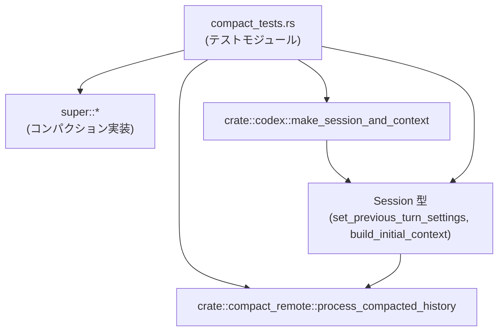
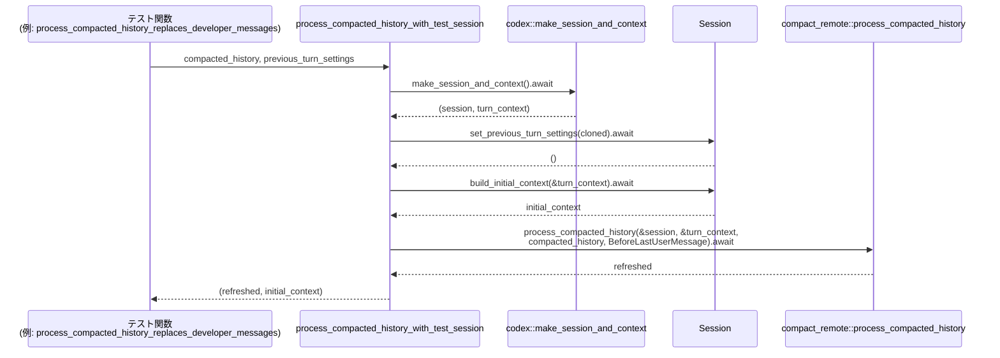

# core/src/compact_tests.rs

## 0. ざっくり一言

このファイルは、**会話履歴のコンパクション（要約・圧縮）と再展開ロジック**を検証するテスト群です。  
ユーザーメッセージの抽出・トークン制限付き履歴の構築・初期コンテキストの再注入・サマリ／コンパクション項目の扱いなどの仕様をテストを通して定義しています。

> ※行番号はチャンクに含まれていないため、根拠表記では `compact_tests.rs:L?-?` のように「不明」を示します。

---

## 1. このモジュールの役割

### 1.1 概要

このモジュールは次の問題をテストを通じて検証します。

- **[問題1]** コンテンツ列から「人間が読めるテキスト」をどのように抽出するか  
- **[問題2]** 長大なユーザー履歴を「トークン制限付きで要約＋トリミング」する振る舞い  
- **[問題3]** 既にコンパクト化された履歴から、セッションの初期コンテキスト（開発者メッセージ等）を再構築する振る舞い  
- **[問題4]** サマリメッセージや Compaction エントリを壊さずに順序・位置関係を維持する方法  

これらを通じて、`super` モジュールや `crate::compact_remote` 内のコアロジックの仕様を固定する役割を持ちます。

### 1.2 アーキテクチャ内での位置づけ

このテストモジュールは、親モジュール（`super::*`）と `crate::compact_remote` の実装に対するブラックボックステストになっています。代表的な依存関係は以下の通りです。

- 親モジュール（`super`）  
  - `content_items_to_text`
  - `collect_user_messages`
  - `build_compacted_history_with_limit`
  - `build_compacted_history`
  - `insert_initial_context_before_last_real_user_or_summary`
  - `SUMMARY_PREFIX`
- `crate::compact_remote::process_compacted_history`
- `crate::codex::make_session_and_context` とその返す `session` オブジェクト

これを簡略図にすると次のようになります。



※図はこのチャンク内のコード範囲（`compact_tests.rs` 全体）に基づきます。

### 1.3 設計上のポイント（テストから読み取れること）

- **責務の分割**
  - テキスト抽出 (`content_items_to_text`, `collect_user_messages`) と、
    履歴再構築 (`build_compacted_history*`, `insert_initial_context_before_last_real_user_or_summary`)、
    リモート処理 (`process_compacted_history`) が明確に分かれています。
- **状態管理**
  - 実セッション状態は `crate::codex::make_session_and_context()` が返す `session` に隠蔽されており、テストでは `process_compacted_history_with_test_session` を通じてそれを利用します。
- **エラーハンドリング方針（テストから見える範囲）**
  - テスト側は `match` の `else` で `panic!` を出すことで、「あるべきでない形のレスポンス」が返ってきた場合を即座に検知しています。
  - コア関数が `Result` を返すかどうかはこのチャンクからは分かりません。
- **並行性 / 非同期**
  - 履歴の再コンパクションは非同期関数 `process_compacted_history` と `tokio::test` を用いて検証されており、非同期ランタイム上で動作することが前提になっています。

---

## 2. 主要な機能一覧（コンポーネントインベントリー）

### 2.1 このファイル内の関数一覧

| 名前 | 種別 | 役割 / 用途 | 根拠 |
|------|------|-------------|------|
| `process_compacted_history_with_test_session` | 非公開 async 関数 | テスト用にセッションを立ち上げて `process_compacted_history` を呼び、(再構築された履歴, 初期コンテキスト) を返すヘルパー | `compact_tests.rs:L?-?` |
| `content_items_to_text_joins_non_empty_segments` | `#[test]` | `content_items_to_text` が空文字列を除外しつつテキストセグメントを結合することを検証 | `compact_tests.rs:L?-?` |
| `content_items_to_text_ignores_image_only_content` | `#[test]` | 画像のみのコンテンツ列からは `None` が返ることを検証 | `compact_tests.rs:L?-?` |
| `collect_user_messages_extracts_user_text_only` | `#[test]` | `collect_user_messages` が `user` 役割のテキストだけを抽出することを検証 | `compact_tests.rs:L?-?` |
| `collect_user_messages_filters_session_prefix_entries` | `#[test]` | セッションプレフィックス（AGENTS 指示・ENVIRONMENT_CONTEXT）を `collect_user_messages` が除外することを検証 | `compact_tests.rs:L?-?` |
| `build_token_limited_compacted_history_truncates_overlong_user_messages` | `#[test]` | `build_compacted_history_with_limit` が長すぎるユーザーメッセージをトークン制限に合わせてトリミングし、「tokens truncated」マーカーを付与することを検証 | `compact_tests.rs:L?-?` |
| `build_token_limited_compacted_history_appends_summary_message` | `#[test]` | `build_compacted_history` が最後に要約メッセージを追加することを検証 | `compact_tests.rs:L?-?` |
| `process_compacted_history_replaces_developer_messages` | `#[tokio::test] async` | コンパクト履歴中の古い developer メッセージが、初期コンテキスト（最新の developer メッセージ）に置き換えられることを検証 | `compact_tests.rs:L?-?` |
| `process_compacted_history_reinjects_full_initial_context` | `#[tokio::test] async` | コンパクト履歴から復元時に、フルな初期コンテキストが再注入されることを検証 | `compact_tests.rs:L?-?` |
| `process_compacted_history_drops_non_user_content_messages` | `#[tokio::test] async` | AGENTS 指示・environment_context・turn_aborted・古い developer 指示などが再構成時に削除されることを検証 | `compact_tests.rs:L?-?` |
| `process_compacted_history_inserts_context_before_last_real_user_message_only` | `#[tokio::test] async` | 初期コンテキストが「最後の実ユーザーメッセージの直前」に挿入されることを検証（サマリメッセージを挟んで） | `compact_tests.rs:L?-?` |
| `process_compacted_history_reinjects_model_switch_message` | `#[tokio::test] async` | 以前のターンの設定（モデル）が現在と異なる場合に、`<model_switch>` を含む developer メッセージが初期コンテキストに含まれることを検証 | `compact_tests.rs:L?-?` |
| `insert_initial_context_before_last_real_user_or_summary_keeps_summary_last` | `#[test]` | `insert_initial_context_before_last_real_user_or_summary` がサマリメッセージを末尾に保ちながら初期コンテキストを挿入することを検証 | `compact_tests.rs:L?-?` |
| `insert_initial_context_before_last_real_user_or_summary_keeps_compaction_last` | `#[test]` | Compaction エントリを末尾に維持しつつ初期コンテキストを挿入することを検証 | `compact_tests.rs:L?-?` |

### 2.2 このファイルから参照される主な外部コンポーネント

ここに挙げる型・関数はすべて **他ファイルで定義** されており、シグネチャはテストコードからの推測です。

| 名前 | 種別 | 概要（テストから分かる範囲） | 根拠 |
|------|------|------------------------------|------|
| `ResponseItem` | enum | 会話履歴の1要素。`Message` / `Compaction` / `Other` などのバリアントを持つ | `compact_tests.rs:L?-?` |
| `ResponseItem::Message` | バリアント | `id`, `role`, `content`, `end_turn`, `phase` を持つメッセージ | 同上 |
| `ResponseItem::Compaction` | バリアント | `encrypted_content: String` を持つコンパクション結果 | 同上 |
| `ResponseItem::Other` | バリアント | その他のレスポンス | 同上 |
| `ContentItem` | enum | メッセージ内のコンテンツ。`InputText` / `OutputText` / `InputImage` など | `compact_tests.rs:L?-?` |
| `ContentItem::InputText` | バリアント | 入力テキスト (`text: String`) | 同上 |
| `ContentItem::OutputText` | バリアント | 出力テキスト (`text: String`) | 同上 |
| `ContentItem::InputImage` | バリアント | 入力画像 (`image_url: String`) | 同上 |
| `PreviousTurnSettings` | struct | 直前ターンの設定。`model: String` と `realtime_active: Option<_>` を持つ | `compact_tests.rs:L?-?` |
| `InitialContextInjection` | enum | 初期コンテキストをどこに挿入するかを指定する設定。`BeforeLastUserMessage` が利用されている | `compact_tests.rs:L?-?` |
| `SUMMARY_PREFIX` | 定数 | サマリメッセージの先頭につくプレフィックス文字列 | `compact_tests.rs:L?-?` |
| `content_items_to_text` | 関数 | `Vec<ContentItem>` から人間向けテキストを抽出し、必要に応じて結合するユーティリティ | `compact_tests.rs:L?-?` |
| `collect_user_messages` | 関数 | `Vec<ResponseItem>` から、実ユーザーのテキストメッセージだけを抽出し `Vec<String>` にするユーティリティ | 同上 |
| `build_compacted_history_with_limit` | 関数 | 初期コンテキストとユーザー発話列から、トークン上限付きのコンパクション済み履歴を構築する | 同上 |
| `build_compacted_history` | 関数 | 上記の省略版。内部で `build_compacted_history_with_limit` を使うと推測される | 同上 |
| `insert_initial_context_before_last_real_user_or_summary` | 関数 | コンパクト履歴中の適切な位置に初期コンテキストを挿入し、サマリ／Compaction 項目を末尾に保つ | 同上 |
| `crate::codex::make_session_and_context` | async 関数 | テスト用（もしくは本番用）の `session` と `turn_context` を構築する | `compact_tests.rs:L?-?` |
| `Session`（仮名） | 型 | `set_previous_turn_settings` と `build_initial_context` を提供する型 | 同上 |
| `crate::compact_remote::process_compacted_history` | async 関数 | コンパクト履歴と初期コンテキスト設定を元に、完全な履歴を再構築する | 同上 |

---

## 3. 公開 API と詳細解説（テストから分かる仕様）

この節では、**他ファイルに定義されているコア関数の仕様を、テストから読み取れる範囲で整理**します。シグネチャは推測であり、正確な型は元コードを参照する必要があります。

### 3.1 型一覧（構造体・列挙体など）

| 名前 | 種別 | 役割 / 用途 | 備考 |
|------|------|-------------|------|
| `ResponseItem` | enum | 会話履歴の1エントリを表す | `Message`, `Compaction`, `Other` などを含む |
| `ContentItem` | enum | メッセージの内部コンテンツ | テキスト・画像など |
| `PreviousTurnSettings` | struct | 前ターンのモデル設定など | `model`, `realtime_active` フィールド |
| `InitialContextInjection` | enum | 初期コンテキスト挿入位置の指定 | `BeforeLastUserMessage` が使用される |

---

### 3.2 関数詳細（テストから読み取れる主要 API）

#### `content_items_to_text(items: &[ContentItem]) -> Option<String>`（推測）

**概要**

- `ContentItem` の列からテキスト部分を抽出し、空文字列を除外した上で改行区切りで結合する関数です。  
- テキストコンテンツが一つもない場合は `None` を返す動作がテストされています。

**引数（推測）**

| 引数名 | 型 | 説明 |
|--------|----|------|
| `items` | `&[ContentItem]` もしくは `&Vec<ContentItem>` | メッセージ内のコンテンツ列 |

**戻り値**

- `Option<String>`（推測）  
  - テキストが1つ以上あれば、それらを結合した `Some(String)`。  
  - テキストが全くない場合（画像のみなど）は `None`。

**内部処理の流れ（テストからの推測）**

1. `items` を先頭から順に走査する。
2. `InputText` / `OutputText` バリアントから `text` を取り出す。
3. 空文字列の要素はスキップする（`"hello"` と `""` と `"world"` → `"hello\nworld"`）。  
   - 根拠: `content_items_to_text_joins_non_empty_segments` テストで空文字列が無視されている。`compact_tests.rs:L?-?`
4. 対象になりうるテキストが1つもなければ `None` を返す。  
   - 根拠: 画像のみ (`InputImage`) の場合に `None` が期待されている。`compact_tests.rs:L?-?`
5. 1つ以上あれば、改行 `\n` で結合した文字列を `Some` で返す。

**Examples（使用例）**

テストからの抜粋です。

```rust
// テキストと空文字とテキストの組み合わせ
let items = vec![
    ContentItem::InputText { text: "hello".to_string() },
    ContentItem::OutputText { text: String::new() },
    ContentItem::OutputText { text: "world".to_string() },
];

let joined = content_items_to_text(&items);

assert_eq!(Some("hello\nworld".to_string()), joined);
```

```rust
// 画像のみのコンテンツ
let items = vec![
    ContentItem::InputImage { image_url: "file://image.png".to_string() }
];

let joined = content_items_to_text(&items);

assert_eq!(None, joined);
```

**Errors / Panics**

- テストコード上では `content_items_to_text` 自体がエラーを返すケースは扱われていません。
- `unwrap_or_default()` を多用していることから、**`None` は正常系** として扱われています。

**Edge cases（エッジケース）**

- コンテンツが空配列の場合の挙動はテストされていません（`None` を返すと推測できますが、コードからは確認できません）。
- 画像とテキストが混在するケース（例: 画像＋テキスト）はこのチャンクには現れず、連結順その他の挙動は不明です。

**使用上の注意点**

- `None` が返りうることを前提に、呼び出し側では `Option` を必ず処理する必要があります。
- 空文字列 `"".to_string()` は無視されるため、「空行も含めて忠実に再現したい」という用途には適しません。

---

#### `collect_user_messages(items: &[ResponseItem]) -> Vec<String>`（推測）

**概要**

- 会話履歴 `ResponseItem` の列から、「実際のユーザー発話テキスト」だけを抽出する関数です。
- 役割が `user` でないメッセージや、セッションプレフィックス的なメッセージを除外することがテストされています。

**引数（推測）**

| 引数名 | 型 | 説明 |
|--------|----|------|
| `items` | `&[ResponseItem]` | すべてのレスポンス項目（ユーザー・アシスタントなど） |

**戻り値**

- `Vec<String>`（推測）  
  - フィルター後のユーザーメッセージテキストの一覧。

**内部処理の流れ（テストからの推測）**

1. `items` を順に走査する。
2. `ResponseItem::Message { role, content, .. }` かつ `role == "user"` のものだけを対象にする。  
   - 根拠: `assistant` ロールや `Other` バリアントは無視されている。`compact_tests.rs:L?-?`
3. その `content` に対して `content_items_to_text` 相当の処理を行い、テキストを1本の `String` にする。
4. さらに、「セッションプレフィックス」に相当するユーザーテキストを除外する。少なくとも以下は除外対象です。  
   - `# AGENTS.md instructions ... <INSTRUCTIONS> ... </INSTRUCTIONS>`
   - `<ENVIRONMENT_CONTEXT>...`（タグ名は大小文字のバリエーションはこのテストからは不明）
   - 根拠: `collect_user_messages_filters_session_prefix_entries` テスト。`compact_tests.rs:L?-?`
5. 残ったテキストだけを `Vec<String>` として返す。

**Examples（使用例）**

```rust
let items = vec![
    // assistant メッセージは無視される
    ResponseItem::Message {
        id: Some("assistant".to_string()),
        role: "assistant".to_string(),
        content: vec![ContentItem::OutputText { text: "ignored".to_string() }],
        end_turn: None,
        phase: None,
    },
    // user メッセージは採用される
    ResponseItem::Message {
        id: Some("user".to_string()),
        role: "user".to_string(),
        content: vec![ContentItem::InputText { text: "first".to_string() }],
        end_turn: None,
        phase: None,
    },
    ResponseItem::Other,
];

let collected = collect_user_messages(&items);

assert_eq!(vec!["first".to_string()], collected);
```

```rust
// セッションプレフィックスが除外される例
let items = vec![
    // AGENTS.md instructions
    ResponseItem::Message { /* ... text: "# AGENTS.md instructions ..." */ },
    // ENVIRONMENT_CONTEXT
    ResponseItem::Message { /* ... text: "<ENVIRONMENT_CONTEXT>cwd=/tmp</ENVIRONMENT_CONTEXT>" */ },
    // 実際のユーザー発話
    ResponseItem::Message {
        id: None,
        role: "user".to_string(),
        content: vec![ContentItem::InputText {
            text: "real user message".to_string(),
        }],
        end_turn: None,
        phase: None,
    },
];

let collected = collect_user_messages(&items);

assert_eq!(vec!["real user message".to_string()], collected);
```

**Errors / Panics**

- この関数の内部でエラーや panic が起こるシナリオはテストされていません。
- 異常な `ResponseItem` 構造（例: `role == "user"` だが `content` が空）の扱いは不明です。

**Edge cases**

- 全てがセッションプレフィックスの場合 → 空の `Vec` が返ると推測されますが、このチャンクにはテストがありません。
- ユーザー以外のロール（system や developer）にユーザー的テキストが入っている場合は無視されると考えられます。

**使用上の注意点**

- **ユーザー "役割" を文字列 `"user"` で認識している**ため、ロール名の変更があった場合にはこの関数の仕様も見直しが必要になります。
- セッションプレフィックスとして検出するパターンは、テストで登場する文字列に依存している可能性があります。新しい形式のメタ情報を追加する場合は、この関数とテストの拡張が必要です。

---

#### `build_compacted_history_with_limit(initial_context: Vec<ResponseItem>, user_messages: &[String], summary: &str, max_tokens: usize) -> Vec<ResponseItem>`（推測）

**概要**

- 初期コンテキストとユーザーメッセージ列、および要約テキストを受け取り、**トークン数の上限**を守りながらコンパクトな履歴を構築する関数です。
- 長すぎるユーザーメッセージはトークン制限に合わせてトリミングされ、「tokens truncated」という文言を含む形で置き換えられます。

**引数（推測）**

| 引数名 | 型 | 説明 |
|--------|----|------|
| `initial_context` | `Vec<ResponseItem>` | もともとの developer/system などのコンテキスト。空の場合もある |
| `user_messages` | `&[String]` | ユーザーの発話テキスト列 |
| `summary` | `&str` | サマリテキスト |
| `max_tokens` | `usize` | コンパクト履歴全体に許されるトークン数の上限 |

**戻り値**

- `Vec<ResponseItem>`  
  - コンパクト化された履歴。テストから、少なくとも以下を含みます。  
    - トリミングされたユーザーメッセージ（`role == "user"`）  
    - サマリメッセージ（`role == "user"`、`content` に `summary`）

**内部処理の流れ（テストからの推測）**

1. `initial_context` をベースに履歴を構築し、`user_messages` を反映する。
2. `max_tokens` を超えるような長大なユーザーメッセージがある場合、それをトークン数が収まるようにトリミングする。
3. トリミングされたメッセージテキストには **「tokens truncated」** という文字列を含める。  
   - 根拠: `build_token_limited_compacted_history_truncates_overlong_user_messages` テスト。`compact_tests.rs:L?-?`
4. トリミング済みのユーザーメッセージとサマリメッセージを含む履歴を返す。

**Examples（使用例）**

```rust
let max_tokens = 16;
let big = "word ".repeat(200);

let history = build_compacted_history_with_limit(
    Vec::new(),                   // 初期コンテキストなし
    std::slice::from_ref(&big),   // 長大なユーザーメッセージを1件
    "SUMMARY",
    max_tokens,
);

assert_eq!(history.len(), 2);

// 先頭はトリミングされたユーザーメッセージ
let truncated_text = match &history[0] {
    ResponseItem::Message { role, content, .. } if role == "user" => {
        content_items_to_text(content).unwrap_or_default()
    }
    other => panic!("unexpected item in history: {other:?}"),
};
assert!(truncated_text.contains("tokens truncated"));
assert!(!truncated_text.contains(&big));

// 2番目はサマリメッセージ
let summary_text = match &history[1] {
    ResponseItem::Message { role, content, .. } if role == "user" => {
        content_items_to_text(content).unwrap_or_default()
    }
    other => panic!("unexpected item in history: {other:?}"),
};
assert_eq!(summary_text, "SUMMARY");
```

**Errors / Panics**

- 渡された `initial_context` や `user_messages` がどのような形でも、この関数自身が panic するかどうかは不明です。
- トークン数の計算方式（文字数ベースか、トークナイザ依存か）はこのチャンクでは分かりません。

**Edge cases**

- `user_messages` が空の場合、履歴にサマリだけを置くのか、なにも置かないのかはテストされていません。
- `initial_context` に既にサマリが含まれている場合の挙動も不明です。

**使用上の注意点**

- `max_tokens` は「サマリを含めた全履歴」に対して作用するのか、「サマリ以外」に対してのみ作用するのかはテストからは読み取れません。長大な履歴に対してどこまで削るかは、実装側のドキュメントを確認する必要があります。
- 「tokens truncated」という文言に依存した処理（例えば UI 表示）を行う場合は、この仕様が変更されたときに影響を受ける点に注意が必要です。

---

#### `build_compacted_history(initial_context: Vec<ResponseItem>, user_messages: &[String], summary: &str) -> Vec<ResponseItem>`（推測）

**概要**

- トークン上限を明示しない簡易版のコンパクション関数と考えられます。
- 少なくとも **最後に summary を表すユーザーメッセージを追加する** ことがテストで確認されています。

**引数 / 戻り値**

- `build_compacted_history_with_limit` と同様ですが、`max_tokens` 引数がない版と推測されます。

**テストから読み取れる仕様**

- 返される履歴の **末尾要素** は `role == "user"` のメッセージで、テキストは `summary` 引数と一致します。  
  - 根拠: `build_token_limited_compacted_history_appends_summary_message` テスト。`compact_tests.rs:L?-?`

**Example**

```rust
let initial_context: Vec<ResponseItem> = Vec::new();
let user_messages = vec!["first user message".to_string()];
let summary_text = "summary text";

let history = build_compacted_history(initial_context, &user_messages, summary_text);

let last = history.last().expect("history should have a summary entry");
let summary = match last {
    ResponseItem::Message { role, content, .. } if role == "user" => {
        content_items_to_text(content).unwrap_or_default()
    }
    other => panic!("expected summary message, found {other:?}"),
};
assert_eq!(summary, summary_text);
```

**使用上の注意点**

- トークン数に関する制約を持たない（もしくは内部でデフォルト値を使う）ため、**長大な履歴に対しては `build_compacted_history_with_limit` の利用が望ましい**と考えられますが、このチャンクからは断定できません。

---

#### `insert_initial_context_before_last_real_user_or_summary(compacted_history: Vec<ResponseItem>, initial_context: Vec<ResponseItem>) -> Vec<ResponseItem>`（推測）

**概要**

- 既にコンパクト化された履歴の中に、**初期コンテキスト（開発者メッセージなど）を挿入する位置を決定する関数**です。
- サマリメッセージや Compaction エントリを末尾に保ちつつ、その直前に `initial_context` を挿入する挙動がテストされています。

**引数（推測）**

| 引数名 | 型 | 説明 |
|--------|----|------|
| `compacted_history` | `Vec<ResponseItem>` | サマリや Compaction を含むコンパクト履歴 |
| `initial_context` | `Vec<ResponseItem>` | 新たに注入したい初期コンテキスト（developer メッセージなど） |

**戻り値**

- `Vec<ResponseItem>`  
  - `compacted_history` に対して `initial_context` を挿入した新しい履歴。

**テストから読み取れる挙動**

1. **サマリメッセージが末尾にある場合**  
   - サマリメッセージを末尾に保ったまま、その直前に `initial_context` を挿入する。  
   - 例：`[older_user, latest_user, summary(user)]` + `initial_context`  
     → `[older_user, initial_context..., latest_user, summary]`  
     - 根拠: `insert_initial_context_before_last_real_user_or_summary_keeps_summary_last` テスト。`compact_tests.rs:L?-?`
2. **Compaction エントリが末尾にある場合**  
   - Compaction を末尾に保ちながら、その前に `initial_context` を挿入する。  
   - 例：`[Compaction(encrypted)]` + `initial_context`  
     → `[initial_context..., Compaction(encrypted)]`  
     - 根拠: `insert_initial_context_before_last_real_user_or_summary_keeps_compaction_last` テスト。`compact_tests.rs:L?-?`

**Examples（使用例）**

```rust
let compacted_history = vec![
    ResponseItem::Message { /* user "older user" */ },
    ResponseItem::Message { /* user "latest user" */ },
    ResponseItem::Message { /* user "{SUMMARY_PREFIX}\nsummary text" */ },
];

let initial_context = vec![
    ResponseItem::Message { /* developer "fresh permissions" */ },
];

let refreshed =
    insert_initial_context_before_last_real_user_or_summary(compacted_history, initial_context);

// refreshed は [older_user, developer, latest_user, summary] になる
```

**使用上の注意点**

- 「最後の実ユーザーメッセージ」や「サマリメッセージ」をどのように判別しているか（例えば `SUMMARY_PREFIX` に依存しているか）はこのチャンクからは分かりません。
- 新しい `ResponseItem` バリアントを追加する場合、ここでの挿入ロジックも併せて見直す必要があります。

---

#### `crate::compact_remote::process_compacted_history(&Session, &TurnContext, compacted_history: Vec<ResponseItem>, injection: InitialContextInjection) -> Vec<ResponseItem>`（推測）

**概要**

- すでにコンパクト化された履歴（サマリやプレフィックス情報含む）から、**実行時に使える完全な履歴**を再構築する非同期関数です。
- 初期コンテキストの再注入・古い developer メッセージの置き換え・不要なメタ情報の削除・モデル切り替えメッセージの注入などを行うことが、テストから分かります。

**引数（推測）**

| 引数名 | 型 | 説明 |
|--------|----|------|
| `session` | `&Session` | 初期コンテキスト構築などのためのセッションオブジェクト |
| `turn_context` | `&TurnContext`（推測） | 実行中のターンに関するコンテキスト |
| `compacted_history` | `Vec<ResponseItem>` | コンパクト履歴 |
| `injection` | `InitialContextInjection` | 初期コンテキスト挿入位置指定。ここでは `BeforeLastUserMessage` が使われている |

**戻り値**

- `Vec<ResponseItem>`  
  - 再構築された履歴。テストでは常に **`initial_context + コンパクト履歴から残すべき部分`** の形になっています。

**テストから読み取れる挙動**

1. **developer メッセージの置き換え**
   - コンパクト履歴中の `role == "developer"` のメッセージは「stale（古い）」と見なされ、削除される。
   - 代わりに `session.build_initial_context(&turn_context)` で得られる最新の developer メッセージ群が先頭に追加される。  
     - 根拠: `process_compacted_history_replaces_developer_messages`。`compact_tests.rs:L?-?`
2. **フル初期コンテキストの再注入**
   - コンパクト履歴にサマリだけが含まれる場合でも、`initial_context` がまるごと前に挿入される。  
     - 根拠: `process_compacted_history_reinjects_full_initial_context`。`compact_tests.rs:L?-?`
3. **不要なメタ情報の削除**
   - 次のようなメッセージは最終履歴から削除される。  
     - `# AGENTS.md instructions ...`  
     - `<environment_context>...</environment_context>`  
     - `<turn_aborted>...</turn_aborted>`  
     - 古い developer 指示（`role == "developer"`）  
     - 根拠: `process_compacted_history_drops_non_user_content_messages`。`compact_tests.rs:L?-?`
4. **挿入位置：最後の実ユーザーメッセージの直前**
   - `InitialContextInjection::BeforeLastUserMessage` が指定された場合、初期コンテキストは「最後の実ユーザーメッセージ」の直前に挿入される。  
   - 例：`[older_user, summary(user), latest_user]` → `[older_user, summary(user), initial_context..., latest_user]`  
     - 根拠: `process_compacted_history_inserts_context_before_last_real_user_message_only`。`compact_tests.rs:L?-?`
5. **モデル切り替えメッセージ (`<model_switch>`) の注入**
   - `PreviousTurnSettings` の `model` が現在の設定と異なる場合、最初の developer メッセージに `<model_switch>` タグを含むテキストが入る。  
     - 根拠: `process_compacted_history_reinjects_model_switch_message`。`compact_tests.rs:L?-?`

**使用上の注意点（並行性 / 非同期含む）**

- この関数は `async` であり、`tokio::test` から `await` されています。  
  → 実際に利用する際も非同期ランタイム（Tokio など）上で呼び出す必要があります。
- `session` と `turn_context` は参照として渡されています。所有権やライフタイムについては元定義を確認する必要がありますが、**複数のテストで同様の呼び出しを行っていることから、再利用可能な設計**であると推測されます。

---

#### `async fn process_compacted_history_with_test_session(...) -> (Vec<ResponseItem>, Vec<ResponseItem>)`（このファイルで定義）

**概要**

- テスト専用ヘルパーです。
- セッションとターンコンテキストを生成し、必要なら `PreviousTurnSettings` をセットした上で `process_compacted_history` を呼び出し、  
  - `refreshed`（再構築された履歴）  
  - `initial_context`（`build_initial_context` の結果）  
  を返します。`compact_tests.rs:L?-?`

**引数**

| 引数名 | 型 | 説明 |
|--------|----|------|
| `compacted_history` | `Vec<ResponseItem>` | テスト対象のコンパクト履歴 |
| `previous_turn_settings` | `Option<&PreviousTurnSettings>` | モデル切り替えなどの検証用に、直前ターンの設定を渡すオプション |

**戻り値**

- `(Vec<ResponseItem>, Vec<ResponseItem>)`  
  - 第1要素: `compact_remote::process_compacted_history` の結果（再構築された履歴）  
  - 第2要素: `session.build_initial_context(&turn_context)` の結果（初期コンテキスト）

**内部処理の流れ**

1. `crate::codex::make_session_and_context().await` を呼び、`(session, turn_context)` を取得。
2. `session.set_previous_turn_settings(previous_turn_settings.cloned()).await`  
   - `previous_turn_settings` が `Some` ならクローンしてセッションに設定。
3. `let initial_context = session.build_initial_context(&turn_context).await;`
4. `let refreshed = crate::compact_remote::process_compacted_history(&session, &turn_context, compacted_history, InitialContextInjection::BeforeLastUserMessage).await;`
5. `(refreshed, initial_context)` を返す。

**使用上の注意点**

- あくまで **テスト用のユーティリティ** であり、本番コードから直接呼ばれることは想定されていないと考えられます。
- 非同期関数なので、`#[tokio::test]` などの非同期テスト環境から `await` する必要があります。

---

### 3.3 その他の関数（テスト関数）

上記で詳細説明したコア API を利用するテスト関数群です。それぞれの役割は 2.1 の表に整理済みですので、ここでは列挙にとどめます。

- `content_items_to_text_joins_non_empty_segments`
- `content_items_to_text_ignores_image_only_content`
- `collect_user_messages_extracts_user_text_only`
- `collect_user_messages_filters_session_prefix_entries`
- `build_token_limited_compacted_history_truncates_overlong_user_messages`
- `build_token_limited_compacted_history_appends_summary_message`
- `process_compacted_history_replaces_developer_messages`
- `process_compacted_history_reinjects_full_initial_context`
- `process_compacted_history_drops_non_user_content_messages`
- `process_compacted_history_inserts_context_before_last_real_user_message_only`
- `process_compacted_history_reinjects_model_switch_message`
- `insert_initial_context_before_last_real_user_or_summary_keeps_summary_last`
- `insert_initial_context_before_last_real_user_or_summary_keeps_compaction_last`

---

## 4. データフロー

### 4.1 `process_compacted_history_with_test_session` を通じた再構築フロー

このフローは、**コンパクト履歴 → 初期コンテキスト再注入 → 完全履歴** への変換プロセスを表します。



この図から分かる要点:

- 初期コンテキストは `Session` から都度構築され、`compacted_history` とは独立して管理されています。
- `process_compacted_history` は純粋に「`compacted_history` と `initial_context` の合成ロジック」を担う設計になっていると解釈できます。
- モデル切り替え情報などは `Session::set_previous_turn_settings` でセッション内部にセットされた上で、`build_initial_context` に反映されます。

---

## 5. 使い方（How to Use）

ここでは、テストコードをもとにした**代表的な利用パターン**を示します。

### 5.1 コンパクト履歴の構築とサマリ付与

```rust
// 初期コンテキスト（例: developer メッセージなど）は空とする
let initial_context: Vec<ResponseItem> = Vec::new();

// ユーザー発話
let user_messages = vec![
    "first user message".to_string(),
    "second user message".to_string(),
];

// サマリテキスト
let summary_text = "summary text";

// トークン上限なし（もしくはデフォルト）でコンパクト履歴を構築
let history = build_compacted_history(initial_context, &user_messages, summary_text);

// 末尾がサマリになっている
let last = history.last().expect("history should not be empty");
let summary = match last {
    ResponseItem::Message { role, content, .. } if role == "user" => {
        content_items_to_text(content).unwrap_or_default()
    }
    _ => String::new(),
};
assert_eq!(summary, summary_text);
```

### 5.2 トークン上限付きコンパクト履歴の構築

```rust
let max_tokens = 16;
let big = "word ".repeat(200); // 非常に長いユーザーメッセージ

let history = build_compacted_history_with_limit(
    Vec::new(),                         // 初期コンテキスト
    std::slice::from_ref(&big),        // 長大なユーザーメッセージ
    "SUMMARY",                         // サマリ
    max_tokens,                        // トークン上限
);

// history[0]: トリミングされたユーザーメッセージ
// history[1]: サマリメッセージ
```

### 5.3 コンパクト履歴からの再構築（非同期）

```rust
#[tokio::main]
async fn main() {
    // 例: サマリだけを含むコンパクト履歴
    let compacted_history = vec![
        ResponseItem::Message {
            id: None,
            role: "user".to_string(),
            content: vec![ContentItem::InputText {
                text: "summary".to_string(),
            }],
            end_turn: None,
            phase: None,
        },
    ];

    // セッションとコンテキストを生成
    let (session, turn_context) = crate::codex::make_session_and_context().await;

    // 必要に応じて前ターン設定をセット
    session
        .set_previous_turn_settings(None)
        .await;

    // 初期コンテキストを構築
    let initial_context = session.build_initial_context(&turn_context).await;

    // コンパクト履歴から完全な履歴に再構築
    let refreshed = crate::compact_remote::process_compacted_history(
        &session,
        &turn_context,
        compacted_history,
        InitialContextInjection::BeforeLastUserMessage,
    )
    .await;

    // refreshed は initial_context にサマリメッセージを続けた形になる
    assert!(refreshed.starts_with(&initial_context));
}
```

### 5.4 よくある間違いと正しいパターン（推測ベース）

```rust
// 誤り例: 初期コンテキストの挿入位置を自前で扱い、サマリを壊してしまう
let mut history = compacted_history;
history.splice(0..0, initial_context.clone()); // 常に先頭に挿入してしまう

// 正しい例: 専用関数に任せる
let refreshed =
    insert_initial_context_before_last_real_user_or_summary(compacted_history, initial_context);
```

**注意点（まとめ）**

- サマリや Compaction エントリの位置を保ったまま初期コンテキストを挿入したい場合は、  
  **自前でインデックス計算を行わず、`insert_initial_context_before_last_real_user_or_summary` や `process_compacted_history` に任せる**ことが安全です。
- 非同期処理（`process_compacted_history`）は必ず Tokio などのランタイム上で `await` する必要があります。

---

## 6. 変更の仕方（How to Modify）

### 6.1 新しい機能を追加する場合（テスト観点）

- **新しいメタ情報フォーマットを追加する場合**
  - 例: 新しい `<SOMETHING_CONTEXT>` タグをユーザーメッセージとして挟みたい場合
    1. 実装側でそのタグの扱い（残す／捨てる）を追加する。
    2. 本ファイルに、そのタグを含む `ResponseItem::Message` を用意したテストケースを追加し、  
       `process_compacted_history_*` や `collect_user_messages_*` の期待挙動を定義する。
- **新しい `ResponseItem` バリアントを導入する場合**
  - サマリや Compaction と同様に「末尾に保ちたい」かどうかを決め、  
    `insert_initial_context_before_last_real_user_or_summary` 相当のテストを追加して挙動を固定します。

### 6.2 既存の機能を変更する場合

- **トークンカウントロジックの変更**
  - `build_compacted_history_with_limit` の内部でトークンカウント方式を変更する場合、  
    - `build_token_limited_compacted_history_truncates_overlong_user_messages` の期待値（特に `"tokens truncated"` 文言の有無）に影響するかを確認します。
- **セッションプレフィックス検出ロジックの変更**
  - `collect_user_messages_filters_session_prefix_entries` で使われているパターンに変更が必要な場合、  
    新旧フォーマット両方に対するテストを作成し、後方互換性の要否を明示します。
- **モデル切り替え通知の仕様変更**
  - `<model_switch>` タグのフォーマットや挿入条件を変える場合、  
    `process_compacted_history_reinjects_model_switch_message` のエクスペクテーションを更新します。

いずれの場合も、**このファイルのテストが仕様書に近い役割を果たしている**ため、実装変更のたびに関連テストを更新・追加することが推奨されます。

---

## 7. 関連ファイル

このモジュールと密接に関係するモジュールパス（実ファイルパスはこのチャンクからは不明）を列挙します。

| パス / モジュール | 役割 / 関係 |
|-------------------|------------|
| `super`（親モジュール） | `content_items_to_text`, `collect_user_messages`, `build_compacted_history*`, `insert_initial_context_before_last_real_user_or_summary`, `SUMMARY_PREFIX`, `ResponseItem`, `ContentItem` など、本テストが対象とするコンパクションロジックの実装を提供する |
| `crate::compact_remote` | `process_compacted_history` を提供し、コンパクト履歴から完全履歴を再構築するロジックを持つ |
| `crate::codex` | `make_session_and_context` を提供し、テスト用の `Session` と `turn_context` を生成する |
| `pretty_assertions` クレート | `assert_eq!` の差分表示を分かりやすくするテスト用ユーティリティとして利用されている |
| `tokio` クレート | `#[tokio::test]` 属性により、非同期テストランタイムを提供する |

このファイルは、これらモジュールに存在するコアロジックの**仕様をテストという形で固定する役割**を持っており、実装を変更する際のリグレッション検知に利用されます。
