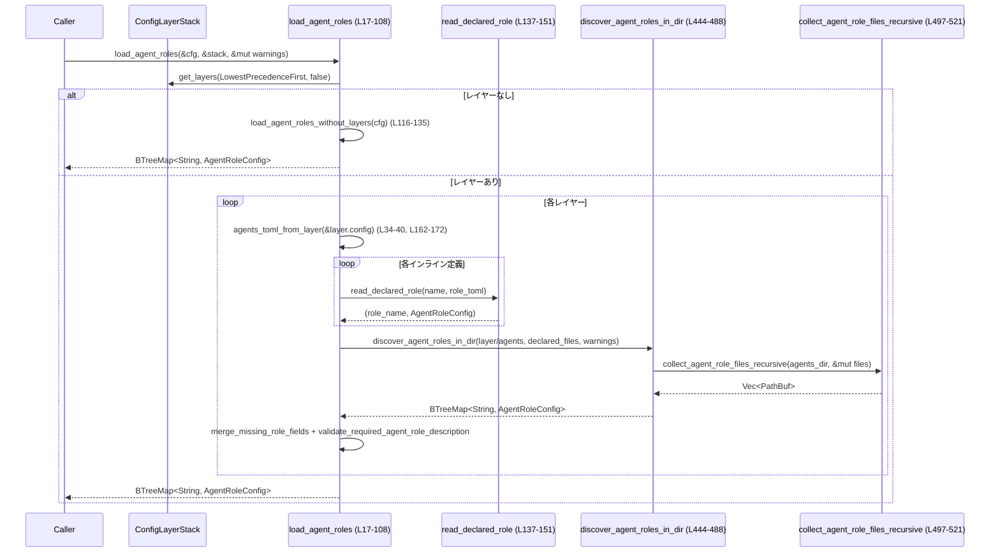

# core/src/config/agent_roles.rs コード解説

---

## 0. ざっくり一言

`core/src/config/agent_roles.rs` は、設定ファイルから **エージェントロール（AgentRole）の定義を読み込み・検証し、`AgentRoleConfig` のマップとしてまとめる** モジュールです。  
レイヤード設定（`ConfigLayerStack`）と単一設定の両方に対応し、TOML ファイルからのロール自動発見も行います。

---

## 1. このモジュールの役割

### 1.1 概要

- このモジュールは **エージェントロール定義の集約と検証** を行うために存在し、主に次の機能を提供します。
  - `ConfigToml` / `AgentsToml` からのロール定義の読み込み（インライン定義 + 外部ファイル参照）  
    （`load_agent_roles` / `load_agent_roles_without_layers`，L17-108, L116-135）
  - `agents/` ディレクトリ以下の `*.toml` からのロール自動発見  
    （`discover_agent_roles_in_dir`，L444-488）
  - ロール名・説明・ニックネーム候補等の正規化とバリデーション  
    （L309-334, L392-441）
  - パースエラーや重複定義などを警告として記録しつつ、起動継続を可能にする仕組み  
    （`push_agent_role_warning`，L110-114）

### 1.2 アーキテクチャ内での位置づけ

このモジュールは、コンフィグ読み込みの一部として動作し、上位の設定ローダから呼び出されます。  
`ConfigLayerStack` からレイヤー情報を受け取り、`ConfigToml` / `AgentsToml` / 個別のエージェントロール TOML ファイルを統合します。

```mermaid
graph TD
  Caller["上位コード（例: Config 初期化）"]
  ConfigToml["ConfigToml（グローバル設定）"]
  LayerStack["ConfigLayerStack"]
  AgentRoles["load_agent_roles (L17-108)<br/>agent_roles.rs"]
  AgentsToml["AgentsToml / AgentRoleToml"]
  Files["agents/*.toml ファイル"]

  Caller -->|ロール読み込み| AgentRoles
  ConfigToml -->|cfg 引数| AgentRoles
  LayerStack -->|get_layers()| AgentRoles
  AgentRoles -->|インライン定義のパース| AgentsToml
  AgentRoles -->|外部ロールファイルのパース| Files
```

### 1.3 設計上のポイント

- **レイヤード設定のマージ**  
  - レイヤーは `LowestPrecedenceFirst` で取得し（L22-25）、後ろのレイヤーが前のレイヤーを上書きする形でマージします。
  - ただし `merge_missing_role_fields`（L153-160）で「新しいレイヤーに無いフィールドは、既存レイヤー側の値で補完」します。
- **エラーと警告の使い分け**
  - レイヤーなしパスでは重複名や不正定義を即 `Err` として返します（例：L125-130）。
  - レイヤーありパスでは多くのコンテンツエラーを警告（`startup_warnings` + `tracing::warn!`）として記録し、そのロールを無視して処理継続します（L34-40, L45-48, L455-461 他）。
  - ファイルシステムレベルのエラー（ディレクトリが読めない等）は `Err` として伝播します（`discover_agent_roles_in_dir` → `collect_agent_role_files`，L451, L490-495）。
- **厳格なフィールド検証**
  - `description` は空文字禁止（L309-320）かつ最終的に必須（L323-334）。
  - `nickname_candidates` は非空・重複禁止・文字種制限（英数 + 空白・ハイフン・アンダースコア）（L392-441）。
  - ロールファイルには `developer_instructions` を必須とするケースがある（L337-359, L243-247）。
- **決定的な順序**
  - `BTreeMap` / `BTreeSet` を多用し、定義の順序がアルファベット順に安定します（例：L30-33, L407-408, L449-452）。
- **並行性**
  - このファイル内ではスレッドや `async` は使用しておらず、すべて同期 I/O です。
  - `unsafe` コードは存在せず、Rust の所有権・借用規則に従ったメモリ安全な処理になっています。

---

## 2. 主要な機能一覧

- レイヤード設定からのロール読み込み: `load_agent_roles`（L17-108）  
- 単一設定からのロール読み込み: `load_agent_roles_without_layers`（L116-135）  
- インライン定義 + 外部ファイルのマージ: `read_declared_role` / `agent_role_config_from_toml`（L137-151, L174-193）  
- ロールファイル（単一ファイル）のパース: `parse_agent_role_file_contents`（L214-294）  
- `agents/` 以下のロールファイル自動発見: `discover_agent_roles_in_dir` + `collect_agent_role_files_*`（L444-488, L490-521）  
- 各種バリデーション・正規化（説明・ニックネーム・開発者向け指示・config_file パス）（L309-390, L392-441）

---

## 3. 公開 API と詳細解説

### 3.1 型一覧（構造体・列挙体など）

| 名前 | 種別 | 可視性 | 役割 / 用途 | 定義位置 |
|------|------|--------|-------------|----------|
| `AgentRoleConfig` | 構造体 | `pub(crate)` 以上（`super` からインポート） | エージェントロールの設定を表す。少なくとも `description: Option<String>`, `config_file: Option<PathBuf>`, `nickname_candidates: Option<Vec<String>>` フィールドを持つことが、このファイルでの利用から分かります（L189-193, L479-483）。 | このファイルには定義がなく、`super` モジュールに存在 |
| `RawAgentRoleFileToml` | 構造体 | モジュール内 private | ロールファイルの生 TOML を `serde` でパースするための一時構造体。未知フィールド禁止（`deny_unknown_fields`）。`ConfigToml` を `flatten` して持ちます（L196-204）。 | `agent_roles.rs:L196-204` |
| `ResolvedAgentRoleFile` | 構造体 | `pub(crate)` | パース済みロールファイルの結果を表現。ロール名・説明・ニックネーム候補と、トップレベルメタ情報削除済みの `config: TomlValue` を保持します（L206-212, L288-293）。 | `agent_roles.rs:L206-212` |

### 3.2 関数詳細（最大 7 件）

以下では、公開 API とコアロジックから 7 関数を選び、詳細を記述します。

---

#### `load_agent_roles(cfg: &ConfigToml, config_layer_stack: &ConfigLayerStack, startup_warnings: &mut Vec<String>) -> std::io::Result<BTreeMap<String, AgentRoleConfig>>`

**概要**

- レイヤード設定（`ConfigLayerStack`）を考慮して、すべてのレイヤーからエージェントロールを読み込み、ロール名 → `AgentRoleConfig` のマップを返します（L17-108）。
- 不正なロール定義や重複は原則として警告にとどめ、そのロールだけをスキップします。

**引数**

| 引数名 | 型 | 説明 |
|--------|----|------|
| `cfg` | `&ConfigToml` | レイヤーが空のときに fallback として利用されるグローバル設定（L26-27）。 |
| `config_layer_stack` | `&ConfigLayerStack` | レイヤー列挙に使用するスタック（L22-25）。 |
| `startup_warnings` | `&mut Vec<String>` | 無視されたロール定義などの警告メッセージを蓄積します（L34-40, L45-48, L75-85, L96-101）。 |

**戻り値**

- `Ok(BTreeMap<String, AgentRoleConfig>)`  
  レイヤーをマージした後のロール定義集合。キーはロール名（最終的な `ResolvedAgentRoleFile.role_name` など）（L91-104）。
- `Err(std::io::Error)`  
  主にファイルシステム関連の致命的エラー（ディレクトリが読めない等）や、レイヤーなしパスにフォールバックした場合の `load_agent_roles_without_layers` からのエラー。

**内部処理の流れ**

1. `config_layer_stack.get_layers(LowestPrecedenceFirst, false)` でレイヤー一覧を取得（L22-25）。
2. レイヤーが空なら、単一設定パス `load_agent_roles_without_layers(cfg)` に切り替え（L26-28）。
3. 各レイヤーごとに以下を実行（L31-105）:
   - `agents_toml_from_layer(&layer.config)` で `agents` セクションを取得・デシリアライズ（L34-40, L162-172）。
   - そのレイヤー内のインラインロール定義を `read_declared_role` で読み込み（L41-66, L137-151）、`layer_roles` に格納。重複名は警告（L53-63）。
   - レイヤーの `config_folder()` があれば `agents/` サブディレクトリから自動発見ロールを読み込み（`discover_agent_roles_in_dir`，L69-88, L444-488）。インライン定義と衝突する名前は警告（L75-85）。
   - `layer_roles` を既存の `roles` にマージ。既存レイヤーの値を fallback として不足フィールドを補完（`merge_missing_role_fields`，L91-95, L153-160）。
   - マージ後のロールごとに `validate_required_agent_role_description` を実行し、`description` が必須か確認。欠如時は警告を出し、そのロールをスキップ（L96-103, L323-334）。
4. 最終的な `roles` を `Ok(roles)` として返却（L107）。

**Examples（使用例）**

レイヤー付き設定からロールを読み込む典型的な起動時コード例です（擬似コード）。

```rust
use std::io::Result;
use std::collections::BTreeMap;
use codex_config::config_toml::ConfigToml;
use crate::config_loader::ConfigLayerStack;
use crate::config::AgentRoleConfig;
use crate::config::agent_roles::load_agent_roles;

fn init_agent_roles(cfg: &ConfigToml, stack: &ConfigLayerStack) -> Result<BTreeMap<String, AgentRoleConfig>> {
    let mut startup_warnings = Vec::new();                                        // 警告格納用ベクタ
    let roles = load_agent_roles(cfg, stack, &mut startup_warnings)?;             // ロールを読み込む（L17-108）

    for warning in &startup_warnings {                                            // 収集された警告をログなどに出力
        eprintln!("startup warning: {warning}");
    }

    Ok(roles)                                                                     // 最終的なロールマップを返す
}
```

**Errors / Panics**

- `discover_agent_roles_in_dir` からの I/O エラー（`collect_agent_role_files` 内の `read_dir`/`file_type` 等）がそのまま `Err` として返ります（L69-74, L451, L490-495, L497-502）。
- レイヤーが空で `load_agent_roles_without_layers` にフォールバックした場合、その内部での重複名や不正定義により `Err` が返ることがあります（L26-28, L125-130）。
- この関数内に `unwrap` / `panic!` はなく、パニック要因はありません。

**Edge cases（エッジケース）**

- レイヤーが 0 個の場合：`load_agent_roles_without_layers` が使われ、挙動がやや厳格になります（重複名は即エラー）（L26-28, L116-135）。
- 一部のレイヤーで `agents` セクションがない場合：そのレイヤーは単に無視されます（L162-165）。
- ロール定義が 1 件も有効でない場合：空の `BTreeMap` が返ります（L30, L107）。

**使用上の注意点**

- `startup_warnings` でコンフィグ品質の問題をすべて拾えるわけではなく、ファイルシステムエラーは `Err` として返る点に注意が必要です。
- ロール名の衝突はレイヤー内では警告として扱われますが、レイヤー間では **後勝ちでマージ** されることを前提にする必要があります（L91-95）。

---

#### `load_agent_roles_without_layers(cfg: &ConfigToml) -> std::io::Result<BTreeMap<String, AgentRoleConfig>>`

**概要**

- レイヤー機能を使わない環境向けに、単一の `ConfigToml` からロール定義を読み込む関数です（L116-135）。
- レイヤー版よりも厳格で、重複名や不正定義をエラーとして返します。

**引数**

| 引数名 | 型 | 説明 |
|--------|----|------|
| `cfg` | `&ConfigToml` | `agents` セクションを含むグローバル設定（L120）。 |

**戻り値**

- `Ok(BTreeMap<String, AgentRoleConfig>)`：正常に読み込んだロールマップ（L134）。
- `Err(std::io::Error)`：重複名や不正なロールファイルなどの致命的エラー（L122-123, L125-130）。

**内部処理の流れ**

1. 空の `roles: BTreeMap` を作成（L119）。
2. `cfg.agents` が存在する場合のみ処理（L120-121）。
3. 各 `(declared_role_name, role_toml)` について `read_declared_role` を呼び出し（L121-122）。
4. `validate_required_agent_role_description` で `description` の必須チェック（L123）。
5. すでに同名のロールが `roles` に存在する場合、`Err(InvalidInput)` を返して処理終了（L125-130）。
6. 最終的な `roles` を返却（L134）。

**Examples**

```rust
use std::io::Result;
use codex_config::config_toml::ConfigToml;
use crate::config::agent_roles::load_agent_roles_without_layers;

fn load_roles_single_config(cfg: &ConfigToml) -> Result<()> {
    let roles = load_agent_roles_without_layers(cfg)?;   // レイヤー無しでロールを読み込む（L116-135）
    println!("loaded {} roles", roles.len());
    Ok(())
}
```

**Errors / Panics**

- 重複ロール名があると `Err(InvalidInput, "duplicate agent role name ...")` が返ります（L125-130）。
- `read_declared_role` やその内部のファイル I/O / パースエラーが `Err` として伝播します（L121-123）。

**Edge cases**

- `cfg.agents` が `None` の場合は空のマップを返します（L120-121, L134）。
- ロールが 1 つでも無効（説明なし・不正ファイル等）だと、その時点で `Err` となり、他のロールは読み込まれません。

**使用上の注意点**

- レイヤー版とは異なり、「不正なロール定義をスキップして残りを続行する」という挙動ではありません。
- コンフィグの検証フェーズなど、「失敗したらすぐに止めたい」文脈での利用に向きます。

---

#### `read_declared_role(declared_role_name: &str, role_toml: &AgentRoleToml) -> std::io::Result<(String, AgentRoleConfig)>`

**概要**

- `AgentsToml` 内の 1 ロール定義を読み込み、必要なら外部ロールファイルを取り込みつつ、最終的なロール名と `AgentRoleConfig` を返します（L137-151）。

**引数**

| 引数名 | 型 | 説明 |
|--------|----|------|
| `declared_role_name` | `&str` | TOML 上で宣言されたロール名（キー名）（L138）。 |
| `role_toml` | `&AgentRoleToml` | 当該ロールの詳細設定（L139）。 |

**戻り値**

- `Ok((role_name, role_config))`  
  最終的なロール名と構成。外部ファイル側に `name` があれば、`role_name` はそれで置き換えられます（L145）。
- `Err(std::io::Error)`  
  不正な `config_file` パス、ロールファイルのパース失敗など。

**内部処理の流れ**

1. `agent_role_config_from_toml` でインライン定義を `AgentRoleConfig` に変換（L141, L174-193）。
2. `role.config_file` が `Some` の場合はそのファイルを `read_resolved_agent_role_file` で読み込み（L143-144, L296-307）。
3. ファイル側で `name` が定義されていれば `role_name` を置き換え（L145）。
4. `description` と `nickname_candidates` については、ファイル側にあればそれを優先し、なければインライン側を保持（L146-147）。
5. `(role_name, role)` を返す（L150）。

**Examples**

```rust
use std::io::Result;
use codex_config::config_toml::AgentRoleToml;
use crate::config::agent_roles::read_declared_role;

// モジュール内（テストなど）からの利用イメージ
fn read_one_role(name: &str, toml: &AgentRoleToml) -> Result<()> {
    let (final_name, cfg) = read_declared_role(name, toml)?;   // インライン + 外部ファイルを統合（L137-151）
    println!("role {name} resolved as {final_name}, file: {:?}", cfg.config_file);
    Ok(())
}
```

**Errors / Panics**

- `agent_role_config_from_toml` での `config_file` 存在確認や説明・ニックネームの正規化エラーがそのまま `Err` として返ります（L141, L174-193）。
- 外部ロールファイルのパースエラーも `Err` として返ります（L143-145, L296-307）。

**Edge cases**

- `config_file` が指定されていない場合、インライン定義のみからロールが構成されます（L143-148）。
- ファイル側に `name` がない場合、最終ロール名は `declared_role_name` のままになります（`parse_agent_role_file_contents` のロジック参照，L249-265）。

**使用上の注意点**

- 外部ファイルの `name` 変更により、インライン側のキー名と最終ロール名が食い違う場合があるため、呼び出し側は戻り値の `final_name` を必ず使用する必要があります。

---

#### `parse_agent_role_file_contents(contents: &str, role_file_label: &Path, config_base_dir: &Path, role_name_hint: Option<&str>) -> std::io::Result<ResolvedAgentRoleFile>`

**概要**

- エージェントロールファイル（単一 TOML）の文字列内容をパースし、`ResolvedAgentRoleFile` に変換します（L214-294）。
- ロール名・説明・ニックネーム・`developer_instructions` を検証し、残りの設定全体を `config: TomlValue` として返します。

**引数**

| 引数名 | 型 | 説明 |
|--------|----|------|
| `contents` | `&str` | ファイル内容（TOML 文字列）（L215, L220）。 |
| `role_file_label` | `&Path` | エラーメッセージに表示するファイルパス（L216, L224-225）。 |
| `config_base_dir` | `&Path` | `AbsolutePathBufGuard` 用のベースディレクトリ（相対パス解決などに利用されると推測されますが、このチャンクからは詳細不明）（L217, L229）。 |
| `role_name_hint` | `Option<&str>` | ロール名のヒント。`None` の場合、ファイル内 `name` 定義を必須とします（L218, L243-247, L249-265）。 |

**戻り値**

- `Ok(ResolvedAgentRoleFile)`：  
  - `role_name`: 最終的なロール名（ファイル `name` または `role_name_hint`）  
  - `description`: 正規化済み説明（または `None`）  
  - `nickname_candidates`: 正規化済み候補一覧（または `None`）  
  - `config`: `name` / `description` / `nickname_candidates` を取り除いた TOML テーブル（L288-293）。
- `Err(std::io::Error)`：パースまたはバリデーションの失敗。

**内部処理の流れ**

1. `toml::from_str(contents)` を用いて `TomlValue` としてパース（L220-228）。
2. `_guard = AbsolutePathBufGuard::new(config_base_dir)` によって（このスコープ中の）パス解決環境を設定（L229）。
3. `role_file_toml.clone().try_into()` により `RawAgentRoleFileToml` へデシリアライズ（L230-238）。
4. `normalize_agent_role_description` で説明を正規化し、空文字を禁止（L239-242, L309-320）。
5. `validate_agent_role_file_developer_instructions` で `developer_instructions` の存在・空文字を検証（L243-247, L337-359）。
6. ロール名を決定：`parsed.name` のトリム後が非空なら採用し、そうでなければ `role_name_hint` を使い、それもなければエラー（L249-265）。
7. `normalize_agent_role_nickname_candidates` でニックネーム候補を検証（L266-272, L392-441）。
8. `role_file_toml` から `name` / `description` / `nickname_candidates` を削除し、残りを `config` として保持（L274-286）。
9. `ResolvedAgentRoleFile { ... }` を返却（L288-293）。

**Examples**

```rust
use std::io::Result;
use std::path::Path;
use codex_config::config_toml::ConfigToml;
use crate::config::agent_roles::{parse_agent_role_file_contents, ResolvedAgentRoleFile};

fn parse_role_str(raw: &str) -> Result<ResolvedAgentRoleFile> {
    let label = Path::new("examples/role.toml");                    // エラー表示用ラベル（L216）
    let base  = Path::new("examples");                              // ベースディレクトリ（L217, L229）
    parse_agent_role_file_contents(raw, label, base, None)          // name 必須モードでパース（L243-247）
}
```

**Errors / Panics**

- TOML 構文エラー: `"failed to parse agent role file at ..."` の `InvalidData` エラー（L220-228）。
- デシリアライズエラー（未知フィールドや型不一致）: `"failed to deserialize agent role file at ..."` の `InvalidData` エラー（L230-238）。
- `description` が空文字: `{field_label} cannot be blank` の `InvalidInput`（L239-242, L309-320）。
- `developer_instructions` が必須なのに欠如 or 空文字: `InvalidInput`（L243-247, L337-359）。
- ロール名が決定できない（name なし & hint なし or 空文字）: `"must define a non-empty`name`"`（L249-265）。
- `config` がテーブルではない: `"must contain a TOML table"` の `InvalidData`（L274-283）。

パニックを起こすコード（`unwrap` 等）は含まれていません。

**Edge cases**

- `role_name_hint` が `Some` の場合、`developer_instructions` は必須ではありません（L243-247, L337-359）。
- `nickname_candidates` が欠如していてもエラーにはならず、`None` として扱われます（L266-272, L392-398）。

**使用上の注意点**

- この関数は `pub(crate)` なので crate 内からテストやツール用に直接呼び出し可能ですが、通常は `read_resolved_agent_role_file` 経由で使われます（L296-307）。
- `ConfigToml` 側のフィールド（`developer_instructions` など）を `flatten` しているため、ロールファイルのトップレベルに未知キーがあるとデシリアライズに失敗します（L196-204, L230-238）。

---

#### `discover_agent_roles_in_dir(agents_dir: &Path, declared_role_files: &BTreeSet<PathBuf>, startup_warnings: &mut Vec<String>) -> std::io::Result<BTreeMap<String, AgentRoleConfig>>`

**概要**

- 指定ディレクトリ以下から `*.toml` ロールファイルを再帰的に探索し、インラインで明示された `config_file` との差分だけを自動登録する機能です（L444-488）。
- 不正なファイルや重複ロール名は警告として扱われます。

**引数**

| 引数名 | 型 | 説明 |
|--------|----|------|
| `agents_dir` | `&Path` | ベースとなる `agents` ディレクトリ（L445）。 |
| `declared_role_files` | `&BTreeSet<PathBuf>` | すでにインライン定義 (`config_file`) で宣言済みのファイルパス群。これらは自動発見から除外します（L446, L451-453）。 |
| `startup_warnings` | `&mut Vec<String>` | 無効なファイルや重複ロール名に関する警告を蓄積します（L458-460, L465-474）。 |

**戻り値**

- `Ok(BTreeMap<String, AgentRoleConfig>)`：このディレクトリで自動発見されたロール定義。
- `Err(std::io::Error)`：ディレクトリの列挙に失敗した場合などの I/O エラー（L451, L490-502）。

**内部処理の流れ**

1. 空の `roles` マップを作成（L449）。
2. `collect_agent_role_files(agents_dir)?` により、再帰的に `*.toml` ファイル一覧を取得（L451, L490-495, L497-521）。
3. 各 `agent_file` について：
   - `declared_role_files` に含まれていればスキップ（L451-453）。
   - `read_resolved_agent_role_file(&agent_file, None)` でロールファイルをパース（L455-457, L296-307）。
     - 失敗した場合は `push_agent_role_warning` で警告を出し、そのファイルをスキップ（L458-461, L110-114）。
   - `role_name` が `roles` 内に重複していれば警告を出しスキップ（L463-476）。
   - それ以外は `AgentRoleConfig` を生成して `roles` に追加（L477-484）。
4. 最終的な `roles` を返す（L487）。

**Examples**

```rust
use std::io::Result;
use std::collections::BTreeSet;
use std::path::PathBuf;
use crate::config::AgentRoleConfig;
use crate::config::agent_roles::discover_agent_roles_in_dir;

fn discover_all_roles() -> Result<()> {
    let dir = PathBuf::from("config/agents");                 // 探索開始ディレクトリ（L445）
    let declared = BTreeSet::new();                           // インラインで宣言済みのファイルがなければ空集合
    let mut warnings = Vec::new();

    let roles: std::io::Result<_> =
        discover_agent_roles_in_dir(&dir, &declared, &mut warnings); // L444-488

    // 警告表示など
    for w in warnings {
        eprintln!("warning: {w}");
    }
    roles.map(|_| ())
}
```

**Errors / Panics**

- `collect_agent_role_files` がディレクトリを読む際のエラー（`read_dir` 等）が `Err` として伝播します（L451, L490-502）。
- 個々のファイルの読み込み・パースエラーは警告に変換され、処理は継続されます（L455-461）。

**Edge cases**

- `agents_dir` が存在しない場合、`collect_agent_role_files_recursive` 側で `ErrorKind::NotFound` を無視するため、結果的に空集合となりエラーにはなりません（L498-501）。
- 同一ディレクトリ内でロール名が重複している場合、後のものは無視されます（L463-476）。

**使用上の注意点**

- `declared_role_files` と同一パスのファイルは必ずスキップされるため、「同じファイルをインラインと自動発見の両方で二重に読み込む」ことはありません（L451-453）。
- ファイル名ではなく **ロール名** で重複検出を行っている点に注意が必要です。

---

#### `normalize_agent_role_nickname_candidates(field_label: &str, nickname_candidates: Option<&[String]>) -> std::io::Result<Option<Vec<String>>>`

**概要**

- ニックネーム候補のリストをトリム・検証し、重複や不正文字を排除するためのユーティリティ関数です（L392-441）。

**引数**

| 引数名 | 型 | 説明 |
|--------|----|------|
| `field_label` | `&str` | エラーメッセージ用ラベル文字列（L393）。 |
| `nickname_candidates` | `Option<&[String]>` | 元の候補リスト。`None` の場合はそのまま `Ok(None)` を返します（L394-398）。 |

**戻り値**

- `Ok(Some(Vec<String>))`：トリム・検証済みの候補一覧。
- `Ok(None)`：候補が指定されていない場合。
- `Err(std::io::Error)`：候補が空、空文字を含む、重複を含む、許可されていない文字を含むとき。

**内部処理の流れ**

1. `nickname_candidates` が `None` なら `Ok(None)`（L396-398）。
2. 空スライスなら `{field_label} must contain at least one name` の `Err`（L400-405）。
3. `normalized_candidates` ベクタと `seen_candidates: BTreeSet` を用意（L407-408）。
4. 各 `nickname` について：
   - `nickname.trim()` を `normalized_nickname` として使用（L410-411）。
   - 空文字なら `cannot contain blank names` エラー（L412-417）。
   - `seen_candidates` に挿入済みなら `cannot contain duplicates` エラー（L419-423）。
   - 文字列のすべての文字が ASCII アルファベット / 数字 / 空白 / `-` / `_` のいずれかであることを確認（L426-435）。
   - 問題なければ `normalized_candidates` に追加（L438）。
5. `Ok(Some(normalized_candidates))` を返却（L441）。

**Examples**

```rust
use std::io::Result;
use crate::config::agent_roles::normalize_agent_role_nickname_candidates;

fn demo() -> Result<()> {
    let raw = vec!["  helper-bot ".to_string(), "Helper_Bot".to_string()];
    let normalized = normalize_agent_role_nickname_candidates(
        "agents.support.nickname_candidates",
        Some(&raw),
    )?;                                                        // L392-441

    assert_eq!(
        normalized,
        Some(vec!["helper-bot".to_string(), "Helper_Bot".to_string()])
    );
    Ok(())
}
```

**Errors / Panics**

- 条件によって `InvalidInput` が返ります（L400-405, L412-417, L419-423, L430-435）。
- パニックを引き起こすコードはありません。

**Edge cases**

- `nickname_candidates == None` → 何も指定されていないという意味で `Ok(None)`（L396-398）。
- 全角文字や絵文字など非 ASCII 文字を含む候補は拒否されます（L426-435）。

**使用上の注意点**

- 候補文字列は **前後の空白が削除** されるため、ユーザー入力をそのまま UI に戻す用途には向きません（表示テキスト用には元の値を別途保持する必要があります）。

---

#### `collect_agent_role_files_recursive(dir: &Path, files: &mut Vec<PathBuf>) -> std::io::Result<()>`

**概要**

- 指定ディレクトリ以下を再帰的に探索し、拡張子 `.toml` を持つファイルをすべて `files` ベクタに追加します（L497-521）。
- ディレクトリが存在しない場合はエラーにせず無視します。

**引数**

| 引数名 | 型 | 説明 |
|--------|----|------|
| `dir` | `&Path` | 探索開始ディレクトリ（L497）。 |
| `files` | `&mut Vec<PathBuf>` | 見つかったファイルパスを追加していく可変ベクタ（L497-498）。 |

**戻り値**

- `Ok(())`：探索成功。
- `Err(std::io::Error)`：`read_dir` や `file_type` 呼び出しが失敗した場合（`NotFound` を除く）（L498-502）。

**内部処理の流れ**

1. `std::fs::read_dir(dir)` を実行し、`NotFound` の場合は `Ok(())` で終了、それ以外のエラーは `Err`（L497-502）。
2. 各エントリについて：
   - `entry.path()` と `entry.file_type()?` を取得（L505-507）。
   - ディレクトリなら再帰呼び出し（L508-510）。
   - ファイルかつ拡張子が `"toml"` なら `files.push(path)`（L512-517）。
3. 最後に `Ok(())` を返却（L521）。

**Examples**

```rust
use std::io::Result;
use std::path::PathBuf;
use crate::config::agent_roles::collect_agent_role_files_recursive;

fn list_toml_files(root: &str) -> Result<Vec<PathBuf>> {
    let mut files = Vec::new();
    collect_agent_role_files_recursive(PathBuf::from(root).as_path(), &mut files)?; // L497-521
    Ok(files)
}
```

**Errors / Panics**

- `read_dir` の段階で `NotFound` 以外の I/O エラーが起きると `Err` が返ります（L498-502）。
- エントリの `file_type()` 取得に失敗した場合も `Err` になります（L505-507）。

**Edge cases**

- ディレクトリが存在しない (`NotFound`) 場合でも `Ok(())` で終了するため、呼び出し側は「ファイルがない」ケースと区別せずに扱えます。
- `.TOML`（大文字）や他の拡張子は対象外です（L512-517）。

**使用上の注意点**

- 見つかったファイル順は探索順に依存しますが、`collect_agent_role_files` 側でソートされるため、最終的な順序は安定します（L490-495）。

---

### 3.3 その他の関数一覧

| 関数名 | 役割（1 行） | 定義位置 |
|--------|--------------|----------|
| `push_agent_role_warning` | エラーを警告文字列と `tracing::warn!` ログに変換し、`startup_warnings` に追加します。 | `agent_roles.rs:L110-114` |
| `agents_toml_from_layer` | レイヤーの生 `TomlValue` から `agents` サブテーブルを取り出し、`AgentsToml` にデシリアライズします。 | `agent_roles.rs:L162-172` |
| `agent_role_config_from_toml` | `AgentRoleToml` から `AgentRoleConfig` を生成し、`config_file` の存在や説明・ニックネームを検証します。 | `agent_roles.rs:L174-193` |
| `read_resolved_agent_role_file` | ファイルパスを読み込んで `parse_agent_role_file_contents` に渡す薄いラッパーです。 | `agent_roles.rs:L296-307` |
| `normalize_agent_role_description` | 説明文字列のトリムと空文字チェックを行うユーティリティです。 | `agent_roles.rs:L309-320` |
| `validate_required_agent_role_description` | ロールに `description` が必ず設定されていることを保証します。 | `agent_roles.rs:L323-334` |
| `validate_agent_role_file_developer_instructions` | ロールファイル内の `developer_instructions` の存在と空文字を検証します。 | `agent_roles.rs:L337-359` |
| `validate_agent_role_config_file` | `config_file` が存在する実ファイルであることをチェックします。 | `agent_roles.rs:L362-390` |
| `collect_agent_role_files` | `collect_agent_role_files_recursive` を呼んで集めたファイルリストをソートして返します。 | `agent_roles.rs:L490-495` |

---

## 4. データフロー

ここでは、`load_agent_roles` が呼び出されたときの代表的なデータフローを示します。

1. 上位コードが `ConfigToml` と `ConfigLayerStack` を用意し、`load_agent_roles` を呼び出します（L17-21）。
2. `ConfigLayerStack::get_layers` からレイヤー一覧を取得（L22-25）。
3. 各レイヤーについて、インラインの `agents` セクションを `agents_toml_from_layer` / `read_declared_role` で処理し（L34-66）、`agents/` ディレクトリから `discover_agent_roles_in_dir` を通じてロールを発見します（L69-88, L444-488）。
4. レイヤー間で `merge_missing_role_fields` によりフィールドを補完しつつ、最終的に `BTreeMap<String, AgentRoleConfig>` を構築します（L91-104, L153-160）。



この図から、エラー/警告の流れは以下のように整理できます。

- **コンテンツエラー**（パース失敗、重複ロールファイルなど）は `push_agent_role_warning` を通じて `startup_warnings` に蓄積（L110-114, L34-40, L45-48, L458-461, L465-474）。
- **I/O エラー**（ディレクトリ列挙失敗など）は `std::io::Result` の `Err` として呼び出し元に伝播します。

---

## 5. 使い方（How to Use）

### 5.1 基本的な使用方法

起動時にすべてのエージェントロールを読み込む基本フローです。

```rust
use std::io::Result;
use std::collections::BTreeMap;
use codex_config::config_toml::ConfigToml;                  // グローバル設定型（L6）
use crate::config_loader::ConfigLayerStack;                 // レイヤースタック（L2）
use crate::config::AgentRoleConfig;                         // ロール設定（super からインポート）
use crate::config::agent_roles::load_agent_roles;           // 本モジュールの公開 API（L17-108）

fn init(cfg: &ConfigToml, stack: &ConfigLayerStack) -> Result<BTreeMap<String, AgentRoleConfig>> {
    let mut warnings = Vec::new();                          // 起動時警告のバッファ
    let roles = load_agent_roles(cfg, stack, &mut warnings)?; // レイヤー付きでロール読み込み

    for w in &warnings {
        // ログ出力やメトリクス送信など、環境に応じて処理
        eprintln!("warning: {w}");
    }

    Ok(roles)
}
```

### 5.2 よくある使用パターン

1. **レイヤー機能なしでの簡易読み込み**

```rust
use std::io::Result;
use codex_config::config_toml::ConfigToml;
use crate::config::agent_roles::load_agent_roles_without_layers;

fn init_single_layer(cfg: &ConfigToml) -> Result<()> {
    let roles = load_agent_roles_without_layers(cfg)?;   // L116-135
    println!("roles: {:?}", roles.keys());
    Ok(())
}
```

1. **テスト内で単一ロールファイルを直接パース**

```rust
use std::io::Result;
use std::path::Path;
use crate::config::agent_roles::parse_agent_role_file_contents;

fn parse_role_for_test() -> Result<()> {
    let contents = r#"
        name = "helper"
        description = "Helper role"
        nickname_candidates = ["helper1"]
        developer_instructions = "Always assist the user."
    "#;

    let file = Path::new("test-helper.toml");             // ラベル（L216）
    let base = Path::new(".");                            // ベースディレクトリ（L217）
    let resolved = parse_agent_role_file_contents(contents, file, base, None)?; // L214-294

    assert_eq!(resolved.role_name, "helper");
    Ok(())
}
```

### 5.3 よくある間違い

```rust
// 間違い例: description を空文字にしている
// agents.support.description = "   "
// → normalize_agent_role_description がエラー（L309-320）

// 正しい例: description を非空にする
// agents.support.description = "Support requests from end-users"
```

```rust
// 間違い例: nickname_candidates が空リスト
// agents.support.nickname_candidates = []
// → "{field_label} must contain at least one name"（L400-405）

// 正しい例: 少なくとも 1 つ以上のニックネームを指定
// agents.support.nickname_candidates = ["support-bot"]
```

```rust
// 間違い例: developer_instructions を省略したロールファイルに role_name_hint を渡さず読む
// read_resolved_agent_role_file(..., None) → parse_agent_role_file_contents(..., role_name_hint = None)
// → "must define `developer_instructions`"（L243-247, L337-359）

// 正しい例: role_name_hint を渡さない場合は developer_instructions をファイルに必ず記述
```

```rust
// 間違い例: agents.<role>.config_file が存在しないパスを指している
// → validate_agent_role_config_file が "must point to an existing file at ..." エラー（L362-378）

// 正しい例: 実際に存在する TOML ファイルへの絶対/相対パスを指定
```

### 5.4 使用上の注意点（まとめ + Bugs/Security/Performance）

**共通の前提条件 / 契約**

- すべてのロールは最終的に **`description` を持つ必要がある**  
  - `normalize_agent_role_description` で空文字禁止（L309-320）。  
  - `validate_required_agent_role_description` で `None` を許さない（L323-334）。
- `nickname_candidates` は（存在する場合）  
  - 非空リストであり（L400-405）、  
  - 空文字を含まず（L412-417）、  
  - トリム後の重複を持たず（L419-423）、  
  - 指定された ASCII 文字セットのみを使う必要があります（L426-435）。

**Bugs / Security 観点での注意点**

- **ファイルパスの検証範囲**  
  - `config_file` は「存在する実ファイル」であることのみを確認しており、パスの場所（例: シンボリックリンクを含む）について追加の制限は行っていません（L362-390）。
  - ただし、これらのパスは通常「信頼済みの設定ファイル」から供給されるため、ユーザー入力由来ではないことが前提と考えられます。
- **レイヤー有無による挙動差**  
  - レイヤーあり: 重複名や一部の不正定義は警告にとどめる（L53-63, L75-85, L458-461, L465-474）。  
  - レイヤーなし: 同種の問題が致命的エラーになる（L125-130, L122-123）。  
  - この差異は仕様ですが、「どちらの関数を使うか」によって障害の扱いが変わることに注意が必要です。
- **パニックの可能性**  
  - このファイル内には `unwrap` / `expect` / `panic!` は存在せず、通常の利用でパニックする経路はコード上からは確認できません。

**並行性 / パフォーマンス**

- すべての I/O は同期的 (`std::fs`) であり、起動時にまとめて実行する用途に向きます（L296-307, L370-378, L497-502）。
- `collect_agent_role_files_recursive` はディレクトリを再帰的に探索するため、`agents/` 以下のファイル構成が極端に大きいと起動時間に影響します（L497-521）。
- スレッドセーフティは Rust の所有権・借用に依存しており、このファイル内で共有可変状態は `startup_warnings` のみですが、これは呼び出し側が &mut で渡すため、同時書き込みはコンパイル時に防止されています（L17-21, L110-114, L444-448）。

**オブザーバビリティ**

- すべての「無視されたロール定義」は `push_agent_role_warning` を通じて
  - `tracing::warn!` ログ（構造化ログシステム）と
  - `startup_warnings` ベクタ
  の両方に記録されます（L110-114）。

---

## 6. 変更の仕方（How to Modify）

### 6.1 新しい機能を追加する場合

**例: AgentRoleConfig に新しいフィールド（例: `priority`）を追加する**

1. **`AgentRoleConfig` 定義の拡張**  
   - このファイルには定義がないため、`super::AgentRoleConfig` の定義元ファイルを特定し、新フィールドを追加します。
2. **TOML からの読み込み追加**  
   - `AgentRoleToml` / `RawAgentRoleFileToml` に対応するフィールドを追加し、`agent_role_config_from_toml`（L174-193）や `parse_agent_role_file_contents`（L214-294）で値を `AgentRoleConfig` にコピーします。
3. **マージロジックの更新**  
   - レイヤーマージ時に「上書き or fallback」をどうするかに応じて、`merge_missing_role_fields`（L153-160）に新フィールドのマージ処理を追加します。
4. **バリデーション**  
   - 必須フィールドにする場合は、`validate_required_agent_role_description` と同様の検証関数を追加し、`load_agent_roles` 内のマージ後チェックに組み込みます（L96-103, L323-334）。

### 6.2 既存の機能を変更する場合

- **影響範囲の確認**
  - レイヤー有無で挙動が異なる関数（`load_agent_roles` vs `load_agent_roles_without_layers`）を変更する場合は、両方の挙動を比較しながら修正する必要があります（L17-108, L116-135）。
  - ファイルフォーマットに関する変更は `RawAgentRoleFileToml`（L196-204）と `AgentsToml` / `AgentRoleToml` の両方に影響します。
- **契約（前提条件・返り値）の維持**
  - `description` の必須性や `developer_instructions` の条件は、外部仕様（ドキュメント等）で重要な契約である可能性が高いです。削除・緩和する場合は、エラー文言（L330-333, L352-357）も含めて慎重に検討する必要があります。
- **テスト**
  - このファイル内にはテストコードは含まれていないため、変更に際しては別モジュール（テストモジュールなど）にユニットテスト / 結合テストを追加することが望ましいです（このチャンクにはテストの所在は現れません）。
- **パフォーマンス**
  - `collect_agent_role_files_recursive` の探索戦略を変更する場合、特に大規模ディレクトリでの挙動（深さ優先か幅優先かなど）と I/O エラー処理（`NotFound` を無視する仕様）を維持するかどうかを意識する必要があります（L497-502）。

---

## 7. 関連ファイル

このモジュールと密接に関係する型・モジュールは次のとおりです。

| パス / モジュールパス | 役割 / 関係 |
|-----------------------|------------|
| `super::AgentRoleConfig` | エージェントロールの設定モデル。`agent_roles.rs` では多数の場所で生成・マージされていますが（例: L189-193, L477-484）、定義自体はこのファイルには含まれません。 |
| `crate::config_loader::ConfigLayerStack` | 設定レイヤーのスタック。`load_agent_roles` でレイヤーを列挙するために使用されます（L2, L22-25）。 |
| `crate::config_loader::ConfigLayerStackOrdering` | レイヤーの列挙順序定数。`LowestPrecedenceFirst` が使用されています（L3, L22-23）。 |
| `codex_config::config_toml::ConfigToml` | グローバル設定全体の型。`RawAgentRoleFileToml` の `config` フィールドとしても利用されます（L6, L203）。 |
| `codex_config::config_toml::AgentsToml` / `AgentRoleToml` | `agents` セクションおよび個々のロール定義を表す型。`agents_toml_from_layer` や `read_declared_role` で利用されます（L4-5, L34-42, L137-141）。 |
| `codex_utils_absolute_path::AbsolutePathBuf` / `AbsolutePathBufGuard` | 絶対パスの扱いやベースディレクトリコンテキストに関するユーティリティ。`config_file` のパス取得やロールファイルパース時に使われています（L7-8, L178-179, L229）。 |
| `tracing` クレート（`tracing::warn!`） | 無視されたロール定義に関する警告ログを出力するために用いられています（L110-113）。 |

このチャンクには、これら関連モジュールの実装は含まれていないため、詳細な構造・挙動はここからは分かりませんが、`agent_roles.rs` はそれらを組み合わせて「エージェントロール設定の読み込み・検証・マージ処理」を提供する位置づけになっています。
